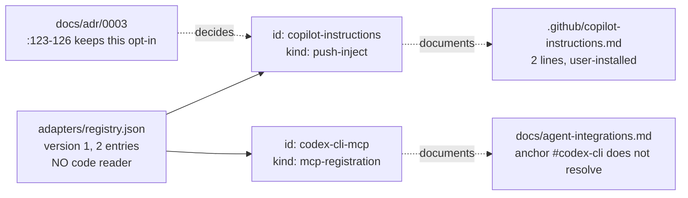
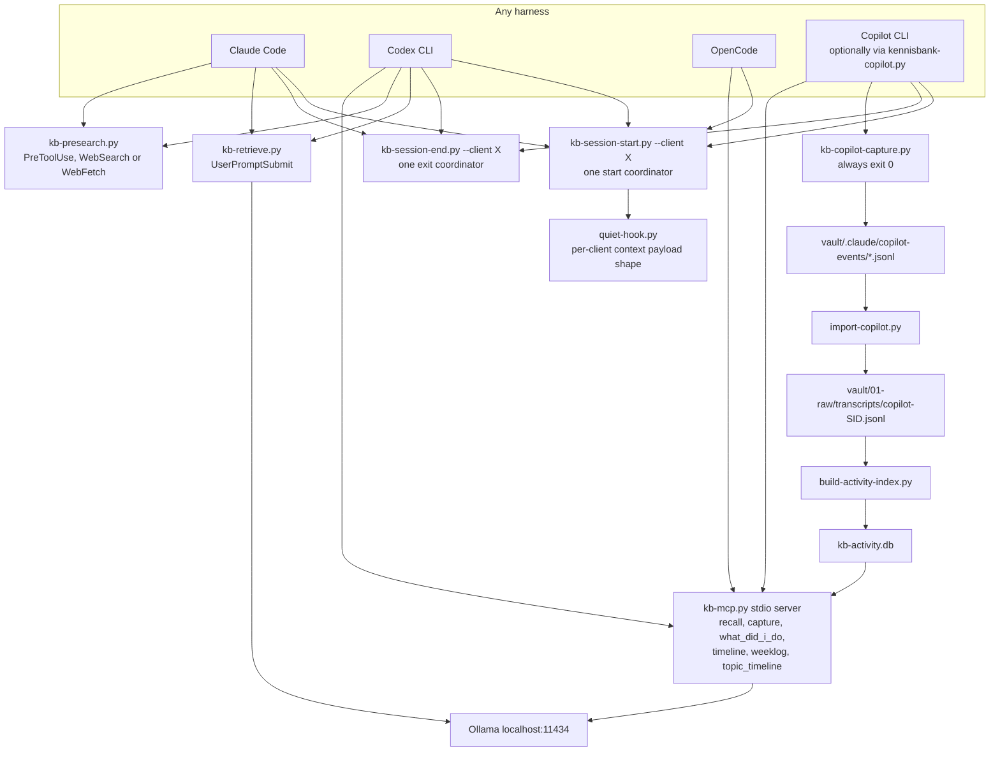

# C4 Code Level — Agent-Harness Adapters

## 1. Overview

| Field | Value |
|---|---|
| **Name** | Agent-harness adapters |
| **Description** | The layer that makes one vault and one stdio MCP server usable from four different agent harnesses: Claude Code, Codex CLI, OpenCode, and the standalone GitHub Copilot CLI. |
| **Location (nominal)** | `adapters/` |
| **Location (implementation)** | `scripts/install-agent-envs.py`, `scripts/_copilot.py`, `scripts/_hooks_manifest.py`, `scripts/register-hooks.py`, plus the Copilot runtime scripts listed in §2.4 |
| **Language(s)** | JSON (the manifest); Python 3 (stdlib only) for every adapter implementation; generated artifacts are JSON, TOML, Markdown, and one JavaScript/Bun plugin |
| **Purpose** | Write and validate *only* KennisBank-namespaced configuration into each harness's own config surfaces, so every harness reaches the same vault, the same MCP server, and the same lifecycle capture — idempotently, non-destructively, and fail-open. |

### 1.1 Scope note — read this before using the document

`adapters/` contains **exactly one file**: `adapters/registry.json` (19 lines). There is no
Python, no per-harness adapter class, and no code in the directory.

Verified by search: **no code reads `adapters/registry.json`.** Grep for `registry` across
`scripts/`, `setup.sh`, and `tests/` returns no hit against this file; the only references
anywhere are prose (`CHANGELOG.md`, `docs/adr/0003-copilot-cli-integration.md:125`,
`docs/research/cross-client-hooks-plugin-architecture.md`, two backlog tasks). Its git history is a
single commit (`fe36afe`, 2026-07-07) and it has never been edited since.

So `adapters/registry.json` is a **declarative index of two opt-in, hand-installed integration
points** — not a plugin registry with a loader. The adapters that actually run live in `scripts/`.
This document therefore covers:

- **§2.1–2.2 — primary scope**: the manifest itself and the artifacts it points at.
- **§2.3–2.5 — extended scope**: the adapter implementation layer in `scripts/`, because "what each
  adapter maps and the contract it must satisfy" is not answerable from the manifest alone. Every
  element outside `adapters/` is labelled with its real path.
- **§3 — the contract** each adapter must satisfy, derived from the code and from
  `docs/adr/0003-copilot-cli-integration.md`.

No vendored third-party code and no generated artifacts exist in `adapters/`.

---

## 2. Code Elements

### 2.1 `adapters/registry.json` — the only file in the directory

Role: a static, human-maintained list of integration points that are **not** installed by
`setup.sh` and must be applied by hand or by an opt-in step.

Schema (all lines cited from the file itself):

| Key | Type | Location | Meaning |
|---|---|---|---|
| `version` | int, `1` | `adapters/registry.json:2` | Manifest format version. No reader validates it. |
| `adapters` | array of objects | `adapters/registry.json:3` | The entries. |
| `adapters[].id` | string | `:5`, `:12` | Stable slug for the integration point. |
| `adapters[].platform` | string | `:6`, `:13` | Harness identifier: `github-copilot`, `codex-cli`. |
| `adapters[].kind` | string | `:7`, `:14` | Mechanism class: `push-inject`, `mcp-registration`. Vocabulary is declared here only; nothing interprets it. |
| `adapters[].path` | string | `:8`, `:15` | Repo-relative file, optionally with a `#anchor`. |
| `adapters[].purpose` | string | `:9`, `:16` | One-line rationale. |

Entries:

1. **`copilot-instructions`** (`adapters/registry.json:4-10`)
   `platform: github-copilot`, `kind: push-inject`, `path: .github/copilot-instructions.md`,
   `purpose: "Native prompt nudge for Copilot agent mode"`.
   Deliberately *not* auto-installed: `docs/adr/0003-copilot-cli-integration.md:123-126` states the
   repo-local `.github/copilot-instructions.md` is left to the user or `copilot init`, and that this
   registry entry "stays a documented push-inject opt-in, not an auto-clobber".

2. **`codex-cli-mcp`** (`adapters/registry.json:11-17`)
   `platform: codex-cli`, `kind: mcp-registration`,
   `path: docs/agent-integrations.md#codex-cli`,
   `purpose: "Register the local MCP server in ~/.codex/config.toml"`.
   This is a pointer to documentation, not to an executable artifact.

**Two accuracy findings on this file** (both verified, both harmless but worth knowing):

- The anchor `#codex-cli` (`adapters/registry.json:15`) does not resolve. The headings in
  `docs/agent-integrations.md` are `## Claude Code` (`:25`), `## Codex` (`:42`), `## OpenCode`
  (`:101`), `## GitHub Copilot CLI` (`:148`), `## Other MCP Clients` (`:247`), `## Hosted Agents`
  (`:287`). The Codex section anchor is `#codex`.
- The manifest is **incomplete relative to reality**. It lists two integration points; the shipped
  adapter layer writes MCP config, hooks, instructions, skills, prompts, commands, an agent profile,
  and a plugin across four harnesses (§2.3–2.4). Do not treat `registry.json` as an inventory.

### 2.2 Artifacts referenced by the manifest

- **`.github/copilot-instructions.md`** (2 lines, whole file) — the `push-inject` payload. Its exact
  text is the contract, so quoted in full:

  ```text
  You have a local KennisBank via MCP tools `recall` and `capture`.
  Call `recall` before searching externally; call `capture` to save a reusable fact.
  ```

  Note it names only 2 of the 6 MCP tools; the four temporal tools
  (`what_did_i_do`, `timeline`, `weeklog`, `topic_timeline`) are absent here but present in the
  user-level Copilot instructions block written by `scripts/_copilot.py:523`.

- **`docs/agent-integrations.md`** — the per-harness surface documentation (paths, config shapes,
  manual MCP snippets for Codex `:89-99`, OpenCode `:125-141`, Copilot `:195-212`, generic MCP
  clients `:255-267`, and the MCP tool list `:271-278`).

- **`docs/adr/0003-copilot-cli-integration.md`** — the authoritative decision record. Sections D1–D7
  (`:69`, `:106`, `:132`, `:177`, `:190`, `:204`, `:223`) are the contract the Copilot adapter
  implements; the cross-platform config-location table is at `:239-247`.

### 2.3 `scripts/install-agent-envs.py` — the cross-agent installer and validator (1159 lines)

Role: the single entry point `setup.sh` calls to install and validate the non-Claude harnesses and to
validate the Claude deploy. Stdlib only (`:4`). Called from `setup.sh:215`, `:219`, `:249`, `:254`
(LLM configuration) and `setup.sh:453-456` (install + validate).

**Module-level declarations**

| Element | Location | Meaning |
|---|---|---|
| `AGENTS = ("claude", "codex", "opencode", "copilot")` | `:39` | The closed set of harness ids. `parse_agents` rejects anything else. |
| `KB_START`, `KB_END` | `:40-41` | HTML-comment markers delimiting the managed block in freeform files. |
| `ROOT_COMMANDS: dict[str, str]` | `:43-60` | 16 command stems → description; the source list for prompts/skills. |
| `NESTED_COMMAND_ALIASES: dict[str, str]` | `:62-66` | `kennisbank/<x>` → flat `kennisbank-<x>` alias for harnesses without nested command names. |
| `MODEL_CHECK_TEXT` | `:68` | Smoke-test prompt; the model must answer `OK`. |
| `OPENROUTER_ENDPOINT`, `OPENROUTER_DEFAULT_MODEL` | `:69-70` | The only non-local provider path. |

**Public / entry-point functions — full signatures**

- `install_codex(repo: Path, vault: Path) -> dict` — `:261`
  Installs shared skills + generated command skills into `~/.agents/skills`, writes
  `~/.codex/prompts/<name>.md` for every command, replaces the AGENTS.md managed block, then calls
  `_ensure_codex_hooks` and `_ensure_codex_mcp`. Returns the written paths.
  Depends on `_codex_home`, `_install_shared_skills`, `_install_command_skills`, `_command_sources`,
  `_prompt_text`, `_replace_block`, `_agent_block`.

- `install_opencode(repo: Path, vault: Path) -> dict` — `:478`
  Same shape for OpenCode: shared skills, `commands/<name>.md`, AGENTS.md block, the generated Bun
  plugin, and `opencode.json`. Depends on `_opencode_home`, `_write_opencode_plugin`,
  `_ensure_opencode_config`.

- `install_copilot(repo: Path, vault: Path) -> dict` — `:578`
  Installs skills into `~/.agents/skills` (shared with Codex/OpenCode — no Copilot-specific skill
  install exists) and delegates *all* config mutation to `_copilot.install`. Returns the four managed
  paths plus the resolved Copilot home. Depends on `scripts/_copilot.py:580`.

- `validate_files(repo: Path, vault: Path, agents: list[str]) -> list[str]` — `:617`
  The hard gate. Returns a list of error strings; empty means pass.
  Always checks 10 deployed vault files (`:619-630`: `kb-mcp.py`, `kb-retrieve.py`,
  `kb-presearch.py`, `quiet-hook.py`, `kb-session-start.py`, `build-activity-index.py`,
  `kb-activity.py`, `kb-activity-eval.py`, `kennisbank-embed.json`, `kennisbank-llm.json`).
  Then per harness: Claude `:634-688`, Codex `:690-752`, OpenCode `:754-765`, Copilot `:767-779`
  (which delegates to `_copilot.validate_config`).
  Depends on `_hooks_manifest.hooks`, `_hooks_manifest.LEGACY_SESSION_START_SCRIPTS`,
  `_hooks_manifest.LEGACY_SESSION_END_SCRIPTS`, `tomllib`, `_copilot.validate_config`.

  *Observed coverage gap (not a crash, worth knowing):* the Claude branch hardcodes four script
  names at `:655-662` instead of iterating `_hooks_manifest.hooks()`. `script_names` is derived from
  the manifest at `:646` but is used only to select entries for the `statusMessage` check. So
  registration of `kb-session-end-recover.py` (SessionStart) and `kb-checkpoint.py` (PreCompact),
  both in the manifest at `scripts/_hooks_manifest.py:14` and `:21`, is never asserted.

- `validate_mcp_runtime(vault: Path, timeout: int = 15) -> list[str]` — `:783`
  Proves the configured stdio server actually works. Two subprocess steps: an import check for
  `mcp`, `mcp.client.stdio`, `mcp.server.fastmcp` (`:790`), then a real client that performs
  `initialize()` + `list_tools()` and requires all six tools
  `{recall, capture, what_did_i_do, timeline, weeklog, topic_timeline}` (`:844`).
  Depends on the `mcp` package (pinned `mcp==1.28.1` in the remediation hint at `:808`), `anyio`,
  and `<vault>/.claude/scripts/kb-mcp.py`.

- `validate_models(vault: Path, timeout: int = 45) -> list[str]` — `:968`
  Local-model smoke tests: `ollama list`, `ollama show <model>`, then HTTP
  `POST http://localhost:11434/api/embeddings` and `/api/generate`; the generate response must
  contain `OK`. If `openrouter` is a configured provider it also calls
  `POST https://openrouter.ai/api/v1/chat/completions` with a bearer key.
  Depends on the `ollama` executable, `urllib.request`, `_resolve_llm_config`,
  `_resolve_embed_config`, `_read_user_secret`.

- `configure_llm(vault: Path, provider: str, model: str | None = None, api_key_env: str = "OPENROUTER_API_KEY", api_key_value: str | None = None) -> dict` — `:912`
  Writes `<vault>/.claude/kennisbank-llm.json`. `provider` must be `ollama` or `openrouter`; anything
  else raises `ValueError` (`:940`). An OpenRouter key is stored out-of-band by `_write_user_secret`.

- `parse_agents(raw: str | None) -> list[str]` — `:1075`
  `None`/empty → `["claude", "codex"]`; `all` → all four; unknown ids → `SystemExit` (`:1083`).

- `main(argv: list[str] | None = None) -> int` — `:1087`
  CLI: `--repo`, `--vault` (required), `--agents`, `--install`, `--validate`, `--configure-llm`,
  `--llm-provider {ollama,openrouter}`, `--llm-model`, `--llm-api-key-env`, `--skip-models`,
  `--json`. Returns 1 when any validation error was collected. Exceptions are captured into
  `validation_errors` rather than raised (`:1136-1137`).

**Helper functions — summarized, not dropped.** All 30 private helpers, with signature and line:

| Signature | Location | Role |
|---|---|---|
| `_norm_path(raw: str | Path) -> Path` | `:73` | Expands `~`/env vars; rewrites Git Bash `/d/...` to `D:/...` on Windows. |
| `_posix(p: Path) -> str` | `:83` | Backslashes → forward slashes for generated config. |
| `_is_windows_like() -> bool` | `:87` | `nt`, `win*`, `msys`, `cygwin`. |
| `_agent_python_argv() -> list[str]` | `:91` | `["py","-3"]` on Windows-like, else `["python3"]`. |
| `_mcp_server_argv(vault: Path) -> list[str]` | `:95` | Interpreter + `<vault>/.claude/scripts/kb-mcp.py`. The single definition of the MCP command. |
| `_shell_join(argv: list[str]) -> str` | `:99` | Platform-correct quoting (`shlex.quote` on POSIX). |
| `_home() -> Path` | `:113` | `USERPROFILE` → `HOME` → `Path.home()`. |
| `_codex_home() -> Path` | `:118` | `CODEX_HOME` if non-blank, else `~/.codex`. The `.strip()` guard is deliberate (`:119-121`): an empty env var would otherwise resolve to `Path(".")`. |
| `_opencode_home() -> Path` | `:126` | `OPENCODE_CONFIG_DIR` else `~/.config/opencode`. |
| `_read_text(path: Path) -> str` | `:131` | `""` on missing file. |
| `_write_text(path: Path, text: str) -> None` | `:138` | mkdir -p + UTF-8 write. |
| `_copytree(src: Path, dst: Path) -> None` | `:143` | `dirs_exist_ok=True` skill copy. |
| `_replace_block(path: Path, block: str) -> bool` | `:148` | Marker-scoped managed block; appends when absent. Returns changed. |
| `_agent_block(client: str, vault: Path) -> str` | `:162` | The AGENTS.md text: pins `KENNISBANK_VAULT`, forbids the `~/KennisBank` default, states the fail-open rule. |
| `_command_sources(repo: Path) -> list[tuple[str, Path, str]]` | `:183` | `(name, source .md, description)` for root commands and nested aliases. |
| `_prompt_text(name, source, description, target_agent) -> str` | `:196` | Frontmatter + vault instruction + the command body, for Codex/OpenCode prompts. |
| `_command_skill_text(name, source, description) -> str` | `:210` | Same, as a `SKILL.md`. |
| `_install_shared_skills(repo: Path, skills_root: Path) -> list[Path]` | `:226` | Copies `repo/skills/*/SKILL.md` trees. |
| `_install_command_skills(repo: Path, skills_root: Path) -> list[Path]` | `:240` | Generates command skills, but a hand-authored skill of the same name always wins (`:247-251`). |
| `_codex_command(script: str, vault: Path, event: str) -> str` | `:286` | Builds a Codex hook command; coordinators get `--client codex`, silent scripts route through `quiet-hook.py`. |
| `_hook_group(script, vault, event, matcher=None, timeout=60) -> dict` | `:305` | One Codex hook group. |
| `_ensure_codex_hooks(path: Path, vault: Path) -> None` | `:324` | Prunes legacy SessionStart/Stop entries, de-duplicates the coordinator, then upserts the desired map. Raises `ValueError` on a malformed file. |
| `_is_kennisbank_hook_command(command: str) -> bool` | `:437` | Ownership test: the command must contain `.claude/scripts/` *and* a known KennisBank script basename. |
| `_toml_quote(value: str) -> str` | `:448` | TOML string escaping. |
| `_ensure_codex_mcp(path: Path, vault: Path) -> None` | `:452` | Regex-replaces or appends the `[mcp_servers.kennisbank]` + `.env` blocks in `config.toml`. |
| `_write_opencode_plugin(path: Path, vault: Path) -> Path` | `:503` | Emits `kennisbank.js`: on `session.idle` runs 6 index/notify scripts; on `session.updated` runs `archive-transcript.py` and `kb-usage-scan.py`; every call wrapped in try/catch (fail-open). |
| `_ensure_opencode_config(path, vault, plugin) -> Path` | `:549` | Key-scoped merge of `mcp.kennisbank`, sets `autoupdate: false`, allows 3 skills by default. |
| `_hook_entries(data: dict)` | `:599` | Generator over every hook entry dict in a settings/hooks document. |
| `_json_file(path: Path) -> dict` | `:875` | Fail-open JSON read → `{}`. |
| `_secrets_path() -> Path` | `:885` | `KENNISBANK_SECRETS_FILE` else `~/.config/kennisbank/secrets.json`. |
| `_write_user_secret(name: str, value: str) -> Path` | `:892` | Writes the secret and chmods `0600` (best effort). |
| `_read_user_secret(name: str) -> str` | `:904` | Env var first, then the secrets file. |
| `_resolve_llm_config(vault: Path) -> dict` | `:945` | Merges `kennisbank-llm.json` with `KB_LLM_*` env overrides. |
| `_resolve_embed_config(vault: Path) -> dict` | `:959` | Same for `kennisbank-embed.json` / `KB_EMBED_*`. |

### 2.4 `scripts/_copilot.py` — the Copilot config adapter (798 lines)

Role: the hermetically testable Copilot layer that implements ADR-0003 D1–D6. Stdlib only, no
module-level `sys.path` mutation, so tests can import it standalone (`:19-22`). Has its own CLI.

**Module-level declarations**

| Element | Location | Meaning |
|---|---|---|
| `KB_START`, `KB_END` | `:36-37` | Same markers as `install-agent-envs.py` (duplicated by design — no import coupling). |
| `MIN_VERSION = (1, 0, 70)` | `:40` | Supported Copilot CLI floor; below it, doctor reports `version_old`. |
| `BACKUP_SUFFIX = ".kbak"` | `:191` | One rolling backup per freeform file. |
| `_CAPTURE_SCRIPT = "kb-copilot-capture.py"` | `:307` | Registered once, referenced by three events. |
| `_LEGACY_SESSION_START` | `:308-317` | 8 script names pruned from `sessionStart` on upgrade. |
| `_MANAGED_HOOK_SCRIPTS` | `:318-323` | Ownership set used by `_remove_hooks`. |
| `_LEGACY_SESSION_END` | `:324-328` | 3 script names pruned from `sessionEnd`. |

**Public functions — full signatures**

Detection:
- `copilot_home() -> Path` — `:82`. `COPILOT_HOME` if non-blank, else `~/.copilot`. This override is what makes the whole Copilot test suite hermetic.
- `find_binary() -> "str | None"` — `:99`. `KENNISBANK_COPILOT_BIN` overrides `shutil.which("copilot")`.
- `binary_version(binary: "str | None" = None, timeout: int = 20) -> "tuple | None"` — `:113`. Runs `copilot --version`; returns `None` on the Windows/nvm4w "no platform package found" case.
- `detect(vault: "Path | None" = None) -> dict` — `:134`. JSON-serializable snapshot: 13 keys including `installed`, `version_ok`, `platform_binary_ok`, `kennisbank_registered`, `hooks_present`. Note the `vault` parameter is accepted but not used in the body.

Idempotent primitives (ADR D6):
- `replace_managed_block(path: Path, block: str, *, dry_run: bool) -> dict` — `:216`. Marker-scoped rewrite of a freeform file; backs up first; returns a result dict.
- `merge_json_key(path: Path, top_key: str, name: str, value: dict, *, dry_run: bool) -> dict` — `:237`. `data[top_key][name] = value` with an equivalence check, so a repeat run reports `skipped`.
- `remove_json_key(path: Path, top_key: str, name: str, *, dry_run: bool) -> dict` — `:261`.
- `remove_managed_block(path: Path, *, dry_run: bool) -> dict` — `:273`.

Surface writers:
- `ensure_mcp(home: Path, vault: Path, *, dry_run: bool = False) -> dict` — `:298`. Writes `mcpServers.kennisbank` into `<home>/mcp-config.json` with `type: "local"`, `command`/`args` from `_mcp_server_argv`, literal `env`, `tools: ["*"]`.
- `ensure_hooks(home: Path, vault: Path, *, dry_run: bool = False) -> dict` — `:426`. Writes `<home>/hooks/kennisbank.json` as `{"version":1,"hooks":{<event>:[entry...]}}`. Prunes legacy entries, enforces one coordinator per lifecycle event, then upserts by `(script, arg)` so re-runs never duplicate and unrelated user entries survive.
- `ensure_instructions(home: Path, vault: Path, *, dry_run: bool = False) -> dict` — `:532`. Managed block in `<home>/copilot-instructions.md`.
- `ensure_agent_profile(home: Path, vault: Path, *, dry_run: bool = False) -> dict` — `:566`. Writes `<home>/agents/kennisbank.agent.md`. If the file exists **without** the KennisBank marker it is left untouched and reported `skipped` (`:571-574`). The `.agent.md` extension is mandatory (`:567-568`).

Orchestration and validation:
- `install(vault: Path, *, home: "Path | None" = None, dry_run: bool = False) -> dict` — `:580`. Runs the four `ensure_*` writers; returns `{home, vault, dry_run, results, changed}`.
- `remove(vault: Path, *, home: "Path | None" = None, dry_run: bool = False) -> dict` — `:599`. Surgical rollback of exactly those four surfaces.
- `validate_config(vault: Path, *, home: "Path | None" = None) -> list` — `:658`. Login-free hard errors: `mcpServers.kennisbank` present, its `env.KENNISBANK_VAULT` equals the active vault, its `args` mention `kb-mcp.py`, each desired hook appears exactly once, no legacy entries, instructions and profile exist.
- `probe_cli(vault: Path, *, home: "Path | None" = None, timeout: int = 25) -> dict` — `:709`. Runs `copilot mcp list` under an explicit `COPILOT_HOME` and classifies the outcome as one of `copilot_missing`, `platform_binary_missing`, `mcp_list_failed`, `not_logged_in`, `mcp_not_listed`, `version_old`, `ok`.
- `_main(argv=None) -> int` — `:761`. CLI: `{detect,install,remove,probe,validate}` with `--vault`, `--dry-run`, `--json`; output is always JSON. `setup.sh:117` calls `_copilot.py detect --json`. The `probe` branch resolves a missing `--vault` through `_vaultpath.vault_root()` (`:777`), honoring ADR-0002.

**Helpers — summarized, not dropped:** `_kb_env(vault) -> dict` (`:44`, the four pinned env vars),
`_is_windows_like` (`:55`), `_norm_path` (`:59`), `_posix` (`:69`), `_win` (`:73`), `_home` (`:77`),
`_mcp_server_argv` (`:92`), `_version_tuple` (`:108`), `_read_text` (`:164`), `_write_text` (`:171`),
`_read_json` (`:176`, fail-open → `{}`), `_write_json` (`:187`), `_backup` (`:194`),
`_result(path, action, backed_up=None, detail="") -> dict` (`:205`, the
`created|updated|skipped` outcome record that replaces a bare bool — ADR D6), `_mcp_server_spec`
(`:287`), `_hook_timeout(script)` (`:331`, lazily imports `_hooks_manifest` and falls back to
`{240, 90, 30}` so a missing manifest cannot break an install), `_desired_hooks` (`:351`),
`_hook_command` (`:367`), `_hook_entry` (`:399`), `_hook_matches` (`:416`), `_instructions_block`
(`:511`), `_agent_profile_text` (`:539`), `_remove_hooks` (`:613`).

`_hook_command` (`:367-396`) carries the single most important line in the Copilot adapter: it
appends `; exit 0` to every generated command (`:396`) so a KennisBank `preToolUse` hook can never
return Copilot's deny exit code 2.

### 2.5 `scripts/_hooks_manifest.py` — the single source of truth for hooks (73 lines)

Role: one declarative list consumed by all three installation paths (`register-hooks.py` for Claude,
`install-agent-envs.py` for Codex, `_copilot.py` for Copilot) plus `doctor.sh` and the migrations.

| Element | Location | Content |
|---|---|---|
| `HOOKS: list[tuple[str, str, str | None]]` | `:12-22` | `("SessionStart","kb-session-start.py",None)`, `("SessionStart","kb-session-end-recover.py",None)`, `("UserPromptSubmit","kb-retrieve.py",None)`, `("SessionEnd","kb-session-end.py",None)`, `("PreToolUse","kb-presearch.py","WebSearch|WebFetch")`, `("PreCompact","kb-checkpoint.py",None)`. |
| `TIMEOUTS: dict[str, int]` | `:35-43` | `kb-session-start.py: 240`, `kb-session-end.py: 90`, `kb-retrieve.py: 30`, `kb-presearch.py: 30`, `kb-session-end-recover.py: 30`, `kb-copilot-capture.py: 30`, `kb-checkpoint.py: 15`. |
| `DEFAULT_TIMEOUT = 30` | `:45` | Fallback ceiling. |
| `timeout(script: str) -> int` | `:48` | The only sanctioned way to obtain a hook timeout. |
| `SILENT_HOOK_SCRIPTS = frozenset()` | `:53` | Currently empty; the `quiet-hook.py` routing branch is therefore dormant for Codex/Claude. |
| `LEGACY_SESSION_END_SCRIPTS` | `:55-58` | `archive-transcript.py`, `kb-usage-scan.py`. |
| `LEGACY_SESSION_START_SCRIPTS` | `:61-68` | The 6 index/notify scripts replaced by the one coordinator. |
| `hooks() -> list` | `:71` | Returns a **copy**, so consumers may mutate freely. |

`PreCompact` is Claude-only by explicit decision (`:18-21`): Codex and Copilot have no equivalent
event, and `install-agent-envs.py` therefore deliberately omits it from their hook maps.

### 2.6 `scripts/register-hooks.py` — the Claude Code adapter (298 lines)

Role: idempotently register the manifest into the user's global `~/.claude/settings.json`. Called
once by `setup.sh` after the script layer is deployed.

- `interpreter() -> str` — `:37`. `"py -3"` on `os.name == "nt"`, else `"python3"`.
- `build_command(script_path: str, interp: str | None = None, *, quiet: bool = False, event: str = "SessionStart") -> str` — `:45`. Coordinators (`kb-session-start.py`, `kb-session-end.py`, `kb-session-end-recover.py`) get `--client claude`; `quiet=True` routes through `quiet-hook.py`.
- `load_settings(path) -> dict` — `:77`. `{}` for missing/blank; raises `ValueError` on unparseable JSON or a non-object, so a hand-edited config is never clobbered.
- `save_settings(path, settings: dict) -> None` — `:99`.
- `ensure_hook(settings: dict, event: str, script_path: str, matcher=None, *, quiet: bool = False, timeout: "int | None" = None) -> bool` — `:105`. Matches on script basename. Self-heals a stale path while **preserving the existing interpreter prefix** (`:146`), heals a missing matcher, drops `statusMessage`, and only *fills in* a missing timeout — never overwrites a user's own value (`:154-160`).
- `register_manifest(settings: dict, vault_root: str) -> bool` — `:172`. Sets `env.KENNISBANK_VAULT`, prunes legacy SessionStart/SessionEnd entries, enforces one coordinator each, then registers every manifest row against `<vault>/.claude/scripts/`. Loads `_hooks_manifest` via `importlib.util.spec_from_file_location` (`:174-179`) rather than an import, so it works from any deploy copy.
- `main(argv=None) -> int` — `:251`. Two forms: `<settings.json> --manifest <vault_root>`, or `<settings.json> <EVENT> <script_path> ...`. Exit 1 on unparseable settings, 2 on usage error.
- Helper: `_existing_prefix(command: str) -> str | None` — `:70`. Extracts the interpreter prefix that `ensure_hook` preserves.

### 2.7 Copilot runtime adapters (in `scripts/`, one role line + entry points)

These are the pieces that make Copilot activity land in the vault. They belong to the `scripts/`
container but are part of the adapter contract, so their entry points are listed here.

**`scripts/kennisbank-copilot.py` (243 lines) — the launcher.** ADR D4: a trivial exec, not a proxy.
- `main(argv=None) -> int` — `:227`. Splits argv, resolves the vault, dispatches to doctor / dry-run / print-env / launch.
- `split_args(argv)` — `:207`. Consumes `--kb-doctor`, `--kb-dry-run`, `--kb-print-env`, `--no-capture` (constants `:48-51`); everything else passes through in order.
- `resolve_vault()` — `:73`. `KENNISBANK_VAULT` else `_vaultpath.vault_root()` (`:82-83`) — ADR-0002 compliant.
- `compute_env_overrides(vault, base_env, no_capture)` — `:86`. `KENNISBANK_VAULT` is **pinned** (always overwritten); `KB_LLM_*` are set-if-absent.
- `build_child_env(vault, base_env, no_capture)` — `:103`.
- `light_validate(vault)` — `:111`. Returns warning strings; never raises, never blocks.
- `install_hint() -> str` — `:124`. Includes the Windows/nvm4w missing-platform-binary remedy.
- `launch(binary, args, env)` — `:140`. The monkeypatch seam; `subprocess.run` returning `proc.returncode` for exit-code fidelity on both POSIX and Windows.
- Helpers summarized: `_mask` (`:67`, masks credential-looking keys), `_run_doctor` (`:152`), `_run_dry_run` (`:169`), `_run_print_env` (`:188`), `_run_launch` (`:194`, exits 127 when the binary is absent).

**`scripts/kb-copilot-capture.py` (240 lines) — the Copilot hook-payload adapter.** Parses Copilot's
single-line stdin JSON, redacts, and appends one event line to
`<vault>/.claude/copilot-events/<sid>.jsonl`. Always exits 0.
- `main(argv=None) -> int` — `:217`. Flags `--event`, `--vault`, `--out`, `--print-path`. The whole body is inside a bare `try/except` (`:232-235`).
- `run(event_name: str, payload: dict, *, vault: "Path | None" = None, out: "Path | None" = None) -> "Path | None"` — `:201`. Returns `None` on any failure or when capture is disabled.
- `build_event(event_name: str, payload: dict) -> dict` — `:126`. Emits schema `kb-copilot-event/1` (`:35`) with `agent: "github-copilot-cli"` (`:36`). Accepts both camelCase and snake_case payload keys via `_get` (`:119`).
- `output_path(vault: Path, session_id: str) -> Path` — `:167`.
- `append_event(path: Path, event: dict) -> None` — `:171`.
- `redact_text(text: str) -> str` (`:82`), `redact_value(key: str, value)` (`:87`), `redact_args(raw) -> str` (`:99`) — secret scrubbing on keys and on freeform text, every value capped at `MAX_VALUE = 600` (`:38`).
- Helpers summarized: `_vault` (`:55`), `_now_iso` (`:60`), `_to_iso` (`:64`, normalizes Copilot's Unix-ms *or* ISO timestamps), `_get` (`:119`), `_safe_name` (`:159`, path-traversal-safe filename), `_read_stdin` (`:177`, tolerates a stray trailing line), `_capture_disabled` (`:196`, honors `KENNISBANK_COPILOT_NO_CAPTURE`).

**`scripts/import-copilot.py` (238 lines) — the transcript importer.** Normalizes staged events into
`<vault>/01-raw/transcripts/copilot-<sid>.jsonl` in the generic shape the activity index reads.
- `main(argv=None) -> int` — `:205`. Flags `--vault`, `--active-window` (default 120.0s), `--include-active`, `--include-history`, `--events-dir`, `--json`.
- `import_hooks(vault: Path, *, active_window: float, include_active: bool, events_dir: Path | None = None, now: float | None = None) -> dict` — `:150`. Default source; skips staging files younger than `active_window` unless `--include-active`.
- `import_history(vault: Path, *, home: Path | None = None) -> dict` — `:182`. Opt-in, best-effort read of Copilot's own `session-state/` and `history-session-state/`.
- Helpers summarized: `_vault` (`:44`), `_copilot_home` (`:49`), `_redact` (`:57`), `_event_id` (`:61`, sha256 of `session_id|timestamp|event|message`, 24 hex chars — the dedupe key), `_read_jsonl` (`:66`), `_normalize_hook_event` (`:85`), `_normalize_history_event` (`:102`, drops anything without a usable message so an unknown schema cannot corrupt the rawlog), `_write_transcript` (`:125`, merge + dedupe, returns `(path, new, dup)`).

**`scripts/quiet-hook.py` (110 lines) — the output-suppression adapter.** Runs a maintenance hook,
captures its stdout/stderr, and emits agent context **only** when state changed or a warning
appeared.
- `main(argv: list[str] | None = None) -> int` — `:72`. Consumes leading `--client`/`--event`; always returns 0.
- Helpers summarized: `_changed_count` (`:18`), `_relevant_report` (`:23`, per-script relevance rules for `build-embed-index.py`, `build-kb-index.py`, `build-activity-index.py`), `_emit_context` (`:49`, **the per-harness payload shape**: Claude gets `suppressOutput` + `hookSpecificOutput.additionalContext`, Copilot gets a bare `additionalContext`, everything else gets `suppressOutput` + `additionalContext`).

**`scripts/agent-status.py` (135 lines) — the cross-agent status reporter.** Reads on-disk config as
the source of truth; introduces no new runtime surface. Called from `setup.sh:481`.
- `main(argv=None) -> int` — `:120`. Flags `--agents` (default `all`), `--vault`, `--json`.
- `collect(agents: list) -> dict` — `:85`. Returns `{agents, configured, total, mcp_agents}`.
- `render(report: dict) -> str` — `:95`. ASCII marks only (`ok` / `!!` / `--`) because the Windows cp1252 console cannot encode `✓` — ADR-0002.
- Per-harness probes: `_status_claude` (`:36`, looks for `kb-retrieve.py` + `KENNISBANK_VAULT` in `settings.json`), `_status_codex` (`:44`, `[mcp_servers.kennisbank]` in `config.toml`), `_status_opencode` (`:53`), `_status_copilot` (`:63`, delegates to `_copilot.detect`). Dispatch table at `:79-82`.
- Helpers summarized: `_home` (`:25`), `_read` (`:29`), `_parse_agents` (`:111`).

---

## 3. The adapter contract

Every harness adapter must satisfy all of the following. Each item cites where it is implemented and
where it is enforced.

| # | Contract rule | Implemented | Enforced |
|---|---|---|---|
| C1 | **One MCP server, one name, one path.** Exactly one server named `kennisbank`, command built from a single helper, pointing at `<vault>/.claude/scripts/kb-mcp.py`. | `install-agent-envs.py:95`, `_copilot.py:92` | `install-agent-envs.py:708-711` (Codex: exactly one block), `_copilot.py:675` (args mention `kb-mcp.py`), `validate_mcp_runtime:783` |
| C2 | **Vault pinning, no interpolation.** Every generated config carries a literal `KENNISBANK_VAULT`; no `${VAR}` (Copilot does not interpolate). Scripts resolve the vault only via `_vaultpath.vault_root()` — ADR-0002. | `_copilot.py:44-50`, `install-agent-envs.py:462-465`, `:564-568`, `kennisbank-copilot.py:82-83`, `_copilot.py:777` | `install-agent-envs.py:663` (Claude env), `:717-720` (Codex), `_copilot.py:673` (Copilot vault match) |
| C3 | **Interpreter convention.** `py -3` on Windows-like platforms, `python3` elsewhere; existing prefixes are preserved on re-registration. | `install-agent-envs.py:91`, `_copilot.py:93`, `register-hooks.py:42`, `:146` | `tests/test_register_hooks.py:35-37` (interpreter selection per platform), `:50-56` (stale path refreshed while the `py -3` prefix survives) |
| C4 | **Idempotent, key-scoped, non-destructive mutation.** Structured config → merge one namespaced key with an equivalence check. Freeform files → marker-delimited managed block with a `.kbak` backup. Unmanaged content is never rewritten. | `_copilot.py:237` (`merge_json_key`), `:216` (`replace_managed_block`), `:194` (`_backup`), `install-agent-envs.py:148`, `:549` | `_copilot.py:571-574` (unmarked user profile left intact); ADR-0003 D6 (`docs/adr/0003-copilot-cli-integration.md:204-221`); `tests/test_agent_envs_install.py:229` (Copilot install idempotent), `:161` (MCP repair does not duplicate the env subtable), `tests/test_copilot_e2e.py:120` (Copilot install does not regress Codex) |
| C5 | **Exactly one start coordinator and one exit coordinator per harness.** Legacy fan-out scripts must be pruned during upgrade, then replaced by the coordinator. | `register-hooks.py:187-236`, `install-agent-envs.py:335-387`, `_copilot.py:442-480` | `install-agent-envs.py:683-684` (Claude), `:732-733`, `:745-746` (Codex), `_copilot.py:688-699` (Copilot); `tests/test_agent_envs_install.py:92` (Codex consolidation), `tests/test_hooks_manifest.py:46-54` (one `SessionEnd` coordinator + the legacy set) |
| C6 | **Fail-open, always.** A hook must never block the harness. Missing Ollama, a script error, or a malformed payload skips the side effect and exits 0. A `preToolUse` hook must never emit a deny decision. | `_copilot.py:396` (`; exit 0`), `kb-copilot-capture.py:232-236`, `quiet-hook.py:104-106`, `install-agent-envs.py:521-523` (OpenCode plugin try/catch) | ADR-0003 D3 (`docs/adr/0003-copilot-cli-integration.md:166-176`); `tests/test_copilot_capture.py:132`, `:137` ("must fail open (exit 0) on garbage"), `:141`; `tests/test_quiet_hook.py:28`, `:57` |
| C7 | **Timeouts come from one place.** No adapter may declare its own number, and a user's own value is never overwritten. | `_hooks_manifest.py:48` consumed at `install-agent-envs.py:390`, `register-hooks.py:245`, `_copilot.py:331` | `tests/test_register_hooks.py:182`, `:197` (registered timeout equals `man.timeout("kb-retrieve.py")`), `:206` (an existing user timeout of 25 is preserved). Note: `tests/test_hooks_manifest.py` asserts events, matchers, copy semantics and coordinator uniqueness — it does **not** assert `TIMEOUTS`. |
| C8 | **Hermetic and login-free.** Config home must be overridable (`COPILOT_HOME`, `CODEX_HOME`, `OPENCODE_CONFIG_DIR`) so tests never touch the real home, and install/validate must work without a cloud login. | `_copilot.py:82-89`, `install-agent-envs.py:118-128` | `_copilot.py:731-732` (probe runs under an explicit `COPILOT_HOME`); ADR-0003 (`:39-43`, `:257-261`) |
| C9 | **Runtime proof, not just file presence.** MCP registration is only accepted after a real `initialize()` + `list_tools()` handshake that finds all six tools. | `install-agent-envs.py:783-872` | `install-agent-envs.py:1132-1133` (runs whenever codex/opencode/copilot is selected); `tests/test_agent_envs_install.py:264` (missing dependency), `:275` (handshake failure), `:291` (success) |
| C10 | **Capture carries provenance, is deduped, and is redacted before disk.** Every imported event is stamped with its agent, keyed by a content hash, and secret-scrubbed. | `kb-copilot-capture.py:36`, `:40-52`, `import-copilot.py:36`, `:61` | `tests/test_copilot_capture.py:51` (`agent == "github-copilot-cli"`), `:67`, `:75` (redaction to `***`); `tests/test_copilot_import.py:75` (agent stamp on every imported event), `:78-89` (re-import yields 0 new / 1 duplicate), `:91-98` (active-session skip) |
| C11 | **Surgical rollback.** Everything written must be removable without touching user content. | `_copilot.py:599` (`remove`), `:613` (`_remove_hooks`, deletes the file only when nothing of anyone's is left) | ADR-0003 Rollback (`docs/adr/0003-copilot-cli-integration.md:283-287`) |

### 3.1 What each adapter maps

| Harness | Skills | Commands / prompts | Instructions | Hooks | MCP | Config home override |
|---|---|---|---|---|---|---|
| **Claude Code** | `~/.claude/skills/<name>/SKILL.md` (installed by `setup.sh`, validated at `install-agent-envs.py:639-641`) | `~/.claude/commands/*.md` (`:636-638`) | `CLAUDE.md` in the vault | `~/.claude/settings.json` via `register-hooks.py:172`; events `SessionStart`, `UserPromptSubmit`, `SessionEnd`, `PreToolUse`, `PreCompact` | **not registered by this layer** — Claude gets KennisBank through the hooks path. `agent-status.py:40` hardcodes `mcp: False` and `install-agent-envs.py:1132` runs the handshake only for codex/opencode/copilot. A user may of course have registered `kennisbank` in their own Claude MCP config; nothing here writes or reads it. | — |
| **Codex CLI** | `~/.agents/skills/<name>/SKILL.md` (`install-agent-envs.py:263`) | `~/.codex/prompts/<name>.md`, invoked as `/prompts:<name>` (`:269-272`) | `~/.codex/AGENTS.md` managed block (`:274`) | `~/.codex/hooks.json` (`:275`); events `SessionStart`, `UserPromptSubmit`, `Stop`, `PreToolUse` — note **`Stop`**, not `SessionEnd` (`:391-406`), and no `PreCompact` | `~/.codex/config.toml`, `[mcp_servers.kennisbank]` (`:276`, `:452`) | `CODEX_HOME` |
| **OpenCode** | `~/.agents/skills/` (shared) (`:484`) | `~/.config/opencode/commands/<name>.md` — real slash commands (`:486-489`) | `~/.config/opencode/AGENTS.md` managed block (`:491`) | `~/.config/opencode/plugins/kennisbank.js`, driven by `session.idle` / `session.updated` (`:503-544`) | `~/.config/opencode/opencode.json`, `mcp.kennisbank` (`:549`) | `OPENCODE_CONFIG_DIR` |
| **GitHub Copilot CLI** | `~/.agents/skills/` — shared, **no separate install** (`:585-586`) | exposed as slash commands from the shared skills | `~/.copilot/copilot-instructions.md` managed block (`_copilot.py:532`) **and** the opt-in repo-local `.github/copilot-instructions.md` from `adapters/registry.json` | `~/.copilot/hooks/kennisbank.json` (`_copilot.py:426`); events `sessionStart`, `userPromptSubmitted`, `preToolUse`, `postToolUse`, `sessionEnd` (`:351-364`) | `~/.copilot/mcp-config.json`, `mcpServers.kennisbank` (`_copilot.py:298`) | `COPILOT_HOME` |
| **Copilot extras** | — | — | custom agent profile `~/.copilot/agents/kennisbank.agent.md` (`_copilot.py:566`) | launcher `kennisbank-copilot.py`, capture `kb-copilot-capture.py`, import `import-copilot.py` | — | `KENNISBANK_COPILOT_BIN` for the binary |

Copilot's event names are camelCase and its payloads differ from Claude's; that mismatch is exactly
what `kb-copilot-capture.py:119-133` absorbs by accepting both key conventions.

---

## 4. Dependencies

### 4.1 Internal (by path)

| Consumer | Depends on | Why |
|---|---|---|
| `adapters/registry.json` | `.github/copilot-instructions.md`, `docs/agent-integrations.md` | The two paths it names. Declarative only — no import, no load. |
| `scripts/install-agent-envs.py` | `scripts/_copilot.py` (`:35`), `scripts/_hooks_manifest.py` (`:36`) | Copilot delegation; the hook + timeout manifest. |
| `scripts/install-agent-envs.py` | `repo/skills/`, `repo/commands/` | Sources for skills, prompts, and command skills. |
| `scripts/install-agent-envs.py` | `<vault>/.claude/scripts/kb-mcp.py` and 9 other deployed files (`:619-630`) | Validation targets. |
| `scripts/_copilot.py` | `scripts/_hooks_manifest.py` (lazy, `:345`), `scripts/_vaultpath.py` (lazy, `:777`) | Timeout ceilings; ADR-0002 vault resolution. Both lazy so the module stays standalone-importable. |
| `scripts/register-hooks.py` | `scripts/_hooks_manifest.py` (via `importlib`, `:174-179`) | The canonical hook list. |
| `scripts/kennisbank-copilot.py` | `scripts/_copilot.py` (`:45`), `scripts/_vaultpath.py` (`:82`) | Detection, env, probe, validation; vault resolution. |
| `scripts/agent-status.py` | `scripts/_copilot.py` (`:20`) | Path helpers and Copilot detection. |
| `scripts/import-copilot.py` | output of `scripts/kb-copilot-capture.py` | Reads `<vault>/.claude/copilot-events/*.jsonl`. |
| `setup.sh` | `scripts/_copilot.py` (`:117`), `scripts/install-agent-envs.py` (`:215`, `:219`, `:249`, `:254`, `:453`), `scripts/agent-status.py` (`:481`) | The install/validate/report pipeline. |
| Generated Codex/Copilot/OpenCode configs | `<vault>/.claude/scripts/*.py` (`kb-session-start.py`, `kb-session-end.py`, `kb-retrieve.py`, `kb-presearch.py`, `quiet-hook.py`, `kb-copilot-capture.py`, `kb-mcp.py`, the index builders) | Every generated command points into the deployed copy, never into the repo. |
| Contract sources | `docs/adr/0003-copilot-cli-integration.md`, `docs/adr/0002-cross-platform-scripts.md`, `docs/adr/ADR-006-coordinate-sessionstart-work-behind-one-client-hook.md`, `docs/agent-integrations.md` | The decisions the code implements. |
| Tests | `tests/test_agent_envs_install.py`, `test_agent_status.py`, `test_copilot_capture.py`, `test_copilot_config.py`, `test_copilot_doctor.py`, `test_copilot_e2e.py`, `test_copilot_import.py`, `test_copilot_wrapper.py`, `test_hooks_manifest.py`, `test_quiet_hook.py`, `test_register_hooks.py` | 11 test modules cover the adapter layer. |

### 4.2 External

**Python packages.** The adapter layer itself is stdlib only (`argparse`, `json`, `os`, `re`,
`shlex`, `shutil`, `subprocess`, `sys`, `urllib.request`, `hashlib`, `time`, `datetime`, `pathlib`,
`importlib.util`, `tomllib` with a 3.10 fallback at `install-agent-envs.py:29-32`). The one external
dependency is invoked only inside the validation subprocess: **`mcp==1.28.1`** plus **`anyio`**
(`install-agent-envs.py:790`, `:822-849`; remediation hint at `:808`).

**External executables.**
- `copilot` — the standalone `@github/copilot` CLI, **v1.0.70+** (`_copilot.py:40`). Discovered via `PATH` or `KENNISBANK_COPILOT_BIN`. Invoked with `--version` and `mcp list` only; both are login-free.
- `ollama` — `ollama list`, `ollama show <model>` (`install-agent-envs.py:998`, `:979`).
- `py` / `python3` — the harness-side interpreter written into every generated command.
- `bun` — implied by the generated OpenCode plugin's `import { $ } from "bun"` (`install-agent-envs.py:507`).

**HTTP endpoints.**
- `http://localhost:11434/api/embeddings` and `/api/generate` — local Ollama smoke tests (`install-agent-envs.py:1019`, `:1031`).
- `http://localhost:11434` — the `KB_LLM_ENDPOINT` pinned into every generated config.
- `https://openrouter.ai/api/v1/chat/completions` — only when `openrouter` is an explicitly configured provider (`install-agent-envs.py:69`, `:1056`). This is the sole non-local network call in the layer.

**SQLite databases.** No adapter in this layer opens a database directly. They wire up the scripts
that do: `kb-index.db`, `kb-usage.db`, `kb-activity.db`, and `kb-graph.db` under `<vault>/.claude/`.
`kb-activity.db` is the one the Copilot import path ultimately feeds, via
`build-activity-index.py` reading `<vault>/01-raw/transcripts/copilot-*.jsonl`
(`docs/agent-integrations.md:241-245`, `:280`).

**Files written outside the repo** (all user-level, all namespaced):
`~/.claude/settings.json`, `~/.claude/commands/`, `~/.claude/skills/`;
`~/.agents/skills/`; `~/.codex/{AGENTS.md,hooks.json,config.toml,prompts/}`;
`~/.config/opencode/{AGENTS.md,opencode.json,commands/,plugins/kennisbank.js}`;
`~/.copilot/{mcp-config.json,hooks/kennisbank.json,copilot-instructions.md,agents/kennisbank.agent.md}`;
`~/.config/kennisbank/secrets.json` (mode 0600).

---

## 5. Relationships

### 5.1 Install-time flow

```mermaid
flowchart TD
    SETUP["setup.sh<br/>--agents claude,codex,opencode,copilot"]
    DETECT["_copilot.py detect --json<br/>setup.sh:117"]
    REG["register-hooks.py --manifest<br/>Claude Code adapter"]
    IAE["install-agent-envs.py<br/>--install --validate<br/>setup.sh:453"]
    MAN["_hooks_manifest.py<br/>HOOKS + TIMEOUTS<br/>single source of truth"]
    CPL["_copilot.py<br/>Copilot config adapter"]
    STATUS["agent-status.py<br/>setup.sh:481"]

    SETUP --> DETECT
    SETUP --> REG
    SETUP --> IAE
    SETUP --> STATUS
    DETECT --> CPL
    STATUS --> CPL
    REG --> MAN
    IAE --> MAN
    IAE --> CPL
    CPL -.->|lazy import| MAN

    IAE --> ICODEX["install_codex :261"]
    IAE --> IOC["install_opencode :478"]
    IAE --> ICOP["install_copilot :578"]
    IAE --> VF["validate_files :617"]
    IAE --> VMCP["validate_mcp_runtime :783<br/>initialize + list_tools<br/>6 tools required"]
    IAE --> VMOD["validate_models :968"]

    ICOP --> CPL

    subgraph CLAUDE["Claude Code surfaces"]
        C1["~/.claude/settings.json<br/>hooks + KENNISBANK_VAULT"]
        C2["~/.claude/commands/*.md"]
        C3["~/.claude/skills/*/SKILL.md"]
    end

    subgraph CODEX["Codex surfaces - CODEX_HOME"]
        X1["~/.codex/config.toml<br/>mcp_servers.kennisbank"]
        X2["~/.codex/hooks.json<br/>SessionStart, UserPromptSubmit, Stop, PreToolUse"]
        X3["~/.codex/AGENTS.md<br/>managed block"]
        X4["~/.codex/prompts/*.md"]
    end

    subgraph OC["OpenCode surfaces - OPENCODE_CONFIG_DIR"]
        O1["opencode.json<br/>mcp.kennisbank"]
        O2["plugins/kennisbank.js<br/>session.idle / session.updated"]
        O3["AGENTS.md + commands/*.md"]
    end

    subgraph COP["Copilot surfaces - COPILOT_HOME"]
        P1["mcp-config.json<br/>mcpServers.kennisbank"]
        P2["hooks/kennisbank.json<br/>5 camelCase events"]
        P3["copilot-instructions.md<br/>managed block"]
        P4["agents/kennisbank.agent.md"]
    end

    SHARED["~/.agents/skills/*/SKILL.md<br/>shared by Codex, OpenCode, Copilot"]

    REG --> C1
    SETUP --> C2
    SETUP --> C3
    ICODEX --> X1
    ICODEX --> X2
    ICODEX --> X3
    ICODEX --> X4
    ICODEX --> SHARED
    IOC --> O1
    IOC --> O2
    IOC --> O3
    IOC --> SHARED
    ICOP --> SHARED
    CPL --> P1
    CPL --> P2
    CPL --> P3
    CPL --> P4

    VF --> C1
    VF --> X1
    VF --> O1
    VF --> P1
    VMCP --> KBMCP["vault/.claude/scripts/kb-mcp.py"]
```



### 5.2 The manifest and its opt-in artifacts



### 5.3 Runtime flow — how harness activity becomes recall



Claude Code has deliberately **no** edge to the MCP server in this diagram: `setup.sh` wires Claude
through hooks only and never writes a Claude MCP registration (§3.1).

---

## 6. Caveats and open items

1. **`adapters/registry.json` is documentation, not machinery.** Nothing loads it; nothing validates
   it. Changing it changes no behavior. If it is meant to become authoritative, it needs a reader and
   a test — currently the shipped adapter surface is defined by `install-agent-envs.py` and
   `_copilot.py` alone.
2. **The `#codex-cli` anchor in the manifest is stale** (`adapters/registry.json:15`); the heading is
   `## Codex` → `#codex`.
3. **`validate_files` under-covers the Claude hook manifest.** Four script names are hardcoded at
   `install-agent-envs.py:655-662`; `kb-session-end-recover.py` and `kb-checkpoint.py` from
   `_hooks_manifest.HOOKS` are never asserted. Iterating `_hooks_manifest.hooks()` there would close
   the gap. Flagged as an observation, not a proven defect — no failing test was run for it.
4. **`SILENT_HOOK_SCRIPTS` is an empty frozenset** (`_hooks_manifest.py:53`), so the
   `quiet-hook.py` routing branch in `_codex_command` (`install-agent-envs.py:291-299`) is currently
   unreachable for Codex. Copilot still uses `quiet-hook.py` unconditionally for its non-coordinator
   hooks (`_copilot.py:376-390`).
5. **Copilot is the one non-local harness.** ADR-0003 is explicit
   (`docs/adr/0003-copilot-cli-integration.md:265-270`): the Copilot CLI is cloud-backed and its
   integration is opt-in. KennisBank's own retrieval stays local; Copilot's model traffic does not.
