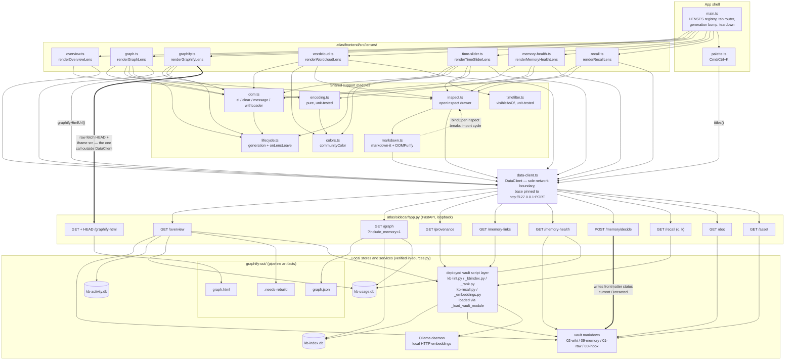

# C4 Code Level — Atlas frontend lens modules

## 1. Overview

| Field | Value |
| --- | --- |
| **Name** | Atlas frontend lenses |
| **Description** | The seven view modules of the Atlas desktop app. Each exports one render function that paints a single perspective on the KennisBank vault — health summary, force-graph, embedded graphify output, wordcloud, bi-temporal slider, memory cockpit, retrieval waterfall — by reading the local sidecar over loopback HTTP. |
| **Location** | `atlas/frontend/src/lenses/` (repo-relative) |
| **Language** | TypeScript (ES modules, `"type": "module"`). **Correction to the brief: these are `.ts` files, not `.js`.** The shipped JavaScript exists only as the Vite bundle in `atlas/frontend/dist/assets/`. |
| **Build / test** | Vite 5 (`npm run build` = `tsc --noEmit && vite build`), Vitest 4 (`npm run test`) — see `atlas/frontend/package.json` |
| **File count** | 7 files, 758 lines total; no vendored third-party code and no generated artifacts inside this directory |
| **Purpose** | Each file is one *lens*: a self-contained view over the KennisBank vault. A lens is a single exported render function that receives a host `HTMLElement` and a `DataClient`, fetches what it needs from the loopback sidecar, and paints the host. The lenses are the read/inspect surface of Atlas; exactly one of them (Memory Health) also drives a write. |

**Architectural role.** The lens layer sits between the app shell (`atlas/frontend/src/main.ts`)
and the localhost FastAPI sidecar (`atlas/sidecar/app.py`). It holds *no* state across renders and
*no* network code of its own beyond one deliberate exception (see §3.4): all HTTP goes through
`DataClient`, which hard-pins the base URL to `http://127.0.0.1:<port>` (`atlas/frontend/src/data-client.ts:106`).
That is the code-level expression of the repo's local-first invariant — a lens physically cannot
reach a non-loopback host.

**The lens contract** (declared in `atlas/frontend/src/main.ts:18`):

```ts
interface Lens {
  key: string;
  label: string;
  render: (el: HTMLElement, client: DataClient) => void | Promise<void>;
}
```

Every one of the seven files exports exactly one function matching `render`, and nothing else.
There are no classes, no default exports, and no shared mutable module state in this directory —
all per-lens state lives in closures created by the render call.

**Registration order** (`atlas/frontend/src/main.ts:27-35`): `overview`, `graph`, `graphify`,
`wordcloud`, `timeslider`, `memory`, `recall`. `main.ts:24-26` records that a Timeline lens and a
Provenance lens were deliberately removed (TASK-27.18); their sidecar endpoints survive for tooling.

**UI language note.** All user-facing strings are Dutch. This documentation is English per repo
policy; Dutch literals are quoted verbatim where the exact string matters.

---

## 2. Code Elements

### 2.0 Shared render pattern

Two render shapes recur, and knowing which a lens uses tells you its whole error/staleness story.

- **`withLoader`-based (4 of 7):** `overview`, `wordcloud`, `time-slider`, `memory-health` return
  `withLoader(...)` directly. `withLoader` (`atlas/frontend/src/dom.ts:35`) paints the loading
  message, awaits the loader, captures the render generation, and discards the result if the user
  switched lenses mid-flight. Errors become a uniform `onbeschikbaar: <message>` banner. These lens
  bodies therefore contain no `try`/`catch` and no generation checks of their own.
- **Hand-rolled (2 of 7):** `graph` and `graphify` are `async function`s that manage
  `currentGeneration()` / `isCurrent()` themselves, because they need multiple sequenced awaits
  (graph: `/graph` then `/provenance`; graphify: a HEAD probe then an iframe mount) with distinct
  failure copy per stage.
- **Synchronous (1 of 7):** `recall` builds its form immediately and returns `Promise.resolve()`
  (`atlas/frontend/src/lenses/recall.ts:129`); the network call happens later, on user submit.

### 2.1 `overview.ts` — vault health summary

*Role:* one non-graphical health page over the whole vault (wiki, memory, raw input, inbox backlog,
graph freshness). The lowest-cost lens: one endpoint, no canvas, no click-through.

**Public entry point**

```ts
export function renderOverviewLens(host: HTMLElement, client: DataClient): Promise<void>
```
`atlas/frontend/src/lenses/overview.ts:47`

Delegates to `withLoader<Overview>(host, "overzicht laden…", () => client.overview(), render)`.
The render callback builds a four-tile KPI row (wiki total, active memories, awaiting-decision
count, inbox backlog), the activity heatmap strip, per-section paragraphs for Wiki / Memory /
Raw input, and a three-item "Signalen" list (provenance percentage, graph staleness, inbox
backlog). Provenance percentage is computed inline at `overview.ts:49-51`, guarding division by
zero when `d.provenance.total` is 0.

**Module-private helpers** (all documented, none omitted)

| Signature | Location | Behaviour |
| --- | --- | --- |
| `function tile(label: string, value: string, cls = ""): HTMLElement` | `overview.ts:8` | KPI tile: value over label. Note the `value: string` type — distinct from the same-named helper in `memory-health.ts`, which takes `number`. |
| `function statusRow(byStatus: Record<string, number>): string` | `overview.ts:15` | Sorts status counts descending and joins as `"12 current · 3 draft"`; returns `"geen"` when the record is empty. |
| `function heatmapStrip(buckets: { day: string; n: number }[], days = 182): HTMLElement` | `overview.ts:26` | GitHub-style activity strip, one `<span>` per day for the last ~6 months, quantised to five intensity classes `q0`–`q4`. Complexity is O(`days`) and O(1) in vault size — the day aggregation is a single `GROUP BY` in the sidecar. Iterates `days-1 … 0` backwards from `new Date()`, so it uses the client clock and local `toISOString()` slicing for the day key. |
| `function freshnessLine(f: { d7: number; d30: number; d90: number; older: number; unknown: number }): string` | `overview.ts:42` | Formats the wiki freshness histogram as one line; appends the `zonder datum` clause only when `f.unknown` is non-zero. |

**Backward-compatibility detail.** `Overview.heatmap` and `Overview.freshness` are optional in the
type (`atlas/frontend/src/data-client.ts:66-67`) and both are guarded before use
(`overview.ts:62`, `overview.ts:67`), so an older sidecar still renders the lens — it just omits
those two blocks and shows `"geen activity-data (kb-activity.db ontbreekt of oudere sidecar)"`.

**Notable:** this is the only lens that does **not** import `openInspect` — nothing on the Overview
page is clickable, so it never reaches `/doc`.

### 2.2 `graph.ts` — canvas force-graph with data-driven encoding

*Role:* the flagship lens (TASK-27.4). A `force-graph` canvas where nodes are coloured by community,
sized by importance/degree, ringed by lifecycle status and haloed by usage warmth, with a legend,
five colour modes, three filters, and click-to-inspect. The largest lens (215 lines) and the only
one that touches three endpoints plus a conditional fourth.

**Public entry point**

```ts
export async function renderGraphLens(host: HTMLElement, client: DataClient): Promise<void>
```
`atlas/frontend/src/lenses/graph.ts:50`

Sequence:
1. Capture `currentGeneration()`; paint `"graaf laden…"` (`graph.ts:51-53`).
2. `await client.graph()`; on throw, paint `graaf onbeschikbaar: <msg>` and return (`graph.ts:56-61`).
3. `await client.provenance()` inside a bare `try/catch {}` to build the `atRisk` path set — a
   fail-soft overlay: if provenance is unavailable the overlay simply marks nothing at-risk
   (`graph.ts:63-66`).
4. `if (!isCurrent(gen)) return;` — the staleness guard covering both awaits (`graph.ts:67`).
5. Empty-state check on `data.status === "empty" || data.nodes.length === 0` (`graph.ts:68`).
6. Build controls, construct the `ForceGraph`, wire four event listeners, register teardown, `apply()`.

**Module-private helper**

```ts
function legend(colorMode: ColorMode | "provenance" | "entry-points"): HTMLElement
```
`atlas/frontend/src/lenses/graph.ts:28`

A nested-ternary lookup returning `[color, label]` swatch pairs per colour mode, plus a fixed
trailing caption `"· grootte = importance/degree · ring = status · halo = warmth"`. The colour
literals here are **duplicated by value** from `encoding.ts` / `colors.ts` rather than imported —
a legend/renderer drift risk worth knowing about (see §5).

**Closures inside `renderGraphLens`** (state and behaviour; none omitted)

| Element | Location | Behaviour |
| --- | --- | --- |
| `const LOD_NODES = 400` (module constant) | `graph.ts:26` | Level-of-detail threshold. Above it, per-node halo and status ring are dropped to keep pan/zoom smooth. The omission is surfaced in `lodNote`, never silent. |
| `let colorMode: ColorMode \| "provenance" \| "entry-points"` | `graph.ts:74` | Defaults to `"community"`. Note the widened union: `provenance` and `entry-points` are lens-local overlay modes, not part of `encoding.ColorMode`. |
| `let atRiskOnly: boolean`, `const filter: GraphFilter` | `graph.ts:75-76` | Filter state; `filter.kinds` starts as `Set(["wiki","memory"])`. |
| `let entryCounts: Record<string, number> \| null`, `let maxEntry: number` | `graph.ts:80-81` | Lazily loaded entry-point counts. Explicitly deferred because the first `/memory-links` call can take ~47 s before it is cached (comment at `graph.ts:78-79`; the sidecar warms this cache in a background thread at `atlas/sidecar/app.py:185-189`). |
| `const colorFor = (node: GraphNode): string` | `graph.ts:83` | Dispatches to `provenanceColor`, `entryPointColor`, or `nodeColor` by mode. Returns the blind-spot grey `#3a3f4a` while entry counts are still null. |
| `const apply = (): void` | `graph.ts:153` | Filters nodes through `passesFilter` + the at-risk predicate, drops links whose endpoints were filtered out, pushes **shallow clones** (`{...n}`) into `graph.graphData` so force-graph's in-place mutation of `x`/`y` never corrupts the cached `data`, resumes animation, and updates `lodNote`. |
| `const resize = (): void` | `graph.ts:206` | Syncs canvas width/height from `clientWidth`/`clientHeight`; bound to `window` `resize`. |
| ForceGraph callbacks | `graph.ts:115-151` | `nodeLabel` builds the hover tooltip; `nodeCanvasObject` does the actual painting (radius `sqrt(nodeVal(node)) * 1.8`, LOD-gated halo, fill via `colorFor`, status ring only for non-`current`/non-`active` nodes); `onNodeClick` opens the inspect drawer; `onEngineStop` pauses the animation loop. |

**Event listeners**

| Control | Location | Effect |
| --- | --- | --- |
| `modeSel` `change` | `graph.ts:165` | Switches colour mode and rebuilds the legend. When switching to `entry-points` for the first time, shows `"ingangen laden (kan even duren)…"`, awaits `client.memoryLinks()`, computes `maxEntry`, re-checks `isCurrent(gen)`, then repaints. A failure sets `entryCounts = {}` so it is not retried forever. |
| `supCb` `change` | `graph.ts:182` | Toggles `filter.hideSuperseded`, re-applies. |
| `riskCb` `change` | `graph.ts:186` | Toggles at-risk-only, re-applies. |
| `memCb` `change` | `graph.ts:190` | **Refetches the graph** with `client.graph(memCb.checked)` → `/graph?include_memory=1`. Disables the checkbox while in flight, keeps the current graph on failure, and restores the legend in both paths. |

**Teardown.** `onLensLeave` (`graph.ts:209-213`) removes the `resize` listener, pauses the
animation, and empties `graphData`. Without this a detached force simulation would keep pegging the
main thread after a lens switch.

### 2.3 `graphify.ts` — embedded graphify output

*Role:* embed the self-contained interactive `graph.html` that the `/graphify` pipeline writes to
`<vault>/graphify-out/`. The smallest lens (35 lines) and the only one that renders an `<iframe>`.

**Public entry point**

```ts
export async function renderGraphifyLens(host: HTMLElement, client: DataClient): Promise<void>
```
`atlas/frontend/src/lenses/graphify.ts:9`

Sequence: resolve the URL via `client.graphifyHtmlUrl()`; if null, show `"geen sidecar-poort —
start met ?port=NNNN"` and return (`graphify.ts:10-14`). Capture the generation, paint
`"graphify-graaf laden…"`, then **probe with `fetch(url, { method: "HEAD" })`** before embedding —
without the probe a missing `graph.html` would render the sidecar's raw 404 JSON inside the iframe
instead of the actionable `"geen graphify-out/graph.html in de vault — draai /graphify eerst"`
(`graphify.ts:17-30`). On success, `clear(host)` and mount an `<iframe class="graphify-frame">`
with `src = url` (`graphify.ts:31-34`).

This lens has **no module-private helpers** and no closures beyond the awaits.

**Two design facts worth recording.**
1. *Why loopback HTTP and not `file://`.* The header comment (`graphify.ts:1-4`) and the sidecar
   route comment (`atlas/sidecar/app.py:161-163`) agree: the page is served over loopback HTTP so
   its scripts execute. A `file://` embed would hit the file-origin wall and stay blank.
2. *Why HEAD needs explicit server support.* The route is declared
   `@app.api_route("/graphify-html", methods=["GET", "HEAD"])` (`atlas/sidecar/app.py:159`) because
   FastAPI's `@app.get` alone answers HEAD with 405 — a coupling between this lens and that route
   that a future refactor could silently break. There is a regression test:
   `atlas/sidecar/tests/test_graphify_html.py:38`.

### 2.4 `wordcloud.ts` — concepts sized by links + usage

*Role:* the vault's concepts sized by importance, where importance = graph degree (structure) +
`kb-usage` warmth (use). Deliberately a flex tag-cloud with no layout library — the header comment
(`wordcloud.ts:4-5`) frames this dependency-lightness as a choice made "after the mermaid/hljs
freezes".

**Public entry point**

```ts
export function renderWordcloudLens(host: HTMLElement, client: DataClient): Promise<void>
```
`atlas/frontend/src/lenses/wordcloud.ts:24`

`withLoader<Graph>` over `client.graph()`. The render callback filters to nodes with positive
weight, sorts descending, takes the top `TOP_N`, computes the min/max weight span, re-sorts by `id`
for visual scatter, and emits one clickable `<span class="cloud-term clickable">` per term with a
`sqrt`-scaled font size and a community (or memory-orange) colour.

**Module-private helpers and constants** (all documented)

| Element | Location | Behaviour |
| --- | --- | --- |
| `const MIN_PX = 12`, `const MAX_PX = 52` | `wordcloud.ts:11-12` | Font-size range. |
| `const TOP_N = 150` | `wordcloud.ts:13` | Term cap, so the cloud stays readable. |
| `function weightOf(n: GraphNode): number` | `wordcloud.ts:15` | `n.degree + Number(n.warmth ?? 0) * 1.5` — degree dominates, warmth adds a usage signal. |
| `function labelOf(n: GraphNode): string` | `wordcloud.ts:21` | Strips a trailing `.md` from the node label. |

Font size is `MIN_PX + sqrt((w - minW) / span) * (MAX_PX - MIN_PX)` (`wordcloud.ts:43`); `span` is
floored at 1 (`wordcloud.ts:36`) so a uniform-weight cloud cannot divide by zero.

**Two accuracy notes on this file.**
- The empty check at `wordcloud.ts:27` runs *after* the `weightOf(n) > 0` filter, so a graph of
  zero-degree, zero-warmth nodes correctly falls through to the empty state.
- The comment at `wordcloud.ts:37` says "shuffle deterministically (by id hash)", but the code at
  `wordcloud.ts:38` performs a lexicographic sort on `id`, not a hash. The stated *effect* holds
  (sizes are no longer sorted into a wedge, deterministically), but the mechanism is not a hash.
  Reported as observed; not a defect in behaviour.

### 2.5 `time-slider.ts` — bi-temporal graph, filtered as-of an instant

*Role:* the graph filtered by a valid-as-of instant. Memory nodes are bi-temporal
(`valid_from`/`valid_until`); wiki nodes are atemporal and always shown. Filtering is entirely
client-side over the one `/graph` payload — dragging the slider issues no network traffic.

**Public entry point**

```ts
export function renderTimeSliderLens(host: HTMLElement, client: DataClient): Promise<void>
```
`atlas/frontend/src/lenses/time-slider.ts:16`

`withLoader<Graph>` over `client.graph()`. The render callback derives the temporal domain, builds
the slider bar (axis `<select>`, as-of label, range input, caption), constructs a `ForceGraph`, and
registers teardown. When no node carries a parseable date, `hasTemporal` is false, the slider is
disabled, and the caption reads `"geen tijd-metadata op nodes; slider inactief"`
(`time-slider.ts:42`, `time-slider.ts:53-56`).

**Module-private helper**

```ts
const nodeColor = (n: GraphNode): string
```
`atlas/frontend/src/lenses/time-slider.ts:13` — memory nodes get fixed orange `#f5a623`, wiki nodes
get `communityColor(n.community)`. This is a **local re-implementation** of the community/kind
colour rule rather than a call into `encoding.nodeColor`; the same two-line rule is duplicated at
`wordcloud.ts:49`.

**Closures inside `renderTimeSliderLens`** (none omitted)

| Element | Location | Behaviour |
| --- | --- | --- |
| `let axis: TimeAxis` | `time-slider.ts:24` | `"capture"` by default; toggled by `axisSel`. |
| `const anyDate = (n: GraphNode): number[]` | `time-slider.ts:26` | Parses `created` and `valid_from` into epoch ms, dropping `NaN`. Used via `flatMap` to compute the domain. |
| `minT` / `maxT` / `hasTemporal` | `time-slider.ts:31-33` | Temporal domain; both collapse to `Date.now()` when no dates exist. |
| `const apply = (asOf: number): void` | `time-slider.ts:71` | Filters nodes through `visibleAsOf(node, asOf, axis)`, drops orphaned links, pushes shallow clones into `graphData`. |
| `const asOfNow = (): number` | `time-slider.ts:78` | Maps the 0–1000 slider position linearly onto `[minT, maxT]`. |
| `const refresh = (): void` | `time-slider.ts:79` | Updates the as-of label to an ISO date and re-applies. Bound to slider `input` and axis `change`. |
| `const resize = (): void` | `time-slider.ts:87` | Same canvas-sizing pattern as `graph.ts`. |

The temporal semantics themselves — including that `valid_until` is **exclusive** — live in the
pure, unit-tested `visibleAsOf` (`atlas/frontend/src/timefilter.ts:24`), not here. Initial paint is
`apply(maxT)` (`time-slider.ts:95`), i.e. "now". Teardown mirrors `graph.ts`
(`time-slider.ts:90-94`).

### 2.6 `memory-health.ts` — the editor-in-chief cockpit

*Role:* lifecycle counts, the unverified quarantine queue, an importance × recency heatmap,
warm/stale usage, and supersede chains. Operationalises "the system proposes, the human decides".
**This is the only lens that writes.**

**Public entry point**

```ts
export function renderMemoryHealthLens(host: HTMLElement, client: DataClient): Promise<void>
```
`atlas/frontend/src/lenses/memory-health.ts:47`

`withLoader<MemoryHealth>` over `client.memoryHealth()`. The render callback assembles five blocks:
the four lifecycle tiles, the quarantine queue (capped at 30 rows, `memory-health.ts:69`), the
heatmap, warm/stale usage (top 15, `memory-health.ts:91`), and supersede chains (top 15,
`memory-health.ts:103`).

**Module-private helpers** (all documented)

| Element | Location | Behaviour |
| --- | --- | --- |
| `const memPath = (id: string) => string` | `memory-health.ts:10` | Maps a memory stem to its vault path: `` `09-memory/${id}.md` ``. The same literal prefix is hardcoded in `atlas/frontend/src/inspect.ts:56`. |
| `function tile(label: string, value: number, cls: string): HTMLElement` | `memory-health.ts:12` | KPI tile. Takes `value: number` — contrast `overview.ts:8`, which takes a `string`. |
| `const TEMP_CLASS: Record<string, string>` | `memory-health.ts:19` | Maps `warm`/`tepid`/`stale` to CSS classes `t-warm`/`t-tepid`/`t-stale`. |
| `function heatmap(cells: MemoryHealth["heatmap"]): HTMLElement` | `memory-health.ts:21` | Builds a 5 × 4 grid (importance 1–5 clamped at `memory-health.ts:27`, age bucket via `encoding.ageBucket`). Renders importance descending (5 → 1) so high importance sits at the top. Cell alpha is `0.15 + 0.85 * (n/max)` with `max` floored at 1 (`memory-health.ts:24`, `memory-health.ts:40`). |

**The write path.** The queue rows carry two buttons and one inner closure:

```ts
const decide = async (decision: "approve" | "reject") => { ... }
```
`atlas/frontend/src/lenses/memory-health.ts:75`

It disables both buttons, calls `client.decideMemory(q.id, decision)` → `POST /memory/decide`, and
on success **replaces the whole row** with `` `${q.id} → ${r.new_status}` `` so the UI reflects the
persisted status rather than an optimistic guess. On failure it re-enables both buttons and appends
the error inline, leaving the decision retryable. This is the single write path in the entire lens
layer; the sidecar side flips the fragment's frontmatter status to `current` or `retracted`
(`atlas/sidecar/app.py:129-136`).

**Two link-resolution subtleties.**
- Warmth rows (`memory-health.ts:96`) open `w.path` directly when it contains a `/` — the sidecar
  already resolved warmth stems to real doc paths, wiki or memory — and only fall back to
  `memPath()` for a bare, unresolved stem.
- Supersede chains (`memory-health.ts:107-113`) check `c.missing` first: a target whose file is gone
  renders muted as `"<stem> (ontbreekt)"` instead of becoming a dead link.

### 2.7 `recall.ts` — the live retrieval waterfall

*Role:* show *why* a document is retrieved for a query: the vector and FTS candidates, their RRF
fusion, and the per-hit rerank factor breakdown (`relevance × recency × importance × trust × usage
= final`). Because `/recall` reuses the production `_kbindex` / `_rank` pipeline
(`atlas/sidecar/sources.py:541`), the displayed factors match what `kb-recall` would return — this
lens is a debugger for the real retrieval path, not a re-implementation of it.

**Public entry point**

```ts
export function renderRecallLens(host: HTMLElement, client: DataClient): Promise<void>
```
`atlas/frontend/src/lenses/recall.ts:33`

The only lens whose render is synchronous: it builds the query input, the Recall button, and an
empty results container, wires `click` and `Enter`, appends the DOM, and returns
`Promise.resolve()` (`recall.ts:129`). All network work is deferred to the `run` closure.

**Module-private helpers** (all documented)

| Element | Location | Behaviour |
| --- | --- | --- |
| `const base = (p: string) => string` | `recall.ts:10` | Basename: normalises `\` to `/`, splits, takes the last segment, falls back to the input. |
| `const FACTORS` | `recall.ts:11` | `["relevance","recency","importance","trust","usage"] as const` — the display order of the rerank breakdown. |
| `function stageList(title: string, entries: StageEntry[]): HTMLElement` | `recall.ts:13` | One waterfall stage column: a titled list of `score · basename`, with the full path in the `title` attribute. |
| `function factorRow(hit: RerankEntry): HTMLElement` | `recall.ts:21` | Renders present factors as `R 0.812 × …` chips (initial letter uppercased), skipping `undefined` ones, then the `= <final>` chip. Falls back to `hit.score` when `factors.final` is absent. |

**Closures inside `renderRecallLens`**

| Element | Location | Behaviour |
| --- | --- | --- |
| `const run = async (): Promise<void>` | `recall.ts:39` | The query driver. No-ops on an empty query, shows `"recall-waterfall draait (embed via Ollama)…"` (naming the Ollama dependency to the user), awaits `client.recall(q, 8)`, and branches to the empty state on `d.status !== "ok"` or zero final hits. Errors surface as `recall faalde: <msg>`. |
| `const layerOf = (h: { path: string; layer?: string }) => string` | `recall.ts:58` | Prefers the sidecar-supplied `layer`, else infers `memory` from a `09-memory/` path segment, else `wiki`. |
| `let facet: string` + `const renderList = (): void` | `recall.ts:60-76` | Facet-chip filtering (`alle` / `wiki` / `memory`) applied **client-side over the already-loaded result set** — no new query per click. `renderList` rebuilds via `replaceChildren`. Graph neighbours are labelled `graafbuur · <name>` instead of showing a score (`recall.ts:67`). |
| `chips` construction | `recall.ts:77-88` | Three chip buttons; the active class is toggled by comparing `textContent`. |
| `copyBtn` handler | `recall.ts:94-100` | Copies the whole `Recall` payload as pretty JSON to the clipboard via `navigator.clipboard.writeText`, with success/failure reflected in the button label. Intent (`recall.ts:91-93`): a machine-readable twin, pasteable into a bug report or feedable to an agent. |

Layout: the final hits with their factor breakdown come **first**, then the upstream stage columns
(`Vector-KNN`, `FTS`, `RRF-fusie`) under the `"Waterfall — kandidaten per fase"` heading
(`recall.ts:107-115`) — answer before derivation.

---

## 3. Dependencies

### 3.1 Internal — sibling modules in `atlas/frontend/src/`

| Module | Imported by | What the lenses use |
| --- | --- | --- |
| `data-client.ts` | all 7 | Imported with `import type` in **all seven** (`graph.ts:8`, `graphify.ts:5`, `memory-health.ts:5`, `overview.ts:5`, `recall.ts:6`, `time-slider.ts:7`, `wordcloud.ts:7`) — no lens imports `DataClient` as a value; the instance always arrives as a render parameter. Also supplies the payload interfaces `Graph`, `GraphNode`, `MemoryHealth`, `Overview`, `Recall`, `RerankEntry`, `StageEntry`. The single network boundary. |
| `dom.ts` | all 7 | `el`, `clear`, `message`, `withLoader`. `el` builds everything via `createElement` + `textContent` — no `innerHTML` anywhere, so no lens payload can inject markup. |
| `inspect.ts` | **5 of 7**: graph, wordcloud, time-slider, memory-health, recall (not overview, not graphify) | `openInspect(client, path)` — opens the read-only drawer with a fresh history. |
| `lifecycle.ts` | 3 of 7, with three different import sets | graph imports all three: `currentGeneration`, `isCurrent`, `onLensLeave` (`graph.ts:22`). graphify imports only the staleness guard `currentGeneration`, `isCurrent` (`graphify.ts:7`) — it mounts an iframe, so it has no animation loop to tear down. time-slider imports only `onLensLeave` (`time-slider.ts:10`) — its single await is already generation-guarded inside `withLoader`. |
| `encoding.ts` | graph, memory-health | graph: `ColorMode`, `nodeColor`, `nodeVal`, `warmthHalo`, `statusColor`, `provenanceColor`, `entryPointColor`, `GraphFilter`, `passesFilter`. memory-health: `AGE_BUCKETS`, `ageBucket`. |
| `colors.ts` | time-slider, wordcloud | `communityColor(community)` — the 15-entry categorical cluster palette. |
| `timefilter.ts` | time-slider | `TemporalNode`, `TimeAxis`, `visibleAsOf` — the bi-temporal predicate. |
| `main.ts` | — (imports *them*) | The app shell registers all seven render functions and owns tab routing, the sidecar handshake, and generation bumping. |
| `markdown.ts`, `history.ts`, `palette.ts` | — (reached transitively) | Not imported by any lens; reached via `inspect.ts` (markdown rendering, drawer history) and `main.ts` (command palette). |

The dependency graph is strictly acyclic *within* the lens layer: no lens imports another lens.
One cycle exists just outside it and is broken explicitly — `inspect.ts` ↔ `markdown.ts`, resolved
by `bindOpenInspect` (`atlas/frontend/src/inspect.ts:172`, `atlas/frontend/src/markdown.ts:123`).

### 3.2 External libraries

| Package | Version (package.json) | Used by | Note |
| --- | --- | --- | --- |
| `force-graph` | `^1.49.0` | `graph.ts:6`, `time-slider.ts:4` | The only runtime library the lens layer imports directly. Canvas-based (not SVG/WebGL), hence the LOD threshold in `graph.ts`. |
| `markdown-it`, `dompurify`, `highlight.js`, `katex`, `mermaid`, `markdown-it-footnote`, `markdown-it-task-lists`, `@vscode/markdown-it-katex` | see `atlas/frontend/package.json` | reached via `inspect.ts` → `markdown.ts` | **Not** imported by any lens. Listed because clicking a lens item pulls this pipeline in. |
| `vitest`, `typescript`, `vite` | dev | build/test only | No lens imports them. |

Browser platform APIs used directly: `document`, `window` (`resize`, `setInterval` in the shell),
`fetch` (`graphify.ts:20`), `navigator.clipboard` (`recall.ts:97`), `URLSearchParams`, `Date`.

### 3.3 Sidecar HTTP endpoints per lens

All served by `atlas/sidecar/app.py` (FastAPI) at `http://127.0.0.1:<port>`, port injected by Tauri
as `window.__ATLAS_PORT__` or passed as `?port=NNNN` in dev (`data-client.ts:87-93`). Every route
below was verified present in `app.py`.

| Lens | Direct calls | Route definition |
| --- | --- | --- |
| `overview.ts` | `GET /overview` | `app.py:121` |
| `graph.ts` | `GET /graph`; `GET /graph?include_memory=1`; `GET /provenance`; `GET /memory-links` (lazy, only on the `entry-points` colour mode) | `app.py:105`, `app.py:138`, `app.py:175` |
| `graphify.ts` | `HEAD /graphify-html` (raw `fetch` probe) then `GET /graphify-html` (as the iframe `src`) | `app.py:159` |
| `wordcloud.ts` | `GET /graph` | `app.py:105` |
| `time-slider.ts` | `GET /graph` | `app.py:105` |
| `memory-health.ts` | `GET /memory-health`; **`POST /memory/decide`** `{stem, decision}` | `app.py:117`, `app.py:129` |
| `recall.ts` | `GET /recall?q=<query>&k=8` | `app.py:171` |
| *indirect, from any lens that calls `openInspect`* | `GET /doc?path=…`; `GET /memory-links` (session-cached in `inspect.ts:14-19`, for `02-wiki/` docs); `GET /asset?path=…` (images inside rendered markdown, `markdown.ts:76`) | `app.py:142`, `app.py:175`, `app.py:149` |

Two `DataClient` methods are **not** reachable from the lens layer:
- `timeline()` → `GET /timeline` (`data-client.ts:135`) has **no caller anywhere in `src/`** — dead
  on the client side since the Timeline lens was dropped (`main.ts:24-26`). The endpoint remains for
  external tooling.
- `titles()` → `GET /titles` (`data-client.ts:146`) is called only by the command palette
  (`atlas/frontend/src/palette.ts:68`), not by a lens.

### 3.4 Data stores and services reached transitively

The lenses never open a database or a socket themselves; the sidecar does, on their behalf. Every
row below was read out of `atlas/sidecar/sources.py` rather than inferred from the payload shape.

| Lens / endpoint | Verified store or service reads |
| --- | --- |
| overview | `02-wiki/*.md` frontmatter for status + freshness (`sources.py:939-955`); `build_memory_health` → `09-memory/` markdown + `kb-usage.db`; `build_provenance` → the vault's own `kb-lint.py`; file counts over `01-raw/sessies`, `01-raw/transcripts`, `00-inbox` (`sources.py:963-971`); the `graphify-out/.needs-rebuild` marker file for `graph_stale` (`sources.py:977`); `kb-activity.db` via `_activity_heatmap` (`sources.py:910`). **Deliberately does not use `kb-index.db`** — the comment at `sources.py:932-934` explains that kb-index's `status` column holds lifecycle state (`current`) and would collapse every article into one bucket, so wiki status is read from frontmatter instead. |
| graph (also wordcloud, time-slider — same payload) | `graphify-out/graph.json` via `load_graph` (`sources.py:56-58`) — the source of `community`, `community_name` and **all links**; `kb-index.db` via `kbindex_docs` (`sources.py:42`) for layer/status/created; `kb-usage.db` via `usage_warmth` (`sources.py:82`) for warmth. Degree is computed in-process from the collapsed edge set (`sources.py:164-169`), not stored. |
| graphify | the plain file `<vault>/graphify-out/graph.html` (`atlas/sidecar/app.py:164`), produced out-of-band by the `/graphify` pipeline |
| memory-health | `09-memory/*.md` frontmatter + `kb-usage.db` for warmth/temperature (`sources.py:340`, `sources.py:432`). The write path mutates frontmatter on disk. |
| recall | dynamically loads the deployed vault script layer via `_load_vault_module` — `_embeddings.py`, `_kbindex.py`, `_rank.py`, `kb-recall.py`, and optionally `_usage.py` (`sources.py:660-666`) — then embeds the query through the **local Ollama daemon** (`emb.embed(query)`, `sources.py:670`) and queries `kb-index.db` for the vector and FTS stages. Data-parity with `kb-recall` holds *by construction*: same `_rrf`, same SQL, same `_rank` factor functions (`sources.py:648-650`). |
| `/provenance` (graph overlay, overview line) | the vault's own `kb-lint.py`, loaded dynamically and called as `kb_lint.lint_vault(vault)` (`sources.py:473-474`) — not a direct database read. Falls back to a local herkomst heuristic only when kb-lint cannot be loaded. |
| `/memory-links` (graph entry-points overlay, inspect drawer) | `_kbindex` + `kb-recall` over **stored** fragment embeddings, vector-KNN against the wiki layer — explicitly *no* Ollama re-embed, because re-embedding 753 fragments would cost ~12 min (`sources.py:809-817`). Cached in-process. |

**Correction worth flagging: `kb-graph.db` is never read by the Atlas sidecar.** A grep for it across
`atlas/sidecar/sources.py` returns nothing. The Graph lens's community structure comes from the
graphify pipeline's JSON artifact, not from a sqlite graph store. Of the four databases named in the
repo context, Atlas touches three: `kb-index.db`, `kb-usage.db`, `kb-activity.db`.

**Architectural consequence: two lenses depend on the graphify pipeline having run.** `graph.ts`
(plus `wordcloud.ts` and `time-slider.ts`, which share the payload) needs
`graphify-out/graph.json`; `graphify.ts` needs `graphify-out/graph.html`. If `/graphify` has never
run, four of the seven lenses degrade to their empty states, and `overview` reports
`graph_stale`. This is why `load_graph` returns `{nodes: [], links: []}` on any failure
(`sources.py:59-65`) rather than raising — the empty state is a designed outcome, not an error path.

**A note on the "distribution, not an app" framing.** `/recall`, `/provenance` and `/memory-links`
do not reimplement vault logic — they `_load_vault_module(...)` the *deployed* scripts out of
`$VAULT/.claude/scripts` and call them. The Recall lens is therefore a debugger for the user's real
retrieval pipeline, and the Graph lens's at-risk overlay shows exactly what `kb-lint` would report.

**One deliberate deviation from the stated module boundary.** `data-client.ts:1-3` asserts that
"no other module issues network calls (ADR-0004 module boundaries)". `graphify.ts:20` issues a raw
`fetch(url, { method: "HEAD" })`. It stays within the *spirit* of the invariant — the URL comes from
`client.graphifyHtmlUrl()`, which is the module that pins loopback — but it is literally a network
call outside `DataClient`, and the loopback guard in `guardBase()` (`data-client.ts:106-113`) does
not run on this path. Recording it as an accurate observation, not asserting it is a defect: the URL
is constructed from the same pinned base, so the loopback property still holds by construction.

### 3.5 Test coverage of this layer

No test file lives in `lenses/`, and no lens render function has a DOM test. The design response is
visible in the imports: the decision logic is pushed **out** of the lenses into pure modules that
*are* unit-tested with Vitest.

| Test file | Covers | Consumed by |
| --- | --- | --- |
| `atlas/frontend/src/encoding.test.ts` | `statusColor`, `nodeColor`, `nodeVal`, `warmthHalo`, `provenanceColor`, `entryPointColor`, `ageBucket`, `passesFilter` | graph, memory-health |
| `atlas/frontend/src/timefilter.test.ts` | `visibleAsOf` bi-temporal semantics | time-slider |
| `atlas/frontend/src/palette.test.ts`, `history.test.ts`, `readiness.test.ts` | shell-side helpers | not lenses |

The header comment of `encoding.ts` states the rationale directly: pure functions so the
field → visual-channel mapping is verifiable "without a live browser". The practical consequence:
`graph.ts`'s `legend()` colour literals, `time-slider.ts`'s local `nodeColor`, and
`wordcloud.ts`'s inline colour rule are **outside** that tested surface.

---

## 4. Relationships



### Reading the diagram

- **Fan-in on `DataClient`.** Every lens funnels through one module whose base URL is pinned to
  loopback. That single choke point is what makes the local-first guarantee checkable by reading one
  file instead of seven.
- **Three lenses share one endpoint.** `graph`, `wordcloud`, and `time-slider` all render `GET /graph`
  — three different questions (structure, importance, time) over one payload. Only `graph` ever asks
  for `?include_memory=1`.
- **`graphify-out/` is a shared upstream, not just the Graphify lens's input.** `graph.json` feeds
  the three graph-payload lenses and `graph.html` feeds the Graphify lens, so the pipeline artifact
  box has four inbound consumers. No `kb-graph.db` edge exists, because the sidecar never reads it.
- **`KBL` is the reuse hub.** `/recall`, `/provenance` and `/memory-links` all route through the
  deployed vault script layer rather than querying sqlite themselves — that indirection is what buys
  data-parity with the CLI tools.
- **One write, one bold edge.** `POST /memory/decide` from Memory Health is the sole mutation in the
  whole lens layer.
- **One edge bypasses the choke point.** The `graphify` → `/graphify-html` edge is drawn straight to
  the sidecar because it is a raw `fetch` plus an iframe `src`, not a `DataClient` method (§3.4).
- **Click-to-inspect is a second fan-in.** Five lenses reach `/doc` (and transitively `/asset` and
  `/memory-links`) through `openInspect` rather than calling it themselves. `overview` and `graphify`
  are the two that never do.

---

## 5. Observations

Factual, verified in the code; offered as maintenance signal, not as defect claims.

1. **Colour rules are duplicated in three places.** `encoding.nodeColor` (`encoding.ts:47`) is the
   tested definition, but `graph.ts:28-38` hardcodes the same hex values as legend literals,
   `time-slider.ts:13` re-implements the community/memory rule, and `wordcloud.ts:49` inlines it
   again. Changing the palette in `colors.ts` updates the canvases but not the legend.
2. **Two same-named `tile` helpers with different signatures.** `overview.ts:8` takes
   `value: string`, `memory-health.ts:12` takes `value: number`. Independent and both correct;
   worth knowing before anyone tries to hoist them into a shared module.
3. **`09-memory/` is hardcoded in two files.** `memory-health.ts:10` and `inspect.ts:56` both build
   `` `09-memory/${stem}.md` ``. There is no shared constant for the vault layout.
4. **`DataClient.timeline()` has no caller.** Dead on the client side (§3.3); the sidecar route and
   its `bucket`/`from`/`to`/`dimension` parameters (`app.py:109-115`) still exist.
5. **`graphify.ts` depends on an explicit HEAD route.** If someone "simplifies"
   `@app.api_route(..., methods=["GET","HEAD"])` back to `@app.get`, the probe gets a 405 and the
   lens shows an error instead of the graph. `atlas/sidecar/tests/test_graphify_html.py:38` guards
   this — the guard exists, so this is a documented coupling rather than a latent break.
6. **The comment/code mismatch in `wordcloud.ts:37-38`** ("by id hash" vs a lexicographic sort), as
   described in §2.4. Behaviour matches the stated intent; only the mechanism is described wrongly.
7. **Four of seven lenses silently depend on the graphify pipeline.** `graph`, `wordcloud` and
   `time-slider` need `graphify-out/graph.json`; `graphify` needs `graphify-out/graph.html`. On a
   vault where `/graphify` has never run, all four show empty states and nothing tells the user
   *why* — except the Overview lens's `graph_stale` line, which is a different signal
   (`.needs-rebuild` exists) from "the artifact was never produced". A missing `graph.json` and a
   stale `graph.json` are currently indistinguishable in the three graph lenses. Stated as an
   observation about the failure mode, not a claim that the empty state is wrong.
8. **Documentation drift in `package.json`.** Its `description` field reads "six-lens tab-shell"
   (`atlas/frontend/package.json:6`) while `main.ts` registers seven. The Graphify lens (TASK-84) was
   added after that string was written.
