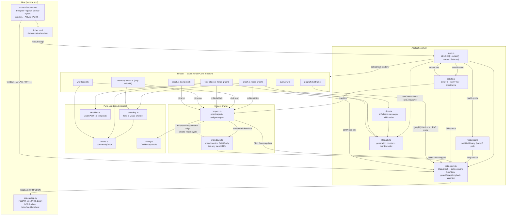

# C4 Code Level — Atlas Frontend (`atlas/frontend/src`)

## 1. Overview

| Field | Value |
|---|---|
| **Name** | KennisBank Atlas frontend (package name `kennisbank-atlas-frontend`, `atlas/frontend/package.json:2`) |
| **Description** | Single-page application shell that renders seven "lenses" over the KennisBank vault. It is a pure read/visualise client: all data arrives as JSON from the local Atlas sidecar over loopback HTTP. |
| **Location** | `atlas/frontend/src` (repo-relative) |
| **Language(s)** | **TypeScript** — ES2020 target, ESNext modules, `strict: true`, `noUnusedLocals`/`noUnusedParameters` (`atlas/frontend/tsconfig.json:2-12`). Plus one CSS file (`src/style.css`) and one ambient declaration file (`src/shims.d.ts`). *The task brief described this directory as "(JS)"; there is no `.js` file in `src/` — everything is `.ts`, compiled/bundled by Vite.* |
| **Purpose** | Give a human editor-in-chief a visual cockpit over the vault: health overview, force-directed knowledge graph, wordcloud, bi-temporal time slider, memory lifecycle triage, and a live retrieval waterfall — plus a read-only markdown inspect drawer and a Cmd/Ctrl+K jump palette. |
| **Runs inside** | A Tauri v2 WebView2 window (`atlas/src-tauri/src/main.rs`), or a plain browser against `vite dev` with `?port=NNNN`. |
| **Build / test** | `npm run dev` (vite), `npm run build` (`tsc --noEmit && vite build`), `npm test` (`vitest run`) — `atlas/frontend/package.json:8-12`. There is **no** `vite.config.*` and **no** `vitest.config.*`; both tools run on their defaults. |

### Excluded from element-level documentation

- `atlas/frontend/node_modules/` — vendored third-party packages (npm install tree). Not documented element by element.
- `atlas/frontend/dist/` — Vite build output (`dist/index.html`, `dist/assets/`). Generated artifact, not source.

### Three things a reader will guess wrong

1. **There is no router.** "Lens switching" is an array (`LENSES`, `main.ts:27`), a mutable `active` string (`main.ts:82`) and a `select()` closure (`main.ts:83-92`). No URL router, no hash routing, no History API, no deep links. A page reload always lands on the first lens (`overview`).
2. **`history.ts` is not the router.** `DocHistory` (`history.ts:3`) is the back/forward stack of the *inspect drawer* only — it tracks which markdown documents you clicked through, nothing about lenses.
3. **`palette.ts` and `colors.ts` are unrelated.** `palette.ts` is the Cmd+K command palette; `colors.ts` holds the categorical `PALETTE` colour array for community clusters. Same word, different concern.

### WebView2 origin (`http://tauri.localhost`)

The string `tauri.localhost` **does not appear anywhere in `atlas/frontend/src`** — this is stated explicitly because the brief asked for it "if referenced". It matters indirectly and is worth understanding:

- The frontend *is served from* that origin when bundled. Tauri v2 on Windows serves the webview from `http://tauri.localhost` (plain http, no TLS); on macOS/Linux it is `tauri://localhost` — documented at `atlas/sidecar/app.py:24-28`.
- Every `fetch` the frontend makes therefore goes **cross-origin** to `http://127.0.0.1:<port>` (`data-client.ts:99`), so the sidecar must allowlist those origins. It does, via `_CORS_ORIGIN_REGEX` at `atlas/sidecar/app.py:29-32`, which matches loopback, `tauri://localhost`, and `https?://tauri\.localhost`. Both Windows and macOS/Linux variants are pinned by tests at `atlas/sidecar/tests/test_cors.py:19-28`.
- The frontend's own origin logic is only two things: the loopback base URL built at `data-client.ts:99`, and the hard loopback assertion in `guardBase()` at `data-client.ts:109-112` which refuses any base that is not `http://127.0.0.1:`.
- Two loopback URLs deliberately bypass `fetch` and are handed to the browser directly, which is why they are not CORS-constrained: `assetUrl()` for `` (`data-client.ts:150-154`) and `graphifyHtmlUrl()` for the Graphify `<iframe src>` (`data-client.ts:155-159`).

### How the port arrives

`resolvePort()` (`data-client.ts:87-93`) reads `window.__ATLAS_PORT__` first, then falls back to the `?port=` query parameter. The global is injected by the Tauri shell as a webview initialization script *before* the frontend loads (`atlas/src-tauri/src/main.rs:56-61`), after Rust picks a free ephemeral loopback port (`main.rs:22-28`) and spawns the frozen sidecar on it (`main.rs:38-44`).

---

## 2. Code Elements

**Convention used throughout this section** (so nothing is silently dropped): every *named module-level* function, class, method and exported type gets its full signature plus `file:line`. Functions defined as **closures inside another function body** get name + `file:line` + a one-clause description, without an invented signature — their types are inferred from context and writing them out would be fabrication. Every such closure is listed; none are omitted.

### 2.1 `src/main.ts` — application shell, tab router, sidecar handshake, status banner

Role: the only entry point. Builds the tab bar, runs the sidecar readiness handshake, installs the palette, and owns lens switching. Header comment states the app-wide DOM invariant: everything is built with `textContent`/`createElement`, never `innerHTML`, so no lens payload can inject markup (`main.ts:1-3`).

| Element | Signature / shape | Line | Notes |
|---|---|---|---|
| `interface Lens` | `{ key: string; label: string; render: (el: HTMLElement, client: DataClient) => void \| Promise<void> }` | `main.ts:18-22` | The whole lens contract. Any module exporting a matching `render` is a lens. |
| `LENSES` | `const LENSES: Lens[]` | `main.ts:27-35` | Seven entries in tab order: `overview` "Overzicht", `graph` "Graph", `graphify` "Graphify", `wordcloud` "Wordcloud", `timeslider` "Time-slider", `memory` "Memory Health", `recall` "Recall". Comment at `:24-26` records that the Timeline and Provenance lenses were removed (TASK-27.18) while their sidecar endpoints were kept. |
| `client` | `const client = new DataClient()` | `main.ts:37` | Module-level singleton; the single `DataClient` for the whole app, passed into every lens. |
| `connectSidecar` | `async function connectSidecar(bar: HTMLElement): Promise<boolean>` | `main.ts:42-75` | Renders the status banner and blocks until `/health` answers. See §2.1.1. |
| `main` | `async function main(): Promise<void>` | `main.ts:77-114` | Grabs `#tabs`, `#statusbar`, `#lens` from `index.html`; builds one `<button>` per lens; installs the palette; gates the first render on `connectSidecar`. |
| `select` | closure inside `main` | `main.ts:83-92` | The "router". Bumps the render generation, runs the previous lens's teardown, toggles the `active` CSS class on tabs, then calls `l.render(lens, client)`. |
| bootstrap | `void main();` | `main.ts:116` | Fire-and-forget; no top-level await. |

#### 2.1.1 Startup / handshake sequence (`main.ts:42-114`)

1. `lens.textContent = "wachten op sidecar…"` (`main.ts:111`).
2. `connectSidecar`: if `client.configured` is false, the banner shows `"geen sidecar-poort — start met ?port=NNNN"` with class `warn` and returns `false` (`main.ts:46-50`).
3. Otherwise the banner shows `"sidecar starten…"` and a `setInterval` ticker updates it once a second with elapsed seconds, so a slow cold start is visibly alive (`main.ts:51-57`).
4. `waitUntilReady(() => client.health(), { timeoutMs: Number.POSITIVE_INFINITY })` (`main.ts:59`) — polls until the first success.
5. On success the banner turns `ok`/`warn` and prints status, version, **the resolved vault path** and the live source names, e.g. `sidecar ok · v0.1.0 · vault: … · bronnen: kb_index, memory` (`main.ts:60-67`). Printing the vault is deliberate: it lets the user verify at a glance that `KENNISBANK_VAULT` resolved to the right vault.
6. `finally` always clears the ticker (`main.ts:72-74`).
7. Only then does `select(active)` render the first lens (`main.ts:113`). Tabs are already clickable during the wait, so a manual tab click simply retries the fetch (`main.ts:109-110`).

### 2.2 `src/data-client.ts` — the only module that talks to the sidecar

Role: sole network boundary. The header comment states the invariant explicitly: the base URL is always `127.0.0.1` on the negotiated port and no other module issues network calls (`data-client.ts:1-3`). (Attributed to that comment and to `main.ts:1-2`; the referenced `docs/adr/0004-atlas-tauri-architecture.md` was not read for this document.) Two exceptions exist by design and are visible in code: `graphify.ts:20` performs its own `fetch(url, {method:"HEAD"})` on a URL *built by* this client, and `recall.ts:97` calls `navigator.clipboard`.

**Sidecar contract types** — 19 exported interfaces, all at `data-client.ts:5-85`:

| Interface | Line | Shape (fields spelled out where a lens consumes them) |
|---|---|---|
| `Health` | `:5-10` | `{ status: string; version: string; vault: string; sources: Record<string, boolean> }` |
| `GraphNode` | `:12-20` | `{ id: string; label: string; kind: "wiki" \| "memory"; layer: string; node_status: string; degree: number; [k: string]: unknown }` — the index signature is why lenses read `node.community`, `node.warmth`, `node.importance`, `node.community_name`, `node.created`, `node.valid_from` with casts. |
| `GraphLink` | `:21` | `{ source: string; target: string; rel: string; weight: number }` |
| `Graph` | `:22` | `{ status: string; nodes: GraphNode[]; links: GraphLink[] }` |
| `TimelineBucket` | `:24-28` | `{ start; end: string; event_count; capture_count: number; by_kind: Record<string, number> }` — **no consumer in `src/`** (Timeline lens removed). |
| `Timeline` | `:29` | `{ status: string; buckets: TimelineBucket[] }` — **no consumer in `src/`**. |
| `MemoryHealth` | `:31-39` | `{ status; counts:{active,quarantined,superseded,unverified:number}; queue:{id:string;importance:number;created:string}[]; supersede_chains:{head:string;chain:string[];missing?:string[];valid_until:string\|null}[]; heatmap:{id:string;importance:number;age_days:number}[]; warmth:{path:string;warmth:number;last_used:string\|null;temperature:string}[]; quarantine:{id:string;reason:string}[] }` |
| `Provenance` | `:41-45` | `{ status: string; coverage:{sourced;unsourced;total:number}; unsourced:{path;reason:string}[] }` — the Graph lens uses only `unsourced`; `coverage` is unused in `src/`. |
| `Doc` | `:47` | `{ status: string; path: string; title: string; content: string }` |
| `MemoryLinks` | `:49-54` | `{ status: string; links: Record<string,string> /* fragment stem -> wiki path */; counts: Record<string,number> /* wiki path -> #entry points */; types: Record<string,string> /* stem -> memory_type */ }` |
| `Overview` | `:56-68` | `{ status; wiki:{total:number;by_status:Record<string,number>}; memory:{active,quarantined,superseded,unverified:number}; memory_status:string; raw:{sessies,transcripts:number}; inbox_waiting:number; provenance:{sourced,total:number}; graph_stale:boolean; heatmap?:{day:string;n:number}[]; freshness?:{d7,d30,d90,older,unknown:number} }` — the last two are optional on purpose so an older sidecar still renders the lens (`:65`). |
| `TitleItem` | `:70` | `{ title: string; path: string; layer: string }` |
| `Titles` | `:71` | `{ status: string; items: TitleItem[] }` |
| `DecideResult` | `:73` | `{ status: string; stem: string; new_status: string }` |
| `RecallHit` | `:75` | `{ path: string; score: number; snippet: string; neighbor?: boolean; layer?: string }` |
| `StageEntry` | `:76` | `{ path: string; score: number }` |
| `RerankEntry` | `:77` | `extends StageEntry { factors?: Record<string, number> }` |
| `RecallStages` | `:78-80` | `{ vector: StageEntry[]; fts: StageEntry[]; rrf: StageEntry[]; rerank: RerankEntry[] }` |
| `Recall` | `:81-85` | `{ status: string; query: string; stages: RecallStages; final: RecallHit[] }` |

**Functions and class:**

| Element | Signature | Line | Depends on / notes |
|---|---|---|---|
| `resolvePort` | `function resolvePort(): number \| null` | `:87-93` | Module-private. `window.__ATLAS_PORT__` (injected by Tauri) → `?port=` query param → `null`. |
| `class DataClient` | — | `:95-160` | Only exported class here. Private readonly field `base: string \| null` (`:96`). |
| ctor | `constructor(port: number \| null = resolvePort())` | `:98-100` | Builds `http://127.0.0.1:${port}` or leaves `base` null. Injectable port makes it testable. |
| `configured` | `get configured(): boolean` | `:102-104` | `base !== null`. Read by `main.ts:46`. |
| `guardBase` | `private guardBase(): string` | `:106-113` | Throws `"no sidecar port; pass ?port=NNNN"` when unconfigured, and `"refusing non-loopback base: …"` if `base` does not start with `http://127.0.0.1:`. The loopback invariant enforced in code, not just convention. |
| `get<T>` | `private async get<T>(path: string): Promise<T>` | `:115-119` | `fetch(guardBase()+path)`; throws `` `${path} -> HTTP ${status}` `` on `!resp.ok`; returns `resp.json()`. |
| `post<T>` | `private async post<T>(path: string, body: unknown): Promise<T>` | `:121-129` | Same error contract, `Content-Type: application/json`. |
| `health` | `health(): Promise<Health>` | `:131` | `GET /health` |
| `graph` | `graph(includeMemory = false): Promise<Graph>` | `:132-134` | `GET /graph` or `/graph?include_memory=1` |
| `timeline` | `timeline(): Promise<Timeline>` | `:135` | `GET /timeline?bucket=week` — **dead code in `src/`**: no caller since the Timeline lens was dropped. The client method and sidecar route both survive. |
| `memoryHealth` | `memoryHealth(): Promise<MemoryHealth>` | `:136` | `GET /memory-health` |
| `provenance` | `provenance(): Promise<Provenance>` | `:137` | `GET /provenance` |
| `recall` | `recall(q: string, k = 5): Promise<Recall>` | `:138-140` | `GET /recall?q=…&k=…`, query `encodeURIComponent`-escaped. Called with `k = 8` by the Recall lens. |
| `doc` | `doc(path: string): Promise<Doc>` | `:141-143` | `GET /doc?path=…` |
| `memoryLinks` | `memoryLinks(): Promise<MemoryLinks>` | `:144` | `GET /memory-links` — the expensive one (~47s cold per `graph.ts:78-79`), hence caching in two places. |
| `overview` | `overview(): Promise<Overview>` | `:145` | `GET /overview` |
| `titles` | `titles(): Promise<Titles>` | `:146` | `GET /titles` — prebuilt title index for the palette. |
| `decideMemory` | `decideMemory(stem: string, decision: "approve" \| "reject"): Promise<DecideResult>` | `:147-149` | `POST /memory/decide` — **the only write path in the whole frontend**. |
| `assetUrl` | `assetUrl(path: string): string \| null` | `:152-154` | Builds `…/asset?path=…` for direct `` loading. `null` when unconfigured. |
| `graphifyHtmlUrl` | `graphifyHtmlUrl(): string \| null` | `:157-159` | Builds `…/graphify-html` for the Graphify iframe. Verified registered server-side at `atlas/sidecar/app.py:159` via `@app.api_route("/graphify-html", methods=["GET","HEAD"])` — a `@app.get` grep misses it, but `HEAD` is genuinely supported, which is what `graphify.ts:20` relies on. |

### 2.3 `src/lifecycle.ts` — render generations and lens teardown

Role: the two mechanisms that make async lens rendering safe across tab switches. Fully module-level; no closures.

| Element | Signature | Line | Notes |
|---|---|---|---|
| `cleanup` | `let cleanup: (() => void) \| null = null` | `:4` | Module state. **A single slot** — calling `onLensLeave` twice overwrites the first callback. Sufficient today because only one lens is mounted at a time and each registers once. |
| `generation` | `let generation = 0` | `:9` | Monotonic counter bumped on every lens switch. |
| `newGeneration` | `export function newGeneration(): number` | `:10-12` | `++generation`. Called by `select` (`main.ts:84`). |
| `currentGeneration` | `export function currentGeneration(): number` | `:13-15` | Captured at the start of an async render. |
| `isCurrent` | `export function isCurrent(gen: number): boolean` | `:16-18` | `gen === generation`. Guard before every post-await DOM write. |
| `onLensLeave` | `export function onLensLeave(fn: () => void): void` | `:20-22` | Registers a teardown (used by the two force-graph lenses to stop their animation loop). |
| `runLensLeave` | `export function runLensLeave(): void` | `:24-32` | Clears the slot *first*, then invokes inside `try {} catch {}` — teardown must never throw. Called by `select` (`main.ts:85`). |

### 2.4 `src/dom.ts` — tiny DOM builder + uniform loader framing

Role: the safe DOM primitives every lens uses. Header comment: everything goes through `textContent`, no `innerHTML` anywhere (`dom.ts:1-2`).

| Element | Signature | Line | Notes |
|---|---|---|---|
| `type Attrs` | `{ class?: string; title?: string; type?: string; placeholder?: string }` | `:5` | Deliberately tiny allowlist of attributes. Module-private type. |
| `el` | `export function el(tag: string, attrs: Attrs = {}, children: (Node \| string)[] = []): HTMLElement` | `:7-21` | Strings become text nodes via `createTextNode`; `type`/`placeholder` are set through an `HTMLInputElement` cast. |
| `clear` | `export function clear(host: HTMLElement): void` | `:23-25` | `host.replaceChildren()`. |
| `message` | `export function message(host: HTMLElement, cls: string, text: string): void` | `:27-30` | Clears, then appends one `
`. Used with `"loading"`, `"error"`, `"empty"`. |
| `withLoader` | `export async function withLoader<T>(host: HTMLElement, loading: string, load: () => Promise<T>, render: (data: T) => void): Promise<void>` | `:35-51` | Captures the generation, shows the loading message, awaits `load()`, discards the result if the generation went stale, else calls `render(data)`. Failures become `` `onbeschikbaar: ${message}` `` with class `error` — also generation-guarded. Used by the Overview, Memory Health, Time-slider and Wordcloud lenses. Depends on `lifecycle.currentGeneration`/`isCurrent`. |

### 2.5 `src/readiness.ts` — sidecar readiness poller

Role: absorb the frozen (PyInstaller) sidecar's multi-second cold boot so a single startup fetch cannot lose the race and strand the app on "Failed to fetch" (`readiness.ts:1-3`).

| Element | Signature | Line | Notes |
|---|---|---|---|
| `interface WaitOptions` | `{ timeoutMs?: number; intervalMs?: number; sleep?: (ms: number) => Promise<void> }` | `:4-8` | `sleep` is injectable purely so tests can run without real timers. |
| `defaultSleep` | `const defaultSleep = (ms: number) => new Promise<void>((r) => setTimeout(r, ms))` | `:10` | Module-private. |
| `waitUntilReady` | `export async function waitUntilReady<T>(probe: () => Promise<T>, { timeoutMs = 30_000, intervalMs = 400, sleep = defaultSleep }: WaitOptions = {}): Promise<T>` | `:14-29` | Infinite `for(;;)`: return on first success; on rejection, throw the last error if the deadline has passed, else sleep `min(delay, remaining)` and grow `delay *= 1.5` capped at 2000 ms. |

### 2.6 `src/history.ts` — inspect-drawer document history (pure, no DOM)

Role: browser-style back/forward stacks for the inspect drawer, deliberately DOM-free so it is unit-testable (`history.ts:1-2`).

| Element | Signature | Line | Notes |
|---|---|---|---|
| `class DocHistory` | — | `:3-51` | Private `backStack: string[]`, `fwdStack: string[]`, `current: string \| null` (`:4-6`). |
| `visitRoot` | `visitRoot(path: string): void` | `:9-13` | Opening from a lens: both stacks cleared, history starts over. |
| `visit` | `visit(path: string): void` | `:16-20` | In-drawer wikilink: pushes `current` onto back, clears forward (branching). |
| `back` | `back(): string \| null` | `:22-28` | Pops back, pushes `current` onto forward. `null` when empty. |
| `forward` | `forward(): string \| null` | `:30-36` | Mirror of `back`. |
| `canBack` | `get canBack(): boolean` | `:38-40` | Drives button `disabled` state. |
| `canForward` | `get canForward(): boolean` | `:42-44` | Idem. |
| `reset` | `reset(): void` | `:46-50` | Called when the drawer closes, so no stale history survives a drawer session. |

### 2.7 `src/palette.ts` — Cmd/Ctrl+K command palette

Role: jump to a lens or open a document. The title index is fetched **once per session** from `/titles` and filtered client-side — no query per keystroke, no graph dependency (`palette.ts:1-4`).

| Element | Signature | Line | Notes |
|---|---|---|---|
| `interface PaletteEntry` | `{ kind: "lens" \| "doc"; key: string; title: string; layer?: string }` | `:8-13` | `key` is a lens key or a vault-relative path. |
| `fuzzyFilter` | `export function fuzzyFilter(entries: PaletteEntry[], query: string, limit = 12): PaletteEntry[]` | `:17-38` | The pure, tested core. All whitespace-split tokens must appear as substrings of `` `${title} ${key}` `` (lowercased); ranks by *worst* (largest) match position ascending, then title length, then `localeCompare`. Empty query returns the first `limit` entries. |
| `interface PaletteActions` | `{ selectLens: (key: string) => void; openDoc: (path: string) => void }` | `:40-43` | Module-private; how the palette hands control back to `main.ts`. |
| `titlesCache` | `let titlesCache: TitleItem[] \| null = null` | `:45` | Module-level session cache. A failed `/titles` caches `[]`, leaving the palette lens-only for the rest of the session (`:66-72`). |
| `installPalette` | `export function installPalette(client: DataClient, lenses: { key: string; label: string }[], actions: PaletteActions): void` | `:47-113` | Registers one `window` `keydown` listener for `(meta\|ctrl)+k` with `preventDefault` (`:107-112`). Overlay element held in the enclosing closure (`:49`). |
| `close` | closure | `:51` | Removes the overlay and nulls the reference. |
| `open` | closure (async) | `:53-105` | Toggles closed if already open; builds input + list + box + overlay, click-outside-to-close, focuses the input, loads/uses `titlesCache`, merges lens entries with doc entries, then wires `input`/`keydown` (Escape, ArrowDown, ArrowUp, Enter) and calls `rerender`. |
| `activate` | closure | `:79-83` | Closes, then routes to `actions.selectLens` or `actions.openDoc` by `kind`. |
| `rerender` | closure | `:84-96` | Re-runs `fuzzyFilter`, rebuilds rows with a `palette-tag` badge (`lens`, or the doc's `layer`, or `doc`), marks the selected row `active`, attaches per-row click. |

### 2.8 `src/inspect.ts` — read-only markdown inspect drawer

Role: click a node/hit/queue item in any lens to read the underlying file. Owns the drawer DOM, its navigation, and the inline "memory entry points" accordion (`inspect.ts:1-5`).

Module-level state (explains cross-lens behaviour): `openToken` (`:13`, bumped per open, guards stale async appends), `linksPromise` (`:14`, session cache), the singleton `history = new DocHistory()` (`:21`), `drawer` (`:69`, lazily created once and reused), `clientRef` (`:70`, so keyboard/back/forward handlers have a client).

| Element | Signature | Line | Notes |
|---|---|---|---|
| `memoryLinks` | `function memoryLinks(client: DataClient): Promise<MemoryLinks>` | `:15-19` | Caches the promise; on failure resolves to an empty `MemoryLinks` (`status:"empty"`, empty records) so the entry-points section degrades silently. |
| `appendEntryPoints` | `async function appendEntryPoints(body: HTMLElement, client: DataClient, articlePath: string, token: number): Promise<void>` | `:26-48` | Filters `ml.links` for fragments pointing at this article, sorts, and renders an accordion list under a heading `Memory-ingangen (n) — fragmenten die hierheen leiden`. Bails when `token !== openToken` (a newer doc was opened while links loaded). Returns early when there are no fragments. |
| `toggleFragment` | `async function toggleFragment(client: DataClient, stem: string, marker: HTMLElement, frag: HTMLElement): Promise<void>` | `:50-67` | Expand/collapse with `▸`/`▾`; lazy-loads `09-memory/${stem}.md` on first expand, keeps the DOM so re-toggling is free (`frag.dataset.loaded`); on error deletes the flag so the next expand retries. |
| `interface DrawerParts` | `{ host: HTMLElement; title: HTMLElement; body: HTMLElement; back: HTMLButtonElement; fwd: HTMLButtonElement }` | `:72-78` | Module-private. |
| `updateNav` | `function updateNav(): void` | `:80-84` | Syncs the two nav buttons' `disabled` from `history.canBack`/`canForward`. |
| `closeDrawer` | `function closeDrawer(): void` | `:86-90` | Removes the `open` class, `history.reset()`, `updateNav()`. |
| `goBack` | `function goBack(): void` | `:92-95` | `history.back()` → `renderDoc`. |
| `goForward` | `function goForward(): void` | `:96-100` | `history.forward()` → `renderDoc`. |
| `ensureDrawer` | `function ensureDrawer(): DrawerParts` | `:102-130` | Builds the `<aside class="inspect">` once (back `←` / forward `→` / title / close `×` in the head, body below), appends it to `document.body`, and registers a `document` `keydown` handler for `Alt+←` / `Alt+→` that is inert unless the drawer is open (`:117-121`). Returns live `querySelector` handles. |
| `renderDoc` | `async function renderDoc(client: DataClient, path: string): Promise<void>` | `:134-156` | The render path, **history-neutral** by design. Opens the drawer, shows `"laden…"`, fetches `/doc`, sets the title from `doc.title \|\| path`, hands content to `renderMarkdownInto`, then bumps `openToken` and fires `appendEntryPoints` non-blockingly **only for `02-wiki/` paths** (`:148-151`). Errors render `` `kon niet laden: ${message}` ``. |
| `openInspect` | `export async function openInspect(client: DataClient, path: string): Promise<void>` | `:159-162` | **The public entry point every lens uses.** `history.visitRoot(path)` → `renderDoc`. Fresh history. |
| `navigateInspect` | `async function navigateInspect(client: DataClient, path: string): Promise<void>` | `:165-168` | Module-private. `history.visit(path)` → `renderDoc`. Pushes onto the back stack. |
| cycle break | `bindOpenInspect(navigateInspect);` | `:172` | **Import-time side effect.** Registers the wikilink navigator into `markdown.ts`, breaking the `inspect ↔ markdown` import cycle. Because it runs at import time, `inspect.ts` must be imported for in-drawer wikilinks to work at all — it is, transitively, from `main.ts:5`. |

### 2.9 `src/markdown.ts` — markdown-it + DOMPurify rendering pipeline

Role: render vault markdown for the drawer. Adopts the markdown-it + sanitizer pipeline used by HedgeDoc/Wiki.js; everything bundled locally (no CDN) so it stays CSP-safe and offline (`markdown.ts:1-5`).

| Element | Signature | Line | Notes |
|---|---|---|---|
| `WIKI_SCHEME` | `const WIKI_SCHEME = "atlaswiki:"` | `:14` | Private URL scheme used as an internal marker between the preprocessor and the link renderer. |
| `stripFrontmatter` | `function stripFrontmatter(md: string): string` | `:16-21` | Drops a leading `---` YAML block. |
| `resolveWikiTarget` | `function resolveWikiTarget(raw: string): string` | `:23-28` | Strips `#anchor` and a leading `/`; a bare name gets prefixed `01-raw/sessies/` when it starts with `raw-sessie`, otherwise `02-wiki/`; appends `.md` when missing. |
| `resolveAssetPath` | `function resolveAssetPath(docDir: string, src: string): string` | `:30-40` | Normalises `./`, `../` and bare names against the document's directory with an explicit stack walk. |
| `preprocessWikilinks` | `function preprocessWikilinks(md: string): string` | `:44-50` | Rewrites `[[target]]` / `[[target\|label]]` into `[label](atlaswiki:resolved/path.md)`. |
| `buildMd` | `function buildMd(client: DataClient, docDir: string): MarkdownIt` | `:52-101` | Constructs the engine per render. Hardening choices are all deliberate and commented: `html: false`; `linkify: false` because linkify-it can ReDoS on long technical strings (`:55-56`); a `highlight` hook that **escapes instead of highlighting** because highlight.js froze the main thread on real vault code blocks (`:57-60`); no inline-math plugin because vault articles are full of shell `$VAR` syntax that KaTeX misreads (`:62-64`). Plugins: `footnote` and `taskLists({label:true})` (`:65`). Overrides the `image` rule (`:69-80`) — remote `http(s)` images are **not fetched**, they render as `🖼 alt`; vault-local paths are rewritten to `client.assetUrl(...)` and tagged `class="insp-img"`. Overrides `link_open` (`:83-99`) — `atlaswiki:` becomes `class="wikilink" data-path="…"` with the `href` removed; `http(s)`/`mailto` get `target="_blank" rel="noopener noreferrer" class="extlink"`; **any other scheme has its `href` dropped**. |
| `renderMarkdownInto` | `export function renderMarkdownInto(host: HTMLElement, md: string, client: DataClient, docPath: string): void` | `:103-119` | Derives `docDir`, renders, then `DOMPurify.sanitize(raw, { ADD_ATTR: ["data-path","target","class","rel"] })` (`:109-111`). `host.innerHTML = clean` at **`:112` is the only `innerHTML` in the entire app**, and only on sanitized output. `data-path` must survive sanitization because it is what the delegated click handler reads. Installs that handler by **assigning** `host.onclick` (`:114-118`) rather than `addEventListener`, so repeated renders replace rather than accumulate listeners. |
| `openInspectRef` | `let openInspectRef: (client: DataClient, path: string) => Promise<void>` | `:122` | Late-bound to avoid the import cycle. |
| `bindOpenInspect` | `export function bindOpenInspect(fn: typeof openInspectRef): void` | `:123-125` | Called once from `inspect.ts:172`. |

### 2.10 `src/encoding.ts` — pure data → visual-channel mapping (unit tested)

Role: the field→visual-channel mapping for the Graph lens and the Memory Health heatmap, kept pure so it is verifiable without a browser (`encoding.ts:1-3`).

| Element | Signature | Line | Notes |
|---|---|---|---|
| `type ColorMode` | `"community" \| "status" \| "kind"` | `:7` | The Graph lens widens this locally to also allow `"provenance" \| "entry-points"`. |
| `STATUS_COLOR` | `const STATUS_COLOR: Record<string, string>` | `:9-15` | `current`/`active` green, `unverified` amber, `superseded` grey, `quarantined` red. |
| `KIND_COLOR` | `const KIND_COLOR: Record<string, string>` | `:17` | `wiki` `#4f9cf9`, `memory` `#f5a623`. |
| `statusColor` | `export function statusColor(status: string): string` | `:19-21` | Unknown status → `#8a90a0`. |
| `provenanceColor` | `export function provenanceColor(atRisk: boolean): string` | `:24-26` | At-risk red / sourced green. |
| `entryPointColor` | `export function entryPointColor(count: number, max: number): string` | `:30-34` | `count <= 0` → `#3a3f4a` ("blind spot: no way in for an agent"); otherwise `rgba(79,156,249,α)` with α ramping 0.35→1.00. |
| `AGE_BUCKETS` | `export const AGE_BUCKETS = ["0-7d","8-30d","31-90d","90d+"] as const` | `:37` | Column labels for the Memory Health heatmap. |
| `ageBucket` | `export function ageBucket(ageDays: number): number` | `:38-43` | `≤7→0`, `≤30→1`, `≤90→2`, else `3`. |
| `nodeColor` | `export function nodeColor(node: GraphNode, mode: ColorMode): string` | `:47-53` | ⚠️ **Name collision** — this is the exported two-argument version. In `community` mode memory nodes always take the fixed warm colour; wiki nodes take `communityColor(node.community)`. |
| `nodeVal` | `export function nodeVal(node: GraphNode): number` | `:57-63` | `1 + structural + warmth*0.4`, where structural is `importance` for memory nodes and `min(degree,24)*0.6` for wiki nodes. Monotonic in each input (asserted by tests). |
| `warmthHalo` | `export function warmthHalo(node: GraphNode): number` | `:66-68` | `min(warmth,10)*0.8`; `0` means no halo. |
| `interface GraphFilter` | `{ hideSuperseded: boolean; kinds: Set<string> }` | `:70-73` | |
| `passesFilter` | `export function passesFilter(node: GraphNode, f: GraphFilter): boolean` | `:75-79` | |

### 2.11 `src/timefilter.ts` — bi-temporal valid-as-of filter (unit tested)

Role: the Time-slider's visibility semantics, pure and clock-free (`asOf` is always passed in) so they are testable independently of the renderer (`timefilter.ts:1-8`).

| Element | Signature | Line | Notes |
|---|---|---|---|
| `type TimeAxis` | `"valid" \| "capture"` | `:10` | |
| `interface TemporalNode` | `{ valid_from?: string \| null; valid_until?: string \| null; created?: string \| null }` | `:12-16` | |
| `ms` | `function ms(iso: string \| null \| undefined): number \| null` | `:18-22` | `Date.parse` with `NaN` → `null`. Module-private. |
| `visibleAsOf` | `export function visibleAsOf(node: TemporalNode, asOf: number, axis: TimeAxis): boolean` | `:24-35` | `capture` axis: visible iff `created <= asOf` (or no `created`). `valid` axis: start is `valid_from ?? created`; hidden if `start > asOf`; hidden if `valid_until <= asOf` (**`valid_until` is exclusive**). A node with no date on the chosen axis is atemporal and always visible. |

### 2.12 `src/colors.ts` — community cluster palette

| Element | Signature | Line | Notes |
|---|---|---|---|
| `PALETTE` | `const PALETTE` (15 hex strings) | `:3-7` | Categorical, readable on the dark canvas. Module-private. |
| `communityColor` | `export function communityColor(community: number \| null \| undefined): string` | `:9-12` | `null`/`undefined` → `#8a90a0`; otherwise a **double-modulo** index so negative community ids still map into range. |

### 2.13 `src/lenses/` — the seven lens renderers

Each file exports exactly one `render*Lens` function matching the `Lens.render` contract from `main.ts:18-22`.

#### `lenses/overview.ts` — vault health page (default lens)

Role: one page answering "how is the KennisBank doing?" — wiki, memory, raw input, inbox backlog, graph freshness. Replaced the removed Provenance lens, whose coverage survives as a single line (`overview.ts:1-4`).

| Element | Signature | Line |
|---|---|---|
| `tile` | `function tile(label: string, value: string, cls = ""): HTMLElement` | `:8-13` |
| `statusRow` | `function statusRow(byStatus: Record<string, number>): string` | `:15-20` |
| `heatmapStrip` | `function heatmapStrip(buckets: { day: string; n: number }[], days = 182): HTMLElement` | `:26-40` |
| `freshnessLine` | `function freshnessLine(f: { d7: number; d30: number; d90: number; older: number; unknown: number }): string` | `:42-45` |
| `renderOverviewLens` | `export function renderOverviewLens(host: HTMLElement, client: DataClient): Promise<void>` | `:47-87` |

Notes: `heatmapStrip` builds one `` per day walking back `days` from today, intensity quantised into five steps against the max — O(days), O(1) in vault size, no canvas, deliberately the non-graphical entry point (`:22-25`). `renderOverviewLens` delegates all loading/error framing to `withLoader`. Both optional payload fields degrade gracefully: missing `heatmap` renders `"geen activity-data (kb-activity.db ontbreekt of oudere sidecar)"` (`:62-64`), missing `freshness` simply omits its line (`:67`). The "Signalen" list turns `graph_stale` and `inbox_waiting` into actionable prompts (`/graphify`, `/intake`) at `:75-84`.

#### `lenses/graph.ts` — canvas force-graph (the heaviest lens)

Role: force-directed knowledge graph with data-driven encoding, a legend, colour-mode and status/kind filters, and click-to-inspect (`graph.ts:1-5`).

| Element | Signature | Line |
|---|---|---|
| `LOD_NODES` | `const LOD_NODES = 400` | `:26` |
| `legend` | `function legend(colorMode: ColorMode \| "provenance" \| "entry-points"): HTMLElement` | `:28-48` |
| `renderGraphLens` | `export async function renderGraphLens(host: HTMLElement, client: DataClient): Promise<void>` | `:50-215` |
| `colorFor` | closure — resolves a node's fill for the active colour mode | `:83-89` |
| `apply` | closure — filters nodes, filters links to surviving ids, pushes `graphData`, resumes animation, updates the LOD note | `:153-163` |
| `resize` | closure — pushes `canvas.clientWidth/Height` into the graph | `:206` |

Notes:
- Does **not** use `withLoader`; it hand-rolls loading/error/empty because it awaits two payloads and must key its own generation guard (`gen` captured at `:51`, checked at `:67`, `:176`, `:197`).
- Provenance overlay data is fetched fail-soft: a failed `/provenance` leaves `atRisk` empty and the overlay simply shows nothing at risk (`:62-66`).
- Entry-point counts are loaded **lazily on first selection** of the `entry-points` colour mode, because the first `/memory-links` call can take ~47 s (`:78-80`, handler at `:165-181`). The legend shows `" · ingangen laden (kan even duren)…"` meanwhile.
- **Level of detail**: above `LOD_NODES` nodes the per-node warmth halo and status ring are dropped in `nodeCanvasObject` (`:122-146`) and the omission is surfaced in the controls (`lodNote`, `:161-162`) — never silent.
- `force-graph` chain at `:115-151`: `nodeId`, a rich `nodeLabel` tooltip, custom `nodeCanvasObject`, `onNodeClick` → `openInspect(client, node.id)`, dim `linkColor`, dark `backgroundColor`, `cooldownTicks(120)` and `onEngineStop(() => graph.pauseAnimation())` so the loop parks itself when the layout settles.
- The `memCb` handler (`:190-204`) refetches `/graph?include_memory=1`, disables the checkbox while loading, and on failure keeps the current graph.
- Teardown (`:209-213`): removes the `resize` listener, pauses the animation, and empties `graphData`.

#### `lenses/graphify.ts` — embedded graphify `graph.html`

Role: embed the self-contained interactive `graph.html` that the graphify pipeline writes to `<vault>/graphify-out/`. Served over loopback http by the sidecar precisely so its scripts run — a `file://` embed would hit the file:// wall and stay blank (`graphify.ts:1-5`).

| Element | Signature | Line |
|---|---|---|
| `renderGraphifyLens` | `export async function renderGraphifyLens(host: HTMLElement, client: DataClient): Promise<void>` | `:9-35` |

Notes: no `client.get` involved — it calls `client.graphifyHtmlUrl()` and then does its own `fetch(url, { method: "HEAD" })` probe (`:20`) *before* creating the iframe, specifically so a missing `graph.html` produces `"geen graphify-out/graph.html in de vault — draai /graphify eerst"` instead of the sidecar's raw 404 JSON rendering inside the frame (`:17-24`). Generation-guarded at `:21` and `:27`.

#### `lenses/wordcloud.ts` — concepts sized by links + usage

Role: flex tag-cloud where size = graph degree + usage warmth. Deliberately layout-library-free "after the mermaid/hljs freezes" (`wordcloud.ts:1-5`).

| Element | Signature | Line |
|---|---|---|
| `MIN_PX` / `MAX_PX` / `TOP_N` | `12` / `52` / `150` | `:11-13` |
| `weightOf` | `function weightOf(n: GraphNode): number` | `:15-18` |
| `labelOf` | `function labelOf(n: GraphNode): string` | `:20-22` |
| `renderWordcloudLens` | `export function renderWordcloudLens(host: HTMLElement, client: DataClient): Promise<void>` | `:24-61` |

Notes: `weightOf` = `degree + warmth*1.5`. Takes the top `TOP_N` by weight, then **re-sorts by id** so font sizes are not arranged into a visual wedge (`:38`). Font size uses a `sqrt` ramp between `MIN_PX` and `MAX_PX` (`:43`). Click → `openInspect(client, n.id)`.

#### `lenses/time-slider.ts` — graph filtered by a valid-as-of instant

Role: the graph scrubbed through time. Filtering is entirely client-side over one `/graph` payload (`time-slider.ts:1-3`).

| Element | Signature | Line |
|---|---|---|
| `nodeColor` | `const nodeColor = (n: GraphNode): string` | `:13-14` |
| `renderTimeSliderLens` | `export function renderTimeSliderLens(host: HTMLElement, client: DataClient): Promise<void>` | `:16-97` |
| `anyDate` | closure — collects parseable `created`/`valid_from` timestamps from a node | `:26-29` |
| `apply` | closure — filters via `visibleAsOf`, prunes links to surviving ids, pushes `graphData` | `:71-76` |
| `asOfNow` | closure — maps slider position 0..1000 onto `[minT, maxT]` | `:78` |
| `refresh` | closure — updates the ISO date label and re-applies | `:79-83` |

Notes: ⚠️ **`nodeColor` at `:13` is a different, local, single-argument function** than the exported `encoding.nodeColor(node, mode)` — same name, different signature, no relation. With no dated nodes the slider is `disabled` and the note reads `"geen tijd-metadata op nodes; slider inactief"` (`:53-55`). The axis `<select>` toggles capture-time vs valid-time. Same teardown pattern as the Graph lens (`:90-94`).

#### `lenses/memory-health.ts` — memory lifecycle cockpit (the only write UI)

Role: lifecycle counts, the unverified quarantine queue, an importance × recency heatmap, warm/stale usage, and supersede chains — every row links back to its source file. Operationalises "the system proposes, the human decides" (`memory-health.ts:1-4`).

| Element | Signature | Line |
|---|---|---|
| `memPath` | `const memPath = (id: string) => \`09-memory/${id}.md\`` | `:10` |
| `tile` | `function tile(label: string, value: number, cls: string): HTMLElement` | `:12-17` |
| `TEMP_CLASS` | `const TEMP_CLASS: Record<string, string>` (`warm`/`tepid`/`stale`) | `:19` |
| `heatmap` | `function heatmap(cells: MemoryHealth["heatmap"]): HTMLElement` | `:21-45` |
| `renderMemoryHealthLens` | `export function renderMemoryHealthLens(host: HTMLElement, client: DataClient): Promise<void>` | `:47-133` |
| `decide` | closure (async) — disables both buttons, calls `client.decideMemory`, replaces the row with `` `${id} → ${new_status}` ``; on failure re-enables and appends the error | `:75-84` |

Notes: ⚠️ **`tile` here takes `value: number` and a required `cls`**, unlike `overview.ts:8` where it takes `value: string` and `cls` defaults to `""`. ⚠️ **`heatmap` here is a 5×4 importance-by-recency grid**, unlike `overview.ts:26` `heatmapStrip` which is a per-day activity strip. The heatmap builds `grid[importance 1..5][ageBucket 0..3]` counts and shades cells `rgba(79,156,249,α)` against the grid max (`:23-43`). The queue is capped at 30 rows, warmth and chains at 15 each (`:69`, `:91`, `:103`). The `✓`/`✗` buttons are the **only** place the frontend writes anything — `POST /memory/decide`. Warmth rows fall back to the memory directory only for a bare unresolved stem, since the sidecar already resolves stems to real doc paths (`:94-96`). Supersede-chain targets whose file is gone render muted as `"<stem> (ontbreekt)"` instead of a dead link (`:107-109`).

#### `lenses/recall.ts` — retrieval waterfall inspector

Role: show *why* a document is retrieved — vector/FTS candidates, RRF fusion, and the per-hit rerank factor breakdown. Data comes live from `/recall`, which reuses the production `_kbindex`/`_rank` pipeline so the shown factors match `kb-recall` (`recall.ts:1-5`).

| Element | Signature | Line |
|---|---|---|
| `base` | `const base = (p: string) => …` (basename, `\\` normalised) | `:10` |
| `FACTORS` | `const FACTORS = ["relevance","recency","importance","trust","usage"] as const` | `:11` |
| `stageList` | `function stageList(title: string, entries: StageEntry[]): HTMLElement` | `:13-19` |
| `factorRow` | `function factorRow(hit: RerankEntry): HTMLElement` | `:21-31` |
| `renderRecallLens` | `export function renderRecallLens(host: HTMLElement, client: DataClient): Promise<void>` | `:33-130` |
| `run` | closure (async) — the whole query→render cycle | `:39-119` |
| `layerOf` | closure — `h.layer` or inferred from a `09-memory/` path segment | `:58-59` |
| `renderList` | closure — rebuilds the results `<ol>` honouring the active facet | `:62-76` |

Notes: **this is the only lens that is not `async`.** It builds its chrome synchronously and returns `Promise.resolve()` at `:129`; nothing is fetched until the user presses the button or Enter (`:121-122`). It therefore also needs no generation guard — a stale render has nothing in flight. Facet chips (`alle` / `wiki` / `memory`, `:77-88`) filter the **already-loaded** results client-side; no new query per click. `factorRow` renders `R × R × I × T × U = final`, falling back to `hit.score` when the sidecar sends no `final` factor (`:29`). The "kopieer als JSON" button (`:94-100`) puts the entire waterfall payload on the clipboard via `navigator.clipboard.writeText` — pasteable into a bug report or feedable to an agent — with both success and failure reflected in the button label.

### 2.14 `src/shims.d.ts` — ambient module declarations

`declare module "markdown-it-footnote";` and `declare module "markdown-it-task-lists";` (`:1-2`). Needed because those two packages ship no types and `tsconfig.json` sets `"types": []`.

### 2.15 `src/style.css` — the single stylesheet (254 lines)

Imported for its side effect by `main.ts:16`. Not documented rule by rule; it is presentation, not logic. Selector groups, in file order: `:root` custom properties and dark base (`:1-23`), shell layout `#app`/`#tabs`/`#statusbar`/`#lens` including the `.ok`/`.warn`/`.error` status colours (`:19-69`), the Graphify iframe (`:72`), shared lens chrome `.lens-pad`/`.list`/`.muted`/`.legend`/`.swatch` (`:75-83`), `.tiles`/`.tile*` (`:86-93`), leftover timeline chart classes `.tl-*` from the removed lens (`:96-103`), coverage bar `.cov-*` (`:106-107`), recall `.recall-*`/`.hit-*` (`:110-115`), slider bar and `.graph-canvas` (`:118-121`), `.clickable` (`:124-125`), the inspect drawer `.inspect`/`.insp-*` including `.wikilink`/`.extlink`/`.insp-img` (`:128-160`), `.cloud*` (`:163-165`), `.graph-wrap`/`.graph-controls` (`:168-173`), recall `.factors`/`.factor`/`.stages-grid` (`:176-180`), the memory heatmap grid and `.temp` badges (`:183-190`), `.entry-points`/`.acc-*` accordion (`:191-198`), `.queue-item`/`.decide*`/`.chain-link` (`:204-214`), the activity `.heatmap`/`.heat.q1-q4` strip (`:217-222`), `.palette-*` overlay (`:225-250`), and `.facet-chips`/`.chip`/`.copy-json` (`:251-254`).

**One latent collision worth recording** (factual observation, not a fix recommendation): `.heatmap` is declared twice with equal specificity — `:183` as `display: grid; grid-template-columns: 90px repeat(4, 1fr)` for the Memory Health importance × recency grid, and `:217` as `display: flex; flex-wrap: wrap` for the Overview activity strip. Both lenses emit `class="heatmap"` (`overview.ts:29`, `memory-health.ts:31`). By cascade order the later declaration wins for both elements, so the grid rule at `:183` is overridden. The rendered consequence was not verified in a browser and is stated here as an inference from the cascade, not an observation.

### 2.16 Tests (Vitest, colocated in `src/`)

All five are pure-logic tests — no DOM, no network, no browser environment needed.

| File | Lines | Covers |
|---|---|---|
| `src/encoding.test.ts` | 103 | `statusColor`, `nodeColor` (status mode, memory-always-warm), `nodeVal` monotonicity in degree/importance/warmth, `warmthHalo`, `provenanceColor`, `entryPointColor` (blind spot + max intensity), `ageBucket` boundaries, `passesFilter`. Uses a `node()` factory at `:16-22`. |
| `src/history.test.ts` | 65 | `DocHistory`: empty state, `visit` pushing, back/forward round-trip, forward-stack clearing on branch, `visitRoot` freshness, `reset`. |
| `src/palette.test.ts` | 49 | `fuzzyFilter`: empty query, case-insensitive title match, path/key match, all-tokens-required, deterministic ordering, `limit`, no-match. |
| `src/readiness.test.ts` | 56 | `waitUntilReady`: first-success return, polling through 4 failures, throwing the last error when the budget is exhausted, and 1.5× backoff capped at 2000 ms — the last two stub `Date.now` and inject `sleep`. |
| `src/timefilter.test.ts` | 48 | `visibleAsOf`: `valid_from` inclusive, `valid_until` exclusive, open-ended windows, atemporal nodes, capture axis, and a bi-temporal late-import case where the two axes deliberately disagree. |

---

## 3. Error, fail-soft and polling behaviour

This is the part of the shell most worth reading as a whole, because it is layered.

**Layer 1 — startup polling.** `waitUntilReady` (`readiness.ts:14-29`) defaults to a 30 s budget with 1.5× backoff capped at 2 s. `main.ts:59` overrides `timeoutMs` to `Number.POSITIVE_INFINITY`, deliberately: the comment at `main.ts:52-53` says a cold sidecar boot "must never leave the app permanently on 'Failed to fetch'". A structural consequence: with an infinite deadline the `Date.now() >= deadline` check at `readiness.ts:24` can never be true, so the health loop never gives up and the `catch` at `main.ts:68-71` is unreachable for probe rejections. It remains reachable for a throw from outside the probe. The visible compensation is the 1 s elapsed-time ticker (`main.ts:55-57`), cleared in `finally` (`main.ts:73`).

**Layer 2 — transport errors.** `DataClient.get`/`post` throw `` `${path} -> HTTP ${status}` `` on any non-2xx (`data-client.ts:117`, `:127`). `guardBase` throws before any request when the port is missing or the base is not loopback (`:106-113`).

**Layer 3 — uniform per-lens framing.** `withLoader` (`dom.ts:35-51`) shows the lens's loading string, and turns any rejection into `` `onbeschikbaar: ${message}` `` with class `error`. Used by Overview, Memory Health, Time-slider, Wordcloud. Graph and Graphify hand-roll the same shape; Recall frames errors as `` `recall faalde: ${message}` `` (`recall.ts:117`).

**Layer 4 — stale-render guards.** Every async path that writes DOM after an `await` checks the generation captured before it: `dom.ts:45,48`, `graph.ts:67,176,197`, `graphify.ts:21,27`. `inspect.ts` uses its own `openToken` for the same purpose on the entry-points append (`inspect.ts:28`).

**Layer 5 — fail-soft catches** (each degrades one feature rather than the lens or app):

| Location | Failure | Degradation |
|---|---|---|
| `graph.ts:66` | `/provenance` unavailable | Overlay shows nothing at-risk |
| `graph.ts:175` | `/memory-links` unavailable | `entryCounts = {}`; every node reads as a blind spot |
| `graph.ts:200` | `/graph?include_memory=1` fails | Current graph is kept on screen |
| `inspect.ts:16-18` | `/memory-links` unavailable | Empty `MemoryLinks`; entry-points section silently absent |
| `inspect.ts:62-66` | `/doc` for a fragment fails | Inline error in the accordion row, `loaded` flag deleted so the next expand retries |
| `palette.ts:69-71` | `/titles` unavailable | `titlesCache = []`; palette stays lens-only for the session |
| `graphify.ts:22-24` | HEAD probe non-OK | `"geen graphify-out/graph.html in de vault — draai /graphify eerst"` |
| `overview.ts:62-64,67` | Older sidecar without `heatmap`/`freshness` | Explanatory muted line / omitted line |
| `memory-health.ts:80-83` | `POST /memory/decide` fails | Buttons re-enabled, error appended to the row |
| `recall.ts:97-99` | Clipboard write rejected | Button label becomes `"kopiëren mislukt"` |

**Animation-loop hygiene.** Both force-graph lenses call `cooldownTicks(120)` + `onEngineStop(() => graph.pauseAnimation())` (`graph.ts:150-151`, `time-slider.ts:68-69`) and register an `onLensLeave` teardown that removes the `resize` listener, pauses animation and empties `graphData` (`graph.ts:209-213`, `time-slider.ts:90-94`). `runLensLeave` is invoked on every lens switch (`main.ts:85`) and swallows teardown exceptions (`lifecycle.ts:27-31`).

**Module-level mutable state** (worth knowing because it survives lens switches): the single `DataClient` (`main.ts:37`); `lifecycle.ts:4` `cleanup` — a **single slot**, a second `onLensLeave` overwrites the first; `lifecycle.ts:9` `generation`; `inspect.ts:13,14,21,69,70` — `openToken`, `linksPromise`, the singleton `DocHistory`, the lazily created `drawer`, and `clientRef`; `palette.ts:45` `titlesCache`; `markdown.ts:122` `openInspectRef`.

---

## 4. Dependencies

### 4.1 Internal — within `atlas/frontend/src`

| From | Imports |
|---|---|
| `main.ts` | `data-client`, `inspect`, `lifecycle`, `palette`, `readiness`, `style.css`, and all seven `lenses/*` |
| `dom.ts` | `lifecycle` |
| `palette.ts` | `data-client` (types), `dom` |
| `inspect.ts` | `data-client` (types), `dom`, `history`, `markdown` |
| `markdown.ts` | `data-client` (type) — plus the late-bound callback registered by `inspect.ts` |
| `encoding.ts` | `colors`, `data-client` (type) |
| `lenses/graph.ts` | `data-client`, `dom`, `encoding`, `inspect`, `lifecycle` |
| `lenses/time-slider.ts` | `colors`, `data-client`, `dom`, `inspect`, `lifecycle`, `timefilter` |
| `lenses/wordcloud.ts` | `colors`, `data-client`, `dom`, `inspect` |
| `lenses/memory-health.ts` | `data-client`, `dom`, `encoding`, `inspect` |
| `lenses/overview.ts` | `data-client`, `dom` |
| `lenses/recall.ts` | `data-client`, `dom`, `inspect` |
| `lenses/graphify.ts` | `data-client`, `dom`, `lifecycle` |
| leaf modules | `colors.ts`, `history.ts`, `readiness.ts`, `timefilter.ts`, `lifecycle.ts` import nothing from `src` |

**One cycle, broken on purpose:** `inspect.ts → markdown.ts` (import) and `markdown.ts ← inspect.ts` (runtime callback via `bindOpenInspect`, `markdown.ts:123` called from `inspect.ts:172`).

### 4.2 Internal — elsewhere in the repo

| Path | Relationship |
|---|---|
| `atlas/frontend/index.html` | Host page. Provides `#app`, `#tabs`, `#statusbar`, `#lens` and loads `/src/main.ts` as a module (`index.html:9-14`). |
| `atlas/src-tauri/src/main.rs` | Desktop shell. Picks a free loopback port (`:22-28`), spawns the frozen sidecar (`:38-44`), injects `window.__ATLAS_PORT__` as a webview init script (`:56-61`). |
| `atlas/sidecar/app.py` | The HTTP counterpart of `data-client.ts`. CORS allowlist at `:29-32`; twelve routes plus `/graphify-html` at `:159`. |
| `atlas/sidecar/sources.py` | Reads the local stores behind those routes (not consumed by the frontend directly). |
| `atlas/BUILD.md` | Documents the `window.__ATLAS_PORT__` handshake (`:52`). |
| `docs/adr/0004-atlas-tauri-architecture.md` | The ADR the source comments cite for module boundaries. *Not read while writing this document; the invariants above are attributed to the code comments themselves (`data-client.ts:1-3`, `main.ts:1-2`, `markdown.ts:1-5`).* |

### 4.3 External — npm packages actually imported by `src/`

| Package | Version (`package.json`) | Imported at | Use |
|---|---|---|---|
| `force-graph` | `^1.49.0` | `lenses/graph.ts:6`, `lenses/time-slider.ts:4` | Canvas force-directed layout + interaction |
| `markdown-it` | `^14.3.0` | `markdown.ts:7` | Markdown → HTML string |
| `dompurify` | `^3.4.12` | `markdown.ts:6` | Sanitizes that string before the one `innerHTML` |
| `markdown-it-footnote` | `^4.0.0` | `markdown.ts:8` | Footnotes (untyped → `shims.d.ts`) |
| `markdown-it-task-lists` | `^2.1.1` | `markdown.ts:9` | Task-list checkboxes (untyped → `shims.d.ts`) |
| `highlight.js` | `^11.11.1` | `markdown.ts:10` | **CSS only** (`styles/github-dark.css`). The `highlight` hook at `markdown.ts:60` deliberately escapes rather than highlights; the reason (main-thread freeze / ReDoS on real vault code blocks) is at `:57-59`. |

### 4.4 External — declared but **not** imported anywhere in `src/`

Verified by grep over `src/`: `mermaid` (`^11.16.0`), `katex` (`^0.17.0`) and `@vscode/markdown-it-katex` (`^1.1.2`) appear in `dependencies` with zero imports. The source comments explain why they were backed out — mermaid/hljs main-thread freezes (`wordcloud.ts:5`) and KaTeX misreading shell `$VAR` syntax as math (`markdown.ts:62-64`). Stated as an observation, not a recommendation.

### 4.5 External — tooling

`typescript` `^5.6.0`, `vite` `^5.4.0`, `vitest` `^4.1.10`, `@types/markdown-it` `^14.1.2` (`package.json:13-18`). Both `vite` and `vitest` run without a config file.

### 4.6 Services and HTTP endpoints consumed

All against `http://127.0.0.1:<negotiated port>`; no other host is reachable (`guardBase`, `data-client.ts:109-112`).

| Method | Endpoint | Called from | Consumer |
|---|---|---|---|
| GET | `/health` | `data-client.ts:131` | `connectSidecar` (`main.ts:59`) |
| GET | `/graph[?include_memory=1]` | `:132-134` | Graph, Time-slider, Wordcloud |
| GET | `/timeline?bucket=week` | `:135` | **no caller in `src/`** (Timeline lens removed) |
| GET | `/memory-health` | `:136` | Memory Health lens |
| GET | `/provenance` | `:137` | Graph lens (provenance overlay only) |
| GET | `/recall?q=…&k=…` | `:138-140` | Recall lens (`k = 8`) |
| GET | `/doc?path=…` | `:141-143` | Inspect drawer + accordion fragments |
| GET | `/memory-links` | `:144` | Inspect entry points; Graph entry-points overlay |
| GET | `/overview` | `:145` | Overview lens |
| GET | `/titles` | `:146` | Cmd+K palette (once per session) |
| POST | `/memory/decide` | `:147-149` | Memory Health approve/reject — **the only write** |
| GET | `/asset?path=…` | URL built at `:152-154` | Loaded by the browser as ``, not via `fetch` |
| GET / HEAD | `/graphify-html` | URL built at `:157-159` | HEAD probe (`graphify.ts:20`) then `<iframe src>` |

**Indirect dependencies** (owned by the sidecar, never touched by the frontend, listed for completeness): `$VAULT/.claude/kb-index.db`, `kb-activity.db`, `kb-usage.db`, `$VAULT/09-memory/`, `$VAULT/graphify-out/graph.json` and `graph.html` (source readiness map, `atlas/sidecar/app.py:46-55`), and the local Ollama HTTP API at `http://127.0.0.1:11434` used for recall embeddings (`app.py:35-43`). The frontend surfaces these only as the `bronnen:` list in the status banner and as the `"(embed via Ollama)"` hint in the Recall lens (`recall.ts:42`).

**Browser APIs used directly:** `fetch`, `window.setInterval`/`clearInterval`, `window.addEventListener("keydown"/"resize")`, `document.addEventListener("keydown")`, Canvas 2D (via force-graph), and `navigator.clipboard.writeText` (`recall.ts:97`).

---

## 5. Relationships

