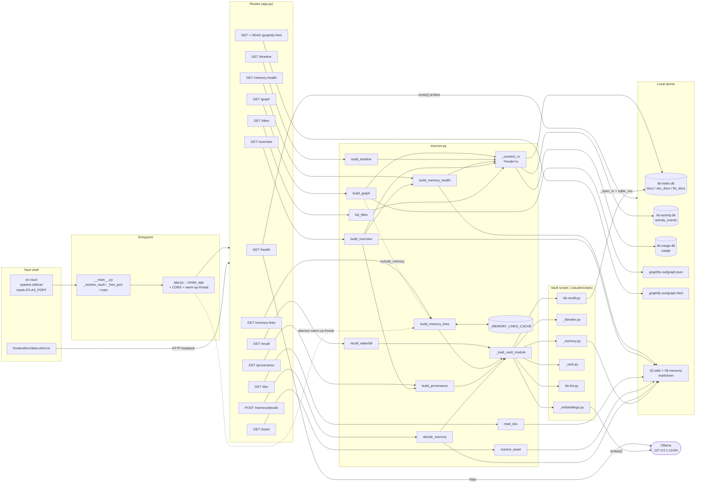
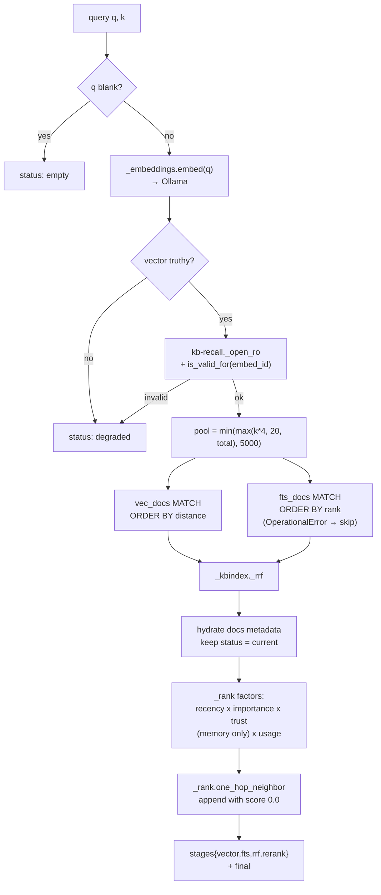

# C4 Code Level — Atlas Sidecar

## 1. Overview

| Field | Value |
| --- | --- |
| **Name** | KennisBank Atlas sidecar (`atlas.sidecar`) |
| **Description** | A localhost-only FastAPI application that reads the local KennisBank stores (SQLite + vault markdown) and serves one JSON payload per Atlas lens. Read-only by construction, fail-open by policy, with exactly one deliberate write path (`POST /memory/decide`). |
| **Location** | `atlas/sidecar/` |
| **Language(s)** | Python 3.12 (`from __future__ import annotations` throughout; PEP 604 `X \| None` unions). Packaged with PyInstaller; the spec file is Python evaluated by PyInstaller. |
| **Purpose** | Give the Atlas desktop app (Tauri shell + TypeScript frontend) a queryable HTTP surface over the vault. It exists because a static export cannot serve a live retrieval waterfall, and because 10k+ activity events and 2.5k graph nodes must be aggregated server-side before they reach a webview (ADR-0004). |
| **Runtime shape** | Frozen with PyInstaller in **onedir** mode and launched by the Tauri shell as a sidecar child process. Binds `127.0.0.1` on an ephemeral port and prints `ATLAS_PORT <port>` on stdout so the shell can discover it. |
| **Trust boundary** | Loopback-only binding is the real boundary; CORS is a second, narrower gate. No outbound network except the local Ollama daemon (`127.0.0.1:11434`) reached indirectly through the vault's `_embeddings` module. |

### Source inventory

| Path | Lines | Role |
| --- | --- | --- |
| `atlas/sidecar/__init__.py` | 0 | Empty package marker. |
| `atlas/sidecar/__main__.py` | 52 | Dev/frozen entrypoint: resolve vault, pick port, run uvicorn. |
| `atlas/sidecar/app.py` | 192 | HTTP layer: `create_app()` factory, CORS, 13 route handlers. |
| `atlas/sidecar/sources.py` | 1058 | Data layer: every SQLite read, markdown read, graph collapse, recall waterfall, and the single write. |
| `atlas/sidecar/atlas-sidecar.spec` | 55 | PyInstaller build spec (onedir). |
| `atlas/sidecar/requirements.txt` | 6 | Runtime dependency pins. |
| `atlas/sidecar/.gitignore` | — | Excludes `build/` and `dist/`. |
| `atlas/sidecar/tests/` | 16 test modules + `conftest.py` (121) + empty `__init__.py` | Pytest suite — see section 5. |

### Generated artifacts — NOT documented element by element

Two directories under `atlas/sidecar/` contain **build output and vendored third-party code**, not authored source. They are deliberately excluded from element-level documentation:

- **`atlas/sidecar/build/atlas-sidecar/`** — PyInstaller intermediates: `Analysis-00.toc`, `PYZ-00.pyz`, `EXE-00.toc`, `COLLECT-00.toc`, `base_library.zip`, `warn-atlas-sidecar.txt`, `xref-atlas-sidecar.html`, and precompiled `localpycs/*.pyc` bootstrap modules.
- **`atlas/sidecar/dist/atlas-sidecar/`** — the frozen onedir bundle: `atlas-sidecar.exe` plus `_internal/` holding the CPython runtime, Windows API-set DLLs (`api-ms-win-*.dll`), OpenSSL (`libcrypto-3.dll`, `libssl-3.dll`, `libffi-8.dll`), and vendored wheels with their `.dist-info` metadata (attrs, click, MarkupSafe, certifi, mypy, pyreadline3, setuptools, …).

Both are covered by `atlas/sidecar/.gitignore`. Their presence in a working tree is a local build residue; nothing in them is hand-maintained, and the container-phase OpenAPI spec should ignore them entirely.

---

## 2. HTTP API reference

This is the section the container phase needs for the OpenAPI spec. Every route is declared inside `create_app()` in `atlas/sidecar/app.py`, so all paths are relative to `http://127.0.0.1:<ATLAS_PORT>`.

FastAPI additionally exposes its own generated `/openapi.json`, `/docs`, and `/redoc` — these are framework defaults, not declared in this codebase.

### 2.0 Route table (summary)

| Method | Path | Handler | app.py:line | Backing `sources` function |
| --- | --- | --- | --- | --- |
| GET | `/health` | `health` | `app.py:96` | `_source_readiness` + `_overall_status` (local to `app.py`) |
| GET | `/graph` | `graph` | `app.py:106` | `sources.build_graph` |
| GET | `/timeline` | `timeline` | `app.py:110` | `sources.build_timeline` |
| GET | `/memory-health` | `memory_health` | `app.py:118` | `sources.build_memory_health` |
| GET | `/overview` | `overview` | `app.py:122` | `sources.build_overview` |
| GET | `/titles` | `titles` | `app.py:126` | `sources.list_titles` |
| POST | `/memory/decide` | `memory_decide` | `app.py:130` | `sources.decide_memory` |
| GET | `/provenance` | `provenance` | `app.py:139` | `sources.build_provenance` |
| GET | `/doc` | `doc` | `app.py:143` | `sources.read_doc` |
| GET | `/asset` | `asset` | `app.py:150` | `sources.resolve_asset` → `FileResponse` |
| GET, HEAD | `/graphify-html` | `graphify_html` | `app.py:160` | none — direct file serve |
| GET | `/recall` | `recall` | `app.py:172` | `sources.recall_waterfall` (via `_recall`, `app.py:84`) |
| GET | `/memory-links` | `memory_links` | `app.py:176` | `sources.build_memory_links` |

**Error model.** Only `/memory/decide`, `/doc`, `/asset`, and `/graphify-html` raise `HTTPException`, producing FastAPI's default body `{"detail": "<string>"}`. Detail strings are **Dutch** (e.g. `"alleen .md-bestanden"`, `"pad buiten de vault"`) — the OpenAPI spec should treat them as opaque human-readable text, not machine-parseable codes. Every other route is fail-open and returns HTTP 200 with a degraded/empty payload rather than an error status.

**Status vocabulary.** Nearly every payload carries a top-level `status` string. Observed values: `"ok"`, `"empty"`, `"degraded"`. `/overview` always returns `"ok"`.

---

### 2.1 `GET /health`

Declared at `app.py:95-103`.

- **Parameters**: none.
- **Response 200**:

```json
{
  "status": "ok | degraded | empty",
  "version": "0.1.0",
  "vault": "/absolute/path/to/vault",
  "sources": {
    "kb_index": true, "activity": true, "usage": true,
    "memory": true, "graph": true, "ollama": true
  }
}
```

- **Semantics**: `sources` is computed by `_source_readiness` (`app.py:46-55`) as pure filesystem existence checks — `.claude/kb-index.db`, `.claude/kb-activity.db`, `.claude/kb-usage.db`, `09-memory/` (directory), `graphify-out/graph.json` — plus a live `ollama` probe. `_overall_status` (`app.py:58-64`) folds the six booleans: all true → `"ok"`, none true → `"empty"`, otherwise `"degraded"`.
- **SQLite**: none. This route touches no database; it only stats paths.
- **External call**: `_default_ollama_probe` (`app.py:35-43`) issues `httpx.get("http://127.0.0.1:11434/api/version", timeout=1.0)` and returns `resp.status_code == 200`; any exception → `False`. Injectable via the `ollama_probe` keyword of `create_app`, which is how the tests stay hermetic.
- **Note for the spec**: `version` is the module constant `VERSION = "0.1.0"` (`app.py:22`), not the KennisBank release version.

---

### 2.2 `GET /graph`

Declared at `app.py:105-107`. Backed by `sources.build_graph` (`sources.py:94-172`).

- **Query parameters**:

| Name | Type | Default | Notes |
| --- | --- | --- | --- |
| `include_memory` | boolean | `false` | FastAPI bool coercion, so `1`, `true`, `on`, `yes` all work. The frontend sends `?include_memory=1`. |

- **Response 200**:

```json
{
  "status": "ok | empty",
  "nodes": [
    {
      "id": "02-wiki/alpha.md",
      "label": "alpha.md",
      "kind": "wiki | memory",
      "layer": "wiki",
      "node_status": "current",
      "community": 3,
      "community_name": "infra",
      "memory_type": null,
      "importance": 0.0,
      "warmth": 7.0,
      "created": "2026-01-01",
      "valid_from": null,
      "valid_until": null,
      "degree": 1
    }
  ],
  "links": [
    { "source": "02-wiki/alpha.md", "target": "02-wiki/beta.md", "rel": "references", "weight": 2.0 }
  ]
}
```

- **Semantics**: reads `graphify-out/graph.json`, then collapses concept-level nodes to **one node per `source_file`**, keeping only files under `02-wiki/` or `09-memory/` that end in `.md` (`_KEPT_PREFIXES`, `sources.py:68`; `_is_kept`, `sources.py:75-77`). Links are remapped through a `slug → source_file` table, self-loops dropped, and parallel edges aggregated by summing `weight` under a sorted `(source, target)` key. `degree` is then counted from the surviving file-level edges. `nodes` is sorted by `id`; `links` by `(source, target)`. `status` is `"ok"` when at least one node survives, else `"empty"`.
- **With `include_memory=true`**: `_add_memory_nodes` (`sources.py:175-207`) globs `09-memory/*.md`, parses each file's front-matter, and appends a node with `kind="memory"`, `layer="memory"`, real `memory_type`/`importance`/`valid_from`/`valid_until`, plus one `rel: "entry-point"` edge to the wiki article that `build_memory_links` associates with the fragment. Note that these memory edges are keyed `(mem_id, target)` **unsorted**, unlike the wiki edges. Because this path calls `build_memory_links`, `include_memory=1` can trigger the expensive index scan (see 2.13).
- **SQLite queries**:
  - `kbindex_docs` (`sources.py:46-48`), on `.claude/kb-index.db`:
    `SELECT path, layer, status, title, created FROM docs`
  - `usage_warmth` (`sources.py:86-87`), on `.claude/kb-usage.db`:
    `SELECT stem, used FROM usage`
- **Join key**: `_rel_key` (`sources.py:26-37`) normalises kb-index's absolute OS paths and graphify's vault-relative POSIX paths to the same key. `warmth` joins on the bare file **stem**, because `kb-usage` is keyed by stem.
- **Open-ended and nullable fields** (the JSON above uses illustrative values, not an enum): `community` and `community_name` are passed straight through from graphify's community detection (`sources.py:129-130`) and are `null` for any node graphify did not cluster — and always `null` for memory nodes (`sources.py:193-194`). `layer` and `node_status` fall back to the node `kind` and to `"active"` respectively when kb-index has no row for the file. `rel` is whatever `relation` string graphify wrote, defaulting to `""`, and for aggregated parallel edges it is the relation of whichever edge was seen *first* — the others are folded into `weight` and their relation labels are lost.

---

### 2.3 `GET /timeline`

Declared at `app.py:109-115`. Backed by `sources.build_timeline` (`sources.py:229-287`).

- **Query parameters**:

| Wire name | Python name | Type | Default | Notes |
| --- | --- | --- | --- | --- |
| `bucket` | `bucket` | string | `"day"` | `"week"` snaps to the Monday of the ISO week; **any other value falls through to day granularity** (no validation, no 422). |
| `from` | `frm` | string \| null | `null` | Declared `Query(default=None, alias="from")` because `from` is a Python keyword. ISO date; only the first 10 chars are parsed. |
| `to` | `to` | string \| null | `null` | ISO date, inclusive upper bound. |
| `dimension` | `dimension` | string | `"event"` | Selects which field the `[from, to]` filter applies to: `"event"` → `event_time`, anything else → `captured_at`. |

- **Response 200**:

```json
{
  "status": "ok | empty",
  "buckets": [
    {
      "start": "2026-07-01T00:00:00",
      "end": "2026-07-02T00:00:00",
      "event_count": 2,
      "capture_count": 1,
      "by_kind": { "edit": 1, "recall": 1 }
    }
  ]
}
```

- **Semantics**: bi-temporal aggregation. Every row contributes to **two** buckets: its `event_time` bucket (incrementing `event_count` and the `by_kind` histogram, defaulting a null kind to `"activity"`) and its `captured_at` bucket (incrementing `capture_count`). The range filter is applied once, on the `dimension` field, before either increment. Buckets are emitted in chronological order. Missing DB or a failed query → `{"status": "empty", "buckets": []}`.
- **SQLite query** (`sources.py:242-244`), on `.claude/kb-activity.db`:
  `SELECT event_time, captured_at, activity_kind FROM activity_events`
  All bucketing happens in Python; the SQL is a full table scan. `tests/test_perf.py` pins this at under 1 second for 4000 events.

---

### 2.4 `GET /memory-health`

Declared at `app.py:117-119`. Backed by `sources.build_memory_health` (`sources.py:337-417`).

- **Parameters**: none. (`build_memory_health` accepts a keyword-only `today` for deterministic tests, but the route does not expose it.)
- **Response 200**:

```json
{
  "status": "ok | empty",
  "counts": { "active": 1, "quarantined": 1, "superseded": 0, "unverified": 2 },
  "queue": [ { "id": "u-hi", "importance": 5, "created": "2026-07-19" } ],
  "supersede_chains": [
    { "head": "old", "chain": ["old", "new", "gone"], "missing": ["gone"], "valid_until": "2026-07-22" }
  ],
  "heatmap": [ { "id": "m", "importance": 4, "age_days": 10 } ],
  "warmth": [
    { "path": "09-memory/hot.md", "warmth": 3.0, "last_used": "2026-07-27", "temperature": "warm" }
  ],
  "quarantine": [ { "id": "m-bad", "reason": "conflict" } ]
}
```

- **Semantics**: globs `09-memory/*.md`, parses each front-matter block, and buckets by `status`. `active` counts `{current, active}` (`_ACTIVE_STATUSES`, `sources.py:314`) and feeds the importance × recency `heatmap`; `unverified` feeds the review `queue`, sorted by importance descending then `created` then `id`; `quarantined` feeds `quarantine` with its `quarantine_reason`. Supersede chains are walked from `superseded_by` edges with a 100-hop guard against cycles, and `missing` flags chain targets that have no backing file so the UI can render them muted. `importance` is clamped to 1..5 with a fallback of 3 (`_coerce_importance`, `sources.py:317-321`). `temperature` derives from `last_used` age: ≤30 days `"warm"`, ≤90 `"tepid"`, else `"stale"`; a null `last_used` is `"stale"` (`_temperature`, `sources.py:330-334`).
- **SQLite query** — `_memory_warmth` (`sources.py:436-438`), on `.claude/kb-usage.db`:
  `SELECT stem, used, last_used FROM usage`
  Each bare stem is resolved back to a real vault path by probing `02-wiki/<stem>.md` then `09-memory/<stem>.md` (`_stem_doc_path`, `sources.py:420-427`), so the viewer can open it. Results sort by warmth descending, then path.
- **Filesystem reads**: one `read_text` per memory fragment. This is the one lens whose cost scales linearly with the memory corpus.
- **Empty case**: a missing `09-memory/` directory, or one with no `.md` files, returns the zero-filled `empty` skeleton (`sources.py:344-348`) — all six collections present but empty, so the client needs no null checks.

---

### 2.5 `GET /overview`

Declared at `app.py:121-123`. Backed by `sources.build_overview` (`sources.py:926-980`).

- **Parameters**: none (`today` is injectable in Python, not over HTTP).
- **Response 200** (`status` is always `"ok"`):

```json
{
  "status": "ok",
  "wiki": { "total": 2, "by_status": { "actief": 1, "concept": 1 } },
  "memory": { "active": 1, "quarantined": 0, "superseded": 0, "unverified": 1 },
  "memory_status": "ok | empty",
  "raw": { "sessies": 1, "transcripts": 0 },
  "inbox_waiting": 1,
  "provenance": { "sourced": 1, "total": 2 },
  "graph_stale": false,
  "heatmap": [ { "day": "2026-07-29", "n": 2 } ],
  "freshness": { "d7": 1, "d30": 0, "d90": 0, "older": 1, "unknown": 1 }
}
```

- **Semantics**: the composite health page. `wiki.by_status` is read from each article's **own front-matter** `status` (the Dutch editorial vocabulary `actief`/`concept`/`stabiel`/`archief`, lowercased, missing → `"onbekend"`) — deliberately *not* the kb-index `status` column, which holds lifecycle state and would collapse every article into one bucket. `freshness` buckets articles by the age of `updated` (falling back to `created`) into ≤7 / ≤30 / ≤90 / older, with unparseable or absent dates counted as `unknown`. `graph_stale` is the mere existence of `graphify-out/.needs-rebuild`. `memory` and `memory_status` are lifted from `build_memory_health`; `provenance` is reduced to a two-number coverage line from `build_provenance`.
- **Note**: `by_status` keys are **open-ended** — any front-matter status string becomes a key. An OpenAPI spec should model it as `additionalProperties: integer`, not an enum.
- **SQLite query** — `_activity_heatmap` (`sources.py:914-916`), on `.claude/kb-activity.db`:
  `SELECT substr(event_time, 1, 10) AS day, count(*) FROM activity_events GROUP BY day`
  Aggregated in SQL on purpose (the "view data is aggregated, never computed per item while the user waits" lesson noted in the docstring), then truncated in Python to the last `days=365`.
- **Transitive queries**: because it calls `build_memory_health` and `build_provenance`, this route also runs the `kb-usage` warmth query and, when the vault has deployed scripts, the whole of `kb-lint`. `/overview` is therefore the heaviest read-only endpoint.
- **Filesystem reads**: one `read_text` per wiki article, plus `_count_files` globs over `01-raw/sessies`, `01-raw/transcripts`, and `00-inbox` (`_count_files`, `sources.py:896-900`, skips dotfiles).

---

### 2.6 `GET /titles`

Declared at `app.py:125-127`. Backed by `sources.list_titles` (`sources.py:983-1001`).

- **Parameters**: none.
- **Response 200**:

```json
{ "status": "ok | empty", "items": [ { "title": "Traefik", "path": "02-wiki/traefik.md", "layer": "wiki" } ] }
```

- **Semantics**: the title index for the Cmd+K palette. Loaded once per client session and filtered client-side — no live query per keystroke. A null `title` falls back to the path stem; a null `layer` becomes `""`. Paths are normalised to vault-relative POSIX via `_rel_key`.
- **SQLite query** (`sources.py:991`), on `.claude/kb-index.db`:
  `SELECT path, layer, title FROM docs ORDER BY title`
- **Empty case**: missing DB or a failed query → `{"status": "empty", "items": []}`.

---

### 2.7 `POST /memory/decide`

Declared at `app.py:129-136`. Backed by `sources.decide_memory` (`sources.py:1014-1058`). **This is the only write path in the entire sidecar.**

- **Request body** (`application/json`). The handler takes an untyped `payload: dict` and coerces both fields with `str()`, so there is no Pydantic model and no 422 for a wrong shape — a missing key becomes `""` and fails the guards below:

```json
{ "stem": "u1", "decision": "approve | reject" }
```

- **Response 200**:

```json
{ "status": "ok", "stem": "u1", "new_status": "current | retracted" }
```

- **Error responses** (`{"detail": "..."}`):

| Code | Trigger | Detail (Dutch) |
| --- | --- | --- |
| 400 | `decision` not in `{approve, reject}` | `onbekende beslissing: '<x>' (approve\|reject)` |
| 400 | empty stem, or stem containing `/`, `\`, or `..` | `ongeldige stem` |
| 400 | resolved path escapes `09-memory/` | `pad buiten 09-memory` |
| 404 | no such fragment file | `memory-fragment niet gevonden` |
| 409 | current front-matter status is not `unverified` | `status is <x>, alleen unverified is beslisbaar` |
| 409 | no `status:` line to rewrite | `geen status-regel in frontmatter` |

  **Which path produces which detail matters.** Only the first row (the `decision` validation, `sources.py:1015-1017`) runs before the branch. Every other row above is an **inline-fallback** guard: on a deployed vault the shared `mem.decide()` is called first (`sources.py:1036`), so those five details never appear — the failure instead arrives as a `ReviewError` re-raised with the helper's own `code` and message (`sources.py:1037-1038`). A spec author should treat the detail *strings* as fallback-path examples and the *status codes* as the stable contract, since the shared helper is the normal path in production.

- **Semantics**: `approve` → `current`, `reject` → `retracted` (`_DECISIONS`, `sources.py:1011`). Only an `unverified` fragment is decidable. Two code paths:
  1. **Shared path (preferred)** — loads the vault's `_memory.py` and calls `mem.decide(stem, decision, via="atlas")`, so guards, crash-safe write ordering, and the append-only audit log at `.claude/memory-review-log.jsonl` exist in exactly one place across Atlas, CLI, slash-command, and MCP (TASK-89). Guarded by a **vault-identity check** (`sources.py:1031`): the helper resolves the vault itself via `vault_root()`, so the shared path is only taken when that resolution lands on *this* vault — otherwise a divergent `KENNISBANK_VAULT` could make the sidecar decide inside a different vault.
  2. **Inline fallback** — for older vaults with no `.claude/scripts`. Validates the stem, confirms containment under `09-memory/`, reads the file, requires `status: unverified`, and rewrites exactly one line with `re.subn(r"^status:.*$", ..., count=1, flags=MULTILINE)`. Writes no audit log; `tests/test_decide_overview.py:135` pins that difference.
- **SQLite**: none. This route touches markdown only, and never anything outside `09-memory/`.

---

### 2.8 `GET /provenance`

Declared at `app.py:138-140`. Backed by `sources.build_provenance` (`sources.py:467-491`).

- **Parameters**: none.
- **Response 200**:

```json
{
  "status": "ok | empty",
  "coverage": { "sourced": 2, "unsourced": 1, "total": 3 },
  "unsourced": [
    { "path": "02-wiki/orphan.md", "reason": "geen bronvermelding gevonden", "types": ["missing"] }
  ]
}
```

- **Semantics**: provenance coverage over `02-wiki`. The primary path imports the vault's own `kb-lint.py` and calls `lint_vault(vault.resolve())` — data-parity by reuse rather than reimplementation. If kb-lint cannot be loaded or raises (a fixture vault, an older deploy, a missing `02-wiki`), everything falls back to `_provenance_heuristic` (`sources.py:494-528`), which counts an article as sourced when it carries a wikilink whose target starts with `raw-sessie` or `05-bronnen/` (`_HERKOMST_PREFIXES`, `sources.py:456`; `_has_herkomst`, `sources.py:459-464`).

- **The upstream contract** — verified against `scripts/kb-lint.py`, since `build_provenance` indexes it positionally and a key mismatch would silently kill the primary path. `lint_vault(root) -> dict` (`scripts/kb-lint.py:238`) returns `{articles, clean, warned, hard, warnings}` and each warning is `{"file": str, "type": str, "detail": str}` (documented at `scripts/kb-lint.py:146`). All six keys `build_provenance` reads (`report["clean"]`, `report["warned"]`, `report["articles"]`, `w["file"]`, `w["detail"]`, `w["type"]`) **do exist**, so the primary path is live, not dead code. Note `lint_vault` raises `FileNotFoundError` when `02-wiki/` is absent, which is what routes an empty vault to the heuristic.

- **`types` enum** — the real value space, enumerated from `scripts/kb-lint.py`, not guessed:

| Value | Emitted at | Meaning |
| --- | --- | --- |
| `missing` | `kb-lint.py:200` | No *herkomst* reference at all |
| `dangling` | `kb-lint.py:187` | Reference points at a non-existent session/source |
| `path-only` | `kb-lint.py:194` | Reference is a bare path, not a resolvable wikilink |
| `self-source` | `kb-lint.py:179` | Article cites itself as its own source |
| `unreadable` | `kb-lint.py:152` | The file could not be read |
| `index-drift` | `kb-lint.py:232` | Indexed docs no longer exist on disk |

  `HARD_TYPES = ("missing", "dangling", "self-source")` (`kb-lint.py:61`) drives kb-lint's own `--strict` exit, but the sidecar ignores `report["hard"]` entirely.

- **Shape caveat for the spec**: `types` is present **only** on the primary kb-lint path (`sources.py:481`). The heuristic fallback omits it entirely (`sources.py:515-518`) and always reports the single Dutch reason string `"geen herkomst: geen [[raw-sessie-...]]- of [[05-bronnen/...]]-verwijzing"`. Model `types` as an optional array.

- **⚠️ Two defects a spec author should know about**, both consequences of `build_provenance` grouping *all* warnings while `lint_vault` counts only article findings:
  1. **`unsourced` can contain a path that is not a wiki article.** `lint_index_drift` emits `{"file": "kb-index.db", ...}` (`kb-lint.py:229-231`), and `sources.py:479` unconditionally prefixes every grouped key with `02-wiki/`. An index-drift finding therefore surfaces as `{"path": "02-wiki/kb-index.db", "types": ["index-drift"]}` — a path that does not exist and will 404 if the client opens it.
  2. **`coverage.unsourced` and `len(unsourced)` can disagree.** `lint_vault` computes `warned` from `warned_files` with index-drift explicitly excluded (`kb-lint.py:256`), but `build_provenance` builds its list from every warning. With index drift present, `len(unsourced) == coverage.unsourced + 1`. Do not model them as the same number.

  The route's own docstring describes at-risk as "missing, dangling, or path-only", but the code filters on nothing — `unreadable`, `self-source`, and `index-drift` findings all land in `unsourced` too.

- **SQLite**: none opened by this module. `kb-lint` internally opens `kb-index.db` read-only for its drift check (`kb-lint.py:221`).
- **Note**: the `except Exception` at `sources.py:490` is broad enough that a genuine kb-lint bug degrades silently into heuristic numbers, with no signal in the payload that the fallback ran. Worth knowing when the two paths disagree.

---

### 2.9 `GET /doc`

Declared at `app.py:142-147`. Backed by `sources.read_doc` (`sources.py:597-619`).

- **Query parameters**: `path` (string, default `""`) — vault-relative.
- **Response 200**:

```json
{ "status": "ok", "path": "02-wiki/alpha.md", "title": "Alpha", "content": "# Alpha\n\n..." }
```

- **Error responses**: `400 "alleen .md-bestanden"` (empty path or non-`.md` suffix), `400 "pad buiten de vault"` (traversal), `404 "bestand niet gevonden"`, `404 <OSError text>`.
- **Semantics**: **fail-closed**, unlike the rest of the module. Two gates: the extension must be `.md`, and the `resolve()`d target must equal the vault root or have it among `.parents`. `title` is the first `# ` heading in the body, falling back to the file stem. Content is read as UTF-8 with `errors="replace"` so a mojibake byte cannot 500 the route. The returned `path` is re-derived from the resolved target, so it is always canonical vault-relative POSIX.

---

### 2.10 `GET /asset`

Declared at `app.py:149-155`. Validation in `sources.resolve_asset` (`sources.py:628-640`).

- **Query parameters**: `path` (string, default `""`) — vault-relative.
- **Response 200**: the raw image bytes as a `FileResponse`, with `Content-Type` from the extension map. **Not JSON** — the spec should declare binary content.
- **Allowed extensions** (`_ASSET_TYPES`, `sources.py:622-625`): `.png` → `image/png`, `.jpg`/`.jpeg` → `image/jpeg`, `.gif` → `image/gif`, `.webp` → `image/webp`, `.svg` → `image/svg+xml`.
- **Error responses**: `400 "alleen afbeeldingen"` (unknown or absent extension), `400 "pad buiten de vault"`, `404 "afbeelding niet gevonden"`.
- **Semantics**: same fail-closed containment check as `/doc`, but gated on an extension allowlist instead of a single suffix. The function returns `(Path, media_type)` and the route wraps it; no bytes are read in `sources`.

---

### 2.11 `GET | HEAD /graphify-html`

Declared at `app.py:159-169` using `@app.api_route(..., methods=["GET", "HEAD"])`.

- **Parameters**: none.
- **Response 200**: `graphify-out/graph.html` served as `text/html`.
- **Error response**: `404 "geen graphify-out/graph.html in de vault"`.
- **Semantics**: serves the self-contained interactive graph page that the `/graphify` pipeline writes; the Graphify lens embeds it in an iframe. It goes over loopback HTTP rather than `file://` specifically so the page's scripts execute. **HEAD is declared explicitly** because the lens probes with HEAD before embedding and a bare `@app.get` would answer 405 — `tests/test_graphify_html.py:31` pins this.
- **Note**: this is the one route with no `sources` indirection and no path parameter, so no containment check is needed — the target is a fixed literal path.

---

### 2.12 `GET /recall`

Declared at `app.py:171-173`, wrapped by the closure `_recall` (`app.py:84-93`). Backed by `sources.recall_waterfall` (`sources.py:643-776`).

- **Query parameters**: `q` (string, default `""`), `k` (integer, default `3`).
  Note the default mismatch: the route defaults `k=3` while `recall_waterfall` itself defaults `k=8`. The route's value always wins over HTTP.
- **Response 200**:

```json
{
  "status": "ok | empty | degraded",
  "query": "otgw",
  "stages": {
    "vector": [ { "path": "...", "score": 1.0 } ],
    "fts":    [ { "path": "...", "score": 0.5 } ],
    "rrf":    [ { "path": "...", "score": 0.032 } ],
    "rerank": [ { "path": "...", "score": 0.036,
                  "factors": { "relevance": 0.032, "recency": 0.9, "importance": 1.1,
                               "trust": 1.05, "usage": 1.1, "final": 0.036 } } ]
  },
  "final": [ { "path": "...", "score": 0.036, "snippet": "..." } ]
}
```

- **Shape caveats for the spec**:
  - `factors` keys are **conditional**: `relevance` and `final` are always present; `recency`/`importance`/`trust` only for `layer == "memory"` hits; `usage` only when the vault's `_usage` module loaded.
  - The graph-neighbour entry appended at `sources.py:763-766` carries an extra `"neighbor": true` and a `score` of `0.0`, in both `final` and `rerank`.
  - An empty or whitespace-only `q` short-circuits to `status: "empty"` with all four stages present but empty.
- **Semantics**: the live retrieval waterfall for the Recall Inspector, surfacing every intermediate stage. Data-parity holds by construction: it reuses the vault's own `_embeddings.embed`, `_kbindex._rrf`, `_kbindex._serialize`, `kb-recall._open_ro`, `kb-recall._frontmatter_of`, and the `_rank` factor functions rather than reimplementing them. Candidate pool is `min(max(k * 4, 20, total), 5000)`. Only `status == "current"` docs survive into the ranked hits. Rerank multiplies relevance × recency × importance × trust × usage; the test suite pins that the factors multiply to `final`. Any exception anywhere → `status: "degraded"` with empty stages.
- **SQLite queries** — all on `kb-index.db`, opened through `kb-recall._open_ro` (which loads the `sqlite_vec` extension, so these are *not* `_connect_ro` connections):
  1. `SELECT count(*) FROM docs` — pool sizing (`sources.py:679`)
  2. `SELECT doc_id FROM vec_docs WHERE embedding MATCH ? ORDER BY distance LIMIT ?` — vector KNN (`sources.py:682-683`)
  3. `SELECT rowid FROM fts_docs WHERE fts_docs MATCH ? ORDER BY rank LIMIT ?` — FTS5 candidates; a raw user query can be invalid FTS syntax, so `sqlite3.OperationalError` is swallowed and the stage degrades to empty (`sources.py:687-690`)
  4. `SELECT doc_id, path, layer, status, title, created FROM docs WHERE doc_id IN (<placeholders>)` — metadata hydration (`sources.py:696-698`)
- **External call**: `_embeddings.embed(query)` reaches the local Ollama daemon over HTTP. A falsy vector short-circuits to `"degraded"`. The index is also validated against `emb.embed_id()` via `kbindex.is_valid_for` so a model change cannot silently return nonsense.

---

### 2.13 `GET /memory-links`

Declared at `app.py:175-181`. Backed by `sources.build_memory_links` (`sources.py:809-880`).

- **Parameters**: none.
- **Response 200**:

```json
{
  "status": "ok | empty | degraded",
  "links": { "m-1": "02-wiki/alpha.md", "m-2": "02-wiki/alpha.md" },
  "counts": { "02-wiki/alpha.md": 2 },
  "types": { "m-1": "procedure" }
}
```

- **Semantics**: links each `09-memory` fragment to the wiki article it sits closest to, so the Graph lens can show per-article "entry-point" counts. `links` maps fragment stem → article path; `counts` maps article path → number of fragments pointing at it; `types` maps fragment stem → `memory_type`. The similarity is a **hybrid without rerank and without re-embedding**: the fragment's *stored* embedding drives a vector KNN, fused by RRF with an FTS match on an OR-query built from the fragment's title and opening terms (`_mem_query_and_type`, `sources.py:784-806`, capped at 12 tokens of ≥4 alphanumerics). Rerank is deliberately excluded because it would bias toward popular articles rather than the closest one. The first fused candidate that is in the wiki layer wins.
- **Performance**: roughly **47 seconds** on the real vault, because it scans stored embeddings for every fragment. Mitigated two ways: an in-process cache keyed by resolved vault path (`_MEMORY_LINKS_CACHE`, `sources.py:781`), and a daemon warm-up thread started in `create_app` (`app.py:185-190`) whenever a real `kb-index.db` exists and no `links_fn` was injected. The container phase should treat this endpoint as slow-on-cold-cache and note that `GET /graph?include_memory=1` shares the same cost.
- **SQLite queries** — on `kb-index.db` via `kb-recall._open_ro`:
  1. `SELECT doc_id, path, layer FROM docs` — partition into wiki and memory ids (`sources.py:831`)
  2. `SELECT embedding FROM vec_docs WHERE doc_id = ?` — the fragment's stored vector, per fragment (`sources.py:839`)
  3. `SELECT doc_id FROM vec_docs WHERE embedding MATCH ? ORDER BY distance LIMIT 20` — KNN, per fragment (`sources.py:847-848`)
  4. `SELECT rowid FROM fts_docs WHERE fts_docs MATCH ? ORDER BY rank LIMIT 20` — FTS, per fragment, `OperationalError` swallowed (`sources.py:853-855`)
- **Fail-open**: `sources` returns the `empty` skeleton on any exception; the route adds a second net (`app.py:180-181`) returning `{"status": "degraded", "links": {}, "counts": {}, "types": {}}`.

---

## 3. Code Elements

### 3.1 `atlas/sidecar/__main__.py` — runtime entrypoint

Role: resolve the vault, negotiate a port, run uvicorn. This is the module PyInstaller freezes.

| Signature | Location | Behaviour | Depends on |
| --- | --- | --- | --- |
| `_free_port() -> int` | `__main__.py:20` | Binds a throwaway socket to `("127.0.0.1", 0)` and returns the kernel-assigned port. Classic ephemeral-port negotiation; inherently racy between `close()` and uvicorn's `bind()`, but acceptable on loopback. | `socket` |
| `_resolve_vault(cli_vault: str \| None) -> Path` | `__main__.py:26` | Precedence: `--vault` argument, then `KENNISBANK_VAULT`. If neither is set it raises `SystemExit` with an explicit message — **no hardcoded default**, per ADR-0002. | `os`, `pathlib` |
| `main() -> None` | `__main__.py:37` | Parses `--host` (default `127.0.0.1`), `--port` (default `0` = ephemeral), `--vault`; prints `ATLAS_PORT <port>` with `flush=True` **before** blocking so the Tauri shell can read it; then `uvicorn.run(create_app(vault), ..., log_level="warning")`. | `argparse`, `uvicorn`, `app.create_app` |

Module guard `if __name__ == "__main__": main()` at `__main__.py:51-52`.

Note: `--host` is a parameter but loopback is the intended and documented value; nothing in the code enforces it, so the safety property is convention plus the default, not a hard guard.

### 3.2 `atlas/sidecar/app.py` — HTTP layer

Role: the FastAPI application factory and all route declarations. Contains no SQL and no direct store access beyond `Path.exists()` readiness probes.

**Module-level constants**

| Name | Location | Value / purpose |
| --- | --- | --- |
| `VERSION` | `app.py:22` | `"0.1.0"` — reported by `/health`. |
| `_CORS_ORIGIN_REGEX` | `app.py:29-32` | `^(https?://(localhost\|127\.0\.0\.1)(:\d+)?\|tauri://localhost\|https?://tauri\.localhost)$`. Covers the Vite dev server, `tauri://localhost` on macOS/Linux, and `http://tauri.localhost` for Windows WebView2 (plain HTTP, no TLS — omitting it breaks every fetch in the bundled Windows app). |

**Module-level functions**

| Signature | Location | Behaviour | Depends on |
| --- | --- | --- | --- |
| `_default_ollama_probe() -> bool` | `app.py:35` | Imports `httpx` lazily, GETs `http://127.0.0.1:11434/api/version` with a 1-second timeout, returns `status_code == 200`. Bare `except Exception` → `False`, so a missing httpx or a dead daemon is a readiness fact, not a crash. | `httpx` (local import) |
| `_source_readiness(vault: Path, ollama_probe: Callable[[], bool]) -> dict[str, bool]` | `app.py:46` | Six existence checks: `.claude/kb-index.db`, `.claude/kb-activity.db`, `.claude/kb-usage.db`, `09-memory/` (`is_dir`), `graphify-out/graph.json`, plus `ollama_probe()`. | `pathlib` |
| `_overall_status(sources: dict[str, bool]) -> str` | `app.py:58` | `all` → `"ok"`, `not any` → `"empty"`, else `"degraded"`. | — |
| `create_app(vault: Path, *, ollama_probe: Callable[[], bool] = _default_ollama_probe, recall_fn: Callable[[str, int], dict] \| None = None, links_fn: Callable[[], dict] \| None = None) -> FastAPI` | `app.py:67` | The factory. Coerces `vault` to `Path`, builds the `FastAPI` instance, installs `CORSMiddleware` with the origin regex and `allow_methods=["GET", "POST"]` (POST covers exactly one route), declares all 13 handlers as closures over `vault`, and conditionally starts the memory-links warm-up thread. The three keyword-only injection points are what make the whole suite hermetic — no monkeypatching of module globals required. | `fastapi`, `sources` |

**Nested closure**

| Signature | Location | Behaviour |
| --- | --- | --- |
| `_recall(q: str, k: int) -> dict` | `app.py:84` | Dispatches to `recall_fn` if injected, else `sources.recall_waterfall(vault, q, k)`. Wraps the call in `try/except Exception` and returns a `"degraded"` skeleton with all four empty stages, so Ollama being down degrades one lens instead of erroring the app. |

**Route handlers.** All 13 are closures declared inside `create_app`; their signatures, parameters, and response shapes are documented exhaustively in section 2 and not repeated here. For reference: `health` (`:96`), `graph` (`:106`), `timeline` (`:110`), `memory_health` (`:118`), `overview` (`:122`), `titles` (`:126`), `memory_decide` (`:130`), `provenance` (`:139`), `doc` (`:143`), `asset` (`:150`), `graphify_html` (`:160`), `recall` (`:172`), `memory_links` (`:176`).

**Startup side effect** (`app.py:185-190`): when `links_fn is None` **and** `.claude/kb-index.db` exists, a `daemon=True` thread runs `sources.build_memory_links(vault)` to warm the cache. The `kb-index.db` condition is what keeps the thread out of test runs against fixture vaults.

### 3.3 `atlas/sidecar/sources.py` — data layer

Role: every read against the vault, plus the single write. All 40 functions are listed below — nothing is summarised away. Private helpers are marked, and the three functions with no caller are flagged explicitly.

**Connection and path helpers**

| Signature | Location | Behaviour | Depends on |
| --- | --- | --- | --- |
| `_connect_ro(db_path: Path) -> sqlite3.Connection \| None` | `sources.py:15` | Returns `None` if the file is absent; otherwise opens `file:<posix>?mode=ro` with `uri=True` and sets `row_factory = sqlite3.Row`. **The `?mode=ro` URI is the read-only invariant** — a write is physically impossible, not merely unattempted (`tests/test_readonly.py` asserts a byte-identical DB hash after hitting every data route). Any exception → `None`. | `sqlite3` |
| `_rel_key(vault: Path, path: str) -> str` | `sources.py:26` | Reduces a stored doc path to a vault-relative POSIX key. kb-index stores absolute OS paths; graphify stores vault-relative POSIX; both collapse to `"02-wiki/x.md"` so the join matches. Non-relative paths pass through unchanged. | `pathlib` |
| `_load_vault_module(vault: Path, name: str, filename: str)` | `sources.py:536` | Imports a vault script **by file path**, which is required because the real filenames are hyphenated (`kb-recall.py`) and therefore not importable as modules. **Two side effects worth flagging:** it `setdefault`s `KENNISBANK_VAULT` in `os.environ`, and it prepends `<vault>/.claude/scripts` to `sys.path` so intra-module imports (`_kbindex`, `_embeddings`, …) resolve. This is the reuse seam that gives `/recall` and `/provenance` data-parity with the production hooks. | `importlib.util`, `os`, `sys` |

**kb-index / graph / usage readers**

| Signature | Location | Behaviour | SQL |
| --- | --- | --- | --- |
| `kbindex_docs(vault: Path) -> dict[str, dict]` | `sources.py:40` | Maps vault-relative POSIX path → `{path, layer, status, title, created}`. Fail-open → `{}`. | `SELECT path, layer, status, title, created FROM docs` |
| `load_graph(vault: Path) -> dict` | `sources.py:56` | Parses `graphify-out/graph.json`, returning only `{nodes, links}` with `[]` defaults. Fail-open on missing file or bad JSON. | — |
| `usage_warmth(vault: Path) -> dict[str, float]` | `sources.py:80` | Maps file stem → `used` count as a float. Fail-open → `{}`. | `SELECT stem, used FROM usage` |
| `list_titles(vault: Path) -> dict` | `sources.py:983` | `/titles` payload. Title falls back to path stem, layer to `""`. | `SELECT path, layer, title FROM docs ORDER BY title` |

**Graph builders**

| Signature | Location | Behaviour |
| --- | --- | --- |
| `build_graph(vault: Path, *, include_memory: bool = False) -> dict` | `sources.py:94` | `/graph` payload. Collapses concept nodes to file nodes, joins kb-index metadata and usage warmth, aggregates parallel edges, drops self-loops, computes degree. See 2.2. |
| `_kind_for(path: str) -> str` *(private)* | `sources.py:71` | `"memory"` when the path starts with `09-memory/`, else `"wiki"`. |
| `_is_kept(source_file: str \| None) -> bool` *(private)* | `sources.py:75` | True for a non-empty `.md` path under `02-wiki/` or `09-memory/`. Relies on `str.startswith` accepting a tuple. |
| `_add_memory_nodes(vault: Path, nodes: dict, edges: dict, warmth: dict) -> None` *(private)* | `sources.py:175` | Mutates `nodes`/`edges` in place, adding one node per `09-memory/*.md` with front-matter metadata plus a `rel="entry-point"` edge to its linked article. Returns early if `09-memory/` is absent. |

**Date and bucketing helpers** *(all private)*

| Signature | Location | Behaviour |
| --- | --- | --- |
| `_parse_date(iso: str \| None) -> date \| None` | `sources.py:210` | `date.fromisoformat(iso[:10])`; `None` on falsy input or `ValueError`. The `[:10]` slice is what lets full timestamps with offsets parse. |
| `_bucket_start(d: date, bucket: str) -> date` | `sources.py:219` | `"week"` → Monday of the ISO week (`d - timedelta(days=d.weekday())`); anything else → `d` unchanged. |
| `_bucket_end(start: date, bucket: str) -> date` | `sources.py:225` | `start + 7 days` for week, `+1 day` otherwise. |
| `_age_of(iso: str, today: date) -> int` | `sources.py:324` | Non-negative day delta; `0` for an unparseable date. |
| `_temperature(last_used: str \| None, today: date) -> str` | `sources.py:330` | `"warm"` ≤30d, `"tepid"` ≤90d, else `"stale"`; null → `"stale"`. Thresholds mirror `_rank.usage_factor`. |

**Timeline**

| Signature | Location | Behaviour |
| --- | --- | --- |
| `build_timeline(vault: Path, *, bucket: str = "day", frm: str \| None = None, to: str \| None = None, dimension: str = "event") -> dict` | `sources.py:229` | `/timeline` payload. Bi-temporal bucketing with two internal closures: `_slot(d)` (`sources.py:253`) lazily creates a bucket, `_in_range(d)` (`sources.py:263`) applies the date filter. See 2.3. |

**Front-matter and memory health**

| Signature | Location | Behaviour |
| --- | --- | --- |
| `_parse_frontmatter(text: str) -> dict` *(private)* | `sources.py:290` | A deliberately minimal, dependency-free YAML front-matter reader: `key: value` pairs plus simple `[a, b]` lists, quotes stripped. Local on purpose so `/memory-health` stays hermetic — the vault's `_memory` module is not importable in a fixture vault. Returns `{}` when the text has no `---` fence. |
| `_coerce_importance(value) -> int` *(private)* | `sources.py:317` | Clamps to 1..5; `TypeError`/`ValueError` → `3`. |
| `build_memory_health(vault: Path, *, today: date \| None = None) -> dict` | `sources.py:337` | `/memory-health` payload: counts, review queue, supersede chains, heatmap, warmth, quarantine. `today` injectable for deterministic tests. See 2.4. |
| `_stem_doc_path(vault: Path, stem: str) -> str` *(private)* | `sources.py:420` | Resolves a bare kb-usage stem to a real vault-relative path by probing `02-wiki/` then `09-memory/`; falls through to the bare stem. Without this the viewer 404s on a stem. |
| `_memory_warmth(vault: Path, today: date \| None = None) -> list[dict]` *(private)* | `sources.py:430` | Builds the `warmth` list (`path`, `warmth`, `last_used`, `temperature`), sorted by warmth descending then path. |
| `_norm_ref(ref) -> str` *(private)* | `sources.py:889` | Strips `[[`/`]]` from a front-matter reference so `superseded_by: [[stem]]` normalises to `stem`. |

**Provenance**

| Signature | Location | Behaviour |
| --- | --- | --- |
| `build_provenance(vault: Path) -> dict` | `sources.py:467` | `/provenance` payload. Primary path reuses the vault's `kb-lint.lint_vault`; falls back to the local heuristic on any exception. See 2.8. |
| `_has_herkomst(text: str) -> bool` *(private)* | `sources.py:459` | True when any wikilink target (alias split on `\|`, leading `/` stripped) starts with `raw-sessie` or `05-bronnen/`. |
| `_provenance_heuristic(vault: Path) -> dict` *(private)* | `sources.py:494` | The fallback coverage scan over `02-wiki/*.md`. Returns the `empty` shape when the directory is absent or holds no articles. |

**Recall**

| Signature | Location | Behaviour |
| --- | --- | --- |
| `recall_waterfall(vault: Path, query: str, k: int = 8) -> dict` | `sources.py:643` | **The function `/recall` actually uses.** Full four-stage waterfall with exposed per-hit rerank factors. Defines one internal closure `_path(doc_id)` (`sources.py:702`) mapping a doc id to its path via the hydrated metadata. See 2.12. |
| `live_recall(vault: Path, query: str, k: int = 3) -> dict` | `sources.py:552` | ⚠️ **No caller.** A thinner variant that delegates ordering wholesale to `kb-recall.recall_hits` and returns `final` entries carrying `layer` and `neighbor` but leaves `stages` empty. Verified unreferenced by grep across the repo — no route, no test, no other module. Reads as a superseded first implementation kept beside its replacement; it is the *only* place `recall_hits` is called, so deleting it would also drop that reuse path. |

**Memory links**

| Signature | Location | Behaviour |
| --- | --- | --- |
| `build_memory_links(vault: Path, *, use_cache: bool = True) -> dict` | `sources.py:809` | `/memory-links` payload. Hybrid vector+FTS linking on stored embeddings, RRF-fused, no rerank, no re-embed. Cached in `_MEMORY_LINKS_CACHE`. See 2.13. |
| `_mem_query_and_type(vault: Path, rel_path: str) -> tuple[str, str]` *(private)* | `sources.py:784` | One read serves two needs: an FTS-safe `" OR "`-joined query of up to 12 unique ≥4-char alphanumeric tokens from the title plus the first 240 body chars, and the fragment's `memory_type`. Returns `("", "feit")` on `OSError`. |
| `memory_links_for(vault: Path, article_path: str) -> list[str]` | `sources.py:883` | ⚠️ **No caller.** Reverse lookup returning the sorted fragment stems that point at a given article. Verified unreferenced by grep. A ready-made helper for a future per-article overlay endpoint. |

**Overview**

| Signature | Location | Behaviour |
| --- | --- | --- |
| `build_overview(vault: Path, *, today: date \| None = None) -> dict` | `sources.py:926` | `/overview` payload. Composes wiki status/freshness (from article front-matter), memory counts, raw volumes, inbox backlog, provenance coverage, graph staleness, and the activity heatmap. See 2.5. |
| `_count_files(directory: Path, pattern: str = "*") -> int` *(private)* | `sources.py:896` | Counts non-dot files matching a glob; `0` for a missing directory. |
| `_activity_heatmap(vault: Path, *, days: int = 365, today: date \| None = None) -> list` *(private)* | `sources.py:903` | Daily event counts as `[{day, n}]`, aggregated by a single SQL `GROUP BY` then cut to the last `days`. Fail-open → `[]`. |

**Document and asset access**

| Signature | Location | Behaviour |
| --- | --- | --- |
| `read_doc(vault: Path, rel_path: str) -> dict` | `sources.py:597` | `/doc` payload. Fail-closed: `.md` only, containment-checked, `errors="replace"` decoding, title from the first `# ` heading. Raises `DocError`. See 2.9. |
| `resolve_asset(vault: Path, rel_path: str) -> tuple[Path, str]` | `sources.py:628` | Validates an image request and returns `(resolved_path, media_type)`. Fail-closed on extension and containment. Raises `DocError`. See 2.10. |

**Write path**

| Signature | Location | Behaviour |
| --- | --- | --- |
| `decide_memory(vault: Path, stem: str, decision: str) -> dict` | `sources.py:1014` | The only write. Prefers the vault's shared `_memory.decide(stem, decision, via="atlas")` behind a vault-identity guard; otherwise an inline single-line front-matter rewrite. Raises `DocError` for every rejection. See 2.7. |

**Class**

| Signature | Location | Behaviour |
| --- | --- | --- |
| `class DocError(Exception)` | `sources.py:589` | Carries an HTTP-ish status code so the route layer can map it without knowing why. `__init__(self, code: int, detail: str)` (`sources.py:591`) calls `super().__init__(detail)` and stores `.code` and `.detail`. Raised by `read_doc`, `resolve_asset`, and `decide_memory`; caught in `app.py` at lines 135, 146, and 153 and re-raised as `HTTPException`. |

**Module-level constants**

| Name | Location | Value |
| --- | --- | --- |
| `_KEPT_PREFIXES` | `sources.py:68` | `("02-wiki/", "09-memory/")` — which graphify `source_file` paths become graph nodes. |
| `_ACTIVE_STATUSES` | `sources.py:314` | `{"current", "active"}` — what counts as an active memory. |
| `_WIKILINK_RE` | `sources.py:455` | `\[\[([^\]]+)\]\]` |
| `_HERKOMST_PREFIXES` | `sources.py:456` | `("raw-sessie", "05-bronnen/")` — provenance link targets. |
| `_ASSET_TYPES` | `sources.py:622` | Extension → MIME map for `/asset` (6 entries). |
| `_MEMORY_LINKS_CACHE` | `sources.py:781` | `dict[str, dict]`, keyed by resolved vault path. Process-lifetime, never invalidated. |
| `_DECISIONS` | `sources.py:1011` | `{"approve": "current", "reject": "retracted"}` |

**Structural note.** `sources.py` has three sets of imports at non-standard positions: `import re as _re` at line 453, and `importlib.util`/`os`/`sys` at lines 531-533, each placed just above the block that first needs it. `recall_waterfall` additionally re-imports `sqlite3` and `date` locally at lines 657-658, shadowing the module-level names with identical objects. All harmless, all worth knowing before a refactor moves things and changes nothing.

### 3.4 `atlas/sidecar/atlas-sidecar.spec` — PyInstaller build spec

Role: freeze the sidecar so the bundled Tauri app needs no system Python. Evaluated by PyInstaller, not imported.

| Element | Location | Purpose |
| --- | --- | --- |
| `ROOT` | `atlas-sidecar.spec:19` | `os.path.abspath(os.path.join(os.getcwd(), "..", ".."))` — intended as the repo root, added to `pathex` so `import atlas.sidecar` resolves. It is **relative to the current working directory**, so it is only correct when PyInstaller is invoked from `atlas/sidecar/`. |
| `datas` | `:21` | `collect_data_files("sqlite_vec")` — the native vector extension must be collected explicitly. |
| `hiddenimports` | `:22-26` | `collect_submodules("uvicorn")` + `collect_submodules("fastapi")` + `["httpx", "sqlite_vec"]`, covering the dynamic imports PyInstaller's static analysis misses. |
| `Analysis` / `PYZ` / `EXE` / `COLLECT` | `:28-55` | Standard onedir chain over `__main__.py`. `console=True` keeps startup errors visible; `upx=False` avoids antivirus false positives. |

**⚠️ Internal inconsistency about where to run the build.** The spec's own header comment says `pyinstaller atlas/sidecar/atlas-sidecar.spec` (`atlas-sidecar.spec:3`), i.e. a repo-root-relative invocation. Run from the repo root, `os.getcwd() + "/../.."` resolves *above* the repo and `ROOT` points at a directory containing no `atlas/` package, so `pathex` would be wrong. `atlas/BUILD.md:27` documents the invocation that actually works — `cd atlas/sidecar && pyinstaller atlas-sidecar.spec` — and that is the one consistent with `ROOT`. Treat the spec's line 3 comment as stale; BUILD.md is operative.

**Documented design decision** (`:9-11`): onedir, **not** onefile — onefile re-extracts ~76 MB to a fresh `%TEMP%\_MEI` directory on every launch, and antivirus then rescans every DLL, which measured as cold starts of *minutes* inside the bundled app. onedir unpacks once at install time. Build output goes to `dist/atlas-sidecar/`, and the exe is copied to `atlas/src-tauri/binaries/` with the Tauri target-triple suffix.

### 3.5 `atlas/sidecar/requirements.txt`

`fastapi>=0.115`, `uvicorn>=0.30`, `httpx>=0.27`, `sqlite-vec>=0.1.6`. Lower bounds only — no lockfile. `sqlite-vec` is required because `/recall` and `/memory-links` reuse the vault's `kb-recall`, which loads the extension.

---

## 4. Dependencies

### 4.1 Internal (this repo, by path)

| Path | How it is used | Coupling |
| --- | --- | --- |
| `atlas/sidecar/sources.py` | Imported by `app.py` as `from atlas.sidecar import sources`. | Direct import |
| `atlas/sidecar/app.py` | `create_app` imported by `__main__.py` and by every test. | Direct import |
| `atlas/__init__.py`, `atlas/sidecar/__init__.py` | Package markers making `atlas.sidecar` importable from the repo root. | Packaging |
| `scripts/kb-recall.py` | `recall_hits` (in the unused `live_recall`), `_open_ro`, `_frontmatter_of`. | **Runtime path-based import** via `_load_vault_module`, from `<vault>/.claude/scripts/` — the deployed copy, not the repo copy |
| `scripts/_kbindex.py` | `index_path`, `is_valid_for`, `_serialize`, `_rrf`. | Same |
| `scripts/_embeddings.py` | `embed`, `embed_id`, `doc_text`. | Same |
| `scripts/_rank.py` | `recency_factor`, `importance_factor`, `trust_factor`, `usage_factor`, `_age_days`, `one_hop_neighbor`. | Same |
| `scripts/_usage.py` | `last_used_of`. Optional — wrapped in try/except, absence just drops the `usage` factor. | Same |
| `scripts/kb-lint.py` | `lint_vault` for `/provenance`. Optional — falls back to the local heuristic. | Same |
| `scripts/_memory.py` | `decide`, `ReviewError`, `vault_root` for `POST /memory/decide`. Optional — falls back to the inline rewrite. | Same |
| `atlas/frontend/src/data-client.ts` | The **sole consumer**. One typed method per route (`:131`-`:158`). | HTTP client |
| `atlas/src-tauri/` | Spawns the frozen sidecar and reads `ATLAS_PORT` from its stdout. | Process supervision |
| `atlas/doctor.py` | Readiness checker; exercised by `tests/test_doctor.py` via subprocess. | Sibling tool |
| `docs/adr/0004-atlas-tauri-architecture.md` | The contract every route docstring cites. | Documentation |
| `docs/adr/0002-cross-platform-scripts.md` | The `vault_root()` rule `__main__._resolve_vault` honours. | Documentation |
| `atlas/docs/perf-eval.md` | Records real-vault latency numbers the perf test abstracts. | Documentation |

**Important coupling note.** The seven `scripts/*.py` modules are *not* imported as Python packages. `_load_vault_module` loads them by file path from `<vault>/.claude/scripts/`, i.e. from the **deployed copy inside the user's vault**, which is exactly the distribution model described in the repo context. A vault running an older release therefore exercises different code than the repo HEAD — which is precisely why every such call site is wrapped in a fallback. `tests/test_decide_overview.py:116-132` covers this by copying the repo scripts into a fixture vault to prove the shared path activates.

### 4.2 External libraries

| Library | Version | Used for |
| --- | --- | --- |
| `fastapi` | ≥0.115 | App, routing, `Query` alias for `from`, `HTTPException`, `FileResponse`, `CORSMiddleware` |
| `uvicorn` | ≥0.30 | ASGI server (`__main__.py:48`) |
| `httpx` | ≥0.27 | The Ollama liveness probe only |
| `sqlite-vec` | ≥0.1.6 | Native vector extension, loaded indirectly by `kb-recall._open_ro` |
| `pytest` | — | Test runner (dev only) |
| `starlette.testclient` (via `fastapi.testclient`) | — | In-process HTTP client for tests (dev only) |
| `PyInstaller` | — | Build only |

Standard library: `sqlite3`, `json`, `pathlib`, `datetime`, `re`, `importlib.util`, `os`, `sys`, `socket`, `argparse`, `threading`, `hashlib` (tests), `subprocess` (tests).

### 4.3 SQLite databases (all read-only, all under `<vault>/.claude/`)

| Database | Tables / virtual tables read | Consumers |
| --- | --- | --- |
| `kb-index.db` | `docs(doc_id, path, layer, status, title, created)`; `vec_docs(doc_id, embedding)` (sqlite-vec); `fts_docs` (FTS5, matched by `rowid`) | `/graph`, `/titles`, `/recall`, `/memory-links`, `/health` |
| `kb-activity.db` | `activity_events(id, source_kind, source_path, event_time, captured_at, activity_kind, title)` | `/timeline`, `/overview`, `/health` |
| `kb-usage.db` | `usage(stem, injected, used, last_injected, last_used)` | `/graph`, `/memory-health`, `/health` |
| `kb-graph.db` | **Not read by the sidecar.** The graph arrives as `graphify-out/graph.json`, not from this DB. |

Two distinct connection strategies, worth flagging for anyone tracing behaviour:

1. `_connect_ro` — plain `?mode=ro` URI connections for the aggregation routes. No extensions loaded.
2. `kb-recall._open_ro(kbindex.index_path())` — used only by `recall_waterfall` and `build_memory_links`, because those need the `sqlite_vec` extension for `MATCH` on `vec_docs`. Note this path resolves the index via `_kbindex.index_path()` rather than the injected `vault`, so it follows `KENNISBANK_VAULT`/`vault_root()` rather than the factory argument.

### 4.4 Filesystem inputs (vault markdown and JSON)

`graphify-out/graph.json`, `graphify-out/graph.html`, `graphify-out/.needs-rebuild`, `02-wiki/*.md`, `09-memory/*.md`, `00-inbox/*`, `01-raw/sessies/*.md`, `01-raw/transcripts/*`, plus arbitrary `.md` (via `/doc`) and image files (via `/asset`) anywhere inside the vault. Written: `09-memory/<stem>.md` (one front-matter line) and, on the shared path, `.claude/memory-review-log.jsonl` (appended by the vault helper, not by this code).

### 4.5 HTTP endpoints and services

| Direction | Endpoint | Purpose |
| --- | --- | --- |
| Outbound | `http://127.0.0.1:11434/api/version` | Ollama liveness for `/health` (direct, via httpx) |
| Outbound | Local Ollama embeddings API | Query embedding, reached indirectly through `_embeddings.embed` |
| Inbound | `http://127.0.0.1:<ATLAS_PORT>/*` | The 13 routes, consumed only by the Atlas frontend |

There is no other outbound traffic. Nothing leaves the machine.

---

## 5. Tests — `atlas/sidecar/tests/`

Clearly separated from the production code above. 16 test modules plus `conftest.py` and an empty `__init__.py`, all pytest. The suite's governing idea is **hermeticism**: every test builds a synthetic vault in `tmp_path` and never touches the maintainer's real vault. The three injection points on `create_app` (`ollama_probe`, `recall_fn`, `links_fn`) exist to make that possible without monkeypatching.

Per the repo convention, the gate is `python -m pytest tests -q` — `unittest discover` misses the function-style tests used throughout.

### 5.1 `tests/conftest.py` — shared fixtures

Role: materialise a complete, deterministic KennisBank vault in a temp directory.

| Signature | Location | Behaviour |
| --- | --- | --- |
| `vault_factory(tmp_path: Path)` *(pytest fixture)* | `tests/conftest.py:97` | Yields a `build(...)` callable and is the only fixture in the suite. |
| `build(*, nodes=None, links=None, docs=None, events=None, memories=None, usage=None, wiki=None) -> Path` *(closure)* | `tests/conftest.py:101` | Materialises only the stores whose argument is not `None` — that selectivity is what lets a test prove fail-open behaviour for one missing store while the others exist. Returns the vault root (which is `tmp_path` itself). |
| `_write_graph(vault: Path, nodes: list[dict], links: list[dict]) -> None` | `tests/conftest.py:15` | Writes `graphify-out/graph.json` as `{"directed": true, nodes, links}`. |
| `_write_kbindex(vault: Path, docs: list[dict]) -> None` | `tests/conftest.py:24` | Creates `.claude/kb-index.db` with `docs(doc_id INTEGER PRIMARY KEY AUTOINCREMENT, path TEXT UNIQUE, layer, status, hash, title, created)` and inserts rows, defaulting `hash="h"` and `created="2026-01-01"`. **Note:** it creates no `vec_docs` or `fts_docs`, which is why recall and memory-links tests inject fakes instead of exercising real SQL. |
| `_write_activity(vault: Path, events: list[dict]) -> None` | `tests/conftest.py:41` | Creates `.claude/kb-activity.db` with the 7-column `activity_events` table. |
| `_write_memories(vault: Path, memories: list[dict]) -> None` | `tests/conftest.py:62` | Renders each dict as a markdown file with a YAML front-matter block, serialising lists as `[a, b]` so `_parse_frontmatter` round-trips them. |
| `_write_usage(vault: Path, rows: list[dict]) -> None` | `tests/conftest.py:78` | Creates `.claude/kb-usage.db` with the 5-column `usage` table. |

The DDL here is effectively an executable schema contract: these `CREATE TABLE` statements are the clearest in-repo statement of what the sidecar expects each store to look like, and they match the `SELECT` lists in `sources.py` column for column.

### 5.2 Test files by route

| File | Lines | Covers | Notable assertions |
| --- | --- | --- | --- |
| `tests/test_health.py` | 47 | `GET /health` | `sources` has exactly the six expected keys; an empty vault reports every source `False`; adding `graph.json` flips `sources.graph` to `True`. Ollama readiness is injected so a daemon happening to run on the build machine cannot flake the suite (`:14-17`). |
| `tests/test_graph.py` | 122 | `GET /graph` | Fragments collapse into their owning file node; a self-loop is dropped and an A↔B edge survives with `rel="references"`; degree counts file-level links (`:21-59`). An **absolute** kb-index path joins to a vault-relative graph node (`:62-81`) — the `_rel_key` regression guard. Usage warmth joins by stem (`:84-90`). `include_memory` adds typed memory nodes plus an entry-point edge, with `build_memory_links` monkeypatched (`:93-115`). Fail-open on an empty vault (`:118-122`). |
| `tests/test_timeline.py` | 51 | `GET /timeline` | The bi-temporal core: one event whose `captured_at` is the next day contributes to two different buckets, so `event_count` and `capture_count` diverge per bucket (`:19-45`). Buckets are chronologically ordered. Fail-open without the DB. |
| `tests/test_memory_health.py` | 86 | `GET /memory-health` | Fixtures are expressed relative to a real `date.today()` through an `ago(days)` helper (`:21-22`) and `today` is injected, so age and temperature assertions stay valid whenever the suite runs. Queue sorts by importance descending; supersede chain carries `valid_until`; heatmap cell is exactly `{id, importance, age_days}`; the three temperature bands land on warm/tepid/stale and stems resolve to `09-memory/*.md` paths. |
| `tests/test_recall.py` | 73 | `GET /recall` | All three tests inject `recall_fn`, so **no test exercises the real waterfall SQL** — they pin the route contract, not the retrieval. Query and `k` pass through unchanged and `final` order is preserved (`:14-35`); the rerank factors multiply to `final` within 1e-6 (`:38-62`); a raising recall degrades to `status in {degraded, empty}` with `final == []` (`:65-73`). |
| `tests/test_doc.py` | 45 | `GET /doc` | The security tests: a real `secret.md` is planted **outside** the vault and `../secret.md` must not leak it (`:27-32`); `.claude/kb-index.db` is rejected 400 as non-markdown; a missing file is 404. |
| `tests/test_asset.py` | 45 | `GET /asset` | Serves a real 1×1 PNG byte-for-byte with an `image/png` content type; rejects `../evil.png` traversal; rejects a `.md` file 400 even though it exists. |
| `tests/test_decide_overview.py` | 142 | `POST /memory/decide`, `GET /overview` | The write-path suite. Approve → `current`, reject → `retracted`; **only the status line changes** — asserted as full-text equality against `before.replace(...)` (`:39-45`); non-`unverified` is 409; unknown stem 404 and bad decision 400; three traversal shapes (`../02-wiki/x`, `a/b`, `..\evil`) all 400. Two tests separate the code paths: copying the real `scripts/_memory.py` + deps into the fixture vault proves the shared helper ran, using the audit log as the witness (`:116-132`), while a vault without `.claude/scripts` proves the inline fallback works and writes no log (`:135-142`). Overview aggregation and empty-vault fail-open are also here, plus wikilink normalisation and `missing` flagging in supersede chains (`:107-115`). |
| `tests/test_overview_extras.py` | 85 | `GET /overview` extras, `GET /titles` | Heatmap counts events per day and fails open to `[]` without the activity DB; freshness buckets a fresh, a 200-day-old, and a dateless article into `d7`/`older`/`unknown`; `/titles` maps absolute kb-index paths to vault-relative and fails open to `{"status": "empty", "items": []}`. |
| `tests/test_provenance.py` | 37 | `GET /provenance` | Exercises the **heuristic fallback** (a fixture vault has no `kb-lint`): `[[raw-sessie-...]]` and `[[05-bronnen/...]]` both count as sourced, a bare article does not, giving `{sourced: 2, unsourced: 1, total: 3}`. Fail-open without `02-wiki`. |
| `tests/test_memory_links.py` | 34 | `GET /memory-links` | Fails open to empty without an index. With an injected `links_fn`, asserts an internal invariant: `Counter(links.values()) == counts`, i.e. every link increments exactly one target. |
| `tests/test_graphify_html.py` | 44 | `GET\|HEAD /graphify-html` | Serves the file as `text/html`; the **HEAD probe returns 200** (the `@app.get`-alone-405 regression); a missing file is a clean 404, explicitly "never a 500 or empty 200". |
| `tests/test_cors.py` | 34 | CORS middleware | Four origins: `http://localhost:5177` allowed, `https://tauri.localhost` allowed, `http://tauri.localhost` allowed with a comment explaining that Tauri v2 on Windows serves the webview over plain HTTP and omitting it breaks every fetch in the bundled app, and `https://evil.example.com` gets **no** `access-control-allow-origin` header at all. |
| `tests/test_readonly.py` | 32 | The read-only invariant (TASK-27.2 DoD #4) | SHA-256 of `kb-activity.db` before and after hitting `/health`, `/graph`, `/timeline`, `/memory-health`, `/provenance` must be identical. This is the test that makes `?mode=ro` an enforced property rather than an intention. |
| `tests/test_perf.py` | 33 | Aggregation latency (TASK-27.11 DoD #1) | Synthesises 4000 activity events across 180 days, asserts `build_timeline(bucket="week")` totals 4000 and completes in under 1 second. Calls `sources` directly, bypassing HTTP. Real-vault numbers live in `atlas/docs/perf-eval.md`. |
| `tests/test_doctor.py` | 29 | `atlas/doctor.py` | The one file that tests something **outside** this directory. Runs the doctor as a subprocess with a scrubbed environment (only `KENNISBANK_VAULT` and `PATH`), asserting it prints a summary and treats a missing cargo and missing vault stores as warnings, not hard failures. |
| `tests/__init__.py` | 0 | Package marker. |

### 5.3 Coverage assessment

Genuinely strong on the HTTP contract, path traversal (three routes, three separate tests, each planting a real file to leak), the read-only invariant, CORS including the Windows-specific origin, and the write path's dual code paths.

Two honest gaps, stated as observations rather than defects:

1. **No test executes the real recall SQL.** Every `/recall` test injects `recall_fn`, and the conftest never creates `vec_docs` or `fts_docs`. The four queries in `recall_waterfall` and the four in `build_memory_links` are therefore unexercised by this suite; their correctness rests on reusing the vault's own modules and on whatever covers `kb-recall` upstream. `tests/test_memory_links.py:14` confirms only the fail-open branch.
2. **`build_provenance`'s primary path is untested here.** Every provenance assertion lands in `_provenance_heuristic`, because a fixture vault has no `kb-lint.py`. The kb-lint branch — including the `types` field that only it emits, and both defects noted in 2.8 — has no coverage in this directory. To be precise about what this does *not* mean: the branch is live, not dead. Every key it indexes was verified present in `scripts/kb-lint.py:238-264`. It is untested, not broken. The `test_decide_overview.py:116` pattern of copying real scripts into the fixture would close this gap for provenance as it does for decide.

Both are consequences of the same deliberate trade-off: hermetic fixtures cannot reproduce a deployed vault with a populated vector index. The `test_decide_overview.py:116` pattern of copying real scripts into the fixture shows the escape hatch, applied to exactly one code path.

---

## 6. Relationships

### 6.1 Route → data function → store



### 6.2 The recall waterfall



### 6.3 Cross-cutting invariants

Four properties hold across the whole module and are each pinned by a test:

1. **Read-only by construction** — every aggregation connection carries `?mode=ro`, so a write is impossible at the SQLite layer rather than merely unattempted (`tests/test_readonly.py`).
2. **Fail-open everywhere except the two fail-closed gates** — a missing store yields an empty-but-valid payload with the same keys, so the frontend needs no null handling. The exceptions are deliberate: `/doc` and `/asset` fail *closed*, because leaking a file is worse than showing an error.
3. **Vault injection, never resolution** — `create_app(vault)` receives the root; `__main__._resolve_vault` is the only place a vault is resolved, and it refuses to guess (ADR-0002). The one leak in this property is `_kbindex.index_path()`, which resolves independently inside the vault scripts.
4. **Reuse over reimplementation** — retrieval ordering, ranking factors, provenance rules, and the memory-decide semantics all come from the vault's own modules via `_load_vault_module`, each behind a fallback so an older deployed vault degrades instead of crashing.

---

*Generated as C4 Code-level documentation for `atlas/sidecar/`. Every element cites `file:line` against the working tree at commit `a49146a` (branch `main`). Line numbers refer to the source files, not the frozen bundle.*
