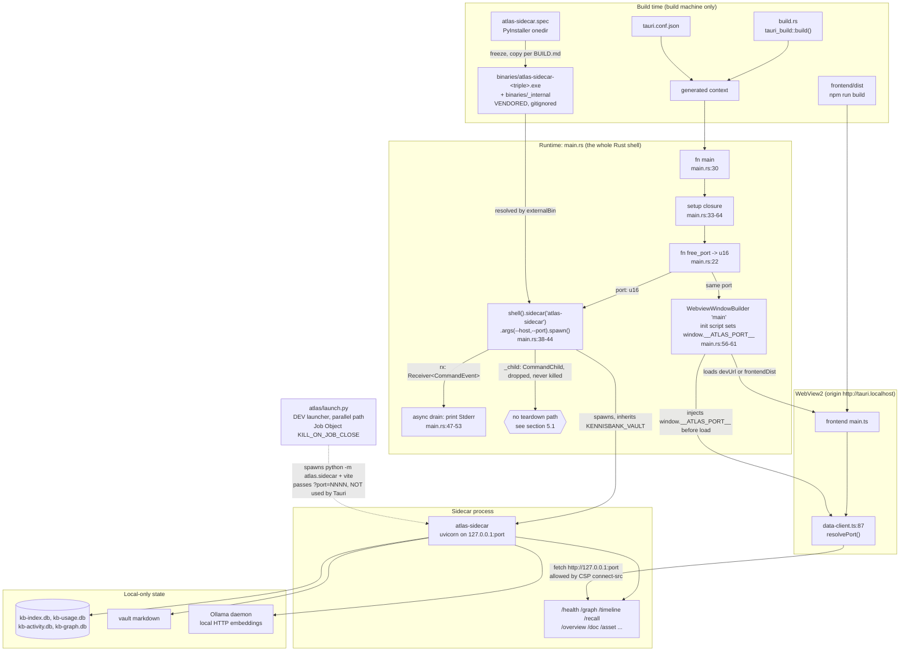

# C4 Code Level — `atlas/src-tauri/src` (Atlas Tauri shell)

> Scope note: this document covers the Rust source directory
> `atlas/src-tauri/src`. Because that directory holds exactly one 67-line file,
> the adjacent build/config files that give it meaning (`build.rs`,
> `Cargo.toml`, `tauri.conf.json`, `gen/`, `binaries/`) are documented as
> **wiring context** in section 2.5 and clearly marked as living outside `src/`.
>
> Two items requested for this directory are **not implemented here**. The
> Windows Job Object / `KILL_ON_JOB_CLOSE` teardown lives in the Python dev
> launcher `atlas/launch.py`, and `ParentProcessId` appears nowhere in the
> codebase at all. Both are documented honestly in section 5 rather than
> attributed to Rust code that does not contain them.

---

## 1. Overview

| Field | Value |
| --- | --- |
| **Name** | KennisBank Atlas — Tauri shell (crate `kennisbank-atlas`) |
| **Description** | Deliberately minimal Rust host process. It hosts the WebView2 frontend, spawns the frozen FastAPI sidecar on a free loopback port, and injects that port into the webview before the frontend loads. |
| **Location** | `atlas/src-tauri/src/` (single file: `main.rs`) |
| **Language(s)** | Rust, edition 2021 (`atlas/src-tauri/Cargo.toml:5`) |
| **Purpose** | Per ADR-0004, keep "near-zero Rust": the shell owns only window creation and sidecar process lifecycle. All knowledge logic lives in the Python sidecar and the TypeScript frontend. |
| **Size** | 67 lines, 2 free functions, 0 structs, 0 traits, 0 `#[tauri::command]` handlers |
| **Build status** | The header comment (`main.rs:10-12`) states the file has never been compiled in the development environment (no `cargo` present). Treat compile-level claims below as source-derived, not build-verified. |

### Key architectural facts

- **No IPC commands.** The shell exposes *zero* `#[tauri::command]` functions. The frontend never calls Rust; it talks HTTP directly to the sidecar on `127.0.0.1`. This is why `gen/schemas/capabilities.json` is `{}` and no `capabilities/` directory exists — there is no custom IPC surface to permission.
- **The port is dictated, not negotiated.** The shell picks the port and passes it to the sidecar via `--port`; it does not read the port back from the child.
- **The window is created in code, not config.** `tauri.conf.json` declares `"windows": []`, so the window must be built programmatically — that is the only way to attach an `initialization_script` that runs before frontend code.

---

## 2. Code Elements

### 2.1 Directory inventory

| File | Lines | Role |
| --- | --- | --- |
| `atlas/src-tauri/src/main.rs` | 67 | The entire Rust shell: entry point, port selection, sidecar spawn, stderr drain, window construction. |

No helpers were summarized away or omitted — every item in `main.rs` is documented below, including the crate attribute and all four `use` statements.

### 2.2 `main.rs` — complete element list

#### Crate-level attribute

```rust
#![cfg_attr(not(debug_assertions), windows_subsystem = "windows")]
```

- **Location:** `atlas/src-tauri/src/main.rs:14`
- **What it does:** In release builds only, sets the Windows subsystem to `windows`, which suppresses the console window that would otherwise appear behind the GUI. Debug builds keep the console so sidecar stderr (drained at `main.rs:50`) stays visible.
- **Interaction worth noting:** the sidecar itself is frozen with `console=True` (`atlas/sidecar/atlas-sidecar.spec`), so the *child* may still show its own console window in a release build. That is a PyInstaller-side setting, not something this attribute controls.

#### Imports

| Import | Location | Used for |
| --- | --- | --- |
| `std::net::TcpListener` | `main.rs:16` | Ephemeral-port probe in `free_port` |
| `tauri::{Manager, WebviewUrl, WebviewWindowBuilder}` | `main.rs:18` | Window construction (`WebviewWindowBuilder`, `WebviewUrl`) |
| `tauri_plugin_shell::process::CommandEvent` | `main.rs:19` | Pattern-matching sidecar output events |
| `tauri_plugin_shell::ShellExt` | `main.rs:20` | Brings `.shell()` into scope on the app handle |

> Low-confidence observation, explicitly flagged: `Manager` (`main.rs:18`) appears to be an **unused import**. No `Manager` method (`state()`, `handle()`, `get_webview_window()`, …) is called anywhere in the file; `.shell()` comes from `ShellExt`, and passing `app` to `WebviewWindowBuilder::new` satisfies a generic bound without needing the trait in scope. This would produce an `unused_imports` warning, not an error. **Unverified** — the crate has never been compiled here, so I cannot confirm against real `rustc` output.

#### `fn free_port() -> u16`

- **Full signature:** `fn free_port() -> u16`
- **Location:** `atlas/src-tauri/src/main.rs:22-28`
- **Visibility:** private (module-local)
- **Parameters:** none
- **Returns:** `u16` — a TCP port number on the loopback interface
- **What it does:** Binds a `TcpListener` to `127.0.0.1:0`, letting the OS assign a free ephemeral port, reads that port back via `local_addr()`, and returns it. The listener is dropped at the end of the expression, releasing the port.
- **Failure mode:** panics on two paths — `.expect("bind ephemeral port")` (`main.rs:24`) if the bind fails, and `.unwrap()` (`main.rs:26`) on `local_addr()`. Since this runs inside `setup`, a panic aborts startup.
- **Known race (inherent to the pattern):** the port is released before the sidecar binds it, leaving a TOCTOU window in which another process could claim it. The identical pattern exists in `atlas/launch.py:107-110` and `atlas/sidecar/__main__.py:20-23`, so this is a consistent project-wide trade-off, not a local defect. The practical consequence would be a sidecar that fails to bind and a frontend that polls forever.
- **Depends on:** `std::net::TcpListener` only. No project code.

#### `fn main()`

- **Full signature:** `fn main()`
- **Location:** `atlas/src-tauri/src/main.rs:30-67`
- **Parameters:** none
- **Returns:** `()` (unit; errors are handled by panicking)
- **What it does:** Builds and runs the Tauri application. The whole body is one builder chain with a `setup` closure that performs the four startup stages detailed in section 2.3.
- **Structure:**

| Step | Location | Action |
| --- | --- | --- |
| Builder init | `main.rs:31` | `tauri::Builder::default()` |
| Register plugin | `main.rs:32` | `.plugin(tauri_plugin_shell::init())` — required before `.shell()` is usable |
| Setup closure | `main.rs:33-64` | `\|app\| -> Result<(), Box<dyn Error>>`; returns `Ok(())` at `main.rs:63` |
| Run | `main.rs:65` | `.run(tauri::generate_context!())` — macro reads `tauri.conf.json` at compile time |
| Fatal guard | `main.rs:66` | `.expect("run KennisBank Atlas")` |

- **Depends on:** `tauri::Builder`, `tauri_plugin_shell`, the generated context (and therefore `tauri.conf.json`), and the bundled `atlas-sidecar` external binary.

#### Anonymous closure 1 — the `setup` hook

- **Effective signature:** `|app: &mut tauri::App| -> Result<(), Box<dyn std::error::Error>>`
- **Location:** `main.rs:33-64`
- **What it does:** picks the port, spawns the sidecar, spawns the log drain, builds the window. Detailed in 2.3.
- **Error handling:** uses `?` only on `.build()?` (`main.rs:61`); every other fallible step uses `.expect(...)` and panics.

#### Anonymous closure 2 — the async stderr drain

- **Effective signature:** `async move` block passed to `tauri::async_runtime::spawn`, capturing `rx: Receiver<CommandEvent>` by move
- **Location:** `main.rs:47-53`
- **What it does:** loops `rx.recv().await`, and for `CommandEvent::Stderr(line)` prints `[sidecar] {line}` to the shell's own stderr using `String::from_utf8_lossy`.
- **Why it exists:** it prevents the child's pipes from filling and blocking the sidecar — the comment at `main.rs:46` says exactly this.
- **Important nuance:** only `Stderr` is *printed*, but all variants (`Stdout`, `Terminated`, `Error`) are still *consumed* by the loop, so the anti-blocking guarantee holds for stdout too. Consequence: the sidecar's stdout line `ATLAS_PORT <port>` (emitted at `atlas/sidecar/__main__.py:47`) is received and silently discarded. See section 5.3.

### 2.3 Sidecar process lifecycle

#### Stage 1 — port selection (`main.rs:34`)

```rust
let port = free_port();
```

#### Stage 2 — spawn (`main.rs:38-44`)

```rust
let (mut rx, _child) = app
    .shell()
    .sidecar("atlas-sidecar")
    .expect("atlas-sidecar binary is bundled")
    .args(["--host", "127.0.0.1", "--port", &port.to_string()])
    .spawn()
    .expect("spawn sidecar");
```

- `.sidecar("atlas-sidecar")` resolves the `externalBin` entry from `tauri.conf.json:23`. Tauri appends the Rust target triple, so on this machine it resolves to `binaries/atlas-sidecar-x86_64-pc-windows-msvc.exe`.
- `--host 127.0.0.1` is passed explicitly even though the sidecar already defaults to loopback (`atlas/sidecar/__main__.py:39`) — defence in depth for the "never leave the machine" rule.
- **Environment:** `env_clear()` is never called, so the child inherits the shell's full environment (the `std::process::Command` default; the plugin exposes `env_clear` as opt-in at `tauri-plugin-shell-2.3.5/src/process/mod.rs:205`). This is how `KENNISBANK_VAULT` reaches the sidecar, exactly as the comment at `main.rs:37` claims. The operational risk this creates is covered in section 5.2.
- **`--vault` is not passed.** The sidecar accepts `--vault` (`atlas/sidecar/__main__.py:41`) but the shell relies purely on env inheritance.
- **Binding note:** `_child` uses a single leading underscore, so it *is* bound and stays alive to the end of the `setup` closure, then drops. `_child` (bound) behaves differently from `_` (dropped immediately) — but as section 5.1 shows, neither actually terminates the process.

#### Stage 3 — output drain (`main.rs:47-53`)

See "Anonymous closure 2" above.

#### Stage 4 — teardown (the honest version)

There is **no explicit teardown code in `main.rs`.** No `.kill()` call, no `RunEvent::Exit` handler, no Job Object. The header comment at `main.rs:7-8` asserts:

> "The sidecar child is killed with the app (tauri-plugin-shell manages the process; no orphan)."

Reading the plugin source shows this does not hold for a Rust-side spawn. Section 5.1 documents the evidence.

### 2.4 Window and config wiring

#### Port injection and window construction (`main.rs:56-61`)

```rust
let init = format!("window.__ATLAS_PORT__ = {};", port);
WebviewWindowBuilder::new(app, "main", WebviewUrl::default())
    .title("KennisBank Atlas")
    .inner_size(1400.0, 900.0)
    .initialization_script(&init)
    .build()?;
```

| Setting | Value | Location | Notes |
| --- | --- | --- | --- |
| Window label | `"main"` | `main.rs:57` | Not referenced anywhere else in Rust or TS. |
| URL | `WebviewUrl::default()` | `main.rs:57` | Resolves to `devUrl` (`http://127.0.0.1:5173`) under `tauri dev`, else `frontendDist` (`../frontend/dist`). |
| Title | `"KennisBank Atlas"` | `main.rs:58` | Matches `productName` in `tauri.conf.json:3`. |
| Inner size | `1400.0 x 900.0` | `main.rs:59` | Dashboard-sized default; no min-size or centering set. |
| Init script | `window.__ATLAS_PORT__ = <port>;` | `main.rs:56, 60` | Runs before any frontend script on every load. |

**Why programmatic and not declarative:** `tauri.conf.json:13` declares `"windows": []`. A statically configured window would be created before `setup` runs, so there would be no way to attach a per-run init script carrying the freshly chosen port. Creating the window in `setup` is what makes the handshake possible — this coupling is the single most important thing to preserve when editing either file.

**The consuming side** is `atlas/frontend/src/data-client.ts:87-93`:

```ts
function resolvePort(): number | null {
  const fromGlobal = (window as unknown as { __ATLAS_PORT__?: number }).__ATLAS_PORT__;
  if (typeof fromGlobal === "number") return fromGlobal;
  const p = new URLSearchParams(location.search).get("port");
  return p ? Number(p) : null;
}
```

Two transports, one contract: the injected global in the bundled app, and a `?port=` query parameter in dev (which `atlas/launch.py:161` produces). The frontend additionally hard-refuses any non-loopback base at `data-client.ts:109-111`.

#### `tauri.conf.json` — security and bundle wiring

- **CSP** (`tauri.conf.json:15`): `default-src 'self'; connect-src http://127.0.0.1:*; img-src 'self' http://127.0.0.1:* data:; style-src 'self' 'unsafe-inline'; frame-src http://127.0.0.1:*`
  - `connect-src` permits the `fetch` calls in `data-client.ts`.
  - `frame-src` exists for the graphify lens, which builds a real `<iframe>` (`atlas/frontend/src/lenses/graphify.ts:32-33`) pointing at the sidecar's `/graphify-html` route (`atlas/frontend/src/data-client.ts:157-158`). The page is served over loopback HTTP rather than `file://` precisely so its scripts execute; a `file://` embed "would hit the file://-wall and stay blank" (`graphify.ts:1-4`). Without this CSP entry the lens would be blocked.
  - `style-src 'unsafe-inline'` is required by the inline-style approach in the frontend.
  - Note the CSP does **not** name `http://tauri.localhost`; it does not need to, because that is the document's own origin covered by `'self'`. The sidecar's *CORS* allowlist is the place where that origin matters, and it is handled there (`atlas/sidecar/app.py:24-28`).
- **`externalBin`** (`tauri.conf.json:23`): `["binaries/atlas-sidecar"]` — what `.sidecar("atlas-sidecar")` resolves against.
- **`resources`** (`tauri.conf.json:22`): `{ "binaries/_internal": "_internal" }` — maps the PyInstaller onedir payload into the install root so the frozen exe finds its runtime.
- **Bundle targets** (`tauri.conf.json:20`): `msi`, `nsis`. Identifier `net.vandenbreemen.kennisbank.atlas`.

### 2.5 Build and config files outside `src/`

| File | Role | Elements |
| --- | --- | --- |
| `atlas/src-tauri/build.rs` | Cargo build script | `fn main()` at `build.rs:1-3`, body `tauri_build::build()`. Generates the context consumed by `generate_context!`. |
| `atlas/src-tauri/Cargo.toml` | Crate manifest | Package `kennisbank-atlas` v0.1.0; deps `tauri` 2, `tauri-plugin-shell` 2 (locked to 2.3.5), `serde` 1, `serde_json` 1; feature `custom-protocol`. |
| `atlas/src-tauri/tauri.conf.json` | App/bundle config | See 2.4. |
| `atlas/src-tauri/gen/schemas/*.json` | **Generated** ACL/capability schemas | Build artifacts, gitignored. `capabilities.json` is `{}`. Not documented element by element. |

> Dead weight, flagged: `serde` and `serde_json` are declared in `Cargo.toml:13-14` but neither is imported in `main.rs`. With no IPC commands and no serialized payloads, they appear unnecessary. Low confidence on intent (they may be scaffolding for planned commands); harmless either way beyond build time.

### 2.6 Excluded from this document: `binaries/_internal`

`atlas/src-tauri/binaries/` contains **vendored third-party build output** and is deliberately *not* documented element by element:

- `binaries/_internal/` — the PyInstaller onedir payload: the embedded CPython runtime, FastAPI/uvicorn/httpx, and the `sqlite-vec` native extension.
- `binaries/atlas-sidecar-x86_64-pc-windows-msvc.exe` — the frozen sidecar launcher.

Both are **generated artifacts, not source**: `atlas/src-tauri/.gitignore` ignores `binaries/`, `target/`, `gen/`, so none of it is in version control. It is produced on a build machine by `pyinstaller atlas-sidecar.spec` and copied into place per `atlas/BUILD.md` steps 1-2. The onedir (not onefile) choice is deliberate and documented in `atlas/sidecar/atlas-sidecar.spec:10-12`: onefile re-extracts roughly 76 MB into a fresh `%TEMP%\_MEI` directory on every launch, which antivirus then rescans, producing cold starts of minutes under load.

---

## 3. Dependencies

### 3.1 Internal (this repository, by path)

| Path | Relationship |
| --- | --- |
| `atlas/src-tauri/tauri.conf.json` | Compiled in via `generate_context!` (`main.rs:65`); supplies CSP, `externalBin`, `resources`, frontend URL. |
| `atlas/src-tauri/build.rs` | Generates that context at build time. |
| `atlas/src-tauri/binaries/atlas-sidecar-<triple>.exe` | The process spawned at `main.rs:38-44` (generated artifact, see 2.6). |
| `atlas/src-tauri/binaries/_internal/` | Runtime payload for the frozen sidecar, mapped via `resources` (generated artifact). |
| `atlas/frontend/dist/` | Static frontend loaded by `WebviewUrl::default()` in release builds. |
| `atlas/frontend/src/data-client.ts` | Consumes `window.__ATLAS_PORT__` at lines 87-93; the other half of the port contract. |
| `atlas/frontend/src/lenses/graphify.ts` | Iframe consumer that the CSP `frame-src` rule exists for. |
| `atlas/sidecar/__main__.py` | Defines the `--host`/`--port`/`--vault` CLI contract the shell invokes. |
| `atlas/sidecar/app.py` | FastAPI app: CORS allowlist and all HTTP routes. |
| `atlas/sidecar/atlas-sidecar.spec` | PyInstaller recipe producing the bundled binary. |
| `atlas/launch.py` | **Parallel** dev-mode launcher. Not called by Rust; it is the alternative entry point, and the actual home of the Job Object teardown. |
| `atlas/BUILD.md` | Build procedure for the two-runtime bundle. |
| `docs/adr/0004-atlas-tauri-architecture.md` | The "near-zero Rust" decision this file implements (referenced at `main.rs:3`). |
| `docs/adr/0002-cross-platform-scripts.md` | Vault resolution via `KENNISBANK_VAULT`, honoured by env inheritance. |

### 3.2 External

**Rust crates** (`Cargo.toml`, versions from `Cargo.lock`)

| Crate | Version | Used for |
| --- | --- | --- |
| `tauri` | 2 | App builder, webview window, async runtime, context macro |
| `tauri-plugin-shell` | 2.3.5 (locked) | Sidecar spawn, `CommandEvent` stream |
| `tauri-build` | 2 (build-dep) | Context/schema generation |
| `serde`, `serde_json` | 1 | Declared but unused in `main.rs` (see 2.5) |
| `shared_child` | 1.1.1 (transitive) | Underlying child-process handle inside the plugin |

**Platform / runtime**

- **Microsoft WebView2** — the rendering engine; on Windows the webview origin is `http://tauri.localhost` (plain HTTP, no TLS).
- **Windows MSI / NSIS** bundlers for installers.
- **Embedded CPython + FastAPI + uvicorn + httpx + sqlite-vec** — inside the frozen sidecar, not linked by Rust.

**HTTP endpoints (indirect — the shell opens no sockets itself beyond the port probe)**

The shell never issues an HTTP request. The frontend calls the sidecar at `http://127.0.0.1:<port>`, which serves (`atlas/sidecar/app.py`): `/health` (:95), `/graph` (:105), `/timeline` (:109), `/memory-health` (:117), `/overview` (:121), `/titles` (:125), `POST /memory/decide` (:129), `/provenance` (:138), `/doc` (:142), `/asset` (:149), `/graphify-html` (:159), `/recall` (:171), `/memory-links` (:175).

`/graphify-html` is the odd one out: it is registered with `@app.api_route("/graphify-html", methods=["GET", "HEAD"])` rather than `@app.get`, because the lens probes with `HEAD` before embedding and a bare `@app.get` answers `HEAD` with 405 (comment at `app.py:158`).

**Databases (reached only by the sidecar, never by Rust)**

`kb-index.db`, `kb-usage.db`, `kb-activity.db`, `kb-graph.db` — local SQLite under the vault. **A local Ollama daemon** over HTTP supplies embeddings. The Rust shell has no knowledge of either; it only guarantees the sidecar starts with the right vault in its environment.

---

## 4. Relationships



---

## 5. Verified discrepancies and risks

Every claim below was checked against primary sources: the plugin crate source in the local Cargo registry, the repo's own files, and the Backlog history. These are reported, not fixed — no code was modified.

### 5.1 The "no orphan" comment does not hold for the bundled path

**Claimed** at `main.rs:7-8` ("killed with the app … no orphan") and repeated in `atlas/BUILD.md` ("The sidecar child is owned by the shell and dies with the app (no orphan)").

**Evidence against, three independent sources in `tauri-plugin-shell` 2.3.5:**

1. `CommandChild` has **no `Drop` implementation** — it is declared at `src/process/mod.rs:65-68` with only an explicit `pub fn kill(self) -> crate::Result<()>` at `src/process/mod.rs:78`. Dropping `_child` therefore does nothing to the process.
2. The plugin's exit hook kills only children it tracks (`src/lib.rs:132-143`):
   ```rust
   .on_event(|app, event| {
       if let RunEvent::Exit = event {
           let shell = app.state::<Shell<R>>();
           let children = { /* take shell.children */ };
           for child in children.into_values() { let _ = child.kill(); }
       }
   })
   ```
   That `shell.children` map is populated in exactly one place — the **JS-facing** `commands::execute` handler at `src/commands.rs:253` (`shell.children.lock().unwrap().insert(pid, child);`). A Rust-side `app.shell().sidecar(...).spawn()` returns the `CommandChild` to the caller and never registers it, so the exit hook has nothing to kill.
3. The underlying handle offers no safety net either: `shared_child` 1.1.1 contains **no `impl Drop`** at all, and `std::process::Child` does not kill on drop by design.

**Conclusion:** on a normal quit — and especially on a hard kill, where no Rust code runs regardless — the frozen sidecar can plausibly survive as an orphan holding its loopback port. I label the runtime outcome *plausible rather than confirmed* because the bundled app has never been built or observed here; the source-level reasoning, however, is confirmed. Pipe closure may sometimes take uvicorn down incidentally, but that is a side effect, not a teardown mechanism.

**Why this matters beyond tidiness:** the memory note `tauri-windows-webview-cors-en-sidecar-start` records that orphaned sidecars from earlier runs listening on the "expected" port actively corrupted diagnosis. `TASK-85` documents the same class of bug being observed live on the dev path — three complete Atlas stacks running at once — and its root cause is identical in shape: on Windows, cleanup that depends on the parent cooperating never runs.

**The fix pattern already exists in this repo**, one directory up: bind the process to a Job Object with `JOB_OBJECT_LIMIT_KILL_ON_JOB_CLOSE` so the OS tears down the tree unconditionally. A Rust equivalent, or a `RunEvent::Exit` handler holding the `CommandChild` and calling `.kill()`, would close the ordinary-quit case. Recommended as follow-up work; out of scope for documentation.

### 5.2 Where the Job Object / `KILL_ON_JOB_CLOSE` code actually lives

Not in Rust. A repo-wide search for `KILL_ON_JOB_CLOSE`, `JobObject`, `AssignProcessToJobObject`, and `ParentProcessId` matches only `atlas/launch.py`, `backlog/tasks/task-85 …`, and `CHANGELOG.md` — **no `.rs` file**.

- **`_windows_kill_on_close_job() -> object | None`** — `atlas/launch.py:26-104`. Creates the job, sets `JOB_OBJECT_LIMIT_KILL_ON_JOB_CLOSE = 0x2000` via `SetInformationJobObject`, assigns the current process, and returns the handle for the caller to keep alive (`atlas/launch.py:122`; closing the handle would kill the job). Fails open, returning `None` rather than breaking the launcher (`atlas/launch.py:99-103`).
- **The ctypes pitfall is load-bearing** and worth preserving verbatim (`atlas/launch.py:75-76`): without explicit `HANDLE` prototypes, "ctypes truncates 64-bit HANDLEs to 32-bit ints and `AssignProcessToJobObject` fails with `ERROR_INVALID_HANDLE`."
- **Scope:** this guard protects only the **dev path** (`python -m atlas.sidecar` plus vite). It is a different process tree from the bundled Tauri app and gives the shipped app no protection whatsoever.

**`ParentProcessId` is not code anywhere in this repository.** It comes from the memory note `tauri-windows-webview-cors-en-sidecar-start` and is a *diagnostic technique*: identify the sidecar child via `Win32_Process.ParentProcessId` rather than by which process holds the expected port, because orphans from earlier runs pollute a port-based lookup — and because a PyInstaller onefile build spawns a bootloader/python pair where the socket belongs to the python child. Useful practice; not an element of this directory.

### 5.3 A stale handshake contract

`atlas/sidecar/__main__.py:3-4` documents that the sidecar prints `ATLAS_PORT <port>` on stdout "so the Tauri shell can read the negotiated port (TASK-27.3)", and emits it at `__main__.py:47`. The shell implements the **inverse** design: it dictates the port via `--port` (`main.rs:42`) and never parses stdout. The line is consumed and discarded by the drain loop. Harmless, but the sidecar docstring describes a superseded protocol and will mislead the next reader.

### 5.4 Startup fragility around `KENNISBANK_VAULT`

The shell passes no `--vault` and relies entirely on environment inheritance. The sidecar exits immediately with `SystemExit` when neither `--vault` nor `KENNISBANK_VAULT` is present (`atlas/sidecar/__main__.py:32-34`). A bundled app launched from the Start menu or a desktop shortcut inherits Explorer's environment, which will not carry `KENNISBANK_VAULT` unless it was set machine- or user-wide.

Failure signature: the sidecar dies within milliseconds; the frontend, which deliberately polls without a deadline (`atlas/frontend/src/main.ts:52`, "No deadline: a cold sidecar boot must never leave the app permanently on…"), waits forever showing "sidecar starten…". That unbounded poll is correct for slow cold starts — measured at 4-8 seconds idle and minutes under load — but it means a *dead* sidecar is indistinguishable from a *slow* one. The `[sidecar]` stderr line would name the real cause, and in a release build `windows_subsystem = "windows"` hides the console that would show it. Surfacing child exit (`CommandEvent::Terminated`) to the UI would remove the ambiguity. Reported as a risk; ADR-0002 correctly forbids papering over it with a hardcoded default path.

---

## Appendix — verification trail

| Claim | Source consulted |
| --- | --- |
| Directory holds exactly one file, 67 lines | Directory listing + full read of `main.rs` |
| Two functions, no commands, no structs | Full read of `main.rs` |
| `CommandChild` has no `Drop`; `kill(self)` is explicit | `tauri-plugin-shell-2.3.5/src/process/mod.rs:65-81` |
| Exit hook kills only tracked children | `tauri-plugin-shell-2.3.5/src/lib.rs:132-143` |
| `shell.children` filled only by JS `execute` | `tauri-plugin-shell-2.3.5/src/commands.rs:250-259` |
| `shared_child` has no `Drop` | grep for `impl Drop` in `shared_child-1.1.1` — no matches |
| Env inherited (no `env_clear` call) | `main.rs:38-44` + `process/mod.rs:203-208` |
| Plugin version 2.3.5 | `atlas/src-tauri/Cargo.lock` |
| No `capabilities/` dir; `capabilities.json` is `{}` | Directory listing + file read |
| `binaries/` is a gitignored build artifact | `atlas/src-tauri/.gitignore` |
| Job Object only in `launch.py` | Repo-wide grep, 3 matches, no `.rs` |
| `ParentProcessId` absent from code | Repo-wide grep; only a backlog/memory mention |
| Orphan bug precedent on the dev path | `backlog/tasks/task-85 …` (status Done, PR #81) |
| Onedir vs onefile rationale | `atlas/sidecar/atlas-sidecar.spec:10-12`, `atlas/BUILD.md` |
| Frontend port contract | `atlas/frontend/src/data-client.ts:87-93, 107-111` |

**Not verified:** anything requiring a compiled binary. The crate has never been built in this environment (`main.rs:10-12`, `atlas/BUILD.md`), so the unused-import observation (2.2), the release-build console behaviour (2.2), and the runtime orphan outcome (5.1) rest on source reading alone.
