# C4 Code — `commands/`: slash-command definitions

> **Scope note.** This file documents the 20 markdown files under `commands/`
> (16 root commands + 4 namespaced commands under `commands/kennisbank/`).
> Nothing in this directory is vendored or generated — every file is
> hand-written source. The Python scripts these commands drive live in
> `scripts/` and are documented element by element in the sibling
> `c4-code-scripts-*.md` files; here they appear only as *callees*, with the
> exact invocation and the contract the command relies on.

---

## 1. Overview

| Field | Value |
| --- | --- |
| **Name** | Slash-command layer (Claude Code commands, cross-agent prompt sources) |
| **Location** | `commands/` (repo-relative). Deployed to `$HOME/.claude/commands/` by `setup.sh:350-371`; re-rendered into Codex/OpenCode/Copilot prompt dirs by `scripts/install-agent-envs.py:184-207`. |
| **Language** | Markdown. Two files carry YAML frontmatter (`commands/kennisbank/rebuild-index.md:1-3`, `commands/kennisbank/rebuild-memory.md:1-3`); the other 18 rely on the first line as the command description. Embedded code fences are POSIX shell + inline Python heredocs. |
| **Purpose** | Give the human an explicit, auditable entry point into each KennisBank workflow. A command file is a *procedure for an LLM*: it resolves the vault root, calls deterministic `scripts/` helpers in a fixed order, parses their machine-readable output, and states exactly what must be reported back. |
| **Written language** | Dutch (user-facing prompt text). This is the one place in the repo where Dutch is the primary language by design — the commands are the human interface, not repo documentation. |

### What a "code element" is in this directory

These files have no functions. Their executable surface is:

1. **The trigger** — the filename becomes the slash-command name.
   `commands/wiki.md` → `/wiki`; `commands/kennisbank/settings.md` →
   `/kennisbank:settings` (namespacing preserved by `setup.sh:353-358`).
2. **The argument contract** — whether the file expands `$ARGUMENTS`, and how it
   parses it.
3. **The scripts it drives** — the literal shell lines, which are the real
   couplings. These are cited per command below.
4. **The output contract** — the "Bevestiging"/"Rapporteer"/"Outputregels"
   section, which fixes what the agent must print.

Treat 3 and 4 as the API. A command that calls a script with a flag the script
does not define is a broken element, exactly like a bad function call — §5
records the two places where that is currently the case.

### Files in scope

| File | Trigger | `$ARGUMENTS` | Role (one line) |
| --- | --- | --- | --- |
| `commands/sessielog.md` (191 lines) | `/sessielog` | no | **Write phase of a session.** Writes the raw session log, compiles wiki candidates, runs the daily graphify batch, semantic tiling, learnings, then one mechanical coordinator. The largest command. |
| `commands/sessiestart.md` (126) | `/sessiestart` | no | **Read phase of a session.** Read-only briefing: context budget, memory index, orientation, wiki/inbox/stale/graph status. Target < 2 s. |
| `commands/checkpoint.md` (69) | `/checkpoint [save\|load\|done]` | yes | Work-state snapshot that bridges a compaction/crash. Three modes, all backed by `kb-checkpoint.py`. |
| `commands/wiki.md` (158) | `/wiki [topic]` | yes | Compile recent raw session logs into `02-wiki/` articles. Deterministic candidate scan → rewrite-or-new → normalize → provenance lint (fail-closed). |
| `commands/destilleer.md` (92) | `/destilleer` | no | Counterpart of the SessionEnd archive hook: distill archived transcripts into raw logs + wiki. Idempotent via the `.distilled` watermark. |
| `commands/intake.md` (30) | `/intake` | no | Drain `00-inbox/`: per file execute the scanner's `suggested_action`. |
| `commands/import.md` (131) | `/import <cc\|claudeai\|folder\|documents\|cowork\|all> [path] [prefix]` | yes | Backfill historic sessions/documents into `01-raw/sessies/` (or `05-bronnen/liteparse/`). Dry-run first, always. |
| `commands/stale.md` (15) | `/stale` | no | Thinnest command: run `stale-check.py`, group the output, ask what to update. |
| `commands/reconcile.md` (81) | `/reconcile [topic]` | yes | Resolve contradicting wiki articles; user decides, loser article is minimally corrected, decision is appended to an audit log. |
| `commands/brug.md` (102) | `/brug A & B` | yes | Lateral thinking inside the vault: graph-first bridge paths between two topics, embedding fallback. |
| `commands/uitdaag.md` (54) | `/uitdaag <claim>` | yes | Adversarial sparring against vault content only: counter-arguments, precedents, blind spots. |
| `commands/timeline.md` (40) | `/timeline <period>` | yes | Chronological activity timeline from the activity index. |
| `commands/watdeedik.md` (40) | `/watdeedik <period>` | yes | "What did I do on/in <period>" recall. |
| `commands/weeklog.md` (40) | `/weeklog [period]` | yes | Compact week log (default: previous week). |
| `commands/kennisbank-upgrade.md` (7) | `/kennisbank-upgrade [--dry-run]` | yes | **Launcher only.** Delegates verbatim to the `kennisbank-upgrade` skill. |
| `commands/kennisbank-contribute.md` (7) | `/kennisbank-contribute [--dry-run]` | yes | **Launcher only.** Delegates verbatim to the `kennisbank-contribute` skill. |
| `commands/kennisbank/settings.md` (83) | `/kennisbank:settings` | no | Read/flip the background-automation toggles via `_settings.py`. |
| `commands/kennisbank/rebuild-index.md` (20) | `/kennisbank:rebuild-index` | no | Full rebuild of `kb-index.db` (cheap, deterministic). |
| `commands/kennisbank/rebuild-memory.md` (25) | `/kennisbank:rebuild-memory` | no | Re-extract all memories from every archived transcript (expensive; asks confirmation). |
| `commands/kennisbank/review.md` (48) | `/kennisbank:review [topic]` | yes | Human review queue for `status: unverified` memories: approve / reject / skip. |

### Deploy and invocation model

`setup.sh` copies the files with `copy_force` (`setup.sh:159`) — tooling is
always overwritten, never merged — into `CLAUDE_COMMANDS="$HOME/.claude/commands"`
(`setup.sh:168`). Root files land flat (`setup.sh:350-352`); one level of
subdirectory is preserved so `commands/kennisbank/settings.md` becomes
`/kennisbank:settings` (`setup.sh:353-358`). Copying is skipped when the agent
list excludes Claude (`setup.sh:344-345`) or `--no-commands` is passed
(`setup.sh:346-347`), and is otherwise confirmed interactively
(`setup.sh:360-372`).

Note the asymmetry that follows from the distribution model: the **commands** go
to `$HOME/.claude/commands/`, while every **script** they call goes to
`$VAULT/.claude/scripts/`. That is why every command begins by resolving
`$VAULT` — the command does not live next to the code it runs.

### Cross-agent re-export

`scripts/install-agent-envs.py` treats this directory as a prompt library for
non-Claude agents:

- `ROOT_COMMANDS` (`scripts/install-agent-envs.py:43-60`) maps all 16 root stems
  to an English one-line description.
- `NESTED_COMMAND_ALIASES` (`:62-66`) flattens namespaced commands:
  `kennisbank/settings` → `kennisbank-settings`, `kennisbank/rebuild-index` →
  `kennisbank-rebuild-index`, `kennisbank/rebuild-memory` →
  `kennisbank-rebuild-memory`. **`kennisbank/review` is absent** (see §5.4).
- `_command_sources(repo) -> list[tuple[str, Path, str]]` (`:184-193`) resolves
  those maps to actual files, skipping any that do not exist.
- `_prompt_text(name, source, description, target_agent) -> str` (`:196-207`)
  wraps the *unmodified* command body in frontmatter
  (`description`, `argument-hint: "[ARGUMENTS]"`) plus a two-line preamble that
  re-states the `KENNISBANK_VAULT` rule.
- `_command_skill_text(name, source, description) -> str` (`:209-222`) renders
  the same body as a cross-client skill instead.
- OpenCode install writes one file per command into `$OPENCODE_CONFIG_DIR/commands/`
  (`:481-489`); validation asserts a fixed subset exists for Claude (`:637`) and
  OpenCode (`:757`): `sessielog`, `sessiestart`, `kennisbank-upgrade`, `weeklog`,
  `timeline`, `watdeedik`.

Consequence worth stating plainly: the command body is shared source. A
Claude-only assumption written into a command file is silently inherited by
three other agents.

---

## 2. Code Elements

### 2.0 Cross-cutting facts (true for nearly every file)

**A. The vault-root preamble is the load-bearing convention (ADR-0002).**
18 of 20 files open with a "Vault-root bepalen (VERPLICHT)" block that fixes
`VAULT="${KENNISBANK_VAULT:-$HOME/KennisBank}"` once and forbids literal paths —
e.g. `commands/sessielog.md:26-31`, `commands/wiki.md:3-8`,
`commands/brug.md:3-8`, `commands/checkpoint.md:3-8`. The three temporal
commands use a shorter variant of the same rule
(`commands/timeline.md:3-8`, `commands/watdeedik.md:3-8`,
`commands/weeklog.md:3-8`). Two guards enforce it:
`tests/test_command_structure.py:191-202` (no hardcoded
`~/KennisBank/.claude/scripts` in `commands/*.md`) and
`tests/test_command_structure.py:205-247` (no hardcoded vault path in any
shipped shell fence, indented fences included — the regression that once hid 23
blocks).

**B. Interpreter is `python3`, with `py -3` called out for Windows** only where
it matters (`commands/sessielog.md:163-168`, `commands/checkpoint.md:32`). This
matches the repo convention: shipped commands use `python3`; hooks use `py -3`.

**C. Two files skip the fallback.** `commands/kennisbank/rebuild-index.md:15`
and `commands/kennisbank/rebuild-memory.md:17` interpolate
`$KENNISBANK_VAULT` bare. See §5.3.

**D. House style.** "Geen em dashes" and "Taal: volgt de prompt" recur as
explicit rules (e.g. `commands/sessielog.md:62`, `commands/sessiestart.md:125-126`,
`commands/destilleer.md:92`, `commands/kennisbank/settings.md:83`).

---

### 2.1 Session lifecycle

#### `commands/sessielog.md` — `/sessielog`

- **Trigger:** `/sessielog`. No arguments.
- **Description line:** `:1-2` — write a session log, then immediately compile
  this session's wiki candidates.
- **Output style contract (`:4-24`):** work *silently*. No per-step narration,
  pipe verbose stdout through `2>&1 | tail -n 3`, run the graphify daily batch in
  a subagent when the client supports it, break silence only on error, and keep
  the final confirmation verbose.

| Step | Invocation | Callee | Cite |
| --- | --- | --- | --- |
| 1 | writes `$VAULT/01-raw/sessies/raw-sessie-YYYY-MM-DD-<slug>.md` from `$VAULT/04-templates/tpl-sessie-log.md` | (template file, exists as `templates/tpl-sessie-log.md`) | `:37-43` |
| 2.2 | `find ~/Claude/research/ -name "*.md" -mtime -1` | shell | `:78-80` |
| 2.5 | `python3 -c "... import _settings; print('1' if _settings.get('daily_graphify', True) else '0')"` | `scripts/_settings.py:161-180` | `:88` |
| 2.5 | `/graphify $VAULT --update` (external skill), gated on `graph.json` mtime > ~20 h and non-empty `.needs-rebuild` | `graphify` skill | `:93-94` |
| 2.5 | inline Python heredoc patches `graphify-out/cost.json`: sets `backend='claude-subagent'`, `subagent_tokens`, recomputes `total_tokens` | stdlib json | `:96-112` |
| 2.6 | `python3 $VAULT/.claude/scripts/auto-crosslink.py <article>` — only if `--update` actually ran this session | `scripts/auto-crosslink.py:238-239` | `:116` |
| 4 | `ollama list \| grep -E 'qwen3-embedding\|nomic-embed-text'` then `python3 .../semantic-tiling.py <article>` | `scripts/semantic-tiling.py:54-62` (positional path) | `:131-137` |
| 5 | grep the first uncommented `LEARNINGS_FILE=` from `$VAULT/CLAUDE.md`, expand `~` | shell | `:148` |
| 6 | `python3 "$VAULT/.claude/scripts/kb-session-log.py" --session-log "$SESSION_LOG"` | `scripts/kb-session-log.py:169-171` | `:167` |
| 6 | `python3 "$VAULT/.claude/scripts/kb-checkpoint.py" --done` | `scripts/kb-checkpoint.py:211-214` | `:180` |

- **Knowledge-writing rule (`:52-57`):** the "Nieuwe kennis" section must be
  declarative present tense — the knowledge itself, not "we discovered that…".
  Each line must be readable by a future session without this conversation.
- **Threshold contract for tiling (`:135-137`):** ≥ 0.85 duplicate, 0.62–0.84
  related, for the default `qwen3-embedding:8b`; 0.90 / 0.80 for
  `nomic-embed-text`. These match
  `scripts/semantic-tiling.py:50-51` (`TILING_THRESHOLD_ERROR` 0.85,
  `TILING_THRESHOLD_REVIEW` 0.62). The script *prints* `ERROR`/`REVIEW` but
  always exits 0 (`scripts/semantic-tiling.py:107-120`), so the command's
  "(error)" label is a report class, not an exit code.
- **Single-coordinator invariant (`:170-174`):** `kb-session-log.py` validates
  that the log sits under `01-raw/sessies/`, runs the Karpathy/embedding/
  knowledge/activity indexes plus the sweep launcher in parallel, is fail-open,
  and returns one merged result. The command explicitly forbids running the
  child scripts alongside it, and forbids a second sweep (`:69-70`).
- **Output contract (`:185-192`):** path of the written log; which wiki articles
  are new/updated; tiling result (or the skip reason); learnings entries added
  (or the skip reason); the single `kb-session-log.py` result (changes only);
  and an ADR suggestion if Decision Log entries exist.

#### `commands/sessiestart.md` — `/sessiestart`

- **Trigger:** `/sessiestart`. No arguments. Explicit counterpart of
  `/sessielog` (`:12`): read-only, fast, no mutations.

| Step | Invocation | Callee | Cite |
| --- | --- | --- | --- |
| L0-L3 | `python3 $VAULT/.claude/scripts/context-budget.py --level 1` (`--level 2/3 --query "<topic>"` on request) | `scripts/context-budget.py:229-253` | `:19-24` |
| 1 | `cat $VAULT/CLAUDE.md` | — | `:30` |
| 2 | `ls ~/.claude/projects/*/memory/MEMORY.md \| head -1` then `cat` | — | `:36-37` |
| 3 | `python3 $VAULT/.claude/scripts/kb-orientation.py` (plain-text mode; SQL over `kb-index.db` + `kb-usage.db`) | `scripts/kb-orientation.py:124-134`, dbs at `:46`, `:73` | `:46` |
| 3b | `head -50 $VAULT/02-wiki/index.md`; four `grep -l "status: …" \| wc -l` counts | — | `:54-61` |
| 4-9 | `ls -1t 01-raw/sessies \| head -5`; `find 02-wiki -mtime -7`; inbox count; `[ -s graphify-out/.needs-rebuild ]`; `find 02-wiki -mtime +60 \| wc -l`; `find ~/Claude/research -mtime -7` | — | `:67`, `:73`, `:78`, `:84`, `:91`, `:98` |

- **Output contract (`:101-120`):** a fixed "Sessiestart-briefing" block with
  named fields (Vault, Actieve projecten, Memory, Wiki A/C/S/X, Recente sessies,
  Wiki-updates 7d, Inbox, Stale, Graphify, Research 7d), closing with
  "Wat staat er op de agenda voor deze sessie?".
- **Suggestion thresholds:** inbox > 0 → suggest `/intake` (`:80`);
  `.needs-rebuild` non-empty → suggest a graphify rebuild (`:86`); > 5 articles
  older than 60 days → suggest `/stale` (`:93`).
- **Hard rules (`:122-126`):** read-only, < 2 s, no per-file LLM calls.
- Guarded by `tests/test_command_structure.py:121-129` (must mention
  `context-budget`).

#### `commands/checkpoint.md` — `/checkpoint [save|load|done]`

- **Trigger:** `/checkpoint`; `$ARGUMENTS` ∈ {empty, `save`, `load`, `done`}
  (`:1`). Empty = `save`.
- **Concept boundary (`:10-16`):** a checkpoint describes *forward* what still
  must happen; a session log describes *backward* what happened. Target < 40
  lines (`:68`), disposable, never indexed as an article (`:65-67`).

| Mode | Invocation | Callee | Cite |
| --- | --- | --- | --- |
| save | write `$VAULT/01-raw/checkpoints/checkpoint-YYYY-MM-DD-HHMM-<slug>.md` with sections `## Actieve taak`, `## Werkstand`, `## Open beslissingen`, `## Volgende stap`, `## Gelinkte kennis` | — | `:20-27` |
| save | `python3 "$VAULT/.claude/scripts/kb-checkpoint.py" --register "<path>"` | `scripts/kb-checkpoint.py:104-120`, `:198-206` | `:30` |
| load | `... --list` | `scripts/kb-checkpoint.py:207-209` (prints `_describe()` per pending entry) | `:39` |
| load / done | `... --done` | `scripts/kb-checkpoint.py:123-139`, `:211-214` | `:50`, `:57` |

- **Output contract:** save → path + one sentence (`:33`); load → 3-5 line
  restated work state, then continue with "Volgende stap" **without** asking for
  confirmation, because "het checkpoint IS de opdracht" (`:43-47`).
- **Verified caveat:** `--register` refuses paths outside `01-raw/checkpoints/`
  as documented, but prints the refusal to stderr and still **returns 0**
  (`scripts/kb-checkpoint.py:203-206`). A command that only checks the exit code
  cannot detect the rejection.

---

### 2.2 Knowledge compilation

#### `commands/wiki.md` — `/wiki [topic]`

- **Trigger:** `/wiki`; `$ARGUMENTS` = optional topic (`:1`, forwarded as
  `--topic` at `:22`).
- **Framing (`:12`):** compilation, not summarisation.

| Step | Invocation | Callee | Cite |
| --- | --- | --- | --- |
| 1 | `python3 $VAULT/.claude/scripts/wiki-scan.py --days 7 [--topic "$ARGUMENTS"]` | `scripts/wiki-scan.py:237-242` | `:20-22` |
| 3.5 | `python3 $VAULT/.claude/scripts/find-similar.py "<title>"` | `scripts/find-similar.py:94-105` | `:49` |
| 3.5 | `python3 $VAULT/.claude/scripts/safe-edit.py <path> --new /tmp/wiki-rewrite-<slug>.md --message "wiki-rewrite: <topic>"` | `scripts/safe-edit.py:197-221` | `:70` |
| 3.5 | recovery hint: `python3 $VAULT/.claude/scripts/build-embed-index.py` | `scripts/build-embed-index.py:31` | `:81` |
| 4.4 | `python3 $VAULT/.claude/scripts/kb-normalize.py <path>` | `scripts/kb-normalize.py:86-87` | `:102` |
| 4.5 | `python3 $VAULT/.claude/scripts/kb-lint.py --strict` and `--json` | `scripts/kb-lint.py:268-277`, exit logic `:306-310` | `:112`, `:131` |

- **Input contract from `wiki-scan.py` (`:23-31`):** JSON with `candidates[]`
  (`topic`, `source_kind` ∈ marker\|cluster\|recurrent, `evidence`, `similar`,
  `suggested_action` ∈ herschrijf\|nieuw\|overslaan, `reason`), plus
  `scanned_logs` and `window_days`. `scanned_logs: 0` must be reported as a
  configuration problem, distinct from "no candidates out of N logs" — the
  silent-empty guard also documented at `scripts/wiki-scan.py:26`.
  Field names verified against `scripts/wiki-scan.py:218-231`;
  `suggested_action` is a closed, fail-safe-to-`overslaan` set
  (`scripts/wiki-scan.py:168-185`).
- **Authority rule (`:33-41`):** the scan proposes, the agent executes.
  Deviating from `suggested_action` requires a stated reason; inventing
  candidates outside the scan is forbidden — a structural gap is a change to
  `wiki-scan.py`, not to the prompt.
- **Input contract from `find-similar.py` (`:52`):** `{path, score,
  above_threshold}` — matches `scripts/find-similar.py:141-157`.
- **Shell-safety rule (`:64-73`, `:46`):** never `echo "…" | safe-edit`; always
  write the full body to a temp file first, because quotes/backticks/`$`/`\`
  corrupt through the shell.
- **`safe-edit.py` exit 2 = `needs-confirm` (`:74-77`):** show the diff, ask
  explicitly, re-run with `--confirm`; **never** `--force`. `--force` is banned
  by test as well (`tests/test_safe_edit.py:339`).
- **Provenance is fail-closed (`:110-142`):** `--strict` returns exit 2 on any
  `missing`/`dangling` provenance; exit 1 = operational failure (no `02-wiki/`);
  exit 0 = clean or advisory `path-only`. Verified against
  `scripts/kb-lint.py:306-310` and `:290`. Because `--strict` is vault-global,
  the command prescribes `--json` to prove *your* articles are clean and to
  report pre-existing debt instead of forcing a global exit 0.
- **Mandatory article shape (`:84-97`):** YAML frontmatter (`type: wiki`, tags,
  status, created, updated); backlinks under `## Verbanden`; key points, no
  essay; **`## Sessie-herkomst`** with one `- <point>: [[raw-sessie-YYYY-MM-DD-slug]]`
  line per key point (always a wikilink, never backtick path text);
  `## Bronnen` for external sources only (APA7).
- **Output contract (`:144-147`):** per article exactly one of **herschreven**
  (path + similarity score), **nieuw**, **overgeslagen** (with reason).
- **Source preference (`:156-158`):** memories flagged `promote_candidate: true`
  by `memory-sweep.py` (cluster of ≥ 2 related current memories, cosine > 0.80)
  get priority as sources.
- Guarded by `tests/test_command_structure.py:13-60` (12 assertions on
  substrings: `01-raw/sessies`, `wiki-kandidaten`, `02-wiki`, `YAML frontmatter`,
  `Rapporteer`, `3.5`, `find-similar`, `safe-edit`, `wiki-rewrite:`, and the
  three bolded report outcomes).

#### `commands/destilleer.md` — `/destilleer`

- **Trigger:** `/destilleer`. No arguments. Counterpart of the `SessionEnd`
  archive hook (`archive-transcript.py`) — the hook copies transcripts, this
  command pays the expensive LLM distillation (`:11-14`).

| Step | Invocation | Callee | Cite |
| --- | --- | --- | --- |
| 1 | `BATCH=$(python3 ".../distill-notify.py" --list-pending < /dev/null)` | `scripts/distill-notify.py:101-104` (`pending()` at `:50`) | `:18-19` |
| 2 | `python3 ".../import-cc-history.py" --source "$VAULT/01-raw/transcripts" --verbose` | `scripts/import-cc-history.py:242-256` | `:27` |
| 3 | executes the body of `/wiki` over the newly imported set | `commands/wiki.md` | `:40-43` |
| 3 | `python3 ".../strip-transcript.py" <stem-or-path> > "$SCRATCH/<stem>.txt"` | `scripts/strip-transcript.py:47-50` | `:50` |
| 3 | `python3 -c "... _settings.get('daily_graphify', True)"` | `scripts/_settings.py:161-180` | `:61` |
| 4 | `[ -n "$BATCH" ] && python3 ".../distill-notify.py" --mark $BATCH < /dev/null` | `scripts/distill-notify.py:97-100` (`mark()` at `:55`) | `:69` |

- **Why `< /dev/null`:** `distill-notify.py` drains stdin unconditionally at
  `scripts/distill-notify.py:90-93` (it is primarily a hook). Without the
  redirect a CLI call would block. The same holds for `kb-checkpoint.py`, which
  reads stdin whenever it is not a tty (`scripts/kb-checkpoint.py:183-188`).
- **Snapshot invariant (`:16-23`, `:63-71`, `:86-87`):** step 4 marks *exactly*
  the stems captured in step 1, so a transcript arriving mid-run stays pending
  and is offered next time. No silent loss.
- **Stub warning (`:34-38`):** imported `raw-sessie-*.md` are stubs (frontmatter
  with `source_path` + placeholder). Compile from
  `$VAULT/01-raw/transcripts/<stem>.jsonl`, not from the stub — except for a raw
  log that `/sessielog` itself wrote, which has real content and
  `wiki-kandidaat:` markers.
- **Scale strategy (`:45-58`):** transcripts observed up to ~12 MB. Strip first
  (~10× smaller, drops thinking/tool_use/tool_result/subagent turns), write to
  scratch and *not* into the vault, then fan out one subagent per stripped
  transcript while the main thread writes the wiki — so provenance and the lint
  stay under one owner.
- **Crash semantics (`:81-85`):** if step 3 fails midway, leave the watermark
  untouched; recovery leans on `/wiki`'s 7-day raw-log window.
- **Expectation setting (`:88-91`):** low net-new knowledge is the normal
  baseline because `/destilleer` overlaps heavily with in-session `/sessielog`;
  bias to UPDATE or skip over a second article on the same topic.
- **Output contract (`:73-77`):** snapshot count, imported raw logs, new/updated
  wiki articles, and confirmation that the watermark matches exactly the snapshot.

#### `commands/intake.md` — `/intake`

| Step | Invocation | Callee | Cite |
| --- | --- | --- | --- |
| 1 | `python3 $VAULT/.claude/scripts/intake-scan.py` | `scripts/intake-scan.py:105-143` | `:12` |
| 2 | `python3 ".../parse-document.py" "<path>" --vault "$VAULT" --json` | `scripts/parse-document.py:88-106` | `:23` |

- **Input contract (`:13`):** stop when the scanner reports `"empty": true` —
  emitted both for a missing inbox and an empty one
  (`scripts/intake-scan.py:105`, `:113`); the populated form is
  `{files, total, empty: false}` with a per-file `suggested_action`
  (`scripts/intake-scan.py:134-138`).
- **Action dispatch (`:18-25`):** `add_frontmatter`, `move_to_raw`,
  `convert_to_markdown`, `fetch_and_convert` (via the WebFetch tool),
  `parse_with_liteparse`, `parse_with_liteparse_or_describe`. Targets are
  `01-raw/`, `05-bronnen/liteparse/` or `07-media/`.
- **Local-only rule (`:24`):** OCR off by default; LiteParse installed locally
  (`python3 -m pip install "liteparse>=2.0,<3"`); explicitly **no cloud parser**.
- **Output contract (`:27-30`):** delete processed files from `00-inbox`, then
  report path, action and result per file.

#### `commands/import.md` — `/import …`

- **Argument grammar (`:16-24`):** `cc` | `claudeai <path>` |
  `folder <path> [prefix]` | `documents <path> [prefix]` | `cowork` | `all` |
  empty (ask interactively). Unmatched input → show the list and ask again.
- **General rules (`:28-32`):** always `--dry-run --verbose` first, then confirm,
  then the real run; never `--force` without explicit user confirmation; imports
  are idempotent (existing targets skipped); JSON errors are listed, not fatal;
  count `01-raw/sessies/` before and after.

| Source | Invocation | Callee | Cite |
| --- | --- | --- | --- |
| `cc` | `import-cc-history.py --dry-run --verbose \| head -50`, then `--json` | `scripts/import-cc-history.py:242-256` | `:44`, `:50` |
| `claudeai` | `test -f "<path>"`, then `import-claudeai-export.py "<path>" --dry-run --verbose` | `scripts/import-claudeai-export.py:218-226` — **flag mismatch, see §5.1** | `:59-66` |
| `folder` / `cowork` | `import-folder.py "<path>" [--prefix p] --dry-run --verbose`; discovery via `--list-cowork-candidates` | `scripts/import-folder.py:125-135` — **flag mismatch, see §5.1** | `:73-78`, `:100`, `:105` |
| `documents` | `parse-document.py "<path>" [--prefix p] --recursive --dry-run --verbose`, then `--json` | `scripts/parse-document.py:88-106` | `:88`, `:92` |
| `all` | `cc`, then `cowork`, then `claudeai` if an export path is available | above | `:109-114` |

- **Output contract (`:116-131`):** per source imported / skipped / errors (with
  filenames) / target path; for `all` a per-source block plus a total; file count
  before and after with the delta; closing suggestion to run `/wiki`.

---

### 2.3 Quality and human decision loops

#### `commands/stale.md` — `/stale`

Three steps, no arguments (`:11-15`): run
`python3 $VAULT/.claude/scripts/stale-check.py` (`scripts/stale-check.py:68`,
`--days` default 60), present the output grouped as (1) articles with newer
session logs — priority, update; (2) articles without recent input — archive or
mark `status: stabiel`, then ask which to update and do it.

#### `commands/reconcile.md` — `/reconcile [topic]`

| Step | Invocation | Callee | Cite |
| --- | --- | --- | --- |
| 1 | `python3 $VAULT/.claude/scripts/conflict-scan.py --json` | `scripts/conflict-scan.py:218-234` | `:17` |
| 3d | `python3 .../safe-edit.py <loser> --new /tmp/reconcile-<slug>.md --message "reconcile: <topic>"` | `scripts/safe-edit.py:197-221` | `:50` |
| 3.5 | `python3 .../kb-normalize.py <loser>` | `scripts/kb-normalize.py:86-87` | `:60` |

- **Input contract (`:19`):** array of `{path_a, path_b, updated_a, updated_b,
  cosine, signal, excerpt_a, excerpt_b}` — verified at
  `scripts/conflict-scan.py:290-299`. `$ARGUMENTS` filters pairs whose path or
  excerpt contains the topic (`:20`). Empty array → report and stop (`:21`).
  Caveat: on a missing embedding cache the script emits an **object**
  `{"error": …, "pairs": []}` instead (`scripts/conflict-scan.py:262-266`);
  the command documents only the array shape (§5.5).
- **Human authority (`:26-30`, `:78`):** the user picks A wins / B wins / skip.
  No decision without an explicit choice. Recency is a hint, not a rule.
- **Minimal-diff rule (`:36-38`, `:79`):** copy the loser's frontmatter
  literally, change only `updated`; repair or remove only the contradicting
  claim; never auto-delete an article (`:56`).
- **Audit log (`:65-69`):** append
  `- YYYY-MM-DD [[winner-stem]] over [[loser-stem]] — reden: <motivation>` to
  `$VAULT/02-wiki/reconciliation-log.md`, creating it if needed. Wikilink target
  is the **file stem**; the loser path comes straight from the JSON `path_a` /
  `path_b` and must not be reconstructed.
- **Output contract (`:72-75`):** pairs reviewed / resolved / skipped.
- Guarded by `tests/test_command_structure.py:63-80`.

#### `commands/kennisbank/review.md` — `/kennisbank:review [topic]`

- **Why it exists (`:12`):** the memory sweep and agent captures land fragments
  as `status: unverified`; the human is the update authority. Before this command
  the only surface was Atlas (TASK-23: 31 queued unverified memories).

| Step | Invocation | Callee | Cite |
| --- | --- | --- | --- |
| 1 | `python3 $VAULT/.claude/scripts/memory-doctor.py pending --json` | `scripts/memory-doctor.py:171-189` → `scripts/_memory.py:324-354` | `:18` |
| 2 | read `$VAULT/09-memory/<stem>.md` when in doubt | — | `:25` |
| 3 | `python3 .../memory-doctor.py decide <stem> <approve\|reject\|skip> --via command` | `scripts/memory-doctor.py:191-209` → `scripts/_memory.py:376` | `:34` |

- **Input contract:** per item `stem, title, created, age_days, memory_type,
  importance, evidence_basis, snippet` — exactly the fields promised at
  `scripts/_memory.py:327-328` and used by the command at `:24`. `$ARGUMENTS`
  filters on `stem`/`title`/`snippet` (`:20`); empty queue → report and stop
  (`:21`).
- **Semantics (`:27-29`):** approve → `current`, reject → `retracted`, skip →
  stays unverified.
- **Crash-safe promise (`:36-37`):** on a non-zero exit, print the error
  verbatim, continue with the next item, and **never** report the item as
  handled. Only `unverified` is decidable; other statuses are refused with a 409
  and that is correct behaviour, not a bug (`:46`).
- **Tooling-only mutation rule (`:47`):** never hand-edit memory files;
  `memory-doctor.py decide` owns the crash-safe ordering and the audit log at
  `$VAULT/.claude/memory-review-log.jsonl`.
- **Output contract (`:39-41`):** items seen / approved / rejected / skipped /
  errors, plus how many remain in the queue.
- **No bulk approval (`:45`)** unless the user asks for it literally, and even
  then confirm the counts first.

---

### 2.4 Retrieval and analysis (read-only)

#### `commands/brug.md` — `/brug A & B`

- **Argument grammar (`:10-11`, `:21-22`):** split `$ARGUMENTS` on `&`, ` vs `,
  ` en ` or `,`. Fewer than two topics → ask for clarification and stop.
- **Calls:** `python3 $VAULT/.claude/scripts/kb-search.py "<topic>" --top 5` per
  topic (`:29-30`), plus a combined query in the fallback (`:70`) —
  `scripts/kb-search.py:95-106`; recovery hint
  `build-embed-index.py` (`:93`).
- **Input contract (`:35`):** list of `{path, score, snippet}` — matches
  `scripts/kb-search.py:175-177`.
- **Graph-first (`:38-57`):** read `$VAULT/graphify-out/graph.json`;
  `nodes[]` carry `id` + `source_file`, `links[]` are `{source, target,
  relation}` over node ids, optional `hyperedges[]` are
  `{id, label, nodes[], relation}`. Cluster membership is resolved by matching a
  `kb-search` path against `source_file`; bridge paths are intermediate nodes 1-2
  hops from both clusters; a hyperedge touching both clusters is a strong signal.
- **Fallback (`:63-77`):** articles scoring moderately on *both* topics.
- **Output contract (`:79-94`):** 2-4 concrete non-obvious connections, 1-3
  sentences each, each citing `[[article]]`, distinguishing graph-based from
  fallback-based; otherwise the literal honesty line "Geen betekenisvolle brug
  gevonden…" and stop. Vault-internal only, no outside knowledge (`:98`).
- Guarded by `tests/test_command_structure.py:100-118`.

#### `commands/uitdaag.md` — `/uitdaag <claim>`

- `python3 $VAULT/.claude/scripts/kb-search.py "$ARGUMENTS" --top 5` (`:20`),
  quoted as one argument; empty result → "Niets in de vault dat hierop
  aansluit." and stop, with the un-built-index hint (`:26-29`).
- **Output contract (`:38-47`):** three fixed headings — Tegenargumenten /
  weerleggingen, Precedenten / eerdere beslissingen, Blinde vlekken / aannames —
  each point citing `[[stem]]`. Nothing invented, nothing derived outside the
  vault (`:52`).
- Guarded by `tests/test_command_structure.py:83-97`.

#### `commands/timeline.md`, `commands/watdeedik.md`, `commands/weeklog.md`

Three commands over one CLI, structurally identical:

| Command | Subcommand | Cite |
| --- | --- | --- |
| `/timeline <period>` | `kb-activity.py --vault "$VAULT" timeline $ARGUMENTS` | `commands/timeline.md:24`, `:28`, `:32` |
| `/watdeedik <period>` | `… watdeedik $ARGUMENTS` | `commands/watdeedik.md:25`, `:29`, `:33` |
| `/weeklog [period]` | `… weeklog $ARGUMENTS` (default previous week) | `commands/weeklog.md:24`, `:28`, `:32` |

All three follow: (1) `kb-activity.py --vault "$VAULT" status`; (2) if the index
is missing or stale, `build-activity-index.py --vault "$VAULT"
--progress-interval 300`; (3) run the subcommand. Callees:
`scripts/kb-activity.py:26-46` (subparsers `timeline`, `watdeedik`,
`what-did-i-do`, `weeklog`, `topic-timeline`, `status`; shared options
`period…`, `--topic`, `--project`, `--max-events`) and
`scripts/build-activity-index.py:19-28`.

**Output rules** (the tightest in the directory): show nothing outside the
period; keep source refs intact; every activity shows a `source_ref` or an
explicit warning; on empty results say there are no activity events — never
invent a summary; on parse errors show the script's machine-readable
error/suggestions rather than guessing; no external search
(`commands/timeline.md:35-40`, `commands/watdeedik.md:35-40`,
`commands/weeklog.md:35-40`).

Guarded by `tests/test_command_structure.py:132-151`.

---

### 2.5 Administration

#### `commands/kennisbank/settings.md` — `/kennisbank:settings`

- **Read (`:19-24`):** loop over 11 canonical keys and call
  `python3 "$VAULT/.claude/scripts/_settings.py" get "$key"`, printing `1`/`0`.
- **Write (`:63-73`):** one `_settings.py set <key> <true|false>` per key.
  Rule at `:82`: never write the JSON directly.
- **Callee:** `scripts/_settings.py:161-180` (`_cli`), backed by `DEFAULTS` at
  `scripts/_settings.py:36-67`. The command's documented defaults match the code:
  `auto_archive` False, `distill_notify` True, `embed_index` True,
  `daily_graphify` True, `memory_capture` True, `memory_recall` True,
  `usage_telemetry` True, `activity_llm_fallback` False, `checkpoints` False,
  `orientation` False, `graph_retrieval` True.
- **Toggle documentation (`:33-43`):** one line per toggle describing both the
  on and off behaviour, including the evidence rule for `graph_retrieval`
  (default on since the 2026-07-29 A/B gate, TASK-87; flipping such a toggle
  requires a kb-eval A/B over ≥ 100 questions, TASK-86).
- **UI constraint, stated as a bug workaround (`:45-56`):** do **not** use
  `AskUserQuestion` — it allows at most 4 options per question, and a single
  multiSelect with 10+ options fails with `InputValidationError`. Ask textually
  instead, carrying unmentioned toggles over unchanged.
- **Output contract (`:76-79`):** re-show the new state and state explicitly that
  hook toggles only take effect from the next session, because hooks read the
  store on their next run.
- Guarded by `tests/test_knob_consistency.py:57-80`: every key in
  `_settings.DEFAULTS` must appear in this file (and in
  `skills/kennisbank-upgrade/SKILL.md`), so a new toggle cannot ship
  unmanageable.

#### `commands/kennisbank/rebuild-index.md` — `/kennisbank:rebuild-index`

- **Frontmatter (`:1-3`):** `description: Herbouw de lokale zoekindex kb-index.db
  uit de vault-markdown (snel, deterministisch)`.
- **Call (`:15`):** `python3 "$KENNISBANK_VAULT/.claude/scripts/build-kb-index.py"
  --rebuild` → `scripts/build-kb-index.py:148-150` (flag parsed as
  `"--rebuild" in sys.argv[1:]`; drops and rebuilds the db at `:98`).
- **Contract (`:7-10`, `:18-20`):** touches no markdown (the index is a
  throwaway cache); print the script's summary line (files, (re)indexed, removed,
  backend); on "embedmodel onbereikbaar" report that Ollama is not running and
  that the index is unchanged.

#### `commands/kennisbank/rebuild-memory.md` — `/kennisbank:rebuild-memory`

- **Frontmatter (`:1-3`):** `description: Her-extraheer ALLE geheugen uit
  gearchiveerde transcripts (zwaar, vraagt bevestiging)`.
- **Call (`:17`, gated on explicit "ja" at `:14`):**
  `python3 "$KENNISBANK_VAULT/.claude/scripts/memory-sweep.py" --all` →
  `scripts/memory-sweep.py:430-444` (`ignore = "--all" in argv`, i.e. ignore the
  `.swept` watermark).
- **Honest idempotency claim (`:10-12`):** "vrijwel idempotent" — cosine dedup
  almost always prevents duplicates but is not an exact guarantee when
  re-extraction diverges.
- **Output contract (`:20-25`):** summary line (transcripts processed, memories
  written, duplicates, errors); on "model onbereikbaar" report that nothing was
  marked or written; point to `/kennisbank:rebuild-index` for the index-only case.

---

### 2.6 Skill launchers (7 lines each)

`commands/kennisbank-upgrade.md` and `commands/kennisbank-contribute.md` contain
no shell at all. Each states it is a launcher (`:3`), instructs the agent to use
the named skill and follow it exactly (`:5`), to forward `$ARGUMENTS` including
`--dry-run` (`:6`), and what to report (`:7`).

- `/kennisbank-upgrade` → `kennisbank-upgrade` skill: upgrade the deployed vault
  to the newest **release tag** (never bare `main`); show the changelog between
  installed and newest tag; warn on local tooling drift and point at
  `/kennisbank-contribute`; back up; copy per the deploy map; stamp the version;
  verify with `doctor.sh`; `CLAUDE.md` is never overwritten
  (`commands/kennisbank-upgrade.md:5`). Reports the installed tag and the
  `doctor.sh` PASS count (`:7`).
- `/kennisbank-contribute` → `kennisbank-contribute` skill: diff deployed tooling
  against the installed release tag, filter out personal vault content
  (`CLAUDE.md`, `categories.json`, embeddings cache, `*.bak`, vault content
  `00-*`..`08-*`, `.kennisbank-version`), open one pull request
  (`commands/kennisbank-contribute.md:5`). Reports the PR URL or the dry-run list
  (`:7`).

Both are guarded by `tests/test_command_structure.py:155-188` (must name the
skill, forward `$ARGUMENTS`, and mention `doctor.sh` / `pull request`
respectively).

---

## 3. Dependencies

### 3.1 Internal — `scripts/` helpers, by callee

Paths are repo-relative; at runtime the same file is at
`$VAULT/.claude/scripts/<name>`.

| Script | Called by | Interface used |
| --- | --- | --- |
| `scripts/_settings.py` | `/kennisbank:settings`, `/sessielog`, `/wiki`, `/destilleer` | `get <key>` / `set <key> <bool>` CLI (`:161-180`); `import _settings; _settings.get(...)` for the `daily_graphify` gate |
| `scripts/kb-session-log.py` | `/sessielog` | `--session-log <path>` (`:169-171`) |
| `scripts/kb-checkpoint.py` | `/checkpoint`, `/sessielog` | `--register <path>`, `--list`, `--done` (`:180-223`) |
| `scripts/context-budget.py` | `/sessiestart` | `--level 1\|2\|3 [--query …]` (`:229-253`) |
| `scripts/kb-orientation.py` | `/sessiestart` | plain-text CLI mode (`:124-134`) |
| `scripts/semantic-tiling.py` | `/sessielog` | positional article path (`:54-62`) |
| `scripts/auto-crosslink.py` | `/sessielog` | positional article path(s) (`:238-239`) |
| `scripts/wiki-scan.py` | `/wiki` | `--days N`, `--topic` → JSON (`:237-242`) |
| `scripts/find-similar.py` | `/wiki` | positional query → `{path, score, above_threshold}` (`:94-105`, `:141-157`) |
| `scripts/safe-edit.py` | `/wiki`, `/reconcile` | `<target> --new <file> --message <msg>`; exit 2 = needs-confirm (`:197-221`) |
| `scripts/kb-normalize.py` | `/wiki`, `/reconcile` | positional file(s), `--check` (`:86-87`) |
| `scripts/kb-lint.py` | `/wiki` | `--strict`, `--json`; exits 0/1/2 (`:268-277`, `:290`, `:306-310`) |
| `scripts/build-embed-index.py` | `/wiki`, `/brug`, `/uitdaag` (recovery hint) | no flags (`:31`) |
| `scripts/kb-search.py` | `/brug`, `/uitdaag` | `<query> --top N` → `[{path, score, snippet}]` (`:95-106`, `:175-177`) |
| `scripts/conflict-scan.py` | `/reconcile` | `--json`, `--sim T` (`:218-234`) |
| `scripts/stale-check.py` | `/stale` | `--days N` (default 60) (`:68`) |
| `scripts/intake-scan.py` | `/intake` | no flags → JSON (`:105-143`) |
| `scripts/parse-document.py` | `/intake`, `/import documents` | positional source, `--vault`, `--prefix`, `--recursive`, `--json`, `--ocr`, `--dry-run` (`:88-106`) |
| `scripts/import-cc-history.py` | `/import cc`, `/destilleer` | `--source`, `--dry-run`, `--verbose`, `--json`, `--force`, `--limit` (`:242-256`) |
| `scripts/import-folder.py` | `/import folder\|cowork` | `--source`, `--prefix`, `--list-cowork-candidates`, … (`:125-135`) |
| `scripts/import-claudeai-export.py` | `/import claudeai` | `--input` (required), … (`:218-226`) |
| `scripts/strip-transcript.py` | `/destilleer` | positional stem/path, `-o/--out` (`:47-50`) |
| `scripts/distill-notify.py` | `/destilleer` | `--list-pending`, `--mark <stem…>` (`:88-105`) |
| `scripts/kb-activity.py` | `/timeline`, `/watdeedik`, `/weeklog` | `--vault`, subcommands `status\|timeline\|watdeedik\|weeklog\|topic-timeline` (`:26-46`) |
| `scripts/build-activity-index.py` | idem | `--vault`, `--progress-interval`, `--full`, `--json` (`:19-28`) |
| `scripts/build-kb-index.py` | `/kennisbank:rebuild-index` | `--rebuild` (`:148-150`) |
| `scripts/memory-sweep.py` | `/kennisbank:rebuild-memory` | `--all` (`:430-444`) |
| `scripts/memory-doctor.py` | `/kennisbank:review` | `pending --json`, `decide <stem> <verdict> --via command` (`:171-209`) |

### 3.2 Internal — non-script

- **Skills:** `skills/kennisbank-upgrade/SKILL.md`,
  `skills/kennisbank-contribute/SKILL.md` (targets of the two launchers);
  the external `graphify` skill (`/graphify $VAULT --update`,
  `commands/sessielog.md:94`, `commands/wiki.md:154`).
- **Templates:** `templates/tpl-sessie-log.md`, deployed as
  `$VAULT/04-templates/tpl-sessie-log.md` (`commands/sessielog.md:43`).
- **Sibling commands:** `/destilleer` executes the body of `/wiki`
  (`commands/destilleer.md:40-43`); `/sessielog` step 2 duplicates the wiki
  compilation contract; `/sessiestart` suggests `/intake`, `/stale` and a
  graphify rebuild.
- **Installer/deployer:** `setup.sh:344-372`,
  `scripts/install-agent-envs.py:43-66`, `:184-222`, `:481-489`, `:637`, `:757`.
- **Tests:** `tests/test_command_structure.py` (all classes),
  `tests/test_knob_consistency.py:57-80`, `tests/test_safe_edit.py:339`.

### 3.3 Vault paths written or read

| Path | By | Cite |
| --- | --- | --- |
| `$VAULT/01-raw/sessies/` | `/sessielog` (write), `/wiki` (read), `/import` + `/destilleer` (write) | `commands/sessielog.md:37`, `commands/wiki.md:17` |
| `$VAULT/01-raw/checkpoints/` | `/checkpoint` | `commands/checkpoint.md:21` |
| `$VAULT/01-raw/transcripts/` + `.distilled` | `/destilleer` | `commands/destilleer.md:27`, `:71` |
| `$VAULT/02-wiki/` (+ `index.md`, `reconciliation-log.md`) | `/wiki`, `/reconcile`, `/sessiestart` | `commands/wiki.md:43`, `commands/reconcile.md:65`, `commands/sessiestart.md:54` |
| `$VAULT/00-inbox/`, `05-bronnen/liteparse/`, `07-media/` | `/intake` | `commands/intake.md:1`, `:24-25` |
| `$VAULT/09-memory/` | `/kennisbank:review` | `commands/kennisbank/review.md:25` |
| `$VAULT/graphify-out/{graph.json,cost.json,.needs-rebuild,.graphify_python}`, `$VAULT/.graphifyignore` | `/sessielog`, `/sessiestart`, `/wiki` | `commands/sessielog.md:84`, `:93`, `:101`, `:115` |
| `$VAULT/kennisbank-settings.json` | `/kennisbank:settings` (via helper only) | `commands/kennisbank/settings.md:13` |
| `$VAULT/CLAUDE.md` | `/sessiestart` (read), `/sessielog` (`LEARNINGS_FILE`) | `commands/sessiestart.md:30`, `commands/sessielog.md:148` |
| `$VAULT/.claude/memory-review-log.jsonl` | `memory-doctor.py`, on behalf of `/kennisbank:review` | `commands/kennisbank/review.md:47` |
| `~/.claude/projects/*/memory/MEMORY.md`, `~/Claude/research/` | `/sessiestart`, `/sessielog` | `commands/sessiestart.md:36`, `:98`; `commands/sessielog.md:79` |
| `/tmp/wiki-rewrite-<slug>.md`, `/tmp/reconcile-<slug>.md` | `/wiki`, `/reconcile` | `commands/wiki.md:66`, `commands/reconcile.md:41` |

### 3.4 External

- **Interpreter:** `python3` (POSIX), `py -3` noted for Windows.
- **Shell utilities inside fences:** `grep`, `sed`, `find`, `ls`, `head`, `tail`,
  `wc`, `test`, `cat`, `tr`.
- **Ollama over HTTP:** `http://localhost:11434`, default embed model
  `qwen3-embedding:8b`, lighter English-only fallback `nomic-embed-text`
  (`commands/sessielog.md:129-137`); endpoint and defaults live in
  `scripts/_embeddings.py:58`, `:23-24`. `ollama list` is used as the
  availability probe (`commands/sessielog.md:131`).
- **SQLite databases** (touched through the helpers, never directly):
  `$VAULT/.claude/kb-index.db` (rebuilt by `/kennisbank:rebuild-index`; read by
  `kb-orientation.py:46` and `kb-lint.py:217`), `kb-usage.db`
  (`kb-orientation.py:73`), `kb-activity.db` (`scripts/_activity.py:40`, the
  three temporal commands), `kb-graph.db` (behind the `graph_retrieval` toggle,
  `commands/kennisbank/settings.md:43`).
- **Embeddings cache:** `$VAULT/.claude/embeddings-cache.json`
  (`scripts/_embeddings.py:63`) — the substrate for `kb-search.py`,
  `find-similar.py`, `conflict-scan.py` and `semantic-tiling.py`.
- **Third-party Python:** LiteParse `>=2.0,<3`, optional Tesseract/tessdata for
  OCR (`commands/intake.md:24`, `commands/import.md:94`) — local install only,
  no cloud parser.
- **Agent-host tools referenced by name:** WebFetch (`commands/intake.md:21`),
  the Agent/subagent tool (`commands/sessielog.md:13-14`,
  `commands/destilleer.md:55`), and `AskUserQuestion` — explicitly *not* to be
  used for the settings command (`commands/kennisbank/settings.md:45-47`).
- **`graphify`** as an external skill with its own manifest, cache and cost
  ledger (`commands/sessielog.md:94`, `:121-123`).
- **Git/GitHub** only indirectly, inside the two launcher skills.

---

## 4. Relationships

```mermaid
flowchart TD
    subgraph deploy["Distribution"]
        REPO["commands/*.md<br/>(source, 20 files)"]
        SETUP["setup.sh:350-371<br/>copy_force"]
        IAE["install-agent-envs.py:184-222<br/>_prompt_text / _command_skill_text"]
        CC["$HOME/.claude/commands/<br/>(Claude Code)"]
        OTHER["Codex / OpenCode / Copilot<br/>prompt + skill dirs"]
        REPO --> SETUP --> CC
        REPO --> IAE --> OTHER
    end

    subgraph lifecycle["Session lifecycle"]
        START["/sessiestart"]
        LOG["/sessielog"]
        CKPT["/checkpoint"]
    end

    subgraph compile["Knowledge compilation"]
        WIKI["/wiki"]
        DEST["/destilleer"]
        INTAKE["/intake"]
        IMPORT["/import"]
    end

    subgraph quality["Quality + human decisions"]
        STALE["/stale"]
        RECON["/reconcile"]
        REVIEW["/kennisbank:review"]
    end

    subgraph recall["Retrieval + analysis"]
        BRUG["/brug"]
        UITD["/uitdaag"]
        TEMP["/timeline · /watdeedik · /weeklog"]
    end

    subgraph admin["Administration"]
        SET["/kennisbank:settings"]
        RIDX["/kennisbank:rebuild-index"]
        RMEM["/kennisbank:rebuild-memory"]
        UPG["/kennisbank-upgrade"]
        CTRB["/kennisbank-contribute"]
    end

    START -.suggests.-> INTAKE
    START -.suggests.-> STALE
    LOG -->|"step 2 = wiki contract"| WIKI
    LOG -->|"closes checkpoints (--done)"| CKPT
    DEST -->|"executes /wiki body"| WIKI
    IMPORT -->|"suggests"| WIKI
    UPG -.drift warning.-> CTRB

    subgraph scripts["scripts/ (deployed to $VAULT/.claude/scripts)"]
        SESSLOG["kb-session-log.py"]
        KBCKPT["kb-checkpoint.py"]
        CTXB["context-budget.py"]
        ORIENT["kb-orientation.py"]
        WSCAN["wiki-scan.py"]
        FSIM["find-similar.py"]
        SEDIT["safe-edit.py"]
        KNORM["kb-normalize.py"]
        KLINT["kb-lint.py"]
        TILE["semantic-tiling.py"]
        XLINK["auto-crosslink.py"]
        KSEARCH["kb-search.py"]
        CSCAN["conflict-scan.py"]
        SCHECK["stale-check.py"]
        ISCAN["intake-scan.py"]
        PDOC["parse-document.py"]
        IMPCC["import-cc-history.py"]
        IMPF["import-folder.py"]
        IMPCA["import-claudeai-export.py"]
        STRIP["strip-transcript.py"]
        DNOTIFY["distill-notify.py"]
        KACT["kb-activity.py"]
        BACT["build-activity-index.py"]
        BKB["build-kb-index.py"]
        BEMB["build-embed-index.py"]
        MSWEEP["memory-sweep.py"]
        MDOC["memory-doctor.py"]
        SETTINGS["_settings.py"]
    end

    START --> CTXB
    START --> ORIENT
    LOG --> SESSLOG
    LOG --> TILE
    LOG --> XLINK
    LOG --> KBCKPT
    CKPT --> KBCKPT
    WIKI --> WSCAN
    WIKI --> FSIM
    WIKI --> SEDIT
    WIKI --> KNORM
    WIKI --> KLINT
    WIKI --> BEMB
    DEST --> DNOTIFY
    DEST --> IMPCC
    DEST --> STRIP
    INTAKE --> ISCAN
    INTAKE --> PDOC
    IMPORT --> IMPCC
    IMPORT --> IMPF
    IMPORT --> IMPCA
    IMPORT --> PDOC
    STALE --> SCHECK
    RECON --> CSCAN
    RECON --> SEDIT
    RECON --> KNORM
    REVIEW --> MDOC
    BRUG --> KSEARCH
    UITD --> KSEARCH
    TEMP --> KACT
    TEMP --> BACT
    RIDX --> BKB
    RMEM --> MSWEEP
    SET --> SETTINGS
    LOG --> SETTINGS
    WIKI --> SETTINGS
    DEST --> SETTINGS

    subgraph storage["Local storage + services"]
        MD["vault markdown<br/>00-inbox … 09-memory"]
        KBIDX[("kb-index.db")]
        KUSE[("kb-usage.db")]
        KACTDB[("kb-activity.db")]
        KGRAPH[("kb-graph.db")]
        ECACHE["embeddings-cache.json"]
        GOUT["graphify-out/<br/>graph.json · cost.json · .needs-rebuild"]
        SETJSON["kennisbank-settings.json"]
        OLLAMA{{"Ollama HTTP<br/>localhost:11434"}}
    end

    SESSLOG --> KBIDX
    ORIENT --> KBIDX
    ORIENT --> KUSE
    KLINT --> KBIDX
    BKB --> KBIDX
    KACT --> KACTDB
    BACT --> KACTDB
    KSEARCH --> ECACHE
    FSIM --> ECACHE
    CSCAN --> ECACHE
    TILE --> ECACHE
    BEMB --> ECACHE
    ECACHE --> OLLAMA
    BKB --> OLLAMA
    MSWEEP --> OLLAMA
    SETTINGS --> SETJSON
    SETJSON -.gates.-> KGRAPH
    WIKI --> MD
    LOG --> MD
    RECON --> MD
    INTAKE --> MD
    IMPORT --> MD
    MDOC --> MD

    LOG -->|"gated: graph.json older than ~20h"| GRAPHIFY[["graphify skill<br/>/graphify $VAULT --update"]]
    GRAPHIFY --> GOUT
    LOG -->|"always, cheap"| GOUT
    UPG --> UPGSKILL[["kennisbank-upgrade skill"]]
    CTRB --> CTRBSKILL[["kennisbank-contribute skill"]]
```

---

## 5. Verified observations

Everything below was checked against the actual script source, not inferred.
Items 1-4 are defects; item 5 is an incomplete contract.

**5.1 `/import` calls two importers with a positional path they do not accept.**
`commands/import.md:64` runs
`import-claudeai-export.py "<pad>" --dry-run --verbose`, but that script defines
`--input` as a *required keyword* argument and no positional
(`scripts/import-claudeai-export.py:218-219`). `commands/import.md:73` and `:78`
run `import-folder.py "<pad>" [--prefix …]`, but that script defines `--source`
and errors out with "`--source` is verplicht" when it is absent
(`scripts/import-folder.py:125-126`, `:142-143`). Both invocations fail with an
argparse "unrecognized arguments" error before doing any work. The fix is
`--input "<pad>"` and `--source "<pad>"`. `parse-document.py` and
`import-cc-history.py` are called correctly (positional `source` at
`scripts/parse-document.py:88`; `--source` at `commands/destilleer.md:27`).

**5.2 `/kennisbank:settings` says "10 toggles" while listing 11.**
`commands/kennisbank/settings.md:46` and `:49` both say ten, but the read loop
(`:20`), the toggle table (`:33-43`) and the write block (`:63-73`) all cover
eleven keys — matching `scripts/_settings.py:36-67`. The count is stale text
from before `graph_retrieval` landed; the functional lists are correct, and
`tests/test_knob_consistency.py:57-80` only checks presence, not the count.

**5.3 The two namespaced rebuild commands skip the vault fallback.**
`commands/kennisbank/rebuild-index.md:15` and
`commands/kennisbank/rebuild-memory.md:17` interpolate `$KENNISBANK_VAULT`
directly, with no `${KENNISBANK_VAULT:-$HOME/KennisBank}` preamble. With the env
var unset the path collapses to `/.claude/scripts/…`. The ADR-0002 guard in
`tests/test_command_structure.py:191-202` cannot see this: it iterates
`COMMANDS_DIR.glob("*.md")`, not `rglob`, so nothing under `commands/kennisbank/`
is covered by that specific test. The broader shell-fence guard
(`tests/test_command_structure.py:205-247`) does use `rglob` but only looks for
hardcoded `~/KennisBank/` paths, which these files do not contain.

**5.4 `/kennisbank:review` is Claude-only.**
`NESTED_COMMAND_ALIASES` (`scripts/install-agent-envs.py:62-66`) lists
`kennisbank/settings`, `kennisbank/rebuild-index` and
`kennisbank/rebuild-memory`, but not `kennisbank/review`. All 16 root commands
are exported. So the memory review queue — the only non-Atlas surface for
promoting `unverified` memories (`commands/kennisbank/review.md:12`) — has no
Codex/OpenCode/Copilot equivalent. `_command_sources` skips missing files
silently (`scripts/install-agent-envs.py:184-193`), so the omission is not
reported anywhere.

**5.5 `/reconcile` documents only the happy-path JSON shape.**
`commands/reconcile.md:19` states the output is a JSON array. On a missing
embedding cache `conflict-scan.py` instead prints the object
`{"error": …, "pairs": []}` (`scripts/conflict-scan.py:262-264`), and on a
missing `02-wiki/` it exits 1 with a stderr message
(`scripts/conflict-scan.py:249-251`). An agent that only handles the array shape
will mis-read a cold cache as "no candidate pairs" instead of "build the embed
index first" — the same failure mode `/brug`, `/uitdaag` and `/wiki` explicitly
warn about (`commands/brug.md:93`, `commands/uitdaag.md:28`,
`commands/wiki.md:81`).

**5.6 Non-defects worth knowing.**
`semantic-tiling.py` labels findings `ERROR`/`REVIEW` in text but always exits 0
(`scripts/semantic-tiling.py:107-120`), so `/sessielog`'s "(error)" is a report
class. `kb-checkpoint.py --register` rejects out-of-tree paths on stderr with
exit 0 (`scripts/kb-checkpoint.py:203-206`). `kb-lint.py` *without* `--strict`
returns 2 for any warning including advisory `path-only`
(`scripts/kb-lint.py:310`) — `/wiki` only ever uses `--strict` or `--json`, so
it is unaffected. `/destilleer` references an undefined `$SCRATCH` variable
(`commands/destilleer.md:50`); it reads as intentional "pick a scratch dir"
guidance rather than a literal shell variable, but it is not defined anywhere in
the file.
