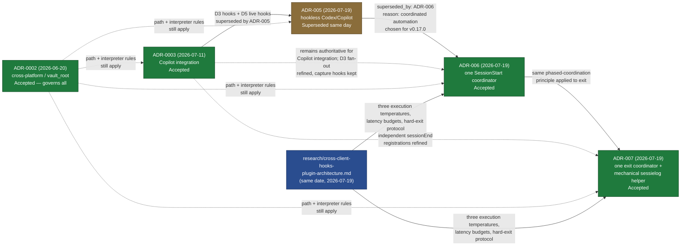
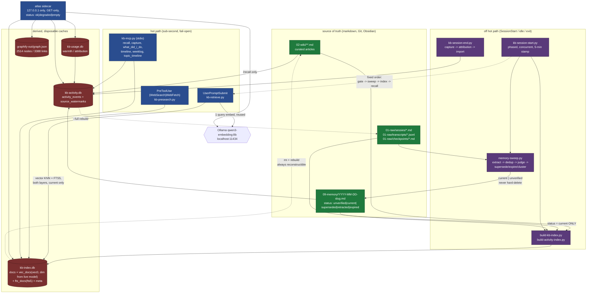

# C4 Code-Level Documentation — `docs/`

> Part of the LLmWiki-KennisBank C4 documentation set. Sibling documents cover the
> executable layers (`scripts/`, `adapters/`, `atlas/`, `tests/`). This document
> covers the **decision and specification layer**.

---

## 1. Overview

| Field | Value |
|---|---|
| **Name** | KennisBank Documentation Tree (ADRs, specs, plans, research) |
| **Description** | The written, versioned decision layer of LLmWiki-KennisBank: 7 Architecture Decision Records, 11 design specs, 15 implementation plans, 1 research report, and 5 operator/agent guides. It contains the binding rules that the executable layers (`scripts/`, `adapters/`, `atlas/`, `setup.sh`) must obey, plus the historical record of how the current architecture was reached. |
| **Location** | `docs/` (repo-relative) |
| **Language(s)** | **Markdown** — 100% of files. Embedded machine-readable artifacts: **JSON** (ADR Enforcement blocks, MCP/hook config contracts, sidecar response schemas), **YAML** (MADR frontmatter, memory frontmatter schema, status history). Embedded *illustrative* fences: 105 `python`, 105 `bash`, 23 `markdown`, 17 `json`, 10 `text`, 4 `yaml`, 1 `toml`, 1 `powershell`, 1 `jsonc` (counted across the tree). |
| **Purpose** | (1) Make architecture decisions retrievable and enforceable by both humans and coding agents; (2) hold the design contracts (storage schemas, retrieval semantics, HTTP/API surfaces, hook lifecycles) that the distribution's scripts implement; (3) give agents installing or upgrading a vault an authoritative install/verify path; (4) preserve the derivation — including superseded options — so decisions are not silently re-litigated. |

### 1.1 An honest note on "Code Elements" for this directory

**`docs/` contains no executable code.** There is not a single `.py`, `.sh`, `.ts`,
or `.rs` file in the tree — every one of its 39 files is Markdown. Documenting
"every function with a complete signature" would require inventing functions that
do not live here.

What *does* exist, and what this document treats as its code elements, is three
kinds of real, citable artifact:

1. **Machine-executable rule blocks.** ADR-006 and ADR-007 each embed a JSON
   `Enforcement` block with `forbid_pattern` / `require_pattern` regexes that
   `adr-kit` (the `adr-kit:judge` skill / pre-commit gate) evaluates against
   `scripts/`. These are the only artifacts in `docs/` that are *run*.
2. **Declared interface contracts.** The implementation plans state, verbatim and
   with types, the signature of every function their task must produce
   (`**Interfaces:** / Produces:` blocks — 71 interface blocks, 55 explicit
   signature lines). Those signatures are quoted here with `file:line`, and they
   are the authoritative specification of the corresponding function in
   `scripts/`.
3. **Wire and storage contracts.** ADR-0004 specifies six HTTP endpoints with
   parameters and full JSON response shapes; the memory design specifies the
   `kb-index.db` schema and the `09-memory/` frontmatter schema; the temporal
   design specifies the `kb-activity.db` event record and the shared Python API.

The 105 `python` and 105 `bash` fences inside the plans are **illustrative target
code and test bodies** — the code an agent is instructed to write into
`scripts/` and `tests/`. They are not part of `docs/`' behaviour and are **not**
documented element-by-element here; §2.7 records that omission explicitly.

There is **no vendored third-party code and no generated artifact** in `docs/`.

### 1.2 Complete inventory (39 files)

| Path | Lines | Kind | Status |
|---|---:|---|---|
| `docs/adr/0001-embedding-model-default.md` | 57 | ADR (lightweight) | Accepted |
| `docs/adr/0002-cross-platform-scripts.md` | 75 | ADR (lightweight) | Accepted |
| `docs/adr/0003-copilot-cli-integration.md` | 369 | ADR (lightweight) | Accepted (D3/D5 refined) |
| `docs/adr/0004-atlas-tauri-architecture.md` | 233 | ADR (lightweight) | Accepted |
| `docs/adr/ADR-005-hookless-codex-copilot-integration.md` | 140 | ADR (MADR 4) | **Superseded** by ADR-006 |
| `docs/adr/ADR-006-coordinate-sessionstart-work-behind-one-client-hook.md` | 220 | ADR (MADR 4) | Accepted |
| `docs/adr/ADR-007-coordinate-session-logging-and-exit-work-behind-one-client-hook.md` | 226 | ADR (MADR 4) | Accepted |
| `docs/AGENT-INSTALL.md` | 150 | Operator guide (for agents) | current |
| `docs/agent-integrations.md` | 291 | Per-client surface reference | current |
| `docs/copilot-headroom-evaluation.md` | 194 | Technical evaluation | current |
| `docs/guiding-principles-and-values.md` | 178 | Compass (EN, primary) | current |
| `docs/guiding-principles-and-values.nl.md` | 185 | Compass (NL translation) | current |
| `docs/research/cross-client-hooks-plugin-architecture.md` | 651 | Research + direction | research |
| `docs/superpowers/specs/2026-06-20-kennisbank-upgrade-contribute-skills-design.md` | 138 | Spec | Approved |
| `docs/superpowers/specs/2026-06-21-vault-onderhoud-laag.md` | 105 | PRD (NL) | draft |
| `docs/superpowers/specs/2026-06-24-cc-transcript-archief-destillatie-design.md` | 129 | Spec (NL) | approved |
| `docs/superpowers/specs/2026-06-25-kennisbank-settings-systeem-design.md` | 299 | Spec (NL) | approved |
| `docs/superpowers/specs/2026-06-26-agent-geheugen-design.md` | 455 | Spec (NL) | design |
| `docs/superpowers/specs/2026-06-27-setup-migratie-v2-design.md` | 133 | Spec (NL) | approved |
| `docs/superpowers/specs/2026-07-08-temporal-activity-recall-design.md` | 226 | Spec (EN) | accepted |
| `docs/superpowers/specs/2026-07-11-knowledge-visualization-atlas-design.md` | 149 | Research + design | partly superseded by ADR-0004 |
| `docs/superpowers/specs/2026-07-12-wiki-memory-two-layer-visualization.md` | 78 | Spec | Accepted |
| `docs/superpowers/specs/2026-07-14-atlas-drawer-navigatie-inline-memories-design.md` | 67 | Spec (NL) | approved |
| `docs/superpowers/specs/2026-07-26-checkpoint-primitief.md` | 69 | Spec (NL) | current (TASK-79) |
| `docs/superpowers/plans/2026-06-20-kennisbank-skills.md` | 630 | Plan | partly superseded |
| `docs/superpowers/plans/2026-06-21-vault-onderhoud-laag.md` | 283 | Plan | — |
| `docs/superpowers/plans/2026-06-24-cc-transcript-archief-destillatie.md` | 992 | Plan | — |
| `docs/superpowers/plans/2026-06-25-kennisbank-settings-systeem.md` | 1152 | Plan | — |
| `docs/superpowers/plans/2026-06-27-agent-geheugen-fase1-fundament.md` | 420 | Plan | — |
| `docs/superpowers/plans/2026-06-27-agent-geheugen-fase2-index.md` | 822 | Plan | — |
| `docs/superpowers/plans/2026-06-27-agent-geheugen-fase3-recall.md` | 556 | Plan | — |
| `docs/superpowers/plans/2026-06-27-agent-geheugen-fase4a-router-seams.md` | 712 | Plan | — |
| `docs/superpowers/plans/2026-06-27-agent-geheugen-fase4b-sweep.md` | 929 | Plan | — |
| `docs/superpowers/plans/2026-06-27-agent-geheugen-fase5-rebuild-health.md` | 644 | Plan | — |
| `docs/superpowers/plans/2026-06-27-agent-geheugen-faseA-presearch.md` | 456 | Plan | — |
| `docs/superpowers/plans/2026-06-27-agent-geheugen-cross-memory-v2.md` | 657 | Plan | — |
| `docs/superpowers/plans/2026-06-27-agent-geheugen-mcp-server.md` | 309 | Plan | — |
| `docs/superpowers/plans/2026-06-27-agent-geheugen-wiki-hybride.md` | 435 | Plan | — |
| `docs/superpowers/plans/2026-06-27-setup-migratie-v2.md` | 1017 | Plan | hookset partly superseded by ADR-006/007 |

---

## 2. Code Elements

### 2.1 `docs/adr/` — the binding decision layer (7 files)

Two record formats coexist. Files `0001`–`0004` use a lightweight in-house format
(`Status` / `Date` / `Deciders` / `Context` / `Decision` / `Consequences` /
`References`). Files `ADR-005`–`ADR-007` use **MADR 4** with YAML frontmatter,
chosen explicitly because "its explicit drivers, options, outcome, confirmation,
and per-option trade-offs are deterministic for agents to scan and verify"
(`docs/adr/ADR-006-coordinate-sessionstart-work-behind-one-client-hook.md:109-113`).

#### 2.1.1 The MADR frontmatter "type" (the closest thing to a class definition)

Declared identically at the top of each MADR file —
`ADR-005:1-15`, `ADR-006:1-14`, `ADR-007:1-13`:

```yaml
id: string              # "ADR-006"
title: string
status: "Proposed" | "Accepted" | "Superseded"
date: YYYY-MM-DD
binding: bool           # false in all three current MADR files
gate: null | string
documents_shipped: bool # ADR-005 true; ADR-006/007 false
verified_in: [path]     # test files that prove the decision
supersedes: [id]
superseded_by: id | null
format: "madr"
```

Plus a machine-parseable `status_history` YAML block inside the body
(`ADR-005:27-44`, `ADR-006:26-43`, `ADR-007:25-37`) with
`date / status / changed_by / reason / changed_via` per transition. `changed_via`
is `adr-kit` or `adr-kit lifecycle` in every entry — i.e. the lifecycle is
tool-driven, not hand-edited.

Note the honest inconsistency: `binding: false` on ADR-006/007 while both carry
hard `Enforcement` regexes and `verified_in: []` while both name concrete test
files in their References. The frontmatter flags are not a reliable authority; the
Enforcement block and References are.

---

#### 2.1.2 ADR-0002 — cross-platform scripts and the `vault_root()` law

**File:** `docs/adr/0002-cross-platform-scripts.md` (75 lines).
**Status:** Accepted, 2026-06-20 (`:3-5`). **Deciders:** Jvdbreemen, Robert van den Breemen.

This is the most widely referenced ADR in the repository and the one every other
ADR defers to for paths and interpreters (`ADR-0003:358-359`, `ADR-005:131-132`,
`ADR-006:184-185`, `ADR-007:185-186`, plus `docs/superpowers/specs/2026-07-26-checkpoint-primitief.md:69`).

**The decision, stated at `:30-31`:**

> "Every script and test in this project must work on macOS, Linux, and Windows
> (Git Bash), and the test suite must pass on all three."

**The six enforceable rules (`:35-49`) — each is a hard constraint on `scripts/`:**

| # | Rule | Line | Why (evidence in the ADR) |
|---|---|---|---|
| R1 | Never pass a Windows-style path (`C:\...`) to a `bash` subprocess; convert to Git Bash POSIX form (`/c/...`) first | `:35-36` | A deploy test passed `C:\Users\...\Temp` as `HOME`; Git Bash mangled the backslashes and the install landed elsewhere — failed on Windows, passed in CI (`:17-19`) |
| R2 | **Resolve the vault through `KENNISBANK_VAULT` (fallback `$HOME/KennisBank`) everywhere, including `setup.sh` — never hard-code `~/KennisBank`** | `:37-39` | This is the rule the repo's `CLAUDE.md` restates as "always via `vault_root()`"; the code-side implementation is `scripts/_vaultpath.py::vault_root()` and the shell-side is `VAULT="${KENNISBANK_VAULT:-$HOME/KennisBank}"` (`:72`) |
| R3 | Shell scripts use LF line endings | `:40` | CRLF breaks `bash` on macOS/Linux |
| R4 | Do not hard-code absolute platform paths to tools; discover via env vars, `PATH` (`shutil.which`), or on Windows the `GitForWindows` registry key — **and reject the `System32` WSL stub** | `:41-43` | A fix attempt hard-coded `C:\Program Files\Git\bin\bash.exe`, missing per-user/Scoop/Chocolatey installs, and its `PATH` fallback silently selected the WSL/Store stub — "a different filesystem namespace" (`:20-23`) |
| R5 | When a required tool genuinely cannot be located, **skip** the test with a clear reason rather than failing misleadingly | `:44-45` | — |
| R6 | CI keeps running `python3 -m py_compile scripts/*.py`, `bash -n setup.sh scripts/doctor.sh`, and `python3 -m unittest discover -s tests` on `ubuntu-latest`; Windows/macOS behaviour is verified by platform-aware tests | `:46-49` | — |

**Accepted trade-off, stated openly (`:64-66`):** CI runs Linux only, so
Windows/macOS regressions are caught by platform-aware test logic and contributor
machines, not a CI matrix. A multi-OS matrix is named as possible future work and
explicitly out of scope.

**Dependencies / referenced artifacts (`:69-75`):** `tests/test_setup_deploy.py`
(the `_bash_path()` POSIX conversion and the Windows bash-discovery helper),
`setup.sh`, `.github/workflows/ci.yml`, and ADR-0001 — named as "the prior
decision establishing `OLLAMA_EMBED_MODEL` as the override-everything pattern this
ADR extends to paths and tools".

> **Verified drift — the ADR text is stale on one of its three CI checks.**
> ADR-0002 `:46-49` names `python3 -m py_compile scripts/*.py`,
> `bash -n setup.sh scripts/doctor.sh`, and
> `python3 -m unittest discover -s tests`. Reading the actual workflow:
> `.github/workflows/ci.yml:31` still runs the `py_compile` check and `:34` still
> runs `bash -n setup.sh scripts/doctor.sh`, but the test step at `:41` is now
> `python3 -m coverage run -m pytest tests -q`, with a coverage gate at `:49`
> (`--fail-under=75`). The workflow documents the switch in a comment at
> `.github/workflows/ci.yml:36-39`: `unittest discover` does not collect
> module-level `test_*` functions, so 21 tests in six files "never ran", including
> the doc-guard in `tests/test_integration_documentation.py` (TASK-53). The runner
> is still `ubuntu-latest` (`:9`), as the ADR states. Treat ADR-0002 `:47` as the
> historical gate; `pytest` is the current one.

---

#### 2.1.3 ADR-0001 — default embedding model (binds retrieval quality)

**File:** `docs/adr/0001-embedding-model-default.md` (57 lines). **Status:** Accepted, 2026-06-20 (`:3`).

**Decision (`:22`):** `qwen3-embedding:8b` is the default embedding model.

Binding numeric constants — these are *the* retrieval calibration constants and
appear in code as `TILING_THRESHOLD_ERROR` / `TILING_THRESHOLD_REVIEW`:

| Model | `TILING_THRESHOLD_ERROR` | `TILING_THRESHOLD_REVIEW` | Line | Role |
|---|---:|---:|---|---|
| `qwen3-embedding:8b` (default, multilingual, 119 languages) | `0.85` | `0.62` | `:26-27` | default; qwen3 spreads cosine lower than nomic |
| `nomic-embed-text` (documented fallback, English-only vaults) | `0.90` | `0.80` | `:29-30` | selected via `OLLAMA_EMBED_MODEL=nomic-embed-text` |

**Constraints this imposes:**

- Overridable end to end through `OLLAMA_EMBED_MODEL`; "nothing is hard-coded
  beyond the default and its matching thresholds" (`:32-33`).
- **Thresholds are model-specific**: switching the model *requires* recalibrating
  both thresholds (`:48-50`).
- Cost accepted explicitly: ~4.7 GB download vs ~274 MB, higher memory/compute per
  embedding (`:45-46`).
- Downstream storage consequence (not stated here but in the memory design): the
  index vector dimension is derived from the live model, verified at 4096 for
  qwen3 — see §2.2.5.

**References (`:52-57`):** `scripts/semantic-tiling.py` (threshold parsing via
`TILING_THRESHOLD_ERROR` / `TILING_THRESHOLD_REVIEW`), `CONFIGURATION.md` §4,
commits `7528624` and `e18b6b5`. Note: ADR-0001 also cites an OLLAMA_MODEL
default in that script (named here without code formatting on purpose — it is
not a knob you can set). The script no longer reads it: a stale reference in the
ADR, recorded here rather than repeated as fact.

---

#### 2.1.4 ADR-0003 — GitHub Copilot CLI as a fourth local agent

**File:** `docs/adr/0003-copilot-cli-integration.md` (369 lines). **Status:** Accepted, 2026-07-11. **Epic:** TASK-26.
**Partly refined:** D3 and the live-hook part of D5 are refined/superseded by ADR-005 → ADR-006/007 (`:132-137`, `ADR-005:85-86`, `ADR-006:182-184`, `ADR-007:182-184`).

The longest ADR and the one that fixes the *Copilot surface facts*. Every fact was
verified against the installed CLI (`copilot` v1.0.70, win32-x64, probed
2026-07-11) and cross-checked against GitHub docs and the Headroom source; doc-only
facts are flagged "verify-before-hardcode" (`:22-26`). It targets the **standalone**
`@github/copilot` CLI, not the `gh copilot` extension (`:28-35`).

**Decision sections (each is the contract for a child task; per-task map at `:315-331`):**

| ID | Decision | Lines | Binding content |
|---|---|---|---|
| D1 | MCP registration = idempotent key-scoped JSON merge | `:69-104` | Write `mcpServers.kennisbank` into `~/.copilot/mcp-config.json` (honouring `COPILOT_HOME`); do **not** shell out to `copilot mcp add` for the mutation. Verified schema: top-level `mcpServers`, `type: "local"` for stdio, **no `${VAR}` interpolation** — literal env values. `command`/`args` follow `_mcp_server_argv` (Windows `py -3`, POSIX `python3`); env carries `KENNISBANK_VAULT`, `KB_LLM_PROVIDERS`, `KB_LLM_MODEL`, `KB_LLM_ENDPOINT`; runtime validity proven by `install-agent-envs.validate_mcp_runtime` (real initialize + list-tools handshake) |
| D2 | Instructions and custom agent profile | `:106-131` | `AGENTS.md` managed block via the existing `_agent_block()`; managed block in `~/.copilot/copilot-instructions.md`; agent profile at `~/.copilot/agents/kennisbank.agent.md` — extension **must** be `.agent.md` (a plain `.md` is silently ignored); only `tools` is doc-confirmed frontmatter, so vault path/tool names/recall commands live in the body prose; repo-local `.github/copilot-instructions.md` is never overwritten |
| D3 | Native Copilot hooks, fail-open | `:132-176` | Hooks are configured by JSON files (`~/.copilot/hooks/kennisbank.json`), not a subcommand. Events: `sessionStart`, `sessionEnd`, `userPromptSubmitted`, `preToolUse`, `postToolUse`, `errorOccurred`, `agentStop`. Payload = single-line JSON on **stdin**, camelCase keys. **Fail-open is safety-critical**: `preToolUse` is fail-CLOSED on non-zero exit (exit 2 denies the call) but fail-OPEN on timeout, so KennisBank hooks **always exit 0** and never emit a deny decision. Refined by ADR-006: the `sessionStart` fan-out becomes one coordinator (`:134-137`) |
| D4 | Wrapper is a trivial exec, not a proxy | `:177-189` | `kennisbank-copilot`: resolve vault/runtime, set `KENNISBANK_VAULT` + instruction env, light-mode validation, then hand off to real `copilot` preserving argv and exit code (`os.execvp` on POSIX; `subprocess.run` + propagate returncode on Windows). Flags: `--doctor`, `--dry-run`, `--print-env`, `--no-capture`. Headroom's proxy machinery is explicitly *not* copied |
| D5 | Rawlog / activity capture, two sources | `:190-203` | Live events via D3 hooks (structured JSONL); session import from `--share[=path]` transcripts and `~/.copilot/session-state/<uuid>.jsonl` into `01-raw/` with dedupe on `source_id`/`session_id` + active-session skip, then extracted into `kb-activity.db`. Both carry `agent=github-copilot-cli` provenance |
| D6 | Config-mutation rule | `:204-221` | **Structured config (JSON/TOML)** → key-scoped read-modify-write of one namespaced key + equivalence check; read fails open on missing/corrupt; write is `indent=2` + trailing newline. **Freeform files** → marker-delimited managed block via `_replace_block` with `KB_START`/`KB_END`. From Headroom: the `RegisterStatus`-style outcome contract (registered / already / mismatch-left-untouched / failed) instead of a bool — "inspiration, not interoperability, and no runtime dependency" |
| D7 | Headroom interoperability: not worthwhile | `:223-231` | No import adapter. Headroom persists only token-economics telemetry, not session knowledge; the purpose mismatch is grounded in Headroom's actual schema |

**Config-location contract (`:233-247`)** — a 7-row table mapping each surface
(MCP servers, hooks, custom agents, personal instructions, agent instructions,
skills, config/state) to its user-level path, repo-local path, and exactly what
KennisBank writes. Notable rows: skills need **no new install step** because
KennisBank already installs to `~/.agents/skills/` (`:246`, cf. `:44-48`); and
`~/.copilot/config.json` / `settings.json` are "**none (never touch)**" (`:247`).

**Fallbacks (`:249-261`):** not installed → skipped/non-fatal with an install hint,
doctor gives 0 FAIL when Copilot is not selected; nvm4w Windows install may place
the JS loader without the platform binary (`copilot --version` prints "no platform
package found") → also install `@github/copilot-<platform>-<arch>` at the same
version; not logged in → install and `copilot mcp list` still work, login is never
forced.

**Threat model (`:263-291`):** Copilot is cloud-backed and therefore an explicit
opt-in that does not change the vault's local-only default; hook payloads are
redacted and malformed payloads tolerated; `mcp-config.json` holds no secrets
because the server is Ollama-local; every mutation is a namespaced key or a marked
block so rollback is surgical; integration targets **v1.0.70+** and degrades to a
WARN below it.

**Acceptance smoke (`:293-313`):** five hermetic steps (detection → MCP visible →
hook event captured → rawlog written → recall works), each runnable with temp
`COPILOT_HOME`/`HOME` and a fake `copilot` binary fixture so CI never needs a
GitHub account.

---

#### 2.1.5 ADR-0004 — Atlas as a Tauri app + Python sidecar (binds the retrieval/visualisation surface)

**File:** `docs/adr/0004-atlas-tauri-architecture.md` (233 lines). **Status:** Accepted, 2026-07-12. **Epic:** TASK-27.

**Decision (`:39-53`):** Tauri shell reusing the OS webview (WebView2/WKWebView),
TypeScript frontend with a canvas/WebGL force-graph, a Python **FastAPI sidecar
bound to `127.0.0.1` only**, and everything local.

**The scale table that drives every choice (`:26-33`)** — measured on the
maintainer's real vault, not a toy corpus:

| Store | Measured scale | Architectural consequence |
|---|---|---|
| `graphify-out/graph.json` | 2514 nodes / 3388 links | SVG/d3-force chokes above ~1000 nodes → canvas/WebGL mandatory |
| `kb-activity.db` | 10868 activity events | a timeline cannot render 10k raw events → server-side aggregation |
| `kb-index.db` | 813 docs | join target for graph encodings |
| `09-memory` + `kb-usage.db` | typed/bi-temporal memory + warmth | needs a live backend, not a frozen export |
| Recall | query → Ollama embed → vector+FTS → RRF → rerank | a live retrieval waterfall cannot live in a static file |

**The single join key across all stores is the file path** (`:35-36`):
`docs.path` = `activity_events.source_path` = graphify `source_file` = usage stem.

**Sidecar API contract — the fullest set of "signatures" in `docs/` (`:84-150`).**
Base URL `http://127.0.0.1:<port>`; the port is free/ephemeral, negotiated at spawn
and passed to the frontend by Tauri; **all endpoints are `GET`, return
deterministic ordering, and carry a top-level `status` field
(`"ok" | "degraded" | "empty"`)** so the frontend degrades fail-open (`:86-90`).

| Endpoint | Parameters | Response (top-level keys) | Backing sources | Line |
|---|---|---|---|---|
| `GET /health` | — | `status`, `version`, `vault`, `port`, `sources{kb_index, activity, usage, memory, graph, ollama}` | liveness + source readiness | `:92-98` |
| `GET /graph` | `valid_as_of` (ISO, optional; bi-temporal filter) | `status`, `generated_at`, `nodes[{id=path, label, kind: wiki\|memory, memory_type, layer, importance, warmth, node_status: active\|quarantined\|superseded, valid_from, valid_until, degree}]`, `links[{source, target, rel, weight}]` | joins `graphify-out/graph.json` with `_kbindex` + `_memory` on file path; time-slider filtering is **client-side** over `valid_from`/`valid_until` | `:100-111` |
| `GET /timeline` | `bucket` (`day\|week`), `from`, `to`, `dimension` (`event\|capture`) | `status`, `buckets[{start, end, event_count, capture_count, by_kind{}}]` | server-side aggregation of the 10868 events via `_activity` | `:113-120` |
| `GET /memory-health` | — | `status`, `counts{active, quarantined, superseded, unverified}`, `supersede_chains[{head, chain[]}]`, `warmth[{path, warmth, last_used}]`, `quarantine[{id, reason}]` | `_memory` + `kb-usage.db` | `:122-130` |
| `GET /recall` | `q` (query), `k` (top-k) | `status`, `query`, `stages{vector[], fts[], rrf[], rerank[]}` (each `{path, score}`), `final[{path, score, snippet}]` | **the only endpoint that needs Ollama**; runs the live waterfall and reuses `kb-recall` so ordering matches exactly | `:132-142` |
| `GET /provenance` | — | `status`, `coverage{sourced, unsourced, total}`, `unsourced[{path, reason}]` | `kb-lint`; rendered as a Graph-lens overlay | `:144-150` |

**Frontend module boundaries (`:152-163`)** — five roles: `app-shell` (tab router,
port handshake, status banner); **`data-client` — the single module that talks to
the sidecar; "this is where the localhost-only invariant is enforced in code"**;
`graph-renderer` (shared canvas/WebGL, reused by Graph, Time-slider, Provenance);
six lens modules; `encoding/legend` (shared field→visual-channel mapping).

**Enforcement — declarative invariants (`:221-233`).** These read as assertions a
reviewer or test must be able to check:

1. The sidecar MUST bind `127.0.0.1` only.
2. The frontend MUST talk only to the localhost sidecar; **no module other than
   `data-client` issues network calls**, and none reaches an external host.
3. The sidecar MUST reuse `_kbindex`, `_activity`, `_rank`, `_memory`, `kb-recall`
   and MUST NOT reimplement retrieval or ranking; **`/recall` MUST return the same
   ordering as `kb-recall`**.
4. Every node and panel MUST trace to a source file or event (provenance).
5. All processing is local; Ollama is local; no cloud, no outbound network.
6. Every code path is fail-open: a missing source yields an empty-but-valid
   response with a `status` field, never a crash.

**Rejected alternatives, with reasons (`:68-82`):** static self-contained HTML over
`file://` (supersedes the original design in
`docs/superpowers/specs/2026-07-11-knowledge-visualization-atlas-design.md`); local
server + system browser; Electron (100 MB+ bundle, 200–400 MB RAM); Obsidian
plugin. **Costs stated explicitly (`:170-176`):** a Rust toolchain at build time,
two bundled runtimes, a cross-platform build matrix, and sidecar lifecycle
ownership (spawn, health-poll with retry, graceful shutdown, no orphans).

---

#### 2.1.6 ADR-005 — hookless Codex/Copilot (**Superseded**)

**File:** `docs/adr/ADR-005-hookless-codex-copilot-integration.md` (140 lines).
**Status:** Superseded by ADR-006, same day (2026-07-19) (`:3-13`, `:21-23`).

Kept as the record of a decision that was reversed within hours. Its outcome
(`:70-86`) was *remove KennisBank hooks from Codex/Copilot and use skills + MCP*,
because client-rendered lifecycle rows (`Running ... hook`,
`SessionStart hook (completed)`) cannot be suppressed by child-process output —
Codex parses but does not implement `suppressOutput`, and Copilot's hook schema has
no equivalent field (`:54-57`). It also fixed the still-current command surface:
skills at `~/.agents/skills/<command>/SKILL.md`; Copilot invokes `/sessiestart` and
`/sessielog`; Codex invokes `$sessiestart` and `$sessielog` with `/prompts:<command>`
as a deprecated compatibility path (`:78-83`).

Reversal reason, recorded in its own status history (`:40-43`): "Coordinated
automation selected for v0.17.0 after the explicit-session trade-off was
reconsidered" — i.e. the cost of *"freshness, notices, and capture silently depend
on user memory"* (`:167-168`) outweighed the zero-row guarantee.

---

#### 2.1.7 ADR-006 — one SessionStart coordinator per client

**File:** `docs/adr/ADR-006-coordinate-sessionstart-work-behind-one-client-hook.md` (220 lines).
**Status:** Accepted, 2026-07-19. Supersedes ADR-005.

**Problem (`:45-60`):** six independent SessionStart hooks in Claude Code and
Codex, eight in Copilot CLI. Clients schedule matching hooks concurrently and
render lifecycle progress themselves; a quiet wrapper cannot hide a client-owned
row. Measured driver: one activity-index run took **26.2 s** in the reported large
vault, so serializing the independent index builders would materially increase
startup latency.

**Decision (`:84-107`) — `scripts/kb-session-start.py` is a phased coordinator that:**

1. runs Copilot import **before** maintenance when Copilot is the client;
2. runs embedding, knowledge, activity, and sweep-launch jobs **concurrently**;
3. runs memory and distillation notices concurrently **after** maintenance;
4. captures Copilot SessionStart even when maintenance is freshness-gated;
5. uses a **per-vault lock and a five-minute completion stamp** to collapse rapid
   startup/resume/clear/compact event bursts;
6. captures child output, discards routine no-change text, and emits **at most one**
   client-native context payload containing only changes or actions;
7. applies a **timeout per child and always exits zero**.

Setup recognizes legacy SessionStart script basenames, removes only those entries,
preserves unrelated hooks, and installs one coordinator in Claude Code, Codex, and
Copilot. Prompt retrieval, presearch, transcript/usage capture, and Copilot
prompt/tool/session capture **remain installed** (`:102-106`).

**Quantified outcome (`:130-131`):** SessionStart registrations fall from `6`
(Claude/Codex) and `8` (Copilot) to `1` per client — an **83% to 87.5% reduction**.

**Enforcement block — machine-executable (`:201-220`).** Consumed by `adr-kit`
against the staged diff:

```json
{
  "forbid_pattern": [
    { "path_glob": "scripts/_hooks_manifest.py",
      "pattern": "\\(\"SessionStart\",\\s+\"(?:build-embed-index|build-kb-index|build-activity-index|sweep-launch|memory-notify|distill-notify)\\.py\"",
      "message": "Register SessionStart maintenance only through kb-session-start.py." }
  ],
  "forbid_import": [],
  "require_pattern": [
    { "path_glob": "scripts/_hooks_manifest.py",
      "pattern": "\\(\"SessionStart\",\\s+\"kb-session-start\\.py\"",
      "message": "The Claude manifest must retain the single SessionStart coordinator." }
  ],
  "llm_judge": false
}
```

**Code anchors it cites (`:188-194`)** — the only place in `docs/` that pins
line numbers into `scripts/`: `scripts/kb-session-start.py:46` (concurrent
maintenance phase), `scripts/kb-session-start.py:239` (phased coordination),
`scripts/_hooks_manifest.py:13` (single Claude coordinator),
`scripts/install-agent-envs.py:352` (single Codex coordinator),
`scripts/_copilot.py:339` (single Copilot coordinator),
`tests/test_session_start.py` (concurrency, order, freshness, envelopes).

**Residual negative, stated honestly (`:139-146`):** one generic client-owned
lifecycle row may remain; the coordinator has a larger blast radius (mitigated by
per-child timeouts, exception isolation, exit-zero, dedicated tests); the
five-minute freshness window can briefly defer a just-landed change.

---

#### 2.1.8 ADR-007 — one exit coordinator + one mechanical `/sessielog` helper

**File:** `docs/adr/ADR-007-coordinate-session-logging-and-exit-work-behind-one-client-hook.md` (226 lines).
**Status:** Accepted, 2026-07-19.

**Decision (`:77-99`) — two scripts, one boundary each.**

`scripts/kb-session-end.py` reads the client payload once and **always exits zero**:

1. Claude and Codex run `archive-transcript.py` as the **capture phase**;
2. Copilot runs `kb-copilot-capture.py --event sessionEnd` as the capture phase;
3. **after capture completes**, usage attribution runs; Copilot also imports the
   completed staging stream with `import-copilot.py --include-active`;
4. independent post-capture jobs run concurrently with per-child timeouts;
5. routine stdout is always empty; the last aggregate status is written to
   `<vault>/.claude/kb-session-end-state.json` for diagnostics.

Registration mapping (`:93`): one coordinator as Claude **`SessionEnd`**, Codex
**`Stop`**, Copilot **`sessionEnd`**. Setup removes the known legacy exit script
basenames, deduplicates `kb-session-end.py`, and preserves unrelated entries.

`scripts/kb-session-log.py --session-log <path>` is the **mechanical** half of
`/sessielog` (`:95-99`): the native workflow keeps the semantic work (summarize
the conversation, curate wiki changes), then invokes the helper **once**; the
helper **validates that the path is inside `<vault>/01-raw/sessies`**, runs
independent index and sweep-launch jobs concurrently, and runs notices after
indexes complete.

The semantic/mechanical split is argued explicitly: an exit coordinator that also
generated the session log was rejected because "a deterministic hook lacks the
agent's current reasoning context and an LLM-backed exit hook would add latency,
cost, and failure modes" (`:158-161`).

**Quantified outcome (`:125`):** exit registrations fall from `2` to `1` per client
(50%). Copilot activity becomes importable at exit rather than at next startup
(`:129-130`), with a `60 s` import timeout and deferral to the next idempotent
startup import on failure (`:141-143`).

**Enforcement block — machine-executable (`:200-226`).** Note it guards a
*command file* as well as the manifest:

```json
{
  "forbid_pattern": [
    { "path_glob": "scripts/_hooks_manifest.py",
      "pattern": "\\(\"SessionEnd\",\\s+\"(?:archive-transcript|kb-usage-scan)\\.py\"",
      "message": "Register Claude exit work only through kb-session-end.py." }
  ],
  "forbid_import": [],
  "require_pattern": [
    { "path_glob": "scripts/_hooks_manifest.py",
      "pattern": "\\(\"SessionEnd\",\\s+\"kb-session-end\\.py\"",
      "message": "The Claude manifest must retain the single exit coordinator." },
    { "path_glob": "commands/sessielog.md",
      "pattern": "kb-session-log\\.py.*--session-log",
      "message": "The native sessielog workflow must invoke its mechanical coordinator once." }
  ],
  "llm_judge": false
}
```

**Code anchors (`:189-195`):** `scripts/kb-session-end.py:121`,
`scripts/kb-session-log.py:127`, `scripts/_hooks_manifest.py:15`,
`scripts/install-agent-envs.py:391`, `scripts/_copilot.py:350`,
`tests/test_session_end.py`, `tests/test_session_log.py`.

---

### 2.2 `docs/superpowers/specs/` — design specifications (11 files)

Format: brainstorm-derived design docs (Superpowers workflow), each with
Problem → Goals → Non-goals (YAGNI) → Architecture → Testing. Nine are Dutch, two
English. Below: role line per file, then full contracts where the spec states them.

| File | Role |
|---|---|
| `2026-06-20-kennisbank-upgrade-contribute-skills-design.md` | Locks the **deploy map** and the upgrade/contribute skill contracts |
| `2026-06-21-vault-onderhoud-laag.md` | PRD for the vault-maintenance and thinking layer (R1–R8) |
| `2026-06-24-cc-transcript-archief-destillatie-design.md` | Transcript archive + piggyback distillation; establishes the SessionEnd/SessionStart hook pair |
| `2026-06-25-kennisbank-settings-systeem-design.md` | The `kennisbank-settings.json` toggle store and `_settings.py` as its sole reader/writer |
| `2026-06-26-agent-geheugen-design.md` | **The storage/retrieval master design**: two layers, one derived index |
| `2026-06-27-setup-migratie-v2-design.md` | Declarative hook manifest + version-stamped migration runner |
| `2026-07-08-temporal-activity-recall-design.md` | `kb-activity.db`, the canonical ActivityEvent, and the temporal API |
| `2026-07-11-knowledge-visualization-atlas-design.md` | Atlas research, data model, six lenses (its "static HTML" recommendation is superseded by ADR-0004) |
| `2026-07-12-wiki-memory-two-layer-visualization.md` | How wiki (map) and memory (entry points) coexist in one view |
| `2026-07-14-atlas-drawer-navigatie-inline-memories-design.md` | Frontend-only: drawer back/forward history + inline memory accordion |
| `2026-07-26-checkpoint-primitief.md` | The checkpoint primitive (TASK-79) and why it does not duplicate `/sessielog` |

---

#### 2.2.1 Deploy map — the single source of truth for install/upgrade/contribute

`docs/superpowers/specs/2026-06-20-kennisbank-upgrade-contribute-skills-design.md:42-51` (table header `:44`, data rows `:46-51`).
This table is what makes the repo a *distribution*: it defines where every repo
artifact lands in a user's vault and home directory.

| Repo source | Deploy destination | Note |
|---|---|---|
| `scripts/*.py` | `$VAULT/.claude/scripts/` | executable |
| `scripts/*.sh` | `$VAULT/.claude/scripts/` | added to close the `doctor.sh` gap |
| `templates/*.md` | `$VAULT/04-templates/` | |
| `commands/*.md` | `~/.claude/commands/` | global |
| `skills/*/SKILL.md` | `~/.claude/skills/<name>/` | global; generalized from autoresearch-only (see the plan's superseded note at `plans/2026-06-20-kennisbank-skills.md:3-9`) |
| `CLAUDE.md.template` | `$VAULT/CLAUDE.md` | personalized — **never** pushed upstream |

Supporting locked decisions: vault = `KENNISBANK_VAULT` with `$HOME/KennisBank`
fallback (`:53-56`); upgrade source of truth = **latest release tag**, main ignored
(`:32-33`); version stamp at `$VAULT/.claude/.kennisbank-version` as JSON `tag`,
`commit`, `installed_at`, absent = pre-v0.6.0 → warn (`:58-62`); **CRLF-agnostic
diffing** everywhere (`diff --strip-trailing-cr` / `git diff --ignore-cr-at-eol`) —
never compare `git show` (LF) against a deployed file (CRLF) without normalization
(`:64-68`); contribute scope = scripts + templates + commands + every `skills/*/`,
personal vault content excluded (`:36-37`).

#### 2.2.2 Settings store contract

`docs/superpowers/specs/2026-06-25-kennisbank-settings-systeem-design.md`.

- **Store (`:48-63`):** one flat JSON file at `$VAULT/kennisbank-settings.json`,
  beside `kennisbank-embed.json`, source of truth. Original four keys:
  `auto_archive`, `distill_notify`, `embed_index`, `daily_graphify`.
- **Sole reader/writer:** `scripts/_settings.py` (`:65-89`), with this CLI surface
  quoted verbatim at `:206-208`:

  ```text
  python _settings.py get <key> [default]   -> print '1'/'0', exit 0
  python _settings.py set <key> <1|0|true|false>
  python _settings.py init                   -> write defaults when absent
  ```

  Stdlib-only, so `setup.sh` (bash) and the upgrade skill get a writer without
  building JSON in bash (`:203-210`).
- **Self-gating hooks (`:104-128`):** hook scripts read their own toggle and
  `exit 0` when off. Explicit non-goal: **never rewrite the global
  `~/.claude/settings.json` hooks array** — hooks stay statically registered and
  gate themselves (`:41-42`).
- **Interpreter convention, stated as a sister rule (`:136-137`):** command
  markdown uses `python3`; `setup.sh` and the hooks use `py -3` on Windows.

#### 2.2.3 Hook manifest and migration runner (v0.9 state — later superseded in part)

`docs/superpowers/specs/2026-06-27-setup-migratie-v2-design.md:32-101`.

The declarative manifest, quoted at `:37-46` as
`(event, script_basename, matcher_or_None)`:

```python
HOOKS = [
    ("SessionStart",     "build-embed-index.py", None),
    ("SessionStart",     "build-kb-index.py",    None),
    ("SessionStart",     "sweep-launch.py",      None),
    ("SessionStart",     "memory-notify.py",     None),
    ("SessionStart",     "distill-notify.py",    None),
    ("UserPromptSubmit", "kb-retrieve.py",       None),
    ("SessionEnd",       "archive-transcript.py", None),
    ("PreToolUse",       "kb-presearch.py",      "WebSearch|WebFetch"),
]
```

**This exact list is the "before" state that ADR-006/007 replace**: the five
SessionStart entries collapse into `kb-session-start.py` and `archive-transcript.py`
into `kb-session-end.py`, and ADR-006's `forbid_pattern` now makes re-adding them
a lint failure. The `PreToolUse` matcher `WebSearch|WebFetch` and the
`UserPromptSubmit` retrieval hook survive unchanged (ADR-006 `:102-106`).

Other binding rules from the same spec: `register-hooks.py` must derive the
interpreter (`py -3` on `os.name == "nt"`, else `python3`) and **self-heal must
preserve the existing interpreter prefix — never rewrite `py -3` → `python3`**
(`:54-60`); `_migrations.py` is a version-stamped ordered runner writing
`<vault>/.claude/.kennisbank-version` (`:62-82`); `setup.sh` refreshes tooling
unconditionally and delegates config/structure to the runner (`:87-97`).

#### 2.2.4 Memory record schema (`09-memory/*.md` frontmatter)

`docs/superpowers/specs/2026-06-26-agent-geheugen-design.md:129-142` — the
truth-maintenance frontmatter that makes stale recall impossible:

```yaml
title: "<short title>"
type: memory
status: unverified        # unverified | current | superseded | retracted | expired
evidence_basis: cc-sessie # getypt | cc-sessie | audio | import | autoresearch | agent
source_session: <id/path> # provenance
created: 2026-06-26
updated: 2026-06-26
expires: 2026-12-26       # optional; judge/sweep estimates volatility
superseded_by: [[...]]    # set on supersession
tags: [...]
```

File naming: `09-memory/YYYY-MM-DD-<slug>.md` per memory; memories older than 30
days and not promoted are merged into `09-memory/archive/YYYY-MM.md` to keep the
file count browsable in Obsidian (`:121-125`).

#### 2.2.5 Storage and retrieval invariants (the most binding non-ADR content)

Same file, `docs/superpowers/specs/2026-06-26-agent-geheugen-design.md`. These
constraints govern every store in the system:

- **Markdown files are the source of truth; `kb-index.db` is a disposable search
  index (`:48-56`).** `rm kb-index.db && kb-index --rebuild` fully reconstructs it.
  "The DB never becomes authoritative."
- **Nine non-negotiable requirements (`:22-44`)**, in the user's own fear ranking:
  (1) no wrong/stale recall — unjudged or outdated memory must never surface;
  (2) no noise; (3) no bloat/duplicates; (4) **local, always** (hard) — SQLite
  local, Ollama local, MCP over stdio/localhost, **no network bind**; (5) readable
  markdown stays the human layer; (6) **the DB is always rebuildable**; (7) no
  manual discipline; (8) pay up front, retrieve fast; (9) the memory subsystem is
  fully decoupled from `auto_archive` / `distill_notify` / `embed_index` /
  `daily_graphify`, with its own toggles, **default on**.
- **Two toggles (`:91-95`):** `memory_capture` gates extraction + judge + sweep +
  memory indexing; `memory_recall` gates injection of `current` memory into
  context. Independently switchable. Decoupling invariant (`:111-113`): shared
  idle-trigger *infrastructure* with graphify must never become one shared gate —
  shared timing, separate on/off.
- **Index (`:198-208`):** incremental (mtime/content hash); sqlite-vec `vec0`
  virtual table for vectors (brute-force KNN, pinned version) + **FTS5** for
  keywords; indexes `02-wiki/` (gated on `embed_index`) plus `09-memory/` with
  `status: current` only (gated on `memory_capture`) — **never `unverified`**;
  `--rebuild` drops and rebuilds from files.
- **Recall (`:210-220`):** embed the query **once**; vector KNN + FTS5 fused;
  results guaranteed from **both** layers (top-k wiki + top-k memory) with wiki and
  `created` recency only as tiebreakers — explicitly *not* a hard precedence that
  buries memory (restated at `:429-435`); filters everything with
  `status != current`; output links back to the source `.md`.
- **SessionStart ordering is load-bearing (`:327-340`):** a memory is recallable
  only when it is both `status: current` **and** in `kb-index.db`, so the fixed
  idempotent order is `0. gate-check → 1. memory-sweep → 2. kb-index build →
  3. recall active`. Wrong order = a just-promoted memory misses this session.
- **Performance contract (`:349-363`):** embed+index and sweep happen off the hot
  path; recall is an index lookup plus one query embedding (~tens of ms on GPU).
  `vec0` brute-force KNN over a few thousand vectors is sub-millisecond; an ANN
  index is warranted only above ~100k memories. **Query and index model must be
  identical** for cosine to be valid.
- **sqlite-vec risk handling (`:365-381`):** pinned to **`v0.1.9`** (the verified
  stable non-prerelease tag; `vec_version()` verified on Windows/Python 3.14.2);
  brute-force `vec0` only, experimental IVF/DiskANN avoided; a documented fallback
  design (FTS5 + vectors-as-blob + numpy cosine, no extension) is kept in reserve
  in the same `kb-index.db`.
- **Error handling (`:383-393`):** recall hook fail-open (any error/cold index → no
  output, exit 0); corrupt index → `--rebuild`; sweep failure surfaces at session
  start and in `doctor.sh` while parked memories stay `unverified` (safe: not
  recallable); judge failure falls back to `unverified`; cache entries with a
  different embed model/dimension are ignored.
- **Explicit YAGNI list (`:437-450`)** — ten things deliberately *not* built,
  including DB-as-source-of-truth, guessed `confidence` numbers, cloud web-AI
  access, wiki→memory seeding, autonomous hard-delete, and putting
  `rebuild-index` and `rebuild-memory` behind one button.

#### 2.2.6 Temporal activity recall — `kb-activity.db` and the shared API

`docs/superpowers/specs/2026-07-08-temporal-activity-recall-design.md` (EN,
accepted, epic TASK-25).

- **Decision (`:9-18`):** a file/SQLite-first index over existing vault evidence;
  derived index at `<vault>/.claude/kb-activity.db`; commands and MCP tools call
  **the same Python API**; Ollama and cloud LLMs are **never required** for date
  resolution, provenance, indexing, or basic retrieval.
- **Data flow (`:46-75`)** — sources `01-raw/sessies/*.md`,
  `01-raw/transcripts/*.jsonl`, `09-memory/**/*.md`, `02-wiki/**/*.md`,
  `.claude/kb-usage.db` → canonical ActivityEvent extraction → `kb-activity.db`
  (`activity_events`, `source_watermarks`) → shared Python API → commands, MCP
  tools, eval harness.
- **Shared API entry points, as written at `:68-71`:** `what_did_i_do()`,
  `timeline()`, `topic_timeline()`, `weeklog()`. Consumers named at `:72-74`:
  `commands/weeklog.md`, `commands/timeline.md`, `commands/watdeedik.md`; MCP tools
  in `kb-mcp.py`; `kb-activity-eval.py`.
- **Honest schema-decay note inside the diagram (`:60-63`):** `activity_entities`,
  `activity_topics`, `activity_artifacts` and `activity_fts` were planned but never
  read (TASK-52); `rollup_cache` existed and was read but "cost more than it
  returned and keyed on too few fields" (TASK-50). This is exactly the kind of
  fact that would otherwise be reverse-engineered from code.
- **Canonical ActivityEvent fields (`:77-99`):** `id` (stable SHA-256 over source
  kind, path, span, kind, time, summary); `source_kind` ∈ {`raw_session`,
  `transcript`, `memory`, `wiki`, `usage`}; `source_path` (vault-relative);
  `source_ref` (path + span, e.g. `01-raw/sessies/raw-sessie-2026-07-03.md#L12`);
  **`event_time` vs `captured_at` kept separate** (bi-temporal — a late import of
  an old session keeps the old activity date, `:101-104`); `timezone`; `actor`,
  `agent`, `project`, `repo`; `activity_kind` ∈ {`session`, `tool_use`, `decision`,
  `task_change`, `memory_capture`, `wiki_update`, `release`, `commit`, `fix`,
  `external_research`, `memory_use`, …}; `title`, `summary`; `topic_tags`,
  `entities`, `artifacts`, `decisions`; deterministic `confidence`;
  `provenance_span`; `unknown_time` flag.
- **Temporal parsing (`:106-123`):** deterministic, testable with injected `now`;
  Dutch + English relative periods, absolute dates, ranges, and quoted topics.
  `vorige week` = local ISO week, Monday 00:00 inclusive → next Monday 00:00
  exclusive, in **`Europe/Amsterdam`**. Ambiguous numeric dates (`03/07/2026`)
  return a structured error with suggestions **instead of guessing**.
- **Retrieval semantics (`:126-141`):** range filtering is **hard** — no event
  outside `[start, end_exclusive)` is returned unless a future API explicitly asks
  for context-before/after and marks it. Topic relevance is a five-step ranking
  ladder: entity match → topic/tag match → alias match from
  `<vault>/.claude/activity-topic-aliases.json` → FTS/plain-text over title,
  summary, entities, topics, source path → optional semantic enrichment (never
  required for baseline). Missing/stale index yields a recoverable warning plus a
  build command, **not a traceback**.
- **Rollups (`:143-159`):** derived cache only, keyed on period/topic plus a source
  signature built from indexed event IDs and source watermarks; a stale signature
  invalidates the cache. LLM prose may be layered later but must be marked
  generated and preserve event IDs/source refs.
- **Doctor and MCP surface (`:161-178`):** `doctor.sh` checks deployment of
  `kb-activity.py` and `build-activity-index.py`, existence/readability/schema
  version/staleness of `kb-activity.db`, installation of `/weeklog`, `/timeline`,
  `/watdeedik`, and presence of MCP temporal wrappers. `install-agent-envs.py`
  requires MCP list-tools to include **`recall`, `capture`, `what_did_i_do`,
  `timeline`, `weeklog`, `topic_timeline`**. SessionStart includes
  `build-activity-index.py`; long runs emit progress at least every 300 s.
- **Eval + privacy (`:180-192`):** `scripts/kb-activity-eval.py` measures date
  recall, period recall, topic-timeline recall and ordering, negative controls,
  provenance coverage, and pass/fail thresholds. The repo ships a **non-personal
  example** eval set; personal cases live at
  `<vault>/06-claude/kb-activity-eval-set.json` — matching the repo-wide rule that
  personal eval sets never enter the repo or a release.
- **Migration (`:213-226`):** existing vaults without the DB keep working; the DB
  is a derived cache and can be deleted safely, rebuilt with
  `python3 <vault>/.claude/scripts/build-activity-index.py --vault <vault> --full`.
  Only new optional user config: `<vault>/.claude/activity-topic-aliases.json`.

#### 2.2.7 Atlas visualisation specs (3 files)

- **`2026-07-11-knowledge-visualization-atlas-design.md`** (149 lines) — research +
  design for six lenses. Its header carries its own supersession note (`:3-8`): the
  "self-contained HTML" recommendation is superseded after a feasibility analysis
  against real vault scale (2514 graph nodes, 10,868 events); Atlas is a Tauri app
  per ADR-0004. **The research, the data model and the six lenses remain valid.**
- **`2026-07-12-wiki-memory-two-layer-visualization.md`** (78 lines, Accepted) —
  wiki = durable map, memory = entry points; many fragments point to one article
  (`:9-18`). Seven options are tabled (`:24-34`); the decision (`:36-49`) is
  **option 5 (base map + toggleable memory overlay) combined with option 6's linked
  inspect**: a "memory entry-points" toggle encodes per-article fragment count via
  size/glow, surfacing blind-spot articles with no entry point. **Prerequisite
  called out honestly (`:51-58`):** the fragment→article edge does not exist yet;
  of three candidate links (shared `source_session`, embedding similarity, recall
  outcome) the chosen one is **recall** — run each fragment through the existing
  recall waterfall and link it to its top wiki article, reusing production ranking
  and adding no new similarity code. Build tasks: TASK-27.14 (`/memory-links`
  endpoint or `/graph` enrichment) and TASK-27.15 (frontend overlay + drawer list).
- **`2026-07-14-atlas-drawer-navigatie-inline-memories-design.md`** (67 lines) —
  frontend-only, `atlas/frontend/src/inspect.ts`. Two path stacks `backStack` /
  `fwdStack`; navigation pushes current onto `backStack` and clears `fwdStack`;
  `←`/`→` buttons in `insp-head` disabled when the stack is empty, Alt+←/Alt+→
  shortcuts while the drawer is open; **both stacks reset when the drawer closes or
  a lens opens a new root document**, so no stale history leaks between contexts
  (`:27-37`). Memory fragments become accordion items lazy-loaded via the existing
  `client.doc("09-memory/<stem>.md")` and rendered through the unchanged
  markdown-it + DOMPurify sanitisation path, cached per stem (`:39-51`).
  Out of scope: persistence across drawer sessions, deep-linking, memory editing
  (the drawer stays read-only) (`:62-67`).

#### 2.2.8 Checkpoint primitive

`docs/superpowers/specs/2026-07-26-checkpoint-primitief.md` (69 lines, TASK-79).
Borrowed from Mind (`checkpoint_save` / `checkpoint_load` / `checkpoint_done`), and
the doc's main job is proving it does **not** duplicate existing layers. Its
three-layer table (`:11-15`) is the clearest statement of the system's time
horizons: checkpoint = forward-looking, hours–days, disposable; `/sessielog` =
backward-looking, permanent raw layer; `09-memory` = timeless, permanent, curated.
"A checkpoint is work-state, not knowledge: it is NOT indexed as a wiki article and
not distilled" (`:17-18`).

Architecture (`:23-41`): `/checkpoint` writes markdown to `01-raw/checkpoints/` and
registers the path via `kb-checkpoint.py --register`; Claude's **PreCompact** hook
runs `kb-checkpoint.py` with no arguments and — gated on the opt-in `checkpoints`
toggle — writes a mechanical stub (transcript path, session, timestamp) to
`.claude/kb-checkpoint-state.json`, because **PreCompact cannot inject context
(side-effects only)**. Recovery runs `kb-checkpoint.py --notify --source <source>`
from `kb-session-start.py`'s always-block, i.e. **before** the 300 s freshness
gate — a SessionStart with `source=compact` would otherwise fall inside the gate
and lose the notice, which is why the coordinator now parses the payload's
`source` field.

Deliberate client asymmetry (`:43-49`): auto-stub only in Claude Code (Codex has no
PreCompact event, Copilot none either); the session-start notice and manual
invocation work everywhere. `install-agent-envs.py` deliberately omits PreCompact
from Codex/Copilot registration (`:55-56`). Bounds (`:60-69`): state capped at 20
entries (`MAX_PENDING`) so a hook loop cannot grow it unbounded; `--register`
refuses paths outside `01-raw/checkpoints/` (same strictness as
`kb-session-log.py`); everything fail-open, stdlib-only, vault root via
`_vaultpath` (**ADR-0002**).

#### 2.2.9 Vault-maintenance PRD (R1–R8)

`docs/superpowers/specs/2026-06-21-vault-onderhoud-laag.md` (105 lines, draft,
reconciled against v0.7.0). Requirement IDs referenced by the matching plan:

| ID | Requirement | Line |
|---|---|---|
| R1 | Safe-edit engine — shared primitive; classifies a change as *small* or *large* and applies the hybrid-autonomy rule; small → apply + log, large or with deletions → show diff and wait for confirmation; every applied edit is a separate git commit (`wiki-rewrite:` / `reconcile:`); threshold configurable via env/config in line with the existing tiling thresholds | `:47-51` |
| R2 | Self-rewriting `/wiki` — look for a candidate article (reusing `_embeddings.py` and the embed cache) before creating a new one; a rewrite preserves the original frontmatter history | `:53-56` |
| R3 | Git safety net mandatory — the engine refuses to run in a non-git vault or a dirty working tree unless forced | `:58` |
| R4 | Conflict detection (`conflict-scan.py`, sibling of `stale-check.py`) — flags high-overlap pairs with contradicting claims; false positives allowed, the report is a proposal | `:62-65` |
| R5 | Reconciliation with an audit trail (article line or central `reconciliation-log.md`) | `:66-68` |
| R6 | `/uitdaag` — confront a statement with what the vault already knows, via the existing retrieval layer plus graphify | `:69-71` |
| R7 | `/brug` — non-obvious cross-domain connections | `:75` |
| R8 | Progressive context budgets L0–L3 (L0 identity, L1 active state/open loops, L2 relevant articles via `kb-retrieve.py`, L3 full source), integrating with existing context hygiene rather than duplicating it | `:77-79` |

---

### 2.3 `docs/superpowers/plans/` — implementation plans (15 files)

All 15 follow one template: a required-sub-skill banner, **Goal**, **Architecture**,
**Tech Stack**, **Global Constraints**, then numbered tasks, each with
`**Files:**` (create/modify/test), `**Interfaces:**` (Consumes / Produces), and
TDD steps (write failing test → red → implement → green → commit).

The tree contains **71 `**Interfaces:**` blocks** and **55 fully-typed signature
lines**. Those signature lines are the authoritative declared contract for the
corresponding functions in `scripts/`, so they are reproduced below verbatim with
their `file:line`. **Within each plan I summarized the step-by-step prose, the
illustrative Python/bash bodies, and the test code; no plan file is omitted.**

| File | Role |
|---|---|
| `2026-06-20-kennisbank-skills.md` | Builds `kennisbank-upgrade` / `kennisbank-contribute`; carries a superseded note (`:3-9`) that the skills deploy map was generalized from autoresearch-only to all `skills/*/` |
| `2026-06-21-vault-onderhoud-laag.md` | Implements R1–R8: deterministic Python does mechanical work, command markdown does LLM judgement (`:9-13`) |
| `2026-06-24-cc-transcript-archief-destillatie.md` | SessionEnd archive hook + SessionStart notify + `/destilleer` |
| `2026-06-25-kennisbank-settings-systeem.md` | The four toggles, `_settings.py`, `/kennisbank:settings`, interactive setup prompts |
| `2026-06-27-agent-geheugen-fase1-fundament.md` | Data model + toggles + `_memory.py` + `09-memory/` (no behaviour yet) |
| `2026-06-27-agent-geheugen-fase2-index.md` | `_kbindex.py` + `build-kb-index.py` + `/kennisbank:rebuild-index` |
| `2026-06-27-agent-geheugen-fase3-recall.md` | `kb-recall.py` on top of `kb-index.db`, additively wired into `kb-retrieve.py` |
| `2026-06-27-agent-geheugen-fase4a-router-seams.md` | `_llm.py` provider chain + `_judge.py` + `_extract.py` mockable seams |
| `2026-06-27-agent-geheugen-fase4b-sweep.md` | `memory-sweep.py` orchestrator + detached SessionStart launcher with single-flight lock |
| `2026-06-27-agent-geheugen-fase5-rebuild-health.md` | `--all` re-extraction, `/kennisbank:rebuild-memory`, upgrade backfill, `memory-doctor.py`, `memory-notify.py` |
| `2026-06-27-agent-geheugen-faseA-presearch.md` | `kb-presearch.py` PreToolUse hook on `WebSearch`/`WebFetch` + generic `recall_hits` |
| `2026-06-27-agent-geheugen-cross-memory-v2.md` | `_maintenance.py`: supersede pass, second-line recheck, light cluster promotion |
| `2026-06-27-agent-geheugen-mcp-server.md` | `kb-mcp.py` stdio server with a testable `recall_tool` core |
| `2026-06-27-agent-geheugen-wiki-hybride.md` | Migrate wiki recall from JSON cosine to the hybrid index behind a dual-signal gate |
| `2026-06-27-setup-migratie-v2.md` | `_hooks_manifest.py`, interpreter-aware `register-hooks.py`, `_migrations.py`, safe `setup.sh` |

#### 2.3.1 Declared interfaces (verbatim, with citations)

**Safe-edit engine + conflict detection** — `2026-06-21-vault-onderhoud-laag.md`:

- `classify(old: str, new: str, max_lines: int = 20, max_drop: int = 3) -> str` → `"klein"` or `"groot"` per the locked rule — `:48`
- `unified(old: str, new: str, path: str) -> str` → unified diff via `difflib.unified_diff` — `:49`
- `candidate_pairs(embeddings: dict[str, list], sim_threshold: float) -> list[tuple[str, str, float]]` → unordered article pairs with cosine ≥ threshold (overlap pre-filter) — `:145`
- `contradiction_signal(text_a: str, text_b: str) -> float` → 0..1 heuristic (shared key terms + opposing markers: negation tokens `geen/niet/no/not`, mismatched numbers/years on a shared noun); deliberately recall-biased — `:146`

**Transcript archive + distillation** — `2026-06-24-cc-transcript-archief-destillatie.md`:

- `dest_path(vault: Path, hook: dict, src: Path) -> Path` → `<vault>/01-raw/transcripts/<YYYY-MM-DD>-<project-slug>-<sid8>.jsonl` — `:48`
- `archive(hook: dict, vault: Path) -> dict` → returns `{"status": "archived"|"skipped-empty"|"skipped-uptodate"|"error", ...}` — `:49`
- `main() -> int` → reads stdin JSON, calls `archive()`, **always returns `0`** — `:50`
- `pending(vault: Path) -> list[str]` → stems in `01-raw/transcripts/` not listed in `.distilled` — `:480`
- `mark(vault: Path, stems: list[str]) -> int` → appends exactly the given stems (dedup); never marks more than the given set — closing the race where a transcript arriving during `/wiki` would be wrongly marked distilled — `:481`
- `main() -> int` → `--list-pending` prints pending stems; `--mark <stem...>` marks them; otherwise SessionStart notify (emit `additionalContext` JSON only when pending). Always exit 0 — `:482`

**Memory format (`_memory.py`)** — `2026-06-27-agent-geheugen-fase1-fundament.md`:

- `memory_dir() -> Path` (= `<vault>/09-memory`) — `:107`
- `memory_path(title, created=None) -> Path` (= `<vault>/09-memory/<YYYY-MM-DD>-<slug>.md`) — `:108`
- `render(title, body, *, status="unverified", evidence_basis="cc-sessie", source_session="", created=None, updated=None, expires=None, superseded_by=None, tags=None) -> str` — full markdown with frontmatter — `:109`
- `write(title, body, **kw) -> Path` — renders + writes, creates `09-memory/` — `:110`
- `read_status(path) -> str` — status from frontmatter, `"unverified"` when absent/unreadable — `:111`

**Hybrid index (`_kbindex.py`)** — `2026-06-27-agent-geheugen-fase2-index.md`:

- `index_path()` → `<vault>/.claude/kb-index.db` — `:35`
- `connect(path=None) -> sqlite3.Connection` — opens, loads sqlite-vec, sets pragmas — `:36`
- `ensure_schema(conn, dim: int, embed_id: str) -> None` — idempotent table + `meta` creation — `:37`
- `meta_get(conn, key) -> str | None` — `:38`
- `is_valid_for(conn, embed_id: str) -> bool` — True when the stored `embed_id` matches — `:39`
- `upsert(conn, *, path, layer, status, body, vector, file_hash, title="", created="") -> int` — insert/replace across the three tables under one shared `doc_id`; returns `doc_id` — `:215`
- `indexed_hash(conn, path) -> str | None` — stored hash for incremental skipping — `:216`
- `prune(conn, keep_paths: set[str]) -> int` — deletes docs (+ fts/vec rows) whose `path` is not in `keep_paths` — `:217`
- `count(conn) -> int` — `:218`
- `search(conn, *, query_vector, query_text="", k=8, layers=None, statuses=("current",)) -> list[dict]` — `:373`

**Declared schema (`:40`)** — the storage contract behind `kb-index.db`:

```sql
meta(key TEXT PRIMARY KEY, value TEXT)
docs(doc_id INTEGER PRIMARY KEY AUTOINCREMENT, path TEXT UNIQUE, layer TEXT,
     status TEXT, hash TEXT, title TEXT, created TEXT)
vec_docs USING vec0(doc_id INTEGER PRIMARY KEY, embedding float[dim])
fts_docs USING fts5(body)
```

Plan-level constraints for this store (`:13-14`): **sqlite-vec pinned to `v0.1.9`**
(verified loading on Windows/py3.14, `vec_version()=v0.1.9`), brute-force `vec0`
only, no experimental IVF/DiskANN; **the vector dimension is derived from the live
embed model, never a literal** (verified 4096 for `qwen3-embedding:8b`) and stored
in `meta` together with `embed_id()`.

**Recall (`kb-recall.py`)** — fase 3, fase A, wiki-hybrid plans:

- `memory_hits(query_vector, query_text="", k=3) -> list[dict]` — opens `kb-index.db` read-only, validates `embed_id`, calls `_kbindex.search(..., layers=("memory",), statuses=("current",))`, returns `{"path","title","created","score","snippet"}` per hit (snippet via `doc_text(path, cap=280)`); **fail-soft: no db / mismatch / error → `[]`** — `fase3:34`
- `_open_ro(db_path) -> sqlite3.Connection | None` — read-only open with sqlite-vec loaded; None on missing/error — `fase3:35`
- `recall_hits(query_vector, query_text="", k=3, layers=("wiki","memory")) -> list[dict]` — hits across the given layers, status=current, `{"path","layer","title","created","score","snippet"}`; **live status re-check only for `layer=="memory"`** (wiki is curated and has no retract problem) — `faseA:33`
- `memory_hits(...)` remains as a wrapper for `recall_hits(..., layers=("memory",))` — `faseA:34`
- `has_fts_match(query_text, layer="wiki") -> bool` — read-only open, tokenises the query (words ≥ 4 chars, OR-ed), `SELECT 1 FROM fts_docs JOIN docs ON docs.doc_id=fts_docs.rowid WHERE fts_docs MATCH ? AND docs.layer=? LIMIT 1`; fail-soft → False — `wiki-hybride:31`
- `wiki_hits(query_vector, query_text="", k=3) -> list[dict]` — wrapper for `recall_hits(..., layers=("wiki",))` — `wiki-hybride:32`

Binding recall constraints: **byte-identity invariant** — with `memory_recall=false`
the hook output for every prompt is identical to pre-fase-3 (wiki-only)
(`fase3:13`); **reuse the query embedding** — one embed per prompt, `qvec` shared by
the wiki and memory lookups (`fase3:14`); the wiki migration keeps a **dual-signal
gate** (existing cosine ≥ threshold **OR** an FTS5 keyword match) with fallback to
the old cosine selection when the index is missing or empty
(`wiki-hybride:7`, `:13`, `:15`); the PreToolUse hook must **never** emit
`permissionDecision: deny` and instead emits
`{"hookSpecificOutput": {"hookEventName": "PreToolUse", "permissionDecision": "defer", "additionalContext": "..."}}`
(`faseA:13-14`).

**Model router and LLM seams** — `2026-06-27-agent-geheugen-fase4a-router-seams.md`:

- `providers() -> list[str]` — the active chain (default `["ollama"]`) — `:32`
- `model_for(provider) -> str` — `:33`
- `is_local() -> bool` — True when the **first** provider is local (`ollama`) — `:34`
- `generate(prompt, system="", timeout=120.0) -> str | None` — tries the chain in order, first non-empty string wins, `None` when all fail; a cloud step emits a **loud** stderr warning — `:35`
- `_call(provider, model, endpoint, api_key_env, prompt, system, timeout) -> str | None` — one provider call — `:36`
- `judge(candidate, context="") -> dict` → `{"verdict": "current"|"unverified", "reason": str}`; prompts "try to reject; when in doubt reject"; **fail-safe**: `None`/parse error/unknown verdict → `unverified`; only an explicit high-confidence `current` promotes — `:408`
- `extract_candidates(transcript_text, max_n=8) -> list[dict]` → `{"title": str, "body": str}` per candidate; **fail-safe**: `None`/parse error → `[]`; capped at `max_n`; empty/too-short bodies filtered — `:549`

Local-first constraint (`:13`): the default chain is `["ollama"]`; cloud
providers (`openrouter`, `claude-cli`) fire only when the user puts them in the
chain explicitly, and a cloud step logs loudly
("⚠ LLM-fallback to cloud provider '<p>' — content leaves your machine").
**No silent automatic cloud fallback**: a fully failed chain returns `None` and the
caller fails safe.

**Sweep orchestration** — `2026-06-27-agent-geheugen-fase4b-sweep.md`:

- `pending(vault=None) -> list[Path]` — `.jsonl` transcripts whose stem is not in `.swept` — `:40`
- `mark(stems, vault=None) -> int` — appends exactly those stems to `.swept` (dedup) — `:41`
- `transcript_text(jsonl_path) -> str` — reduces user/assistant messages to plain text, fail-soft → `""` — `:42`
- `run_sweep(max_transcripts=10, max_chunks=6) -> dict` — per transcript: `transcript_text` → `chunk` → per chunk `extract_candidates` → per candidate embed + `is_duplicate` (skip dup) → `judge` → `_memory.write(status, evidence_basis="agent", source_session, path=unique)` → `mark`; then a deterministic **expire pass** (`09-memory` current with `expires < today` → `expired`); writes a heartbeat; returns a summary dict — `:410`
- `_expire_pass() -> int`, `_write_heartbeat(summary)` — `:411`

Launcher constraints (`:13-14`): gated on `memory_capture`; **detached and
non-blocking** — Windows `DETACHED_PROCESS|CREATE_NO_WINDOW`, POSIX
`start_new_session=True`, **do not `.wait()`**, exit 0.

**Cross-memory maintenance (`_maintenance.py`)** — `2026-06-27-agent-geheugen-cross-memory-v2.md`:

- `judge_supersede(new_text, old_text) -> bool` — asks `_llm.generate` whether the newer memory contradicts/replaces the older; **fail-safe**: None/parse error/doubt → `False` — `:282`
- `supersede_pass(threshold=0.85, judge_fn=None) -> int` — over `similar_pairs`, marks the **older** (`created`) of each contradicting pair as `superseded` + `superseded_by: [[newer-stem]]`; returns the count; `judge_fn` injectable — `:283`
- `recheck_pass(judge_fn=None, limit=20) -> int` — re-judges each `current` memory (up to `limit`); a non-`current` verdict → `set_status(retracted)`; returns the count — `:429`
- `cluster_promote_pass(threshold=0.80, min_neighbors=2, get_cached_fn=None) -> int` — sets `promote_candidate: true` on every `current` memory with ≥ `min_neighbors` related neighbours (a `/wiki` promotion candidate); returns the count — `:430`

Direction of failure is fixed (`:13-14`): **on doubt/None/parse error, no
mutation** — a memory is never wrongly `superseded`/`retracted`; changes are
non-destructive (status flips + `superseded_by` links + a `promote_candidate` flag),
files stay, everything reversible in Git, **no hard delete**.

**MCP server** — `2026-06-27-agent-geheugen-mcp-server.md`:

- `recall_tool(query: str, k: int = 5) -> str` — embed query → `kb_recall.recall_hits(qvec, query_text=query, k=k, layers=("wiki","memory"))` → human-readable text (one line per hit with layer tag + `[[stem|title]]` + snippet); empty query/no hits/error → a short "no hits"/`""`; **never raises** — `:30`
- `build_server()` — builds the MCP server with the `recall` tool; `None` when `mcp` is absent — `:31`
- `main()` — `build_server().run()` or a clean stderr message when `mcp` is missing (exit 0) — `:32`

Gating constraint (`:13-14`): the `mcp` import sits behind `try/except`; its absence
must **never** affect hook recall, the no-cloud test, or any other test. Local-only:
stdio transport, no network bind; the only network call is the local Ollama embed.

**Hook registration and migrations** — `2026-06-27-setup-migratie-v2.md`:

- `interpreter() -> str` — `"py -3"` on Windows (`os.name == "nt"`), else `"python3"` — `:139`
- `build_command(script_path, interp=None) -> str` — `f'{interp or interpreter()} "{script_path}"'` — `:140`
- `ensure_hook(settings, event, script_path, matcher=None) -> bool` — idempotent; **self-heal preserves the existing interpreter prefix**; matcher only on append — `:141`
- `register_manifest(settings, vault_root) -> bool` — registers the full `_hooks_manifest` against `<vault>/.claude/scripts/<basename>` — `:142`
- `pending(vault) -> list` — migrations with version > stamp (semver as int tuple) — `:495`
- `run(vault, settings_path, skip_hooks=False) -> list[str]` — applies pending migrations, stamps `VERSION`; on a migration error the exception propagates **before** the stamp; returns applied migration names — `:496`

Version target recorded at `:13`: `VERSION = "0.9.0"`.

#### 2.3.2 Plan-level global constraints that recur across the set

Every plan opens with a **Global Constraints** block. The recurring, cross-cutting
ones (each stated independently in multiple plans, which is why they became ADRs or
repo rules):

- **Vault resolution always via `_vaultpath.vault_root()`; never a hardcoded vault
  path.** Hooks self-locate with
  `os.environ.setdefault("KENNISBANK_VAULT", str(Path(__file__).resolve().parents[2]))`
  before the import — `2026-06-24-cc-transcript-archief-destillatie.md:13`;
  restated at `2026-06-21-vault-onderhoud-laag.md:20` and
  `2026-06-25-kennisbank-settings-systeem.md:13`, the latter naming the regression
  guard `tests/test_vaultpath.py::test_no_script_hardcodes_the_vault`.
- **Hooks are fail-open**: every error logs to stderr and ends with `exit 0`; a hook
  must never block, delay, or crash a session —
  `2026-06-24-cc-transcript-archief-destillatie.md:14`,
  `2026-06-25-kennisbank-settings-systeem.md:14`.
- **Stdlib-only** in `scripts/` modules (deviations are explicit and pinned:
  sqlite-vec, optional `mcp`) — `fase1:13`, `fase2:9`.
- **Underscore-prefixed modules** in `scripts/` so they are importable without a
  hyphen — `fase1:7` (stated in that plan's Architecture block).

---

### 2.4 `docs/research/` — 1 file

**`docs/research/cross-client-hooks-plugin-architecture.md`** (651 lines, research +
implementation direction, 2026-07-19). The largest single document in `docs/` and
the analytical basis for ADR-006/007.

**Executive conclusion (`:8-30`):** KennisBank stays *one* local knowledge engine
with thin per-client adapters, never a collection of client-specific memory
implementations. Skills, commands, hook manifests, config paths and native event
envelopes differ per client; **retrieval, redaction, transcript normalization,
indexing, distillation, provenance and wiki behaviour remain canonical.** It rejects
"do all knowledge work at SessionStart and Stop" in favour of three execution
temperatures: **hot** (synchronous cached context reads, append-only watermarks),
**warm** (prompt-specific local retrieval over prebuilt lexical/semantic indexes),
and cold (the heavy worker). Fail-open is restated at `:63-64`: "KennisBank may omit
context; it must not prevent the coding agent from working."

**Admission rule — a 10-point gate for first-class client support (`:66-86`).** A
client qualifies only when setup and doctor can verify: a reusable skill surface; a
user-invocable command; persistent project/global guidance; model-visible context
injection; pre/post tool events or an equivalent evidence surface; a local MCP or
in-process tool bridge; enough lifecycle coverage to durably capture turns,
subagent work and compaction (or a documented write-ahead/recovery equivalent);
versioned install/update/disable/uninstall; inspectable state for `doctor.sh` and
`agent-status.py`; and supported Windows behaviour plus testable macOS/Linux
behaviour. Community clients additionally need 2,000 GitHub stars, recent
maintenance and a credible security story — and "popularity never compensates for
missing lifecycle or privacy controls".

**Normalized lifecycle envelope (`:88-128`)** — the adapter-facing schema:

```text
schema_version
client, client_version, event
session_id, turn_id, agent_id, parent_agent_id
workspace, cwd
transcript_path, transcript_offset, transcript_size, transcript_hash
timestamp, trigger, stop_reason
tool_name, file_paths
redaction_profile, vault_id
```

with 12 recommended normalized events (`session.start`, `prompt.submit`,
`tool.before`, `tool.after`, `tool.failure`, `agent.start`, `agent.stop`,
`compact.before`, `compact.after`, `turn.stop`, `session.interrupt`,
`session.end`), the rule that **native transcript formats are not stable APIs**,
and an idempotency key
`(client, session_id, event, turn_id, agent_id, transcript_offset, content_hash)`.

**Latency budgets (`:130-156`)** — design targets, explicitly "not vendor
guarantees":

| Path | p50 | p95 | Hard timeout | On timeout |
|---|---:|---:|---:|---|
| SessionStart | 50 ms | 150 ms | 500 ms | inject cached minimum or nothing |
| UserPromptSubmit quick recall | 75 ms | 250 ms | 500 ms | lexical results only |
| SubagentStart | 30 ms | 100 ms | 250 ms | parent retrieval bundle only |
| PreToolUse / PostToolUse signal | 10 ms | 25 ms | 100 ms | no-op |
| PreCompact checkpoint | 30 ms | 100 ms | 500 ms | defer to recovery scan |
| Stop / SubagentStop checkpoint | 50 ms | 200 ms | 750 ms | defer to recovery scan |
| SessionEnd archive | 100 ms | 500 ms | 1 s | recover next start |

Grounding measurement (`:144-146`): local prompt embeddings previously took roughly
**2.1–2.5 s** on the active machine — "too slow for an unconditional interactive
hook". The prescribed prompt path is therefore: query prebuilt FTS/recency/project/
entity indexes → form a small memory shortlist → use a cached query embedding when
available → attempt a bounded semantic rerank only when the embedding service is
warm and the deadline permits → search only the shortlist's linked wiki
neighbourhood. **"No hook should start Ollama, download a model, rebuild an index,
sweep memory, or wait for a cold model load."** (`:155-156`)

**Hard-exit durability protocol (`:306-320`):** no in-process hook survives an OS
kill, crash, power loss or destroyed terminal, so "capture on hard exit" means:
write ahead at prompt submission and every completed turn; checkpoint selected tool
and compaction boundaries; store offsets and hashes atomically under the
vault-owned spool; preserve immutable raw transcript fragments or stable source
references; **omit the final marker until graceful finalization succeeds**; scan
unfinished records at the next SessionStart; replay idempotently. A permanent
watcher is explicitly optional.

**Capture vs publication separation (`:322-344`):** capture is objective,
append-only, redacted, source-preserving, idempotent; distillation is interpretive
and model-bearing; memory promotion requires independent judgment and dedup; wiki
publication may conflict and need review. The cold worker's eight steps end in
"publish atomically or queue review", and the invariant is: **"Synchronous hooks
enqueue work. They never rewrite wiki articles."**

**Client assessment matrix (`:346-425`)** with legend Y/A/D/N across prompt context,
tool events, subagents, compact, stop/end, plugin/update: Claude Code = supported
reference; Codex = supported with recovery (documented degradation: no SessionEnd);
Copilot CLI = supported opt-in; plus per-client sections for Kimi Code, Kilo Code
and Warp.

**Proposed adapter tree (`:426-467`)** — `adapters/capabilities.json` plus
per-client directories (`claude/ codex/ copilot/ opencode/ kimi/ kilo/ qwen/
gemini/ cursor/ vscode/ omp/ pi/`) beside `scripts/kb-hook.py`,
`install-agent-envs.py`, `doctor.sh`, `agent-status.py`, and canonical
`commands/`, `skills/`, `templates/`. `capabilities.json` records native event
names and required fields, whether injection is model-visible, failure semantics,
all install paths, native install/list/update/remove commands, version feature
gates, remote/cloud data-boundary constraints, and doctor probes.
**"TypeScript adapters contain no retrieval or capture policy"** — they validate the
native payload, call the bounded Python hook core, and translate the response
(`:466-467`). Remaining sections cover installer/update/migration (`:469-508`),
doctor requirements (`:509-539`), a six-phase rollout (`:540-596`), open policy
questions (`:597-620`) and primary sources (`:621-651`).

---

### 2.5 Root-level guides (5 files)

#### `docs/AGENT-INSTALL.md` (150 lines) — the agent-facing install entry point

Written for AI agents installing the distribution; `AGENTS.md` wins on conflict
(`:5-6`). The canonical invocation (`:10-13`):

```bash
git clone https://github.com/Jvdbreemen/LLmWiki-KennisBank.git
cd LLmWiki-KennisBank
KENNISBANK_VAULT="/absolute/path/to/vault" bash setup.sh --yes --agents claude,codex
```

`setup.sh` is the **single supported entrypoint** for install *and* upgrade; hand
copying is forbidden; re-running repairs a broken install and preserves user data
(`:15-19`). Three rules that "prevent the most common breakage" (`:21-31`):
(1) never assume the vault path — resolve `KENNISBANK_VAULT` → user-provided path →
only then `~/KennisBank`, and pass it explicitly on every call; (2) on Windows use
Git Bash, **not** the System32 `bash.exe` (that is WSL and writes Linux-shaped
paths into Windows agent configs) — hooks run under `py -3`, POSIX uses `python3`;
(3) verify then stop — run `bash "$VAULT/.claude/scripts/doctor.sh"`, report
PASS/WARN/FAIL, and do not "fix" WARNs nobody asked about.

Prerequisites (`:33-36`): `git`, Python 3.10+, and Ollama with `qwen3-embedding:8b`
for local embeddings and the memory judge; setup validates models unless
`--skip-model-check` (CI/offline only).

**Platform capability matrix (`:38-46`)** across Claude Code / Codex CLI / Copilot
CLI / OpenCode / Claude Cowork, over five capabilities. Two rows carry real
architectural weight: the **prompt-time retrieval hook exists only in Claude Code**
(the other clients pull via MCP), and **Cowork has no hooks at all** (skills/plugin
only). Per-client sections then state exactly what lands where (`:47-135`) — for
Claude Code: scripts → `$VAULT/.claude/scripts/`, templates → `$VAULT/04-templates/`,
commands → `~/.claude/commands/`, skills → `~/.claude/skills/<name>/`, and hooks
registered in `~/.claude/settings.json` (SessionStart, SessionEnd, UserPromptSubmit,
PreToolUse, PreCompact) with `KENNISBANK_VAULT` pinned in `env`; a hand-edited but
invalid `settings.json` makes registration **refuse rather than clobber** (`:53-60`).
The Cowork section (`:112-134`) is explicit that hook-driven capture and
push-retrieval are **not available** there, that no `--agents cowork` target exists,
and that the section was verified against Claude Desktop 3P extension docs as of
2026-07 and should be re-checked before being relied on. Upgrade guidance (`:145-150`):
use the `kennisbank-upgrade` skill or re-run `setup.sh` **from the latest release
tag — never from bare `main`**.

#### `docs/agent-integrations.md` (291 lines) — per-client surface reference

Opens with the invariant that every supported local client points at the same vault
and the same stdio MCP server `<vault>/.claude/scripts/kb-mcp.py` (`:3-8`), and that
`setup.sh` is the only supported install/upgrade entrypoint — it refreshes tooling,
repairs agent configuration, runs migrations, validates hooks and skills, validates
MCP runtime startup, and runs local checks (`:21-24`). Sections: Claude Code
(`:25`), Codex (`:42`), OpenCode (`:101`), GitHub Copilot CLI (`:148`) with "How
Copilot activity becomes recall" (`:231`), Other MCP Clients (`:247`), Hosted
Agents (`:287`). Contains the concrete `mcpServers` JSON blocks with
`KENNISBANK_VAULT` in the server `env` (`:134`, `:203`, `:262`) — the deployable
form of ADR-0003 D1.

#### `docs/copilot-headroom-evaluation.md` (194 lines) — the TASK-26.12 evaluation

Standalone evaluation grounded in ADR-0003 D4/D7 (`:1-14`); explicitly does **not**
re-derive facts already Accepted there. Decision (`:16-27`): do not adopt Headroom
as a runtime dependency and do not build a log/config import adapter now; the
`kennisbank-copilot` wrapper stays a trivial exec; Headroom remains **inspiration
only**, while peaceful coexistence is acknowledged as a separate, weaker claim.
Its contribution beyond the ADR is the explicit **three-way classification**
(`:44-113`): (1) inspiration — interfaces borrowed, no code, no runtime dependency;
(2) optional interoperability — possible, not built, not required; (3) explicitly
not adopted as a runtime dependency. Remaining sections: import-adapter verdict
(`:114`), rationale (`:132`), future work — none created (`:148`), reviewed sources
(`:157`), cross-references (`:184`).

#### `docs/guiding-principles-and-values.md` (178 lines) + `.nl.md` (185 lines)

The project compass, EN primary with a named Dutch translation (matching the
repo-wide language policy: English primary, NL only as an explicitly named
variant). The chain is stated as one-directional: **values → principles → code**
(`:11-17`); "a change that honors the principles but betrays a value is the wrong
change".

Part 1 groups the values (`:27-95`): sovereignty and privacy; the trust trio
(honesty, transparency, traceability); the craft (care, clarity); the partnership
(respect, helpfulness, integrity); the spirit (curiosity and joy). Part 2 turns
them into **13 numbered design laws (`:97-141`)**, each tagged with the values it
serves — the ones that show up verbatim as constraints in the ADRs and specs:

1. Performance before everything — heavy work off the hot path, interactive path sub-second.
2. Retrieval-first.
3. Local, always — SQLite/markdown, Ollama, stdio MCP; no hosted service, no mandatory cloud, no telemetry by default.
4. Automate over discipline.
5. Human as editor-in-chief — the system proposes, the human decides; never silently deletes or rewrites.
6. Provenance and auditability — no summary without evidence links; unsourceable content is flagged, not trusted.
7. Never the same mistake twice.
8. Spontaneous but high-precision help — proactive surfacing only above a high relevance threshold.
9. **Fail-open** — a missing Ollama, stale index, broken hook or down model may never block the agent.
10. **Idempotent-safe** — installers and config mutations are safe to re-run, preserve user data, use marked managed blocks and key-scoped edits, back up before touching freeform files, never clobber what they did not create.
11. Multi-agent, one vault — one local vault, one stdio MCP server, shared across every agent.
12. **Time is a first-class dimension** — bi-temporal memory: valid time distinct from capture time; facts supersede, expire and retract with history intact.
13. KISS — simple and explainable over clever and opaque.

Principles 9, 10 and 12 are the direct ancestors of, respectively, the fail-open
hook contract (ADR-0003 D3, every plan's Global Constraints), the config-mutation
rule (ADR-0003 D6), and the bi-temporal `event_time`/`captured_at` split
(temporal design `:101-104`) plus the `/graph` `valid_from`/`valid_until` fields
(ADR-0004 `:105-108`).

### 2.6 The binding-decision summary (what a reviewer must not violate)

| Constraint | Source | Enforcement mechanism |
|---|---|---|
| Vault root resolves only via `KENNISBANK_VAULT` → `vault_root()`; no hardcoded vault path | `adr/0002-cross-platform-scripts.md:37-39` | `tests/test_vaultpath.py::test_no_script_hardcodes_the_vault` (named in `plans/2026-06-25-kennisbank-settings-systeem.md:13`) |
| No Windows path into a `bash` subprocess; no hardcoded tool paths; reject the System32 WSL stub; LF endings | `adr/0002-cross-platform-scripts.md:35-43` | `tests/test_setup_deploy.py` `_bash_path()` + bash discovery (`:70-71`) |
| Interpreter: `py -3` on Windows, `python3` elsewhere; self-heal preserves the existing prefix | `specs/2026-06-27-setup-migratie-v2-design.md:54-60`, `plans/2026-06-27-setup-migratie-v2.md:139-141` | `register-hooks.py` tests; command-shape tests required by ADR-006 `:122-123` |
| Default embed model `qwen3-embedding:8b` with thresholds `0.85` / `0.62`; `nomic-embed-text` → `0.90` / `0.80` | `adr/0001-embedding-model-default.md:22-30` | `scripts/semantic-tiling.py` threshold parsing; `CONFIGURATION.md` §4 |
| Markdown is the source of truth; every SQLite store is a rebuildable derived cache | `specs/2026-06-26-agent-geheugen-design.md:48-56`; `specs/2026-07-08-temporal-activity-recall-design.md:213-222` | rebuild determinism tests (`:404`, `:409`) |
| `kb-index.db` = sqlite-vec `vec0` (pinned `v0.1.9`, brute force) + FTS5; dimension derived from the live model | `plans/2026-06-27-agent-geheugen-fase2-index.md:13-14`, `:40` | schema/meta validation via `is_valid_for()`; `tests/test_kbindex_schema.py` |
| Only `status: current` memory is indexed and recalled | `specs/2026-06-26-agent-geheugen-design.md:204-206`, `:219` | status filter in `_kbindex.search(..., statuses=("current",))` |
| SessionStart order: gate → sweep → index → recall | `specs/2026-06-26-agent-geheugen-design.md:327-340` | ADR-006 phased coordinator + `tests/test_session_start.py` |
| Exactly one SessionStart coordinator and one exit coordinator per client | `adr/ADR-006:84-107`, `adr/ADR-007:77-99` | the two JSON Enforcement blocks (adr-kit) + `tests/test_session_start.py`, `tests/test_session_end.py` |
| Capture must complete before work that consumes the session | `adr/ADR-007:81-89` | concurrency/order tests (`:111-112`) |
| Everything fail-open; hooks always exit 0; never `permissionDecision: deny` | `adr/0003:167-176`, `plans/...faseA-presearch.md:13-14`, `guiding-principles-and-values.md:125-127` | per-child timeouts, exit-zero, hook tests |
| Atlas sidecar binds `127.0.0.1` only; only `data-client` makes network calls; `/recall` ordering equals `kb-recall` | `adr/0004-atlas-tauri-architecture.md:221-233` | declarative invariants (no automated gate named in the ADR) |
| Config mutation: key-scoped JSON merge for structured files, marker-delimited managed block + backup for freeform files | `adr/0003:204-221` | `tests/test_copilot_config.py`, `tests/test_agent_envs_install.py` (named in `ADR-005:9-11`) |
| Nothing leaves the machine without explicit consent; cloud LLM providers only when the user puts them in the chain, and they log loudly | `specs/2026-06-26-agent-geheugen-design.md:30-31`, `plans/...fase4a-router-seams.md:13` | `doctor.sh` no-cloud check (`specs/...:281`), no-cloud test (`:405`) |
| Personal eval sets never enter the repo or a release | `specs/2026-07-08-temporal-activity-recall-design.md:191-192` | `tests/test_eval_privacy.py` + `.gitignore` (repo-level guard) |

### 2.7 Explicitly not documented element-by-element

- **Illustrative code fences inside the plans** (105 `python`, 105 `bash`): target
  implementations and full test-case bodies for `scripts/` and `tests/`. They are
  specifications of code documented in the sibling C4 files, not code belonging to
  `docs/`. Where a fence states an authoritative contract (the `HOOKS` list, the
  `kb-index.db` schema, the `_settings.py` CLI, the memory frontmatter) it **is**
  reproduced above.
- **Per-step TDD prose** in the 15 plans (red/green/commit sequences, commit
  message texts, acceptance-criteria checklists). Summarized as the plan's role and
  its declared interfaces.
- **`docs/guiding-principles-and-values.nl.md`**: a full translation of the English
  primary document; its 13 principles and 5 value groups are identical in content,
  so only the English source is enumerated.
- **Prose sections of the research report** beyond the binding protocols: the
  hook-by-hook evaluation (`:158-305`), per-client narratives for Kimi/Kilo/Warp
  (`:372-425`), phased rollout (`:540-596`) and primary sources (`:621-651`) are
  catalogued by heading and line range rather than restated.
- **No vendored third-party code and no generated artifacts exist in `docs/`**, so
  nothing was skipped on that basis.

---

## 3. Dependencies

### 3.1 Internal — repo code and artifacts referenced by `docs/`

These are the paths `docs/` constrains or points at. `docs/` imports nothing (it is
Markdown); the direction of dependency is **docs → code as specification**, and
**code → docs** only where the ADR Enforcement blocks are evaluated against
`scripts/`.

| Referenced path | Referenced from (examples) | Relationship |
|---|---|---|
| `scripts/_vaultpath.py` (`vault_root()`) | `adr/0002:37-39`; every plan's Global Constraints | ADR-0002's central rule; the sole permitted vault resolver |
| `scripts/_hooks_manifest.py` | `adr/ADR-006:190`, `:203-215`; `adr/ADR-007:191`, `:205-218`; `specs/2026-06-27-setup-migratie-v2-design.md:32-53` | **Guarded by both Enforcement blocks** (forbid legacy entries, require the coordinators) |
| `scripts/kb-session-start.py` | `adr/ADR-006:88`, `:188-189` | The single SessionStart coordinator (cited at lines 46 and 239) |
| `scripts/kb-session-end.py`, `scripts/kb-session-log.py` | `adr/ADR-007:81`, `:95`, `:189-190` | The single exit coordinator (line 121) and the mechanical `/sessielog` helper (line 127) |
| `scripts/install-agent-envs.py` | `adr/0003:353-355`; `adr/ADR-006:191`; `adr/ADR-007:192`; `specs/2026-07-08-...:176-178`; `specs/2026-07-26-checkpoint-primitief.md:55-56` | The cross-agent install layer; must validate MCP list-tools and must not register PreCompact for Codex/Copilot |
| `scripts/_copilot.py` | `adr/ADR-005:139`; `adr/ADR-006:192`; `adr/ADR-007:193` | Copilot config/hook registration (coordinators at lines 339 and 350) |
| `scripts/kb-mcp.py` | `adr/0003:87`; `agent-integrations.md:7`; `AGENT-INSTALL.md:119-123`; `plans/...mcp-server.md` | The one stdio MCP server every client points at |
| `scripts/kb-retrieve.py` | `specs/2026-06-26-...:222-228`; `plans/...fase3-recall.md`, `...wiki-hybride.md` | The UserPromptSubmit retrieval hook; the byte-identity invariant applies to it |
| `scripts/kb-recall.py`, `scripts/_kbindex.py`, `scripts/_embeddings.py`, `scripts/_memory.py`, `scripts/_settings.py`, `scripts/_llm.py`, `scripts/_judge.py`, `scripts/_extract.py`, `scripts/_maintenance.py`, `scripts/_migrations.py`, `scripts/_frontmatter.py`, `scripts/_common.py`, `scripts/_sweepstate.py` | the memory/setup plans' Interfaces blocks | Their public signatures are declared in `docs/superpowers/plans/` |
| `scripts/build-embed-index.py`, `build-kb-index.py`, `build-activity-index.py`, `sweep-launch.py`, `memory-sweep.py`, `memory-notify.py`, `memory-doctor.py`, `distill-notify.py`, `archive-transcript.py`, `kb-presearch.py`, `kb-checkpoint.py`, `kb-copilot-capture.py`, `import-copilot.py`, `kb-usage-scan.py`, `kb-activity.py`, `kb-activity-eval.py`, `semantic-tiling.py`, `conflict-scan.py`, `stale-check.py`, `kb-lint`, `register-hooks.py`, `agent-status.py` | across ADRs, specs, plans | The scripts whose behaviour these documents specify or gate |
| `scripts/doctor.sh` | `adr/0002:47`; `AGENT-INSTALL.md:139`; `specs/2026-07-08-...:168-174`; `specs/2026-06-26-...:281-283` | The verification gate; docs define what it must check |
| `setup.sh` | `adr/0002:38`, `:72`; `AGENT-INSTALL.md:15`; `agent-integrations.md:21`; `specs/2026-06-27-setup-migratie-v2-design.md:87-97` | The single supported install/upgrade entrypoint |
| `commands/*.md` (`sessielog.md`, `weeklog.md`, `timeline.md`, `watdeedik.md`, `checkpoint`, `kennisbank/settings.md`, `destilleer`, `wiki`, `reconcile`, `uitdaag`, `brug`, `stale`, `rebuild-index`, `rebuild-memory`) | `adr/ADR-007:219-221`; `specs/2026-07-08-...:72-74`; settings and memory specs | **`commands/sessielog.md` is guarded by an ADR-007 `require_pattern`** |
| `skills/*/SKILL.md` (`kennisbank-upgrade`, `kennisbank-contribute`, `autoresearch`, …) | `specs/2026-06-20-...:46-51`; `adr/ADR-005:78-84` | Deploy map targets; the hookless-era command surface |
| `templates/*.md`, `CLAUDE.md.template` | `specs/2026-06-20-...:46-51` | Deploy map targets |
| `adapters/` + `capabilities.json` | `research/...:426-467`; `adr/0003:126` | Proposed thin-adapter layer; the `copilot-instructions` registry entry is a documented opt-in |
| `atlas/` (`src-tauri/main.rs`, `tauri.conf.json`, `frontend/src/inspect.ts`, `frontend/src/encoding.test.ts`, sidecar) | `adr/0004:39-53`, `:152-163`; `specs/2026-07-14-...:27-58` | The app this ADR/spec pair specifies |
| `tests/` (`test_setup_deploy.py`, `test_vaultpath.py`, `test_kbindex_schema.py`, `test_session_start.py`, `test_session_end.py`, `test_session_log.py`, `test_agent_envs_install.py`, `test_copilot_config.py`, `test_eval_privacy.py`, `tests/_loader.py`) | ADR References; MADR `verified_in`; plan test rows | The verification surface each decision claims |
| `AGENTS.md`, `CLAUDE.md`, `VALUES.md`, `PRINCIPLES.md`, `CONFIGURATION.md`, `README.md`, `CHANGELOG.md` | `AGENT-INSTALL.md:5-6`; `guiding-principles-and-values.md:7-9`; `adr/0001:55` | Sibling top-level docs; `AGENTS.md` wins on conflict with `AGENT-INSTALL.md` |
| `backlog/` (TASK-25, 26.x, 27.x, 34, 50, 52, 79, …) | throughout | Task IDs traced by every ADR/spec |
| Vault-side data paths: `$VAULT/.claude/scripts/`, `01-raw/{sessies,transcripts,checkpoints}/`, `02-wiki/`, `04-templates/`, `05-bronnen/`, `06-claude/`, `09-memory/{,archive/}`, `graphify-out/graph.json`, `kennisbank-settings.json`, `kennisbank-embed.json` | deploy map, memory design, temporal design, ADR-0004 | The vault layout the distribution writes into |

### 3.2 External dependencies named in `docs/`

**Runtime / language:**

- **Python 3.10+**, stdlib-only by default (`sqlite3`, `json`, `urllib`,
  `subprocess`, `difflib`, `os`, `pathlib`) — every plan's Tech Stack.
- **bash** (Git Bash on Windows) for `setup.sh` / `doctor.sh`; PowerShell only as a
  documented Windows invocation example (`AGENT-INSTALL.md:66-69`).
- **TypeScript** + **Rust/cargo** + **Tauri** + **FastAPI** for Atlas
  (`adr/0004:39-53`, `:171-172`); **Vitest** for frontend unit tests
  (`specs/2026-07-14-...:53-56`); **markdown-it** + **DOMPurify** as the existing
  sanitisation pipeline (`specs/2026-07-14-...:45-46`).

**Storage — SQLite databases (all local, all derived caches):**

| Database | Path | Specified in |
|---|---|---|
| `kb-index.db` | `<vault>/.claude/kb-index.db` | `specs/2026-06-26-agent-geheugen-design.md:48-56`, `:198-208`; schema in `plans/...fase2-index.md:40` |
| `kb-activity.db` | `<vault>/.claude/kb-activity.db` | `specs/2026-07-08-temporal-activity-recall-design.md:15`, `:57-63` |
| `kb-usage.db` | `<vault>/.claude/kb-usage.db` | `adr/0004:31`, `:123`; `specs/2026-07-08-...:51` |
| `graphify-out/graph.json` | vault-relative JSON (not SQLite) | `adr/0004:12`, `:28`, `:110` |

> **Accuracy note:** `kb-graph.db` is **not mentioned anywhere in `docs/`**. The
> graph store this documentation describes is the JSON file
> `graphify-out/graph.json`. If a `kb-graph.db` exists in the deployed system, it is
> undocumented in this tree.

**Non-SQLite local state files** specified here: `<vault>/.claude/.kennisbank-version`
(`specs/2026-06-20-...:58-62`), `<vault>/.claude/kb-session-end-state.json`
(`adr/ADR-007:88-89`), `<vault>/.claude/kb-checkpoint-state.json`
(`specs/2026-07-26-...:30-32`), `<vault>/.claude/activity-topic-aliases.json`
(`specs/2026-07-08-...:135`, `:225-226`), `$VAULT/kennisbank-settings.json`
(`specs/2026-06-25-...:48-63`), `.distilled` / `.swept` watermarks
(`plans/2026-06-24-...:480-482`, `plans/...fase4b-sweep.md:40-41`).

**Python packages beyond stdlib (deliberately few):**

- **`sqlite-vec` — pinned `v0.1.9`**, brute-force `vec0` only
  (`plans/...fase2-index.md:20-21`; risk analysis at
  `specs/2026-06-26-...:365-381`).
- **FTS5** — in the stdlib `sqlite3` build, "rock solid"
  (`specs/2026-06-26-...:203`).
- **`mcp`** — optional, imported behind `try/except`; its absence must break
  nothing (`plans/...mcp-server.md:13-14`).
- **pytest** as the test runner over `unittest`-style tests via `tests/_loader.py`
  (`plans/2026-06-24-...:9`).

**HTTP endpoints and network services:**

| Endpoint | Purpose | Locality | Source |
|---|---|---|---|
| `http://localhost:11434` (Ollama) | embeddings (`qwen3-embedding:8b`) and the local LLM chain | local only | `adr/0001:9-11`; `adr/0003:92`; `specs/2026-06-26-...:361` |
| `http://127.0.0.1:<ephemeral>` (Atlas sidecar) | 6 `GET` endpoints (§2.1.5) | loopback only, never `0.0.0.0` | `adr/0004:86-90`, `:221-223` |
| stdio (no socket) | the `kb-mcp.py` MCP transport | no network bind at all | `plans/...mcp-server.md:22`; `specs/2026-06-26-...:230-234` |
| GitHub API / GitHub Copilot service | Copilot CLI is cloud-backed | **explicit opt-in only** | `adr/0003:265-271` |
| Optional cloud LLM providers (`openrouter`, `claude-cli`) | LLM fallback | **only when the user adds them to the chain; logs loudly** | `plans/...fase4a-router-seams.md:13` |

**External tools, clients and services:**

- **Claude Code** (hooks: SessionStart, SessionEnd, UserPromptSubmit, PreToolUse,
  PreCompact) — the reference client.
- **Codex CLI** (`$sessiestart` / `$sessielog`, `/prompts:*` compatibility; `Stop`
  event instead of SessionEnd).
- **GitHub Copilot CLI** — standalone `@github/copilot` **v1.0.70+**, config home
  `~/.copilot` overridable by `COPILOT_HOME`; env surface
  `COPILOT_CUSTOM_INSTRUCTIONS_DIRS`, `COPILOT_PROVIDER_TYPE`,
  `COPILOT_PROVIDER_BASE_URL`, `COPILOT_OFFLINE`,
  `COPILOT_GITHUB_TOKEN`/`GH_TOKEN`/`GITHUB_TOKEN`.
- **OpenCode** (`opencode.json` MCP + plugin), **Claude Cowork** (plugins/skills/MCP
  connectors, **no hooks**), **Obsidian** (the vault's human reading layer),
  **git** + **`gh` CLI**, **GitHub Actions** (`ubuntu-latest`).
- **adr-kit** — evaluates the ADR-006/007 Enforcement blocks; **MADR 4** is the
  chosen record profile (`adr/ADR-006:109-113`).
- **Superpowers** skills (`subagent-driven-development`, `executing-plans`,
  `writing-plans`, `brainstorming`) — the workflow every plan requires in its banner.

**External systems studied but deliberately *not* depended on** (documented so the
"no" is not re-litigated): **Headroom** (`headroomlabs-ai/headroom`) — inspiration
only, no runtime dependency, no import adapter (`adr/0003:223-231`;
`copilot-headroom-evaluation.md:16-27`); **Mem0**, **Zep/Graphiti**,
**Letta/MemGPT**, **ClawMem** — patterns taken, hosted memory and a mandatory graph
DB rejected (`specs/2026-07-08-...:27-42`); **Mind** (checkpoint primitive,
`specs/2026-07-26-...:3-5`); **muxViz**, **TheBrain**, **Obsidian graph**
(`specs/2026-07-12-...:9-18`); **obsidian-second-brain** (rejected for cloud APIs,
`specs/2026-06-21-vault-onderhoud-laag.md:9`).

**External documentation cited as primary sources:** Claude Code hooks docs, GitHub
Copilot hooks/CLI references, OpenAI Codex manual and docs, Mem0 docs + arXiv
2504.19413, Graphiti/Zep overview + arXiv 2501.13956, Letta guides, ClawMem repo,
Claude Desktop 3P extensions docs (`AGENT-INSTALL.md:132-134`).

---

## 4. Relationships

### 4.1 How the documentation layer binds the executable layers

```mermaid
flowchart TB
    subgraph compass["docs/ — compass"]
        GP["guiding-principles-and-values.md<br/>13 design laws"]
    end

    subgraph adrs["docs/adr/ — binding decisions"]
        A2["ADR-0002 Accepted<br/>cross-platform + KENNISBANK_VAULT"]
        A1["ADR-0001 Accepted<br/>qwen3-embedding:8b + thresholds"]
        A3["ADR-0003 Accepted<br/>Copilot D1-D7"]
        A4["ADR-0004 Accepted<br/>Atlas Tauri + sidecar API"]
        A5["ADR-005 SUPERSEDED<br/>hookless Codex/Copilot"]
        A6["ADR-006 Accepted<br/>one SessionStart coordinator"]
        A7["ADR-007 Accepted<br/>one exit coordinator"]
    end

    subgraph specs["docs/superpowers/specs/ — design contracts"]
        SMEM["agent-geheugen-design<br/>2 layers, 1 derived index"]
        STEMP["temporal-activity-recall<br/>ActivityEvent + temporal API"]
        SSET["settings-systeem<br/>toggle store"]
        SSETUP["setup-migratie-v2<br/>hook manifest + migrations"]
        SDEPLOY["upgrade-contribute<br/>deploy map"]
        SATLAS["atlas + two-layer + drawer"]
        SCHK["checkpoint-primitief"]
        SVAULT["vault-onderhoud PRD R1-R8"]
    end

    subgraph plans["docs/superpowers/plans/ — 15 plans"]
        PIFACE["71 Interfaces blocks<br/>55 typed signatures"]
    end

    subgraph research["docs/research/"]
        R1["cross-client-hooks<br/>admission rule, envelope,<br/>latency budgets, hard exits"]
    end

    subgraph guides["docs/ root guides"]
        AI["AGENT-INSTALL.md"]
        AG["agent-integrations.md"]
        HR["copilot-headroom-evaluation.md"]
    end

    subgraph code["executable layers (documented elsewhere)"]
        VP["scripts/_vaultpath.py<br/>vault_root()"]
        HM["scripts/_hooks_manifest.py"]
        CO["kb-session-start.py<br/>kb-session-end.py<br/>kb-session-log.py"]
        RET["kb-retrieve.py / kb-recall.py<br/>_kbindex.py / _embeddings.py"]
        MEM["memory-sweep.py / _memory.py<br/>_llm.py / _judge.py / _extract.py"]
        MCP["kb-mcp.py (stdio)"]
        INST["setup.sh / install-agent-envs.py<br/>_copilot.py / doctor.sh"]
        ATL["atlas/ (Tauri + sidecar + frontend)"]
        TST["tests/"]
    end

    subgraph stores["local stores"]
        DBI[("kb-index.db<br/>vec0 + FTS5")]
        DBA[("kb-activity.db")]
        DBU[("kb-usage.db")]
        GJ[("graphify-out/graph.json")]
        MD[("markdown vault<br/>02-wiki / 09-memory / 01-raw")]
        OLL{{"Ollama<br/>localhost:11434"}}
    end

    GP --> A1 & A2 & A3 & A4 & A6 & A7
    GP --> SMEM & STEMP

    A5 -.superseded_by.-> A6
    A6 -.same principle.-> A7
    A3 -.D3 + D5 refined by.-> A6
    A3 -.sessionEnd refined by.-> A7
    A2 --> A3 & A4 & A6 & A7 & SCHK
    A1 --> SMEM

    SMEM --> A4
    STEMP --> A4
    SATLAS -.static-HTML part superseded by.-> A4
    SVAULT --> PIFACE
    SMEM --> PIFACE
    SSET --> PIFACE
    SSETUP --> PIFACE
    SDEPLOY --> PIFACE
    SCHK --> CO
    R1 --> A6 & A7

    A2 ==>|"mandates"| VP
    A6 ==>|"Enforcement regex<br/>forbid + require"| HM
    A7 ==>|"Enforcement regex<br/>+ commands/sessielog.md"| HM
    A6 & A7 ==> CO
    A1 ==> RET
    A3 ==> INST
    A4 ==> ATL
    SDEPLOY ==> INST
    PIFACE ==>|"declares signatures of"| RET & MEM & MCP & INST
    STEMP ==> DBA

    VP --> INST & CO & RET & MEM & MCP
    CO --> RET & MEM
    RET --> DBI
    RET --> OLL
    MEM --> DBI & MD
    MEM --> OLL
    MCP --> RET
    ATL -->|"GET /graph /timeline<br/>/memory-health /recall /provenance"| DBI & DBA & DBU & GJ
    ATL --> OLL
    MD ==>|"source of truth<br/>rebuildable"| DBI & DBA
    A2 & A6 & A7 & A3 -.verified_in.-> TST

    classDef accepted fill:#1f7a3d,stroke:#0d3d1e,color:#fff
    classDef superseded fill:#8a6d3b,stroke:#4a3a1f,color:#fff
    classDef doc fill:#2a4d8f,stroke:#152a52,color:#fff
    classDef codeC fill:#5a3a7a,stroke:#2f1e40,color:#fff
    classDef store fill:#7a2f2f,stroke:#401818,color:#fff
    class A1,A2,A3,A4,A6,A7 accepted
    class A5 superseded
    class GP,SMEM,STEMP,SSET,SSETUP,SDEPLOY,SATLAS,SCHK,SVAULT,PIFACE,R1,AI,AG,HR doc
    class VP,HM,CO,RET,MEM,MCP,INST,ATL,TST codeC
    class DBI,DBA,DBU,GJ,MD,OLL store
```



### 4.2 ADR supersession and refinement chain



### 4.3 Retrieval and storage relationships as specified by `docs/`



---

## 5. Reading order for a newcomer

1. `docs/guiding-principles-and-values.md` — the 13 design laws everything else obeys.
2. `docs/adr/0002-cross-platform-scripts.md` — 75 lines; the rule broken most often.
3. `docs/adr/0001-embedding-model-default.md` — the retrieval calibration constants.
4. `docs/superpowers/specs/2026-06-26-agent-geheugen-design.md` — the storage/retrieval master design.
5. `docs/adr/ADR-006` and `ADR-007` — the current session lifecycle, with executable Enforcement blocks.
6. `docs/adr/0003-copilot-cli-integration.md` §D1–D7 — the cross-agent config pattern.
7. `docs/adr/0004-atlas-tauri-architecture.md` — the only HTTP surface in the system.
8. `docs/research/cross-client-hooks-plugin-architecture.md` — where the lifecycle is heading.

Trap to avoid: `docs/superpowers/plans/2026-06-27-setup-migratie-v2.md` and
`docs/superpowers/specs/2026-06-27-setup-migratie-v2-design.md` describe the
**eight-entry hook manifest** that ADR-006/007 replaced with two coordinators.
Read them as history; the ADR Enforcement blocks are the current law.
