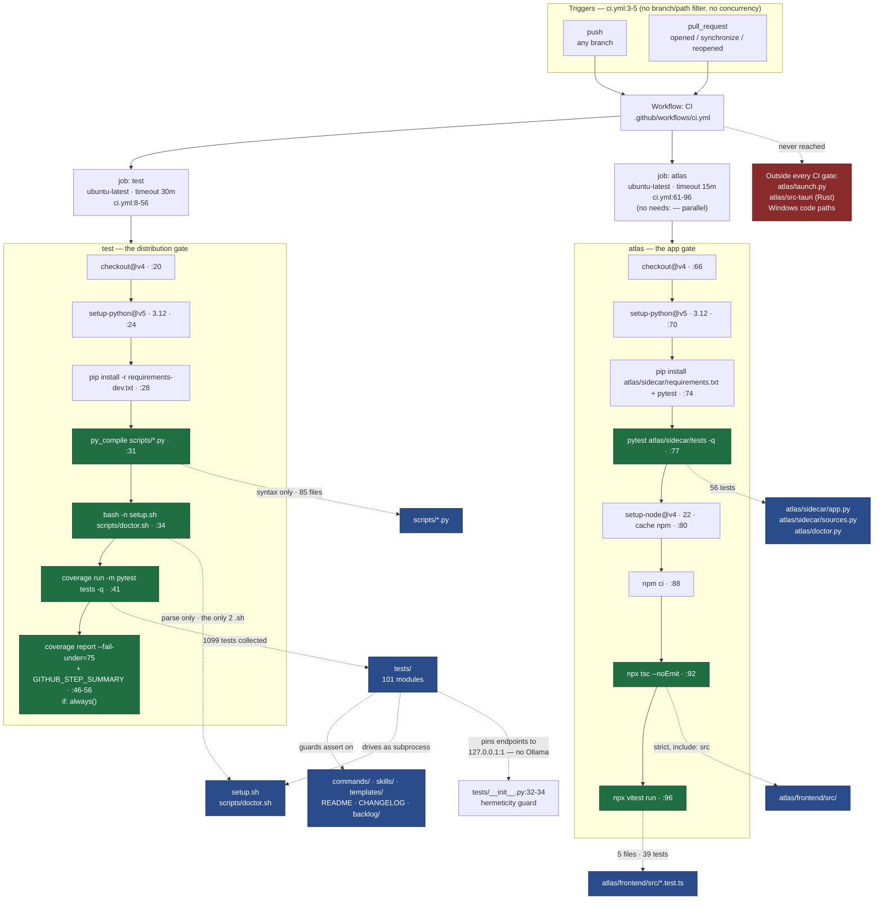

# C4 Code Level — `.github/workflows/` (CI definitions)

## 1. Overview

| Field | Value |
| --- | --- |
| **Name** | KennisBank CI (`.github/workflows/`) |
| **Description** | One GitHub Actions workflow file, `ci.yml` (96 lines), defining **two independent jobs**: `test` (the Python distribution gate — compile, shell syntax, pytest under coverage, coverage floor) and `atlas` (the Atlas app gate — sidecar pytest, frontend typecheck, frontend vitest). There is no third job, no reusable workflow, no composite action, and no second workflow file. |
| **Location** | `.github/workflows/` — single file `.github/workflows/ci.yml` |
| **Language(s)** | GitHub Actions workflow YAML. The `run:` bodies are `bash` (the default shell on `ubuntu-latest`) driving `python3`, `pip`, `npm`, and `npx`. No Python, JS, or Rust source lives in this directory. |
| **Purpose** | Prove a change to the distribution is safe before it can be merged and before `setup.sh` copies the script layer into a user's vault. Because KennisBank is a distribution and not a running service, CI plus the suite in `tests/` is the *only* automated place where the deployed shape is checked. |
| **Vendored / generated code** | **None.** This directory contains one hand-written YAML file. No vendored third-party code, no generated artifacts, no lockfiles. (Generated artifacts do exist elsewhere in the repo — notably `atlas/src-tauri/target/` — and are named in §5.4 only to record that CI does not touch them.) |
| **Runs on** | `ubuntu-latest` for both jobs (`ci.yml:9`, `ci.yml:62`). No Windows or macOS runner anywhere — see the gate-coverage note in §6.5. |

### Reading conventions used in this document

* **A workflow has no functions.** The task's "complete signature" requirement is therefore mapped as follows: the *code elements* of this directory are the workflow, its two jobs, and their steps. For every step this document quotes its `uses:` or `run:` value **verbatim** as the signature-equivalent, with a `ci.yml:NN` citation. Nothing is paraphrased into a fake function shape, and no step is omitted — all **7** steps of `test` and all **8** steps of `atlas` are documented individually below.
* **Nothing is summarized away.** There are no helper elements to fold; every key that carries behaviour (`on`, `runs-on`, `timeout-minutes`, `if`, `with`, `working-directory`) is listed at the job or step where it appears.
* `ci.yml`'s own inline comments are **Dutch** (the repo's code/doc language is English; these comments predate that policy). Where a comment carries a design decision, the Dutch is quoted verbatim in a code block and paraphrased in English underneath — quotations are never silently translated.

---

## 2. Code Elements — workflow level

### 2.1 `ci.yml` — workflow keys

```yaml
name: CI                    # ci.yml:1

on:                         # ci.yml:3
  push:                     # ci.yml:4   (no branch filter, no path filter)
  pull_request:             # ci.yml:5   (no branch filter, no types filter)

jobs:                       # ci.yml:7
  test:                     # ci.yml:8
  atlas:                    # ci.yml:61
```

**Trigger shape — verified facts and their consequences:**

| Fact (`ci.yml:3-5`) | Consequence |
| --- | --- |
| `push:` with no `branches:` | Every push to **every** branch runs both jobs. Nothing is scoped to `main`. |
| `pull_request:` with no `types:` | GitHub's default activity types apply (`opened`, `synchronize`, `reopened`). |
| Both `push` and `pull_request` present | A PR from a branch **in the same repository** fires both events, so the full suite runs **twice per push**. This is a cost/duration fact, not a correctness problem. |
| No `paths:` / `paths-ignore:` | A README-only or `backlog/`-only commit still runs the whole 30-minute-budget suite plus the Atlas job. |
| No `concurrency:` block | Superseded runs are **not** auto-cancelled; pushing twice in a minute leaves both runs going. |
| No `permissions:` block | The job's `GITHUB_TOKEN` inherits the repository/organisation default scope. Recorded as a fact, not a finding: neither job publishes, comments, uploads artifacts, or writes to the repo — every step is read-and-verify. |
| No `workflow_dispatch:` | The workflow cannot be triggered manually from the Actions UI. |
| No `schedule:` | No nightly run; nothing catches rot that only time introduces (e.g. a moved upstream dependency). |

### 2.2 Job `test` — the distribution gate

```yaml
test:                       # ci.yml:8
  runs-on: ubuntu-latest    # ci.yml:9
  timeout-minutes: 30       # ci.yml:17
  steps:                    # ci.yml:18
```

The `timeout-minutes` value carries a long Dutch justification (`ci.yml:10-16`), quoted verbatim:

```
# Hang-vangnet, geen prestatiedoel. Gemeten op een Windows-ontwikkelmachine:
# 781 tests in ~20 min (unittest 763 in ~20 min). De eerdere waarde van 15
# met een comment die "~5-8 min" beweerde was achterhaald en zou de job op
# de klok laten sneuvelen. Linux-runners zijn doorgaans sneller voor deze
# subprocess-zware suite; de marge is bewust ruim. Een test die op een echte
# netwerk-call blijft hangen (zie tests/__init__.py) faalt hierdoor nog
# steeds sneller dan de runner-limiet.
```

English paraphrase: the 30 minutes is a **hang net, not a performance target**. Measured on a Windows dev machine: 781 tests in ~20 min (763 under `unittest`, also ~20 min). The earlier value of 15 minutes, with a comment claiming "~5-8 min", was stale and would have killed the job on the clock. Linux runners are usually faster for this subprocess-heavy suite, so the margin is deliberately generous — and a test hanging on a real network call (see `tests/__init__.py`) still fails faster than GitHub's own runner limit. See §4 for how that 781 compares to the current checkout.

#### Steps of `test` (7 steps, all listed)

| # | Name (`ci.yml`) | Verbatim `uses:` / `run:` | Line | Gate it enforces |
| --- | --- | --- | --- | --- |
| 1 | Checkout | `uses: actions/checkout@v4` | `ci.yml:19-20` | Working tree present. No `fetch-depth`, so the default shallow clone (depth 1) applies. |
| 2 | Set up Python | `uses: actions/setup-python@v5` with `python-version: "3.12"` | `ci.yml:22-25` | Pins the interpreter to **3.12** — the version the suite's `from __future__ import annotations` + modern-typing style assumes. No `cache:` key, so **pip downloads are not cached**. |
| 3 | Install dependencies | `run: pip install -r requirements-dev.txt` | `ci.yml:27-28` | Dependency resolution itself is a gate: a broken pin fails here. Transitively installs `requirements.txt` (see §5.2). |
| 4 | Compile all Python scripts | `run: python3 -m py_compile scripts/*.py` | `ci.yml:30-31` | **Syntax gate** over the shipped script layer. Blast radius verified: `scripts/*.py` = **85 files**, and `scripts/` has no `.py` in any subdirectory, so the non-recursive glob covers the whole script layer. `py_compile` catches syntax errors only — never import errors, missing modules, or undefined names. |
| 5 | Shell syntax check | `run: bash -n setup.sh scripts/doctor.sh` | `ci.yml:33-34` | **Shell syntax gate** on the installer and the doctor. Verified complete: these are the **only two `.sh` files in the entire repository**. `bash -n` parses without executing — it will not catch an unset variable, a wrong path, or a failed copy. |
| 6 | Run test suite under coverage | `run: python3 -m coverage run -m pytest tests -q` | `ci.yml:40-41` | **The main gate.** Runs the whole suite in `tests/` under coverage measurement. |
| 7 | Coverage report (gate + job summary) — `if: always()` | `python3 -m coverage report` → `python3 -m coverage report --fail-under=75` → append a fenced `coverage report` block to `$GITHUB_STEP_SUMMARY` | `ci.yml:43-56` | **Coverage floor gate at 75%**, plus the human-readable summary on the run page. `if: always()` means it runs even when step 6 failed. |

Step 6 carries its own Dutch rationale (`ci.yml:36-39`):

```
# pytest, niet `unittest discover`: dat laatste verzamelt losse
# test_*-functies op moduleniveau niet, waardoor 21 tests in zes bestanden
# nooit hebben gedraaid -- inclusief de doc-guard in
# tests/test_integration_documentation.py. Zie TASK-53.
```

English paraphrase: pytest, **not** `unittest discover` — the latter does not collect bare module-level `test_*` functions, so 21 tests across six files had never run, including the documentation guard in `tests/test_integration_documentation.py` (TASK-53). This is a load-bearing decision: the doc-drift guard existed but no runner ever walked past it. `tests/test_suite_collection.py` is the meta-guard that keeps the collection honest: its docstring (`:1-17`) records the incident, its `KNOWN_FUNCTION_STYLE` set (`:29-36`) names exactly those six files with the rule that the list must shrink and never grow, and `_module_level_test_functions(path: Path) -> list[str]` (`:39`) walks the **AST** rather than string-matching `"unittest.TestCase"` — deliberately, because a string check passes on a file that uses the base class somewhere yet also carries a dead module-level test function, which is precisely the case that went wrong (`:14-16`).

Step 7's coverage threshold also carries a Dutch comment (`ci.yml:47-48`):

```
# --fail-under net onder de lokaal gemeten baseline (totaal 77%),
# zodat een echte dekkingsregressie de job breekt maar ruis dat niet doet.
```

English paraphrase: `--fail-under` sits just below the locally measured baseline (77% total), so a real coverage regression breaks the job while normal noise does not. Note the ordering inside the step: `coverage report` runs **first without a threshold** (so the numbers are always printed), then again **with** `--fail-under=75` as the actual gate, then a third time to fill `$GITHUB_STEP_SUMMARY`. Three invocations of the same report, deliberately: print, gate, publish.

### 2.3 Job `atlas` — the Atlas app gate

```yaml
atlas:                      # ci.yml:61
  runs-on: ubuntu-latest    # ci.yml:62
  timeout-minutes: 15       # ci.yml:63
  steps:                    # ci.yml:64
```

The job is introduced by a Dutch comment (`ci.yml:58-60`):

```
# Atlas draaide tot TASK-91 volledig buiten CI: pytest-sidecar noch
# vitest-frontend werd afgedwongen, dus elke Atlas-wijziging shipte
# onbewaakt. Aparte job: eigen dependencies, eigen faaldomein.
```

English paraphrase: until TASK-91 Atlas ran entirely outside CI — neither the sidecar pytest suite nor the frontend vitest suite was enforced, so every Atlas change shipped unguarded. It is a **separate job on purpose**: its own dependencies, its own failure domain. Concretely, there is **no `needs:`** between `test` and `atlas`, so the two run in parallel and one failing does not prevent the other from reporting.

#### Steps of `atlas` (8 steps, all listed)

| # | Name (`ci.yml`) | Verbatim `uses:` / `run:` | Line | Gate it enforces |
| --- | --- | --- | --- | --- |
| 1 | Checkout | `uses: actions/checkout@v4` | `ci.yml:65-66` | Working tree present. |
| 2 | Set up Python | `uses: actions/setup-python@v5` with `python-version: "3.12"` | `ci.yml:68-71` | Same interpreter pin as the `test` job. Duplicated rather than shared — there is no reusable setup. |
| 3 | Install sidecar dependencies | `run: pip install -r atlas/sidecar/requirements.txt pytest` | `ci.yml:73-74` | Installs the sidecar's own runtime deps (FastAPI/uvicorn/httpx/sqlite-vec) **plus an unpinned `pytest`** — note the asymmetry with the `test` job, which pins `pytest==8.3.4` via `requirements-dev.txt`. |
| 4 | Sidecar tests | `run: python3 -m pytest atlas/sidecar/tests -q` | `ci.yml:76-77` | **Sidecar endpoint gate.** 16 test modules plus `conftest.py`; `56 tests collected` (verified, §4). Exercises `atlas/sidecar/app.py` and `atlas/sidecar/sources.py` through `fastapi.testclient.TestClient` against synthesised temp vaults (`atlas/sidecar/tests/conftest.py:1-5`), plus `atlas/doctor.py` as a subprocess (`atlas/sidecar/tests/test_doctor.py:7-20`). **No coverage measurement in this job.** |
| 5 | Set up Node | `uses: actions/setup-node@v4` with `node-version: "22"`, `cache: npm`, `cache-dependency-path: atlas/frontend/package-lock.json` | `ci.yml:79-84` | Pins Node **22** and enables npm caching keyed on the lockfile. This is the **only cache** configured in the whole workflow. |
| 6 | Frontend install | `run: npm ci` (with `working-directory: atlas/frontend`) | `ci.yml:86-88` | **Lockfile-integrity gate**: `npm ci` fails outright if `package.json` and `package-lock.json` disagree. |
| 7 | Frontend typecheck | `run: npx tsc --noEmit` (with `working-directory: atlas/frontend`) | `ci.yml:90-92` | **TypeScript gate** under `atlas/frontend/tsconfig.json` — `strict: true`, `noUnusedLocals`, `noUnusedParameters`, `types: []`, `include: ["src"]`. Because `include` is `src`, the five `*.test.ts` files are type-checked too. `--noEmit` means nothing is built: `vite build` is **not** exercised by CI. |
| 8 | Frontend tests | `run: npx vitest run` (with `working-directory: atlas/frontend`) | `ci.yml:94-96` | **Frontend unit gate.** 5 files, 39 tests (verified, §4). There is no `vitest.config.*` in `atlas/frontend/` — vitest's defaults discover `src/*.test.ts`. |

---

## 3. The gate surface — what CI actually covers

Read as the answer to "what does a green check mean here?".

| Repo path | Gated by | Depth of the gate |
| --- | --- | --- |
| `scripts/*.py` (85 files) | `py_compile` (`ci.yml:31`) **and** the suite (`ci.yml:41`) | Syntax always; behaviour where a test in `tests/` drives the script. |
| `setup.sh`, `scripts/doctor.sh` | `bash -n` (`ci.yml:34`) **and** the suite | Parse always; `tests/test_setup_deploy.py` additionally runs `setup.sh` as a subprocess. |
| `tests/` (101 test modules) | `ci.yml:41`, 1099 tests | The gate itself; `tests/test_suite_collection.py` guards that it stays collectable. |
| `commands/`, `skills/`, `templates/`, README/CHANGELOG/CONFIGURATION, `backlog/` | the suite, via the doc/markdown guards | Guarded by `test_integration_documentation.py`, `test_docs_consistency.py`, `test_command_structure.py`, `test_skill_frontmatter.py`, `test_backlog_integrity.py`. **Precision matters here:** of those five, only `test_integration_documentation.py` was invisible under the old runner — verified, it contains **zero** `unittest.TestCase` references, while the other four are `TestCase`-shaped (2, 10, 1, and 1 occurrences respectively) and `unittest discover` collected them all along. The pytest switch (`ci.yml:36-39`) activated **one** doc guard plus 20 other tests, not the whole doc-guard layer. |
| `atlas/sidecar/`, `atlas/doctor.py` | `ci.yml:77` | Endpoint behaviour against temp vaults. |
| `atlas/frontend/src/` | `ci.yml:92` + `ci.yml:96` | Types + 39 unit tests. |
| **`atlas/launch.py`** | **nothing** | Verified: outside `py_compile scripts/*.py`, and referenced by no module in `tests/` or `atlas/sidecar/tests/`. Not even its syntax is checked in CI. |
| **`atlas/src-tauri/` (Rust: `build.rs`, `src/main.rs`)** | **nothing** | No `cargo` step exists in either job. The Tauri shell is neither compiled nor tested in CI; the Windows installer is built manually. (`atlas/src-tauri/target/` is generated build output — not documented here and not touched by CI.) |
| `adapters/` | n/a | Contains only `registry.json`; no code to gate. Its *content* is checked by the suite where a test asserts on the registry. |

---

## 4. Runtime — declared budgets vs. measured reality

**Declared budgets (verified in file):** `test` → `timeout-minutes: 30` (`ci.yml:17`); `atlas` → `timeout-minutes: 15` (`ci.yml:63`). Both are hang nets, explicitly not performance targets (`ci.yml:10`).

**Measured in this checkout (by me, just now):**

| Measurement | Result |
| --- | --- |
| `python -m pytest tests --collect-only -q` | **1099 tests collected in 1.56 s** |
| `python -m pytest atlas/sidecar/tests --collect-only -q` | **56 tests collected in 1.09 s** |
| `npx vitest run` in `atlas/frontend` | **5 files, 39 tests, all passing, 1.13 s** (transform 709 ms, import 1.55 s, tests 84 ms) |

**The stale baseline — the main finding here.** The comment justifying the 30-minute net (`ci.yml:10-16`) states its measurement as **781 tests in ~20 min** on a Windows dev machine. The suite now collects **1099** tests: roughly **41% growth against an unchanged 30-minute budget**. The comment's own arithmetic (781 ≈ 20 min) no longer describes the checkout it sits in.

I did **not** re-measure the main suite's wall clock, and deliberately so: `tests/test_setup_deploy.py` executes `setup.sh` as a subprocess (that is what `_bash_path()` at `tests/test_setup_deploy.py:24` and `_find_bash()` at `:38` exist for), which on this machine could write into `$HOME/.claude`, `~/.claude/commands`, and potentially the live vault. Running the full suite is a side-effecting act, not a documentation act. So: the 20-minute figure is **the repository's own claim, not a verified current number**, and I make no claim that CI does or does not now exceed 30 minutes — only that the stated basis for the budget is out of date and worth re-measuring. Note the mitigating factor the comment itself names: Linux runners are typically faster for this subprocess-heavy suite than the Windows machine where 781/20 min was measured.

**Why the suite cannot hang on the network:** `tests/__init__.py:32-34` pins `KB_EMBED_ENDPOINT` and `KB_LLM_ENDPOINT` to `http://127.0.0.1:1` unless `KB_INTEGRATION=1`. Nothing listens on port 1, so the OS returns RST immediately — connection refused with no timeout wait. That guard exists because the real Ollama `qwen3-embedding:8b` cold-load once hung the whole suite (>3 min, exit 143) and CI only passed because Ollama was absent there — green for the wrong reason (`tests/__init__.py:8-14`). CI never sets `KB_INTEGRATION`, so the integration tier does not run in CI.

---

## 5. Dependencies

### 5.1 Internal (other code in this repo, by path)

| Path | How `ci.yml` reaches it |
| --- | --- |
| `requirements-dev.txt` | `ci.yml:28` — `pip install -r` |
| `requirements.txt` | transitively, via the `-r requirements.txt` line in `requirements-dev.txt` |
| `scripts/*.py` (85 files) | `ci.yml:31` — `py_compile` glob |
| `setup.sh` | `ci.yml:34` — `bash -n` |
| `scripts/doctor.sh` | `ci.yml:34` — `bash -n` |
| `tests/` | `ci.yml:41` — pytest target; `tests/__init__.py` is what makes the run hermetic |
| `atlas/sidecar/requirements.txt` | `ci.yml:74` — `pip install -r` |
| `atlas/sidecar/tests/` | `ci.yml:77` — pytest target (imports `atlas.sidecar.app`, `atlas.sidecar.sources`, runs `atlas/doctor.py`) |
| `atlas/frontend/package-lock.json` | `ci.yml:84` (npm cache key) and `ci.yml:88` (`npm ci`) |
| `atlas/frontend/package.json` | `ci.yml:88`, `ci.yml:96` (`vitest` devDependency) |
| `atlas/frontend/tsconfig.json` | `ci.yml:92` — implicit config for `tsc --noEmit` |
| `atlas/frontend/src/*.test.ts` (5 files) | `ci.yml:96` — vitest default discovery |
| **No** coverage configuration file | Verified absent: no `.coveragerc`, `pyproject.toml`, `setup.cfg`, `pytest.ini`, or `tox.ini` at the repo root, and a repo-wide grep for `fail_under` / `[coverage` across `*.toml` / `*.cfg` / `*.ini` returns nothing. The only coverage setting that exists anywhere is the inline `--fail-under=75` at `ci.yml:49`. |

### 5.2 External — Python (`test` job)

Installed via `requirements-dev.txt` → which pulls `requirements.txt`:

| Package | Pin | Source file |
| --- | --- | --- |
| `sqlite-vec` | `==0.1.9` | `requirements.txt:1` |
| `mcp` | `==1.28.1` | `requirements.txt:2` |
| `coverage` | `==7.6.1` | `requirements.txt:3` — this is what `ci.yml:41,46,49,54` invoke |
| `liteparse` | `>=2.0,<3` | `requirements.txt:4` |
| `dateparser` | `>=1.2,<2` | `requirements.txt:5` |
| `babel` | `>=2.12` | `requirements.txt:6` |
| `pytest` | `==8.3.4` | `requirements-dev.txt` |
| `PyYAML` | `==6.0.2` | `requirements-dev.txt` — strict frontmatter arbiter for `tests/test_okf_export.py` |

`requirements-dev.txt` opens by stating it is **not** needed for a deployed vault: the scripts in `scripts/` run on the standard library plus `requirements.txt`. That split is what lets the distribution stay thin while CI stays strict.

### 5.3 External — Python (`atlas` job), Node, and Actions

| Dependency | Pin / version | Where |
| --- | --- | --- |
| `fastapi` | `>=0.115` | `atlas/sidecar/requirements.txt` |
| `uvicorn` | `>=0.30` | `atlas/sidecar/requirements.txt` |
| `httpx` | `>=0.27` | `atlas/sidecar/requirements.txt` — also what `fastapi.testclient.TestClient` needs |
| `sqlite-vec` | `>=0.1.6` | `atlas/sidecar/requirements.txt` (recall reuses the vault's `kb-recall`) |
| `pytest` | **unpinned** | `ci.yml:74` |
| Node.js | `22` | `ci.yml:82` |
| `typescript` | `^5.6.0` | `atlas/frontend/package.json` devDependencies |
| `vitest` | `^4.1.10` | `atlas/frontend/package.json` devDependencies |
| `vite` | `^5.4.0` | devDependency — installed, but **not invoked** by CI (`--noEmit` only) |
| `actions/checkout` | `@v4` | `ci.yml:20`, `ci.yml:66` |
| `actions/setup-python` | `@v5` | `ci.yml:24`, `ci.yml:70` |
| `actions/setup-node` | `@v4` | `ci.yml:80` |

Actions are pinned by **major tag**, not by commit SHA — so `@v4` floats within v4. Recorded as a fact; both jobs are read-and-verify with no secrets, so the supply-chain exposure is limited to a compromised action tampering with the verdict.

### 5.4 Services, databases, HTTP endpoints — what CI does **not** touch

* **No Ollama.** The embed and LLM endpoints are pinned dead by `tests/__init__.py:32-34`. CI never reaches a model server.
* **No live sqlite stores.** `kb-index.db`, `kb-usage.db`, `kb-activity.db`, and `kb-graph.db` exist only as fixtures the tests synthesise in temp directories (e.g. `atlas/sidecar/tests/conftest.py:_write_kbindex`). No real vault database is opened.
* **No vault.** No `KENNISBANK_VAULT` is exported by the workflow; tests that need a vault build one under `tmp_path`.
* **No cloud, no network egress beyond package installs.** `pip install`, `npm ci`, and the marketplace actions are the only outbound traffic.
* **No deployment.** No `cargo`, no `vite build`, no tag, no release, no artifact upload.

---

## 6. Observations

Verified statements are marked **[verified]**; consequences that follow from documented tool defaults but were not measured here are marked **[inferred]**.

### 6.1 The coverage floor's denominator includes the tests themselves
**[verified]** There is no coverage configuration anywhere in the repo (§5.1), so `coverage run` at `ci.yml:41` has no `source`, `include`, or `omit` setting.

**[verified — mechanism]** I confirmed the consequence with a single pure module (no subprocess, no `$HOME` writes): `python -m coverage run -m pytest tests/test_vaultpath.py -q` followed by `coverage report` produces

```
Name                      Stmts   Miss  Cover
scripts\_vaultpath.py        10      0   100%
tests\__init__.py             5      0   100%
tests\test_vaultpath.py      61     15    75%
TOTAL                        76     15    80%
```

The test module and the suite's `__init__.py` are **rows in the report**: 66 of the 76 measured statements are test code, 10 are production code. So the denominator behind `--fail-under=75` is `scripts/` **plus** `tests/`, not `scripts/` alone.

**[inferred — magnitude]** How much this inflates the full-suite total is *not* measured here; a one-module run says nothing about the 1099-test delta. The direction is not in doubt (test modules run top to bottom and score high), but the size is. Practical consequence: the 75% floor is softer than it reads, and *adding tests* can raise the number without a single production line becoming better covered. The fix is one `[coverage:run]` / `source = scripts` block — after which the 75 must be recalibrated against the real figure, because it will drop.

**[verified — minor hygiene]** `coverage run` writes a `.coverage` data file into the repo root, and `.gitignore` contains **no** coverage entry (grep for `coverage` in `.gitignore` returns nothing). Harmless in CI, where the runner is discarded; locally it leaves an untracked `?? .coverage` in `git status` after every coverage run. Adding a `[coverage:run]` block would be the natural moment to also add `.coverage` to `.gitignore`.

### 6.2 `if: always()` can stack a misleading second failure
**[verified]** The coverage step is `if: always()` (`ci.yml:44`). **[inferred]** If step 6 dies before writing a `.coverage` file — an import-time crash, an OOM, the 30-minute timeout — then `coverage report` at `ci.yml:46` exits non-zero with "No data to report." The run then shows two red steps where only one thing broke, and the second is the louder one. A diagnosability wrinkle, not a correctness bug: the real failure is still there in step 6's log.

### 6.3 Same-repo PRs run everything twice
**[verified]** `push` and `pull_request` are both unfiltered (`ci.yml:3-5`) and there is no `concurrency` group. For a branch pushed inside the repository, both events fire, so the ~30-minute-budget suite and the Atlas job each run twice per push, and neither run is cancelled when the next push lands.

### 6.4 pip is uncached, npm is cached
**[verified]** `actions/setup-node` sets `cache: npm` keyed on the lockfile (`ci.yml:83-84`); neither `actions/setup-python` step sets `cache: pip`. Both jobs therefore re-download the Python wheels on every run. Adding `cache: pip` with `requirements-dev.txt` as the key is the obvious, low-risk symmetry fix.

### 6.5 The gate never runs on Windows — and ADR-0002 is specifically about that
**[verified]** Both jobs are `ubuntu-latest` (`ci.yml:9`, `ci.yml:62`). **[verified]** Exactly four test modules branch on the host OS, and they **adapt fixtures rather than skip**: `tests/test_copilot_config.py:66-67` (builds `copilot.cmd` vs `copilot`), `tests/test_copilot_doctor.py:54`, `tests/test_copilot_e2e.py:27` (`IS_WIN = os.name == "nt"`), and `tests/test_setup_deploy.py:30,47` (`_bash_path()` translating `C:\Users\x` → `/c/Users/x`, and `_find_bash()` discovering Git Bash while explicitly rejecting the System32 WSL/Store stub). On `ubuntu-latest` only the POSIX branch of each ever executes.

That is a gate-coverage gap with a specific shape: ADR-0002 (`docs/adr/0002-cross-platform-scripts.md`) exists precisely because vault-root resolution and script portability break across platforms, development happens on Windows, and per `CLAUDE.md` a hardcoded vault path is to be treated as a regression. The Windows-side code written to satisfy that ADR — Git Bash discovery, drive-letter translation — is exercised only when the maintainer runs the suite locally. A `strategy.matrix` over `ubuntu-latest` + `windows-latest` on the `test` job would close it; the cost is roughly doubling the job's wall clock.

### 6.6 Two jobs, deliberately no `needs:`
**[verified]** `atlas` declares no `needs:` (`ci.yml:61-64`), matching the comment's stated intent of a separate failure domain (`ci.yml:60`). Consequence: the two jobs run in parallel and a broken `scripts/` change still yields a full Atlas verdict in the same run — you learn both things at once instead of serially. The 15-minute Atlas budget against ~2 s of actual test time means the budget is almost entirely `npm ci` and `pip install` headroom.

### 6.7 What is not in `.github/` at all
**[verified]** `.github/` contains exactly `workflows/ci.yml` and `copilot-instructions.md`. There is **no CD**: no release, tag, publish, or build workflow. Releases run through the `kennisbank-release` skill and manual tagging, and `CLAUDE.md` fixes the order — suite green → push → PR → process the Copilot review → merge → `git fetch` and confirm `origin/main` really contains the commits → *then* tag that SHA. There is also no `dependabot.yml`, no `CODEOWNERS`, no issue or PR templates, and no `.github/actions/` composite action.

`copilot-instructions.md` (2 lines) is adjacent scope, not a workflow element: it tells GitHub Copilot to call the local KennisBank `recall` before searching externally and `capture` to save a reusable fact. It matters here only because `CLAUDE.md` treats the Copilot PR review as part of the pre-merge gate — a gate enforced by convention and by the reviewer, not by anything in `ci.yml`. The documented failure that rule exists for: on PR #54 (v0.20.0) CI was green while a new ADR-0002 guard silently skipped 23 indented code fences because its regex was anchored to column 0. Green CI is not the same as a guard that covers what it claims to cover.

### 6.8 The `test` job's invocation shape is load-bearing — per-file runs break
**[verified]** `ci.yml:41` runs `pytest tests`, never a single file, and that matters more than it looks. Running one module standalone fails:

```
python -m pytest tests/test_vaultpath.py -q
  → 2 failed, 6 passed
  ModuleNotFoundError: No module named '_loader'
     tests/test_vaultpath.py:61  and  tests/test_vaultpath.py:82
```

**[verified — cause]** Because `tests/` is a package (it has `__init__.py`), pytest prepends the **repo root** to `sys.path`, not `tests/`, so a bare `from _loader import load_script` cannot resolve on its own. In a full-suite run an alphabetically earlier module supplies it as a side effect — `tests/test_archive_transcript.py:7` does `sys.path.insert(0, str(Path(__file__).resolve().parent))`, inserting the `tests/` directory itself. Confirmed both ways: `PYTHONPATH=tests python -m pytest tests/test_vaultpath.py -q` → **8 passed**, while `pytest tests/test_common.py tests/test_vaultpath.py` (a module that inserts `scripts/`, not `tests/`) still → **2 failed**.

This is **not** a CI failure — CI's invocation satisfies the ordering — and it is **not** evidence about the state of `main`; I did not run the full suite (§4). It is a maintenance note with one sharp edge: the two tests that break this way are `test_scripts_use_the_resolver` and `test_importer_scripts_use_the_resolver`, the ADR-0002 guards. Anyone debugging a vault-path regression will reach for exactly that file on its own and get a `ModuleNotFoundError` instead of a verdict. Either use `PYTHONPATH=tests`, or give the module the same `sys.path` insert its siblings have.

---

## 7. Relationships



---

## 8. Summary table — the two gates at a glance

| | `test` | `atlas` |
| --- | --- | --- |
| **Lines** | `ci.yml:8-56` | `ci.yml:61-96` |
| **Runner / budget** | `ubuntu-latest` / 30 min | `ubuntu-latest` / 15 min |
| **Steps** | 7 | 8 |
| **What breaks the job** | broken pin · Python syntax error in `scripts/` · shell syntax error in `setup.sh`/`doctor.sh` · any failing test in `tests/` · total coverage < 75% | broken sidecar pin · any failing sidecar test · `package.json`/lockfile mismatch · any TS type error under `strict` · any failing vitest test |
| **Scope measured** | 85 scripts, 2 shell scripts, 1099 tests, coverage total | 56 sidecar tests, TS typecheck, 39 frontend tests |
| **Coverage measured** | yes, floor 75% (no config file — see §6.1) | no |
| **Caching** | none | npm, keyed on `atlas/frontend/package-lock.json` |
| **Depends on the other job** | no | no (`needs:` absent by design, `ci.yml:60`) |
