# C4 Code Level — `scripts/` core shared foundation

> **Scope note.** `scripts/` holds 86 files and is documented by several agents in
> parallel. This file documents **only** the nine shared-foundation modules listed
> below. Other scripts appear solely as named consumers so the dependency direction
> is correct; they are not documented here.

---

## 1. Overview

| Field | Value |
| --- | --- |
| **Name** | KennisBank scripts — core shared foundation |
| **Location (repo-relative)** | `scripts/` (files `_vaultpath.py`, `_common.py`, `_settings.py`, `_migrations.py`, `_frontmatter.py`, `_kbindex.py`, `_transcript.py`, `_liteparse.py`, `_hooks_manifest.py`) |
| **Language** | Python 3 (`from __future__ import annotations` in all but `_frontmatter.py`); two modules also expose a `__main__` CLI |
| **Size** | 1432 lines total, 9 files, 66 functions/classes plus their module constants — every one is enumerated in section 2, including private `_`-prefixed helpers; nothing was summarized away |
| **Vendored / generated code** | None. Every file is hand-written first-party source. |

### Purpose

These nine modules are the *substrate* the rest of the script layer stands on. They
answer the questions every other script must ask before it can do anything:

1. **Where is the vault?** — `_vaultpath.py` is the single source of truth (ADR-0002,
   `docs/adr/0002-cross-platform-scripts.md`). No other file may hardcode a vault path.
2. **Is this feature switched on?** — `_settings.py` owns `$VAULT/kennisbank-settings.json`,
   the flat JSON of background-automation toggles.
3. **Is this vault at the right schema level?** — `_migrations.py` runs ordered,
   idempotent migrations and stamps `<vault>/.claude/.kennisbank-schema-version`.
4. **What does this markdown file say about itself?** — `_frontmatter.py` parses the
   minimal YAML frontmatter dialect the vault uses.
5. **What does the search index contain?** — `_kbindex.py` is the whole data-access
   layer for `kb-index.db` (sqlite-vec `vec0` + FTS5 hybrid retrieval) and `kb-graph.db`
   (knowledge-graph neighbours).
6. **What was said in this session?** — `_transcript.py` reduces a Claude Code
   `.jsonl` transcript to plain text.
7. **What is in this PDF / spreadsheet / image?** — `_liteparse.py` is the narrow,
   lazily-imported bridge from binary documents to auditable markdown under
   `05-bronnen/`.
8. **Which hooks belong to KennisBank?** — `_hooks_manifest.py` is the canonical hook
   list plus the per-script timeout ceiling, shared by all three installer paths.

Two cross-cutting conventions are visible throughout:

- **Leading-underscore filenames, not private modules.** The underscore marks "shared
  helper, not an entry point"; the *absence of a hyphen* is what makes them importable
  after `sys.path.insert(...)`. Several `_`-prefixed *functions* (`_common._utcnow_iso`,
  `_common._today_iso`) are de-facto public: they are imported by name from four other
  files.
- **Fail-open / fail-soft.** Missing files, corrupt JSON, an old index without a table,
  an FTS5 syntax error — each degrades to a default or an empty result rather than
  raising. The one deliberate exception is `_settings.migrate()` refusing to overwrite
  invalid JSON.

#### Self-locating vault root (deployed vs. repo layout)

`_settings.py:28` and `_kbindex.py:24` both start with:

```python
os.environ.setdefault("KENNISBANK_VAULT", str(Path(__file__).resolve().parents[2]))
```

In the **deployed** layout (`<vault>/.claude/scripts/x.py`) `parents[2]` is exactly
`<vault>` — the intended behaviour, documented in the `_settings.py` docstring. In the
**repo** layout (`<repo>/scripts/x.py`) `parents[2]` is the repo's *parent* directory,
which is not a vault. This is safe only because `setdefault` yields to an
already-exported `KENNISBANK_VAULT`, which is what the test suite and `setup.sh` set.
Treat the self-locate as a distribution convenience, never as a resolver.

---

## 2. Code Elements

### 2.1 `scripts/_vaultpath.py` — vault-root resolution (ADR-0002)

**Role:** the single source of truth for "where is the vault?". 37 lines, stdlib only,
zero internal dependencies. Every other script in the repo imports from here.

| Element | Location | Description |
| --- | --- | --- |
| `ENV_VAR = "KENNISBANK_VAULT"` | `_vaultpath.py:23` | Name of the environment variable that overrides the default. |
| `DEFAULT_VAULT = Path.home() / "KennisBank"` | `_vaultpath.py:24` | The **only** legal hardcoded vault path in the entire repo. |

```python
def vault_root() -> Path                                    # _vaultpath.py:27
```
Returns the vault root. Reads `$KENNISBANK_VAULT`, strips it, and if non-empty expands
`~` (`os.path.expanduser`) and `$VARS` (`os.path.expandvars`); otherwise returns
`DEFAULT_VAULT`. Deliberately **not** `.resolve()`d — callers decide.
Depends on: `os`, `pathlib.Path` only.

> The real vault on this user's machine is named `Kluis`, not `KennisBank`; that only
> works because `vault_root()` honours the env var. CLAUDE.md classifies any hardcoded
> vault path elsewhere as a regression.

---

### 2.2 `scripts/_common.py` — importer helpers

**Role:** the small utilities that were once duplicated verbatim across the three
importer scripts. 55 lines, stdlib only (`json`, `re`, `datetime`).

```python
def slugify(text: str, max_len: int = 50) -> str            # _common.py:23
```
Filename-safe slug: lowercase, strip, drop everything that is not `\w`/whitespace/`-`
(with `re.UNICODE`), collapse whitespace and `_` to `-`, collapse runs of `-`, trim, cut
to `max_len`, re-trim a trailing `-`. Returns `"untitled"` when the result is empty.

```python
def _utcnow_iso() -> str                                    # _common.py:33
```
Current UTC instant as `%Y-%m-%dT%H:%M:%SZ`. Underscore-prefixed but imported by name
from `import-folder.py`, `import-claudeai-export.py`, `import-chatgpt-export.py`,
`import-cc-history.py` and `_liteparse.py` — effectively public.

```python
def _today_iso() -> str                                     # _common.py:37
```
Current UTC date as `YYYY-MM-DD`. Same de-facto-public status; `_liteparse.file_date()`
uses it as its fallback.

```python
def print_summary(summary: dict, as_json: bool) -> None     # _common.py:41
```
Renders an importer summary. `as_json=True` dumps the whole dict as indented,
non-ASCII-preserving JSON; otherwise prints one
`--- summary: imported=… skipped=… errors=…` line. Only the **text** branch indexes
`summary["imported"/"skipped"/"errors"]` with `[]`, so a malformed summary raises
`KeyError` there but dumps cleanly in the JSON branch. `files` / `errors_detail` only ever
surface in the JSON form.

---

### 2.3 `scripts/_settings.py` — background-automation toggles

**Role:** the only reader and writer of `$VAULT/kennisbank-settings.json`, so key names
and file format cannot drift. 193 lines, stdlib only, importable **and** runnable as a CLI.
Fail-open on read: a missing file, invalid JSON or an absent key all yield the caller's
default — never an exception.

| Element | Location | Description |
| --- | --- | --- |
| `FILENAME = "kennisbank-settings.json"` | `_settings.py:32` | Basename inside the vault root. |
| `DEFAULTS: dict[str, bool]` | `_settings.py:36-67` | The 11 canonical toggles and their defaults — one source for the `/kennisbank:settings` command, `setup.sh` and the upgrade skill. |
| `_TRUTHY = ("1","true","yes","y","on")` | `_settings.py:69` | Accepted string spellings of *true*. |

The toggle set at `_settings.py:36-67`, with the rationale recorded in-file:

| Toggle | Default | Rationale (from the source comments) |
| --- | --- | --- |
| `auto_archive` | `False` | Opt-in convention for background work. |
| `distill_notify` | `True` | |
| `embed_index` | `True` | |
| `daily_graphify` | `True` | |
| `memory_capture` | `True` | Core functionality — deliberately deviates from the opt-in convention. |
| `memory_recall` | `True` | Idem. |
| `usage_telemetry` | `True` | Passive and local. |
| `activity_llm_fallback` | `False` | Non-deterministic path (layer-3 Ollama normalisation) → opt-in. |
| `checkpoints` | `False` | Extra PreCompact side effect → opt-in; `/checkpoint` always works manually. |
| `orientation` | `False` | Extra context lines on every session start → opt-in. |
| `graph_retrieval` | `True` | Gate passed 2026-07-29 on a 329-question A/B (@1 0.745→0.790, MRR 0.836→0.882). |

```python
def settings_path() -> Path                                 # _settings.py:72
```
`vault_root() / FILENAME`. Depends on `_vaultpath.vault_root`.

```python
def _load() -> dict                                         # _settings.py:76
```
Private. Reads and JSON-parses `settings_path()`; returns `{}` on `OSError`/`ValueError`
or when the top-level value is not a dict.

```python
def get(key: str, default: bool) -> bool                    # _settings.py:84
```
Reads one toggle. Because the docs invite hand-editing, a **string** value is normalised
through `_TRUTHY` — so `"false"`, `"0"` and `"no"` are correctly falsy (plain
`bool("false")` would be `True`). Non-string values go through `bool()`.

```python
def set(key: str, value: bool) -> None                      # _settings.py:96
```
Atomic write: `_load()`, mutate one key, `tempfile.mkstemp` in the target directory,
write indented JSON with a trailing newline, `os.replace`. On `OSError` the temp file is
unlinked and the error re-raised. Unknown keys are preserved so a newer store survives an
older writer. **Note:** this shadows the builtin `set` *inside this module* — harmless
here — nothing in `_settings.py` needs the builtin — but worth knowing before adding code
to this file.

```python
def init() -> bool                                          # _settings.py:117
```
Writes `DEFAULTS` if the file does not exist yet. `True` = written, `False` = already
existed. Called by `setup.sh:302`.

```python
def migrate() -> bool                                       # _settings.py:129
```
Adds missing `DEFAULTS` keys to an existing file **without** touching existing values;
falls back to `init()` when the file is absent. Idempotent. A non-empty file with invalid
JSON is refused: it prints a warning to stderr and returns `False` rather than
overwriting — the same "corrupt → refuse" principle `register-hooks.py` uses. Returns
`True` only when something was actually written.

```python
def _cli(argv: list[str]) -> int                            # _settings.py:161
```
Private CLI dispatcher; `__main__` at `_settings.py:192-193` calls
`sys.exit(_cli(sys.argv[1:]))`. Four commands (the module docstring at lines 13-16 lists
only the first three — `migrate` is implemented and used in production):

| Command | Behaviour | Exit |
| --- | --- | --- |
| `get <key> [default]` | Prints `1`/`0`. Default comes from `DEFAULTS`, overridable by argv[2] via `_TRUTHY`. | 0 |
| `set <key> <1\|0\|true\|false>` | Writes via `set()`. | 0 |
| `init` | Prints `written` / `exists`. | 0 |
| `migrate` | Prints `migrated` / `current`. | 0 |
| anything else / missing args | usage on stderr | 2 |

**Consumers** (`_settings.get`): `_usage.py:103`, `archive-transcript.py:108`,
`build-embed-index.py:37`, `build-kb-index.py:52,57`, `distill-notify.py:111`,
`index-launch.py:126`, `kb-checkpoint.py:89`, `kb-orientation.py:137`,
`kb-presearch.py:105`, `kb-recall.py:178`, `kb-retrieve.py:390`, `memory-sweep.py:252`,
`sweep-launch.py:101`, `doctor.sh:429-431`, `_migrations._m_memory_toggles`, and the
`commands/*.md` slash-commands via inline `python3 -c` (`destilleer.md:61`,
`sessielog.md:88`, `wiki.md:154`).

---

### 2.4 `scripts/_migrations.py` — version-gated migration runner

**Role:** brings a vault deterministically up to `VERSION` through ordered, idempotent
migrations (directories, hooks, toggles) and stamps the result. 131 lines, stdlib only
(`importlib.util`, `os`, `sys`, `pathlib`), importable and runnable.

Deliberately a **separate** stamp file: `.kennisbank-version` belongs to the
upgrade/contribute skills (JSON with the release tag); the migration schema version is a
different concept and must not clobber it.

| Element | Location | Description |
| --- | --- | --- |
| `VERSION = "0.9.0"` | `_migrations.py:24` | Target schema version. |
| `STAMP_REL = ".claude/.kennisbank-schema-version"` | `_migrations.py:25` | Vault-relative stamp path. |
| `MIGRATIONS: list[tuple[str,str,Callable]]` | `_migrations.py:87-91` | Three entries, all at `"0.9.0"`: `geheugen-dirs`, `geheugen-hooks`, `geheugen-toggles`. Ordered; each idempotent. |

```python
def _vtuple(v: str)                                         # _migrations.py:28
```
Private. `"0.9.0"` → `(0, 9, 0)`; returns `(0,)` on `ValueError` so a garbage stamp sorts
lowest and everything re-runs.

```python
def read_stamp(vault_root) -> str                           # _migrations.py:35
```
Reads and strips the stamp file; `"0.0.0"` on `OSError` or when empty. Note the parameter
*shadows* the name `vault_root` used elsewhere as the resolver function — this module
takes the root as an argument and never resolves it itself.

```python
def write_stamp(vault_root, version: str) -> None           # _migrations.py:42
```
`mkdir -p` the parent, then write `version + "\n"`.

```python
def _load_sibling(name, filename)                           # _migrations.py:48
```
Private. Loads a sibling file from this script's own directory via
`importlib.util.spec_from_file_location` + `exec_module`. This is how a **hyphenated**
module (`register-hooks.py`) becomes importable at all.

```python
def _m_memory_dirs(vault_root, ctx)                         # _migrations.py:56
```
Migration `geheugen-dirs`. `mkdir -p` for `09-memory`, `09-memory/archive`,
`01-raw/transcripts`.

```python
def _m_register_hooks(vault_root, ctx)                      # _migrations.py:61
```
Migration `geheugen-hooks`. No-op when `ctx["skip_hooks"]`. Loads `register-hooks.py`
through `_load_sibling` and calls `load_settings(ctx["settings_path"])` →
`register_manifest(settings, str(vault_root))` → `save_settings(...)` only if something
changed. **Finding F4** is encoded here: a corrupt global `settings.json` raises
`ValueError` from `load_settings`, which is caught, warned about on stderr, and skipped —
directories, toggles and the stamp still proceed, and `doctor.sh` reports the missing
hooks later.

```python
def _m_memory_toggles(vault_root, ctx)                      # _migrations.py:79
```
Migration `geheugen-toggles`. Sets `os.environ["KENNISBANK_VAULT"]` (hard assignment, not
`setdefault` — the migration target wins), loads `_settings.py` via `_load_sibling` and
calls `migrate()`.

```python
def pending(vault_root)                                     # _migrations.py:94
```
Migrations whose version tuple is strictly greater than the current stamp.

```python
def run(vault_root, settings_path, skip_hooks=False)        # _migrations.py:99
```
Builds `ctx = {"settings_path": …, "skip_hooks": …}`, applies each pending migration in
order and collects the names. A failing migration propagates **before** the stamp is
written, so a re-run resumes. **Finding F6:** `write_stamp` only fires when `VERSION` is
newer than the current stamp — an older `setup.sh` on a newer-stamped vault never
downgrades it. Returns the list of applied names.

```python
def main(argv=None) -> int                                  # _migrations.py:115
```
CLI; `__main__` at `_migrations.py:130-131`.
- `version <vault_root>` → prints the stamp, exit 0. Used by `doctor.sh:642`.
- `run <vault_root> <settings_json> [--skip-hooks]` → applies and prints
  `migrations toegepast: …`, exit 0. Used by `setup.sh:436`.
- otherwise usage on stderr, exit 2.

---

### 2.5 `scripts/_frontmatter.py` — minimal YAML frontmatter parser

**Role:** the vault's frontmatter dialect, parsed without a YAML dependency. 71 lines,
`re` only, no internal dependencies. The regex is anchored so a horizontal rule in body
text cannot be mistaken for a closing fence.

| Element | Location | Description |
| --- | --- | --- |
| `_FENCE_RE = re.compile(r"^---\s*$", re.MULTILINE)` | `_frontmatter.py:8` | Closing fence must occupy its own line. |

```python
def split_frontmatter(text: str) -> tuple[str, str]         # _frontmatter.py:11
```
Splits into `(frontmatter_yaml, body)`. Returns `("", text)` unchanged when the document
does not start with `---` or when no closing fence is found after offset 3. The YAML part
excludes both fences; a single leading newline is stripped from the body.

```python
def parse_frontmatter(text: str) -> tuple[dict, str]        # _frontmatter.py:35
```
Parses the top-level keys into a dict, returning `({}, text)` when there is nothing
parseable. Skips blank lines, `#` comments and lines without `:`. Values stay strings,
except `[a, b]` which becomes a Python list (items stripped of surrounding quotes). A
single matching layer of `'`/`"` is removed from scalar values. No nesting, no anchors, no
multi-line scalars — by design.

**Consumers:** `build-kb-index.py:20`, `build-karpathy-index.py:45`,
`conflict-scan.py:32`, `graph-link-layer.py:46`, `graph-provenance-ring.py:49`,
`graph-scope-prune.py:32`, `import-folder.py:49`, `kb-eval-gen.py:44`,
`memory-doctor.py:27`, `memory-sweep.py:39`, `stale-check.py:16`, `wiki-scan.py:45`,
`_activity.py:27`.

---

### 2.6 `scripts/_kbindex.py` — local hybrid search index + graph index

**Role:** the entire data-access layer for the two derived sqlite databases. 542 lines —
the largest module in this group. `kb-index.db` is a **disposable cache**: markdown stays
the source of truth, so `rm` + rebuild is always a valid repair. Embedding dimension comes
from the live model and is never hardcoded; `embed_id` is stored so a model swap
invalidates the index.

The module is **pure with respect to embeddings**: vectors arrive as arguments, so there
is no embed call and no HTTP anywhere in this file. That is what makes it testable without
an embedding model (`tests/test_kbindex_schema.py`, `test_kbindex_upsert.py`,
`test_kbindex_search.py`, `test_graph_index.py`, `test_graph_retrieval.py`,
`test_provenance_sources.py`).

| Element | Location | Description |
| --- | --- | --- |
| `VEC0_MAX_K = 4096` | `_kbindex.py:30` | Hard sqlite-vec ceiling; a `vec0` KNN with `k > 4096` raises `OperationalError: k too large`. |
| `GRAPH_SELF_RELATIONS = ("contains",)` | `_kbindex.py:324` | `contains` edges link a document node to its own concepts, so as *neighbours* they always point back at the file you are already in. Excluded by default. |

#### 2.6.1 Embedding index (`kb-index.db`)

```python
def index_path() -> Path                                    # _kbindex.py:33
```
`vault_root() / ".claude" / "kb-index.db"`.

```python
def connect(path=None) -> sqlite3.Connection                # _kbindex.py:37
```
Opens the index, **lazily importing `sqlite_vec`** and loading the extension
(`enable_load_extension(True)` → `sqlite_vec.load` → `enable_load_extension(False)`), then
`PRAGMA journal_mode=WAL`. When `path is None` it also `mkdir -p`s
`<vault>/.claude/`. Read-write.

```python
def ensure_schema(conn: sqlite3.Connection, dim: int, embed_id: str) -> None   # _kbindex.py:50
```
Creates, idempotently: `meta(key,value)`; `docs(doc_id PK AUTOINCREMENT, path UNIQUE,
layer, status, hash, title, created)`; virtual `vec_docs USING vec0(doc_id INTEGER PRIMARY
KEY, embedding float[dim])`; virtual `fts_docs USING fts5(body)`;
`doc_sources(doc_id, source, PRIMARY KEY(doc_id, source))` with index
`idx_doc_sources_source` (TASK-88 provenance, feeding the bibliographic-coupling signal —
no migration needed because the whole DB is a cache and this runs on every build). Then
writes `meta['dim']` and `meta['embed_id']` and commits.

```python
def meta_get(conn: sqlite3.Connection, key: str) -> "str | None"   # _kbindex.py:74
```
Single-row `meta` lookup; `None` when absent.

```python
def is_valid_for(conn: sqlite3.Connection, embed_id: str) -> bool   # _kbindex.py:79
```
`meta['embed_id'] == embed_id`. The staleness gate every reader checks first.

```python
def set_unit_norm(conn: sqlite3.Connection, ok: bool) -> None       # _kbindex.py:83
```
Writes `meta['unit_norm'] = "1"/"0"`. Set at build time, off the hot path. Without the
flag `search()` applies **no** cosine threshold, so a pre-flag index behaves exactly as
before. Does not commit — the caller's next commit carries it.

```python
def unit(vector)                                            # _kbindex.py:94
```
L2-normalises to length 1; a zero vector is returned unchanged. Two reasons vectors are
stored normalised: (a) `vec0` orders by L2 distance, which for unit vectors is identical to
cosine ordering; (b) `cos = 1 - d²/2` then holds, so `search()` gets a real relevance
threshold for free. Embeddings arrive **un**normalised (`_embeddings.cosine` normalises at
compare time); normalisation happens here, on the write path.

```python
def _serialize(vector)                                      # _kbindex.py:114
```
Private. Lazily imports `sqlite_vec.serialize_float32` and packs the vector into the blob
`vec0` expects.

```python
def indexed_hash(conn: sqlite3.Connection, path: str) -> "str | None"   # _kbindex.py:119
```
Stored content hash for a path; `None` when unindexed. Drives incremental builds
(`build-kb-index.py:81,125`).

```python
def count(conn: sqlite3.Connection) -> int                  # _kbindex.py:124
```
`SELECT count(*) FROM docs`.

```python
def upsert(conn: sqlite3.Connection, *, path: str, layer: str, status: str,
           body: str, vector, file_hash: str, title: str = "",
           created: str = "", sources=()) -> int            # _kbindex.py:128
```
Insert-or-replace across `docs` + `fts_docs` + `vec_docs` + `doc_sources` under **one**
`doc_id`. Existing path → `UPDATE docs` then `DELETE` the three satellite rows; new path →
`INSERT` and take `lastrowid`. Then inserts the FTS body, the `unit()`-normalised
serialised vector, and one `INSERT OR IGNORE` per provenance source. Commits. Returns the
`doc_id`. An empty `sources` means "no provenance", not "unknown" — `doctor` reports the
coverage count.

```python
def sources_for(conn: sqlite3.Connection, doc_ids) -> dict  # _kbindex.py:161
```
`{doc_id: set(source_keys)}` in one batched `IN (...)` query. `{}` for an empty input.
Fail-soft: **any** `sqlite3.Error` (e.g. an older index with no `doc_sources` table)
returns `{}`, degrading the coupling signal to neutral rather than failing recall.

```python
def prune(conn: sqlite3.Connection, keep_paths: set) -> int  # _kbindex.py:183
```
Deletes every doc whose path is not in `keep_paths`, from all four tables; the
`doc_sources` delete is wrapped in its own `try/except sqlite3.Error` for old indexes.
Commits; returns the number removed.

```python
def fts_expr(query_text: str) -> str                        # _kbindex.py:198
```
Builds the FTS5 `MATCH` expression: tokens of ≥4 word characters, lowercased, OR-ed. Empty
string means "nothing to search". **One** builder for both the gate
(`kb-recall.has_fts_match`) and the ranking in `search()` — they used to differ, with
`search()` passing the raw prompt straight through. FTS5 reads `?`, `/`, `+` and `"` as
syntax, so the resulting `OperationalError` was silently swallowed and the FTS half of the
fusion vanished on exactly the prompts that contained punctuation.

```python
def _cosine_from_l2(distance: float) -> float               # _kbindex.py:214
```
Private. `1.0 - d²/2`. Valid for unit vectors (`|a-b|² = 2 - 2cos`). Free, because the
distance already comes back from the KNN query and used to be discarded; the alternative
(`vec_distance_cosine` as a separate call) measured 118 ms per call, twice per prompt, on
the path that must stay sub-second.

```python
def _rrf(rank_lists, k_const: int = 60) -> dict             # _kbindex.py:226
```
Private. Reciprocal Rank Fusion: `doc_id → Σ 1/(k_const + rank)`, higher is better.

```python
def search(conn: sqlite3.Connection, *, query_vector, query_text: str = "",
           k: int = 8, layers=None, statuses=("current",),
           min_cos: float = 0.0) -> list                    # _kbindex.py:235
```
The hybrid retrieval entry point. Steps:
1. `pool = min(max(k*4, 20, total_docs), VEC0_MAX_K)` — the `total` term prevents
   layer starvation (TASK-10); the `VEC0_MAX_K` clamp is the emergency stop for the
   `k too large` error that fell outside the FTS `try` and silently returned `[]`.
2. `vec0` KNN ordered by distance; keeps both the ranking and `cos_by_id` via
   `_cosine_from_l2`.
3. `fts_expr(query_text)`; if non-empty, an FTS5 ranked query is appended as a second
   ranking. `sqlite3.OperationalError` → vector-only.
4. `_rrf` fusion, then one batched metadata query over `docs`.
5. Gate: `min_cos` applies **only** when `meta['unit_norm'] == "1"`, otherwise 0. The
   threshold is on the **cosine**, not the RRF score (a rank artefact that says nothing
   about similarity). A document found by FTS **always** passes — a literal keyword hit is
   an independent relevance signal.
6. Filters on `layers` / `statuses` (either may be `None` to disable), sorts by fused
   score descending, and truncates to `k` **after** filtering — the other order would let
   a sub-threshold hit occupy a slot a valid hit deserved.

Returns a list of dicts: `path, layer, status, title, created, score, cos, fts, doc_id`.

#### 2.6.2 Graph index (`kb-graph.db`)

```python
def graph_index_path() -> Path                              # _kbindex.py:327
```
`vault_root() / ".claude" / "kb-graph.db"` — a **separate file**, and the docstring
records why. TASK-71 originally put the graph tables in `kb-index.db`, which
`build-kb-index.py` deletes wholesale on `--rebuild` or an `embed_id`/`unit_norm`
mismatch; the graph went with it as collateral damage, observed as
`no such table: graph_nodes` with nothing reporting or repairing it (TASK-75). Splitting
costs nothing because `graph_neighbors()` queries only the graph tables and never joins
`docs`.

```python
def graph_connect(path=None) -> sqlite3.Connection          # _kbindex.py:345
```
Read-write connection with `PRAGMA journal_mode=WAL`. Deliberately **no** `sqlite_vec`:
the graph tables are plain SQL, which saves load time *and* keeps the graph readable on a
machine without the extension (e.g. the session-start status line). The WAL choice is
documented as a measured trade-off — WAL 23.5 ms vs. DELETE 1.2 ms for open + one meta
lookup (WAL creates a `-shm` file per fresh reader, the whole cost on Windows), but a
three-reader race test gave zero blocked readers in both modes while WAL completed 93
write rounds against DELETE's 50. 23 ms against a ~1230 ms session start is noise;
robustness under concurrent multi-agent use is not. `test_graafindex_gebruikt_wal` pins
the decision.

```python
def ensure_graph_schema(conn: sqlite3.Connection) -> None   # _kbindex.py:386
```
Idempotent. Creates its **own** `meta(key,value)` (independent freshness axis from the
embedding index), `graph_nodes(id PK, label, source_file, file_type, community)`,
`graph_edges(source, target, relation, confidence_score)` and the three indexes
`idx_graph_nodes_src`, `idx_graph_edges_source`, `idx_graph_edges_target`. Commits.

```python
def graph_fingerprint(graph_path) -> str                    # _kbindex.py:412
```
`"{int(mtime)}:{size}"` of `graph.json`; `""` on `OSError`. Deliberately not sha256 — the
file is megabytes and this is also called on the read path.

```python
def set_graph_fingerprint(conn: sqlite3.Connection, fingerprint: str) -> None   # _kbindex.py:427
```
Writes `meta['graph_fingerprint']` and commits.

```python
def graph_is_current(conn: sqlite3.Connection, graph_path) -> bool   # _kbindex.py:433
```
`False` on a missing file, a missing fingerprint, a mismatch, or a `sqlite3.Error` (index
never built). A stale graph degrades to **no** neighbour, never to a wrong neighbour.

```python
def graph_count(conn: sqlite3.Connection) -> "tuple[int, int]"       # _kbindex.py:449
```
`(node_count, edge_count)`; `(0, 0)` on any `sqlite3.Error`.

```python
def replace_graph(conn: sqlite3.Connection, nodes, edges) -> "tuple[int, int]"   # _kbindex.py:458
```
Replaces the whole graph in one transaction (graphify rebuilds it as a whole, so an
incremental merge would only add a second place for stale nodes to hide).
`ensure_graph_schema` → `DELETE` both tables → `executemany` inserts. Nodes without `id`
are skipped; `source_file` is backslash-normalised to forward slashes.
`confidence_score` falls back to `1.0` on `TypeError`/`ValueError`. Edges pointing at an
unknown node are kept — the join filters them anyway, so half a graph does not silently
half-disappear. Commits; returns `(nodes_written, edges_written)`.

```python
def graph_neighbors(conn: sqlite3.Connection, source_file: str, *, limit: int = 5,
                    min_confidence: float = 0.0,
                    exclude_relations=GRAPH_SELF_RELATIONS) -> list   # _kbindex.py:498
```
Files adjacent to `source_file`, weighted. Works at **file** level, not concept level: all
nodes of the source file form the start set, neighbours are folded back to their own
source file and summed, so a file connected through three concepts outranks one connected
through a single edge. **Undirected** — an edge counts in both directions, matching how
`build_from_json` built it. The SQL self-joins `graph_nodes` → `graph_edges` →
`graph_nodes`, excludes empty and self source files, applies the confidence floor and the
`relation NOT IN (…)` filter, groups by neighbour and orders `w DESC, nbr ASC`
(deterministic tie-break on path). Any `sqlite3.Error` → `[]`. Returns
`[{"source_file": str, "weight": float, "hops": int}]`.

**Consumers:** `build-kb-index.py` (build path), `build-graph-index.py:72-97` (graph
build), `kb-recall.py:63-312` (hot read path — note it opens read-only itself rather than
using `graph_connect`, precisely to avoid creating files), `_rank.py` (ranks the
`search()` output), `doctor.sh:429-438` (health line), `atlas/sidecar/sources.py`.

---

### 2.7 `scripts/_transcript.py` — Claude Code transcript reduction

**Role:** mechanical content→text reduction for `.jsonl` transcripts, shared between
`import-cc-history.py` (which needs the stub "Doel") and `strip-transcript.py` (which needs
the full stripped conversation for distillation). No LLM, no I/O beyond reading one file.
88 lines; `_extract.py` handles LLM candidate extraction — a different responsibility.

Format assumed: one JSON record per line; conversation turns have `type` `user|assistant`
and a `message: {role, content}`, where `content` is a string or a list of blocks typed
`text|thinking|tool_use|tool_result|image`.

```python
def extract_text(content, include_tool_result: bool = True) -> str   # _transcript.py:20
```
Reduces `message.content` to plain text. `None` → `""`; a string passes through; a list is
walked block by block. `text` blocks contribute `block["text"]`. `tool_result` blocks
contribute only when `include_tool_result` is true, handling both the string and the
list-of-text-blocks shape. `thinking`, `tool_use` and `image` are **always** ignored.
Non-dict blocks are skipped. Parts are joined with newlines, empties dropped.
`include_tool_result=False` is what the stripper wants — tool output is noise for
distillation.

```python
def iter_turns(jsonl_path) -> Iterator[tuple[str, str]]     # _transcript.py:53
```
Yields `(role, text)` for real conversation turns only: `type` in `user|assistant`,
**not** `isSidechain`, `message` is a dict, `role` in `user|assistant`, and the text
non-empty after `extract_text(..., include_tool_result=False).strip()`. A tool-result-only
user turn therefore drops out. Opens with `errors="replace"`; unparseable lines are skipped
via `json.JSONDecodeError` — fail-safe, never raises on a corrupt transcript.

```python
def strip_to_text(jsonl_path) -> str                        # _transcript.py:85
```
The stripped transcript as text with `### USER` / `### ASSISTANT` headers, blank-line
separated, with a trailing newline only when there was at least one turn.
Used by `strip-transcript.py:24,58`.

---

### 2.8 `scripts/_liteparse.py` — binary-document → markdown bridge

**Role:** the narrow bridge from binary/source documents to auditable markdown under
`05-bronnen/`. LiteParse is imported **lazily** so the rest of the vault keeps failing open
when the optional parser is not installed. 242 lines.

| Element | Location | Description |
| --- | --- | --- |
| `PDF_EXTENSIONS` | `_liteparse.py:23` | `{".pdf"}`. |
| `OFFICE_EXTENSIONS` | `_liteparse.py:24-43` | 18 entries: Word/Pages, PowerPoint/Keynote, Excel/Numbers, ODF, `.rtf`, `.csv`, `.tsv`. |
| `IMAGE_EXTENSIONS` | `_liteparse.py:44-53` | 8 entries; presence here adds the `ocr` tag in the rendered frontmatter. |
| `SUPPORTED_DOCUMENT_EXTENSIONS` | `_liteparse.py:54` | Union of the three. |
| `TESSERACT_NOISE_PREFIXES` | `_liteparse.py:72-78` | 5 known OCR-diagnostic line prefixes that LiteParse 2.0 can mix into extracted text. |

```python
class LiteParseUnavailable(RuntimeError)                    # _liteparse.py:57
class DocumentParseError(RuntimeError)                      # _liteparse.py:61
```
The two error types callers distinguish: "dependency missing" vs. "dependency present but
this document did not yield useful text".

```python
@dataclass(frozen=True)
class ParsedDocument:                                       # _liteparse.py:65-69
    text: str
    page_count: int
    engine_version: str
```
Immutable parse result.

```python
def is_supported_document(path: Path | str) -> bool         # _liteparse.py:81
```
Lowercased suffix membership in `SUPPORTED_DOCUMENT_EXTENSIONS`.

```python
def file_date(path: Path) -> str                            # _liteparse.py:85
```
The file's mtime as an ISO date. Note the mixed timezone semantics: the happy path uses
`datetime.fromtimestamp(...)` without a tzinfo, so it is **local** time, while the `OSError`
fallback `_common._today_iso()` returns a **UTC** date. Around midnight the two can differ
by a day.

```python
def liteparse_version() -> str                              # _liteparse.py:92
```
`importlib.metadata.version("liteparse")`; on `PackageNotFoundError` falls back to
`liteparse.__version__`, then to `"unknown"`.

```python
def default_output_path(vault: Path, source: Path, prefix: str = "") -> Path   # _liteparse.py:104
```
`vault / "05-bronnen" / "liteparse" / f"bron-{file_date}-{slug}.md"`, where the slug comes
from `_common.slugify` over `prefix-stem` (or just `stem`).

```python
def parse_document(source: Path, *, output_format: str = "markdown",
                   ocr_enabled: bool | None = False, ocr_language: str | None = None,
                   dpi: float | None = None, target_pages: str | None = None,
                   max_pages: int | None = None, password: str | None = None,
                   quiet: bool = True) -> ParsedDocument    # _liteparse.py:110
```
The main entry point. Validates in order: `FileNotFoundError` when absent,
`DocumentParseError` when not a file or the extension is unsupported. Then imports
`liteparse.LiteParse` inside a `try` — any import failure becomes `LiteParseUnavailable`
with the exact pip command in the message. Builds the kwargs dict, including optionals only
when set. Any exception from `LiteParse(**kwargs).parse(source)` becomes
`DocumentParseError(str(exc))`. The result text goes through `clean_liteparse_text`;
**empty text is an error** (`"LiteParse returned no text"`). `page_count` is
`len(getattr(result, "pages", None) or [])`, so it is `0` when the engine exposes no
`pages` — that is a literal zero, not "unknown".

```python
def clean_liteparse_text(text: str) -> str                  # _liteparse.py:169
```
Drops lines whose stripped form starts with any `TESSERACT_NOISE_PREFIXES` entry,
right-strips the rest, rejoins and strips.

```python
def yaml_escape(value: str) -> str                          # _liteparse.py:180
```
`""` for the empty string. Double-quotes (escaping `\` then `"`) whenever the value
contains any of the 19 YAML-significant characters listed at `_liteparse.py:183`;
otherwise returns it unchanged.

```python
def render_source_markdown(*, source: Path, parsed: ParsedDocument,
                           title: str | None = None, prefix: str = "") -> str   # _liteparse.py:188
```
Renders the full `05-bronnen/` markdown file. Frontmatter keys: `title`, `type: bron`,
`source: liteparse`, `source_id`, `source_path` (both the resolved absolute path),
`source_format`, `parse_engine`, `parse_engine_version`, `page_count`, `created`
(`file_date`), `parsed_at` (`_common._utcnow_iso`), `tags`, `status: raw`, plus
`import_prefix` when a prefix was given. Tags are `[bron, liteparse, document]` with `ocr`
appended for image sources. Lists render as `key: [a, b]`; every value passes through
`yaml_escape`. Body: `# title`, a `## Source` block naming the original path and the engine
version, then `## Content` with the left-stripped parsed text. Always ends with a newline.

**Import fallback (`_liteparse.py:17-20`):** `from _common import …` with a
`from scripts._common import …` fallback. Both branches are live — the first when the
module is imported after `sys.path.insert` (deployed and script layout), the second when
imported as `scripts._liteparse` from the repo root, which resolves via PEP 420 implicit
namespace packages (there is no `scripts/__init__.py`).

**Consumers:** `parse-document.py:19-26` (imports `DocumentParseError`,
`LiteParseUnavailable`, `default_output_path`, `is_supported_document`, `parse_document`,
`render_source_markdown`), `intake-scan.py:15` (imports the three extension sets only),
`tests/test_liteparse_integration.py`.

---

### 2.9 `scripts/_hooks_manifest.py` — canonical hook list and timeout ceilings

**Role:** one source of truth for `register-hooks.py`, `install-agent-envs.py`,
`_copilot.py`, `doctor.sh` and the migrations. Adding a hook is one line here and all
consumers cover it automatically. 73 lines, stdlib-only and intentionally import-light
because `doctor.sh` loads it from a `python3 -c`.

| Element | Location | Description |
| --- | --- | --- |
| `HOOKS` | `_hooks_manifest.py:12-22` | Six `(event, script_basename, matcher_or_None)` tuples. **Only** KennisBank hooks; the user's own hooks (e.g. caveman) are deliberately absent and stay untouched. |
| `TIMEOUTS` | `_hooks_manifest.py:35-43` | Per-script ceiling in seconds. |
| `DEFAULT_TIMEOUT = 30` | `_hooks_manifest.py:45` | Fallback for unknown scripts. |
| `SILENT_HOOK_SCRIPTS = frozenset()` | `_hooks_manifest.py:53` | Currently **empty** — an extension point, consumed at `install-agent-envs.py:291`. |
| `LEGACY_SESSION_END_SCRIPTS` | `_hooks_manifest.py:55-58` | `archive-transcript.py`, `kb-usage-scan.py` — removed from SessionEnd on upgrade. |
| `LEGACY_SESSION_START_SCRIPTS` | `_hooks_manifest.py:61-68` | Six scripts removed from SessionStart on upgrade, then replaced by the coordinator: `build-embed-index.py`, `build-kb-index.py`, `build-activity-index.py`, `sweep-launch.py`, `memory-notify.py`, `distill-notify.py`. |

The manifest itself:

| Event | Script | Matcher |
| --- | --- | --- |
| `SessionStart` | `kb-session-start.py` | — |
| `SessionStart` | `kb-session-end-recover.py` | — |
| `UserPromptSubmit` | `kb-retrieve.py` | — |
| `SessionEnd` | `kb-session-end.py` | — |
| `PreToolUse` | `kb-presearch.py` | `WebSearch\|WebFetch` |
| `PreCompact` | `kb-checkpoint.py` | — (Claude-only, TASK-79; Codex/Copilot have no PreCompact equivalent, so `install-agent-envs.py` deliberately omits this event and their path is the `/checkpoint` command) |

`TIMEOUTS` is a **superset** of the manifest: `kb-session-start.py` 240,
`kb-session-end.py` 90, `kb-retrieve.py` 30, `kb-presearch.py` 30,
`kb-session-end-recover.py` 30, `kb-copilot-capture.py` 30, `kb-checkpoint.py` 15. Note
`kb-copilot-capture.py` has a ceiling but **no** `HOOKS` entry — it is `_copilot.py`'s own
path. The in-file rationale: all three install paths used to declare their own numbers and
Claude's path wrote none at all, so nothing recorded what the budget actually was. The
generous SessionStart value reflects that since TASK-63 index maintenance runs decoupled,
leaving launcher + capture + import + notifications as the blocking part — declaring a
ceiling lower than what can actually run makes things worse, not better.

```python
def timeout(script: str) -> int                             # _hooks_manifest.py:48
```
`int(TIMEOUTS.get(script, DEFAULT_TIMEOUT))`. Used by `install-agent-envs.py:390`
(aliased `_t`) and lazily by `_copilot.py:331-346`.

```python
def hooks()                                                 # _hooks_manifest.py:71
```
Returns a **copy** (`list(HOOKS)`) so consumers may mutate without touching the source.
Used by `install-agent-envs.py:441` and, via `_load_sibling`, by
`register-hooks.py:172-177`.

**Consumers:** `register-hooks.py:172-177`, `install-agent-envs.py:36,291,348,375,390,441-443`,
`_copilot.py:331-363`, `_migrations._m_register_hooks`, `doctor.sh`,
`tests/test_hooks_manifest.py`, `tests/test_register_hooks.py`.

---

## 3. Dependencies

### 3.1 Internal (within this group)

| From | To | Nature |
| --- | --- | --- |
| `_settings.py:30` | `_vaultpath.vault_root` | resolves the settings file location |
| `_kbindex.py:26` | `_vaultpath.vault_root` | resolves both DB paths |
| `_liteparse.py:18-20` | `_common.slugify`, `_common._today_iso`, `_common._utcnow_iso` | slug + timestamps, with a `scripts._common` fallback |
| `_migrations.py:82` | `_settings.migrate` | loaded dynamically via `_load_sibling` |

`_vaultpath.py`, `_common.py`, `_frontmatter.py`, `_transcript.py` and
`_hooks_manifest.py` have **no** internal dependencies. `_vaultpath.py` is the base of the
whole layer.

### 3.2 Internal (this group → other scripts)

| From | To | Nature |
| --- | --- | --- |
| `_migrations._m_register_hooks` (`_migrations.py:64`) | `scripts/register-hooks.py` — `load_settings`, `register_manifest`, `save_settings` | dynamic `importlib` load (the file is hyphenated, so it cannot be `import`ed normally) |
| `scripts/register-hooks.py:172-177` | `_hooks_manifest` | dynamic load of the manifest |

### 3.3 Internal (other scripts → this group)

Grouped by consumer role; the `file:line` citations are in section 2.

- **Index builders:** `build-kb-index.py` (`_kbindex`, `_settings`, `_frontmatter`, `_vaultpath`), `build-graph-index.py` (`_kbindex`, `_vaultpath`), `build-embed-index.py`, `build-activity-index.py`, `build-karpathy-index.py`.
- **Hot read path:** `kb-recall.py`, `kb-retrieve.py`, `kb-presearch.py`, `_rank.py`.
- **Hooks:** `kb-session-start.py`, `kb-session-end.py`, `kb-session-end-recover.py`, `kb-checkpoint.py`, `kb-orientation.py`.
- **Memory subsystem:** `memory-sweep.py`, `memory-doctor.py`, `memory-notify.py`, `sweep-launch.py`, `index-launch.py`.
- **Importers:** `import-folder.py`, `import-cc-history.py`, `import-claudeai-export.py`, `import-chatgpt-export.py`, `archive-transcript.py`, `strip-transcript.py`, `intake-scan.py`, `parse-document.py`.
- **Graph layer:** `graph-link-layer.py`, `graph-scope-prune.py`, `graph-provenance-ring.py`.
- **Quality / analysis:** `kb-lint.py`, `kb-eval.py`, `kb-eval-gen.py`, `kb-calibrate.py`, `stale-check.py`, `wiki-scan.py`, `conflict-scan.py`, `find-similar.py`, `auto-crosslink.py`, `semantic-tiling.py`, `context-budget.py`, `_usage.py`, `_activity.py`.
- **Installers / health:** `install-agent-envs.py`, `_copilot.py`, `kennisbank-copilot.py`, `doctor.sh`, `setup.sh`.
- **Atlas app:** `atlas/sidecar/sources.py` reads the same graph/index shape.
- **Slash-commands:** `commands/destilleer.md`, `commands/sessielog.md`, `commands/wiki.md` read toggles through an inline `python3 -c "… import _settings …"`.

### 3.4 External libraries

| Dependency | Pin (`requirements.txt`) | Used by | Notes |
| --- | --- | --- | --- |
| `sqlite-vec` | `sqlite-vec==0.1.9` | `_kbindex.connect` (`:38`), `_kbindex._serialize` (`:115`) | **Lazily** imported. Provides the `vec0` virtual table and `serialize_float32`. Deliberately *not* loaded by `graph_connect`. |
| `liteparse` | `liteparse>=2.0,<3` (optional) | `_liteparse.parse_document` (`:130`), `_liteparse.liteparse_version` (`:97`) | **Lazily** imported; absence raises `LiteParseUnavailable` so the vault fails open. |

Everything else is Python standard library: `os`, `sys`, `re`, `json`, `math`, `sqlite3`,
`tempfile`, `pathlib`, `datetime`, `dataclasses`, `typing`, `importlib.util`,
`importlib.metadata`.

### 3.5 sqlite databases

| Database | Owner in this group | Tables |
| --- | --- | --- |
| `<vault>/.claude/kb-index.db` | `_kbindex.index_path` (`:33`) | `meta`, `docs`, `vec_docs` (vec0), `fts_docs` (fts5), `doc_sources` |
| `<vault>/.claude/kb-graph.db` | `_kbindex.graph_index_path` (`:327`) | `meta`, `graph_nodes`, `graph_edges` |

Both open with `PRAGMA journal_mode=WAL`. `kb-usage.db` and `kb-activity.db` exist in the
system but belong to `_usage.py` / `_activity.py` — **not** to this group.

### 3.6 HTTP endpoints and other services

**None.** No file in this group performs network I/O. `_kbindex` is explicit that vectors
arrive as arguments so the module stays testable without an embedding model; the Ollama
HTTP calls live in `_embeddings.py` (a different group). LiteParse runs in-process.

### 3.7 Filesystem artifacts written

| Path | Written by |
| --- | --- |
| `<vault>/kennisbank-settings.json` | `_settings.set` (`:96`), `_settings.init` (`:117`), `_settings.migrate` (`:129`) |
| `<vault>/.claude/.kennisbank-schema-version` | `_migrations.write_stamp` (`:42`) |
| `<vault>/09-memory/`, `<vault>/09-memory/archive/`, `<vault>/01-raw/transcripts/` | `_migrations._m_memory_dirs` (`:56`) |
| `<vault>/.claude/kb-index.db`, `<vault>/.claude/kb-graph.db` (+ parent dir) | `_kbindex.connect` (`:41`), `_kbindex.graph_connect` (`:380`) |
| `<vault>/05-bronnen/liteparse/bron-<date>-<slug>.md` (path computed; the caller writes) | `_liteparse.default_output_path` (`:104`) + `render_source_markdown` (`:188`) |

Read-only inputs: `<vault>/graphify-out/graph.json` (only `stat()`, via
`graph_fingerprint`), the global Claude `settings.json` (path passed in), and Claude Code
transcript `.jsonl` files.

### 3.8 Test coverage

Direct tests in `tests/`: `test_settings.py`, `test_migrations.py`, `test_frontmatter.py`,
`test_common.py`, `test_hooks_manifest.py`, `test_kbindex_schema.py`,
`test_kbindex_search.py`, `test_kbindex_upsert.py`, `test_graph_index.py`,
`test_graph_retrieval.py`, `test_provenance_sources.py`, `test_liteparse_integration.py`,
`test_register_hooks.py`, `test_knob_consistency.py`, `test_hardening.py`. The local gate
is `python -m pytest tests -q`.

---

## 4. Relationships

```mermaid
flowchart TB
    subgraph base["Base layer — no internal deps"]
        vp["_vaultpath.py<br/>vault_root() — ADR-0002"]
        common["_common.py<br/>slugify, _today_iso,<br/>_utcnow_iso, print_summary"]
        fm["_frontmatter.py<br/>split/parse_frontmatter"]
        tr["_transcript.py<br/>extract_text, iter_turns,<br/>strip_to_text"]
        hm["_hooks_manifest.py<br/>HOOKS, TIMEOUTS, timeout()"]
    end

    subgraph stateful["Stateful layer"]
        settings["_settings.py<br/>get/set/init/migrate + CLI"]
        kbidx["_kbindex.py<br/>search, upsert, prune,<br/>graph_neighbors"]
        lite["_liteparse.py<br/>parse_document,<br/>render_source_markdown"]
        migr["_migrations.py<br/>run/pending/read_stamp + CLI"]
    end

    subgraph stores["Local stores (vault)"]
        json1["kennisbank-settings.json"]
        stamp[".claude/.kennisbank-schema-version"]
        db1[("kb-index.db<br/>vec0 + fts5 + doc_sources")]
        db2[("kb-graph.db<br/>graph_nodes/edges")]
        gjson["graphify-out/graph.json<br/>(stat only)"]
        bronnen["05-bronnen/liteparse/*.md"]
        dirs["09-memory/, 09-memory/archive/,<br/>01-raw/transcripts/"]
    end

    subgraph consumers["Consumers (not documented here)"]
        builders["Index builders<br/>build-kb-index.py,<br/>build-graph-index.py, ..."]
        hotpath["Hot read path<br/>kb-retrieve.py, kb-recall.py,<br/>kb-presearch.py, _rank.py"]
        importers["Importers<br/>import-*.py, strip-transcript.py,<br/>parse-document.py, intake-scan.py"]
        install["Installers / health<br/>register-hooks.py,<br/>install-agent-envs.py,<br/>_copilot.py, doctor.sh, setup.sh"]
        quality["Quality / memory<br/>kb-lint.py, memory-*.py,<br/>stale-check.py, wiki-scan.py"]
    end

    settings --> vp
    kbidx --> vp
    lite --> common
    migr -->|"_load_sibling()"| settings
    migr -->|"_load_sibling()"| install

    settings --> json1
    migr --> stamp
    migr -->|"_m_memory_dirs()"| dirs
    kbidx --> db1
    kbidx --> db2
    kbidx -->|"graph_fingerprint()"| gjson
    lite --> bronnen

    builders --> kbidx
    builders --> settings
    builders --> fm
    builders --> vp
    hotpath --> kbidx
    hotpath --> settings
    hotpath --> vp
    importers --> common
    importers --> tr
    importers --> lite
    importers --> fm
    importers --> vp
    install --> hm
    install --> migr
    install --> settings
    quality --> fm
    quality --> vp
    quality --> settings

    ext1["sqlite-vec 0.1.9<br/>(lazy)"] -.-> kbidx
    ext2["liteparse >=2.0,<3<br/>(lazy, optional)"] -.-> lite
```



### Key relationship notes

1. **`_vaultpath` is the root of the dependency tree.** Two modules in this group and
   ~40 scripts outside it depend on `vault_root()`. Nothing depends on those scripts in
   return. Any hardcoded vault path elsewhere is, per CLAUDE.md, a regression.
2. **`_migrations` is the only module that reaches sideways** — it dynamically loads
   `_settings.py` and the hyphenated `register-hooks.py` through
   `importlib.util.spec_from_file_location`. That is why it can orchestrate migrations
   without a circular import.
3. **`_kbindex` has two independent freshness axes.** `is_valid_for()` guards the
   embedding model in `kb-index.db`; `graph_is_current()` guards the graph fingerprint in
   `kb-graph.db`. They live in separate files with separate `meta` tables precisely so a
   rebuild of one cannot silently destroy the other (TASK-75).
4. **The hot path is read-mostly and cheap by construction.** `search()` does one KNN
   query, one optional FTS query and one batched metadata query; the cosine comes free out
   of the KNN distance rather than a second 118 ms SQL call. `graph_neighbors()` is a
   single indexed join. Nothing here parses the 4.2 MB `graph.json` at read time — only
   `stat()`s it.
5. **Fail-open is the default, refusal the exception.** Reads degrade (`{}`, `[]`,
   `False`, the caller's default); the single deliberate refusal is `_settings.migrate()`
   declining to overwrite invalid JSON, mirroring `register-hooks.py`.
