# C4 Code Level — `scripts/` group: measurement & outward integration

## 1. Overview

| Field | Value |
|---|---|
| **Name** | KennisBank measurement & outward-integration script group |
| **Location** | `scripts/` (repo-relative); deployed to `$VAULT/.claude/scripts/` by `setup.sh` |
| **Languages** | Python 3 (stdlib-first; `mcp` SDK optional, `dateparser` optional) |
| **Purpose** | Prove that retrieval works (recall@k eval, temporal eval, threshold calibration), and expose the vault outward without giving up local sovereignty (stdio MCP server, GitHub Copilot CLI integration, OKF export, local LLM router, git freshness). |

**Scope of this document.** Exactly 15 files are documented here, the "measurement and
outward integration" slice of `scripts/` (86 files total, split across several C4 Code
documents):

`kb-eval.py`, `kb-eval-gen.py`, `kb-activity-eval.py`, `kb-calibrate.py`,
`kb-activity.py`, `kb-mcp.py`, `kb-okf-export.py`, `kb-copilot-capture.py`,
`kennisbank-copilot.py`, `_copilot.py`, `_llm.py`, `_reconcile.py`,
`git-fetch-refresh.py`, `git-upstream-check.py`, `test_activity_temporal.py`.

Other `scripts/` files (`_activity.py`, `_embeddings.py`, `_memory.py`, `kb-recall.py`,
`kb-retrieve.py`, `_usage.py`, …) were read only to get signatures and call contracts
right and are documented by their own group. No vendored third-party code and no
generated artifacts live in this group; every file is hand-written first-party Python.
Every top-level function of every file in scope is listed below with its full signature
and `file:line`; nothing was summarized away silently. Where a nested/inner function
matters for behaviour (MCP tool registration, wikilink substitution) it is called out
explicitly.

**Two contracts that dominate this group.**

1. **An eval run must never look like usage.** `kb-eval.py:267-268` sets
   `KB_USAGE_DISABLE=1` unconditionally before any work, and restores the previous
   value in a `finally` (`kb-eval.py:275-284`). `_usage.enabled()` (`scripts/_usage.py:93`)
   short-circuits to `False` on that variable, so every telemetry write path
   (`log_injected`, `mark_used`) becomes a no-op by construction. The message goes to
   **stderr**, keeping `--json` stdout clean (`kb-eval.py:271`).
2. **Local-only sovereignty.** `kb-mcp.py` binds no socket — stdio transport only
   (`kb-mcp.py:340`), documented as a hard boundary in its module docstring
   (`kb-mcp.py:22-25`). `_llm.py` defaults to the local Ollama chain and shouts to stderr
   before any cloud provider step (`_llm.py:165-168`).

**Deployment shape.** Every entry-point script starts with
`os.environ.setdefault("KENNISBANK_VAULT", str(Path(__file__).resolve().parents[2]))`
(e.g. `kb-eval.py:56`, `kb-mcp.py:38`, `kb-okf-export.py:44`, `_llm.py:25`,
`_reconcile.py:45`). That `parents[2]` is the *deployed* layout
(`$VAULT/.claude/scripts/x.py` → `$VAULT`); it is a last-resort default only. The
authoritative resolution is always `_vaultpath.vault_root()` (ADR-0002) — no file in
this group hardcodes a vault path.

---

## 2. Code Elements

### 2.1 `scripts/kb-eval.py` — recall@k eval harness (325 lines)

**Role.** Measures whether the recall route returns the right documents for a curated
question set, **per layer**, mirroring the two separate blocks the `UserPromptSubmit`
hook injects (wiki via `_wiki_block`, memory via `_memory_block`) instead of scoring a
fused ranking the hook never uses (`kb-eval.py:9-16`). Exit 0 = report produced,
1 = set/index/embedding unreachable.

Module constants: `KS = (1, 3, 5)` (`kb-eval.py:60`),
`DEFAULT_SET = "06-claude/kb-eval-set.json"` (`:61`),
`MEMORY_SET = "06-claude/kb-memory-eval-set.json"` (`:62`).

| Signature | Location | What it does / depends on |
|---|---|---|
| `load_set(path: Path) -> list` | `kb-eval.py:65` | Loads and validates the eval set: non-empty JSON list, each entry has `q` and a list-valued `expect`. Raises `ValueError` on shape errors. |
| `rank_of_first_expected(hit_stems: list, expect: list) -> int` | `kb-eval.py:78` | 1-based rank of the first expected stem in the hit list; `0` = miss. Pure. |
| `_pct(sorted_vals: list, q: float) -> float` | `kb-eval.py:87` | Nearest-rank percentile over an already-sorted list (used for p50/p95 latency). Pure. |
| `evaluate(entries: list, hits_fn, ks=KS, measure_latency=False) -> dict` | `kb-eval.py:95` | Core measurement loop. `hits_fn(q: str, k: int) -> list[stem]` is injected so the harness is testable without model or index. Returns `{questions, recall{@1,@3,@5}, mrr, by_type, results[]}` plus `latency_ms{p50,p95}` when `measure_latency=True`. Depends on `rank_of_first_expected`, `_pct`, `time.perf_counter`. |
| `_load_by_path(filename: str)` | `kb-eval.py:145` | `importlib` loader for hyphenated sibling scripts (`kb-recall.py`, `kb-retrieve.py`) that cannot be `import`ed normally. |
| `_live_hits_fn(layers=("wiki",), expand=None)` | `kb-eval.py:155` | Builds the *production-parity* `hits_fn`: resolves knobs through `kb-retrieve.load_embed_cfg(vault_root)` + `kb-retrieve.retrieve_params(cfg)` (same function the hook uses), pings `_embeddings.embed`, then calls `kb_recall.recall_hits(qv, query_text=q, k=k, layers=…, min_cos=…, expand=…)` — memory layer with `kb_recall.MEMORY_MIN_COS`, wiki layer with `params["min_cos"]` + neighbour expansion. Returns `(hits_fn, None)` or `(None, error_message)`. |
| `_print_report(name: str, layer: str, report: dict, verbose: bool) -> None` | `kb-eval.py:207` | Human-readable report: per-k recall, MRR, optional latency, per-type breakdown, the misses, and (with `--verbose`) the full top-k per question. |
| `_run_one(set_path: Path, layer: str, expand=None, latency=False)` | `kb-eval.py:231` | Load set → build layer-specific `hits_fn` → `evaluate`. Returns `(name, report_dict)` or `(name, error_str)`. |
| `main() -> int` | `kb-eval.py:244` | CLI (`--set`, `--layer wiki\|memory`, `--json`, `--verbose`, `--latency`, `--expand/--no-expand`) **and** the telemetry guard: sets `KB_USAGE_DISABLE=1`, delegates to `_run_jobs`, restores the previous value in `finally` (three distinct stderr notices for set/unset/pre-existing). |
| `_run_jobs(args) -> int` | `kb-eval.py:287` | Decides the (set, layer) job list — custom `--set` = one job; otherwise the wiki set plus the memory set if it exists — runs each, prints or emits JSON. Returns 1 only if no job succeeded. |

### 2.2 `scripts/kb-eval-gen.py` — candidate eval-question generator (207 lines)

**Role.** Proposes eval questions for human curation ("system proposes, human decides"),
because hand-writing 100+ questions per layer does not happen in practice. Deterministic
by default; optional local-LLM paraphrase layer. Exit 0 = drafts written, 1 = nothing to
generate.

Constants: `WIKI_SKIP = {"index.md", "log.md"}` (`:47`), `MEMORY_TYPES` (`:48`),
`_MEMORY_TEMPLATES` per memory type (`:52`), `_HEADING_RE` (`:59`),
`_DATE_PREFIX_RE` (`:60`).

| Signature | Location | What it does / depends on |
|---|---|---|
| `_clean_title(fm: dict, path: Path) -> str` | `kb-eval-gen.py:63` | Title from frontmatter, else derived from the filename with the date prefix stripped. |
| `_tags_of(fm: dict) -> list` | `kb-eval-gen.py:72` | Normalizes `tags` (list or bracketed string) to a clean list of strings. |
| `wiki_candidates(path: Path, fm: dict, body: str) -> list` | `kb-eval-gen.py:79` | Deterministic candidates for one wiki article: a `single-hop` "Wat weet ik over …?" plus either a terse `keyword` query built from the first three tags + title, or a `single-hop` question from the first `##` heading. |
| `memory_candidates(path: Path, fm: dict, body: str) -> list` | `kb-eval-gen.py:99` | One candidate per `status: current` memory, phrased from the `memory_type` template. Non-current memories return `[]` on purpose (recall refuses to serve them, so they would register as fake misses). |
| `_paraphrase(title: str, snippet: str) -> str` | `kb-eval-gen.py:114` | Fail-soft single-question paraphrase via `_llm.generate(prompt, timeout=60.0)`; validates the answer ends in `?` and is 10–200 chars. Returns `""` on any failure. |
| `generate(vault: Path, layer: str, llm: bool = False) -> list` | `kb-eval-gen.py:133` | Walks `02-wiki/**/*.md` or `09-memory/**/*.md` sorted by path, parses frontmatter via `_frontmatter.parse_frontmatter`, collects candidates, de-duplicates by question text. Deterministic: two runs over an unchanged vault give byte-identical drafts. |
| `draft_path(out_dir: Path, layer: str) -> Path` | `kb-eval-gen.py:161` | `kb-eval-set.draft.json` / `kb-memory-eval-set.draft.json`. |
| `write_draft(path: Path, entries: list) -> None` | `kb-eval-gen.py:166` | **Safety guard**: raises `ValueError` on any path not ending in `.draft.json`, so the live eval sets can never be overwritten by this generator. |
| `main() -> int` | `kb-eval-gen.py:176` | CLI (`--layer wiki\|memory\|both`, `--out-dir`, `--llm`); writes drafts to `<vault>/06-claude` by default and prints the curation instruction. |

### 2.3 `scripts/kb-activity-eval.py` — temporal activity recall eval (64 lines)

**Role.** Hermetic eval runner for the temporal activity recall (dates, periods, topic
timelines, provenance coverage). Thin CLI over `_activity.eval_queries`.

| Signature | Location | What it does / depends on |
|---|---|---|
| `_load_eval(path: Path) -> list[dict]` | `kb-activity-eval.py:17` | Reads the eval set as a JSON list, or as an object with a `cases` key; raises `SystemExit` on any other shape. |
| `main(argv: list[str] \| None = None) -> int` | `kb-activity-eval.py:26` | CLI (`--vault`, `--set`, `--json`, `--threshold` default `1.0`). Default set is `<vault>/06-claude/kb-activity-eval-set.json`, falling back to `kb-activity-eval-set.example.json` next to the script's parent (`:37`) — repo root in the checkout, `$VAULT/.claude/` in a deploy. Calls `_activity.eval_queries(vault, cases)`, applies the pass-rate threshold, prints text or JSON. Returns 0/1. |

### 2.4 `scripts/kb-calibrate.py` — cosine threshold calibration (187 lines)

**Role.** The whole system hangs on cosine thresholds tuned for one embedding model; a
model swap silently invalidates them. This harness embeds a hand-labelled pair set with
the **active** model and proposes a value per threshold class, with the separation
margin. It **writes nothing** — the human sets the knobs. Exit 0 = report, 1 = set or
embedding unusable, 2 = class overlap (no clean separation).

Constants: `LABELS = ("duplicate", "related", "unrelated")` (`:43`),
`DEFAULT_SET = "06-claude/kb-calibrate-set.json"` (`:44`),
`CURRENT_KNOBS` (`:51`) — the live knobs and the boundary each needs
(dedup 0.92 `_sweeputil`; rewrite 0.62 `find-similar.py`; reconcile floor 0.75
`_reconcile`; conflict 0.62 `KB_CONFLICT_SIM`; retrieve 0.60). `tests/test_knob_consistency.py`
pins these to their sources, because a stale entry here made the report print `[OK]`
where `[HERIJK]` belonged (`kb-calibrate.py:46-50`).

| Signature | Location | What it does / depends on |
|---|---|---|
| `load_set(path: Path) -> list` | `kb-calibrate.py:60` | Validates the labelled pair set: non-empty list, each pair has `a`, `b`, and a label in `LABELS`. |
| `_separation(positives: list, negatives: list) -> dict` | `kb-calibrate.py:72` | `{clean, suggested, margin, min_pos, max_neg}` — `suggested` is the midpoint between the lowest positive and the highest negative; `clean` is False on overlap. Pure. |
| `calibrate(scored_pairs: list) -> dict` | `kb-calibrate.py:90` | Derives both boundaries from scored pairs: `duplicate_boundary` (duplicate vs related+unrelated) and `related_boundary` (duplicate+related vs unrelated), plus `counts`. Raises `ValueError` when a label class is missing. |
| `knob_report(result: dict) -> list` | `kb-calibrate.py:110` | Tests every `CURRENT_KNOBS` entry against the calibrated boundaries (duplicate knob ≥ duplicate boundary; related knob in `[related, duplicate)`), returning `OK`/`HERIJK` lines. |
| `main() -> int` | `kb-calibrate.py:126` | CLI (`--set`, `--json`). Pings `_embeddings.embed`, embeds every pair, computes `_embeddings.cosine`, stamps `_embeddings.embed_id()` as `model`, prints the report or JSON. Returns 0/1/2. |

### 2.5 `scripts/kb-activity.py` — temporal activity CLI (101 lines)

**Role.** Command-line surface over the activity index for the `/timeline`,
`/watdeedik` and `/weeklog` skills. Pure argument plumbing into `_activity`.

| Signature | Location | What it does / depends on |
|---|---|---|
| `_emit(result: dict, as_json: bool) -> int` | `kb-activity.py:17` | Prints JSON or `_activity.format_markdown(result)`; returns 0 unless `result["ok"]` is falsy. |
| `main(argv: list[str] \| None = None) -> int` | `kb-activity.py:25` | Subcommands `timeline`, `watdeedik`, `what-did-i-do`, `weeklog`, `topic-timeline`, `status`. Nested helper `add_common(p: argparse.ArgumentParser) -> None` (`:31`) adds the shared `period`/`--topic`/`--project`/`--max-events` arguments. Dispatches to `_activity.timeline` / `what_did_i_do` / `weeklog` / `topic_timeline` / `index_status`; vault from `--vault`, `KENNISBANK_VAULT`, or `_activity.vault_root()`. |

### 2.6 `scripts/kb-mcp.py` — local stdio MCP server (348 lines)

**Role.** The universal, ecosystem-independent surface (TASK-22): any MCP client on the
**same machine** (Claude Code, Codex, Copilot in VS Code, Cline, Windsurf, LM Studio,
Claude Desktop) can use the vault without a platform-specific hook. Hard sovereignty
boundary: stdio transport, no network bind, nothing leaves the machine
(`kb-mcp.py:22-25`). The value lives in the pure `*_tool()` functions — testable without
`mcp` or a model; the transport is a thin, optional shell.

Optional/soft imports: MCP SDK as `MCPServer` (new `mcp.server.mcpserver.MCPServer`,
falling back to `mcp.server.fastmcp.FastMCP`, else `None`) at `:42-49`; `kb-recall.py`
via `importlib` into module-global `kb_recall` (patchable by tests) at `:52-59`;
`_activity` as `activity`, `None` when unavailable, at `:61-65`.

| Signature | Location | What it does / depends on |
|---|---|---|
| `recall_tool(query: str, k: int = 5) -> str` | `kb-mcp.py:68` | PULL retrieval, read-only. Embeds via `_embeddings.embed`, calls `kb_recall.recall_hits(qvec, query_text=q, k=k, layers=("wiki","memory"))`, renders `- [geheugen\|wiki] [[stem\|title]] (score): snippet`. Fail-soft: friendly text on every failure. |
| `capture_tool(title: str, body: str, memory_type: str = "feit", importance: int = 3) -> str` | `kb-mcp.py:94` | PULL write via `_memory.write(..., status="unverified", evidence_basis="agent")`, coercing type/importance through `_memory.coerce_memory_type` / `coerce_importance` when present. Deliberately lands unverified — the sweep judge or the human promotes it (human = update authority). No write-time reconcile here. |
| `review_pending_tool(k: int = 10) -> str` | `kb-mcp.py:125` | Renders the unverified-memory review queue (oldest first) from `_memory.pending_reviews(limit=k)`. Read-only. |
| `review_decide_tool(stem: str, decision: str) -> str` | `kb-mcp.py:142` | Executes one human decision via `_memory.decide(stem, decision, via="mcp")` (`approve\|reject\|skip`). Crash-safe: on error the item stays unverified and the error is reported — never a silent "handled". |
| `_activity_json(payload: dict) -> str` | `kb-mcp.py:162` | `json.dumps(indent=2, ensure_ascii=False)`. |
| `_activity_unavailable() -> str` | `kb-mcp.py:166` | Canned `{ok: false, warnings: [...], events: []}` when `_activity` failed to import. |
| `what_did_i_do_tool(date_or_period: str, topic: str = "", project: str = "", max_events: int = 25) -> str` | `kb-mcp.py:174` | JSON wrapper over `activity.what_did_i_do`. Exception-safe. |
| `timeline_tool(period: str, topic: str = "", project: str = "", max_events: int = 50) -> str` | `kb-mcp.py:191` | JSON wrapper over `activity.timeline`. |
| `weeklog_tool(period: str = "vorige week", topic: str = "", project: str = "", max_events: int = 100) -> str` | `kb-mcp.py:208` | JSON wrapper over `activity.weeklog` (rollup + `source_refs`). |
| `topic_timeline_tool(topic: str, period: str = "afgelopen 90 dagen", project: str = "", max_events: int = 80) -> str` | `kb-mcp.py:225` | JSON wrapper over `activity.topic_timeline`. |
| `INSTRUCTIONS_TEXT` (constant) | `kb-mcp.py:245` | The pull-nudge served as the `kennisbank://instructions` resource: call `recall` before searching externally, `capture` for reusable knowledge, the temporal tools for date questions, and never decide a review on the user's behalf. |
| `build_server()` | `kb-mcp.py:262` | Returns the configured MCP server, or `None` when the `mcp` package is absent. Registers eight tools as nested functions — `recall` (`:269`), `capture` (`:275`), `review_pending` (`:282`), `review_decide` (`:288`), `what_did_i_do` (`:295`), `timeline` (`:303`), `weeklog` (`:310`), `topic_timeline` (`:316`) — each a one-line delegate to the matching `*_tool`, and best-effort registers the `kennisbank://instructions` resource (`:325-330`, tolerating SDKs without `.resource()`). |
| `main() -> int` | `kb-mcp.py:335` | Builds the server and calls `srv.run()` (stdio). Prints an install hint and returns 0 when `mcp` is missing; the `__main__` guard swallows every exception and exits 0 (`:345-348`). |

### 2.7 `scripts/kb-okf-export.py` — Open Knowledge Format v0.2 export (301 lines)

**Role.** Renders the vault as an OKF v0.2 bundle — an export view, never internal
storage (TASK-92). Deterministic by design: no run timestamps, sorted iteration,
content-derived fields only, so two runs over an unchanged vault are byte-identical.
Exit 0 = bundle written, 1 = nothing to export.

Constants: `OKF_VERSION = "0.2"` (`:50`), `RESERVED = {"index.md","log.md"}` (`:51`),
`WIKILINK_RE` (`:52`), `STATUS_MAP` mapping vault status → OKF lifecycle (`:54`).

| Signature | Location | What it does / depends on |
|---|---|---|
| `_yaml_str(s: str) -> str` | `kb-okf-export.py:63` | Minimal YAML scalar quoting (quotes when the value contains structural characters or edge whitespace). |
| `_first_sentence(body: str) -> str` | `kb-okf-export.py:70` | First sentence (≤200 chars) or a 160-char prefix — used as `description`. |
| `collect_docs(vault: Path) -> list` | `kb-okf-export.py:79` | Sorted `[(vault-relative path, layer)]` for `02-wiki/**/*.md` minus reserved names, plus all of `09-memory/**/*.md`. |
| `_approvals_from_review_log(vault: Path) -> dict` | `kb-okf-export.py:94` | `{stem: iso-ts}` of human `approve` decisions, parsed line-by-line from `<vault>/.claude/memory-review-log.jsonl`; unreadable file or bad line is skipped. |
| `convert_links(body: str, stem_map: dict, counter: dict) -> str` | `kb-okf-export.py:111` | Rewrites `[[wikilinks]]` to bundle-root-absolute markdown links via the nested `repl(m)` (`:115`), handling `alias`/`#anchor`/path forms. Unresolvable targets still become links (spec: consumers MUST tolerate broken links) and increment `counter["broken"]`. |
| `concept_frontmatter(rel: str, layer: str, fm: dict, body: str, approvals: dict) -> list` | `kb-okf-export.py:133` | The trust mapping, as frontmatter lines: `type` (`Memory (<memory_type>)` / `Wiki Article`, or an explicit non-vault `type`), `title`, `description`, `tags`, lifecycle (`status` only when not the `stable` default, `stale_after` from `expires`), `generated: {by, at}` from `model_id`(+`prompt_version`), `verified` entries (`process:kb-judge` for judge-promoted current memories, `human:owner` for review-log approvals), and `sources: [{id, resource}]` from `_provenance.doc_sources`. |
| `render_index(entries: list, is_root: bool) -> str` | `kb-okf-export.py:199` | Per-directory `index.md` (`# Contents` + list lines); the bundle root additionally carries the `okf_version` frontmatter and nothing else. |
| `render_log(vault: Path) -> str` | `kb-okf-export.py:213` | `log.md` as a pure projection of `kb-activity.db`: read-only sqlite over `file:…?mode=ro`, day-bucketed `count(*)` from `activity_events`, most recent 90 days. Returns `""` when the DB is missing, unreadable, or empty. |
| `export(vault: Path, out_dir: Path) -> dict` | `kb-okf-export.py:238` | Orchestration: collect docs → build `stem_map` and approvals → per doc parse frontmatter (`_frontmatter.parse_frontmatter`), render OKF frontmatter + converted body, write to `out_dir/rel` → write per-directory and root indexes → write `log.md`. Returns `{written, broken_links, dirs, empty}`. |
| `main() -> int` | `kb-okf-export.py:283` | CLI (`--out`, default `<vault>/okf-out`); prints the summary. Returns 0/1. |

### 2.8 `scripts/kb-copilot-capture.py` — Copilot event capture hook (240 lines)

**Role.** Copilot lifecycle capture (`sessionStart`, `userPromptSubmitted`,
`preToolUse`, `postToolUse`, `sessionEnd`). Copilot delivers single-line JSON on stdin;
this script redacts secrets, then appends one structured line to a staging log that
`import-copilot.py` later folds into `01-raw/transcripts` and the activity index.

**Hard contract (ADR-0003 D3): fail-open, always exit 0, print nothing on stdout.** A
`preToolUse` hook exiting non-zero (code 2) would *deny* the tool call — KennisBank
observes, it never denies (`kb-copilot-capture.py:13-16`, `:232-236`).

Constants: `SCHEMA = "kb-copilot-event/1"` (`:35`), `AGENT` (`:36`), `SOURCE` (`:37`),
`MAX_VALUE = 600` (`:38`), `_SECRET_KEY_RE` (`:40`), `_INLINE_SECRET_RE` (`:46`),
`REDACTED = "***"` (`:52`).

| Signature | Location | What it does / depends on |
|---|---|---|
| `_vault() -> Path` | `kb-copilot-capture.py:55` | `KENNISBANK_VAULT`, else `parents[2]` of the script (deployed layout). |
| `_now_iso() -> str` | `kb-copilot-capture.py:60` | Local-offset ISO timestamp, second precision. |
| `_to_iso(value) -> str` | `kb-copilot-capture.py:64` | Normalizes Copilot's two timestamp shapes (camelCase events give Unix ms numbers, PascalCase give ISO strings) to ISO; falls back to now on anything odd. |
| `redact_text(text: str) -> str` | `kb-copilot-capture.py:82` | Scrubs inline secrets (bearer tokens, `KEY=VALUE` with a secret-ish name, `gh*_…`, `sk-…`) and caps length. |
| `redact_value(key: str, value)` | `kb-copilot-capture.py:87` | Recursive redaction: secret-looking key → `***`; dicts/lists walked (lists capped at 20 items); strings scrubbed. |
| `redact_args(raw) -> str` | `kb-copilot-capture.py:99` | Redacts `toolArgs` by key when the JSON parses, otherwise scrubs the freeform string. Always length-capped. |
| `_get(payload: dict, *keys)` | `kb-copilot-capture.py:119` | First non-empty value among alias keys (camelCase/snake_case tolerance). |
| `build_event(event_name: str, payload: dict) -> dict` | `kb-copilot-capture.py:126` | Builds the structured event: `schema`, `source`, `agent`, `event`, `session_id`, `cwd`, `timestamp`, `tool`, `role` (`tool_use`/`user`/`session`) and a redacted, capped `message`. Pure. |
| `_safe_name(sid: str) -> str` | `kb-copilot-capture.py:159` | Filename-safe session id — drops dots too, so no `..`/traversal-looking name can form; capped at 80 chars. |
| `output_path(vault: Path, session_id: str) -> Path` | `kb-copilot-capture.py:167` | `<vault>/.claude/copilot-events/<safe-session-id>.jsonl`. |
| `append_event(path: Path, event: dict) -> None` | `kb-copilot-capture.py:171` | `mkdir -p` + append one JSON line. |
| `_read_stdin() -> dict` | `kb-copilot-capture.py:177` | Reads stdin, parses JSON, tolerates a stray trailing line by retrying the first line; `{}` on anything else. |
| `_capture_disabled() -> bool` | `kb-copilot-capture.py:196` | Honors `KENNISBANK_COPILOT_NO_CAPTURE` (the wrapper's `--no-capture`). |
| `run(event_name: str, payload: dict, *, vault: "Path \| None" = None, out: "Path \| None" = None) -> "Path \| None"` | `kb-copilot-capture.py:201` | Capture one event; returns the written path or `None` when skipped. Never raises. |
| `main(argv=None) -> int` | `kb-copilot-capture.py:217` | CLI (`--event`, defaulting to `COPILOT_HOOK_EVENT`; `--vault`; `--out`; `--print-path` → stderr only). Swallows every exception; always returns 0. |

### 2.9 `scripts/kennisbank-copilot.py` — Copilot CLI launcher (243 lines)

**Role.** Trivial-exec wrapper (ADR-0003 D4): resolve vault + runtime, pin
`KENNISBANK_VAULT`, run a fast fail-open validation, hand off to the real `copilot`
preserving argv and exit code. Explicitly **not** a proxy — none of Headroom's
API-rerouting or signal-teardown machinery is copied (`kennisbank-copilot.py:8-14`).
`subprocess.run` instead of `os.execvpe` for one cross-platform, testable code path.

Constants: `FLAG_DOCTOR`/`FLAG_DRY_RUN`/`FLAG_PRINT_ENV`/`FLAG_NO_CAPTURE` (`:48-51`),
`NO_CAPTURE_ENV` (`:53`), `_DOCTOR_OK_STATUS = ("ok","version_old","not_logged_in")` (`:59`),
`_SECRET_KEY_RE` (`:64`).

| Signature | Location | What it does / depends on |
|---|---|---|
| `_mask(key: str, value: str) -> str` | `kennisbank-copilot.py:67` | Defensive masking of credential-looking keys in printed env (the KennisBank env holds none). |
| `resolve_vault()` | `kennisbank-copilot.py:73` | `KENNISBANK_VAULT` through `_copilot._norm_path` (Git Bash `/d/...` aware), else `_vaultpath.vault_root()` — lazily imported, ADR-0002. |
| `compute_env_overrides(vault, base_env, no_capture)` | `kennisbank-copilot.py:86` | Ordered `(key, value)` list the launcher injects: `KENNISBANK_VAULT` always **pinned**, `KB_LLM_*` set-if-absent (do-not-clobber), plus `KENNISBANK_COPILOT_NO_CAPTURE=1` on `--no-capture`. Source of truth is `_copilot._kb_env(vault)`. |
| `build_child_env(vault, base_env, no_capture)` | `kennisbank-copilot.py:103` | Copy of `base_env` with the overrides applied. |
| `light_validate(vault)` | `kennisbank-copilot.py:111` | Fail-open prerequisite warnings: missing vault directory, missing `kb-mcp.py`. Never raises, never blocks. |
| `install_hint() -> str` | `kennisbank-copilot.py:124` | Actionable install text, including the Windows/nvm4w missing-platform-binary case and the `KENNISBANK_COPILOT_BIN` escape hatch. |
| `launch(binary, args, env)` | `kennisbank-copilot.py:140` | The monkeypatchable seam: `subprocess.run([binary, *args], env=env)` with inherited stdio, returning `proc.returncode`. Tests replace this so the suite never spawns the interactive TUI. |
| `_run_doctor(vault) -> int` | `kennisbank-copilot.py:152` | JSON report combining `_copilot.probe_cli` and `_copilot.validate_config`; exit 0 iff probe status is in `_DOCTOR_OK_STATUS` (a missing GitHub login is not a wrapper failure). |
| `_run_dry_run(vault, passthrough, no_capture) -> int` | `kennisbank-copilot.py:169` | JSON of what it *would* do (vault, binary, masked env, passthrough argv, warnings); no launch. |
| `_run_print_env(vault, no_capture) -> int` | `kennisbank-copilot.py:188` | `KEY=VALUE` lines, secret-masked; no launch. |
| `_run_launch(vault, passthrough, no_capture) -> int` | `kennisbank-copilot.py:194` | Prints warnings to stderr, resolves the binary (missing → hint + exit `127`), then `launch()`. |
| `split_args(argv)` | `kennisbank-copilot.py:207` | Partitions argv into wrapper flags and verbatim Copilot passthrough; wrapper flags are consumed wherever they appear. |
| `main(argv=None) -> int` | `kennisbank-copilot.py:227` | Entry point; diagnostic modes work without a `copilot` binary or a GitHub login. |

### 2.10 `scripts/_copilot.py` — Copilot config layer (798 lines)

**Role.** The reusable, hermetically testable helper layer that `install-agent-envs.py`
delegates to for the Copilot agent (ADR-0003). Detects the binary/version/config home
(honoring `COPILOT_HOME`), mutates Copilot config **idempotently and
non-destructively** via two KISS mechanisms — key-scoped read-modify-write for JSON, a
marker-delimited managed block for freeform files — and reports every mutation as
`created`/`updated`/`skipped` with a backup path. Stdlib only; no hyphen in the name so
it can be `import _copilot`ed.

Constants: `KB_START`/`KB_END` markers (`:36-37`), `MIN_VERSION = (1, 0, 70)` (`:40`),
`BACKUP_SUFFIX = ".kbak"` (`:191`), `_CAPTURE_SCRIPT` (`:307`),
`_LEGACY_SESSION_START` (`:308`), `_MANAGED_HOOK_SCRIPTS` (`:318`),
`_LEGACY_SESSION_END` (`:324`).

**Env / platform / path helpers**

| Signature | Location | Role |
|---|---|---|
| `_kb_env(vault: "Path") -> dict` | `_copilot.py:44` | The env every generated config pins: `KENNISBANK_VAULT`, `KB_LLM_PROVIDERS=ollama`, `KB_LLM_MODEL=gemma4:12b`, `KB_LLM_ENDPOINT=http://localhost:11434`. |
| `_is_windows_like() -> bool` | `_copilot.py:55` | `nt` or win/msys/cygwin platform. |
| `_norm_path(raw) -> Path` | `_copilot.py:59` | Expanduser/expandvars plus Git Bash `/d/Users/...` → `D:/Users/...` rewriting on Windows. |
| `_posix(p) -> str` | `_copilot.py:69` | Backslashes → forward slashes. |
| `_win(p) -> str` | `_copilot.py:73` | Forward slashes → backslashes. |
| `_home() -> Path` | `_copilot.py:77` | `USERPROFILE` / `HOME` / `Path.home()`, normalized. |
| `copilot_home() -> Path` | `_copilot.py:82` | Copilot config home; `COPILOT_HOME` overrides `~/.copilot` — the hook that makes the tests hermetic. |
| `_mcp_server_argv(vault: Path) -> list` | `_copilot.py:92` | `["py","-3", …]` on Windows-like, `["python3", …]` elsewhere, pointing at `$VAULT/.claude/scripts/kb-mcp.py`. |

**Detection**

| Signature | Location | Role |
|---|---|---|
| `find_binary() -> "str \| None"` | `_copilot.py:99` | `KENNISBANK_COPILOT_BIN` override (tests / non-PATH installs), else `shutil.which("copilot")`. |
| `_version_tuple(text: str) -> "tuple \| None"` | `_copilot.py:108` | First `x.y.z` in the text as an int tuple. |
| `binary_version(binary: "str \| None" = None, timeout: int = 20) -> "tuple \| None"` | `_copilot.py:113` | Runs `copilot --version` non-interactively; `None` on failure or on the Windows/nvm4w "no platform package found" case. |
| `detect(vault: "Path \| None" = None) -> dict` | `_copilot.py:134` | JSON-serializable snapshot for setup/doctor: binary, installed, version, `version_ok`, `platform_binary_ok`, home, mcp-config path + whether `mcpServers.kennisbank` exists, hooks file/presence, instructions file, agent profile. |

**Generic idempotent primitives**

| Signature | Location | Role |
|---|---|---|
| `_read_text(path: Path) -> str` | `_copilot.py:164` | `""` on missing/unreadable. |
| `_write_text(path: Path, text: str) -> None` | `_copilot.py:171` | `mkdir -p` + write UTF-8. |
| `_read_json(path: Path) -> dict` | `_copilot.py:176` | Fail-open JSON read: `{}` on missing / unparseable / non-dict. |
| `_write_json(path: Path, data: dict) -> None` | `_copilot.py:187` | Pretty JSON with trailing newline. |
| `_backup(path: Path, dry_run: bool) -> "str \| None"` | `_copilot.py:194` | One rolling backup at `<path>.kbak` before a destructive-ish write. |
| `_result(path: Path, action: str, backed_up: "str \| None" = None, detail: str = "") -> dict` | `_copilot.py:205` | Uniform mutation report `{path, action, changed, backed_up, detail}`. |
| `replace_managed_block(path: Path, block: str, *, dry_run: bool) -> dict` | `_copilot.py:216` | Insert/replace the marker block in a freeform file, never touching content outside the markers. |
| `merge_json_key(path: Path, top_key: str, name: str, value: dict, *, dry_run: bool) -> dict` | `_copilot.py:237` | Key-scoped RMW of `data[top_key][name]`, preserving all other keys; equivalence check → `skipped`, so repeated setup runs never rewrite or duplicate. |
| `remove_json_key(path: Path, top_key: str, name: str, *, dry_run: bool) -> dict` | `_copilot.py:261` | Removes one managed key; `skipped` when absent. |
| `remove_managed_block(path: Path, *, dry_run: bool) -> dict` | `_copilot.py:273` | Removes the marker block and its surrounding blank lines, keeping user content. |

**Surface writers**

| Signature | Location | Role |
|---|---|---|
| `_mcp_server_spec(vault: Path) -> dict` | `_copilot.py:287` | `{type: "local", command, args, env: _kb_env(vault), tools: ["*"]}` — schema verified against copilot v1.0.70. |
| `ensure_mcp(home: Path, vault: Path, *, dry_run: bool = False) -> dict` | `_copilot.py:298` | Registers `mcpServers.kennisbank` in `~/.copilot/mcp-config.json`. Idempotent, login-free. |
| `_hook_timeout(script: str) -> int` | `_copilot.py:331` | Ceiling from `_hooks_manifest.timeout`, **lazily** imported (this module has no module-level `sys.path` surgery); fail-open defaults `kb-session-start.py`=240, `kb-session-end.py`=90, else 30. |
| `_desired_hooks(vault: Path) -> dict` | `_copilot.py:351` | The desired hook map: one coordinated `sessionStart` (`kb-session-start.py --client copilot`), `userPromptSubmitted`/`preToolUse`/`postToolUse` → `kb-copilot-capture.py --event <event>`, `sessionEnd` → `kb-session-end.py --client copilot`. |
| `_hook_command(vault: Path, script: str, arg: "str \| None", shell: str, event: str) -> str` | `_copilot.py:367` | Builds the bash/powershell command line; coordinators run directly, capture runs through `quiet-hook.py`. Appends `; exit 0` — the shell-level fail-open guard so a broken hook can never return Copilot's deny code (2). |
| `_hook_entry(vault: Path, script: str, arg: "str \| None", timeout: int, event: str) -> dict` | `_copilot.py:399` | `{type: "command", bash, powershell, cwd, timeoutSec, env}`. |
| `_hook_matches(entry: dict, script: str, arg: "str \| None") -> bool` | `_copilot.py:416` | Upsert identity: script name in the command blob, and the `--event` arg too (capture entries share a script). |
| `ensure_hooks(home: Path, vault: Path, *, dry_run: bool = False) -> dict` | `_copilot.py:426` | Writes `~/.copilot/hooks/kennisbank.json` (`{"version":1,"hooks":{event:[entry…]}}`): prunes legacy per-script `sessionStart`/`sessionEnd` entries, de-duplicates the coordinator, then upserts every desired entry by `(script, arg)`. Unrelated user entries survive. |
| `_instructions_block(vault: Path) -> str` | `_copilot.py:511` | The managed block for the global personal instructions: pin `KENNISBANK_VAULT`, prefer the local MCP server before external search, use the temporal tools for temporal questions, `/sessiestart` + `/sessielog`. |
| `ensure_instructions(home: Path, vault: Path, *, dry_run: bool = False) -> dict` | `_copilot.py:532` | Marker-scoped write into `~/.copilot/copilot-instructions.md` (ADR D2). |
| `_agent_profile_text(vault: Path) -> str` | `_copilot.py:539` | The `kennisbank` custom-agent profile body. |
| `ensure_agent_profile(home: Path, vault: Path, *, dry_run: bool = False) -> dict` | `_copilot.py:566` | Writes `~/.copilot/agents/kennisbank.agent.md` (the `.agent.md` extension is required); an existing unmanaged user file without our marker is left intact (`skipped`). |

**Orchestration & validation**

| Signature | Location | Role |
|---|---|---|
| `install(vault: Path, *, home: "Path \| None" = None, dry_run: bool = False) -> dict` | `_copilot.py:580` | Runs all four `ensure_*` writers; returns `{home, vault, dry_run, results, changed}`. |
| `remove(vault: Path, *, home: "Path \| None" = None, dry_run: bool = False) -> dict` | `_copilot.py:599` | Rollback: removes only KennisBank-managed keys and marker blocks. |
| `_remove_hooks(home: Path, vault: Path, *, dry_run: bool) -> dict` | `_copilot.py:613` | Drops only entries naming a `_MANAGED_HOOK_SCRIPTS` script; deletes the managed file entirely when nothing of ours or theirs is left. |
| `validate_config(vault: Path, *, home: "Path \| None" = None) -> list` | `_copilot.py:658` | Hard-error list (login-free): `mcpServers.kennisbank` present, its `KENNISBANK_VAULT` equals the active vault, its args point at `kb-mcp.py`, every desired hook appears **exactly once**, no legacy start/end hooks remain, instructions + agent profile exist. |
| `probe_cli(vault: Path, *, home: "Path \| None" = None, timeout: int = 25) -> dict` | `_copilot.py:709` | Login-free probe for doctor: runs `copilot mcp list` with `COPILOT_HOME` pinned and classifies the outcome as `copilot_missing`, `platform_binary_missing`, `mcp_list_failed`, `not_logged_in`, `mcp_not_listed`, `version_old`, or `ok`. |
| `_main(argv=None) -> int` | `_copilot.py:761` | CLI `detect \| install \| remove \| probe \| validate`, with `--vault`, `--dry-run`, `--json`. Output is always machine-readable JSON. |

### 2.11 `scripts/_llm.py` — local-first generation router (192 lines)

**Role.** Mirrors `_embeddings.py` for *generation* (judge, extraction, paraphrase):
config-driven, pluggable, fail-soft, over an **ordered** provider chain (default
`["ollama"]`). Cloud providers are opt-in — putting one in the chain *is* the consent —
and every cloud step logs loudly to stderr, never silently.

Config precedence: env (`KB_LLM_PROVIDERS`, `KB_LLM_MODEL`, `KB_LLM_ENDPOINT`,
`KB_LLM_API_KEY_ENV`) → `<vault>/.claude/kennisbank-llm.json` → defaults.
Constants: `LOCAL_PROVIDERS = {"ollama"}` (`:29`),
`CLOUD_PROVIDERS = {"openrouter","claude-cli"}` (`:30`), `_DEFAULTS` (`:32`).

| Signature | Location | What it does |
|---|---|---|
| `_config() -> dict` | `_llm.py:39` | Fail-soft read of `<vault>/.claude/kennisbank-llm.json` via `_vaultpath.vault_root()`. |
| `api_key_env_for(provider: str) -> str` | `_llm.py:49` | Env var name holding the key: `KB_LLM_API_KEY_ENV`, config `api_key_env`, else `OPENROUTER_API_KEY` for openrouter. |
| `_secrets_path() -> Path` | `_llm.py:61` | `KENNISBANK_SECRETS_FILE`, else `~/.config/kennisbank/secrets.json`. |
| `_secret(name: str) -> str` | `_llm.py:68` | Value from the environment first, then from the secrets file; `""` on anything unreadable. |
| `providers() -> list` | `_llm.py:83` | The ordered provider chain. |
| `model_for(provider: str) -> str` | `_llm.py:94` | Per-provider model: env override, config `models[provider]`, config `model`, provider default. |
| `_endpoint(provider: str) -> str` | `_llm.py:107` | Endpoint with the same precedence; trailing slash stripped. |
| `is_local() -> bool` | `_llm.py:117` | True when the first provider in the chain is local. |
| `_http_json(url: str, payload: dict, headers: dict, timeout: float) -> dict` | `_llm.py:122` | `urllib.request` POST + JSON decode. |
| `_call(provider, model, endpoint, api_key_env, prompt, system, timeout)` | `_llm.py:130` | One provider call: `ollama` → `POST {endpoint}/api/generate` (`stream: false`, `temperature: 0`); `openrouter` → `POST {endpoint}/chat/completions` with a bearer key; `claude-cli` → `subprocess.run(["claude","-p",full])`. Returns text or `None` (fail-soft). |
| `generate(prompt: str, system: str = "", timeout: float = 120.0)` | `_llm.py:161` | Walks the chain in order, first non-empty string wins; a cloud step writes a warning to stderr and **flushes** it (privacy: never buffered behind the call output). `None` when the whole chain fails. |
| `_cli(argv) -> int` | `_llm.py:176` | `_llm.py current` prints the resolved chain/model/endpoint and `is_local`; `_llm.py test` performs one generation round-trip. |

### 2.12 `scripts/_reconcile.py` — write-time invalidation for the capture sweep (139 lines)

**Role.** Mem0-style reconciliation: before a new candidate memory is written, an LLM
seam decides per neighbour pair between ADD (genuinely new), SUPERSEDE (new fact
replaces/refutes old) and NOOP (already covered). This turns the sweep into an active
consolidation model instead of append-plus-later-scan; the supersede pass in
`_maintenance` remains the safety net. **Fail-safe to ADD**: an unreachable or
unparseable judge yields ADD, never a destructive action.

Constants: `RECONCILE_THRESHOLD = 0.75` (`:49`), `TOP_K = 2` (`:50`),
`ACTIONS = ("ADD","SUPERSEDE","NOOP")` (`:52`), `RECONCILE_SYSTEM` prompt (`:54`).
Threshold interplay (dedup 0.92 above, unrelated below) is documented at `:11-26`, and
the temporal guard at `:28-31`.

| Signature | Location | What it does |
|---|---|---|
| `similar_existing(vec, items: list, threshold: float = RECONCILE_THRESHOLD, k: int = TOP_K) -> list` | `_reconcile.py:66` | Top-k existing items with `_embeddings.cosine(vec, item["vec"]) > threshold`, high→low; vector-less items are ignored. Item shape = `_maintenance.current_items`. |
| `judge_reconcile(new_text: str, old_text: str) -> str` | `_reconcile.py:85` | The LLM seam: `_llm.generate(..., system=RECONCILE_SYSTEM)`, extracts the outermost JSON object, returns `action` when it is in `ACTIONS`. Any failure → `"ADD"`. |
| `may_supersede(new_valid_from: str, old_valid_from: str) -> bool` | `_reconcile.py:106` | Deterministic temporal guard: an older fact can never invalidate a newer one (ISO dates compare lexicographically; missing dates do not block). |
| `reconcile(new_body: str, new_valid_from: str, vec, items: list, judge_fn=None) -> dict` | `_reconcile.py:115` | Returns `{"action": "ADD"\|"NOOP", "supersedes": [item…]}`. A NOOP verdict wins immediately, but **only** against a `current` neighbour — quarantined (`unverified`) knowledge may not suppress new evidence. `judge_fn` is injectable for tests. |

### 2.13 `scripts/git-fetch-refresh.py` — background remote refresh (40 lines)

**Role.** Ten-line background job that refreshes remote refs off the interactive path.
Registered in `index-launch.py:57` as `("git-fetch-refresh.py", None)`. A separate script
because the job runner starts jobs as `[python, path]` with no arguments; the *logic*
deliberately lives next to its consumer in `git-upstream-check.py` (`:9-12`).

| Signature | Location | What it does |
|---|---|---|
| `main() -> None` | `git-fetch-refresh.py:23` | `importlib`-loads `git-upstream-check.py`, registers it in `sys.modules` **before** `exec_module` (modules using dataclasses/typing look themselves up there), then calls `mod.refresh_remote()`. The `__main__` guard swallows everything and exits 0. |

### 2.14 `scripts/git-upstream-check.py` — SessionStart drift check (176 lines)

**Role.** Makes branch/main drift behind upstream visible at session start instead of
relying on manual `git pull --ff-only` discipline. Runs as a job inside the
`kb-session-start.py` coordinator (`scripts/kb-session-start.py:71`,
`Job("git-upstream-check.py", timeout=15)`). Contract: off the hot path, fail-open,
silent when clean, cwd-aware. Stdout becomes SessionStart context.

Constants: `_STATUS_PREFIX` (`:25`), `FETCH_TIMEOUT = 8.0` (`:29`),
`BEHIND_THRESHOLD = 1` (`:30`).

| Signature | Location | What it does |
|---|---|---|
| `_git(*args: str, timeout: float = 5.0) -> str \| None` | `git-upstream-check.py:33` | Runs a git command; stripped stdout, or `None` on non-zero exit / OS error / timeout. |
| `_behind(local: str, upstream: str) -> int \| None` | `git-upstream-check.py:49` | `git rev-list --count local..upstream`; `None` when unknown. |
| `_upstream_refs() -> "tuple[str \| None, str \| None, str \| None]"` | `git-upstream-check.py:57` | `(branch, branch-upstream, main-upstream)`; the main upstream is only resolved when the branch is not `main`. |
| `refresh_remote() -> bool` | `git-upstream-check.py:68` | The **only** network call in this hook: `git fetch --quiet --no-tags <remote>` with `FETCH_TIMEOUT`. Deliberately *not* called from `main()` — it runs in the decoupled worker via `git-fetch-refresh.py`, because a measured 801 ms of 1384 ms (58%) was fetch, and a startup budget that only holds in good weather is no budget. Consequence, documented: the counts in `main()` may be one session stale. |
| `_emit(lines: list[str]) -> None` | `git-upstream-check.py:92` | Prints the header plus the lines, only when there is something to say. |
| `_uncommitted_backlog() -> list[str]` | `git-upstream-check.py:98` | Reports Backlog.md task files that were written but never committed (`auto_commit: false` + `backlog/` not gitignored). Uses `:(top)backlog` so it also works from a subdirectory, and re-parses the porcelain status without fixed offsets (`_git()` strips the leading space of a `" D"` status). A CI test cannot see this by definition — it runs on what is already committed. |
| `main() -> None` | `git-upstream-check.py:132` | Bails out silently outside a work tree; reports uncommitted backlog files first (so it also speaks when no upstream is configured), then the current branch behind its upstream and `main` behind its upstream, both from the **local** object store. `__main__` wraps it in a bare `except` and exits 0 unconditionally. |

### 2.15 `scripts/test_activity_temporal.py` — temporal parsing test set (354 lines)

**Role.** Deterministic test set for `_activity.parse_period` against a fixed reference
"now" (Thursday 2026-07-09 12:00 local, `NOW` at `:25`). Runnable standalone
(`python3 test_activity_temporal.py`, exit 0/1) and importable by pytest. Lives in
`scripts/` rather than `tests/` because it doubles as a shipped diagnostic.

Data: `CASES` (`:32`) — ~150 cases covering absolute and relative days, directional
weekdays, whole/rolling weeks, week parts, weekends, "N unit ago", months by name,
`YYYY-MM`, explicit ranges, topic extraction alongside a period, and the nl/en/de/fr/es/it
locale layer. `_HAS_DP` (`:237`) gates `LAYER2_CASES` (`:238`), the optional
`dateparser` fallback languages (pl/pt/sv/ru/tr).

| Signature | Location | What it does |
|---|---|---|
| `_check(case: dict) -> list[str]` | `test_activity_temporal.py:250` | Runs `_activity.parse_period(case["q"], now=NOW)` and asserts only the keys the case provides (`ok`, `start`, `end` = exclusive upper bound, `topic` via `_activity._clean_topic`). Returns error strings. |
| `_active_cases() -> list[dict]` | `test_activity_temporal.py:269` | `CASES` plus `LAYER2_CASES` when `dateparser` is installed. |
| `run() -> int` | `test_activity_temporal.py:273` | Standalone runner: prints per-failure detail plus a `passed/failed/total` line (noting skipped layer-2 cases), and includes the LLM-layer check. Returns 0/1. |
| `test_temporal_cases()` | `test_activity_temporal.py:297` | pytest entry point; asserts on the collected broken cases. |
| `_check_llm_layer() -> list[str]` | `test_activity_temporal.py:304` | Hermetic check of layer 3 (LLM fallback) with **no live model and no DB**: monkeypatches `_activity._llm_enabled/_llm_call/_llm_cache_get/_llm_cache_put/_llm_audit`, then verifies flag-off bypass, resolution from canned JSON with confidence 0.4, a cache hit (exactly one model call), and graceful handling of non-JSON output. Restores every original attribute in `finally`. |
| `test_llm_layer()` | `test_activity_temporal.py:348` | pytest entry point for the LLM-layer check. |

---

## 3. Dependencies

### 3.1 Internal (this repo, by path)

| Dependency | Used by | What is used |
|---|---|---|
| `scripts/_vaultpath.py` | `kb-eval.py:58`, `kb-eval-gen.py:45`, `kb-calibrate.py:41`, `kb-okf-export.py:48`, `_llm.py:27`, `kennisbank-copilot.py:82`, `_copilot.py:777` | `vault_root()` — the only sanctioned vault resolution (ADR-0002). |
| `scripts/_embeddings.py` | `kb-eval.py:179`, `kb-calibrate.py:140`, `kb-mcp.py:75`, `_reconcile.py:47` | `embed()`, `cosine()`, `embed_id()`. |
| `scripts/kb-recall.py` (via `importlib`) | `kb-eval.py:180`, `kb-mcp.py:52-59` | `recall_hits(query_vector, query_text, k, layers, expand, min_cos)` (`kb-recall.py:199`), `MEMORY_MIN_COS = 0.60` (`kb-recall.py:269`). |
| `scripts/kb-retrieve.py` (via `importlib`) | `kb-eval.py:181-184` | `load_embed_cfg(vault_root)` (`kb-retrieve.py:173`), `retrieve_params(cfg)` (`kb-retrieve.py:157`) — the single source of truth for `(top_n, min_cos, expand)`, so the eval measures the same gate/expansion the hook uses. |
| `scripts/_activity.py` | `kb-activity.py:14`, `kb-activity-eval.py:14`, `kb-mcp.py:61-65`, `test_activity_temporal.py:23` | `timeline`, `what_did_i_do`, `weeklog`, `topic_timeline`, `index_status`, `eval_queries`, `format_markdown`, `parse_period`, `vault_root`, `_clean_topic`, `_get_dateparser`, and the LLM-layer seams. |
| `scripts/_memory.py` | `kb-mcp.py:110`, `:130`, `:151` | `write()`, `pending_reviews()`, `decide()`, `coerce_memory_type()`, `coerce_importance()`. |
| `scripts/_frontmatter.py` | `kb-eval-gen.py:44`, `kb-okf-export.py:47` | `parse_frontmatter(text) -> (dict, str)`. |
| `scripts/_provenance.py` | `kb-okf-export.py:46` | `doc_sources(path, layer, fm, body)` — same keys as the coupling index. |
| `scripts/_llm.py` | `kb-eval-gen.py:117`, `_reconcile.py:90` (also `_extract.py`, `_judge.py`, `_maintenance.py`, `memory-doctor.py`, `memory-sweep.py`) | `generate(prompt, system, timeout)`. |
| `scripts/_usage.py` | indirectly, through `KB_USAGE_DISABLE` set by `kb-eval.py:268` and honored at `_usage.py:99` | The telemetry kill-switch for eval runs. |
| `scripts/_hooks_manifest.py` | `_copilot.py:345` (lazy) | `timeout(script)` — the per-hook ceiling. |
| `scripts/_reconcile.py` | `memory-sweep.py:288-289` | `reconcile()` as the sweep's write-time invalidation seam. |
| `scripts/_copilot.py` | `kennisbank-copilot.py:45`, `install-agent-envs.py` | The whole config layer (`install`, `remove`, `probe_cli`, `validate_config`, `_kb_env`, path helpers). |
| `scripts/kb-copilot-capture.py` | registered by `_copilot._desired_hooks` (`:351-364`); output consumed by `import-copilot.py:152` | Writes `<vault>/.claude/copilot-events/*.jsonl`. |
| `scripts/quiet-hook.py` | `_copilot._hook_command` (`:374`) | Wrapper for the capture hook commands. |
| `scripts/kb-session-start.py`, `scripts/kb-session-end.py` | `_copilot._desired_hooks` (`:355`, `:362`) | The single start/exit coordinators Copilot is wired to. |
| `scripts/kb-session-start.py:71` | runs `git-upstream-check.py` | As a notification-tier job (timeout 15 s). |
| `scripts/index-launch.py:57` | runs `git-fetch-refresh.py` | As a decoupled background job. |
| `scripts/kb-mcp.py` | referenced from `_copilot._mcp_server_argv` (`:92`), `kennisbank-copilot.light_validate` (`:118`), `docs/agent-integrations.md` | The MCP entry point every client config points at. |
| Repo-root example sets | `kb-activity-eval.py:37`; curation targets of `kb-eval-gen.py` | `kb-activity-eval-set.example.json`, `kb-eval-set.example.json`, `kb-memory-eval-set.example.json`, `kb-calibrate-set.example.json`, `kennisbank-llm.example.json` (deployed by `setup.sh:194` as `$VAULT/.claude/kennisbank-llm.json`). Personal eval sets stay out of the repo — guarded by `.gitignore` + `tests/test_eval_privacy.py`. |
| Tests | `tests/` | `test_kb_eval.py`, `test_kb_eval_gen.py`, `test_eval_privacy.py`, `test_kb_calibrate.py`, `test_knob_consistency.py`, `test_kb_mcp.py`, `test_mcp_capture.py`, `test_okf_export.py`, `test_copilot_config.py`, `test_copilot_capture.py`, `test_copilot_doctor.py`, `test_copilot_wrapper.py`, `test_copilot_e2e.py`, `test_copilot_import.py`, `test_llm.py`, `test_reconcile.py`, `test_git_upstream_check.py`, `test_activity.py`, `test_activity_multilang.py`. |

### 3.2 External

**Python packages**

| Package | Where | Notes |
|---|---|---|
| stdlib only (`argparse`, `json`, `os`, `re`, `sys`, `subprocess`, `shutil`, `sqlite3`, `urllib.request`, `pathlib`, `datetime`, `importlib.util`, `time`) | all files | Deliberate: the distribution must run with a bare Python 3. |
| `mcp` (`mcp.server.mcpserver.MCPServer`, fallback `mcp.server.fastmcp.FastMCP`) | `kb-mcp.py:42-49` | **Optional.** Absent → the `*_tool()` functions still work; `main()` prints an install hint and exits 0. |
| `dateparser` | via `_activity._get_dateparser()`, gated in `test_activity_temporal.py:237` | **Optional** layer-2 language fallback; absent → those cases are skipped, not failed. |
| `pytest` | `test_activity_temporal.py:297`, `:348` | The local gate is `python -m pytest tests -q`. |

**Services / HTTP endpoints**

| Endpoint | Caller | Purpose |
|---|---|---|
| `POST http://localhost:11434/api/embeddings` (via `_embeddings.embed`) | `kb-eval.py`, `kb-calibrate.py`, `kb-mcp.py`, `_reconcile.py` | Local Ollama embeddings. `kb-eval`/`kb-calibrate` ping with `embed("ping")` and abort cleanly when the daemon is down. |
| `POST {KB_LLM_ENDPOINT}/api/generate` (default `http://localhost:11434`) | `_llm._call` (`:135`) | Local Ollama generation for judge/extraction/paraphrase. |
| `POST https://openrouter.ai/api/v1/chat/completions` | `_llm._call` (`:146`) | **Opt-in cloud only**; requires a key from `OPENROUTER_API_KEY`/config, and logs loudly to stderr. |
| `claude -p <prompt>` (local CLI subprocess) | `_llm._call` (`:153`) | Opt-in `claude-cli` provider, reusing the user's Claude Code auth. |
| `copilot --version`, `copilot mcp list` | `_copilot.binary_version` (`:124`), `_copilot.probe_cli` (`:734`) | Login-free detection/probe of the GitHub Copilot CLI (`@github/copilot`, min v1.0.70). |
| `copilot [args…]` | `kennisbank-copilot.launch` (`:146`) | The actual launch, stdio inherited, exit code passed through. |
| `git` (`rev-parse`, `rev-list`, `status`, `fetch`) | `git-upstream-check.py:33` | Local repo state; `fetch` is the only network call and lives in the background job. |
| MCP stdio transport | `kb-mcp.py:340` | No socket, no bind. Remote/hosted agents cannot reach a local stdio server by definition — that is the point. |

**SQLite databases**

| DB | Accessed by | Mode |
|---|---|---|
| `<vault>/.claude/kb-index.db` | `kb-eval.py` through `kb-recall.recall_hits`; `kb-mcp.recall_tool` | Read-only (via `kb-recall._open_ro`). |
| `<vault>/.claude/kb-activity.db` | `kb-activity.py`, `kb-activity-eval.py`, `kb-mcp.py` temporal tools (via `_activity`); `kb-okf-export.render_log` (`:213-224`) | Read-only; the export opens `file:…?mode=ro` directly and projects `activity_events` day counts. |
| `<vault>/.claude/kb-usage.db` | **never written during an eval** — `kb-eval.py:268` + `_usage.py:99` guarantee it | Kill-switch, not a dependency. |

**Filesystem contracts**

- Eval/calibration sets: `<vault>/06-claude/kb-eval-set.json`,
  `kb-memory-eval-set.json`, `kb-activity-eval-set.json`, `kb-calibrate-set.json`.
- Generated drafts: `<vault>/06-claude/*.draft.json` (the only paths `write_draft` accepts).
- OKF bundle: `<vault>/okf-out/**` plus per-directory `index.md`, root `index.md`
  (`okf_version`), and `log.md`.
- Human review audit trail read by the export: `<vault>/.claude/memory-review-log.jsonl`.
- Copilot staging log: `<vault>/.claude/copilot-events/<session>.jsonl`.
- Copilot config home (`COPILOT_HOME` or `~/.copilot`): `mcp-config.json`,
  `hooks/kennisbank.json`, `copilot-instructions.md`, `agents/kennisbank.agent.md`,
  plus rolling `*.kbak` backups.
- Optional secrets: `KENNISBANK_SECRETS_FILE` or `~/.config/kennisbank/secrets.json`.

**Environment variables**

`KENNISBANK_VAULT` (authoritative vault pin), `KB_USAGE_DISABLE` (eval telemetry
kill-switch), `KB_LLM_PROVIDERS` / `KB_LLM_MODEL` / `KB_LLM_ENDPOINT` /
`KB_LLM_API_KEY_ENV`, `KENNISBANK_SECRETS_FILE`, `COPILOT_HOME`,
`KENNISBANK_COPILOT_BIN`, `KENNISBANK_COPILOT_NO_CAPTURE`, `COPILOT_HOOK_EVENT`,
`KB_CONFLICT_SIM` (referenced by `kb-calibrate.CURRENT_KNOBS`).

---

## 4. Relationships

```mermaid
flowchart TB
    subgraph measure["Measurement (never writes telemetry)"]
        EVAL["kb-eval.py<br/>recall@k per layer"]
        GEN["kb-eval-gen.py<br/>draft questions"]
        CAL["kb-calibrate.py<br/>cosine thresholds"]
        AEVAL["kb-activity-eval.py<br/>temporal eval"]
        TTEST["test_activity_temporal.py<br/>parse_period cases"]
    end

    subgraph outward["Outward integration"]
        MCP["kb-mcp.py<br/>stdio MCP server"]
        OKF["kb-okf-export.py<br/>OKF v0.2 bundle"]
        WRAP["kennisbank-copilot.py<br/>trivial-exec launcher"]
        CFG["_copilot.py<br/>idempotent config layer"]
        CAP["kb-copilot-capture.py<br/>fail-open event hook"]
        ACT["kb-activity.py<br/>temporal CLI"]
    end

    subgraph shared["Shared layers (other C4 groups)"]
        VP["_vaultpath.vault_root()"]
        EMB["_embeddings"]
        RECALL["kb-recall.recall_hits"]
        RETR["kb-retrieve.retrieve_params<br/>load_embed_cfg"]
        ACTMOD["_activity"]
        MEM["_memory"]
        FM["_frontmatter / _provenance"]
        LLM["_llm.generate()"]
        REC["_reconcile.reconcile()"]
        USAGE["_usage.enabled()"]
    end

    subgraph ext["External"]
        OLLAMA[("Ollama HTTP<br/>localhost:11434")]
        KBIDX[("kb-index.db")]
        ACTDB[("kb-activity.db")]
        USEDB[("kb-usage.db")]
        COP["copilot CLI<br/>>= 1.0.70"]
        GIT["git"]
        CLIENTS["MCP clients<br/>Claude Code / Codex / Copilot / Cline"]
    end

    EVAL -->|"KB_USAGE_DISABLE=1"| USAGE
    USAGE -.->|"writes suppressed"| USEDB
    EVAL --> RETR
    EVAL --> RECALL
    EVAL --> EMB
    RECALL --> KBIDX
    EMB --> OLLAMA

    GEN --> FM
    GEN --> LLM
    CAL --> EMB
    AEVAL --> ACTMOD
    TTEST -.->|"stubs LLM seams"| ACTMOD
    ACTMOD --> ACTDB
    ACT --> ACTMOD

    MCP --> RECALL
    MCP --> EMB
    MCP --> MEM
    MCP --> ACTMOD
    CLIENTS -->|"stdio, local only"| MCP

    OKF --> FM
    OKF --> ACTDB

    WRAP --> CFG
    WRAP -->|"pinned env + argv"| COP
    CFG -->|"mcp-config.json / hooks / instructions / agent profile"| COP
    CFG -->|"registers"| CAP
    COP -->|"lifecycle JSON on stdin"| CAP
    CAP -->|"copilot-events/*.jsonl"| IMPORT["import-copilot.py<br/>(other group)"]
    IMPORT --> ACTDB

    LLM --> OLLAMA
    REC --> LLM
    REC --> EMB

    SESSION["kb-session-start.py<br/>(other group)"] -->|"Job, 15s"| GUP["git-upstream-check.py"]
    LAUNCH["index-launch.py<br/>(other group)"] -->|"background job"| GFR["git-fetch-refresh.py"]
    GFR -->|"refresh_remote()"| GUP
    GUP --> GIT

    EVAL --> VP
    GEN --> VP
    CAL --> VP
    OKF --> VP
    WRAP --> VP
    LLM --> VP
```

**Reading the diagram.** Three flows matter most:

1. **Eval parity.** `kb-eval.py` deliberately resolves its retrieval knobs through the
   *same* `kb-retrieve.retrieve_params` the `UserPromptSubmit` hook uses, and measures
   each layer separately — so the number describes production, not a bare variant
   (`kb-eval.py:161-168`). The dotted `USAGE -.-> USEDB` edge is the guarantee that the
   measurement never contaminates the ranking signal it measures.
2. **Copilot loop.** `_copilot.py` writes the config, Copilot executes the hooks,
   `kb-copilot-capture.py` stages redacted events, `import-copilot.py` folds them into
   the activity index — and `kb-activity.py` / the MCP temporal tools read them back.
   `kennisbank-copilot.py` only pins env and hands off; it is not in the data path.
3. **Git freshness split.** The network call (`refresh_remote`) lives in the decoupled
   worker; the SessionStart hook only reads the local object store. Same module, two
   entry points, one deliberate staleness trade-off.
