# C4 Code Level — `scripts/` : ingest paths (import, intake, parse, normalize)

> **Scope note.** `scripts/` holds 86 files and is documented across several
> agents. This file covers **only** the ten ingest-path scripts listed below.
> Sibling scripts (`kb-session-*.py`, `build-*-index.py`, `_activity.py`,
> `kb-copilot-capture.py`, …) are referenced where a dependency or a caller
> requires it, but are **not** documented element by element here.

---

## 1. Overview

| Field | Value |
| --- | --- |
| **Name** | KennisBank ingest layer (import / intake / parse / normalize) |
| **Location** | `scripts/` (repo-relative); deployed to `$VAULT/.claude/scripts/` by `setup.sh:186-189` |
| **Language** | Python 3 (stdlib-only, plus one optional third-party parser); `from __future__ import annotations` in every file except `intake-scan.py` |
| **Files in scope** | `import-cc-history.py`, `import-chatgpt-export.py`, `import-claudeai-export.py`, `import-copilot.py`, `import-folder.py`, `intake-scan.py`, `archive-transcript.py`, `strip-transcript.py`, `parse-document.py`, `kb-normalize.py` |

### Purpose

This group is the **write side of the knowledge pipeline**: it turns foreign
material into vault markdown/JSONL that the retrieval side can index. Four
distinct jobs:

1. **Transcript capture** — `archive-transcript.py` is a `SessionEnd` hook that
   copies the live Claude Code transcript into `01-raw/transcripts/`.
   `strip-transcript.py` reduces such a `.jsonl` to plain conversation text so a
   subagent can digest it.
2. **Session import** — `import-cc-history.py`, `import-claudeai-export.py`,
   `import-chatgpt-export.py`, `import-folder.py` each read a different foreign
   format and emit one `raw-sessie-*.md` stub per conversation into
   `01-raw/sessies/`. `import-copilot.py` is the odd one out: it emits normalized
   **JSONL** into `01-raw/transcripts/`, not markdown.
3. **Inbox / document intake** — `intake-scan.py` classifies `00-inbox/` and
   proposes an action per file; `parse-document.py` runs LiteParse over
   PDF/Office/image input and writes citeable source markdown to
   `05-bronnen/liteparse/`.
4. **Post-LLM form repair** — `kb-normalize.py` is a deterministic idempotent
   normalizer run after every LLM write in `/wiki` and `/reconcile`.

**Deliberate non-dependencies of this group** (verified by reading the imports of
all ten files): none of the ten scripts opens a sqlite handle, a network
connection, or an LLM call. The one third-party dependency, LiteParse, is a
**local library call** made lazily from `_liteparse.parse_document`. Databases and
embeddings live downstream (`build-activity-index.py` → `kb-activity.db`,
`build-kb-index.py` → `kb-index.db`, Ollama over HTTP from the embedding layer);
the ingest layer itself only touches the filesystem.

**Shared shape.** The four markdown importers are near-siblings by design: each
exposes a parse step, a `render_body`/frontmatter step, a slug/target step, and a
`main()` that walks sources with the same `--dry-run / --verbose / --json /
--force / --limit / --vault` flag vocabulary and the same
`{imported, skipped, errors, files, errors_detail}` summary dict rendered by
`_common.print_summary`. Skip-if-exists is the idempotency mechanism; `--force`
overrides it.

**Element completeness.** Every module-level `def` in the ten files is listed
below (58 module-level functions plus one nested closure,
`repl` in `kb-normalize.py:59`). Nothing was summarized away.

---

## 2. Code Elements

### 2.1 `scripts/archive-transcript.py` (131 lines)

**Role:** `SessionEnd` hook. Reads the hook JSON on stdin and copies
`transcript_path` into `$VAULT/01-raw/transcripts/<date>-<slug>-<sid8>.jsonl`.
Fail-open by contract: every error path returns exit 0 so session shutdown is
never blocked.

Module setup: `archive-transcript.py:23` self-locates the vault with
`os.environ.setdefault("KENNISBANK_VAULT", str(Path(__file__).resolve().parents[2]))`
because the hook environment may not carry the variable — in the deployed layout
`$VAULT/.claude/scripts/` that `parents[2]` is `$VAULT`. Constant `MIN_BYTES = 200`
(`archive-transcript.py:28`) drops empty / `-p` transcripts.

| Signature | Location | Behaviour & dependencies |
| --- | --- | --- |
| `_date_from_transcript(src: Path) -> str` | `archive-transcript.py:37` | ISO date from the source's `st_mtime`; falls back to today on `OSError`. |
| `_sid8(session_id: str \| None, fallback: str) -> str` | `archive-transcript.py:44` | Lowercases, keeps alphanumerics, truncates to 8 chars; returns `"noid"` when empty. |
| `dest_path(vault: Path, hook: dict, src: Path) -> Path` | `archive-transcript.py:50` | Builds `vault/01-raw/transcripts/<date>-<slug(cwd basename)>-<sid8>.jsonl`. Uses `_common.slugify`, `_sid8`, `_date_from_transcript`. |
| `archive(hook: dict, vault: Path) -> dict` | `archive-transcript.py:58` | The whole policy. Validates `transcript_path`; skips `< MIN_BYTES` (`"skipped-empty"`); **session-keyed dedup**: globs `*-<sid8>.jsonl` and reuses an existing archive file regardless of its date prefix, so a `SessionEnd` refire (after `/clear`, or growth across midnight) cannot create a duplicate (`:74-81`); skips when the destination is already `>=` the source size (`"skipped-uptodate"`); otherwise `shutil.copy2`. Returns a status dict. |
| `main() -> int` | `archive-transcript.py:96` | Parses stdin JSON (tolerating garbage), then **toggle-gates on `_settings.get("auto_archive", False)`** — default off, and a settings read failure also means off (`:106-112`). Calls `archive(hook, vault_root())`, logs errors to stderr, always returns 0. The `__main__` block (`:126-131`) additionally swallows import/startup failures into exit 0. |

### 2.2 `scripts/strip-transcript.py` (67 lines)

**Role:** CLI reducer — a transcript `.jsonl` in, plain `### USER` / `### ASSISTANT`
text out. Drops thinking, `tool_use`, `tool_result` and `isSidechain` turns;
roughly a 10× size reduction in practice (~12 MB → a few hundred KB), which is
what makes `/destilleer` subagent-viable.

| Signature | Location | Behaviour & dependencies |
| --- | --- | --- |
| `resolve_transcript(arg: str) -> Path` | `strip-transcript.py:27` | Explicit `.jsonl` path (or any existing path) passes through unchanged; a bare stem resolves to `vault_root()/01-raw/transcripts/<stem>.jsonl`. `_vaultpath` is imported **lazily inside the function** (`:33`) so the stem-only path is the only one that needs a vault. |
| `main(argv=None) -> int` | `strip-transcript.py:37` | Forces UTF-8 on stdout/stderr first (`:40-44`) because the Windows cp1252 console would crash on transcript arrows/emoji. Then `argparse` (`transcript`, `-o/--out`), existence check (exit 1), `_transcript.strip_to_text(path)`, write to `--out` or stdout. |

### 2.3 `scripts/import-cc-history.py` (343 lines)

**Role:** Import Claude Code session history — `~/.claude/projects/<cwd-slug>/<uuid>.jsonl`,
one file per session — into one `raw-sessie-*.md` stub per session under
`01-raw/sessies/`. Constants: `CC_PROJECTS_DIR_DEFAULT = Path.home()/".claude"/"projects"`
(`:42`), `VAULT_DEFAULT = vault_root()` (`:43`).

| Signature | Location | Behaviour & dependencies |
| --- | --- | --- |
| `parse_session(jsonl_path: Path) -> dict \| None` | `import-cc-history.py:46` | Single streaming pass over the JSONL. First-wins capture of `timestamp`, `cwd`, `sessionId`, `version`, `gitBranch`; counts user/assistant turns; captures the first **non-empty** user text via `_transcript.extract_text` (so a `tool_result`-only turn does not become the "Doel"); counts `tool_use` blocks and collects up to 20 distinct `file_path`/`path`/`filePath` inputs; collects distinct model ids. Returns `None` when there is no usable user turn, or on `OSError`. Date falls back: first-user-ts → first-ts → file mtime → `_today_iso()`. |
| `render_body(meta: dict, imported_at: str) -> str` | `import-cc-history.py:149` | Emits YAML frontmatter (`type: raw-sessie`, `source: cc-history`, `source_id`, `source_path`, `date`, `imported_at`, turn counts, `tags: [claude-sessie, import-cc]`, `status: raw`, plus optional `cwd`/`git_branch`/`cc_version`) followed by the fixed section skeleton (`## Doel` truncated to 500 chars, `## Samenvatting`, `## Output`, `## Nieuwe kennis` = `_To be compiled by /wiki._`, `## Vervolgacties`, `## AI-verantwoording`). |
| `target_path(out_dir: Path, meta: dict) -> Path` | `import-cc-history.py:210` | `raw-sessie-<date>-<slug>-<suffix>.md`. Suffix = first 8 alphanumerics of the session id, else a SHA-1 of `date + first 200 chars of first user text` — a stable tiebreaker so same-date same-title sessions cannot collide. Uses `_common.slugify`, `hashlib`. |
| `collect_jsonl(root: Path, flat: bool) -> list[Path]` | `import-cc-history.py:224` | `*.jsonl` when `flat` (an archived `--source` directory), `*/*.jsonl` for the CC projects layout. Its docstring documents the known wrinkle: under `flat=True` `parent.name` is always `transcripts`, so `project_slug` degenerates — harmless, because `render_body` uses the record's real `cwd` and `target_path` keys on text+date+session id. |
| `main() -> int` | `import-cc-history.py:238` | Flags: `--vault`, `--projects-dir`, `--source` (flat archive dir, overrides `--projects-dir`), `--dry-run`, `--verbose`, `--json`, `--force`, `--limit`. Exit 2 when the source dir is missing, 1 when any error was recorded, else 0. Per-file `try/except` around parse and write feeds `errors_detail`. |

### 2.4 `scripts/import-claudeai-export.py` (365 lines)

**Role:** Import a claude.ai data export (ZIP or bare `conversations.json`) into
`01-raw/sessies/`, one stub per conversation, **including the full transcript**.

| Signature | Location | Behaviour & dependencies |
| --- | --- | --- |
| `extract_message_text(msg: dict) -> str` | `import-claudeai-export.py:41` | Prefers the flat `text` field; falls back to joining `content` blocks that are `type: text` or carry a `text` key. |
| `parse_conversation(conv: dict) -> dict \| None` | `import-claudeai-export.py:59` | Walks `chat_messages` (or `messages`), maps `sender`/`role` `human`/`user` → Human and `assistant` → Assistant, builds a `**Human:** / **Assistant:**` transcript with blank lines between turns, collects distinct attachment filenames (`file_name`/`filename`/`name`). Returns `None` without a usable human turn. Date from `created_at`/`createdAt` prefix, else `_today_iso()`. |
| `slug_for(meta: dict) -> str` | `import-claudeai-export.py:116` | `slugify(name or first_human_text)` plus an 8-char suffix from the conversation `uuid`, else a SHA-1 seed fallback. |
| `render_body(meta: dict, source_path: str, imported_at: str) -> str` | `import-claudeai-export.py:131` | Frontmatter with `source: claudeai-export`, `tags: [claude-sessie, import-claudeai]`, optional quoted `conversation_name` (embedded `"` escaped, `:148-150`); sections `## Doel` / `## Samenvatting` / `## Output` (attachment list or `- (geen attachments)`) / `## Nieuwe kennis` / `## Vervolgacties` / `## AI-verantwoording` / `## Transcript`. |
| `locate_conversations_json(path: Path) -> Path \| None` | `import-claudeai-export.py:200` | A `.json` file passes through; a directory is probed for `conversations.json` then searched recursively. |
| `main() -> int` | `import-claudeai-export.py:214` | Required `--input`, plus `--vault/--dry-run/--verbose/--json/--force/--limit`. For a `.zip` it extracts to a `tempfile.mkdtemp` with the **zip-slip + symlink guard written inline** (`:245-260`): refuses members whose Unix mode is `S_IFLNK` (`0o120000`) and members whose absolute path escapes the temp dir. Accepts either a top-level list or `{"conversations": [...]}`. `finally` removes the temp dir (`:359-361`). Exit 2 on input/format problems, 1 on recorded errors. |

### 2.5 `scripts/import-chatgpt-export.py` (365 lines)

**Role:** Same contract as the claude.ai importer, different schema. A ChatGPT
conversation is a **tree** (`mapping: node_id -> {id, parent, children, message}`),
not a flat message list, so the importer linearizes it by `create_time`.

| Signature | Location | Behaviour & dependencies |
| --- | --- | --- |
| `extract_parts_text(message: dict) -> str` | `import-chatgpt-export.py:45` | `content.parts` is a list of strings or dicts; takes strings directly, and for dicts the first non-empty `text`/`content` field (skipping binary/multimodal parts). |
| `ordered_messages(mapping: dict) -> list` | `import-chatgpt-export.py:67` | Flattens the node map to `(create_time, role, text)` tuples for user/assistant nodes with non-empty text, coerces `create_time` to float (0.0 on failure) and sorts stably — nodes without a timestamp keep mapping order. |
| `parse_conversation(conv: dict) -> dict \| None` | `import-chatgpt-export.py:94` | Consumes `ordered_messages`, counts turns, builds the `**Human:**/**Assistant:**` transcript, derives the date from the conversation `create_time` as a **UTC** calendar date (local `import datetime` at `:126`), falling back to `_today_iso()`. Returns `None` without a usable human turn. |
| `slug_for(meta: dict) -> str` | `import-chatgpt-export.py:144` | As the claude.ai variant, keyed on the conversation `id`/`conversation_id`. |
| `render_body(meta: dict, source_path: str, imported_at: str) -> str` | `import-chatgpt-export.py:158` | Frontmatter with `source: chatgpt-export`, `tags: [chatgpt-sessie, import-chatgpt]`; note this variant has **no `## Output` section** (there are no attachments in the export schema). |
| `locate_conversations_json(path: Path) -> Path \| None` | `import-chatgpt-export.py:217` | Same probe as the claude.ai importer. |
| `_extract_zip_safely(src: Path, tmpdir: Path) -> Path \| None` | `import-chatgpt-export.py:229` | The zip-slip + symlink guard **factored into a named helper** here (same rules as the inline block in `import-claudeai-export.py`), then `extractall` and locate. |
| `main() -> int` | `import-chatgpt-export.py:245` | Flag set and control flow identical to the claude.ai importer, with the guard call at `:274` and temp-dir cleanup in `finally` (`:359-361`). |

### 2.6 `scripts/import-folder.py` (273 lines)

**Role:** Source-agnostic recursive import of `.md` / `.markdown` / `.txt`
(`ALLOWED_EXTS`, `:54`) into `01-raw/sessies/`. No format parsing: content passes
through verbatim under a `## Content` heading; original frontmatter keys survive
renamed to `orig_*`. Also doubles as the **discovery tool** for macOS desktop
Claude / Cowork data paths via `COWORK_CANDIDATES` (`:61-73`).

| Signature | Location | Behaviour & dependencies |
| --- | --- | --- |
| `yaml_escape(value: str) -> str` | `import-folder.py:76` | Quotes and backslash-escapes a single-line YAML scalar when it contains any of a fixed special-character set; `""` for empty. |
| `render_frontmatter(fm: dict) -> str` | `import-folder.py:85` | Renders an ordered dict to a fenced frontmatter block; Python lists become inline `[a, b]` with each item escaped. |
| `file_date(path: Path) -> str` | `import-folder.py:97` | ISO date from `st_mtime`, `_today_iso()` on `OSError`. (Same logic as `_liteparse.file_date`, duplicated here.) |
| `list_cowork_candidates() -> int` | `import-folder.py:104` | Prints each candidate path with `[exists]`/`[absent]` and `dir`/`file`, plus a pointer to `import-cc-history.py` for CC session JSONL. Always returns 0. |
| `main() -> int` | `import-folder.py:121` | Flags: `--source`, `--prefix`, `--vault`, `--dry-run`, `--verbose`, `--json`, `--force`, `--list-cowork-candidates` (short-circuits and exits). `--source` is required otherwise (`parser.error`, `:143`). Per file: `parse_frontmatter`, date from existing `date`/`created` else mtime, slug from `fp.stem` with optional prefix capped at 50 chars, target `raw-sessie-<date>-<slug>.md` (**no hash suffix here** — unlike the other importers, so two same-name files on the same date collide and the second is skipped unless `--force`), new frontmatter with `source: folder` and `source_id`/`source_path` = the resolved original path, and non-reserved original keys copied to `orig_<key>` (`:212-220`). Body = `## Original location` + `## Content`. |

### 2.7 `scripts/import-copilot.py` (238 lines)

**Role:** Import GitHub Copilot CLI activity into `01-raw/transcripts/copilot-<sid>.jsonl`
in the generic transcript event shape the temporal activity index already reads —
so recall via `/watdeedik`, `/timeline` and topic timelines picks it up on the next
`build-activity-index` run. Two sources: **copilot-hooks** (default, the events
`kb-copilot-capture.py` stages in `$VAULT/.claude/copilot-events/*.jsonl`) and
**copilot-history** (opt-in, best-effort, Copilot's own session-state). Everything
is stamped `agent = "github-copilot-cli"` (`:36`).

> **Accuracy note (ADR-0002).** This is the only script in the group that does
> **not** import `_vaultpath.vault_root()`. It sets
> `os.environ.setdefault("KENNISBANK_VAULT", str(Path(__file__).resolve().parents[2]))`
> at `:33` and resolves the root itself in `_vault()` at `:44` — honouring
> `$KENNISBANK_VAULT`, but falling back to `parents[2]` (the deployed
> `$VAULT/.claude/scripts/` layout) rather than to `~/KennisBank`. The
> `sys.path.insert` at `:34` is vestigial: the module imports nothing from the
> repo. Recorded as an observation, not a claim that it is broken.

| Signature | Location | Behaviour & dependencies |
| --- | --- | --- |
| `_vault(arg: str \| None) -> Path` | `import-copilot.py:44` | `--vault` → `$KENNISBANK_VAULT` → `parents[2]`. |
| `_copilot_home() -> Path` | `import-copilot.py:49` | `$COPILOT_HOME` if set, else `$USERPROFILE`/`$HOME`/`Path.home()` + `.copilot`. |
| `_redact(text: str) -> str` | `import-copilot.py:57` | Applies `_INLINE_SECRET_RE` (`:37-41`: bearer tokens, `token=`/`secret=`/`password=`/`api_key=`/`authorization=` assignments, `gh[posru]_…`, `sk-…`) → `***`, then truncates to 1200 chars. |
| `_event_id(ev: dict) -> str` | `import-copilot.py:61` | 24-hex SHA-256 over `session_id \x1f timestamp \x1f event \x1f message` — the stable dedup key. |
| `_read_jsonl(path: Path) -> list[dict]` | `import-copilot.py:66` | Tolerant line-wise JSONL read; skips blanks, undecodable lines and non-dict objects; `[]` on `OSError`. |
| `_normalize_hook_event(ev: dict) -> dict` | `import-copilot.py:85` | Projects an already-redacted hook event onto the canonical field set (`id`, `agent`, `source`, `session_id`, `event`, `timestamp`, `cwd`, `tool`, `role`, `message`), defaulting `role` to `"session"`. |
| `_normalize_history_event(ev: dict, sid: str) -> dict \| None` | `import-copilot.py:102` | Best-effort projection of an unstable schema: timestamp from `timestamp`/`time`/`created_at`, message from `message`/`text`/`content`/`prompt` (JSON-dumped if structured) then `_redact`ed; returns `None` when no usable message survives, so an unknown schema cannot corrupt the rawlog. |
| `_write_transcript(vault: Path, sid: str, events: list[dict]) -> tuple[Path, int, int]` | `import-copilot.py:125` | Sanitizes `sid` to `[A-Za-z0-9_-]`, collapses runs of `-`, caps at 80 chars (`"unknown"` fallback); merges into `01-raw/transcripts/copilot-<safe>.jsonl` keyed by event id; rewrites the whole file **only when something is new**, sorted by `(timestamp, id)`. Returns `(path, new_count, duplicate_count)`. |
| `import_hooks(vault: Path, *, active_window: float, include_active: bool, events_dir: Path \| None = None, now: float \| None = None) -> dict` | `import-copilot.py:150` | Walks the staging dir (default `vault/.claude/copilot-events`), **skips files whose mtime is younger than `active_window`** — assumed to be the live session, left for the next run — unless `include_active`. Groups events per `session_id` and writes one transcript per session. Returns a counters dict (`sessions`, `events`, `duplicates`, `skipped_active`, `files`). `events_dir` and `now` exist for testability. |
| `import_history(vault: Path, *, home: Path \| None = None) -> dict` | `import-copilot.py:182` | Scans `<copilot home>/session-state` and `<…>/history-session-state` for `*.jsonl`, using the file stem as session id. Opt-in via `--include-history`. |
| `main(argv=None) -> int` | `import-copilot.py:205` | Flags: `--vault`, `--active-window` (default 120.0 s), `--include-active`, `--include-history`, `--events-dir` (test override), `--json`. Always runs `import_hooks`; adds `import_history` only when asked. Prints a JSON report or one line per source. Always returns 0. |

### 2.8 `scripts/intake-scan.py` (144 lines)

**Role:** Read-only classifier for `$VAULT/00-inbox/`; emits a JSON report that
`/intake` acts on. **No CLI flags at all** — `INBOX = vault_root()/"00-inbox"` is a
module-level constant evaluated at import (`:17`), so the vault is selected purely
by `$KENNISBANK_VAULT`. Only direct children are scanned; dotfiles and
subdirectories are ignored (`:108-110`).

| Signature | Location | Behaviour & dependencies |
| --- | --- | --- |
| `detect_type(path: Path) -> str` | `intake-scan.py:22` | Returns `url` / `markdown` / `text` / `pdf` / `document` / `image` / `other`. URL detection reads the file only for text-ish or extensionless names and requires exactly one non-empty line starting `http://`/`https://` — binaries are never read (`:28-39`). Extension classes come from `_liteparse.PDF_EXTENSIONS` / `OFFICE_EXTENSIONS` / `IMAGE_EXTENSIONS`. |
| `has_frontmatter(path: Path) -> bool` | `intake-scan.py:54` | True when the first line is exactly `---`. |
| `suggested_action(file_type: str, path: Path) -> str` | `intake-scan.py:64` | The policy table: `url` → `fetch_and_convert`; `markdown` → `move_to_raw` when it already has frontmatter else `add_frontmatter`; `text` → `convert_to_markdown`; `pdf`/`document` → `parse_with_liteparse`; `image` → `parse_with_liteparse_or_describe`; otherwise `review_manually`. |
| `first_line(path: Path) -> str \| None` | `intake-scan.py:79` | First non-empty line, capped at 200 chars. |
| `extract_url(path: Path) -> str \| None` | `intake-scan.py:91` | First non-empty line of a `url`-typed file. |
| `scan() -> dict` | `intake-scan.py:103` | Returns `{"files": [...], "total": n, "empty": bool}` — plus an `error` key when `00-inbox` is missing. Each entry carries `path`, `type`, `size_bytes`, `suggested_destination` (always `01-raw/`), `suggested_action`, and conditionally `url` or `first_line`. |
| *(entry point)* | `intake-scan.py:141-144` | `print(json.dumps(scan(), indent=2, ensure_ascii=False))`, exit 0. There is no `main()`. |

### 2.9 `scripts/parse-document.py` (159 lines)

**Role:** CLI front end to `_liteparse`. Turns PDF / Office / document-like images
into citeable source markdown under `<vault>/05-bronnen/liteparse/` — deliberately
**not** `01-raw/sessies/`, so parsed documents never masquerade as session logs.

| Signature | Location | Behaviour & dependencies |
| --- | --- | --- |
| `_iter_sources(source: Path, recursive: bool) -> list[Path]` | `parse-document.py:32` | A single file yields itself when `is_supported_document`; a directory is walked (`rglob` vs `iterdir`) and filtered the same way; anything else yields `[]`. |
| `_target_for(vault: Path, source: Path, output: Path \| None, prefix: str) -> Path` | `parse-document.py:41` | No `--output` → `_liteparse.default_output_path` (`<vault>/05-bronnen/liteparse/bron-<date>-<slug>.md`); an `.md` `--output` is used verbatim; otherwise `--output` is treated as a directory and gets `<slug>.md`. |
| `_parse_one(args: argparse.Namespace, source: Path, imported_at: list[str]) -> dict` | `parse-document.py:50` | Skip-if-exists (unless `--force`), short-circuits on `--dry-run`, else `_liteparse.parse_document(...)` with the OCR/DPI/page/password knobs, `render_source_markdown(...)`, `mkdir -p`, write. Returns `{status, target, pages?, engine_version?}`. Note the `imported_at` parameter is the **list of all input paths**, used only as a count so `--title` applies to a single-file run (`:72`). |
| `main(argv: list[str] \| None = None) -> int` | `parse-document.py:84` | Positional `source`; flags `--vault`, `--output`, `--prefix`, `--title`, `--recursive`, `--format {markdown,text}`, `--ocr`, `--no-ocr`, `--ocr-language`, `--dpi`, `--target-pages`, `--max-pages`, `--password`, `--dry-run`, `--force`, `--json`, `--verbose`. OCR is **off by default** to avoid Tesseract/tessdata noise on native-text PDFs; effective value is `args.ocr and not args.no_ocr` (`:61`). Exit 2 when the source is missing or nothing supported was found, 1 on recorded errors, else 0. Catches `LiteParseUnavailable`, `DocumentParseError`, `OSError`, `FileNotFoundError` per file. |

### 2.10 `scripts/kb-normalize.py` (112 lines)

**Role:** Deterministic post-pass after every LLM write in `/wiki` and `/reconcile`
(TASK-90 E3). Normalizes structural **form** only, never content; idempotent by
design — two runs are byte-identical. Rationale recorded in the module docstring:
in `llm_wiki #576` the frontmatter the code corrected deterministically was always
right while the body the prompt was asked to preserve was always wrong, hence
"never ask the model for what code can enforce".

Regexes: `WIKILINK_RE` (`:34`), `TAGS_BARE_RE` (`:35`), `_FENCE_RE` (`:36`, the same
anchor `_frontmatter.py` uses). Like `import-copilot.py`, this file sets a
`KENNISBANK_VAULT` default (`:31`) and inserts `sys.path` (`:32`) but imports
nothing from the repo — it is a pure text transformer.

| Signature | Location | Behaviour & dependencies |
| --- | --- | --- |
| `normalize_link_inner(inner: str) -> str` | `kb-normalize.py:39` | Splits on `\|`, converts `\` → `/`, and for targets **not** starting `05-bronnen/` reduces a path-prefixed target to its bare stem and drops a trailing `.md` (`[[clients/foo.md\|x]]` → `[[foo\|x]]`) — matching Obsidian's filename resolution. The `05-bronnen/` exception is required by kb-lint's bron-herkomst contract. Aliases and `#` heading anchors are preserved. |
| `normalize_body(body: str) -> str` | `kb-normalize.py:53` | Applies `normalize_link_inner` to every `[[…]]` occurrence. |
| `normalize_tags_line(fm: str) -> str` | `kb-normalize.py:57` | Rewrites a bare comma string `tags: a, b` into the canonical inline list `tags: [a, b]`; already-listed and empty values are left alone. Contains the nested closure `repl(m)` (`:59`) — the only nested function in this group. |
| `normalize_text(text: str) -> str` | `kb-normalize.py:68` | Slices the document into head (through the closing fence) and tail on the existing fence and transforms each slice separately — never reassembled from parsed parts, which would mutate whitespace. Wikilinks **inside** frontmatter (e.g. a quoted `superseded_by`) are deliberately untouched. |
| `main(argv=None) -> int` | `kb-normalize.py:83` | Positional `files` (one or more), plus `--check`. Exit codes: 0 = done (summary on stdout), 1 = a file was unreadable, 2 = `--check` found pending changes (gate use). Writes in place otherwise. |

---

## 3. Dependencies

### 3.1 Internal (in-repo, by path)

| Dependency | Public surface used | Consumed by |
| --- | --- | --- |
| `scripts/_vaultpath.py` | `vault_root() -> Path` (`_vaultpath.py:27`) — `$KENNISBANK_VAULT` with `~`/env expansion, else `~/KennisBank` (`DEFAULT_VAULT`, `:24`) | `import-cc-history.py:38`, `import-chatgpt-export.py:39`, `import-claudeai-export.py:35`, `import-folder.py:48`, `intake-scan.py:14`, `parse-document.py:27`, `archive-transcript.py:25`, `strip-transcript.py:33` (lazy). **Not** used by `import-copilot.py` or `kb-normalize.py`. |
| `scripts/_common.py` | `slugify(text: str, max_len: int = 50) -> str` (`:23`), `_utcnow_iso() -> str` (`:33`), `_today_iso() -> str` (`:37`), `print_summary(summary: dict, as_json: bool) -> None` (`:41`) | all four markdown importers, `parse-document.py:18`, `archive-transcript.py:26` (slugify only) |
| `scripts/_transcript.py` | `extract_text(content, include_tool_result: bool = True) -> str` (`:20`), `iter_turns(jsonl_path) -> Iterator[tuple[str, str]]` (`:53`), `strip_to_text(jsonl_path) -> str` (`:85`) | `import-cc-history.py:40` (`extract_text`), `strip-transcript.py:24` (`strip_to_text` → `iter_turns` → `extract_text` with `include_tool_result=False`) |
| `scripts/_frontmatter.py` | `parse_frontmatter(text: str) -> tuple[dict, str]` (`:35`), built on `split_frontmatter(text) -> tuple[str, str]` (`:11`) | `import-folder.py:49` |
| `scripts/_liteparse.py` | `PDF_EXTENSIONS` / `OFFICE_EXTENSIONS` / `IMAGE_EXTENSIONS` / `SUPPORTED_DOCUMENT_EXTENSIONS` (`:23-54`), `LiteParseUnavailable` (`:57`), `DocumentParseError` (`:61`), `ParsedDocument` dataclass (`:66`), `is_supported_document(path) -> bool` (`:81`), `file_date(path) -> str` (`:85`), `liteparse_version() -> str` (`:92`), `default_output_path(vault, source, prefix="") -> Path` (`:104`), `parse_document(source, *, output_format="markdown", ocr_enabled=False, ocr_language=None, dpi=None, target_pages=None, max_pages=None, password=None, quiet=True) -> ParsedDocument` (`:110`), `clean_liteparse_text(text) -> str` (`:169`), `yaml_escape(value) -> str` (`:180`), `render_source_markdown(*, source, parsed, title=None, prefix="") -> str` (`:188`) | `parse-document.py:19-26` (full surface), `intake-scan.py:15` (extension sets only) |
| `scripts/_settings.py` | `get(key: str, default: bool) -> bool` (`:84`); relevant toggle `auto_archive` default `False` (`DEFAULTS`, `:36-38`) | `archive-transcript.py:107` (imported lazily inside `main()`) |

### 3.2 Callers (who invokes this group)

| Caller | Reference | What it runs |
| --- | --- | --- |
| `commands/import.md` | `:44,50` / `:64` / `:72,78,100,105` / `:88,92` | `import-cc-history.py` (dry-run then `--json`), `import-claudeai-export.py`, `import-folder.py` (incl. `--list-cowork-candidates` and the Cowork flow), `parse-document.py` |
| `commands/intake.md` | `:12` / `:23` | `intake-scan.py`, then `parse-document.py … --json` per file |
| `commands/destilleer.md` | `:27` / `:50` | `import-cc-history.py --source $VAULT/01-raw/transcripts`, `strip-transcript.py <stem> > $SCRATCH/<stem>.txt` |
| `commands/wiki.md` | `:102` | `kb-normalize.py <artikelpad>` after the LLM write |
| `commands/reconcile.md` | `:60` | `kb-normalize.py <verliezer-pad>` |
| `scripts/kb-session-end.py` | `:208` (Claude client) / `:204` (Copilot client) | `archive-transcript.py` as the capture job; `import-copilot.py --include-active` (60 s budget) in the post-capture phase |
| `scripts/kb-session-start.py` | `:457` | `import-copilot.py` (60 s) inside the maintenance phase for the Copilot client |
| `scripts/kb-session-end-recover.py` | `:66` | picks `archive-transcript.py` (or `kb-copilot-capture.py` for Copilot) when a `SessionEnd` was lost |
| `scripts/_hooks_manifest.py` | `:56` | lists `archive-transcript.py` in `LEGACY_SESSION_END_SCRIPTS` (`:55-58`, "removed from SessionEnd during upgrade"). It is **absent from the canonical `HOOKS` list** (`:12-22`, where the only `SessionEnd` entry is `kb-session-end.py`), so it runs as a coordinator job rather than as a directly registered hook |
| `scripts/_copilot.py` | `:309,322,327` / `scripts/install-agent-envs.py:444,538` | deploy/registration lists that include `import-copilot.py` and `archive-transcript.py` for the Copilot agent environment |
| `setup.sh` | `:186-189` | copies every `scripts/*.py` into `$VAULT/.claude/scripts/` and marks them executable — the deployed copy is what actually runs |

### 3.3 External

| Kind | Detail |
| --- | --- |
| Python stdlib | `argparse`, `hashlib`, `json`, `os`, `re`, `shutil`, `sys`, `tempfile`, `time`, `zipfile`, `datetime`, `pathlib`, `typing`, `dataclasses`, `importlib.metadata` |
| Optional third party | **LiteParse** (`liteparse>=2.0,<3`, PyPI) — imported lazily inside `_liteparse.parse_document` (`_liteparse.py:130`) and raised as `LiteParseUnavailable` when absent, so the rest of the vault fails open. Its OCR backend is **Tesseract**; `_liteparse.clean_liteparse_text` (`:169`) strips known Tesseract diagnostics that LiteParse 2.0 can mix into the text. |
| Filesystem inputs | `~/.claude/projects/<cwd-slug>/<uuid>.jsonl` (CC history); claude.ai / ChatGPT export ZIP or `conversations.json`; `$VAULT/.claude/copilot-events/*.jsonl`; `<COPILOT_HOME>/session-state`, `<…>/history-session-state`; the `SessionEnd` hook's `transcript_path`; `$VAULT/00-inbox/`; arbitrary `--source` directories |
| Filesystem outputs | `$VAULT/01-raw/sessies/raw-sessie-*.md`, `$VAULT/01-raw/transcripts/*.jsonl`, `$VAULT/05-bronnen/liteparse/bron-*.md`; `kb-normalize.py` rewrites the markdown files named on its command line |
| Environment variables | `KENNISBANK_VAULT` (all), `COPILOT_HOME` / `USERPROFILE` / `HOME` (`import-copilot.py`), `TESSDATA_PREFIX` (indirect, via LiteParse OCR) |
| Databases / HTTP | **None directly in this group.** No sqlite handle and no network call is opened by any of the ten files. `kb-index.db` / `kb-activity.db` / `kb-usage.db` / `kb-graph.db` and the Ollama HTTP endpoint are touched by the downstream indexers, which read the artifacts written here. |

### 3.4 Test coverage (for orientation; not documented element by element)

`tests/test_archive_transcript.py`, `tests/test_strip_transcript.py`,
`tests/test_import_chatgpt.py`, `tests/test_import_source_flag.py`,
`tests/test_copilot_import.py`, `tests/test_zip_guard.py`,
`tests/test_kb_normalize.py`, `tests/test_liteparse_integration.py`,
`tests/test_slugify.py`, `tests/test_common.py`, `tests/test_vaultpath.py`.
Local gate: `python -m pytest tests -q`.

---

## 4. Relationships

```mermaid
flowchart TB
    subgraph sources["Foreign sources (local filesystem)"]
        CCJSON["~/.claude/projects/**/*.jsonl<br/>(live CC history)"]
        LIVE["SessionEnd hook JSON<br/>(transcript_path on stdin)"]
        CAIZIP["claude.ai export<br/>(zip / conversations.json)"]
        GPTZIP["ChatGPT export<br/>(zip / conversations.json)"]
        FOLDER["arbitrary folder<br/>(.md / .txt / .markdown)"]
        COPEV["$VAULT/.claude/copilot-events/*.jsonl"]
        COPHIST["COPILOT_HOME/session-state/*.jsonl"]
        INBOX["$VAULT/00-inbox/"]
        DOCS["PDF / Office / image files"]
    end

    subgraph helpers["Shared helpers"]
        VP["_vaultpath.vault_root()"]
        COM["_common<br/>slugify / print_summary / iso"]
        TR["_transcript<br/>extract_text / iter_turns / strip_to_text"]
        FM["_frontmatter.parse_frontmatter"]
        LP["_liteparse<br/>parse_document / render_source_markdown"]
        SET["_settings.get('auto_archive')"]
    end

    subgraph ingest["Ingest scripts (this document)"]
        ARCH["archive-transcript.py<br/>SessionEnd hook, fail-open"]
        STRIP["strip-transcript.py<br/>jsonl to plain text"]
        ICC["import-cc-history.py"]
        ICAI["import-claudeai-export.py"]
        IGPT["import-chatgpt-export.py"]
        IFOLD["import-folder.py"]
        ICOP["import-copilot.py"]
        ISCAN["intake-scan.py<br/>classifier, JSON report"]
        PDOC["parse-document.py"]
        NORM["kb-normalize.py<br/>post-LLM form pass"]
    end

    subgraph vault["Vault artifacts"]
        TRDIR["01-raw/transcripts/*.jsonl"]
        SESDIR["01-raw/sessies/raw-sessie-*.md"]
        BRON["05-bronnen/liteparse/bron-*.md"]
        WIKI["02-wiki/*.md"]
    end

    subgraph down["Downstream (other agents' scope)"]
        ACT["build-activity-index.py<br/>+ _activity.py"]
        KBI["build-kb-index.py"]
        DBS[("kb-activity.db<br/>kb-index.db")]
    end

    subgraph drivers["Drivers"]
        SE["kb-session-end.py<br/>coordinator"]
        SS["kb-session-start.py<br/>maintenance"]
        CMD["/import  /intake  /destilleer<br/>/wiki  /reconcile"]
    end

    LIVE --> ARCH
    SE -->|"capture job"| ARCH
    SE -->|"--include-active"| ICOP
    SS -->|"copilot client"| ICOP
    CMD --> ICC & ICAI & IGPT & IFOLD & ISCAN & PDOC & STRIP & NORM

    ARCH --> TRDIR
    CCJSON --> ICC
    TRDIR -->|"--source (flat mode)"| ICC
    TRDIR --> STRIP
    CAIZIP --> ICAI
    GPTZIP --> IGPT
    FOLDER --> IFOLD
    COPEV --> ICOP
    COPHIST -->|"--include-history"| ICOP
    INBOX --> ISCAN
    ISCAN -->|"parse_with_liteparse"| PDOC
    DOCS --> PDOC

    ICC --> SESDIR
    ICAI --> SESDIR
    IGPT --> SESDIR
    IFOLD --> SESDIR
    ICOP --> TRDIR
    PDOC --> BRON
    STRIP -->|"stdout / -o (scratch, never the vault)"| WIKI
    NORM -->|"in-place rewrite"| WIKI

    SET --> ARCH
    VP --> ARCH & ICC & ICAI & IGPT & IFOLD & ISCAN & PDOC & STRIP
    COM --> ICC & ICAI & IGPT & IFOLD & PDOC & ARCH
    TR --> ICC & STRIP
    FM --> IFOLD
    LP --> PDOC & ISCAN

    SESDIR --> ACT
    TRDIR --> ACT
    SESDIR --> KBI
    BRON --> KBI
    WIKI --> KBI
    ACT --> DBS
    KBI --> DBS
```

### Notable structural facts

- **Two output shapes, one directory each.** Four importers write markdown stubs
  to `01-raw/sessies/`; `import-copilot.py` writes normalized event JSONL to
  `01-raw/transcripts/` — the same directory `archive-transcript.py` fills, and
  the same shape `_activity.py` reads (`_activity.py:461` lists
  `01-raw/transcripts` as a source root; `:650` handles the per-line events).
- **`01-raw/transcripts/` is both an output and an input.** `archive-transcript.py`
  writes it; `import-cc-history.py --source` (flat mode) and `strip-transcript.py`
  read it back. That loop is what `/destilleer` walks.
- **Three different idempotency mechanisms.** Skip-if-target-exists (the four
  markdown importers, `parse-document.py`), event-id dedup plus write-only-when-new
  (`import-copilot.py:125-147`), and session-keyed archive reuse with a
  grow-only overwrite (`archive-transcript.py:74-87`).
- **Two zip guards, one rule.** `import-chatgpt-export.py:229` factors the
  zip-slip + symlink check into `_extract_zip_safely`; `import-claudeai-export.py:245-260`
  still has it inline. Same refusal conditions, duplicated code.
- **Only one script in this group is toggle-gated.** `archive-transcript.py`
  returns 0 immediately unless `auto_archive` is true (default false), so on a
  fresh install nothing is archived until the user opts in.
- **`import-folder.py` is the only importer without a hash suffix in its target
  filename**, so two identically-named source files with the same date map to the
  same target; the second is skipped unless `--force`.
