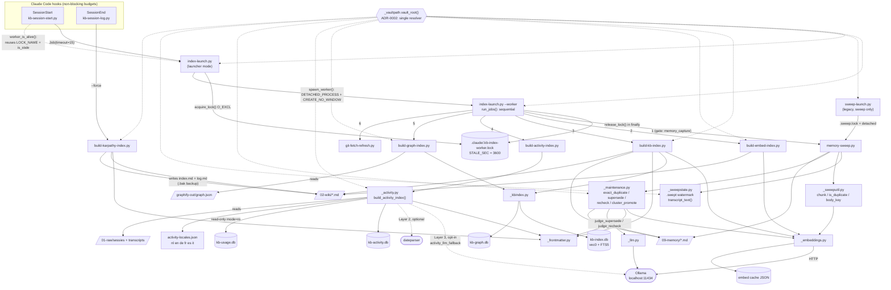

# C4 Code Level — `scripts/` : index builders and detached maintenance launchers

> **Scope note.** `scripts/` holds 86 files and is documented by several agents. This
> file documents **only** the following 11 files:
> `build-kb-index.py`, `build-embed-index.py`, `build-activity-index.py`,
> `build-graph-index.py`, `build-karpathy-index.py`, `index-launch.py`,
> `sweep-launch.py`, `_activity.py`, `_sweepstate.py`, `_sweeputil.py`,
> `_maintenance.py`.
> Other scripts (`memory-sweep.py`, `kb-session-start.py`, `_kbindex.py`,
> `_embeddings.py`, `_settings.py`, `_memory.py`, `_frontmatter.py`, `_vaultpath.py`,
> `git-fetch-refresh.py`, …) were read only to get dependency directions and
> signatures right; they are documented by other groups.

---

## 1. Overview

| | |
|---|---|
| **Name** | KennisBank index builders + background maintenance launchers |
| **Location** | `scripts/` (repo-relative); at runtime the same files live in `$VAULT/.claude/scripts/` after `setup.sh` copies them |
| **Language** | Python 3 (stdlib-first; `sqlite_vec` is the only hard third-party dependency, and only in `build-kb-index.py` via `_kbindex.connect()`) |
| **Purpose** | Turn vault markdown + local databases into the derived indexes retrieval depends on (`kb-index.db`, the JSON embed cache, `kb-activity.db`, `kb-graph.db`, and the Karpathy `index.md`/`log.md`), and run all of that work **off** the interactive path behind a single-flight lock in a detached, window-less worker process. |
| **Executed from** | `SessionStart` hook → `kb-session-start.py` → `index-launch.py` (15 s budget, non-blocking); `SessionEnd` hook → `kb-session-log.py` → `build-karpathy-index.py --force`. `sweep-launch.py` is the legacy sweep-only launcher, still installed and listed in `_hooks_manifest.py`. |
| **Design constraints** | Every entry point is **fail-open** (an exception must never fail a hook — most end in `exit 0` / a stderr line). Everything is **derived and rebuildable**. Vault root always resolves through `_vaultpath.vault_root()` (ADR-0002); the `os.environ.setdefault("KENNISBANK_VAULT", parents[2])` line at the top of each script is a *fallback for hook subprocesses that lost the env var*, never a hardcoded path. |

No vendored third-party code and no generated artifacts are present in this file
group. (`scripts/activity-locales.json` is hand-maintained data consumed by
`_activity.py`; the repo-root `categories.example.json` is an example config for
`build-karpathy-index.py`.)

### Two-layer shape

```
hook (SessionStart)                       hook (SessionEnd)
      |                                         |
kb-session-start.py                       kb-session-log.py
      |                                         |
index-launch.py  (lock, spawn, return)    build-karpathy-index.py --force
      |
index-launch.py --worker  (detached, sequential)
      |-- memory-sweep.py         (gated: memory_capture)   -> writes 09-memory/*.md
      |-- build-embed-index.py                              -> embed cache JSON
      |-- build-kb-index.py                                 -> kb-index.db
      |-- build-activity-index.py -> _activity.py           -> kb-activity.db
      |-- build-graph-index.py                              -> kb-graph.db
      `-- git-fetch-refresh.py                              -> network
```

---

## 2. Code Elements

### 2.1 `scripts/index-launch.py` — the single-flight, detached maintenance launcher

**Role:** takes an `O_EXCL` lock, spawns *itself* in `--worker` mode fully detached,
and returns immediately so `SessionStart` pays only the launcher cost. The worker runs
the builders **sequentially** because they all write the same vault and the same SQLite
files. Every path returns exit 0.

Module-level constants:

| Constant | Value | Location | Meaning |
|---|---|---|---|
| `LOCK_NAME` | `".kb-index-worker.lock"` | `index-launch.py:37` | Lock file name; lives at `<vault>/.claude/<LOCK_NAME>`. Read back by `kb-session-start.worker_is_alive()`. |
| `PER_JOB_TIMEOUT` | `300` (seconds) | `index-launch.py:41` | Per-builder ceiling passed to `subprocess.run(timeout=…)`. |
| `JOBS` | 6-tuple of `(script, toggle_or_None)` | `index-launch.py:45-58` | Ordered: `memory-sweep.py` (`memory_capture`), `build-embed-index.py`, `build-kb-index.py`, `build-activity-index.py`, `build-graph-index.py`, `git-fetch-refresh.py`. Order is load-bearing: the sweep mutates memory markdown, so it must finish before the index reads it. |
| `STALE_SEC` | `PER_JOB_TIMEOUT * len(JOBS) * 2` = **3600** | `index-launch.py:67` | Lock expiry. Derived, not a literal, so it cannot drift when `JOBS` grows. The inequality "stale window > worst-case run" is guarded by `tests/test_index_launch.py:67` (`test_stale_window_exceeds_the_worst_case_run`). |

| Function | Signature | Location | Behaviour | Depends on |
|---|---|---|---|---|
| `_lock_path` | `_lock_path() -> Path` | `index-launch.py:70` | `vault_root() / ".claude" / LOCK_NAME`. | `_vaultpath.vault_root` |
| `is_stale` | `is_stale(lock: Path, now: float \| None = None) -> bool` | `index-launch.py:74` | True when `age > STALE_SEC` **or** `age < 0` (future mtime — clock skew would otherwise freeze maintenance forever), and True on `OSError` (no lock = not held). `now` is injectable for tests. | `os.stat`, `time.time` |
| `acquire_lock` | `acquire_lock(now: float \| None = None) -> bool` | `index-launch.py:87` | Creates the lock atomically with `os.open(O_CREAT\|O_EXCL\|O_WRONLY)` and writes its own PID. On `FileExistsError`: if the existing lock is not stale → `False`; if stale → `unlink()` + exactly **one** re-create attempt. | `is_stale`, `_lock_path` |
| `release_lock` | `release_lock() -> None` | `index-launch.py:114` | Best-effort `unlink()`, swallows `OSError`. | `_lock_path` |
| `_enabled` | `_enabled(toggle: "str \| None") -> bool` | `index-launch.py:121` | `None` → always enabled. Otherwise `_settings.get(toggle, True)`; **fail-open** on any exception (running is preferable to silently skipping). | `_settings.get` |
| `spawn_worker` | `spawn_worker() -> None` | `index-launch.py:131` | `subprocess.Popen([sys.executable, __file__, "--worker"])` with stdout/stderr to `DEVNULL`. **Windows:** `creationflags = 0x00000008 \| 0x08000000` (`DETACHED_PROCESS \| CREATE_NO_WINDOW`). **POSIX:** `start_new_session=True`. | `subprocess`, `os.name` |
| `run_jobs` | `run_jobs(runner=None) -> list` | `index-launch.py:142` | Iterates `JOBS` in order; skipped-by-toggle jobs are recorded as `(script, None)`. Returns `[(script, returncode \| None)]`; `None` also means timeout/exception, and a failing job does **not** stop the rest (`tests/test_index_launch.py:90`). The default `runner(path, timeout)` runs `subprocess.run([sys.executable, path], timeout=timeout)`; on Windows it sets `creationflags = 0x08000000` (`CREATE_NO_WINDOW`) **only** — the worker itself is `DETACHED_PROCESS` and therefore console-less, and a console-less parent spawning `python.exe` makes Windows pop a visible console per job (the fix behind `backlog/tasks/task-95`). `runner` is injectable for tests. | `subprocess`, `_enabled` |
| `main` | `main(argv: "list[str] \| None" = None) -> int` | `index-launch.py:169` | `--worker` present → `run_jobs()` then `release_lock()` in a `finally`. Otherwise: `acquire_lock()`; on failure return 0 (maintenance already running); on success `spawn_worker()`, and if spawning raises, `release_lock()` so no lock is orphaned. Always returns 0. | all of the above |
| *entry point* | `if __name__ == "__main__": sys.exit(main())` wrapped in `try/except → sys.exit(0)` | `index-launch.py:186-190` | Absolute fail-open. | — |

### 2.2 `scripts/sweep-launch.py` — legacy sweep-only launcher

**Role:** thin non-blocking launcher that gates on `memory_capture`, takes its own
lock, and spawns `memory-sweep.py` detached. Deliberately spawns **no** index builders
any more: it used to start the sweep and `build-kb-index.py` both detached with a
comment promising "sweep first, then the index" while nothing enforced that ordering
(TASK-63). `index-launch.py` now owns that sequencing.

Constants: `LOCK_NAME = ".sweep.lock"` (`sweep-launch.py:28`), `STALE_SEC = 3600`
(`sweep-launch.py:29` — a flat literal here, unlike the derived value in
`index-launch.py`).

| Function | Signature | Location | Behaviour |
|---|---|---|---|
| `_lock_path` | `_lock_path() -> Path` | `sweep-launch.py:32` | `vault_root() / ".claude" / ".sweep.lock"`. |
| `is_stale` | `is_stale(lock: Path) -> bool` | `sweep-launch.py:36` | Same two clauses as `index-launch.is_stale` (age > `STALE_SEC`, or negative age = future mtime), True on `OSError`. No `now` injection point. |
| `acquire_lock` | `acquire_lock() -> bool` | `sweep-launch.py:45` | `O_EXCL`-first, one reclaim attempt on a stale lock. Concurrent sweeps are harmless anyway (watermark + dedup), so this is single-flight hygiene rather than a correctness barrier. |
| `release_lock` | `release_lock() -> None` | `sweep-launch.py:78` | Best-effort unlink. Note: `main()` never calls it — the lock is left for the next run to reclaim as stale. |
| `_spawn_detached` | `_spawn_detached(script: str, *args) -> None` | `sweep-launch.py:85` | `Popen` with `DEVNULL` pipes; Windows `creationflags = 0x00000008 \| 0x08000000` (`DETACHED_PROCESS \| CREATE_NO_WINDOW`), POSIX `start_new_session=True`. Swallows every exception. |
| `main` | `main() -> int` | `sweep-launch.py:98` | Gate on `_settings.get("memory_capture", True)` (fail-open on import error), `acquire_lock()`, then spawn **only** `memory-sweep.py`. Always 0. |
| *entry point* | `sys.exit(main())` in `try/except → sys.exit(0)` | `sweep-launch.py:117-121` | Fail-open. |

### 2.3 `scripts/build-kb-index.py` — hybrid search index (`kb-index.db`)

**Role:** builds/refreshes the hybrid retrieval index (sqlite-vec `vec0` + FTS5) over
`02-wiki/` and the *current* memories in `09-memory/`. Reuses the JSON embed cache so
vectors are not recomputed. Two independent toggles gate the two layers: wiki under
`embed_index`, memory under `memory_capture`.

Constants: `VAULT = vault_root()` (`:24`), `WIKI = VAULT/"02-wiki"` (`:25`),
`MEMORY = VAULT/"09-memory"` (`:26`), `WIKI_SKIP = {"index.md", "log.md"}` (`:27`) —
i.e. the Karpathy files that `build-karpathy-index.py` generates are never indexed as
articles.

| Function | Signature | Location | Behaviour | Depends on |
|---|---|---|---|---|
| `_doc_meta` | `_doc_meta(path, layer)` → `tuple[str, str, tuple]` (untyped params) | `build-kb-index.py:30` | One read per document → `(title, created, sources)`. `sources` are provenance keys from `_provenance.doc_sources(...)` (lazy import, TASK-88) so the coupling signal can batch-query them. Fail-soft to `("", "", ())`. | `_frontmatter.parse_frontmatter`, `_provenance.doc_sources` |
| `_collect` | `_collect()` → `list[tuple[Path, str, str]]` | `build-kb-index.py:49` | Yields `(path, layer, status)`. Wiki files (sorted `**/*.md`, minus `WIKI_SKIP`) only when `_settings.get("embed_index", True)`; memory files only when `_settings.get("memory_capture", True)` **and** `_memory.read_status(f) == "current"`. | `_settings.get`, `_memory.read_status` |
| `main` | `main(rebuild: bool = False) -> None` | `build-kb-index.py:64` | See the ordering notes below. Prints one summary line: `kb-index: N files, X (re)indexed, Y ongewijzigd, Z verwijderd, F failed, backend=<embed_id>`. | `_embeddings`, `_kbindex`, `_collect`, `_doc_meta` |
| *entry point* | `--rebuild` in `sys.argv` → `main(rebuild=True)`, wrapped in `try/except` printing `kb-index: overgeslagen (…)` to stderr | `build-kb-index.py:147-152` | Never raises. |

Four ordering decisions inside `main()` that the code comments call out explicitly:

1. **Cheap incremental probe first** (`:71-90`). When not rebuilding and the DB exists, a
   probe connection checks `meta` exists, `_kbindex.is_valid_for(conn, embed_id)` and
   `meta_get(conn,"unit_norm") == "1"`, then compares `indexed_hash` vs
   `emb.file_hash` per file and `count(*) FROM docs` vs the collected set. If nothing
   changed it returns **without any network call** — the embed probe used to run
   unconditionally, so every session start paid a network round trip for a no-op build.
2. **Probe the model before destroying anything** (`:93-99`). `emb.embed("dimensie-probe")`
   determines the live vector dimension; if it fails the existing index is left alone
   and the script exits with a stderr line. Only then does `--rebuild` unlink the file.
3. **Rebuild on `embed_id` or `unit_norm` mismatch** (`:103-114`): an index written before
   vector normalisation holds un-normalised vectors, for which the L2→cosine conversion
   is wrong, so it is unlinked and recreated. Cheap, because vectors come from the cache.
4. **Only write the cache when something was indexed** (`:140-141`) — the cache is tens of
   MB and `json.dumps` over it is pure I/O otherwise.

### 2.4 `scripts/build-embed-index.py` — warm/refresh the embedding cache

**Role:** embeds every `02-wiki` article whose file hash or `embed_id()` changed, prunes
cache entries for vanished files, and — as a side effect that is the real point — warms
the local embedding model so the first per-prompt retrieval hook is hot. Steady state is
hash checks only.

Constants: `VAULT`/`WIKI` (`:26-27`), `SKIP = {"index.md", "log.md"}` (`:28`).

| Function | Signature | Location | Behaviour | Depends on |
|---|---|---|---|---|
| `main` | `main() -> None` | `build-embed-index.py:31` | Gate on `_settings.get("embed_index", True)` (fail-open if `_settings` cannot be imported); skip when `02-wiki/` is missing. Loads the cache, deletes entries whose key starts with the wiki prefix but no longer exists on disk, then calls `emb.get_cached(f, cache)` per file and counts a re-embed when the cached `hash`/`id` changed. Writes the cache only if `embedded or pruned`. Prints `embed-index: N wiki files, X (re)embedded, F failed, backend=<embed_id>`; when everything failed and nothing was embedded it adds a stderr note that retrieval degrades quietly. | `_embeddings.{load_cache,get_cached,save_cache,embed_id}`, `_settings.get` |
| *entry point* | `try: main() except Exception → stderr` | `build-embed-index.py:86-91` | "Never fail a SessionStart hook." |

Explicit non-behaviour, documented at `:73-77`: this script does **not** clear the
graphify `.needs-rebuild` flag any more. It used to, unconditionally, gated on the
unrelated `embed_index` toggle, which made both readers always report "not stale".

### 2.5 `scripts/build-activity-index.py` — CLI wrapper over `_activity.build_activity_index`

**Role:** thin argparse front end; all logic lives in `_activity.py`.

| Function | Signature | Location | Behaviour |
|---|---|---|---|
| `main` | `main(argv: list[str] \| None = None) -> int` | `build-activity-index.py:17` | Flags: `--vault` (default `$KENNISBANK_VAULT`), `--full` (drop and rebuild), `--json`, `--progress-interval` (float, default `300.0`), `--quiet`. Resolves the vault via the flag or `_activity.vault_root()`, calls `_activity.build_activity_index(vault, full=…, progress_interval=…, verbose=not quiet)`, then prints either `json.dumps(stats, indent=2)` or the one-line summary (`total_events`, `sources`, `changed_sources`, `skipped_sources`, `elapsed_seconds`) plus the DB path. Always returns 0. |
| *entry point* | `raise SystemExit(main())` | `build-activity-index.py:53-54` | Note: unlike the other builders this one has **no** blanket `try/except`; `index-launch.run_jobs()` absorbs a non-zero exit instead. |

### 2.6 `scripts/build-graph-index.py` — load `graphify-out/graph.json` into `kb-graph.db`

**Role:** `graph.json` is ~4.2 MB; parsing it per prompt to find neighbours of a hit does
not fit the `kb-retrieve` hot-path budget (2.0 s including the embed call). In SQLite
with an index on source/target it is a lookup. Idempotent, fingerprint-gated, and since
TASK-75 stored in its **own** file, because `build-kb-index.py` unlinks `kb-index.db`
wholesale on rebuild and used to take the graph tables with it.

| Function | Signature | Location | Behaviour | Depends on |
|---|---|---|---|---|
| `graph_json_path` | `graph_json_path() -> Path` | `build-graph-index.py:35` | `vault_root() / "graphify-out" / "graph.json"`. | `_vaultpath.vault_root` |
| `load_graph` | `load_graph(path: Path) -> "tuple[list, list]"` | `build-graph-index.py:39` | Parses the JSON and returns `(nodes, edges)`. Accepts **both** `links` (node-link format, what graphify writes) and `edges` (an intermediate form) — otherwise one half of the pipeline loads and the other silently does not. | `json` |
| `main` | `main() -> int` | `build-graph-index.py:51` | Flags: `--graph`, `--db` (test seam), `--force`, `--json` (`dest="as_json"`). No `graph.json` → prints `geen-graaf` and returns **0** (graphify is an optional external skill). Opens `_kbindex.graph_connect()`, `ensure_graph_schema`, compares `_kbindex.graph_fingerprint(gpath)` (mtime+size) against `meta_get(conn, "graph_fingerprint")`; unchanged and not `--force` → report `ongewijzigd` with current `graph_count` and return 0. Otherwise `replace_graph(conn, nodes, edges)` and **only then** `set_graph_fingerprint` — a crash mid-load leaves the old fingerprint so the next run reloads instead of treating half a graph as current. Exit 1 only when the index cannot be opened or `graph.json` is unreadable. | `_kbindex.{graph_connect,ensure_graph_schema,graph_fingerprint,meta_get,graph_count,replace_graph,set_graph_fingerprint}` |
| *entry point* | `raise SystemExit(main())` | `build-graph-index.py:109-110` | Exit contract documented at `:20`: 0 = loaded or nothing to do, 1 = graph unreadable. |

### 2.7 `scripts/build-karpathy-index.py` — generate `02-wiki/index.md` + `02-wiki/log.md`

**Role:** renders the wiki in Andrej Karpathy's three-layer LLM-wiki shape so
Understand-Anything's `parse-knowledge-base.py` recognises it: an `index.md` with
`## Section` headings containing `[[wikilink]]` lines, and a `log.md` with
`## [YYYY-MM-DD] OPERATION | Title` lines. Pipeline position:
`/wiki → build-karpathy-index.py → /understand-knowledge`. Invoked in production by
`kb-session-log.py:41` as `Job("build-karpathy-index.py", ("--force",))`.

Module-level data (all overridable via an optional `categories.json`):
`VAULT_DEFAULT = vault_root()` (`:48`), `WIKI_SUBDIR_DEFAULT = "02-wiki"` (`:49`),
`SESSIES_SUBDIR_DEFAULT = "01-raw/sessies"` (`:50`),
`SKIP_FILENAMES = {"index.md","log.md","readme.md"}` (`:53`),
`_DEFAULT_GENERIC_TAGS` (`:56`), `SESSIE_RE` (`:67`, matches
`raw-sessie-YYYY-MM-DD-<slug>.md`), `_DEFAULT_CATEGORY_RULES` (`:79-252`, 9 ordered
`(category, {tags})` rules), `_DEFAULT_PREFIX_HINTS` (`:255-269`),
`_DEFAULT_OVERIG_NL/_EN/_MEMORY_CATEGORY` (`:271-273`), `_DEFAULT_NL_HINTS` (`:275`),
`CATEGORIES_FILENAME = "categories.json"` (`:312`).

| Function | Signature | Location | Behaviour | Depends on |
|---|---|---|---|---|
| `_coerce_category_rules` | `_coerce_category_rules(raw: Any) -> list[tuple[str, set[str]]] \| None` | `:315` | Validates the JSON `category_rules` shape (`[[name, [tags]], …]`); invalid rows are skipped with a `[warn]` on stderr, non-list input returns `None` (= keep the default). | — |
| `load_categories` | `load_categories(extra_paths: list[Path] \| None = None) -> dict[str, Any]` | `:335` | Starts from the built-in defaults, then merges `categories.json` found next to the script and at each `extra_paths` entry — **last found wins**, so the vault-root file beats the script-local one. Every top-level key (`category_rules`, `prefix_hints`, `generic_tags`, `nl_hints`, `labels.{overig_nl,overig_en,memory_category}`) falls back independently. | `json`, `_coerce_category_rules` |
| `apply_categories` | `apply_categories(config: dict[str, Any]) -> None` | `:394` | Writes the module globals `CATEGORY_RULES, PREFIX_HINTS, GENERIC_TAGS, NL_HINTS, OVERIG_NL, OVERIG_EN, MEMORY_CATEGORY`. Called once at import (`:409`) and again from `main()` once the vault root is known (`:772`). |
| `_parse_frontmatter_dict` | `_parse_frontmatter_dict(text: str) -> dict[str, Any]` | `:421` | `parse_frontmatter(text)[0]`; body discarded. | `_frontmatter.parse_frontmatter` |
| `_normalize_tag` | `_normalize_tag(tag: str) -> str` | `:431` | `strip().lower()`. |
| `_tags_from_frontmatter` | `_tags_from_frontmatter(fm: dict[str, Any]) -> list[str]` | `:435` | Accepts a YAML list, a `tag1, tag2` string, or a `[tag1, tag2]` string. |
| `_category_from_tags` | `_category_from_tags(tags: list[str]) -> str \| None` | `:451` | Drops `GENERIC_TAGS`, returns the first `CATEGORY_RULES` entry whose keyword set intersects. Rule order = priority. |
| `_category_from_prefix` | `_category_from_prefix(filename: str) -> str \| None` | `:460` | Longest-prefix-first match against `PREFIX_HINTS`. |
| `categorize` | `categorize(filename: str, fm: dict[str, Any], language: str) -> tuple[str, bool]` | `:469` | Priority: `type: wiki-memory` → `(MEMORY_CATEGORY, True)`; explicit frontmatter `category`; tag match; filename prefix; else `Overig`/`Other` by language. Second element is `is_memory_snapshot`. |
| `detect_language` | `detect_language(all_tags: list[str]) -> str` | `:502` | `"nl"` if at least one tag is in `NL_HINTS`, else `"en"`. |
| `humanize_slug` | `humanize_slug(slug: str) -> str` | `:512` | `foo_bar-baz` → `Foo Bar Baz`. |
| `scan_wiki` | `scan_wiki(wiki_dir: Path) -> tuple[list[dict[str, Any]], str]` | `:517` | **Non-recursive** scan of `*.md`, skipping `SKIP_FILENAMES`. Two passes: collect `{filename, stem, title, fm}` and the tag corpus, detect the language, then categorise (the language decides `Overig` vs `Other`). Unreadable files and frontmatter errors produce `[warn]` lines and are skipped/emptied, never fatal. | `_parse_frontmatter_dict`, `categorize`, `detect_language` |
| `scan_sessies` | `scan_sessies(sessies_dir: Path) -> list[dict[str, Any]]` | `:570` | **Recursive** `rglob("*.md")` filtered by `SESSIE_RE`; title from frontmatter when present, else the humanised slug. Returns `{date, slug, title, path}` sorted date-descending. | `SESSIE_RE`, `_parse_frontmatter_dict` |
| `_wikilink` | `_wikilink(stem: str, title: str) -> str` | `:606` | `[[stem|title]]` when the title adds information over the humanised stem (with the `wiki-` prefix removed), else bare `[[stem]]`. |
| `render_index` | `render_index(articles: list[dict[str, Any]], language: str, generated_at: str) -> tuple[str, dict[str, int]]` | `:614` | Groups by category, sorts articles by title, orders categories by size descending (ties alphabetical) with `MEMORY_CATEGORY` always last, and emits an "auto-generated, do not edit" HTML comment header. Returns `(text, {"categories": N, "wikilinks": M})`. |
| `render_log` | `render_log(sessies: list[dict[str, Any]], language: str, generated_at: str) -> tuple[str, int]` | `:660` | One `## [date] OPERATION | title` line per session; with no sessions it emits a single `## [today] SETUP | Initial log` entry so the file is still parseable. Returns `(text, entry_count)`. |
| `_backup` | `_backup(path: Path) -> Path` | `:686` | `shutil.copy2` to `<name>.md.bak`. |
| `write_with_safety` | `write_with_safety(target: Path, content: str, force: bool, dry_run: bool) -> bool` | `:692` | Dry run → `True` without touching disk. Existing file without `--force` → `[error]` + `False`. With `--force` → `.bak` backup, then write. |
| `_preview` | `_preview(text: str, n: int = 20) -> str` | `:712` | First `n` lines plus a `... (N meer regels)` tail. |
| `main` | `main() -> int` | `:724` | Flags `--vault-root` (default `VAULT_DEFAULT`), `--wiki-dir`, `--sessies-dir`, `--dry-run`, `--force`. Resolves paths, validates the vault root (exit 1), **reloads the taxonomy with the vault root in `extra_paths`**, scans wiki (exit 1 when no articles) and sessions, renders both files, and either prints the dry-run report (counts per category + 20-line previews) or writes both files. Returns 0 / 1 (bad input) / 2 (write conflict). *Note:* the local `vault_root: Path` at `:761` shadows the imported `vault_root()` function for the rest of `main()`; harmless here because `main()` does not call it again, but worth knowing before editing. |
| *entry point* | `sys.exit(main())` | `:833-834` | No blanket `try/except` — this script is user-invoked or run by `kb-session-log.py`, not by a latency-critical hook. |

### 2.8 `scripts/_activity.py` — temporal activity recall (index + parser + query)

**Role:** the largest module in this group (2 149 lines). It (a) turns existing local
vault sources into canonical activity **events**, (b) stores them incrementally in
`kb-activity.db`, (c) parses natural-language period expressions in six languages
(plus two optional fallbacks), and (d) answers period/topic queries used by
`build-activity-index.py`, `kb-activity.py`, `kb-activity-eval.py`, `kb-mcp.py`
(optional import) and the `/watdeedik`, `/timeline`, `/weeklog` commands.
Deliberately stdlib-first.

Module constants: `SCHEMA_VERSION = "1"` (`:31`), `LOCAL_TZ_NAME = "Europe/Amsterdam"`
(`:32`), `LOCAL_TZ` (`:33-39`, falls back to a fixed UTC+1 offset when Windows Python
ships no IANA tzdata), `DB_NAME = "kb-activity.db"` (`:40`), and the extraction regexes
`SIGNAL_RE, TASK_RE, ADR_RE, TAG_RE, COMMAND_RE, MODEL_RE, PATH_RE, WIKILINK_RE`
(`:42-56`).

#### Data classes

| Element | Signature | Location | Notes |
|---|---|---|---|
| `ActivityEvent` | `@dataclass(frozen=True)` with 20 fields: `id, source_kind, source_path, source_ref, event_time, captured_at, timezone, actor, agent, project, repo, activity_kind, title, summary, topic_tags: list[str], entities: list[str], artifacts: list[str], decisions: list[str], confidence: float, provenance_span, unknown_time: bool = False` | `_activity.py:59-81` | The canonical event record. |
| `ActivityEvent.to_row` | `to_row(self) -> dict` | `:83` | Flattens the four list fields to `*_json`, coerces `unknown_time` to 0/1, derives `event_date` (`event_time[:10]`) and the `search_blob` that all topic filtering runs against. |
| `ActivityEvent.from_row` | `from_row(cls, row: sqlite3.Row \| dict) -> "ActivityEvent"` (classmethod) | `:106` | Inverse; drops the derived `event_date`/`search_blob`, tolerates malformed JSON by falling back to `[]`. |
| `ActivityEvent.as_public_dict` | `as_public_dict(self) -> dict` | `:119` | Adds a nested `source` dict (`kind/path/ref/span`) for API/MCP output. |
| `TemporalRange` | `@dataclass(frozen=True)`: `start, end_exclusive, label, granularity, timezone, confidence: float, original_text, topic: str = "", error: str = "", warning: str = "", suggestions: tuple[str, ...] = ()` | `:130-142` | Half-open interval `[start, end_exclusive)`. |
| `TemporalRange.ok` | `ok(self) -> bool` (property) | `:145` | `not self.error`. |
| `TemporalRange.to_dict` | `to_dict(self) -> dict` | `:148` | `asdict` with `suggestions` as a list. |

#### Public API — index building and storage

| Function | Signature | Location | Behaviour |
|---|---|---|---|
| `activity_db_path` | `activity_db_path(vault: Path \| None = None) -> Path` | `:154` | `<vault>/.claude/kb-activity.db`; `vault_root()` when omitted. |
| `stable_id` | `stable_id(*parts: object) -> str` | `:159` | 24-hex-char SHA-256 over `\x1f`-joined parts. Gives events a content-addressed, reproducible id. |
| `extract_entities` | `extract_entities(text: str, path: str = "") -> list[str]` | `:285` | TASK-/ADR-ids (upper-cased), version tags, slash-commands, model names, wikilink targets, a fixed product-name list, and known repo names found in the path. Deduped case-insensitively. |
| `extract_artifacts` | `extract_artifacts(text: str) -> list[str]` | `:302` | File-ish paths via `PATH_RE` plus backticked `*.py/md/json/toml/db/sh` names. |
| `extract_topics` | `extract_topics(text: str, path: str = "") -> list[str]` | `:308` | Entities plus capitalised/hyphenated words minus a stopword set; capped at 32. |
| `classify_activity` | `classify_activity(text: str, fallback: str = "activity") -> str` | `:332` | Keyword ladder → `release, commit, task_change, decision, blocked, fix, external_research`, else `fallback`. |
| `state_for_event` | `state_for_event(event: ActivityEvent) -> str` | `:351` | Derives a lifecycle state (`released, blocked, fixed, superseded, changed, introduced`) for topic timelines. |
| `iter_usage_events` | `iter_usage_events(vault: Path) -> Iterable[ActivityEvent]` | `:413` | Opens `<vault>/.claude/kb-usage.db` **read-only** (`mode=ro` URI), introspects every table via `PRAGMA table_info`, picks a time column (`created_at/used_at/timestamp/time`) and a text column (`query/title/snippet/memory_title/path`), and yields at most 500 `memory_use` events per table. Any `sqlite3.Error` aborts silently. |
| `connect_activity_db` | `connect_activity_db(vault: Path \| None = None, *, readonly: bool = False) -> sqlite3.Connection` | `:496` | Read-write: creates `.claude/`, `PRAGMA journal_mode=WAL`. Read-only: `file:…?mode=ro` URI. Always `row_factory = sqlite3.Row`. |
| `ensure_schema` | `ensure_schema(conn: sqlite3.Connection) -> None` | `:508` | Creates `meta`, `activity_events` (23 columns), three indexes (`event_time`, `captured_at`, `source_path`) and `source_watermarks`, then **drops** the legacy `activity_entities/_topics/_artifacts/rollup_cache/activity_fts` tables (`:546-548`). The comment at `:529-545` records why: the first four were write-only (topic filtering is a `search_blob` substring match), `activity_fts`'s `DELETE` over an UNINDEXED column made a full rebuild quadratic, and `rollup_cache` was a net loss whose key omitted the event limit and project filter. `SCHEMA_VERSION` is deliberately **not** bumped so existing deploys do not go WARN in `doctor.sh`. |
| `upsert_event` | `upsert_event(conn: sqlite3.Connection, event: ActivityEvent) -> None` | `:557` | Delete-then-insert on the event id across the 23 columns. |
| `build_activity_index` | `build_activity_index(vault: Path \| None = None, *, full: bool = False, progress_interval: float = 300.0, verbose: bool = True) -> dict` | `:773` | The entry point. `full=True` unlinks the DB plus `-wal`/`-shm`. Deletes events for sources that disappeared, then per source: **stat fastpath first** — hash only when `(mtime_ns, size)` differ from the watermark (measured 1.67 s warm / 51.75 s cold over 2 220 files / 376 MB before this, TASK-50); unchanged sources only get their watermark refreshed when the mtime moved. Changed sources have their old events deleted and `_events_for_source` re-run. Emits progress to stderr every `progress_interval` seconds and on the last source. Returns a stats dict: `vault, db, schema_version, full, sources, changed_sources, skipped_sources, events_indexed, events_deleted, elapsed_seconds, total_events, copilot_events, source_signature`. |
| `index_status` | `index_status(vault: Path \| None = None) -> dict` | `:2053` | Read-only health check: schema version, event count, source count, and a `stale_sources` count computed by re-fingerprinting (full SHA-256) every watermarked file plus counting current-but-unindexed sources. `ok` requires the schema version to match and zero stale sources. Used by `kb-activity.py --status` and `doctor.sh`. |

#### Public API — period parsing and querying

| Function | Signature | Location | Behaviour |
|---|---|---|---|
| `parse_period` | `parse_period(text: str = "", *, now: datetime \| None = None, tz: ZoneInfo = LOCAL_TZ, default: str = "today") -> TemporalRange` | `:1328` | The three-layer parser, 350 lines of **ordered** branches. Layer 1 is deterministic and locale-table driven; branch order is load-bearing and commented at each step: explicit `between A and B` / `from A to B` ranges → weekday-to-weekday → weekday within a relative week → part-of-week (`begin/midden/eind`) → weekend → weekday N weeks ago (before the bare-weekday branch, which would otherwise strand "N weeks ago" as a topic) → bare/relative weekday → `N <unit> ago` (suffix *and* prefix word orders) → relative week/month/day keywords (`day_before_yesterday` **before** `yesterday`, since the English phrase contains the word) → rolling `last N days` → rolling `last week/month/year` → `YYYY-MM` → `YYYY-MM-DD` → written-out dates → month name with optional part/year → ambiguous `d/m/y` error. Unmatched text falls through to Layer 2 `_dateparser_fallback` (confidence 0.6) and Layer 3 `_llm_fallback` (confidence 0.4), then `_period_error`. Anything not consumed becomes the `topic`. |
| `query_events` | `query_events(vault: Path \| None, period: TemporalRange, *, topic: str = "", project: str = "", limit: int = 50) -> tuple[list[dict], list[str]]` | `:1761` | Read-only query. Missing DB or a `period.error` returns `([], [warning])`. Topic filtering happens **in SQL** against `lower(search_blob)`: each term becomes an AND-group of its tokens, terms (topic + aliases) are OR-ed, so `otgw 2.0.0` matches both tokens anywhere instead of requiring the literal phrase. Pool limit grows to `min(max(limit*50, 1000), 10000)` when a topic is present. Project filtering and `match_route` labelling happen in Python; rows the SQL kept but the route heuristic cannot localise are labelled `blob` rather than dropped. Each item gets `match_route` and `state`. |
| `deterministic_rollup` | `deterministic_rollup(vault: Path, period: TemporalRange, events: list[dict], topic: str = "") -> dict` | `:1841` | LLM-free digest: `event_count`, per-kind `counts`, `key_events` (curated kinds preferred over raw `transcript_message`), `decisions`, `releases_tasks`, `open_loops` (regex on todo/follow-up/blocked/…), `source_refs`, and the literal markers `generated: "deterministic"`, `cache: "none"` — the comment at `:1842-1848` records why the cache was deleted rather than fixed. |
| `what_did_i_do` | `what_did_i_do(date_or_period: str = "today", *, topic: str = "", project: str = "", max_events: int = 0, rollup: bool \| None = None, vault: Path \| None = None, now: datetime \| None = None) -> dict` | `:1885` | Parse → query → summarise. Adaptive event cap `min(max(60, span_days*40), 600)` unless `max_events` is given. Attaches a rollup for spans ≥ 2 days (or on request). Returns `{ok, mode, period, topic, project, events, warnings, summary, evidence[, rollup]}`. |
| `timeline` | `timeline(period_text: str = "today", *, topic: str = "", project: str = "", max_events: int = 50, vault: Path \| None = None, now: datetime \| None = None) -> dict` | `:1939` | `what_did_i_do` with `mode="timeline"`. |
| `topic_timeline` | `topic_timeline(topic: str, *, period_text: str = "afgelopen 90 dagen", project: str = "", max_events: int = 80, vault: Path \| None = None, now: datetime \| None = None) -> dict` | `:1953` | `timeline` plus `topic_state_counts` derived from `state_for_event`. |
| `weeklog` | `weeklog(period_text: str = "vorige week", *, topic: str = "", project: str = "", max_events: int = 100, vault: Path \| None = None, now: datetime \| None = None) -> dict` | `:1968` | `what_did_i_do` with an always-attached rollup, re-hydrating a `TemporalRange` from the result dict. |
| `format_markdown` | `format_markdown(result: dict) -> str` | `:1987` | Renders any of the four result shapes to the markdown the commands print: title, topic, warnings, counts, key activities, decisions, open loops, sources. |
| `eval_queries` | `eval_queries(vault: Path, eval_set: list[dict], *, now: datetime \| None = None) -> dict` | `:2095` | Runs an eval set (`expected_event_ids`, `expected_ref_contains`, `min_events`, `max_events`, `expected_error`, `require_provenance`) and returns `{ok, passed, total, metrics, cases}`. Driven by `kb-activity-eval.py`; note the privacy rule that personal eval sets never enter the repo. |

#### Private helpers in `_activity.py` (all listed, none dropped)

*Text and time helpers:* `_norm_ws(text, limit=500)` `:164`, `_read_text(path, limit=None)`
`:169`, `_rel(vault, path)` `:176`, `_file_dt(path)` `:183`, `_dt_iso(dt)` `:187`,
`_date_start(d, tz=LOCAL_TZ)` `:193`, `_parse_dt(value, *, default=None) -> (datetime, bool)`
`:197` (second element = "time unknown"), `_dt_from_filename(path)` `:226`,
`_title_from_markdown(body, fallback)` `:247`, `_first_summary(body, max_lines=4)` `:259`,
`_dedupe(items)` `:271`, `_parse_iso_dt(s)` `:1688`, `_now_dt(now=None, tz=LOCAL_TZ)` `:1001`,
`_month_range(year, month, tz)` `:1009`, `_parse_date_token(raw, tz)` `:1018`.

*Event construction and source dispatch:* `_event(*, vault, path, source_kind,
activity_kind, title, summary, event_time, captured_at, unknown_time=False,
line_no=None, confidence=0.75, actor="user", agent="", project="", repo="")` `:366`
(keyword-only factory that assigns the `stable_id`, `source_ref` and extracted
tags/entities/artifacts); `_source_files(vault)` `:458` (the four scanned roots —
`01-raw/sessies`, `01-raw/transcripts`, `09-memory`, `02-wiki` — plus
`.claude/kb-usage.db`); `_events_for_source(vault, source)` `:593` — the per-source
extractor, one branch per root: raw sessions emit one `session` event plus one event per
`SIGNAL_RE` line, transcripts emit at most **80** events per file, memory files emit one
`memory_capture` event (archived files excluded), wiki files one `wiki_update` event, and
`.claude/kb-usage.db` delegates to `iter_usage_events`.

*Fingerprints and storage internals:* `_stat_fingerprint(path) -> (mtime_ns, size)` `:477`,
`_sha256(path)` `:483`, `_fingerprint(path) -> (mtime_ns, size, sha256)` `:491`,
`_delete_event(conn, event_id)` `:553`, `_source_signature(conn)` `:766`.

*Locale table plumbing (data lives in `scripts/activity-locales.json`):* `_load_locales()`
`:895`, `_merge_int_map(key)` `:906`, `_merge_words(*keys)` `:916`, `_alt(words)` `:932`.
`_alt` returns `"(?!)"` for an empty word set — an empty alternation would compile to
`(?:)` and match the empty string at every word boundary, firing every parser branch with
a confidently wrong range. `LOCALE_ORDER = ("nl","en","de","fr","es","it")` (`:891`) fixes
merge precedence so the pinned test set resolves identically; the derived tables
(`MONTHS, WEEKDAYS, _RELDAY, _NUMBERS, _DIR_*, _WEEK_WORD, _MONTH_WORD, _YEAR_WORD,
_DAY_WORD, _ROLLING, _AGO_*, _PARTS_*, _WEEKEND_*, _RANGE_*, _WEEK_*, _MONTH_*, _DAY_*,
_AGO_UNITS, _ROLL_UNITS`) are built at `:944-998`. Adding a language is a JSON edit.

*Range construction and warnings:* `_extract_topic_and_clean(text)` `:1045`,
`_residual_time_warning(topic)` `:1058` (lazily builds `_RESIDUAL_TIME_RE`; warns when
strong time words survive into a topic, which almost always means a mis-parse),
`_mk_range(start, end, label, granularity, original, topic="", confidence=0.95)` `:1079`,
`_period_error(original, topic="")` `:1093`,
`_range_from_iso(start_s, end_s, gran, original, topic, tz, ref)` `:1277` (sanity-refuses
answers more than ~6 years from the reference date).

*Layer 2 — optional `dateparser`:* `_get_dateparser()` `:1115` (lazy, memoised to
`False` when absent), `_dateparser_fallback(query, current, tz, original, topic)` `:1126`
(snaps `dateparser`'s own `period` granularity to a calendar range, confidence 0.6).

*Layer 3 — optional local LLM (off by default):* `_get_settings()` `:1194`,
`_llm_enabled()` `:1205` (setting `activity_llm_fallback`, default `False`),
`_llm_call(prompt, *, model=_LLM_MODEL, timeout=_LLM_TIMEOUT)` `:1215` (stdlib
`urllib.request` POST to `http://localhost:11434/api/generate`, `temperature`/`seed` 0),
`_llm_cache_get(vault, key)` `:1236`, `_llm_cache_put(vault, key, phrase, ref, start, end,
gran)` `:1249` (creates `temporal_llm_cache` on demand), `_llm_audit(vault, entry)` `:1267`
(appends to `.claude/activity-llm-audit.jsonl`), `_llm_fallback(query, current, tz,
original, topic)` `:1293` (cache-keyed on phrase + reference date so repeats are free and
deterministic). Constants `_LLM_MODEL = "gemma4:12b"`, `_LLM_URL`, `_LLM_TIMEOUT = 20`,
`_LLM_PROMPT` at `:1178-1191`.

*Topic and query helpers:* `_topic_aliases(vault)` `:1692` (reads
`.claude/activity-topic-aliases.json` or the vault-root copy), `_TOPIC_STOPWORDS` `:1705`,
`_clean_topic(topic)` `:1711`, `_topic_tokens(topic)` `:1720` (keeps version literals like
`2.0.0` intact), `_topic_terms(topic, vault)` `:1727` (bidirectional alias expansion),
`_event_match_route(event, terms)` `:1739` (`explicit_entity > explicit_topic > tag > fts`),
`_rows_to_events(rows)` `:1757`, `_summary_counts(events)` `:1833`,
`_period_span_days(period)` `:1876`, `_format_event_line(ev)` `:2043`.

### 2.9 `scripts/_sweepstate.py` — watermark + transcript reader for the capture sweep

**Role:** mirrors `distill-notify`'s `.distilled` pattern with its **own** `.swept`
watermark in `01-raw/transcripts/`, so the memory sweep tracks independently of
distillation which transcripts it has already processed. Stdlib only.

Constant: `WATERMARK = ".swept"` (`_sweepstate.py:22`).

| Function | Signature | Location | Behaviour |
|---|---|---|---|
| `_tdir` | `_tdir(vault=None) -> Path` | `:25` | `<vault>/01-raw/transcripts`. |
| `_watermark` | `_watermark(vault=None) -> set` | `:29` | Reads `.swept` into a set of stems; `set()` on `OSError`. |
| `pending` | `pending(vault=None) -> list` | `:37` | Sorted `*.jsonl` in the transcript dir whose stem is not in the watermark. Also used by `memory-notify.py:74`. |
| `mark` | `mark(stems, vault=None) -> int` | `:45` | Appends new, de-duplicated stems to `.swept`; returns how many were added, 0 (with a stderr note) when the write fails. |
| `_block_text` | `_block_text(content) -> str` | `:62` | Flattens a Claude Code message `content` field (str, or list of `{"type":"text"}` blocks) to text. |
| `transcript_text` | `transcript_text(jsonl_path) -> str` | `:76` | Reduces a Claude Code `.jsonl` transcript to plain `role: text` paragraphs for `user`/`assistant` turns. Fail-soft: unparseable lines are skipped, any outer failure returns `""`. |

### 2.10 `scripts/_sweeputil.py` — chunking and dedup primitives

**Role:** three small deterministic helpers shared by the sweep. Stdlib + `_embeddings.cosine`.

| Function | Signature | Location | Behaviour |
|---|---|---|---|
| `chunk` | `chunk(text: str, max_chars: int = 6000, overlap: int = 200) -> list` | `_sweeputil.py:15` | Paragraph-aware chunking with an `overlap`-character carry-over, plus a hard split for a single over-long paragraph. |
| `is_duplicate` | `is_duplicate(vec, existing_vecs, threshold: float = 0.92) -> bool` | `:41` | True when `cosine(vec, ev) > threshold` for any existing vector. | 
| `body_key` | `body_key(body: str) -> str` | `:50` | MD5 of the stripped body — a deterministic key for exact-body dedup. |

### 2.11 `scripts/_maintenance.py` — deterministic cross-memory maintenance primitives

**Role:** the building blocks of the maintenance pass: load current memories with their
vectors, find high-cosine pairs (supersede candidates), count related neighbours (cluster
promotion), and run the four passes. The LLM lives only in the two judge seams; the
vector source is injectable so the plumbing can be tested without a model. Called from
`memory-sweep.py:401-418`.

| Element | Signature | Location | Behaviour | Depends on |
|---|---|---|---|---|
| `current_items` | `current_items(get_cached_fn=None, statuses=("current",)) -> list` | `_maintenance.py:25` | Scans `09-memory/**/*.md`, keeps entries whose frontmatter `status` is in `statuses`, embeds via the injectable `get_cached_fn` (default `emb.get_cached`), and returns dicts `{path, title, status, created, valid_from, body, vec}`. Items without a vector are skipped. `memory-sweep.py:290` calls it with `("current","unverified")`. | `_embeddings.{load_cache,get_cached}`, `_frontmatter.parse_frontmatter`, `_vaultpath.vault_root` |
| `similar_pairs` | `similar_pairs(items: list, threshold: float) -> list` | `:65` | All O(n²) pairs with `cosine > threshold`, sorted by similarity descending. | `_embeddings.cosine` |
| `neighbor_counts` | `neighbor_counts(items: list, threshold: float) -> dict` | `:80` | Symmetric neighbour count per path. | `_embeddings.cosine` |
| `judge_supersede` | `judge_supersede(new_text: str, old_text: str) -> bool` | `:102` | Asks the local LLM whether the newer memory contradicts/replaces the older. Returns `True` only on an explicit `{"supersede": true}`; any failure, parse error or doubt → `False`. Prompt: `SUPERSEDE_SYSTEM` (`:95`). | `_llm.generate` |
| `judge_recheck` | `judge_recheck(text: str) -> bool` | `:123` | Mirror shape: `True` only on explicit `{"retract": true}`. **Fail-safe-to-keep** — a dead judge never retracts. Prompt: `RECHECK_SYSTEM` (`:116`). | `_llm.generate` |
| `exact_duplicate_groups` | `exact_duplicate_groups(statuses=OPEN_STATUSES) -> list` | `:145` | Groups open memories (`OPEN_STATUSES = ("current","unverified")`, `:142`) by normalised body, returning only groups of size > 1. Deliberately **without** embeddings: an identical body is an exact fact, and this pass must keep working precisely when the embed model is down (which is when duplicates pile up). Empty bodies are excluded. | `_frontmatter.parse_frontmatter` |
| `exact_duplicate_pass` | `exact_duplicate_pass(dry_run: bool = False) -> int` | `:180` | Closes byte-identical memories, keeping one per group. Ranking (`_rang`, `:212`): oldest event time (`valid_from`, else `created`) → **un-numbered filename wins** over a `-2`/`-3` collision suffix (a plain path sort kept the duplicate, because `-` sorts before `.`) → path as a deterministic tie-break. The others get `status: superseded` + `superseded_by: [kept stem]`; nothing is deleted, so it is reversible. | `_memory.set_status` |
| `supersede_pass` | `supersede_pass(threshold: float = 0.85, judge_fn=None, get_cached_fn=None) -> int` | `:234` | For each similar pair, decides newer/older on **event time** (`valid_from`, fallback `created`, tie-break `created`) — ordering on `created` alone would mark a late-captured old fact as "newer" and close the genuinely newer one with an inverted validity interval. On a positive judgement it closes the older memory bi-temporally (`valid_until` = the newer memory's start) and never re-uses an already-superseded path. | `current_items`, `similar_pairs`, `judge_supersede`, `_memory.set_status` |
| `recheck_pass` | `recheck_pass(judge_fn=None, limit: int = 20) -> int` | `:262` | Re-judges at most `limit` current memories and sets `retracted` only on an explicit retract signal. | `current_items`, `judge_recheck`, `_memory.set_status` |
| `cluster_promote_pass` | `cluster_promote_pass(threshold: float = 0.80, min_neighbors: int = 2, get_cached_fn=None) -> int` | `:280` | Stamps `promote_candidate: true` into the frontmatter of memories with at least `min_neighbors` related neighbours, skipping files that already carry the key. Rewrites via a `---`-split, so a malformed file is skipped rather than corrupted. | `current_items`, `neighbor_counts` |

---

## 3. Dependencies

### 3.1 Internal (this repo, by path)

| Dependency | Used by | What for |
|---|---|---|
| `scripts/_vaultpath.py` → `vault_root() -> Path` | all 11 files | The only sanctioned vault-root resolver (ADR-0002, `docs/adr/0002-cross-platform-scripts.md`). |
| `scripts/_settings.py` → `get(key: str, default: bool) -> bool` | `index-launch.py:125`, `sweep-launch.py:100`, `build-kb-index.py:52,57`, `build-embed-index.py:36`, `_activity.py:1198` | Toggles `memory_capture`, `embed_index`, `activity_llm_fallback`. Every read is fail-open. |
| `scripts/_embeddings.py` → `embed_id()`, `embed(text, timeout=30.0)`, `load_cache()`, `save_cache(cache)`, `get_cached(path, cache, recompute=True)`, `file_hash(path)`, `doc_text(path, cap=4000)`, `cosine(a, b)` | `build-kb-index.py`, `build-embed-index.py`, `_maintenance.py`, `_sweeputil.py` | Embeddings + the JSON vector cache. |
| `scripts/_kbindex.py` → `index_path()`, `connect(path=None)`, `ensure_schema(conn, dim, embed_id)`, `meta_get`, `is_valid_for`, `set_unit_norm`, `indexed_hash`, `upsert(...)`, `prune(conn, keep_paths)`, `graph_connect(path=None)`, `ensure_graph_schema`, `graph_fingerprint`, `set_graph_fingerprint`, `graph_count`, `replace_graph` | `build-kb-index.py`, `build-graph-index.py` | Schema and access layer for `kb-index.db` and `kb-graph.db`. |
| `scripts/_frontmatter.py` → `parse_frontmatter(text) -> tuple[dict, str]` | `build-kb-index.py`, `build-karpathy-index.py`, `_activity.py`, `_maintenance.py` | Shared stdlib YAML-ish frontmatter parser. |
| `scripts/_memory.py` → `read_status(path) -> str`, `set_status(path, status, superseded_by=None, valid_until=None) -> bool` | `build-kb-index.py:59`, `_maintenance.py` (lazy import in each pass) | Memory lifecycle. |
| `scripts/_provenance.py` → `doc_sources(path, layer, fm, body) -> list` | `build-kb-index.py:42` (lazy, fail-soft) | Provenance keys indexed for the coupling signal (TASK-88). |
| `scripts/_llm.py` → `generate(prompt, system=…)` | `_maintenance.py:103,131` (lazy import) | The two judge seams. |
| `scripts/activity-locales.json` | `_activity.py:892` | Temporal vocabulary for `nl, en, de, fr, es, it`. Data-only; adding a language needs no code change. |
| `categories.example.json` (repo root) / optional `categories.json` next to the script or in the vault root | `build-karpathy-index.py:353-355` | Overridable taxonomy. |
| **Callers (not documented here):** `scripts/kb-session-start.py:59` (`Job("index-launch.py", timeout=15)`) and `:266` (`worker_is_alive` imports `index-launch.py` to reuse its `LOCK_NAME`/`is_stale`); `scripts/kb-session-log.py:41` (`build-karpathy-index.py --force`); `scripts/memory-sweep.py:37-38,287-418` (`_sweepstate`, `_sweeputil`, `_maintenance`); `scripts/memory-notify.py:74` (`_sweepstate.pending`); `scripts/kb-activity.py`, `scripts/kb-activity-eval.py`, `scripts/kb-mcp.py:61-65` (optional `_activity` import); `scripts/_hooks_manifest.py:65` lists `sweep-launch.py`. |
| **Jobs launched by `index-launch.py` but documented elsewhere:** `memory-sweep.py`, `git-fetch-refresh.py`. |
| **Tests:** `tests/test_index_launch.py`, `tests/test_sweep_launch.py`, `tests/test_activity.py`, `tests/test_activity_multilang.py`, `tests/test_maintenance.py`, `tests/test_maintenance_recheck.py`, `tests/test_maintenance_supersede.py`, `tests/test_sweepstate.py`, `tests/test_sweeputil.py`, `tests/test_categorize.py`, `tests/test_categories_json.py`, `scripts/test_activity_temporal.py`. |

### 3.2 External

| Kind | Dependency | Where | Notes |
|---|---|---|---|
| Python stdlib | `os, sys, subprocess, time, json, sqlite3, hashlib, re, shutil, argparse, calendar, dataclasses, datetime, pathlib, typing, zoneinfo, collections, urllib.request` | throughout | Stdlib-first is a design rule, not an accident. |
| Third-party (required, indirect) | `sqlite_vec` | via `_kbindex.connect()` from `build-kb-index.py` | Loaded as a SQLite extension for the `vec0` virtual table. `build-graph-index.py` deliberately uses `graph_connect()`, which does **not** load it. |
| Third-party (optional) | `dateparser` (`dateparser.date.DateDataParser`) | `_activity.py:1119` | Layer-2 period fallback; lazy import, memoised absent. |
| SQLite database | `<vault>/.claude/kb-index.db` | written by `build-kb-index.py` | Hybrid vec0 + FTS5 search index over wiki + current memory. WAL. |
| SQLite database | `<vault>/.claude/kb-graph.db` | written by `build-graph-index.py` | Own file since TASK-75, with its own `graph_fingerprint` in its own `meta` table. |
| SQLite database | `<vault>/.claude/kb-activity.db` | written by `_activity.build_activity_index` | `meta`, `activity_events`, `source_watermarks` (+ optional `temporal_llm_cache`). WAL. |
| SQLite database | `<vault>/.claude/kb-usage.db` | read **read-only** by `_activity.iter_usage_events` | `mode=ro` URI; schema is introspected, never assumed. |
| JSON cache | the `_embeddings` vector cache | read/written by `build-embed-index.py`, `build-kb-index.py`, `_maintenance.py` | Tens of MB; written only when contents actually changed. |
| HTTP service | embeddings via `_embeddings.embed` — by default local Ollama, `POST {endpoint}/api/embeddings` with `endpoint = http://localhost:11434` and model `qwen3-embedding:8b` (`_embeddings.py:58`); `_embeddings` also supports `openai`- and `voyage`-shaped providers | `build-embed-index.py`, `build-kb-index.py`, `_maintenance.py` | Unreachable model is a degraded state, never a failure. |
| HTTP service | text generation — `_activity.py:1179` hardcodes `POST http://localhost:11434/api/generate` with model `gemma4:12b` and a 20 s timeout; `_maintenance.py` instead goes through `_llm.generate(prompt, system="", timeout=120.0)`, whose default is Ollama `gemma4:latest` at the same host (`_llm.py:33`) | `_activity._llm_call`, `_maintenance.judge_supersede/judge_recheck` | Layer-3 temporal fallback is opt-in (`activity_llm_fallback`, default off); the judges are fail-safe. |
| Filesystem state | `<vault>/.claude/.kb-index-worker.lock`, `<vault>/.claude/.sweep.lock`, `<vault>/01-raw/transcripts/.swept`, `<vault>/.claude/activity-llm-audit.jsonl`, `<vault>/.claude/activity-topic-aliases.json` | see per-file sections | Locks, watermark, audit trail, alias table. |
| Vault content | `02-wiki/`, `09-memory/`, `01-raw/sessies/`, `01-raw/transcripts/`, `graphify-out/graph.json` | inputs | `graphify-out/graph.json` is optional — graphify is an external skill. |
| OS API | Windows `CREATE_NO_WINDOW` (`0x08000000`) and `DETACHED_PROCESS` (`0x00000008`) creation flags | `index-launch.py:136,152`, `sweep-launch.py:89` | POSIX equivalent is `start_new_session=True`. The worker's *child* processes need `CREATE_NO_WINDOW` too, because a console-less parent otherwise pops one console per job. |

---

## 4. Relationships



### Invariants worth keeping in mind when editing

1. **Sequence, not parallelism.** All builders write the same vault and the same SQLite
   files. `run_jobs()` is the only place that guarantees "sweep first, then the index";
   `sweep-launch.py` used to promise it in a comment while spawning both detached.
2. **`STALE_SEC` must exceed the worst-case worker run.** It is derived
   (`PER_JOB_TIMEOUT * len(JOBS) * 2`) precisely so adding a job cannot silently break
   the inequality; `tests/test_index_launch.py:67` guards it. Break it and a second
   session can declare a live worker orphaned and start a second one — the double-writer
   case the lock exists to prevent.
3. **Both Windows flag sets are load-bearing.** `DETACHED_PROCESS | CREATE_NO_WINDOW` for
   the worker, `CREATE_NO_WINDOW` for each job the (console-less) worker spawns.
4. **Never destroy an index before the model answers.** `build-kb-index.py` probes the
   embedding backend *before* unlinking, and `build-graph-index.py` writes the
   fingerprint *after* a successful replace.
5. **Fail-open, fail-safe.** Toggle reads default to "on"; judges default to "keep"; a
   missing `graph.json` is exit 0; every hook-facing entry point ends at 0.
