# C4 Code — `scripts/` : memory capture, usage/noise feedback loop, checkpointing

> Scope note: `scripts/` holds 86 files and is documented by several agents, each writing its own
> file. **This document covers exactly ten files**: `memory-sweep.py`, `memory-doctor.py`,
> `memory-notify.py`, `_memory.py`, `_extract.py`, `_judge.py`, `kb-usage-scan.py`, `_usage.py`,
> `kb-noise.py`, `kb-checkpoint.py`. Other scripts are referenced only as dependencies or callers
> and are **not** documented element by element here.
>
> Source docstrings and comments in these files are Dutch. This document is English (repo language
> policy, `CLAUDE.md`). Every claim below is derived from the code lines cited, not from the prose
> above them — several docstrings in this group are demonstrably stale, and those gaps are called
> out explicitly.

---

## 1. Overview

| Field | Value |
| --- | --- |
| **Name** | KennisBank memory-capture, usage-feedback and checkpoint layer |
| **Location** | `scripts/` (repo-relative). Deployed by `setup.sh` to `$VAULT/.claude/scripts/` — everything actually executes from that copy. |
| **Language** | Python 3, standard library only (no third-party imports in any of the ten files). Shebang `#!/usr/bin/env python3`; `from __future__ import annotations` in all ten. |
| **Purpose** | Three cooperating concerns: (a) turn archived Claude Code transcripts into a durable, status-tracked memory layer in `$VAULT/09-memory/` without human effort; (b) close the retrieval feedback loop by recording which injected documents were actually *used* — and which a human marked as *noise* — in `kb-usage.db`; (c) preserve work-in-progress across context compaction and session boundaries via checkpoints. |
| **Design invariants** | *Fail-safe on capture*: anything that is not an explicit high-confidence `current` verdict lands in `unverified` quarantine (`_judge.py:8-10`, `memory-sweep.py:331-332`). *Fail-open on hooks*: telemetry and notifications never block a session; every entry point exits 0 (`kb-usage-scan.py:16-17`, `memory-notify.py:9`, `kb-checkpoint.py:19`). *Local only*: sqlite + markdown + a local Ollama HTTP endpoint; `memory-doctor.py nocloud` actively warns when that is violated. *Vault root always via `_vaultpath.vault_root()`* (ADR-0002) — all ten files follow the same two-line preamble. |

### Shared preamble (all ten files)

Every file starts with the same portability bootstrap, e.g. `_memory.py:28-32`:

```python
os.environ.setdefault("KENNISBANK_VAULT", str(Path(__file__).resolve().parents[2]))
sys.path.insert(0, os.path.dirname(os.path.abspath(__file__)))
```

`parents[2]` works because the deployed location is `$VAULT/.claude/scripts/<file>.py`. The
`sys.path.insert` is what makes the underscore-prefixed sibling modules importable; it is also why
the private modules are named `_memory`, `_usage`, … rather than living in a package.

### File roles at a glance

| File | Lines | Role |
| --- | --- | --- |
| `_memory.py` | 442 | Format library for the raw memory layer (`09-memory/`): frontmatter contract, render/write, status mutation, bi-temporal fields, and the human review queue (`pending_reviews` / `decide` / audit log). |
| `_extract.py` | 90 | LLM seam #1 — extract reusable-knowledge candidates from a transcript chunk. Includes the deterministic refusal gate. |
| `_judge.py` | 66 | LLM seam #2 — independent sceptical verdict `current` vs `unverified`, plus importance 1-5. |
| `memory-sweep.py` | 465 | The autonomous capture pipeline: extract → dedup → reconcile → judge → write, then expire pass, then cross-memory maintenance, then heartbeat. Runs detached, off the hot path. |
| `memory-doctor.py` | 233 | Deterministic health checks and repair CLI: `nocloud`, `rot`, `rejudge`, `pending`, `decide`. |
| `memory-notify.py` | 115 | SessionStart health surface: reads the sweep heartbeat and speaks *only* when something is wrong. |
| `_usage.py` | 270 | `kb-usage.db` access layer: injected / used / noise counters and per-session pending set. |
| `kb-usage-scan.py` | 106 | SessionEnd job that scans the transcript's tool-call inputs to convert pending injections into `used`. |
| `kb-noise.py` | 62 | Human-gated CLI to mark an injected document as noise, and to list current markings. |
| `kb-checkpoint.py` | 233 | Checkpoint primitive: PreCompact auto-stub, `--register` for agent-written checkpoints, `--notify` / `--list` / `--done`. |

---

## 2. Code Elements

Full signatures are given for **every** function and class in the ten files, private helpers
included — nothing is summarized away.

### 2.1 `_memory.py` — memory format, frontmatter contract, review queue

Module-level constants (`_memory.py:34-43`):

| Constant | Value | Line |
| --- | --- | --- |
| `STATUSES` | `("unverified", "current", "superseded", "retracted", "expired")` | 34 |
| `EVIDENCE_BASES` | `("getypt", "cc-sessie", "audio", "import", "autoresearch", "agent")` | 35 |
| `MEMORY_TYPES` | `("feit", "voorkeur", "procedure", "beslissing")` — fact / preference / procedure / decision. Different knowledge types decay differently, so retrieval can differentiate. | 40 |
| `DEFAULT_STATUS` / `DEFAULT_EVIDENCE` / `DEFAULT_MEMORY_TYPE` | `"unverified"` / `"cc-sessie"` / `"feit"` | 41-43 |
| `_HUMAN_IN_LOOP_BASES` | `("cc-sessie", "import", "autoresearch", "audio")` | 67 |
| `DECISIONS` | `{"approve": "current", "reject": "retracted", "skip": None}` — one closed action set shared by CLI, MCP tools, the `/kennisbank:review` command and the Atlas sidecar. `skip` is an explicit no-op. | 306 |
| `REVIEW_LOG_RELPATH` | `Path(".claude") / "memory-review-log.jsonl"` | 307 |

The frontmatter contract itself is documented in the module docstring (`_memory.py:8-21`):
`title`, `type: memory`, `memory_type`, `importance` (1-5), `status`, `evidence_basis`,
`source_session`, `created`, `updated`, optional `expires` / `superseded_by` / `tags`, and the
bi-temporal pair `valid_from` (event time, defaults to `created`) and optional `valid_until`.

| Signature | Location | Behaviour | Depends on |
| --- | --- | --- | --- |
| `coerce_memory_type(value) -> str` | `_memory.py:46` | Sanitizes an LLM-supplied type; anything unknown becomes `"feit"`. | `MEMORY_TYPES` |
| `coerce_importance(value) -> int` | `_memory.py:52` | Clamps to 1..5; unparseable → neutral 3. | — |
| `provenance_tag(evidence_basis, status="") -> str` | `_memory.py:70` | Deterministic short provenance/status tag for an injected memory, on two orthogonal axes: origin (`getypt` = no marker, `agent` → `autonoom`, human-in-loop bases → `mens-in-lus`) and verification (`status == "unverified"` appends `onbevestigd`). Unknown basis → `""` (never raises). Presentation only, no new frontmatter field. | `EVIDENCE_BASES`, `_HUMAN_IN_LOOP_BASES` |
| `memory_dir() -> Path` | `_memory.py:109` | `vault_root() / "09-memory"`. | `_vaultpath.vault_root` |
| `memory_path(title: str, created: str \| None = None) -> Path` | `_memory.py:113` | `<memory_dir>/<date>-<slug>.md`; date defaults to today. | `_common.slugify`, `_common._today_iso` |
| `_genormaliseerde_body(path: Path) -> str \| None` | `_memory.py:118` | Body without frontmatter, whitespace-stripped; `None` on any read/parse failure. | `_frontmatter.parse_frontmatter` |
| `unique_memory_path(title: str, created: str \| None = None, body: str \| None = None) -> tuple[Path, bool]` | `_memory.py:127` | Returns `(path, already_exists)`. An occupied slug with an **identical** body is treated as a re-capture: returns the existing path with `True` so the caller writes nothing. A different body gets `-2`, `-3`, … The docstring states the measured limitation honestly: this only catches same-slug duplicates (≈15 of 42 duplicate groups in the real vault); the other 27 have a different date prefix and need the sweep-level passes. | `memory_path`, `_genormaliseerde_body` |
| `_yaml_scalar(s) -> str` | `_memory.py:163` | Safe double-quoted scalar. The minimal frontmatter parser knows no escapes, so this *sanitizes* instead: `"` → `'`, newlines → space. | — |
| `_yaml_list(items) -> str` | `_memory.py:171` | Flow-style list; accepts a bare string. | — |
| `render(title: str, body: str, *, status: str = DEFAULT_STATUS, evidence_basis: str = DEFAULT_EVIDENCE, source_session: str = "", created: str \| None = None, updated: str \| None = None, valid_from: str \| None = None, valid_until: str \| None = None, expires: str \| None = None, superseded_by=None, tags=None, memory_type: str = DEFAULT_MEMORY_TYPE, importance: int = 3, model_id: str = "", prompt_version=None) -> str` | `_memory.py:178` | Renders the full markdown document. Raises `ValueError` on an invalid `status`, `evidence_basis` or `memory_type` (185-190). Defaults chain: `updated ← created ← today`, `valid_from ← created`. Optional producer provenance `model_id` / `prompt_version` (212-219) so claims from a bad prompt version stay selectable. | `coerce_importance`, `_yaml_scalar`, `_yaml_list`, `_common._today_iso` |
| `write(title: str, body: str, **kw) -> Path` | `_memory.py:227` | `render` + `mkdir(parents=True)` + write; returns the path. Note it uses `memory_path`, **not** `unique_memory_path` — the collision guard is the caller's job (as `memory-sweep` does at 337). | `memory_path`, `render` |
| `read_status(path) -> str` | `_memory.py:235` | Status from frontmatter; unknown/unreadable → `"unverified"`. | `_frontmatter.parse_frontmatter` |
| `set_status(path, status: str, superseded_by=None, valid_until: str \| None = None) -> bool` | `_memory.py:244` | Rewrites the `status:` line **inside the frontmatter block only** (splits on the first two `---` fences), optionally setting/replacing `superseded_by` and `valid_until`. Returns `True` only if bytes actually changed. Two deliberate details: `re.sub` always uses a lambda replacement, because a string replacement would interpret backslashes in a path as regex escapes (262-263); and wikilinks are emitted double-quoted so both the in-repo minimal parser and strict YAML/Obsidian read `['[[slug]]']` (267-275). Fail-soft: `False` on invalid status or `OSError`. | `re`, `STATUSES` |
| `class ReviewError(Exception)` with `__init__(self, code: int, message: str)`, attribute `.code` | `_memory.py:310`, `__init__` at 315 | Review failure with an HTTP-like code (400 invalid, 404 missing, 409 wrong state, 500 write failure) so the Atlas sidecar can map it 1:1 onto its `DocError` and the CLI can print it as an error line. | — |
| `review_log_path() -> Path` | `_memory.py:320` | `vault_root() / .claude/memory-review-log.jsonl`. | `_vaultpath.vault_root` |
| `pending_reviews(limit=None) -> list` | `_memory.py:324` | Read-only scan of `09-memory/**/*.md` for `status: unverified`, oldest first (`created`, then stem). Each item: `stem`, `title`, `created`, `age_days` (`None` if unparseable), `memory_type`, `importance`, `evidence_basis`, `snippet` (first 240 whitespace-collapsed chars) — enough for one decision line in a command or GUI without reopening the file. | `_frontmatter.parse_frontmatter`, `coerce_memory_type`, `coerce_importance` |
| `_append_review_log(entry: dict) -> None` | `_memory.py:363` | Append-only JSONL audit write, swallowing every exception: telemetry must never undo a decision that is already durable. | `json`, `review_log_path` |
| `decide(stem: str, decision: str, via: str = "cli") -> dict` | `_memory.py:376` | One review decision in a crash-safe order: validate everything (decision in `DECISIONS`; stem free of `/`, `\`, `..`; resolved path inside `09-memory`; file exists; current status is exactly `unverified`) → make the status change durable via `set_status` → only then append the audit line and return. Raises `ReviewError` at every failure point, leaving the item in the queue. `skip` writes nothing to the file but *is* logged. Returns `{"status": "ok"\|"skipped", "stem", "new_status"}`. | `DECISIONS`, `memory_dir`, `read_status`, `set_status`, `_append_review_log` |
| `review_counts(days: int = 30) -> dict` | `_memory.py:422` | `{approve, reject, skip}` tallied from the audit log within the window; naive timestamps are treated as UTC; unparseable lines are skipped; missing file → all zeros. | `review_log_path`, `json`, `datetime` |

### 2.2 `_extract.py` — candidate extraction seam

| Element | Location | Behaviour | Depends on |
| --- | --- | --- | --- |
| `EXTRACT_SYSTEM` (str constant) | `_extract.py:22-34` | Dutch system prompt: capture only lessons learned, bug fixes (cause + fix), decisions and durable facts; ignore smalltalk and transient status; every memory atomic and self-explanatory; answer with a JSON list of `{title, body, type}`. | — |
| `EXTRACT_PROMPT_VERSION = 1` | `_extract.py:40` | Bumped on **every** change to `EXTRACT_SYSTEM`; stamped into frontmatter together with the model id so all claims from a bad prompt version remain selectable. | — |
| `REFUSAL_MARKERS` (tuple of 21 lowercase substrings) | `_extract.py:47-53` | NL + EN refusal/meta markers (`"ik kan niet"`, `"as a language model"`, `"no relevant"`, …). | — |
| `looks_like_refusal(text: str) -> bool` | `_extract.py:56` | Deterministic lowercase-substring check — no judge involved. A model that cannot answer must never write that non-answer into the archive as knowledge. | `REFUSAL_MARKERS` |
| `extract_candidates(transcript_text: str, max_n: int = 8) -> list` | `_extract.py:62` | Empty/blank input → `[]`. Calls `_llm.generate(...)`, then extracts the outermost `[` … `]` substring and `json.loads` it — tolerating prose around the JSON. Every item must be a dict with non-empty `title` and `body`; refusal-looking candidates are dropped here rather than stored (81-84). Caps at `max_n`. Any exception → `[]` ("rather nothing than noise"). | `_llm.generate`, `json`, `looks_like_refusal` |

### 2.3 `_judge.py` — independent verdict seam

| Element | Location | Behaviour | Depends on |
| --- | --- | --- | --- |
| `JUDGE_SYSTEM` (str constant) | `_judge.py:25-34` | Sceptical grader prompt: promote to `current` only for a clear, reusable lesson/fix/decision/durable fact; on any doubt `unverified`; also assign importance 1-5. JSON-only answer. | — |
| `_clamp_importance(value) -> int` | `_judge.py:37` | 1..5, unparseable → 3. (Duplicate of `_memory.coerce_importance` by design — the seam stays importable on its own.) | — |
| `judge(candidate: str, context: str = "") -> dict` | `_judge.py:46` | Returns `{"verdict": "current"\|"unverified", "importance": int, "reason": str[:200]}`. Fail-safe ladder: no model response → `unverified` / reason `"geen model-respons (fail-safe)"`; unparseable → `unverified` / `"onparseerbaar (fail-safe)"`; any verdict that is not literally `"current"` → `unverified`. Nothing ever promotes by accident. | `_llm.generate`, `json`, `_clamp_importance` |

### 2.4 `memory-sweep.py` — the autonomous capture pipeline

Constants: `HEARTBEAT = "memory-sweep-status.json"` (42), `EMBED_RETRY_ATTEMPTS = 3` (43),
`EMBED_RETRY_BACKOFF_SECONDS = 0.25` (44), `SESSION_DATE_RE = re.compile(r"^(\d{4}-\d{2}-\d{2})")`
(47), `OPEN_STATUSES = ("current", "unverified")` (92), `ROT_HOURS = 48` (170).

| Signature | Location | Behaviour | Depends on |
| --- | --- | --- | --- |
| `_producer_id() -> str` | `memory-sweep.py:50` | `"<provider>/<model>"` for the active chain head; `""` on any failure (untraceable productions carry no stamp). | `_llm.providers`, `_llm.model_for` |
| `_session_date(name: str, fallback: str) -> str` | `memory-sweep.py:62` | Leading ISO date from the transcript filename (event time → `valid_from`), else the capture date. | `SESSION_DATE_RE` |
| `_model_reachable() -> bool` | `memory-sweep.py:69` | Probes **both** chat and embed up front; `True` only if both answer. An embed-only outage is the same class of failure as a chat outage: continuing would skip every candidate via `embed_failed` while still marking the transcript swept — and `.swept` is append-only, so that is permanent capture loss. | `_llm.generate`, `_embeddings.embed` |
| `_embed_with_retry(text: str) -> list \| None` | `memory-sweep.py:80` | Up to `EMBED_RETRY_ATTEMPTS` embed calls with a 0.25 s backoff between them; `None` if all fail. | `_embeddings.embed`, `time.sleep` |
| `_dedup_items() -> list` | `memory-sweep.py:95` | Builds the dedup pool from **all** files in `09-memory` using the embedding cache (files without a cached vector are skipped). Each item: `vec`, `status`, `valid_until`, `body_key`. All statuses participate so that `--all` rebuilds stay idempotent. | `_embeddings.load_cache`, `_embeddings.get_cached`, `_frontmatter.parse_frontmatter`, `_sweeputil.body_key`, `vault_root` |
| `_dup_skip(vec, valid_from: str, items: list, threshold: float = 0.92) -> bool` | `memory-sweep.py:122` | Era-aware duplicate check. Similarity above threshold against an **open** memory (`current`/`unverified`) → skip. Against a **closed** memory (`superseded`/`retracted`/`expired`) → skip only if the candidate belongs to the same era (`valid_from <= valid_until`) or the window is unknown (legacy without `valid_until`). A re-assertion with a *later* `valid_from` is a flip-back and must reach the reconcile layer instead of vanishing. | `_embeddings.cosine`, `OPEN_STATUSES` |
| `_expire_pass() -> int` | `memory-sweep.py:145` | Deterministic, no LLM: every `current` memory whose `expires` is before today becomes `expired`, stamping `valid_until = expires`. Counts only files that actually changed. | `_frontmatter.parse_frontmatter`, `_memory.set_status` |
| `_rot_count() -> int \| None` | `memory-sweep.py:173` | Counts unverified memories older than `ROT_HOURS`. **Loads `memory-doctor.py` dynamically** via `importlib.util.spec_from_file_location` (186-193) because the hyphenated filename is not a legal module name, registers it in `sys.modules` as `memory_doctor`, and calls `md.rot_count(ROT_HOURS)`. `None` on any failure. The docstring records why the count moved here from `memory-notify`: on the SessionStart path it read every `.md` in `09-memory` — a measured 509 ms of that hook's 543 ms — and worse, the cost grew with the memory layer. In the detached worker the scan is effectively free. | `importlib.util`, `memory-doctor.rot_count` |
| `_write_heartbeat(summary: dict) -> None` | `memory-sweep.py:198` | Writes `<vault>/.claude/memory-sweep-status.json` with the summary plus `last_run` (UTC ISO), `provider`, `is_local`, and — always, including on the early model-unreachable return — `rot` / `rot_hours` when available. Deliberate: the rot count is a local scan and has nothing to do with Ollama, so hiding it on the failure path would silence the warning exactly when it matters. `OSError` swallowed. | `_llm.providers`, `_llm.is_local`, `_rot_count`, `json`, `vault_root` |
| `run_sweep(max_transcripts: int = 10, max_chunks: int = 6, max_memories_per_transcript: int = 20, ignore_watermark: bool = False) -> dict` | `memory-sweep.py:220` | The pipeline. See the ordered walk-through below. | see below |
| `main(argv=None) -> int` | `memory-sweep.py:430` | CLI: `--max N` (transcripts, default 10), `--max-per-transcript N` (default 20), `--all` (ignore watermark). Prints a one-line Dutch summary, or `"memory-sweep: uitgeschakeld (memory_capture=false)"`. Always returns 0. Malformed flag values silently fall back to the defaults. | `run_sweep` |
| module `__main__` guard | `memory-sweep.py:460-465` | Wraps `main()`; any escaping exception prints `memory-sweep: overgeslagen (...)` to stderr and exits **0** — a broken sweep must not fail the launcher. | — |

**`run_sweep` walk-through (with line anchors).** The summary dict `s` is initialized with 15 keys
at 233-249: `enabled`, `processed`, `written`, `current`, `unverified`, `duplicates`, `expired`,
`errors`, `embed_failed`, `model_unreachable`, `superseded`, `rechecked_retracted`,
`promote_marked`, `reconciled_superseded`, `reconcile_noop` — and `exact_duplicates_closed` is
added conditionally at 406. *(The docstring at 230-232 lists only the first eight keys; it is
stale. The initializer is authoritative.)*

1. **Gate** (251-254): if `_settings.get("memory_capture", True)` is false → `enabled=False`,
   write heartbeat, return.
2. **Build the todo list before the probe** (257-264): `--all` takes every `*.jsonl` in
   `01-raw/transcripts/` with **no cap** (the flag promises completeness, and a cap would break
   that promise); otherwise `_sweepstate.pending()[:max_transcripts]`.
3. **Up-front reachability guard** (269-272): only fires when there is work. On an outage →
   `model_unreachable=True`, heartbeat, return — never mark transcripts swept during an outage.
4. **Pools** (274-293): the dedup pool from `_dedup_items()` plus its `body_key` set; the reconcile
   pool from `_maintenance.current_items(statuses=("current", "unverified"))`. Deliberately
   including `unverified`: a new fact may close a not-yet-verified older one. If `_reconcile` or
   `_maintenance` cannot be imported (partial deploy), `_reconcile_fn` degrades to a lambda that
   always returns `{"action": "ADD", "supersedes": []}` — capture must never stop on a missing
   maintenance layer.
5. **Per transcript** (295-381): read text via `_sweepstate.transcript_text`, derive `valid_from`
   from the filename, chunk via `_sweeputil.chunk` (chunk cap lifted under `--all`), then per
   chunk per candidate from `_extract.extract_candidates`:
   exact `body_key` hit → `duplicates`; embed failure → `embed_failed` and skip (a memory file
   without a vector cannot be deduplicated); `_dup_skip` → `duplicates`; reconcile `NOOP` →
   `reconcile_noop`; otherwise `_judge.judge(body)` and `status = "current"` only on a literal
   `current` verdict. `unique_memory_path(..., body=body)` is computed **before** writing, and a
   pre-existing identical body counts as `duplicates`. The file is rendered with
   `evidence_basis="agent"`, `source_session=<transcript filename>`, `created=today`,
   `valid_from=<session date>`, coerced `memory_type` / `importance`, `model_id=_producer_id()`,
   `prompt_version=_extract.EXTRACT_PROMPT_VERSION`. Superseding happens **only** when the new
   candidate itself judged `current` (356-367) — quarantined knowledge may not close a verified
   fact; if it is promoted later, the current-only `supersede_pass` picks the pair up. Both pools
   are updated in-memory so later candidates in the same run see the new file. Per-transcript
   writes are capped by `max_memories_per_transcript`. `ss.mark([tp.stem])` at 378 sets the
   watermark; any exception per transcript increments `errors`.
6. **Expire pass** (384-388), wrapped so one malformed file cannot block the heartbeat.
7. **Second, unconditional reachability check** (394-397) before the LLM-driven maintenance pass —
   the capture probe is gated on `todo` and would not have fired on an empty queue.
8. **Cross-memory maintenance** (399-424), each pass individually try/excepted:
   `_maintenance.exact_duplicate_pass()` first and without LLM (an identical body should not be
   subjected to a verdict that can go wrong), then `supersede_pass()`, `recheck_pass()`,
   `cluster_promote_pass()`.
9. **Heartbeat** (426) and return.

### 2.5 `memory-doctor.py` — health checks and repair CLI

| Signature | Location | Behaviour | Depends on |
| --- | --- | --- | --- |
| `_is_local_endpoint(ep: str) -> bool` | `memory-doctor.py:31` | True only if the URL's hostname is `localhost` or an IP that `ipaddress.is_loopback` confirms. Strict hostname parsing deliberately defeats naive substring bypasses such as `http://localhost.evil.com` or `127.0.0.1` hidden in a query string. | `urllib.parse`, `ipaddress` |
| `cloud_warnings() -> list` | `memory-doctor.py:50` | Two warnings: (a) the active `_llm` chain contains a member of `_llm.CLOUD_PROVIDERS` (`{"openrouter", "claude-cli"}`); (b) `ollama` appears **anywhere** in the chain but its endpoint is not loopback. Both reference principle #4 (local, always). Returns `[]` if the chain cannot be read. | `_llm.providers`, `_llm.CLOUD_PROVIDERS`, `_llm._endpoint`, `_is_local_endpoint` |
| `rot_count(hours: int = 48) -> int` | `memory-doctor.py:73` | Counts `unverified` memories whose `created` date is strictly before the cutoff. The cutoff is `date.today() - timedelta(days=max(1, hours // 24))` — **explicitly rounded to days**, because `created` is a date, not a timestamp. The comment (77-83) records the bug this replaced: `timedelta(hours=36)` silently discarded the remainder and anything under 24 h degenerated to "older than today". At the default 48 h the behaviour is unchanged (2 days). Missing directory → 0; unparseable file or date → skipped. | `_frontmatter.parse_frontmatter`, `vault_root` |
| `rejudge_pass(judge_fn=None, limit=None, hours=None, dry_run=False) -> dict` | `memory-doctor.py:103` | Re-judges the `unverified` backlog and promotes to `current` **only** on an explicit `current` verdict. Never retracts. Intended to clean up the fail-safe backlog after an LLM/Ollama outage. `judge_fn` is injectable for tests, defaulting to `_judge.judge`. Returns `{"promoted", "kept", "failed"}`; an exception from the judge counts as `failed`, not as a decision. Note that its `hours` filter uses `date.today() - timedelta(hours=hours)` (line 122) — the raw form that `rot_count`'s comment calls out as truncating, so values below 24 collapse to today's date here. | `_frontmatter.parse_frontmatter`, `_judge.judge`, `_memory.set_status` |
| `main(argv=None) -> int` | `memory-doctor.py:156` | Sub-command dispatch on `argv[0]`: `nocloud` (prints each warning, 0); `rot [--hours N]` (prints the count, 0); `pending [--json] [--limit N]` (via `_memory.pending_reviews`; JSON or one aligned line per item, or "queue empty"); `decide <stem> <approve\|reject\|skip> [--via X]` (via `_memory.decide`; on `ReviewError` prints `decide: <msg> (code N)` to stderr and returns 1); `rejudge [--limit N] [--hours N] [--dry-run]`. Unknown/absent sub-command prints the usage line to stderr and returns 2. | `cloud_warnings`, `rot_count`, `rejudge_pass`, `_memory.pending_reviews`, `_memory.decide`, `_memory.ReviewError` |
| module `__main__` guard | `memory-doctor.py:229-233` | Any escaping exception → exit 0, so `doctor.sh` never dies on a doctor check. | — |

`doctor.sh:551-560` calls `memory-doctor.py nocloud` and `memory-doctor.py rot`.

### 2.6 `memory-notify.py` — SessionStart health surface

Constants: `HEARTBEAT = "memory-sweep-status.json"` (24), `_STALE_HOURS = 26` (25).

| Signature | Location | Behaviour | Depends on |
| --- | --- | --- | --- |
| `_rot(hb: dict) -> tuple[int, int] \| None` | `memory-notify.py:28` | **Reads** the rot count out of the heartbeat; never recomputes it. Returns `(rot, rot_hours)` with `rot_hours` defaulting to 48, or `None` when the key is missing or not an int (booleans explicitly rejected). The docstring is emphatic that there is no fallback to scanning: a fallback would restore exactly the 509 ms cost this change removed, and the value is not a live fact anyway — it only changes when the sweep runs, and the sweep runs in the detached worker at every session start, so the surface is self-healing. | — |
| `notice() -> str` | `memory-notify.py:52` | Builds the message, speaking **only** on trouble: (1) `model_unreachable` → capture paused, transcripts still queued; (2) `errors > 0` → error count from the last run; (3) rot > 0 → N unverified memories older than X h, with the concrete next step (`/kennisbank:settings` or check Ollama); (4) a stalled sweep — pending transcripts exist while `last_run` is absent, unparseable, or older than `_STALE_HOURS`. Naive `last_run` timestamps are treated as UTC; an unparseable one is treated as stale. Nothing wrong → `""`. | `vault_root`, `_sweepstate.pending`, `json`, `datetime` |
| `main() -> int` | `memory-notify.py:98` | Emits the SessionStart hook contract on stdout only when `notice()` is non-empty: `{"suppressOutput": true, "hookSpecificOutput": {"hookEventName": "SessionStart", "additionalContext": "KennisBank-geheugen: …"}}`. Always 0. | `notice` |

### 2.7 `_usage.py` — `kb-usage.db` access layer

`DB_NAME = "kb-usage.db"` (43); the database lives at `<vault>/.claude/kb-usage.db`, deliberately
separate from `kb-index.db` because the index is thrown away on model switches and rebuilds while
usage history must survive that (module docstring, 12-14).

**Schema — three tables, one of them partly migrated in place.** `_SCHEMA` (45-63) creates:

```sql
usage(stem TEXT PRIMARY KEY, injected INTEGER NOT NULL DEFAULT 0,
      used INTEGER NOT NULL DEFAULT 0, last_injected TEXT, last_used TEXT)
pending(session_id TEXT, stem TEXT, ts TEXT, PRIMARY KEY (session_id, stem))
neighbor_log(day TEXT PRIMARY KEY, n INTEGER NOT NULL DEFAULT 0)
```

`usage.noise` and `usage.last_noise` are **not** in `_SCHEMA`; they are added by `_migrate()`
(79-90) via `ALTER TABLE`, because `CREATE TABLE IF NOT EXISTS` leaves an existing table alone.
*(The module docstring at 20-23 describes `usage` as already containing the noise columns and omits
`neighbor_log` entirely — it is stale on both points.)*

| Signature | Location | Behaviour | Depends on |
| --- | --- | --- | --- |
| `db_path() -> Path` | `_usage.py:66` | `vault_root() / ".claude" / "kb-usage.db"`. | `_vaultpath.vault_root` |
| `_connect()` | `_usage.py:70` | Creates the parent directory, connects with `timeout=5.0`, runs `_SCHEMA` and then `_migrate`. Every public function opens and closes its own connection via `contextlib.closing`. | `sqlite3`, `_migrate` |
| `_migrate(conn) -> None` | `_usage.py:79` | Idempotent, fail-open `ALTER TABLE` for `noise` and `last_noise`. | `sqlite3` |
| `enabled() -> bool` | `_usage.py:93` | Gate. `KB_USAGE_DISABLE` in the environment wins and returns `False` — an eval run (`kb-eval` sets it unconditionally) must never count as usage, or the measurement pollutes the very ranking signal it measures. Otherwise `_settings.get("usage_telemetry", True)`, failing **open** to `True`. | `os.environ`, `_settings.get` |
| `log_injected(stems, session_id: str = "", today: str \| None = None, neighbor_stems=()) -> int` | `_usage.py:108` | Upserts `injected+1` / `last_injected` per stem; when a `session_id` is given also inserts into `pending` (`INSERT OR IGNORE`) so the SessionEnd scan can resolve it. `neighbor_stems` — the subset injected as graph-neighbour expansion (TASK-87) — is counted per day in `neighbor_log`, so `doctor.sh` can show whether the expansion actually yields anything: a closed mechanism that returns 0 for months should be visible, not invisible. Returns the number of stems, 0 on disabled/error. | `_connect` |
| `neighbor_injected(days: int = 30) -> int` | `_usage.py:144` | Sum of `neighbor_log.n` since the cutoff; 0 on error, including on an old db without the table. Read by `doctor.sh:444`. | `_connect` |
| `mark_used(stems, today: str \| None = None) -> int` | `_usage.py:158` | Upserts `used+1` / `last_used`. | `_connect` |
| `mark_noise(stems, today: str \| None = None) -> int` | `_usage.py:175` | Upserts `noise+1` / `last_noise`. Only ever called from the explicit human path (`kb-noise.py`). | `_connect` |
| `noise_of(stem: str) -> tuple[int, int]` | `_usage.py:193` | `(noise, injected)`; `(0, 0)` for unknown stem or error. | `_connect` |
| `pending_for(session_id: str) -> list` | `_usage.py:204` | Stems injected in this session that still await the scan; `[]` for an empty id or error. | `_connect` |
| `clear_pending(session_id: str) -> None` | `_usage.py:217` | Deletes the session's pending rows; silent on error. | `_connect` |
| `last_used_of(stem: str) -> str` | `_usage.py:227` | ISO date of last use, or `""`. | `_connect` |
| `stats_for(stems) -> dict` | `_usage.py:238` | `{stem: {"last_used", "noise", "injected"}}` for the given stems in **one** connection. Exists because `last_used_of` + `noise_of` open a connection each, per hit, on the hot path — twelve opens for six hits during re-ranking. Unknown stems are simply absent; the caller fills defaults (`kb-recall.py:237-240`). | `_connect` |
| `all_last_used() -> dict` | `_usage.py:262` | `{stem: last_used_iso}` for everything ever used; consumed by `stale-check.py:88-89` for usage-aware staleness. | `_connect` |

### 2.8 `kb-usage-scan.py` — SessionEnd feedback closure

| Signature | Location | Behaviour | Depends on |
| --- | --- | --- | --- |
| `tool_use_input_text(transcript_path: Path, cap_bytes: int = 20_000_000) -> str` | `kb-usage-scan.py:30` | Streams the JSONL transcript line by line, stops after `cap_bytes`, keeps only `type == "assistant"` objects, and within those only content blocks of `type == "tool_use"`, JSON-dumping each block's `input`. Returns the concatenation, or `""` on `OSError`. String-valued content is skipped. | `json` |
| `scan(session_id: str, transcript_path: Path) -> int` | `kb-usage-scan.py:65` | Returns 0 immediately when telemetry is disabled or nothing is pending. Otherwise a pending stem counts as **used** iff it occurs as a substring of the tool-call-input text; marks those and clears the session's pending rows unconditionally (so a session is scanned once). Returns the number marked. | `_usage.enabled`, `_usage.pending_for`, `_usage.mark_used`, `_usage.clear_pending`, `tool_use_input_text` |
| `main() -> int` | `kb-usage-scan.py:83` | Reads the hook payload from stdin, requires `session_id`, calls `scan(session_id, Path(transcript_path))` inside a bare `except: pass`. Always 0. | `scan` |

The scanning choice is a deliberate signal decision (docstring 4-11): user/hook messages are *not*
scanned because the injection block contains the stems by definition and would mark every injection
as used; assistant prose is *not* scanned either, because a model naming a stem says nothing about
the document's usefulness. Only a real tool call — e.g. a `Read` of that article — counts.

### 2.9 `kb-noise.py` — human-gated noise marking

| Signature | Location | Behaviour | Depends on |
| --- | --- | --- | --- |
| `_list() -> int` | `kb-noise.py:27` | Prints every stem with `noise > 0`, ordered by noise then stem, as `"Nx (van M injecties, laatst <date>): <stem>"`. Opens its **own** `sqlite3.connect(str(_usage.db_path()))` rather than going through `_usage._connect()`, so it does not run `_SCHEMA`/`_migrate`: against a pre-migration database the query fails on the missing `noise` column and the caught exception is printed to stderr with return 1. | `sqlite3`, `_usage.db_path` |
| `main(argv: list[str]) -> int` | `kb-noise.py:46` | No args or `-h`/`--help` → prints the module docstring, 0. `--list` → `_list()`. Otherwise strips a trailing `.md` from each argument and calls `_usage.mark_noise`; 0 marked → error line to stderr and return 1, else confirmation and 0. | `_usage.mark_noise`, `_list` |

The negative counterpart of the usage boost is deliberately bounded and never autonomous: the
ranking penalty lives in `_rank.noise_factor` with a floor of 0.8, and only this explicit human
marking raises the counter (`kb-noise.py:4-7`, `_usage.py:25-28`).

### 2.10 `kb-checkpoint.py` — checkpoint primitive

Constants: `STATE_NAME = "kb-checkpoint-state.json"` (34), `CHECKPOINT_DIR = ("01-raw",
"checkpoints")` (35), `MAX_PENDING = 20` (38). **Note:** the comment above `MAX_PENDING` (36-37)
describes an *age* threshold, but the constant is used purely as a **list-length cap** —
`items[-MAX_PENDING:]` (81) and `done[-MAX_PENDING:]` (138). The code is authoritative; the comment
is a leftover.

| Signature | Location | Behaviour | Depends on |
| --- | --- | --- | --- |
| `state_path(vault: Path) -> Path` | `kb-checkpoint.py:41` | `<vault>/.claude/kb-checkpoint-state.json`. | — |
| `_load(vault: Path) -> dict` | `kb-checkpoint.py:45` | Parses the state file; `{}` on `OSError`/`ValueError` or a non-dict payload. | `json` |
| `_save(vault: Path, data: dict) -> None` | `kb-checkpoint.py:53` | Atomic write: `tempfile.mkstemp` in the target directory, then `os.replace`. On `OSError` the temp file is unlinked and the failure is swallowed — a hook must not crash on a full disk. | `tempfile`, `os.replace`, `json` |
| `pending(vault: Path) -> list[dict]` | `kb-checkpoint.py:69` | The pending list, defensively filtered to dicts. | `_load` |
| `_append(vault: Path, entry: dict) -> None` | `kb-checkpoint.py:74` | Appends and truncates to the newest `MAX_PENDING` entries, so a hook stuck in a loop cannot grow the state without bound. | `_load`, `_save` |
| `record_precompact(vault: Path, payload: dict) -> bool` | `kb-checkpoint.py:85` | PreCompact path: writes an `type="auto"` stub with `created_at`, `trigger`, `session_id`, `transcript_path`, `cwd`. Gated on `_settings.get("checkpoints", False)` — opt-in; if the toggle cannot be read at all it does nothing (`False`). Side-effect only, because PreCompact cannot inject context. | `_settings.get`, `_append`, `time` |
| `register_manual(vault: Path, md_path: str) -> str \| None` | `kb-checkpoint.py:104` | Registers an agent-written checkpoint markdown as `type="manual"`. Path containment is enforced with `Path.resolve()` + `relative_to` against `<vault>/01-raw/checkpoints` (same strictness as `kb-session-log.py`) and the file must exist. Returns `None` on success or a Dutch refusal string. Runs regardless of the toggle: whoever types `/checkpoint` wants a checkpoint. | `_append` |
| `mark_done(vault: Path) -> int` | `kb-checkpoint.py:123` | Stamps `done_at` on every pending entry, moves them into `done` (also capped at `MAX_PENDING`), empties `pending`, returns the number closed. Idempotent — 0 when nothing is pending. | `_load`, `_save`, `time` |
| `_describe(entry: dict) -> str` | `kb-checkpoint.py:143` | One human line per entry; formats `created_at` as local `%Y-%m-%d %H:%M` when it is numeric. Manual entries show the path, auto entries the transcript path (or `onbekend`). | `time.localtime` |
| `notify_text(vault: Path, source: str) -> str` | `kb-checkpoint.py:154` | `""` when nothing is pending. Otherwise a lead line that differs for `source == "compact"` ("compaction just happened, a checkpoint is ready") versus any other source ("N open checkpoint(s) from an earlier session"), the newest three entries via `_describe`, and the concrete next step (`/checkpoint load` or `/checkpoint done`). | `pending`, `_describe` |
| `_emit(text: str) -> None` | `kb-checkpoint.py:168` | Writes the SessionStart hook JSON (`suppressOutput`, `additionalContext` prefixed `"KennisBank checkpoint: "`); no output for empty text. | `json` |
| `main(argv: list[str] \| None = None) -> int` | `kb-checkpoint.py:180` | Reads stdin only when it is not a TTY. Dispatch: `--notify [--source X]` → `_emit(notify_text(...))`; `--register <path>` → `register_manual`, result to stderr; `--list` → one `_describe` line per pending entry; `--done` → `mark_done`. **No sub-command means PreCompact hook mode**: parse the stdin JSON payload (`{}` on failure) and call `record_precompact`. Everything is wrapped: unexpected exceptions print `[kb-checkpoint] unexpected: …` to stderr and still return 0. | all of the above, `vault_root` |
| module `__main__` guard | `kb-checkpoint.py:227-233` | Re-raises `SystemExit`, swallows everything else into exit 0. | — |

---

## 3. Dependencies

### 3.1 Internal (this repo, by path)

| Dependency | Used by | What is used |
| --- | --- | --- |
| `scripts/_vaultpath.py` | all ten files | `vault_root()` — the only sanctioned way to locate the vault (ADR-0002, `docs/adr/0002-cross-platform-scripts.md`). No file in this group contains a hardcoded vault path. |
| `scripts/_frontmatter.py` | `_memory.py`, `memory-sweep.py`, `memory-doctor.py` | `parse_frontmatter(text) -> (dict, body)`. |
| `scripts/_common.py` | `_memory.py` | `slugify`, `_today_iso`. |
| `scripts/_settings.py` | `memory-sweep.py` (`memory_capture`), `_usage.py` (`usage_telemetry`), `kb-checkpoint.py` (`checkpoints`) | `get(key, default) -> bool` (`_settings.py:84`). |
| `scripts/_llm.py` | `_extract.py`, `_judge.py`, `memory-sweep.py`, `memory-doctor.py` | `generate(prompt, system="", timeout=120.0)` (161), `providers()` (83), `model_for(provider)` (94), `is_local()` (117), `_endpoint(provider)` (107), `CLOUD_PROVIDERS = {"openrouter", "claude-cli"}` (30). |
| `scripts/_embeddings.py` | `memory-sweep.py` | `embed(text, timeout=30.0)` (131), `cosine(a, b)` (110), `load_cache()` (231), `get_cached(path, cache, recompute=True)` (271). |
| `scripts/_sweepstate.py` | `memory-sweep.py`, `memory-notify.py` | `pending(vault=None) -> list[Path]` (37) over `01-raw/transcripts/*.jsonl` minus the `.swept` watermark, `mark(stems, vault=None) -> int` (45, append-only), `transcript_text(jsonl_path) -> str` (76). |
| `scripts/_sweeputil.py` | `memory-sweep.py` | `chunk(text, max_chars=6000, overlap=200)` (15), `body_key(body)` (50). |
| `scripts/_reconcile.py` | `memory-sweep.py` (optional import) | `reconcile(new_body, new_valid_from, vec, items)` (115) → `{"action": "ADD"\|"SUPERSEDE"\|"NOOP", "supersedes": [...]}`. |
| `scripts/_maintenance.py` | `memory-sweep.py` (optional import) | `current_items(get_cached_fn=None, statuses=("current",))` (25), `exact_duplicate_pass(dry_run=False)` (180), `supersede_pass(threshold=0.85, judge_fn=None, get_cached_fn=None)` (234), `recheck_pass(judge_fn=None, limit=20)` (262), `cluster_promote_pass(...)` (280). |
| `scripts/memory-doctor.py` | `memory-sweep.py` | `rot_count(hours)` — loaded through `importlib.util.spec_from_file_location`, not `import`, because of the hyphen in the filename (`memory-sweep.py:186-193`). |
| `scripts/_hooks_manifest.py` | (declares) | `HOOKS` lists `("PreCompact", "kb-checkpoint.py", None)` (21) with `TIMEOUTS["kb-checkpoint.py"] = 15` (42). `LEGACY_SESSION_END_SCRIPTS` contains `kb-usage-scan.py` (55-58) and `LEGACY_SESSION_START_SCRIPTS` contains `memory-notify.py` and `sweep-launch.py` (61-68) — both were removed as direct hooks and are now run by the coordinators. |

**Callers (inbound edges), for orientation:**

* `scripts/kb-session-start.py:62` runs `memory-notify.py` as a `Job` in `NOTIFICATIONS`
  (timeout 30, behind the 300 s freshness gate); `:435` runs
  `kb-checkpoint.py --notify --source <source>` **before** that gate, because a `source=compact`
  start almost always falls inside 300 s of the previous one and the message would otherwise vanish
  at exactly the wrong moment.
* `scripts/kb-session-end.py:205/209` runs `kb-usage-scan.py` as a `Job` after the capture step
  (Copilot and non-Copilot branch alike).
* `memory-sweep.py` has **two live spawn paths**. (1) `scripts/index-launch.py:46` — the session-start
  path: first job in a detached, lock-protected worker, gated on `memory_capture`,
  `PER_JOB_TIMEOUT = 300`. Order matters there: the sweep flips statuses and writes markdown before
  the index builders run over it. (2) `scripts/sweep-launch.py:112`, which spawns `memory-sweep.py`
  detached on its own; `sweep-launch.py` is no longer a SessionStart hook (it sits in
  `LEGACY_SESSION_START_SCRIPTS`) but is still invoked from `scripts/kb-session-log.py:44` as part of
  that script's `INDEX_JOBS`, i.e. the `/sessielog` path.
* `scripts/kb-session-log.py:48` runs `memory-notify.py` as well, in its own `NOTIFICATION_JOBS`
  tuple — so the memory health surface also appears on the `/sessielog` path, not only at
  session start.
* `scripts/doctor.sh:551-560` runs `memory-doctor.py nocloud` and `rot`; `:444` reads
  `_usage.neighbor_injected(30)`.
* `scripts/kb-retrieve.py:405-411` (UserPromptSubmit) calls `_usage.log_injected(...)`;
  `scripts/kb-recall.py:237-240` calls `_usage.stats_for(...)`; `scripts/stale-check.py:88-89`
  calls `_usage.all_last_used()`; `scripts/kb-eval.py:262` documents why it sets
  `KB_USAGE_DISABLE`.
* Slash commands: `commands/checkpoint.md`, `commands/kennisbank/rebuild-memory.md`,
  `commands/kennisbank/review.md`, `commands/sessielog.md`, `commands/wiki.md`.
* Tests: `tests/test_memory_sweep.py`, `test_memory_doctor.py`, `test_memory_notify.py`,
  `test_memory_review.py`, `test_usage.py`, `test_checkpoint.py`, plus the wiring tests
  `test_hooks_manifest.py`, `test_index_launch.py`, `test_sweep_launch.py`, `test_session_start.py`,
  `test_session_end.py`, `test_agent_envs_install.py`, `test_copilot_config.py`,
  `test_register_hooks.py`.

### 3.2 External

| Kind | Dependency | Where |
| --- | --- | --- |
| Python stdlib only | `json`, `os`, `sys`, `re`, `time`, `sqlite3`, `tempfile`, `ipaddress`, `urllib.parse`, `importlib.util`, `contextlib.closing`, `datetime`/`date`/`timedelta`/`timezone`, `pathlib.Path` | across the ten files. **No third-party packages, no ORM, no sqlite-vec** (`_usage.py:14`). |
| SQLite database | `<vault>/.claude/kb-usage.db` — tables `usage`, `pending`, `neighbor_log` | `_usage.py:43,66`; written by `_usage`, read directly by `kb-noise.py --list` |
| SQLite databases (indirect) | `kb-index.db` (rebuilt after `rejudge`, `memory-doctor.py:9-11`), `kb-graph.db`/`kb-activity.db` (built by sibling jobs in the same worker) | `index-launch.py:46-58` |
| JSON state files | `<vault>/.claude/memory-sweep-status.json` (heartbeat; written by `memory-sweep`, read by `memory-notify`), `<vault>/.claude/kb-checkpoint-state.json` (checkpoint state), `<vault>/.claude/kennisbank-settings.json` (toggles, via `_settings`), `<vault>/.claude/memory-review-log.jsonl` (review audit log) | `memory-sweep.py:42`, `kb-checkpoint.py:34`, `_memory.py:307` |
| Markdown in the vault | `09-memory/**/*.md` (the memory layer), `01-raw/transcripts/*.jsonl` + `.swept` watermark, `01-raw/checkpoints/*.md` | `_memory.py:109`, `_sweepstate.py:22-26`, `kb-checkpoint.py:35` |
| HTTP service | Local **Ollama** daemon — chat completion via `_llm.generate` and embeddings via `_embeddings.embed`. `memory-doctor.py nocloud` verifies the endpoint is loopback and that no cloud provider (`openrouter`, `claude-cli`) sits in the chain. | `_llm.py`, `_embeddings.py` |
| Host runtime | Claude Code / Codex / Copilot hook events: `SessionStart`, `SessionEnd`, `PreCompact`. `PreCompact` is Claude-only — Codex and Copilot have no equivalent, so `install-agent-envs.py` deliberately omits that event and those clients reach checkpoints through the `/checkpoint` command (`_hooks_manifest.py:18-21`). | — |
| Environment variables | `KENNISBANK_VAULT` (vault resolution, set as a default by every file), `KB_USAGE_DISABLE` (hard off-switch for usage telemetry during evals, `_usage.py:99`) | — |

---

## 4. Relationships

```mermaid
flowchart TB
    subgraph host["Host runtime (Claude Code / Codex / Copilot)"]
        SS["SessionStart"]
        UPS["UserPromptSubmit"]
        SE["SessionEnd"]
        PC["PreCompact (Claude only)"]
        HUMAN["Human: /checkpoint, /kennisbank:review, kb-noise"]
    end

    subgraph coord["Coordinators / launchers"]
        KSS["kb-session-start.py"]
        KSE["kb-session-end.py"]
        IDX["index-launch.py<br/>(detached worker, lock)"]
        SWL["sweep-launch.py"]
        KSL["kb-session-log.py<br/>(/sessielog)"]
        DOC["doctor.sh"]
    end

    subgraph capture["Memory capture (documented here)"]
        MS["memory-sweep.py<br/>run_sweep()"]
        EX["_extract.py<br/>extract_candidates()"]
        JU["_judge.py<br/>judge()"]
        MEM["_memory.py<br/>render / set_status / decide"]
        MD["memory-doctor.py<br/>nocloud / rot / rejudge / pending / decide"]
        MN["memory-notify.py<br/>notice()"]
    end

    subgraph feedback["Usage + noise loop (documented here)"]
        US["_usage.py"]
        SCAN["kb-usage-scan.py<br/>scan()"]
        NOISE["kb-noise.py"]
    end

    subgraph ckpt["Checkpointing (documented here)"]
        CK["kb-checkpoint.py"]
    end

    subgraph deps["Sibling modules (not documented here)"]
        SST["_sweepstate.py"]
        SUT["_sweeputil.py"]
        REC["_reconcile.py"]
        MNT["_maintenance.py"]
        LLM["_llm.py"]
        EMB["_embeddings.py"]
        SET["_settings.py"]
        RANK["_rank.py"]
        RETR["kb-retrieve.py"]
        RECALL["kb-recall.py"]
        STALE["stale-check.py"]
    end

    subgraph store["Local storage"]
        TR[("01-raw/transcripts/*.jsonl<br/>+ .swept watermark")]
        MDIR[("09-memory/**/*.md")]
        HB[("memory-sweep-status.json")]
        CKS[("kb-checkpoint-state.json")]
        UDB[("kb-usage.db")]
        RLOG[("memory-review-log.jsonl")]
        OLL(["Ollama HTTP<br/>chat + embed"])
    end

    SS --> KSS
    UPS --> RETR
    SE --> KSE
    PC --> CK
    HUMAN --> CK
    HUMAN --> NOISE
    HUMAN --> MD

    KSS --> IDX
    KSS --> MN
    KSS -->|"--notify --source, before freshness gate"| CK
    KSE --> SCAN
    IDX -->|"job 1, gated on memory_capture"| MS
    SWL -->|"detached spawn"| MS
    HUMAN --> KSL
    KSL --> SWL
    KSL --> MN
    DOC --> MD
    DOC -->|neighbor_injected| US

    MS --> EX
    MS --> JU
    MS --> MEM
    MS --> SST
    MS --> SUT
    MS --> REC
    MS --> MNT
    MS -->|"importlib spec_from_file_location<br/>(hyphen blocks import)"| MD
    EX --> LLM
    JU --> LLM
    MS --> EMB
    MS --> SET
    LLM --> OLL
    EMB --> OLL

    SST --> TR
    MS --> MDIR
    MS --> HB
    MN --> HB
    MN --> SST
    MD --> MDIR
    MD --> MEM
    MEM --> MDIR
    MEM --> RLOG

    RETR -->|log_injected| US
    SCAN -->|"pending_for / mark_used / clear_pending"| US
    NOISE -->|mark_noise| US
    NOISE -.->|"--list: own sqlite3 connect,<br/>skips _connect/_migrate"| UDB
    US --> UDB
    RECALL -->|stats_for| US
    STALE -->|all_last_used| US
    US --> RANK
    RANK --> RETR

    CK --> CKS
    CK --> SET

    MN -->|additionalContext when broken| SS
    CK -->|additionalContext when pending| SS
```



Arrows denote either invocation or data flow, in the direction drawn; solid and dotted differ only
in emphasis (the dotted edge marks the one path that bypasses `_usage._connect`). A few edges are
data-flow rather than call edges — `US --> RANK --> RETR` reads "usage counters feed the ranking
factors that `kb-retrieve` applies", while the import direction is `kb-retrieve` → `_rank` →
`_usage`.

### 4.1 The two feedback loops, in words

**Capture loop (write-time heavy, read-time free).** Archived transcripts accumulate in
`01-raw/transcripts/`. A detached worker runs `memory-sweep.run_sweep`, which chunks each pending
transcript, asks `_extract` for candidates, filters exact-body and embedding duplicates,
reconciles against existing memories, and only then asks the independent `_judge` whether the
candidate deserves `current` status. Everything else lands in `unverified` quarantine. The sweep
writes a heartbeat that `memory-notify` reads at the next session start — the only moment the layer
speaks, and only when something is wrong. Human review closes the loop through
`_memory.pending_reviews` / `_memory.decide`, reachable from the CLI (`memory-doctor.py pending` /
`decide`), the `/kennisbank:review` command, the MCP tools and the Atlas sidecar, all sharing one
action set (`approve` / `reject` / `skip`).

**Usage loop (retrieval quality).** `kb-retrieve.py` records every injected stem in `kb-usage.db`
and parks it in `pending` for that session. At session end, `kb-usage-scan.py` reads the transcript
and promotes a stem to `used` only if it appears in an actual tool-call input. Those counters feed
`_rank.usage_factor` (warm documents get a boost) and usage-aware staleness in `stale-check.py`. The
negative direction is deliberately never autonomous: only an explicit human `kb-noise.py <stem>`
raises the `noise` counter, and the resulting penalty is bounded by `_rank.noise_factor`.

**Checkpointing.** `kb-checkpoint.py` is the only file in this group registered as a direct hook
(PreCompact). It stores auto stubs before compaction (opt-in) and agent-written checkpoint markdown
on demand (always), then surfaces pending checkpoints at session start ahead of the freshness gate,
where a `source=compact` restart would otherwise swallow the message.

### 4.2 Documented discrepancies between comments and code

For future readers, three places where the prose in these files no longer matches the code. All are
documentation drift, not behavioural bugs; nothing was changed while writing this document.

| Location | Comment/docstring claims | Code does |
| --- | --- | --- |
| `_usage.py:20-23` | `usage` table includes `noise`/`last_noise`; two tables total | `_SCHEMA` (45-63) creates `usage` **without** those columns and also creates a third table `neighbor_log`; the noise columns arrive via `_migrate` `ALTER TABLE` (79-90) |
| `kb-checkpoint.py:36-37` | Describes an **age** threshold for auto stubs | `MAX_PENDING = 20` is used only as a list-length cap: `items[-MAX_PENDING:]` (81), `done[-MAX_PENDING:]` (138) |
| `memory-sweep.py:230-232` | `run_sweep` returns 8 keys | The summary is initialized with 15 keys (233-249) and may gain `exact_duplicates_closed` (406) |

One further asymmetry worth knowing when reading the two `--hours` flags together:
`rot_count` (`memory-doctor.py:84`) deliberately converts hours to whole days
(`timedelta(days=max(1, hours // 24))`) because `created` is a date, while `rejudge_pass`
(`memory-doctor.py:122`) still computes `date.today() - timedelta(hours=hours)`, so values under
24 collapse to today there.
