# C4 Code Level — `scripts/` (Knowledge Quality & Graph Layers)

## 1. Overview

| Field | Value |
| --- | --- |
| **Name** | Knowledge Quality & Graph Layer scripts |
| **Location** | `scripts/` (repo-relative). At runtime the same files execute from the deploy copy at `$VAULT/.claude/scripts/`, installed by `setup.sh`. |
| **Languages** | Python 3.10+ (9 files, stdlib only), Bash (1 file, `doctor.sh` — uses bash arrays, so `bash` not POSIX `sh`) |
| **Scope of this document** | `kb-lint.py`, `stale-check.py`, `conflict-scan.py`, `wiki-scan.py`, `auto-crosslink.py`, `graph-link-layer.py`, `graph-provenance-ring.py`, `graph-scope-prune.py`, `doctor.sh`, `safe-edit.py` |

**Purpose.** This group is the *quality assurance and structural enrichment* half of the KennisBank script layer. It does not retrieve knowledge (that is the retrieval group) and it does not capture knowledge (that is the hooks/capture group). Instead it answers three questions:

1. **Is the knowledge trustworthy?** — `kb-lint.py` (provenance auditability), `stale-check.py` (age vs. usage), `conflict-scan.py` (contradiction candidates), `doctor.sh` (installation and subsystem health).
2. **Is the knowledge connected?** — `auto-crosslink.py` (wikilinks from graph edges), `graph-link-layer.py` (document nodes + deterministic doc↔doc edges), `graph-provenance-ring.py` (session provenance leaves), `graph-scope-prune.py` (removes non-current memory nodes from the graph).
3. **Is a write to the knowledge safe?** — `safe-edit.py` (classify small/large edit, git-backed apply with rollback).

Three design invariants recur across every file in this group and are load-bearing when reading the code:

- **Vault root via `_vaultpath.vault_root()`** (ADR-0002). No Python file here hardcodes a vault path. `doctor.sh` is bash and cannot import the resolver; it mirrors the same rule in shell at `scripts/doctor.sh:9` (`VAULT="${KENNISBANK_VAULT:-$HOME/KennisBank}"`).
- **Deterministic, zero-LLM, zero-cloud.** Only `wiki-scan.py` reaches an embedding model, and only indirectly via a `find-similar.py` subprocess that fails soft.
- **Fail-soft / fail-open by default, with one deliberate fail-closed gate.** The single hard gate is `kb-lint.py --strict` (exit 2 on non-auditable provenance), surfaced as a FAIL tier by `doctor.sh:667`.

Note on inline documentation: most docstrings and CLI help strings in these files are Dutch (they predate the repo-wide English policy in `CLAUDE.md`); `safe-edit.py` and `wiki-scan.py` are English. This document is English per repo policy.

---

## 2. Code Elements

### 2.1 `scripts/kb-lint.py` — provenance lint (314 lines)

**Role.** Validates that every article in `02-wiki/` has traceable session provenance. An article whose source cannot be reached is not auditable: a hallucination introduced during distillation becomes a permanent "fact". Also the parsing contract for provenance repo-wide — `scripts/_provenance.py` imports this module's regex and normalizers via `importlib` rather than re-implementing them (`scripts/_provenance.py:36-46`).

Finding types: `missing`, `dangling`, `path-only`, `self-source`, `index-drift`, `unreadable`.

| Element | Signature | Location | Behaviour & dependencies |
| --- | --- | --- | --- |
| `SKIP_FILES` | `set[str] = {"index.md", "log.md"}` | `kb-lint.py:47` | Structural files, never linted. |
| `SESSION_PREFIX` | `str = "raw-sessie-"` | `kb-lint.py:48` | Session-log filename prefix. |
| `HARD_TYPES` | `tuple = ("missing", "dangling", "self-source")` | `kb-lint.py:61` | Findings that break auditability; fail-closed under `--strict`. `path-only` stays advisory. |
| `SELF_SOURCE_PREFIXES` | `tuple = ("02-wiki/", "09-memory/", ".claude/", "06-claude/")` | `kb-lint.py:65` | Path prefixes that may never be cited as *provenance*: synthesized knowledge, distilled memory, tooling. Guards the self-confirmation loop (a conclusion cited as its own evidence). |
| `HERKOMST_SECTION_RE` | `re.Pattern` — `^##\s+Sessie-herkomst\s*$(.*?)(?=^##\s|\Z)` | `kb-lint.py:68` | Isolates the provenance section, so a `[[other-article]]` under `## Verbanden` stays a legitimate *relation* and is not flagged. |
| `WIKILINK_RE` | `re.Pattern` — `\[\[([^\[\]]+?)\]\]` | `kb-lint.py:72` | All wikilinks. |
| `PATH_REF_RE` | `re.Pattern` — `01-raw[/\\]sessies[/\\](raw-sessie-[\w.-]+)` | `kb-lint.py:74` | Bare path text (backticks or prose) to a session log. |
| `SKIP_DIRS` | `set[str] = {".claude", ".git", ".obsidian", "graphify-out"}` | `kb-lint.py:92` | Directories that never hold session logs. |
| `normalize_target` | `normalize_target(target: str) -> str` | `kb-lint.py:77` | Reduces a wikilink target to its bare file stem: strips alias (`\|`), heading anchor (`#`), directory prefix and `.md`. Makes `[[01-raw/sessies/raw-sessie-x.md\|bron]]` and `[[raw-sessie-x]]` compare equal. Stdlib only. |
| `collect_session_stems` | `collect_session_stems(root: Path) -> set[str]` | `kb-lint.py:95` | Vault-wide `rglob("raw-sessie-*.md")`, mirroring how Obsidian resolves wikilinks by filename. Only directories *inside* the vault are checked against `SKIP_DIRS` (via `relative_to(root).parts[:-1]`) — using `f.parents` would also inspect ancestors above the vault root and zero out the stem set for a vault that itself lives under a `.claude/` path (`kb-lint.py:108-112`). |
| `_clean_target` | `_clean_target(target: str) -> str` | `kb-lint.py:117` | Strips alias and anchor but **keeps** the path; used for `05-bronnen/` and self-source prefix matching. Also re-exported de facto: `_provenance.py` calls it. |
| `resolving_bron_links` | `resolving_bron_links(text: str, root: Path) -> tuple[list, list]` | `kb-lint.py:122` | Returns `(resolving, dangling)` for explicit `[[05-bronnen/...]]` links — source provenance for imported articles (e.g. Evernote). Only path-style targets starting with `05-bronnen/` count; bare article links remain relations. Filesystem read. |
| `lint_article` | `lint_article(path: Path, stems: set[str], root: Path) -> list[dict]` | `kb-lint.py:143` | Lints one article; returns `[{"file": str, "type": str, "detail": str}, ...]`, empty when clean. Order of checks: read (OSError → `unreadable`), collect session wikilinks, resolve `05-bronnen` links, strip all wikilinks before scanning for bare path text (`kb-lint.py:165`), then self-source (only inside the provenance section), dangling, and finally `path-only` / `missing`. Depends on `normalize_target`, `_clean_target`, `resolving_bron_links`, the three regexes. |
| `lint_index_drift` | `lint_index_drift(root: Path) -> list` | `kb-lint.py:206` | Opens `$VAULT/.claude/kb-index.db` read-only (`file:...?mode=ro`, `uri=True`) and reports indexed `docs.path` values that no longer exist on disk as one advisory `index-drift` finding with a count plus one example filename. Fail-soft: no db or any sqlite error → `[]`. `import sqlite3` is local to the function (`kb-lint.py:219`). |
| `lint_vault` | `lint_vault(root: Path) -> dict` | `kb-lint.py:238` | Orchestrator. Raises `FileNotFoundError` when `02-wiki/` is absent. Returns `{"articles": int, "clean": int, "warned": int, "hard": int, "warnings": list[dict]}`. `index-drift` is deliberately excluded from `warned`/`clean` accounting so `clean` cannot go negative on an empty wiki (`kb-lint.py:254-256`). |
| `main` | `main() -> int` | `kb-lint.py:267` | CLI: `--json` (machine-readable, consumed by `doctor.sh`), `--strict` (fail-closed on `HARD_TYPES` only). Exit contract: `0` clean, `1` operational error (no vault — fail-open so a gate can distinguish "could not check" from "provenance broken"), `2` warnings. |

**Entry points:** `main()` via `python3 kb-lint.py [--json] [--strict]`; as a library, `lint_vault()` / `lint_article()`, and `WIKILINK_RE` + `normalize_target` + `_clean_target` for `_provenance.py`.

---

### 2.2 `scripts/stale-check.py` — staleness detection (170 lines)

**Role.** Finds wiki articles whose `updated` date is older than a threshold, split by whether *newer* session logs mention them (i.e. whether material for a refresh exists). Usage-aware: an article recently retrieved is warm and never reported, however old its frontmatter.

| Element | Signature | Location | Behaviour & dependencies |
| --- | --- | --- | --- |
| `VAULT_ROOT`, `WIKI_DIR`, `SESSIES_DIR` | module-level `Path` | `stale-check.py:19-21` | `vault_root()`, `<vault>/02-wiki`, `<vault>/01-raw/sessies`. Resolved at import time. |
| `SESSIE_DATE_RE` | `re.Pattern` — `raw-sessie-(\d{4}-\d{2}-\d{2})` | `stale-check.py:22` | Date from the session-log filename. |
| `parse_frontmatter` | `parse_frontmatter(text: str) -> dict` | `stale-check.py:25` | Thin wrapper that drops the body half of `_frontmatter.parse_frontmatter`'s `(dict, str)` tuple. |
| `parse_date` | `parse_date(value: str) -> date \| None` | `stale-check.py:31` | Accepts `%Y-%m-%d` and `%Y/%m/%d` on the first 10 characters; `None` on failure. |
| `load_sessie_dates` | `load_sessie_dates() -> list[tuple[date, Path]]` | `stale-check.py:40` | All parsable session logs as `(date, path)`. Empty list if the directory is missing. |
| `mentions_article` | `mentions_article(sessie_path: Path, stem: str, title: str) -> bool` | `stale-check.py:54` | Case-insensitive substring test of the wiki stem or frontmatter title inside a session log. Full file read per pair — this is the script's cost centre (O(stale articles × session logs) reads), which is why `commands/sessiestart.md:89` explicitly avoids it on the session-start path. |
| `main` | `main()` (no return annotation; `sys.exit(1)` when `02-wiki/` is missing) | `stale-check.py:66` | CLI `--days N` (default 60). Skips files starting with `_` and `index.md`. Articles without a parsable `updated`/`date` are skipped silently (`stale-check.py:103-104`). Usage decay: `import _usage; _usage.all_last_used()` inside a `try/except Exception` (`stale-check.py:87-91`) — no telemetry means everything falls back to the age clock, and warm skips are counted and reported (`warm_skipped`). Prints a Markdown report to stdout with two sections (`### Heeft nieuwere sessielogs` / `### Geen recente sessielogs`), sorted oldest first. |

**Entry point:** `python3 stale-check.py [--days N]`, invoked by `commands/stale.md:11`.

---

### 2.3 `scripts/conflict-scan.py` — contradiction candidate pairs (334 lines)

**Role.** Proposes pairs of wiki articles that may contradict each other: semantically overlapping (cosine over cached embeddings) *and* carrying a lexical contradiction signal. Recall-biased by design — false positives are acceptable because a human (via `/reconcile`) is the arbiter. Reads only the embedding cache; it never calls the embedding endpoint itself.

| Element | Signature | Location | Behaviour & dependencies |
| --- | --- | --- | --- |
| `_threshold` | `_threshold(env_var: str, default: float) -> float` | `conflict-scan.py:39` | Reads a cosine threshold from an env var, tolerating Dutch decimal commas (`0,62` → `0.62`); warns on stderr and falls back on `ValueError`. Same pattern as `semantic-tiling.py`. |
| `candidate_pairs` | `candidate_pairs(embeddings: dict, sim_threshold: float) -> list[tuple]` | `conflict-scan.py:58` | Pure core. All `itertools.combinations(sorted(paths), 2)` with `cosine >= sim_threshold`, returned as `(path_a, path_b, score)` and sorted deterministically by `(-score, path_a, path_b)`. O(n²) in article count — acceptable because this is an off-hot-path tool. Depends on `_embeddings.cosine`. |
| `_NEGATION_TOKENS` | `frozenset` (NL + EN: `geen, niet, no, not, nooit, never, nee, noch, zonder, nimmer`) | `conflict-scan.py:89` | Negation vocabulary. |
| `_STOPWORDS` | `frozenset` (NL + EN function words) | `conflict-scan.py:95` | Excluded from "shared content word" counting. |
| `_NUMBER_RE` | `re.Pattern` — `\b\d+\b` | `conflict-scan.py:107` | All integers, including single digits (versions, years). |
| `_tokenize` | `_tokenize(text: str) -> list[str]` | `conflict-scan.py:110` | Lowercased alphanumeric word tokens, Latin-1 supplement range included (`[a-zA-Z0-9À-ɏ]+`). |
| `_significant_tokens` | `_significant_tokens(tokens: list[str]) -> set[str]` | `conflict-scan.py:115` | Drops stopwords, negations and tokens of length ≤ 3 (`len(t) > 2`). |
| `contradiction_signal` | `contradiction_signal(text_a: str, text_b: str) -> float` | `conflict-scan.py:120` | Pure core, no embeddings. `signal = shared_ratio * max(neg_score, num_score)` where `shared_ratio = |sig_a ∩ sig_b| / max(|sig_a|, |sig_b|, 1)`, `neg_score = 1.0` on asymmetric negation, `num_score = 0.5` when the two texts have any exclusive number. Returns `0.0` immediately when no content word is shared (no shared subject → no contradiction possible). Clamped to `[0, 1]`. |
| `_collapse` | `_collapse(text: str, cap: int = 160) -> str` | `conflict-scan.py:191` | Whitespace-collapsed, truncated excerpt for the report. |
| `_build_wiki_embeddings` | `_build_wiki_embeddings(wiki_dir: Path, cache: dict, eid: str) -> dict` | `conflict-scan.py:196` | `{str(path): vector}` from the shared cache, skipping `index.md`/`log.md` and — critically — any cache entry whose `id` differs from the current `embed_id()`, so vectors from another model are never compared (different cosine spaces). |
| `main` | `main() -> None` | `conflict-scan.py:215` | CLI `--sim T` (overrides `KB_CONFLICT_SIM`, default `0.62`) and `--json`. Exits 1 when `02-wiki/` is missing or `--sim` is unparsable. Cache load is wrapped in `try/except` → `{}`. With no usable embeddings it emits an explicit "run build-embed-index.py first" message (JSON: `{"error": ..., "pairs": []}`) instead of an empty success. Per pair it reads bodies through `_embeddings.doc_text` and frontmatter through `_frontmatter.parse_frontmatter` for `updated` (falling back to `date`). Results sorted by `(-signal, -cosine)`. JSON fields: `path_a`, `path_b`, `updated_a`, `updated_b`, `cosine`, `signal`, `excerpt_a`, `excerpt_b`. |

**Entry point:** `python3 conflict-scan.py [--sim T] [--json]`; the JSON form is the first step of `commands/reconcile.md:17`, and `path_a`/`path_b` are used verbatim as the paths handed to `safe-edit.py` (`commands/reconcile.md:69`).

---

### 2.4 `scripts/wiki-scan.py` — deterministic wiki candidates (253 lines)

**Role.** Replaces the last free-form LLM decision point in the `/wiki` pipeline (step 2, candidate identification) with a deterministic scanner emitting a closed `suggested_action` from `ACTIONS`. Human stays the authority; deviation from the proposal requires motivation (`commands/wiki.md:20-40`).

| Element | Signature | Location | Behaviour & dependencies |
| --- | --- | --- | --- |
| *(module init)* | `os.environ.setdefault("KENNISBANK_VAULT", str(Path(__file__).resolve().parents[2]))` | `wiki-scan.py:43` | Deploy-shaped default: from `$VAULT/.claude/scripts/wiki-scan.py`, `parents[2]` is `$VAULT`. `setdefault`, so an explicit `KENNISBANK_VAULT` always wins and ADR-0002 holds. Worth knowing when running the file straight from the repo checkout, where `parents[2]` is the directory *above* the repo. |
| `ACTIONS` | `tuple = ("herschrijf", "nieuw", "overslaan")` | `wiki-scan.py:50` | Closed action set (memory-sweep convention). |
| `DEFAULT_ACTION` | `str = "overslaan"` | `wiki-scan.py:51` | Fail-safe default. |
| `MARKER_RE` | `re.Pattern` — `wiki-kandidaat:\s*\[?([^\]\n]+?)\]?\s*$`, `IGNORECASE` | `wiki-scan.py:53` | The `/sessielog` marker convention. |
| `H2_RE`, `DATE_RE` | `re.Pattern` | `wiki-scan.py:54-55` | H2 headings; ISO date in a filename. |
| `GENERIC_HEADINGS` | `set[str]` (13 entries, e.g. `sessie-herkomst`, `verbanden`, `kernpunten`) | `wiki-scan.py:58` | Template headings that appear in every session log and can therefore never be a topic. |
| `_norm_topic` | `_norm_topic(t: str) -> str` | `wiki-scan.py:65` | Whitespace-collapse and quote-strip. |
| `_log_date` | `_log_date(path: Path) -> date` | `wiki-scan.py:69` | Date from the filename, else `st_mtime`, else `date.today()`. |
| `recent_session_logs` | `recent_session_logs(vault: Path, days: int) -> list` | `wiki-scan.py:83` | Sorted `01-raw/sessies/*.md` within the window (`days` floored at 1). |
| `marker_candidates` | `marker_candidates(logs: list) -> dict` | `wiki-scan.py:91` | Source (a): `{topic_lower: {"topic": str, "evidence": [paths]}}` from explicit markers. |
| `cluster_candidates` | `cluster_candidates(vault: Path) -> dict` | `wiki-scan.py:109` | Source (b): memories under `09-memory/**/*.md` with frontmatter `promote_candidate: true` **and** `status: current`. Cheap pre-filter on the raw string `"promote_candidate:"` before parsing frontmatter. |
| `recurrent_candidates` | `recurrent_candidates(logs: list) -> dict` | `wiki-scan.py:136` | Source (c): H2 headings appearing in ≥ 2 distinct logs, template headings excluded. Deduplicates headings per file via a set before counting. |
| `_default_similar_fn` | `_default_similar_fn(topic: str)` (returns parsed JSON or `None`) | `wiki-scan.py:152` | Fail-soft probe: `subprocess.run([sys.executable, "find-similar.py", topic, "--json"], timeout=30)`; any non-zero exit or exception → `None`. This is the only path in this group that (indirectly) reaches the embedding model. Consumes `{path, score, above_threshold}` (`find-similar.py:18`). |
| `suggest_action` | `suggest_action(source_kind: str, evidence_count: int, similar) -> "tuple[str, str]"` | `wiki-scan.py:168` | Pure core mapping: `similar.above_threshold` → `herschrijf`; `source_kind in ("marker","cluster")` or `evidence_count >= 2` → `nieuw` (with the reason annotated when the probe was unavailable, because `/wiki` step 3.5 revalidates anyway); otherwise `overslaan`. Final `if action not in ACTIONS` guard re-asserts the closed set. |
| `scan` | `scan(vault: Path, days: int = 7, topic_filter: str = "", similar_fn=_default_similar_fn) -> dict` | `wiki-scan.py:196` | Merges the three sources with precedence `marker > cluster > recurrent` for `source_kind` while unioning evidence. Returns `{"candidates": [...], "total": int, "scanned_logs": int, "window_days": int, "empty": bool}`. The `scanned_logs` field is the silent-empty guard: it lets the caller distinguish "0 candidates out of 12 logs" from "0 out of 0" (a configuration problem). `similar_fn` is injectable for tests. |
| `main` | `main(argv=None) -> int` | `wiki-scan.py:236` | CLI `--days`, `--topic`, `--no-similar`. Always exit 0 with JSON on stdout. |

**Entry point:** `python3 wiki-scan.py --days 7` (`commands/wiki.md:20`); `scan()` as a library.

---

### 2.5 `scripts/auto-crosslink.py` — graph-driven backlinks (261 lines)

**Role.** Writes `- Zie ook: [[stem]] -- <relation>` bullets into a wiki article's `## Verbanden` section, derived from high-confidence edges in `graphify-out/graph.json`. This is the only script in this group that mutates article prose without going through `safe-edit.py`.

| Element | Signature | Location | Behaviour & dependencies |
| --- | --- | --- | --- |
| `VAULT_ROOT` | `Path = vault_root()` | `auto-crosslink.py:26` | |
| `GRAPH_PATH` | `Path = VAULT_ROOT / "graphify-out" / "graph.json"` | `auto-crosslink.py:27` | Produced by the external graphify skill. |
| `WIKI_DIR_PREFIX` | `str = "02-wiki/"` | `auto-crosslink.py:28` | Only wiki-to-wiki links are written. |
| `MIN_CONFIDENCE` | `float = 0.75` | `auto-crosslink.py:29` | Edge confidence floor (a documented tunable, `README.md:694`). |
| `MAX_NEW_LINKS` | `int = 5` | `auto-crosslink.py:30` | Per-file cap. |
| `EXCLUDE_TARGET_STEMS` | `set[str] = {"index", "log"}` | `auto-crosslink.py:33` | Auto-generated meta files; `index` references every article, which would otherwise put an `[[index]]` backlink on everything. |
| `load_graph` | `load_graph(path: Path) -> tuple[dict, dict, list]` | `auto-crosslink.py:38` | Parses `graph.json` and returns `(node_map, links)` where `node_map = {node["id"]: node}`. **The return annotation is a 3-tuple while the implementation returns 2 values** (`auto-crosslink.py:44`); the two call sites unpack two, so behaviour is correct and only the annotation is wrong. Raises on malformed JSON or missing `nodes`/`links` keys — but `main()` guards only on file existence. |
| `normalize_path` | `normalize_path(raw: str) -> str` | `auto-crosslink.py:47` | Absolute-or-relative → vault-relative POSIX path. `as_posix()` is essential: `graph.json` `source_file` values always use `/`, so on Windows `str()` would produce backslashes and node matching would never hit. Idempotent; falls back to `Path(raw).as_posix()` when the path is outside the vault. |
| `existing_stems` | `existing_stems(content: str) -> set[str]` | `auto-crosslink.py:59` | All `[[stem]]` / `[[stem\|alias]]` targets already present, so links are never duplicated. |
| `find_section_insert` | `find_section_insert(lines: list[str]) -> tuple[int, int]` | `auto-crosslink.py:64` | Returns `(verbanden_start_lno, insert_lno)`. With `## Verbanden` present, the insert point is the end of that section (after existing bullets). Absent, `verbanden_start_lno` is `-1` and the section is created before `## Sessie-herkomst` — or at EOF when that heading is absent too. |
| `process_file` | `process_file(filepath: Path, node_map: dict, links: list, dry_run: bool = False) -> None` | `auto-crosslink.py:103` | Core. Collects the file's own node ids by `source_file == rel_path`; walks every edge touching them; filters on `confidence_score >= MIN_CONFIDENCE`, target `source_file` starting with `02-wiki/`, not self, stem not in `EXCLUDE_TARGET_STEMS`; keeps the highest score per stem; sorts descending and truncates to `MAX_NEW_LINKS`; drops stems already linked; then inserts bullets and writes with `write_text(..., encoding="utf-8")`. `--dry-run` prints the would-be bullets and returns before writing. Relation defaults to `zie_ook` when the edge has none. Prints a one-line status per file (never raises on "no nodes"/"no new backlinks"). |
| `resolve_path` | `resolve_path(arg: str) -> Path` | `auto-crosslink.py:217` | Resolution order: absolute → vault-relative → `02-wiki/`-relative → CWD-relative. |
| `main` | `main() -> None` | `auto-crosslink.py:234` | CLI: one or more `files`, plus `--dry-run`. **Missing `graph.json` is `sys.exit(0)` with an explanatory line** (`auto-crosslink.py:246-248`) — the deliberate silent-degradation contract documented in `README.md:705` and echoed by `doctor.sh:419`. |

**Entry point:** `python3 auto-crosslink.py <article> [...] [--dry-run]`, invoked at `commands/sessielog.md:116` — and only when that session actually ran a graphify `--update`, otherwise the new article has no node yet.

---

### 2.6 `scripts/graph-link-layer.py` — deterministic edge layer (244 lines)

**Role.** Repairs the structural weakness of chunked LLM extraction: a subagent can only draw edges between files it sees, so a graph of 1185 memories in chunks of 75 comes out as a well-connected wiki core surrounded by hundreds of islands. This script adds document nodes and doc↔doc edges from structure already present in the vault, with zero LLM calls. Idempotent through deterministic ids and existing-id skipping.

| Element | Signature | Location | Behaviour & dependencies |
| --- | --- | --- | --- |
| `TAG_MAX_DOCS` | `int = 25` | `graph-link-layer.py:50` | Above this document count a tag is a category, not a relation, and yields no edges. |
| `DOC_PREFIX` | `str = "doc:"` | `graph-link-layer.py:54` | Colon is deliberate: extraction concept ids are `[a-z0-9_]`, so collision is impossible. |
| `_WIKILINK_RE` | `re.Pattern` — `\[\[([^\[\]\|#]+)` | `graph-link-layer.py:56` | |
| `doc_id` | `doc_id(rel_path: str) -> str` | `graph-link-layer.py:59` | `"doc:" + normalized path`. |
| `_norm` | `_norm(rel_path) -> str` | `graph-link-layer.py:63` | Backslashes → forward slashes; `None` → `""`. |
| `_title_of` | `_title_of(meta: dict, rel_path: str) -> str` | `graph-link-layer.py:67` | Frontmatter `title`, else the file stem. |
| `read_documents` | `read_documents(graph: dict, vault: Path, read_fn=None) -> dict` | `graph-link-layer.py:72` | Per source file present **in the graph** (it adds no corpus, it connects what exists): `{"title", "session" (frontmatter `source_session`), "tags" (lowercased; string form `[a, b]` split on commas), "links" (wikilink targets)}`. `read_fn` is injectable for tests; `OSError` on a file is skipped. Uses `_frontmatter.parse_frontmatter`. |
| `_stem_index` | `_stem_index(docs: dict) -> dict` | `graph-link-layer.py:104` | `stem -> vault-relative path` for wikilink resolution; first occurrence wins. |
| `_star` | `_star(members: list) -> list` | `graph-link-layer.py:112` | Star, not clique: `n-1` edges from a deterministic hub (the alphabetically first member) instead of `n*(n-1)/2`. A 50-memory session clique would produce 1225 edges that add no information. |
| `build_layer` | `build_layer(graph: dict, docs: dict) -> tuple[list, list, dict]` | `graph-link-layer.py:119` | Pure with respect to the input graph — mutates nothing, returns `(new_nodes, new_edges, stats)`. Steps: (1) one `doc:` node per document (`file_type: "document"`); (2) `contains` edges document → each concept node from that file; (2a) `same_session` stars from frontmatter `source_session`; (2b) `references` edges from resolvable wikilinks; (2c) `shares_tag` stars for rare tags only (`2 <= n <= TAG_MAX_DOCS`, confidence `INFERRED`/`0.65`; wider tags counted as `tags_te_breed`). |
| `build_layer.add_edge` | `add_edge(src, tgt, relation, confidence, score)` (nested closure) | `graph-link-layer.py:139` | Deduplicates in both directions (`(src,tgt,rel)` and `(tgt,src,rel)`), skips self-loops, appends the edge dict and bumps `stats[relation]`. |
| `main` | `main() -> int` | `graph-link-layer.py:198` | CLI `--graph PATH` (default `<vault>/graphify-out/graph.json`), `--dry-run`, `--json`. Missing graph → stderr message and **exit 1**. Before the first write it makes a one-time backup at `graph.json` → `.pre-linklayer.json` (only if that file does not already exist), then extends `nodes`/`links` in place and re-serializes with `indent=2`. Human output lists per-relation counts. |

**Entry point:** `python3 graph-link-layer.py [--graph P] [--dry-run] [--json]`. No hook, command or `setup.sh` step invokes it — it is an operator-run post-pass over a freshly built graph (as are the other two graph scripts). Tested by `tests/test_graph_link_layer.py`.

---

### 2.7 `scripts/graph-provenance-ring.py` — session provenance leaves (291 lines)

**Role.** Makes hundreds of transcripts in `01-raw/sessies` findable *as provenance* without extracting them. Semantic extraction there would be the most expensive part of the vault and the least useful: the concepts would be echoes of the wiki articles already distilled from them, and those near-duplicate neighbours dilute exactly the neighbour signal the graph exists for. "Which transcript is behind this article" is a reference question, and the answer is already in frontmatter. Leaves, not hubs: **no session↔session edges** are created.

| Element | Signature | Location | Behaviour & dependencies |
| --- | --- | --- | --- |
| `PROV_PREFIX` | `str = "sessie:"` | `graph-provenance-ring.py:54` | Same colon-namespacing argument as `DOC_PREFIX`. |
| `PROV_FILE_TYPE` | `str = "provenance"` | `graph-provenance-ring.py:57` | Lets ranking weigh provenance nodes differently from knowledge nodes. |
| `SESSIE_DIR` | `str = "01-raw/sessies"` | `graph-provenance-ring.py:60` | |
| `DOC_PREFIX` | `str = "doc:"` | `graph-provenance-ring.py:62` | Must match `graph-link-layer.py`'s prefix — the ring hangs its edges off the document nodes that script created. |
| `_WIKILINK_RE` | `re.Pattern` | `graph-provenance-ring.py:63` | |
| `prov_id` | `prov_id(rel_path: str) -> str` | `graph-provenance-ring.py:66` | |
| `_norm` | `_norm(p) -> str` | `graph-provenance-ring.py:70` | |
| `_basename` | `_basename(pad: str) -> str` | `graph-provenance-ring.py:74` | Filename from a path that may be Windows- or POSIX-shaped. Needed because `source_path` is stored as the importer saw it, and `Path()` on POSIX does not treat `\` as a separator. |
| `read_sessions` | `read_sessions(vault: Path, read_fn=None) -> dict` | `graph-provenance-ring.py:84` | `01-raw/sessies/*.md` with frontmatter `type: raw-sessie` → `{rel: {"titel", "transcript" (basename of `source_path`), "stem", "datum"}}`. Deliberately keyed off the `source_path` field rather than parsing filename conventions, which would break on a rename. |
| `read_referrers` | `read_referrers(graph: dict, vault: Path, read_fn=None) -> dict` | `graph-provenance-ring.py:114` | Documents already in the graph (session files themselves excluded) → `{"session": basename of `source_session`, "links": set of wikilink stems}`. |
| `build_ring` | `build_ring(graph: dict, sessies: dict, docs: dict, include_unreferenced: bool = False) -> tuple[list, list, dict]` | `graph-provenance-ring.py:140` | Pure. Builds `per_transcript` and `per_stem` lookup maps, then draws `captured_in` edges from `doc:<referrer>` to `sessie:<session>` via two deterministic forms: frontmatter `source_session` and `[[raw-sessie-...]]` wikilinks. **Nodes are created only for sessions that actually got an edge** — measured on a real vault, 48 of 772 sessions are referenced; adding the other 724 as loose leaves would be noise and would undo the isolation gain of `graph-link-layer` (437 → 2 isolated nodes) in one run. `--include-unreferenced` opts in. Unlinked sessions are never dropped silently: the report counts them and names the first five (`voorbeeld_ongekoppeld`). Also handles both `links` and `edges` as the graph's edge key (`graph-provenance-ring.py:157`). |
| `build_ring.add_edge` | `add_edge(bron_rel: str, sessie_rel: str) -> None` (nested closure) | `graph-provenance-ring.py:169` | Dedupes on `(src, tgt, "captured_in")`, appends the edge, records the session as connected. |
| `main` | `main() -> int` | `graph-provenance-ring.py:232` | CLI `--graph`, `--dry-run`, `--include-unreferenced`, `--json`. Missing graph → **exit 0** with `{"status": "geen-graaf"}` (unlike `graph-link-layer`, which exits 1). One-time backup to `.pre-provenance.json`. Report keys: `sessies`, `nodes_toegevoegd`, `edges_toegevoegd`, `edges_via_source_session`, `edges_via_wikilink`, `sessies_zonder_source_path`, `sessies_zonder_enige_verwijzing`, `voorbeeld_ongekoppeld`, `geschreven`. |
| *(module guard)* | `try: sys.exit(main()) except Exception as exc: ... sys.exit(0)` | `graph-provenance-ring.py:286-291` | Explicit fail-open wrapper, "like the other graph scripts": any unexpected exception prints `provenance-ring: overgeslagen (...)` on stderr and exits 0. |

**Entry point:** `python3 graph-provenance-ring.py [...]`. Operator-run; tested by `tests/test_graph_provenance_ring.py`.

---

### 2.8 `scripts/graph-scope-prune.py` — scope pruning by frontmatter status (131 lines)

**Role.** Graphify scopes with `.graphifyignore`, which works on *paths*. The memory layer's scope criterion is not in a path: frontmatter `status`. A memory that is `superseded`, `retracted`, `expired` or `unverified` is knowledge that was deliberately withdrawn or not yet confirmed, and must not come back as a graph neighbour during retrieval. So: build the graph as usual, then prune.

| Element | Signature | Location | Behaviour & dependencies |
| --- | --- | --- | --- |
| `MEMORY_DIR` | `str = "09-memory"` | `graph-scope-prune.py:35` | Only memory nodes are candidates. |
| `KEEP_STATUSES` | `set[str] = {"current"}` | `graph-scope-prune.py:37` | Whitelist, not blacklist — an unknown status is pruned. |
| `_status_of` | `_status_of(vault: Path, source_file: str) -> str \| None` | `graph-scope-prune.py:40` | Lowercased frontmatter `status` for a vault-relative path; `None` on `OSError` or missing key. Uses `_frontmatter.parse_frontmatter`, reads with `errors="ignore"`. |
| `prune` | `prune(graph: dict, vault: Path) -> tuple[dict, dict]` | `graph-scope-prune.py:52` | **Mutates the passed graph dict** (rebinds `graph["nodes"]` and `graph["links"]`) and returns `(graph, stats)`. Drops nodes whose `source_file` starts with `09-memory/` and whose status is `None` (source file gone or unreadable — counted as `files_missing`) or not in `KEEP_STATUSES`; then drops every edge referencing a dropped id, so no consumer (`auto-crosslink`, `/brug`, the Atlas lenses) trips over dangling references. Stats: `nodes_before/after/pruned`, `links_before/after/pruned`, `files_pruned`, `files_missing`. Idempotent. |
| `main` | `main() -> int` | `graph-scope-prune.py:94` | CLI `--graph`, `--dry-run`, `--json`. Missing graph → stderr + **exit 1**. Writes only when `stats["nodes_pruned"]` is non-zero. Note the write condition ignores `links_pruned`, which cannot be non-zero without a pruned node. |

**Entry point:** `python3 graph-scope-prune.py [...]`. Operator-run; tested by `tests/test_graph_scope_prune.py`.

---

### 2.9 `scripts/safe-edit.py` — hybrid-autonomy edit engine (378 lines)

**Role.** The write path for `/wiki` and `/reconcile`. Classifies a proposed rewrite as small (`klein`, auto-apply) or large (`groot`, requires `--confirm`), then applies it inside a git safety net with rollback. Pure core (`classify`, `unified`) is import-safe: no filesystem, no git, no vault dependency — notably this is the only file in the group that does **not** import `_vaultpath` (it operates purely on the paths handed to it).

| Element | Signature | Location | Behaviour & dependencies |
| --- | --- | --- | --- |
| `_env_int` | `_env_int(name, default)` | `safe-edit.py:17` | Env var as int, tolerant of `ValueError`/`AttributeError`. |
| `classify` | `classify(old: str, new: str, max_lines: int = 20, max_drop: int = 3) -> str` | `safe-edit.py:28` | Pure core. Returns `"klein"` only when **all** hold: emptying is not proposed (`new.strip()` truthy); `added + removed` content lines in the unified diff ≤ `max_lines` (a modified line counts twice, so 20 ≈ 10 modified lines); no markdown heading (`^#{1,6} `) present in `old` is absent from `new`; net removed non-blank lines ≤ `max_drop`. Any violation → `"groot"`. Uses `difflib.unified_diff`, skipping `+++`/`---`/`@@` lines. |
| `unified` | `unified(old: str, new: str, path: str) -> str` | `safe-edit.py:89` | Pure core. `difflib.unified_diff` with `a/<path>` / `b/<path>` labels; `""` when identical. |
| `_git` | `_git(*args, cwd=None)` → `subprocess.CompletedProcess` | `safe-edit.py:113` | Every git call goes through here with `-c core.quotepath=false` (keeps non-ASCII paths unquoted) and explicit `encoding="utf-8", errors="replace"` (otherwise git output is decoded with the platform default — cp1252 on a Dutch Windows install — and a path like `ideeën.md` breaks). |
| `_short_sha` | `_short_sha(repo_root: Path) -> str` | `safe-edit.py:132` | `git rev-parse --short HEAD`, `"unknown"` on failure. |
| `_emit` | `_emit(report: dict)` | `safe-edit.py:137` | `print(json.dumps(report, ensure_ascii=True))`. ASCII is deliberate: on Windows stdout goes through the console code page and a path outside cp1252 raised `UnicodeEncodeError` with empty stdout, indistinguishable from a crash for the caller. |
| `_restore` | `_restore(target: Path, old_bytes, repo_root) -> bool` | `safe-edit.py:148` | Rollback. The write necessarily precedes `git add`/`commit` (git only sees what is on disk), so any failure after the write must undo it — otherwise the tree stays dirty and every later invocation refuses without `--force`, which `commands/wiki.md` forbids. Restores **bytes**, not text (a text round-trip would rewrite LF as CRLF on disk); `unlink(missing_ok=True)` when the file did not exist before. Best-effort `git reset -q HEAD -- <target>`, whose failure (repo without HEAD) does not mark the rollback failed. |
| `_parse_porcelain_path` | `_parse_porcelain_path(line: str) -> str` | `safe-edit.py:174` | Path out of a `git status --porcelain` line: strips the `XY ` prefix, takes the new side of `old -> new` renames, and unwraps git's `"quoted path"` form. |
| `main` | `main(argv=None)` | `safe-edit.py:193` | CLI: positional `target`; `--new FILE\|-` (required; `-` reads stdin); `--confirm`; `--force`; `--message MSG` (default `wiki-rewrite: <basename>`); `--json` (default `True`, always active). Flow: resolve target → read proposed content → git guard → no-op detection → thresholds → classify → apply or gate. |
| `main._fail` | `_fail(reason: str, result)` (nested closure) | `safe-edit.py:344` | Joins `stderr` **and** `stdout` into `detail` (a failing pre-commit hook writes its reason to stdout and leaves stderr empty), calls `_restore`, emits `{"action": "error", "reason", "detail", "rolled_back"}` and exits 4. |

Behavioural contract of `main()`, in order:

| Step | Location | Detail |
| --- | --- | --- |
| Git repo guard | `safe-edit.py:246-261` | `git -C <target dir> rev-parse --show-toplevel`. Not a repo → `{"action":"refused","reason":"not-a-git-repo"}`, exit 3, unless `--force` (then `repo_root = None`). |
| Dirty-tree guard | `safe-edit.py:263-299` | Refuses when any path other than the target is dirty: `{"action":"refused","reason":"dirty-tree","dirty":[...]}`, exit 3. Comparison is **exact equality** against `target_rel.as_posix()` and `target.as_posix()` — substring matching produced false negatives (`02-wiki/a.md.bak` vs `02-wiki/a.md`), and `as_posix()` is required because git always emits forward slashes even on Windows (`str()` built `02-wiki\a.md`, so the self-exception never matched and a tree dirty only in the target was refused). |
| No-op detection | `safe-edit.py:304-308` | Text comparison (normalizing platform newline translation, so a CRLF checkout does not create an empty commit) → `{"action":"no-op"}`, exit 0. |
| Thresholds | `safe-edit.py:311-312` | `KB_EDIT_MAX_LINES` (default 20), `KB_EDIT_MAX_DROP` (default 3). |
| Classification | `safe-edit.py:315-322` | New file: `klein` when the proposal has ≤ `max_lines` lines. Existing file: `classify(old, proposed, ...)`. |
| Gate | `safe-edit.py:327-335` | `groot` without `--confirm` → prints the unified diff on stdout, then `{"action":"needs-confirm","size":"groot"}`, exit 2. |
| Apply | `safe-edit.py:340-374` | `mkdir(parents=True, exist_ok=True)` → capture `old_bytes` → `write_text` → `git add` → `git commit -m msg` (each failure routes through `_fail`) → `{"action":"applied","size":..., "commit": <short sha or "no-git">}`, exit 0. |

**Exit codes:** `0` applied / no-op, `2` needs-confirm, `3` refused (not-a-git-repo, dirty-tree), `4` error (git add/commit failed, with rollback status).

**Entry points:** `python3 safe-edit.py <path> --new <file> [--message MSG] [--confirm]` from `commands/wiki.md:70` and `commands/reconcile.md:50`; `classify()` / `unified()` as importable pure functions.

---

### 2.10 `scripts/doctor.sh` — installation and subsystem health check (688 lines)

**Role.** Read-only diagnosis of a deployed vault: directories, templates, scripts, commands, skills, interpreters, optional packages, agent integrations, the four sqlite indices, hook registration, and — last — the provenance lint. Never writes anything. `set -u` only (no `-e`): a failing check must not abort the remaining checks.

Four report tiers with counters: `[PASS]` / `[WARN]` / `[FAIL]` / `[INFO]` (`doctor.sh:16-19`). Exit code is `1` when `FAIL_COUNT > 0`, else `0` (`doctor.sh:685-688`) — so WARN and INFO never fail a deploy.

**Configuration (module scope)**

| Variable | Location | Value |
| --- | --- | --- |
| `VAULT` | `doctor.sh:9` | `${KENNISBANK_VAULT:-$HOME/KennisBank}` — the shell mirror of `vault_root()`; the ADR-0002-compliant form for a bash file that cannot import `_vaultpath`. |
| `RESEARCH` | `doctor.sh:10` | `$HOME/Claude/research` (autoresearch output target) |
| `CLAUDE_DIR`, `COMMANDS_DIR`, `SKILLS_DIR`, `GLOBAL_CLAUDE_MD` | `doctor.sh:11-14` | `$HOME/.claude`, `.../commands`, `.../skills`, `.../CLAUDE.md` |
| `SCRIPTS_DIR` | `doctor.sh:149` | `$VAULT/.claude/scripts` — the deploy copy, which is what every probe below actually executes |
| Colour variables | `doctor.sh:22-36` | Set from `tput` only when stdout is a TTY with ≥ 8 colours; empty strings otherwise |

**Shell functions (full signatures; bash positional parameters)**

| Function | Signature | Location | Behaviour |
| --- | --- | --- | --- |
| `report_pass` | `report_pass <name> <detail>` | `doctor.sh:38` | Increments `PASS_COUNT`, prints `[PASS] name: detail`. |
| `report_warn` | `report_warn <name> <detail>` | `doctor.sh:43` | Increments `WARN_COUNT`. |
| `report_fail` | `report_fail <name> <detail>` | `doctor.sh:48` | Increments `FAIL_COUNT` — the only tier that changes the exit code. |
| `report_info` | `report_info <name> <detail>` | `doctor.sh:53` | Increments `INFO_COUNT`; used for optional components. |
| `check_dir` | `check_dir <name> <path>` | `doctor.sh:58` | `-d` test → PASS or FAIL. |
| `check_file` | `check_file <name> <path>` | `doctor.sh:68` | `-f` test → PASS or FAIL. |
| `check_executable` | `check_executable <name> <path>` | `doctor.sh:78` | Missing → FAIL; present and `-x` → PASS; present but not `+x` → **INFO**, because scripts are invoked as `python3 <path>` and the executable bit is cosmetic (avoids alarming old installs). |

**Check sections, in execution order.** Numbering follows the script's own comments (`11a`, `11c-ter-bis`, … are historical insertions).

| § | Location | What it verifies | Tier on failure |
| --- | --- | --- | --- |
| 1 | `doctor.sh:96` | Vault root exists | FAIL |
| 2 | `doctor.sh:99-102` | 11 vault subdirectories incl. `.claude/scripts` and `graphify-out` | FAIL |
| 3 | `doctor.sh:105-129` | `$VAULT/CLAUDE.md` present; `[YOUR NAME]` / `[YOUR PROJECTS` placeholders replaced; **no literal `~/KennisBank/` paths** (ADR-0002 regression check — tested against the literal string, not `VAULT != default`, because those are identical in every deploy test and the check would never fire) | FAIL / WARN |
| 3b | `doctor.sh:134-142` | No `*.bak` items directly under `$HOME/.claude/skills` — a `<name>.pre-<tag>.bak` loads as a second skill with the same description and the agent may pick the stale one | WARN |
| 4 | `doctor.sh:145-146` | `tpl-sessie-log.md`, `tpl-wiki-artikel.md` | FAIL |
| 5 | `doctor.sh:149-163` | `$SCRIPTS_DIR` exists and holds at least one `.py`; per-file `check_executable` | FAIL / INFO |
| 5b | `doctor.sh:166-169` | Named maintenance-layer scripts: `safe-edit.py`, `find-similar.py`, `kb-search.py`, `conflict-scan.py`, `context-budget.py` | FAIL |
| 6 | `doctor.sh:172-176` | `$HOME/Claude/research` | WARN |
| 7 | `doctor.sh:179-191` | 12 slash commands under `$HOME/.claude/commands` (`sessielog wiki intake stale sessiestart import reconcile uitdaag brug weeklog timeline watdeedik`) | WARN |
| 8 | `doctor.sh:194-199` | `skills/autoresearch/SKILL.md` | WARN |
| 9 | `doctor.sh:202-210` | `/autoresearch` trigger snippet in the global `CLAUDE.md` | WARN |
| 10 | `doctor.sh:213-218` | A `MEMORY.md` under `$HOME/.claude/projects/*/memory/` | INFO |
| 11 | `doctor.sh:221-234` | `python3` on PATH and version ≥ 3.10 | FAIL |
| 11a | `doctor.sh:238-249` | Optional `liteparse` import, using `py -3` on MINGW/MSYS/CYGWIN to match `setup.sh`'s interpreter choice | WARN |
| 11a-bis | `doctor.sh:254-265` | Optional `dateparser` (global-language temporal fallback, layer 2 of activity recall) | WARN |
| 11b | `doctor.sh:268-319` | KennisBank MCP: detects configuration in `$CODEX_HOME/config.toml`, `$OPENCODE_CONFIG_DIR/opencode.json`, `$COPILOT_HOME/mcp-config.json` (honouring the agent-home env vars — without that, doctor looked only in `$HOME` and reported green about a runtime installed elsewhere). When configured: `import mcp, mcp.client.stdio, mcp.server.fastmcp`, plus a check that `kb-mcp.py` exposes `what_did_i_do_tool`, `timeline_tool`, `weeklog_tool`, `topic_timeline_tool` (loaded via `importlib.util`) | FAIL / INFO |
| 11b-copilot | `doctor.sh:324-371` | `_copilot.py validate --vault` (managed config, vault pinning, exactly one start and one exit coordinator) and `_copilot.py probe --vault` (login-free CLI probe: binary, version, MCP visibility); plus `sessiestart`/`sessielog` skills under `$HOME/.agents/skills` | FAIL / WARN / INFO |
| 11c | `doctor.sh:374-404` | `kb-activity.py --vault ... --json status` → schema version, events, sources, stale sources | WARN |
| 11c-bis | `doctor.sh:410-420` | `graphify-out/graph.json` exists and `.needs-rebuild` is empty. Absence is INFO, not FAIL: the producer is an external skill — but it is the difference between working and empty Atlas lenses, `/brug` and `auto-crosslink` | INFO |
| 11c-ter | `doctor.sh:426-464` | Graph retrieval: inline python reads `_settings.get("graph_retrieval")`, `_kbindex.graph_index_path()` + `graph_is_current()` against `graphify-out/graph.json`, and `_usage.neighbor_injected(30)`. A toggle that is ON while the graph index is stale silently yields no neighbours — the silent-empty failure mode, so WARN | WARN / INFO |
| 11c-ter-bis | `doctor.sh:470-475` | A stray `KB_USAGE_DISABLE` in the environment (it belongs only inside a `kb-eval.py` process; in a shell profile it silently stops the vault learning from usage) | WARN |
| 11c-quater | `doctor.sh:480-517` | Provenance coverage in `kb-index.db`: per-layer `docs` vs `docs LEFT JOIN doc_sources` counts, cross-checked against `rank_coupling` in `.claude/kennisbank-embed.json`. Coupling ON with zero coverage → WARN; no `doc_sources` table yet → INFO with the backfill command | WARN / INFO |
| 11d | `doctor.sh:522-534` | Temporal locale vocabulary: loads `_activity.py` and counts `MONTHS`/`WEEKDAYS`. Tests the **loaded table**, not the presence of `activity-locales.json` — a present-but-unreadable file fails open and leaves the date parser with an empty layer 1 | WARN |
| 12 | `doctor.sh:539-548` | Optional `ollama` binary and whether `${OLLAMA_EMBED_MODEL:-qwen3-embedding:8b}` is pulled | INFO only |
| 13 | `doctor.sh:551-586` | Memory subsystem: `memory-doctor.py nocloud` (local LLM chain), `memory-doctor.py rot` (unverified memories older than 48 h), and a review-queue counter via `_memory.pending_reviews()` + `_memory.review_counts(30)` — ≥ 10 pending with 0 decisions in 30 days is the "queue exists but nobody uses it" failure mode | WARN |
| 13b | `doctor.sh:589-637` | Hook registration in `$HOME/.claude/settings.json`, **manifest-driven**: loads `_hooks_manifest.py` via `importlib.util` and iterates `man.hooks()` (`(event, script, meta)` tuples), checking each event's command strings. Distinguishes `NOFILE`, `BADJSON`, empty output | WARN |
| 13c | `doctor.sh:641-644` | `_migrations.py version "$VAULT"` — the vault migration schema stamp (separate from `.kennisbank-version`, which the upgrade/contribute skills use for the release tag) | INFO |
| 13d | `doctor.sh:650-676` | **Provenance lint.** Runs `kb-lint.py --json`, extracts `articles warned hard`. `hard != 0` → **FAIL** (non-auditable provenance) with the `--strict` fix command; `warned != 0` → WARN (advisory `path-only`); else PASS | FAIL / WARN |
| Footer | `doctor.sh:679-688` | Prints the four counters and exits `1` iff `FAIL_COUNT > 0` | — |

**Entry point:** `bash scripts/doctor.sh` (from the vault: `bash $VAULT/.claude/scripts/doctor.sh`). Run after `setup.sh` and as the verification step of the `kennisbank-upgrade` skill.

---

### 2.11 Helpers summarized rather than dropped

For completeness, every private helper in the ten in-scope files is listed above — none were silently omitted. The ones that are purely mechanical and whose full behaviour is captured in one line are: `kb-lint._clean_target`, `conflict-scan._tokenize` / `_significant_tokens` / `_collapse`, `wiki-scan._norm_topic` / `_log_date`, `graph-link-layer._norm` / `_title_of` / `_stem_index` / `_star`, `graph-provenance-ring._norm` / `_basename`, `safe-edit._env_int` / `_short_sha` / `_emit`, and the four `report_*` plus three `check_*` functions in `doctor.sh`.

Modules **read but not documented** here (they belong to other groups): `_vaultpath.py`, `_frontmatter.py`, `_embeddings.py`, `_usage.py`, `_settings.py`, `_kbindex.py`, `_memory.py`, `_provenance.py`, `_hooks_manifest.py`, `_migrations.py`, `_copilot.py`, `_activity.py`, `find-similar.py`, `kb-activity.py`, `kb-mcp.py`, `memory-doctor.py`, `build-kb-index.py`, `build-embed-index.py`, `build-activity-index.py`, `build-graph-index.py`.

No vendored third-party code and no generated artifacts exist in `scripts/`; all ten files are hand-written first-party source. (`graphify-out/cache/` in the repo root *is* generated, and nothing in this group reads it — only `graphify-out/graph.json`.)

---

## 3. Dependencies

### 3.1 Internal (by path)

| Consumer | Depends on | Why |
| --- | --- | --- |
| all nine Python files | `scripts/_vaultpath.py` → `vault_root()` | ADR-0002 vault resolution. **Exception:** `safe-edit.py` does not import it — it works only on the paths handed to it. |
| `stale-check.py`, `conflict-scan.py`, `wiki-scan.py`, `graph-link-layer.py`, `graph-provenance-ring.py`, `graph-scope-prune.py` | `scripts/_frontmatter.py` → `parse_frontmatter()` (and `split_frontmatter()` transitively via `_embeddings`) | YAML frontmatter parsing |
| `conflict-scan.py` | `scripts/_embeddings.py` → `cosine()`, `load_cache()`, `doc_text()`, `embed_id()` | cached vectors + model identity gate |
| `stale-check.py` | `scripts/_usage.py` → `all_last_used()` (soft import) | usage decay |
| `wiki-scan.py` | `scripts/find-similar.py` (subprocess, `--json`) | existing-article probe |
| `_provenance.py` | **`scripts/kb-lint.py`** via `importlib` (`_provenance.py:36-46`) | kb-lint is the single parsing contract for provenance; re-implementation would drift |
| `doctor.sh` | `kb-lint.py`, `_settings.py`, `_kbindex.py`, `_usage.py`, `_memory.py`, `_activity.py`, `_copilot.py`, `_hooks_manifest.py`, `_migrations.py`, `kb-activity.py`, `kb-mcp.py`, `memory-doctor.py` | subsystem probes |
| `commands/wiki.md` | `wiki-scan.py`, `safe-edit.py`, `kb-lint.py --strict` | the `/wiki` pipeline: candidates → write → gate |
| `commands/reconcile.md` | `conflict-scan.py --json`, `safe-edit.py` | contradiction resolution |
| `commands/stale.md` | `stale-check.py` | |
| `commands/sessielog.md` | `auto-crosslink.py` | backlinks after a graphify update |
| `atlas/sidecar/sources.py` | `kb-lint.py` provenance semantics | Atlas provenance/trust overlay |
| `tests/` | `tests/test_kb_lint.py`, `test_conflict_scan.py`, `test_wiki_scan.py`, `test_safe_edit.py`, `test_graph_link_layer.py`, `test_graph_provenance_ring.py`, `test_graph_scope_prune.py`. **No dedicated test module exists for `stale-check.py` or `auto-crosslink.py`**; they are only touched indirectly (`test_command_structure.py`, `test_docs_consistency.py`, `test_setup_deploy.py`). `doctor.sh` is covered partially by `test_copilot_doctor.py`. Gate is `python -m pytest tests -q`. | verification |

### 3.2 External

**Python standard library only** — no third-party imports in any of the nine Python files: `argparse`, `json`, `os`, `re`, `sys`, `pathlib`, `datetime`, `sqlite3`, `subprocess`, `difflib`, `itertools`, `collections`, `hashlib` (transitively via `_embeddings`). `requirements.txt` is irrelevant to this group.

**External binaries / processes**

| Dependency | Used by | Detail |
| --- | --- | --- |
| `git` CLI | `safe-edit.py` | `rev-parse`, `status --porcelain`, `add`, `commit`, `reset`; always with `-c core.quotepath=false` |
| `python3` (or `py -3` on MINGW/MSYS/CYGWIN) | `doctor.sh` | all inline probes; the interpreter choice mirrors `setup.sh` |
| `ollama` CLI | `doctor.sh:539` | optional; presence + model pulled |
| `copilot` CLI | `doctor.sh` via `_copilot.py probe` | optional |
| `tput`, `find`, `wc`, `tr`, `cut`, `grep`, `ls`, `basename`, `uname` | `doctor.sh` | standard POSIX tooling |
| `find-similar.py` subprocess | `wiki-scan.py` | 30 s timeout, fail-soft |

**Optional Python packages probed (never imported by this group)**: `liteparse>=2.0,<3`, `dateparser>=1.2,<2` + `babel>=2.12`, `mcp==1.28.1` — all checked by `doctor.sh` only.

**SQLite databases**

| Database | Accessed by | Mode |
| --- | --- | --- |
| `$VAULT/.claude/kb-index.db` | `kb-lint.lint_index_drift()` (`docs.path`); `doctor.sh:480-517` (`docs` ⟕ `doc_sources`) | read-only URI (`file:...?mode=ro`) |
| `$VAULT/.claude/kb-usage.db` | `stale-check.py` via `_usage.all_last_used()`; `doctor.sh` via `_usage.neighbor_injected(30)` | read (module-managed) |
| `$VAULT/.claude/kb-graph.db` | `doctor.sh:426-464` via `_kbindex.graph_index_path()` / `graph_is_current()` | read-only URI |
| `$VAULT/.claude/kb-activity.db` | `doctor.sh:374` via `kb-activity.py --json status` | read (subprocess) |

**File-based state (not sqlite)**

| Path | Read | Written |
| --- | --- | --- |
| `$VAULT/graphify-out/graph.json` | `auto-crosslink.py`, all three `graph-*.py`, `doctor.sh` | `graph-link-layer.py`, `graph-provenance-ring.py`, `graph-scope-prune.py` |
| `$VAULT/graphify-out/graph.pre-linklayer.json` | — | `graph-link-layer.py:218` (one-time backup) |
| `$VAULT/graphify-out/graph.pre-provenance.json` | — | `graph-provenance-ring.py:260` (one-time backup) |
| `$VAULT/graphify-out/.needs-rebuild` | `doctor.sh:411` | — |
| `$VAULT/.claude/embeddings-cache.json` | `conflict-scan.py` via `_embeddings.load_cache()` | — |
| `$VAULT/.claude/kennisbank-embed.json` | `_embeddings` config; `doctor.sh:504-510` (`rank_coupling`) | — |
| `$VAULT/.claude/kennisbank-settings.json` | `doctor.sh` via `_settings.get()` | — |
| `$HOME/.claude/settings.json` | `doctor.sh:589-637` | — |
| `$VAULT/02-wiki/*.md` | `kb-lint.py`, `stale-check.py`, `conflict-scan.py`, `auto-crosslink.py` | `auto-crosslink.py` (backlink bullets), `safe-edit.py` (rewrites) |
| `$VAULT/01-raw/sessies/*.md` | `stale-check.py`, `wiki-scan.py`, `graph-provenance-ring.py`, `kb-lint.py` (vault-wide stem scan) | — |
| `$VAULT/09-memory/**/*.md` | `wiki-scan.py`, `graph-scope-prune.py` | — |

**HTTP endpoints.** None are called directly by this group. The only network path is indirect and optional: `wiki-scan.py` → `find-similar.py` → `_embeddings.embed()` → the local Ollama daemon (default `http://localhost:11434`, model `qwen3-embedding:8b`; configurable to OpenAI/Voyage endpoints via `.claude/kennisbank-embed.json`). `conflict-scan.py` reads only the cache and never embeds, which is why it depends on `build-embed-index.py` having run.

**Environment variables consumed**

| Variable | Read by | Effect |
| --- | --- | --- |
| `KENNISBANK_VAULT` | all (via `vault_root()`); `doctor.sh:9`; `wiki-scan.py:43` (`setdefault`) | vault root |
| `KB_CONFLICT_SIM` | `conflict-scan.py:244` | cosine threshold (default 0.62, NL decimal tolerated) |
| `KB_EDIT_MAX_LINES`, `KB_EDIT_MAX_DROP` | `safe-edit.py:311-312` | klein/groot thresholds (20 / 3) |
| `KB_USAGE_DISABLE` | `doctor.sh:470` (as a *warning*), `_usage` internally | stray value silently stops usage learning |
| `OLLAMA_EMBED_MODEL` | `doctor.sh:542` | which model doctor expects to be pulled |
| `CODEX_HOME`, `OPENCODE_CONFIG_DIR`, `COPILOT_HOME` | `doctor.sh:272-277` | where to look for agent MCP configuration |

---

## 4. Relationships

```mermaid
flowchart TB
    subgraph cmds["Commands / operator entry points"]
        WIKI["/wiki<br/>commands/wiki.md"]
        REC["/reconcile<br/>commands/reconcile.md"]
        STALECMD["/stale<br/>commands/stale.md"]
        SESLOG["/sessielog<br/>commands/sessielog.md"]
        OPER["operator shell<br/>(graph post-pass, doctor)"]
    end

    subgraph quality["Quality checks"]
        LINT["kb-lint.py<br/>provenance lint<br/>--strict = only hard gate"]
        STALE["stale-check.py<br/>age vs. usage"]
        CONF["conflict-scan.py<br/>contradiction pairs"]
        SCAN["wiki-scan.py<br/>deterministic candidates"]
        DOC["doctor.sh<br/>health check"]
    end

    subgraph write["Write path"]
        SAFE["safe-edit.py<br/>classify + git net"]
        XLINK["auto-crosslink.py<br/>backlinks"]
    end

    subgraph graph["Graph layers (post-pass over graph.json)"]
        GLL["graph-link-layer.py<br/>doc nodes + doc-doc edges"]
        GPR["graph-provenance-ring.py<br/>captured_in leaves"]
        GSP["graph-scope-prune.py<br/>drop non-current memory"]
    end

    subgraph helpers["Shared helper modules"]
        VP["_vaultpath.vault_root()"]
        FM["_frontmatter"]
        EMB["_embeddings"]
        USG["_usage"]
        PROV["_provenance<br/>(imports kb-lint via importlib)"]
    end

    subgraph state["Local state"]
        MD[("vault markdown<br/>02-wiki, 01-raw/sessies, 09-memory")]
        GJSON[("graphify-out/graph.json")]
        ECACHE[("embeddings-cache.json")]
        IDX[("kb-index.db")]
        UDB[("kb-usage.db")]
        GDB[("kb-graph.db")]
        ADB[("kb-activity.db")]
    end

    FIND["find-similar.py"]
    OLLAMA(["Ollama HTTP<br/>localhost:11434"])
    GIT(["git CLI"])
    GRAPHIFY(["external graphify skill"])

    WIKI --> SCAN
    WIKI --> SAFE
    WIKI --> LINT
    REC --> CONF
    REC --> SAFE
    STALECMD --> STALE
    SESLOG --> XLINK
    OPER --> GLL
    OPER --> GPR
    OPER --> GSP
    OPER --> DOC

    SCAN -->|"subprocess, fail-soft"| FIND
    FIND --> OLLAMA
    SAFE --> GIT
    SAFE -->|"rewrite"| MD
    XLINK -->|"insert bullets"| MD

    LINT --> MD
    LINT -->|"ghost docs, read-only"| IDX
    STALE --> MD
    STALE --> USG
    USG --> UDB
    CONF --> ECACHE
    CONF --> MD
    SCAN --> MD

    GRAPHIFY --> GJSON
    GLL --> GJSON
    GPR --> GJSON
    GSP --> GJSON
    XLINK -->|"read edges"| GJSON
    GLL --> MD
    GPR --> MD
    GSP --> MD

    DOC -->|"--json, FAIL on hard"| LINT
    DOC --> IDX
    DOC --> GDB
    DOC --> ADB
    DOC --> UDB
    DOC --> GJSON

    LINT --> VP
    STALE --> VP
    CONF --> VP
    SCAN --> VP
    XLINK --> VP
    GLL --> VP
    GPR --> VP
    GSP --> VP
    CONF --> EMB
    CONF --> FM
    STALE --> FM
    SCAN --> FM
    GLL --> FM
    GPR --> FM
    GSP --> FM
    EMB --> ECACHE
    PROV -.->|"parsing contract"| LINT
```

### Order-of-operations constraints worth knowing

1. **`graph-provenance-ring.py` assumes `graph-link-layer.py` already ran.** Its `captured_in` edges originate at `doc:<path>` ids, and only `graph-link-layer.py` creates those nodes. `DOC_PREFIX = "doc:"` is duplicated as a literal in both files (`graph-link-layer.py:54`, `graph-provenance-ring.py:62`) — a shared constant would make the coupling explicit; today it is a convention held by two matching string literals. Note that `graph-provenance-ring.py` writes the edge regardless of whether the `doc:` node exists, so running it first produces edges with a dangling source.
2. **`graph-scope-prune.py` is order-tolerant but not order-free.** Run last, it correctly removes `doc:09-memory/...` document nodes too, because those nodes carry `source_file` under `09-memory/` (`graph-scope-prune.py:59-60`) and their edges are dropped along with them. Run first, it prunes only the extracted concept nodes, after which `graph-link-layer.read_documents` no longer sees those files at all (it iterates the graph's own `source_file` values) and therefore never creates document nodes for them either. Both orders converge; **no order is enforced or documented anywhere in the repo.**
3. **These three graph scripts have no automated caller.** No hook, `commands/*.md`, `setup.sh` step or skill invokes them, and they are absent from `README.md`, `CONFIGURATION.md`, `POST-INSTALL.md` and `CHANGELOG.md`. They are operator-run post-passes over a freshly built `graph.json`, exercised only by their unit tests.
4. **`auto-crosslink.py` needs the article's node to exist in `graph.json`.** Hence `commands/sessielog.md:116` runs it only when that session actually executed a graphify `--update`.
5. **`conflict-scan.py` needs `build-embed-index.py` to have run**, with the *same* embedding model — `_build_wiki_embeddings` discards cache entries whose `id` differs from the current `embed_id()`.
6. **`kb-lint.py` is the last step of `/wiki`, and `doctor.sh`'s last check.** Both consume `--json`; `/wiki` additionally uses `--strict` as a hard stop.

### Observations (facts, not recommendations)

- `auto-crosslink.load_graph` is annotated `-> tuple[dict, dict, list]` but returns two values (`auto-crosslink.py:38` vs `:44`). Behaviourally harmless — both call sites unpack two — but the annotation is wrong.
- Missing-graph handling is inconsistent across the three graph scripts: `graph-link-layer.py:210` and `graph-scope-prune.py:107` exit **1**, `graph-provenance-ring.py:249` exits **0**, and `auto-crosslink.py:248` exits **0**. Only the last two are documented as silent-degradation contracts.
- `stale-check.py:66` `main()` has no return annotation and uses `sys.exit(1)` directly, unlike the `main() -> int` convention in the other files.
- `wiki-scan.py:43` sets a default vault root from `Path(__file__).resolve().parents[2]`. That is correct for the deploy layout (`$VAULT/.claude/scripts/`) and is `setdefault` so an explicit env var wins, but run straight from a repo checkout it points one level above the repo.
