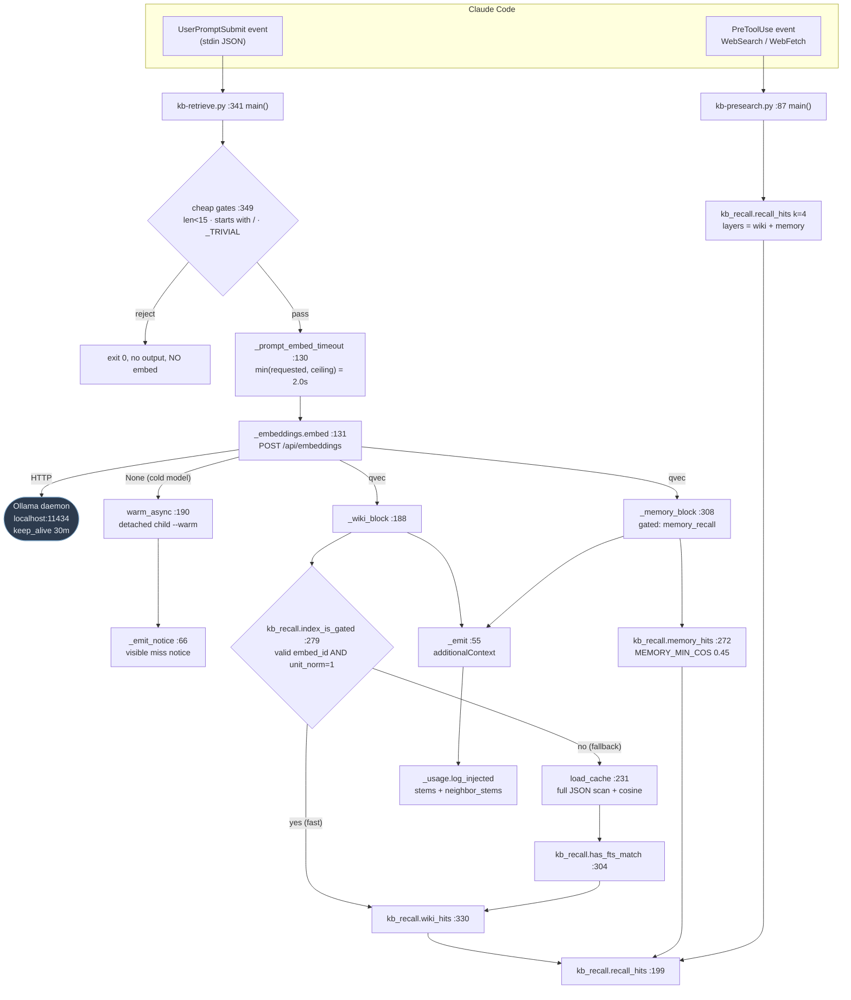
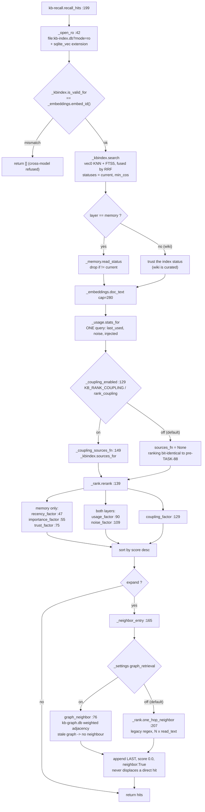
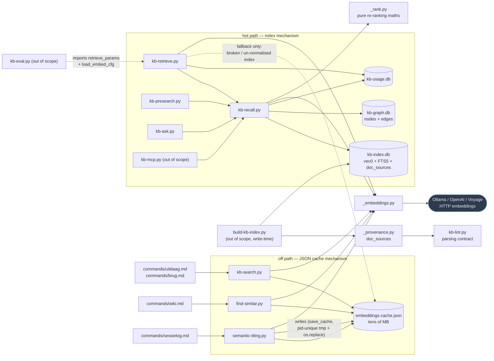

# C4 Code Level — `scripts/` (retrieval group)

> **Scope note.** `scripts/` holds 86 files and is documented by several agents.
> This file covers **only** the hot retrieval path: `kb-retrieve.py`,
> `kb-recall.py`, `kb-search.py`, `kb-presearch.py`, `kb-ask.py`, `_rank.py`,
> `_embeddings.py`, `_provenance.py`, `find-similar.py`, `semantic-tiling.py`.
> Other `scripts/` files (index builders, capture/sweep, session hooks, MCP
> server, eval harness) are referenced only where these ten depend on them or
> are called by them; they are documented elsewhere.

---

## 1. Overview

| Field | Value |
|---|---|
| **Name** | KennisBank retrieval path (script layer) |
| **Location** | `scripts/` (repo-relative). At runtime everything executes from the deploy copy at `$VAULT/.claude/scripts/`. |
| **Language** | Python 3, stdlib-first. The only non-stdlib import on this path is `sqlite_vec` (loaded as a SQLite extension). |
| **Purpose** | Turn a user prompt (or a CLI query) into a small, high-precision block of vault context, within a sub-2-second interactive budget, and fail open — never block, never raise, never delay. |

**Description.** This group implements the read side of KennisBank. Three
entry shapes exist:

1. **Hooks** — `kb-retrieve.py` (UserPromptSubmit) and `kb-presearch.py`
   (PreToolUse on `WebSearch|WebFetch`) read a JSON event on stdin and write a
   `hookSpecificOutput.additionalContext` JSON object to stdout.
2. **CLIs for slash-commands** — `kb-search.py`, `find-similar.py`,
   `kb-ask.py`, `semantic-tiling.py` take a query/path argument and print
   JSON or human text.
3. **Libraries** — `kb-recall.py` (recall over `kb-index.db` + `kb-graph.db`),
   `_rank.py` (pure re-ranking maths), `_embeddings.py` (the embedding provider
   and JSON cache), `_provenance.py` (source keys for the coupling signal,
   used at index time).

Two distinct retrieval mechanisms live side by side, deliberately:

- **The index path** — `kb-index.db` (sqlite-vec `vec0` KNN + FTS5, fused with
  Reciprocal Rank Fusion), used by `kb-recall.py` and therefore by
  `kb-retrieve.py`, `kb-presearch.py`, `kb-ask.py`. One read-only SQLite open;
  this is what meets the hot-path budget.
- **The JSON-cache path** — `$VAULT/.claude/embeddings-cache.json` parsed in
  full and scored in pure Python. This is the *fallback* inside
  `kb-retrieve._wiki_block`, and the *only* mechanism in `kb-search.py`,
  `find-similar.py` and `semantic-tiling.py`. It is slow (tens of MB of JSON)
  but keeps a vault with a broken index working.

**Fail-open contract.** Every element in this group returns an empty
result (`""`, `[]`, `None`, `{}`, `0`) on any exception. `kb-retrieve.py`
wraps `main()` in a bare `try/except: pass` at module level
(`kb-retrieve.py:417-421`) so a crash can never break a prompt. The one
deliberate exception to silence is `_emit_notice` — a *missed* injection is
reported visibly, because a user who thinks the vault was consulted when it
wasn't is worse off than a user who knows it wasn't.

---

## 2. Code Elements

### 2.1 `scripts/kb-retrieve.py` — UserPromptSubmit hook (421 lines)

**Role.** The single interactive entry point. Embeds the prompt exactly once,
builds a wiki block and (gated) a memory block, emits them as
`additionalContext`, and logs which stems were injected for the usage
feedback loop.

Module-level state and constants:

| Element | Location | Notes |
|---|---|---|
| `_DEFAULT_PROMPT_EMBED_TIMEOUT = 2.0` | `kb-retrieve.py:35` | The hot-path embed budget in seconds. Independent of the 30 s hook ceiling in `_hooks_manifest.py`. |
| `kb_recall` (module global) | `kb-retrieve.py:38-45` | `kb-recall.py` loaded via `importlib.util.spec_from_file_location` because the filename contains a hyphen. Set to `None` if loading fails (e.g. `sqlite_vec` missing); every use site is guarded. Module-global on purpose so tests can monkeypatch it. |
| `_TRIVIAL` (set of 24 strings) | `kb-retrieve.py:48-52` | Continuation/ack noise (`"go"`, `"ja"`, `"ok"`, `"klaar"`, …) that is not worth an embed. |
| `_WARM_SENTINEL_WINDOW = 60.0` | `kb-retrieve.py:90` | Mirrors `_embeddings.warm_async(min_interval=60.0)`; used only to word the cold-model notice correctly. |

Functions:

- **`_emit(ctx: str) -> None`** — `kb-retrieve.py:55`
  Writes `{"suppressOutput": True, "hookSpecificOutput": {"hookEventName":
  "UserPromptSubmit", "additionalContext": ctx}}` to stdout. No-op on empty
  `ctx`. A *successful* injection is invisible.
  Depends on: `json`, `sys`.

- **`_emit_notice(text: str) -> None`** — `kb-retrieve.py:66`
  Same shape but `suppressOutput: False`. Used only for the cold-model miss, so
  the user sees that this turn ran without vault context.
  Depends on: `json`, `sys`.

- **`_warm_already_running(emb) -> bool`** — `kb-retrieve.py:93`
  True when `emb._warm_marker()` exists and its mtime is younger than
  `_WARM_SENTINEL_WINDOW`. Purely cosmetic (chooses the notice wording).
  Depends on: `_embeddings._warm_marker`, `time`.

- **`_cold_notice(already_warming: bool, timeout: float) -> str`** — `kb-retrieve.py:103`
  Builds the Dutch user-facing message explaining that the local embedding
  model did not answer within `timeout` seconds and that the model is now
  loading in the background. Pure string construction.

- **`_num(env: str, cfg: dict, key: str, default) -> <type(default)>`** — `kb-retrieve.py:118`
  Knob resolver with the repo-wide precedence: env var wins, then the config
  key, then the built-in default. Accepts NL decimal commas
  (`"0,60"` → `0.60`); returns `default` on `ValueError`. Note the asymmetry: an
  env var is coerced to `type(default)`, a config value is only used when it is
  already `int`/`float`.
  Depends on: `os.environ`.

- **`_prompt_embed_timeout(cfg: dict) -> float`** — `kb-retrieve.py:130`
  Resolves `KB_RETRIEVE_TIMEOUT` / `retrieve_timeout` as the *requested*
  timeout, and `KB_PROMPT_HOOK_MAX_EMBED_TIMEOUT` /
  `prompt_hook_max_embed_timeout` as the *ceiling*, then returns
  `min(max(requested, 0.1), max(ceiling, 0.1))`. Non-finite values fall back to
  `_DEFAULT_PROMPT_EMBED_TIMEOUT`. This is the guard that stops a slow
  interactive path from being configured by accident.
  Depends on: `_num`, `math.isfinite`.

- **`retrieve_params(cfg: dict) -> dict`** — `kb-retrieve.py:157`
  **Public / cross-module.** Returns `{"top_n": int, "min_cos": float,
  "expand": bool}` from `KB_RETRIEVE_TOP_N`/`retrieve_top_n` (default 3),
  `KB_RETRIEVE_THRESHOLD`/`retrieve_threshold` (default 0.50), and
  `KB_RETRIEVE_EXPAND`/`retrieve_expand` (default 1 → True).
  Single source of truth: `kb-eval.py:184` imports it so the eval harness
  measures the same gate/expansion as production (TASK-86).
  Depends on: `_num`.

- **`load_embed_cfg(vault_root) -> dict`** — `kb-retrieve.py:173`
  **Public / cross-module.** Reads `<vault>/.claude/kennisbank-embed.json`
  fail-soft; missing or corrupt → `{}`. Takes the `vault_root` *callable* as an
  argument (not the path) so the caller controls resolution — ADR-0002.
  Consumed by `kb-eval.py:183`.

- **`_wiki_block(prompt, emb, vault_root, cfg, qvec) -> str`** — `kb-retrieve.py:188`
  The core of the wiki injection, and the only place both retrieval mechanisms
  meet. Two paths:
  1. **Fast path** (`:206-220`) — if `kb_recall.index_is_gated()` is True (valid
     index for the live model *and* `meta['unit_norm'] == '1'`), call
     `kb_recall.wiki_hits(qvec, query_text=prompt, k=top_n, expand=expand,
     min_cos=threshold)` and format. Returns `""` on no hits. One SQLite open.
     The `index_is_gated()` precondition matters: on a pre-normalisation index
     `_kbindex.search` ignores `min_cos`, so trusting the index as the gate
     would inject unconditionally.
  2. **Fallback path** (`:222-284`) — parse the whole JSON cache, keep entries
     under `<vault>/02-wiki` whose `id == emb.embed_id()` and whose `dim`
     matches `len(qvec)`, cosine-score them, and open the gate on
     `cosine_relevant OR fts_relevant` (`kb_recall.has_fts_match(prompt,
     layer="wiki")`). Selection still prefers `kb_recall.wiki_hits`; only if
     that returns nothing does it fall back to the cosine top-N with
     `emb.doc_text(p, cap=280)` snippets.
  Output format per hit: `- [[<stem>]] (0.72): <snippet>` or
  `- [[<stem>]] (buur): <snippet>` for a graph/wikilink neighbour.
  Depends on: `kb_recall.index_is_gated`, `kb_recall.wiki_hits`,
  `kb_recall.has_fts_match`, `_embeddings.load_cache/embed_id/cosine/doc_text`,
  `_vaultpath.vault_root`, `retrieve_params`.

- **`_provenance_tag(path: str) -> str`** — `kb-retrieve.py:287`
  Reads `evidence_basis` and `status` from a memory file's frontmatter (fields
  that are *not* in the hit dict) and delegates formatting to
  `_memory.provenance_tag(evidence_basis, status)`. Pure lookup, no LLM.
  Fail-soft → `""`.
  Depends on: `_frontmatter.parse_frontmatter`, `_memory.provenance_tag`.
  Not to be confused with `_provenance.py`, which is a different module for a
  different signal (see §2.8).

- **`_memory_block(qvec, prompt, cfg, hits_fn=None) -> str`** — `kb-retrieve.py:308`
  Additive memory block. `hits_fn` is an injectable callable with
  `kb_recall.memory_hits`' signature `(qvec, query_text, k) -> list`; when
  `None`, `kb-recall.py` is loaded via importlib on the spot. `k` comes from
  `KB_RECALL_TOP_N` / `memory_top_n` (default 3). Each line carries the
  provenance tag from `_provenance_tag`; wiki hits stay deliberately untagged
  because they are curated.
  Depends on: `kb_recall.memory_hits`, `_provenance_tag`, `_num`.

- **`main() -> None`** — `kb-retrieve.py:341`
  The hook body, in order:
  1. Read stdin, parse JSON, bail on empty/invalid (`:342-348`).
  2. **Cheap gates** (`:349-352`): prompt `< 15` chars, starts with `/`, or is
     in `_TRIVIAL` → return with no output and no embed.
  3. `os.environ.setdefault("KENNISBANK_VAULT", str(Path(__file__).resolve().parents[2]))`
     (`:354`) — the deploy-layout assumption
     `$VAULT/.claude/scripts/kb-retrieve.py` → `parents[2] == $VAULT`. This is a
     `setdefault`, so an explicitly-set env var still wins (ADR-0002).
  4. `sys.path.insert` the script dir, import `_embeddings` and
     `_vaultpath.vault_root` (`:355-360`).
  5. `cfg = load_embed_cfg(vault_root)`, `timeout = _prompt_embed_timeout(cfg)`,
     then **one** `emb.embed(prompt, timeout=timeout)` (`:362-369`).
  6. **Cold-model branch** (`:370-383`): `qvec is None` → note whether a warm is
     already running, fire `emb.warm_async()` (detached), emit
     `_cold_notice(...)` visibly, return. Never retries in-band — that would
     block the prompt.
  7. `_wiki_block(...)`, then `_memory_block(...)` gated on
     `_settings.get("memory_recall", True)` (`:385-394`).
  8. Emit the joined blocks and log telemetry (`:396-414`): extract `[[stem]]`
     matches with `re.findall(r"\[\[([^\[\]|#]+)\]\]", ctx)`, split out the
     subset on lines containing `"(buur)"`, and call
     `_usage.log_injected(stems, session_id=..., neighbor_stems=nb_stems)`.
     Wrapped in `try/except: pass` — telemetry may never slow or break the hook.

### 2.2 `scripts/kb-recall.py` — recall library over `kb-index.db` (334 lines)

**Role.** Takes an already-computed query vector and returns ranked hits. Opens
every database **read-only** (the memory sweep is a concurrent writer). No
`__main__` block exists, despite the module docstring at `kb-recall.py:13`
saying *"importeer via importlib of draai als CLI"* — **there is no CLI**;
importlib is the only usable entry. (Flagged as a doc/code discrepancy, not a
functional defect.)

Import-time side effects (`kb-recall.py:23-30`): `KENNISBANK_VAULT` setdefault to
`parents[2]`, `sys.path` insert, then imports of `_embeddings`, `_kbindex`,
`_memory`, `_rank`, `_frontmatter.parse_frontmatter`, `_vaultpath.vault_root`.

- **`_frontmatter_of(path: str) -> dict`** — `kb-recall.py:33`
  Frontmatter reader handed to `_rank.rerank` as `meta_fn`. Fail-soft → `{}`.
  Depends on: `_frontmatter.parse_frontmatter`.

- **`_open_ro(db_path: Path) -> sqlite3.Connection | None`** — `kb-recall.py:42`
  Opens `file:<path>?mode=ro` with `uri=True`, loads the `sqlite_vec` extension,
  then disables extension loading again. Returns `None` if the file is absent or
  anything raises; closes a partially-opened connection first.
  Depends on: `sqlite3`, `sqlite_vec`.

- **`_open_graph_ro() -> sqlite3.Connection | None`** — `kb-recall.py:60`
  Read-only open of `kb-graph.db`. Deliberately **not** `_kbindex.graph_connect()`
  — that opens read-write, creates directories and sets WAL, all write behaviour
  that has no place on the read path. No `sqlite_vec` needed (plain tables).
  Depends on: `_kbindex.graph_index_path`, `sqlite3`.

- **`graph_neighbor(hits) -> dict | None`** — `kb-recall.py:76`
  **Public.** Best graph neighbour of the wiki hits (TASK-87), returning
  `{"path": str, "stem": str}` or `None`.
  Guards, in order: graph DB present; `_kbindex.graph_is_current(conn,
  <vault>/graphify-out/graph.json)` — a stale graph degrades to *no* neighbour,
  never a wrong one; only `layer == "wiki"` hits seed the query; the absolute OS
  path from `kb-index` is reduced to the graph's vault-relative POSIX key via
  `Path(h["path"]).resolve().relative_to(root).as_posix()`; candidates must start
  with `02-wiki/` and end with `.md`; a stem already in the hit set is skipped;
  weights from `_kbindex.graph_neighbors(conn, rel, limit=5)` are summed per
  file; the winner is the first existing file under the deterministic
  `(-weight, path)` sort. Fail-open → `None`; connection always closed.
  Depends on: `_kbindex.graph_index_path/graph_is_current/graph_neighbors`,
  `_vaultpath.vault_root`.

- **`_coupling_enabled() -> bool`** — `kb-recall.py:129`
  Toggle for the bibliographic-coupling signal (TASK-88), **default off**.
  `KB_RANK_COUPLING` (`1/true/yes/on`) wins over `"rank_coupling"` in
  `<vault>/.claude/kennisbank-embed.json`. Fail-soft → `False`.

- **`_coupling_sources_fn(conn, rows) -> callable | None`** — `kb-recall.py:149`
  When the toggle is on, does one extra batch query
  `_kbindex.sources_for(conn, doc_ids)` on the already-open connection and
  returns a `lambda path -> set[str]` closure for `_rank.rerank`'s `sources_fn`.
  Returns `None` when the toggle is off or there is nothing to weigh — and
  `None` is exactly what makes ranking bit-identical to the pre-TASK-88
  behaviour.
  Depends on: `_kbindex.sources_for`, `_coupling_enabled`.

- **`_neighbor_entry(out) -> dict | None`** — `kb-recall.py:165`
  Builds the `(buur)` expansion entry. The `graph_retrieval` setting chooses the
  *source*: `graph_neighbor(out)` (weighted `kb-graph.db`, sub-millisecond) when
  on, `_rank.one_hop_neighbor(out, root)` (legacy regex expansion, N× `read_text`
  inside the prompt budget) when off. `expand` in `recall_hits` remains the
  master switch, so rollback is one setting. Returns a hit-shaped dict with
  `"score": 0.0` and `"neighbor": True`. Fail-open → `None`.
  Depends on: `_settings.get`, `graph_neighbor`, `_rank.one_hop_neighbor`,
  `_embeddings.doc_text`, `_vaultpath.vault_root`.

- **`recall_hits(query_vector, query_text: str = "", k: int = 3, layers=("wiki", "memory"), expand: bool = False, min_cos: float = 0.0) -> list`** — `kb-recall.py:199`
  **The primary public entry.** Returns a list of dicts with keys `path`,
  `layer`, `title`, `created`, `score`, `cos`, `fts`, `snippet` (plus
  `neighbor: True` on an appended expansion entry). Flow:
  1. Empty `query_vector` → `[]`; `_open_ro(_kbindex.index_path())` → `[]` if
     absent.
  2. **Cross-model gate**: `_kbindex.is_valid_for(conn, emb.embed_id())` → `[]`
     on mismatch. Cross-model cosine is silently wrong, so it is refused.
  3. `_kbindex.search(conn, query_vector=..., query_text=..., k=..., layers=...,
     statuses=("current",), min_cos=...)` — hybrid `vec0` KNN + FTS5 fused with
     RRF.
  4. **Stale-index protection for memory only** (`:229`):
     `_mem.read_status(Path(r["path"])) != "current"` drops the row. Wiki trusts
     the index status because wiki is curated.
  5. Snippets via `emb.doc_text(path, cap=280)`, newlines collapsed.
  6. Usage telemetry in **one** batch query: `_usage.stats_for(...)` builds
     `_lu` (`last_used`) and `_nf` (`(noise, injected)`) lookups. Two opens per
     hit during re-ranking was the thing this replaced.
  7. `_rank.rerank(out, _frontmatter_of, last_used_fn=_lu, noise_fn=_nf,
     sources_fn=_coupling_sources_fn(conn, rows))`.
  8. If `expand and out`, append `_neighbor_entry(out)` — **always last**, never
     displacing a direct hit.
  Fail-soft → `[]`; connection always closed in `finally`.
  Depends on: `_kbindex`, `_embeddings`, `_memory`, `_rank`, `_usage`,
  `_frontmatter`.
  Called by: `kb-retrieve.py` (via the wrappers), `kb-presearch.py:132`,
  `kb-ask.py:66`, `kb-mcp.py:78`, `kb-eval.py:196,200`.

- **`MEMORY_MIN_COS = 0.45`** — `kb-recall.py`, overridable with `KB_MEMORY_THRESHOLD`
  A *separate* threshold for memory, not inherited from `retrieve_threshold`.
  Memories are short and atomic, so their cosine against a prompt sits
  structurally lower; inheriting the wiki threshold would silently close the
  memory block.

- **`memory_hits(query_vector, query_text: str = "", k: int = 3, min_cos: float = MEMORY_MIN_COS) -> list`** — `kb-recall.py:272`
  Thin wrapper: `layers=("memory",)`. Used by `kb-retrieve._memory_block`.

- **`index_is_gated() -> bool`** — `kb-recall.py:279`
  True only when the index is valid for the live `embed_id()` **and**
  `_kbindex.meta_get(conn, "unit_norm") == "1"`. Without unit-normalised vectors
  the L2-distance→cosine conversion is wrong and `search()` applies no
  threshold, so the caller must not trust the index as a gate. One read-only
  open — orders of magnitude cheaper than parsing the JSON cache.

- **`has_fts_match(query_text: str, layer: str = "wiki") -> bool`** — `kb-recall.py:304`
  Keyword-only signal. Builds the MATCH expression with `_kbindex.fts_expr`
  (words ≥ 4 chars, OR-ed — so stopwords and stray punctuation give neither a
  false signal nor an FTS5 syntax error), then
  `SELECT 1 FROM fts_docs JOIN docs ON docs.doc_id = fts_docs.rowid WHERE
  fts_docs MATCH ? AND docs.layer = ? LIMIT 1`. Fail-soft → `False`.

- **`wiki_hits(query_vector, query_text: str = "", k: int = 3, expand: bool = False, min_cos: float = 0.0) -> list`** — `kb-recall.py:330`
  Thin wrapper: `layers=("wiki",)`, optional neighbour expansion.

### 2.3 `scripts/_rank.py` — re-ranking maths (237 lines)

**Role.** Pure functions, stdlib only, no I/O; every reader is injectable, which
is what makes `tests/test_rank.py` able to lock the ranking bit-for-bit.
Only the **memory** layer gets recency/importance/trust weighting — wiki is
curated and the stale-check guards ageing there.

Constants: `HALF_LIFE_DAYS = {"feit": 365, "voorkeur": 180, "procedure": 365,
"beslissing": 730}` (`:31`), `DEFAULT_HALF_LIFE = 365` (`:32`),
`RECENCY_FLOOR = 0.6` (`:34`), `_WIKILINK_RE = re.compile(r"\[\[([^\[\]|#]+)")`
(`:36`), `TRUST_RANK = {"getypt": 2, "cc-sessie": 1, "import": 1,
"autoresearch": 1, "audio": 1, "agent": 0}` (`:65`),
`USAGE_BOOST_RECENT = 1.10` / `USAGE_BOOST_WARM = 1.05` (`:86-87`),
`NOISE_PENALTY = 0.20` / `NOISE_FLOOR = 0.80` (`:105-106`),
`COUPLING_BOOST_ONE = 1.05` / `COUPLING_BOOST_MULTI = 1.10` (`:125-126`).

- **`_age_days(iso_date: str, today: date) -> int`** — `_rank.py:39`
  Parses the first 10 chars as `%Y-%m-%d`; unparseable → `0` (treated as fresh,
  i.e. neutral). Clamped at `>= 0`.

- **`recency_factor(age_days: int, memory_type: str = "feit") -> float`** — `_rank.py:47`
  `max(RECENCY_FLOOR, 0.5 ** (age_days / half_life))`. Exponential decay with a
  floor, so old-but-relevant never disappears.

- **`importance_factor(importance) -> float`** — `_rank.py:55`
  Judge score 1–5 clamped, mapped to `1.0 + 0.05 * (imp - 3)` → 0.90…1.10;
  neutral 3 → 1.0. Unparseable → neutral.

- **`trust_factor(evidence_basis) -> float`** — `_rank.py:75`
  `1.0 + 0.05 * (TRUST_RANK.get(basis, 1) - 1)` → 0.95…1.05. Typed-by-human >
  human-in-the-loop > agent; unknown values are neutral.

- **`usage_factor(last_used_iso: str, today: date | None = None) -> float`** — `_rank.py:90`
  1.10 within 30 days, 1.05 within 90, else 1.0. Empty/unknown → 1.0. Fed by
  `kb-usage.db`; a document actually used recently is *proven* useful.

- **`noise_factor(noise: int, injected: int) -> float`** — `_rank.py:109`
  The signed counterpart of `usage_factor`:
  `max(NOISE_FLOOR, 1.0 - NOISE_PENALTY * min(1.0, noise / injected))`.
  Exactly `1.0` when there are no human noise marks, so ranking is unchanged
  without them. Only ever fed by explicit marks from `kb-noise.py`.

- **`coupling_factor(shared_with: int) -> float`** — `_rank.py:129`
  Bibliographic coupling (Kessler 1963): 1.10 when sources are shared with ≥ 2
  other candidates, 1.05 with exactly 1, else 1.0. Never below 1.0 — coupling is
  a coherence bonus, never a penalty. The comment at `:117-127` is explicit that
  the starting weights are conservative placeholders to be tuned by the
  `kb-eval` A/B on ≥ 100-question sets, and are pinned against
  `CONFIGURATION.md` by `tests/test_knob_consistency.py`.

- **`rerank(hits: list, meta_fn, today: date | None = None, last_used_fn=None, noise_fn=None, sources_fn=None) -> list`** — `_rank.py:139`
  The single re-ranking entry. Returns a **new** list, re-sorted descending on
  `score`.
  - Coupling is pre-computed in one pass (`:161-174`): per hit, the number of
    *other* hits with a non-empty source intersection. No I/O here — the caller
    batches the lookup.
  - Per hit (`:177-202`): memory layer gets
    `score * recency_factor * importance_factor * trust_factor` using
    `fm["updated"] or fm["valid_from"] or fm["created"]` as the reference date;
    then `usage_factor` and `noise_factor` apply to **both** layers (a warm wiki
    article is proven useful too); then `coupling_factor`.
  - Every injected callable is individually `try`-wrapped, so a broken reader
    degrades that one factor to neutral instead of losing the hit.

- **`one_hop_neighbor(hits: list, root: Path, read_fn=None) -> str | None`** — `_rank.py:207`
  The **legacy** neighbour source (still used when `graph_retrieval` is off).
  Counts `[[wikilinks]]` in the wiki hit bodies, keeps only targets that exist as
  `02-wiki/<stem>.md` (raw sessions and memories are provenance, not
  neighbours), skips stems already hit, and returns the winner of the
  deterministic `(-count, name)` sort. `read_fn` is injectable for tests. The
  cost this incurs on the hot path — N× `read_text` inside the prompt budget —
  is precisely what `kb-recall.graph_neighbor` replaces.

### 2.4 `scripts/_embeddings.py` — pluggable embedding provider + JSON cache (299 lines)

**Role.** Single source of truth for "turn text into a vector", plus the shared
JSON embedding cache and the model warm-up helpers. Stdlib only (uses
`urllib.request` directly rather than `requests`).

Config precedence per setting: env var → `<vault>/.claude/kennisbank-embed.json`
→ built-in default. Constants: `_DEFAULTS` (`:57-61`) with
`ollama` → `http://localhost:11434` / `qwen3-embedding:8b`,
`openai` → `https://api.openai.com/v1` / `text-embedding-3-small`,
`voyage` → `https://api.voyageai.com/v1` / `voyage-3`; and
`CACHE_FILE = vault_root() / ".claude" / "embeddings-cache.json"` (`:63`).

> `CACHE_FILE` is evaluated **at import time**, so `KENNISBANK_VAULT` must be
> set before this module is imported. That is why every hot-path script does the
> `os.environ.setdefault` before importing it, and why `warm_async` passes
> `env=os.environ.copy()` to the detached child.

- **`_config() -> dict`** — `_embeddings.py:66` — reads `kennisbank-embed.json`, `{}` on any error.
- **`_setting(name: str, env: str, file_cfg: dict, default: str = "") -> str`** — `_embeddings.py:76` — env → file → default, whitespace-stripped.
- **`_resolve() -> tuple[str, str, str, str]`** — `_embeddings.py:86` — returns `(provider, model, endpoint, api_key_env)`; honours the legacy `OLLAMA_EMBED_MODEL` var for the ollama provider; strips a trailing `/` from the endpoint.
- **`provider() -> str`** — `_embeddings.py:100` — `_resolve()[0]`.
- **`embed_id() -> str`** — `_embeddings.py:104`
  `"provider:model"`. The cross-model safety key. Every cache read and every
  index validity check gates on this, because different models live in different
  cosine spaces and may differ in dimensionality.
- **`cosine(a, b) -> float`** — `_embeddings.py:110`
  Length-guarded: mismatched lengths return `0.0` rather than scoring the
  overlap (the cross-model truncation trap). Zero-norm → `0.0`.
- **`_http_json(url: str, payload: dict, headers: dict, timeout: float) -> dict`** — `_embeddings.py:123` — one POST, JSON in / JSON out, via `urllib.request`.
- **`embed(text: str, timeout: float = 30.0) -> list[float] | None`** — `_embeddings.py:131`
  **The single outbound HTTP call on the retrieval path.**
  - `ollama`: `POST {endpoint}/api/embeddings` with `{"model", "prompt",
    "keep_alive": "30m"}`; reads `r["embedding"]` or `r["embeddings"][0]`. The
    `keep_alive` is what keeps the model resident between prompts.
  - `openai`: `POST {endpoint}/embeddings` `{"model", "input": text}`, Bearer
    token from the env var *named* in `api_key_env`.
  - `voyage`: same, with `"input": [text]`.
  API providers return `None` when no key is present. Any exception → `None`.
  The key itself is never stored in config or repo — only the name of its env
  var.
- **`_warm_marker() -> Path`** — `_embeddings.py:180` — `<vault>/.claude/.embed-warm.marker`.
- **`warm(timeout: float = 120.0) -> bool`** — `_embeddings.py:184` — one throwaway `embed("warm")`; blocks. For detached/off-path use only.
- **`warm_async(min_interval: float = 60.0) -> None`** — `_embeddings.py:190`
  **The self-heal.** Fire-and-forget `subprocess.Popen([sys.executable,
  __file__, "--warm"])` with stdio to `DEVNULL` and the parent env copied.
  Detachment is platform-specific: `creationflags = DETACHED_PROCESS |
  CREATE_NO_WINDOW` (`0x00000008 | 0x08000000`) on Windows, `start_new_session=True`
  elsewhere. Sentinel-guarded by `_warm_marker()` mtime so a down Ollama cannot
  cause a child pile-up (one process per minute at worst). Silent and fail-open
  throughout — a warm that cannot start must not break the prompt.
- **`load_cache() -> dict`** — `_embeddings.py:231` — parses `CACHE_FILE`; `{}` on any error.
- **`save_cache(cache: dict) -> None`** — `_embeddings.py:238`
  Atomic write via a **process-unique** temp file
  (`<name>.<pid>.tmp` + `os.replace`). A shared temp path let two SessionStart
  index builders interleave and lose an update. Deliberately does **no** merge:
  a merge cannot express a deletion and would make the prune step in
  `build-embed-index.py` a permanent no-op.
- **`file_hash(path) -> str`** — `_embeddings.py:258` — first 8 hex chars of the MD5 of the file bytes. Change-detection only, not security.
- **`doc_text(path, cap: int = 4000) -> str`** — `_embeddings.py:262` — frontmatter-stripped body, capped. `""` on any error. Also the snippet source on the retrieval path (called with `cap=280`).
- **`get_cached(path, cache: dict, recompute: bool = True) -> list[float] | None`** — `_embeddings.py:271`
  Cache hit requires `hash`, `id` (== `embed_id()`) **and** a non-empty
  `embedding`. A miss with `recompute=False` returns `None` (this is how the
  CLI helpers avoid live network calls); with `recompute=True` it embeds and
  stores `{"hash", "id", "dim", "embedding"}`.
- **`__main__`** — `_embeddings.py:292-299` — the `--warm` entry point used by `warm_async`. Wrapped so it never raises or spews; it runs unattended.

### 2.5 `scripts/kb-presearch.py` — PreToolUse hook on `WebSearch|WebFetch` (146 lines)

**Role.** "Check your own memory first." Fires just before an external search,
embeds the query, recalls wiki + memory hits, and injects them with
`permissionDecision: "defer"` so the tool proceeds normally. Gated on the
`memory_recall` setting.

Module state: `_SEARCH_TOOLS = {"WebSearch", "WebFetch"}` (`:27`);
`kb_recall` loaded at import via importlib (`:39-47`), left `None` on failure so
tests can monkeypatch `m.kb_recall.recall_hits`.

- **`query_of(tool_name: str, tool_input: dict) -> str`** — `kb-presearch.py:50`
  `WebSearch` → `tool_input["query"]`; `WebFetch` → `url + " " + prompt`;
  anything else → `""`. Non-dict input → `""`.
- **`build_context(hits: list) -> str`** — `kb-presearch.py:63`
  Renders `- [geheugen|wiki] [[<stem>|<title>]] (0.71): <snippet>` lines under a
  header. `""` on no hits.
- **`_emit(ctx: str) -> None`** — `kb-presearch.py:76`
  Writes the PreToolUse contract: `suppressOutput: True`,
  `permissionDecision: "defer"`, `additionalContext`.
- **`main(stdin_text: str | None = None) -> int`** — `kb-presearch.py:87`
  Always returns `0`. `stdin_text=None` reads stdin (production); passing text is
  the test path. Order: parse JSON → `tool_name` must be in `_SEARCH_TOOLS` →
  `_settings.get("memory_recall", True)` gate (fail-open if `_settings` will not
  load) → `len(query) >= 4` → `emb.embed(query)` (note: **default 30 s
  timeout**, not the 2 s prompt budget — this is a tool boundary, not a
  keystroke) → `kr.recall_hits(qvec, query_text=query, k=4, layers=("wiki",
  "memory"))` → emit.
  The comment at `:121-122` records a real Python-scoping trap: assigning to
  `kb_recall` inside `main()` would make it local and break the monkeypatch,
  hence the `kr` alias.

### 2.6 `scripts/kb-search.py` — query-string retrieval CLI (184 lines)

**Role.** The CLI counterpart of the hook, for LLM-driven slash-commands.
Called by `commands/uitdaag.md:20` and `commands/brug.md:29,30,70`.
Uses the **JSON cache only** — it never touches `kb-index.db`, so it gets no
FTS, no RRF, no graph neighbours and no re-ranking. Always prints JSON; `[]`
and exit 0 on any failure.

- **`rank(query_vec: list, candidates: dict, top_n: int, threshold: float) -> list`** — `kb-search.py:46`
  **Pure core**, testable without Ollama. Cosine-scores `path -> vector`, keeps
  `score >= threshold`, sorts descending, caps at `top_n`. Returns
  `[(path, score), ...]`. Unrelated to `_rank.rerank` despite the name.
- **`_num_env(env: str, default)`** — `kb-search.py:77` — env-only knob reader (NL comma tolerant). Note: unlike `kb-retrieve._num`, there is **no** config-file layer here, so `kennisbank-embed.json` does not influence this CLI.
- **`_collapse(text: str, cap: int = 200) -> str`** — `kb-search.py:87` — whitespace-collapse and truncate.
- **`main() -> None`** — `kb-search.py:92`
  `argparse`: positional `query`, `--top` (default `KB_RETRIEVE_TOP_N` or 3),
  `--threshold` (default `KB_RETRIEVE_THRESHOLD` or 0.50). Loads the cache;
  builds candidates from `<vault>/02-wiki` entries whose `id == embed_id()`,
  skipping `index.md` and `log.md`; embeds the query **live** (one-off, on
  purpose) with the default 30 s timeout; ranks; prints
  `[{"path", "score" (rounded to 4), "snippet"}]`.
  Uncached articles are silently skipped — `build-embed-index.py` at SessionStart
  warms the cache, and calling live embed per candidate here would be wrong.

### 2.7 `scripts/kb-ask.py` — manual export bridge to cloud agents (138 lines)

**Role.** TASK-22. For agents that do not run on this machine and cannot reach a
stdio MCP server. Rather than exposing the vault through a tunnel, the **human
stays the gate**: this script retrieves locally and prints a paste-ready block.
Nothing leaves the machine automatically. Read-only over the index; fail-soft
with a message on stderr and exit 0.

Constants `WRAP_HEADER` (`:48-52`) and `WRAP_FOOTER` (`:53`) are the short
instruction wrapper for the cloud model. `kb_recall` is loaded via importlib at
`:39-46`.

- **`gather(query: str, k: int) -> list`** — `kb-ask.py:56`
  `emb.embed(q)` then `kb_recall.recall_hits(qvec, query_text=q, k=k,
  layers=("wiki", "memory"))`. `[]` on empty query, missing `kb_recall`, or any
  error.
- **`format_hits(hits: list) -> str`** — `kb-ask.py:72` — `- [geheugen|wiki] <title>: <snippet>` lines.
- **`to_clipboard(text: str) -> bool`** — `kb-ask.py:83`
  Best-effort and optional: `pyperclip` if importable, else the OS helper —
  `clip` on Windows, `pbcopy` on macOS, `wl-copy` / `xclip -selection clipboard`
  / `xsel -b` elsewhere. `False` if all fail; the block is still on stdout.
- **`main() -> int`** — `kb-ask.py:108`
  `argparse`: `query` (nargs `+`), `--k` (default 5), `--clip`, `--plain`.
  Prints the wrapped block (or bare hits with `--plain`) to stdout; status
  messages go to stderr so they never pollute a copy-paste. Always returns 0.

### 2.8 `scripts/_provenance.py` — source keys for the coupling signal (79 lines)

**Role.** TASK-88. Extracts "which sources does this document derive from" at
**index time** (`build-kb-index.py:42-43`), off the hot path. The retrieval path
only *reads* the result back through `_kbindex.sources_for`
(`kb-recall._coupling_sources_fn`), so this module is never imported by the
hook itself. Also consumed by `kb-okf-export.py:185`.

**Parsing contract.** Wiki provenance is *exactly* what `kb-lint.py` accepts —
so this module imports kb-lint's own regex and normalisers via importlib rather
than re-implementing them, making drift impossible.
`tests/test_provenance_sources.py` additionally locks both parsers to the same
fixtures.

- **`_load_kb_lint()`** — `_provenance.py:36` — importlib load of `kb-lint.py`.
- **`_lint = _load_kb_lint()`** — `_provenance.py:44` — **import-time side effect**: importing `_provenance` executes `kb-lint.py`. Deliberate (it is the parsing contract), but it is why this module stays off the interactive path.
- **`_norm_bron(target: str) -> str`** — `_provenance.py:47` — normalises a `05-bronnen/...` path to a stable join key via `_lint._clean_target`, dropping any `.md`.
- **`doc_sources(path: Path, layer: str, fm: dict, body: str) -> list`** — `_provenance.py:56`
  Deduplicated, sorted source keys for one document.
  `memory` → `[basename(fm["source_session"])]` (empty field → `[]`);
  `wiki` → every `[[raw-sessie-*]]` stem plus every normalised
  `[[05-bronnen/...]]` path; any other layer → `[]`.
  **Namespace note** (`:20-24`): memory keys are transcript filenames, wiki keys
  are session-log stems; they deliberately do not join across layers, because
  the hook never fuses the layers either. So coupling only ever weighs
  wiki↔wiki and memory↔memory.

### 2.9 `scripts/find-similar.py` — candidate-match helper for `/wiki` (161 lines)

**Role.** Not on the interactive path — it runs at *write* time. Given a target
article or a raw query, finds the most similar existing wiki article so `/wiki`
can rewrite instead of duplicating (`commands/wiki.md:49`). JSON-cache only.

Constant `SKIP_NAMES = {"index.md", "log.md"}` (`:46`).

- **`best_match(target_vec: list, candidates: dict) -> tuple`** — `find-similar.py:49`
  **Pure core.** Returns `(path, score)` of the highest cosine, or `(None, 0.0)`
  when `candidates` is empty. Excluding the target is the *caller's* job;
  `best_match` only ranks what it is given.
- **`_build_candidates(wiki_dir: Path, cache: dict, exclude_path: str | None) -> dict`** — `find-similar.py:72`
  `{str(path): embedding}` for `wiki_dir.glob("*.md")` (top level only, not
  recursive) minus `SKIP_NAMES` and `exclude_path`, using
  `get_cached(..., recompute=False)` so uncached articles are skipped rather
  than triggering live network calls.
- **`main(argv=None)`** — `find-similar.py:91`
  `argparse`: `query`, `--threshold` (default `$KB_REWRITE_THRESHOLD` or 0.62),
  `--json` (accepted for compatibility; output is always JSON). If the argument
  is an existing `.md`, the target is embedded with `recompute=True` and
  excluded from candidates; otherwise it is treated as literal text and embedded
  live. Prints `{"path", "score" (rounded to 6), "above_threshold"}`.
  On an unavailable embedding it prints the null result and **`sys.exit(1)`**
  (`find-similar.py:143`) — the only non-zero exit on a *retrieval result* in
  this group, deliberate because `/wiki` must not proceed as if "no similar
  article" were confirmed. (`semantic-tiling.py` also exits 1, but only on
  usage/precondition errors: `:57`, `:62`, `:82`.)

### 2.10 `scripts/semantic-tiling.py` — near-duplicate check (125 lines)

**Role.** Also write-time, not interactive: compares one wiki article against
all others and flags near-duplicates. Invoked from `commands/sessielog.md:134`.
Governed by ADR-0001 (`docs/adr/0001-embedding-model-default.md`).

Module-level: `VAULT_ROOT = vault_root()` (`:27`), `WIKI_DIR = VAULT_ROOT /
"02-wiki"` (`:28`), `THRESHOLD_ERROR` (default 0.85, `:50`),
`THRESHOLD_REVIEW` (default 0.62, `:51`). Thresholds are model-specific by
design — swap the model and recalibrate via env vars, not code.

- **`_threshold(env_var: str, default: float) -> float`** — `semantic-tiling.py:31`
  Reads a cosine threshold from an env var, tolerating NL decimal commas and
  whitespace; on an invalid value it warns on stderr and falls back to the
  default (it does not silently accept nonsense).
- **`main() -> None`** — `semantic-tiling.py:54`
  Requires a path argument (`exit 1` without one, or if the file is missing).
  Loads the cache, **prunes** entries for vanished wiki files, skips empty
  files, embeds the target with `get_cached` (`recompute=True`), then walks
  `WIKI_DIR.glob("**/*.md")` (recursive here, unlike `find-similar.py`) skipping
  the target itself and `index.md`/`log.md`, cosine-scores each, and buckets into
  `errors` (`>= THRESHOLD_ERROR`) and `reviews` (`>= THRESHOLD_REVIEW`).
  Saves the cache, then prints a sorted report and an action line.
  This is the one script in the group that **writes** the shared cache
  (via `emb.save_cache`) — hence the process-unique temp file in `save_cache`.

### 2.11 Helpers summarised rather than dropped

For completeness, every private helper in the ten in-scope files is documented
above; none were silently omitted. The following are the *private* helpers, so a
reader knows what is intentionally internal:
`kb-retrieve._emit`, `_emit_notice`, `_warm_already_running`, `_cold_notice`,
`_num`, `_prompt_embed_timeout`, `_wiki_block`, `_provenance_tag`,
`_memory_block`; `kb-recall._frontmatter_of`, `_open_ro`, `_open_graph_ro`,
`_coupling_enabled`, `_coupling_sources_fn`, `_neighbor_entry`;
`_rank._age_days`; `_embeddings._config`, `_setting`, `_resolve`, `_http_json`,
`_warm_marker`; `_provenance._load_kb_lint`, `_norm_bron`;
`kb-search._num_env`, `_collapse`; `kb-presearch._emit`;
`find-similar._build_candidates`; `semantic-tiling._threshold`.

Modules **read but not documented** here (out of scope, dependencies only):
`_kbindex.py`, `_vaultpath.py`, `_usage.py`, `_settings.py`, `_memory.py`,
`_frontmatter.py`, `_hooks_manifest.py`, `register-hooks.py`, `kb-lint.py`,
`build-kb-index.py`, `build-embed-index.py`, `kb-eval.py`, `kb-mcp.py`,
`kb-okf-export.py`, `kb-noise.py`.

**No vendored third-party code or generated artifacts** exist in these ten
files. (`graphify-out/` elsewhere in the repo *is* generated cache and is not
documented.)

---

## 3. Dependencies

### 3.1 Internal (by repo path)

| Dependency | Used by | For |
|---|---|---|
| `scripts/_vaultpath.py` (`vault_root()`) | all ten, directly or transitively | ADR-0002: the only sanctioned vault-root resolver. Honours `$KENNISBANK_VAULT`, else `~/KennisBank`. |
| `scripts/_kbindex.py` | `kb-recall.py` | `index_path()`, `graph_index_path()`, `is_valid_for()`, `meta_get()`, `search()`, `fts_expr()`, `sources_for()`, `graph_is_current()`, `graph_neighbors()`. |
| `scripts/_embeddings.py` | `kb-retrieve`, `kb-recall`, `kb-presearch`, `kb-search`, `kb-ask`, `find-similar`, `semantic-tiling` | embedding, cosine, cache, `doc_text` snippets, warm-up. |
| `scripts/_rank.py` | `kb-recall.py` | `rerank()`, `one_hop_neighbor()`. |
| `scripts/_frontmatter.py` | `kb-retrieve`, `kb-recall`, `_embeddings` | `parse_frontmatter()`, `split_frontmatter()`. |
| `scripts/_memory.py` | `kb-retrieve` (`provenance_tag`), `kb-recall` (`read_status`) | provenance tags, live status revalidation. |
| `scripts/_usage.py` | `kb-retrieve` (`log_injected`), `kb-recall` (`stats_for`) | the usage/noise feedback loop over `kb-usage.db`. |
| `scripts/_settings.py` | `kb-retrieve` (`memory_recall`), `kb-recall` (`graph_retrieval`), `kb-presearch` (`memory_recall`) | opt-in toggles from `kennisbank-settings.json`. |
| `scripts/kb-lint.py` | `_provenance.py` (importlib, at import time) | `WIKILINK_RE`, `normalize_target`, `_clean_target`, `SESSION_PREFIX` — the provenance parsing contract. |
| `scripts/kb-recall.py` | `kb-retrieve`, `kb-presearch`, `kb-ask` (all via importlib — hyphenated filename) | recall. Also consumed by `kb-mcp.py:78` and `kb-eval.py`. |
| `scripts/kb-retrieve.py` (`retrieve_params`, `load_embed_cfg`) | `kb-eval.py:183-184` | eval/production parity (TASK-86). |
| `scripts/_provenance.py` (`doc_sources`) | `build-kb-index.py:42`, `kb-okf-export.py:185` | index-time source keys. |
| `scripts/_hooks_manifest.py` | `register-hooks.py` | declares `UserPromptSubmit → kb-retrieve.py` (timeout 30 s) and `PreToolUse(WebSearch\|WebFetch) → kb-presearch.py` (timeout 30 s). |
| `commands/uitdaag.md`, `commands/brug.md` | call `kb-search.py` | thinking-tool retrieval. |
| `commands/wiki.md` | calls `find-similar.py` | rewrite-vs-create decision. |
| `commands/sessielog.md` | calls `semantic-tiling.py` | near-duplicate check. |

### 3.2 External

**Python packages** (`requirements.txt`): `sqlite-vec==0.1.9` — the only
non-stdlib import on the retrieval path, loaded as a SQLite extension by
`kb-recall._open_ro`. `pyperclip` is an *optional* soft import in
`kb-ask.to_clipboard` and is not pinned.
Everything else is stdlib: `json`, `os`, `sys`, `sqlite3`, `math`, `hashlib`,
`re`, `pathlib`, `datetime`, `collections.Counter`, `subprocess`, `argparse`,
`importlib.util`, `urllib.request`, `time`.

**SQLite databases** (all under `$VAULT/.claude/`, all opened read-only here):

| Database | Path source | Read by | Contents used |
|---|---|---|---|
| `kb-index.db` | `_kbindex.index_path()` | `kb-recall.py` | `docs`, `fts_docs` (FTS5 virtual), `vec_docs` (`vec0` virtual, `float[dim]`), `doc_sources`, and `meta` carrying `dim`, `embed_id` and `unit_norm` (schema at `_kbindex.py:50-72`). |
| `kb-graph.db` | `_kbindex.graph_index_path()` | `kb-recall._open_graph_ro` | `graph_nodes`, `graph_edges` + a fingerprint of `graphify-out/graph.json`. A separate file on purpose: `build-kb-index.py` unlinks `kb-index.db` on rebuild, which used to take the graph with it. |
| `kb-usage.db` | `_usage.db_path()` | `kb-recall` (read), `kb-retrieve` (write via `log_injected`) | `usage` (`stem`, `last_used`, `noise`, `injected`), `pending`, `neighbor_log`. |

**Files**

- `$VAULT/.claude/embeddings-cache.json` — the JSON embedding cache. Read by the
  `_wiki_block` fallback, `kb-search.py`, `find-similar.py`,
  `semantic-tiling.py`; written by `semantic-tiling.py` (and, off this path, by
  `build-embed-index.py`).
- `$VAULT/.claude/kennisbank-embed.json` — retrieval and provider knobs.
- `$VAULT/.claude/kennisbank-settings.json` — the `memory_recall` /
  `graph_retrieval` toggles (via `_settings`).
- `$VAULT/.claude/.embed-warm.marker` — the `warm_async` sentinel.
- `$VAULT/02-wiki/*.md`, `$VAULT/09-memory/*.md` — snippet and frontmatter
  sources.
- `$VAULT/graphify-out/graph.json` — only its fingerprint is checked, for graph
  staleness.

**HTTP endpoints** (outbound, `_embeddings.embed` only)

| Provider | Endpoint | Default model | Auth |
|---|---|---|---|
| `ollama` (default) | `POST http://localhost:11434/api/embeddings` | `qwen3-embedding:8b` | none (local daemon) |
| `openai` | `POST https://api.openai.com/v1/embeddings` | `text-embedding-3-small` | `Bearer` from the env var named in `api_key_env` |
| `voyage` | `POST https://api.voyageai.com/v1/embeddings` | `voyage-3` | as above |

Default configuration makes **exactly one** outbound call per prompt, to
localhost. Nothing on this path reaches the cloud unless the provider is changed
deliberately.

**Environment variables**

`KENNISBANK_VAULT`; `KB_RETRIEVE_TOP_N`, `KB_RETRIEVE_THRESHOLD`,
`KB_RETRIEVE_EXPAND`, `KB_RETRIEVE_TIMEOUT`,
`KB_PROMPT_HOOK_MAX_EMBED_TIMEOUT`, `KB_RECALL_TOP_N`, `KB_RANK_COUPLING`;
`KB_EMBED_PROVIDER`, `KB_EMBED_MODEL`, `KB_EMBED_ENDPOINT`,
`KB_EMBED_API_KEY_ENV`, `OLLAMA_EMBED_MODEL` (legacy);
`KB_REWRITE_THRESHOLD`; `TILING_THRESHOLD_ERROR`, `TILING_THRESHOLD_REVIEW`.

### 3.3 Tests covering this group

`tests/test_kb_retrieve_wiki.py`, `test_kb_retrieve_memory.py`,
`test_kb_retrieve_cold_notice.py`, `test_kb_recall.py`,
`test_kb_recall_nocloud.py`, `test_kb_presearch.py`, `test_kb_search.py`,
`test_kb_ask.py`, `test_rank.py`, `test_find_similar.py`,
`test_graph_retrieval.py`, `test_graph_provenance_ring.py`,
`test_injection_provenance.py`, `test_provenance_sources.py`,
`test_kbindex_search.py`, `test_build_embed_index_gate.py`.
Gate: `python -m pytest tests -q`.

---

## 4. Relationships

### 4.1 The hot path — one prompt, one embed

### 4.2 Inside `recall_hits` — ranking and the neighbour

### 4.3 The two mechanisms, and who uses which

---

## 5. Design invariants worth preserving

These are load-bearing and each one is documented in the code as the fix for an
observed failure:

1. **One embed per prompt.** `kb-retrieve.main` computes `qvec` once at `:369`
   and hands it to both blocks. Never embed twice on the hot path.
2. **Cross-model gating everywhere.** `embed_id()` equality is checked in
   `get_cached`, in the `_wiki_block` cache filter, and in
   `_kbindex.is_valid_for`. Plus `dim` as cheap insurance
   (`kb-retrieve.py:239`). Cross-model cosine is silently wrong, so it is
   refused rather than approximated.
3. **The index may only be trusted as a gate when `unit_norm == 1`**
   (`index_is_gated`). Otherwise `search()` ignores `min_cos` and the fast path
   would inject unconditionally.
4. **A stale graph yields no neighbour, never a wrong one** — the
   `graph_is_current` fingerprint check in `graph_neighbor`.
5. **Neighbours are additive only** — appended last, `score 0.0`, never ranked
   above a direct hit.
6. **Memory has its own threshold** (`MEMORY_MIN_COS = 0.45`); inheriting
   `retrieve_threshold` would silently close the memory block.
7. **Read-only on the read path.** `_open_graph_ro` exists specifically because
   `_kbindex.graph_connect` creates directories and sets WAL.
8. **A miss is reported, a hit is silent.** `_emit` suppresses output;
   `_emit_notice` does not.
9. **Vault root only via `vault_root()`** (ADR-0002). The
   `os.environ.setdefault("KENNISBANK_VAULT", parents[2])` in the entry scripts
   is a *default* for the deploy layout `$VAULT/.claude/scripts/`, not a
   hardcode — an explicit env var still wins.
10. **Telemetry may never slow or break the hook** — `log_injected` is inside a
    bare `try/except: pass`.
