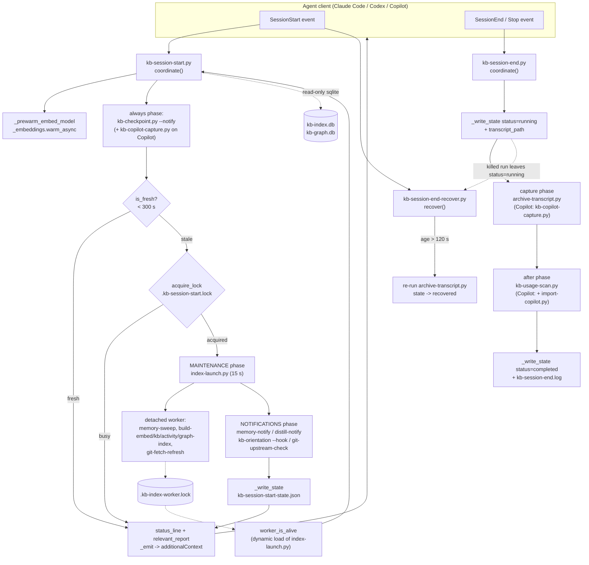
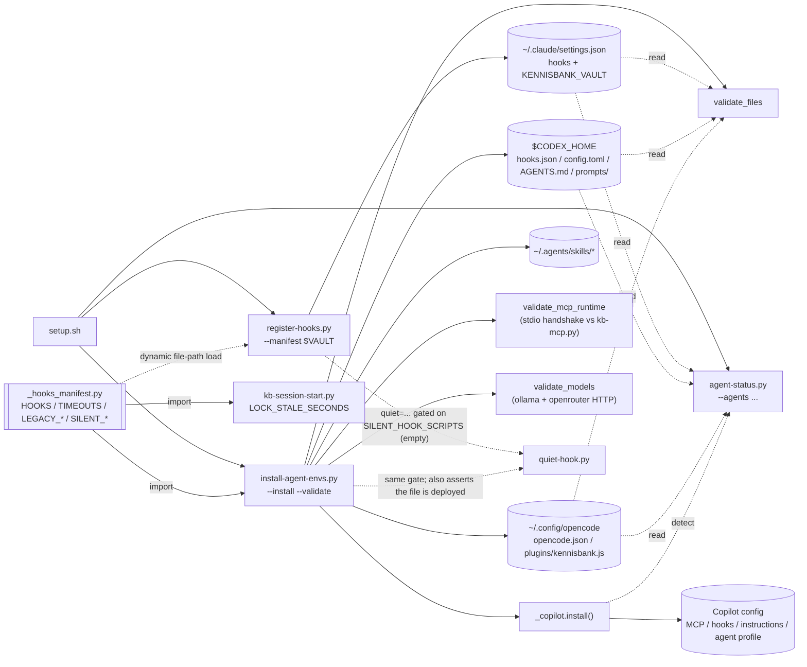

# C4 Code — `scripts/` group: session lifecycle & installation

> Scope note: `scripts/` holds 86 files and is documented by several parallel
> agents. **This file documents only the 11 files listed under "Overview →
> Files in scope".** Every other script in `scripts/` is covered elsewhere; where
> such a script appears here it is named only as a dependency (a child process,
> an imported helper module) and is deliberately *not* documented element by
> element.

---

## 1. Overview

| Field | Value |
| --- | --- |
| **Name** | Session lifecycle & installation layer |
| **Location** | `scripts/` (repo-relative). At runtime the same files live in the deployed copy at `$VAULT/.claude/scripts/`. |
| **Language** | Python 3.10+ (`from __future__ import annotations` everywhere; `tomllib` guarded for 3.10), stdlib only |
| **Purpose** | Own the two ends of an agent session — orientation/maintenance at **SessionStart** and capture/telemetry at **SessionEnd** — plus the installation machinery that wires those hooks into each agent client (Claude Code, Codex, OpenCode, GitHub Copilot CLI). |

### What this group is

LLmWiki-KennisBank is a **distribution**, not a running service. `setup.sh`
copies `scripts/` into the user's Obsidian vault at `$VAULT/.claude/scripts/`
and everything executes from that copy. The files in this group therefore serve
two distinct roles:

1. **Hook coordinators** — one process per client hook event, each of which
   fans out to child scripts as subprocesses. These are the only KennisBank code
   an agent client ever invokes directly for session lifecycle.
2. **Installers/validators** — run once by `setup.sh` (or by the
   `kennisbank-upgrade` skill) to register those hooks and verify the deploy.

**Everything in this group fails open by design.** Each entry point wraps its
work in a bare `except` and returns `0`. A broken KennisBank must never block a
session from starting, a prompt from being answered, or an agent from shutting
down. That is a hard invariant, not a style preference, and it explains the
otherwise-unusual density of `try/except: pass` in the code below.

### Files in scope

| File | Role (one line) |
| --- | --- |
| `scripts/kb-session-start.py` | **SessionStart coordinator.** One hook process; runs checkpoint notice, freshness/lock gate, detached index maintenance, notification tier, and emits one aggregated `additionalContext` payload. |
| `scripts/kb-session-end.py` | **SessionEnd/Stop coordinator.** Deterministic capture phase, then parallel post-capture jobs; writes run state + a diagnostic log. Never writes to stdout on the routine path. |
| `scripts/kb-session-end-recover.py` | **SessionStart repair hook.** Detects a SessionEnd run that the client killed mid-flight (`status: running`) and re-runs the capture for the recorded transcript. |
| `scripts/kb-session-log.py` | Post-save mechanical follow-up for the `/sessielog` workflow: rebuild indexes, run notifications, report only what changed. CLI, not a hook. |
| `scripts/kb-orientation.py` | Compact "what lives in this vault" summary (pure SQL + a filename scan). Dual mode: plain-text CLI for `/sessiestart`, or gated `--hook` context injection. |
| `scripts/context-budget.py` | Progressive context budgets L0–L3 as JSON. **CLI only — not a hook.** Invoked from `commands/sessiestart.md:19`. |
| `scripts/quiet-hook.py` | Wrapper that runs another hook script and suppresses routine output. **Currently unreachable — see the note in §2.7.** |
| `scripts/register-hooks.py` | Idempotently registers the hook manifest into a Claude Code `settings.json`. Non-destructive, self-healing, refuses to touch invalid JSON. |
| `scripts/install-agent-envs.py` | Cross-agent installer + validator (Codex, OpenCode, Copilot; validation-only for Claude). 1159 lines, the largest file in the group. |
| `scripts/agent-status.py` | Renders the per-agent one-line status dashboard shown at the end of `setup.sh`. |
| `scripts/distill-notify.py` | Distillation watermark + SessionStart notice for archived transcripts that have not been distilled yet. |

Tests covering this group (for orientation; not documented here):
`tests/test_session_start.py`, `test_session_start_status.py`,
`test_session_end.py`, `test_session_end_recover.py`, `test_session_log.py`,
`test_orientation.py`, `test_context_budget.py`, `test_quiet_hook.py`,
`test_register_hooks.py`, `test_hooks_manifest.py`,
`test_agent_envs_install.py`, `test_agent_status.py`,
`test_distill_notify.py`.

---

## 2. Code Elements

### 2.0 Two cross-cutting facts worth knowing first

**A. Vault resolution splits into two camps (ADR-0002).**
All eleven files ultimately reach the vault through
`_vaultpath.vault_root()` (`scripts/_vaultpath.py:27`), which honours
`$KENNISBANK_VAULT` and falls back to `~/KennisBank`. But two files in this
group additionally **self-locate at import time**, as a module-level side effect
executed *before* `_vaultpath` is imported:

```python
os.environ.setdefault("KENNISBANK_VAULT", str(Path(__file__).resolve().parents[2]))
```

- `scripts/kb-orientation.py:28`
- `scripts/distill-notify.py:24`

`parents[2]` is only correct for the deployed layout
`$VAULT/.claude/scripts/<file>.py`. The four coordinators
(`kb-session-start.py`, `kb-session-end.py`, `kb-session-end-recover.py`,
`kb-session-log.py`) do **not** do this — they rely purely on the env var that
`register-hooks.register_manifest` writes into `settings.json`, or on the
`~/KennisBank` default. `install-agent-envs.py`, `register-hooks.py`,
`agent-status.py` and `context-budget.py` never call `vault_root()` at all
(the first three take the vault as an argument; `context-budget.py` calls
`vault_root()` in `main`).

**B. Hyphenated filenames force dynamic module loading.**
`index-launch.py` and `_hooks_manifest.py` cannot be reached with a plain
`import` from a hyphen-named script in every context, so two places load a
module **by file path** via `importlib.util.spec_from_file_location`:

- `kb-session-start.worker_is_alive` loads `index-launch.py`
  (`scripts/kb-session-start.py:280-284`) to borrow its `LOCK_NAME` and
  `is_stale()`.
- `register-hooks.register_manifest` loads `_hooks_manifest.py`
  (`scripts/register-hooks.py:174-179`).

Both are load-bearing for the "deployed copy" constraint: the loaded file must
sit next to the loader.

---

### 2.1 `scripts/kb-session-start.py` — SessionStart coordinator (502 lines)

Module docstring: *"Coordinate KennisBank SessionStart work behind one client
hook."* Registered for the `SessionStart` event by
`_hooks_manifest.HOOKS` with a 240 s declared ceiling.

#### Module constants

| Name | Value | Location |
| --- | --- | --- |
| `FRESHNESS_SECONDS` | `300` — a start within 5 min of the last completed cycle skips maintenance | `kb-session-start.py:28` |
| `LOCK_STALE_SECONDS` | `_hooks_manifest.timeout("kb-session-start.py")` → 240. Derived, not a loose literal, so an aborted cycle recovers within one declared ceiling | `kb-session-start.py:32` |
| `STATE_NAME` | `"kb-session-start-state.json"` | `kb-session-start.py:33` |
| `LOCK_NAME` | `".kb-session-start.lock"` | `kb-session-start.py:34` |
| `MAINTENANCE` | `(Job("index-launch.py", timeout=15),)` — indexing is **no longer blocking**; the launcher detaches a worker and returns (TASK-63) | `kb-session-start.py:58` |
| `NOTIFICATIONS` | `memory-notify.py` (30 s), `distill-notify.py` (30 s), `kb-orientation.py --hook` (15 s), `git-upstream-check.py` (15 s) | `kb-session-start.py:61` |
| `STATUS_BUDGET_MS` | `250` — documented ceiling for the status line; it is a *read*, not a computation | `kb-session-start.py:263` |

#### Data classes

```python
@dataclass(frozen=True)
class Job:
    script: str
    args: tuple[str, ...] = ()
    timeout: int = 180
```
`kb-session-start.py:37`

```python
@dataclass
class Result:
    script: str
    stdout: str = ""
    stderr: str = ""
    returncode: int = 0
    error: str = ""
```
`kb-session-start.py:44`

> **These are not shared classes.** `kb-session-end.py` and
> `kb-session-log.py` each define their *own* `Job`/`Result` with different
> fields and different default timeouts (30 / 180). See §2.2 and §2.4.

#### Functions

```python
def _vault() -> Path
```
`kb-session-start.py:75` — thin wrapper over `_vaultpath.vault_root()`.

```python
def _prewarm_embed_model(vault: Path) -> None
```
`kb-session-start.py:79` — inserts `$VAULT/.claude/scripts` on `sys.path`,
imports `_embeddings`, and calls `_embeddings.warm_async()`. Fires a **detached**
warm of the Ollama embedding model so the first prompt's `kb-retrieve.py` hook is
hot. Called from `main()`, deliberately *not* from `coordinate()`, so it is
independent of the freshness gate and never runs in unit tests that drive
`coordinate()` directly. Fully swallowed on error.
Depends on: `_embeddings.warm_async` (`scripts/_embeddings.py:190`).

```python
def _changed_count(text: str, pattern: str) -> int
```
`kb-session-start.py:99` — first regex capture group as `int`, else `0`.

```python
def _context_text(text: str) -> str
```
`kb-session-start.py:104` — unwraps a child hook's structured output: returns
`additionalContext`, or `hookSpecificOutput.additionalContext`, or the raw
stripped text when the payload is not JSON / not a dict.

```python
def relevant_report(result: Result) -> str
```
`kb-session-start.py:124` — **the noise filter.** Keeps changes, warnings and
failures; discards routine no-change output. Per-script rules: the three
`build-*-index.py` scripts are judged on their `(re)embedded` / `(re)indexed` /
`changed` / `removed` / `verwijderd` / `failed` counters; pure side-effect jobs
(`import-copilot.py`, `kb-copilot-capture.py`, `sweep-launch.py`,
`index-launch.py`) are relevant only on a non-zero exit; everything else is
relevant if it produced any output. Returns `""` when nothing is worth saying.
Depends on `_context_text`, `_changed_count`.

```python
def run_child(job: Job, scripts: Path, payload: bytes) -> Result
```
`kb-session-start.py:165` — `subprocess.run([sys.executable, scripts/job.script,
*job.args], input=payload, ...)` with `job.timeout`; captures both streams,
decodes UTF-8 with `errors="replace"`. Timeouts and `OSError` become a `Result`
with `error` set, never an exception.

```python
def run_parallel(
    jobs: tuple[Job, ...],
    scripts: Path,
    payload: bytes,
    runner: Callable[[Job, Path, bytes], Result] = run_child,
) -> list[Result]
```
`kb-session-start.py:187` — `ThreadPoolExecutor(max_workers=len(jobs))`;
results are returned in **declared order** even though execution is concurrent.
The injectable `runner` is what the tests substitute.

```python
def _read_state(path: Path) -> dict
```
`kb-session-start.py:201` — fail-soft JSON read, `{}` on any error.

```python
def is_fresh(state_path: Path, now: float | None = None) -> bool
```
`kb-session-start.py:209` — `now - state["completed_at"] < FRESHNESS_SECONDS`.

```python
def acquire_lock(path: Path, now: float | None = None) -> bool
```
`kb-session-start.py:217` — atomic `os.open(..., O_CREAT|O_EXCL|O_WRONLY)`.
On `FileExistsError` it reclaims the lock only when the age is **outside**
`0 <= age <= LOCK_STALE_SECONDS`; the `age < 0` branch exists specifically so a
clock change (mtime in the future) cannot park maintenance forever. Writes
`{"pid", "started_at"}` into the lock file.

```python
def _write_state(path: Path, client: str) -> None
```
`kb-session-start.py:241` — atomic temp-file + `os.replace`, PID-suffixed temp
name so concurrent writers cannot collide.

```python
def worker_is_alive(vault: Path) -> bool
```
`kb-session-start.py:266` — answers "is the background maintenance actually
running?" **Existence of the lock is deliberately not the answer** — a measured
case had a lock owned by PID 31772 while the live worker was 22552. Instead this
dynamically loads `index-launch.py` and reuses its own `LOCK_NAME` +
`is_stale()`, so there is exactly one definition of "expired".
Depends on: `scripts/index-launch.py:37` (`LOCK_NAME`), `:74` (`is_stale`).

```python
def status_line(vault: Path, *, worker_running: bool) -> str
```
`kb-session-start.py:291` — the one line that always appears. A pure
**reading** of state the previous background run left behind: maintenance
running yes/no; `count(*)` on `docs` in `kb-index.db` (suffixed `(bijwerken)`
while a worker runs, because the count is a snapshot of a table being filled);
graph freshness from `kb-graph.db`'s `meta.graph_fingerprint` compared against
`graphify-out/graph.json`'s `mtime:size`; and whether
`graphify-out/.needs-rebuild` is non-empty. All SQLite opens are read-only URIs
with `timeout=0.5`. Every part is independently fail-open, and the separator is
ASCII on purpose — a `·` (U+00B7) once produced a completely empty session start
with exit code 0.

```python
def _emit(client: str, report: str) -> None
```
`kb-session-start.py:375` — writes the client-native payload to stdout:
Claude gets `{"suppressOutput": true, "hookSpecificOutput": {...}}`, Copilot gets
`{"additionalContext": ...}`, everything else gets a flat variant.
`json.dumps` keeps the default `ensure_ascii=True` deliberately: this hook
relays *all* child output, and a single non-cp1252 character would raise
`UnicodeEncodeError` on Windows, which `main()` swallows — losing the whole
report without a trace.

```python
def coordinate(
    client: str,
    vault: Path,
    payload: bytes,
    *,
    runner: Callable[[Job, Path, bytes], Result] = run_child,
    now: float | None = None,
) -> str
```
`kb-session-start.py:405` — **the phase machine.** Order:

1. Parse `source` (`startup|resume|clear|compact|fork`) out of the hook payload.
2. **Always** run `kb-checkpoint.py --notify --source <source>` — *before* the
   freshness gate, because a `source=compact` start almost always lands inside
   300 s of the previous one and the notice would otherwise vanish exactly when
   it matters (TASK-79).
3. For `client == "copilot"`, always run `kb-copilot-capture.py --event
   sessionStart`.
4. Return early if `is_fresh(...)` or if `acquire_lock(...)` fails.
5. Copilot only: `import-copilot.py` (60 s).
6. `MAINTENANCE` phase → `NOTIFICATIONS` phase (sequential *between* phases so
   notifications observe completed maintenance state; concurrent *within* a
   phase).
7. `_write_state`, then release the lock in a `finally`.

Returns the newline-joined `relevant_report` of every result.

```python
def main(argv: list[str] | None = None) -> int
```
`kb-session-start.py:474` — `--client {claude,codex,copilot}` (default
`codex`), `parse_known_args` so an unknown flag from a client cannot break it.
Reads stdin as bytes, prewarms the embed model, runs `coordinate`, then prepends
`status_line(...)` — the status line goes **first and always appears**, because
without it a silent session start is indistinguishable from a broken one.
Everything is inside one `try/except: pass`; always returns `0`.

---

### 2.2 `scripts/kb-session-end.py` — SessionEnd coordinator (265 lines)

Registered for `SessionEnd` (Claude) / `Stop` (Codex) with a 90 s ceiling.
Routine output is **never** written to stdout: clients own their exit UI and a
hook cannot portably suppress it.

#### Module constants

`STATE_NAME = "kb-session-end-state.json"` (`:25`),
`LOG_NAME = "kb-session-end.log"` (`:26`),
`LOG_MAX_BYTES = 256 * 1024` (`:27`).

#### Data classes (independent of §2.1)

```python
@dataclass(frozen=True)
class Job:
    script: str
    args: tuple[str, ...] = ()
    timeout: int = 30          # note: 30, not 180
```
`kb-session-end.py:30`

```python
@dataclass
class Result:
    script: str
    returncode: int = 0
    stderr: str = ""
    error: str = ""
    duration: float = 0.0      # no stdout field; exit jobs discard stdout
```
`kb-session-end.py:37`

#### Functions

```python
def _vault() -> Path
```
`kb-session-end.py:46`

```python
def run_child(job: Job, scripts: Path, payload: bytes) -> Result
```
`kb-session-end.py:50` — same shape as §2.1 but `stdout=subprocess.DEVNULL`
and it times the run with `time.monotonic()`.

```python
def run_parallel(
    jobs: tuple[Job, ...],
    scripts: Path,
    payload: bytes,
    runner: Callable[[Job, Path, bytes], Result] = run_child,
) -> list[Result]
```
`kb-session-end.py:81`

```python
def _issue(result: Result) -> str
```
`kb-session-end.py:94` — turns a `Result` into an issue string. Note the third
branch: exit children are independently fail-open, so a real failure can arrive
on stderr **with** a zero exit code; that case is still reported.

```python
def _log(vault: Path, message: str) -> None
```
`kb-session-end.py:107` — appends one `<iso> pid=<n> <message>` line to
`$VAULT/.claude/kb-session-end.log`, truncating to the last 500 lines past
`LOG_MAX_BYTES`. Never raises. This log exists because a **cancelled** hook
writes no completion state and would otherwise leave no trace at all.

```python
def _transcript_path(payload: bytes) -> str
```
`kb-session-end.py:129` — best-effort `transcript_path` out of the hook
payload, persisted for later recovery.

```python
def _write_state(
    vault: Path,
    client: str,
    issues: list[str] | None = None,
    *,
    started_at: float | None = None,
    transcript_path: str = "",
) -> None
```
`kb-session-end.py:141` — **called twice.** With `issues=None` before any work
(writes `status: "running"` plus `pid` and `transcript_path`), and again on
completion (`status: "completed"`, `ok`, `issues`, `duration_s`). The
`running` record is precisely what `kb-session-end-recover.py` looks for.
Atomic temp + `os.replace`.

```python
def coordinate(
    client: str,
    vault: Path,
    payload: bytes,
    *,
    runner: Callable[[Job, Path, bytes], Result] = run_child,
) -> list[str]
```
`kb-session-end.py:192` — capture phase first, then independent post-capture
work:

| Client | capture | after |
| --- | --- | --- |
| `copilot` | `kb-copilot-capture.py --event sessionEnd` | `import-copilot.py --include-active` (60 s), `kb-usage-scan.py` |
| otherwise | `archive-transcript.py` | `kb-usage-scan.py` |

Logs a worst-case budget line, runs both phases, logs one line per job, and
returns the list of issues.

```python
def main(argv: list[str] | None = None) -> int
```
`kb-session-end.py:237` — `--client {claude,codex,copilot}` (default `codex`)
and `--diagnostic-json`, which is the *only* way this script writes to stdout.
Always returns `0`.

---

### 2.3 `scripts/kb-session-end-recover.py` — cancelled-exit repair (125 lines)

Registered as a **second** `SessionStart` hook (`_hooks_manifest.HOOKS`, 30 s).
It closes the loop that §2.2 opens: if the client killed the exit hook
("Hook cancelled"), the state stays `running` and the transcript was never
archived. A killed exit then costs at most a one-session delay instead of losing
the transcript.

`STATE_NAME` (`:26`) and `LOG_NAME` (`:27`) mirror §2.2 exactly — the two
scripts agree on the filenames by duplicated constant, not by shared module.
`MIN_AGE_SECONDS = 120` (`:29`) is the "do not race a run that may still be in
flight" guard.

```python
def _log(vault: Path, message: str) -> None
```
`kb-session-end-recover.py:32` — appends to the same
`kb-session-end.log`, tagged `recover`.

```python
def _read_state(path: Path) -> dict
```
`kb-session-end-recover.py:43`

```python
def recover(vault: Path, *, now: float | None = None) -> str | None
```
`kb-session-end-recover.py:51` — returns `None` unless the state says
`status == "running"` **and** it is at least `MIN_AGE_SECONDS` old. Then it
re-runs the client's capture script (`kb-copilot-capture.py` for Copilot,
otherwise `archive-transcript.py`) with a synthesised
`{"transcript_path": ...}` payload and a 30 s timeout. It rewrites the state to
`recovered` / `recovery-failed` **either way**, so a stale state is recovered at
most once. Returns a human-readable note.

```python
def main(argv: list[str] | None = None) -> int
```
`kb-session-end-recover.py:99` — `--client` (default `claude`) and
`--emit-context`; with the latter, a successful recovery is announced as
`SessionStart` `additionalContext`. Drains stdin, always returns `0`.

---

### 2.4 `scripts/kb-session-log.py` — `/sessielog` post-save follow-up (192 lines)

Not a hook. Called once by `commands/sessielog.md:167` after the agent has
written the semantic session log; see
`docs/adr/ADR-007-coordinate-session-logging-and-exit-work-behind-one-client-hook.md`.
The agent stays responsible for the *semantic* work; this helper does only the
mechanical follow-up.

#### Data classes (again independent)

```python
@dataclass(frozen=True)
class Job:
    script: str
    args: tuple[str, ...] = ()
    timeout: int = 180
```
`kb-session-log.py:24`

```python
@dataclass
class Result:
    script: str
    stdout: str = ""
    stderr: str = ""
    returncode: int = 0
    error: str = ""
```
`kb-session-log.py:31`

#### Job tiers

- `INDEX_JOBS` (`:40`): `build-karpathy-index.py --force`,
  `build-embed-index.py`, `build-kb-index.py`, `build-activity-index.py`,
  `sweep-launch.py` (30 s).
- `NOTIFICATION_JOBS` (`:47`): `memory-notify.py`, `distill-notify.py`
  (30 s each).

Note the asymmetry with §2.1: here the index builders run **blocking** (this is
not the hot path), whereas SessionStart delegates them to a detached worker.

#### Functions

```python
def _vault() -> Path
```
`kb-session-log.py:53`

```python
def run_child(job: Job, scripts: Path) -> Result
```
`kb-session-log.py:57` — **no `payload` parameter**: there is no hook stdin to
forward. This is the signature asymmetry with §2.1/§2.2.

```python
def run_parallel(
    jobs: tuple[Job, ...],
    scripts: Path,
    runner: Callable[[Job, Path], Result] = run_child,
) -> list[Result]
```
`kb-session-log.py:78`

```python
def _count(text: str, pattern: str) -> int
```
`kb-session-log.py:90` — same body as `_changed_count` in §2.1, different name.

```python
def _context_text(text: str) -> str
```
`kb-session-log.py:95` — duplicate of `kb-session-start._context_text`.

```python
def relevant_report(result: Result) -> str
```
`kb-session-log.py:114` — same idea as §2.1 with a smaller rule table
(`build-embed-index.py`, `build-kb-index.py`, `build-activity-index.py`,
`sweep-launch.py`).

```python
def _validate_session_log(vault: Path, value: str) -> Path
```
`kb-session-log.py:146` — **path containment guard.** Expands vars/user,
resolves, and raises `ValueError` unless the file exists *and*
`(vault / "01-raw" / "sessies").resolve()` is among its parents.

```python
def coordinate(
    vault: Path,
    session_log: str,
    *,
    runner: Callable[[Job, Path], Result] = run_child,
) -> str
```
`kb-session-log.py:154` — validate, run `INDEX_JOBS`, then
`NOTIFICATION_JOBS` (so notices observe completed indexes), return the joined
relevant report.

```python
def main(argv: list[str] | None = None) -> int
```
`kb-session-log.py:168` — `--session-log` (required), `--json`. On success
prints either the report or `"KennisBank session log indexed; no follow-up
action is needed."`. On failure it reports "follow-up skipped" and still
returns `0`: the semantic log is already saved, and mechanical follow-up must
not make the agent report the whole workflow as failed.

---

### 2.5 `scripts/kb-orientation.py` — vault orientation (162 lines)

Borrowed from Mind's `space_get` (TASK-80). Pure SQL reads plus a filename
scan — no embeddings, no LLM, sub-second by construction (measured 0.2 s on a
1305-document vault). Self-locates the vault at import (§2.0-A).

Constants: `RECENT_N = 5` (`:32`), `TRENDING_N = 3` (`:33`),
`TRENDING_WINDOW_DAYS = 14` (`:34`).

```python
def _ro(path: Path) -> sqlite3.Connection
```
`kb-orientation.py:37` — read-only URI connection with `timeout=0.5`. Uses
`path.as_posix()` because backslashes in a `file:` URI are edge-case-sensitive
on Windows (the same normalisation as `kb-recall.py` and `_activity.py`); a
missing `.as_posix()` here was the one real defect a pre-merge review caught.

```python
def index_lines(vault: Path) -> list[str]
```
`kb-orientation.py:43` — from `kb-index.db`: `count(*)` grouped by `layer`,
plus the `RECENT_N` most recently created `layer='wiki'` docs.

```python
def trending_lines(vault: Path) -> list[str]
```
`kb-orientation.py:71` — from `kb-usage.db`: the `TRENDING_N` most-used stems
whose `last_injected` falls inside the 14-day window.

```python
def backlog_lines(cwd: Path) -> list[str]
```
`kb-orientation.py:94` — scans `<cwd>/backlog/tasks/task-*.md` (first 2000
bytes each) for `status:` and counts `To Do` / `In Progress`. cwd-aware, so
orientation reflects the repository the session is actually in.

```python
def orientation(vault: Path, cwd: Path) -> str
```
`kb-orientation.py:117` — concatenates the three sources as `- ` bullets;
`""` when nothing is available.

```python
def main(argv: list[str] | None = None) -> int
```
`kb-orientation.py:124` — two modes. Bare: print the text (used by
`commands/sessiestart.md:46`). `--hook`: emit `SessionStart`
`additionalContext`, **gated on `_settings.get("orientation", False)`** — opt-in,
default off, and read fail-closed here (any exception ⇒ disabled). Always
returns `0`; the `__main__` block (`:157`) adds a second `except Exception:
sys.exit(0)` layer.

---

### 2.6 `scripts/context-budget.py` — progressive context layers (276 lines)

**Not a hook.** A standalone CLI that *emits* layered vault context as JSON;
invoked at level 1 from `commands/sessiestart.md:19`. It never prunes the live
window and never calls a compaction tool. Layers: L0 identity, L1 active,
L2 relevant (needs `--query`), L3 bodies — each a superset of the previous.

`_LAYERS = ["identity", "active", "relevant", "bodies"]` (`:38`).

```python
def select_layers(level: int, state: dict) -> dict
```
`context-budget.py:41` — the **pure core**: clamps `level` to 0..3 and returns
only the allowed keys present in `state`. No I/O, fully testable without a
vault.

```python
def _read_identity(vault: Path, lines: int = 40) -> str | None
```
`context-budget.py:69` — first 40 lines of `<vault>/CLAUDE.md`, or `None`.

```python
def _read_active(vault: Path) -> dict
```
`context-budget.py:81` — returns `{"recent_sessions": [...],
"status_counts": {...}, "open_loops": [...]}`: the 10 newest filenames in
`01-raw/sessies/`, `status:` label counts over the first 500 bytes of each
`02-wiki/*.md`, and a regex scan for `open-loop` in the 5 newest session logs
(items truncated to 80 chars, deduplicated). Fail-soft at every level.

```python
def _run_kb_search(query: str, top_n: int) -> list[dict]
```
`context-budget.py:151` — runs the sibling `kb-search.py <query> --top <n>` as
a subprocess (30 s) and parses its JSON stdout; `[]` on any failure.

```python
def _read_bodies(vault: Path, relevant: list[dict]) -> dict[str, str]
```
`context-budget.py:171` — reads the full text for each result `path`,
resolving relative paths against the vault.

```python
def assemble_state(level: int, vault: Path, query: str | None, top_n: int) -> dict
```
`context-budget.py:189` — assembles only what the level needs. L2/L3 require
a `query`; without one they are silently skipped.

```python
def _env_int(name: str, default: int) -> int
```
`context-budget.py:221`

```python
def _build_parser() -> argparse.ArgumentParser
```
`context-budget.py:229` — `--level` (default `$KB_CONTEXT_LEVEL`, else 1),
`--query`, `--top` (default `$KB_RETRIEVE_TOP_N`, else 3).

```python
def main(argv: list[str] | None = None) -> None
```
`context-budget.py:262` — **returns `None`, not `int`**, and the `__main__`
block calls `main()` bare (`:275-276`) rather than `raise SystemExit(main())`.
It is the only entry point in this group with that shape. Prints
`json.dumps(..., ensure_ascii=False, indent=2)`.

---

### 2.7 `scripts/quiet-hook.py` — output-suppressing hook wrapper (110 lines)

Runs another hook script with the original stdin payload, captures both
streams, and returns only meaningful changes/warnings as structured agent
context.

> **Status: wired but currently unreachable.**
> `_hooks_manifest.SILENT_HOOK_SCRIPTS` is `frozenset()`
> (`scripts/_hooks_manifest.py:53`), and both routing sites gate the wrapper on
> membership in that set — `register-hooks.build_command(..., quiet=...)`
> driven by `register-hooks.py:244`, and
> `install-agent-envs._codex_command` at `install-agent-envs.py:291`. So **no
> hook goes through `quiet-hook.py` with the current manifest**, while
> `install-agent-envs.validate_files` (`:623`) still asserts the file is
> deployed. The wrapper is retained as the mechanism; adding a basename to
> `SILENT_HOOK_SCRIPTS` re-activates it on the next `setup.sh` run.

```python
def _changed_count(text: str, pattern: str) -> int
```
`quiet-hook.py:18` — third copy of the same helper (§2.1, §2.4).

```python
def _relevant_report(script: str, stdout: str, stderr: str) -> str
```
`quiet-hook.py:23` — same counter-based relevance rules as §2.1, but takes
raw strings rather than a `Result`, and appends the "briefly report this to the
user" instruction to the context itself.

```python
def _emit_context(client: str, event: str, report: str) -> None
```
`quiet-hook.py:49` — per-client payload shape, identical policy to
`kb-session-start._emit` including the deliberate ASCII escaping.

```python
def main(argv: list[str] | None = None) -> int
```
`quiet-hook.py:72` — hand-rolled leading-option parsing (`--client`,
`--event`, defaults `codex` / `SessionStart`), then everything remaining is
executed as `[sys.executable, *args]` with the forwarded stdin payload. No
timeout is set here — the wrapped script's own client-level timeout governs.
Always returns `0`.

---

### 2.8 `scripts/register-hooks.py` — Claude `settings.json` registration (298 lines)

Called once by `setup.sh:409` as
`register-hooks.py "$CLAUDE_SETTINGS" --manifest "$VAULT"`. Design constraints
from the module docstring: stdlib only, non-destructive, idempotent,
self-healing, **refuses to write when the existing file is not valid JSON**, and
cross-platform.

```python
def interpreter() -> str
```
`register-hooks.py:37` — `"py -3"` on `os.name == "nt"`, else `"python3"`.
This is the interpreter convention for *hook* commands specifically.

```python
def build_command(
    script_path: str,
    interp: str | None = None,
    *,
    quiet: bool = False,
    event: str = "SessionStart",
) -> str
```
`register-hooks.py:45` — builds the quoted command string. The three
coordinators get an explicit client flag via a basename lookup table:
`kb-session-start.py`, `kb-session-end.py`, `kb-session-end-recover.py` →
`--client claude`. Otherwise, `quiet=True` routes through
`quiet-hook.py --client claude --event <event>` (see §2.7 for why that path is
currently unused), and the fallback is a bare `<interp> "<path>"`.

```python
def _existing_prefix(command: str) -> str | None
```
`register-hooks.py:70` — everything up to the first `"`, i.e. the existing
interpreter prefix, or `None`.

```python
def load_settings(path) -> dict
```
`register-hooks.py:77` — `{}` for missing/blank; raises `ValueError` for
content that is not a valid JSON **object**, so the caller can never clobber a
hand-edited config it failed to parse.

```python
def save_settings(path, settings: dict) -> None
```
`register-hooks.py:99` — `json.dumps(indent=2, ensure_ascii=False)` + newline.

```python
def ensure_hook(
    settings: dict,
    event: str,
    script_path: str,
    matcher=None,
    *,
    quiet: bool = False,
    timeout: int | None = None,
) -> bool
```
`register-hooks.py:105` — the idempotent core; returns `True` when it changed
anything. Matches on **basename**, and on a match it self-heals the *path* while
**preserving the existing interpreter prefix** (never rewriting `py -3` to
`python3`), self-heals a missing/stale `matcher`, strips any legacy
`statusMessage`, and **only fills in** `timeout` when absent — a user-set
ceiling is never overwritten, but an old registration without one does get the
declared budget on the next setup. On no match it appends a new group.

```python
def register_manifest(settings: dict, vault_root: str) -> bool
```
`register-hooks.py:172` — the `--manifest` path. Dynamically loads
`_hooks_manifest.py` (§2.0-B), then:

1. Pins `env["KENNISBANK_VAULT"] = vault_root`.
2. Prunes `hooks.SessionStart` of everything in
   `LEGACY_SESSION_START_SCRIPTS` and collapses duplicate
   `kb-session-start.py` entries to one.
3. Does the same for `hooks.SessionEnd` against
   `LEGACY_SESSION_END_SCRIPTS` / `kb-session-end.py`.
4. Calls `ensure_hook` for every `(event, script, matcher)` in
   `_hooks_manifest.hooks()`, against
   `f"{vault_root}/.claude/scripts/{script}"`, passing
   `quiet=script in SILENT_HOOK_SCRIPTS` and
   `timeout=_hooks_manifest.timeout(script)`.

```python
def main(argv=None) -> int
```
`register-hooks.py:251` — two usages: `<settings.json> --manifest
<vault_root>`, or `<settings.json> <EVENT> <script_path> [...]` pairs. Returns
`1` (leaving the file untouched) on invalid JSON, `2` on a usage error, `0`
otherwise.

#### Manifest it consumes — `scripts/_hooks_manifest.py`

Not part of this group's documentation duty, but the contract matters:

| Event | Script | Matcher | Declared timeout |
| --- | --- | --- | --- |
| `SessionStart` | `kb-session-start.py` | — | 240 s |
| `SessionStart` | `kb-session-end-recover.py` | — | 30 s |
| `UserPromptSubmit` | `kb-retrieve.py` | — | 30 s |
| `SessionEnd` | `kb-session-end.py` | — | 90 s |
| `PreToolUse` | `kb-presearch.py` | `WebSearch\|WebFetch` | 30 s |
| `PreCompact` | `kb-checkpoint.py` | — | 15 s |

(`_hooks_manifest.py:12-22`, `:35-43`. `PreCompact` is Claude-only —
`install-agent-envs.py` deliberately omits it, as Codex/Copilot have no
equivalent; their path is the `/checkpoint` command.)

---

### 2.9 `scripts/install-agent-envs.py` — cross-agent installer/validator (1159 lines)

The largest file in the group. `setup.sh` owns the vault scaffold and the
Claude deploy; this script owns the cross-agent layer. All generated client
config **pins `KENNISBANK_VAULT` explicitly**, so a non-default vault can never
silently fall back to `~/KennisBank` in another agent.

Constants: `AGENTS = ("claude", "codex", "opencode", "copilot")` (`:39`);
managed-block markers `KB_START`/`KB_END` (`:40-41`); `ROOT_COMMANDS` — 17
command stems with descriptions (`:43`); `NESTED_COMMAND_ALIASES` — three
`kennisbank/*` → flat-name aliases (`:62`); `MODEL_CHECK_TEXT` (`:68`);
`OPENROUTER_ENDPOINT` / `OPENROUTER_DEFAULT_MODEL` (`:69-70`).

#### Public surface — full signatures

```python
def install_codex(repo: Path, vault: Path) -> dict
```
`install-agent-envs.py:261` — installs shared skills + generated command
skills into `~/.agents/skills`, writes one prompt per command into
`$CODEX_HOME/prompts/`, replaces the managed block in `$CODEX_HOME/AGENTS.md`,
and ensures `hooks.json` and `config.toml`. Returns a report dict with
`skills`, `prompts`, `agents_md`, `hooks`, `mcp`.

```python
def install_opencode(repo: Path, vault: Path) -> dict
```
`install-agent-envs.py:478` — shared skills, one command file per command,
managed `AGENTS.md` block, the generated `plugins/kennisbank.js` Bun plugin, and
`opencode.json` (MCP + skill permissions). Returns `skills`, `commands`,
`agents_md`, `plugin`, `mcp`.

```python
def install_copilot(repo: Path, vault: Path) -> dict
```
`install-agent-envs.py:578` — installs skills, then delegates *all* config
mutation to the idempotent `_copilot.install(vault)` layer (ADR-0003 D1–D6):
MCP registration, hook migration, global instructions, custom agent profile.
Returns `skills`, `mcp`, `hooks`, `instructions`, `agent_profile`, `home`.

```python
def validate_files(repo: Path, vault: Path, agents: list[str]) -> list[str]
```
`install-agent-envs.py:617` — the big on-disk assertion pass; returns a list
of error strings (empty = pass). Always checks 10 deployed vault files
(including `quiet-hook.py:623` and `kb-session-start.py:624`). Per agent:
- **claude** (`:635`) — required commands and skills; `settings.json` must
  contain hooks for `kb-retrieve.py`, `kb-presearch.py`,
  `kb-session-start.py`, `kb-session-end.py`, plus `KENNISBANK_VAULT`; must
  contain **no** legacy SessionStart/SessionEnd scripts; must contain
  **exactly one** `kb-session-end.py`; must contain no `statusMessage`.
- **codex** (`:690`) — shared skills, prompt aliases, three config files,
  exactly one `[mcp_servers.kennisbank]` and one `[...env]` block, valid TOML
  (when `tomllib` is available), exactly one SessionStart and one exit
  coordinator, no legacy scripts.
- **opencode** (`:754`) — commands, `AGENTS.md`, plugin, `opencode.json`,
  and the presence of `kb-mcp.py`, `KennisBankPlugin` and the vault path.
- **copilot** (`:767`) — shared skills, `kb-copilot-capture.py`, then
  `_copilot.validate_config(vault)`.

```python
def validate_mcp_runtime(vault: Path, timeout: int = 15) -> list[str]
```
`install-agent-envs.py:783` — two-step live check. First `py -3 -c "import
mcp; import mcp.client.stdio; import mcp.server.fastmcp"`; on failure it returns
an error naming the exact `pip install mcp==1.28.1` remedy. Then it runs a
generated inline `anyio` client that does a real stdio handshake against
`kb-mcp.py` and asserts the tool set contains `recall`, `capture`,
`what_did_i_do`, `timeline`, `weeklog`, `topic_timeline`.

```python
def validate_models(vault: Path, timeout: int = 45) -> list[str]
```
`install-agent-envs.py:968` — the only **network-touching** code in this
group. `ollama list` / `ollama show <model>` as subprocesses; `POST
http://localhost:11434/api/embeddings` (must return a vector) and
`/api/generate` (must answer `OK`); and for the OpenRouter provider `POST
{endpoint}/chat/completions` with a bearer key resolved from env or the secrets
file.

```python
def configure_llm(
    vault: Path,
    provider: str,
    model: str | None = None,
    api_key_env: str = "OPENROUTER_API_KEY",
    api_key_value: str | None = None,
) -> dict
```
`install-agent-envs.py:912` — writes `$VAULT/.claude/kennisbank-llm.json` for
`ollama` (local endpoint, no key) or `openrouter` (endpoint + `api_key_env`,
optionally storing the key via `_write_user_secret`). Raises `ValueError` for an
unknown provider.

```python
def parse_agents(raw: str | None) -> list[str]
```
`install-agent-envs.py:1075` — `None` → `["claude", "codex"]`; accepts `,`
and `;`; `all` expands to `AGENTS`; unknown names raise `SystemExit`.

```python
def main(argv: list[str] | None = None) -> int
```
`install-agent-envs.py:1087` — flags: `--repo` (default the repo root),
`--vault` (**required**), `--agents` (default `claude,codex`), `--install`,
`--validate`, `--configure-llm`, `--llm-provider {ollama,openrouter}`,
`--llm-model`, `--llm-api-key-env`, `--skip-models`, `--json`. Returns `1` when
any validation error was collected, else `0`. Unlike the hook coordinators this
script **does** signal failure through its exit code — it runs during setup, not
during a session.

#### Helpers — summarized, not dropped

Named here explicitly so nothing is silently omitted:

- **Path/platform:** `_norm_path` (`:73`, converts Git-Bash `/d/Users/...` to
  `D:/Users/...` on Windows), `_posix` (`:83`), `_is_windows_like` (`:87`),
  `_agent_python_argv` (`:91`, `["py","-3"]` vs `["python3"]`),
  `_mcp_server_argv` (`:95`), `_shell_join` (`:99`, platform-correct quoting),
  `_home` (`:113`, `USERPROFILE`/`HOME`), `_codex_home` (`:118`, `$CODEX_HOME`
  with an empty-string guard so config never lands in the cwd),
  `_opencode_home` (`:126`).
- **File I/O:** `_read_text` (`:131`), `_write_text` (`:138`, mkdir + write),
  `_copytree` (`:143`), `_replace_block` (`:148`, the `KB_START`/`KB_END`
  managed-block substitution), `_json_file` (`:875`, fail-soft JSON read).
- **Content generation:** `_agent_block` (`:162`), `_command_sources` (`:183`),
  `_prompt_text` (`:196`), `_command_skill_text` (`:210`),
  `_install_shared_skills` (`:226`), `_install_command_skills` (`:240`, a
  hand-authored skill always wins over a generated one).
- **Codex config:** `_codex_command` (`:286`), `_hook_group` (`:305`),
  `_ensure_codex_hooks` (`:324`, prunes legacy + collapses duplicate
  coordinators for `SessionStart`/`Stop`, then upserts the four desired hooks
  with `_hooks_manifest.timeout` values), `_is_kennisbank_hook_command`
  (`:437`), `_toml_quote` (`:448`), `_ensure_codex_mcp` (`:452`, regex-replaces
  or appends the `[mcp_servers.kennisbank]` block).
- **OpenCode config:** `_write_opencode_plugin` (`:503`, generates a Bun
  plugin that runs the maintenance scripts on `session.idle` and the capture
  scripts on `session.updated`), `_ensure_opencode_config` (`:549`).
- **Misc:** `_hook_entries` (`:599`, generator flattening every hook entry in a
  settings dict), `_secrets_path` (`:885`), `_write_user_secret` (`:892`,
  chmod 0600 best-effort), `_read_user_secret` (`:904`), `_resolve_llm_config`
  (`:945`), `_resolve_embed_config` (`:959`).

---

### 2.10 `scripts/agent-status.py` — multi-agent status dashboard (135 lines)

TASK-26.13. Reads existing on-disk config as the source of truth and reuses
`_copilot` for Copilot detection; introduces no new runtime surface. Called by
`setup.sh:481`.

```python
def _home() -> Path
```
`agent-status.py:25` — delegates to `_copilot._home()` so home resolution
cannot drift between the two.

```python
def _read(path: Path) -> str
```
`agent-status.py:29` — `""` on any error.

```python
def _status_claude() -> dict
def _status_codex()  -> dict
def _status_opencode() -> dict
def _status_copilot() -> dict
```
`agent-status.py:36`, `:43`, `:53`, `:63` — one probe per agent, each
returning `{"agent", "configured", "mcp", "detail"}` (Copilot adds
`"installed"`). Claude is "configured" when `settings.json` mentions both
`kb-retrieve.py` and `KENNISBANK_VAULT`; Codex on `[mcp_servers.kennisbank]` in
`config.toml`; OpenCode on `"kennisbank"` + `"mcp"` in `opencode.json`; Copilot
via `_copilot.detect()`, which distinguishes installed-but-unregistered (an
actionable state) from not-installed.

```python
_DISPATCH: dict[str, Callable[[], dict]]
```
`agent-status.py:79`

```python
def collect(agents: list) -> dict
```
`agent-status.py:85` — `{"agents": [...], "configured": n, "total": n,
"mcp_agents": [...]}`.

```python
def render(report: dict) -> str
```
`agent-status.py:95` — ASCII marks only (`ok` / `!!` / `--`), because the
Windows cp1252 console cannot encode `✓`/`–` (ADR-0002).

```python
def _parse_agents(raw: str | None) -> list
```
`agent-status.py:111` — like `parse_agents` in §2.9 but **silently drops**
unknown names instead of raising; a status dashboard must not fail the setup.

```python
def main(argv=None) -> int
```
`agent-status.py:120` — `--agents` (default `all`), `--vault` (accepted for
call-site symmetry; unused), `--json`. Always returns `0`.

---

### 2.11 `scripts/distill-notify.py` — distillation watermark + notice (130 lines)

Three modes in one script. Self-locates the vault at import (§2.0-A).
`WATERMARK_NAME = ".distilled"` (`:28`).

```python
def _transcripts_dir(vault: Path) -> Path
```
`distill-notify.py:31` — `<vault>/01-raw/transcripts`.

```python
def _read_watermark(vault: Path) -> set[str]
```
`distill-notify.py:35` — the set of already-distilled stems; `set()` on error.

```python
def _all_stems(vault: Path) -> list[str]
```
`distill-notify.py:43` — sorted stems of `*.jsonl` in the transcripts dir.

```python
def pending(vault: Path) -> list[str]
```
`distill-notify.py:50` — all stems minus the watermark.

```python
def mark(vault: Path, stems: list[str]) -> int
```
`distill-notify.py:55` — **appends exactly the given stems** (deduplicated) to
`.distilled` and returns how many were new. Deliberately never marks the whole
directory, so a transcript that arrives while `/wiki` is running cannot be
falsely recorded as distilled.

```python
def _emit_notify(count: int) -> None
```
`distill-notify.py:74` — emits the `SessionStart` `additionalContext` notice
pointing at `/destilleer`; no-op when `count <= 0`.

```python
def main() -> int
```
`distill-notify.py:88` — **note the signature: no `argv` parameter.** It reads
`sys.argv[1:]` directly, unlike every other `main` in this group. Drains stdin,
then dispatches: `--mark <stem...>` (called by `commands/destilleer.md:69`),
`--list-pending` (called by `commands/destilleer.md:18`), or the default
notification path. Only the **notification** path is gated on
`_settings.get("distill_notify", True)`, fail-**open** (default `True`), so
`/destilleer` keeps working when the notice is switched off. The `__main__`
block (`:123`) adds a second fail-open layer.

---

## 3. Dependencies

### 3.1 Internal — imported Python modules

| Module | Used by | What is used |
| --- | --- | --- |
| `scripts/_vaultpath.py` | `kb-session-start`, `kb-session-end`, `kb-session-end-recover`, `kb-session-log`, `kb-orientation`, `context-budget`, `distill-notify` | `vault_root()` (`:27`) — the only sanctioned way to find the vault (ADR-0002) |
| `scripts/_hooks_manifest.py` | `kb-session-start` (`import`, for `timeout()`), `install-agent-envs` (`import`), `register-hooks` (**dynamic file-path load**) | `HOOKS`, `TIMEOUTS`, `timeout()`, `hooks()`, `SILENT_HOOK_SCRIPTS`, `LEGACY_SESSION_START_SCRIPTS`, `LEGACY_SESSION_END_SCRIPTS` |
| `scripts/_settings.py` | `kb-orientation` (`orientation`, default `False`), `distill-notify` (`distill_notify`, default `True`) | `get(key, default)` (`:84`) over `$VAULT/kennisbank-settings.json` |
| `scripts/_copilot.py` | `install-agent-envs`, `agent-status` | `install()`, `validate_config()`, `detect()`, `_home()`, `_norm_path()` (ADR-0003) |
| `scripts/_embeddings.py` | `kb-session-start._prewarm_embed_model` | `warm_async()` (`:190`) — detached, sentinel-guarded model warm |
| `scripts/index-launch.py` | `kb-session-start.worker_is_alive` (**dynamic file-path load**) | `LOCK_NAME` (`:37`), `is_stale()` (`:74`), and by implication `STALE_SEC` |

### 3.2 Internal — child processes spawned by name

Always as `[sys.executable, <scripts_dir>/<name>, *args]`. None of these are
imported; each is a separate fail-open process.

- From `kb-session-start.coordinate`: `kb-checkpoint.py`,
  `kb-copilot-capture.py`, `import-copilot.py`, `index-launch.py`,
  `memory-notify.py`, `distill-notify.py`, `kb-orientation.py`,
  `git-upstream-check.py`.
- From `kb-session-end.coordinate`: `archive-transcript.py`,
  `kb-copilot-capture.py`, `import-copilot.py`, `kb-usage-scan.py`.
- From `kb-session-end-recover.recover`: `archive-transcript.py` or
  `kb-copilot-capture.py`.
- From `kb-session-log.coordinate`: `build-karpathy-index.py`,
  `build-embed-index.py`, `build-kb-index.py`, `build-activity-index.py`,
  `sweep-launch.py`, `memory-notify.py`, `distill-notify.py`.
- From `context-budget._run_kb_search`: `kb-search.py`.
- From `quiet-hook.main`: whatever script path it is handed.
- Referenced (not executed) by the installers: `kb-mcp.py`, `kb-retrieve.py`,
  `kb-presearch.py`, `quiet-hook.py`, `kb-activity.py`,
  `kb-activity-eval.py`, `build-activity-index.py`.
- `install-agent-envs.validate_mcp_runtime` additionally spawns the agent
  interpreter (`py -3` / `python3`) with generated inline code, and
  `validate_models` spawns the `ollama` CLI.

### 3.3 External — libraries

**Standard library only, in every file of this group.** `argparse`,
`concurrent.futures`, `dataclasses`, `importlib.util`, `json`, `os`, `re`,
`shlex`, `shutil`, `sqlite3`, `subprocess`, `sys`, `tempfile` (via
`_settings`), `time`, `urllib.request`, `pathlib`, `typing`, `datetime`.

Two conditional cases:
- `tomllib` — `install-agent-envs.py:29-32`, set to `None` on Python 3.10;
  TOML validation is then skipped rather than failing.
- `mcp==1.28.1` — **checked for, never imported by this group.**
  `validate_mcp_runtime` shells out to the agent interpreter to verify it and
  prints the exact `pip install` command when missing.

### 3.4 External — SQLite databases (all opened read-only)

| Database | Opened by | Read |
| --- | --- | --- |
| `$VAULT/.claude/kb-index.db` | `kb-session-start.status_line` (`:308`), `kb-orientation.index_lines` (`:46`) | `count(*) FROM docs`; `layer` counts; recent `layer='wiki'` docs |
| `$VAULT/.claude/kb-usage.db` | `kb-orientation.trending_lines` (`:73`) | `usage` — most-used stems in the 14-day window |
| `$VAULT/.claude/kb-graph.db` | `kb-session-start.status_line` (`:334`) | `meta.graph_fingerprint` |

`kb-activity.db` is **not** touched by this group. All connections use the
`file:...?mode=ro` URI form with `timeout=0.5`; `kb-orientation._ro` additionally
normalises with `.as_posix()` for Windows.

### 3.5 External — HTTP and CLI services

| Endpoint / service | Caller | Note |
| --- | --- | --- |
| `http://localhost:11434/api/embeddings` | `install-agent-envs.validate_models` (`:1019`) | Ollama embedding smoke test |
| `http://localhost:11434/api/generate` | `install-agent-envs.validate_models` (`:1032`) | Ollama generation smoke test; must answer `OK` |
| `https://openrouter.ai/api/v1/chat/completions` | `install-agent-envs.validate_models` (`:1057`) | Only when the `openrouter` provider is configured |
| Ollama HTTP (indirect) | `kb-session-start._prewarm_embed_model` | Detached, via `_embeddings.warm_async()`; no direct HTTP in this group |
| `ollama` CLI | `install-agent-envs.validate_models` (`:999`, `:977`) | `ollama list`, `ollama show <model>` |
| `git` (indirect) | `kb-session-start` → `git-upstream-check.py` child | Never invoked directly here |

**No hook path in this group makes a blocking network call.** Every HTTP call
above lives in setup-time validation.

### 3.6 State files, locks and logs

| Path | Written by | Read by | Purpose |
| --- | --- | --- | --- |
| `$VAULT/.claude/kb-session-start-state.json` | `kb-session-start._write_state` | `kb-session-start.is_fresh` | 300 s freshness gate |
| `$VAULT/.claude/.kb-session-start.lock` | `kb-session-start.acquire_lock` | same | one maintenance cycle at a time; stale after 240 s |
| `$VAULT/.claude/kb-session-end-state.json` | `kb-session-end._write_state` | `kb-session-end-recover.recover` | `running` → `completed`/`recovered`/`recovery-failed` |
| `$VAULT/.claude/kb-session-end.log` | `kb-session-end._log`, `kb-session-end-recover._log` | humans | rotates past 256 KiB to the last 500 lines |
| `$VAULT/.claude/.kb-index-worker.lock` | `index-launch.py` | `kb-session-start.worker_is_alive` | "is the detached worker alive?" |
| `$VAULT/graphify-out/graph.json` | graphify pipeline | `kb-session-start.status_line` | `mtime:size` fingerprint source |
| `$VAULT/graphify-out/.needs-rebuild` | graphify pipeline | `kb-session-start.status_line` | non-empty ⇒ "graaf-rebuild staat klaar" |
| `$VAULT/01-raw/transcripts/.distilled` | `distill-notify.mark` | `distill-notify.pending` | append-only distillation watermark |
| `$VAULT/kennisbank-settings.json` | `/kennisbank:settings`, `_settings.set` | `kb-orientation`, `distill-notify` | opt-in/opt-out toggles |
| `~/.claude/settings.json` | `register-hooks.save_settings` | `install-agent-envs.validate_files`, `agent-status._status_claude` | Claude hook registration + `KENNISBANK_VAULT` |
| `$CODEX_HOME/{hooks.json,config.toml,AGENTS.md}` | `install-agent-envs.install_codex` | `validate_files`, `agent-status._status_codex` | Codex integration |
| `~/.config/opencode/{opencode.json,plugins/kennisbank.js,AGENTS.md}` | `install-agent-envs.install_opencode` | `validate_files`, `agent-status._status_opencode` | OpenCode integration |
| `~/.config/kennisbank/secrets.json` | `install-agent-envs._write_user_secret` | `_read_user_secret` | OpenRouter key, chmod 0600 best-effort |

---

## 4. Relationships

### 4.1 Runtime — the two session edges



The dotted edge from `_write_state status=running` to
`kb-session-end-recover.py` is the relationship worth the diagram: the two
scripts never call each other and share no module — they communicate purely
through `kb-session-end-state.json`, and each duplicates the filename as its own
constant.

### 4.2 Install time — how the hooks get registered



### 4.3 CLI-only members

`context-budget.py` and the plain-text mode of `kb-orientation.py` are invoked
from `commands/sessiestart.md` (lines 19 and 46). `kb-session-log.py` is invoked
from `commands/sessielog.md:167`. `distill-notify.py --list-pending` /
`--mark` are invoked from `commands/destilleer.md` (lines 18 and 69). None of
these four call paths goes through a client hook.

---

## 5. Notable design facts (verified in code)

1. **Indexing is off the hot path.** `MAINTENANCE` holds one job with a 15 s
   ceiling; `index-launch.py` takes a lock, spawns a detached worker and returns.
   The comment at `kb-session-start.py:53-57` records the measurement: the
   blocking part of SessionStart fell from ~210 s (Claude/Codex) and ~300 s
   (Copilot) to a few seconds.
2. **The checkpoint notice bypasses the freshness gate on purpose.** A
   `source=compact` SessionStart almost always lands within 300 s of the
   previous one, so a gated notice would vanish exactly when it is needed
   (`kb-session-start.py:430-433`, TASK-79).
3. **Two independent guards against silent Windows failure.**
   `json.dumps` keeps `ensure_ascii=True` in `_emit`, *and* `status_line`
   restricts itself to ASCII separators — a single `·` once produced an empty
   session start with exit code 0 (`kb-session-start.py:367-372`).
4. **"Lock exists" is never treated as "worker alive."** `worker_is_alive`
   borrows `index-launch.is_stale()` rather than inventing a second expiry rule,
   after an orphaned lock (PID 31772 vs. live worker 22552) made the status line
   lie (`kb-session-start.py:266-288`).
5. **Clock-skew clauses are deliberate.** Both `kb-session-start.acquire_lock`
   (`:228`) and `index-launch.is_stale` (`:74-84`) treat a future mtime as
   stale; without that a single clock change would park maintenance forever.
6. **`register-hooks` preserves what the user chose.** It refreshes stale paths
   but keeps the existing interpreter prefix, and it *fills in* a missing
   `timeout` without ever overwriting a user-set one
   (`register-hooks.py:135-160`).
7. **`quiet-hook.py` is currently unreachable** because
   `SILENT_HOOK_SCRIPTS` is empty, yet `validate_files` still requires it on
   disk. Stated here rather than glossed over: the file is deployed and
   validated, the routing gate is currently empty, and adding a basename to
   `SILENT_HOOK_SCRIPTS` re-activates it on the next `setup.sh` run.
8. **Exit-code policy splits along the hook/CLI line.** Every hook coordinator
   returns `0` unconditionally. `install-agent-envs.main` returns `1` on
   validation errors and `register-hooks.main` returns `1`/`2` on bad
   input — they run during setup, where a silent success would be worse than a
   loud failure.
