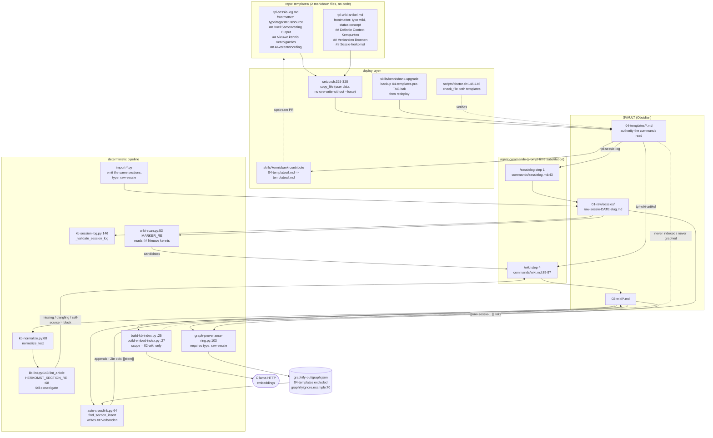

# C4 Code — `templates/`

## 1. Overview

| Field | Value |
|---|---|
| **Name** | KennisBank vault templates |
| **Location** | `templates/` (repo-relative) |
| **Files** | 2: `templates/tpl-sessie-log.md`, `templates/tpl-wiki-artikel.md` |
| **Language(s)** | Markdown with YAML frontmatter. **No executable code** — zero Python, zero shell, zero JS. The only "syntax" is `{{placeholder}}` tokens and HTML comments used as author instructions. |
| **Deploy target** | `$VAULT/04-templates/` (copied by `setup.sh:325-328`) |
| **Purpose** | Define the *canonical shape* of the two markdown artefact types the whole KennisBank pipeline reads and writes: the raw session log (`01-raw/sessies/raw-sessie-*.md`) and the compiled wiki article (`02-wiki/*.md`). They are the human/agent-facing contract for the frontmatter keys and the `##` section headings that downstream scripts parse. |

### What kind of directory this is

This is **not** a code directory and not vendored third-party code. It contains
two hand-written markdown skeletons that are *data*, deployed into the user's
Obsidian vault as user-editable files. Consequently:

- There are **no functions, classes or methods to document inside `templates/`**.
  Section 2 therefore documents (a) each template's *contract elements*
  (frontmatter keys, placeholders, sections) and (b) the full signatures of the
  code elsewhere in the repo that produces or consumes that contract, with
  `file:line` for each. Nothing in `templates/` was summarized away — both files
  are documented line by line below.
- Placeholders are **substituted by the agent at prompt time, not by a script**.
  Confirmed by `OBSIDIAN.md:122`: *"The existing templates use `{{date}}` and
  `{{onderwerp}}` placeholders written for Claude's prompt-time substitution."*
  A repo-wide grep for `{{date}}`/`{{onderwerp}}`/`{{tags}}`/`{{kernpunt}}`/`{{sessie}}`
  outside `templates/` returns only that one documentation line — there is no
  templating engine, no `str.replace` pass, no Jinja.
- Template body language is **Dutch**, matching the deployed command layer
  (`commands/sessielog.md`, `commands/wiki.md`). The English-first policy in
  `CLAUDE.md` governs repo documentation; these files are vault-facing content
  whose section names are a parsing contract shared with Dutch-named regexes
  such as `HERKOMST_SECTION_RE` (`scripts/kb-lint.py:68-69`), so renaming them
  is a breaking change, not a translation.

---

## 2. Code Elements

### 2.1 `templates/tpl-sessie-log.md` — raw session log skeleton

**Role:** the shape `/sessielog` step 1 fills in when writing
`$VAULT/01-raw/sessies/raw-sessie-YYYY-MM-DD-<slug>.md`. This is the *provenance
root* of the system: every wiki article must eventually link back to a file of
this shape or `kb-lint.py` fails it.

**Frontmatter contract** (`templates/tpl-sessie-log.md:1-9`):

| Key | Literal in template | Line | Consumed by |
|---|---|---|---|
| `title` | `"Sessie-log {{date}}"` | :2 | `scripts/graph-provenance-ring.py:105` (`meta.get("title")`, falls back to file stem) |
| `type` | `raw` | :3 | See the **type mismatch** note below |
| `tags` | `[claude-sessie]` | :4 | Same tag literal is emitted by the importers, e.g. `scripts/import-cc-history.py:162`, `scripts/import-claudeai-export.py:144` |
| `status` | `afgerond` | :5 | **Fourth status vocabulary** — see the status note below |
| `created` / `updated` | `{{date}}` | :6-7 | Agent-substituted; not parsed by the pipeline for session logs |
| `source` | `claude-sessie` | :8 | Distinct from `source_path`, which is what `graph-provenance-ring.py:107` actually reads to find the transcript basename |

**Section contract** (`templates/tpl-sessie-log.md:11-34`) — heading text is the
parsing surface:

| Section | Line | Purpose per the inline comment | Consumed by |
|---|---|---|---|
| `# Sessie-log {{date}}` | :11 | H1 title | — |
| `## Doel` | :13 | session goal | Emitted identically by all three importers: `scripts/import-cc-history.py:188`, `scripts/import-chatgpt-export.py:195`, `scripts/import-claudeai-export.py:175` |
| `## Samenvatting` | :16 | 3-5 factual sentences | `import-cc-history.py:191`, `import-chatgpt-export.py:198`, `import-claudeai-export.py:178` |
| `## Output` | :19-21 | files/products delivered, linked | — (no script parser) |
| `## Nieuwe kennis` | :23-25 | broadly reusable knowledge; wiki candidates | `import-cc-history.py:196`, `import-chatgpt-export.py:201`, `import-claudeai-export.py:184`. `commands/sessielog.md:52` requires candidates be marked `wiki-kandidaat: [onderwerp]`, which `scripts/wiki-scan.py:53` matches with `MARKER_RE` |
| `## Vervolgacties` | :27-29 | open items as checkboxes | `import-cc-history.py:199`, `import-chatgpt-export.py:204`, `import-claudeai-export.py:187` |
| `## AI-verantwoording` | :31-34 | tools/skills used, human input | `import-cc-history.py:201`, `import-chatgpt-export.py:206`, `import-claudeai-export.py:189` |

**Verified discrepancy #1 — `status:` has four disjoint vocabularies.**
The `status` field means something different in every producer, and no single
allowlist covers them:

| Value | Written by | Line |
|---|---|---|
| `afgerond` | `tpl-sessie-log.md` | :5 |
| `raw` | `scripts/import-folder.py`, `scripts/_liteparse.py` | :207, :213 |
| `concept` | `tpl-wiki-artikel.md` | :5 |
| `actief` / `concept` / `stabiel` / `archief` | documented wiki vocabulary | `vault-structure/README.md:59-63` |
| `current` / `unverified` | memory layer allowlists | `scripts/_maintenance.py:25` (`statuses=("current",)`), `:145` (`OPEN_STATUSES`) |

The only two scripts that filter on frontmatter `status`
(`scripts/_maintenance.py:48, 166` and `scripts/graph-scope-prune.py:48`) are
both scoped to `09-memory` (`_maintenance.py:39 mdir = vault_root() / "09-memory"`;
`graph-scope-prune.py:58-60` only prunes nodes whose `source_file` starts with
`MEMORY_DIR`). So `afgerond` on a session log is read by **nothing** in
`scripts/`, and it is also absent from the documented wiki vocabulary. A
repo-wide grep for the literal `afgerond` outside `templates/`, `CHANGELOG.md`,
`backlog/` and `docs/` hits only `commands/destilleer.md:64` (prose) and
`scripts/_activity.py:45`, where it is one alternative in a *free-text* keyword
regex for activity extraction — not a frontmatter read. Stated as a grep result:
the value is inert metadata, presumably for Obsidian/Dataview.

**Verified discrepancy #2 — `type: raw` vs `type: raw-sessie`.**
The template writes `type: raw` (`templates/tpl-sessie-log.md:3`), but
`scripts/graph-provenance-ring.py:103` hard-filters:

```python
if str(meta.get("type") or "").strip() != "raw-sessie":
    continue
```

and all four importers write `type: raw-sessie`
(`scripts/import-cc-history.py:154`, `scripts/import-chatgpt-export.py:162`,
`scripts/import-claudeai-export.py:136`, `scripts/import-folder.py:198`).
No normalizer bridges the two: `scripts/kb-normalize.py` only touches wikilinks,
backslashes and the `tags:` line (`normalize_link_inner` :39, `normalize_body`
:53, `normalize_tags_line` :57, `normalize_text` :68), and grepping
`scripts/_migrations.py` and `scripts/_provenance.py` for `raw-sessie` finds no
type rewrite.

Two further checks on how strong this claim can be made:

- `commands/sessielog.md` **never restates the frontmatter**. Grepping it for
  `type:` returns only the filename convention at `:38` and a generic "YAML
  frontmatter compleet" at `:83`; line `:43` just says *"Gebruik ... als basis."*
  So there is no command-level instruction that would override `type: raw`, and
  a `grep -rn "type: raw"` across `commands/`, `skills/` and `adapters/` returns
  nothing at all.
- Test fixtures use `raw-sessie`: `tests/test_frontmatter.py:60`
  (`type: raw-sessie\nstatus: raw`) and `tests/test_import_chatgpt.py:100`
  (`assertIn("type: raw-sessie", body)`) — but both exercise the *importer*
  path, not the template path.

**Consequence — inferred, not measured.** The filter at :103 is confirmed by
reading it; what a real `/sessielog` run writes is not, because no deployed vault
was available here and the substitution happens in the agent, not in code. If the
agent copies the frontmatter block as the command implies, template-authored
session logs are skipped by the provenance ring while imported ones are
included. Verify by grepping actual `$VAULT/01-raw/sessies/*.md` for `^type:`
before treating it as a defect. `kb-lint.py` is unaffected either way — it
resolves provenance on file *stem* (`SESSION_PREFIX = "raw-sessie-"`,
`scripts/kb-lint.py:48`; `collect_session_stems`, :95), never on `type`. I did
not change any file to fix this.

### 2.2 `templates/tpl-wiki-artikel.md` — compiled wiki article skeleton

**Role:** the shape `/wiki` step 4 and `/sessielog` step 2 fill in when writing
`$VAULT/02-wiki/<slug>.md`. This is the only directory that
`build-kb-index.py` and `build-embed-index.py` index, so this template defines
the retrievable unit of knowledge.

**Frontmatter contract** (`templates/tpl-wiki-artikel.md:1-9`):

| Key | Literal in template | Line | Notes / consumer |
|---|---|---|---|
| `title` | `"{{onderwerp}}"` | :2 | Agent-substituted |
| `type` | `wiki` | :3 | Required by `commands/wiki.md:85` (`YAML frontmatter: type: wiki, tags, status, created, updated`) |
| `tags` | `[{{tags}}]` | :4 | List form; `scripts/kb-normalize.py:57 normalize_tags_line` converts a bare tags line into this list form |
| `status` | `concept` | :5 | Deliberate default, matching `commands/wiki.md:152` ("Bij twijfel: status: concept"). `CHANGELOG.md:1030` records the change from `actief` to `concept`. Allowed values documented in `vault-structure/README.md:59-63`: `actief`, `concept`, `stabiel`, `archief` |
| `created` / `updated` | `{{date}}` | :6-7 | `commands/wiki.md:57-59`: on rewrite, copy the frontmatter block verbatim and change **only** `updated` |
| `author` | `claude` | :8 | Provenance-of-authorship marker |

**Section contract** (`templates/tpl-wiki-artikel.md:11-39`):

| Section | Line | Purpose per the inline comment | Consumed by |
|---|---|---|---|
| `# {{onderwerp}}` | :11 | H1 title | — |
| `## Definitie` | :13-14 | 2-3 sentences: what is this | — (prose) |
| `## Context` | :16-17 | why relevant, background | — (prose) |
| `## Kernpunten` | :19-20 | key facts in prose, not an essay | `commands/wiki.md:87`; each kernpunt needs a matching `## Sessie-herkomst` line |
| `## Verbanden` | :22-25 | links to related wiki articles, seeded with `- Zie ook: [[]]` / `- Gerelateerd project: [[]]` | **Machine-written section.** `scripts/auto-crosslink.py:64 find_section_insert` locates `^## Verbanden$`, appends `- Zie ook: [[stem]] -- <relation>` lines, and *creates* the section immediately before `## Sessie-herkomst` when absent (`auto-crosslink.py:76-101`, insertion at :190-196) |
| `## Bronnen` | :27-29 | **external** sources only (APA7); session refs explicitly forbidden here | `commands/wiki.md:97` restates the rule. No script enforces it |
| `## Sessie-herkomst` | :31-39 | per kernpunt, mandatory format `- <kernpunt>: [[raw-sessie-YYYY-MM-DD-slug]]`; the comment states verbatim that `kb-lint.py` validates it | **The load-bearing section.** `scripts/kb-lint.py:68-69 HERKOMST_SECTION_RE` scopes self-source detection to exactly this heading; `lint_article` (:143) classifies `missing` / `dangling` / `path-only` / `self-source` |

**Why the two rules in that last comment exist, traced to code:**

1. *"Altijd een wikilink, nooit een backtick-pad"* (`:34-36`) →
   `scripts/kb-lint.py:74-75 PATH_REF_RE` matches `01-raw/sessies/raw-sessie-*`
   text **after** all wikilinks are stripped (`kb-lint.py:165-166`), producing a
   `path-only` finding (`:191-196`). Advisory, not in `HARD_TYPES`.
2. *"Komt het artikel uit een import (geen sessie), link dan de bron:
   `[[05-bronnen/pad/naar/bron.md]]`"* (`:37-38`) →
   `scripts/kb-lint.py:122 resolving_bron_links` accepts those as valid
   provenance; commit `85fd310` added exactly this capability.

Additionally, `scripts/kb-lint.py:65 SELF_SOURCE_PREFIXES =
("02-wiki/", "09-memory/", ".claude/", "06-claude/")` means a link to another
wiki article placed **inside** `## Sessie-herkomst` is a hard `self-source`
failure, while the same link inside `## Verbanden` is fine — which is precisely
why the template keeps these two sections separate.

### 2.3 Consuming and producing code — full signatures

No element below lives in `templates/`; they are the code that reads or writes
the contract the templates define.

**Completeness statement (per the task's no-silent-drop rule):** for
`kb-lint.py`, `auto-crosslink.py`, `kb-normalize.py`, `graph-provenance-ring.py`
and `wiki-scan.py`, **every** `^def` in the file is listed below — nothing was
summarized away, private helpers included. The single exception is
`kb-session-log.py`, where six functions unrelated to the template contract are
named but not expanded; they are called out explicitly in that group.

**`setup.sh` — deployment (the only writer of `templates/` → vault)**

```sh
copy_file()   # $1 = src, $2 = dst; returns 0. setup.sh:148-157
copy_force()  # $1 = src, $2 = dst; always overwrites.  setup.sh:161-164
```

- `setup.sh:176` creates `$VAULT/04-templates` (inside one `mkdir -p` brace
  expansion with the other `NN-*` vault dirs).
- `setup.sh:325-328` is the entire template deploy:
  ```sh
  for f in templates/*.md; do
    copy_file "$f" "$VAULT/04-templates/$(basename "$f")"
  done
  ```
- **Design fact worth stating:** templates use `copy_file`, not `copy_force`.
  `copy_file` refuses to overwrite an existing destination unless `--force`
  (`setup.sh:151-154`), whereas `copy_force` (used for scripts/commands/skills,
  per its comment at `setup.sh:159-160`) always overwrites. Templates are
  therefore classified as **user data**, not tooling — a user's local edits to
  `04-templates/*.md` survive re-running setup. `.superpowers/sdd/task-5-report.md:22`
  records the same classification: *"`templates/*.md` -> `$VAULT/04-templates/`
  (user-customizable, not in TOOLING list)"*.
- Not to be confused with `CLAUDE.md.template` at the repo root, which is a
  separate root-level file handled at `setup.sh:336` — it is **not** part of
  `templates/`.

**`scripts/doctor.sh` — post-install verification**

```sh
check_file()        # $1 = name, $2 = path; report_pass|report_fail.  doctor.sh:68-76
check_executable()  # $1 = name, $2 = path.                          doctor.sh:78-...
```

- `doctor.sh:99` includes `04-templates` in `SUBDIRS` (directory existence check).
- `doctor.sh:145-146` checks both files by name:
  ```sh
  check_file "template tpl-sessie-log.md"  "$VAULT/04-templates/tpl-sessie-log.md"
  check_file "template tpl-wiki-artikel.md" "$VAULT/04-templates/tpl-wiki-artikel.md"
  ```
  A missing template is a hard `[FAIL]`. Sample PASS output is in
  `POST-INSTALL.md:88`.

**`scripts/kb-lint.py` — validates the `## Sessie-herkomst` contract (fail-closed gate in `commands/wiki.md:4.5`)**

```python
normalize_target(target: str) -> str                                   # kb-lint.py:77
collect_session_stems(root: Path) -> set[str]                          # kb-lint.py:95
_clean_target(target: str) -> str                                      # kb-lint.py:117
resolving_bron_links(text: str, root: Path) -> tuple[list, list]       # kb-lint.py:122
lint_article(path: Path, stems: set[str], root: Path) -> list[dict]    # kb-lint.py:143
lint_index_drift(root: Path) -> list                                   # kb-lint.py:206
lint_vault(root: Path) -> dict                                         # kb-lint.py:238
main() -> int                                                          # kb-lint.py:267
```

Module constants that encode the template contract: `SKIP_FILES` (:47),
`SESSION_PREFIX` (:48), `HARD_TYPES` (:61), `SELF_SOURCE_PREFIXES` (:65),
`HERKOMST_SECTION_RE` (:68), `WIKILINK_RE` (:72), `PATH_REF_RE` (:74),
`SKIP_DIRS` (:92). Exit codes: `0` clean, `1` vault/wiki dir missing,
`2` warnings (`kb-lint.py:30-33`).

**`scripts/auto-crosslink.py` — machine-writes `## Verbanden`**

```python
load_graph(path: Path) -> tuple[dict, dict, list]                                        # :38
normalize_path(raw: str) -> str                                                          # :47
existing_stems(content: str) -> set[str]                                                 # :59
find_section_insert(lines: list[str]) -> tuple[int, int]                                 # :64
process_file(filepath: Path, node_map: dict, links: list, dry_run: bool = False) -> None # :103
resolve_path(arg: str) -> Path                                                           # :217
main() -> None                                                                           # :234
```

All seven public functions listed; the module has no private helpers beyond
these. `find_section_insert` is the direct template dependency: it hard-matches
`^## Verbanden\s*$` (:76) and `^## Sessie-herkomst\s*$` (:78), and uses the
latter as the insertion anchor when `## Verbanden` is missing (:94-100).

**`scripts/kb-normalize.py` — deterministic post-pass on a written article (`commands/wiki.md:4.4`)**

```python
normalize_link_inner(inner: str) -> str   # :39
normalize_body(body: str) -> str          # :53
normalize_tags_line(fm: str) -> str       # :57
normalize_text(text: str) -> str          # :68
main(argv=None) -> int                    # :83
```

Normalizes form, not content: path-prefixed wikilinks → bare stems
(`05-bronnen` paths preserved), backslashes → forward slashes, bare `tags:` line
→ list form. It does **not** touch `type:`.

**`scripts/graph-provenance-ring.py` — reads session-log frontmatter**

```python
prov_id(rel_path: str) -> str                                                                        # :66
_norm(p) -> str                                                                                      # :70
_basename(pad: str) -> str                                                                           # :74
read_sessions(vault: Path, read_fn=None) -> dict                                                     # :84
read_referrers(graph: dict, vault: Path, read_fn=None) -> dict                                       # :114
build_ring(graph: dict, sessies: dict, docs: dict, include_unreferenced: bool = False) -> tuple[list, list, dict]  # :140
main() -> int                                                                                        # :232
```

`read_sessions` is the element that enforces `type: raw-sessie` (:103) and reads
`title` (:105), `source_path` (:107), `date` (:109). `read_referrers` collects
the `[[raw-sessie-...]]` wikilinks that `## Sessie-herkomst` produces
(module docstring :27-28).

**`scripts/wiki-scan.py` — finds wiki candidates in session logs**

```python
_norm_topic(t: str) -> str                                                            # :65
_log_date(path: Path) -> date                                                          # :69
recent_session_logs(vault: Path, days: int) -> list                                    # :83
marker_candidates(logs: list) -> dict                                                  # :91
cluster_candidates(vault: Path) -> dict                                                # :109
recurrent_candidates(logs: list) -> dict                                               # :136
_default_similar_fn(topic: str)                                                        # :152
suggest_action(source_kind: str, evidence_count: int, similar) -> tuple[str, str]      # :168
scan(vault: Path, days: int = 7, topic_filter: str = "", similar_fn=_default_similar_fn) -> dict  # :196
main(argv=None) -> int                                                                 # :236
```

Template dependency: `MARKER_RE = re.compile(r"wiki-kandidaat:\s*\[?([^\]\n]+?)\]?\s*$", re.IGNORECASE)`
(`wiki-scan.py:53`) scans the `## Nieuwe kennis` section that
`tpl-sessie-log.md:23-25` establishes.

**`scripts/kb-session-log.py` — coordinator run after the session log is written**

```python
_validate_session_log(vault: Path, value: str) -> Path                                     # :146
coordinate(vault: Path, session_log: str, *, runner: Callable[[Job, Path], Result] = run_child) -> str  # :154
main(argv: list[str] | None = None) -> int                                                 # :168
```

`_validate_session_log` requires the freshly written file to sit below
`<vault>/01-raw/sessies` (:148-150) — the naming/location half of the
`tpl-sessie-log.md` contract. Summarized rather than expanded (they are internal
plumbing, unrelated to the template contract): `_vault` (:53), `run_child` (:57),
`run_parallel` (:78), `_count` (:90), `_context_text` (:95),
`relevant_report` (:114).

---

## 3. Dependencies

### 3.1 Outbound dependencies of `templates/` itself

**None.** These are static markdown files with no includes, imports, links to
other repo files, or network references. They depend only on an agent that
substitutes the `{{...}}` placeholders.

### 3.2 Inbound — repo code and docs that depend on `templates/`

| Path | Relationship |
|---|---|
| `setup.sh:176, 325-328` | Creates `$VAULT/04-templates/` and copies both templates there via `copy_file` (no overwrite without `--force`) |
| `scripts/doctor.sh:99, 145-146` | Verifies the directory and both files exist in the deployed vault; missing = `[FAIL]` |
| `commands/sessielog.md:43` | *"Gebruik `$VAULT/04-templates/tpl-sessie-log.md` als basis"* — the deployed template is the authority, not the repo copy |
| `commands/wiki.md:35, 44, 82, 85-97, 146, 152` | Writes articles "via template"; restates the frontmatter, `## Verbanden`, `## Sessie-herkomst` and `## Bronnen` rules |
| `scripts/kb-lint.py:47-75, 143` | Parses/validates the `## Sessie-herkomst` contract |
| `scripts/auto-crosslink.py:64-101, 190-196` | Reads and writes the `## Verbanden` section, anchored on `## Sessie-herkomst` |
| `scripts/kb-normalize.py:39-83` | Normalizes wikilink and `tags:` form inside a written article |
| `scripts/graph-provenance-ring.py:84-113` | Reads session-log frontmatter (`type`, `title`, `source_path`, `date`) |
| `scripts/wiki-scan.py:53, 83-91` | Mines `## Nieuwe kennis` for `wiki-kandidaat:` markers |
| `scripts/import-cc-history.py:154-201`, `import-chatgpt-export.py:162-206`, `import-claudeai-export.py:136-189`, `import-folder.py:198-207` | Emit the `tpl-sessie-log.md` section set programmatically (with `type: raw-sessie`) |
| `skills/kennisbank-upgrade/SKILL.md:24, 44, 64` | Upgrade path: backs up `$VAULT/04-templates` → `$VAULT/04-templates.pre-$INSTALLED.bak`, then re-deploys `templates/*.md` |
| `skills/kennisbank-contribute/SKILL.md:25` | Reverse map `$VAULT/04-templates/<f>.md` → `templates/<f>.md`, so vault-side template edits can be contributed upstream |
| `graphifyignore.example:62-71` | **Excludes** `04-templates/` and `04-templates.pre-*/` from the knowledge graph — *"lege sjablonen, nul kennis"* / backups are duplicates by definition |
| `vault-structure/README.md:68-71` | *"Do not delete"* + which command uses which template |
| `CLAUDE.md.template:17`, `README.md:463`, `README.nl.md:480` | Document `04-templates/` in the vault layout table |
| `OBSIDIAN.md:78, 118-129` | Optional Templater/Dataview integration; instructs users to keep the originals untouched and add `*.templater.md` variants alongside |
| `docs/AGENT-INSTALL.md:55`, `docs/superpowers/specs/2026-06-20-...-design.md:48`, `docs/superpowers/plans/2026-06-20-kennisbank-skills.md:32, 269, 354` | Install/upgrade path specs |
| `CONFIGURATION.md:132` | Names `templates/tpl-wiki-artikel.md` + `commands/wiki.md` step 4 as the authoritative source of the provenance format |

### 3.3 External dependencies

| Kind | Item | Relation to `templates/` |
|---|---|---|
| Runtime | **None** | The templates need no interpreter, library, or service |
| Tooling (of consumers) | `python3` ≥3.9, POSIX `sh` | `scripts/*.py`, `setup.sh`, `doctor.sh` |
| SQLite DBs | `kb-index.db` (`scripts/build-kb-index.py:4, 25`), embeddings cache (`scripts/build-embed-index.py:27`) | Indirect: both index `$VAULT/02-wiki` only (`WIKI = VAULT / "02-wiki"`, skipping `index.md`/`log.md`). Articles built from `tpl-wiki-artikel.md` become searchable; **`04-templates/` is never indexed**, because it falls outside `02-wiki` — no explicit skip rule needed |
| HTTP | Ollama daemon | Indirect only, via `scripts/build-embed-index.py` embedding article text |
| Graph | `graph.json` / `kb-graph.db` under `graphify-out/` | `auto-crosslink.py:38 load_graph` reads it to decide which `[[stem]]` links to append to `## Verbanden`; `graphifyignore.example:70-71` keeps templates out of the graph |
| Optional third-party | Obsidian **Templater** and **Dataview** plugins | `OBSIDIAN.md:78, 118-129`; the `{{...}}` syntax is *not* Templater's `<% %>`, so a copy-and-convert step is documented (`OBSIDIAN.md:122-129`) |

---

## 4. Relationships



### Pipeline position, in one paragraph

`templates/` sits at the **write-time front** of the pipeline, one step after
installation. `setup.sh` copies both files into `$VAULT/04-templates/` as user
data; `doctor.sh` asserts they are there. From then on the *deployed* copy is
what `/sessielog` and `/wiki` read, and the section headings they establish
become the parsing surface for everything downstream: `wiki-scan.py` mines
`## Nieuwe kennis`, `kb-lint.py` gates on `## Sessie-herkomst`,
`auto-crosslink.py` writes `## Verbanden`, `graph-provenance-ring.py` reads the
session frontmatter, and `build-kb-index.py`/`build-embed-index.py` index the
resulting `02-wiki` articles. The templates themselves are deliberately kept out
of both the search index (scope is `02-wiki`) and the knowledge graph
(`graphifyignore.example:70`) — empty skeletons carry no knowledge.

---

## Notes and open observations

1. **`type: raw` vs `type: raw-sessie`** (Section 2.1). The *mismatch* is
   confirmed in code — `templates/tpl-sessie-log.md:3` against the equality
   filter at `scripts/graph-provenance-ring.py:103`, with all four importers on
   `raw-sessie`, no normalizer bridging them, and no command-level frontmatter
   override in `commands/sessielog.md`. The *consequence* (session logs absent
   from the provenance ring) is inferred: I did not execute the script and no
   deployed vault was reachable to inspect real `01-raw/sessies` frontmatter.
   Settle it with `grep -n "^type:" $VAULT/01-raw/sessies/*.md`.
2. **`status` has four disjoint vocabularies** (Section 2.1). `afgerond`
   (template), `raw` (`import-folder.py:207`, `_liteparse.py:213`), `concept`
   (wiki template), the documented `actief`/`concept`/`stabiel`/`archief`
   (`vault-structure/README.md:59-63`), and `current`/`unverified` in the memory
   allowlists (`_maintenance.py:25, 145`). The only two frontmatter-`status`
   filters in the codebase are both scoped to `09-memory`, so `afgerond` on a
   session log is inert. Grep result, not inferred intent.
3. **`## Bronnen` is instruction-only.** The "external sources only" rule
   (`templates/tpl-wiki-artikel.md:28-29`, restated at `commands/wiki.md:97`) is
   not machine-enforced. `kb-lint.py` only guards what appears *inside*
   `## Sessie-herkomst`, so a session reference wrongly parked under
   `## Bronnen` produces a `missing` finding rather than a targeted one.
4. **Language.** Template bodies and section headings are Dutch by necessity —
   the regexes that parse them (`HERKOMST_SECTION_RE`, `^## Verbanden$`,
   `MARKER_RE`) are keyed to the Dutch strings. This documentation is English
   per `CLAUDE.md`; the template contents are quoted verbatim and untranslated.
