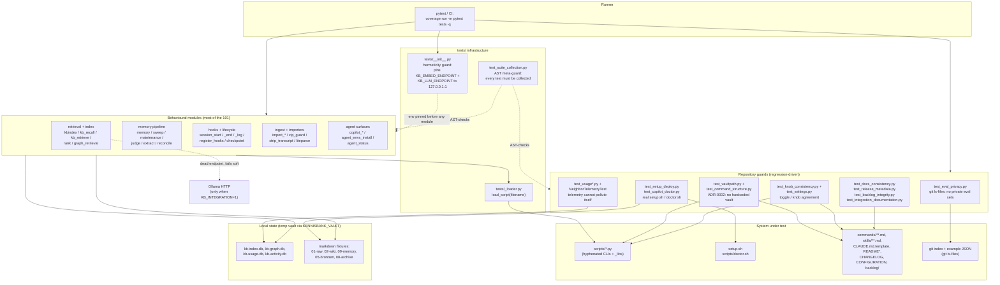

# C4 Code Level — `tests/` (the pytest gate)

## 1. Overview

| Field | Value |
| --- | --- |
| **Name** | KennisBank test suite (`tests/`) |
| **Description** | The single quality gate for the distribution. 101 test modules plus 2 support modules that exercise the script layer in `scripts/`, the shell installer `setup.sh` / `doctor.sh`, and the shipped markdown surfaces (`commands/`, `skills/`, README/CHANGELOG/CONFIGURATION, `backlog/`). A large share of the suite is behavioural; a comparable share is **regression guards** that exist because a specific class of mistake already shipped once (the split is an impression from reading the modules, not a counted metric). |
| **Location** | `tests/` (repo-relative) |
| **Language(s)** | Python 3.12 (stdlib `unittest` classes, collected by pytest; six modules use pytest function style). Bash is driven as a subprocess (`setup.sh`, `scripts/doctor.sh`); `git` is driven as a subprocess. No JS — the Atlas frontend has its own vitest job. |
| **Purpose** | Prove that a change to the distribution is safe *before* it is copied into a user's vault. Because KennisBank is a distribution and not a running service, the suite is the only place where the deployed shape (hook registration, vault-path resolution, toggle plumbing, doc/code agreement) is checked at all. |
| **Measured size** | `python -m pytest tests --collect-only -q` → **1099 tests collected** in this checkout. |
| **How it is run** | Local gate: `python -m pytest tests -q` (see note on `unittest` below). CI: `.github/workflows/ci.yml` runs `python3 -m coverage run -m pytest tests -q`, then `coverage report --fail-under=75`, with a 30-minute hang net. CI also runs `py_compile scripts/*.py` and `bash -n setup.sh scripts/doctor.sh`, and a separate `atlas` job for `atlas/sidecar/tests` + `npx vitest run`. |

**There is no `conftest.py`** — not in `tests/`, not at the repo root (verified). Everything that a conftest would normally do lives in `tests/__init__.py` (which plain `unittest discover` also imports) and in per-module `setUp`. That is a deliberate choice documented in `tests/__init__.py:1-27`.

### Reading conventions used in this document

* Every `unittest` test method has the signature `(self) -> None`; that signature is not repeated per method. Full signatures are given for **module-level** functions (the real entry points and fixture builders) and for pytest-style module-level test functions.
* Per class, `setUp` / `tearDown` / `setUpClass` and lowercase `_private` fixture helpers are **summarized in the class role line, not enumerated**. Where such a helper is load-bearing (it builds the fixture graph, runs the CLI, or restores global state) it is named explicitly with its line.
* Individual test methods are named only where the method *is* the regression guard — i.e. where the method name records a bug that shipped. Otherwise the class role line states the invariant, per the task's instruction not to enumerate assertions.

---

## 2. Code Elements

### 2.1 Suite infrastructure (2 modules, documented in full)

#### `tests/__init__.py` — hermeticity guard (TASK-21)

No functions or classes. It is executed for its side effect at package import, which is why the logic lives here and not in a conftest: `python -m unittest discover -s tests` imports the package before any module, but does *not* load a conftest.

* `tests/__init__.py:32-34` — when `KB_INTEGRATION != "1"`, `os.environ.setdefault("KB_EMBED_ENDPOINT", "http://127.0.0.1:1")` and the same for `KB_LLM_ENDPOINT`.
* Why port 1: nothing listens there, so the OS returns RST immediately — connection-refused with no timeout wait (`tests/__init__.py:16-17`).
* The recorded failure it prevents (`tests/__init__.py:8-14`): the subprocess test in `test_kb_retrieve_memory` reached the real Ollama `qwen3-embedding:8b`, cold-loaded it, and hung the whole suite (>3 min, exit 143) on machines with Ollama running — while passing on CI only because Ollama was *absent* there. Green for the wrong reason.
* `setdefault`, not assignment: an endpoint exported deliberately by the caller still wins. Hermetic by default, override by intent (`tests/__init__.py:25-27`).
* Dependencies: `os` only.

#### `tests/_loader.py` — script loader for hyphenated filenames

```python
SCRIPTS_DIR = Path(__file__).resolve().parent.parent / "scripts"   # tests/_loader.py:14

def load_script(filename: str)                                     # tests/_loader.py:17
```

* `load_script(filename: str)` returns a module object loaded by path via `importlib.util.spec_from_file_location`. Scripts in `scripts/` use hyphens (`build-karpathy-index.py`) and are therefore not importable normally. The module gets a sanitized name (`script_build_karpathy_index`) and is registered under *that* name in `sys.modules`, not under the real hyphenated name, so repeated loads stay isolated (`tests/_loader.py:17-35`). Raises `FileNotFoundError` when the script is missing and `ImportError` when the spec cannot be built.
* Referenced by 41 test modules as `from _loader import load_script` or `from tests._loader import load_script`; a few (`test_usage.py`, `test_graph_retrieval.py`, `test_strip_transcript.py`, `test_kb_eval.py`) also import `SCRIPTS_DIR` from it.
* Modules that do **not** use it: those that load a script through their own local `_load()` helper (each with its own `importlib.util` call — e.g. `test_copilot_config.py:22`, `test_session_start.py:13`, `test_memory_notify.py:18`), and those that import the non-hyphenated libraries (`_settings`, `_memory`, `_rank`, `_usage`, `_kbindex`, `_frontmatter`, `_llm`, `_extract`, `_judge`, `_reconcile`, `_sweepstate`, `_sweeputil`, `_activity`, `_common`, `_provenance`, `_maintenance`, `_embeddings`, `_vaultpath`, `_copilot`, `_liteparse`, `_hooks_manifest`) directly after putting `scripts/` on `sys.path`.

---

### 2.2 Regression-driven guards (the four classes the task calls out, plus the rest)

These are the tests that exist because a *category* of mistake recurred. They assert about the repository and the shipped artefacts, not about behaviour.

#### (a) Privacy of eval sets — `tests/test_eval_privacy.py`

Owner directive of 2026-07-29, quoted in the docstring: the eval suite must never be online in a release. The live sets (`<vault>/06-claude/*.json`) are derived from private vault content — article and memory titles.

```python
REPO = Path(__file__).resolve().parent.parent                                  # test_eval_privacy.py:15
FORBIDDEN_NAMES = {"kb-eval-set.json", "kb-memory-eval-set.json",
                   "kb-activity-eval-set.json"}                                # test_eval_privacy.py:17
def _tracked() -> list                                                         # test_eval_privacy.py:21
```

* `_tracked()` shells out to `git ls-files` in `REPO` and returns the tracked paths — the guard checks *git*, not the filesystem, because the filesystem legitimately holds private sets during development.
* `EvalPrivacyTest` (`:27`): `test_no_live_eval_sets_tracked` (`:28`), `test_no_draft_sets_tracked` (`:34`, any `*.draft.json`), `test_no_vault_06_claude_paths_tracked` (`:39`, backslash-normalized), and `test_example_sets_stay_small_and_fabricated` (`:44`) which caps `kb-eval-set.example.json` / `kb-memory-eval-set.example.json` at 25 entries — a bulk paste of real questions into an example file is the bypass this closes.
* Paired defences outside the suite: the `.gitignore` block for the three names plus `*.draft.json` and `06-claude/`, and the generator guard `test_kb_eval_gen.py::EvalGenTest::test_write_draft_refuses_live_set_path` (`:85`) / `test_draft_never_named_like_live_set` (`:94`).

#### (b) ADR-0002 — vault root must resolve via `vault_root()`, never hardcoded

Three layers, deliberately overlapping because the failure keeps returning through different artefacts:

1. **Python scripts** — `tests/test_vaultpath.py`. `TestVaultRootResolver` (`:28`) pins the resolver contract (env var honored `:38`, default `~/KennisBank` `:42`, empty `:46` and whitespace-only `:50` fall back, `~` expanded `:54`), then proves propagation: `test_scripts_use_the_resolver` (`:58`) loads `stale-check.py`, `intake-scan.py`, `auto-crosslink.py`, `semantic-tiling.py` and asserts their module-level path constants follow `$KENNISBANK_VAULT`; `test_importer_scripts_use_the_resolver` (`:78`) does the same for the `VAULT_DEFAULT` argparse default of `build-karpathy-index.py`, `import-cc-history.py`, `import-claudeai-export.py`, `import-folder.py`. The catch-all is `test_no_script_hardcodes_the_vault` (`:97`): a regex `home\(\)\s*/\s*['"]KennisBank['"]` over every `scripts/*.py` except `_vaultpath.py` (which *is* the fallback).
2. **Shipped markdown** — `tests/test_command_structure.py`. `NoHardcodedVaultInCommandsTest` (`:191`) forbids `~/KennisBank/.claude/scripts` in any `commands/*.md`. `NoHardcodedVaultInShippedShellTest` (`:205`) is the broader one: it scans only shell fences in `commands/**/*.md`, `skills/**/*.md` and `CLAUDE.md.template` for `~/KennisBank/` or `$HOME/KennisBank/`. Two details are themselves scar tissue — the fence regex is `^[ \t]*```(?:bash|sh|shell)` (`:222`), because a column-0-anchored variant missed 23 indented blocks in six files and gave false confidence (this is the PR #54 finding named in `CLAUDE.md`); and the trailing slash is required, so the documented convention `${KENNISBANK_VAULT:-$HOME/KennisBank}` is not a violation (`:238-241`). `CLAUDE.md.template` is called the sharpest case: `setup.sh` copies it verbatim into a vault whose name may not be `KennisBank`.
3. **Per-feature spot checks** — e.g. `test_graph_provenance_ring.py::ProvenanceRingTest::test_geen_hardcoded_vaultpad` (`:183`).

#### (c) Toggle / knob consistency — `tests/test_knob_consistency.py` (TASK-66)

Three drift shapes that no test caught because each location was internally correct (`test_knob_consistency.py:1-12`).

```python
REPO_ROOT = Path(__file__).resolve().parents[1]      # :21
SCRIPTS = REPO_ROOT / "scripts"                      # :22
```

* `CalibrationKnobsMatchTheirSourceTest` (`:29`) — the calibration harness may not report a threshold the code does not use. `_knobs()` (`:32`) reads `kb-calibrate.CURRENT_KNOBS`; `test_rewrite_threshold_matches_find_similar` (`:36`) greps the `threshold =` default out of `scripts/find-similar.py`; `test_retrieve_threshold_matches_the_hook_default` (`:49`) greps `"retrieve_threshold", <n>` out of `scripts/kb-retrieve.py`. The reported bug: the harness printed `[OK]` where `[HERIJK]` belonged.
* `EverySettingIsManageableTest` (`:57`) — every key in `_settings.DEFAULTS` must appear in each management surface, `SURFACES = (commands/kennisbank/settings.md, skills/kennisbank-upgrade/SKILL.md)` (`:64`). Concrete miss: `activity_llm_fallback` was in `DEFAULTS` and in no surface, so a user could not flip it.
* `EmptyAgentHomeFallsBackTest` (`:83`) — an *empty* `CODEX_HOME` / `OPENCODE_CONFIG_DIR` / `COPILOT_HOME` must not become `Path(".")`; `os.environ.get(name, default)` does not fall back on an empty string, so installation would write config into the working directory. `_assert_absolute_and_not_cwd()` (`:103`) is the shared assertion.
* `CouplingKnobsMatchTheirDocsTest` (`:125`) — `CONFIGURATION.md` must literally contain `COUPLING_BOOST_ONE = <value>` and `COUPLING_BOOST_MULTI = <value>` from `_rank`, and the boosts must stay inside `_rank.USAGE_BOOST_RECENT` (`:136`).
* **Observed defect in this file, worth flagging:** `if __name__ == "__main__": unittest.main()` sits at `:123-124`, *before* `CouplingKnobsMatchTheirDocsTest` is defined at `:125`. Under pytest the whole module is imported first, so all four classes run. Run as a script (`python tests/test_knob_consistency.py`), `unittest.main()` executes before the class exists and those two tests are silently skipped.
* Related toggle guards elsewhere: `test_settings.py` (the store itself, incl. `test_example_matches_defaults` `:123` pinning `kennisbank-settings.example.json` to `DEFAULTS`, and `SettingsMigrateTest` `:145`), `test_command_settings_gates.py` (`CommandGateTest:15` — the daily-graphify gate must stay written into `commands/sessielog.md`, `wiki.md`, `destilleer.md` and the upgrade skill), `test_build_embed_index_gate.py` (`EmbedIndexGateTest:21` — toggle off means early return *without side effect*; `test_embed_run_never_touches_rebuild_flag` `:49` records that `main()` used to clear the rebuild flag unconditionally, gated on an unrelated toggle), and `test_migrations.py` (`MigrationsTest:18` — stamp-gated migrations, `test_corrupt_global_settings_soft_skip_hooks_applies_toggles_and_stamps` `:81`, `test_run_does_not_downgrade_newer_stamp` `:95`).

#### (d) Usage telemetry — `tests/test_usage.py`, `tests/test_usage_noise.py`, and the neighbour counter

The retrieval feedback loop writes to `kb-usage.db`; the risk is that a measurement run pollutes the signal it measures, or that an expansion silently returns nothing.

* `tests/test_usage.py` — `UsageCase` (`:21`) points `KENNISBANK_VAULT` at a temp dir and imports `_usage`; `_restore()` (`:31`) puts the env var back. `TestUsageStore` (`:38`) covers `log_injected` / `pending_for` / `mark_used` / `last_used_of` / counter accumulation / `clear_pending` / toggle-off. `TestUsageScan` (`:82`) loads `kb-usage-scan.py` and pins the *definition of use*: a stem inside a `tool_use.input` counts (`:92`, `:115`), a stem mentioned only in assistant prose does not (`:105`), and the stem echoed back in the user message — i.e. the injection itself — must never count as use (`:102-103`). Fail-soft on a missing transcript (`:129`) and no-op without pending stems (`:134`).
* `TestFrozenGuard` (`:139`) is the recurrence guard: `KB_USAGE_DISABLE` must switch off *every* writer (`test_env_var_disables_all_writers` `:154` asserts `log_injected`, `mark_used`, `mark_noise` all return 0 and `pending_for` is empty), `kb-eval` must set it unconditionally for the duration of a run and restore afterwards (`test_kb_eval_freezes_during_run_and_restores_after` `:176`, which spies on `eval_mod._run_jobs`), and a pre-existing value must survive (`test_kb_eval_preserves_preexisting_disable` `:197`) — restore means "previous state back", not "always on".
* `tests/test_usage_noise.py` — the human-gated noise signal (TASK-17). `NoiseCase` (`:20`), `TestNoiseStore` (`:39`) incl. `test_migration_adds_columns_to_pre_noise_db` (`:49`) which runs the schema migration against a pre-noise database, and `TestNoiseFactor` (`:66`) which pins `_rank.noise_factor` as exactly neutral at zero noise (`:67`), floored (`:72`), wired into `rerank` (`:80`) and bit-identical without a `noise_fn` (`:90`).
* `tests/test_graph_retrieval.py::NeighborTelemetryTest` (`:168`) — "the silently-empty guard for the expansion (TASK-15 lesson)": `neighbor_injected(30)` must count neighbour stems (`:186`), report 0 when there were none (`:191`), and refuse to count a neighbour stem that was not itself injected (`:195`).

#### (e) Meta-guard: the suite must actually collect — `tests/test_suite_collection.py` (TASK-53)

The reason the doc guards had never run. `unittest discover` does not collect module-level `test_*` functions; six files were written that way — 21 tests that had never executed, including `test_integration_documentation.py`, the doc guard that should have blocked the stale documentation claims fixed elsewhere in the same cleanup. "There was a gate, but nobody walked past it" (`test_suite_collection.py:1-16`).

```python
TESTS_DIR = Path(__file__).resolve().parent                # :24
KNOWN_FUNCTION_STYLE = {...6 filenames...}                 # :29
def _module_level_test_functions(path: Path) -> list[str]   # :39
```

* `SuiteCollectionTest` (`:49`): `test_no_new_function_style_test_files` (`:53`) fails on any *new* file with module-level test functions; `test_known_list_has_no_stale_entries` (`:66`) forces the allowlist to shrink; `test_every_test_file_contributes_at_least_one_test` (`:75`) catches a file that contributes nothing at all.
* Deliberately AST-based, not a string check for `unittest.TestCase` — such a check passes on a file that uses the base class *and* also carries a dead module-level test function, which is exactly the case that went wrong (`:14-16`).
* The six allowlisted function-style modules are `test_integration_documentation.py`, `test_kb_retrieve_memory.py`, `test_quiet_hook.py`, `test_session_end.py`, `test_session_log.py`, `test_session_start.py`.

#### (f) Other repository-level guards

* `tests/test_docs_consistency.py` (TASK-59) — bilingual fact parity and code-derived facts. Module-level helpers: `_markdown_files()` (`:44`, subtractive scope: all tracked markdown minus changelog, ADRs, backlog, atlas, research — "a hand-maintained list of files to check becomes the next stale doc") and `_identifiers(text: str) -> set[str]` (`:54`). `BilingualFactParityTest::test_language_variants_agree_on_identifiers` (`:62`) requires every `X.md` / `X.nl.md` pair to agree on backticked identifiers (paths, script names, env vars, tools) — prose may differ, a path corrected in one language only may not. `CodeDerivedFactTest` (`:84`): `test_mcp_primitive_count_matches_the_server` (`:85`), `test_no_document_claims_a_sub_second_hot_path_embed` (`:99`, the concrete claim is forbidden, the phrase is not), `test_documented_tool_output_uses_real_markers` (`:121`, quoted tool output must come from the tool — POST-INSTALL.md printed an invented doctor transcript), `test_documented_env_vars_are_read_somewhere` (`:147`).
* `tests/test_integration_documentation.py` — pytest function style, no classes: `test_readmes_document_first_class_coordinated_integrations()` (`:8`), `test_product_surfaces_have_no_removed_client_reference()` (`:27`, `docs/research/` deliberately exempt), `test_generated_prompt_descriptions_are_english()` (`:51`).
* `tests/test_release_metadata.py` (TASK-58) — `latest_version() -> str` (`:22`) parses the CHANGELOG; `ReleaseMetadataTest` (`:30`) ties CHANGELOG `Unreleased` section, compare links, both READMEs and the shipped release skill together so a half-bump goes red instead of shipping.
* `tests/test_backlog_integrity.py` (TASK-54) — `_task_files()` (`:27`); `BacklogIntegrityTest` (`:31`) enforces unique task IDs (four IDs were claimed by two files each), filename↔declared-ID agreement, referenced milestones existing as files, and known statuses. The docstring is explicit about what it cannot see: untracked files (covered instead by the session-start warning in `scripts/git-upstream-check.py`).
* `tests/test_skill_frontmatter.py` — local strict parser `parse_frontmatter(text: str, source: str = "<text>") -> dict` (`:11`), deliberately stricter than the product's permissive wiki metadata parser. `SkillFrontmatterTest` (`:62`) validates all shipped skill frontmatter, the Copilot-compatible `colon + space` rule in unquoted descriptions (`:73`/`:83`), trigger phrases retained (`:92`), English metadata (`:98`), and that the upgrade skill mentions memory backfill (`:107`).
* `tests/test_command_structure.py` — `WikiCommandStructureTest` (`:13`), `ReconcileCommandStructureTest` (`:63`), `UitdaagCommandStructureTest` (`:83`), `BrugCommandStructureTest` (`:100`), `SessiestartCommandStructureTest` (`:121`), `TemporalActivityCommandStructureTest` (`:132`), `KennisbankUpgradeCommandStructureTest` (`:155`), `KennisbankContributeCommandStructureTest` (`:173`) — slash-command markdown must keep the steps and script invocations the workflow depends on (markdown is instruction, not code, so these are structural regression guards, not behaviour tests). Plus the two ADR-0002 classes described above.
* `tests/test_hooks_manifest.py` — `_load()` (`:8`); `HooksManifestTest` (`:15`) pins `scripts/_hooks_manifest.py`: memory hooks present, the presearch entry carries a matcher, `hooks()` returns a copy (no shared mutable state), SessionEnd has exactly one coordinator, and `kb-retrieve` is registered on `UserPromptSubmit`.

---

### 2.3 Installer, deploy and cross-platform surface

#### `tests/test_setup_deploy.py` (465 lines) — the distribution contract

Runs the real `setup.sh` under bash against a throwaway `HOME`, then inspects the resulting vault. This is the only test of "what a user actually gets".

```python
REPO_ROOT = Path(__file__).resolve().parents[1]                    # :10
def _hook_commands(settings, event)                                # :13
def _bash_path(p: Path) -> str                                     # :24
def _find_bash() -> str                                            # :38
def _installeer_eenmalig()                                         # :82
def tearDownModule()                                               # :107
```

* `_hook_commands(settings, event)` — every hook command string registered under an event in a settings dict.
* `_bash_path(p)` — `C:\Users\x` → `/c/Users/x` on Windows, identity elsewhere.
* `_find_bash()` — locates a usable bash: PATH bash on macOS/Linux; on Windows `GIT_INSTALL_ROOT`, per-user/system Git installs, or the `HKCU/HKLM\SOFTWARE\GitForWindows` registry key, **explicitly rejecting the System32 WSL/Store stub** (a different filesystem namespace where `/c/...` paths break). Raises `unittest.SkipTest` with a clear reason when none is found.
* `_installeer_eenmalig()` — runs `setup.sh --yes --skip-model-check` once in a fresh temp HOME with `KENNISBANK_VAULT` pointed into it; returns `(home, vault)`. `tearDownModule()` removes it.
* `SetupDeployTest` (`:115`) with class attribute `_gedeeld` (`:121`) and the classmethod `gedeelde_installatie()` (`:124`) shares that one install across all read-only inspection tests. The comment records the measurement: a `setup.sh` run costs 42 s and this module used to call it 18 times — 12.6 of the suite's 17 minutes. A gate too expensive to prove green gets skipped in practice.
* Invariants: `doctor.sh` and all Python scripts deployed (`:160`, `:165`), skills installed (`:170`), embedding scripts + `kennisbank-embed` config (`:177`, `:183`), archive/distill scripts (`:188`), settings command into its subdir and the settings file bootstrapped with defaults (`:202`, `:208`), vault-maintenance scripts and commands (`:219`, `:235`), temporal activity commands/scripts (`:245`), hook registration present/reported/idempotent/preserving existing settings (`:290`–`:347`), `09-memory` created (`:366`), the full memory hookset (`:371`), the version stamp (`:386`), doctor reporting hooks + version (`:392`), and — the important one for upgrades — `test_rerun_preserves_user_data_and_refreshes_tooling` (`:401`) and `test_interactive_decline_hooks_skips_migration_hook_registration` (`:414`). Write-mode helpers `run_setup` (`:138`), `run_setup_in` (`:262`), `run_doctor_in` (`:277`) are summarized here rather than enumerated.
* `import winreg` is Windows-only and guarded inside `_find_bash()`.

#### `tests/test_copilot_doctor.py` — `doctor.sh` Copilot section (TASK-26.9 AC#5)

`_find_bash()` (`:18`, "prefer Git Bash on Windows; reject the WSL filesystem namespace") and `_posix(path: Path) -> str` (`:52`). `CopilotDoctorTest` (`:62`) runs the real `scripts/doctor.sh` against a fixture vault plus a temp `COPILOT_HOME` and asserts PASS / not-configured / FAIL tiers (`:104`, `:110`, `:115`). Hermetic: never touches the real `~/.copilot`. Helpers `_run_doctor` (`:84`), `_install_copilot` (`:94`), `_copilot_lines` (`:101`) summarized.

---

### 2.4 Multi-agent surfaces (Codex / OpenCode / Copilot)

| File | Role | Entry points |
| --- | --- | --- |
| `tests/test_agent_envs_install.py` | `install-agent-envs.py`: native skills, compat prompts and MCP wiring for Codex/OpenCode/Copilot; hook consolidation; TOML repair without duplicating the `env` subtable (`:161`); OpenRouter config + user secret (`:248`); MCP runtime validation for missing dependency / handshake failure / success (`:264`–`:291`). Uses `tomllib`. | `_load()` (`:20`); `AgentEnvInstallTest` (`:27`) |
| `tests/test_copilot_config.py` (426 lines) | `scripts/_copilot.py`: every surface written by install, legacy hook migration while preserving unrelated entries (`:109`), managed-block updates, malformed JSON fail-open (`:238`), backup before mutating a user file (`:251`), `remove` reversing install without losing user data (`:260`), `probe_cli` matrix, `validate_config` incl. legacy-hook detection (`:350`, `:367`), and `test_install_does_not_touch_shared_agents_or_claude_md` (`:386`). Runs against a temp `COPILOT_HOME`/`HOME`. | `_load()` (`:22`); `CopilotConfigTest` (`:29`) |
| `tests/test_copilot_wrapper.py` | `kennisbank-copilot.py` launcher: env pinning of the vault and `KB_LLM_*` without clobbering user values, verbatim arg passthrough, exit-code passthrough, fatal-vs-dry-run behaviour for a missing binary, and `test_print_env_lists_kb_vars_and_leaks_no_secrets` (`:238`). | `_load()` (`:33`); `CopilotWrapperTest` (`:40`), with `_fake_bin` (`:75`) and `_capture_launch` (`:83`) |
| `tests/test_copilot_capture.py` | The Copilot capture hook: camelCase + snake_case payloads, secret redaction in structured *and* freeform args (`:59`, `:69`), fail-open on empty/garbage stdin, session-id sanitized for filenames (`:115`), and `KENNISBANK_COPILOT_NO_CAPTURE` disabling writes. | `_load()` (`:20`); `CopilotCaptureTest` (`:27`) |
| `tests/test_copilot_import.py` | `import-copilot.py` rawlog importer: prompt/tool events, dedupe on re-import, active session skipped, malformed lines ignored, plus a capture→import→recall end-to-end (`:114`). | `_load(path, name)` (`:25`); `CopilotImportTest` (`:34`) |
| `tests/test_copilot_e2e.py` | Consolidation harness (TASK-26.10): a **real fake `copilot` binary** (not a mock) driving `probe_cli` through `--version`, `mcp list`, a `FAKE_COPILOT_FAIL` switch and exit codes; a Windows-style vault path case; proof that installing Copilot leaves the Codex config untouched (`:120`); and an opt-in live smoke (`:138`) skipped unless `KB_COPILOT_LIVE=1`. | `_load(name, path)` (`:30`); `_write_fake_copilot(path: Path) -> Path` (`:38`); `CopilotE2ETest` (`:68`) |
| `tests/test_agent_status.py` | `agent-status.py` multi-agent summary (TASK-26.13): not-installed is skipped, per-client configured states, rollup counts + render, JSON CLI. | `_load()` (`:14`); `AgentStatusTest` (`:21`) |

---

### 2.5 Hooks and session lifecycle

* `tests/test_register_hooks.py` — `_load()` (`:14`); `RegisterHooksTest` (`:21`) pins hook registration into the client settings file: per-platform interpreter (`:31`), matcher handling, idempotence, the full manifest set, migration of the legacy SessionEnd/session fan-outs (`:80`, `:96`), self-heal that *preserves* `py -3` and `python3` interpreters (`:49`, `:157`), refusal on corrupt JSON (`:134`), and timeout plumbing: new entries declare the manifest timeout (`:176`), pre-existing entries get it back-filled (`:184`), a hand-set timeout survives (`:199`). `LockStalenessTest` (`:210`) derives the maintenance-lock expiry from that declared ceiling (`:213`), proves a killed cycle recovers within one ceiling (`:220`), and that a future mtime does not block maintenance forever (`:243`).
* `tests/test_session_start.py` — pytest function style: `test_coordinator_runs_independent_work_concurrently_and_notifications_after(tmp_path)` (`:21`), `test_coordinator_aggregates_only_actionable_results(tmp_path)` (`:48`), `test_maintenance_is_detached_and_not_blocking(tmp_path)` (`:91`, records the measured cost of the old blocking behaviour: ~210 s for Claude/Codex and ~300 s for Copilot worst case), `test_freshness_skips_maintenance_but_keeps_copilot_capture(tmp_path)` (`:117`), `test_emit_uses_one_native_context_payload_per_client(capsys)` (`:141`), `test_timeout_and_nonzero_exit_are_actionable_but_fail_open(tmp_path, monkeypatch)` (`:158`), `test_git_upstream_check_is_a_notification_job()` (`:179`), `test_git_upstream_warning_surfaces_and_clean_is_silent()` (`:185`), `test_prewarm_fires_from_main_not_coordinate(tmp_path, monkeypatch)` (`:197`); `_load()` (`:13`).
* `tests/test_session_start_status.py` (241 lines) — "a silent session start is indistinguishable from a broken one". `StatusLineTest` (`:23`) with fixture builders `_index` (`:39`), `_graphdb` (`:53`, the graph index as its **own** file — the core of TASK-75), `_graph` (`:63`), `_lock` (`:140`). Guards: a line is always emitted even for an empty vault (`:70`), a running worker is named as such (`:75`), counts come from the index (`:82`), fresh/stale graph reported (`:86`, `:92`), a graph on disk but absent from the index is reported (`:114` — the silence that let the graph tables vanish unnoticed), graph status survives a missing embed index (`:122`), counts get a caveat during maintenance (`:105`), orphaned lock detection with the measured case PID 31772 vs live worker 22552 (`:151`), the staleness window is read from `index-launch` rather than re-derived (`:162`), broken/meta-less/absent index does not break the message (`:173`–`:188`), cp1252-safe output on Windows stdout (`:192`, `:205`), and `test_blijft_binnen_het_budget` (`:227`) — the status line stays a read-out, not a computation.
* `tests/test_session_end.py` — pytest style: `test_claude_capture_finishes_before_usage_scan(tmp_path)` (`:21`), `test_copilot_capture_precedes_parallel_import_and_usage(tmp_path)` (`:44`), `test_exit_is_silent_and_writes_diagnostic_state(tmp_path, capsys, monkeypatch)` (`:71`); `_load()` (`:13`).
* `tests/test_session_end_recover.py` — `_load()` (`:11`); `RecoverTest` (`:20`): no state / completed state are no-ops, a fresh running state is left alone, a stale running state triggers capture and closes (`:57`).
* `tests/test_session_log.py` — pytest style: `test_post_save_jobs_are_parallel_and_notices_follow(tmp_path)` (`:20`), `test_reports_unwrap_notices_and_ignore_routine_progress()` (`:54`), `test_rejects_paths_outside_session_log_directory(tmp_path)` (`:72`); `_load()` (`:12`).
* `tests/test_checkpoint.py` (TASK-79) — `CheckpointBase` (`:27`) with `_set_toggle` (`:44`); `PreCompactStubTest` (`:49`) proves the opt-in toggle both ways and that pending state is bounded (`:70`); `RegisterAndDoneTest` (`:77`) refuses a `--register` path outside `01-raw/checkpoints/` (`:85`) and makes `done` idempotent; `NotifyTest` (`:109`) distinguishes `source=compact` (urgent lead) from `startup`; `CoordinatorWiringTest` (`:129`) proves the notice sits **before** the freshness gate (`:132`) and that the manifest declares the PreCompact hook with a timeout (`:153`).
* `tests/test_orientation.py` (TASK-80) — `OrientationBase` (`:26`) + `_make_index` (`:42`); `SummaryTest` (`:57`) counts from the index without an embedding call and counts only open backlog tasks (`:69`); `HookGatingTest` (`:82`) proves silence when the toggle is off, injection when on, and that the manifest + coordinator carry the job (`:103`).
* `tests/test_index_launch.py` (TASK-63) — `IndexLaunchTest` (`:14`): a second launch does not spawn a second worker, the lock is released when spawning fails (`:41`), stale and *future*-mtime locks are reclaimed (`:51`, `:59` — clock changes may not park maintenance forever), the stale window exceeds the worst-case run (`:67`), jobs run sequentially with the sweep first (`:78`), a failing job does not stop the rest (`:90`), worker mode releases the lock (`:103`).
* `tests/test_sweep_launch.py` — `_load()` (`:15`); `SweepLaunchTest` (`:22`): lock acquire/second-fails, gated-off skips spawn, `test_main_spawns_only_the_sweep` (`:53` — two decoupled processes both writing `kb-index.db` was the bug), stale lock reclaimed (`:66`), future mtime treated as stale (`:79`).
* `tests/test_quiet_hook.py` — pytest style: `test_quiet_hook_suppresses_no_change_output_and_fails_open(tmp_path)` (`:11`), `test_quiet_hook_returns_changed_report_as_client_context(tmp_path)` (`:33`), `test_quiet_hook_uses_copilot_session_context_shape(tmp_path)` (`:65`).
* `tests/test_distill_notify.py` — `DistillNotifyTest` (`:15`): pending listing, mark is append-not-overwrite (`:41`) and de-duplicating (`:48`), CLI paths, and toggle behaviour where `notify` is silent but `--list-pending` still works (`:108`, `:115`). `_run_main` (`:59`) restores argv/stdin/stdout **and** `KENNISBANK_VAULT`, because leaking that env var poisons later tests.
* `tests/test_git_upstream_check.py` — the session-start path must not touch the network. `GitProbe` (`:22`) replaces `_git` and records subcommands; `DriftCheckTest` (`:52`) asserts `main()` performs no fetch (`:63`, "the only line that really matters"), still counts drift from the object store (`:70`), and that `refresh_remote()` — run by the detached worker — does fetch (`:92`), picks the remote from the upstream ref (`:97`), is silent outside a repo (`:105`), and passes its own `FETCH_TIMEOUT` (`:119`). `AchtergrondjobTest` (`:135`) proves the job is actually registered in the worker (`:136`) and that `STALE_SEC`, derived from `len(JOBS)`, grows with it (`:147`). The docstring carries the measurement: the fetch cost 801 ms of 1384 ms (58%) on 2026-07-25.
* `tests/test_archive_transcript.py` — `_make_transcript(dir_: Path, name: str, n_records: int) -> Path` (`:13`); `ArchiveTest` (`:27`): destination path shape, copy, idempotence per session, overwrite when the source grew (`:65`), skip empty, missing source is an error rather than a raise, `main()` exits 0 on garbage stdin (`:92`), and the `auto_archive` toggle both ways (`:120`, `:128`). `_hook_stdin` (`:101`) / `_run_main` (`:106`) summarized.

---

### 2.6 Index, retrieval and ranking

* `tests/test_kbindex_schema.py` — `KbIndexSchemaTest` (`:21`): index path under `.claude`, `connect()` loads sqlite-vec, `ensure_schema` idempotent and stores meta, `is_valid_for` (`:60`).
* `tests/test_kbindex_upsert.py` — `_vec(seed: float)` (`:18`); `KbIndexUpsertTest` (`:22`): one doc across all tables, same path replaces rather than duplicates, missing hash is `None`, prune removes absent paths.
* `tests/test_kbindex_search.py` (222 lines) — `KbIndexSearchTest` (`:19`) covers vector ordering, status/layer filters, hybrid keyword, `statuses=None`, and the `k` bound. Three regression classes: `LayerStarvationRegressionTest` (`:72`, a memory doc must not be pushed out of the pool by 25 closer wiki docs), `RelevanceFloorTest` (`:110`, the hot path used to inject the top-k unconditionally although RRF scores are rank artefacts — cosine is now reported per hit, the floor drops irrelevant hits, behaviour is unchanged for pre-normalisation indexes (`:148`), a literal FTS hit survives the floor (`:159`), the filter runs before the k-cut (`:167`), and punctuation in the raw prompt no longer kills the FTS half (`:173`)), and `Vec0PoolCeilingTest` (`:184`, sqlite-vec refuses KNN with `k > 4096`; the pool scaled with corpus size so a growing vault hit that wall).
* `tests/test_kb_recall.py` — `_load_kb_recall()` (`:33`); `KbRecallTest` (`:40`) builds a real `kb-index.db` with fake vectors: memory layer isolation, embed-id mismatch and missing index return empty, `test_stale_index_retracted_not_recalled` (`:101`, a stale index must not serve retracted memory — the index says `current`, the live file says `retracted`), both-layer recall, wiki hits not live-rechecked, and the `has_fts_match` fail-soft path.
* `tests/test_kb_retrieve_wiki.py` — `_load_hook()` (`:18`); `WikiBlockTest` (`:25`) with `_cfg` (`:69`) / `_prompt_env` (`:72`): prompt embed timeout clamping and explicit ceiling opt-in (`:77`, `:84`), a single bounded embed with warm-on-miss (`:91`), hybrid vs cosine-only vs FTS-only injection, and four gate regressions — the tens-of-MB JSON cache must never be touched when the index itself can threshold (`:161`), a vault with a working index and *no* JSON cache must still produce a block (`:179`), an ungated (pre-normalisation) index must keep using the old cache gate (`:190`), and `test_main_injects_ranked_stems_into_hook_output` (`:213`), which exists because in a comparable tool an entire memory category fell silently outside the output for months.
* `tests/test_kb_retrieve_memory.py` — `_load_kb_retrieve()` (`:34`) and the module-level pytest function `test_retrieve_context_requests_raw_output_suppression()` (`:41`). `KbRetrieveMemoryTest` (`:54`) drives the hook as a subprocess (trivial prompt, toggle off, missing index); `KbRetrieveMemoryBlockTest` (`:91`) unit-tests `_memory_block` with an injectable `hits_fn`; `KbRetrieveIntegrationTest` (`:140`) is the **opt-in** tier that deliberately drives the real embed → index → retrieval pipeline — exactly the path `tests/__init__.py` pins dead — and only runs under `KB_INTEGRATION=1`.
* `tests/test_kb_retrieve_cold_notice.py` — a cold embedding model must be *reported*, not swallowed. `ColdNoticeTest` (`:22`): the notice is visible (`suppressOutput=False`, `:36`), a successful injection stays invisible (`:50`), an empty notice writes nothing (`:61`), the text names the timeout and the next step (`:71`), the wording differs when a warm-up is already running (`:78`), and warm detection fails open even with a broken `emb` module (`:86`).
* `tests/test_graph_retrieval.py` (TASK-87) — `_load_recall()` (`:23`); `GraphNeighborTest` (`:27`) builds a fixture graph through `_kbindex.graph_connect` + `replace_graph` + `set_graph_fingerprint` (`_build_graph` `:51`, `_default_graph` `:58`, `_hits` `:81`): weighted neighbour wins, `contains` edges excluded and memory never a neighbour (`:93`), stale fingerprint / missing db / missing neighbour file give no neighbour and never an exception (`:107`–`:115`), a hit stem is never returned as its own neighbour (`:122`), and toggle off/on selects the legacy `one_hop_neighbor` path vs the graph path (`:132`, `:146`). Plus `NeighborTelemetryTest` (§2.2d).
* `tests/test_rank.py` — pure `_rank` functions with injected frontmatter/file readers: `TestRecencyFactor` (`:20`), `TestImportanceFactor` (`:43`), `TestTrustFactor` (`:60`), `TestRerank` (`:71`, incl. trust boosting human over agent sources `:104` and meta-reader exception fail-soft `:119`), `TestOneHopNeighbor` (`:127`), `TestCouplingFactor` (`:173`, bibliographic-coupling bonus: bounded, never a penalty), `TestRerankCoupling` (`:192`, with `test_without_sources_fn_identical` `:200` as the bit-for-bit regression lock).
* `tests/test_kb_search.py` — `_ks()` (`:13`); `TestRankEmpty` (`:17`), `TestRankOrdering` (`:24`), `TestRankThresholdFilter` (`:57`), `TestRankTopNCap` (`:82`), `TestRankReturnShape` (`:115`) — the pure `rank(query_vec, candidates, top_n, threshold)` contract.
* `tests/test_find_similar.py` — `_fs()` (`:13`); `TestBestMatchEmpty` (`:17`), `TestBestMatchPicksHigher` (`:24`), `TestBestMatchTwoCandidates` (`:51`) — `best_match` with no network, no Ollama, no filesystem.
* `tests/test_context_budget.py` — `_cb()` (`:21`); `TestSelectLayersL0`–`L3` (`:33`, `:60`, `:83`, `:106`) pin the layer supersets, `TestSelectLayersClamping` (`:133`), `TestSelectLayersMissingKeys` (`:158`), `TestSelectLayersReturnType` (`:192`), and `TestEnvIntFailSoft` (`:205`) which runs the script as a subprocess to prove garbage `KB_CONTEXT_LEVEL` / `KB_RETRIEVE_TOP_N` yields exit 0 and parseable JSON rather than a `ValueError` traceback.
* `tests/test_kb_presearch.py` — `_load()` (`:19`); `KbPresearchTest` (`:26`) runs the PreToolUse hook with `emb.embed` and `kb_recall.recall_hits` monkeypatched: WebSearch injects context, non-search tools produce nothing, `memory_recall` off produces nothing, WebFetch uses the URL, and garbage/bad-JSON/embed-exception all fail **open** (`:88`–`:99`).
* `tests/test_kb_ask.py` — `_load()` (`:15`); `FormatTest` (`:24`): hit formatting tags the layer, `gather` is fail-soft without recall, and uses `recall_hits` when present.
* `tests/test_kb_mcp.py` — `_load()` (`:15`); `KbMcpTest` (`:22`) tests the recall tool core without the `mcp` package or a model (empty query, no hits, embed failure soft, `build_server` returns `None` without `mcp`); `KbMcpTemporalToolTest` (`:77`) checks the temporal tool wrappers return JSON.
* `tests/test_mcp_capture.py` — `_load(mod_name, filename)` (`:18`); `CaptureToolTest` (`:27`): `capture_tool` writes an *unverified agent* memory, writes nothing for an empty title/body, is fail-soft on a bad memory type, and the instructions text mentions recall + capture.
* `tests/test_injection_provenance.py` (TASK-20) — provenance tagging on the injection path. Module-level: `_load_kb_retrieve()` (`:31`), `_load_memory()` (`:38`), `_write_memory(path: Path, *, evidence_basis: str, status: str) -> None` (`:48`). `ProvenanceTagPureTest` (`:61`) pins the deterministic `(evidence_basis, status) -> tag` mapping: typed+current is authoritative with no qualifier, agent+current reads as a *hint* rather than "unverified" (`:70`), agent+unverified gets both axes, human-in-the-loop is authoritative, an unverified status adds the qualifier, and an unknown basis fails soft to an empty tag (`:88`). `MemoryBlockProvenanceTest` (`:94`, `_block` `:112`) proves `_memory_block` tags each hit independently and never crashes on a missing `evidence_basis` (`:138`). `_FakeEmb` (`:159`) and `_FakeRecall` (`:181`) are minimal stubs (no Ollama, no cache file) for `WikiBlockUntaggedTest` (`:190`), which pins the asymmetry: wiki hits must **never** carry a provenance tag because they are curated/evergreen (`:196`).
* `tests/test_kb_recall_nocloud.py` — `NoCloudTest` (`:39`): a static source scan of the recall path (`kb-recall.py`, `_kbindex.py`) for external hosts, allowing only localhost/127.0.0.1; `_embeddings.py` is deliberately **not** scanned because it legitimately contains opt-in cloud provider endpoints. `test_default_provider_is_local` (`:47`) proves `provider()` returns `"ollama"` in a clean environment.

---

### 2.7 Knowledge graph layer

* `tests/test_graph_index.py` (344 lines, TASK-71) — "the core of this component is not *can it find the neighbours* but *does it keep quiet when it isn't sure*". `_graph()` (`:24`) builds a mini graph (two documents, own concepts, one doc-doc edge). `GraphIndexTest` (`:62`): tables/indexes exist, counts, neighbours are other files, a file is never its own neighbour via two independent mechanisms (`:109`), `contains` edges carry no weight (`:123`), weights sum across edges (`:131`), the graph is undirected (`:139`), threshold and limit, freshness is independent of the embed model (`:175`), WAL is pinned with a measurement (1.2 ms vs 23.5 ms per fresh reader, `:192`) and readers are not blocked during a rebuild (`:202`), `test_graaf_heeft_een_eigen_bestand` (`:224`, the core of TASK-75: `kb-index.db` may be thrown away, the graph may not), fail-open on an empty index (`:233`), and `replace_graph` semantics (idempotent, removes old nodes, skips id-less nodes, normalizes backslash paths). `BuilderTest` (`:273`): first run loads, second skips, `--force` reloads, a missing graph is not an error (graphify is an external skill), a broken graph exits 1, and the `edges` key is also accepted.
* `tests/test_graph_link_layer.py` — `_doc(title: str, session: str = "", tags: str = "", body: str = "tekst") -> str` (`:21`); `GraphLinkLayerTest` (`:30`) with `_graph` (`:57`) / `_apply` (`:69`): every concept attaches to its document, `same_session` links only inside a session, a wikilink becomes a `references` edge, a **star instead of a clique** (`:93`), a broad tag yields no edges (`:106`), idempotent, missing source files skipped, no self-edges.
* `tests/test_graph_provenance_ring.py` (TASK-68) — `ProvenanceRingTest` (`:21`) with fixture builders `_sessie` (`:40`), `_memory` (`:48`), `_wiki` (`:55`), `_graaf` (`:60`), `_bouw` (`:66`): a referenced session gets a node without any LLM, an unreferenced session does not by default (measured: 724 of 772 sessions would land as loose nodes, `:82`), `--include-unreferenced` overrides, nodes are recognizable as provenance so ranking can tell them from knowledge (`:101`), Windows paths in `source_path` are recognized (`:134`), no session-to-session edges (`:142`), non-matching sessions are counted rather than silently dropped (`:158`), the second run adds nothing, and no hardcoded vault path (`:183`). `RankIsolatieTest` (`:190`) proves structurally that `one_hop_neighbor` never returns a session — provenance can never outrank a direct hit.
* `tests/test_graph_scope_prune.py` — `_memory(status: str) -> str` (`:22`); `GraphScopePruneTest` (`:26`): only *current* memories stay in the graph, wiki nodes untouched, orphan edges go with them, a vanished source file is pruned **and counted**, idempotent, backslash paths recognized.
* `tests/test_build_kb_index.py` — `_fake_vec(path, cache, recompute=True)` (`:22`) replaces `_embeddings` so no real model is needed. `BuildKbIndexTest` (`:28`, `_build` `:72`): wiki + current memory only, `test_een_volledige_herbouw_laat_de_graaf_intact` (`:92`, TASK-75 — the two used to share one file and `idx.unlink()` took the graph with it), `test_graaf_en_embedindex_zijn_verschillende_bestanden` (`:140`), rebuild idempotent, the `embed_index` and `memory_capture` toggles excluding their own layer only (`:154`, `:174`), `--rebuild` with the model down leaving the existing index intact (`:194`), and incremental skip of unchanged files (`:216`).
* `tests/test_provenance_sources.py` (TASK-88) — `_vec(seed: float)` (`:20`); `DocSourcesTest` (`:24`) pins `_provenance.doc_sources` (memory uses the `source_session` basename, Windows paths normalized, wiki session/bron links normalized, plain article links are *not* sources, dedupe + sort) with `test_parsing_agrees_with_kb_lint_on_shared_fixture` (`:67`) as the interlock: what `kb-lint` counts as provenance, `_provenance` must count as a source — same fixture, same result set. `DocSourcesIndexTest` (`:83`) covers the index layer incl. fail-soft reads without the table (`:120`).

---

### 2.8 Memory pipeline

* `tests/test_memory.py` — `MemoryFormatTest` (`:21`): status/evidence sets, path layout, render defaults to `unverified` and rejects bad status/evidence, quote+newline sanitizing in titles, tag/`superseded_by` string coercion, and the TASK-73 dedupe insight — `test_identieke_body_krijgt_geen_tweede_bestand` (`:109`): an occupied slug is a *signal*, not an obstacle; the function used to number blindly and produce duplicates. `test_superseded_by_leest_hetzelfde_in_beide_parsers` (`:149`) compares the repo's own parser against strict PyYAML (`[[[slug]]]` was read as a triple-nested list, so Obsidian showed the wrong property).
* `tests/test_memory_bitemporal.py` — `TestRenderBitemporal` (`:22`), `TestSetStatusValidUntil` (`:45`, incl. backslash-in-value crash guards `:98`, `:106`, and "the body is never touched" `:91`), `TestMemoryType` (`:114`).
* `tests/test_memory_review.py` (TASK-89 D1) — `_memory_md(title, status="unverified", created="2026-07-01", memory_type="feit", evidence="cc-sessie")` (`:24`); `ReviewTestBase` (`:32`); `DecideTest` (`:53`) pins the closed action set (approve/reject/skip), invalid decision = 400, traversal guard, missing = 404, non-unverified = 409, and the crash-safe ordering: `test_failed_write_never_reports_success` (`:101`) — a failing `set_status` must raise, leave the file unchanged, write **no** audit line, and keep the item decidable; `test_audit_failure_does_not_undo_decision` (`:117`) — the audit is fail-soft in the other direction. `PendingReviewsTest` (`:128`), `ReviewCountsTest` (`:146`), `Task23ReplayTest` (`:160`) replays the real backlog of 31 unverified memories after an Ollama outage through the review flow, `MemoryDoctorCliTest` (`:183`) drives the CLI round-trip.
* `tests/test_maintenance.py` — `MaintenanceTest` (`:34`, `_fake_cache` `:54`) for current items / similar pairs / neighbour counts; `MemorySetStatusTest` (`:89`); `ExactDuplicatePassTest` (`:119`, TASK-73) — byte-identical memories are closed automatically without embeddings or judge, keeping the oldest on **event** time rather than capture time (`:169`), ignoring whitespace, skipping empty bodies and closed memories, counting unverified, dry-run counting without mutating, idempotent, reversible ("nothing is deleted", `:224`), preserving the duplicate's own `source_session` (`:233`), and `test_het_ongenummerde_bestand_blijft_niet_de_kopie` (`:242`) which records the measured sort trap: `-` sorts before `.`, so path sorting consistently kept the *duplicate*.
* `tests/test_maintenance_recheck.py` — `RecheckTest` (`:19`): retract on explicit noise, keep when the judge says no, and `test_recheck_keeps_on_model_down` (`:54`) — model down → judge returns False → **no** retract (that was the bug).
* `tests/test_maintenance_supersede.py` — `SupersedeTest` (`:18`): mark older, no supersede when the judge declines, fail-safe on `model=None`, `valid_until` stamped, ordering on event time not capture time (`:68`).
* `tests/test_memory_sweep.py` (494 lines) — the orchestrator, with every LLM/embed seam mocked. `MemorySweepTest` (`:25`) covers write + watermark marking, doubt → unverified, near-duplicate and exact-body dedupe (the latter *before* embedding, `:97`), embed retry recovery and fail-soft (`:110`, `:128`), gated-off, heartbeat incl. the TASK-76 rot count that moved off the session-start path (`:159`, `:177`), the expire pass and bi-temporal stamps, the reconcile band (`_dated_transcript_in_reconcile_band` `:213`), the temporal guard blocking an old transcript (`:319`), per-transcript error accounting (`:342`), quoted-status flipping (`:368`), and the two outage invariants that must stay symmetric: `test_model_down_marks_nothing` (`:384`) and `test_embed_down_marks_nothing` (`:467`) — an unmarked transcript is retried, a marked one is lost. `--all` reprocesses marked transcripts and exceeds `max_transcripts` (`:418`) but caps written memories per transcript (`:441`).
* `tests/test_memory_doctor.py` — `_load()` (`:18`); `MemoryDoctorTest` (`:25`): the no-cloud checks (clean by default, cloud provider flagged, remote Ollama flagged), quarantine rot counting, the re-judge paths incl. dry-run and fail-safe on a judge exception, and two bypass guards — `test_nocloud_localhost_evil_com_is_flagged` (`:119`, a naive substring match misses `http://localhost.evil.com`; the check must parse) and `test_nocloud_ollama_not_first_in_chain_still_checked` (`:126`).
* `tests/test_memory_notify.py` — `_load()` (`:18`); `MemoryNotifyTest` (`:25`): clean state is silent, model-unreachable / errors / rot notices, `test_rot_zonder_telling_zwijgt_en_scant_niet` (`:68`, TASK-76 AC#4 — the proof that the session-start path no longer scans the disk), the `rot_hours` fallback to 48 for pre-TASK-76 heartbeats (`:89`), and stale-heartbeat-with-pending-transcript combinations (`:102`–`:141`).
* `tests/test_llm.py` — the model router `scripts/_llm.py`, with the per-provider `_call` monkeypatched so no model or network is touched. `LlmRouterTest` (`:21`, `_cfg` `:46`): the default chain is local Ollama (`:51`), `generate` uses the first provider, the chain falls through to the next on `None` (`:61`), all-fail returns `None` (`:74`), `is_local` is False when a cloud provider is first (`:84`), env overrides the provider list (`:88`), and the OpenRouter API key resolves from config or the secret-file fallback (`:92`, `:96`).
* `tests/test_extract.py` — `ExtractTest` (`:16`) with `_llm.generate` mocked: candidates extracted, `None` and unparseable output are empty, empty bodies filtered and the count capped.
* `tests/test_judge.py` — `JudgeTest` (`:17`): high confidence → current, doubt → unverified, and three fail-safe paths (model `None`, unparseable, unknown verdict) all landing on `unverified`.
* `tests/test_reconcile.py` — `_item(path: str, vec, body: str = "b", valid_from: str = "2026-01-01", status: str = "current")` (`:19`); `TestSimilarExisting` (`:25`), `TestJudgeReconcile` (`:47`, all three failure shapes fail **safe to ADD**), `TestMaySupersede` (`:73`, an older fact never invalidates a newer one), `TestReconcileFlow` (`:87`, NOOP wins immediately, the temporal guard blocks, and a NOOP against an *unverified* neighbour does not win `:117`).
* `tests/test_sweepstate.py` — `SweepStateTest` (`:18`): watermark excludes marked transcripts, marking is idempotent, transcript text reduction and its fail-soft path, `_block_text(None)` and mixed content lists.
* `tests/test_sweeputil.py` — `SweepUtilTest` (`:14`): chunking, `is_duplicate` around the production default 0.92 from both sides (`:34`, `:44`), and a stable `body_key` for trimmed exact matches.

---

### 2.9 Ingest, importers and parsing

* `tests/test_common.py` — `TestSlugify` (`:24`), `TestTimeHelpers` (`:49`), `TestPrintSummary` (`:65`), and `TestImportersUseCommon` (`:94`) — the three importers must **source** these helpers from `_common` instead of redefining them (`test_no_local_redefinition_and_shared_import` `:103`).
* `tests/test_slugify.py` — `TestSlugify` (`:14`) loads `import-claudeai-export.py` and pins the slug rules (lowercasing, non-alnum → hyphen, collapse, trim, `untitled` fallback, truncation without a trailing hyphen, unicode word chars preserved).
* `tests/test_frontmatter.py` — `TestSplitFrontmatter` (`:17`) and `TestParseFrontmatter` (`:58`), including the horizontal-rule-in-body cases (`:37`, `:94`) that a naive `---` split corrupts.
* `tests/test_categorize.py` — `TestCategorize` (`:14`) over `categorize(filename, fm, language) -> (category_name, is_memory_snapshot)`: tag match, explicit category wins, memory type routes to the memory category, prefix hints, default bucket per language, generic tags ignored.
* `tests/test_categories_json.py` — `TestCategoriesJsonOverride` (`:23`, `_apply_json` `:33`): the taxonomy is overridable from `categories.json` — custom rules/prefix hints/labels, partial JSON keeps defaults, malformed JSON falls back, and `test_example_json_reproduces_defaults` (`:126`) pins `categories.example.json` to the built-in taxonomy.
* `tests/test_import_chatgpt.py` (TASK-22) — `_load()` (`:16`), `_node(role, text, ct)` (`:26`); `ChatGptParseTest` (`:32`) covers the mapping-tree schema difference from claude.ai: create-time ordering, system/tool/empty nodes dropped, multipart parts joined, `None` for a conversation with no user turns or no mapping, date derivation, and the ChatGPT source marker.
* `tests/test_import_source_flag.py` — `CollectJsonlTest` (`:14`) for flat vs nested `.jsonl` globbing and `SourceImportTest` (`:43`) for `--source` importing a flat archive.
* `tests/test_zip_guard.py` — zip-slip / symlink guard. `_zip_bytes(members)` (`:24`) builds a zip in memory from `(arcname, data, is_symlink)` triples. `TestZipGuardReplica` (`:43`) unit-tests a faithful replica of the rule that currently lives inline in `main()` (`_validate` `:47`); `TestZipGuardEndToEnd` (`:93`) drives the **real** `import-claudeai-export.main()` on built zips so the shipped path is exercised — absolute path, traversal and symlink members refused, a normal member imported.
* `tests/test_strip_transcript.py` — `_write_jsonl(tmpdir: Path, name: str = "t.jsonl") -> Path` (`:39`); `ExtractTextParamTest` (`:45`) pins what is kept (text, tool results by default) and dropped (thinking, tool_use), `StripToTextTest` (`:68`) that only user+assistant text survives with role markers, `CliTest` (`:103`) the CLI path and missing-file error.
* `tests/test_liteparse_integration.py` — `TestLiteParseHelpers` (`:20`): supported document extensions cover the intake targets, the default output path lives under `05-bronnen/liteparse`, `liteparse` is imported **lazily** (`:35`), rendered source markdown is a citeable `bron` (`:77`), tesseract noise cleaned (`:88`). `TestIntakeLiteParseRouting` (`:100`) routes PDF/Office to liteparse while images keep the description fallback; `TestParseDocumentCli` (`:125`) covers the dry-run directory report.
* `tests/test_hardening.py` (TASK-90, track E) — `RefusalGateTest` (`:30`, E4a): "I cannot answer this" may never become knowledge; `test_arkon25_replay_refusal_never_persisted` (`:46`) replays the original failure where the model returned a refusal *as a candidate*. `ProducerProvenanceTest` (`:70`, E5) round-trips `model_id` + `prompt_version` through render/parse. `SelfSourceLintTest` (`:87`, E6) — a conclusion may never flow back as its own source/evidence (a wiki article or system file under `herkomst` is a HARD finding; a wiki link outside that section is fine). `IndexDriftLintTest` (`:128`, E2) — ghost docs in the index are advisory findings, clean indexes produce none, a missing db is fail-soft. `NoNetworkDuringIngestTest` (`:167`, E4b) proves the deterministic ingest paths make **zero** network calls.

---

### 2.10 Vault mutation, linting and export

* `tests/test_safe_edit.py` (473 lines) — `_se()` (`:20`) loads (or reloads) the module. `TestClassify` (`:29`) pins the klein/groot boundary; `TestUnified` (`:75`) the diff rendering; `TestCLI` (`:102`, with `make_repo` `:106`) runs the real CLI against a temp git repo — small edit applied and committed, large edit without `--confirm` exits 2, dirty tree exits 3, `--force` overrides, no-op does not commit, and `KB_EDIT_MAX_LINES` lowers the threshold. Two path-shaped regressions: `test_dirty_tree_superstring_path_exits_3` (`:228`, target `02-wiki/a.md` vs dirty `02-wiki/a.md.bak`) and `TestDirtyGuardPathHandling` (`:406`) — the target path was built with the OS separator (`02-wiki\a.md`) so the dirty guard misfired on Windows, including the non-ASCII filename cases (`:443`, `:453`). `TestCommitFailureRollback` (`:333`, `_break_commit` `:350`) covers the window between write and commit: a failed commit must restore the exact bytes (`:357`), remove a newly created file (`:375`), and the write path must recover once the cause is gone (`:389`).
* `tests/test_kb_lint.py` — `_lint()` (`:17`); `TestNormalizeTarget` (`:21`) on wikilink target normalization (alias, anchor, path prefix, extension, backslash); `VaultCase` (`:56`) builds a temp vault (`add_session` `:68`, `add_article` `:72`); `TestHardSeverity` (`:76`) pins the `--strict` fail-closed set (only missing/dangling are hard); `TestLintVault` (`:109`) covers ~20 resolution cases including archived and moved sessions, sessions inside tooling dirs not resolving, a vault under a skip-named ancestor still resolving (`:211`), and `warned` counting files rather than findings (`:248`); `TestStrictExitCodes` (`:260`) drives `main()` through subprocess to pin the exit contract used by the `/wiki` hard stop and the doctor FAIL tier (0/2/1 and the `hard` JSON field).
* `tests/test_kb_normalize.py` (TASK-90 E3) — `_kn()` (`:16`); `NormalizeLinkTest` (`:20`) incl. the `llm_wiki #576` fixture (path-prefixed links after a merge reduced to the stem, `:24`) while alias/anchor and `05-bronnen` prefixes are preserved; `NormalizeTextTest` (`:46`) requires idempotence, byte-identical output for a clean doc, untouched frontmatter and untouched body prose; `CliTest` (`:78`) pins `--check` exiting 2 while writing nothing.
* `tests/test_wiki_scan.py` (TASK-89 D2) — `_ws()` (`:19`); `WikiScanTest` (`:23`, `_log` `:36`, `_memory` `:46`): two runs identical, marker and cluster candidates, old logs outside the window ignored, non-current promote-memories ignored, a recurrent heading needs two logs, generic template headings excluded, threshold-driven `herschrijf`/`nieuw`, the action always inside a closed set with a fail-safe default (`:121`, `:130`), and `test_scanned_logs_distinguishes_empty_from_none` (`:136`) — 0 candidates from N logs is not the same as 0 from 0.
* `tests/test_conflict_scan.py` — `_cs()` (`:14`); pure-function classes for `candidate_pairs` (`TestCandidatePairsEmpty` `:22`, `…Threshold` `:34`, `…NoDuplicatesNoSelf` `:73`, `…TupleShape` `:98` incl. deterministic ordering `:116`) and `contradiction_signal` (`…Range` `:133` always in [0,1], `…ContradictsHigherThanAgreeing` `:158` as the core requirement, `…NegationTokens` `:189`, `…MismatchedNumbers` `:212` incl. single-digit and version-number conflicts).
* `tests/test_okf_export.py` (TASK-92) — `_okf()` (`:25`); `OkfExportTest` (`:29`, `_export` `:67`, `_fm_of` `:70`) checks OKF v0.2 conformance §11 on a fixture vault: non-empty `type` on every concept, directory indexes + root version, wikilinks → absolute markdown links, the trust-tier mapping (`unverified` → draft without `verified`, `current` → machine-confirmed, a review-log approval adding the human tier), producer provenance in `generated`, `sources` from provenance, byte-identical re-export, and an empty vault reporting empty. Uses PyYAML as the strict arbiter because the repo's own frontmatter parser cannot validate the nested OKF structures.
* `tests/test_kb_calibrate.py` — `_kc()` (`:12`), `_pair(label, score)` (`:16`); `TestCalibrate` (`:20`) on clean separation, flagged overlap, a missing class raising, and the knob report flagging misalignment; `TestLoadSet` (`:64`) on set validation.

---

### 2.11 Eval harness and temporal activity

* `tests/test_kb_eval.py` — `_ev()` (`:21`); `TestLatency` (`:25`, p50/p95 only when requested), `TestProductionParity` (`:47`, TASK-86 — the harness must measure the *production* route: `_live_hits_fn` used to call `recall_hits` **without** `expand=` and `min_cos=`, so the numbers described a variant nobody runs; `_fake_modules` `:77`, `_expected_params` `:90`), `TestRank` (`:138`), `TestEvaluate` (`:155`, recall@k / MRR / by-type breakdown), `TestLoadSet` (`:193`), `TestLayerWiring` (`:221`, incl. `test_repo_example_memory_set_is_valid` `:237` — the shipped example set must load).
* `tests/test_kb_eval_gen.py` (TASK-86) — `_gen()` (`:18`), `_write(path: Path, text: str) -> None` (`:22`); `EvalGenTest` (`:27`): determinism, wiki question shapes with a heading fallback, index/log files skipped, memory limited to current+typed, and the privacy interlock — `test_write_draft_refuses_live_set_path` (`:85`), `test_write_draft_writes_draft_json` (`:89`), `test_draft_never_named_like_live_set` (`:94`) — plus schema compatibility with `kb_eval.load_set` (`:101`) and a fail-soft paraphrase path (`:111`).
* `tests/test_activity.py` (366 lines) — `_write(path: Path, text: str) -> None` (`:19`) and `ActivityFixtureMixin.make_vault` (`:25`). `PeriodParserTest` (`:83`): ISO-week semantics, Dutch and English absolute dates, range + topic extraction, ambiguous dates returning an error, and an injectable DST boundary. `ActivityIndexTest` (`:120`): idempotent build, topic aliases and timelines, the topic prefilter pool larger than `max_events`, deterministic weeklog rollup, `test_a_narrow_query_does_not_poison_a_wider_one` (`:174`, cross-contamination between two periods with the same boundaries via the cache), the eval harness with positive and negative controls, and the CLI. `UsageSourceExtractorTest` (`:221`) guards `iter_usage_events` — the fifth source, visually in the middle of a block of five `iter_*_events` functions where only four were wired. `FingerprintFastpathTest` (`:259`, `_count_hashes` `:266`): sha256 used to run over *every* source file before the watermark comparison — measured on the author's vault at 2220 files / 376 MB / 1.67 s warm; now a clean incremental build hashes nothing (`:281`), a touched-but-identical source is not reparsed (`:288`), and `--full` still reindexes everything (`:303`). `LegacyTableMigrationTest` (`:312`): the four write-only tables must disappear from **existing** databases too (incremental builds reuse the file; only `--full` unlinks), without bumping the schema version (`:351`).
* `tests/test_activity_multilang.py` — a CI wrapper that re-exposes the deterministic parser cases living in `scripts/test_activity_temporal.py` (they ship with the deployed scripts and stay runnable standalone). `MultilingualTemporalTest` (`:28`): layer 1 locale tables for nl/en/de/fr/es/it pinned to a fixed `now`, layer 2 `dateparser` fallback, residual time-words producing a warning rather than silent degradation (`:44`), layer 3 stubbed-LLM last resort plus its real cache/audit paths against a temp vault (`:54`, `:60`), graceful degradation with `dateparser` forced absent and the LLM layer off (`:88`), the real `_llm_call` HTTP path against a fake Ollama response with its fail-soft branch (`:107`), `test_empty_vocabulary_never_matches` (`:141` — `"|".join([])` embedded as `\b(?:)\b` matches everything), and out-of-range model answers rejected (`:159`).

---

## 3. Dependencies

### 3.1 Internal (by path)

| Target | Used by / how |
| --- | --- |
| `scripts/*.py` (hyphenated CLIs) | Loaded by path through `tests/_loader.py:load_script` or a per-module `_load()` (both use `importlib.util.spec_from_file_location`), and in a few cases executed as a subprocess. Complete set referenced by name across `tests/` (60 CLIs): `agent-status.py`, `archive-transcript.py`, `auto-crosslink.py`, `build-activity-index.py`, `build-embed-index.py`, `build-graph-index.py`, `build-karpathy-index.py`, `build-kb-index.py`, `conflict-scan.py`, `context-budget.py`, `distill-notify.py`, `find-similar.py`, `git-fetch-refresh.py`, `git-upstream-check.py`, `graph-link-layer.py`, `graph-provenance-ring.py`, `graph-scope-prune.py`, `import-cc-history.py`, `import-chatgpt-export.py`, `import-claudeai-export.py`, `import-copilot.py`, `import-folder.py`, `index-launch.py`, `install-agent-envs.py`, `intake-scan.py`, `kb-activity.py`, `kb-activity-eval.py`, `kb-ask.py`, `kb-calibrate.py`, `kb-checkpoint.py`, `kb-copilot-capture.py`, `kb-eval.py`, `kb-eval-gen.py`, `kb-lint.py`, `kb-mcp.py`, `kb-normalize.py`, `kb-okf-export.py`, `kb-orientation.py`, `kb-presearch.py`, `kb-recall.py`, `kb-retrieve.py`, `kb-search.py`, `kb-session-end.py`, `kb-session-end-recover.py`, `kb-session-log.py`, `kb-session-start.py`, `kb-usage-scan.py`, `kennisbank-copilot.py`, `memory-doctor.py`, `memory-notify.py`, `memory-sweep.py`, `parse-document.py`, `quiet-hook.py`, `register-hooks.py`, `safe-edit.py`, `semantic-tiling.py`, `stale-check.py`, `strip-transcript.py`, `sweep-launch.py`, `wiki-scan.py`. **Not referenced anywhere in `tests/`: `scripts/kb-noise.py`** (60 of 61 CLIs covered) — see §5.6. |
| `scripts/_*.py` (importable libs) | Imported directly after `sys.path.insert`: `_activity`, `_common`, `_copilot`, `_embeddings`, `_extract`, `_frontmatter`, `_hooks_manifest`, `_judge`, `_kbindex`, `_liteparse`, `_llm`, `_maintenance`, `_memory`, `_migrations`, `_provenance`, `_rank`, `_reconcile`, `_settings`, `_sweepstate`, `_sweeputil`, `_transcript`, `_usage`, `_vaultpath`. |
| `scripts/test_activity_temporal.py` | Imported by `tests/test_activity_multilang.py` — the parser's own deterministic set, kept next to the parser so it ships with the deployed scripts. |
| `setup.sh`, `scripts/doctor.sh` | Executed under bash by `tests/test_setup_deploy.py` and `tests/test_copilot_doctor.py`. |
| `commands/**/*.md`, `skills/**/*.md`, `CLAUDE.md.template` | Read as data by `test_command_structure.py`, `test_command_settings_gates.py`, `test_skill_frontmatter.py`, `test_knob_consistency.py`. |
| `README.md` / `README.nl.md`, `CHANGELOG.md`, `CONFIGURATION.md`, `POST-INSTALL.md`, `PRINCIPLES*.md`, `VALUES*.md`, `docs/**` | Read by `test_docs_consistency.py`, `test_integration_documentation.py`, `test_release_metadata.py`, `test_knob_consistency.py`. |
| `backlog/tasks/`, `backlog/archive/tasks/`, `backlog/milestones/` | Read by `test_backlog_integrity.py`; also counted by `test_orientation.py`. |
| `categories.example.json`, `kennisbank-settings.example.json`, `kb-eval-set.example.json`, `kb-memory-eval-set.example.json` | Pinned to the code defaults / size caps by `test_categories_json.py`, `test_settings.py`, `test_kb_eval.py`, `test_eval_privacy.py`. |
| `atlas/` | **Out of scope for this suite.** Atlas has its own `atlas/sidecar/tests` (pytest) and `atlas/frontend` (vitest), run as a separate CI job. |

### 3.2 External

| Dependency | Role |
| --- | --- |
| **pytest 8.3.4** (`requirements-dev.txt`) | The runner. Required because `unittest discover` does not collect module-level `test_*` functions — 21 tests in six files had never run (TASK-53). Locally observed cache artefacts from pytest 8.3.5 / 9.0.3 as well. |
| **PyYAML 6.0.2** (`requirements-dev.txt`) | Strict frontmatter arbiter in `test_okf_export.py` and `test_memory.py`; the repo's own parser is deliberately minimal and cannot validate nested OKF structures. |
| **coverage 7.6.1** (`requirements.txt`) | CI wraps the run; `--fail-under=75` against a locally measured 77% baseline. |
| **sqlite-vec 0.1.9** | Real vector extension loaded by `_kbindex.connect`; the tests use fake vectors but the real extension. `Vec0PoolCeilingTest` pins its `k > 4096` KNN limit. |
| **mcp 1.28.1** | Optional at test time — `test_kb_mcp.py` asserts `build_server()` returns `None` when the package is absent. |
| **liteparse ≥2,<3** | Document parsing; `test_liteparse_integration.py` asserts it is imported **lazily**. |
| **dateparser ≥1.2,<2** + **babel** | Temporal parser layer 2; `test_activity_multilang.py` also tests the path with `dateparser` forced unavailable. |
| Python stdlib | `unittest`, `sqlite3`, `subprocess`, `tempfile`, `importlib.util`, `ast` (the collection meta-guard and the docs guards), `json`, `re`, `zipfile`/`io` (in-memory zips), `tomllib` (Codex/OpenCode TOML config), `winreg` (Windows Git Bash discovery, import-guarded), `urllib` (fake Ollama HTTP responses). |
| **git** (CLI) | `git ls-files` in `test_eval_privacy.py`; a real temp repo in `test_safe_edit.py`; a probe double in `test_git_upstream_check.py`. |
| **bash / Git Bash** | `test_setup_deploy.py` and `test_copilot_doctor.py`; they skip with a clear reason if no suitable bash exists and explicitly reject the Windows System32 WSL/Store stub. |
| SQLite databases (all under the temp vault's `.claude/`) | `kb-index.db` (embeddings + FTS + doc metadata), `kb-graph.db` (knowledge graph — a separate file since TASK-75), `kb-usage.db` (injection/use/noise telemetry), `kb-activity.db` (temporal activity index), plus the layer-3 temporal cache/audit db. |
| HTTP endpoints | **None reachable by design.** `tests/__init__.py` pins `KB_EMBED_ENDPOINT` and `KB_LLM_ENDPOINT` to `http://127.0.0.1:1`. Real Ollama traffic happens only in the opt-in `KB_INTEGRATION=1` tier (`test_kb_retrieve_memory.py:140`); other HTTP paths are exercised against fake responses. |
| Environment variables read/written by tests | `KENNISBANK_VAULT` (every filesystem test points it at a temp dir), `KB_INTEGRATION`, `KB_EMBED_ENDPOINT`, `KB_LLM_ENDPOINT`, `KB_LLM_PROVIDERS`, `KB_LLM_MODEL`, `KB_LLM_API_KEY_ENV`, `KB_EMBED_PROVIDER`, `KB_USAGE_DISABLE`, `KB_CONTEXT_LEVEL`, `KB_RETRIEVE_TOP_N`, `KB_RETRIEVE_THRESHOLD`, `KB_RETRIEVE_TIMEOUT`, `KB_RETRIEVE_EXPAND`, `KB_PROMPT_HOOK_MAX_EMBED_TIMEOUT`, `KB_EDIT_MAX_LINES`, `KB_START`, `KB_COPILOT_LIVE`, `CODEX_HOME`, `OPENCODE_CONFIG_DIR`, `COPILOT_HOME`, `HOME`/`USERPROFILE`, `GIT_INSTALL_ROOT`. |

---

## 4. Relationships



---

## 5. Notes, caveats and observations

1. **Two runners, one suite.** The suite is written for `unittest.TestCase` but gated with pytest. Both `requirements-dev.txt` and the comment above the test step in `.github/workflows/ci.yml` record why: `unittest discover` silently skips module-level `test_*` functions (TASK-53). `tests/test_suite_collection.py` keeps the six-file exception list from growing.
2. **`tests/test_knob_consistency.py:123-125`** — the `if __name__ == "__main__"` block precedes the last class definition, so `CouplingKnobsMatchTheirDocsTest` does not run when the file is executed as a script. Under pytest it does. Flagged as a defect, not documented behaviour.
3. **Stale CI comment (observation, not a defect).** `.github/workflows/ci.yml` states "781 tests in ~20 min" as the measurement behind its 30-minute timeout; the suite now collects 1099 tests. The timeout is described as a hang net rather than a performance target, so the margin may still hold — but the number in the comment is out of date.
4. **Language.** Module docstrings are mixed Dutch and English (Dutch dominates in the newer memory/graph modules). The repo language policy in `CLAUDE.md` mandates English for documentation; the test docstrings have not been migrated. This document is in English per that policy; Dutch test and method names are quoted verbatim where they are identifiers.
5. **No vendored or generated code.** `tests/` contains only hand-written modules plus `tests/__pycache__/` (generated bytecode, gitignored) — nothing is documented element by element from there.
6. **Coverage gap found while writing this document.** Of the 61 non-library scripts in `scripts/`, exactly one is never referenced by any test module: **`scripts/kb-noise.py`**. The noise *store* and its ranking effect are covered (`tests/test_usage_noise.py` drives `_usage.mark_noise` / `noise_of` and `_rank.noise_factor` directly), but the CLI that a user actually invokes is not loaded anywhere in the suite. Stated as a fact about the current tree, not as a recommendation.
7. **What the suite cannot see** (stated by the tests themselves): untracked files (`test_backlog_integrity.py:10-12`, delegated to the session-start warning in `scripts/git-upstream-check.py`), and anything only a live model would reveal — the entire model surface is mocked or pinned dead outside `KB_INTEGRATION=1`.
