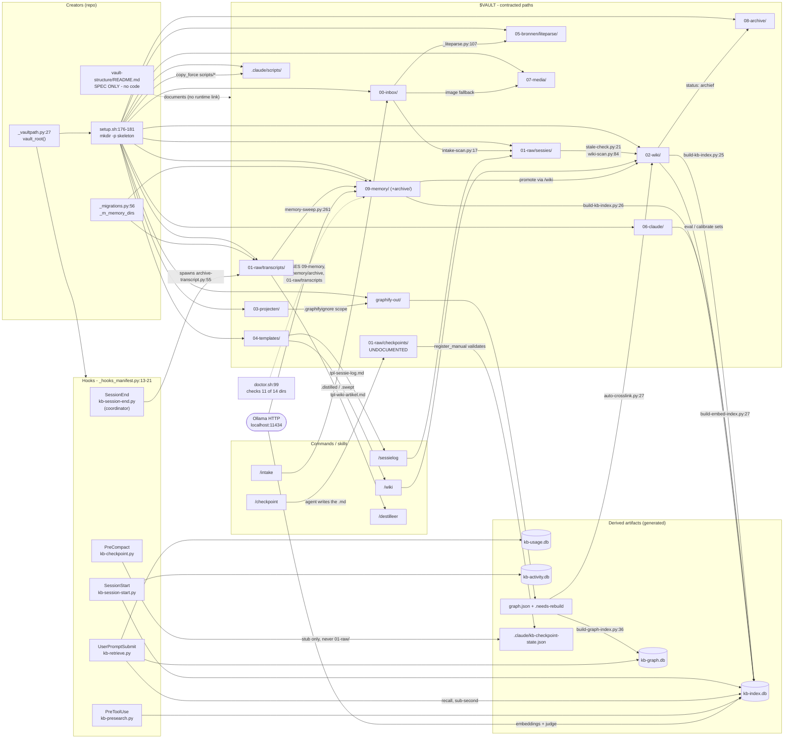

# C4 Code Level — `vault-structure/`

## 1. Overview

| Field | Value |
| --- | --- |
| **Name** | `vault-structure` — the vault skeleton contract |
| **Location** | `vault-structure/` (repo-relative) |
| **Contents** | Exactly one tracked file: `vault-structure/README.md` (111 lines) |
| **Language(s)** | Markdown only. **Zero executable code.** No `.py`, `.sh`, `.json`, no `.gitkeep` placeholders |
| **Purpose** | Human- and agent-readable *specification* of the directory layout that `setup.sh` materializes inside the user's Obsidian vault. It documents the numbered-directory contract (`00-inbox` … `09-memory`), the naming conventions per directory, and the derived files under `.claude/` |

### 1.1 Critical framing — this directory is a specification, not a template tree

A name like `vault-structure/` suggests a skeleton that gets copied. It is not. Verified twice:

```
$ git ls-files vault-structure
vault-structure/README.md
```

```
$ grep -rn "vault-structure" setup.sh scripts/ commands/ skills/ tests/ .github/
(no matches outside docs/superpowers/plans/*.md and CHANGELOG.md)
```

No script, hook, test, or CI job reads `vault-structure/` at runtime. The skeleton is created by
`mkdir -p` calls in `setup.sh` (`setup.sh:176-178`) and re-created idempotently by the migration
runner (`scripts/_migrations.py:56-58`).

Consequently, sections 2-4 below document **the code elsewhere in the repo that creates and consumes
each contracted path**, with `file:line` citations. Every function listed lives outside
`vault-structure/`; that is stated explicitly per element. No function is attributed to
`vault-structure/` because none exists there.

### 1.2 The single source of vault-root resolution (ADR-0002)

Every contracted path is relative to a vault root that is resolved in exactly one place:

```python
# scripts/_vaultpath.py:27
def vault_root() -> Path
```
Returns `$KENNISBANK_VAULT` (with `~` and `$VAR` expansion) when set and non-empty, otherwise
`Path.home() / "KennisBank"`. Constants: `ENV_VAR = "KENNISBANK_VAULT"` (`_vaultpath.py:23`),
`DEFAULT_VAULT = Path.home() / "KennisBank"` (`_vaultpath.py:24`). Stdlib only; the path is returned
unresolved so callers choose whether to `.resolve()`.

`setup.sh` mirrors the same rule in shell: `VAULT="${KENNISBANK_VAULT:-$HOME/KennisBank}"`
(`setup.sh:166`). Any hardcoded vault path outside `_vaultpath.py` is a regression per ADR-0002
(`docs/adr/0002-cross-platform-scripts.md`), and `scripts/doctor.sh` actively greps the deployed
`CLAUDE.md` for the literal string `~/KennisBank/` to catch it (`doctor.sh:125-128`).

---

## 2. Code Elements

### 2.1 The contract, as written in `vault-structure/README.md`

Documented tree (`vault-structure/README.md:5-24`):

```
~/KennisBank/
  00-inbox/            01-raw/{sessies,transcripts}/   02-wiki/
  03-projecten/        04-templates/                   05-bronnen/
  06-claude/           07-media/                       08-archive/
  09-memory/archive/   .claude/scripts/                graphify-out/
  CLAUDE.md
```

Per-directory prose sections: `00-inbox` (`:28-41`), `01-raw` (`:43-52`), `02-wiki` (`:54-63`),
`03-projecten` (`:65-66`), `04-templates` (`:68-71`), `05-bronnen` (`:73-78`), `06-claude` (`:80-81`),
`07-media` (`:83-84`), `08-archive` (`:86-87`), `09-memory` (`:89-94`), `.claude/scripts` (`:96-102`),
`graphify-out` (`:104-107`), `CLAUDE.md` (`:109-110`).

### 2.2 Creators — code that materializes the skeleton

#### `setup.sh` (shell, POSIX `sh`) — the installer

Role: creates every contracted directory, then copies the tooling layer into
`$VAULT/.claude/scripts/` so all execution happens from that copy (this repo is a distribution).

Directory creation, verbatim:

```sh
# setup.sh:176
mkdir -p "$VAULT"/{00-inbox,01-raw/sessies,01-raw/transcripts,02-wiki,03-projecten,04-templates,05-bronnen,06-claude,07-media,08-archive,09-memory,09-memory/archive}
# setup.sh:177
mkdir -p "$VAULT/.claude/scripts"
# setup.sh:178
mkdir -p "$VAULT/graphify-out"
# setup.sh:181  -- OUTSIDE the vault
mkdir -p "$RESEARCH"        # RESEARCH="$HOME/Claude/research"  (setup.sh:167)
```

Shell functions in `setup.sh`, full signatures (shell functions take positional args, typed by
convention in comments):

| Function | Signature (positional) | Location | What it does |
| --- | --- | --- | --- |
| `has_agent` | `has_agent AGENT_NAME` → exit 0/1 | `setup.sh:138` | Membership test on the comma-list `$AGENTS` (`claude,codex,opencode,copilot,all`); gates command/skill/MCP installation |
| `copy_file` | `copy_file SRC DST` → 0 | `setup.sh:148` | Copies **user-data-shaped** files; skips when `DST` exists unless `FORCE=1`. Used for `04-templates/*.md`, `CLAUDE.md`, `.claude/kennisbank-embed.json`, `.claude/kennisbank-llm.json`, `.graphifyignore` |
| `copy_force` | `copy_force SRC DST` → 0 | `setup.sh:161` | Always overwrites. Used for **tooling** (`scripts/*.py`, `*.sh`, `*.json`) — no user data, so the repo version always wins |
| `install_python_dep` | `install_python_dep SPEC IMPORT_NAME PURPOSE` → 0 | `setup.sh:276` | Idempotent `pip install` guarded by `importlib.util.find_spec`; installs `sqlite-vec==0.1.9`, `liteparse>=2.0,<3`, `dateparser>=1.2,<2`, and `mcp==1.28.1` for non-Claude agents (`setup.sh:287-292`) |
| `configure_llm_backend` | `configure_llm_backend` → 0/1 | `setup.sh:202` | Interactive choice of `ollama` (default) vs `openrouter`; delegates to `scripts/install-agent-envs.py --configure-llm` |
| `ask_toggle` | `ask_toggle KEY PROMPT DEFAULT` → 0 | `setup.sh:307` (nested) | Prompts one background-automation toggle and persists it via `_settings.py set` |

Path-populating blocks in `setup.sh`:

- `setup.sh:186-189` — copies `scripts/*.py|*.sh|*.json` into `$VAULT/.claude/scripts/` with `copy_force`, then `chmod +x`. The `*.json` glob is load-bearing: `activity-locales.json` must ship or the temporal date parser runs with an empty vocabulary.
- `setup.sh:193-194` — `kennisbank-embed.example.json` → `$VAULT/.claude/kennisbank-embed.json`; `kennisbank-llm.example.json` → `$VAULT/.claude/kennisbank-llm.json`.
- `setup.sh:200` — `graphifyignore.example` → `$VAULT/.graphifyignore` (graph scope; see 2.6).
- `setup.sh:298-323` — bootstraps `$VAULT/kennisbank-settings.json` (vault **root**, not `.claude/`).
- `setup.sh:326-328` — `templates/*.md` → `$VAULT/04-templates/`.
- `setup.sh:336` — `CLAUDE.md.template` → `$VAULT/CLAUDE.md` (never clobbered without `--force`).

#### `scripts/_migrations.py` (Python 3, stdlib only) — the idempotent re-creator

Role: brings an existing vault deterministically to `VERSION` and stamps
`<vault>/.claude/.kennisbank-schema-version`. This is the path that repairs a vault installed before
the memory layer existed.

Module constants: `VERSION = "0.9.0"` (`:24`), `STAMP_REL = ".claude/.kennisbank-schema-version"` (`:25`),
`MIGRATIONS` list of `(version, name, apply_fn)` (`:87-91`).

| Function | Full signature | Location | What it does | Depends on |
| --- | --- | --- | --- | --- |
| `read_stamp` | `read_stamp(vault_root) -> str` | `_migrations.py:35` | Reads the stamped schema version; `"0.0.0"` on `OSError` | `pathlib` |
| `write_stamp` | `write_stamp(vault_root, version: str) -> None` | `_migrations.py:42` | `mkdir -p` the parent, then writes `version + "\n"` | `pathlib` |
| `_m_memory_dirs` | `_m_memory_dirs(vault_root, ctx) -> None` | `_migrations.py:56` | **Re-creates `09-memory`, `09-memory/archive`, `01-raw/transcripts`** with `parents=True, exist_ok=True`. The only code outside `setup.sh` that (re-)creates *contracted vault* directories — other `mkdir` calls in the tree create parents for derived artifacts only, e.g. `_migrations.py:44` (stamp), `kb-checkpoint.py:55` (state file), `kb-copilot-capture.py:171` (`.claude/copilot-events/`) | `pathlib` |
| `_m_register_hooks` | `_m_register_hooks(vault_root, ctx) -> None` | `_migrations.py:61` | Registers the hook manifest into `~/.claude/settings.json`; a corrupt settings file is caught and skipped so dirs + toggles + stamp still complete | `register-hooks.py` via `_load_sibling` |
| `_m_memory_toggles` | `_m_memory_toggles(vault_root, ctx) -> None` | `_migrations.py:79` | Sets `KENNISBANK_VAULT`, then `_settings.migrate()` | `_settings.py` |
| `pending` | `pending(vault_root) -> list[tuple[str, str, callable]]` | `_migrations.py:94` | Migrations whose version tuple exceeds the stamp | `_vtuple`, `read_stamp` |
| `run` | `run(vault_root, settings_path, skip_hooks=False) -> list[str]` | `_migrations.py:99` | Applies pending migrations, then stamps only when `VERSION` is newer (never downgrades). A failing migration propagates *before* the stamp so a re-run resumes | `pending`, `write_stamp` |
| `main` | `main(argv=None) -> int` | `_migrations.py:115` | CLI: `run <vault_root> <settings_json> [--skip-hooks]` \| `version <vault_root>` | `sys` |

Summarized helper (not dropped): `_vtuple(v: str) -> tuple[int, ...]` (`:28`) parses a dotted version,
returning `(0,)` on `ValueError`; `_load_sibling(name, filename)` (`:48`) `importlib`-loads a
hyphenated sibling script (`register-hooks.py`) that cannot be `import`ed normally.

#### `scripts/doctor.sh` — the contract verifier

```sh
# doctor.sh:99
SUBDIRS="00-inbox 01-raw/sessies 02-wiki 03-projecten 04-templates 05-bronnen 06-claude 07-media 08-archive .claude/scripts graphify-out"
```
Loops `check_dir` over each (`doctor.sh:100-102`). Also `check_file` on the two required templates
(`doctor.sh:145-146`) and the graph artifacts `$VAULT/graphify-out/graph.json` and
`.needs-rebuild` (`doctor.sh:410-411`).

> **Coverage gap (verified, not inferred).** `SUBDIRS` omits **`09-memory`**, **`09-memory/archive`**
> and **`01-raw/transcripts`** — three directories `setup.sh:176` creates and `_migrations.py:57`
> re-creates. Grepping `doctor.sh` for `09-memory` and `transcripts` yields only the three
> `memory-doctor.py` invocations (`doctor.sh:551,552,560`), which check memory *health*
> (`nocloud`, `rot`) and not directory *existence* (`scripts/memory-doctor.py:1-14`). A vault
> missing `09-memory/` therefore passes the doctor's directory check. This is the pattern
> `CLAUDE.md` warns about: a guard that does not cover what its name implies.

### 2.3 Path → creator → consumer contract table

Every consumer cited is code that references the literal path segment. `vault_root()` is the base for
all Python entries.

| Contracted path | Created at | Primary consumers (`file:line`) |
| --- | --- | --- |
| `00-inbox/` | `setup.sh:176` | `scripts/intake-scan.py:17` (`INBOX` constant); `commands/intake.md:1,13,27`; `commands/sessiestart.md:78` (count) |
| `01-raw/` (root) | `setup.sh:176` (implicit) | `scripts/intake-scan.py:133` (`suggested_destination`); `commands/intake.md:18-21` (four intake routes) |
| `01-raw/sessies/` | `setup.sh:176` | `scripts/stale-check.py:21`; `scripts/wiki-scan.py:84`; `scripts/context-budget.py:93`; `scripts/build-karpathy-index.py:50`; `scripts/graph-provenance-ring.py:60`; `scripts/kb-session-log.py:148` (write-fence); `scripts/kb-lint.py:74` (provenance regex); `scripts/_activity.py:460,595`; importers `import-cc-history.py:266`, `import-chatgpt-export.py:260`, `import-claudeai-export.py:230`, `import-folder.py:153`; `commands/sessielog.md:37`; `commands/wiki.md:17`; `commands/import.md:12,35` |
| `01-raw/transcripts/` | `setup.sh:176`, **re-created** `_migrations.py:57` | `scripts/archive-transcript.py:55,75` (the writer — invoked as a coordinator child job, not as a registered hook; see 2.4); `scripts/_sweepstate.py:26`; `scripts/distill-notify.py:32`; `scripts/memory-sweep.py:261`; `scripts/strip-transcript.py:34`; `scripts/import-copilot.py:130`; `scripts/_activity.py:461,650`; `commands/destilleer.md:12,27,71`; `commands/kennisbank/rebuild-memory.md:8` |
| `01-raw/checkpoints/` | **created by nothing** — written by the agent per `commands/checkpoint.md:21`; see 2.5 | `scripts/kb-checkpoint.py:35` (`CHECKPOINT_DIR`), `:104-115` (`register_manual` — path fence + `is_file()`, read-only), `:200` (usage string); `commands/checkpoint.md:21,32`; `tests/test_checkpoint.py:32` (test creates it by hand) |
| `01-raw/debug/` | not created | in graph scope (`graphifyignore.example`); accepted as valid provenance location by `scripts/kb-lint.py:100` |
| `02-wiki/` | `setup.sh:176` | `scripts/build-kb-index.py:25`; `scripts/build-embed-index.py:27,43`; `scripts/conflict-scan.py:247`; `scripts/semantic-tiling.py:28`; `scripts/stale-check.py:20`; `scripts/find-similar.py:146`; `scripts/auto-crosslink.py:28`; `scripts/kb-lint.py:240`; `scripts/kb-recall.py:110,188`; `scripts/kb-retrieve.py:229`; `scripts/kb-search.py:131`; `scripts/_rank.py:216`; `scripts/_activity.py:463,735`; `scripts/kb-okf-export.py:82`; `commands/wiki.md:43`; `commands/sessielog.md:82`; `commands/sessiestart.md:54-61,73,91`; `commands/reconcile.md:65` |
| `03-projecten/` | `setup.sh:176` | No Python consumer references the literal path. Verified consumers: `doctor.sh:99` (existence) and graph scope (`graphifyignore.example`, echoed in `commands/sessielog.md:94`). It is a user-facing convention, indexed only indirectly via graphify |
| `04-templates/` | `setup.sh:176`, filled `setup.sh:326-328` | `doctor.sh:145-146` (both templates must exist); `commands/sessielog.md:43` (`tpl-sessie-log.md`); `templates/tpl-wiki-artikel.md` used via `commands/sessielog.md:82` / `commands/wiki.md:43`; `skills/kennisbank-upgrade/SKILL.md:24,44,64`; `skills/kennisbank-contribute/SKILL.md:25` |
| `05-bronnen/` | `setup.sh:176` | `scripts/_liteparse.py:107` (`05-bronnen/liteparse/` output); `scripts/parse-document.py:92`; `scripts/_provenance.py:48,77`; `scripts/kb-lint.py:123-132` (source-provenance links); `scripts/kb-normalize.py:44` (exempt from stem-normalization); `scripts/kb-okf-export.py:189`; `commands/intake.md:24`; `commands/import.md:19`; `commands/wiki.md:105,116`; `templates/tpl-wiki-artikel.md:38` |
| `06-claude/` | `setup.sh:176` | `scripts/kb-eval.py:61-62` (`kb-eval-set.json`, `kb-memory-eval-set.json`); `scripts/kb-calibrate.py:44`; `scripts/kb-activity-eval.py:35`; `scripts/kb-eval-gen.py:187` (writes `*.draft.json` only); `scripts/kb-lint.py:65` (self-source prefix); `tests/test_eval_privacy.py:40` (asserts no `06-claude/` path is git-tracked). **The README claim at `:81` that `CLAUDE.md` may live here is honored by no code in this repo** — grepping `commands/` and `skills/` for `06-claude` returns nothing |
| `07-media/` | `setup.sh:176` | `commands/intake.md:25` (image-description fallback destination). Excluded from graph scope. No Python consumer |
| `08-archive/` | `setup.sh:176` | `scripts/kb-lint.py:15,100` (archived sessions remain valid provenance). Excluded from graph scope. No writer in code — moving articles there is a human/agent action |
| `09-memory/` | `setup.sh:176`, **re-created** `_migrations.py:57` | `scripts/_memory.py:110` (`memory_dir()`); `scripts/_maintenance.py:39,157`; `scripts/memory-sweep.py:101,154`; `scripts/memory-doctor.py:74,119`; `scripts/build-kb-index.py:26`; `scripts/wiki-scan.py:111`; `scripts/graph-scope-prune.py:35`; `scripts/kb-eval-gen.py:135`; `scripts/kb-okf-export.py:87`; `scripts/_activity.py:462,699`; `commands/kennisbank/review.md:25`; `commands/wiki.md:158` |
| `09-memory/archive/` | `setup.sh:176`, `_migrations.py:57` | Month-archive of non-promoted memories; written by the maintenance path (`scripts/_maintenance.py`) |
| `.claude/scripts/` | `setup.sh:177`, filled `setup.sh:186-189` | The execution root for everything. Referenced by `scripts/install-agent-envs.py:287,504,620-628`; `scripts/_copilot.py:94,374-375`; every command (`commands/*.md`) invokes `$VAULT/.claude/scripts/<name>.py` |
| `graphify-out/` | `setup.sh:178` | `scripts/auto-crosslink.py:27` (`graph.json`); `scripts/build-graph-index.py:36`; `scripts/graph-link-layer.py:208`; `scripts/graph-provenance-ring.py:245`; `scripts/graph-scope-prune.py:105`; `scripts/kb-recall.py:93`; `scripts/kb-session-start.py:333,361`; `doctor.sh:410-411`; `commands/sessielog.md:84,93,101,115`; `commands/sessiestart.md:84`; `commands/brug.md:40` |
| `CLAUDE.md` (vault root) | `setup.sh:336` from `CLAUDE.md.template` | Read by Claude Code itself; validated by `doctor.sh:105-129` (presence, unreplaced placeholders, hardcoded `~/KennisBank/`) |
| `$HOME/Claude/research/` | `setup.sh:181` — **outside the vault** | `skills/autoresearch/SKILL.md` output directory |

### 2.4 Consumer entry points — full signatures

These are the public/entry-point functions that own a contracted path. One per path family; helpers
inside the same file are summarized at the end of each group rather than dropped.

**`00-inbox/` — `scripts/intake-scan.py`**
```python
INBOX = vault_root() / "00-inbox"                      # intake-scan.py:17
def scan() -> dict                                     # intake-scan.py:103
```
`scan()` returns `{"files": [...], "total": int, "empty": bool}` and, when the directory is absent,
`{"error": "00-inbox niet gevonden: <path>"}` (`:105`) — fail-soft, never a traceback.
Summarized helpers: `detect_type(path: Path) -> str` (`:22`), `has_frontmatter(path: Path) -> bool` (`:54`),
`suggested_action(file_type: str, path: Path) -> str` (`:64`), `first_line(path: Path) -> str | None` (`:79`),
`extract_url(path: Path) -> str | None` (`:91`).

**`01-raw/transcripts/` — `scripts/archive-transcript.py`** (the writer, via the SessionEnd coordinator)
```python
def dest_path(vault: Path, hook: dict, src: Path) -> Path   # archive-transcript.py:50
def archive(hook: dict, vault: Path) -> dict                # archive-transcript.py:58
def main() -> int                                           # archive-transcript.py:96
```
`dest_path` composes `vault / "01-raw" / "transcripts" / f"{date}-{slug}-{sid8}.jsonl"` (`:55`).
Summarized helpers: `_date_from_transcript(src: Path) -> str` (`:37`), `_sid8(session_id: str | None, fallback: str) -> str` (`:44`).

> **Wiring correction — the README is one refactor behind.** `vault-structure/README.md:52` says
> transcripts are "written by the `SessionEnd` hook (`archive-transcript.py`)". As of the current
> tree that is no longer the wiring. `archive-transcript.py` sits in
> `LEGACY_SESSION_END_SCRIPTS` (`_hooks_manifest.py:55-58`), a frozenset that
> `register-hooks.py:223` uses to **remove** its direct hook registration during upgrade. The
> registered `SessionEnd` hook is the coordinator `kb-session-end.py` (`_hooks_manifest.py:16`),
> which spawns `archive-transcript.py` as a child job for Claude/Codex
> (`kb-session-end.py:208`) or, for Copilot, `kb-copilot-capture.py --event sessionEnd` followed by
> `import-copilot.py --include-active` (`kb-session-end.py:202-206`). The *file* that ends up in
> `01-raw/transcripts/` is the same; the process that puts it there is one level deeper.

**`01-raw/transcripts/` watermarks — two independent append-only markers**
```python
# scripts/distill-notify.py — the /destilleer watermark
WATERMARK_NAME = ".distilled"                          # :28
def pending(vault: Path) -> list[str]                  # :50
def mark(vault: Path, stems: list[str]) -> int         # :55
def main() -> int                                      # :88
# scripts/_sweepstate.py — the memory-sweep watermark (deliberately separate)
WATERMARK = ".swept"                                   # :22
def pending(vault=None) -> list                        # :37
def mark(stems, vault=None) -> int                     # :45
def transcript_text(jsonl_path) -> str                 # :76
```
Summarized helpers: `distill-notify._transcripts_dir/_read_watermark/_all_stems/_emit_notify`
(`:31,35,43,74`); `_sweepstate._tdir/_watermark/_block_text` (`:25,29,62`).

**`01-raw/sessies/` write fence — `scripts/kb-session-log.py`**
```python
def _validate_session_log(vault: Path, value: str) -> Path   # kb-session-log.py:146
def coordinate(...)                                          # kb-session-log.py:154
def main(argv: list[str] | None = None) -> int               # kb-session-log.py:168
```
`_validate_session_log` resolves `vault / "01-raw" / "sessies"` (`:148`) and raises
`ValueError("session log must exist below <vault>/01-raw/sessies")` (`:150`) — a path-containment
guard, not a convenience check. Summarized helpers: `_vault()` (`:53`), `run_child(job, scripts)` (`:57`),
`run_parallel(...)` (`:78`), `relevant_report(result)` (`:114`).

**`02-wiki/` + `09-memory/` indexing — `scripts/build-kb-index.py`**
```python
VAULT = vault_root(); WIKI = VAULT / "02-wiki"; MEMORY = VAULT / "09-memory"   # :24-26
WIKI_SKIP = {"index.md", "log.md"}                                            # :27
def main(rebuild: bool = False) -> None                                       # :64
```
Summarized helpers: `_doc_meta(path, layer)` (`:30`), `_collect()` (`:49`) — the latter defines the
canonical index scope that `kb-eval-gen.py:27` mirrors.

**`02-wiki/` embeddings — `scripts/build-embed-index.py`**
```python
WIKI = VAULT / "02-wiki"                               # :27
def main() -> None                                     # :31
```
Prints `"embed-index: geen 02-wiki/, overgeslagen"` and returns when the directory is absent (`:43`).

**`02-wiki/` ↔ `01-raw/sessies/` staleness — `scripts/stale-check.py`**
```python
WIKI_DIR = VAULT_ROOT / "02-wiki"                      # :20
SESSIES_DIR = VAULT_ROOT / "01-raw" / "sessies"        # :21
def load_sessie_dates() -> list[tuple[date, Path]]     # :40
def mentions_article(sessie_path: Path, stem: str, title: str) -> bool  # :54
def main()                                             # :66
```
This is why `vault-structure/README.md:49` says session logs must not be deleted: staleness is
computed by cross-referencing session dates against wiki `updated` dates.

**`05-bronnen/liteparse/` — `scripts/_liteparse.py`**
```python
def default_output_path(vault: Path, source: Path, prefix: str = "") -> Path   # _liteparse.py:104
def parse_document(source: Path, *, ...)                                       # _liteparse.py:110
```
`default_output_path` yields `vault / "05-bronnen" / "liteparse" / f"bron-{date}-{slug}.md"` (`:107`).

**`09-memory/` — `scripts/_memory.py`**
```python
def memory_dir() -> Path                                                    # _memory.py:109
def memory_path(title: str, created: str | None = None) -> Path             # _memory.py:113
```
`memory_path` produces the contracted `YYYY-MM-DD-slug.md` name. A review path outside `09-memory`
raises `ReviewError(400, "pad buiten 09-memory")` (`_memory.py:398`).

**`graphify-out/graph.json` — `scripts/auto-crosslink.py`**
```python
GRAPH_PATH = VAULT_ROOT / "graphify-out" / "graph.json"     # :27
WIKI_DIR_PREFIX = "02-wiki/"                                # :28
def load_graph(path: Path) -> tuple[dict, dict, list]       # :38
def process_file(filepath: Path, node_map: dict, links: list, dry_run: bool = False) -> None  # :103
def main() -> None                                          # :234
```
Summarized helpers: `normalize_path(raw: str) -> str` (`:47`), `existing_stems(content: str) -> set[str]` (`:59`),
`find_section_insert(lines: list[str]) -> tuple[int, int]` (`:64`), `resolve_path(arg: str) -> Path` (`:217`).

**`06-claude/` eval sets — path constants only (no shared accessor)**
```python
DEFAULT_SET = "06-claude/kb-eval-set.json"             # kb-eval.py:61
MEMORY_SET  = "06-claude/kb-memory-eval-set.json"      # kb-eval.py:62
DEFAULT_SET = "06-claude/kb-calibrate-set.json"        # kb-calibrate.py:44
eval_path = ... or vault / "06-claude" / "kb-activity-eval-set.json"   # kb-activity-eval.py:35
out_dir   = ... or vault / "06-claude"                 # kb-eval-gen.py:187 (writes *.draft.json only)
```

### 2.5 Contract drift — paths the code uses that the README does not document

Each row is verified in code, not inferred. This is the highest-risk content in this document: a
fresh vault does not contain these directories, and only the writing script creates them lazily.

| Path | Written by | Created by `setup.sh`? | In README? | Evidence |
| --- | --- | --- | --- | --- |
| `01-raw/checkpoints/` | **the agent**, following `commands/checkpoint.md:21`. No code creates or writes it — see the note below | **No** | **No** | `CHECKPOINT_DIR = ("01-raw", "checkpoints")` (`kb-checkpoint.py:35`); `register_manual(vault: Path, md_path: str) -> str \| None` (`:104`) resolves the path, enforces `target.relative_to(allowed)` (`:107-113`) and rejects a non-existent file with `"geweigerd: ... bestaat niet"` (`:114-115`); `tests/test_checkpoint.py:32` creates it manually |
| `.claude/copilot-events/` | `scripts/kb-copilot-capture.py:168`, read by `scripts/import-copilot.py:152` | **No** | **No** | `output_path(vault: Path, session_id: str) -> Path` (`kb-copilot-capture.py:167`); `append_event` does `path.parent.mkdir(parents=True, exist_ok=True)` (`:171-173`) |
| `$VAULT/kennisbank-settings.json` (vault **root**) | `setup.sh:298-323`, `scripts/_settings.py` | Yes (file) | **No** | `FILENAME = "kennisbank-settings.json"` (`_settings.py:32`); note it is *not* under `.claude/` |
| `$VAULT/.graphifyignore` | `setup.sh:200` | Yes (file) | **No** | Determines graph scope; without it graphify falls back to `.gitignore`, which silently excludes `09-memory` (`commands/sessielog.md:94`) |
| `$VAULT/categories.json` (optional) | user | No | **No** | `CATEGORIES_FILENAME = "categories.json"` (`build-karpathy-index.py:312`); lookup order: next to the script, then vault root (`:293-296`); example at `categories.example.json` |
| `01-raw/debug/` | user/agent | No | **No** | Only appears in graph scope and `kb-lint.py:100` |

> **`01-raw/checkpoints/` has no writer in code — worth stating precisely, because the directory
> name invites the opposite assumption.** `kb-checkpoint.py` has exactly one `mkdir`
> (`kb-checkpoint.py:55`) and it creates the parent of `.claude/kb-checkpoint-state.json`, not the
> checkpoint directory. The two checkpoint paths are asymmetric (`kb-checkpoint.py:4-18`):
> the AUTO path (`PreCompact`, Claude-only, toggle `checkpoints`, default **off**) writes a
> mechanical stub into the **state JSON** and never touches `01-raw/`; the MANUAL path
> (`--register`, invoked by `/checkpoint`) only *validates and registers* a markdown file the agent
> has already written. So on a fresh vault the first `/checkpoint` must create the directory itself,
> and if it does not, `register_manual` fails closed with `"geweigerd: ... bestaat niet"`.

**No test enforces the README tree.** Verified: `grep -rn "vault-structure" tests/ .github/` returns
nothing. The closest guards are `tests/test_setup_deploy.py:199` (asserts `01-raw/transcripts` exists
after install) and `tests/test_setup_deploy.py:366-369` (`test_setup_creates_09_memory_dir`, which
asserts the *strings* `"09-memory"` and `"09-memory/archive"` appear in `setup.sh` source text — not
that the README agrees). `tests/test_docs_consistency.py` checks README language-variant parity
(`:62`), MCP primitive counts (`:85`), and env-var documentation (`:147`) — not the vault tree. The
absence of that test is the mechanical explanation for the drift above.

### 2.6 Derived and generated artifacts under `.claude/`

Per the generated-artifact rule these are enumerated by path and writer, **not** documented element
by element. `vault-structure/README.md:99-102` lists only three of them; the code writes at least ten.

| Artifact | Kind | Writer / accessor | In README? |
| --- | --- | --- | --- |
| `.claude/kb-index.db` | SQLite (sqlite-vec + FTS5) | `_kbindex.index_path() -> Path` (`_kbindex.py:33`); built by `build-kb-index.py:64` | Yes (`:100`) |
| `.claude/kb-graph.db` | SQLite | `_kbindex.graph_index_path() -> Path` (`_kbindex.py:327`); built by `build-graph-index.py` | **No** |
| `.claude/kb-usage.db` | SQLite | `_usage.db_path() -> Path` (`_usage.py:66`), `DB_NAME = "kb-usage.db"` (`:43`) | **No** |
| `.claude/kb-activity.db` | SQLite | `_activity.activity_db_path(vault: Path | None = None) -> Path` (`_activity.py:154`), `DB_NAME` (`:40`) | **No** |
| `.claude/embeddings-cache.json` | JSON cache | `_embeddings.CACHE_FILE` (`_embeddings.py:63`) | **No** |
| `.claude/kennisbank-embed.json` | Config (user-editable) | `setup.sh:193`; read at `_embeddings.py:67` | **No** |
| `.claude/kennisbank-llm.json` | Config (user-editable) | `setup.sh:194`; read at `_llm.py:40` | **No** |
| `.claude/memory-sweep-status.json` | Heartbeat | `memory-sweep.py:199` (`HEARTBEAT`, `:42`); read by `memory-notify.py:24` | Yes (`:101`) |
| `.claude/.sweep.lock` | Lockfile | `sweep-launch.py:28` (`LOCK_NAME`) | Yes (`:102`) |
| `.claude/.kb-index-worker.lock` | Lockfile | `index-launch.py:37` + `_lock_path()` (`:70`) | **No** |
| `.claude/.kb-session-start.lock` | Lockfile | `kb-session-start.py:34` | **No** |
| `.claude/kb-checkpoint-state.json` | State | `kb-checkpoint.state_path(vault: Path) -> Path` (`kb-checkpoint.py:41`) | **No** |
| `.claude/.kennisbank-schema-version` | Version stamp | `_migrations.write_stamp` (`:42`) | **No** |
| `.claude/activity-llm-audit.jsonl` | Audit log | `_activity.py:1269` | **No** |
| `.claude/memory-review-log.jsonl` | Audit log | read at `kb-okf-export.py:97` | **No** |
| `graphify-out/graph.json` | Generated graph | graphify skill; read by `auto-crosslink.py:27`, `build-graph-index.py:36`, `kb-recall.py:93` | Yes (`:105`) |
| `graphify-out/.needs-rebuild` | Dirty-flag | `commands/sessielog.md:84`; read at `kb-session-start.py:361` | Yes (`:107`) |
| `graphify-out/cost.json` | Token accounting | `commands/sessielog.md:101` | **No** |
| `01-raw/transcripts/.distilled` | Watermark | `distill-notify.mark` (`:55`) | Partly (`:52` mentions the hook, not the file) |
| `01-raw/transcripts/.swept` | Watermark | `_sweepstate.mark` (`:45`) | **No** |

### 2.7 Graph scope — which contracted directories reach the knowledge graph

`graphifyignore.example` → `$VAULT/.graphifyignore` (`setup.sh:200`) is deny-all-then-allow:

- **In scope:** `02-wiki/**`, `09-memory/**`, `03-projecten/**`, `05-bronnen/research/**`, `01-raw/debug/**`
- **Out of scope:** `00-inbox/`, `04-templates/`, `06-claude/`, `07-media/`, `08-archive/`, `graphify-out/`, `.claude/`, `.obsidian/`, `.git/`, and the rest of `05-bronnen/*` and `01-raw/*`

This file must exist: without it graphify falls back to `.gitignore`, which in a KennisBank vault is
the *publication* whitelist and excludes `09-memory` — producing a silently incomplete graph
(`commands/sessielog.md:94`, `setup.sh:196-199`).

---

## 3. Dependencies

### 3.1 Internal (by repo path)

`vault-structure/README.md` itself has **zero** code dependencies — nothing imports or reads it. The
dependency graph below is that of the contract it describes.

| Path | Role relative to the contract |
| --- | --- |
| `setup.sh` | Creates all directories (`:176-181`); installs the tooling into `.claude/scripts` |
| `scripts/_vaultpath.py` | `vault_root()` — the only sanctioned root resolver (ADR-0002) |
| `scripts/_migrations.py` | Idempotently re-creates `09-memory`, `09-memory/archive`, `01-raw/transcripts`; stamps schema version |
| `scripts/doctor.sh` | Verifies 11 of the 14 contracted directories (`:99`) plus templates and graph artifacts |
| `scripts/_hooks_manifest.py` | Canonical hook list — `SessionStart`→`kb-session-start.py`/`kb-session-end-recover.py`, `UserPromptSubmit`→`kb-retrieve.py`, `SessionEnd`→`kb-session-end.py`, `PreToolUse(WebSearch\|WebFetch)`→`kb-presearch.py`, `PreCompact`→`kb-checkpoint.py` (`:13-21`). Also owns the two *removal* lists that de-register pre-coordinator wiring on upgrade: `LEGACY_SESSION_END_SCRIPTS` (`:55-58`, includes `archive-transcript.py`) and `LEGACY_SESSION_START_SCRIPTS` (`:61-67`), consumed by `register-hooks.py:198,223` |
| `scripts/register-hooks.py`, `scripts/install-agent-envs.py`, `scripts/_copilot.py` | Wire the hooks per agent; all paths point into `$VAULT/.claude/scripts/` |
| `scripts/_settings.py` | `$VAULT/kennisbank-settings.json` toggles that gate which background writers touch which directories |
| `scripts/_kbindex.py`, `_usage.py`, `_activity.py`, `_embeddings.py`, `_llm.py` | Own the derived `.claude/` artifacts in 2.6 |
| `templates/tpl-sessie-log.md`, `templates/tpl-wiki-artikel.md` | The two files `04-templates/` must contain (`doctor.sh:145-146`) |
| `CLAUDE.md.template`, `graphifyignore.example`, `kennisbank-*.example.json`, `categories.example.json` | Sources for vault-root config files |
| `commands/*.md`, `commands/kennisbank/*.md` | Slash commands; the main consumers of `00-inbox`, `04-templates`, `07-media`, `03-projecten` |
| `skills/kennisbank-upgrade`, `skills/kennisbank-contribute` | Map `$VAULT/.claude/scripts` and `$VAULT/04-templates` back to repo paths for upgrade/backport |
| `docs/adr/0002-cross-platform-scripts.md` | The ADR that makes `vault_root()` mandatory |
| `tests/test_setup_deploy.py`, `tests/test_migrations.py`, `tests/test_checkpoint.py`, `tests/test_eval_privacy.py` | The partial enforcement layer described in 2.5 |

### 3.2 External

| Dependency | Kind | Where it enters |
| --- | --- | --- |
| Python 3 (`py -3` on Windows for hooks, `python3` elsewhere) | Runtime | `setup.sh:272-275`; interpreter convention per platform |
| POSIX `sh` (Git Bash on Windows) | Runtime | `setup.sh`, `scripts/doctor.sh` |
| `sqlite3` (stdlib) | Library | All four databases in 2.6 |
| `sqlite-vec==0.1.9` | Library | `setup.sh:287` — vector search inside `kb-index.db` |
| `liteparse>=2.0,<3` | Library | `setup.sh:288` — PDF/Office/image parsing into `05-bronnen/liteparse/` |
| `dateparser>=1.2,<2` | Library | `setup.sh:289` — multilingual temporal recall |
| `mcp==1.28.1` | Library | `setup.sh:291` — only when Codex/OpenCode/Copilot are selected |
| Ollama daemon, `http://localhost:11434` (default) | Local HTTP service | Embeddings (`_embeddings.py`) and the memory judge/extractor (`_llm.py`); `memory-doctor.py nocloud` asserts the endpoint is loopback |
| OpenRouter HTTPS API (opt-in) | Cloud HTTP service | `setup.sh:224-259`; setup prints an explicit warning that content leaves the machine |
| Obsidian | Host application | The vault is an Obsidian vault; `.obsidian/` is excluded from graph scope |
| graphify skill | External tool | Produces `graphify-out/graph.json` and `cost.json` |
| Claude Code / Codex CLI / OpenCode / GitHub Copilot CLI | Host agents | Consume hooks and `$VAULT/CLAUDE.md` |

**Databases (all local, all under `$VAULT/.claude/`):** `kb-index.db`, `kb-usage.db`,
`kb-activity.db`, `kb-graph.db`. **HTTP endpoints:** Ollama loopback (default) and, opt-in only,
OpenRouter. Nothing else leaves the machine.

---

## 4. Relationships



### 4.1 Reading the flowchart

1. **`vault-structure/README.md` is a dotted edge.** It documents the layout; it participates in no
   runtime path. Change the contract and nothing breaks until a human notices.
2. **Two creators, one resolver.** `setup.sh` creates everything on install; `_migrations.py`
   re-creates the three memory-era directories on upgrade. Both derive the root from the same rule
   (`$KENNISBANK_VAULT` → `~/KennisBank`).
3. **The hot path never walks the vault.** `UserPromptSubmit`/`kb-retrieve.py` queries `kb-index.db`
   and `kb-graph.db`; markdown is scanned only at write time or in background jobs. That is the
   performance contract in `CLAUDE.md` expressed as directory layout.
4. **Knowledge flows one way:** `00-inbox` → `01-raw` → `02-wiki` → `08-archive`, with `09-memory`
   as a parallel automatic lane that promotes into `02-wiki` via `/wiki`.
5. **Two guard holes to keep in view:** `doctor.sh:99` does not check `09-memory`,
   `09-memory/archive` or `01-raw/transcripts`; and `01-raw/checkpoints/` is created by no installer
   *and by no script* — the `/checkpoint` agent must create it, while `kb-checkpoint.py` only
   validates what it finds there.

---

## Verification notes

- Every `file:line` above was read in this session. No function is listed that was not seen in source.
- `vault-structure/` contains no vendored third-party code and no generated artifacts — it contains
  one hand-written Markdown file.
- Derived databases, lockfiles, caches and `graph.json` are enumerated by path and writer only
  (section 2.6), per the generated-artifact rule.
- Summarized-not-dropped helpers are named inline in section 2.4 for `intake-scan.py`,
  `archive-transcript.py`, `distill-notify.py`, `_sweepstate.py`, `kb-session-log.py`,
  `build-kb-index.py`, `auto-crosslink.py`, and `_migrations.py`.
- Not exhaustively documented, deliberately: the remaining ~70 scripts in `scripts/` that touch the
  vault only through `kb-index.db`/`kb-graph.db` rather than through a contracted path. They are
  out of scope for a directory-contract document and are covered by the per-script C4 pages.
