# C4 Component Level: Agent Integration

> Synthesized from `c4-code-scripts-session-lifecycle.md`, `c4-code-adapters.md`,
> `c4-code-commands.md`, and `c4-code-skills.md`. Cross-checked against
> `c4-code-scripts-core-shared.md`, `c4-code-scripts-retrieval.md`,
> `c4-code-scripts-indexing.md`, `c4-code-scripts-memory-capture.md`,
> `c4-code-scripts-quality-graph.md`, `c4-code-scripts-import-intake.md`, and
> `c4-code-scripts-eval-integration.md` for interface and dependency accuracy.
> Every claim below traces to a `file:line` citation in one of those documents
> (repeated here without re-verifying against source a second time) or is
> flagged as inferred.

## 1. Overview

| Field | Value |
| --- | --- |
| **Name** | Agent Integration |
| **Description** | The harness-facing surface of KennisBank: the hook coordinators an agent client invokes directly at session boundaries, the slash-command procedures a human triggers, the skill manifests that encode multi-step operator workflows, and the per-harness adapter/installer layer that writes and validates KennisBank configuration into four different agent clients. |
| **Type** | Adapter / integration layer — a mix of (a) short-lived hook processes invoked synchronously by an agent client at lifecycle events, (b) declarative Markdown procedures (commands, skills) interpreted by the LLM itself, and (c) a one-shot CLI installer/validator run by `setup.sh` or the `kennisbank-upgrade` skill. Not a persistent service — KennisBank is a distribution, not a running daemon. |
| **Technology** | Python 3.10+ stdlib only (hooks, installers, adapters); Markdown with YAML frontmatter (commands, skills); JSON (`adapters/registry.json`, generated Claude/Codex/OpenCode/Copilot config); TOML (`config.toml` for Codex); one generated JavaScript/Bun plugin (OpenCode). |

## 2. Purpose

Agent Integration is the boundary layer between "KennisBank as a set of local
scripts and a vault" and "KennisBank as something a specific agent client
(Claude Code, Codex CLI, OpenCode, or the standalone GitHub Copilot CLI)
actually runs." It solves three distinct problems:

1. **Lifecycle coordination.** Every agent client fires SessionStart /
   SessionEnd (or the Codex/Copilot equivalents `Stop` / `sessionStart` /
   `sessionEnd`) as opaque hook events. This component owns the *one*
   coordinator process per event that fans out to the scripts owned by other
   components (indexing, memory-capture, retrieval notifications) so that no
   client ever has to register more than one hook per lifecycle point
   (`c4-code-scripts-session-lifecycle.md` §1, `docs/adr/ADR-006`/`ADR-007`
   cited there). Every entry point in this layer is fail-open by design — a
   broken KennisBank must never block a session start, a prompt, or a
   shutdown (`c4-code-scripts-session-lifecycle.md:34-38`).
2. **Cross-harness portability.** The same vault, the same MCP server
   (`kb-mcp.py`), and the same lifecycle capture must be reachable identically
   from four harnesses with incompatible config formats (`~/.claude/settings.json`,
   `~/.codex/{hooks.json,config.toml}`, `~/.config/opencode/opencode.json`,
   `~/.copilot/{mcp-config.json,hooks/kennisbank.json}`). This component is the
   single place that knows how to write, self-heal, and validate each of those
   surfaces idempotently and non-destructively (`c4-code-adapters.md` §3, the
   11-rule adapter contract C1–C11).
3. **Human-triggered procedure execution.** Slash commands and skills are the
   auditable entry points a human (or an agent following a trigger phrase)
   uses to run a KennisBank workflow — write a session log, compile the wiki,
   release a new version, upgrade a deployed vault. They are "a procedure for
   an LLM": deterministic script calls in a fixed order, with a stated output
   contract, so the human interface is not improvised (`c4-code-commands.md`
   §1, "What a code element is in this directory").

Everything this component *does* — the actual retrieval, indexing, memory
extraction, quality checks, and imports — is implemented in sibling
components; Agent Integration triggers, sequences, and reports on that work,
and owns the shape of the client-facing payload.

## 3. Software Features

- **SessionStart coordination** — checkpoint notice, freshness/lock gate, detached (non-blocking) index maintenance, notification fan-out, one aggregated status line (`kb-session-start.py`, `c4-code-scripts-session-lifecycle.md` §2.1).
- **SessionEnd/Stop coordination** — deterministic transcript-capture phase followed by parallel post-capture jobs, with a `running`→`completed` state record and a diagnostic log so a killed hook leaves a trace (`kb-session-end.py`, §2.2).
- **Cancelled-exit recovery** — a second SessionStart hook that detects a SessionEnd run the client killed mid-flight and re-runs the capture, closing the loop the exit coordinator opens (`kb-session-end-recover.py`, §2.3).
- **`/sessielog` mechanical follow-up** — rebuilds the derived indexes and runs notifications after the agent has written the semantic session log, reporting only what changed (`kb-session-log.py`, §2.4).
- **Vault orientation** — a sub-second, pure-SQL "what lives in this vault" summary for `/sessiestart`, or a gated SessionStart context injection (`kb-orientation.py`, §2.5).
- **Progressive context budgets** — a standalone CLI emitting layered vault context (identity/active/relevant/bodies) so `/sessiestart` can request only as much as a level needs (`context-budget.py`, §2.6).
- **Distillation watermarking and notice** — tracks which archived transcripts have been distilled, exposes a pending-list/mark CLI for `/destilleer`, and an opt-out SessionStart notice (`distill-notify.py`, §2.11).
- **Claude Code hook registration** — idempotent, self-healing, non-destructive registration of the hook manifest into `~/.claude/settings.json`, preserving user edits it cannot own (`register-hooks.py`, `c4-code-adapters.md` §2.6).
- **Cross-agent installer and validator** — installs and validates Codex, OpenCode, and Copilot configuration (skills, commands/prompts, hooks, MCP registration, agent instructions), plus Claude-side validation, from a single CLI (`install-agent-envs.py`, §2.3).
- **GitHub Copilot CLI adapter** — the hermetically testable layer implementing ADR-0003's D1–D6 decisions: MCP registration, hook migration, instructions, and a custom agent profile, all as idempotent primitives with dry-run support (`_copilot.py`, §2.4).
- **Single source of truth for hooks** — one declarative list of (event, script, matcher) triples and per-script timeouts consumed by all three installation paths (`_hooks_manifest.py`, §2.5).
- **Copilot activity capture pipeline** — a trivial launcher (never a proxy) plus a hook-payload adapter that redacts and stages Copilot events, and an importer that normalizes staged events into the generic transcript shape the activity index reads (`kennisbank-copilot.py`, `kb-copilot-capture.py`, `import-copilot.py`, §2.7).
- **Multi-agent status dashboard** — a single-glance "is each harness configured" report reusing the Copilot adapter for detection (`agent-status.py`, §2.10).
- **Session lifecycle slash commands** — `/sessielog` (write phase), `/sessiestart` (read phase), `/checkpoint` (crash/compaction bridge).
- **Knowledge-compilation slash commands** — `/wiki`, `/destilleer`, `/intake`, `/import`, each a deterministic candidate-scan-then-act procedure.
- **Quality and human-decision slash commands** — `/stale`, `/reconcile`, `/kennisbank:review`, each surfacing machine output for a human decision, never auto-deciding.
- **Retrieval and analysis slash commands** — `/brug`, `/uitdaag`, `/timeline`, `/watdeedik`, `/weeklog`, read-only, vault-internal only.
- **Administration slash commands** — `/kennisbank:settings`, `/kennisbank:rebuild-index`, `/kennisbank:rebuild-memory`, and the two skill launchers `/kennisbank-upgrade`, `/kennisbank-contribute`.
- **Release procedure** — `kennisbank-release` skill: version proposal from commit delta, changelog + dual-README edit, two-phase pytest gate, PR, mandatory Copilot-review processing, verified-merge tagging, GitHub release (`c4-code-skills.md` §2.1).
- **Vault upgrade procedure** — `kennisbank-upgrade` skill: tag resolution, drift guard across all four deploy-map categories with out-of-tree backups, delegated deploy via `setup.sh`, settings reconciliation, optional memory backfill (§2.2).
- **Upstream contribution procedure** — `kennisbank-contribute` skill: reverse deploy map, three ordered filters (scope, skill-eligibility, localization auto-skip), branch/PR (§2.3).
- **Bounded autonomous research loop** — `autoresearch` skill: a lazy vault-hierarchy check before any web search, max-3-round research, one structured markdown output with a hand-off back to `/sessielog` (§2.4).
- **Declarative adapter registry** — `adapters/registry.json`, a documentation-only index of two opt-in, hand-installed integration points; verified to have no code reader (`c4-code-adapters.md` §2.1, "Two accuracy findings").

## 4. Code Elements

This component is synthesized from four C4 Code-level documents:

- [c4-code-scripts-session-lifecycle.md](./c4-code-scripts-session-lifecycle.md) — the 11 SessionStart/SessionEnd hook coordinators, orientation/context-budget CLIs, and hook-registration/cross-agent-installer scripts (`kb-session-start.py`, `kb-session-end.py`, `kb-session-end-recover.py`, `kb-session-log.py`, `kb-orientation.py`, `context-budget.py`, `quiet-hook.py`, `register-hooks.py`, `install-agent-envs.py`, `agent-status.py`, `distill-notify.py`).
- [c4-code-adapters.md](./c4-code-adapters.md) — the per-harness adapter contract: `adapters/registry.json`, `install-agent-envs.py`, `_copilot.py`, `_hooks_manifest.py`, `register-hooks.py`, and the Copilot runtime adapters (`kennisbank-copilot.py`, `kb-copilot-capture.py`, `import-copilot.py`), plus the 11-rule contract (C1–C11) every adapter must satisfy.
- [c4-code-commands.md](./c4-code-commands.md) — the 20 slash-command Markdown procedures under `commands/`, their argument grammar, the exact scripts they invoke, and their output contracts.
- [c4-code-skills.md](./c4-code-skills.md) — the 4 skill manifests under `skills/` (`kennisbank-release`, `kennisbank-upgrade`, `kennisbank-contribute`, `autoresearch`), their frontmatter contract, dry-run semantics, and numbered procedures.

## 5. Interfaces

### 5.1 Client lifecycle hooks (stdin/stdout JSON contract)

The agent client spawns each of these as a subprocess at a lifecycle event,
writes the hook payload (JSON) to stdin, and reads a structured response from
stdout. Every entry point returns exit code `0` unconditionally
(`c4-code-scripts-session-lifecycle.md:34-38`).

| Hook | Event(s) | Invocation | Declared timeout |
| --- | --- | --- | --- |
| `kb-session-start.py` | `SessionStart` (Claude/Codex/Copilot) | `--client {claude,codex,copilot}` (default `codex`); stdin = hook payload | 240 s (`_hooks_manifest.py`) |
| `kb-session-end-recover.py` | `SessionStart` (second hook) | `--client` (default `claude`), `--emit-context` | 30 s |
| `kb-session-end.py` | `SessionEnd` (Claude), `Stop` (Codex) | `--client {claude,codex,copilot}`, `--diagnostic-json` (the only stdout path) | 90 s |
| `kb-copilot-capture.py` | Copilot: `sessionStart`, `userPromptSubmitted`, `preToolUse`, `postToolUse`, `sessionEnd` | `--event <name> --vault --out --print-path`; always exits 0 | 30 s |
| `quiet-hook.py` | any, when the wrapped script is in `SILENT_HOOK_SCRIPTS` | `--client --event -- <wrapped script + args>` | wrapped script's own timeout; **currently dormant** — `SILENT_HOOK_SCRIPTS` is an empty frozenset (`c4-code-scripts-session-lifecycle.md` §2.7) |

Output payload shape is per-client (`_emit` in `kb-session-start.py:375`,
mirrored in `quiet-hook.py:49`):

- Claude: `{"suppressOutput": true, "hookSpecificOutput": {"additionalContext": "..."}}`
- Copilot: `{"additionalContext": "..."}`
- Everything else: a flat variant with `additionalContext`.

`json.dumps` keeps `ensure_ascii=True` deliberately, and `status_line` restricts
itself to ASCII separators, because a non-ASCII character once produced a
silent, empty, exit-0 session start on Windows (`c4-code-scripts-session-lifecycle.md:271-274`, `:367-372`).

Note: `kb-retrieve.py` (`UserPromptSubmit`), `kb-presearch.py` (`PreToolUse`,
matcher `WebSearch|WebFetch`), and `kb-checkpoint.py` (`PreCompact`, Claude
only) are also registered through this component's manifest but are
*implemented* in the retrieval and memory-capture components respectively —
see §6.

### 5.2 Slash-command interface (Markdown procedure, `$ARGUMENTS` contract)

Trigger = filename (`commands/wiki.md` → `/wiki`; one level of subdirectory
preserved for namespacing, `commands/kennisbank/settings.md` →
`/kennisbank:settings`). 20 commands:

| Command | `$ARGUMENTS` | Category |
| --- | --- | --- |
| `/sessielog` | no | session lifecycle (write phase) |
| `/sessiestart` | no | session lifecycle (read phase) |
| `/checkpoint [save\|load\|done]` | yes | session lifecycle |
| `/wiki [topic]` | yes | knowledge compilation |
| `/destilleer` | no | knowledge compilation |
| `/intake` | no | knowledge compilation |
| `/import <cc\|claudeai\|folder\|documents\|cowork\|all> [path] [prefix]` | yes | knowledge compilation |
| `/stale` | no | quality / human decision |
| `/reconcile [topic]` | yes | quality / human decision |
| `/kennisbank:review [topic]` | yes | quality / human decision |
| `/brug A & B` | yes | retrieval / analysis |
| `/uitdaag <claim>` | yes | retrieval / analysis |
| `/timeline <period>` | yes | retrieval / analysis |
| `/watdeedik <period>` | yes | retrieval / analysis |
| `/weeklog [period]` | yes | retrieval / analysis |
| `/kennisbank:settings` | no | administration |
| `/kennisbank:rebuild-index` | no | administration |
| `/kennisbank:rebuild-memory` | no | administration |
| `/kennisbank-upgrade [--dry-run]` | yes | administration (skill launcher) |
| `/kennisbank-contribute [--dry-run]` | yes | administration (skill launcher) |

Cross-agent re-export: `scripts/install-agent-envs.py` renders the same
command bodies as Codex prompts (`~/.codex/prompts/<name>.md`, invoked as
`/prompts:<name>`), OpenCode command files, and generated skills for Copilot
(`c4-code-commands.md` "Cross-agent re-export").

### 5.3 Skill manifest interface (YAML frontmatter contract)

| Key | Type | Required |
| --- | --- | --- |
| `name` | plain scalar, must equal the parent directory slug | all 4 |
| `description` | block scalar (`>` / `>-`), must end with a `Triggers: ...` phrase list | all 4 |
| `allowed-tools` | space-separated tool list (not a YAML sequence) | only `autoresearch` |

Triggers exposed: `/kennisbank-release` / "release kennisbank" / "cut a
kennisbank release"; `/kennisbank-upgrade` / "upgrade kennisbank" / "update
kennisbank tooling"; `/kennisbank-contribute` / "contribute kennisbank
changes" / "PR my kennisbank tweaks upstream"; `/autoresearch [topic]` /
"research [topic]" / "deep dive [topic]" / "onderzoek [topic]".

### 5.4 Adapter/installer CLIs

| Interface | Invocation | Description |
| --- | --- | --- |
| `register-hooks.py` (Claude) | `<settings.json> --manifest <vault_root>` or `<settings.json> <EVENT> <script_path> [...]` | Idempotent registration of the hook manifest into `~/.claude/settings.json`; exit `1` on invalid JSON, `2` on usage error, `0` otherwise. |
| `install-agent-envs.py` (Codex/OpenCode/Copilot install + validate) | `--repo --vault (required) --agents {claude,codex,opencode,copilot,all} --install --validate --configure-llm --llm-provider {ollama,openrouter} --llm-model --llm-api-key-env --skip-models --json` | Writes/validates all three non-Claude harness configs; returns `1` on any collected validation error. |
| `_copilot.py` CLI | `{detect,install,remove,probe,validate} --vault --dry-run --json` | Copilot-specific config lifecycle; `probe` resolves a missing `--vault` via `_vaultpath.vault_root()`. |
| `agent-status.py` | `--agents {claude,codex,opencode,copilot,all} --vault --json` | Renders the ASCII per-agent status line shown at the end of `setup.sh`. |
| `kennisbank-copilot.py` (launcher) | `[--kb-doctor|--kb-dry-run|--kb-print-env|--no-capture] <copilot args...>` | Exec wrapper (not a proxy) that resolves the vault, computes pinned `KENNISBANK_VAULT`/set-if-absent `KB_LLM_*` env, and execs the real `copilot` binary with `proc.returncode` fidelity. |
| `import-copilot.py` | `--vault --active-window 120.0 --include-active --include-history --events-dir --json` | Normalizes staged Copilot events into the generic transcript shape. |

### 5.5 Generated per-harness config file contracts (write surfaces)

| Harness | Hooks | MCP | Instructions | Commands / prompts | Skills |
| --- | --- | --- | --- | --- | --- |
| Claude Code | `~/.claude/settings.json` — `SessionStart`, `SessionStart` (recover), `UserPromptSubmit`, `SessionEnd`, `PreToolUse`, `PreCompact` | not registered by this layer (hooks-only path) | `CLAUDE.md` in the vault (untouched by this component) | `~/.claude/commands/*.md` | `~/.claude/skills/<name>/SKILL.md` |
| Codex CLI | `~/.codex/hooks.json` — `SessionStart`, `UserPromptSubmit`, `Stop` (not `SessionEnd`), `PreToolUse`; no `PreCompact` | `~/.codex/config.toml`, `[mcp_servers.kennisbank]` | `~/.codex/AGENTS.md` managed block | `~/.codex/prompts/<name>.md` | `~/.agents/skills/<name>/SKILL.md` (shared) |
| OpenCode | `~/.config/opencode/plugins/kennisbank.js`, driven by `session.idle` / `session.updated` | `~/.config/opencode/opencode.json`, `mcp.kennisbank` | `~/.config/opencode/AGENTS.md` managed block | `~/.config/opencode/commands/<name>.md` | `~/.agents/skills/` (shared) |
| GitHub Copilot CLI | `~/.copilot/hooks/kennisbank.json` — 5 camelCase events | `~/.copilot/mcp-config.json`, `mcpServers.kennisbank` | `~/.copilot/copilot-instructions.md` managed block + opt-in `.github/copilot-instructions.md` | exposed as slash commands from the shared skills | `~/.agents/skills/` (shared, no separate Copilot install) |

Every generated command pins `KENNISBANK_VAULT` literally (no `${VAR}`
interpolation, since Copilot does not interpolate); the interpreter is `py -3`
on Windows-like platforms, `python3` elsewhere, and an existing prefix is
preserved on re-registration (`c4-code-adapters.md` contract rules C2–C3).

### 5.6 Copilot event capture file contract

`kb-copilot-capture.py` appends one JSON line per event to
`<vault>/.claude/copilot-events/<session_id>.jsonl`, schema
`kb-copilot-event/1`, `agent: "github-copilot-cli"`, every value capped at 600
chars and secret-scrubbed (`c4-code-adapters.md` §2.7). `import-copilot.py`
consumes that staging directory and writes
`<vault>/01-raw/transcripts/copilot-<sid>.jsonl` in the generic shape the
Import/Intake and Indexing components read.

### 5.7 Declarative manifest (documentation only, no reader)

`adapters/registry.json` — `version: 1`, two entries (`copilot-instructions`,
`codex-cli-mcp`), each `{id, platform, kind, path, purpose}`. Verified by grep
across `scripts/`, `setup.sh`, `tests/`: **nothing loads this file** — it is a
human-maintained index of two opt-in, hand-installed integration points, not
a plugin registry (`c4-code-adapters.md` §1.1, §2.1).

## 6. Dependencies

### 6.1 Components used

| Component | How it's used |
| --- | --- |
| [Core Shared Foundation](./c4-component-core-shared.md) *(anticipated component; source: `c4-code-scripts-core-shared.md`)* | `_vaultpath.vault_root()` for ADR-0002-compliant vault resolution in nearly every script in this layer; `_settings.get/set` backs `/kennisbank:settings` and the `daily_graphify`/`distill_notify` gates; `_hooks_manifest.py`'s `HOOKS`/`TIMEOUTS`/`hooks()` is the single source of truth every installer (`register-hooks.py`, `install-agent-envs.py`, `_copilot.py`) consumes. |
| [Retrieval Path](./c4-component-retrieval.md) *(anticipated; source: `c4-code-scripts-retrieval.md`)* | `kb-retrieve.py` and `kb-presearch.py` are registered as hooks by this component but implemented there; `context-budget.py` shells out to `kb-search.py`; `kb-session-start._prewarm_embed_model` calls `_embeddings.warm_async()` to pre-warm the Ollama embedding model. |
| [Index Builders & Maintenance](./c4-component-indexing.md) *(anticipated; source: `c4-code-scripts-indexing.md`)* | Invoked as detached/blocking child processes: `index-launch.py` from SessionStart (non-blocking, 15 s budget); `build-karpathy-index.py`, `build-embed-index.py`, `build-kb-index.py`, `build-activity-index.py`, `sweep-launch.py` from `kb-session-log.py` (blocking, since `/sessielog` is not the hot path). `kb-session-start.worker_is_alive` dynamically loads `index-launch.py` to reuse its lock-staleness logic. |
| [Memory Capture & Checkpointing](./c4-component-memory-capture.md) *(anticipated; source: `c4-code-scripts-memory-capture.md`)* | `memory-notify.py` and `kb-usage-scan.py` run as SessionStart/SessionEnd child jobs; `kb-checkpoint.py` backs `/checkpoint` and is always run first at SessionStart (before the freshness gate); `memory-sweep.py --all` backs `/kennisbank:rebuild-memory` and the `kennisbank-upgrade` skill's memory backfill; `memory-doctor.py` backs `/kennisbank:review`. |
| [Knowledge Quality & Graph Layer](./c4-component-quality-graph.md) *(anticipated; source: `c4-code-scripts-quality-graph.md`)* | `wiki-scan.py`, `find-similar.py`, `safe-edit.py`, `kb-normalize.py`, `kb-lint.py` back `/wiki`; `conflict-scan.py` backs `/reconcile`; `stale-check.py` backs `/stale`; `doctor.sh` is run by step 12 of the `kennisbank-upgrade` skill. |
| [Ingest Layer (Import/Intake)](./c4-component-import-intake.md) *(anticipated; source: `c4-code-scripts-import-intake.md`)* | `archive-transcript.py` is the non-Copilot SessionEnd capture step; `import-cc-history.py`, `import-claudeai-export.py`, `import-folder.py`, `parse-document.py`, `intake-scan.py`, `strip-transcript.py` back `/import`, `/intake`, and `/destilleer`. |
| [Measurement & Outward Integration](./c4-component-eval-integration.md) *(anticipated; source: `c4-code-scripts-eval-integration.md`)* | `kb-mcp.py` is the stdio MCP server this component's installers register (Codex/OpenCode/Copilot) and prove works via a real `initialize()`+`list_tools()` handshake (`install-agent-envs.validate_mcp_runtime`); `kb-activity.py` backs `/timeline`, `/watdeedik`, `/weeklog`; `git-upstream-check.py` and `git-fetch-refresh.py` run as SessionStart notification/maintenance jobs. Note: `_copilot.py`, `kb-copilot-capture.py`, and `kennisbank-copilot.py` are documented in *both* this component's primary source (`c4-code-adapters.md`) and in the eval-integration code doc's declared scope — this document treats them as owned by Agent Integration per the adapter framing in `c4-code-adapters.md` §2.7. |

### 6.2 External systems

| System | How it's used |
| --- | --- |
| **Ollama (HTTP, `localhost:11434`)** | `install-agent-envs.validate_models` smoke-tests `/api/embeddings` and `/api/generate` (must answer `OK`) during install validation; `ollama list` / `ollama show <model>` as subprocesses. This is the only network-touching validation code in the layer that stays local. |
| **OpenRouter (HTTPS, `openrouter.ai`)** | `install-agent-envs.validate_models` / `configure_llm` — the sole non-local network path, only when the `openrouter` provider is explicitly configured. |
| **SQLite databases (`$VAULT/.claude/*.db`)** | Opened read-only by `kb-session-start.status_line` (`kb-index.db` row count, `kb-graph.db` fingerprint) and `kb-orientation.py` (`kb-index.db`, `kb-usage.db`) — status/orientation reads only; no writes originate in this component. |
| **Obsidian vault filesystem** | State/lock/log files under `$VAULT/.claude/` (`kb-session-start-state.json`, `.kb-session-start.lock`, `kb-session-end-state.json`, `kb-session-end.log`); vault content directories `01-raw/`, `02-wiki/`, `09-memory/`, `00-inbox/` read and written by the slash commands; `$VAULT/graphify-out/{graph.json,.needs-rebuild}` read for freshness status; `$VAULT/kennisbank-settings.json` read/written via `_settings.py`. |
| **The agent harness itself** (Claude Code, Codex CLI, OpenCode, GitHub Copilot CLI) | The four external processes this entire component exists to adapt to — each invokes this component's hook coordinators at lifecycle events and reads the config this component's installers generate. Claude Code reaches KennisBank via hooks only and never gets an MCP registration from this layer. |
| **MCP protocol / `mcp==1.28.1` + `anyio` packages** | Checked for, never imported directly by this component; `install-agent-envs.validate_mcp_runtime` shells out to the agent interpreter to run a real stdio handshake against `kb-mcp.py`. |
| **GitHub (`gh` CLI + API, `Jvdbreemen/LLmWiki-KennisBank`)** | Used exclusively inside the `kennisbank-release` (PR create, Copilot review retrieval, merge, release) and `kennisbank-contribute` (branch, push, PR) skills. |
| **Backlog.md MCP (`mcp__backlog__*`)** | `kennisbank-release` skill steps 0b/10 create and close the task-before-execution backlog entry required by `CLAUDE.md`. |
| **`bun` executable** | Implied runtime dependency of the generated OpenCode plugin (`import { $ } from "bun"`), which is written but not executed by this component. |
| **`git` CLI** | Used throughout the three `kennisbank-*` skills (tags, log, diff, `show <ref>:<path>`, branch/checkout/reset/push) and indirectly by `git-upstream-check.py`/`git-fetch-refresh.py` (external component, invoked as a child process). |

## 7. Component Diagram

```mermaid
flowchart TD
    subgraph HARNESS["Agent harnesses (external)"]
        H1["Claude Code"]
        H2["Codex CLI"]
        H3["OpenCode"]
        H4["GitHub Copilot CLI"]
        HUMAN["Human operator<br/>(slash-command / trigger phrase)"]
    end

    subgraph AI["Agent Integration component"]
        subgraph LIFECYCLE["Session lifecycle coordinators"]
            SS["kb-session-start.py<br/>SessionStart, 240s"]
            SER["kb-session-end-recover.py<br/>SessionStart (2nd hook), 30s"]
            SE["kb-session-end.py<br/>SessionEnd/Stop, 90s"]
        end

        subgraph CLIHELP["CLI helpers (not hooks)"]
            SL["kb-session-log.py<br/>/sessielog follow-up"]
            ORIENT["kb-orientation.py"]
            CTXB["context-budget.py"]
            DN["distill-notify.py"]
            QH["quiet-hook.py<br/>(dormant)"]
        end

        subgraph ADAPT["Per-harness adapters / installers"]
            RH["register-hooks.py<br/>Claude"]
            IAE["install-agent-envs.py<br/>Codex/OpenCode/Copilot"]
            CPL["_copilot.py<br/>Copilot config adapter"]
            HM["_hooks_manifest.py<br/>HOOKS + TIMEOUTS"]
            AS["agent-status.py"]
            REG["adapters/registry.json<br/>(unread, documentation only)"]
        end

        subgraph COPRT["Copilot runtime adapters"]
            KCOP["kennisbank-copilot.py<br/>launcher"]
            KCC["kb-copilot-capture.py<br/>hook capture"]
            ICOP["import-copilot.py<br/>transcript importer"]
        end

        subgraph CMDS["Slash commands (20)"]
            CSTART["/sessiestart /sessielog /checkpoint"]
            CWIKI["/wiki /destilleer /intake /import"]
            CQUAL["/stale /reconcile /kennisbank:review"]
            CRECALL["/brug /uitdaag /timeline /watdeedik /weeklog"]
            CADMIN["/kennisbank:settings /rebuild-index /rebuild-memory"]
            CLAUNCH["/kennisbank-upgrade /kennisbank-contribute<br/>(launchers)"]
        end

        subgraph SKILLS["Skills (4)"]
            SKREL["kennisbank-release"]
            SKUPG["kennisbank-upgrade"]
            SKCON["kennisbank-contribute"]
            SKAUT["autoresearch"]
        end
    end

    subgraph OTHER["Sibling components (implementation lives elsewhere)"]
        CORE["Core Shared Foundation<br/>_vaultpath, _settings"]
        RETR["Retrieval Path<br/>kb-retrieve, kb-presearch, kb-search, _embeddings"]
        IDX["Index Builders & Maintenance<br/>build-*-index.py, index-launch.py"]
        MEM["Memory Capture & Checkpointing<br/>memory-*.py, kb-checkpoint.py"]
        QUAL["Quality & Graph Layer<br/>wiki-scan, safe-edit, kb-lint, doctor.sh"]
        IMP["Ingest Layer<br/>archive-transcript, import-*.py"]
        MEAS["Measurement & Outward Integration<br/>kb-mcp.py, kb-activity.py, git-*-check.py"]
    end

    subgraph EXT["External systems"]
        OLLAMA[("Ollama HTTP<br/>localhost:11434")]
        OPENROUTER[("OpenRouter HTTPS")]
        SQLITE[("kb-index.db<br/>kb-usage.db · kb-graph.db<br/>(read-only)")]
        VAULT[("Obsidian vault filesystem")]
        GH[("GitHub<br/>gh CLI + API")]
        MCPPKG["mcp package + anyio<br/>(validation only)"]
        BUN["bun<br/>(generated plugin runtime)"]
        BACKLOG[("Backlog.md MCP")]
    end

    H1 -->|SessionStart/End/PreCompact<br/>UserPromptSubmit/PreToolUse| SS
    H1 --> SER
    H1 --> SE
    H2 -->|SessionStart/Stop/PreToolUse| SS
    H2 --> SE
    H4 -->|camelCase events| KCC
    H4 --> SS
    H4 --> SE

    HUMAN --> CMDS
    HUMAN -->|trigger phrase| SKILLS

    SS --> HM
    SE --> HM
    RH --> HM
    IAE --> HM
    CPL -.->|lazy import| HM

    RH -->|writes| CFG1[("~/.claude/settings.json")]
    IAE -->|writes| CFG2[("$CODEX_HOME/*<br/>$OPENCODE_CONFIG_DIR/*")]
    IAE --> CPL
    CPL -->|writes| CFG3[("$COPILOT_HOME/*")]
    IAE --> AS
    CPL --> AS

    KCC -->|stages events| STAGE[("$VAULT/.claude/copilot-events/*.jsonl")]
    STAGE --> ICOP
    ICOP -->|writes| RAW[("$VAULT/01-raw/transcripts/copilot-*.jsonl")]
    RAW --> IMP

    CSTART --> SL
    CSTART --> ORIENT
    CSTART --> CTXB
    SL --> IDX
    SL --> MEM
    SE --> IMP
    SE --> MEAS
    SS --> IDX
    SS --> MEM
    SS --> RETR
    SS --> MEAS
    DN -.-> SL

    CWIKI --> QUAL
    CWIKI --> IMP
    CQUAL --> QUAL
    CQUAL --> MEM
    CRECALL --> RETR
    CRECALL --> MEAS
    CADMIN --> IDX
    CADMIN --> MEM
    CADMIN --> CORE

    CLAUNCH --> SKUPG
    CLAUNCH --> SKCON

    SKREL --> GH
    SKREL --> BACKLOG
    SKUPG -->|delegates deploy| SETUP["setup.sh"]
    SKUPG -->|verifies| DOC["doctor.sh"]
    SKUPG --> QUAL
    SKUPG --> MEM
    SKCON --> GH
    SKAUT --> VAULT
    SKAUT -->|WebSearch/WebFetch| WEB(("Web"))

    SS -.->|read-only| SQLITE
    ORIENT -.->|read-only| SQLITE
    SS -->|prewarm| RETR
    RETR -.-> OLLAMA
    IAE -.->|validate| OLLAMA
    IAE -.->|validate| OPENROUTER
    IAE -.->|handshake| MCPPKG
    MEAS -.-> MCPPKG
    IAE -.->|generates, does not run| BUN

    SL --> VAULT
    CMDS --> VAULT
    LIFECYCLE --> VAULT
    ADAPT -.->|documentation only, no reader| REG
```

## 8. Notable design facts carried up from the code-level documents

1. **Fail-open is a hard invariant, not a style choice.** Every hook
   coordinator in this component wraps its work in a bare `except` and
   returns `0`; the only exceptions to "always 0" are the two CLI-only
   installers (`install-agent-envs.py`, `register-hooks.py`), which run at
   setup time and therefore *should* signal failure through their exit code
   (`c4-code-scripts-session-lifecycle.md` §5.8).
2. **Indexing is off the hot path.** SessionStart's `MAINTENANCE` phase holds
   one 15 s job (`index-launch.py`) that detaches a worker and returns; the
   blocking part of SessionStart fell from ~210–300 s to a few seconds
   (`c4-code-scripts-session-lifecycle.md` §5.1). `kb-session-log.py`, by
   contrast, runs the index builders **blocking**, because `/sessielog` is not
   the interactive hot path.
3. **The Copilot adapter appends `; exit 0` to every generated command**
   (`_copilot.py:396`) so a KennisBank `preToolUse` hook can never return
   Copilot's deny exit code 2 — this is contract rule C6 made concrete.
4. **`quiet-hook.py` is deployed, validated, but currently unreachable.**
   `SILENT_HOOK_SCRIPTS` is an empty frozenset in `_hooks_manifest.py`, so
   neither the Codex nor the Claude routing path currently sends any hook
   through it, even though `install-agent-envs.validate_files` still asserts
   the file is on disk.
5. **Two known coverage/documentation gaps, reported rather than fixed:**
   `install-agent-envs.validate_files` hardcodes four Claude hook script names
   instead of iterating `_hooks_manifest.hooks()`, so registration of
   `kb-session-end-recover.py` and `kb-checkpoint.py` is never asserted
   (`c4-code-adapters.md` §6.3); and two `/import` invocations pass a
   positional path to scripts that require `--input`/`--source` as a keyword
   argument, which fails before doing any work (`c4-code-commands.md` §5.1).
6. **`adapters/registry.json` is not machinery.** It is a two-entry,
   hand-maintained documentation index with no code reader anywhere in the
   repo; the real adapter surface is `install-agent-envs.py` and `_copilot.py`.
7. **Claude Code gets no MCP registration from this component.** It reaches
   KennisBank through hooks only; a user may register `kennisbank` in their
   own Claude MCP config, but nothing here writes or reads it.
8. **`/kennisbank:review` has no non-Claude equivalent** — it is absent from
   `NESTED_COMMAND_ALIASES`, so the memory-review queue's only surface outside
   Atlas is Claude-only, silently, because `_command_sources` skips missing
   files without reporting the gap (`c4-code-commands.md` §5.4).
