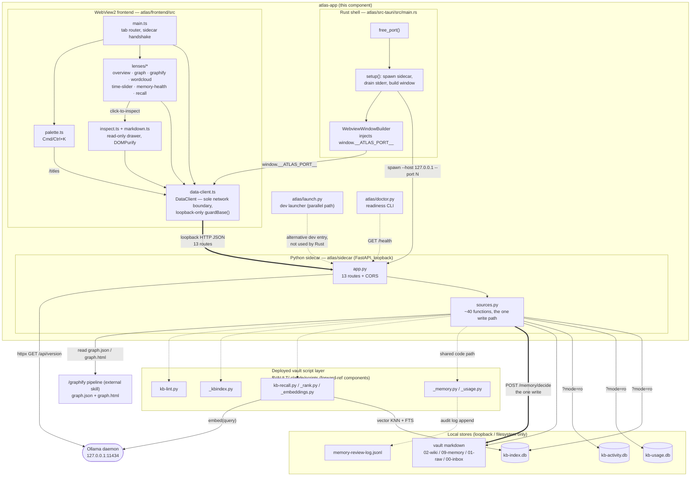

# C4 Component Level: atlas-app

## 1. Overview

| Field | Value |
| --- | --- |
| **Name** | atlas-app (KennisBank Atlas) |
| **Description** | A local-only Tauri v2 desktop application that gives the vault's editor-in-chief a visual cockpit over the KennisBank vault: a minimal Rust host process, a seven-lens TypeScript/WebView2 frontend, and a Python/FastAPI sidecar that aggregates the vault's SQLite stores and markdown into per-lens JSON. |
| **Type** | Desktop Application (single deployable unit, three runtimes: Rust shell + WebView2 frontend + a spawned Python sidecar process) |
| **Technology** | Rust (Tauri v2, edition 2021) · TypeScript (ES2020, Vite 5, Vitest) · Python 3.12 (FastAPI, uvicorn, frozen with PyInstaller onedir) · WebView2 (Windows) |

## 2. Purpose

Atlas is the read/visualise surface of KennisBank: a static markdown vault plus several SQLite indexes are not, by themselves, browsable. Atlas turns them into seven interactive "lenses" — vault health, a force-directed knowledge graph, an embedded Graphify export, a concept wordcloud, a bi-temporal time slider, a memory-lifecycle review cockpit, and a live retrieval waterfall — plus a read-only markdown inspect drawer and a Cmd/Ctrl+K jump palette.

Its role in the system is strictly a **viewer and a single decision surface**, not a second source of truth:

- It never re-implements vault logic. `/recall`, `/provenance`, and `/memory/decide` dynamically load the *deployed* vault script layer (`$VAULT/.claude/scripts/kb-recall.py`, `kb-lint.py`, `_memory.py`, …) and call it, so what Atlas shows is provably identical to what the CLI tools (`kb-recall`, `kb-lint`) and the human-editing workflow would produce — data-parity by reuse, not reimplementation (ADR-0004).
- It is read-only almost everywhere: every SQLite connection opens with `?mode=ro`, so a write is impossible at the storage layer, not merely unattempted. The **single exception** is `POST /memory/decide` — the "system proposes, human decides" moment where an editor approves or rejects an `unverified` memory fragment.
- It is loopback-only end to end: the sidecar binds `127.0.0.1` on an OS-assigned ephemeral port; the frontend's `DataClient` hard-refuses any base URL that is not `http://127.0.0.1:`; nothing in the component reaches outside the machine except the local Ollama daemon for query embeddings.
- It is fail-open by policy: a missing store, a stale graph export, or a down Ollama daemon degrades one lens or one payload field rather than crashing the app, with the sole deliberate fail-*closed* exceptions being `/doc` and `/asset` (path-traversal protection — leaking a file is worse than an error).

Problems it solves: makes 2.5k+ graph nodes and 10k+ activity events humanly legible without shipping them raw to a webview; gives the editor a queryable retrieval debugger that matches production `kb-recall` factor-for-factor; and turns the passive `09-memory/` review queue into a two-button decision UI instead of manual frontmatter editing.

## 3. Software Features

- **Vault health overview** — one non-graphical page: wiki/memory/raw counts, inbox backlog, a 182-day activity heatmap, freshness histogram, and actionable "Signalen" (provenance %, graph staleness, inbox backlog).
- **Force-directed knowledge graph** — canvas graph coloured by community/status/kind/provenance/entry-points, sized by importance/degree, haloed by usage warmth, with level-of-detail above 400 nodes and click-to-inspect.
- **Embedded Graphify view** — iframes the self-contained `graph.html` that the external `/graphify` pipeline writes to the vault, served over loopback HTTP (not `file://`) so its scripts execute.
- **Concept wordcloud** — a dependency-free flex tag-cloud sized by graph degree plus usage warmth, capped at the top 150 terms.
- **Bi-temporal time slider** — the same graph payload filtered client-side by a valid-as-of instant, toggling between capture-time and valid-time semantics, with `valid_until` treated as exclusive.
- **Memory lifecycle cockpit** — lifecycle counts, the unverified review queue, an importance × recency heatmap, warm/stale usage, and supersede chains; the review queue's approve/reject buttons are the app's only write path.
- **Retrieval waterfall inspector** — runs a live query through the production recall pipeline and shows vector/FTS candidates, RRF fusion, and the per-hit rerank factor breakdown (`relevance × recency × importance × trust × usage`), with a "copy as JSON" export.
- **Read-only markdown inspect drawer** — click-through document viewer with back/forward history, sanitized markdown-it + DOMPurify rendering (the app's only `innerHTML` use), wikilink resolution, and an inline "memory entry points" accordion.
- **Cmd/Ctrl+K jump palette** — fuzzy-filters a once-per-session title index to jump to a lens or open a document.
- **Sidecar readiness handshake** — an unbounded, backoff-polled `/health` wait so a slow (frozen-Python) cold boot never permanently strands the UI on "Failed to fetch".
- **Vault doctor / dev launcher** — `atlas/doctor.py` reports build/run readiness (Python deps, Node, optional Rust toolchain, Ollama, vault stores, optional live sidecar health); `atlas/launch.py` is the one-command dev entry point (sidecar + Vite, Windows Job Object teardown).

## 4. Code Elements

This component contains the following code-level elements:

- [c4-code-atlas-frontend-src.md](./c4-code-atlas-frontend-src.md) — the WebView2 application shell: `main.ts` tab router and sidecar handshake, `data-client.ts` (the sole network boundary), lifecycle/generation guards, the inspect drawer, markdown pipeline, command palette, and the pure/unit-tested encoding and time-filter modules.
- [c4-code-atlas-frontend-src-lenses.md](./c4-code-atlas-frontend-src-lenses.md) — the seven `render*Lens` view modules (`overview.ts`, `graph.ts`, `graphify.ts`, `wordcloud.ts`, `time-slider.ts`, `memory-health.ts`, `recall.ts`) that consume `DataClient` and paint each perspective on the vault.
- [c4-code-atlas-sidecar.md](./c4-code-atlas-sidecar.md) — the FastAPI application (`app.py`, 13 routes), the data layer (`sources.py`, ~40 functions, every SQLite read plus the one write), the PyInstaller build spec, and the pytest suite.
- [c4-code-atlas-src-tauri-src.md](./c4-code-atlas-src-tauri-src.md) — the 67-line Rust shell (`main.rs`): ephemeral port selection, sidecar spawn via `tauri-plugin-shell`, stderr drain, and the `WebviewWindowBuilder` + `window.__ATLAS_PORT__` init-script handshake.

**Not covered by a dedicated `c4-code-*.md` document** (verified: no code-level doc in this directory documents them; noted here rather than silently omitted):

- `atlas/launch.py` (172 lines) — the dev-mode launcher. Read directly from source for this document: `_windows_kill_on_close_job()` binds a Windows Job Object with `JOB_OBJECT_LIMIT_KILL_ON_JOB_CLOSE` so sidecar+vite children die when the launcher dies even on a hard kill (fails open to `None` off-Windows or on `SetInformationJobObject`/`AssignProcessToJobObject` failure); `_free_port()` — identical ephemeral-port pattern to `main.rs`/`__main__.py`; `_resolve_vault()` — reads `KENNISBANK_VAULT` only, `sys.exit` with a Dutch message if unset (no hardcoded default, per ADR-0002); `main()` spawns `python -m atlas.sidecar --host 127.0.0.1 --port 
` and `npx vite --host 127.0.0.1 --port 
 --strictPort`, polls `/health` up to 20s, then prints `http://127.0.0.1:<vite_port>/?port=<sidecar_port>` to open. **This Job Object guard protects the dev path only** — the bundled Tauri app has no equivalent (see §5, "no orphan" caveat).
- `atlas/doctor.py` (102 lines) — the readiness checker. Read directly from source: CLI `atlas-doctor [--port N]`; checks `fastapi`/`uvicorn`/`httpx`/`sqlite_vec` importability, `node`/`npm` on PATH, optional `cargo` (warning only — Tauri bundling is optional), a live Ollama probe, four vault-store existence checks, and, if `--port` is given, live `GET /health` on that port. Exits 0 unless a hard failure occurred; Rust toolchain absence is always a warning, never a failure. Exercised externally by `atlas/sidecar/tests/test_doctor.py` via subprocess.
- `atlas/BUILD.md`, `atlas/sidecar/atlas-sidecar.spec`, `atlas/docs/perf-eval.md`, `atlas/src-tauri/build.rs`, `atlas/src-tauri/tauri.conf.json`, `atlas/src-tauri/Cargo.toml` — build/config wiring, documented as context inside the four code docs above (their PyInstaller-spec and CSP/bundle details are covered in `c4-code-atlas-sidecar.md` §3.4 and `c4-code-atlas-src-tauri-src.md` §2.4–2.5 respectively) rather than as standalone elements.
- `docs/adr/0004-atlas-tauri-architecture.md` — the ADR this whole component implements ("near-zero Rust", loopback-only, data-parity by reuse); indexed in [c4-code-docs.md](./c4-code-docs.md).

## 5. Interfaces

### 5.1 Sidecar HTTP API — internal contract (single in-repo consumer: `data-client.ts`)

All 13 routes are declared inside `create_app()` in `atlas/sidecar/app.py`, served at `http://127.0.0.1:<ATLAS_PORT>`. Within this component they are an **internal** boundary (only the frontend's `DataClient` calls them, enforced by CORS plus the frontend's own loopback-only assertion) — they are listed in full here because the task's containment scope draws the box around the whole desktop app, not around the sidecar alone. FastAPI additionally serves framework-default `/openapi.json`, `/docs`, `/redoc`. Only `/memory/decide`, `/doc`, `/asset`, and `/graphify-html` raise `HTTPException`; every other route is fail-open (HTTP 200 with a degraded/empty payload).

| Method | Path | Backing function | Notes |
| --- | --- | --- | --- |
| GET | `/health` | `_source_readiness` + `_overall_status` | Filesystem existence checks (kb-index/activity/usage DBs, `09-memory/`, `graphify-out/graph.json`) plus a live Ollama probe. `version` is the sidecar's own `"0.1.0"` constant, **not** the KennisBank release version. |
| GET | `/graph?include_memory=1` | `sources.build_graph` | Collapses graphify concept nodes to one node per `source_file`; joins `kb-index.db` metadata and `kb-usage.db` warmth. |
| GET | `/timeline?bucket=&from=&to=&dimension=` | `sources.build_timeline` | **No caller in the current frontend** (Timeline lens removed, TASK-27.18); retained for external tooling. |
| GET | `/memory-health` | `sources.build_memory_health` | Lifecycle counts, review queue, supersede chains, heatmap, warmth, quarantine. |
| GET | `/overview` | `sources.build_overview` | The heaviest read-only route — transitively runs memory-health and provenance. |
| GET | `/titles` | `sources.list_titles` | Cmd+K palette index, session-cached client-side. |
| POST | `/memory/decide` | `sources.decide_memory` | Body `{stem, decision: "approve"\|"reject"}` → `{status, stem, new_status: "current"\|"retracted"}`. **The only write route in the component.** |
| GET | `/provenance` | `sources.build_provenance` | Reuses the deployed `kb-lint.lint_vault`; falls back to a local heuristic. |
| GET | `/doc?path=` | `sources.read_doc` | Fail-**closed**: `.md`-only, path-containment checked. |
| GET | `/asset?path=` | `sources.resolve_asset` | Fail-closed, extension-allowlisted (`png/jpg/jpeg/gif/webp/svg`); returns binary, not JSON. |
| GET, HEAD | `/graphify-html` | direct file serve | Serves `graphify-out/graph.html`. HEAD is declared explicitly because the Graphify lens probes with HEAD before embedding; a bare `@app.get` would 405 it. |
| GET | `/recall?q=&k=` | `sources.recall_waterfall` | Route default `k=3`; `recall_waterfall`'s own default is `k=8`; the frontend always sends `k=8`. Reuses `_embeddings.embed`, `_kbindex._rrf`, `_rank` factor functions. |
| GET | `/memory-links` | `sources.build_memory_links` | ~47s cold on the real vault; cached process-lifetime and warmed by a background thread at sidecar startup when a real `kb-index.db` exists. |

### 5.2 External-facing surfaces (what actually crosses the component boundary)

- **Sidecar CLI** — `python -m atlas.sidecar [--host 127.0.0.1] [--port N] [--vault PATH]` (`atlas/sidecar/__main__.py`). Prints `ATLAS_PORT <port>` on stdout before blocking on `uvicorn.run(...)`. **This stdout contract is superseded and effectively dead**: the Tauri shell dictates the port via `--port` and never parses stdout — the async drain in `main.rs` consumes and discards every line (see §6, discrepancy list).
- **Loopback HTTP, `127.0.0.1:<ATLAS_PORT>`** — the 13 routes in §5.1, addressable by any local process, not only the bundled frontend (e.g. `atlas/doctor.py --port N` hits `/health` directly).
- **File contract — `POST /memory/decide`** — mutates exactly one frontmatter `status:` line in `$VAULT/09-memory/<stem>.md`, and, on the shared code path (when `$VAULT/.claude/scripts/_memory.py` is present and resolves to this vault), appends one entry to `$VAULT/.claude/memory-review-log.jsonl`. This is a genuine cross-component file contract: the same audit log and the same `_memory.decide()` helper are shared with the CLI, slash-command, and MCP review paths (TASK-89), so an Atlas decision is indistinguishable downstream from a decision made any other way.
- **`atlas/doctor.py`** — CLI `atlas-doctor [--port N]`, human-readable readiness report, exit 0/1. See §4 for full behaviour.
- **`atlas/launch.py`** — dev-mode entry point, no flags; reads `KENNISBANK_VAULT`, prints the dev URL `http://127.0.0.1:<vite_port>/?port=<sidecar_port>`. See §4.
- **`window.__ATLAS_PORT__` / `?port=NNNN`** — the Rust→JS port handshake. This is an **internal** interface (Rust shell to its own webview), listed here for completeness rather than as a system-facing surface: `main.rs` injects `window.__ATLAS_PORT__ = <port>;` as a webview `initialization_script` before any frontend code runs; the dev launcher instead passes `?port=` on the URL. `data-client.ts:resolvePort()` reads the global first, then the query parameter.
- **CORS allowlist** (`app.py:_CORS_ORIGIN_REGEX`) — `http(s)://localhost|127.0.0.1(:port)?`, `tauri://localhost` (macOS/Linux), `http(s)://tauri.localhost` (Windows WebView2, plain HTTP). This is what makes the loopback HTTP surface reachable from the actual bundled webview origin, which is cross-origin relative to the sidecar.

## 6. Dependencies

### 6.1 Components used

No sibling `c4-component-*.md` files exist yet in this documentation set (`atlas-app` is being synthesized first) — the entries below are **forward references**: the code-level doc that unambiguously owns each dependency is cited as the verifiable source, alongside the anticipated component-level file name for when that sibling synthesis happens. Treat the `c4-component-*` link as a placeholder, not a live link.

| Dependency | Verified in | Anticipated component doc | How it's used |
| --- | --- | --- | --- |
| Deployed vault script layer — `kb-recall.py`, `_rank.py`, `_embeddings.py` | [c4-code-scripts-retrieval.md](./c4-code-scripts-retrieval.md) | `c4-component-vault-retrieval.md` (forward ref) | `/recall` loads these by file path from `$VAULT/.claude/scripts/` via `_load_vault_module` for data-parity with `kb-recall`; `_embeddings.embed()` also drives the recall query vector. |
| `_kbindex.py` (kb-index.db schema/access) | [c4-code-scripts-core-shared.md](./c4-code-scripts-core-shared.md) | `c4-component-vault-core.md` (forward ref) | `/recall` and `/memory-links` open `kb-index.db` through `kb-recall._open_ro` (which loads the `sqlite_vec` extension), not through Atlas's own plain `_connect_ro`. |
| `kb-lint.py` | [c4-code-scripts-quality-graph.md](./c4-code-scripts-quality-graph.md) | `c4-component-vault-quality.md` (forward ref) | `/provenance` calls `lint_vault(vault)` as its primary path; falls back to a local heuristic if unavailable. |
| `_memory.py` | [c4-code-scripts-memory-capture.md](./c4-code-scripts-memory-capture.md) | `c4-component-vault-memory.md` (forward ref) | `POST /memory/decide` prefers `mem.decide(stem, decision, via="atlas")` for guards, crash-safe writes, and the shared audit log; falls back to an inline single-line frontmatter rewrite (no audit log) if the module or a vault-identity check is unavailable. |
| `_usage.py` (optional) | [c4-code-scripts-memory-capture.md](./c4-code-scripts-memory-capture.md) | `c4-component-vault-memory.md` (forward ref) | Supplies the `usage` rerank factor in `/recall` when importable; its absence just drops that factor. |
| `_vaultpath.vault_root()` (ADR-0002 resolver) | [c4-code-scripts-core-shared.md](./c4-code-scripts-core-shared.md) | `c4-component-vault-core.md` (forward ref) | **Not used directly by the Rust/Python entry points** — `atlas/sidecar/__main__.py`, `atlas/launch.py`, and `main.rs` all resolve the vault by reading `KENNISBANK_VAULT` themselves rather than calling the shared resolver. `_kbindex.index_path()` (reached transitively through `kb-recall`) does honour `vault_root()`, which is why that one SQLite path can diverge from the `vault` argument the sidecar factory was given. |

### 6.2 External systems

| System | How it's reached | Notes |
| --- | --- | --- |
| **Ollama daemon** (`http://127.0.0.1:11434`) | `/health` probes `GET /api/version` directly via `httpx`; `/recall` reaches it indirectly through `_embeddings.embed(query)` | The only outbound network call anywhere in the component; strictly loopback. A dead daemon degrades `/health` to `ollama:false` and `/recall` to `status:"degraded"` — it does not error the app. |
| **`kb-index.db`** (SQLite, `$VAULT/.claude/`) | `_connect_ro` (`?mode=ro`) for `/graph`, `/titles`; `kb-recall._open_ro` (loads `sqlite_vec`) for `/recall`, `/memory-links` | Read-only by construction; `tests/test_readonly.py` pins a byte-identical hash across every data route. |
| **`kb-activity.db`** (SQLite) | `_connect_ro` for `/timeline`, `/overview` (activity heatmap), `/health` | |
| **`kb-usage.db`** (SQLite) | `_connect_ro` for `/graph` (warmth), `/memory-health`, `/health` | |
| **`kb-graph.db`** (SQLite) | **Not read by this component.** Verified by grep over `atlas/sidecar/sources.py` — no reference. Of the databases the wider KennisBank repo maintains, Atlas touches exactly `kb-index.db`, `kb-usage.db`, `kb-activity.db`. (One code doc for the Tauri shell lists `kb-graph.db` alongside the other three in a general "databases the sidecar might touch" enumeration; that listing is not source-verified for that file and is superseded here by the sidecar doc's grep-verified claim.) |
| **KennisBank vault filesystem** | `$VAULT/02-wiki/*.md`, `$VAULT/09-memory/*.md`, `$VAULT/01-raw/{sessies,transcripts}/*`, `$VAULT/00-inbox/*`, arbitrary `.md`/image files via `/doc` and `/asset` | Read for every non-SQLite payload; the sole write is the one frontmatter line under `/memory/decide` plus the shared audit-log append. |
| **`/graphify` pipeline output** (`$VAULT/graphify-out/graph.json`, `graph.html`, `.needs-rebuild`) | `sources.load_graph` (JSON parse); `graphify-out/graph.html` served verbatim by `/graphify-html`; `.needs-rebuild` existence check for `overview.graph_stale` | **Produced entirely outside this component and outside this repository's `scripts/` tree** — it is written by the external Graphify pipeline (a separate Claude Code skill), not by any Atlas or vault-script code. Four of the seven lenses (`graph`, `wordcloud`, `time-slider`, `graphify`) degrade to empty states if this pipeline has never run; a missing artifact and a stale one are currently indistinguishable to those four lenses. |
| **GitHub / CI** | Not applicable | No part of this component talks to GitHub or any remote git host; Atlas has no network reach beyond loopback and the local Ollama daemon. |
| **The Claude Code agent harness** | Not applicable | Atlas is a standalone desktop application, not a Claude Code hook, skill, or MCP server. It shares code (via the deployed `.claude/scripts` layer) with the tools the agent harness *does* invoke, but Atlas itself does not run inside, or communicate with, that harness. |

## 7. Component Diagram

