# C4 Component Level: Distribution & Quality Gate

## 1. Overview

| Field | Value |
|---|---|
| **Name** | Distribution & Quality Gate |
| **Description** | The layer that defines *what a user's vault looks like*, ships it there, and proves — before and after every change — that the shape is correct. It covers the vault skeleton specification, the two canonical markdown templates, the pytest regression suite, the GitHub Actions CI workflow, and the ADR/spec/plan decision layer that all of the above (and the rest of the distribution) must obey. |
| **Type** | Distribution & Verification layer — **not a running service**. It has no process that executes inside a user's session; it acts at *install-time* (`setup.sh`, `_migrations.py`), *write-time* (templates consumed by `/sessielog`, `/wiki`), and *CI-time* (`ci.yml`, `pytest tests`). |
| **Technology** | Markdown (templates, vault-structure spec, ADRs/specs/plans — 100% of `docs/`); Python 3.12 + pytest 8.3.4 + coverage 7.6.1 (`tests/`); GitHub Actions workflow YAML + bash (`ci.yml` driving `python3`, `pip`, `npm`, `npx`); JSON (ADR-006/ADR-007 machine-evaluated `Enforcement` blocks, consumed by the external `adr-kit` tool); MADR 4 / lightweight in-house format for ADRs. |

## 2. Purpose

KennisBank ships as a **distribution**, not a running service: a git repository whose contents are copied by `setup.sh` into a user's Obsidian vault (`$VAULT`) and into per-agent config directories (`~/.claude`, `~/.copilot`, …). This component owns the two halves of that promise:

1. **Shape.** `vault-structure/README.md` specifies the numbered-directory contract (`00-inbox` … `09-memory`, `.claude/scripts`, `graphify-out`) that every other script in the system reads from or writes into; `templates/tpl-sessie-log.md` and `templates/tpl-wiki-artikel.md` specify the frontmatter keys and `##` section headings that make a session log or wiki article parseable downstream. Neither directory contains executable code — they are markdown *specifications*, materialized at install time by `setup.sh` (`mkdir -p` skeleton, `copy_file` templates) and repaired idempotently on upgrade by `scripts/_migrations.py`. `setup.sh` itself has no dedicated `c4-code-*.md` file in this documentation set; its relevant function signatures (`copy_file`, `copy_force`, `install_python_dep`, the `mkdir -p` skeleton block) are documented inline in `c4-code-vault-structure.md` and `c4-code-templates.md`, which this component owns.
2. **Correctness.** `tests/` is, in the project's own words, "the single quality gate for the distribution" — 101 test modules / 2 support modules, 1099 tests collected, exercising `scripts/`, `setup.sh`/`doctor.sh`, and the shipped markdown surfaces (`commands/`, `skills/`, README/CHANGELOG/CONFIGURATION, `backlog/`). `.github/workflows/ci.yml` is the one workflow file that runs that suite (plus syntax gates and a 75% coverage floor) on every push/PR, in parallel with a separate `atlas` job gating the Atlas sidecar and frontend. `docs/` is the binding decision record behind both: 7 ADRs (some with machine-evaluated `Enforcement` JSON), 11 design specs, 15 implementation plans whose `**Interfaces:**` blocks are the authoritative declared contract for functions implemented in `scripts/`, one research report, and 5 operator/agent install guides.

Its role in the system: nothing here retrieves or stores knowledge. This component is the reason a change to the script layer, the hook wiring, or the vault contract can be trusted *before* it reaches a real vault — and the reason the shape of that vault is documented in one place instead of being reverse-engineered from `setup.sh`.

## 3. Software Features

- **Vault skeleton specification & idempotent materialization** — `vault-structure/README.md` documents the numbered-directory contract; `setup.sh:176-181` creates it on install and `scripts/_migrations.py:_m_memory_dirs` re-creates the memory-era directories (`09-memory`, `09-memory/archive`, `01-raw/transcripts`) idempotently on upgrade.
- **Canonical article/session-log templates** — `templates/tpl-sessie-log.md` and `templates/tpl-wiki-artikel.md` define the frontmatter keys and `##` section headings (`## Sessie-herkomst`, `## Verbanden`, `## Nieuwe kennis`, …) that downstream scripts (`kb-lint.py`, `auto-crosslink.py`, `wiki-scan.py`, `graph-provenance-ring.py`) parse.
- **Automated regression test suite (the quality gate)** — 101 modules / 1099 tests under pytest prove a change to `scripts/`, `setup.sh`, or the shipped markdown is safe before it is copied into a user's vault.
- **Hermetic test isolation** — `tests/__init__.py` pins `KB_EMBED_ENDPOINT`/`KB_LLM_ENDPOINT` to `http://127.0.0.1:1` unless `KB_INTEGRATION=1`, so the suite can never silently hang on, or falsely depend on, a live Ollama daemon.
- **Regression-driven guard classes** — dedicated test modules that permanently close five recurring bug classes: eval-set privacy (`test_eval_privacy.py`), ADR-0002 vault-path hardcoding (`test_vaultpath.py`, `test_command_structure.py`), toggle/knob drift (`test_knob_consistency.py`), usage-telemetry self-pollution (`test_usage.py`, `test_usage_noise.py`), and silently-uncollected tests (`test_suite_collection.py`).
- **Continuous integration gate** — `.github/workflows/ci.yml`'s `test` job runs `py_compile`, `bash -n`, the full pytest suite under coverage, and a `--fail-under=75` floor on every push/PR (no branch or path filter); the `atlas` job independently gates the sidecar pytest suite and the frontend typecheck/vitest suite.
- **Architecture Decision Records** — 7 ADRs (4 lightweight, 3 MADR 4) record binding decisions on cross-platform scripting, the default embedding model, Copilot CLI integration, the Atlas architecture, and single-coordinator hook wiring; ADR-006 and ADR-007 embed regex-based `Enforcement` JSON that a pre-commit gate (`adr-kit`) can evaluate against staged diffs.
- **Design specs & implementation plans as declared interfaces** — 11 specs and 15 plans contain 71 `**Interfaces:**` blocks / 55 fully-typed signature lines that are the authoritative declared contract for functions implemented elsewhere (e.g. `_memory.py`, `_kbindex.py`, `kb-recall.py`, `_llm.py`, `_maintenance.py`, `_migrations.py`).
- **Deploy-map / distribution contract** — a table in `docs/superpowers/specs/2026-06-20-...-design.md`, executed by `setup.sh`, fixes what ships where (`scripts/*` → `$VAULT/.claude/scripts/`, `templates/*.md` → `$VAULT/04-templates/`, `commands/*.md` → `~/.claude/commands/`, `skills/*/SKILL.md` → `~/.claude/skills/<name>/`) and which artifacts are user data (never overwritten without `--force`) versus tooling (always refreshed).

## 4. Code Elements

This component contains the following code-level elements:

- [c4-code-tests.md](./c4-code-tests.md) — the pytest quality gate: 101 test modules / 2 support modules, 1099 tests, exercising the script layer, `setup.sh`/`doctor.sh`, and the shipped markdown surfaces.
- [c4-code-templates.md](./c4-code-templates.md) — the two vault templates (`tpl-sessie-log.md`, `tpl-wiki-artikel.md`), the frontmatter/section contract they define, and the code elsewhere that produces or consumes that contract.
- [c4-code-vault-structure.md](./c4-code-vault-structure.md) — the vault skeleton specification (`vault-structure/README.md`, one file, zero code) plus the creators (`setup.sh`, `scripts/_migrations.py`) and verifier (`scripts/doctor.sh`) of the numbered-directory contract.
- [c4-code-github-workflows.md](./c4-code-github-workflows.md) — the single CI workflow `.github/workflows/ci.yml`: the `test` job (the distribution gate) and the `atlas` job (the Atlas app gate), run in parallel with no `needs:`.
- [c4-code-docs.md](./c4-code-docs.md) — the decision layer: 7 ADRs, 11 design specs, 15 implementation plans, 1 research report, 5 root-level operator/agent guides — 39 markdown files, zero executable code.

## 5. Interfaces

This component exposes contracts and gates, not a running API. Each row is a real, citable artifact per its source `c4-code-*.md` file.

### Pytest quality gate

- **Protocol**: CLI / CI step
- **Description**: The single quality gate for the distribution; a green run is the precondition for merging a change to `scripts/`, `setup.sh`, hook wiring, or shipped markdown.
- **Operations**:
  - Local: `python -m pytest tests -q`
  - CI: `python3 -m coverage run -m pytest tests -q` → `coverage report --fail-under=75` (`ci.yml:41,49`)
  - Pre-gates: `python3 -m py_compile scripts/*.py` (`ci.yml:31`), `bash -n setup.sh scripts/doctor.sh` (`ci.yml:34`)
  - `tests/_loader.py: load_script(filename: str)` — internal helper that 41 test modules use to import hyphenated CLI scripts by path.

### CI workflow (GitHub Actions)

- **Protocol**: CI event trigger (`push`, `pull_request`, no filters) → job execution on `ubuntu-latest`
- **Description**: Runs the pytest gate plus Atlas's own sidecar/frontend gates on every push and PR; there is no CD in this repository — release tagging is a separate manual/skill-driven process.
- **Operations**: job `test` (7 steps, `ci.yml:8-56`, 30 min hang net); job `atlas` (8 steps, `ci.yml:61-96`, 15 min, no `needs:` — runs in parallel).

### Vault skeleton contract (file/directory contract)

- **Protocol**: filesystem directory contract, materialized and verified by code outside `vault-structure/` itself
- **Description**: The numbered-directory tree every other script in the system reads from or writes into.
- **Operations**: `setup.sh:176-181` — `mkdir -p` of `00-inbox`, `01-raw/{sessies,transcripts}`, `02-wiki`, `03-projecten`, `04-templates`, `05-bronnen`, `06-claude`, `07-media`, `08-archive`, `09-memory/{,archive}`, `.claude/scripts`, `graphify-out`; `scripts/_migrations.py:_m_memory_dirs` (`:56`) re-creates the memory-era subset idempotently on upgrade; `scripts/doctor.sh:99 SUBDIRS` verifies 11 of 14 contracted directories (missing: `09-memory`, `09-memory/archive`, `01-raw/transcripts` — a verified coverage gap). The single sanctioned root resolver is `scripts/_vaultpath.py:vault_root()` (ADR-0002), owned by a sibling component, not this one.

### Template markdown contract (file contract)

- **Protocol**: markdown file contract — YAML frontmatter + `##` section headings as the parsing surface
- **Description**: The canonical shape of a raw session log and a compiled wiki article; placeholders (`{{date}}`, `{{onderwerp}}`) are substituted by the agent at prompt time, not by any script.
- **Operations**: `templates/tpl-sessie-log.md` — frontmatter `title/type/tags/status/source`; sections `## Doel`, `## Samenvatting`, `## Output`, `## Nieuwe kennis` (mined by `wiki-scan.py:MARKER_RE`), `## Vervolgacties`, `## AI-verantwoording`. `templates/tpl-wiki-artikel.md` — frontmatter `type: wiki`, `status: concept`; sections `## Definitie`, `## Context`, `## Kernpunten`, `## Verbanden` (machine-written by `auto-crosslink.py:find_section_insert`), `## Bronnen`, `## Sessie-herkomst` (the load-bearing section validated by `kb-lint.py:HERKOMST_SECTION_RE` — that validator is owned by a sibling component, not this one).

### ADR Enforcement blocks (machine-executable rule contract)

- **Protocol**: JSON rule block (`forbid_pattern` / `require_pattern` / `forbid_import` / `llm_judge`) evaluated by the external `adr-kit` tool against a staged diff
- **Description**: Two ADRs embed regex-based enforcement so a specific class of regression (re-registering a legacy per-hook script) becomes a lint failure, not a silent drift.
- **Operations**: ADR-006 forbids re-adding `build-embed-index.py` / `build-kb-index.py` / `build-activity-index.py` / `sweep-launch.py` / `memory-notify.py` / `distill-notify.py` directly under `SessionStart` in `scripts/_hooks_manifest.py`, and requires the single `kb-session-start.py` coordinator entry. ADR-007 forbids `archive-transcript.py` / `kb-usage-scan.py` directly under `SessionEnd`, requires the single `kb-session-end.py` entry, and requires `commands/sessielog.md` to invoke `kb-session-log.py ... --session-log` at least once.

### Declared function-signature contracts (`docs/superpowers/plans/`)

- **Protocol**: documentation-as-interface-spec — Markdown `**Interfaces:**` blocks with typed signatures
- **Description**: 71 Interfaces blocks / 55 fully-typed signature lines across 15 implementation plans are the authoritative declared contract other components' scripts implement.
- **Operations** (representative, not exhaustive — full list in `c4-code-docs.md` §2.3.1): `render(title, body, *, status="unverified", evidence_basis="cc-sessie", ...) -> str` (`_memory.py` contract); `search(conn, *, query_vector, query_text="", k=8, layers=None, statuses=("current",)) -> list[dict]` (`_kbindex.py` contract); `recall_hits(query_vector, query_text="", k=3, layers=("wiki","memory")) -> list[dict]` (`kb-recall.py` contract); `judge(candidate, context="") -> dict` (`_llm.py`/`_judge.py` contract); `run(vault, settings_path, skip_hooks=False) -> list[str]` (`_migrations.py` contract).

### Deploy map (source → destination table)

- **Protocol**: documentation table, executed by `setup.sh` and read by the upgrade/contribute skills
- **Description**: The single source of truth for where every repo artifact lands in a user's vault and home directory.
- **Operations**: `scripts/*.py|*.sh` → `$VAULT/.claude/scripts/`; `templates/*.md` → `$VAULT/04-templates/`; `commands/*.md` → `~/.claude/commands/`; `skills/*/SKILL.md` → `~/.claude/skills/<name>/`; `CLAUDE.md.template` → `$VAULT/CLAUDE.md` (personalized, never pushed upstream).

## 6. Dependencies

### Components used

Sibling component-level documents had not been published at the time this document was written, so the names below are inferred from the "Name" field of each referenced `c4-code-*.md` file rather than confirmed against an existing `c4-component-*.md`. Each row cites the underlying code-level document for reconciliation.

| Inferred component | Used how | Source `c4-code-*.md` |
|---|---|---|
| Session lifecycle & installation | `tests/` drives `register-hooks.py`, `kb-session-start.py`, `kb-session-end.py` as subprocesses/imports; ADR-006/007 Enforcement blocks guard `scripts/_hooks_manifest.py`; the vault-structure hook table cites `kb-session-start.py`/`kb-session-end.py` as the SessionStart/SessionEnd owners | `c4-code-scripts-session-lifecycle.md` |
| Core shared foundation | `tests/` imports `_vaultpath`, `_settings`, `_migrations`, `_frontmatter`, `_hooks_manifest` directly; `vault_root()` is the resolver every ADR-0002 guard in `tests/` checks for | `c4-code-scripts-core-shared.md` |
| Retrieval engine | `tests/test_kb_retrieve_*.py`, `test_rank.py`, `test_kb_recall.py`, `test_graph_retrieval.py` exercise this group; `docs/` (memory design, wiki-hybrid plan) declares its `recall_hits`/`search` interfaces | `c4-code-scripts-retrieval.md` |
| Memory pipeline | `tests/test_memory*.py`, `test_maintenance*.py`, `test_checkpoint.py` exercise this group; `docs/superpowers/specs/2026-06-26-agent-geheugen-design.md` and the fase1/4a/4b/5 plans declare its interfaces | `c4-code-scripts-memory-capture.md` |
| Indexing & background maintenance | `tests/test_build_kb_index.py`, `test_graph_index.py`, `test_index_launch.py`, `test_activity.py` exercise this group; `templates/`+`vault-structure/` define the paths it indexes; ADR-0001 sets the embedding thresholds it consumes | `c4-code-scripts-indexing.md` |
| Ingest & import | `tests/test_import_*.py`, `test_zip_guard.py`, `test_liteparse_integration.py` exercise this group; `templates/tpl-sessie-log.md` is the exact section set the importers emit programmatically (`type: raw-sessie`) | `c4-code-scripts-import-intake.md` |
| Knowledge quality & graph | `tests/test_kb_lint.py`, `test_setup_deploy.py` (drives `doctor.sh`), `test_safe_edit.py` exercise this group; `kb-lint.py` enforces the `## Sessie-herkomst` contract this component's templates define; `doctor.sh` verifies this component's vault-skeleton contract | `c4-code-scripts-quality-graph.md` |
| Measurement & outward integration | `tests/test_kb_eval*.py`, `test_eval_privacy.py` (its direct enforcement target), `test_git_upstream_check.py` exercise this group; ADR-0003 documents the Copilot CLI surface it implements | `c4-code-scripts-eval-integration.md` |
| Command & skill surface | `tests/test_command_structure.py`, `test_skill_frontmatter.py`, `test_command_settings_gates.py` structurally guard `commands/*.md` and `skills/*/SKILL.md`; the deploy map in `docs/` targets both; `skills/kennisbank-upgrade` and `kennisbank-contribute` read/write this component's `templates/` and vault-structure paths directly | `c4-code-commands.md`, `c4-code-skills.md` |
| Agent-harness adapters | ADR-0003/ADR-005/ADR-006/ADR-007 bind this layer's config-mutation and hook-coordination rules; `tests/test_agent_envs_install.py`, `test_copilot_*.py` exercise it | `c4-code-adapters.md` |
| Atlas visualization (frontend + sidecar + Tauri shell) | Gated by the `atlas` job in the CI workflow this component owns; ADR-0004 specifies its architecture and the `/health, /graph, /timeline, /memory-health, /recall, /provenance` sidecar API contract | `c4-code-atlas-frontend-src.md`, `c4-code-atlas-sidecar.md`, `c4-code-atlas-src-tauri-src.md` |

### External systems

| System | Relationship to this component |
|---|---|
| **Obsidian vault filesystem** (`$VAULT`) | The target `vault-structure/` specifies and `templates/` write into; `tests/` builds throwaway temp vaults (via `KENNISBANK_VAULT`) to simulate it rather than touching a real one. |
| **GitHub** (Actions runners, PRs, Copilot PR review) | `ci.yml` runs on GitHub-hosted `ubuntu-latest` runners on every `push`/`pull_request`; the project's own process (recorded in `CLAUDE.md`, not in `docs/`) requires the Copilot PR review to be processed before merge — CI-green is stated explicitly as not sufficient. |
| **Ollama HTTP** (`http://localhost:11434`, local-only) | ADR-0001 sets the default embedding model (`qwen3-embedding:8b`) and its calibration thresholds; `tests/__init__.py` deliberately pins the test suite's embed/LLM endpoints to a dead address (`127.0.0.1:1`) so the suite never reaches a real Ollama daemon outside the opt-in `KB_INTEGRATION=1` tier. |
| **git** (CLI) | `tests/test_eval_privacy.py` shells out to `git ls-files` to check tracked files (not the working tree) for private eval sets; `tests/test_safe_edit.py` drives a real temp git repo; `docs/` (vault-maintenance PRD, R3) requires the safe-edit engine to refuse a non-git or dirty vault. |
| **SQLite databases** (`kb-index.db`, `kb-graph.db`, `kb-usage.db`, `kb-activity.db`) | Schemas and invariants for `kb-index.db` and `kb-activity.db` are specified in `docs/superpowers/plans/` and `docs/superpowers/specs/`; `tests/` builds fixture databases in temp directories rather than opening a real vault's stores. `kb-graph.db` is not mentioned anywhere in `docs/` — the graph store the documentation layer describes is the JSON file `graphify-out/graph.json`; if a `kb-graph.db` exists at runtime it is undocumented in this tree (noted in `c4-code-docs.md` as a verified accuracy gap). |
| **adr-kit** (external Claude Code plugin) | Evaluates the ADR-006/ADR-007 `Enforcement` JSON blocks against a staged diff; not part of this repository. |
| **The agent harness** (Claude Code, Codex CLI, OpenCode, GitHub Copilot CLI) | The ultimate consumer of everything this component ships and verifies: hooks, MCP wiring, skills and commands land in each harness's own config surfaces via `setup.sh`; `docs/` (the research report, ADR-0003) specifies the per-client admission rules, lifecycle envelope, and latency budgets those harnesses must support. |
| **pytest 8.3.4 / coverage 7.6.1 / PyYAML 6.0.2** (`requirements-dev.txt`) | The runner and its strict-parsing/coverage tooling; explicitly not required for a deployed vault — only for developing and gating the distribution itself. |
| **Node.js 22 / TypeScript / vitest** (Atlas job only) | Installed and cached by the `atlas` job in `ci.yml` to typecheck and unit-test the Atlas frontend this component gates but does not own. |

## 7. Component Diagram

```mermaid
flowchart TD
    subgraph DQ["Distribution & Quality Gate"]
        VS["vault-structure/README.md<br/>skeleton spec (no code)"]
        TPL["templates/<br/>tpl-sessie-log.md · tpl-wiki-artikel.md"]
        TST["tests/<br/>101 modules · 1099 tests<br/>tests/__init__.py hermeticity guard"]
        CI[".github/workflows/ci.yml<br/>job: test (7 steps) · job: atlas (8 steps)"]
        DOCS["docs/<br/>7 ADRs · 11 specs · 15 plans<br/>1 research report · 5 guides"]
    end

    SETUP["setup.sh (installer)<br/>documented within VS + TPL,<br/>no dedicated c4-code file"]

    DOCS -->|"binds & specifies"| SETUP
    DOCS -->|"Enforcement JSON guards"| SESSLC["Session lifecycle & installation<br/>_hooks_manifest.py, kb-session-start/-end.py"]
    DOCS -->|"declares typed signatures for"| SCRIPTGROUPS["scripts/ groups:<br/>retrieval · memory · indexing ·<br/>ingest · quality-graph · measurement"]
    DOCS -->|"Enforcement blocks evaluated by"| ADRKIT[("adr-kit<br/>external plugin")]
    DOCS -.->|"sets default embed model<br/>+ thresholds (ADR-0001)"| OLLAMA[("Ollama HTTP<br/>local, opt-in")]

    VS -.->|"spec only, no runtime import"| VAULT[("$VAULT<br/>Obsidian filesystem")]
    SETUP -->|"mkdir -p skeleton"| VAULT
    SETUP -->|"copy_file / copy_force"| VAULT
    TPL -->|"copy_file, user data,<br/>no overwrite w/o --force"| VAULT
    TPL -->|"defines ## Sessie-herkomst /<br/>## Verbanden parsing surface"| QUALITY["Knowledge quality & graph<br/>kb-lint.py · auto-crosslink.py · doctor.sh"]
    TPL -->|"consumed at write-time by"| CMDSKILL["Command & skill surface<br/>/sessielog · /wiki · kennisbank-upgrade"]

    TST -->|"drives as subprocess"| SETUP
    TST -->|"drives as subprocess"| QUALITY
    TST -->|"loads by path, exercises"| SCRIPTGROUPS
    TST -->|"structural checks"| CMDSKILL
    TST -.->|"git ls-files:<br/>no private eval sets"| GIT[("git")]
    TST -.->|"pins dead: 127.0.0.1:1"| OLLAMA

    CI -->|"runs"| TST
    CI -->|"py_compile / bash -n"| SCRIPTGROUPS
    CI -->|"gates sidecar + frontend"| ATLAS["Atlas visualization<br/>frontend · sidecar · Tauri shell"]
    CI -->|"executes on"| GHA[("GitHub Actions<br/>ubuntu-latest")]
    CI -.->|"green required before"| PR[("GitHub PR<br/>+ Copilot review")]

    QUALITY -->|"doctor.sh verifies"| VS
    SETUP -->|"vault_root()"| VAULTPATH["Core shared foundation<br/>_vaultpath.py"]

    classDef owned fill:#2b4c8a,stroke:#16294d,color:#fff
    classDef ext fill:#5a5a5a,stroke:#2b2b2b,color:#fff
    classDef sibling fill:#3d6b4f,stroke:#1e3626,color:#fff
    class VS,TPL,TST,CI,DOCS owned
    class VAULT,GHA,GIT,OLLAMA,ADRKIT,PR ext
    class SESSLC,SCRIPTGROUPS,QUALITY,CMDSKILL,ATLAS,VAULTPATH,SETUP sibling
```

