# C4 Component Level: Index Store

> **Reconciliation note on component boundaries.** Three sibling documents already
> published in this directory (`c4-component-retrieval-engine.md`,
> `c4-component-measurement-and-integration.md`, and — implicitly, via ADR-0002 —
> `c4-component-knowledge-processing.md`) forward-reference an anticipated, still
> unpublished **"Core Shared Foundation"** component (expected filename
> `c4-component-core-shared.md`) as the sole owner of **all nine** modules in
> `c4-code-scripts-core-shared.md`, and a separate anticipated **"Indexing / Index
> Builders"** component (expected filename `c4-component-indexing.md`) for
> `c4-code-scripts-indexing.md` alone. This document was commissioned under the name
> **`index-store`** with a different, explicit boundary: `c4-code-scripts-indexing.md`
> in full, plus only the four modules of `c4-code-scripts-core-shared.md` that are
> actually part of the sqlite index layer (`_vaultpath.py`, `_settings.py`,
> `_frontmatter.py`, `_kbindex.py` — see §4). The other five `core-shared.md` modules
> (`_common.py`, `_migrations.py`, `_transcript.py`, `_liteparse.py`,
> `_hooks_manifest.py`) are **not** claimed by this document and are left orphaned at
> component level — whoever reconciles these documents should decide whether they get
> their own "Core Shared Foundation" component or are distributed to the components
> that actually consume them (`_hooks_manifest.py` and `_migrations.py` are used
> heavily by `c4-component-agent-integration.md`'s installer scripts; `_transcript.py`
> and `_liteparse.py` by `c4-component-knowledge-processing.md`'s ingest scripts).
> Neither `c4-component-core-shared.md` nor `c4-component-indexing.md` exist in this
> directory at the time of writing; this document (`c4-component-index-store.md`) is
> the closest existing match to both forward references combined, and is not a strict
> superset of either.

## 1. Overview

| | |
|---|---|
| **Name** | Index Store |
| **Description** | The local sqlite index layer for KennisBank (hybrid vector+keyword search, knowledge-graph neighbours, temporal activity events, the Karpathy-shaped wiki index) plus the detached, single-flight maintenance workers that build and repair those indexes off the interactive hot path. |
| **Type** | Library + background batch process (no server, no long-running daemon — a lock-guarded detached worker process spawned per session and a set of one-shot CLI builders) |
| **Technology** | Python 3 (stdlib-first), SQLite (WAL, `sqlite-vec` `vec0` extension, FTS5), flat JSON caches and lock files on the local filesystem |

## 2. Purpose

KennisBank's north star is "invisible, fast, out of the way": interactive recall must
stay sub-second, so nothing expensive may run on the request path. The Index Store is
the component that pays that cost **up front**: it turns vault markdown and local
databases into the derived, disposable indexes that the Retrieval Engine component
reads at prompt time, and it does that work in a detached child process so
`SessionStart` never blocks on it (TASK‑63).

Concretely it owns:

- **`kb-index.db`** — the hybrid `vec0` (cosine, via unit-normalised vectors) + FTS5
  search index over `02-wiki/` and *current* `09-memory/` memories, built by
  `build-kb-index.py` and served through `_kbindex.search()`.
- **`kb-graph.db`** — a fast, indexed reload of `graphify-out/graph.json` (an external
  graphify-skill artifact) so a per-prompt "neighbours of this file" lookup is a SQL
  join instead of a 4.2 MB JSON parse; built by `build-graph-index.py`, deliberately
  kept in its **own** file since TASK‑75 because `build-kb-index.py` unlinks
  `kb-index.db` wholesale on rebuild.
- **`kb-activity.db`** — the canonical, source-deduplicated temporal event log behind
  `/watdeedik`, `/timeline`, `/weeklog`, built and queried through `_activity.py`
  (also the six-language natural-language period parser those commands need).
- **`02-wiki/index.md` + `02-wiki/log.md`** — the Karpathy three-layer wiki shape,
  regenerated by `build-karpathy-index.py` on every `SessionEnd` so the
  Understand‑Anything‑compatible index stays current.
- **The detached maintenance pipeline** — `index-launch.py` (single-flight lock,
  detached spawn, sequential job runner) and the deterministic cross-memory
  maintenance primitives in `_maintenance.py` (exact-duplicate close, cosine-based
  supersede, LLM recheck, cluster-promotion) that `memory-sweep.py` (owned by the
  Knowledge Processing component) calls into.

Everything this component produces is explicitly **derived and rebuildable**: markdown
in the vault is the source of truth, every index is a cache, and every entry point is
fail-open (a broken index degrades retrieval quietly; it never fails a hook).

Its role in the system is that of a write-time/off-path *index builder and janitor* —
it has no HTTP surface, no MCP surface and no direct hook registration of its own (the
six registered Claude Code hooks belong to the Agent Integration component); it is
invoked as detached child processes and imported as an in-process Python library by the
components that surround it.

## 3. Software Features

- **Single-flight detached maintenance orchestration** — `index-launch.py` takes an
  `O_EXCL` lock (`.kb-index-worker.lock`, `STALE_SEC = 3600`, derived from
  `PER_JOB_TIMEOUT * len(JOBS) * 2` so it always exceeds the worst-case run), spawns
  itself in `--worker` mode fully detached, and returns in time for `SessionStart`'s
  15 s budget.
- **Ordered, sequential job runner** — the worker runs `memory-sweep.py` → embed
  warm/refresh → hybrid index → activity index → graph index → git fetch, in that
  order, because all of them write the same vault and the same SQLite files; a
  failing job never stops the rest.
- **Hybrid search index build (`kb-index.db`)** — `build-kb-index.py` incrementally
  (re)indexes wiki + current memory, probes the embedding backend before destroying
  anything, and rebuilds only on an `embed_id`/`unit_norm` mismatch.
- **Embedding-cache warm/refresh** — `build-embed-index.py` re-embeds changed
  `02-wiki` files, prunes vanished entries, and warms the local embedding model as a
  side effect.
- **Temporal activity indexing** — `_activity.build_activity_index()` incrementally
  extracts events from raw sessions, transcripts, memory, wiki and usage telemetry
  into `kb-activity.db`, stat-fingerprinted so unchanged sources cost one `stat()`.
- **Natural-language period parsing and querying** — `_activity.parse_period` (a
  three-layer, six-language deterministic → `dateparser` → local-LLM fallback parser)
  and `_activity.query_events`/`what_did_i_do`/`timeline`/`weeklog`/`topic_timeline`
  answer the temporal-recall commands and MCP tool.
- **Knowledge-graph index build (`kb-graph.db`)** — `build-graph-index.py` loads
  `graphify-out/graph.json` (an optional external artifact) into an indexed, own-file
  SQLite table, fingerprint-gated so an unchanged graph is a no-op.
- **Karpathy wiki-index generation** — `build-karpathy-index.py` renders
  `02-wiki/index.md` and `02-wiki/log.md` from frontmatter-driven categorisation
  rules (overridable via `categories.json`).
- **Deterministic memory-maintenance passes** — `_maintenance.py`: exact-duplicate
  closure (no embeddings needed, so it still works when the embed model is down),
  cosine-based supersede detection with an LLM judge, periodic recheck/retraction, and
  neighbour-count-based cluster-promotion candidacy.
- **Sqlite data-access layer for both indexes** — `_kbindex.py`: schema creation,
  incremental upsert/prune, hybrid Reciprocal-Rank-Fusion `search()`, and
  `graph_neighbors()` for the graph side; the module never calls an embedding model or
  does network I/O, which keeps it unit-testable.
- **Sweep watermark and transcript reduction** — `_sweepstate.py` tracks which
  transcripts the capture sweep has already processed via its own `.swept` watermark,
  independent of the distillation watermark.
- **Chunking and dedup primitives** — `_sweeputil.py`: paragraph-aware chunking,
  cosine-threshold duplicate detection, and an exact-body dedup key.
- **Legacy sweep-only launcher** — `sweep-launch.py`, still installed and shipped
  today, but named in `_hooks_manifest.LEGACY_SESSION_START_SCRIPTS` as one of six
  scripts an upgrade **removes** from the `SessionStart` hook chain (it is not a
  registered hook itself — see §5.10); `index-launch.py` now owns the
  sweep-before-index sequencing `sweep-launch.py` used to promise in a comment
  without enforcing it.
- **Shared foundation the builders stand on** — vault-root resolution (ADR-0002),
  background-automation toggles, and the vault's minimal frontmatter dialect (see the
  scope note in §4 on what else lives in the same source file).

## 4. Code Elements

| File | Description |
|---|---|
| [c4-code-scripts-indexing.md](./c4-code-scripts-indexing.md) | The index/graph/activity/Karpathy builders, their detached single-flight launcher, the legacy sweep launcher, and the deterministic memory-maintenance primitives: `index-launch.py`, `sweep-launch.py`, `build-kb-index.py`, `build-embed-index.py`, `build-activity-index.py`, `build-graph-index.py`, `build-karpathy-index.py`, `_activity.py`, `_sweepstate.py`, `_sweeputil.py`, `_maintenance.py`. Every module in this file belongs to the Index Store. |
| [c4-code-scripts-core-shared.md](./c4-code-scripts-core-shared.md) | A nine-module shared-foundation doc. **Four of its nine modules are core to the Index Store** and are treated as this component's own code: `_vaultpath.py` (vault-root resolution, ADR-0002), `_settings.py` (background-automation toggles), `_frontmatter.py` (the frontmatter parser every builder uses), and `_kbindex.py` (the sqlite data-access layer for `kb-index.db` + `kb-graph.db` — the largest module in the file). **The other five modules documented in the same file are *not* part of this component's responsibility** and are only listed here for traceability because they share the source doc: `_common.py` (importer helpers), `_migrations.py` (schema-version migration runner), `_transcript.py` (Claude Code transcript reduction), `_liteparse.py` (binary-document → markdown bridge) and `_hooks_manifest.py` (canonical hook list) belong logically to the Agent Integration component (installer/hook-registration scripts) and the Knowledge Processing component (ingest scripts), which is where their own consuming code (`register-hooks.py`, `install-agent-envs.py`, the importers) is documented. |

## 5. Interfaces

### 5.1 `kb-index.db` — hybrid search sqlite schema

- **Protocol**: SQLite file, WAL journal mode, opened via `sqlite-vec` extension load.
- **Description**: The hybrid retrieval index: `vec0` (cosine over unit-normalised
  vectors) fused with FTS5 by Reciprocal Rank Fusion. Disposable — `rm` + rebuild is
  always a valid repair.
- **Schema**: `meta(key, value)`; `docs(doc_id PK AUTOINCREMENT, path UNIQUE, layer,
  status, hash, title, created)`; `vec_docs` (vec0 virtual, `embedding float[dim]`);
  `fts_docs` (fts5 virtual, `body`); `doc_sources(doc_id, source, PK(doc_id, source))`.
- **Operations** (`_kbindex.py`): `index_path() -> Path`; `connect(path=None) ->
  sqlite3.Connection`; `ensure_schema(conn, dim, embed_id) -> None`;
  `meta_get(conn, key) -> str | None`; `is_valid_for(conn, embed_id) -> bool`;
  `set_unit_norm(conn, ok) -> None`; `indexed_hash(conn, path) -> str | None`;
  `count(conn) -> int`; `upsert(conn, *, path, layer, status, body, vector,
  file_hash, title="", created="", sources=()) -> int`; `sources_for(conn, doc_ids) ->
  dict`; `prune(conn, keep_paths) -> int`; `fts_expr(query_text) -> str`;
  `search(conn, *, query_vector, query_text="", k=8, layers=None,
  statuses=("current",), min_cos=0.0) -> list[dict]`.
- **Consumed by**: the Retrieval Engine component (`kb-recall.py`, read-only) and the
  Knowledge Processing component (`kb-lint.lint_index_drift`, `doctor.sh`, read-only).

### 5.2 `kb-graph.db` — knowledge-graph sqlite schema

- **Protocol**: SQLite file, WAL journal mode, no `sqlite-vec` extension loaded.
- **Description**: Fast, indexed file-level neighbour lookups reloaded from the
  external graphify skill's `graphify-out/graph.json`, kept in its own file so a
  `kb-index.db` rebuild cannot take the graph with it.
- **Schema**: own `meta(key, value)`; `graph_nodes(id PK, label, source_file,
  file_type, community)`; `graph_edges(source, target, relation, confidence_score)`.
- **Operations** (`_kbindex.py`): `graph_index_path() -> Path`;
  `graph_connect(path=None) -> sqlite3.Connection`; `ensure_graph_schema(conn) ->
  None`; `graph_fingerprint(graph_path) -> str`; `set_graph_fingerprint(conn,
  fingerprint) -> None`; `graph_is_current(conn, graph_path) -> bool`;
  `graph_count(conn) -> tuple[int, int]`; `replace_graph(conn, nodes, edges) ->
  tuple[int, int]`; `graph_neighbors(conn, source_file, *, limit=5,
  min_confidence=0.0, exclude_relations=("contains",)) -> list[dict]`.
- **Consumed by**: the Retrieval Engine component (`kb-recall.py`'s graph-neighbour
  boost, read-only via its own connection, deliberately not `graph_connect()` to avoid
  creating files), the Knowledge Processing component (`doctor.sh` health line), and
  the Atlas App component (`atlas/sidecar/sources.py`).

### 5.3 `kb-activity.db` — temporal activity event store

- **Protocol**: SQLite file, WAL journal mode.
- **Description**: Canonical activity events extracted from raw sessions,
  transcripts, memory captures, wiki updates and (read-only) usage telemetry.
- **Schema**: `meta`, `activity_events` (23 columns), `source_watermarks`, optional
  `temporal_llm_cache`.
- **Operations** (`_activity.py`): `activity_db_path(vault=None) -> Path`;
  `connect_activity_db(vault=None, *, readonly=False) -> sqlite3.Connection`;
  `ensure_schema(conn) -> None`; `upsert_event(conn, event) -> None`;
  `build_activity_index(vault=None, *, full=False, progress_interval=300.0,
  verbose=True) -> dict`; `index_status(vault=None) -> dict`.
- **Consumed by**: `kb-activity.py`, `kb-activity-eval.py`, `kb-mcp.py` and the
  `/watdeedik`, `/timeline`, `/weeklog` slash-commands (none of these are documented
  in this component — they are consumers, documented elsewhere).

### 5.4 Temporal query / activity-recall library API

- **Protocol**: in-process Python function calls (importable module), no network or
  hook surface of its own.
- **Description**: Parses natural-language period expressions (nl/en/de/fr/es/it,
  three-layer fallback: deterministic tables → optional `dateparser` → optional local
  LLM, off by default) and answers period/topic queries with a deterministic,
  LLM-free rollup.
- **Operations** (`_activity.py`): `parse_period(text="", *, now=None, tz=LOCAL_TZ,
  default="today") -> TemporalRange`; `query_events(vault, period, *, topic="",
  project="", limit=50) -> tuple[list[dict], list[str]]`;
  `deterministic_rollup(vault, period, events, topic="") -> dict`;
  `what_did_i_do(date_or_period="today", *, topic="", project="", max_events=0,
  rollup=None, vault=None, now=None) -> dict`; `timeline(...)`;
  `topic_timeline(topic, ...)`; `weeklog(...)`; `format_markdown(result) -> str`;
  `eval_queries(vault, eval_set, *, now=None) -> dict`.

### 5.5 Maintenance primitives library API

- **Protocol**: in-process Python function calls.
- **Description**: Deterministic cross-memory maintenance building blocks — load
  current memories with vectors, find high-cosine pairs, count related neighbours,
  and the four maintenance passes; the LLM lives only in the two judge seams.
- **Operations** (`_maintenance.py`): `current_items(get_cached_fn=None,
  statuses=("current",)) -> list`; `similar_pairs(items, threshold) -> list`;
  `neighbor_counts(items, threshold) -> dict`; `judge_supersede(new_text, old_text) ->
  bool`; `judge_recheck(text) -> bool`; `exact_duplicate_groups(statuses=("current",
  "unverified")) -> list`; `exact_duplicate_pass(dry_run=False) -> int`;
  `supersede_pass(threshold=0.85, judge_fn=None, get_cached_fn=None) -> int`;
  `recheck_pass(judge_fn=None, limit=20) -> int`; `cluster_promote_pass(threshold=0.80,
  min_neighbors=2, get_cached_fn=None) -> int`.
- **Consumed by**: `memory-sweep.py` (Knowledge Processing component, `memory-sweep.py:401-418`).

### 5.6 Sweep state / transcript-reader API

- **Protocol**: in-process Python function calls + a flat-file watermark contract.
- **Description**: Tracks which `01-raw/transcripts/*.jsonl` files the capture sweep
  has processed, independent of distillation's own `.distilled` watermark.
- **Operations** (`_sweepstate.py`): `pending(vault=None) -> list[Path]`;
  `mark(stems, vault=None) -> int`; `transcript_text(jsonl_path) -> str`.
- **Consumed by**: `memory-sweep.py` and `memory-notify.py` (Knowledge Processing component).

### 5.7 Chunk/dedup primitives API

- **Protocol**: in-process Python function calls.
- **Operations** (`_sweeputil.py`): `chunk(text, max_chars=6000, overlap=200) ->
  list[str]`; `is_duplicate(vec, existing_vecs, threshold=0.92) -> bool`;
  `body_key(body) -> str`.

### 5.8 Index-builder CLI contracts

- **Protocol**: CLI (one-shot process invocation, `python <script>.py [flags]`).
- **Description**: Each builder is independently runnable (for manual repair or
  scripting) and also the unit spawned by `index-launch.py`'s job runner. Each prints
  one summary line and (with the noted exception) never raises past its own
  entry point.
- **Commands**: `build-kb-index.py [--rebuild]`; `build-embed-index.py` (no flags);
  `build-activity-index.py [--vault PATH] [--full] [--json] [--progress-interval
  SECONDS] [--quiet]` (`main()` itself always `return`s 0, but — unlike the other
  builders — this script has **no** blanket `try/except` around it: an uncaught
  exception propagates and the process exits non-zero, which `index-launch.run_jobs()`
  catches and records as `(script, None)` rather than stopping the other jobs);
  `build-graph-index.py [--graph PATH] [--db PATH] [--force] [--json]`
  (exit 0 = loaded/nothing to do, 1 = graph unreadable); `build-karpathy-index.py
  [--vault-root PATH] [--wiki-dir PATH] [--sessies-dir PATH] [--dry-run] [--force]`
  (exit 0 / 1 bad input / 2 write conflict; no blanket `try/except` — user- or
  `kb-session-log.py`-invoked, not a latency-critical hook).

### 5.9 Detached maintenance launcher (process + lock-file contract)

- **Protocol**: CLI process contract + a filesystem lock file.
- **Description**: `index-launch.py` with no arguments is the *launcher*: it
  acquires `<vault>/.claude/.kb-index-worker.lock` (`O_EXCL`, PID written inside,
  stale after `STALE_SEC = 3600`), spawns itself detached with `--worker`, and always
  returns 0 within `SessionStart`'s 15 s budget. `index-launch.py --worker` is the
  *worker*: runs the six jobs sequentially, then releases the lock in a `finally`.
- **Operations**: `main(argv=None) -> int`; also two functions imported directly by
  the Agent Integration component's `kb-session-start.worker_is_alive` (a dynamic
  file-path load, since the module is hyphenated): `LOCK_NAME` and
  `is_stale(lock, now=None) -> bool`.
- **Triggered by**: `SessionStart` → `kb-session-start.py` → `Job("index-launch.py",
  timeout=15)` (Agent Integration component); this component does **not** register
  the hook itself.

### 5.10 Legacy sweep launcher (process + lock-file contract)

- **Protocol**: CLI process contract + a filesystem lock file (`.sweep.lock`).
- **Description**: Thin non-blocking launcher, gated on the `memory_capture` toggle,
  that spawns only `memory-sweep.py` detached. Deliberately spawns no index builders
  any more (`index-launch.py` now owns that sequencing). Still installed and shipped,
  but named in `_hooks_manifest.LEGACY_SESSION_START_SCRIPTS` (Agent Integration
  component) as one of six scripts an upgrade removes from the `SessionStart` chain —
  it was never itself an entry in the `HOOKS` tuple, and this component (§2) has no
  direct hook registration of its own.
- **Operations** (`sweep-launch.py`): `main() -> int`.

### 5.11 Settings toggle API + CLI

- **Protocol**: in-process Python function calls + CLI (`python _settings.py <cmd>`).
- **Description**: The sole reader/writer of `<vault>/kennisbank-settings.json`.
  Fail-open on every read.
- **Operations** (`_settings.py`): `settings_path() -> Path`; `get(key, default:
  bool) -> bool`; `set(key, value: bool) -> None`; `init() -> bool`; `migrate() ->
  bool`. CLI: `get <key> [default]`, `set <key> <1|0|true|false>`, `init`, `migrate`.

### 5.12 Frontmatter parsing API

- **Protocol**: in-process Python function calls.
- **Operations** (`_frontmatter.py`): `split_frontmatter(text) -> tuple[str, str]`;
  `parse_frontmatter(text) -> tuple[dict, str]`.

### 5.13 Vault-root resolution API

- **Protocol**: in-process Python function call.
- **Operations** (`_vaultpath.py`): `vault_root() -> Path` (honours
  `$KENNISBANK_VAULT`, else `~/KennisBank`). The single sanctioned resolver
  (ADR-0002); every other module in this component and ~40 scripts outside it depend
  on it.

### 5.14 `02-wiki/index.md` + `02-wiki/log.md` — Karpathy wiki-index file contract

- **Protocol**: file contract (generated markdown, "auto-generated, do not edit"
  header; `.bak` backup taken before overwrite).
- **Description**: `build-karpathy-index.py` renders the vault in Andrej Karpathy's
  three-layer LLM-wiki shape so the external Understand-Anything tool's
  `parse-knowledge-base.py` can parse it, and so `SessionEnd` always leaves the wiki
  index current (`kb-session-log.py:41` runs it with `--force`).
- **Format**: `index.md` — one `## <Category>` heading per taxonomy category
  (categories ordered by article count descending, `MEMORY_CATEGORY` always last),
  each followed by `[[wikilink]]` or `[[stem|Title]]` lines, one per article, title
  sorted. `log.md` — one `## [YYYY-MM-DD] OPERATION | Title` line per session under
  `01-raw/sessies/`, date-descending; with no sessions, a single placeholder `## [today]
  SETUP | Initial log` entry so the file stays parseable.
- **Written by**: `build-karpathy-index.py:main()` (`--dry-run` previews without
  writing; `--force` required to overwrite an existing file, taking a `.md.bak`
  backup first).
- **Consumed by**: the external Understand-Anything skill/tool (outside this
  documentation set); not read back by any other KennisBank component's code.

### 5.15 Embeddings JSON cache — `<vault>/.claude/embeddings-cache.json`

- **Protocol**: file contract (flat JSON, atomic write via a process-unique temp
  file + `os.replace`).
- **Description**: The shared vector cache keyed by `embed_id()` (`"provider:model"`)
  so a model swap invalidates cached vectors rather than silently mis-scoring
  cosines. This component is the file's **primary writer** and the reason it exists
  at all — `build-embed-index.py` is what warms and prunes it on every session — but
  it does **not** own the file's path or schema: both are defined in `_embeddings.py`
  (`CACHE_FILE`, `load_cache()`, `save_cache()`, `get_cached()`), which belongs to the
  Retrieval Engine component (see §6.1). Also written to (via the same `_embeddings`
  functions, called in-process) by `build-kb-index.py` and `_maintenance.py`'s
  `supersede_pass`/`cluster_promote_pass`, and read at query time by the Retrieval
  Engine's hot path. Tens of MB; every writer skips the save when nothing changed.

## 6. Dependencies

### 6.1 Components used

| Component | Used for |
|---|---|
| [c4-component-retrieval-engine.md](./c4-component-retrieval-engine.md) | `_embeddings.py` — the pluggable embedding provider + JSON vector cache (`embed()`, `load_cache()`, `save_cache()`, `get_cached()`, `file_hash()`, `doc_text()`, `cosine()`, `embed_id()`), used by `build-embed-index.py`, `build-kb-index.py`, `_maintenance.py` and `_sweeputil.py`. Also `_provenance.py` — `doc_sources(path, layer, fm, body) -> list`, used lazily and fail-soft by `build-kb-index.py` to populate the `doc_sources` provenance table (TASK-88). `_provenance.py` in turn imports `kb-lint.py` (Knowledge Processing component) at import time to share its target-parsing regex — a transitive dependency of this component, not a direct one. |
| [c4-component-knowledge-processing.md](./c4-component-knowledge-processing.md) | `_memory.py` — `read_status(path) -> str` (used by `build-kb-index.py`'s memory-layer collection) and `set_status(path, status, superseded_by=None, valid_until=None) -> bool` (used by every pass in `_maintenance.py`). This component's `_memory.py` is documented under that sibling's `c4-code-scripts-memory-capture.md` code element. In the other direction, that same sibling's `memory-sweep.py` is the caller of this component's own `_maintenance.py`/`_sweepstate.py`/`_sweeputil.py` — see the note under §6.3. |
| [c4-component-measurement-and-integration.md](./c4-component-measurement-and-integration.md) | `_llm.py` — `generate(prompt, system="", timeout=120.0)`, the two judge seams in `_maintenance.py` (`judge_supersede`, `judge_recheck`). Also `git-fetch-refresh.py`, job 6 in `index-launch.py`'s sequential runner — its own logic (`refresh_remote()`) lives in `git-upstream-check.py`, also owned by this sibling. |

**Not a dependency in the conventional sense, but worth naming explicitly:** the
Agent Integration component (`c4-component-agent-integration.md`) is this component's
sole caller — its `kb-session-start.py` launches `index-launch.py` and its
`kb-session-log.py` runs `build-karpathy-index.py --force`. That is an inbound
relationship (Agent Integration depends on Index Store), not an outbound one, so it
is not listed as a "component used" above; it is shown in the diagram below for
completeness.

### 6.2 External systems

| System | Nature of the dependency |
|---|---|
| **Ollama (HTTP, `localhost:11434`)** | Directly: `_activity.py`'s Layer-3 temporal fallback (`_llm_call`, `POST /api/generate`, model `gemma4:12b`, 20 s timeout, opt-in via `activity_llm_fallback`, default off). Indirectly: through the Retrieval Engine component's `_embeddings.py` (`POST /api/embeddings`, model `qwen3-embedding:8b`) when the builders embed text, and through the Measurement & Outward Integration component's `_llm.py` (`POST /api/generate`, model `gemma4:latest`) when `_maintenance.py`'s judges run. An unreachable model is a degraded state everywhere in this component, never a hard failure. |
| **SQLite databases** | Owned/written by this component: `<vault>/.claude/kb-index.db`, `<vault>/.claude/kb-graph.db`, `<vault>/.claude/kb-activity.db` (all WAL). Read-only: `<vault>/.claude/kb-usage.db`, owned by the Knowledge Processing component's `_usage.py`, opened via a `mode=ro` URI and schema-introspected (never assumed) by `_activity.iter_usage_events`. |
| **Obsidian vault filesystem** | Reads: `02-wiki/**/*.md`, `09-memory/**/*.md`, `01-raw/sessies/**/*.md`, `01-raw/transcripts/*.jsonl`, `graphify-out/graph.json` (optional — graphify is an external skill; a missing file is exit 0, "geen-graaf"), `kennisbank-settings.json`, optional `categories.json`. Writes: `02-wiki/index.md`, `02-wiki/log.md` (with a `.bak` backup, see §5.14), `<vault>/.claude/embeddings-cache.json` (see §5.15), the three owned databases, `.claude/.kb-index-worker.lock`, `.claude/.sweep.lock`, `01-raw/transcripts/.swept`, `.claude/activity-llm-audit.jsonl`. |
| **GitHub** | Indirect only: `index-launch.py` launches `git-fetch-refresh.py` (job 6) as an opaque child process; the actual `git fetch` / remote-comparison logic is implemented and owned by the Measurement & Outward Integration component (`git-upstream-check.py`). This component has no direct GitHub API or `git` CLI code of its own. |
| **The agent harness (Claude Code / Codex / Copilot CLI)** | Indirect only: this component registers no hooks of its own. It is invoked as a detached child process (`index-launch.py`) or a one-shot child process (`build-karpathy-index.py --force`) by the Agent Integration component's `SessionStart`/`SessionEnd` hook coordinators. `kb-session-start.worker_is_alive` reaches back into this component (a dynamic load of `index-launch.py`'s `LOCK_NAME`/`is_stale`) to report whether the detached worker is still running. |
| **`sqlite-vec` (Python package, pinned `0.1.9`)** | Third-party, required, lazily loaded as a SQLite extension by `_kbindex.connect()` for the `vec0` virtual table; `_kbindex.graph_connect()` deliberately does **not** load it. |
| **`dateparser` (Python package, optional)** | Third-party, optional Layer-2 temporal fallback in `_activity.py`, lazily imported and memoised absent when missing. |

### 6.3 Consumers of this component (context, not this component's own dependencies)

For architectural completeness: the Knowledge Processing component's `kb-lint.py`
and `doctor.sh` (its quality-graph code elements) read `kb-index.db` and
`kb-graph.db` read-only for health checks; the Retrieval Engine component
(`kb-recall.py`, `kb-retrieve.py`) reads both databases read-only on the hot path;
the Knowledge Processing component's `memory-sweep.py` (its memory-capture code
element) calls into this component's `_maintenance.py`, `_sweepstate.py` and
`_sweeputil.py` directly (an in-process import, not a subprocess); the Atlas App
component's sidecar (`atlas/sidecar/sources.py`) reads the same graph/index shape.
None of these are "dependencies" of the Index Store — they are downstream consumers —
but they explain why this component's schemas and library APIs are treated as stable
contracts rather than private implementation detail.

## 7. Component Diagram

```mermaid
flowchart TB
    subgraph IDXSTORE["Index Store"]
        direction TB
        subgraph launchers["Detached launchers"]
            IL["index-launch.py<br/>lock + spawn + sequential run_jobs()"]
            SWL["sweep-launch.py<br/>(legacy, sweep-only)"]
        end
        subgraph builders["Index / graph / activity builders"]
            BK["build-kb-index.py"]
            BE["build-embed-index.py"]
            BA["build-activity-index.py"]
            BG["build-graph-index.py"]
            BKAR["build-karpathy-index.py"]
        end
        ACT["_activity.py<br/>events + temporal query engine"]
        subgraph maint["Memory-maintenance primitives"]
            MNT["_maintenance.py<br/>dedup / supersede / recheck / cluster"]
            SST["_sweepstate.py<br/>.swept watermark"]
            SUT["_sweeputil.py<br/>chunk / dedup"]
        end
        KBI["_kbindex.py<br/>sqlite data-access layer"]
        subgraph foundation["Shared foundation (owned subset)"]
            VP["_vaultpath.py"]
            SET["_settings.py"]
            FM["_frontmatter.py"]
        end
    end

    subgraph dbs["Owned databases"]
        DB1[("kb-index.db<br/>vec0 + FTS5")]
        DB2[("kb-graph.db")]
        DB3[("kb-activity.db")]
    end

    IL -->|"1 gate:memory_capture"| SWMEM["memory-sweep.py<br/>(Knowledge Processing component)"]
    IL -->|"2"| BE
    IL -->|"3"| BK
    IL -->|"4"| BA
    IL -->|"5"| BG
    IL -->|"6"| GFR["git-fetch-refresh.py<br/>(Measurement & Outward<br/>Integration component)"]
    SWL --> SWMEM

    SWMEM -->|"in-process import"| MNT
    SWMEM --> SST
    SWMEM --> SUT

    BK --> KBI
    BG --> KBI
    BA --> ACT
    KBI --> DB1
    KBI --> DB2
    ACT --> DB3

    BK --> FM
    BKAR --> FM
    ACT --> FM
    MNT --> FM
    BK --> SET
    BE --> SET
    ACT --> SET
    IL --> SET
    SWL --> SET
    IL --> VP
    KBI --> VP
    ACT --> VP
    MNT --> VP

    EMB["_embeddings.py<br/>(Retrieval Engine component)"]
    PROV["_provenance.py<br/>(Retrieval Engine component)"]
    MEM["_memory.py<br/>(Knowledge Processing component)"]
    LLM["_llm.py<br/>(Measurement & Outward<br/>Integration component)"]
    CACHE[("embeddings-cache.json<br/>path/schema: _embeddings.py<br/>(Retrieval Engine); written here")]
    BE --> EMB
    BK --> EMB
    MNT --> EMB
    SUT --> EMB
    EMB --> CACHE
    BK -.->|"lazy, fail-soft"| PROV
    BK -.->|"read_status()"| MEM
    MNT -->|"set_status()"| MEM
    MNT -->|"judge_supersede /<br/>judge_recheck"| LLM

    OLL(["Ollama HTTP<br/>localhost:11434"])
    EMB --> OLL
    LLM --> OLL
    ACT -.->|"Layer 3, opt-in"| OLL

    KBUSAGE[("kb-usage.db<br/>(Knowledge Processing, read-only)")]
    ACT -->|"mode=ro"| KBUSAGE

    WIKI[/"02-wiki/*.md<br/>(articles, read)"/]
    KARIDX[/"02-wiki/index.md + log.md<br/>(Karpathy format, written)"/]
    MEMDIR[/"09-memory/*.md"/]
    RAW[/"01-raw/sessies + transcripts"/]
    GJSON[/"graphify-out/graph.json<br/>(external graphify skill)"/]
    BK --> WIKI
    BK --> MEMDIR
    BE --> WIKI
    BKAR --> WIKI
    BKAR -->|"writes, .bak backup"| KARIDX
    ACT --> RAW
    BG -->|"reads"| GJSON

    SVEC["sqlite-vec 0.1.9<br/>(lazy, vec0 only)"]
    KBI -.-> SVEC

    SESSLC["Agent Integration component<br/>kb-session-start.py, kb-session-log.py"]
    SESSLC -->|"Job(timeout=15)"| IL
    SESSLC -.->|"worker_is_alive():<br/>dynamic load"| IL
    SESSLC -->|"--force"| BKAR

    RETR["Retrieval Engine component<br/>kb-recall.py, kb-retrieve.py"]
    QUAL["Knowledge Processing component<br/>kb-lint.py, doctor.sh"]
    RETR -.->|"read-only"| DB1
    RETR -.->|"read-only"| DB2
    QUAL -.->|"read-only"| DB1
    QUAL -.->|"read-only"| DB2
```

### Notes on the diagram

- Solid arrows are load-bearing runtime dependencies (import or subprocess spawn);
  dashed arrows are read-only or optional/lazy relationships.
- `memory-sweep.py`, `_embeddings.py`, `_provenance.py`, `_memory.py`, `_llm.py`,
  `git-fetch-refresh.py`, and the Agent Integration / Retrieval Engine / Knowledge
  Processing consumer boxes are drawn for context but are **not** part of this
  component — each is labelled with the component that owns it.
- `_kbindex.py`'s dependency on `sqlite-vec` is scoped to `connect()`
  (`kb-index.db`); `graph_connect()` (`kb-graph.db`) deliberately never loads the
  extension.
