# C4 Component Level: Knowledge Processing

## 1. Overview

| Field | Value |
| --- | --- |
| **Name** | Knowledge Processing |
| **Description** | The write-time and idle-time layer that turns foreign material and live sessions into durable, quality-checked, graph-connected vault knowledge — ingest, memory capture, quality assurance, and graph enrichment — and separately owns the write side of the usage/noise telemetry loop and the checkpoint primitive. |
| **Type** | Batch / background processing layer: a set of independently invokable CLI scripts, hook-JSON entry points run as coordinator jobs, one bash health-check script, and several importable Python library modules. Nothing in this component binds a socket or runs as a standing service. |
| **Technology** | Python 3.10+, standard library only in every file except the optional third-party `liteparse` (PyPI, lazily imported, OCR via Tesseract) and one bash script (`doctor.sh`, needs bash arrays, not POSIX `sh`). |
| **Location (repo, nominal)** | `scripts/` (a 86-file directory shared with sibling components; this component owns 26 of those files, listed in §4). |
| **Location (runtime)** | `$VAULT/.claude/scripts/` — `setup.sh` copies every file there and that deployed copy is what actually executes. No file in this component hardcodes a vault path; all resolve it via `_vaultpath.vault_root()` (ADR‑0002), with two documented exceptions noted in §7. |

## 2. Purpose

KennisBank treats knowledge capture as something that must happen without manual discipline (CLAUDE.md, "Automatiseren boven handwerk") and without slowing down interactive work (CLAUDE.md, "Performance vóór alles"). This component is where that principle is implemented: it is the **off-hot-path** half of the vault. Nothing here runs on the interactive prompt-answering path — that is the retrieval component's job. Instead, Knowledge Processing runs at session boundaries, detached in the background, or on operator demand, and does four distinct jobs that the assigned code documents group as three but that are honestly four concerns:

1. **Ingest** (`c4-code-scripts-import-intake.md`) — turns foreign material (Claude Code session history, claude.ai/ChatGPT exports, arbitrary folders, GitHub Copilot CLI activity, inbox files, PDFs/Office/images) into vault-native markdown or JSONL under `01-raw/` and `05-bronnen/liteparse/`, plus a deterministic post-LLM normalizer (`kb-normalize.py`) and a transcript-to-plain-text reducer (`strip-transcript.py`) that makes subagent distillation viable.
2. **Memory capture** (`c4-code-scripts-memory-capture.md`) — the autonomous pipeline that extracts candidate facts/decisions/procedures from archived transcripts, deduplicates and reconciles them against existing memory, gets an independent sceptical verdict, and writes them into `09-memory/` under a fail-safe rule: anything not explicitly judged `current` lands in `unverified` quarantine rather than being silently promoted or dropped.
3. **Quality assurance and graph enrichment** (`c4-code-scripts-quality-graph.md`) — answers "is this knowledge trustworthy" (provenance lint, staleness, contradiction scanning, install/subsystem health), "is it connected" (deterministic document nodes, doc↔doc edges, session-provenance leaves, scope pruning of withdrawn memory from the graph), and "is a write to it safe" (a git-backed classify-and-apply engine with rollback).
4. Two concerns that ride along in the same files but belong to *other* components by data flow, and are documented here only because they are physically part of the assigned scope: the **write side** of the usage/noise feedback loop (`_usage.py`, `kb-usage-scan.py`, `kb-noise.py` — the *read* side, `_rank.py`'s usage/noise factors and `kb-retrieve.py`'s injection logging, belongs to the retrieval component) and **checkpointing** (`kb-checkpoint.py` — session continuity across compaction/crash, not knowledge extraction).

Problems this solves: transcripts and foreign exports would otherwise sit unused; without an independent judge step, every extracted candidate would be trusted at face value; without provenance lint and the git-backed safe-edit gate, a hallucinated "fact" or an unreviewed large rewrite could become a permanent, unaudited part of the wiki; without the graph layers, a chunked LLM extraction over 1185+ memories comes out as a well-connected core surrounded by hundreds of isolated islands (measured: `graph-link-layer.py` took an isolation count from 437 to 2).

## 3. Software Features

| Feature | Description |
| --- | --- |
| Session-history import (4 formats) | `import-cc-history.py`, `import-claudeai-export.py`, `import-chatgpt-export.py`, `import-folder.py` each parse a different foreign schema into one `raw-sessie-*.md` stub per conversation under `01-raw/sessies/`, sharing one `{imported, skipped, errors}` CLI contract. |
| SessionEnd transcript archival | `archive-transcript.py` copies the live `.jsonl` transcript into `01-raw/transcripts/`, toggle-gated off by default (`auto_archive`), with session-keyed dedup so a hook refire cannot duplicate it. |
| GitHub Copilot activity import | `import-copilot.py` normalizes staged Copilot hook events (and, opt-in, Copilot's own session-state) into the same generic transcript event shape the activity index reads, with inline secret redaction and event-id dedup. |
| Inbox classification | `intake-scan.py` reads `00-inbox/` read-only and proposes one action per file (`fetch_and_convert`, `parse_with_liteparse`, `move_to_raw`, …) for `/intake` to execute. |
| Document/PDF/Office/image parsing | `parse-document.py` runs LiteParse over PDF/Office/document-image input and writes citeable source markdown to `05-bronnen/liteparse/`, deliberately never into `01-raw/sessies/`. |
| Transcript reduction | `strip-transcript.py` turns a raw `.jsonl` into `### USER`/`### ASSISTANT` plain text (~10× smaller), the input `/destilleer` subagents actually digest. |
| Post-LLM structural normalization | `kb-normalize.py` is a deterministic, idempotent form-only pass (wikilink target normalization, tag-list canonicalization) run after every LLM write in `/wiki` and `/reconcile`. |
| Autonomous memory capture pipeline | `memory-sweep.py` chunks pending transcripts, extracts candidates (`_extract.py`), filters exact/embedding duplicates, reconciles against existing memory, and only promotes to `current` on an independent judge verdict (`_judge.py`); everything else is `unverified` quarantine. |
| Memory format & human review queue | `_memory.py` owns the `09-memory/` frontmatter contract (bi-temporal `valid_from`/`valid_until`, `evidence_basis`, `memory_type`, provenance stamping) and the crash-safe `pending_reviews`/`decide` review-queue primitive shared by the CLI, MCP tools, and the Atlas sidecar. |
| Memory health checks & repair | `memory-doctor.py` provides `nocloud` (local-only sovereignty check), `rot` (stale unverified count), `rejudge` (re-run the judge on the backlog after an outage), plus `pending`/`decide` CLI access to the review queue. |
| SessionStart memory health surface | `memory-notify.py` reads the sweep heartbeat and speaks only when something is wrong (paused capture, errors, rot backlog, a stalled sweep) — never on the healthy path. |
| Usage/noise telemetry (write side) | `_usage.py` is the `kb-usage.db` access layer (`injected`/`used`/`noise` counters, per-session `pending` set, `neighbor_log`); `kb-usage-scan.py` closes the loop at SessionEnd by promoting a pending stem to `used` only if it appears in an actual tool-call input; `kb-noise.py` is the sole, human-gated path that raises the `noise` counter. |
| Checkpoint primitive | `kb-checkpoint.py` stores PreCompact auto-stubs (opt-in) and agent-written manual checkpoints (always), then surfaces pending ones at the next SessionStart. |
| Provenance lint (fail-closed gate) | `kb-lint.py` validates that every `02-wiki/` article has traceable session provenance; `--strict` is the one deliberate fail-closed gate in this component, used by `/wiki` and surfaced as `doctor.sh`'s FAIL tier. |
| Staleness detection | `stale-check.py` finds articles older than a threshold, split by whether newer session logs exist to refresh them, and skips anything usage-recently-warm regardless of frontmatter age. |
| Contradiction candidate scanning | `conflict-scan.py` proposes wiki-article pairs that are semantically close (cached embeddings) and carry a lexical contradiction signal (negation/number asymmetry), recall-biased on purpose — a human via `/reconcile` is the arbiter. |
| Deterministic wiki-candidate scanning | `wiki-scan.py` replaces the last free-form LLM decision point in `/wiki` with a closed `suggested_action` (`herschrijf`/`nieuw`/`overslaan`) derived from explicit markers, promotable memory clusters, and recurrent headings. |
| Graph-driven backlink insertion | `auto-crosslink.py` writes `## Verbanden` bullets into wiki articles from high-confidence `graphify-out/graph.json` edges — the only script in this component that mutates article prose outside `safe-edit.py`. |
| Deterministic document-graph layer | `graph-link-layer.py` adds `doc:` nodes and zero-LLM doc↔doc edges (`contains`, `same_session`, `references`, `shares_tag`) to repair chunked-extraction islanding. |
| Session-provenance graph leaves | `graph-provenance-ring.py` adds `sessie:` leaf nodes and `captured_in` edges only for transcripts that actually get referenced (measured: 48 of 772), never session↔session edges. |
| Graph scope pruning | `graph-scope-prune.py` drops graph nodes/edges for memories whose frontmatter `status` is not `current`, so withdrawn or unverified knowledge cannot surface as a graph neighbour. |
| Hybrid-autonomy safe-edit engine | `safe-edit.py` classifies a proposed rewrite as `klein` (auto-apply) or `groot` (requires `--confirm`), applies it inside a git commit with byte-level rollback on any failure. |
| Installation & subsystem health check | `doctor.sh` performs a read-only, never-writing diagnosis of directories, scripts, commands, skills, interpreters, the four sqlite indexes, hook registration, and — as its last, fail-closed check — the provenance lint. |

## 4. Code Elements

This component contains the following code-level elements (all in `scripts/`, deployed to `$VAULT/.claude/scripts/`):

- [c4-code-scripts-import-intake.md](./c4-code-scripts-import-intake.md) — Ingest layer: `import-cc-history.py`, `import-claudeai-export.py`, `import-chatgpt-export.py`, `import-folder.py`, `import-copilot.py`, `intake-scan.py`, `archive-transcript.py`, `strip-transcript.py`, `parse-document.py`, `kb-normalize.py` (10 files).
- [c4-code-scripts-memory-capture.md](./c4-code-scripts-memory-capture.md) — Memory capture, usage/noise feedback loop, and checkpointing: `memory-sweep.py`, `memory-doctor.py`, `memory-notify.py`, `_memory.py`, `_extract.py`, `_judge.py`, `kb-usage-scan.py`, `_usage.py`, `kb-noise.py`, `kb-checkpoint.py` (10 files).
- [c4-code-scripts-quality-graph.md](./c4-code-scripts-quality-graph.md) — Quality assurance and graph layers: `kb-lint.py`, `stale-check.py`, `conflict-scan.py`, `wiki-scan.py`, `auto-crosslink.py`, `graph-link-layer.py`, `graph-provenance-ring.py`, `graph-scope-prune.py`, `doctor.sh`, `safe-edit.py` (10 files).

## 5. Interfaces

### 5.1 Hook stdin/stdout JSON

Only one file in this component is a **canonical, directly registered** hook — everything else in the JSON-contract family runs as a coordinator job (a plain subprocess call from the session-lifecycle component), not as a hook the agent harness invokes directly. This distinction is `_hooks_manifest.py`'s: `HOOKS` lists only `("PreCompact", "kb-checkpoint.py", None)`; `archive-transcript.py`, `kb-usage-scan.py`, and `memory-notify.py` live in `LEGACY_SESSION_END_SCRIPTS` / `LEGACY_SESSION_START_SCRIPTS` ("removed as direct hooks, now run by the coordinators").

| Script | Trigger shape | Reads (stdin JSON) | Writes (stdout JSON) | Notes |
| --- | --- | --- | --- | --- |
| `kb-checkpoint.py` (no sub-command) | PreCompact, canonical hook, timeout 15s | `{trigger, session_id, transcript_path, cwd, ...}` | none (side-effect only — PreCompact cannot inject context) | Gated on `_settings.get("checkpoints", False)`. |
| `kb-checkpoint.py --notify --source X` | Called by `kb-session-start.py` before the freshness gate | none | `{"suppressOutput": true, "hookSpecificOutput": {"hookEventName": "SessionStart", "additionalContext": "KennisBank checkpoint: …"}}` when pending items exist, else nothing | |
| `archive-transcript.py` | Coordinator job under `kb-session-end.py`'s capture phase | `{transcript_path, session_id?, cwd?}` | none | Toggle-gated (`auto_archive`, default off). Always exits 0. |
| `memory-notify.py` | Coordinator job under `kb-session-start.py` and `kb-session-log.py` | none (reads the heartbeat file, not stdin) | `{"suppressOutput": true, "hookSpecificOutput": {"hookEventName": "SessionStart", "additionalContext": "KennisBank-geheugen: …"}}` only when `notice()` is non-empty | Speaks only on trouble. |
| `kb-usage-scan.py` | Coordinator job under `kb-session-end.py`, both Claude and Copilot branches | `{session_id, transcript_path}` | none | Marks pending usage stems as `used`; always exits 0. |

### 5.2 CLI

Every CLI here shares the fail-open convention (exit 0 on routine paths, non-zero only where the caller genuinely gates on it).

| Command | Key flags | Exit codes | Consumed by |
| --- | --- | --- | --- |
| `import-cc-history.py` / `import-claudeai-export.py` / `import-chatgpt-export.py` / `import-folder.py` | `--vault --dry-run --verbose --json --force --limit` (+ format-specific `--source`/`--input`) | 0 ok, 1 recorded errors, 2 missing/invalid source | `/import` |
| `import-copilot.py` | `--vault --active-window --include-active --include-history --events-dir --json` | always 0 | `kb-session-end.py --include-active`, `kb-session-start.py` (Copilot client) |
| `intake-scan.py` | none (module-level `scan()`, prints JSON) | always 0 | `/intake` |
| `parse-document.py` | `--vault --output --recursive --format --ocr/--no-ocr --dpi --target-pages --max-pages --password --dry-run --force --json` | 0 ok, 1 recorded errors, 2 nothing supported found | `/import`, `/intake` |
| `strip-transcript.py` | `<transcript> -o/--out` | 0 ok, 1 missing file | `/destilleer` |
| `kb-normalize.py` | `<files...> --check` | 0 done, 1 unreadable file, 2 `--check` found pending changes (gate use) | `/wiki`, `/reconcile` |
| `memory-sweep.py` | `--max N --max-per-transcript N --all` | always 0 | `index-launch.py` (job 1, gated `memory_capture`), `sweep-launch.py` (spawned from `kb-session-log.py`'s `/sessielog` path) |
| `memory-doctor.py` | `nocloud \| rot [--hours N] \| pending [--json] [--limit N] \| decide <stem> <approve\|reject\|skip> [--via X] \| rejudge [--limit N] [--hours N] [--dry-run]` | 0 normally, 1 on `decide` `ReviewError` | `doctor.sh` (`nocloud`, `rot`), `/kennisbank:review`, `memory-sweep.py` (loads `rot_count` via `importlib`, hyphenated filename) |
| `kb-noise.py` | `<stems...> \| --list \| -h` | 0 ok, 1 nothing marked / pre-migration db | human-only, via `/kennisbank:review`-adjacent workflows |
| `kb-checkpoint.py` | `--notify [--source X] \| --register <path> \| --list \| --done` | always 0 | `/checkpoint` |
| `kb-lint.py` | `--json --strict` | 0 clean, 1 operational error (no vault), 2 warnings (or hard findings without `--strict`) | `/wiki` (last step, `--strict` = hard stop), `doctor.sh` (`--json`, §13d, FAIL on `hard != 0`) |
| `stale-check.py` | `--days N` | 0 ok, 1 no `02-wiki/` | `/stale` |
| `conflict-scan.py` | `--sim T --json` | 0 ok/empty-with-message, 1 no `02-wiki/` or bad `--sim` | `/reconcile` (first step) |
| `wiki-scan.py` | `--days --topic --no-similar` | always 0, JSON on stdout | `/wiki` (step 2, candidate identification) |
| `auto-crosslink.py` | `<files...> --dry-run` | `sys.exit(0)` always, incl. missing `graph.json` (documented silent-degradation contract) | `/sessielog` (only after a graphify `--update`) |
| `graph-link-layer.py` | `--graph PATH --dry-run --json` | 0 ok, 1 missing graph | operator-run, no automated caller |
| `graph-provenance-ring.py` | `--graph --dry-run --include-unreferenced --json` | 0 always (incl. missing graph — `{"status": "geen-graaf"}`) | operator-run, no automated caller |
| `graph-scope-prune.py` | `--graph --dry-run --json` | 0 ok, 1 missing graph | operator-run, no automated caller |
| `safe-edit.py` | `<target> --new FILE\|- [--confirm] [--force] [--message MSG] --json` | 0 applied/no-op, 2 needs-confirm, 3 refused (not-a-git-repo, dirty-tree), 4 error (with rollback status) | `/wiki`, `/reconcile` |
| `doctor.sh` | (no flags; reads env for `KENNISBANK_VAULT` etc.) | 1 iff any `[FAIL]`, else 0 | run manually, and by the `kennisbank-upgrade` skill as its verification step |

### 5.3 Library / Python import interfaces

These are called in-process by sibling components and by the Atlas container, not invoked as subprocesses:

| Module | Public surface | Called by |
| --- | --- | --- |
| `_memory.py` | `write(title, body, **kw) -> Path`, `set_status(path, status, ...) -> bool`, `pending_reviews(limit=None) -> list`, `decide(stem, decision, via="cli") -> dict`, `review_counts(days=30) -> dict`, `class ReviewError(code, message)` | `kb-mcp.py`'s `review_pending_tool()` / `review_decide_tool()` (`_memory.pending_reviews`, `_memory.decide(..., via="mcp")`); Atlas sidecar `sources.decide_memory()` (`_memory.decide(..., via="atlas")`, mapping `ReviewError.code` onto its own `DocError`); `/kennisbank:review` command; `memory-doctor.py pending`/`decide`. |
| `_usage.py` | `log_injected(stems, session_id="", neighbor_stems=()) -> int`, `mark_used(stems) -> int`, `mark_noise(stems) -> int`, `stats_for(stems) -> dict`, `all_last_used() -> dict`, `neighbor_injected(days=30) -> int`, `enabled() -> bool` | `kb-retrieve.py` (`log_injected`), `kb-recall.py` (`stats_for`), `stale-check.py` (`all_last_used`, inside this component), `doctor.sh` (`neighbor_injected`), `kb-eval.py` (documents why it sets `KB_USAGE_DISABLE`). |
| `_extract.py` | `extract_candidates(transcript_text, max_n=8) -> list`, `looks_like_refusal(text) -> bool` | `memory-sweep.py` only. |
| `_judge.py` | `judge(candidate, context="") -> {"verdict", "importance", "reason"}` | `memory-sweep.py`, `memory-doctor.rejudge_pass`. |
| `kb-lint.py` (as a library) | `WIKILINK_RE`, `normalize_target(target) -> str`, `_clean_target(target) -> str`, `lint_vault(root) -> dict` | `_provenance.py` imports these via `importlib` rather than re-implementing the parsing contract. |
| `safe-edit.py` (as a library) | `classify(old, new, max_lines=20, max_drop=3) -> "klein"|"groot"`, `unified(old, new, path) -> str` | pure, import-safe, no vault dependency; importable by tests and, in principle, other callers. |

### 5.4 SQLite schema owned by this component

`kb-usage.db` at `<vault>/.claude/kb-usage.db` — the **only** database this component writes to (`kb-index.db`, `kb-graph.db`, `kb-activity.db` are owned by the indexing component; this component only reads them, read-only, e.g. `kb-lint.lint_index_drift()`'s `mode=ro` URI open, and `doctor.sh`'s health probes).

```sql
usage(stem TEXT PRIMARY KEY, injected INTEGER NOT NULL DEFAULT 0,
      used INTEGER NOT NULL DEFAULT 0, last_injected TEXT, last_used TEXT)
      -- noise, last_noise added later via ALTER TABLE in _migrate(), not in the CREATE statement
pending(session_id TEXT, stem TEXT, ts TEXT, PRIMARY KEY (session_id, stem))
neighbor_log(day TEXT PRIMARY KEY, n INTEGER NOT NULL DEFAULT 0)
```

### 5.5 File contracts

| Artifact | Shape | Written by | Read by |
| --- | --- | --- | --- |
| `09-memory/**/*.md` | Frontmatter: `title, type: memory, memory_type, importance, status, evidence_basis, source_session, created, updated, expires?, superseded_by?, tags?, valid_from, valid_until?, model_id?, prompt_version?` | `memory-sweep.py`, `memory-doctor.py`, `_memory.py` | `wiki-scan.py` (`promote_candidate` clusters), `graph-scope-prune.py` (status), `_memory.pending_reviews` |
| `01-raw/sessies/raw-sessie-*.md` | Frontmatter: `type: raw-sessie, source, source_id, source_path, date, imported_at`, turn counts, `tags`, `status: raw`, fixed section skeleton (`## Doel`, `## Samenvatting`, …) | the four markdown importers | `stale-check.py`, `wiki-scan.py`, `graph-provenance-ring.py`, `kb-lint.py` |
| `01-raw/transcripts/*.jsonl` (+ `.swept` watermark) | Claude Code transcript event JSONL, or Copilot's normalized event shape | `archive-transcript.py`, `import-copilot.py`; watermark by `_sweepstate.mark` (indexing component) | `memory-sweep.py`, `strip-transcript.py`, `import-cc-history.py --source` (flat mode) |
| `05-bronnen/liteparse/bron-*.md` | Citeable source markdown with LiteParse provenance | `parse-document.py` | `kb-lint.py` (`resolving_bron_links`), `/wiki` |
| `memory-sweep-status.json` | Heartbeat: run summary keys, `last_run`, `provider`, `is_local`, `rot`, `rot_hours` | `memory-sweep.py` | `memory-notify.py` |
| `kb-checkpoint-state.json` | `{pending: [...], done: [...]}`, capped at `MAX_PENDING=20` entries each | `kb-checkpoint.py` | `kb-checkpoint.py` |
| `memory-review-log.jsonl` | Append-only audit line per review decision | `_memory._append_review_log` (inside `decide`) | `_memory.review_counts`, `doctor.sh` §13 |
| `graphify-out/graph.json` (extensions) | Adds `doc:<path>` / `sessie:<path>` prefixed nodes and `contains`/`same_session`/`references`/`shares_tag`/`captured_in` edges to a graph produced by the external graphify skill; one-time backups `.pre-linklayer.json` / `.pre-provenance.json` | `graph-link-layer.py`, `graph-provenance-ring.py`, `graph-scope-prune.py` | `auto-crosslink.py`, Atlas lenses, `/brug` |

## 6. Dependencies

### 6.1 Components used

> The parallel component-synthesis pass for this codebase has not landed yet, so none of the linked files below exist at the time of writing. Filenames follow the same topic-slug convention as this document and the sibling `c4-code-scripts-*.md` files they are built from; treat them as the expected locations, not confirmed links.

| Component | Link | How it's used |
| --- | --- | --- |
| Core Shared | [c4-component-core-shared.md](./c4-component-core-shared.md) | Every file resolves the vault via `_vaultpath.vault_root()` (with two exceptions, §7); `_frontmatter.parse_frontmatter` (frontmatter parsing, used across `_memory.py`, `memory-sweep.py`, `memory-doctor.py`, `stale-check.py`, `conflict-scan.py`, `wiki-scan.py`, all three `graph-*.py`); `_common.slugify/_today_iso/print_summary` (importers, `parse-document.py`); `_transcript.extract_text/iter_turns/strip_to_text` (`import-cc-history.py`, `strip-transcript.py`); `_liteparse` full surface (`parse-document.py`) and its extension sets (`intake-scan.py`); `_hooks_manifest.HOOKS`/`LEGACY_*_SCRIPTS`/`TIMEOUTS` declares this component's hook wiring (read by `doctor.sh` and `register-hooks.py`). |
| Retrieval | [c4-component-retrieval.md](./c4-component-retrieval.md) | `_embeddings.embed/cosine/load_cache/get_cached/doc_text/embed_id` used by `memory-sweep.py` (candidate dedup) and `conflict-scan.py` (cached-vector contradiction scan); `wiki-scan.py` shells out to `find-similar.py --json` (fail-soft, 30s timeout) for its existing-article probe. Inbound: `kb-retrieve.py` and `kb-recall.py` call into this component's `_usage.py` (§5.3); `_rank.py`'s usage/noise re-ranking factors are data-flow consumers of the `kb-usage.db` counters this component writes. |
| Eval / Measurement & Outward Integration | [c4-component-eval-integration.md](./c4-component-eval-integration.md) | `_llm.generate/providers/model_for/is_local/_endpoint/CLOUD_PROVIDERS` used by `_extract.py`, `_judge.py`, `memory-sweep.py`, `memory-doctor.py` (the local-Ollama chain and the `nocloud` sovereignty check). Inbound: `kb-mcp.py`'s `review_pending_tool`/`review_decide_tool` call `_memory.pending_reviews`/`decide`; `kb-eval.py` documents why it sets `KB_USAGE_DISABLE` before touching this component's `_usage.py`. |
| Indexing | [c4-component-indexing.md](./c4-component-indexing.md) | `memory-sweep.py` is invoked *by* `index-launch.py` as job 1 of its detached worker (gated on `memory_capture`, must finish before the index builders read `09-memory/`) and, on the `/sessielog` path, by `sweep-launch.py`. `memory-sweep.py` also loads `memory-doctor.rot_count` **internally** via `importlib` (both files are in this component; the hyphenated filename just blocks a plain `import`). `kb-lint.lint_index_drift()` and `doctor.sh` open `kb-index.db`/`kb-graph.db`/`kb-activity.db` read-only — indexing owns the write side of all three. |
| Session Lifecycle | [c4-component-session-lifecycle.md](./c4-component-session-lifecycle.md) | Inbound only: `kb-session-end.py` runs `archive-transcript.py` and `kb-usage-scan.py` as capture/post-capture jobs and `import-copilot.py --include-active`; `kb-session-start.py` runs `memory-notify.py`, `import-copilot.py` (Copilot client), and `kb-checkpoint.py --notify` ahead of its freshness gate; `kb-session-log.py` runs `memory-notify.py` and spawns `sweep-launch.py` on the `/sessielog` path. |
| Commands / Skills (slash-command layer) | [c4-component-commands-skills.md](./c4-component-commands-skills.md) | Every CLI in §5.2 is driven by a specific `commands/*.md` file (`/import`, `/intake`, `/destilleer`, `/wiki`, `/reconcile`, `/stale`, `/sessielog`, `/checkpoint`, `/kennisbank:review`) and by the `kennisbank-upgrade` skill (`doctor.sh`). |

### 6.2 External systems

| System | How it's used |
| --- | --- |
| Local **Ollama** HTTP daemon (default `http://localhost:11434`) | Indirect: `_extract.py`/`_judge.py` call `_llm.generate` (chat completion) and `memory-sweep.py` calls `_embeddings.embed` (embedding), both sibling-component modules that talk to Ollama. `memory-doctor.py nocloud` verifies the endpoint is loopback and no cloud provider (`openrouter`, `claude-cli`) is in the active chain — enforcing CLAUDE.md's "Lokaal, altijd". |
| Obsidian vault filesystem (`$VAULT/`) | The primary medium of this component: every artifact in §5.5 is a file under the vault (`01-raw/`, `05-bronnen/`, `09-memory/`, `.claude/`, `graphify-out/`). |
| Local **git CLI** | `safe-edit.py` shells out to `git rev-parse`, `status --porcelain`, `add`, `commit`, `reset` (always with `-c core.quotepath=false`) to apply and, on failure, roll back a wiki rewrite. No network git operation (push/fetch) occurs in this component. |
| **LiteParse** (PyPI, optional) + Tesseract OCR | `parse-document.py` via `_liteparse.parse_document`; lazily imported, raises `LiteParseUnavailable` when absent so the rest of the vault fails open. |
| Agent harness (Claude Code / Codex / GitHub Copilot CLI) | Origin of the `PreCompact`, `SessionStart`, and `SessionEnd` events this component's hook-shaped scripts respond to (§5.1) — only `kb-checkpoint.py` is invoked directly by the harness; the rest are dispatched by the session-lifecycle component's coordinators. `PreCompact` is Claude-only; other clients reach checkpoints only via the `/checkpoint` command. |
| Atlas sidecar (separate container, not documented in this component) | `atlas/sidecar/sources.py`'s `decide_memory()` imports and calls `_memory.decide(..., via="atlas")` directly as a Python module (not over HTTP), mapping its `ReviewError.code` onto the sidecar's own `DocError`. |

## 7. Component Diagram

```mermaid
flowchart TB
    subgraph EXT["External"]
        HARNESS(["Agent harness\nClaude Code / Codex / Copilot CLI"])
        OLLAMA(["Ollama HTTP\nlocalhost:11434"])
        GITCLI(["git CLI (local)"])
        LITEPARSE(["LiteParse + Tesseract\n(optional PyPI)"])
        FOREIGN(["Foreign sources\nCC history, claude.ai/ChatGPT export,\nfolders, Copilot events, PDFs/Office"])
    end

    subgraph SIB["Sibling components"]
        CORE["Core Shared\n_vaultpath, _frontmatter, _common,\n_transcript, _liteparse, _hooks_manifest"]
        RETR["Retrieval\n_embeddings, find-similar.py,\nkb-retrieve.py, _rank.py"]
        EVAL["Eval / Measurement\n_llm.py, kb-mcp.py, kb-eval.py"]
        IDX["Indexing\nindex-launch.py, sweep-launch.py,\nbuild-*-index.py"]
        SESS["Session Lifecycle\nkb-session-start/end/log.py"]
        CMDS["Commands / Skills\n/wiki /reconcile /import ..."]
        ATLAS["Atlas sidecar\n(other container)"]
    end

    subgraph INGEST["Ingest"]
        IMPORT["4 markdown importers\n(cc-history, claude.ai, chatgpt, folder)"]
        ARCH["archive-transcript.py"]
        ICOP["import-copilot.py"]
        ISCAN["intake-scan.py"]
        PDOC["parse-document.py"]
        STRIP["strip-transcript.py"]
        NORM["kb-normalize.py"]
    end

    subgraph CAPTURE["Memory capture"]
        SWEEP["memory-sweep.py\nrun_sweep()"]
        EXTR["_extract.py"]
        JUDGE["_judge.py"]
        MEM["_memory.py\nwrite / set_status / decide"]
        MDOC["memory-doctor.py"]
        MNOT["memory-notify.py"]
    end

    subgraph QUALITY["Quality assurance"]
        LINT["kb-lint.py\n--strict = hard gate"]
        STALE["stale-check.py"]
        CONF["conflict-scan.py"]
        SCAN["wiki-scan.py"]
        DOCTOR["doctor.sh"]
        SAFE["safe-edit.py"]
    end

    subgraph GRAPH["Graph enrichment"]
        XLINK["auto-crosslink.py"]
        GLL["graph-link-layer.py"]
        GPR["graph-provenance-ring.py"]
        GSP["graph-scope-prune.py"]
    end

    subgraph SIDE["Usage/noise write side + checkpointing"]
        USG["_usage.py"]
        USCAN["kb-usage-scan.py"]
        NOISE["kb-noise.py"]
        CKPT["kb-checkpoint.py"]
    end

    subgraph STORE["Vault state (owned or touched)"]
        RAW[("01-raw/sessies, 01-raw/transcripts")]
        MEMDIR[("09-memory/**")]
        BRON[("05-bronnen/liteparse")]
        WIKI[("02-wiki/**")]
        GJSON[("graphify-out/graph.json")]
        UDB[("kb-usage.db\nowned by this component")]
        HB[("memory-sweep-status.json")]
        CKS[("kb-checkpoint-state.json")]
    end

    FOREIGN --> IMPORT
    FOREIGN --> ICOP
    HARNESS -->|SessionEnd, via SESS| ARCH
    HARNESS -->|SessionEnd, via SESS| USCAN
    HARNESS -->|SessionStart, via SESS| MNOT
    HARNESS -->|PreCompact, direct hook| CKPT
    CMDS --> IMPORT & ISCAN & PDOC & STRIP & NORM & LINT & STALE & CONF & SCAN & XLINK & SAFE & NOISE & CKPT
    IDX -->|"job 1, gated memory_capture"| SWEEP
    SESS -->|"/sessielog path"| SWEEP

    IMPORT --> RAW
    ARCH --> RAW
    ICOP --> RAW
    ISCAN -->|"parse_with_liteparse"| PDOC
    PDOC --> BRON
    RAW --> STRIP
    NORM -->|"in-place rewrite"| WIKI

    RAW --> SWEEP
    SWEEP --> EXTR --> JUDGE
    SWEEP --> MEM --> MEMDIR
    SWEEP -->|"importlib, internal"| MDOC
    MDOC --> MEMDIR
    MDOC --> MEM
    SWEEP --> HB --> MNOT
    EXTR --> EVAL
    JUDGE --> EVAL
    SWEEP -->|embed| RETR
    SWEEP -->|"_sweepstate/_sweeputil/_maintenance"| IDX

    LINT --> WIKI
    STALE --> WIKI
    CONF --> WIKI
    SCAN --> RAW
    SCAN --> MEMDIR
    SCAN -->|"subprocess, fail-soft"| RETR
    SAFE --> GITCLI
    SAFE -->|"rewrite"| WIKI
    XLINK -->|"insert bullets"| WIKI
    XLINK --> GJSON
    GLL --> GJSON
    GPR --> GJSON
    GSP --> GJSON
    GSP --> MEMDIR
    DOCTOR --> LINT
    DOCTOR --> UDB
    DOCTOR --> GJSON

    USCAN --> USG --> UDB
    NOISE --> USG
    RETR -->|log_injected| USG
    RETR -->|stats_for| USG
    STALE --> USG
    DOCTOR -->|neighbor_injected| USG

    MEM -->|"pending_reviews / decide"| EVAL
    MEM -->|"decide, via=atlas"| ATLAS

    IMPORT --> CORE
    SWEEP --> CORE
    MEM --> CORE
    LINT --> CORE
    STALE --> CORE
    CONF --> CORE
    SCAN --> CORE
    XLINK --> CORE
    GLL --> CORE
    GPR --> CORE
    GSP --> CORE
    PDOC --> LITEPARSE
```



## 8. Uncertainties and documented discrepancies

Carried forward from the source code documents, not re-verified independently here:

- **The three `graph-*.py` scripts have no automated caller anywhere** — no hook, `commands/*.md`, `setup.sh` step, or skill invokes them, and they are absent from `README.md`/`CHANGELOG.md`. They are operator-run post-passes over a freshly built `graph.json`.
- **`graph-provenance-ring.py` assumes `graph-link-layer.py` already ran** (its `captured_in` edges originate at `doc:` ids that only the link layer creates), but no order is enforced or documented anywhere; running it first produces edges with a dangling source. `graph-scope-prune.py` is order-tolerant either way.
- **Missing-`graph.json` handling is inconsistent** across the graph scripts: `graph-link-layer.py` and `graph-scope-prune.py` exit 1; `graph-provenance-ring.py` and `auto-crosslink.py` exit 0 (documented as deliberate silent-degradation for the latter two only).
- **`import-copilot.py` and `kb-normalize.py` do not import `_vaultpath`** — both self-locate the vault via a `parents[2]` fallback instead, an observed deviation from the otherwise universal ADR-0002 pattern, not a reported defect.
- Comment/code drift documented in the source files, unresolved here: `_usage.py`'s module docstring omits `neighbor_log` and claims `noise`/`last_noise` are in the base schema (they arrive via `_migrate`'s `ALTER TABLE`); `kb-checkpoint.py`'s `MAX_PENDING` comment describes an age threshold but the constant is used only as a list-length cap; `memory-sweep.py`'s `run_sweep` docstring lists 8 summary keys, the code initializes 15 (16 with `exact_duplicates_closed`); `auto-crosslink.load_graph`'s return-type annotation says 3-tuple, the implementation returns 2 values (harmless — both call sites unpack 2).
- Sibling component links in §6.1 point to filenames that do not exist yet at time of writing (see the note there); they represent this document's best inference of the parallel pass's naming, not confirmed cross-references.
