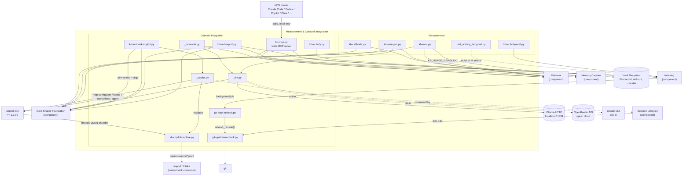

# C4 Component Level: Measurement & Outward Integration

## 1. Overview

| Field | Value |
|---|---|
| **Name** | Measurement & Outward Integration |
| **Description** | The component that (a) proves the retrieval and temporal-recall paths actually work, via eval harnesses and threshold calibration, and (b) exposes the vault to the outside world — any local MCP client, GitHub Copilot CLI, and a portable Open Knowledge Format export — without ever giving up local sovereignty. |
| **Type** | Composite: CLI/batch tooling (eval harnesses, calibration, export, temporal CLI) + a local stdio service (MCP server) + a fail-open hook + an idempotent configuration-writer library. Not a long-running daemon; every entry point is a short-lived process invoked by a human, an agent hook, or an MCP client. |
| **Technology** | Python 3, stdlib-first. Optional `mcp` SDK (server transport), optional `dateparser` (temporal fallback layer, used only via `_activity` in the indexing component). `urllib.request` for local/opt-in-cloud HTTP. `subprocess` for `copilot`, `claude -p`, and `git`. |

## 2. Purpose

This component answers two questions the rest of KennisBank cannot answer about itself:

1. **Does retrieval actually work, and by how much?** `kb-eval.py` measures recall@{1,3,5} and MRR per layer (wiki, memory) against a curated question set, resolving its knobs through the *same* `kb-retrieve` functions the interactive hook uses, so the number describes production behaviour rather than a synthetic variant. `kb-activity-eval.py` does the equivalent for temporal recall. `kb-calibrate.py` re-derives the cosine thresholds the rest of the system hardcodes (dedup, rewrite, reconcile, conflict, retrieve) whenever the embedding model changes, and reports drift against the values actually in use. `kb-eval-gen.py` removes the "nobody hand-writes 100 eval questions" failure mode by proposing deterministic candidates for a human to curate. None of this measurement is allowed to pollute the signal it measures: `kb-eval.py` sets `KB_USAGE_DISABLE=1` for its whole run and restores it afterward, so eval traffic never reaches `kb-usage.db`.

2. **How does the vault reach the outside world without leaving the machine?** `kb-mcp.py` is the single, ecosystem-independent surface (TASK-22): any MCP client running on the same machine — Claude Code, Codex, Copilot in VS Code, Cline, Windsurf, LM Studio, Claude Desktop — gets read (`recall`, `review_pending`), write (`capture`, `review_decide`), and temporal (`what_did_i_do`, `timeline`, `weeklog`, `topic_timeline`) tools over stdio only; it binds no socket. `_llm.py` mirrors the embeddings provider pattern for *generation* (judge/extraction/paraphrase), local Ollama by default, cloud opt-in and always logged loudly to stderr when used. `_reconcile.py` is the write-time consolidation seam the memory-capture sweep calls before adding a new memory (ADD/SUPERSEDE/NOOP), fail-safe to ADD. `kb-okf-export.py` renders the vault as a deterministic, timestamp-free Open Knowledge Format v0.2 bundle — an export view, never internal storage. The whole GitHub Copilot CLI integration (`_copilot.py`, `kennisbank-copilot.py`, `kb-copilot-capture.py`) lives here too: it writes Copilot's own config idempotently, launches the `copilot` binary as a trivial pinned-env subprocess, and captures its lifecycle events fail-open (never denies a tool call, never blocks a session) for later folding into the activity index by the import-intake component. Two small git-freshness scripts (`git-upstream-check.py`, `git-fetch-refresh.py`) round out "outward" in the other direction — surfacing upstream drift at SessionStart without paying its network cost on the interactive path.

In C4 terms: this component is the **verification and boundary layer** — it sits downstream of retrieval/indexing/memory-capture (consuming their read APIs to measure and to serve) and is the only component with either an outbound network client to non-Ollama services or an inbound multi-agent server surface.

## 3. Software Features

| Feature | Description |
|---|---|
| Recall@k evaluation harness | Per-layer (wiki/memory) recall@{1,3,5} and MRR against a curated question set, using the same retrieval knobs as production (`kb-eval.py`). |
| Eval-question draft generator | Deterministic candidate questions per wiki article / current memory, with an optional local-LLM paraphrase pass; only ever writes `*.draft.json`, never the live set (`kb-eval-gen.py`). |
| Temporal activity eval | Hermetic pass/fail runner over `_activity.eval_queries` against a labelled date/period/topic question set (`kb-activity-eval.py`). |
| Cosine-threshold calibration | Embeds a labelled duplicate/related/unrelated pair set with the *active* embedding model, derives boundaries, and flags every hardcoded threshold in the system that has drifted from them — writes nothing itself (`kb-calibrate.py`). |
| Temporal activity CLI | `timeline` / `watdeedik` / `weeklog` / `topic-timeline` / `status` subcommands over the activity index, backing the `/timeline`, `/watdeedik`, `/weeklog` skills (`kb-activity.py`). |
| Local stdio MCP server | Read (`recall`), write (`capture`), review-queue (`review_pending`, `review_decide`), and temporal (`what_did_i_do`, `timeline`, `weeklog`, `topic_timeline`) tools plus an instructions resource, usable by any MCP client on the same machine, no socket bound (`kb-mcp.py`). |
| OKF v0.2 export | Deterministic, byte-identical-on-rerun projection of the vault (wiki + memory + activity log) into an Open Knowledge Format bundle with trust/provenance frontmatter (`kb-okf-export.py`). |
| Copilot lifecycle capture | Fail-open hook (always exit 0, never denies a tool call) that redacts and stages Copilot's `sessionStart`/`userPromptSubmitted`/`preToolUse`/`postToolUse`/`sessionEnd` events to a per-session JSONL file (`kb-copilot-capture.py`). |
| Copilot CLI launcher | Trivial-exec wrapper: pins `KENNISBANK_VAULT` + local-LLM env, runs a fail-open prerequisite check, hands off to the real `copilot` binary preserving argv/exit code; also serves `--doctor`, `--dry-run`, `--print-env` diagnostic modes that work without a binary or login (`kennisbank-copilot.py`). |
| Copilot config management | Idempotent, non-destructive writer for Copilot's MCP registration, hooks manifest, global instructions, and custom-agent profile, each mutation reported as created/updated/skipped with a backup path (`_copilot.py`). |
| Local-first generation router | Ordered provider chain (`ollama` default; `openrouter`/`claude-cli` opt-in) for judge/extraction/paraphrase generation, mirroring the embeddings provider pattern (`_llm.py`). |
| Write-time memory reconciliation | Mem0-style ADD/SUPERSEDE/NOOP decision per candidate memory vs. its nearest existing neighbours, with a deterministic temporal guard and fail-safe-to-ADD (`_reconcile.py`). |
| Background git-freshness check | Surfaces branch/main drift behind upstream at SessionStart, plus an uncommitted-Backlog-task warning, with the one network call (`git fetch`) decoupled into a background worker (`git-upstream-check.py`, `git-fetch-refresh.py`). |
| Temporal-parsing regression set | ~150 deterministic cases (nl/en/de/fr/es/it, plus a hermetic LLM-fallback-layer check) pinning `_activity.parse_period` behaviour, runnable standalone or under pytest (`test_activity_temporal.py`). |

## 4. Code Elements

All fifteen files below are documented, element by element (full signatures, `file:line`), in a single code-level document:

- [c4-code-scripts-eval-integration.md](./c4-code-scripts-eval-integration.md) — the sole source document for this component.

| File | Section | One-line description |
|---|---|---|
| `scripts/kb-eval.py` | §2.1 | Recall@k / MRR eval harness, per layer, with the eval-telemetry kill switch (`KB_USAGE_DISABLE`). |
| `scripts/kb-eval-gen.py` | §2.2 | Deterministic (+ optional LLM-paraphrase) eval-question draft generator; writes only `*.draft.json`. |
| `scripts/kb-activity-eval.py` | §2.3 | Thin CLI runner for the temporal activity recall eval set. |
| `scripts/kb-calibrate.py` | §2.4 | Cosine-threshold calibration against the active embedding model; read-only, writes nothing. |
| `scripts/kb-activity.py` | §2.5 | CLI surface over the activity index (`timeline`/`watdeedik`/`weeklog`/`topic-timeline`/`status`). |
| `scripts/kb-mcp.py` | §2.6 | Local stdio MCP server; the pure `*_tool()` functions are the tested surface, the transport is a thin optional shell. |
| `scripts/kb-okf-export.py` | §2.7 | Deterministic Open Knowledge Format v0.2 export of the vault. |
| `scripts/kb-copilot-capture.py` | §2.8 | Fail-open Copilot lifecycle event capture hook; redacts, caps length, appends JSONL. |
| `scripts/kennisbank-copilot.py` | §2.9 | Trivial-exec Copilot CLI launcher with doctor/dry-run/print-env diagnostic modes. |
| `scripts/_copilot.py` | §2.10 | Idempotent Copilot config layer (detect, install, remove, probe, validate). **Also documented in the adapters code doc** (`c4-code-adapters.md` §2.3–2.5, extended scope) as the implementation behind the generic adapter contract. This document assigns ownership to measurement-and-integration per the primary source doc's explicit 15-file scope list; the two code docs describe the same module from two angles. |
| `scripts/_llm.py` | §2.11 | Local-first generation router (Ollama default; OpenRouter/`claude-cli` opt-in). |
| `scripts/_reconcile.py` | §2.12 | Write-time ADD/SUPERSEDE/NOOP reconciliation seam for the capture sweep. |
| `scripts/git-fetch-refresh.py` | §2.13 | Ten-line decoupled worker entry point that runs `git-upstream-check.refresh_remote()`. |
| `scripts/git-upstream-check.py` | §2.14 | SessionStart drift check; the only network call (`git fetch`) is deliberately *not* in this file's `main()`. |
| `scripts/test_activity_temporal.py` | §2.15 | Deterministic `_activity.parse_period` regression set, standalone-runnable and pytest-importable. |

## 5. Interfaces

### 5.1 MCP stdio server (`kb-mcp.py`)

- **Protocol**: MCP over stdio (`build_server()` returns an `MCPServer`/`FastMCP` instance; `main()` calls `srv.run()`). No network socket is bound — this is a hard, documented sovereignty boundary (`kb-mcp.py:22-25`).
- **Description**: The universal surface for any MCP client on the same machine. Every registered tool is a one-line delegate to a pure, independently-testable `*_tool()` function.
- **Operations**:
  - `recall(query: str, k: int = 5) -> str` — read-only retrieval over wiki + memory layers.
  - `capture(title: str, body: str, memory_type: str = "feit", importance: int = 3) -> str` — writes a new memory as `unverified`; promotion to `current` happens later, via the sweep judge or a human `review_decide`, never inside this call.
  - `review_pending(k: int = 10) -> str` — renders the oldest-first unverified-memory review queue.
  - `review_decide(stem: str, decision: str) -> str` — executes one human `approve|reject|skip` decision; crash-safe (item stays unverified on error, never silently "handled").
  - `what_did_i_do(date_or_period: str, topic: str = "", project: str = "", max_events: int = 25) -> str`
  - `timeline(period: str, topic: str = "", project: str = "", max_events: int = 50) -> str`
  - `weeklog(period: str = "vorige week", topic: str = "", project: str = "", max_events: int = 100) -> str`
  - `topic_timeline(topic: str, period: str = "afgelopen 90 dagen", project: str = "", max_events: int = 80) -> str`
  - Resource `kennisbank://instructions` — best-effort registered pull-nudge text (recall before external search, capture for reusable knowledge, temporal tools for date questions, never decide a review on the user's behalf).
- **Consumers**: any local MCP client (Claude Code, Codex, Copilot in VS Code, Cline, Windsurf, LM Studio, Claude Desktop), per `docs/agent-integrations.md`.

### 5.2 Measurement CLIs

| Command | Flags | Exit codes | Description |
|---|---|---|---|
| `kb-eval.py` | `--set`, `--layer wiki\|memory`, `--json`, `--verbose`, `--latency`, `--expand`/`--no-expand` | 0 = report produced, 1 = set/index/embedding unreachable | Sets `KB_USAGE_DISABLE=1` for the run, restores it in `finally`. |
| `kb-eval-gen.py` | `--layer wiki\|memory\|both`, `--out-dir`, `--llm` | 0 = drafts written, 1 = nothing to generate | Writes to `<vault>/06-claude/*.draft.json`. |
| `kb-activity-eval.py` | `--vault`, `--set`, `--json`, `--threshold` (default `1.0`) | 0/1 by pass-rate threshold | `main(argv: list[str] \| None = None) -> int`. |
| `kb-calibrate.py` | `--set`, `--json` | 0 = report, 1 = set/embedding unusable, 2 = class overlap (no clean separation) | Writes nothing; the human sets the knobs. |
| `test_activity_temporal.py` | (none — standalone or pytest) | 0/1 | `run() -> int` prints per-failure detail plus a pass/fail/total line. |

### 5.3 Outward-integration CLIs

| Command | Flags | Exit codes | Description |
|---|---|---|---|
| `kb-activity.py` | subcommands `timeline\|watdeedik\|what-did-i-do\|weeklog\|topic-timeline\|status`, shared `period`/`--topic`/`--project`/`--max-events`, `--vault`, `--json` | 0 unless `result["ok"]` is falsy | `main(argv: list[str] \| None = None) -> int`. |
| `kb-okf-export.py` | `--out` (default `<vault>/okf-out`) | 0/1 | `export(vault, out_dir) -> dict` orchestration; deterministic output. |
| `kennisbank-copilot.py` | `--doctor`, `--dry-run`, `--print-env`, `--no-capture`, then passthrough Copilot argv | `--doctor`: 0 iff probe status ∈ `("ok","version_old","not_logged_in")`, else 1. `--dry-run`/`--print-env`: 0. Plain launch: 127 if the `copilot` binary is not found, otherwise the launched process's own exit code (`launch()` returns `proc.returncode`). | Diagnostic modes work without a `copilot` binary or GitHub login. |
| `_copilot.py` (`_main`) | subcommands `detect\|install\|remove\|probe\|validate`, `--vault`, `--dry-run`, `--json` | always 0 (`_copilot.py:794`) — errors surface as JSON content (e.g. `{"ok": false, "errors": [...]}` from `validate`), not as a non-zero exit | Machine-readable JSON output; the CLI surface over the config layer's library API (§5.5). |
| `_llm.py` (`_cli`) | `current`, `test` | `current`: 0. `test`: 0 if generation returned text, 1 if the whole provider chain failed. No/unknown subcommand: usage to stderr, exit 2 (`_llm.py:176-188`). | `current` prints the resolved provider chain/model/endpoint/`is_local`; `test` performs one live generation round-trip. |

### 5.4 Hook stdin/stdout JSON (`kb-copilot-capture.py`)

- **Protocol**: single-line JSON on stdin (Copilot's event payload), one structured JSON line appended to a file. **Hard contract**: fail-open, always exit 0, prints nothing on stdout (a non-zero exit on `preToolUse` would deny the tool call — this component observes, it never denies).
- **Operations**: `run(event_name: str, payload: dict, *, vault=None, out=None) -> Path | None` (never raises); CLI `main(argv=None) -> int` with `--event` (default from `COPILOT_HOOK_EVENT`), `--vault`, `--out`, `--print-path` (stderr only).
- **Events handled**: `sessionStart`, `userPromptSubmitted`, `preToolUse`, `postToolUse`, `sessionEnd`.
- **Redaction**: bearer tokens, `KEY=VALUE` secret-shaped pairs, `gh*_…`/`sk-…` tokens scrubbed; values capped at 600 chars; lists capped at 20 items.

### 5.5 Copilot config-writer library API (`_copilot.py`)

- **Protocol**: in-process Python function calls (import, not IPC) — the reusable helper layer `install-agent-envs.py` (session-lifecycle component) delegates to, and that `kennisbank-copilot.py`'s `--doctor`/`--dry-run` modes call directly.
- **Operations**: `detect(vault=None) -> dict`, `install(vault, *, home=None, dry_run=False) -> dict`, `remove(vault, *, home=None, dry_run=False) -> dict`, `validate_config(vault, *, home=None) -> list` (hard-error strings, login-free), `probe_cli(vault, *, home=None, timeout=25) -> dict` (classifies as `copilot_missing`/`platform_binary_missing`/`mcp_list_failed`/`not_logged_in`/`mcp_not_listed`/`version_old`/`ok`), plus the four idempotent writers `ensure_mcp`, `ensure_hooks`, `ensure_instructions`, `ensure_agent_profile` (each returns a uniform `{path, action, changed, backed_up, detail}` report).
- **Pinned config values** (verbatim, `_copilot.py:44`): `KENNISBANK_VAULT` (posix path), `KB_LLM_PROVIDERS=ollama`, `KB_LLM_MODEL=gemma4:12b`, `KB_LLM_ENDPOINT=http://localhost:11434`. `MIN_VERSION = (1, 0, 70)` (`_copilot.py:40`) is the Copilot binary version floor.

### 5.6 File contracts

| Path | Direction | Owner | Contract |
|---|---|---|---|
| `<vault>/06-claude/kb-eval-set.json`, `kb-memory-eval-set.json`, `kb-activity-eval-set.json`, `kb-calibrate-set.json` | read | human-curated | JSON list; shape validated by each harness's `load_set`/`_load_eval` (`ValueError`/`SystemExit` on malformed shape). Personal sets never enter the repo (guarded by `.gitignore` + `tests/test_eval_privacy.py`); only `*.example.json` variants are public. |
| `<vault>/06-claude/*.draft.json` | write | `kb-eval-gen.py` | The *only* path shape `write_draft` accepts — a hard guard against ever overwriting a live eval set. |
| `<vault>/okf-out/**`, per-directory `index.md`, root `index.md` (`okf_version` frontmatter), `log.md` | write | `kb-okf-export.py` | Deterministic — two runs over an unchanged vault are byte-identical; no timestamps. |
| `<vault>/.claude/memory-review-log.jsonl` | read | export (`_approvals_from_review_log`) | Human `approve` decisions, parsed line-by-line, tolerant of unreadable file / bad lines. |
| `<vault>/.claude/copilot-events/<safe-session-id>.jsonl` | write | `kb-copilot-capture.py` | Staging log later folded into `01-raw/transcripts` and the activity index by `import-copilot.py` (import-intake component) — a downstream **consumer**, not a dependency of this component. |
| Copilot config home (`COPILOT_HOME` or `~/.copilot`): `mcp-config.json`, `hooks/kennisbank.json`, `copilot-instructions.md`, `agents/kennisbank.agent.md`, plus rolling `*.kbak` backups | write | `_copilot.py` | Idempotent, marker-scoped or key-scoped; unrelated user content is never touched. |
| `KENNISBANK_SECRETS_FILE` or `~/.config/kennisbank/secrets.json` | read | `_llm._secret` | Optional cloud-provider API keys; environment variable takes precedence. |

### 5.7 Environment-variable contract

`KENNISBANK_VAULT` (authoritative vault pin, `_vaultpath.vault_root()` is still the sanctioned resolver), `KB_USAGE_DISABLE` (eval telemetry kill switch, set/restored by `kb-eval.py`), `KB_LLM_PROVIDERS` / `KB_LLM_MODEL` / `KB_LLM_ENDPOINT` / `KB_LLM_API_KEY_ENV` (generation-router config, precedence over `<vault>/.claude/kennisbank-llm.json`), `KENNISBANK_SECRETS_FILE`, `COPILOT_HOME` (Copilot config home override — the hook that makes `_copilot.py` tests hermetic), `KENNISBANK_COPILOT_BIN` (binary-path escape hatch), `KENNISBANK_COPILOT_NO_CAPTURE` (set by the launcher's `--no-capture`, honored by `_capture_disabled()`), `COPILOT_HOOK_EVENT` (default source for `kb-copilot-capture.py --event`), `KB_CONFLICT_SIM` (referenced, not owned, by `kb-calibrate.CURRENT_KNOBS`).

### 5.8 Job/CLI interface (git freshness)

`git-fetch-refresh.py` and `git-upstream-check.py` expose no flags — both are invoked as bare `[python, path]` subprocesses by other components' job runners (§6). `git-upstream-check.py main()` prints a header + lines to stdout only when there is something to report (uncommitted Backlog files, branch/`main` behind upstream); that stdout becomes SessionStart context. Both `__main__` guards swallow every exception and exit 0 unconditionally.

**Not exposed by this component**: no sqlite schema is owned or created here. `kb-eval.py`, `kb-mcp.py`, and `kb-activity.py`/`kb-activity-eval.py` are read-only *consumers* of `kb-index.db`/`kb-activity.db` (owned by the retrieval and indexing components respectively); `kb-okf-export.render_log` opens `kb-activity.db` directly with `file:…?mode=ro` but only to project day-bucketed counts into `log.md`, not to expose a schema.

## 6. Dependencies

No sibling `c4-component-*.md` files existed in `C4-Documentation/` at the time this document was written, so every row below links to both the prospective component document (per this task's naming convention) and the code-level document that is verified to exist today.

### 6.1 Components used

| Component | Prospective doc | Verified code doc | How it's used |
|---|---|---|---|
| Core shared foundation | [c4-component-core-shared.md](./c4-component-core-shared.md) | [c4-code-scripts-core-shared.md](./c4-code-scripts-core-shared.md) | `_vaultpath.vault_root()` (ADR-0002, the only sanctioned vault resolution) in nearly every file; `_frontmatter.parse_frontmatter()` in `kb-eval-gen.py` and `kb-okf-export.py`; `_hooks_manifest.timeout(script)` (lazily imported) for per-hook ceilings in `_copilot._hook_timeout`. |
| Retrieval | [c4-component-retrieval.md](./c4-component-retrieval.md) | [c4-code-scripts-retrieval.md](./c4-code-scripts-retrieval.md) | `_embeddings.embed()`/`cosine()`/`embed_id()` in `kb-eval.py`, `kb-calibrate.py`, `kb-mcp.py`, `_reconcile.py`; `_provenance.doc_sources()` in `kb-okf-export.py`; `kb-recall.recall_hits()` (via `importlib`) in `kb-eval.py` and `kb-mcp.py`; `kb-retrieve.load_embed_cfg()`/`retrieve_params()` in `kb-eval.py` — the single source of truth for `(top_n, min_cos, expand)`, so the eval measures the same gate the hook uses. |
| Memory capture | [c4-component-memory-capture.md](./c4-component-memory-capture.md) | [c4-code-scripts-memory-capture.md](./c4-code-scripts-memory-capture.md) | `_memory.write()`/`pending_reviews()`/`decide()`/`coerce_memory_type()`/`coerce_importance()` in `kb-mcp.py`; `_usage.enabled()` honors the `KB_USAGE_DISABLE` kill switch set by `kb-eval.py`. (There is also a reverse edge — see Consumers, §6.3.) |
| Indexing | [c4-component-indexing.md](./c4-component-indexing.md) | [c4-code-scripts-indexing.md](./c4-code-scripts-indexing.md) | `_activity.timeline`/`what_did_i_do`/`weeklog`/`topic_timeline`/`index_status`/`eval_queries`/`format_markdown`/`parse_period`/`vault_root`/`_clean_topic` and its LLM-fallback seams, used by `kb-activity.py`, `kb-activity-eval.py`, `kb-mcp.py`'s temporal tools, and `test_activity_temporal.py`. |
| Session lifecycle | [c4-component-session-lifecycle.md](./c4-component-session-lifecycle.md) | [c4-code-scripts-session-lifecycle.md](./c4-code-scripts-session-lifecycle.md) | `kb-session-start.py` runs `git-upstream-check.py` as a 15 s notification-tier job; `_copilot._desired_hooks` wires Copilot's `sessionStart`/`sessionEnd` directly to `kb-session-start.py --client copilot` / `kb-session-end.py --client copilot`, and wraps the capture events through `quiet-hook.py` (see the cross-doc note below). **Reverse edge**: `install-agent-envs.py` is a *consumer* of `_copilot.py`'s library API, not a dependency of it. |

**Cross-doc note — `quiet-hook.py` reachability.** `c4-code-scripts-session-lifecycle.md` (§2.7, §4.3) states `quiet-hook.py` is "currently unreachable" because `_hooks_manifest.SILENT_HOOK_SCRIPTS` is empty and both `register-hooks.build_command` (Claude Code) and `install-agent-envs._codex_command` (Codex) gate routing through it on membership in that set. Verified directly against `scripts/_copilot.py:367-399`: **that gate does not apply to Copilot.** `_copilot._hook_command` unconditionally wraps every non-"direct" hook entry (`userPromptSubmitted`/`preToolUse`/`postToolUse` → `kb-copilot-capture.py`) through `quiet-hook.py --client copilot --event <event> <target>`, with no `SILENT_HOOK_SCRIPTS` check anywhere in this component's code. So on the Copilot integration path `quiet-hook.py` is live and reachable today; the session-lifecycle document's "unreachable" claim is correct for the Claude Code and Codex routing it describes, not for Copilot.

### 6.2 External systems

| System | Direct? | Detail |
|---|---|---|
| Ollama HTTP (`localhost:11434`) | Yes | `POST /api/embeddings` (via `_embeddings.embed`, retrieval component) from `kb-eval.py`, `kb-calibrate.py`, `kb-mcp.py`, `_reconcile.py` — `kb-eval`/`kb-calibrate` ping with `embed("ping")` and abort cleanly if the daemon is down. `POST {KB_LLM_ENDPOINT}/api/generate` (default same host) from `_llm._call` for local generation. |
| OpenRouter HTTP (`https://openrouter.ai/api/v1/chat/completions`) | Yes, opt-in only | `_llm._call`; requires a key from `OPENROUTER_API_KEY`/config and logs loudly to stderr on every use. |
| Local `claude` CLI (`subprocess`) | Yes, opt-in only | `_llm._call`'s `claude-cli` provider, reusing the user's existing Claude Code auth. |
| GitHub Copilot CLI (`copilot` binary, `subprocess`) | Yes, local only | `copilot --version` / `copilot mcp list` (login-free detection/probe, `_copilot.binary_version`, `_copilot.probe_cli`); `copilot [args…]` for the actual launch (`kennisbank-copilot.launch`, stdio inherited, exit code passed through). |
| `git` (local process) | Yes | `rev-parse`, `rev-list`, `status` (all local object store) and `fetch` (the one network call, decoupled into `git-fetch-refresh.py`) from `git-upstream-check.py`. |
| GitHub (the platform/API) | **No** | Not called directly by any file in this component. The `copilot` binary and `git fetch` may themselves reach GitHub over the network, but that transport is internal to those external tools, not code this component owns or controls. |
| The Obsidian vault filesystem | Yes | Eval/calibration sets and drafts under `<vault>/06-claude/`, the OKF bundle under `<vault>/okf-out/`, `<vault>/.claude/memory-review-log.jsonl`, `<vault>/.claude/copilot-events/*.jsonl`, and (read-only) `<vault>/.claude/kennisbank-llm.json`. |
| SQLite databases | Yes, read-only | `<vault>/.claude/kb-index.db` (via `kb-recall.recall_hits`, retrieval component); `<vault>/.claude/kb-activity.db` (via `_activity`, indexing component, and a direct `file:…?mode=ro` open in `kb-okf-export.render_log`); `<vault>/.claude/kb-usage.db` is deliberately **never written** during an eval run — the kill switch is enforced, not merely assumed. |
| The agent harness / MCP clients | Yes, inbound | `kb-mcp.py` is served to any local MCP client (Claude Code, Codex, Copilot in VS Code, Cline, Windsurf, LM Studio, Claude Desktop) over stdio; GitHub Copilot CLI specifically is also the harness that invokes `kb-copilot-capture.py` as a hook and consumes the config `_copilot.py` writes. |

### 6.3 Consumers (inbound — not this component's dependencies, kept here for completeness)

- `memory-sweep.py` (memory-capture component) calls `_reconcile.reconcile()` as its write-time invalidation seam before adding a new memory.
- `install-agent-envs.py` (session-lifecycle component) calls `_copilot.install`/`remove`/`probe_cli`/`validate_config`/`_kb_env` as its Copilot-specific delegate.
- `import-copilot.py` (import-intake component) reads `<vault>/.claude/copilot-events/*.jsonl`, written by `kb-copilot-capture.py`, and folds it into `01-raw/transcripts` and the activity index.
- `kb-session-start.py` (session-lifecycle) runs `git-upstream-check.py` as a job; `index-launch.py` (indexing) runs `git-fetch-refresh.py` as a decoupled background job.
- `_extract.py`, `_judge.py`, `_maintenance.py`, `memory-doctor.py`, `memory-sweep.py` (memory-capture / indexing) also call `_llm.generate()` directly, alongside this component's own `kb-eval-gen.py` and `_reconcile.py`.

## 7. Component Diagram

**Reading the diagram.**

1. **Measurement never contaminates what it measures.** `kb-eval.py` disables usage telemetry for its whole run and restores it in `finally`; the edge into Memory Capture is a kill switch, not a write path.
2. **Outward integration has two independent doors.** `kb-mcp.py` is the generic, protocol-level door (any MCP client, stdio only, no socket). The Copilot cluster (`kennisbank-copilot.py` / `_copilot.py` / `kb-copilot-capture.py`) is a client-specific door: config written idempotently, launch pinned and trivial, lifecycle captured fail-open and handed to Import/Intake — this component is a *producer* for that downstream fold, not a consumer of it.
3. **Git freshness is split by design.** The only network call (`git fetch`) lives in the decoupled worker reached from Indexing's background job runner; the SessionStart-facing script only ever reads the local object store, so the interactive path never pays for a stale-but-safe drift check.
