# C4 Component Level: Retrieval Engine

## 1. Overview

| Field | Value |
|---|---|
| **Name** | Retrieval Engine |
| **Description** | The read side of KennisBank: turns a user prompt, a pre-tool-use query, or a slash-command query into a small, high-precision block of vault context (wiki + memory), ranks it, and either injects it as hook `additionalContext` or prints it for a CLI caller — within a sub-second interactive budget on the hot path. |
| **Type** | Component (Python script/library collection) — a set of hook entry points, CLI entry points, and importable libraries co-located under `scripts/` inside the `scripts/` container. Not a standalone service, daemon, or long-running process; every element is invoked per-event or per-command and exits. |
| **Technology** | Python 3, stdlib-first. `sqlite3` + the `sqlite-vec` extension (`vec0` KNN) and SQLite FTS5 for the index path; `urllib.request` for the one outbound HTTP call per prompt (embeddings); plain JSON for the fallback cache and all hook/CLI I/O. |

## 2. Purpose

The Retrieval Engine answers "what does the vault already know that's relevant right now?" without the user (or the calling agent) asking for it explicitly. It is invoked automatically on every prompt (`UserPromptSubmit`) and every outbound web search (`PreToolUse`), and on demand from slash-commands and manual CLIs.

Problems it solves:

- **Silent context loss.** Without it, an agent starts every turn from zero and either repeats prior mistakes or duplicates existing wiki knowledge. It closes that gap automatically, within a budget the user never notices (default 2.0 s embed timeout, see `kb-retrieve.py:35`).
- **Cross-model corruption.** Embeddings from different providers/models are not comparable; every read path gates on `embed_id()` equality (`_kbindex.is_valid_for`, `get_cached`, the JSON-cache filter in `_wiki_block`) so a model swap degrades to "no hits" rather than silently wrong cosines.
- **Write-time duplication and drift.** `find-similar.py` and `semantic-tiling.py` reuse the same embedding/cosine machinery, off the interactive path, so `/wiki` rewrites instead of forking an article and `/sessielog` flags near-duplicates before they are written.
- **"Did the vault get consulted?"** The engine is fail-open by contract (every element returns `""`/`[]`/`None`/`0` on any exception) with one deliberate exception: a cold-embedding-model miss is reported to the user visibly (`_emit_notice`), because a silent miss is worse than a slow hit.

Its role in the system: it is the **consumer** of the databases and caches the indexing/write-time components build (`kb-index.db`, `kb-graph.db`, `embeddings-cache.json`), and it is the **library** that outward-facing surfaces (the MCP server, the eval harness, slash-commands) call into rather than re-implementing recall themselves.

## 3. Software Features

- **Prompt-triggered recall injection** — `kb-retrieve.py` (`UserPromptSubmit` hook) embeds the prompt once, builds a wiki block and a gated memory block, and injects them as hidden `additionalContext`.
- **Pre-search "check memory first"** — `kb-presearch.py` (`PreToolUse` on `WebSearch`/`WebFetch`) recalls wiki+memory before an external search runs, deferring the tool call either way.
- **Hybrid index recall** — `kb-recall.py` fuses `vec0` KNN (cosine, via unit-normalised vectors) with FTS5 keyword match using Reciprocal Rank Fusion, in one read-only SQLite open.
- **JSON-cache fallback recall** — the same wiki-injection path degrades to scoring the full `embeddings-cache.json` in pure Python when the index is missing or not gated, so a broken index never blocks retrieval outright.
- **Multi-factor re-ranking** — `_rank.py` applies recency/importance/trust decay (memory only), usage/noise feedback (both layers), and an optional bibliographic-coupling boost, as pure, individually fail-soft functions.
- **Graph-neighbour expansion** — one additional "also relevant" hit appended last (never displacing a direct hit), sourced from `kb-graph.db` weighted adjacency (`kb-recall.graph_neighbor`, default) or a legacy in-prompt regex walk (`_rank.one_hop_neighbor`, fallback), gated by the `graph_retrieval` setting.
- **Pluggable embedding provider + warm-up self-heal** — `_embeddings.py` embeds via Ollama (default, local), OpenAI, or Voyage; on a cold model it fires a detached `--warm` subprocess rather than blocking the prompt.
- **Cross-model / staleness safety net** — `embed_id()` equality checks, the `unit_norm` index-gate, stale-graph → no-neighbour, and stale-memory-row drop are all enforced on every read.
- **Query-string CLI recall** — `kb-search.py`, used by `/uitdaag` and `/brug`, scores the JSON cache directly (no index, no re-ranking) and always prints JSON.
- **Manual cloud-agent export bridge** — `kb-ask.py` retrieves locally and prints (or clipboard-copies) a paste-ready block for agents that cannot reach a local MCP server; nothing leaves the machine automatically.
- **Write-time duplicate/rewrite detection** — `find-similar.py` (best match for `/wiki`, exit 1 on unavailable embedding — a deliberate "unknown" signal) and `semantic-tiling.py` (near-duplicate report for `/sessielog`, the only writer of the JSON cache in this group).
- **Provenance-key extraction for coupling** — `_provenance.py` extracts source keys at index time, sharing `kb-lint.py`'s own parsing regex so the two can never drift apart.
- **Usage/noise telemetry** — `kb-retrieve.py` logs which stems (and which graph neighbours) were injected; `kb-recall.py` reads the resulting `last_used`/`noise`/`injected` counters back into ranking, in one batched query.
- **Fail-open contract throughout** — every public entry returns an empty/neutral result on any exception; a bare `try/except: pass` wraps `kb-retrieve.main()` at module level so a crash can never break a prompt.

## 4. Code Elements

This component is built from one C4 code-level document, which itself documents ten Python files:

- [c4-code-scripts-retrieval.md](./c4-code-scripts-retrieval.md) — `kb-retrieve.py` (hook), `kb-presearch.py` (hook), `kb-recall.py` (recall library), `_rank.py` (re-ranking maths), `_embeddings.py` (embedding provider + cache), `kb-search.py` (CLI), `kb-ask.py` (CLI), `find-similar.py` (write-time CLI), `semantic-tiling.py` (write-time CLI), `_provenance.py` (index-time library).

Not every file in that document sits on the sub-second hot path — the doc itself is explicit about this, and this synthesis preserves the distinction rather than flattening it:

| Sub-group | Files | On hot path? |
|---|---|---|
| Hook entry points | `kb-retrieve.py`, `kb-presearch.py` | Yes — triggered by Claude Code on every prompt / outbound search |
| Recall + ranking library | `kb-recall.py`, `_rank.py`, `_embeddings.py` | Yes — imported by both hooks (and by `kb-ask.py`) |
| Interactive CLI | `kb-search.py`, `kb-ask.py` | No — invoked on demand by a slash-command or the user, not automatically |
| Write-time CLI | `find-similar.py`, `semantic-tiling.py` | No — run when an article is created/rewritten, never on a prompt |
| Index-time library | `_provenance.py` | No — imported only by `build-kb-index.py`/`kb-okf-export.py`, never by a hook |

`scripts/_vaultpath.py`, `_settings.py`, `_kbindex.py`, `_frontmatter.py`, `_memory.py` and `_hooks_manifest.py` are **not** part of this component — they are the shared foundation this component depends on (see §6); folding them in here would be the wrong dependency direction, since six other consumer groups (index builders, importers, the memory subsystem, installers, quality tooling, the Atlas app) depend on them too.

## 5. Interfaces

### 5.1 `UserPromptSubmit` hook

- **Protocol:** hook stdin/stdout JSON (Claude Code hook contract), timeout ceiling 30 s (`_hooks_manifest.TIMEOUTS["kb-retrieve.py"]`); internal embed budget defaults to 2.0 s (`KB_RETRIEVE_TIMEOUT`, capped by `KB_PROMPT_HOOK_MAX_EMBED_TIMEOUT`).
- **Description:** the single interactive entry point. Reads the prompt from stdin, embeds it exactly once, builds and emits a wiki block plus a gated memory block.
- **Operations:**
  - `main() -> None` — `kb-retrieve.py:341`. stdin: full `UserPromptSubmit` event JSON. stdout (on injection): `{"suppressOutput": true, "hookSpecificOutput": {"hookEventName": "UserPromptSubmit", "additionalContext": "<block>"}}`. stdout (on a cold-model miss): same shape with `"suppressOutput": false` — the one deliberately visible failure mode.
  - `retrieve_params(cfg: dict) -> dict` — `kb-retrieve.py:157`. Cross-module public: `{"top_n", "min_cos", "expand"}`. Consumed by `kb-eval.py:184` for eval/production parity (TASK-86).
  - `load_embed_cfg(vault_root) -> dict` — `kb-retrieve.py:173`. Cross-module public: reads `<vault>/.claude/kennisbank-embed.json` fail-soft. Consumed by `kb-eval.py:183`.

### 5.2 `PreToolUse(WebSearch|WebFetch)` hook

- **Protocol:** hook stdin/stdout JSON, timeout ceiling 30 s.
- **Description:** "check your own memory first" — fires just before an external web search/fetch, injects wiki+memory hits, and always lets the tool proceed.
- **Operations:**
  - `main(stdin_text: str | None = None) -> int` — `kb-presearch.py:87`. Always returns `0`. stdout: `{"suppressOutput": true, "hookSpecificOutput": {"hookEventName": "PreToolUse", "permissionDecision": "defer", "additionalContext": "<block>"}}`. Gated on the `memory_recall` setting; query length ≥ 4 chars; embeds with the default 30 s timeout (a tool boundary, not the 2 s keystroke budget).

### 5.3 Recall library (`kb-recall.py`) — Python importlib API

- **Protocol:** in-process Python function calls. No `__main__`/CLI exists; loaded via `importlib.util.spec_from_file_location` because the filename is hyphenated.
- **Description:** the primary recall surface over `kb-index.db` + `kb-graph.db`. Read-only.
- **Operations:**
  - `recall_hits(query_vector, query_text="", k=3, layers=("wiki","memory"), expand=False, min_cos=0.0) -> list[dict]` — `kb-recall.py:199`. Returns hit dicts with `path, layer, title, created, score, cos, fts, snippet` (+ `neighbor: True` on the appended expansion entry). **The primary public entry** — also called cross-component by `kb-mcp.py:78` and `kb-eval.py:196,200`.
  - `wiki_hits(...)` / `memory_hits(...)` — `kb-recall.py:330` / `:272` — thin `layers=("wiki",)` / `("memory",)` wrappers. `memory_hits` uses its own threshold, `MEMORY_MIN_COS = 0.60`, not the wiki `retrieve_threshold`.
  - `index_is_gated() -> bool` — `kb-recall.py:279`. True only when the index matches the live `embed_id()` **and** `unit_norm == "1"`; the precondition that lets `kb-retrieve` trust the fast path.
  - `has_fts_match(query_text: str, layer="wiki") -> bool` — `kb-recall.py:304`. Keyword-only signal used to open the JSON-cache-fallback gate.
  - `graph_neighbor(hits) -> dict | None` — `kb-recall.py:76`. Weighted best neighbour from `kb-graph.db`; stale graph → `None`, never a wrong neighbour.

### 5.4 Ranking library (`_rank.py`) — pure Python API

- **Protocol:** in-process function calls, no I/O, every reader (`meta_fn`, `last_used_fn`, `noise_fn`, `sources_fn`) injectable for testing.
- **Operations:** `rerank(hits, meta_fn, today=None, last_used_fn=None, noise_fn=None, sources_fn=None) -> list` (`_rank.py:139`); `one_hop_neighbor(hits, root, read_fn=None) -> str | None` (`_rank.py:207`, the legacy neighbour source); `recency_factor`, `importance_factor`, `trust_factor`, `usage_factor`, `noise_factor`, `coupling_factor` (`_rank.py:47-129`).

### 5.5 Embedding provider (`_embeddings.py`) — Python API + detached CLI

- **Protocol:** in-process function calls, one outbound HTTP call, one detached-subprocess CLI entry (`--warm`).
- **Operations:**
  - `embed(text: str, timeout: float = 30.0) -> list[float] | None` — `_embeddings.py:131`. The single outbound HTTP call on the retrieval path.
  - `embed_id() -> str`, `cosine(a, b) -> float`, `load_cache() -> dict`, `save_cache(cache: dict) -> None`, `get_cached(path, cache, recompute=True) -> list[float] | None`, `doc_text(path, cap=4000) -> str`.
  - `warm(timeout=120.0) -> bool` / `warm_async(min_interval=60.0) -> None` — `_embeddings.py:184,190`. `warm_async` is the self-heal: fire-and-forget `subprocess.Popen([sys.executable, __file__, "--warm"])`, sentinel-guarded by `.embed-warm.marker` mtime.
  - CLI: `python _embeddings.py --warm` — `_embeddings.py:292-299`, the entry point `warm_async` spawns.

### 5.6 Query-string retrieval CLI — `kb-search.py`

- **Protocol:** CLI (argparse), stdout JSON, always exit 0.
- **Command:** `python kb-search.py <query> [--top N] [--threshold T]` → `[{"path", "score", "snippet"}]`. JSON-cache only — no index, no FTS, no re-ranking. Called by `commands/uitdaag.md:20` and `commands/brug.md:29,30,70`.

### 5.7 Manual export bridge CLI — `kb-ask.py`

- **Protocol:** CLI (argparse), stdout paste-ready text block, optional clipboard write, status on stderr, always exit 0.
- **Command:** `python kb-ask.py <query...> [--k N] [--clip] [--plain]`. TASK-22: for agents that cannot reach a local MCP server; nothing leaves the machine automatically — the human is the gate.

### 5.8 Write-time candidate-match CLI — `find-similar.py`

- **Protocol:** CLI (argparse), stdout JSON.
- **Command:** `python find-similar.py <query-or-existing-path> [--threshold T] [--json]` → `{"path", "score", "above_threshold"}`. **Exit 1 specifically when the embedding is unavailable** — the one non-zero exit on a retrieval *result* in this group, deliberate so `/wiki` cannot mistake "unknown" for "no similar article confirmed." Called by `commands/wiki.md:49`.

### 5.9 Write-time near-duplicate CLI — `semantic-tiling.py`

- **Protocol:** CLI (positional path arg), stdout human-readable report.
- **Command:** `python semantic-tiling.py <path>`. Buckets matches into `errors` (cosine ≥ 0.85 default) and `reviews` (≥ 0.62 default); exits 1 only on usage/precondition errors. The only writer of `embeddings-cache.json` inside this component (`save_cache`, process-unique temp file). Called by `commands/sessielog.md:134`.

### 5.10 Provenance extraction — `_provenance.py`

- **Protocol:** Python API, index-time only (never imported by a hook).
- **Operations:** `doc_sources(path: Path, layer: str, fm: dict, body: str) -> list[str]` — `_provenance.py:56`. Consumed by `build-kb-index.py:42` (indexing) and `kb-okf-export.py:185` (export/adapters), off this component's own read path.

### 5.11 SQLite read contracts

- **`kb-index.db`** (schema owned by the core-shared foundation, opened read-only here via `file:<path>?mode=ro`): `docs`, `fts_docs` (FTS5), `vec_docs` (`vec0`, `float[dim]`), `doc_sources`, `meta` (`dim`, `embed_id`, `unit_norm`). Read by `kb-recall._open_ro` / `_kbindex.search`.
- **`kb-graph.db`**: `graph_nodes`, `graph_edges`, `meta` (`graph_fingerprint`). Opened read-only directly by `kb-recall._open_graph_ro`, deliberately **not** via `_kbindex.graph_connect` (which is read-write and creates directories/sets WAL).
- **`kb-usage.db`**: `usage(stem, last_used, noise, injected)`, `pending`, `neighbor_log`. Read via `_usage.stats_for` (one batched query); **written** via `_usage.log_injected` — the only write this component performs on the hot path.

### 5.12 File contracts

- **`$VAULT/.claude/embeddings-cache.json`** — the JSON embedding cache. Read by the `_wiki_block` fallback, `kb-search.py`, `find-similar.py`, `semantic-tiling.py`; written inside this component only by `semantic-tiling.py` (atomic: process-unique temp file + `os.replace`).
- **`$VAULT/.claude/kennisbank-embed.json`** — provider/retrieval knobs, read via `load_embed_cfg` / `_embeddings._config`.
- **`$VAULT/.claude/.embed-warm.marker`** — mtime sentinel guarding `warm_async` against a child-process pile-up (at most one spawn per minute while the model stays cold).

### 5.13 Outbound HTTP (embeddings)

| Provider | Endpoint | Default model | Auth |
|---|---|---|---|
| `ollama` (default) | `POST http://localhost:11434/api/embeddings` | `qwen3-embedding:8b` | none (local daemon) |
| `openai` | `POST https://api.openai.com/v1/embeddings` | `text-embedding-3-small` | `Bearer` from the env var named in `api_key_env` |
| `voyage` | `POST https://api.voyageai.com/v1/embeddings` | `voyage-3` | as above |

Default configuration makes exactly one outbound call per prompt, to `localhost`.

> **Source-verified correction to the underlying code doc.** `c4-code-scripts-retrieval.md` (§2.2 and its §4.2 diagram) documents `graph_retrieval` as defaulting **off**, with `_rank.one_hop_neighbor` as the default neighbour source. Checking `scripts/_settings.py:66` directly (`DEFAULTS["graph_retrieval"] = True`) shows the toggle was flipped to **on** after an A/B gate on 329 wiki questions (`@1 0.745→0.790, @5 0.954→1.000, MRR 0.836→0.882, single-hop@1 0.777→0.831, p95 lower`), dated in-source to 2026-07-29 — the same day this document was written. The code doc predates that flip. As of today, the default neighbour source in production is `kb-recall.graph_neighbor` (weighted `kb-graph.db` adjacency), and `_rank.one_hop_neighbor` is the fallback, not the default.

## 6. Dependencies

### 6.1 Components Used

> No sibling `c4-component-*.md` files exist in this repository yet — this synthesis is (as far as could be determined) the first component-level document produced. The links below are **forward references**, named to mirror the existing `c4-code-*.md` suffixes; they will resolve once those components are synthesized.

| Component | Link | Used for |
|---|---|---|
| Core Shared Foundation | [c4-component-core-shared.md](./c4-component-core-shared.md) *(forward reference — not yet published; source: [c4-code-scripts-core-shared.md](./c4-code-scripts-core-shared.md))* | `_vaultpath.vault_root()` (ADR-0002, the only sanctioned vault-root resolver); `_kbindex.py`'s schema/access layer (`search()`, `graph_neighbors()`, `is_valid_for()`, `meta_get()`, `fts_expr()`, `sources_for()`, `graph_is_current()`) for both `kb-index.db` and `kb-graph.db`; `_settings.get()` for the `memory_recall` and `graph_retrieval` toggles; `_frontmatter.parse_frontmatter()`; `_hooks_manifest` for the hook manifest and per-script timeout ceilings. |
| Indexing / Index Builders | [c4-component-indexing.md](./c4-component-indexing.md) *(forward reference — source: [c4-code-scripts-indexing.md](./c4-code-scripts-indexing.md))* | Produces the artifacts this component only ever reads: `kb-index.db` (`build-kb-index.py`), `embeddings-cache.json` (`build-embed-index.py`), `kb-graph.db` (`build-graph-index.py`). No direct code call in either direction — a clean write-time/read-time separation. `build-kb-index.py` additionally imports this component's `_provenance.doc_sources` at index time. |
| Memory Capture | [c4-component-memory-capture.md](./c4-component-memory-capture.md) *(forward reference)* | `_memory.read_status()` (stale-memory-row drop in `recall_hits`), `_memory.provenance_tag()` (via `_provenance_tag` in `kb-retrieve.py`). |
| Quality / Graph | [c4-component-quality-graph.md](./c4-component-quality-graph.md) *(forward reference — source: [c4-code-scripts-quality-graph.md](./c4-code-scripts-quality-graph.md))* | `kb-lint.py`'s wikilink/target-normalisation regex, imported by `_provenance.py` via `importlib` at import time so the two parsers can never drift. |

`scripts/_usage.py` (usage/noise telemetry read+write) is a dependency of this component but does not currently have its own `c4-code-*.md`/`c4-component-*.md` — it appears across multiple groups as an out-of-scope shared dependency.

### 6.2 External Systems

| System | How it's used |
|---|---|
| **Ollama (local HTTP daemon)** | Default embedding provider, `POST http://localhost:11434/api/embeddings`, one call per prompt on the hot path; swappable to OpenAI or Voyage cloud APIs via config (`_embeddings.py`). |
| **SQLite databases** (`$VAULT/.claude/kb-index.db`, `kb-graph.db`, `kb-usage.db`) | Local embedded storage, all opened read-only by this component except `kb-usage.db` (write via `log_injected`) and `embeddings-cache.json` (write via `semantic-tiling.save_cache`). Owned/written elsewhere (indexing, usage telemetry); this component is a reader (plus the two writes just noted). |
| **Obsidian vault filesystem** | `$VAULT/02-wiki/*.md`, `$VAULT/09-memory/*.md` (snippet/frontmatter sources); `$VAULT/.claude/*.json` config and cache files; `$VAULT/graphify-out/graph.json` (fingerprint/`stat()` only, for graph staleness — the file itself is produced by the external graphify skill, outside this repo). |
| **Agent harness (Claude Code / hook runtime)** | Invokes `kb-retrieve.py` on every `UserPromptSubmit` and `kb-presearch.py` on every `PreToolUse(WebSearch|WebFetch)`, enforcing the 30 s hook-timeout ceiling from `_hooks_manifest.TIMEOUTS`; slash-commands (`commands/*.md`, itself a separate component) shell out to `kb-search.py`, `kb-ask.py`, `find-similar.py`, `semantic-tiling.py`. |
| **GitHub** | Not used by this component. Neither primary code document shows any `git`/GitHub interaction on this path; that surface belongs to other components (e.g. the eval-integration/adapters group's `git-fetch-refresh.py`, `git-upstream-check.py`). |

### 6.3 Consumed by (reverse dependencies, for context)

Not this component's own dependencies, but recorded here because they explain why `kb-recall.py` and `kb-retrieve.py` expose the public functions they do: `kb-mcp.py:78` (MCP/adapters component) imports `kb-recall` via `importlib` for its `recall_tool`; `kb-eval.py:196,200,183-184` (eval-integration component) imports `kb-recall.recall_hits` and `kb-retrieve.retrieve_params`/`load_embed_cfg` to measure the same gate/expansion production uses (TASK-86); `kb-okf-export.py:185` imports `_provenance.doc_sources`.

## 7. Component Diagram

```mermaid
flowchart TB
    subgraph HARNESS["Agent harness (Claude Code)"]
        UPS["UserPromptSubmit event"]
        PTU["PreToolUse event<br/>WebSearch / WebFetch"]
        CMD["Slash-commands<br/>uitdaag / brug / wiki / sessielog"]
    end

    subgraph RE["Retrieval Engine component"]
        direction TB

        subgraph hotpath["Hot path (sub-second)"]
            RETR["kb-retrieve.py<br/>UserPromptSubmit hook"]
            PRES["kb-presearch.py<br/>PreToolUse hook"]
            RECALL["kb-recall.py<br/>recall_hits / wiki_hits / memory_hits<br/>index_is_gated / graph_neighbor"]
            RANK["_rank.py<br/>rerank / one_hop_neighbor"]
            EMB["_embeddings.py<br/>embed / cosine / cache / warm_async"]
        end

        subgraph offpath["Off-path CLIs and index-time library"]
            SEARCHCLI["kb-search.py<br/>CLI"]
            ASKCLI["kb-ask.py<br/>CLI"]
            SIMCLI["find-similar.py<br/>write-time CLI"]
            TILECLI["semantic-tiling.py<br/>write-time CLI"]
            PROV["_provenance.py<br/>doc_sources (index-time)"]
        end

        RETR --> RECALL
        RETR --> EMB
        PRES --> RECALL
        PRES --> EMB
        ASKCLI --> RECALL
        ASKCLI --> EMB
        RECALL --> RANK
        SEARCHCLI --> EMB
        SIMCLI --> EMB
        TILECLI --> EMB
    end

    subgraph CORE["Core Shared Foundation (dependency)"]
        VP["_vaultpath.vault_root()"]
        KBIDX["_kbindex.py<br/>search / graph_neighbors / is_valid_for"]
        SET["_settings.py<br/>memory_recall / graph_retrieval"]
        FM["_frontmatter.py"]
    end

    subgraph MEM["Memory Capture (dependency)"]
        MEMMOD["_memory.py<br/>read_status / provenance_tag"]
    end

    subgraph QG["Quality / Graph (dependency)"]
        LINT["kb-lint.py<br/>wikilink parsing contract"]
    end

    subgraph IDX["Indexing (upstream producer, no code dependency)"]
        BUILD["build-kb-index.py<br/>build-embed-index.py<br/>build-graph-index.py"]
    end

    subgraph STORES["Local stores"]
        KIDX[("kb-index.db<br/>vec0 + FTS5 + doc_sources")]
        KGRAPH[("kb-graph.db<br/>graph_nodes + graph_edges")]
        KUSE[("kb-usage.db<br/>usage / pending / neighbor_log")]
        CACHE[("embeddings-cache.json")]
        VAULT[("02-wiki/*.md<br/>09-memory/*.md")]
    end

    subgraph CONSUMERS["Consumers (reverse dependencies)"]
        MCP["kb-mcp.py<br/>(adapters component)"]
        EVAL["kb-eval.py<br/>(eval-integration component)"]
        OKF["kb-okf-export.py"]
    end

    UPS --> RETR
    PTU --> PRES
    CMD --> SEARCHCLI
    CMD --> SIMCLI
    CMD --> TILECLI

    RECALL --> KBIDX
    KBIDX --> VP
    RETR --> SET
    PRES --> SET
    RETR --> MEMMOD
    RECALL --> MEMMOD
    PROV -->|"importlib, import-time"| LINT

    RECALL -.->|"read-only"| KIDX
    RECALL -.->|"read-only"| KGRAPH
    RECALL -.->|"read stats_for"| KUSE
    RETR -.->|"write log_injected"| KUSE
    RETR -.->|"fallback read"| CACHE
    SEARCHCLI -.-> CACHE
    SIMCLI -.-> CACHE
    TILECLI -.->|"read + write"| CACHE
    EMB -.->|"snippets"| VAULT

    BUILD -->|"writes"| KIDX
    BUILD -->|"writes"| KGRAPH
    BUILD -->|"writes"| CACHE
    BUILD -->|"imports"| PROV

    MCP -->|"importlib"| RECALL
    EVAL -->|"importlib"| RECALL
    EVAL -->|"importlib"| RETR
    OKF -->|"imports"| PROV

    EMB -->|"HTTP POST /api/embeddings"| OLLAMA(["Ollama daemon<br/>localhost:11434<br/>(default provider)"])

    classDef ext fill:#2d3b4e,stroke:#7aa2c4,color:#e8eef5
    class OLLAMA ext
```

