# C4 Component Level: System Overview

## LLmWiki-KennisBank

KennisBank's north star (`CLAUDE.md`) is to feel invisible: retrieval on the
interactive path must stay sub-second, so everything expensive — ingest, memory
extraction, quality checks, index building — is pushed off that path to
write-time, idle time, or session boundaries. That split is the system's central
design rule, and it is visible below as the boundary between the **Retrieval
Engine** (the only component on the hot path) and the four components that do
their work off it (**Knowledge Processing**, **Index Store**, **Agent
Integration**, **Measurement & Outward Integration**). **Atlas App** is a
separate, standalone desktop viewer with no hot-path role, and **Distribution &
Quality Gate** is a meta-layer that ships and verifies the other six rather than
running inside a session at all.

## 1. System Components

| Component | Description | Documentation |
| --- | --- | --- |
| Retrieval Engine | The read side of KennisBank: turns a prompt, a pre-search query, or a slash-command query into ranked, cross-model-safe wiki+memory context and injects it (or prints it) within a sub-second interactive budget — the system's **only** hot-path component. | [c4-component-retrieval-engine.md](./c4-component-retrieval-engine.md) |
| Knowledge Processing | The write-time and idle-time layer that turns foreign material and live sessions into durable, quality-checked, graph-connected vault knowledge — ingest, autonomous memory capture, provenance/staleness/contradiction checks, graph enrichment — plus the write side of usage/noise telemetry and the checkpoint primitive. | [c4-component-knowledge-processing.md](./c4-component-knowledge-processing.md) |
| Index Store | The local SQLite index layer (hybrid `vec0`+FTS5 search, knowledge-graph neighbours, temporal activity log, the Karpathy wiki index) plus the detached, single-flight background workers that build and repair those indexes off the hot path. | [c4-component-index-store.md](./c4-component-index-store.md) |
| Agent Integration | The harness-facing boundary: the one hook coordinator per lifecycle event, the 20 slash-command procedures, the 4 skill manifests, and the per-harness adapter/installer layer that writes and validates KennisBank config into Claude Code, Codex CLI, OpenCode, and GitHub Copilot CLI. | [c4-component-agent-integration.md](./c4-component-agent-integration.md) |
| Atlas App | A local-only, standalone Tauri v2 desktop application giving the vault's editor a seven-lens visual cockpit (health, graph, wordcloud, time slider, memory review, retrieval waterfall, …) over the same SQLite stores and markdown, read-only except for one memory-review decision endpoint. | [c4-component-atlas-app.md](./c4-component-atlas-app.md) |
| Measurement & Outward Integration | Proves retrieval and temporal recall actually work (recall@k/MRR eval harnesses, cosine-threshold calibration) and exposes the vault outward — a local stdio MCP server reachable by any MCP client, a portable Open Knowledge Format export, and the GitHub Copilot CLI integration — without leaving the machine except for opt-in cloud generation. | [c4-component-measurement-and-integration.md](./c4-component-measurement-and-integration.md) |
| Distribution & Quality Gate | Defines what a user's vault looks like (skeleton spec, the two canonical templates), ships it (`setup.sh`), and proves the shape is correct before and after every change — the 1099-test pytest suite, the CI workflow, and the ADR/spec/plan decision layer everything else must obey. Not a runtime component: it acts at install-time, write-time (templates), and CI-time. | [c4-component-distribution-and-quality-gate.md](./c4-component-distribution-and-quality-gate.md) |

### Notes on component boundaries

Several of the seven documents above were written independently and forward-reference
an anticipated "Core Shared Foundation" component (for `_vaultpath.py`, `_settings.py`,
`_frontmatter.py`, `_kbindex.py`, `_hooks_manifest.py`, …) that was never published as
its own document. Cross-checking each component's own §4 "Code Elements" resolves
where those modules actually landed: **Index Store** explicitly claims `_vaultpath.py`,
`_settings.py`, `_frontmatter.py`, and `_kbindex.py` as its own code (the sqlite-facing
subset); **Agent Integration** explicitly claims `_hooks_manifest.py` as part of its
adapter code element. The remaining modules from that anticipated foundation
(`_common.py`, `_migrations.py`, `_transcript.py`, `_liteparse.py`) are not claimed by
name as owned code in any of the seven documents. They are consumed by, but not
necessarily owned by, the components whose code elements cite them (`_migrations.py`
and `_transcript.py` — Knowledge Processing / Agent Integration installers;
`_liteparse.py` — Knowledge Processing's ingest layer), consistent with how each
source document already describes their call sites. Ownership of these four modules
remains an open question for a future reconciliation pass; this reconciliation was
done by reading the seven documents together, not by re-inspecting the source code.

## 2. Component Relationships Diagram

```mermaid
flowchart TB
    subgraph HOTPATH["🔥 Hot path — sub-second, every prompt"]
        RE["Retrieval Engine<br/>kb-retrieve.py · kb-presearch.py<br/>kb-recall.py · _rank.py · _embeddings.py"]
    end

    subgraph WRITETIME["Write-time / idle / session-boundary processing"]
        direction LR
        AI["Agent Integration<br/>session coordinators, commands,<br/>skills, per-harness adapters"]
        KP["Knowledge Processing<br/>ingest · memory capture ·<br/>quality and graph · usage write side"]
        IS["Index Store<br/>index/graph/activity builders,<br/>detached maintenance worker"]
        MI["Measurement and Outward Integration<br/>eval harnesses · MCP server ·<br/>OKF export · Copilot/git bridges"]
    end

    subgraph STANDALONE["Standalone desktop viewer — no hot-path role"]
        AA["Atlas App<br/>Tauri shell + WebView2 + FastAPI sidecar"]
    end

    subgraph META["Distribution and verification — install-time / CI-time only"]
        DQ["Distribution and Quality Gate<br/>vault spec, templates,<br/>pytest suite, CI, ADRs/specs/plans"]
    end

    subgraph EXTSYS["External systems"]
        OLLAMA[("Ollama daemon<br/>localhost:11434")]
        SQLITE[("SQLite databases<br/>kb-index.db · kb-graph.db<br/>kb-usage.db · kb-activity.db")]
        VAULT[("Obsidian vault filesystem")]
        HARNESS(["Agent harness<br/>Claude Code · Codex CLI ·<br/>OpenCode · GitHub Copilot CLI"])
        GITHUB[("GitHub<br/>Actions · PRs · gh CLI")]
    end

    %% ==== Hot-path edges (heavy) ====
    HARNESS ==>|"UserPromptSubmit / PreToolUse<br/>direct hook invocation"| RE
    RE ==>|"1 embed call / prompt"| OLLAMA
    RE ==>|"read-only KNN + FTS5 + graph;<br/>one write: usage log_injected"| SQLITE
    RE -.->|snippets| VAULT

    %% ==== Agent Integration: lifecycle + wiring ====
    HARNESS -->|"SessionStart / SessionEnd /<br/>PreCompact / Stop"| AI
    AI -->|"writes hook / MCP / skill config"| HARNESS
    AI -->|"Job 15s: index-launch.py<br/>--force: build-karpathy-index.py"| IS
    AI -->|"runs memory-notify, checkpoint,<br/>usage-scan, wiki/reconcile commands"| KP
    AI -->|"registers hooks, prewarms embed,<br/>context-budget → kb-search"| RE
    AI -->|"installs/validates kb-mcp.py reg.,<br/>runs kb-activity, git-upstream-check"| MI
    AI -->|"gh CLI: release / contribute skills"| GITHUB
    AI -.->|status reads| SQLITE
    AI -.-> VAULT

    %% ==== Knowledge Processing ====
    KP -->|"embed/cosine, find-similar<br/>(write-time dedup)"| RE
    KP -->|"memory-sweep, called as<br/>index-launch job 1"| IS
    KP -->|"_llm.generate: judge / extract"| MI
    KP -->|"writes kb-usage.db"| SQLITE
    KP -.-> OLLAMA
    KP -.-> VAULT

    %% ==== Index Store ====
    IS -->|"_embeddings.py, _provenance.py"| RE
    IS -->|"_memory.read_status / set_status"| KP
    IS -->|"judge_supersede/recheck via _llm;<br/>job 6: git-fetch-refresh"| MI
    IS -->|"owns and writes"| SQLITE
    IS -.-> OLLAMA
    IS -.-> VAULT

    %% ==== Measurement & Outward Integration ====
    MI -->|"recall_hits, embed(), retrieve_params"| RE
    MI -->|"_memory write/pending_reviews/decide;<br/>KB_USAGE_DISABLE kill switch"| KP
    MI -->|"_activity.py: timeline / what_did_i_do"| IS
    MI -->|"launches copilot binary (subprocess)"| HARNESS
    MI -.->|"git fetch (indirect)"| GITHUB
    MI -.-> OLLAMA
    MI -.-> SQLITE
    MI -.-> VAULT

    %% ==== Atlas App (standalone) ====
    AA -->|"dynamic load: kb-recall, _embeddings"| RE
    AA -->|"_kbindex via kb-recall._open_ro"| IS
    AA -->|"kb-lint.py, _memory.py, _usage.py"| KP
    AA -.->|"read-only, ?mode=ro;<br/>kb-index/kb-usage/kb-activity only,<br/>not kb-graph.db"| SQLITE
    AA -.->|"query embeddings only"| OLLAMA
    AA -.->|"one write: POST /memory/decide<br/>(frontmatter line + review log)"| VAULT

    %% ==== Distribution & Quality Gate (verification, dotted) ====
    DQ -.->|"exercises as test subject"| RE
    DQ -.->|"exercises as test subject;<br/>templates define the ## Sessie-herkomst /<br/>## Verbanden parsing surface it consumes"| KP
    DQ -.->|"exercises as test subject"| IS
    DQ -.->|"exercises as test subject"| AI
    DQ -.->|"exercises as test subject"| MI
    DQ -.->|"gates via CI job"| AA
    DQ -->|"CI Actions + Copilot PR review"| GITHUB
    DQ -.->|"ADR defaults; pinned-dead test endpoint"| OLLAMA
    DQ -.->|"spec + throwaway temp test vaults"| VAULT

    classDef hot fill:#5a1e1e,stroke:#ff6b6b,stroke-width:3px,color:#fff
    classDef write fill:#1e2a4a,stroke:#7aa2c4,stroke-width:1.5px,color:#fff
    classDef standalone fill:#1e4a2e,stroke:#5fbf7a,stroke-width:1.5px,color:#fff
    classDef meta fill:#3a2f4a,stroke:#b48ead,stroke-width:1.5px,color:#fff
    classDef ext fill:#2d2d2d,stroke:#999999,color:#eeeeee
    classDef harness fill:#4a3a1e,stroke:#d9a441,color:#ffffff

    class RE hot
    class AI,KP,IS,MI write
    class AA standalone
    class DQ meta
    class OLLAMA,SQLITE,VAULT,GITHUB ext
    class HARNESS harness
```

**How to read this diagram.**

- **Heavy arrows (`==>`)** mark the hot path itself: the harness invoking
  `kb-retrieve.py`/`kb-presearch.py` directly, and that component's one embed
  call and read-only index lookup per prompt. This is the only part of the
  system with a sub-second latency budget.
- **Solid arrows (`-->`)** are load-bearing calls (import or subprocess) between
  components, or a component writing an external store — all off the hot path,
  triggered at write-time, idle time, or a session-lifecycle event, not on every
  prompt.
- **Dashed arrows (`-.->`)** are read-only, indirect, or verification-only
  relationships (status reads, test-subject exercising, ADR-declared defaults).
- **Node colour** repeats the same split: red/orange = the hot-path component;
  blue = the four write-time/idle components; green = the standalone desktop
  viewer; purple = the install-time/CI-time meta-layer; grey = external systems;
  amber = the agent harnesses themselves.
- The five external-system nodes are exactly the categories every component was
  audited against: the local Ollama daemon, the SQLite index/telemetry
  databases, the Obsidian vault filesystem, the agent harness(es), and GitHub.
