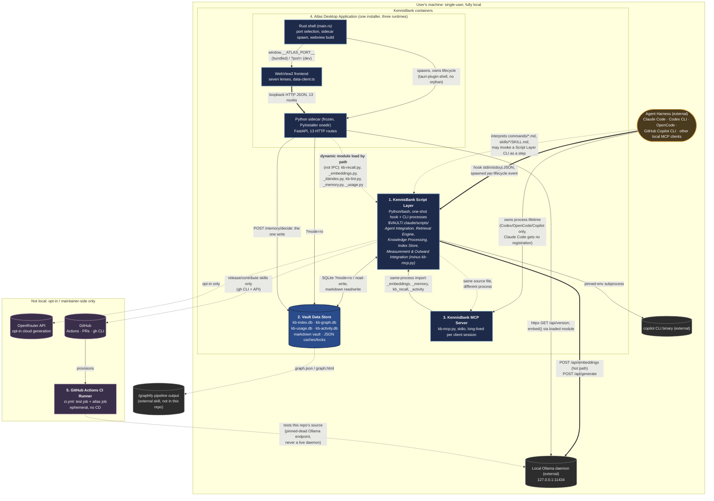

# C4 Container Level: LLmWiki-KennisBank Deployment

## Framing

KennisBank has no server deployment. There is no Docker, no Kubernetes, no
cloud infrastructure of any kind: CLAUDE.md's "Lokaal, altijd" ("local,
always") is a hard constraint, not an aspiration, and every container below
is either a process that runs on the end user's own machine or a passive
local store on that machine's disk. "Containers" in this document are the
actual physical deployment units derivable from `setup.sh`, the Atlas build
scaffold, and `.github/workflows/ci.yml`: not a generic cloud-native
vocabulary applied where it doesn't fit.

This document was synthesized from all seven C4 Component-level documents in
this directory (`c4-component.md` and the six `c4-component-*.md` files) and
verified directly against `setup.sh`, `atlas/src-tauri/tauri.conf.json`,
`atlas/src-tauri/src/main.rs`, `atlas/sidecar/atlas-sidecar.spec`,
`atlas/sidecar/app.py`, `atlas/sidecar/sources.py`,
`atlas/sidecar/requirements.txt`, `atlas/launch.py`, `atlas/BUILD.md`,
`.github/workflows/ci.yml`, `requirements.txt`, and `scripts/kb-mcp.py`.

## 1. Containers at a glance

### 1.1 The five real containers

| # | Container | Runtime / technology | Lifecycle: who starts it, when it exits | Responsibility | Components it holds (of the 7) |
|---|---|---|---|---|---|
| 1 | [KennisBank Script Layer](#2-container-kennisbank-script-layer) | Python 3.10+ (stdlib-first, `sqlite-vec`, `liteparse`, `dateparser`), plus `doctor.sh` (bash) | Started per-invocation: the Agent Harness spawns hooks at lifecycle events, a human or slash-command runs CLIs. Each process exits when its work is done. One exception: `index-launch.py`'s detached worker, started by the SessionStart hook, outlives it and exits on its own once its 6-job sequence completes or its lock goes stale (`STALE_SEC = 3600`) | One-shot hook, CLI, and library processes: retrieval, ingest, memory capture, indexing, quality/graph, eval, per-harness adapters | Agent Integration, Retrieval Engine, Knowledge Processing, Index Store, Measurement & Outward Integration (all but `kb-mcp.py`) |
| 2 | [Vault Data Store](#3-container-vault-data-store) | Markdown + YAML frontmatter; SQLite (WAL, `sqlite-vec`, FTS5); flat JSON | No process, so nothing "starts" or "exits": the skeleton is `mkdir -p`'d by `setup.sh` at install time, the four SQLite files come into existence lazily on first write, and every file persists on disk until deleted regardless of whether any KennisBank process is running | The durable local state: 4 SQLite DBs, the markdown vault, JSON caches/locks | None directly (written by 3, read by all 7; see §3) |
| 3 | [KennisBank MCP Server](#4-container-kennisbank-mcp-server) | Python 3, stdlib + optional `mcp` SDK, stdio only | Started and entirely owned by an external MCP client (Codex CLI, OpenCode, Copilot CLI, or any other local MCP client that registers it); exits when that client disconnects or kills it. Claude Code registers no MCP server from KennisBank at all, so on a Claude-only install this container is deployed to disk but never runs | Universal outward tool surface for any local MCP client | The `kb-mcp.py` slice of Measurement & Outward Integration only |
| 4 | [Atlas Desktop Application](#5-container-atlas-desktop-application) | Rust (Tauri v2) + TypeScript/Vite frontend + Python 3.12/FastAPI sidecar (frozen, PyInstaller onedir) + WebView2 | Started by the user launching the installed app; the Rust shell spawns the sidecar as its child. Whole app exits when the user closes the window; `tauri-plugin-shell` kills the sidecar with it (no orphan) | Standalone visual cockpit over the same vault, no hot-path role | Atlas App (all 4 code elements: Rust shell, frontend, sidecar) |
| 5 | [GitHub Actions CI Runner](#6-container-github-actions-ci-runner) | GitHub Actions workflow YAML + bash; Python 3.12; Node.js 22 (`atlas` job only) | Started by GitHub on every `push`/`pull_request`; a fresh `ubuntu-latest` VM per job, discarded when the job finishes. No KennisBank code manages this lifecycle | Ephemeral test gate on every push/PR; no CD | Distribution & Quality Gate's pytest suite (the only place that component actually runs) |

### 1.2 External systems referenced (not KennisBank containers)

| Container | Real deployment unit? | One-line role |
|---|---|---|
| Agent Harness (Claude Code / Codex CLI / OpenCode / GitHub Copilot CLI / other MCP clients) | External system | Spawns hook processes; owns the MCP server's lifetime; interprets slash-commands and skills |
| Local Ollama daemon | External system | `localhost:11434`: embeddings (default) and local generation |
| OpenRouter API | External system, opt-in only | Cloud LLM fallback, only when explicitly configured |
| `copilot` CLI binary | External system | Launched as a pinned-env subprocess by the Script Layer |
| GitHub (Actions, PRs, `gh` CLI, Copilot review) | External system | Release/contribute skills, CI hosting |

Sections 2-6 use the requested template (Name / Description / Type /
Technology / Deployment / Purpose / Components / Interfaces / Dependencies /
Infrastructure) for each of the five real containers. Section 7 covers the
external systems briefly. Section 8 makes three boundary calls falsifiable:
why Distribution & Quality Gate and slash-commands/skills are not
containers at all (§8.1, §8.2), and why the detached maintenance worker and
the vault filesystem each stay merged into a larger container rather than
becoming containers of their own (§8.3). Section 9 is the container
diagram.

---

## 2. Container: KennisBank Script Layer

| Field | Value |
|---|---|
| **Name** | KennisBank Script Layer |
| **Description** | The ensemble of Python (and one bash) files that implement everything KennisBank *does* off a persistent process: hook coordinators the agent harness spawns at lifecycle events, CLIs a human or a slash-command shells out to, detached maintenance workers, and in-process library modules other scripts in the same directory import. |
| **Type** | Not a service: a directory of independently-invokable short-lived processes plus one detached background worker, all sharing one deployment location and one interpreter convention. |
| **Technology** | Python 3.10+ (stdlib-first; `sqlite-vec` for `vec0`, `liteparse`+Tesseract for document OCR, `dateparser` for temporal fallback, `mcp` SDK only where a non-Claude harness needs it), plus one bash script (`doctor.sh`, needs bash arrays). |
| **Deployment** | `setup.sh`'s `copy_force` loop: every `scripts/*.py`, `scripts/*.sh`, and `scripts/*.json` in the repo is unconditionally overwritten into `$VAULT/.claude/scripts/` and `chmod +x`'d (`setup.sh:186-189`). This is **tooling, not user data**, so it is always refreshed, never merged. Re-run by the `kennisbank-upgrade` skill, which delegates back to `setup.sh` rather than reimplementing the copy. Runs on the **ambient system Python** already on the machine (`py -3` on Windows-like platforms, `python3` elsewhere, per `setup.sh`'s `uname -s` switch, mirrored in the per-harness adapter rule C2-C3), not a bundled/frozen interpreter. Four pip packages are installed into that same ambient interpreter: `sqlite-vec==0.1.9`, `liteparse>=2.0,<3`, `dateparser>=1.2,<2` unconditionally, and `mcp==1.28.1` **only when `--agents` includes `codex`, `opencode`, or `copilot`** (`setup.sh:287-292`). A Claude-only install never installs the `mcp` package. |

### Purpose

This is the physical location of five of the seven components documented at
Component level: **Agent Integration**, **Retrieval Engine**, **Knowledge
Processing**, **Index Store**, and all of **Measurement & Outward
Integration** except `kb-mcp.py` itself (which is container 3, below, for
process-lifecycle reasons explained there). None of these components are
separately deployed: they are files in the same directory, invoked by the
same harness, sharing the same fail-open convention (bare `except` → exit
`0`, the two CLI-only installers `register-hooks.py`/`install-agent-envs.py`
being the deliberate exceptions that must signal real failure). Splitting
them into five containers would misrepresent the system: there is no process
boundary, no independent lifecycle, and no separate deployment step between
them.

### Components it holds

| Component | Documentation | What it contributes to this container |
|---|---|---|
| Agent Integration | [c4-component-agent-integration.md](./c4-component-agent-integration.md) | Hook coordinators (`kb-session-start.py`, `kb-session-end.py`, `kb-session-end-recover.py`), orientation/context-budget CLIs, per-harness adapters/installers (`register-hooks.py`, `install-agent-envs.py`, `_copilot.py`, `agent-status.py`), Copilot runtime adapters |
| Retrieval Engine | [c4-component-retrieval-engine.md](./c4-component-retrieval-engine.md) | `kb-retrieve.py`/`kb-presearch.py` hooks, `kb-recall.py`, `_rank.py`, `_embeddings.py`, `kb-search.py`, `kb-ask.py`, write-time CLIs |
| Knowledge Processing | [c4-component-knowledge-processing.md](./c4-component-knowledge-processing.md) | Ingest importers, `memory-sweep.py` + judge/extract, `kb-lint.py`, `safe-edit.py`, graph-enrichment scripts, `_usage.py`, `kb-checkpoint.py`, `doctor.sh` |
| Index Store | [c4-component-index-store.md](./c4-component-index-store.md) | `index-launch.py` (detached worker), `build-*-index.py`, `_activity.py`, `_maintenance.py`, `_kbindex.py`, `_vaultpath.py`, `_settings.py`, `_frontmatter.py` |
| Measurement & Outward Integration | [c4-component-measurement-and-integration.md](./c4-component-measurement-and-integration.md) | Everything **except** `kb-mcp.py`: `kb-eval.py`, `kb-eval-gen.py`, `kb-calibrate.py`, `kb-activity-eval.py`, `kb-activity.py`, `kb-okf-export.py`, `_llm.py`, `_reconcile.py`, `git-upstream-check.py`, `git-fetch-refresh.py`, `kennisbank-copilot.py`, `kb-copilot-capture.py`, `_copilot.py` |

A note on the open component-ownership question the Component-level index
itself flags: `c4-component.md`'s "Notes on component boundaries" leaves
four modules (`_common.py`, `_migrations.py`, `_transcript.py`,
`_liteparse.py`) unclaimed by name as owned code in any of the seven
component documents, attributing that gap to an unpublished "Core Shared
Foundation" component that never shipped as its own document. At Container
level this open question has **zero consequence**: all four modules are
`scripts/*.py` files, so all four deploy into this container via the same
`copy_force` loop regardless of which of the five components housed here
eventually claims them. The container boundary does not require the
component boundary to be settled; only Component-level documentation would
need the reconciliation the index describes as still open.

A note on what is **not** in this container despite belonging to Agent
Integration: slash-command Markdown (`commands/*.md`) and skill manifests
(`skills/*/SKILL.md`) are not scripts and are not deployed here: see §8.2.
The per-harness configuration files these adapters *write*
(`~/.claude/settings.json`, `~/.codex/{hooks.json,config.toml}`,
`~/.config/opencode/opencode.json`, `~/.copilot/{mcp-config.json,hooks/kennisbank.json}`)
are artifacts consumed by the external Agent Harness, not containers of
their own: they are listed under Interfaces below as a write surface.

### Interfaces

| Surface | Protocol | Representative operations |
|---|---|---|
| Client lifecycle hooks | stdin/stdout JSON, spawned per event | `kb-session-start.py` (SessionStart, 240s), `kb-session-end.py` (SessionEnd/Stop, 90s), `kb-retrieve.py` (UserPromptSubmit, 30s ceiling, 2.0s internal embed budget), `kb-presearch.py` (PreToolUse WebSearch\|WebFetch, 30s), `kb-checkpoint.py` (PreCompact, 15s) |
| CLI (human- or command-invoked) | argv + stdout, one-shot | `kb-search.py`, `kb-ask.py`, `find-similar.py`, `import-*.py`, `kb-lint.py`, `safe-edit.py`, `kb-eval.py`, `kb-activity.py`, `kennisbank-copilot.py`, dozens more: full contracts in the five component docs above |
| In-process Python library imports | function call, same interpreter | `_embeddings.embed()`, `_kbindex.search()`, `_memory.decide()`, `_activity.what_did_i_do()`: the primary way these five components actually talk to each other |
| Detached background worker | process spawn + `O_EXCL` lock file | `index-launch.py` (see Infrastructure, below) |
| Generated per-harness config (write-only from here) | file writes, idempotent/non-destructive | `~/.claude/settings.json` (hooks only, Claude gets no MCP registration from this layer), `~/.codex/{hooks.json,config.toml}`, `~/.config/opencode/{plugins/kennisbank.js,opencode.json}`, `~/.copilot/{mcp-config.json,hooks/kennisbank.json,copilot-instructions.md}` |

### Dependencies

- **Vault Data Store** (container 2): nearly every script in this
  container reads and/or writes it; this is the primary data dependency.
- **KennisBank MCP Server** (container 3): same source file
  (`kb-mcp.py`), different process; the adapters here (`install-agent-envs.py`,
  `_copilot.py`) *register* it into non-Claude harness configs but do not
  run it.
- **Local Ollama daemon** (external, `http://localhost:11434`):
  `POST /api/embeddings` (default provider `ollama`, model `qwen3-embedding:8b`
  per ADR-0001) on the retrieval hot path; `POST /api/generate` for judge/
  extraction/paraphrase generation via `_llm.py`. Note two different model
  tags appear at different install touchpoints and neither is "the"
  system-wide default: `setup.sh`'s interactive prompt suggests
  `gemma4:latest` for the memory judge/extraction backend, while
  `_copilot.py:44` pins `KB_LLM_MODEL=gemma4:12b` specifically for the
  Copilot integration's env. Generation is configured per-install via
  `kennisbank-llm.json` / `KB_LLM_*` env vars, not a single hardcoded value.
- **OpenRouter API** (external, opt-in only): `_llm.py`'s cloud fallback
  and `install-agent-envs.py --configure-llm --llm-provider openrouter`;
  never reached unless the user explicitly chose it.
- **`copilot` CLI binary** (external, local subprocess): launched by
  `kennisbank-copilot.py` with pinned env and passthrough argv/exit code;
  probed (`copilot --version`, `copilot mcp list`) by `_copilot.py`.
- **`git` CLI** (external, local): `safe-edit.py` (commit/rollback of wiki
  rewrites), `git-upstream-check.py`/`git-fetch-refresh.py` (freshness
  check, the one network `git fetch` decoupled into a background job).
- **GitHub** (external, `gh` CLI + API): only inside the
  `kennisbank-release`/`kennisbank-contribute` **skills**, which are
  interpreted by the Agent Harness, not run from this container (§8.2); the
  skills' procedure steps happen to invoke `gh`/`git` as ordinary shell
  commands issued by the LLM, not as a script in this directory.
- **Agent Harness** (external): the reason this container exists: every
  hook is spawned by it, every CLI is either human-typed or invoked from a
  slash-command it interprets.

### Infrastructure

- **Config file that defines it**: `scripts/_hooks_manifest.py` is the
  single source of truth for the `HOOKS` tuple (event, script, matcher) and
  per-script `TIMEOUTS`, consumed identically by `register-hooks.py`
  (Claude), `install-agent-envs.py` (Codex/OpenCode), and `_copilot.py`
  (Copilot): one manifest, three generated config formats.
- **Lifecycle / process management**: no daemon and no supervisor: every
  hook/CLI is a subprocess that starts, does its work, and exits; nothing
  needs restarting because nothing stays up. The **one exception** is
  `index-launch.py`'s detached worker: the launcher acquires
  `<vault>/.claude/.kb-index-worker.lock` (`O_EXCL`, PID written inside,
  `STALE_SEC = 3600`), spawns itself detached with `--worker`, and returns
  within SessionStart's 15s budget while the worker keeps running
  independently: deliberately outliving the hook that spawned it. The
  worker runs six jobs in a fixed sequence (`memory-sweep.py` →
  embed-cache refresh → hybrid index → activity index → graph index → git
  fetch) and releases the lock in a `finally`, so a single failing job never
  blocks the rest. This is the only thing in the entire KennisBank
  deployment with a lifetime independent of its spawning process: there is
  no Windows Job Object or process-group cleanup for it (that pattern exists
  only in Atlas's dev launcher, §5); staleness is guarded purely by the lock
  file's `STALE_SEC` and PID.
- **Resource profile**: transient by design: CPU/memory exist only for the
  seconds a given hook or CLI runs. Measured budgets: 2.0s internal embed
  timeout on the hot path (30s hook ceiling), 15s SessionStart maintenance
  budget, 240s SessionStart hard ceiling, 90s SessionEnd ceiling, 3600s
  worker-lock staleness threshold. No idle memory footprint between
  invocations.
- **Scaling reality**: none needed, and none attempted. Single user, single
  vault, sequential invocation: "scaling" in this system means keeping the
  interactive hot path under its sub-second budget (CLAUDE.md's north
  star), not concurrent throughput. Concurrent access to the vault would
  only arise from running two agent sessions at once against the same
  vault, which the SQLite WAL mode and the worker lock file both tolerate
  passively rather than coordinate actively.

---

## 3. Container: Vault Data Store

| Field | Value |
|---|---|
| **Name** | Vault Data Store |
| **Description** | The durable local state of the whole system: the markdown vault tree itself (the only genuinely non-rebuildable source of truth), four SQLite databases, and a handful of JSON/lock/heartbeat files under `$VAULT/.claude/`. |
| **Type** | Passive storage: no process, no server; opened per-call by whichever script in the Script Layer or Atlas containers needs it. |
| **Technology** | Markdown + YAML frontmatter (the vault); SQLite with WAL journal mode, the `sqlite-vec` extension for `vec0` (kb-index.db only), and FTS5 (kb-index.db only); flat JSON for caches/locks/settings. |
| **Deployment** | Skeleton materialized by `setup.sh`'s `mkdir -p` of the numbered-directory contract, all **ten** numbered folders, not five (`00-inbox`, `01-raw/{sessies,transcripts}`, `02-wiki`, `03-projecten`, `04-templates`, `05-bronnen`, `06-claude`, `07-media`, `08-archive`, `09-memory/archive`, plus the non-numbered `.claude/scripts` and `graphify-out`; `setup.sh:176-178`), idempotently repaired on upgrade by `scripts/_migrations.py` (which re-creates `09-memory`, `09-memory/archive`, and `01-raw/transcripts` specifically). Templates (`tpl-sessie-log.md`, `tpl-wiki-artikel.md`) are copied with `copy_file`, **not** `copy_force`: this is user data, never silently overwritten. The four SQLite files are not created by `setup.sh` directly; they come into existence lazily the first time the Script Layer's builders run (`build-kb-index.py`, `build-graph-index.py`, `build-activity-index.py`; `kb-usage.db` on first `_usage.py` write). |

### Purpose

Everything the rest of the system reads or writes ultimately lands here.
The design principle stated at Component level, "`rm` + rebuild is always a
valid repair" (Index Store component), applies to **three of the four**
SQLite databases, not all four: `kb-index.db`, `kb-graph.db`, and
`kb-activity.db` are disposable caches derivable from the markdown vault (or,
for `kb-graph.db`, from `graphify-out/graph.json`). The fourth, `kb-usage.db`,
is not a cache at all: it is retained behavioural history with no markdown
ancestor and no rebuild path (see the rebuildability note under the Store
table, below). Every reader still treats a missing or stale store as a
degraded result rather than a hard failure, and that fail-soft convention
does hold for all four.

### Components it holds

Not "components" in the traditional sense: this container is written by
three components and read by all seven. Ownership by store:

| Store | Owner (writer) | Consumers |
|---|---|---|
| `kb-index.db` (vec0 + FTS5) | Index Store: `build-kb-index.py` | Retrieval Engine (hot path, read-only), Knowledge Processing (`kb-lint.py` drift check, read-only), Atlas |
| `kb-graph.db` | Index Store: `build-graph-index.py` | Retrieval Engine (graph-neighbour boost, read-only). **Not read by Atlas**: see the cross-doc correction below. |
| `kb-usage.db` | Knowledge Processing: `_usage.py` (the sole writer) | Retrieval Engine (`stats_for`, read + one write: `log_injected`), Index Store's `_activity.py` (read-only), Atlas |
| `kb-activity.db` | Index Store: `_activity.py`/`build-activity-index.py` | Measurement & Outward Integration (`kb-activity.py`, `kb-mcp.py` temporal tools), Atlas |
| Markdown vault (`00-inbox/`, `01-raw/{sessies,transcripts}/`, `02-wiki/`, `03-projecten/`, `04-templates/`, `05-bronnen/`, `07-media/`, `08-archive/`, `09-memory/archive/`) | Knowledge Processing (ingest, memory capture, quality/graph writers), the human editor | Every component; the only source Atlas's `POST /memory/decide` writes to |
| `graphify-out/graph.json`, `.needs-rebuild` | External `/graphify` skill (outside this repo), extended in place by Knowledge Processing's `graph-*.py` scripts | Index Store (`build-graph-index.py`), Atlas |
| JSON caches/locks (`embeddings-cache.json`, `kennisbank-settings.json`, `.kb-index-worker.lock`, `.sweep.lock`, `memory-sweep-status.json`, `kb-checkpoint-state.json`, `memory-review-log.jsonl`): includes `06-claude/*.json` (eval/calibration sets, not vault knowledge) | Various Script Layer scripts | Various Script Layer scripts |

> **Correction: the markdown-vault row above lists nine of the ten
> numbered folders, deliberately, not five.** An earlier pass at this table
> named only six (`02-wiki`, `09-memory`, `01-raw`, `00-inbox`, `04-templates`,
> `05-bronnen`) and silently dropped `03-projecten`, `07-media`, and
> `08-archive`. All three are live folders with real consumers, not
> vestigial: `05-bronnen` is `_liteparse.py`'s parse-output target and half
> of `kb-lint.py`'s provenance contract; `08-archive` is checked by
> `kb-lint.py`, `doctor.sh`, and `tests/test_kb_lint.py`; `03-projecten` is
> inside the graphify corpus scope (`.graphifyignore`). The tenth numbered
> folder, `06-claude/`, is deliberately **excluded** from this row (not
> omitted by oversight): it holds JSON eval/calibration sets
> (`kb-eval-set.json`, `kb-calibrate-set.json`, …), not vault knowledge
> markdown, see [c4-code-vault-structure.md](./c4-code-vault-structure.md)
> §2.4. Two further notes for anyone rendering this list literally:
> `03-projecten` and `05-bronnen` are Dutch names, not
> "03-projects"/"05-sources" (do not anglicize them), and the full
> ten-folder-plus-non-numbered contract (`setup.sh:176-178`) is `00-inbox`,
> `01-raw/{sessies,transcripts}`, `02-wiki`, `03-projecten`, `04-templates`,
> `05-bronnen`, `06-claude`, `07-media`, `08-archive`, `09-memory/archive`,
> `.claude/scripts`, `graphify-out`, `CLAUDE.md`.

> **Cross-doc correction, resolved in favour of the grep-verified claim.**
> `c4-component-index-store.md` §5.2 lists the Atlas sidecar as a consumer
> of `kb-graph.db`'s `graph_neighbors()`. `c4-component-atlas-app.md` §6.2
> states, grep-verified against `atlas/sidecar/sources.py`, that Atlas
> touches exactly `kb-index.db`, `kb-usage.db`, and `kb-activity.db`
> (**not** `kb-graph.db`), and explicitly supersedes a contrary claim in one
> of its own upstream code docs. This document follows the grep-verified
> source.

> **Rebuildability, precisely: three of four, not four of four.**
> `kb-index.db`: one-command deterministic rebuild, `build-kb-index.py --rebuild`
> reconstructs it entirely from `02-wiki/` + `09-memory/` markdown.
> `kb-activity.db`: rebuildable via `build-activity-index.py --vault <v> --full`;
> the Index Store component doc documents it as safely deletable.
> `kb-graph.db`: rebuildable, but **two-step, not one-command**: the
> external `/graphify` skill must first regenerate `graphify-out/graph.json`,
> then `build-graph-index.py --force` loads that file into the database.
> Weaker determinism than the other two: a rebuild depends on an external
> tool having run recently, not just on this repo's own code.
> `kb-usage.db`: **no rebuild path.** Its counters (`injected`/`used`/`noise`,
> the per-session pending set, `neighbor_log`) derive from session activity
> plus one human-gated write path (`kb-noise.py`), not from vault markdown
> (Knowledge Processing component, §5.3). Delete it and the history does not
> come back: it is retained behavioural telemetry, not a cache. This is the
> more interesting architectural fact than "everything here is disposable"
> would suggest, and it is why `kb-usage.db`'s row above names a single sole
> writer while the other three databases are described as builder output.

### Interfaces

- **SQLite file I/O**: readers open with `file:<path>?mode=ro` (Atlas
  sidecar, most Script Layer read paths) or a plain read-write connection
  (the owning builder); WAL journal mode throughout. Full schemas are
  documented in [c4-component-index-store.md](./c4-component-index-store.md)
  §5.1–5.3.
- **Direct filesystem read/write**: markdown files read/written with
  standard frontmatter parsing (`_frontmatter.py`); the vault's numbered
  directories are the parsing surface every script agrees on
  (`vault-structure/README.md`, materialized but not itself executable).

### Dependencies

None outward: this is a leaf container. It depends on nothing; everything
else depends on it.

### Infrastructure

- **Config file that defines it**: `vault-structure/README.md` (the
  numbered-directory specification, part of the Distribution & Quality Gate
  component, §8.1) plus `kennisbank-settings.json` (background-automation
  toggles: `auto_archive`, `distill_notify`, `embed_index`, `daily_graphify`,
  `activity_llm_fallback`: read/written by `_settings.py`).
- **Lifecycle / process management**: none: no process owns this
  container; it exists for as long as the files exist on disk.
- **Resource profile**: scales with vault size, not with usage frequency.
  Measured examples from the component docs: ~4.2 MB `graphify-out/graph.json`,
  2.5k+ graph nodes, 10k+ activity events, 1185+ memory fragments, tens of
  MB `embeddings-cache.json`. No server-side memory footprint, since
  nothing keeps these files open between calls.
- **Scaling reality**: single-writer-in-practice (single user), WAL mode
  tolerates concurrent readers. No replication, no automated backup: the
  vault's durability rests on the user's own git history (required by
  `safe-edit.py` for rollback) and Obsidian's own sync/backup, not on
  anything KennisBank provides.

---

## 4. Container: KennisBank MCP Server

| Field | Value |
|---|---|
| **Name** | KennisBank MCP Server |
| **Description** | `kb-mcp.py`, a local stdio [Model Context Protocol](https://modelcontextprotocol.io) server exposing recall, capture, review-queue, and temporal-activity tools to any MCP-compatible client running on the same machine. |
| **Type** | Long-lived-per-session process, spawned and entirely owned by an external MCP client: the one part of KennisBank whose process lifetime is not "spawn, run, exit" like the rest of the Script Layer. |
| **Technology** | Python 3, stdlib plus the optional `mcp` SDK (`MCPServer`/`FastMCP`); no network library used: stdio only. |
| **Deployment** | Ships via the **exact same** `copy_force` loop as every other file in `scripts/` (`setup.sh:186-189`): the container boundary here is process lifecycle, not deployment path. Registered into non-Claude harness configs by `install-agent-envs.py`/`_copilot.py` (Script Layer container); the `mcp==1.28.1` pip package is installed by `setup.sh` only when `--agents` includes `codex`, `opencode`, or `copilot`. |

### Purpose

The single, ecosystem-independent surface for reaching the vault from any
local MCP client that isn't the harnesses KennisBank writes hooks for:
Claude Code, Codex, Copilot in VS Code, Cline, Windsurf, LM Studio, Claude
Desktop. Full tool contract: see
[apis/kb-mcp-tools.md](./apis/kb-mcp-tools.md).

### Components it holds

The `kb-mcp.py` code element of the Measurement & Outward Integration
component ([c4-component-measurement-and-integration.md](./c4-component-measurement-and-integration.md)
§4, §5.1): nothing else. The pure `*_tool()` functions it wraps
(`recall_tool`, `capture_tool`, `review_pending_tool`, `review_decide_tool`,
`what_did_i_do_tool`, `timeline_tool`, `weeklog_tool`, `topic_timeline_tool`)
call into Retrieval Engine (`_embeddings`, `kb_recall`), Knowledge
Processing (`_memory`), and Index Store (`_activity`): all in the Script
Layer container, reached by ordinary Python import since `kb-mcp.py` runs on
the same interpreter and filesystem as the rest of `$VAULT/.claude/scripts/`.

### Interfaces

MCP over stdio: 8 tools (`recall`, `capture`, `review_pending`,
`review_decide`, `what_did_i_do`, `timeline`, `weeklog`, `topic_timeline`)
plus the `kennisbank://instructions` resource. Full operations, parameters,
and degradation behaviour: [apis/kb-mcp-tools.md](./apis/kb-mcp-tools.md).

### Dependencies

- **Script Layer** (container 1): every tool delegates into modules that
  live there, via same-process Python import (`_embeddings`, `_memory`,
  `kb_recall`, `_activity`).
- **Vault Data Store** (container 2): transitively, through the modules
  above.
- **Local Ollama daemon** (external): transitively, through `_embeddings.embed()`
  inside `recall`.
- **Agent Harness / other MCP clients** (external, inbound): the sole
  reason this process exists; it never initiates contact, it only responds
  on stdio to whichever client spawned it.

### Infrastructure

- **Config file that defines it**: none of its own. It reads the same
  `kennisbank-embed.json`/`kennisbank-llm.json` as the Script Layer,
  indirectly, through the modules it imports. It is *registered* (not
  configured) via the client's own MCP config file: `~/.codex/config.toml`
  (`[mcp_servers.kennisbank]`), `~/.config/opencode/opencode.json`
  (`mcp.kennisbank`), `~/.copilot/mcp-config.json` (`mcpServers.kennisbank`),
  each written by `install-agent-envs.py`/`_copilot.py` in the Script
  Layer container.
- **Lifecycle / process management**: entirely delegated to the parent MCP
  client. Verifiable facts only: `build_server()` returns `None` without
  the `mcp` package installed, and `main()` then writes one stderr line and
  returns `0`; the top-level `__main__` guard swallows every exception and
  calls `sys.exit(0)`: this process never signals failure via exit code.
  **Not asserted here because there is no repo evidence for it**: exactly
  when a given MCP client spawns the process, or how/whether it retries a
  crashed one: that is client-side behaviour outside this codebase.
- **Resource profile**: one Python process per connected client, for the
  life of that client's session; negligible idle CPU; no persistent
  in-memory state (every recall/capture reopens the SQLite index per call).
- **Scaling reality**: N independently-registered MCP clients on the same
  machine mean N independent `kb-mcp.py` processes: there is no shared or
  pooled server. Trivial for a single-user local system. **Claude Code
  registers no MCP server from KennisBank at all** (Agent Integration
  component, §5.5 / §8): on a Claude-only install this container is
  deployed to disk but never actually running unless the user registers it
  in their own personal Claude Code MCP config.

---

## 5. Container: Atlas Desktop Application

| Field | Value |
|---|---|
| **Name** | Atlas Desktop Application (KennisBank Atlas) |
| **Description** | A local-only Tauri v2 desktop application giving the vault's editor a seven-lens visual cockpit: vault health, knowledge graph, embedded Graphify view, wordcloud, time slider, memory-review cockpit, retrieval waterfall: over the same SQLite stores and markdown the Script Layer produces. |
| **Type** | Single deployable unit (one Windows installer), three internal runtimes: a minimal Rust host process, a WebView2 frontend, and a spawned, frozen Python sidecar process. |
| **Technology** | Rust (Tauri v2, edition 2021) + `tauri-plugin-shell`; TypeScript/ES2020 via Vite 5 (Vitest for tests); Python 3.12 + FastAPI + uvicorn + httpx + `sqlite-vec`, frozen with PyInstaller **onedir**; WebView2 (Windows). |
| **Deployment** | Built **manually**, not by CI (see container 5), per `atlas/BUILD.md`: (1) `pyinstaller atlas-sidecar.spec` freezes the sidecar to `dist/atlas-sidecar/atlas-sidecar.exe` + `_internal/`; (2) both are copied into `atlas/src-tauri/binaries/` with the Rust target-triple suffix; (3) `npx @tauri-apps/cli@^2 build` builds the frontend (`beforeBuildCommand`) and produces MSI/NSIS installers under `target/release/bundle/`. Unlike the Script Layer, the **sidecar is fully self-contained**: end users need neither a system Python nor Node.js; only the frozen binary and the Rust/WebView2 shell. Unsigned by default (code signing out of scope, documented as a SmartScreen prompt on first run). |

### Purpose

Full purpose statement: [c4-component-atlas-app.md](./c4-component-atlas-app.md)
§2. In one line: markdown plus four SQLite indexes are not, by themselves,
browsable; Atlas turns them into seven interactive lenses without
re-implementing any vault logic.

### Components it holds

The entire `atlas-app` component
([c4-component-atlas-app.md](./c4-component-atlas-app.md)), i.e. all four of
its code-level elements:

| Runtime | Code element | Role |
|---|---|---|
| Rust shell | [c4-code-atlas-src-tauri-src.md](./c4-code-atlas-src-tauri-src.md) | `main.rs` (67 lines): picks a free loopback port, spawns the sidecar via `tauri-plugin-shell`, drains its stderr, builds the webview and injects `window.__ATLAS_PORT__` |
| WebView2 frontend | [c4-code-atlas-frontend-src.md](./c4-code-atlas-frontend-src.md), [c4-code-atlas-frontend-src-lenses.md](./c4-code-atlas-frontend-src-lenses.md) | Tab router, `data-client.ts` (sole network boundary, loopback-only guard), seven lens modules, inspect drawer, command palette |
| Python sidecar | [c4-code-atlas-sidecar.md](./c4-code-atlas-sidecar.md) | `app.py` (13 HTTP routes + CORS), `sources.py` (~40 functions: every SQLite read plus the one write) |

Not covered by a dedicated code-level document but part of this container:
`atlas/launch.py` (dev-mode launcher) and `atlas/doctor.py` (readiness CLI),
both read directly from source in the component doc's §4.

### Interfaces

- **Sidecar HTTP API**: 13 routes at `http://127.0.0.1:<ephemeral-port>`,
  internal to this container (only the bundled frontend calls it in
  production). Full OpenAPI 3.1 specification:
  [apis/atlas-sidecar-api.yaml](./apis/atlas-sidecar-api.yaml).
- **`window.__ATLAS_PORT__` handshake**: internal Rust→JS interface:
  `main.rs` injects the chosen port as a webview `initialization_script`
  before any frontend code runs (bundled mode); the dev launcher instead
  passes `?port=` on the URL. `data-client.ts:resolvePort()` reads the
  global first, then the query parameter.
- **Frontend asset origin differs by mode**: this is easy to get backwards
  and worth stating precisely. **Bundled**: the WebView2 loads the frontend
  from Tauri's own bundled `frontendDist` (`../frontend/dist`), origin
  `http://tauri.localhost` on Windows / `tauri://localhost` on macOS·Linux;
  the sidecar is a **data API only**, it never serves the frontend's own
  assets. **Dev**: Vite serves the frontend at `http://127.0.0.1:5173`
  (`devUrl` in `tauri.conf.json`) and the port arrives via `?port=`. Two
  distinct edges: see the diagram in §9.
- **Sidecar CLI**: `python -m atlas.sidecar [--host 127.0.0.1] [--port N] [--vault PATH]`;
  prints `ATLAS_PORT <port>` on stdout, a contract that is now **dead** in
  the bundled app (`main.rs`'s async drain consumes and discards every
  sidecar stdout/stderr line; the port is dictated to the sidecar via
  `--port`, never parsed back from it).
- **`atlas/doctor.py`**: CLI `atlas-doctor [--port N]`, human-readable
  readiness report (Python deps, Node, optional Rust toolchain, Ollama,
  vault stores, optionally a live `/health` probe), exit 0/1.

### Dependencies

- **Vault Data Store** (container 2): `kb-index.db`, `kb-usage.db`,
  `kb-activity.db` opened `?mode=ro`; the markdown vault read for every
  non-SQLite payload; `graphify-out/graph.json`/`graph.html` served
  verbatim; the **one write** in the whole container,
  `POST /memory/decide`, rewrites a single frontmatter `status:` line under
  `09-memory/`.
- **Script Layer** (container 1): **the single most architecturally
  significant relationship in this diagram, and it is not HTTP.**
  `sources._load_vault_module()` dynamically imports `kb-recall.py`,
  `_embeddings.py`, `_kbindex.py`, `kb-lint.py`, `_memory.py`, and `_usage.py`
  **by filesystem path** from `$VAULT/.claude/scripts/` at request time:
  this is how `/recall`, `/provenance`, `/memory-links`, and the
  shared-audit-log branch of `/memory/decide` achieve data-parity with the
  production CLI/hooks (ADR-0004) without reimplementing them. The frozen
  sidecar bundles FastAPI/uvicorn/httpx/`sqlite_vec` (see
  `atlas-sidecar.spec`'s `hiddenimports`) but explicitly **not** KennisBank's
  own scripts. Consequence: `setup.sh` must have already deployed the
  Script Layer for these four routes to run at full fidelity; without it,
  they degrade to `status: "degraded"` (`/recall`, `/memory-links`) or the
  local heuristic/inline fallback (`/provenance`, `/memory/decide`) rather
  than failing outright. This is a **dynamic module-load-by-path**
  dependency, distinct in kind from every HTTP edge in this document, and
  is drawn as its own edge style in §9.
- **Local Ollama daemon** (external): `GET /api/version` directly via
  `httpx` for `/health`'s liveness probe; `_embeddings.embed()` (loaded from
  the Script Layer, above) for `/recall`. The only outbound network call
  anywhere in this container; strictly loopback.
- **External `/graphify` pipeline output** (`graphify-out/graph.json`,
  `graph.html`, `.needs-rebuild`): produced entirely outside this repo by
  a separate Claude Code skill; four of seven lenses degrade to an empty
  state if it has never run.
- **Not a dependency**: GitHub, the agent harness, and any script-layer
  hook. Atlas is standalone: it shares code with the tools the agent
  harness invokes, but does not itself run inside, or communicate with,
  that harness.

### Infrastructure

- **Config file that defines it**: `atlas/src-tauri/tauri.conf.json`:
  `"windows": []` (the window is built programmatically in `main.rs`, not
  declared here); CSP `default-src 'self'; connect-src http://127.0.0.1:*;
  img-src 'self' http://127.0.0.1:* data:; style-src 'self' 'unsafe-inline';
  frame-src http://127.0.0.1:*` (the last clause is what permits the
  Graphify-lens iframe); `bundle.targets: ["msi", "nsis"]` (Windows only
  today, though the sidecar's CORS regex already anticipates macOS/Linux
  origins); `bundle.externalBin: ["binaries/atlas-sidecar"]` +
  `bundle.resources: {"binaries/_internal": "_internal"}`: this pairing is
  what makes the PyInstaller onedir freeze resolve at runtime inside the
  installed app. `atlas/sidecar/atlas-sidecar.spec` is the freeze recipe
  itself.
- **Lifecycle / process management**: in the **bundled** app, the sidecar
  child is spawned and owned by `tauri-plugin-shell`; per `main.rs`'s own
  comment and `BUILD.md`, "the sidecar child is owned by the shell and dies
  with the app (no orphan)": no separate OS-level guard is needed because
  Tauri's own process management covers it. In **dev mode**
  (`atlas/launch.py`, a parallel, non-Tauri entry point), a **Windows Job
  Object** (`JOB_OBJECT_LIMIT_KILL_ON_JOB_CLOSE`, flag `0x2000`) is bound
  explicitly so a hard-killed dev launcher still tears down its spawned
  sidecar+Vite children: this guard exists **only** in `atlas/launch.py`
  and does **not** ship in the installer; it fails open to `None` off
  Windows or if `SetInformationJobObject`/`AssignProcessToJobObject` fails.
  The sidecar's own readiness is polled, not pushed: an unbounded,
  backoff-polled `GET /health` wait on the frontend side (up to ~20s in the
  dev launcher) so a slow frozen-Python cold boot never permanently strands
  the UI on "Failed to fetch".
- **Resource profile**: Tauri shell "well under 10 MB" (reuses the OS
  WebView2, no bundled Chromium); frozen sidecar "tens of MB" (Python
  runtime + FastAPI + sqlite-vec). PyInstaller **onedir**, deliberately not
  **onefile**: onefile re-extracts ~76 MB to a fresh `%TEMP%\_MEI` directory
  on every launch, and antivirus then rescans every DLL, measured as
  multi-minute cold starts under load; onedir unpacks once at install time.
  `GET /memory-links` (and `/graph?include_memory=1`, which shares its
  cost) is ~47s cold on the real vault, mitigated by an in-process cache
  plus a background warm-up thread started at sidecar startup when a real
  `kb-index.db` exists.
- **Scaling reality**: single instance, single user, loopback-only:
  nothing to scale. The only latency concern is not blocking the WebView on
  the sidecar's own startup poll.

---

## 6. Container: GitHub Actions CI Runner

| Field | Value |
|---|---|
| **Name** | GitHub Actions CI Runner |
| **Description** | Ephemeral, GitHub-hosted compute that runs KennisBank's automated test gate on every push and pull request. Not part of the running product: no end user's machine ever runs this container; it exists to protect what ships to their machine. |
| **Type** | Ephemeral CI job runner, `ubuntu-latest`, provisioned per event and torn down after. |
| **Technology** | GitHub Actions workflow YAML + bash; Python 3.12 (`test` job) and Python 3.12 + Node.js 22 (`atlas` job). |
| **Deployment** | GitHub-managed: `.github/workflows/ci.yml` is the entire workflow surface in this repository (verified: no other files under `.github/workflows/`). Triggered on every `push` and `pull_request`, no branch/path filters. **There is no CD.** Release tagging is a separate manual/skill-driven process (`kennisbank-release` skill), and, critically for this container, the MSI/NSIS installer for the Atlas Desktop Application (container 4) is **not** produced here; the `atlas` job runs the sidecar's pytest suite plus `tsc --noEmit` and `vitest run` for the frontend, but has no Rust toolchain and does not invoke `tauri build`. |

### Purpose

The runtime footprint of the Distribution & Quality Gate component (see
§8.1): the only part of it that is actually "something that needs to be
running." Two independent jobs, no `needs:` dependency, run in parallel:

- **`test`** (30 min timeout): installs `requirements-dev.txt`,
  `py_compile`s every `scripts/*.py`, `bash -n`-checks `setup.sh` and
  `scripts/doctor.sh`, then `python3 -m coverage run -m pytest tests -q`
  followed by `coverage report --fail-under=75`. This gate is what proved
  green before every merge that produced the Script Layer, Vault Data
  Store, and MCP Server containers' current code.
- **`atlas`** (15 min timeout): installs `atlas/sidecar/requirements.txt` +
  `pytest`, runs `atlas/sidecar/tests`, then Node 22 + `npm ci` +
  `tsc --noEmit` + `vitest run` for the frontend: the gate for the Atlas
  Desktop Application container's sidecar and frontend code (not its Rust
  shell, which is untested in CI).

### Components it holds

The Distribution & Quality Gate component's pytest suite
([c4-component-distribution-and-quality-gate.md](./c4-component-distribution-and-quality-gate.md)):
101 test modules / 2 support modules, 1099 tests, plus `atlas/sidecar/tests`
(16 modules) and the frontend's Vitest suite.

### Interfaces

| Trigger | Job | Steps (abridged) |
|---|---|---|
| `push`, `pull_request` (no filter) | `test` | checkout → setup-python 3.12 → `pip install -r requirements-dev.txt` → `py_compile` → `bash -n` → `coverage run -m pytest tests -q` → `coverage report --fail-under=75` (also written to the job summary) |
| `push`, `pull_request` (no filter), runs in parallel with `test` | `atlas` | checkout → setup-python 3.12 → sidecar deps + pytest → `pytest atlas/sidecar/tests -q` → setup-node 22 → `npm ci` (frontend) → `tsc --noEmit` → `vitest run` |

### Dependencies

- **This repository's source**: the only input; no external service is
  called during the test run itself.
- **Ollama**: deliberately **not** reached: `tests/__init__.py` pins
  `KB_EMBED_ENDPOINT`/`KB_LLM_ENDPOINT` to `http://127.0.0.1:1` (a dead
  address) unless `KB_INTEGRATION=1`, so the suite can never silently hang
  on, or falsely depend on, a live daemon.
- **GitHub** (the platform hosting the runner itself): this job *is*
  GitHub infrastructure; there is no further external dependency to name.

### Infrastructure

- **Config file that defines it**: `.github/workflows/ci.yml` (96 lines,
  two jobs, no `needs:`).
- **Lifecycle / process management**: fully GitHub-managed: a fresh
  `ubuntu-latest` VM per job run, discarded afterward. No KennisBank code
  manages this lifecycle.
- **Resource profile**: `test` job hang-net 30 minutes (measured ~20 min on
  a Windows dev machine for a comparable `unittest` run; Linux CI runners
  are typically faster for this subprocess-heavy suite, per the workflow's
  own comment); `atlas` job hang-net 15 minutes.
- **Scaling reality**: irrelevant to the "single-user local system" framing
  that governs every other container in this document: this is the one
  container that is not local at all. It runs on the maintainer's GitHub
  account, not on any end user's machine, and gates merges rather than
  running as part of anyone's deployed KennisBank.

---

## 7. External systems (brief)

| System | Reached by | Protocol | Notes |
|---|---|---|---|
| **Local Ollama daemon** | Script Layer, MCP Server (transitively), Atlas | HTTP, `127.0.0.1:11434` | Default embedding provider (`qwen3-embedding:8b`, ADR-0001) and default local generation provider; never required to leave the machine. |
| **Agent Harness** (Claude Code, Codex CLI, OpenCode, GitHub Copilot CLI) | Script Layer (hook spawn), MCP Server (process ownership for non-Claude harnesses), commands/skills (LLM-interpreted, §8.2) | Hook stdin/stdout JSON; MCP stdio; harness-native config files | Not a KennisBank container: the process that hosts KennisBank's hook processes and, for three of four harnesses, the MCP server's parent. |
| **Other local MCP clients** (Cline, Windsurf, LM Studio, Claude Desktop, Copilot in VS Code) | MCP Server | MCP stdio | Any of these can register `kb-mcp.py`; none are written to automatically by KennisBank's installers except the four named agent harnesses above. |
| **OpenRouter API** | Script Layer (`_llm.py`, opt-in) | HTTPS | Cloud fallback for generation, only when explicitly configured via `--llm-provider openrouter` or `kennisbank-llm.json`. |
| **`copilot` CLI binary** | Script Layer (`kennisbank-copilot.py`) | Local subprocess | Launched with pinned env and passthrough argv/exit code; probed for version/login state. |
| **GitHub** (Actions, PRs, `gh` CLI, Copilot PR review) | CI Runner (hosting); Script Layer indirectly, via the `kennisbank-release`/`kennisbank-contribute` skills' shell commands | HTTPS API, `gh` CLI | No part of KennisBank's own script code calls the GitHub API directly outside those two skills' procedural steps. |
| **External `/graphify` pipeline** | Vault Data Store (writes `graphify-out/graph.json`/`graph.html`), read by Index Store, Knowledge Processing's graph scripts, and Atlas | Filesystem | A separate Claude Code skill, outside this repository; KennisBank only ever reads its output. |

---

## 8. Three deliberate boundary calls

### 8.1 Distribution & Quality Gate is not a container

The Component-level document for this group is explicit that it is "**not
a running service**... it acts at *install-time* (`setup.sh`,
`_migrations.py`), *write-time* (templates), and *CI-time* (`ci.yml`,
`pytest tests`)." At Container level that self-description is taken at face
value: there is no runtime box for it. Its parts are distributed across
this document instead:

- `setup.sh` is the **deployment mechanism** named in the "Deployment"
  field of containers 1, 2, and 4 (indirectly, via the same numbered-directory
  contract), not a container of its own.
- `vault-structure/README.md` and the two templates are the **config file
  that defines** container 2's shape (§3, Infrastructure).
- The pytest suite's actual execution is container 5, the CI Runner: the
  one place this component genuinely runs.
- ADRs, specs, and plans remain pure documentation with no runtime
  footprint anywhere in this system.

### 8.2 Slash-commands and skills are not a container

`commands/*.md` (20 files) and `skills/*/SKILL.md` (4 files) are, in the
Agent Integration component's own words, "declarative Markdown procedures...
interpreted by the LLM itself": not executable code. `setup.sh` copies them
into the harness's own directories (`~/.claude/commands/`,
`~/.claude/skills/<name>/`, and their Codex/OpenCode/Copilot re-exports),
but nothing KennisBank ships ever *runs* them as a process: the external
Agent Harness's own LLM reasoning loop reads a command/skill file and, as
one of its own steps, may choose to invoke a script from the Script Layer
container (container 1) or shell out to `git`/`gh` directly. That reasoning
loop happens **inside** the Agent Harness (external), not inside any
KennisBank-owned container. Treating commands/skills as a fifth KennisBank
container would misattribute where the actual computation happens.

### 8.3 The detached worker is not a sixth container, and the DBs are not split from the vault

Two boundary calls in this document are defensible rather than obvious, and
each deserves its own argument rather than a silent merge.

**The `index-launch.py` detached worker stays inside container 1, it does
not become a container of its own.** The case *for* splitting it out is
real and stated plainly in §2's Infrastructure: it is "the only thing in
the entire KennisBank deployment with a lifetime independent of its
spawning process." A worker that outlives the hook that launched it, holds
its own lock file, and keeps running after `kb-session-start.py` has
already returned looks, at first glance, like a process boundary worth
naming. It is not treated as one here because every other test for a
container boundary fails: it ships via the exact same `copy_force` loop as
every other script in `scripts/` (no separate install step); it has no
config file of its own beyond the shared `_hooks_manifest.py`; it is not
independently registered with, or reachable from, anything outside the
Script Layer; and its only externally visible artifact is a lock file
(`.kb-index-worker.lock`), not a port, socket, or API. It is a **process
mode** of container 1 (a detached child instead of a foreground one), not a
unit with its own deployment path, config surface, or external interface.
Compare this to container 3 (MCP Server), which shares container 1's exact
deployment mechanism too but *is* split out, because it has an independent
process owner (an external MCP client) and an external protocol surface
(stdio) that container 1's other processes do not have. The worker has
neither.

**The four SQLite databases and the markdown vault stay merged into one
container (Vault Data Store), they are not split into "database files" and
"vault filesystem" as two containers.** Both halves are passive local
files: no process, no server, no lifecycle of their own, opened per call by
whichever script in container 1 or container 4 needs them. Both are
materialized by the same `mkdir -p` / lazy-first-write contract in `setup.sh`
and its builders. Splitting them would draw a container boundary where
there is no process or deployment distinction behind it, only a difference
in file format (markdown versus SQLite), which is a **Technology** field
difference within one container, not a **Container** boundary by this
document's own definition (a container is a separately deployable/
executable runtime unit; neither markdown files nor SQLite files are
executable, and neither is deployed independently of the other).

---

## 9. Container Diagram

**How to read this diagram.**

- **Heavy arrows (`==>`)** mark the two genuinely load-bearing runtime
  paths: the harness spawning hook processes in the Script Layer, and that
  container's one embedding call per hot-path prompt; and the Atlas
  frontend's HTTP calls into its own sidecar.
- **Solid arrows (`-->`)** are direct, load-bearing relationships: process
  spawn, subprocess launch, same-process import, a genuine write.
- **Dashed arrows (`-.->`)** are read-only, indirect, opt-in, or
  verification-only relationships: including the one relationship that
  looks like it should be an HTTP edge but is not: Atlas's dynamic
  module-load-by-path into the Script Layer.
- **Node colour**: blue = the five real KennisBank containers (dark blue =
  passive storage); grey = external local systems reached directly; amber =
  the external Agent Harness; purple = things that are not local at all
  (opt-in cloud, or maintainer-side GitHub/CI).
- The **Atlas boundary** is drawn as one box with three internal runtimes,
  matching its own component-level self-description ("single deployable
  unit, three runtimes"): it ships as one Windows installer even though it
  is not one process.
