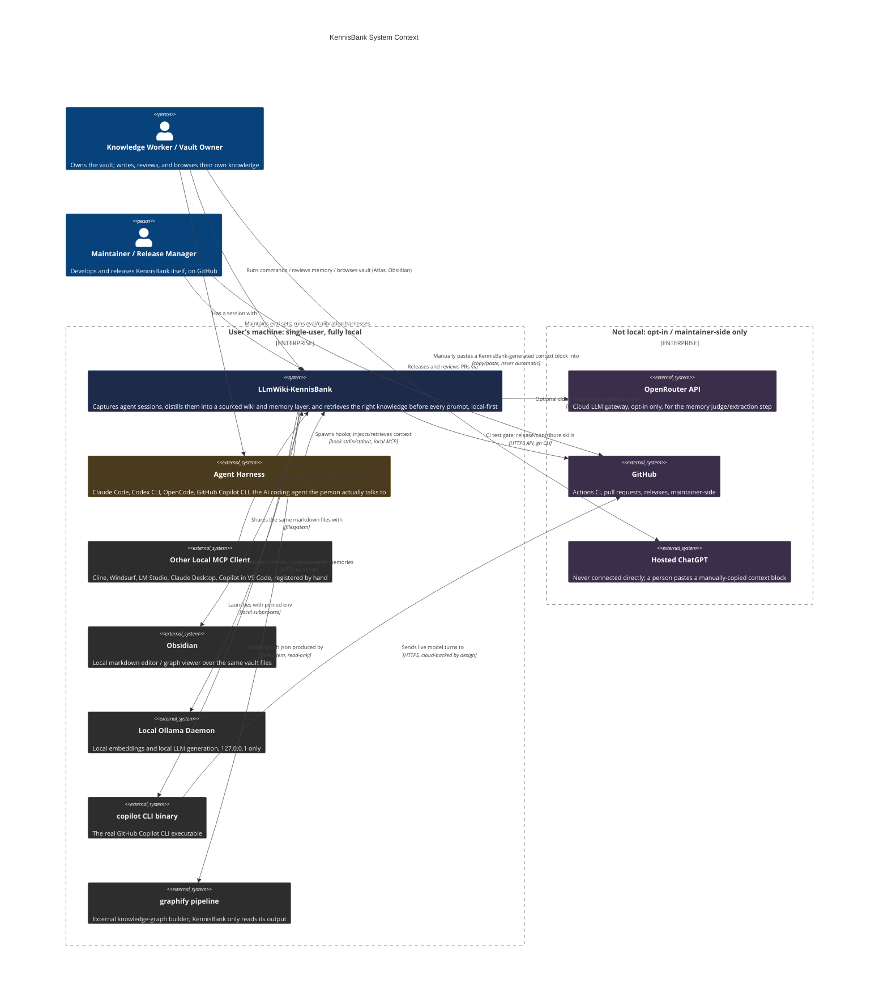

# C4 Context Level: System Context

## LLmWiki-KennisBank

This document is the highest-level view of KennisBank: what it is, who uses
it, and which outside systems it talks to. It intentionally avoids
implementation detail. For how the system is built, see the
[Container](./c4-container.md) and [Component](./c4-component.md) documents
linked at the bottom.

## 1. System Overview

### Short description

KennisBank is a local knowledge base that sits underneath your AI coding
agent: it quietly saves what happens in your sessions, turns the useful
parts into a searchable personal wiki and memory, and hands the right piece
of that knowledge back to the same agent the next time it matters, entirely
on your own machine.

### Long description

Every session with an AI coding agent produces things worth remembering:
decisions made, bugs fixed, preferences stated, dead ends avoided. Left
alone, that context evaporates the moment the session ends and the next
session starts from zero. KennisBank exists to close that loop for one
person's own machine, without handing the knowledge to a hosted vendor.

It does four things in sequence, continuously: **capture** what happened in
a session (raw logs, archived transcripts, an autonomous memory sweep);
**consolidate** that raw material into a sourced, interlinked markdown wiki
plus typed, time-stamped memories; **retrieve** the right slice of that
knowledge and hand it to the agent before its next answer; and **measure**
whether the retrieved knowledge actually got used, so the system improves
instead of just accumulating.

Everything about how KennisBank is built follows from one design goal.
`CLAUDE.md`'s "Noord-ster" (north star) states it in one line: *"KennisBank
moet voelen alsof het er niet is"* ("KennisBank must feel as if it is not
there", `CLAUDE.md`, line 13). The person's real work (writing, coding,
thinking) comes first, and KennisBank helps without demanding attention for
itself. In concrete terms that means:

- **The interactive path stays fast.** When a prompt is submitted, matching
  knowledge is looked up and injected before the agent answers; that lookup
  is designed and budgeted to stay out of the person's way (an internal
  embed step is time-boxed to a low single-digit number of seconds, and the
  surrounding hook has its own outer time limit, both configurable). Every
  expensive operation (extracting memories, building search indexes,
  checking for stale or contradicting knowledge) is deliberately pushed off
  that path: it runs at write time, when the vault is idle, or at the
  boundaries of a session, never while someone is waiting on an answer.
- **Nothing leaves the machine without an explicit, informed choice.**
  Knowledge lives in plain markdown files and local SQLite databases, in a
  folder the person owns. The default embedding model and the default
  memory-extraction model both run on a local Ollama installation. A cloud
  fallback exists for the extraction step (OpenRouter), but it is opt-in and
  configured explicitly, never silent and never the default (see §6, below,
  for exactly what that opt-in looks like in code).
- **The human stays editor-in-chief.** KennisBank proposes, flags, and
  quarantines; it never silently deletes a fact or overwrites what a person
  wrote. Unverified memories wait for a human decision. Superseded facts are
  closed and linked, not erased: their history stays intact.
- **The system automates what discipline would otherwise skip.** Capture,
  indexing, staleness detection, and memory hygiene all run on their own in
  the background. The person is asked only for the judgment calls only a
  human can make.
- **Help is proactive but restrained.** Surfacing something the person
  already knew from a past session is welcome, but only when the match is
  strong. An interruption below that bar is exactly the kind of clutter the
  system exists to avoid.

## 2. Personas

This is a single-user, local system: there is no organization behind it, no
team, no support desk. The "personas" below are roles one person (or, for
two of them, an AI agent acting on that person's behalf) moves between, not
job titles on an org chart.

### Knowledge Worker / Vault Owner

- **Type**: Human user
- **Description**: The developer or knowledge worker whose personal vault
  this is: the one person KennisBank is built around. Works across multiple
  projects using one or more AI coding agents on their own machine.
- **Goals**: Have a durable, private record of what they decided and why;
  get the right prior context surfaced automatically instead of
  re-explaining it; keep authority over what counts as true in their own
  knowledge base; browse and edit that knowledge in an ordinary markdown
  editor when they want to.
- **Key features used**: Knowledge retrieval (passively, every prompt),
  session logging and wiki compilation, memory review, stale-article
  review, temporal recall (`/watdeedik`, `/timeline`, `/weeklog`), the
  Atlas desktop cockpit, browsing the vault in Obsidian.

### Coding Agent (harness-hosted)

- **Type**: Programmatic user (external system, one of several
  interchangeable harnesses)
- **Description**: The AI agent process (Claude Code, and via purpose-built
  adapters also OpenAI Codex CLI, OpenCode, and the standalone GitHub
  Copilot CLI) that hosts a live session with the knowledge worker. It
  receives injected knowledge at the start of and during a session and,
  through hooks it spawns, hands session transcripts back to KennisBank for
  capture.
- **Goals**: Answer the person's current prompt as well as possible by
  drawing on prior context it has no memory of otherwise; avoid repeating a
  web search or a mistake the vault already has an answer for; leave a
  session in a state KennisBank can learn from.
- **Key features used**: Knowledge retrieval on every prompt, pre-search
  consultation before web search, session-start orientation (an opt-in
  toggle, off by default), session capture at exit, the local MCP server
  (for harnesses other than Claude Code: Claude Code receives hooks but is
  not registered against the MCP server by KennisBank's own installers).

### Maintainer / Release Manager

- **Type**: Human user
- **Description**: The person who develops KennisBank itself and ships new
  versions of the tooling upstream on GitHub, a different role from the
  knowledge worker, even when it is the same individual wearing a different
  hat.
- **Goals**: Ship a working, tested release; keep the automated test gate
  green before merging; make sure a released version actually reached the
  branch it was tagged from; fold local tooling improvements made in a
  deployed vault back into the shared project.
- **Key features used**: The GitHub Actions CI gate, the release and
  contribute skills, pull-request review handling on GitHub.

### Installing Agent

- **Type**: Programmatic user (an AI coding agent acting on the
  maintainer's or a new user's behalf, or a human running the same steps
  by hand)
- **Description**: Whoever (human or agent) runs `setup.sh` against a
  target vault to install or upgrade KennisBank. `AGENTS.md` exists
  specifically as an operational contract for an AI agent performing this
  role: resolving the correct vault path, choosing which agent
  integrations to install, and validating the result before declaring
  success.
- **Goals**: Deploy or upgrade KennisBank into a vault correctly, without
  destroying the person's existing content or customizations, and prove
  the install actually works before finishing.
- **Key features used**: `setup.sh`, the upgrade and contribute skills, the
  `doctor.sh` validator.

### Other Local MCP Client

- **Type**: Programmatic user (external system)
- **Description**: Any other MCP-compatible tool running on the same
  machine that a person chooses to point at KennisBank's local MCP server:
  for example Cline, Windsurf, LM Studio, Claude Desktop, or GitHub Copilot
  in VS Code's agent mode. KennisBank's own installers never register these
  automatically; the person registers them by hand using the documented
  connection snippet.
- **Goals**: Reach the same recall and capture capability as the
  first-class harnesses, from whichever tool the person is already using.
- **Key features used**: The local MCP server's tool surface (recall,
  capture, and, where the client supports MCP resources, the instructions
  resource).

## 3. System Features

### Knowledge Retrieval

- **Description**: On every prompt, in every project, KennisBank embeds
  the prompt and injects the best-matching wiki articles and memories as
  context, so the agent answers with the person's own prior knowledge
  already in view, without being asked. The one hot-path feature; every
  other feature below happens off that path.
- **Users**: Knowledge Worker (as beneficiary), Coding Agent (as the
  process that receives the injected context)
- **User journey**: [Knowledge Retrieval During a Prompt](#41-knowledge-retrieval-during-a-prompt)

### Session Capture and Wiki Distillation

- **Description**: Raw session activity (logs, archived transcripts, an
  autonomous memory sweep) is captured continuously and, on request,
  compiled into a sourced, interlinked wiki and a typed, time-aware memory
  layer.
- **Users**: Knowledge Worker, Coding Agent (as the source of the raw
  session material)
- **User journey**: [Session Capture and Distillation into Wiki Articles](#42-session-capture-and-distillation-into-wiki-articles)

### Searching and Asking the Knowledge Base

- **Description**: Direct, explicit ways to query the vault: a keyword and
  semantic search command, and a command that assembles a ready-to-use
  context block for pasting into a tool that cannot reach the vault
  itself.
- **Users**: Knowledge Worker
- **User journey**: [Searching and Asking the Knowledge Base](#43-searching-and-asking-the-knowledge-base)

### Graph and Health Browsing (Atlas)

- **Description**: A standalone desktop application that turns the same
  markdown and SQLite stores into seven visual lenses (vault health, the
  knowledge graph, a wordcloud, a time slider, a memory-review cockpit, and
  a retrieval waterfall inspector) for a person who wants to look at their
  knowledge base rather than query it from a terminal.
- **Users**: Knowledge Worker
- **User journey**: [Browsing the Graph in Atlas](#44-browsing-the-graph-in-atlas)

### Programmatic Agent Integration

- **Description**: The harness-facing boundary that lets any local
  MCP-capable agent (not only the four harnesses KennisBank writes hooks
  for) reach the vault's recall and capture capability through the local
  MCP server.
- **Users**: Coding Agent, Other Local MCP Client
- **User journey**: [Programmatic Integration for an Agent Harness](#45-programmatic-integration-for-an-agent-harness)

### Measurement and Trust

- **Description**: A recall@k / MRR evaluation harness and a threshold
  calibration harness make every change to retrieval, ranking, or the
  embedding model provably better or worse, instead of a matter of feel.
- **Users**: Maintainer, Knowledge Worker (for their own vault's eval sets)
- **User journey**: [Measuring and Trusting a Retrieval Change](#46-measuring-and-trusting-a-retrieval-change)

### Installation and Upgrade

- **Description**: One script installs KennisBank into a fresh or existing
  vault for one or more agent harnesses, and the same script (wrapped by a
  release-aware skill) upgrades an existing install without touching the
  person's own content. The rarest of the journeys below: it happens once
  per machine, then again only at upgrade time.
- **Users**: Installing Agent, Knowledge Worker (as the person who
  triggers it and reviews the result)
- **User journey**: [Installing and Upgrading a Deployment](#47-installing-and-upgrading-a-deployment)

## 4. User Journeys

Ordered by how often each one actually happens: retrieval fires on every
prompt; capture and search happen every session or most sessions; Atlas
browsing, the programmatic integration path, and measurement are used when
a person chooses to reach for them, occasionally; installation and upgrade
is the rarest of all, once per machine and then only at upgrade time.

### 4.1 Knowledge Retrieval During a Prompt

Persona: Knowledge Worker, mediated by the Coding Agent.

1. The person types a prompt into their agent (Claude Code, Codex,
   OpenCode, or Copilot CLI).
2. The harness fires a prompt-submission event before the agent starts
   composing an answer.
3. KennisBank's retrieval hook embeds the prompt locally via Ollama, within
   a short, hard-capped time budget.
4. The hook searches the local hybrid index (semantic vectors fused with
   keyword search) for wiki articles and memories above a relevance
   threshold, ranked by relevance, recency, and importance, with a bonus
   for knowledge that recently proved useful.
5. One extra, well-connected neighbouring article from the knowledge graph
   rides along with the top matches, turning isolated hits into a
   coherent neighbourhood of related knowledge.
6. The matching wiki snippets and memories are injected into the prompt's
   context before the agent answers.
7. If nothing clears the relevance bar, if Ollama is unreachable, or if
   anything else goes wrong, the hook injects nothing and the prompt
   proceeds exactly as if KennisBank were not installed: it never blocks
   or delays the agent beyond its budget.
8. Later, whichever injected knowledge the agent actually used in its
   answer is logged, quietly boosting that knowledge's ranking next time.

### 4.2 Session Capture and Distillation into Wiki Articles

Persona: Knowledge Worker, mediated by the Coding Agent.

1. During a session, the agent does real work; nothing is captured until
   the session ends or the person asks for it explicitly.
2. At session end, the harness fires an exit event; KennisBank's exit
   coordinator runs. If the person has turned on the transcript-archiving
   toggle (off by default; the person opts in via the settings command),
   the coordinator archives the transcript to the vault as its first
   phase, before any other exit work runs; otherwise the transcript is not
   kept automatically, and the person captures what mattered explicitly
   with the session-log command in the next step.
3. In the background, an autonomous memory sweep reads whatever
   transcripts have been archived, automatically or via the session-log
   command, extracts candidate memories, types them (fact, preference,
   procedure, decision), deduplicates them against what already exists,
   and has an independent judge decide whether each one is trustworthy
   enough to use immediately or should wait in quarantine for a human to
   confirm.
4. When the person runs the session-log command, the agent writes a
   structured session log (goal, summary, output, new knowledge, next
   steps) to the vault's raw session area.
5. When the person runs the wiki-compilation command (typically weekly),
   the agent reads the last several days of raw session logs, identifies
   reusable knowledge, and writes or updates wiki articles, each carrying
   an explicit source link back to the session it came from.
6. A provenance check runs before the write is accepted: an article with no
   traceable source is not allowed to become a permanent, uncheckable
   "fact."
7. The knowledge worker can later review anything left in quarantine and
   approve, reject, or skip each item: the system never promotes
   unverified knowledge to trusted status on its own. This human-review
   step is the same crash-safe decision path whether it is walked from the
   command line, the MCP `review_decide` tool, or Atlas's memory-review
   lens (§4.4, step 4).

### 4.3 Searching and Asking the Knowledge Base

Persona: Knowledge Worker.

1. The person wants to check what the vault already knows about a topic,
   independent of any live agent prompt.
2. They run the local search command with a query; it returns ranked wiki
   and memory hits directly on the terminal, using the same local index
   and ranking the retrieval hook uses.
3. Alternatively, they run the "ask" command, which retrieves locally and
   prints a ready-to-paste context block (a short instruction, the
   retrieved hits, then the question) for pasting into a tool that has no
   direct connection to the vault, such as hosted ChatGPT.
4. Nothing is sent anywhere automatically in either path; the person
   decides what, if anything, leaves the machine, and copies it themselves.

### 4.4 Browsing the Graph in Atlas

Persona: Knowledge Worker.

1. The person launches the Atlas desktop application, a separate,
   standalone installer from the rest of KennisBank.
2. Atlas opens the same markdown vault and the same local SQLite stores the
   rest of the system writes (read-only, except for one explicit action
   described below) and presents seven lenses: an overview with a health
   heatmap, the knowledge graph, an embedded view of the external graph
   pipeline's output, a wordcloud, a time slider over activity, a
   memory-review cockpit, and a retrieval-waterfall inspector that shows
   exactly why a given result did or did not surface.
3. The person browses freely: jumping between lenses, inspecting a
   document's provenance, watching activity over time, or replaying a past
   retrieval to understand its ranking.
4. In the memory-review lens, the person can approve or reject a pending,
   unverified memory: the one place Atlas writes back to the vault,
   sharing the same crash-safe decision path as the command-line and MCP
   review tools, so a failed write is never silently recorded as decided.
5. If the external knowledge-graph pipeline has never been run against the
   vault, the graph-dependent lenses degrade gracefully to an empty state
   rather than failing.

### 4.5 Programmatic Integration for an Agent Harness

Persona: Coding Agent or Other Local MCP Client, set up by the Installing
Agent or the Knowledge Worker.

1. The installing party runs setup for a non-Claude-Code harness (Codex,
   OpenCode, or Copilot CLI) or, for any other local MCP-capable tool, adds
   a manual connection entry using the documented command and vault path.
2. For the three managed harnesses, setup writes a hook configuration
   (one coordinated start hook, one coordinated exit hook, plus prompt and
   pre-search hooks) into that harness's own config location, and
   registers KennisBank's local MCP server for that harness specifically;
   Claude Code is the one exception: it receives the hooks but no MCP
   server registration from KennisBank's own installers.
3. From then on, the harness's own lifecycle drives KennisBank: it spawns
   the start hook when a session begins, the prompt hook on every prompt,
   the pre-search hook before it searches the web, and the exit hook when
   the session ends.
4. Independently, if the harness or any other local tool speaks MCP over
   stdio, it can call the local MCP server's tools directly (search and
   save knowledge, walk the human-review queue, and answer temporal
   questions such as "what did I do last week") without going through
   hooks at all.
5. The MCP server binds nothing to the network; it only ever answers a
   client that spawned it on the same machine. An agent that runs in the
   cloud, such as hosted ChatGPT, cannot reach it; KennisBank deliberately
   does not offer to tunnel it there, by design (see section 5, and the
   architecture-level version of this same fact in §6).
6. Whatever the harness captured (a Claude Code session, a Copilot CLI
   session, or anything else) becomes part of the one shared vault, so a
   later query in a different harness surfaces it just the same.

### 4.6 Measuring and Trusting a Retrieval Change

Persona: Maintainer, and any Knowledge Worker who maintains their own
evaluation questions.

1. Before changing a threshold, an embedding model, or the ranking logic,
   the person maintains a personal set of questions with known-correct
   answers (kept private to their own vault: it reflects real vault content
   and is never shipped or committed).
2. They run the recall evaluation harness, which measures recall@k and
   mean reciprocal rank for wiki knowledge and memory separately, mirroring
   exactly how the prompt hook injects each layer.
3. They run the threshold calibration harness, which embeds a set of
   labelled example pairs with the currently active model and proposes
   duplicate/related boundaries: it writes nothing itself; the person
   decides whether to adopt the proposal.
4. They make the change, run both harnesses again, and compare: a drop in
   the numbers is treated as a regression, not a matter of opinion.
5. For a change proposed to the shared project itself, the maintainer's
   pull request also runs through the automated CI gate (see GitHub in
   section 5) before it can be merged, and an automated code review is
   read and addressed before merging.

### 4.7 Installing and Upgrading a Deployment

Persona: Installing Agent (human or AI agent), on behalf of the Knowledge
Worker.

1. The installing party decides which agent harnesses to target (Claude
   Code, Codex, OpenCode, Copilot CLI, or a combination) and which vault
   path to use, defaulting to a standard location if none is given.
2. They run the single setup script with the chosen vault path and agent
   list. The script is idempotent: the same command is also how an
   existing install gets refreshed later.
3. The script creates or repairs the vault's directory structure, deploys
   the tooling, installs the chosen agent integrations (commands, skills,
   hooks, and, where applicable, the local MCP server registration),
   bootstraps the background-automation settings, and runs any pending
   migrations, all while explicitly preserving the person's own vault
   content, customizations, and unrelated agent configuration.
4. The script validates the local model backend (Ollama by default, or an
   explicitly configured cloud fallback), unless validation is explicitly
   skipped for an offline or CI run.
5. A built-in doctor check verifies the whole install (vault layout, hook
   registration, provenance coverage) and the script only reports success
   once every required check passes.
6. For an upgrade specifically, a dedicated skill wraps the same script: it
   checks the latest released version, shows the changelog delta, detects
   any local drift from a prior custom install, backs up what would be
   overwritten, deploys the new tooling, and stamps the installed version.
7. A companion skill runs the reverse direction: it isolates any local
   tooling improvements the person made in their own deployed vault,
   strips out anything personal, and opens a pull request to contribute
   those improvements back to the shared project.
8. On the maintainer's side, a release itself is a separate, manual or
   skill-driven step: merging to the main branch does not, by itself, put
   a new version on anyone's machine (§6).

## 5. External Systems and Dependencies

### Local Ollama Daemon

- **Type**: Local AI model server
- **Description**: Runs large language models on the person's own machine,
  reachable only at `127.0.0.1`.
- **Integration type**: Local HTTP API (embeddings and generation
  endpoints)
- **Purpose**: The default provider for both halves of KennisBank's local
  intelligence, turning text into vectors for retrieval, and judging or
  extracting candidate memories, so the "local, always" principle holds
  without any cloud dependency by default. Never required to leave the
  machine.
- **What crosses the boundary**: The prompt text (for embedding) and
  transcript/memory-candidate text (for judging): both stay on
  `127.0.0.1`, never reach the public internet.
- **What does not**: Nothing about this relationship is optional-by-cloud:
  if Ollama is down, retrieval and memory extraction degrade to "skip",
  not to a cloud fallback, unless OpenRouter was separately and explicitly
  configured.

### Obsidian (or any markdown editor)

- **Type**: Local desktop application (not shipped by this project)
- **Description**: A local-first markdown editor the knowledge worker can
  point at the vault directory to browse, edit, and graph their notes with
  an ordinary editing experience.
- **Integration type**: Shared filesystem: Obsidian reads and writes the
  same plain markdown files KennisBank's scripts produce; there is no API
  between them.
- **Purpose**: Because the vault is nothing more than markdown and
  frontmatter, opening it in Obsidian (or a compatible tool such as
  Logseq) "just works": the person is never locked into a proprietary
  viewer to see their own knowledge.
- **What crosses the boundary**: Files on disk, both directions: a human
  edit made in Obsidian is exactly as visible to KennisBank's scripts as
  one made by `/wiki`, and vice versa.
- **What does not**: No network call, no plugin API, no KennisBank code
  runs inside Obsidian. This is not an Obsidian plugin: it is two
  independent programs agreeing on a folder.

### Agent Harnesses (Claude Code, Codex CLI, OpenCode, GitHub Copilot CLI)

- **Type**: External AI coding agent applications
- **Description**: The programs the knowledge worker actually converses
  with; KennisBank is a layer installed underneath them, not a
  replacement for any of them.
- **Integration type**: Lifecycle hooks (spawned as short-lived processes
  at session start, on each prompt, before a web search, and at session
  end) plus, for three of the four, registration of KennisBank's local
  stdio MCP server.
- **Purpose**: These are the surfaces KennisBank exists to serve: without a
  hosting harness, there is no session to capture and no prompt to enrich.
  GitHub Copilot CLI is the one harness whose own model traffic is
  inherently cloud-backed (it requires a GitHub Copilot subscription and
  talks to GitHub for the actual model turn); KennisBank's own retrieval,
  storage, and MCP server around it stay entirely local regardless, and
  using it is an explicit, separate opt-in.
- **What crosses the boundary**: The harness spawns KennisBank's hook
  processes and reads their stdout (injected context, status lines); for
  three of the four harnesses it also spawns the MCP server and exchanges
  MCP stdio messages with it.
- **What does not**: KennisBank never calls out to the harness's own model
  API, and never sees the harness's own conversation state beyond what the
  harness's own hooks and transcript files expose to it.

### Other Local MCP Clients (Cline, Windsurf, LM Studio, Claude Desktop, Copilot in VS Code agent mode)

- **Type**: External local AI tools
- **Description**: Any other MCP-compatible client running on the same
  machine.
- **Integration type**: Local stdio MCP, registered manually by the person
  rather than by KennisBank's own installers.
- **Purpose**: Extends recall and capture to whatever local tool the
  person is already using, without KennisBank needing to know about it in
  advance: MCP is the one protocol nearly every modern local agent already
  speaks.
- **What crosses the boundary**: MCP tool calls and their JSON results,
  over stdio, between two processes on the same machine.
- **What does not**: Nothing over a socket or a port: there is no network
  interface a remote MCP client could ever reach.

### OpenRouter API

- **Type**: Cloud LLM gateway
- **Description**: A hosted, OpenAI-compatible API offering many
  third-party language models.
- **Integration type**: HTTPS, opt-in only
- **Purpose**: An explicit cloud fallback for the memory judge/extraction
  step, for a person who wants a stronger model than they can run locally.
  Never configured by default, and choosing it during setup triggers a
  printed warning before configuration proceeds (`setup.sh:225`; see §6).
- **What crosses the boundary**: Whatever text the memory judge/extraction
  step sends for that call (session or memory-candidate content), plus the
  API key, read from an environment variable or a user-local secrets file,
  never from the repo or vault.
- **What does not**: Embeddings. The embedding provider is configured
  independently and stays local (Ollama) unless separately reconfigured;
  OpenRouter is scoped to the judge/extraction step only.

### `copilot` CLI Binary

- **Type**: External local subprocess (part of the GitHub Copilot CLI
  install, not shipped by this project)
- **Description**: The actual `copilot` executable that KennisBank's
  Copilot wrapper launches.
- **Integration type**: Local subprocess, pinned environment, passthrough
  of arguments and exit code
- **Purpose**: Lets a single wrapper pin the vault path and local-model
  environment for a Copilot session while handing off to the real binary
  for everything else, including the point where Copilot's own cloud
  model turn happens.
- **What crosses the boundary**: Nothing from KennisBank directly; the
  wrapper only sets environment variables and execs the real binary, which
  then talks to GitHub's cloud on its own account, outside KennisBank's
  code.
- **What does not**: KennisBank's own vault content is not sent to
  `copilot` as part of this handoff: the binary receives an environment,
  not a payload of vault knowledge.

### GitHub (Actions, Pull Requests, `gh` CLI, Copilot PR Review)

- **Type**: Cloud source-hosting and CI platform
- **Description**: Where the project's own source code lives and where its
  automated test gate runs.
- **Integration type**: HTTPS API and the `gh` CLI, used only by the
  maintainer's release and contribute workflows and by the CI runner
  GitHub itself hosts.
- **Purpose**: Ships and verifies KennisBank itself: this is a
  maintainer-side dependency of the project's own development process, not
  something a deployed vault talks to during normal use. No part of a
  deployed vault's own script code calls the GitHub API directly outside
  those two maintainer workflows.
- **What crosses the boundary**: Source code, commits, and pull-request
  metadata; never vault content, since a deployed vault never talks to
  GitHub at all.
- **What does not**: A running, deployed KennisBank install has no
  relationship to GitHub whatsoever; this dependency exists only on the
  maintainer's own development machine.

### External `/graphify` Knowledge-Graph Pipeline

- **Type**: External tool, outside this repository
- **Description**: A separate knowledge-graph builder (one reference
  implementation is a companion project; any compatible tool works) that a
  person can run against their vault to produce a graph of how articles
  relate.
- **Integration type**: Filesystem: it writes a graph file into the vault;
  KennisBank only ever reads that output, never invokes the pipeline
  itself.
- **Purpose**: Powers the graph-neighbour expansion in retrieval, the
  bridge-finding command, and four of Atlas's seven lenses. Entirely
  optional: every consumer degrades quietly to a plainer fallback or an
  empty state when the graph has never been built.
- **What crosses the boundary**: One file, one direction: `graph.json`
  (and its rendered `graph.html`) is written by the external pipeline and
  read by KennisBank; KennisBank never invokes or configures the pipeline.
- **What does not**: No vault content is sent to the pipeline as a remote
  call; if it reads vault markdown to build the graph, it does so as a
  separate local tool operating on local files, not through any API
  KennisBank exposes.

### The consent boundary, stated plainly

By default, nothing produced or read by KennisBank leaves the machine.
Local storage, local embeddings, local MCP. The exceptions above are every
one of them opt-in and explicit: choosing OpenRouter for the memory judge,
or choosing to install and use the Copilot CLI target (whose own model
turns are cloud-backed by GitHub, by nature of the product). KennisBank
deliberately does *not* offer to tunnel the local vault out to a hosted
agent that cannot otherwise reach it: for a person who wants to use one
anyway (such as hosted ChatGPT), the system hands them a copy-pasteable
context block and lets them decide, rather than opening a network path on
their behalf.

## 6. Non-Goals and Deliberate Constraints

Every constraint below is sourced from the project's own governing
documents, not inferred or guessed. Where a claim is architectural rather
than a stated intent, it is cited against the Container-level document
instead, since that is where it was independently checked against source
code rather than merely asserted.

### What KennisBank deliberately is not

`PRINCIPLES.md` states this outright, under "What KennisBank is not"
(lines 97-102):

> - Not a hosted platform, not a SaaS, not a required cloud account.
> - Not a system that forgets on your behalf or edits your knowledge silently.
> - Not a graph database, an Obsidian plugin, or a mandatory external app.
> - Not a source of confident, unsourced answers.

The third line reads, at first glance, like a tension against two things
this same document describes elsewhere: `kb-graph.db`, a knowledge-graph
index, and Atlas, a desktop application. There is no real contradiction:
"mandatory" is the operative word. `kb-graph.db` is an internal SQLite
index built from the markdown vault, not a standalone graph-database
product the person has to install, run, or administer; retrieval works
without it, just with a plainer fallback. Atlas is documented at Container
level as a "standalone visual cockpit over the same vault, no hot-path
role" (`c4-container.md` §1.1, elaborated in §5): one optional installer
among several ways to use the same vault, never a requirement for
KennisBank to function. Obsidian, similarly, is a shared
folder of plain markdown files (§5, above), not a plugin KennisBank ships,
requires, or runs code inside of.

### Constraints these values produce

- **Local, always.** "Nothing leaves your machine without explicit
  consent. Local storage (SQLite, markdown), local embeddings (Ollama),
  local MCP (stdio). No hosted service, no mandatory cloud, no telemetry
  by default." (`PRINCIPLES.md` §3, lines 33-37)
- **Performance before everything / retrieval-first.** Heavy work
  (embedding, indexing, extraction) happens off the interactive path; the
  path a person actually waits on stays sub-second by design.
  (`PRINCIPLES.md` §1-2, lines 21-31)
- **Human as editor-in-chief.** "The system proposes; the human decides.
  KennisBank never silently deletes, never force-merges a belief, never
  rewrites your knowledge behind your back." (`PRINCIPLES.md` §5, lines
  44-48): this is why quarantine-and-review exists for every memory the
  autonomous sweep is not confident about, and why superseded facts are
  closed and linked rather than erased.
- **Fail-open.** "A missing Ollama, a stale index, a broken hook, a model
  that is down - none of these may block the agent." (`PRINCIPLES.md` §9,
  lines 67-71; quoted with the source's own hyphen, not an em dash)

### Constraints the architecture proves, not just states

Three of the strongest non-goals are not written down as values at all:
they are structural facts, already verified against source at Container
level, that a values document would only restate less precisely:

- **There is no continuous deployment.** "**There is no CD.**" (verbatim,
  `c4-container.md` §6). GitHub Actions runs the test gate on every push
  and pull request, but it does not build or publish the Atlas installer;
  release tagging is a separate, manual/skill-driven process. Merging to
  the main branch does not, by itself, put a new version on anyone's
  machine.
- **Nothing KennisBank runs binds to the network.** The MCP server is
  stdio-only: "no network library used" (`c4-container.md` §4); the Atlas
  sidecar's own Content-Security-Policy restricts it to
  `http://127.0.0.1:*` (`c4-container.md` §5); and for the one kind of
  client that genuinely cannot reach a local stdio server (a hosted agent
  such as ChatGPT), the project documents the choice made *against*
  tunnelling the vault onto the internet, in favour of a manual
  copy-pasted context block instead (README.md, "ChatGPT - the manual
  bridge (sovereignty first)").
- **No replication, no automated backup.** "The vault's durability rests
  on the user's own git history... and Obsidian's own sync/backup, not on
  anything KennisBank provides." (`c4-container.md` §3, Infrastructure) A
  newcomer should not assume the vault is backed up just because it is a
  database-backed system: it is exactly as durable as whatever backup
  discipline the person already has.

### One boundary that is deliberately porous, not absolute

OpenRouter is the one place cloud generation is possible at all, and the
opt-in is not silent. `setup.sh`'s interactive backend prompt prints, in
Dutch, `"LET OP: OpenRouter is een externe cloud-API; memory-sweep content
verlaat je machine."` ("NOTE: OpenRouter is an external cloud API;
memory-sweep content leaves your machine") before it will finish
configuring the provider (`setup.sh:225`). That is a configuration-time
warning, verified directly in code. Whether a comparable warning also
appears at the moment of each individual OpenRouter call, versus only once
at setup, was not checked in this pass and is not asserted here: it is a
claim `VALUES.md`'s Privacy value makes ("an explicit, up-front warning and
your opt-in"), reported as the project's own stated intent rather than as
an independently verified runtime behaviour.

## 7. System Context Diagram

**How to read this diagram.** The two boundaries repeat the local/cloud
split drawn at Container and Component level (`c4-container.md` §9's
`USER["User's machine"]` / `CLOUD["Not local"]` subgraphs, and
`c4-component.md` §2's grey-vs-purple node colours): everything inside
"User's machine" runs, and stays, on the person's own hardware; everything
inside "Not local" is either an explicit opt-in (OpenRouter) or a
maintainer-side dependency of developing KennisBank itself (GitHub), never
something a deployed vault reaches on its own. `Person` elements sit
outside both boundaries, as real-world actors rather than deployed systems,
even though the Knowledge Worker's own machine is, of course, the same
machine the left-hand boundary describes. Node colour repeats the same
palette the other two levels use: dark blue is KennisBank itself; grey is a
local external system reached directly; amber is the external agent
harness; purple is anything that is not local at all: opt-in cloud, or
maintainer-side GitHub. The three arrows that leave the machine (to GitHub
Copilot's own cloud model, to OpenRouter, and to GitHub) are each either an
explicit opt-in the person configured, cloud behaviour inherent to a
product they chose to install, or a maintainer-side development activity,
never a default path a deployed vault takes on its own. The arrow to hosted
ChatGPT is manual by design: KennisBank prints a context block; it never
opens a network connection there itself.

## 8. Related Documentation

- [Container Documentation](./c4-container.md), covering the physical
  deployment units: the script layer, the vault data store, the MCP server
  process, the Atlas desktop application, and the CI runner.
- [Component Documentation](./c4-component.md), covering the seven logical
  components inside those containers: Retrieval Engine, Knowledge
  Processing, Index Store, Agent Integration, Atlas App, Measurement &
  Outward Integration, and Distribution & Quality Gate.
