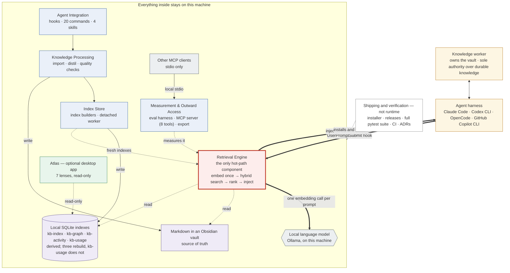

# Drawing specification: KennisBank architecture overview (one plate)

This is a complete, dimensioned drawing specification. Hand the whole document
to an image-generating or diagram-generating model. Every coordinate, colour and
string is literal: render the text exactly as written, do not paraphrase labels,
do not add elements that are not listed here.

If the target tool cannot honour absolute coordinates, keep the **relative
placement, grouping, colour roles, arrow weights and z-order** — those carry the
meaning. The numbers exist so that two different renderers produce recognisably
the same plate.

---

## Part A — Intent

### A1. What the plate must say

Three claims, in descending visual weight:

1. **KennisBank lives inside the user's own vault and is driven by the agent
   harness.** Not a service, not a server, not a cloud product: a layer of local
   scripts the harness invokes at defined moments.
2. **One path is fast; everything else is deferred.** Exactly one component runs
   on every prompt, under a sub-second budget. All expensive work happens at
   session boundaries, at idle, or on demand.
3. **KennisBank never sends the vault anywhere.** A visible boundary encloses the
   scripts, the vault, the indexes and the local embedding model.

Five-second takeaway: *local knowledge layer, one fast read path, heavy work
pushed aside, all on my own machine.*

### A2. One honesty rule that shapes the layout

The agent harness sits **outside** the machine boundary, and that is deliberate.
Claude Code and comparable harnesses talk to a cloud model, so the harness is
exactly where data can leave. The boundary is a claim about KennisBank's own
behaviour, not about the agent's. The two arrows that cross the boundary are
therefore the most semantically loaded lines in the drawing, and annotation `N1`
must be present to say so. Do not "fix" this by moving the harness inside.

### A3. Global don'ts

- No cloud icons, server racks, network topology, load balancers, or anything
  implying remote infrastructure inside the boundary.
- No authentication, multi-tenancy, or scaling elements: single user, one machine.
- No decorative AI imagery: no brains, robots, neural meshes, glowing orbs.
- No company logos or wordmarks, and no imitation of one. Product names are
  plain text only.
- No 3-D, isometric projection, gradients, drop shadows, or photographic elements.
- No numbers other than those given in Parts B and C. Do not invent metrics.
- Exactly the elements in Part C. Seven components is the whole system: six are
  drawn inside the boundary (`H1`, `D1`–`D4`, `R2`) and the seventh, `M1`, is
  drawn outside it because it never runs inside a session.

---

## Part B — Canvas, tokens, conventions

### B1. Canvas

| Property | Value |
| --- | --- |
| Size | 2560 × 1440 px (16:9) |
| Origin | top-left, x increases right, y increases down, all units px |
| Background | `#FAFAFA` |
| Safe margin | 36 px on all sides; no element outside it |
| Corner radius | 8 px on all rectangles unless stated otherwise |

### B2. Colour tokens

| Token | Stroke | Fill | Band tint | Used for |
| --- | --- | --- | --- | --- |
| `HOT` | `#C0392B` | `#FDEDEC` | `#FCF3F2` | the hot-path band and its one box |
| `DEFER` | `#2C5AA0` | `#EAF0F9` | `#F2F6FB` | the four deferred-work boxes |
| `STORE` | `#5B4B8A` | `#EFEBF7` | `#F5F2FA` | vault and index storage |
| `EXT` | `#4F5B62` | `#ECEFF1` | — | local runtime outside KennisBank (Ollama, MCP clients) |
| `ACTOR` | `#B7791F` | `#FDF6E3` | — | the human and the agent harness |
| `VIEW` | `#2E7D52` | `#E8F5EC` | — | Atlas, the optional viewer |
| `EDGE` | `#2E7D52` | none | — | the machine boundary (dashed) |
| `META` | `#8A8A8A` | none | — | shipping/verification band, legend, caption |

Text: primary `#1A1A1A`, secondary `#4A4A4A`, band titles `#333333`,
annotation `#8A5A00`.

### B3. Typography

Single geometric sans throughout (Inter, Source Sans 3, or similar).

| Role | Size | Weight | Notes |
| --- | --- | --- | --- |
| Plate title | 44 | 600 | |
| Plate subtitle | 22 | 400 | secondary colour |
| Band title | 20 | 600 | UPPERCASE, letter-spacing 1.5 px |
| Band subtitle | 15 | 400 | italic, secondary colour |
| Box title | 26 | 600 | |
| Box sublabel | 16 | 400 | line-height 22 px |
| Box note | 14 | 400 | italic, secondary colour |
| Arrow label | 15 | 500 | on a 3 px-padded background chip in canvas colour, so lines do not strike through text |
| Legend / caption | 15 / 14 | 400 | caption italic |

### B4. Stroke conventions (these carry meaning — do not normalise them)

| Class | Width | Style | Arrowhead | Meaning |
| --- | --- | --- | --- | --- |
| `thick` | 5 px | solid | filled triangle, 16 px | the hot path: every prompt, sub-second |
| `thin` | 2 px | solid | filled triangle, 11 px | deferred call or write: session end, idle, on demand |
| `dashed` | 2 px | dash 8/6 | open chevron, 11 px | read-only, prerequisite, or verification |
| `bidi` | 2 px | solid | triangle both ends | two-way exchange |

All connectors are orthogonal (horizontal and vertical segments only), with 6 px
rounded corners at direction changes.

### B5. Z-order (back to front)

1. background
2. band tint rectangles
3. boundary rectangle (`EDGE`) and its label tab
4. connectors and their label chips
5. element boxes and their text
6. annotations, legend, title block, caption

---

## Part C — Elements

Geometry is given as `x, y, w, h` of the top-left corner. Text is centred in the
box unless stated. Sublabel lines stack under the title, left-aligned when the
box contains three or more lines, otherwise centred.

### C1. Title block

| id | type | x | y | content |
| --- | --- | --- | --- | --- |
| `T1` | text | 60 | 84 | `KennisBank — architecture overview` (plate title) |
| `T2` | text | 60 | 122 | `A local knowledge layer for coding agents: one fast read path, heavy work deferred` (plate subtitle) |

`y` is the text baseline for all text elements in this specification.

### C2. Band 1 — people and harness (above the boundary)

| id | type | token | x | y | w | h | text |
| --- | --- | --- | --- | --- | --- | --- | --- |
| `A1` | box | `ACTOR` | 92 | 152 | 520 | 124 | title `Knowledge worker`; sublabel `writes code and prose · owns the vault`; sublabel `sole authority over what becomes durable knowledge` |
| `A2` | box | `ACTOR` | 700 | 152 | 800 | 124 | title `Agent harness`; sublabel `Claude Code · Codex CLI · OpenCode · GitHub Copilot CLI`; sublabel `invokes KennisBank through lifecycle hooks` |

`A1` may carry a minimal line-art person glyph, 28 px, left of the title, with no
facial detail. Optional.

### C3. Machine boundary

| id | type | token | x | y | w | h |
| --- | --- | --- | --- | --- | --- | --- |
| `E1` | rect, stroke only, 3 px, dash 12/6, radius 16 | `EDGE` | 60 | 306 | 2440 | 908 |
| `E2` | label tab: solid rect fill `#2E7D52`, radius 6, centred on the top edge of `E1` | — | 848 | 288 | 864 | 36 |

`E2` text, 16 px / 600, colour `#FFFFFF`, centred:
`🔒 Everything inside stays on this machine — no cloud, no network bind`

Render the padlock as a simple closed-padlock glyph, not an emoji illustration.
If glyphs are unavailable, omit it and keep the text.

### C4. Band 2 — hot path

| id | type | token | x | y | w | h |
| --- | --- | --- | --- | --- | --- | --- |
| `B2` | band tint rect, no stroke | `HOT` band tint | 92 | 348 | 1880 | 196 |
| `H1` | box, stroke 3 px | `HOT` | 720 | 402 | 760 | 122 |

Band labels:

| id | type | x | y | align | text |
| --- | --- | --- | --- | --- | --- |
| `B2a` | band title | 112 | 380 | left | `HOT PATH — RUNS ON EVERY PROMPT` |
| `B2b` | band subtitle | 1952 | 380 | right | `2.0 s budget for the embedding call · sub-second target overall` |

`H1` text:
- title: `Retrieval Engine`
- sublabel: `the only component on the hot path`
- sublabel: `embed the prompt once → hybrid vector + keyword search → rank → inject`
- sublabel: `ranking blends similarity, recency, graph neighbours and prior usefulness`

### C5. Band 3 — deferred work

| id | type | token | x | y | w | h |
| --- | --- | --- | --- | --- | --- | --- |
| `B3` | band tint rect | `DEFER` band tint | 92 | 566 | 1880 | 312 |
| `D1` | box | `DEFER` | 132 | 622 | 417 | 208 |
| `D2` | box | `DEFER` | 593 | 622 | 417 | 208 |
| `D3` | box | `DEFER` | 1054 | 622 | 417 | 208 |
| `D4` | box | `DEFER` | 1515 | 622 | 417 | 208 |

Band labels:

| id | type | x | y | align | text |
| --- | --- | --- | --- | --- | --- |
| `B3a` | band title | 112 | 598 | left | `DEFERRED WORK — SESSION BOUNDARIES · IDLE · ON DEMAND` |
| `B3b` | band subtitle | 1952 | 598 | right | `never on the prompt path` |
| `B3c` | chain caption, 15 px / 500, `#4A4A4A` | 1032 | 860 | centre | `captured session → distilled knowledge → indexed` |

Box text:

| id | title | sublabels |
| --- | --- | --- |
| `D1` | `Agent Integration` | `one coordinator per lifecycle event` / `20 slash commands · 4 skills` / `installs and validates config per harness` |
| `D2` | `Knowledge Processing` | `import foreign material · distil sessions` / `into memory and wiki articles` / `checks staleness, contradictions, provenance` |
| `D3` | `Index Store` | `builds search, graph and activity indexes` / `detached background worker` / `single-flight lock, survives interruption` |
| `D4` | `Measurement & Outward Access` | `recall@k eval harness · threshold calibration` / `local MCP server, 8 tools` / `portable export of the whole vault` |

### C6. Band 4 — storage

| id | type | token | x | y | w | h | shape |
| --- | --- | --- | --- | --- | --- | --- | --- |
| `B4` | band tint rect | `STORE` band tint | 92 | 900 | 1880 | 282 | rect |
| `S1` | box | `STORE` | 132 | 956 | 1080 | 204 | document shape: rectangle whose bottom edge is a shallow double fold, or a plain rect with a 12 px folded top-right corner |
| `S2` | box | `STORE` | 1252 | 956 | 680 | 204 | database shape: rectangle with elliptical top and bottom caps (cylinder), 18 px cap height |

Band label:

| id | type | x | y | align | text |
| --- | --- | --- | --- | --- | --- |
| `B4a` | band title | 112 | 932 | left | `THE VAULT — PLAIN FILES YOU OWN` |

`S1` text:
- title: `Markdown in an Obsidian vault`
- sublabel, two lines, 15 px: `ten numbered folders:` /
  `00-inbox · 01-raw · 02-wiki · 03-projecten · 04-templates · 05-bronnen · 06-claude · 07-media · 08-archive · 09-memory`
- note (italic): `the durable layer — readable and editable without any of this software`

`S2` text:
- title: `Local SQLite indexes`
- sublabel, four lines, left-aligned, 15 px:
  `kb-index.db — vector + keyword search`
  `kb-graph.db — knowledge graph`
  `kb-activity.db — what happened when`
  `kb-usage.db — which knowledge got used`
- note (italic): `three rebuild from the markdown — kb-usage.db does not`

The shape difference between `S1` and `S2` is load-bearing: source of truth
versus derived artefact. Do not render both as plain rectangles.

### C7. Right column (inside the boundary)

| id | type | token | x | y | w | h | shape |
| --- | --- | --- | --- | --- | --- | --- | --- |
| `R1` | box | `EXT` | 2036 | 380 | 400 | 180 | hexagon or cylinder |
| `R2` | box | `VIEW` | 2036 | 600 | 400 | 260 | rect |
| `R3` | box | `EXT` | 2036 | 900 | 400 | 220 | rect |

| id | title | sublabels |
| --- | --- | --- |
| `R1` | `Local language model` | `Ollama, on this machine` / `embeddings for search` / `optional local generation` |
| `R2` | `Atlas` | `optional desktop app (Tauri)` / `7 lenses: overview · graph · wordcloud · time slider ·` / `memory health · recall · graphify` / note italic: `reads the same vault, read-only` |
| `R3` | `Other MCP clients` | `any local MCP client` / `pull-style access to the same knowledge` / note italic: `stdio only — nothing listens on a port` |

The seven lens names in `R2` are the ones the application actually ships. There is
no Timeline lens: `c4-code-atlas-frontend-src-lenses.md:37` records that it was
dropped (TASK-27.18), leaving its route, client method and bucket type behind as
documented dead code. Do not reinstate the name from an older draft of this plate.

### C8. Band 5 — shipping and verification (below the boundary)

| id | type | token | x | y | w | h |
| --- | --- | --- | --- | --- | --- | --- |
| `M1` | box, stroke 1.5 px, fill none | `META` | 92 | 1252 | 2376 | 84 |

`M1` text, single centred line at 18 px / 600 plus one sublabel line at 15 px:
- title: `Shipping and verification — not part of a running session`
- sublabel: `installer copies the script layer into the vault · versioned releases · the full pytest suite and CI gate every change · decisions recorded as ADRs`

`M1` must read as subordinate: thinner stroke, no fill, smaller type than any box
inside the boundary.

### C9. Annotations

| id | type | x | y | w | h | text |
| --- | --- | --- | --- | --- | --- | --- |
| `N1` | callout box, fill `#FFFCF2`, stroke 1.5 px `#B7791F`, radius 6 | 1560 | 152 | 908 | 124 | title 16 px / 600: `Why the harness sits outside the boundary`; body 14 px / 400, 3 lines: `The harness talks to a cloud model, so it is the one place data can leave.` / `KennisBank never sends the vault anywhere; it only hands context to the agent.` / `What the agent then does with its own context is the agent's business.` |

`N1` leader line: 1.5 px solid `#B7791F`, from the left edge of `N1` at
(1560, 214) west to (1500, 214), touching `A2`'s right edge. No arrowhead.

---

## Part D — Connectors

Waypoints are absolute `(x, y)` pairs; the connector runs through them in order.
`from` and `to` name the element and the edge point.

### D1. Hot path (thick, `HOT` stroke `#C0392B`)

| id | class | from | to | waypoints | label | label position |
| --- | --- | --- | --- | --- | --- | --- |
| `C1` | thick | `A2` bottom (860, 276) | `H1` top (860, 402) | (860,276) → (860,402) | `UserPromptSubmit hook` | chip centred at (958, 340), left-aligned to the line |
| `C2` | thick | `H1` top (1340, 402) | `A2` bottom (1340, 276) | (1340,402) → (1340,276) | `injected context block` | chip centred at (1452, 340) |
| `C3` | thick | `H1` right (1480, 470) | `R1` left (2036, 470) | (1480,470) → (2036,470) | `one embedding call per prompt` | chip centred at (1758, 452) |

`C1` and `C2` must read as one fast loop: same weight, same colour, symmetric
about the centre of `H1`. Both cross `E1`'s top edge — draw the crossing cleanly,
with no gap or bridge symbol.

### D2. Reads and writes to storage (thin, `#4A4A4A`)

| id | class | from | to | waypoints | label | label position |
| --- | --- | --- | --- | --- | --- | --- |
| `C4` | dashed | `H1` bottom (1032, 524) | `S1` top (1032, 956) | (1032,524) → (1032,956) | `read` | chip at (1074, 700) |
| `C5` | dashed | `H1` bottom (1476, 524) | `S2` top (1476, 956) | (1476,524) → (1476,956) | `read` | chip at (1518, 700) |
| `C6` | thin | `D2` bottom (803, 830) | `S1` top (803, 956) | (803,830) → (803,956) | `write` | chip at (845, 900) |
| `C7` | thin | `D3` bottom (1300, 830) | `S2` top (1300, 956) | (1300,830) → (1300,956) | `write` | chip at (1342, 900) |

`C4` and `C5` pass through the vertical gaps between `D2`/`D3` and `D3`/`D4`
respectively. They must not overlap any `D` box. Keep them dashed: the hot path
reads storage, it does not own it.

### D3. Deferred chain and feedback (thin, `DEFER` stroke `#2C5AA0`)

| id | class | from | to | waypoints | label |
| --- | --- | --- | --- | --- | --- |
| `C8` | thin | `D1` right (549, 726) | `D2` left (593, 726) | (549,726) → (593,726) | none |
| `C9` | thin | `D2` right (1010, 726) | `D3` left (1054, 726) | (1010,726) → (1054,726) | none |
| `C10` | dashed | `D3` top (1150, 622) | `H1` bottom (1150, 524) | (1150,622) → (1150,524) | `fresh indexes` — chip at (1236, 574) |
| `C11` | dashed | `D4` top (1600, 622) | `H1` bottom (1440, 524) | (1600,622) → (1600,576) → (1440,576) → (1440,524) | `measures it` — chip at (1690, 566) |

`C8` and `C9` are short and deliberately unlabelled; caption `B3c` carries the
meaning for the whole chain.

### D4. Right column (thin / dashed)

| id | class | from | to | waypoints | label |
| --- | --- | --- | --- | --- | --- |
| `C12` | dashed | `R2` bottom (2236, 860) | `S2` right (1932, 1058) | (2236,860) → (2236,1058) → (1932,1058) | `read-only` — chip at (2060, 1040) |
| `C13` | thin | `R3` left (2036, 1010) | `D4` right (1932, 780) | (2036,1010) → (1984,1010) → (1984,780) → (1932,780) | `local stdio` — chip at (1930, 940), right-aligned |

### D5. Actors and meta

| id | class | from | to | waypoints | label |
| --- | --- | --- | --- | --- | --- |
| `C14` | bidi | `A1` right (612, 214) | `A2` left (700, 214) | (612,214) → (700,214) | `prompts · answers` — chip at (656, 196) |
| `C15` | dashed, stroke `META` | `M1` top (1280, 1252) | `E1` bottom (1280, 1214) | (1280,1252) → (1280,1214) | `installs and verifies` — chip at (1402, 1234) |

---

## Part E — Legend and caption

### E1. Legend

Row of four items, each an 80 px line sample followed by 8 px gap and its text,
15 px / 400, `#4A4A4A`, all on baseline `y = 1382`.

| x of line sample | sample | text |
| --- | --- | --- |
| 92 | 5 px solid `#C0392B` with arrowhead | `hot path — every prompt, sub-second` |
| 700 | 2 px solid `#2C5AA0` with arrowhead | `deferred — session end, idle, on demand` |
| 1290 | 2 px dashed `#4A4A4A` with chevron | `read-only or prerequisite` |
| 1800 | 2 px dashed rect outline `#2E7D52`, 80 × 24 | `machine boundary — nothing leaves` |

### E2. Caption

| id | type | x | y | text |
| --- | --- | --- | --- | --- |
| `Z1` | caption, italic 14 px, `#8A8A8A` | 92 | 1404 | `Current state, July 2026 — seven components, four local indexes, one machine. Derived from the C4 component model of the repository.` |

---

## Part F — Accuracy constraints

These prevent a plausible-looking but wrong plate. Each one is a fact about the
system, not a style preference.

1. **`H1` is the only box inside the hot-path band.** If a second component
   appears there, the plate contradicts the system's central design rule.
2. **`R2` (Atlas) is optional and never on the hot path.** It must not be drawn
   as the primary interface, must not touch `H1`, and its only connector is the
   dashed read-only `C12`.
3. **`S1` is the source of truth; `S2` is derived.** Their shapes must differ.
   `S2`'s note must not claim that all four databases rebuild: `kb-index.db`,
   `kb-activity.db` and `kb-graph.db` do, but `kb-usage.db` is behavioural
   telemetry with no markdown ancestor and no rebuild path. Deleting it loses
   the history for good.
4. **The MCP server is inside `D4`, not a separate top-level box.** It is one way
   in, not the main one: the hook-driven push path (`C1`/`C2`) is primary, MCP is
   the pull alternative for clients without hook support.
5. **`R1` (Ollama) sits inside the boundary.** Placing it outside would misstate
   the system's defining property.
6. **`M1` sits outside the boundary and looks subordinate.** It is install-time
   and CI-time only; drawing it as a runtime peer would be wrong.
7. **The hot path performs exactly one write**, recording which knowledge was
   injected. If any hot-path write is labelled, label only that one. `C4` and
   `C5` stay dashed reads.
8. **Only `C1`, `C2` and `C15` cross the boundary.** Any other crossing would
   claim a data flow that does not exist.
9. **`N1` must be present.** Without it, the harness sitting outside reads as an
   error rather than the point.

---

## Part G — Validation checklist

Check the rendered plate against this list; each item is a yes/no.

- [ ] Canvas 16:9, light background, nothing outside the 36 px margin.
- [ ] Exactly seven component boxes: six inside the boundary (`H1`, `D1`–`D4`,
      `R2`) plus `M1` below it. `S1`, `S2`, `R1` and `R3` are external systems in
      the C4 component model, not components, and are not counted.
- [ ] `H1` is visually the loudest box: thickest stroke, warm red, tinted band.
- [ ] `C1` and `C2` are the only 5 px connectors and form a symmetric loop.
- [ ] The boundary is dashed green with the padlock label tab on its top edge.
- [ ] Exactly three connectors cross the boundary: `C1`, `C2`, `C15`.
- [ ] `S1` and `S2` have visibly different shapes.
- [ ] `M1` is below the boundary, unfilled, thinner-stroked, smaller type.
- [ ] `N1` is present, with a leader line to `A2`.
- [ ] Legend has four rows; caption `Z1` is present.
- [ ] No logo, no cloud icon, no 3-D, no AI imagery, no invented numbers.
- [ ] Every string matches Part C and D verbatim.

---

## Part H — Fallback structure (for a diagram-as-code renderer)

If the target renders code rather than pixels, this Mermaid graph encodes the
same structure. It is a fallback, not a substitute: it loses the band tints, the
boundary, the shape distinction and the arrow weights, all of which carry
meaning. Prefer the dimensioned specification above.

