# C4 Code Level: Atlas Frontend Lenses

## Overview

- **Name**: Atlas Frontend Lenses
- **Description**: Seven specialized lens components that render different aspects of KennisBank data (graph, memory health, retrieval waterfall, temporal filtering, word clouds, overview health, and graphify embeddings) into the Atlas web interface
- **Location**: [`atlas/frontend/src/lenses/`](../../atlas/frontend/src/lenses/)
- **Language**: TypeScript
- **Purpose**: Provide modular, single-responsibility visualization and data-exploration interfaces for the KennisBank knowledge base management system. Each lens is a self-contained rendering function that transforms sidecar API responses into interactive web UIs.

## Architecture Pattern

All lenses follow the same contract:

```typescript
// Pattern: (host: HTMLElement, client: DataClient) => Promise<void>
```

Each lens:
1. **Receives** a DOM host element and a DataClient (sidecar connection)
2. **Fetches** data asynchronously via DataClient methods
3. **Renders** interactive UI into the host using the DOM builder (`el()`, `clear()`)
4. **Manages lifecycle** by checking generation tokens to ignore stale renders
5. **Cleans up** on lens departure via `onLensLeave()` callbacks

This decoupling means lenses can be mounted/unmounted independently and tested in isolation.

---

## Code Elements

### Lens Functions

#### 1. `renderGraphLens(host: HTMLElement, client: DataClient): Promise<void>`

**Location**: [`graph.ts:50–215`](../../atlas/frontend/src/lenses/graph.ts#L50-L215)

**Purpose**: Force-directed graph visualization with color modes, status/kind filters, and click-to-inspect nodes. Nodes are colored by community (default), status, kind, provenance, or entry-point density; sized by importance/degree; ringed by lifecycle status; and haloed by usage warmth. Implements level-of-detail (LOD) optimization above 400 nodes to maintain pan/zoom performance.

**Dependencies**:
- External: `ForceGraph` (force-graph library)
- Internal: `DataClient.graph()`, `DataClient.memoryLinks()`, `DataClient.provenance()`
- Encoding: `ColorMode`, `nodeColor()`, `nodeVal()`, `statusColor()`, `provenanceColor()`, `entryPointColor()`, `warmthHalo()`, `passesFilter()`
- Lifecycle: `currentGeneration()`, `isCurrent()`, `onLensLeave()`
- DOM: `el()`, `clear()`
- Navigation: `openInspect()`

**Key Features**:
- Five color modes: `"community"`, `"status"`, `"kind"`, `"provenance"`, `"entry-points"` (lazily loaded)
- Checkboxes for hiding superseded nodes, showing at-risk (unsourced) nodes, and toggling memory fragments
- Legend reflects current color mode
- LOD note shown when `nodes.length > 400` (per-node halo/ring disabled for performance)
- Resize handler for canvas responsiveness
- Graph state cleanup on lens departure

**Data Shapes**:
- `client.graph(includeMemory?: boolean): Promise<Graph>` — returns nodes and links
- `client.provenance(): Promise<Provenance>` — overlay: which nodes are at-risk (unsourced)
- `client.memoryLinks(): Promise<MemoryLinks>` — entry-point counts (loaded on first selection)

**Interaction**:
- Click node → `openInspect()` with node.id
- Change color mode, filters → re-apply graph data
- Drag slider → filter at-risk, resize canvas → pan/zoom responsiveness

---

#### 2. `renderOverviewLens(host: HTMLElement, client: DataClient): Promise<void>`

**Location**: [`overview.ts:47–87`](../../atlas/frontend/src/lenses/overview.ts#L47-L87)

**Purpose**: Single-page vault health dashboard answering "hoe staat de kennisbank ervoor?" (how is the knowledge bank doing?) at a glance. Shows wiki article count by status, active memory counts by lifecycle phase, inbox backlog, activity heatmap (182 days, intensity by event count), freshness buckets (0-7d, 8-30d, 31-90d, 90d+, unknown), provenance coverage percentage, and graph staleness indicator.

**Dependencies**:
- Internal: `DataClient.overview()`
- DOM: `el()`, `clear()`, `withLoader()`
- Helper functions: `tile()`, `statusRow()`, `heatmapStrip()`, `freshnessLine()`

**Key Features**:
- **Tiles**: wiki articles, active memories, unverified queue, inbox waiting (color-coded: ok/warn/error/muted)
- **Activity heatmap**: 182-day rolling window, one cell per day, intensity in 5 steps (O(days) rendering, O(1) with vault size)
- **Freshness**: distribution across time buckets (wiki articles)
- **Signals**: provenance % sourced, graph staleness, inbox status
- **Fail-soft**: missing heatmap/freshness data renders with a message, not an error

**Data Shapes**:
- `client.overview(): Promise<Overview>` — aggregated vault statistics

**Interaction**:
- No interaction; read-only dashboard
- Links in signals section explain next steps (e.g., "run /graphify", "run /intake")

---

#### 3. `renderRecallLens(host: HTMLElement, client: DataClient): Promise<void>`

**Location**: [`recall.ts:33–130`](../../atlas/frontend/src/lenses/recall.ts#L33-L130)

**Purpose**: Live retrieval waterfall inspector. Shows WHY a document is retrieved for a query: the vector/FTS candidates, their RRF fusion, and the per-hit rerank factor breakdown (relevance × recency × importance × trust × usage = final score). Data reuses the production kb-recall pipeline, so shown factors match the actual ranking logic.

**Dependencies**:
- Internal: `DataClient.recall(q: string, k?: number): Promise<Recall>`
- DOM: `el()`, `clear()`, `message()`
- Navigation: `openInspect()`
- Helper functions: `stageList()`, `factorRow()`

**Key Features**:
- **Input bar**: text query field + "Recall" button (or Enter key)
- **Facet chips**: client-side filtering (no new query) on `"alle"`, `"wiki"`, `"memory"` layers
- **Waterfall stages**: three columns (Vector-KNN, FTS, RRF-fusie) showing candidates → RRF fusion
- **Final results**: ranked hits with clickable paths, snippets, and per-hit factor breakdown
- **Machine-readable twin**: "kopieer als JSON" button copies entire waterfall to clipboard for bug reports/agent pipelines
- **Error handling**: graceful message if recall fails or returns no hits

**Data Shapes**:
- `client.recall(q: string, k: number): Promise<Recall>` — stages (vector, fts, rrf, rerank) and final results
- Each stage: `StageEntry[]` = `[{path, score}, ...]`
- Rerank stage: `RerankEntry[]` = `[{path, score, factors: {relevance, recency, importance, trust, usage, final}}, ...]`

**Interaction**:
- Type query, press Enter or click "Recall" → fetch and render waterfall
- Click hit → `openInspect()` with path
- Click facet chip → filter results client-side (no API call)
- Click "kopieer als JSON" → copy full payload to clipboard

---

#### 4. `renderGraphifyLens(host: HTMLElement, client: DataClient): Promise<void>`

**Location**: [`graphify.ts:9–35`](../../atlas/frontend/src/lenses/graphify.ts#L9-L35)

**Purpose**: Embed the interactive graph.html that the graphify pipeline generates into the vault's `graphify-out/` directory. The page is self-contained (no external fetch calls) and served over loopback HTTP by the sidecar, so scripts run safely inside the iframe without file:// URI restrictions.

**Dependencies**:
- Internal: `DataClient.graphifyHtmlUrl(): string | null`
- DOM: `el()`, `clear()`, `message()`
- Lifecycle: `currentGeneration()`, `isCurrent()`

**Key Features**:
- **Probe before embed**: sends HEAD request to URL before creating iframe, displays clear message if missing
- **Fail-soft**: three message states:
  - `"error"`: no sidecar port configured (`?port=NNNN` missing)
  - `"empty"`: graphify-out/graph.html not found (hint: run /graphify first)
  - `"loading"` → iframe on success
- **Self-contained**: iframe src is loopback HTTP, no CORS issues, full script execution

**Data Shapes**:
- `client.graphifyHtmlUrl(): string | null` — returns `http://127.0.0.1:PORT/graphify-out/graph.html` or null

**Interaction**:
- No user interaction with the lens itself; all interaction deferred to the embedded HTML/JS
- Click-to-inspect and graph interaction handled by graphify's own scripts

---

#### 5. `renderMemoryHealthLens(host: HTMLElement, client: DataClient): Promise<void>`

**Location**: [`memory-health.ts:47–133`](../../atlas/frontend/src/lenses/memory-health.ts#L47-L133)

**Purpose**: Editor-in-chief cockpit for the memory layer. Displays lifecycle counts (active, unverified, superseded, quarantined), the unverified quarantine queue with approve/reject buttons, an importance × recency heatmap (showing distribution of active memories), warm/stale usage rankings, and supersede chains. Every row links back to the source memory file.

**Dependencies**:
- Internal: `DataClient.memoryHealth()`, `DataClient.decideMemory(id: string, decision: "approve" | "reject"): Promise<DecideResult>`
- DOM: `el()`, `clear()`, `withLoader()`
- Encoding: `AGE_BUCKETS`, `ageBucket()`
- Navigation: `openInspect()`
- Helper functions: `tile()`, `heatmap()`

**Key Features**:
- **Lifecycle tiles**: active (ok), unverified (warn), superseded (muted), quarantined (error)
- **Quarantine queue** (up to 30 shown):
  - Each item: importance badge, memory ID, created date
  - Approve/reject buttons call `decideMemory()` and update row live
  - Click label → `openInspect()` the memory fragment
- **Importance × recency heatmap**:
  - Grid: importance (5 levels, rows) × age bucket (0-7d, 8-30d, 31-90d, 90d+, columns)
  - Cell color intensity = count (blue 0–80% opacity)
  - Title hover shows exact counts
- **Warmth/stale list** (top 15):
  - Temperature badge (warm/tepid/stale) with warmth score, path, last-used date
  - Click → `openInspect()` (resolves stem to file path or falls back to 09-memory/)
- **Supersede chains** (top 15):
  - Shows A → B → C chains with valid_until expiry
  - Missing files marked (ontbreekt) and muted (no clickable link)

**Data Shapes**:
- `client.memoryHealth(): Promise<MemoryHealth>` — counts, queue, heatmap, warmth, chains
- `client.decideMemory(id, decision): Promise<DecideResult>` — returns `{status, stem, new_status}`

**Interaction**:
- Click quarantine item label → inspect fragment
- Click approve/reject → decide and update row (buttons disabled during request)
- Click warmth item → inspect (resolves stem or opens memory dir)
- Click chain link (non-missing) → inspect fragment

---

#### 6. `renderTimeSliderLens(host: HTMLElement, client: DataClient): Promise<void>`

**Location**: [`time-slider.ts:16–97`](../../atlas/frontend/src/lenses/time-slider.ts#L16-L97)

**Purpose**: Temporal graph filtering via a valid-as-of instant. Bi-temporal nodes (memory fragments) carry `valid_from`/`valid_until` timestamps; wiki nodes are atemporal and always shown. Filtering is client-side over the /graph payload, with a slider to scrub through time and a toggle between "capture-time" (when known) and "valid-time" (when true) axes.

**Dependencies**:
- External: `ForceGraph`
- Internal: `DataClient.graph(): Promise<Graph>`
- Encoding: `communityColor()` from colors module
- Lifecycle: `currentGeneration()`, `isCurrent()`, `onLensLeave()`
- DOM: `el()`, `clear()`, `withLoader()`
- Navigation: `openInspect()`
- Temporal filter: `visibleAsOf(node, asOf, axis): boolean`, `TimeAxis = "capture" | "valid"`, `TemporalNode`

**Key Features**:
- **Time axis toggle**: select between:
  - `"capture"`: when system learned the fact (created date)
  - `"valid"`: when fact was true (valid_from/valid_until, exclusive upper bound)
- **Slider range**: min/max computed from node dates (or now if no temporal data)
- **Label**: displays current as-of date (YYYY-MM-DD format)
- **Disabled state**: slider is disabled if no temporal data found (note explains)
- **Force graph**: filtered nodes rendered with community coloring (memory = orange, wiki = community color)
- **Click node** → `openInspect()`
- **Resize listener** for canvas responsiveness
- **Cleanup**: graph paused and data cleared on lens departure

**Data Shapes**:
- `client.graph(): Promise<Graph>` — nodes with optional `valid_from`, `valid_until`, `created` fields
- Time filtering: `visibleAsOf(node, asOf, axis)` returns true iff node is visible at that instant

**Interaction**:
- Drag slider → recompute visible nodes, update date label, re-render graph
- Change axis dropdown → recompute visibility, re-render
- Click node → inspect
- Resize window → canvas adapts

---

#### 7. `renderWordcloudLens(host: HTMLElement, client: DataClient): Promise<void>`

**Location**: [`wordcloud.ts:24–61`](../../atlas/frontend/src/lenses/wordcloud.ts#L24-L61)

**Purpose**: Vault concepts sized by importance (degree + usage warmth) rendered as a flex tag cloud. A human editor sees at a glance what the knowledge base is "about". MVP: simple flex layout (no layout library), dependency-light after mermaid/hljs freezes.

**Dependencies**:
- Internal: `DataClient.graph(): Promise<Graph>`
- Encoding: `communityColor()` from colors module
- DOM: `el()`, `clear()`, `withLoader()`
- Navigation: `openInspect()`
- Helper functions: `weightOf()`, `labelOf()`

**Key Features**:
- **Top-N capping**: limits to 150 terms for readability
- **Weight formula**: `degree + warmth * 1.5` (degree dominates, warmth adds usage signal)
- **Font size**: MIN_PX (12) to MAX_PX (52) using sqrt scale for smooth progression
- **Shuffling**: sorted by ID hash (not by weight) so sizes aren't sorted into a visual wedge
- **Color**: community color for wiki nodes, orange for memory nodes
- **Clickable**: each term opens inspect drawer
- **Hover title**: shows label, link count, warmth

**Data Shapes**:
- `client.graph(): Promise<Graph>` — nodes with degree, warmth, label, kind, community

**Interaction**:
- Click term → `openInspect()` with node.id
- Hover term → tooltip shows stats

---

## Helper Functions

### DOM and Lifecycle Helpers

**Location**: `graph.ts`, `overview.ts`, `recall.ts`, `memory-health.ts`, etc.

- **`legend(colorMode: ColorMode | "provenance" | "entry-points"): HTMLElement`** (graph.ts:28–48)
  - Builds legend UI showing color key, size encoding, and special effects (halo, ring)

- **`tile(label: string, value: string | number, cls?: string): HTMLElement`** (overview.ts:8–13, memory-health.ts:12–17)
  - Small stat tile with value (bold) and label below
  - CSS class for color coding (ok, warn, error, muted)

- **`statusRow(byStatus: Record<string, number>): string`** (overview.ts:15–20)
  - Formats lifecycle status breakdown as space-separated string

- **`heatmapStrip(buckets: {day, n}[], days=182): HTMLElement`** (overview.ts:26–40)
  - Renders 182-day activity heatmap (one cell per day, intensity in 5 steps)
  - O(days) rendering, O(1) with vault size

- **`freshnessLine(f): string`** (overview.ts:42–45)
  - Formats age-bucket breakdown (0-7d, 8-30d, 31-90d, older)

- **`stageList(title: string, entries: StageEntry[]): HTMLElement`** (recall.ts:13–19)
  - Renders one retrieval stage (Vector-KNN, FTS, RRF, Rerank)

- **`factorRow(hit: RerankEntry): HTMLElement`** (recall.ts:21–31)
  - Displays factor breakdown (R, Rec, I, T, U = Final) as badges

- **`heatmap(cells: MemoryHealth["heatmap"]): HTMLElement`** (memory-health.ts:21–45)
  - 5×4 grid (importance × age bucket) with color intensity by count
  - Headers and hover titles

- **`weightOf(n: GraphNode): number`** (wordcloud.ts:15–18)
  - Compute importance: `degree + warmth * 1.5`

- **`labelOf(n: GraphNode): string`** (wordcloud.ts:20–22)
  - Extract label, strip .md suffix

### Constants

- **`LOD_NODES = 400`** (graph.ts:26)
  - Threshold above which per-node halo and status ring are disabled for performance

- **`MIN_PX = 12`, `MAX_PX = 52`** (wordcloud.ts:11–12)
  - Font size range for term sizing

- **`TOP_N = 150`** (wordcloud.ts:13)
  - Cap on cloudcloud terms to maintain readability

- **`TEMP_CLASS: Record<string, string>`** (memory-health.ts:19)
  - Maps temperature ("warm" | "tepid" | "stale") to CSS class

- **`FACTORS = ["relevance", "recency", "importance", "trust", "usage"]`** (recall.ts:11)
  - Rerank factor names in display order

---

## Dependencies

### Internal Dependencies (Within atlas/frontend/src/)

| Module | Exports | Used By |
|--------|---------|---------|
| `data-client.ts` | `DataClient` (class), interfaces (`Graph`, `GraphNode`, `Recall`, `MemoryHealth`, `Overview`, `Provenance`, `MemoryLinks`, `DecideResult`) | All lenses |
| `encoding.ts` | `ColorMode`, `nodeColor()`, `nodeVal()`, `statusColor()`, `provenanceColor()`, `entryPointColor()`, `warmthHalo()`, `passesFilter()`, `AGE_BUCKETS`, `ageBucket()` | graph.ts, memory-health.ts |
| `colors.ts` | `communityColor(community: number \| null \| undefined): string` | graph.ts, time-slider.ts, wordcloud.ts |
| `dom.ts` | `el()`, `clear()`, `message()`, `withLoader<T>()` | All lenses |
| `lifecycle.ts` | `currentGeneration()`, `isCurrent()`, `onLensLeave()` | graph.ts, graphify.ts, time-slider.ts; recall.ts uses currentGeneration via withLoader |
| `inspect.ts` | `openInspect(client: DataClient, path: string): void` | All lenses (navigation to inspect drawer) |
| `timefilter.ts` | `TimeAxis`, `TemporalNode`, `visibleAsOf()` | time-slider.ts |

### External Dependencies (npm packages)

| Package | Used By | Purpose |
|---------|---------|---------|
| `force-graph` v1.49.0 | graph.ts, time-slider.ts | D3-force directed graph visualization, camera control, node/link rendering |
| `markdown-it` | inspect.ts (in parent src/) | Markdown parsing (not directly in lenses, but lenses link to inspect which uses it) |
| `dompurify` | inspect.ts (in parent src/) | XSS sanitization of markdown HTML (not directly in lenses) |
| `mermaid` | inspect.ts (in parent src/) | Embedded diagram rendering (not directly in lenses) |
| `highlight.js` | inspect.ts (in parent src/) | Code syntax highlighting (not directly in lenses) |
| TypeScript stdlib | All lenses | Type checking, Promise, Date, Number, Math, Object, etc. |

### External Sidecar APIs (via DataClient)

All lenses depend on the KennisBank sidecar (localhost HTTP) endpoints:

| Endpoint | Called By | Returns | Purpose |
|----------|-----------|---------|---------|
| `GET /health` | (optional, not shown in lenses) | `Health` | Sidecar status |
| `GET /graph[?include_memory=1]` | graph.ts, time-slider.ts, wordcloud.ts | `Graph` | Nodes and links for graph visualization |
| `GET /timeline?bucket=week` | (not shown in lenses) | `Timeline` | (Available but not used) |
| `GET /memory-health` | memory-health.ts | `MemoryHealth` | Lifecycle counts, queue, heatmap, warmth, chains |
| `GET /provenance` | graph.ts | `Provenance` | At-risk (unsourced) nodes overlay |
| `GET /recall?q=QUERY&k=K` | recall.ts | `Recall` | Retrieval waterfall (vector, FTS, RRF, rerank, final) |
| `GET /doc?path=PATH` | inspect.ts (in parent src/) | `Doc` | Document content (not directly in lenses) |
| `GET /memory-links` | graph.ts, inspect.ts | `MemoryLinks` | Fragment → article mapping and entry-point counts |
| `GET /overview` | overview.ts | `Overview` | Aggregated vault statistics (wiki, memory, inbox, heatmap, etc.) |
| `GET /titles` | (not shown in lenses) | `Titles` | (Available but not used) |
| `POST /memory/decide` | memory-health.ts | `DecideResult` | Approve or reject unverified memory fragment |
| `GET /vault-image?path=PATH` | (not shown in lenses) | PNG blob | (Available but not used) |
| `http://127.0.0.1:PORT/graphify-out/graph.html` | graphify.ts | HTML/JS | Embedded graphify interactive graph |

---

## Relationships

### Module Dependency Graph

```mermaid
---
title: Lenses Module Dependencies (Incoming Edges Only)
---
classDiagram
    namespace Lenses {
        class GraphLens {
            <<export>>
            renderGraphLens(host, client) Promise~void~
        }
        class OverviewLens {
            <<export>>
            renderOverviewLens(host, client) Promise~void~
        }
        class RecallLens {
            <<export>>
            renderRecallLens(host, client) Promise~void~
        }
        class GraphifyLens {
            <<export>>
            renderGraphifyLens(host, client) Promise~void~
        }
        class MemoryHealthLens {
            <<export>>
            renderMemoryHealthLens(host, client) Promise~void~
        }
        class TimeSliderLens {
            <<export>>
            renderTimeSliderLens(host, client) Promise~void~
        }
        class WordcloudLens {
            <<export>>
            renderWordcloudLens(host, client) Promise~void~
        }
    }

    namespace DataLayer {
        class DataClient {
            <<class>>
            base: string | null
            graph(includeMemory?) Promise~Graph~
            memoryHealth() Promise~MemoryHealth~
            provenance() Promise~Provenance~
            recall(q, k) Promise~Recall~
            memoryLinks() Promise~MemoryLinks~
            overview() Promise~Overview~
            decideMemory(id, decision) Promise~DecideResult~
            graphifyHtmlUrl() string|null
        }
    }

    namespace SharedModules {
        class DomHelpers {
            <<module>>
            el(tag, attrs, children) HTMLElement
            clear(host) void
            message(host, cls, text) void
            withLoader(host, msg, load, render) Promise~void~
        }
        class LifecycleManager {
            <<module>>
            currentGeneration() number
            isCurrent(gen) boolean
            onLensLeave(fn) void
            runLensLeave() void
        }
        class EncodingFuncs {
            <<module>>
            nodeColor(node, mode) string
            nodeVal(node) number
            statusColor(status) string
            provenanceColor(atRisk) string
            entryPointColor(count, max) string
            warmthHalo(node) number
            passesFilter(node, filter) boolean
            ageBucket(ageDays) number
        }
        class ColorPalette {
            <<module>>
            communityColor(community) string
        }
        class InspectDrawer {
            <<module>>
            openInspect(client, path) void
        }
        class TemporalFilter {
            <<module>>
            visibleAsOf(node, asOf, axis) boolean
        }
    }

    namespace External {
        class ForceGraphLib {
            <<external>>
            new ForceGraph(container)
            nodeId(field) self
            nodeLabel(fn) self
            nodeColor(fn) self
            nodeCanvasObject(fn) self
            onNodeClick(fn) self
            linkColor(fn) self
            backgroundColor(color) self
            graphData(data) self
            pauseAnimation() void
            resumeAnimation() void
            width(px) self
            height(px) self
        }
    }

    GraphLens --> DataClient: graph(), memoryLinks(), provenance()
    GraphLens --> DomHelpers: el(), clear()
    GraphLens --> LifecycleManager: currentGeneration(), isCurrent(), onLensLeave()
    GraphLens --> EncodingFuncs: nodeColor(), nodeVal(), statusColor(), provenanceColor(), entryPointColor(), warmthHalo(), passesFilter()
    GraphLens --> InspectDrawer: openInspect()
    GraphLens --> ForceGraphLib: node rendering, interaction

    OverviewLens --> DataClient: overview()
    OverviewLens --> DomHelpers: el(), clear(), withLoader()

    RecallLens --> DataClient: recall()
    RecallLens --> DomHelpers: el(), clear(), message()
    RecallLens --> InspectDrawer: openInspect()

    GraphifyLens --> DataClient: graphifyHtmlUrl()
    GraphifyLens --> DomHelpers: el(), clear(), message()
    GraphifyLens --> LifecycleManager: currentGeneration(), isCurrent()

    MemoryHealthLens --> DataClient: memoryHealth(), decideMemory()
    MemoryHealthLens --> DomHelpers: el(), clear(), withLoader()
    MemoryHealthLens --> EncodingFuncs: AGE_BUCKETS, ageBucket()
    MemoryHealthLens --> InspectDrawer: openInspect()

    TimeSliderLens --> DataClient: graph()
    TimeSliderLens --> DomHelpers: el(), clear(), withLoader()
    TimeSliderLens --> ColorPalette: communityColor()
    TimeSliderLens --> LifecycleManager: currentGeneration(), isCurrent(), onLensLeave()
    TimeSliderLens --> InspectDrawer: openInspect()
    TimeSliderLens --> TemporalFilter: visibleAsOf()
    TimeSliderLens --> ForceGraphLib: node rendering, interaction

    WordcloudLens --> DataClient: graph()
    WordcloudLens --> DomHelpers: el(), clear(), withLoader()
    WordcloudLens --> ColorPalette: communityColor()
    WordcloudLens --> InspectDrawer: openInspect()
```



### Data Flow: Lens Lifecycle

```mermaid
---
title: Lens Rendering Lifecycle and Data Flow
---
flowchart LR
    subgraph User["User Interaction"]
        click["Click lens tab"]
        resize["Resize window"]
        interact["Click node, change filter, input query"]
        leave["Switch to another lens"]
    end

    subgraph Init["Initialization"]
        mount["Mount lens into host element"]
        gen["Capture generation token (isCurrent check)"]
        clear_dom["Clear host DOM"]
    end

    subgraph Fetch["Data Fetching"]
        api["Call DataClient method(s)<br/>e.g. client.graph()"]
        await["Await Promise"]
        check["isCurrent(gen)?"]
        abort["Yes→abort, render stale"]
    end

    subgraph Render["DOM Rendering"]
        build["Build DOM with el()<br/>add event listeners"]
        attach["Attach to host element"]
    end

    subgraph Interactive["Interactive Loop"]
        listen["Event listener fires<br/>(click, input, resize)"]
        fetch2["Optionally fetch more data"]
        update["Update DOM selectively"]
    end

    subgraph Cleanup["Cleanup on Departure"]
        dep["onLensLeave() callbacks fire"]
        remove_listeners["Remove event listeners"]
        pause_graphs["Pause graph animations"]
        clear_data["Clear graph data"]
    end

    click -->|renderLens()| mount
    mount --> gen
    gen --> clear_dom
    clear_dom --> api
    api --> await
    await --> check
    check -->|No (stale)| abort
    check -->|Yes (current)| build
    build --> attach
    attach --> listen
    listen --> fetch2
    fetch2 --> update
    update --> listen
    leave --> dep
    dep --> remove_listeners
    remove_listeners --> pause_graphs
    pause_graphs --> clear_data
    resize --> listen
```

### Data Client Isolation Boundary

KennisBank enforces a strong isolation boundary (ADR-0004 module boundaries):

```mermaid
---
title: DataClient Isolation: Single Sidecar Interface
---
flowchart TB
    subgraph Lenses["Lenses (7 modules)"]
        L1["GraphLens<br/>OverviewLens<br/>RecallLens<br/>..etc"]
    end

    subgraph Inspect["Inspect Drawer"]
        I["openInspect()"]
    end

    subgraph SharedUI["Shared UI Layer"]
        D["DomHelpers<br/>LifecycleManager<br/>EncodingFuncs<br/>ColorPalette"]
    end

    subgraph Client["DataClient"]
        Guard["guardBase()<br/>127.0.0.1 enforced"]
        Methods["graph()<br/>recall()<br/>overview()<br/>memoryHealth()<br/>..etc"]
    end

    subgraph Sidecar["Sidecar<br/>localhost HTTP<br/>127.0.0.1:PORT"]
        REST["REST endpoints<br/>/graph, /recall, /overview<br/>/memory-health, /provenance<br/>/memory/decide, etc"]
    end

    subgraph External["External (Forbidden by Design)"]
        Ban["❌ Direct fetch() calls<br/>❌ External URLs<br/>❌ CORS requests"]
    end

    L1 -->|use| SharedUI
    L1 -->|call methods| Client
    I -->|call methods| Client
    Inspect -->|use| SharedUI
    Client --> Guard
    Guard --> Methods
    Methods -->|HTTP GET/POST| Sidecar
    Sidecar -->|JSON response| Methods
    L1 -.->|forbidden| Ban
    I -.->|forbidden| Ban
```

---

## Notes

### Design Patterns

1. **Render-on-demand**: Lenses are mounted/unmounted independently. Each fetches its own data via DataClient (no shared fetching layer).

2. **Generation tokens** (`isCurrent(gen)`): Guard against stale renders when user switches lenses during async operations (especially long-running: entry-point counts at ~47s, memory-links at first open).

3. **Fail-soft**: Lenses gracefully degrade—missing heatmap data, unsourced graph nodes, graphify.html missing, etc. are surfaced as messages, not hard errors.

4. **Level-of-detail (LOD)** (graph.ts): Above 400 nodes, per-node halo and status ring rendering is disabled to maintain pan/zoom performance. Users see a note explaining the tradeoff.

5. **Client-side filtering** (recall.ts, graph.ts): Facet chips and filters operate on already-loaded data (no new API call), keeping interaction instant.

6. **Localized state**: Each lens manages its own state (colorMode, filters, slider position, etc.) in local variables, not in a shared store. This keeps lenses decoupled.

7. **Bi-temporal semantics** (time-slider.ts): Nodes on the "valid" axis are visible iff `valid_from <= asOf < valid_until` (exclusive upper bound). Nodes with no date on the chosen axis are atemporal and always visible. Semantics are deterministic and unit-tested separately.

### Performance Considerations

- **Graph LOD**: Halo and ring disabled above 400 nodes to maintain 60fps pan/zoom.
- **Heatmap O(days)**: Activity heatmap is rendered in O(days) time, O(1) with vault size (only process the returned buckets).
- **Lazy entry-point loading** (graph.ts): Entry-point counts (~47s first load) are loaded only when user selects "entry-points" color mode, not on graph init.
- **Memory-links cache**: `openInspect()` caches the MemoryLinks payload once per session for fast entry-point expansion.
- **No re-export of data**: DataClient methods are called directly by lenses; no shared cache/store that could become stale.

### Error Handling and Resilience

- **withLoader<T>()**: Lenses that use `withLoader()` automatically wrap async data loading with loading and error messages.
- **Try-catch with fail-soft**: graph.ts wraps `client.provenance()` and `client.memoryLinks()` in separate try-catch blocks, letting the graph render even if overlays fail.
- **Stale-render guards**: All async lenses check `isCurrent(gen)` after every await; stale renders are silently discarded.
- **Network errors**: DataClient throws `Error` on HTTP non-ok responses; lenses catch and display error message in DOM.

### Testing

Each lens is a pure function (async): `(host: HTMLElement, client: DataClient) => Promise<void>`.

- **Testable in isolation**: Lens rendering logic can be unit-tested by mocking DataClient and inspecting the resulting DOM.
- **Encoding logic separated**: graph.ts encoding (node color, size, halo) lives in encoding.ts and is unit-tested independently.
- **Temporal filter logic separated**: time-slider.ts temporal filtering is delegated to timefilter.ts and tested separately.

### Known Limitations and TODOs

- **Graphify embed**: Works only when sidecar is running and graphify-out/graph.html exists. No fallback to regenerating graphify on-demand.
- **Memory-links lazy load on first "entry-points" select** (graph.ts:169–180): A long initial load (~47s) can block graph interaction. Considered async preload on graph init, but decided on lazy load to save bandwidth in cases where "entry-points" is never selected.
- **Wordcloud shuffle by ID**: Sorting by ID hash (not name) to avoid visual bias; may not be intuitive. Considered deterministic shuffle by name, but ID provides stable ordering across runs.
- **No persistence**: Lens state (filters, color mode, slider position) is not persisted. Switching lenses and back resets to defaults. Could be added via localStorage if needed.

---

## File Manifest

| File | Lines | Exports | Purpose |
|------|-------|---------|---------|
| `graph.ts` | 216 | `renderGraphLens()` | Force-directed graph with filters and overlays |
| `overview.ts` | 88 | `renderOverviewLens()` | Vault health dashboard |
| `recall.ts` | 131 | `renderRecallLens()` | Retrieval waterfall inspector |
| `graphify.ts` | 36 | `renderGraphifyLens()` | Embedded graphify graph |
| `memory-health.ts` | 134 | `renderMemoryHealthLens()` | Memory lifecycle cockpit |
| `time-slider.ts` | 98 | `renderTimeSliderLens()` | Temporal graph filtering |
| `wordcloud.ts` | 62 | `renderWordcloudLens()` | Concept importance cloud |
| **Total** | **765** | **7** | **Seven visualization lenses** |
