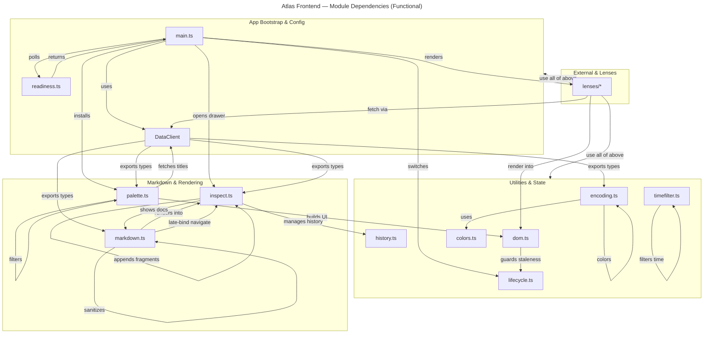

# C4 Code Level: Atlas Frontend — Top-Level Modules

## Overview

- **Name**: Atlas Frontend Core Modules
- **Description**: Top-level TypeScript/JavaScript modules that implement the six-lens tab shell frontend for KennisBank Atlas, providing app bootstrap, HTTP communication with the sidecar, DOM building, markdown rendering, and navigation.
- **Location**: [atlas/frontend/src/](../../atlas/frontend/src/) (repo root relative)
- **Language**: TypeScript (strict mode), targets modern browser ES2020
- **Purpose**: Deliver a performant, secure frontend that connects to the PyInstaller sidecar via HTTP/127.0.0.1, renders six visualization lenses (Overview, Graph, Graphify, Wordcloud, Time-slider, Memory Health, Recall), and provides document inspection with back/forward history. All DOM is built with `textContent` / `createElement` to prevent markup injection from lens payloads (ADR-0004).

---

## Code Elements

### Core Application Bootstrap

#### `main.ts`

**Exported Items:**
- Global entry point; no named exports (script runs on import)

**Key Elements:**

- **`interface Lens`** (lines 18–22)
  - Description: Describes a single visualization lens with key, label, and render function.
  - Fields:
    - `key: string` — lens identifier (e.g., "overview", "graph")
    - `label: string` — human-readable tab label (e.g., "Overzicht", "Memory Health")
    - `render: (el: HTMLElement, client: DataClient) => void | Promise<void>` — async-safe renderer
  - Used by: Tab bar, palette navigation

- **`const LENSES: Lens[]`** (lines 27–35)
  - Description: Registry of all active lenses. Timeline and Provenance lenses removed (TASK-27.18); Provenance survives as one line in Overzicht.
  - Lenses: Overview, Graph, Graphify, Wordcloud, Time-slider, Memory Health, Recall
  - Dependencies: Imports all seven `renderXxxLens` functions from `./lenses/*`

- **`async function connectSidecar(bar: HTMLElement): Promise<boolean>`** (lines 42–75)
  - Description: Attempts to connect to the sidecar HTTP server; polls for readiness with live elapsed-time feedback in the status bar. Returns true on success, false if port not configured or connection fails.
  - Parameters:
    - `bar: HTMLElement` — status bar DOM element for feedback
  - Returns: `Promise<boolean>`
  - Key behavior:
    - Checks `client.configured` before attempting connection
    - Polls via `waitUntilReady(() => client.health(), { timeoutMs: Infinity })` with no deadline (cold PyInstaller boot must never fail)
    - Renders vault path, version, and active data sources on success
  - Dependencies: `DataClient`, `waitUntilReady` from `./readiness.ts`
  - Error handling: Catch-all try/finally; spans on error show "sidecar onbereikbaar: [message]"

- **`async function main(): Promise<void>`** (lines 77–114)
  - Description: App shell orchestrator. Creates tab buttons, attaches click handlers, installs Cmd+K palette, gates first lens render on sidecar readiness.
  - Workflow:
    1. Query DOM for `#tabs`, `#statusbar`, `#lens` elements
    2. Build tab buttons from `LENSES`; clicking a tab calls `select(key)` to switch lenses
    3. Register generation-tracked lens cleanup via `newGeneration()` and `runLensLeave()`
    4. Install palette (Cmd/Ctrl+K) with lens+title index (fetched once per session)
    5. Block render on `connectSidecar()`; once live, call `select(active)` to render first lens
  - Dependencies: `DataClient`, `newGeneration`, `runLensLeave`, `installPalette`, all lens renderers, `waitUntilReady`, `openInspect`
  - Note: `void main()` at module scope (line 116) starts execution on import

---

### HTTP & Data Contracts

#### `data-client.ts`

**Exported Items:**
- `class DataClient`
- Multiple data interfaces (Health, Graph, Timeline, etc.)

**Key Elements:**

- **`interface Health`** (lines 5–10)
  - Description: Sidecar health probe response (from GET /health).
  - Fields:
    - `status: string` — "ok" or "warn"
    - `version: string` — sidecar version number
    - `vault: string` — resolved vault path from KENNISBANK_VAULT env var
    - `sources: Record<string, boolean>` — availability map (e.g., { "wiki": true, "memory": true })

- **`interface GraphNode`** (lines 12–20)
  - Description: Node in the graph visualization (from GET /graph).
  - Fields:
    - `id: string` — unique node ID
    - `label: string` — display name
    - `kind: "wiki" | "memory"` — node type
    - `layer: string` — hierarchical layer (e.g., "02-wiki", "09-memory")
    - `node_status: string` — status enum (current, active, unverified, superseded, quarantined)
    - `degree: number` — link count (for wiki nodes)
    - `community?: number` — community cluster ID (for coloring)
    - `importance?: number` — importance score (for memory nodes)
    - `warmth?: number` — usage frequency signal
    - `[k: string]: unknown` — extensible

- **`interface GraphLink`** (line 21)
  - Description: Edge in graph (source, target, relationship).
  - Fields:
    - `source: string`, `target: string` — node IDs
    - `rel: string` — relationship label
    - `weight: number` — link strength

- **`interface Graph`** (line 22)
  - Description: Full graph response (GET /graph).
  - Fields: `status: string`, `nodes: GraphNode[]`, `links: GraphLink[]`

- **`interface TimelineBucket`** (lines 24–28)
  - Description: Time-series bucket (GET /timeline?bucket=week).
  - Fields:
    - `start: string`, `end: string` — ISO 8601 date range
    - `event_count: number`, `capture_count: number` — cardinality
    - `by_kind: Record<string, number>` — breakdown by data kind

- **`interface Timeline`** (line 29)
  - Fields: `status: string`, `buckets: TimelineBucket[]`

- **`interface MemoryHealth`** (lines 31–39)
  - Description: Memory system status (GET /memory-health).
  - Fields:
    - `counts: {active, quarantined, superseded, unverified}` — entry counts
    - `queue: {id, importance, created}[]` — review queue
    - `supersede_chains: {head, chain, missing?, valid_until}[]` — version tracking
    - `heatmap: {id, importance, age_days}[]` — recency/importance grid
    - `warmth: {path, warmth, last_used, temperature}[]` — usage data
    - `quarantine: {id, reason}[]` — quarantined entries

- **`interface Provenance`** (lines 41–45)
  - Description: Wiki article sourcing status (GET /provenance).
  - Fields:
    - `coverage: {sourced, unsourced, total}` — counts
    - `unsourced: {path, reason}[]` — articles/sections without sources

- **`interface Doc`** (line 47)
  - Description: Single document content (GET /doc?path=...).
  - Fields: `status: string`, `path: string`, `title: string`, `content: string` (markdown)

- **`interface MemoryLinks`** (lines 49–54)
  - Description: Memory-to-wiki fragment mappings (GET /memory-links).
  - Fields:
    - `links: Record<string, string>` — fragment stem → wiki article path
    - `counts: Record<string, number>` — wiki article path → entry point count
    - `types: Record<string, string>` — fragment stem → memory_type

- **`interface Overview`** (lines 56–68)
  - Description: Dashboard summary (GET /overview).
  - Fields:
    - `wiki: {total, by_status}`, `memory: {active, quarantined, superseded, unverified}`
    - `memory_status: string` — aggregate health
    - `raw: {sessies, transcripts}` — raw session counts
    - `inbox_waiting: number` — review queue size
    - `provenance: {sourced, total}`
    - `graph_stale: boolean`
    - `heatmap?: {day, n}[]` — optional; for backward compat with older sidecars
    - `freshness?: {d7, d30, d90, older, unknown}` — optional recency breakdown

- **`interface TitleItem`** (line 70)
  - Description: One entry in the title index.
  - Fields: `title: string`, `path: string`, `layer: string`

- **`interface Titles`** (line 71)
  - Fields: `status: string`, `items: TitleItem[]`

- **`interface DecideResult`** (line 73)
  - Description: Response from memory approval/rejection (POST /memory/decide).
  - Fields: `status: string`, `stem: string`, `new_status: string`

- **`interface RecallHit`** (line 75)
  - Description: One search result (from GET /recall).
  - Fields:
    - `path: string` — document path
    - `score: number` — relevance score
    - `snippet: string` — extracted text preview
    - `neighbor?: boolean` — optional: is this a neighbor result?
    - `layer?: string` — optional: data layer

- **`interface StageEntry`** & **`RerankEntry`** (lines 76–77)
  - Description: Intermediate recall pipeline stages.
  - Fields: `path: string`, `score: number`; RerankEntry adds `factors?: Record<string, number>`

- **`interface RecallStages`** (lines 78–80)
  - Description: Multi-stage ranking pipeline (vector, FTS, RRF, rerank).
  - Fields: `vector: StageEntry[]`, `fts: StageEntry[]`, `rrf: StageEntry[]`, `rerank: RerankEntry[]`

- **`interface Recall`** (lines 81–85)
  - Description: Full search result set (GET /recall?q=...&k=...).
  - Fields:
    - `status: string`
    - `query: string` — echoed search query
    - `stages: RecallStages` — pipeline breakdown
    - `final: RecallHit[]` — merged top-k results

- **`function resolvePort(): number | null`** (lines 87–93)
  - Description: Extract sidecar port from window global (set by Tauri) or URL query param `?port=NNNN`.
  - Returns: Port number or null if not configured
  - Used by: `DataClient` constructor

- **`class DataClient`** (lines 95–160)

  **Constructor:** `constructor(port: number | null = resolvePort())`
  - Sets `this.base = port ? http://127.0.0.1:${port} : null`
  - Falls back to `resolvePort()` if no explicit port passed

  **Getter:** `get configured(): boolean`
  - Description: True iff a sidecar port was resolved

  **Private Methods:**

  - **`guardBase(): string`** (lines 106–113)
    - Throws if not configured
    - Hard guard: raises if base doesn't start with `http://127.0.0.1:` (never allow non-loopback)
    - Returns the guarded base URL

  - **`private async get<T>(path: string): Promise<T>`** (lines 115–119)
    - Description: Fetch GET request; throw on non-OK status; parse JSON
    - Uses `guardBase()` to ensure loopback-only

  - **`private async post<T>(path: string, body: unknown): Promise<T>`** (lines 121–129)
    - Description: Fetch POST with JSON body; throw on error

  **Public API Methods:**

  - **`health(): Promise<Health>`** (line 131)
    - GET /health; used by `connectSidecar()` to poll readiness

  - **`graph(includeMemory = false): Promise<Graph>`** (lines 132–134)
    - GET /graph; optional include_memory query param for Graph lens

  - **`timeline(): Promise<Timeline>`** (line 135)
    - GET /timeline?bucket=week; used by Time-slider lens

  - **`memoryHealth(): Promise<MemoryHealth>`** (line 136)
    - GET /memory-health; used by Memory Health lens

  - **`provenance(): Promise<Provenance>`** (line 137)
    - GET /provenance; sourcing status (used in Overview)

  - **`recall(q: string, k = 5): Promise<Recall>`** (lines 138–140)
    - GET /recall; search query and result limit

  - **`doc(path: string): Promise<Doc>`** (lines 141–143)
    - GET /doc?path=...; fetch single document markdown

  - **`memoryLinks(): Promise<MemoryLinks>`** (line 144)
    - GET /memory-links; cached once per session in inspect.ts

  - **`overview(): Promise<Overview>`** (line 145)
    - GET /overview; dashboard data

  - **`titles(): Promise<Titles>`** (line 146)
    - GET /titles; prebuilt title index for palette filtering

  - **`decideMemory(stem: string, decision: "approve" | "reject"): Promise<DecideResult>`** (lines 147–149)
    - POST /memory/decide; approve/reject memory entry

  - **`assetUrl(path: string): string | null`** (lines 152–154)
    - Description: Returns loopback URL for vault image (no CORS;  loads directly). Returns null if unconfigured.
    - Used by: markdown.ts image renderer

  - **`graphifyHtmlUrl(): string | null`** (lines 157–159)
    - Description: Returns loopback URL for graphify graph.html page (embedded in iframe by Graphify lens). Returns null if unconfigured.

**Security Model:**
- All URLs are hard-guarded to loopback (`127.0.0.1`); non-loopback URLs throw immediately (ADR-0004)
- No authentication tokens; sidecar is localhost-only and trusts the host
- All responses are JSON-parsed; no HTML parsing

---

### Lens Lifecycle & Generation Tracking

#### `lifecycle.ts`

**Exported Items:**
- Functions: `newGeneration`, `currentGeneration`, `isCurrent`, `onLensLeave`, `runLensLeave`

**Key Elements:**

- **`let generation: number`** (line 9)
  - Internal state; bumped on each lens switch to mark async renders as stale

- **`export function newGeneration(): number`** (lines 10–12)
  - Description: Increment render generation and return the new value. Called when switching lenses to invalidate stale async renders.
  - Returns: Updated generation counter

- **`export function currentGeneration(): number`** (lines 13–15)
  - Description: Get the current generation number. Async lens renders capture this at start and verify before writing DOM.
  - Used by: All async lenses, `withLoader` in dom.ts

- **`export function isCurrent(gen: number): boolean`** (lines 16–18)
  - Description: Check if a captured generation is still current. Returns false if the user switched lenses while the render was in flight.
  - Used by: Async render guards in lenses and dom.ts

- **`let cleanup: (() => void) | null`** (line 4)
  - Internal state; stores the cleanup function for the current lens (if any)

- **`export function onLensLeave(fn: () => void): void`** (lines 20–22)
  - Description: Register a cleanup function (e.g., stop the force-graph animation loop). Called by lenses that need teardown.
  - Used by: Graph lens (force-graph canvas cleanup)

- **`export function runLensLeave(): void`** (lines 24–32)
  - Description: Run the registered cleanup and clear it. Called by `main.ts select()` before switching lenses. Never throws (silently swallows exceptions).

**Purpose:** Ensures only one lens renders at a time and long-running animation loops are properly torn down.

---

### Sidecar Readiness Polling

#### `readiness.ts`

**Exported Items:**
- Interface: `WaitOptions`
- Function: `waitUntilReady`

**Key Elements:**

- **`export interface WaitOptions`** (lines 4–8)
  - Description: Configuration for polling behavior.
  - Fields:
    - `timeoutMs?: number` — total budget (default: 30 seconds); use `Number.POSITIVE_INFINITY` for no deadline
    - `intervalMs?: number` — base delay between probes (default: 400 ms); grows 1.5x per retry, capped at 2 seconds
    - `sleep?: (ms: number) => Promise<void>` — test stub for clock control

- **`const defaultSleep: (ms: number) => Promise<void>`** (line 10)
  - Uses `setTimeout` in production

- **`export async function waitUntilReady<T>(probe: () => Promise<T>, options?: WaitOptions): Promise<T>`** (lines 14–29)
  - Description: Poll `probe()` until it resolves successfully. Returns the probe result or throws the last error once time budget is exhausted.
  - Parameters:
    - `probe: () => Promise<T>` — async check function (e.g., `() => client.health()`)
    - `options?: WaitOptions` — optional configuration (timeoutMs, intervalMs, custom sleep for testing)
  - Returns: `Promise<T>` — resolves to probe result on first success
  - Throws: Last probe error if deadline reached
  - Behavior:
    - No deadline by default in main.ts (`timeoutMs: Infinity`); cold sidecar boot must never timeout
    - Exponential backoff: starts at 400 ms, grows 1.5x, capped at 2 seconds
    - Respects time budget: if deadline approaches, reduces final delay
  - Used by: `connectSidecar()` in main.ts

**Purpose:** Tolerates slow PyInstaller sidecar cold boot without leaving the frontend permanently stuck.

---

### Navigation & History

#### `history.ts`

**Exported Items:**
- Class: `DocHistory`

**Key Elements:**

- **`export class DocHistory`** (line 3)
  - Description: Pure stack-based document navigation (no DOM; renders own history state).
  - Private fields:
    - `backStack: string[]` — paths that can be revisited by back()
    - `fwdStack: string[]` — paths that can be revisited by forward()
    - `current: string | null` — currently displayed document path

  - **`visitRoot(path: string): void`** (lines 9–13)
    - Description: Open a fresh root document (e.g., clicked from a lens). Clears all history stacks. Used when a lens opens a document for the first time.

  - **`visit(path: string): void`** (lines 16–20)
    - Description: In-drawer navigation (wikilink click). Pushes the current doc onto the back stack, clears forward stack, sets new current.

  - **`back(): string | null`** (lines 22–28)
    - Description: Pop back stack; push current to forward stack; set new current. Returns the revisited path or null if back stack empty.

  - **`forward(): string | null`** (lines 30–36)
    - Description: Pop forward stack; push current to back stack; set new current. Returns the revisited path or null if forward stack empty.

  - **`get canBack(): boolean`** (lines 38–40)
    - True iff back stack is not empty (used to enable/disable the back button)

  - **`get canForward(): boolean`** (lines 42–44)
    - True iff forward stack is not empty

  - **`reset(): void`** (lines 46–50)
    - Clear both stacks and current; used when closing the drawer to reset state for the next drawer session

**Unit-testable:** No DOM dependencies; pure data structure.
**Used by:** inspect.ts for drawer navigation

---

### Visual Encoding

#### `encoding.ts`

**Exported Items:**
- Type: `ColorMode`
- Constants/Functions: `STATUS_COLOR`, `KIND_COLOR`, `AGE_BUCKETS`
- Functions: `statusColor`, `provenanceColor`, `entryPointColor`, `ageBucket`, `nodeColor`, `nodeVal`, `warmthHalo`, `passesFilter`
- Types: `GraphFilter`, `TemporalNode`, `TimeAxis`

**Key Elements:**

- **`export type ColorMode = "community" | "status" | "kind"`** (line 7)
  - Describes the active color channel in the Graph lens; user toggles via the legend

- **`const STATUS_COLOR: Record<string, string>`** (lines 9–15)
  - Lookup table: node_status (current, active, unverified, superseded, quarantined) → hex color

- **`const KIND_COLOR: Record<string, string>`** (line 17)
  - Lookup table: kind (wiki, memory) → hex color

- **`export function statusColor(status: string): string`** (lines 19–21)
  - Maps node status to hex color; fallback gray for unknown statuses

- **`export function provenanceColor(atRisk: boolean): string`** (lines 24–26)
  - Provenance overlay: red for at-risk (no/dead sources per kb-lint), green for sourced

- **`export function entryPointColor(count: number, max: number): string`** (lines 30–34)
  - Memory entry-points overlay: dims article for 0 entry points (blind spot), brightens blue as count increases. Opacity: 35% + 65% * (count/max).

- **`export const AGE_BUCKETS`** (line 37)
  - Const array: `["0-7d", "8-30d", "31-90d", "90d+"]` — age groupings for Memory Health heatmap

- **`export function ageBucket(ageDays: number): number`** (lines 38–43)
  - Maps age in days to bucket index (0–3)

- **`export function nodeColor(node: GraphNode, mode: ColorMode): string`** (lines 47–53)
  - Master node color function. Switches on mode:
    - `"status"` → statusColor(node.node_status)
    - `"kind"` → KIND_COLOR[node.kind]
    - `"community"` (default) → communityColor(node.community) for wiki; KIND_COLOR.memory for memory

- **`export function nodeVal(node: GraphNode): number`** (lines 57–63)
  - Node size calculation. Memory: importance (1–5); wiki: degree (capped at 24) × 0.6. Warmth bonus: × 0.4. Returns 1 + structural + warmth.

- **`export function warmthHalo(node: GraphNode): number`** (lines 66–68)
  - Halo ring radius from usage warmth; 0 if no warmth. Used for visual emphasis of recently-used documents.

- **`export interface GraphFilter`** (lines 70–73)
  - Describes which nodes to render in Graph lens.
  - Fields:
    - `hideSuperseded: boolean` — toggle to hide deprecated entries
    - `kinds: Set<string>` — which kinds to show (subset of {"wiki", "memory"})

- **`export function passesFilter(node: GraphNode, f: GraphFilter): boolean`** (lines 75–79)
  - Predicate: returns true iff node passes filter. Checks status and kind.

**Unit-tested:** All functions are pure; tests pin visual encoding against known GraphNode fixtures.

---

### Temporal Filtering

#### `timefilter.ts`

**Exported Items:**
- Type: `TimeAxis`, `TemporalNode`
- Function: `visibleAsOf`

**Key Elements:**

- **`export type TimeAxis = "valid" | "capture"`** (line 10)
  - Describes two temporal axes for time-slider filtering:
    - `"valid"` — when a fact was true
    - `"capture"` — when the system learned of it

- **`export interface TemporalNode`** (lines 12–16)
  - Description: Minimal interface for temporal filtering (any node with optional date fields).
  - Fields:
    - `valid_from?: string | null` — ISO 8601; start of validity
    - `valid_until?: string | null` — ISO 8601; end of validity (exclusive)
    - `created?: string | null` — ISO 8601; capture time

- **`function ms(iso: string | null | undefined): number | null`** (lines 18–22)
  - Helper: parse ISO 8601 to milliseconds since epoch; returns null on parse error or null input

- **`export function visibleAsOf(node: TemporalNode, asOf: number, axis: TimeAxis): boolean`** (lines 24–35)
  - Description: Determine if a node is visible at a given point in time.
  - Parameters:
    - `node: TemporalNode` — the node to check
    - `asOf: number` — timestamp (ms since epoch) of the query point
    - `axis: TimeAxis` — which temporal axis to use
  - Returns: `boolean` — true if node should be visible
  - Logic:
    - `"capture"` axis: visible iff `created <= asOf` (or no created date → always visible)
    - `"valid"` axis: visible iff `valid_from <= asOf` AND (`valid_until` absent OR `valid_until > asOf`). Note: valid_until is exclusive boundary.
    - Fallback: if valid_from absent, try created; if neither, always visible (atemporal)
  - Used by: Time-slider lens to filter graph nodes

**Unit-tested:** Pure function; tests verify boundary conditions and null handling.

---

### Safe DOM Building

#### `dom.ts`

**Exported Items:**
- Functions: `el`, `clear`, `message`, `withLoader`

**Key Elements:**

- **`type Attrs = {class?, title?, type?, placeholder?}`** (line 5)
  - Whitelist of safe HTML attributes; no href, onclick, or other event handlers

- **`export function el(tag: string, attrs?: Attrs, children?: (Node | string)[]): HTMLElement`** (lines 7–21)
  - Description: Safe DOM element builder. All text goes through `createTextNode` or `textContent`; never `innerHTML`.
  - Parameters:
    - `tag: string` — HTML tag name
    - `attrs?: Attrs` — attributes whitelist (class, title, type, placeholder only)
    - `children?: (Node | string)[]` — text and child nodes
  - Returns: Fully constructed HTMLElement
  - Guarantees: No markup injection possible (no innerHTML, no eval, only createTextNode for strings)
  - Used by: All UI building (buttons, forms, overlays, etc.)

- **`export function clear(host: HTMLElement): void`** (lines 23–25)
  - Description: Empty a DOM element. Equivalent to `replaceChildren()`.
  - Used by: Lens renders and error/loading state transitions

- **`export function message(host: HTMLElement, cls: string, text: string): void`** (lines 27–30)
  - Description: Show a status message (loading, error, etc.) in a host element. Clears existing content first.
  - Example: `message(host, "loading", "laden…")`
  - Used by: `withLoader`, inspect.ts

- **`export async function withLoader<T>(host: HTMLElement, loading: string, load: () => Promise<T>, render: (data: T) => void): Promise<void>`** (lines 35–51)
  - Description: Render a uniform loading/error frame around an async data fetch. Safeguards against stale renders: if the user switched lenses before `load()` resolved, the result is discarded.
  - Parameters:
    - `host: HTMLElement` — container to render into
    - `loading: string` — loading message text
    - `load: () => Promise<T>` — async data fetcher
    - `render: (data: T) => void` — success callback (only called if generation is still current)
  - Behavior:
    1. Captures current generation via `currentGeneration()`
    2. Shows loading message
    3. Awaits `load()`
    4. Checks `isCurrent(gen)` before rendering (if user switched lenses, silently return)
    5. On error, shows error message (only if still current)
  - Used by: Async lenses (Graph, Wordcloud, Recall, etc.) to guard against stale renders
  - Dependencies: `currentGeneration`, `isCurrent` from ./lifecycle.ts

**Philosophy:** Everything text goes through `textContent` or `createTextNode`; no `innerHTML` anywhere in app (ADR-0004).

---

### Markdown Rendering & Sanitization

#### `markdown.ts`

**Exported Items:**
- Functions: `renderMarkdownInto`, `bindOpenInspect`

**Key Elements:**

- **`const WIKI_SCHEME = "atlaswiki:"`** (line 14)
  - Private URL scheme for in-viewer wikilinks (prevents real navigation)

- **`function stripFrontmatter(md: string): string`** (lines 16–21)
  - Description: Remove YAML frontmatter (--- ... ---) from markdown content.
  - Logic: If content starts with `---`, find the closing `---` and skip to next line
  - Used by: Main render pipeline

- **`function resolveWikiTarget(raw: string): string`** (lines 23–28)
  - Description: Resolve a wikilink target (e.g., "graph-lens" or "/02-wiki/graph-lens") to a canonical vault path.
  - Rules:
    - Strip fragment (#) and trim
    - If no `/`, assume `02-wiki/` layer (or `01-raw/sessies/` if starts with "raw-sessie")
    - Append `.md` if not present
  - Example: `"graph-lens"` → `"02-wiki/graph-lens.md"`; `"raw-sessie-2024-01"` → `"01-raw/sessies/raw-sessie-2024-01.md"`

- **`function resolveAssetPath(docDir: string, src: string): string`** (lines 30–40)
  - Description: Resolve relative image/asset paths (./foo.jpg, ../bar.png) to vault-relative paths.
  - Parameters:
    - `docDir: string` — directory of the current document (e.g., "02-wiki/graphs")
    - `src: string` — asset src (possibly relative)
  - Logic: Stack-based path resolver (handles .. and . and //)
  - Used by: Image renderer

- **`function preprocessWikilinks(md: string): string`** (lines 44–50)
  - Description: Convert `[[target]]` or `[[target|label]]` syntax to markdown links with private `atlaswiki:` scheme.
  - Example: `[[graph-lens|The Graph]]` → `[The Graph](atlaswiki:02-wiki/graph-lens.md)`

- **`function buildMd(client: DataClient, docDir: string): MarkdownIt`** (lines 52–101)
  - Description: Construct a markdown-it engine with custom renderers for images, links, and plugins.
  - Configuration:
    - `html: false` — no raw HTML in markdown
    - `linkify: false` — no auto-detection (avoid ReDoS on long technical strings)
    - `highlight: (str) => ...` — code blocks escaped; no syntax highlighter (highlight.js previously froze on ReDoS)
  - Plugins: `footnote`, `markdown-it-task-lists` (with labels)
  - Custom renderers:
    - **Image**: Remote (http/https) images show emoji + text (not fetched; offline-safe). Local paths resolved via `resolveAssetPath` and rendered via loopback `/asset` endpoint (no CORS).
    - **Link**: Wikilinks (atlaswiki: scheme) become clickable data-path attributes (in-viewer nav). External links (http/https, mailto) get target=_blank + rel=noopener. Unknown schemes dropped (security).
  - Returns: Configured MarkdownIt instance
  - Dependencies: `markdown-it`, `markdown-it-footnote`, `markdown-it-task-lists` (all local; no CDN)

- **`export function renderMarkdownInto(host: HTMLElement, md: string, client: DataClient, docPath: string): void`** (lines 103–119)
  - Description: Render markdown content into a host element. The only place in the app that uses `innerHTML` (on sanitized content only).
  - Parameters:
    - `host: HTMLElement` — container
    - `md: string` — raw markdown
    - `client: DataClient` — for asset URL generation
    - `docPath: string` — path of the current document (used for resolving relative links)
  - Workflow:
    1. Extract docDir from docPath
    2. Build markdown engine via `buildMd()`
    3. Preprocess wikilinks
    4. Strip frontmatter
    5. Render to HTML
    6. Sanitize via DOMPurify (ADD_ATTR: data-path, target, class, rel)
    7. Set `host.innerHTML` to sanitized HTML
    8. Attach delegated click handler for wikilinks (calls `openInspectRef`)
  - Security: DOMPurify removes all unsafe content; only sanitized HTML reaches DOM
  - Used by: inspect.ts for document display

- **`let openInspectRef: (client: DataClient, path: string) => Promise<void>`** (line 122)
  - Late binding: wikilink click handler, bound by inspect.ts to avoid import cycle

- **`export function bindOpenInspect(fn: typeof openInspectRef): void`** (lines 123–125)
  - Description: Register the in-drawer wikilink navigation callback (from inspect.ts). Breaks the import cycle.

**Security Model:**
- Markdown-it parses to HTML string
- DOMPurify sanitizes with a strict whitelist
- Only sanitized HTML reaches `innerHTML`; all text within markdown uses textContent
- No ReDoS risk from linkify (disabled) or syntax highlighting (removed)
- External images not fetched; local images use loopback URLs (CORS-safe)

**Dependencies:**
- markdown-it (14.3.0), markdown-it-footnote, markdown-it-task-lists — for parsing
- DOMPurify (3.4.12) — for sanitization
- All bundled locally (no CDN) for offline & CSP safety

---

### Document Inspection & Navigation

#### `inspect.ts`

**Exported Items:**
- Function: `openInspect`

**Key Elements:**

- **`let openToken = 0`** (line 13)
  - Incremented each time a document is opened; guards stale async entry-point loads from overwriting the drawer with outdated content

- **`let linksPromise: Promise<MemoryLinks> | null`** (line 14)
  - Session-wide cache for the expensive `/memory-links` payload (all memory-to-wiki mappings); fetched once per app session

- **`function memoryLinks(client: DataClient): Promise<MemoryLinks>`** (lines 15–19)
  - Lazy getter: fetch links once, memoize, fail-soft (return empty on sidecar error)
  - Used by: `appendEntryPoints()`

- **`const history = new DocHistory()`** (line 21)
  - Shared history stack (back/forward navigation)

- **`async function appendEntryPoints(body: HTMLElement, client: DataClient, articlePath: string, token: number): Promise<void>`** (lines 26–48)
  - Description: Append "memory entry points" section showing memory fragments that reference a wiki article. Each fragment is an inline accordion (lazy-loaded, DOM retained for re-toggle efficiency).
  - Parameters:
    - `body: HTMLElement` — document body to append into
    - `client: DataClient` — for doc fetching
    - `articlePath: string` — path of the wiki article (e.g., "02-wiki/graph-lens")
    - `token: number` — openToken guard; operation abandoned if a newer document was opened
  - Behavior:
    1. Fetch memory-links (memoized)
    2. Check token (bail if stale)
    3. Filter links: find all fragments pointing to articlePath
    4. Build accordion list (hidden by default)
    5. On head click, toggle fragment visibility; lazy-load fragment content on first expand
    6. Append "Memory-ingangen (N) — fragmenten die hierheen leiden" section
  - Used by: `renderDoc()` for wiki articles
  - Non-blocking: exceptions caught, missing entry points don't break the drawer

- **`async function toggleFragment(client: DataClient, stem: string, marker: HTMLElement, frag: HTMLElement): Promise<void>`** (lines 50–67)
  - Description: Toggle fragment accordion visibility; lazy-load content on first expand.
  - Parameters:
    - `client: DataClient` — for doc fetch
    - `stem: string` — memory fragment stem
    - `marker: HTMLElement` — the ▸/▾ arrow
    - `frag: HTMLElement` — the accordion body
  - Behavior:
    - Toggle `frag.hidden`; update marker arrow
    - On first expand (marked by `frag.dataset.loaded`), fetch fragment from `09-memory/${stem}.md` and render markdown
    - On error, clear `loaded` flag to allow retry on next expand
  - Used by: Accordion click handlers in entry points

- **`let drawer: HTMLElement | null = null`** (line 69)
  - Cached aside element (created once per session)

- **`let clientRef: DataClient | null = null`** (line 70)
  - Cached client reference (for back/forward handlers)

- **`interface DrawerParts`** (lines 72–78)
  - Description: Fragment references for drawer components.
  - Fields: `host`, `title`, `body`, `back`, `fwd` (all HTMLElements)

- **`function updateNav(): void`** (lines 80–84)
  - Description: Enable/disable back and forward buttons based on history state. Called after history changes.

- **`function closeDrawer(): void`** (lines 86–90)
  - Description: Hide drawer, reset history to prevent stale navigation on next open.

- **`function goBack(): void`** (lines 92–95)
  - Description: Pop back stack via history; render the revisited document. Bound to back button.

- **`function goForward(): void`** (lines 97–100)
  - Description: Pop forward stack via history; render the revisited document. Bound to forward button.

- **`function ensureDrawer(): DrawerParts`** (lines 102–130)
  - Description: Lazy-initialize the drawer DOM. Called on first open; subsequent calls return cached parts.
  - Structure:
    - `<aside class="inspect">`
      - `<div class="insp-head">` — navigation bar with back, forward, title, close buttons
      - `<div class="insp-body">` — document content
  - Setup:
    - Back/forward buttons bound to goBack/goForward
    - Close button bound to closeDrawer
    - Global keyboard listener for Alt+Left/Right (back/forward)
  - Returns: Drawer parts for rendering

- **`async function renderDoc(client: DataClient, path: string): Promise<void>`** (lines 134–156)
  - Description: Render a document into the drawer (without touching history; history is the caller's concern).
  - Parameters:
    - `client: DataClient` — for doc fetch
    - `path: string` — document path to render
  - Workflow:
    1. Ensure drawer exists
    2. Show drawer, update nav
    3. Set title to path (temporary; updated after fetch)
    4. Show loading message
    5. Fetch doc via `client.doc(path)`
    6. Update title with resolved title (or path if missing)
    7. Render markdown via `renderMarkdownInto()`
    8. If article is a wiki doc (path.startsWith("02-wiki/")), append entry points (non-blocking)
  - Error handling: Show error message on fetch/render failure
  - Dependencies: `DataClient`, `renderMarkdownInto`, `appendEntryPoints`

- **`export async function openInspect(client: DataClient, path: string): Promise<void>`** (lines 159–162)
  - Description: Open a root document from a lens (fresh history). Used by lens click handlers.
  - Parameters:
    - `client: DataClient`
    - `path: string` — vault-relative path
  - Behavior:
    1. Call `history.visitRoot(path)` to clear back/forward stacks
    2. Render via `renderDoc()`

- **`async function navigateInspect(client: DataClient, path: string): Promise<void>`** (lines 165–168)
  - Description: In-drawer wikilink navigation (with history tracking).
  - Behavior:
    1. Call `history.visit(path)` to push current onto back stack
    2. Render via `renderDoc()`
  - Used by: Wikilink clicks in rendered markdown

- **`bindOpenInspect(navigateInspect)`** (line 172)
  - Break import cycle: bind the wikilink handler to markdown.ts

**State Management:**
- `openToken`: Guards stale async appends
- `linksPromise`: Session cache for memory-links
- `history`: Shared navigation state
- `drawer`, `clientRef`: Singleton drawer and client

**Used by:** All lenses (via openInspect), wikilinks (via markdown.ts)

---

### Color Palettes

#### `colors.ts`

**Exported Items:**
- Function: `communityColor`

**Key Elements:**

- **`const PALETTE`** (lines 3–7)
  - Array of 15 distinct hex colors for community detection clusters. Chosen for readability on dark canvas. Memory nodes use fixed warm color (#f5a623 — Kind_COLOR.memory) to stand apart.

- **`export function communityColor(community: number | null | undefined): string`** (lines 9–12)
  - Description: Map a community cluster ID to a hex color from the palette.
  - Parameters:
    - `community: number | null | undefined` — cluster ID
  - Returns: Hex color string
  - Logic: `PALETTE[((community % PALETTE.length) + PALETTE.length) % PALETTE.length]` (wraps negative indices)
  - Fallback: Gray (#8a90a0) if community is null/undefined
  - Used by: `nodeColor()` in encoding.ts (Graph lens)

---

### Command Palette

#### `palette.ts`

**Exported Items:**
- Interface: `PaletteEntry`
- Function: `fuzzyFilter`, `installPalette`

**Key Elements:**

- **`export interface PaletteEntry`** (lines 8–13)
  - Description: One entry in the command palette (lens or document).
  - Fields:
    - `kind: "lens" | "doc"` — entry type
    - `key: string` — lens key (for lenses) or vault-relative path (for docs)
    - `title: string` — display label
    - `layer?: string` — optional data layer (e.g., "02-wiki", "09-memory")

- **`export function fuzzyFilter(entries: PaletteEntry[], query: string, limit = 12): PaletteEntry[]`** (lines 17–38)
  - Description: Filter entries by a fuzzy query; rank by match quality.
  - Parameters:
    - `entries: PaletteEntry[]` — all entries
    - `query: string` — space-separated search tokens
    - `limit: number` — max results (default: 12)
  - Logic:
    - Whitespace-tokenize query; convert to lowercase
    - Entry must match ALL tokens (substrings in title or key, case-insensitive)
    - Rank by earliest worst token match position, then title length (shorter = more specific), then alpha
    - Return top limit results
  - Pure function; unit-testable
  - Used by: Palette input handler

- **`interface PaletteActions`** (lines 40–43)
  - Description: Callbacks for palette selection.
  - Fields:
    - `selectLens: (key: string) => void` — switch to a lens
    - `openDoc: (path: string) => void` — open a document in the drawer

- **`let titlesCache: TitleItem[] | null`** (line 45)
  - Session-wide cache for the title index (fetched once from /titles on first palette open)

- **`export function installPalette(client: DataClient, lenses: {key, label}[], actions: PaletteActions): void`** (lines 47–113)
  - Description: Install Cmd/Ctrl+K command palette. Listens for hotkey, shows overlay, filters in real time.
  - Parameters:
    - `client: DataClient` — for fetching titles
    - `lenses: {key, label}[]` — available lenses
    - `actions: PaletteActions` — callbacks
  - Behavior:
    - Listen for Cmd/Ctrl+K globally
    - On open: create input and list UI; merge lens entries + doc entries from title index (fetched once, fail-soft)
    - Real-time filter: on input, call `fuzzyFilter()` and re-render list
    - Keyboard: Escape closes, ArrowUp/Down navigate, Enter selects
    - Mouse: click to select
    - Overlay click (outside box) closes
  - UI: Modal overlay with input (placeholder: "spring naar lens of document…") and scrollable result list
  - Used by: main.ts `installPalette()` call

**Philosophy:** Prebuilt index (no live graph query); client-side filtering (fast, reliable); single fetch per session.

---

### Type Declarations

#### `shims.d.ts`

**Exported Items:** Module declarations only

**Key Elements:**

- **`declare module "markdown-it-footnote"`** (line 1)
  - Type stub for markdown-it-footnote (third-party plugin; no types published)

- **`declare module "markdown-it-task-lists"`** (line 2)
  - Type stub for markdown-it-task-lists (third-party plugin; no types published)

**Purpose:** Allows importing untyped packages without TypeScript errors in strict mode.

---

## Dependencies

### Internal Dependencies

All modules within `atlas/frontend/src/`:
- `main.ts` → DataClient, readiness, lifecycle, palette, inspect, lenses/*
- `data-client.ts` → (no internal deps; defines contracts)
- `lifecycle.ts` → (standalone)
- `readiness.ts` → (standalone)
- `palette.ts` → DataClient, dom
- `history.ts` → (standalone)
- `encoding.ts` → colors, DataClient (types)
- `timefilter.ts` → (standalone)
- `dom.ts` → lifecycle
- `markdown.ts` → DataClient, dom, inspect (late-bound via bindOpenInspect)
- `inspect.ts` → DataClient, dom, history, markdown
- `colors.ts` → (standalone)
- `shims.d.ts` → (no code; type stubs only)

### Lens Subdirectory

Lenses live in `./lenses/` and are imported by main.ts but documented separately:
- renderGraphLens from ./lenses/graph
- renderGraphifyLens from ./lenses/graphify
- renderOverviewLens from ./lenses/overview
- renderTimeSliderLens from ./lenses/time-slider
- renderMemoryHealthLens from ./lenses/memory-health
- renderRecallLens from ./lenses/recall
- renderWordcloudLens from ./lenses/wordcloud

(See separate c4-code-atlas-frontend-lenses.md for lens implementations.)

### External Dependencies

All via npm (package.json, atlas/frontend):
- **markdown-it** (14.3.0) — markdown parsing engine
- **markdown-it-footnote** (4.0.0) — footnote plugin
- **markdown-it-task-lists** (2.1.1) — task list plugin
- **DOMPurify** (3.4.12) — HTML sanitization
- **force-graph** (1.49.0) — 3D/2D graph visualization (used by Graph lens)
- **highlight.js** (11.11.1) — code syntax highlighting (styles only; rendering disabled due to ReDoS risk)
- **katex** (0.17.0) — LaTeX math rendering (not yet integrated; reserved for future)
- **@vscode/markdown-it-katex** (1.1.2) — markdown-it → KaTeX bridge (reserved)
- **mermaid** (11.16.0) — diagram rendering (reserved for future)

### TypeScript & Build

- **typescript** (5.6.0) — language, strict mode
- **vite** (5.4.0) — bundler
- **vitest** (4.1.10) — test runner

---

## Relationships

### Module Interaction Diagram (Functional)



### Code Dependency Graph (OOP-style)

```mermaid
---
title: Atlas Frontend — Class & Type Hierarchy
---
classDiagram
    namespace HTTP["HTTP & Data Contracts"]
        class DataClient {
            -base string | null
            +configured boolean
            +health() Promise~Health~
            +graph(bool) Promise~Graph~
            +timeline() Promise~Timeline~
            +memoryHealth() Promise~MemoryHealth~
            +provenance() Promise~Provenance~
            +recall(q,k) Promise~Recall~
            +doc(path) Promise~Doc~
            +memoryLinks() Promise~MemoryLinks~
            +overview() Promise~Overview~
            +titles() Promise~Titles~
            +decideMemory(stem,decision) Promise~DecideResult~
            +assetUrl(path) string | null
            +graphifyHtmlUrl() string | null
        }
        class Health {
            status string
            version string
            vault string
            sources Record~string,boolean~
        }
        class GraphNode {
            id string
            label string
            kind "wiki" | "memory"
            layer string
            node_status string
            degree number
        }
        class Graph {
            status string
            nodes GraphNode[]
            links GraphLink[]
        }
        class GraphLink {
            source string
            target string
            rel string
            weight number
        }
        class Overview {
            wiki Record
            memory Record
            provenance Record
        }
        class Recall {
            status string
            query string
            stages RecallStages
            final RecallHit[]
        }
    
    namespace State["Stateful Modules"]
        class DocHistory {
            -backStack string[]
            -fwdStack string[]
            -current string | null
            +visitRoot(path) void
            +visit(path) void
            +back() string | null
            +forward() string | null
            +canBack boolean
            +canForward boolean
            +reset() void
        }
        class LifecycleManager {
            -generation number
            -cleanup function | null
            +newGeneration() number
            +currentGeneration() number
            +isCurrent(gen) boolean
            +onLensLeave(fn) void
            +runLensLeave() void
        }
    
    namespace Visual["Visual Encoding"]
        class Encoding {
            +statusColor(status) string
            +provenanceColor(atRisk) string
            +entryPointColor(count,max) string
            +nodeColor(node,mode) string
            +nodeVal(node) number
            +warmthHalo(node) number
            +passesFilter(node,f) boolean
        }
        class TimeFilter {
            +visibleAsOf(node,asOf,axis) boolean
        }
        class ColorPalette {
            +communityColor(community) string
        }
    
    namespace UI["UI & Rendering"]
        class DOMBuilder {
            +el(tag,attrs,children) HTMLElement
            +clear(host) void
            +message(host,cls,text) void
            +withLoader(host,loading,load,render) Promise
        }
        class MarkdownEngine {
            +renderMarkdownInto(host,md,client,docPath) void
            +bindOpenInspect(fn) void
        }
        class Palette {
            +fuzzyFilter(entries,query,limit) PaletteEntry[]
            +installPalette(client,lenses,actions) void
        }
        class Inspector {
            +openInspect(client,path) Promise
            -renderDoc(client,path) Promise
            -appendEntryPoints(...) Promise
            -toggleFragment(...) Promise
        }
    
    DataClient --> Health
    DataClient --> Graph
    DataClient --> GraphNode
    DataClient --> Recall
    DataClient --> Overview
    
    Encoding --> GraphNode
    TimeFilter --> TemporalNode
    ColorPalette --> Encoding
    
    DOMBuilder --> MarkdownEngine
    MarkdownEngine --> Inspector
    Palette --> DOMBuilder
    Palette --> DataClient
    
    Inspector --> DocHistory
    Inspector --> MarkdownEngine
    
    LifecycleManager --> DOMBuilder
```

### Data Flow (Sidecar to UI)

```mermaid
---
title: Atlas Frontend — Data Flow from Sidecar
---
flowchart LR
    subgraph Sidecar["Sidecar (Python)"]
        H["/health"]
        G["/graph"]
        T["/timeline"]
        R["/recall"]
        D["/doc"]
        O["/overview"]
        TT["/titles"]
        ML["/memory-links"]
        MH["/memory-health"]
        A["/asset"]
    end
    
    subgraph Client["DataClient\n(HTTP Layer)"]
        health["health()"]
        graph["graph()"]
        timeline["timeline()"]
        recall["recall()"]
        doc["doc()"]
        overview["overview()"]
        titles["titles()"]
        memLinks["memoryLinks()"]
        memHealth["memoryHealth()"]
        assetUrl["assetUrl()"]
    end
    
    subgraph Lenses["Lenses (Consumers)"]
        OVL["Overview"]
        GL["Graph"]
        TL["Time-slider"]
        MHL["Memory Health"]
        RL["Recall"]
    end
    
    subgraph UI["UI Consumers"]
        Pal["Palette"]
        Insp["Inspector"]
        MD["Markdown"]
    end
    
    H -->|JSON| health
    G -->|JSON| graph
    T -->|JSON| timeline
    R -->|JSON| recall
    D -->|JSON| doc
    O -->|JSON| overview
    TT -->|JSON| titles
    ML -->|JSON| memLinks
    MH -->|JSON| memHealth
    A -->|Binary| assetUrl
    
    health -->|Promise| OVL
    graph -->|Promise| GL
    timeline -->|Promise| TL
    recall -->|Promise| RL
    memHealth -->|Promise| MHL
    overview -->|Promise| OVL
    
    titles -->|Promise| Pal
    doc -->|Promise| Insp
    memLinks -->|Promise| Insp
    assetUrl -->|URL| MD
```

---

## Implementation Notes

### Security Hardening (ADR-0004)

1. **Localhost-only HTTP**: DataClient hard-guards base URL to `http://127.0.0.1:*`; non-loopback attempts throw immediately.
2. **No innerHTML (except sanitized markdown)**: All DOM building uses `textContent` and `createElement`. Markdown content is sanitized by DOMPurify before a single `innerHTML` call.
3. **No eval, no event handlers in attributes**: Only safe attributes (class, title, type, placeholder) permitted in `el()`.
4. **CSP-safe**: All dependencies bundled locally; no CDN requests.
5. **Type-safe markdown plugins**: Untyped plugins are shimmed in shims.d.ts.

### Async Safety (Render Generations)

- Each lens switch increments a generation counter via `newGeneration()`.
- Async lens renders capture `currentGeneration()` at start and check `isCurrent(gen)` before writing DOM.
- If the user switches lenses while a render is in flight, the old render is discarded (stale safety).
- Teardown (e.g., animation loops) is guaranteed via `onLensLeave()` / `runLensLeave()`.

### Performance Optimizations

- **Single fetch per session**: Title index and memory-links fetched once and cached.
- **No live queries per keystroke**: Palette filters client-side on prebuilt index.
- **Lazy fragment loading**: Memory entry points in inspector load on expand, not on open.
- **Exponential backoff with no deadline**: Sidecar boot can take seconds; polling never times out in main.ts.
- **Minimal re-renders**: History and palette use efficient data structures (stacks, in-place filtering).

### Testing Strategy

- **Unit-testable pure functions**: encoding.ts, timefilter.ts, palette.ts (fuzzyFilter), history.ts
- **No DOM in unit tests**: All business logic separated from rendering
- **Test fixtures**: Known GraphNode fixtures in encoding tests; temporal boundary tests in timefilter tests

### Known Limitations

- **Syntax highlighting disabled**: highlight.js caused ReDoS on some real vault code blocks; code now renders escaped.
- **No inline math**: KaTeX plugin omitted to avoid ReDoS on shell `$VAR` syntax; math reserved for future explicit `$$` blocks.
- **Timeline & Provenance lenses removed**: TASK-27.18 removed bare bar charts and aggregated provenance to one line in Overview.

---

## Notes

- **Namespace**: All modules use ES6 modules (`export`/`import`); no circular dependencies (inspect.ts breaks markdown.ts cycle via `bindOpenInspect()`).
- **Language**: TypeScript 5.6 strict mode throughout.
- **Build**: Vite bundler; tsc --noEmit pre-build type check.
- **Repo language policy**: All code comments and documentation in English.
- **ADRs referenced**: ADR-0004 (frontend module boundaries — localhost-only, no innerHTML, event handlers via delegation).
- **Related docs**: See separate c4-code-atlas-frontend-lenses.md for the seven lens implementations (graph, graphify, overview, time-slider, memory-health, recall, wordcloud).
