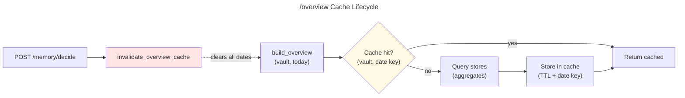

# C4 Code Level: Atlas Sidecar Test Suite

## Overview

- **Name**: Atlas Sidecar Endpoint Tests
- **Description**: Comprehensive test suite for the KennisBank Atlas sidecar FastAPI application, covering read-only endpoints, CORS validation, data aggregation, cache behavior, and the single write path (/memory/decide)
- **Location**: `atlas/sidecar/tests/` ([Repository](atlas/sidecar/tests))
- **Language**: Python (pytest)
- **Purpose**: Validates that the sidecar correctly aggregates local KennisBank stores (SQLite databases, markdown files, graphify output) and exposes them as JSON endpoints for the Tauri frontend, while maintaining read-only invariants and proper security boundaries

## Code Elements

### Test Configuration & Fixtures

#### Module: `conftest.py`
- **Purpose**: Shared test fixtures for building hermetic, deterministic KennisBank vaults in temporary directories
- **Location**: `atlas/sidecar/tests/conftest.py`
- **Dependencies**: pytest, pathlib, json, sqlite3

#### Fixture: `vault_factory(tmp_path: Path)`
- **Signature**: `vault_factory(*, nodes=None, links=None, docs=None, events=None, memories=None, usage=None, wiki=None) -> Path`
- **Purpose**: Builder that materializes a vault with synthesized stores and returns its root path
- **Location**: `atlas/sidecar/tests/conftest.py:98-121`
- **Responsibilities**:
  - Creates hermetic test vaults with minimal, deterministic data
  - Writes graph store (graphify-out/graph.json)
  - Writes kb-index.db (SQLite: docs metadata)
  - Writes kb-activity.db (SQLite: activity events)
  - Writes 09-memory/ directory (markdown memory fragments)
  - Writes kb-usage.db (SQLite: usage warmth scores)
  - Writes 02-wiki/ directory (markdown wiki articles)

#### Helper Functions (conftest.py)
- `_write_graph(vault: Path, nodes: list[dict], links: list[dict]) -> None` (lines 15-21)
- `_write_kbindex(vault: Path, docs: list[dict]) -> None` (lines 24-38)
- `_write_activity(vault: Path, events: list[dict]) -> None` (lines 41-59)
- `_write_memories(vault: Path, memories: list[dict]) -> None` (lines 62-75)
- `_write_usage(vault: Path, rows: list[dict]) -> None` (lines 78-94)

---

### Test Modules

#### Module: `test_health.py`
- **Purpose**: Validates GET /health endpoint contract (ADR-0004): status, version, vault path, and source readiness
- **Location**: `atlas/sidecar/tests/test_health.py`
- **Coverage**: 2 test functions

| Test Function | Signature | What It Guards | Location |
|---|---|---|---|
| `test_health_reports_status_and_sources()` | `(tmp_path: Path) -> None` | /health reports all required fields (status, vault, version, sources) with expected structure | lines 20-37 |
| `test_health_flags_present_graph_store()` | `(tmp_path: Path) -> None` | graph source readiness flag is True when graphify-out/graph.json exists | lines 40-47 |

#### Module: `test_cors.py`
- **Purpose**: Validates CORS headers for trusted origins (dev localhost and Tauri) while rejecting foreign origins
- **Location**: `atlas/sidecar/tests/test_cors.py`
- **Coverage**: 4 test functions
- **Security Invariant**: Only localhost dev (http://localhost:*) and Tauri origins (tauri.localhost, tauri://localhost) receive CORS headers; all others rejected

| Test Function | What It Guards | Location |
|---|---|---|
| `test_cors_allows_localhost_dev_origin()` | localhost:5177 (dev server) receives access-control-allow-origin header | lines 11-14 |
| `test_cors_allows_tauri_origin()` | https://tauri.localhost receives CORS header | lines 17-20 |
| `test_cors_allows_windows_tauri_http_origin()` | http://tauri.localhost (Windows WebView2 plain HTTP) receives CORS header | lines 23-28 |
| `test_cors_rejects_foreign_origin()` | https://evil.example.com does NOT receive access-control-allow-origin header | lines 31-34 |

#### Module: `test_asset.py`
- **Purpose**: Validates GET /asset?path= endpoint: serves vault images with path-traversal guards and extension validation
- **Location**: `atlas/sidecar/tests/test_asset.py`
- **Security Invariants**: 
  - Read-only, no file leaks
  - Reject path traversal (../)
  - Reject non-image extensions (fail-closed)
- **Coverage**: 3 test functions

| Test Function | What It Guards | Location |
|---|---|---|
| `test_asset_serves_image_with_content_type()` | Image files (PNG) are served with correct Content-Type header | lines 23-32 |
| `test_asset_rejects_traversal()` | Path traversal attempts (../) return 400 or 404 without leaking bytes | lines 35-38 |
| `test_asset_rejects_non_image()` | Non-image files (.md) return 400 status code | lines 41-45 |

#### Module: `test_doc.py`
- **Purpose**: Validates GET /doc?path= endpoint: serves vault markdown files with path-traversal and type guards
- **Location**: `atlas/sidecar/tests/test_doc.py`
- **Security Invariants**:
  - Read-only
  - Must stay within vault bounds
  - Must be .md files only (fail-closed)
  - No content leaks on error paths
- **Coverage**: 4 test functions

| Test Function | What It Guards | Location |
|---|---|---|
| `test_doc_returns_markdown_content()` | .md files are read and returned with status "ok" and content in body | lines 17-24 |
| `test_doc_rejects_path_traversal()` | Path traversal (../) returns 400/404; secret content not leaked | lines 27-32 |
| `test_doc_rejects_non_markdown()` | Non-.md files (.db, .txt) return 400 status | lines 35-40 |
| `test_doc_missing_file_404()` | Missing files return 404 | lines 43-45 |

#### Module: `test_recall.py`
- **Purpose**: Validates GET /recall?q=&k= endpoint: query waterfall (vector → FTS → RRF → rerank) with factor product verification
- **Location**: `atlas/sidecar/tests/test_recall.py`
- **Contract (ADR-0004)**: Reuses kb-recall; final ordering must match exactly; stages shape must be preserved
- **Coverage**: 7 test functions

| Test Function | What It Guards | Location |
|---|---|---|
| `test_recall_passes_query_and_preserves_final_order()` | Query and k parameters passed to recall function; final list order preserved exactly | lines 15-36 |
| `test_recall_waterfall_shape_and_factor_product()` | All four stages present; rerank factors multiply to final score (relevance × recency × importance × trust × usage) | lines 39-63 |
| `test_recall_fail_open_on_recall_error()` | Recall errors (Ollama down) return degraded status and empty final list, not exceptions | lines 66-74 |
| `test_recall_neighbor_entry_uses_graph_neighbor()` | Neighbor entry uses graph_neighbor() method, not deleted one_hop_neighbor() | lines 97-110 |
| `test_recall_neighbor_entry_none_when_graph_has_no_neighbor()` | Returns None when graph has no neighbor (not a crash) | lines 113-114 |
| `test_recall_neighbor_entry_skips_a_stem_already_in_final()` | Neighbor entry is None if stem already in final list (no duplicates) | lines 117-126 |

**Helper Classes** (test_recall.py):
- `_FakeKbRecall`: Mock kb-recall module with graph_neighbor() (no one_hop_neighbor) (lines 77-89)
- `_FakeEmb`: Mock embedding module with doc_text() method (lines 92-94)

#### Module: `test_readonly.py`
- **Purpose**: Validates TASK-27.2 DoD #4: sidecar endpoints do not mutate source stores (read-only invariant)
- **Location**: `atlas/sidecar/tests/test_readonly.py`
- **Invariant**: SQLite connections opened with ?mode=ro prevent writes physically; test asserts SHA256 hash of kb-activity.db unchanged after endpoint calls
- **Coverage**: 1 test function

| Test Function | What It Guards | Location |
|---|---|---|
| `test_endpoints_do_not_mutate_source_db()` | Endpoints /health, /graph, /timeline, /memory-health, /provenance do not modify kb-activity.db (hash unchanged) | lines 19-32 |

#### Module: `test_decide_overview.py`
- **Purpose**: Validates POST /memory/decide write path and GET /overview aggregation
- **Location**: `atlas/sidecar/tests/test_decide_overview.py`
- **Coverage**: 12 test functions
- **Important Notes**: 
  - decide is Atlas's single deliberate write (approve/reject unverified fragments)
  - /overview is TTL-cached; decide must invalidate the cache (TASK-91 AC#8)
  - Shared memory helper (_memory.decide) used when deployed scripts present; inline fallback otherwise

| Test Function | What It Guards | Location |
|---|---|---|
| `test_approve_promotes_unverified_to_current()` | POST /memory/decide with approve decision promotes status unverified → current | lines 24-29 |
| `test_approve_is_reflected_on_the_next_overview_fetch()` | decide invalidates /overview cache (TTL-based) so approve is reflected immediately | lines 32-44 |
| `test_reject_retracts_unverified()` | POST /memory/decide with reject decision sets status to retracted | lines 47-51 |
| `test_decide_only_touches_the_status_line()` | decide modifies only the "status:" line; body and other frontmatter preserved | lines 54-60 |
| `test_decide_rejects_non_unverified()` | decide returns 409 when trying to approve/reject a non-unverified fragment | lines 63-67 |
| `test_decide_rejects_unknown_stem_and_bad_decision()` | Unknown stem returns 404; invalid decision ("delete") returns 400 | lines 70-74 |
| `test_decide_rejects_path_traversal()` | Path traversal in stem (../, a/b, ..\\evil) returns 400 | lines 77-81 |
| `test_overview_aggregates_all_stores()` | /overview collects wiki status counts, memory status counts, inbox, raw sessions, provenance | lines 84-112 |
| `test_overview_fail_open_on_empty_vault()` | /overview returns status "ok" with zero counts when vault is empty (not an error) | lines 115-119 |
| `test_supersede_chain_normalises_wikilink_refs_and_flags_missing()` | Supersede chains normalize wikilink refs ([[new]] → "new") and flag missing targets | lines 122-130 |
| `test_decide_uses_shared_memory_helper_when_deployed()` | When .claude/scripts/ present (deployed), decide delegates to _memory.decide helper (audit log proof) | lines 131-147 |
| `test_decide_falls_back_inline_without_vault_scripts()` | Older vaults without .claude/scripts/ use inline fallback (no audit log written) | lines 150-157 |

#### Module: `test_graph.py`
- **Purpose**: Validates GET /graph endpoint: collapses graphify fragment-level graph to file-level wiki/memory nodes with metadata
- **Location**: `atlas/sidecar/tests/test_graph.py`
- **Coverage**: 5 test functions
- **Contract (ADR-0004)**: File-level nodes with layer/status/title from kb-index; file-level links; degree counts; optional memory nodes

| Test Function | What It Guards | Location |
|---|---|---|
| `test_graph_collapses_fragments_to_file_nodes()` | Fragment nodes folded into file nodes; fragment edges collapse to file edges; self-loops dropped | lines 21-59 |
| `test_graph_joins_absolute_docs_path_to_relative_node()` | kb-index absolute OS paths joined to vault-relative POSIX graphify paths (normalization) | lines 62-81 |
| `test_graph_joins_usage_warmth()` | kb-usage data joined to nodes as "warmth" field (used count) | lines 84-90 |
| `test_graph_include_memory_adds_typed_nodes()` | include_memory=True adds memory nodes with metadata (memory_type, importance, valid_until) and memory links | lines 93-115 |
| `test_graph_fail_open_without_stores()` | Missing stores return status "empty" with empty nodes and links (not an error) | lines 118-122 |

#### Module: `test_graphify_html.py`
- **Purpose**: Validates GET /graphify-html endpoint: serves graphify-out/graph.html with proper content type
- **Location**: `atlas/sidecar/tests/test_graphify_html.py`
- **Coverage**: 3 test functions

| Test Function | What It Guards | Location |
|---|---|---|
| `test_graphify_html_served_with_content_type()` | graph.html returned with 200, text/html content-type, exact body | lines 19-28 |
| `test_graphify_html_head_probe()` | HEAD /graphify-html returns 200 (lens probes with HEAD before embedding) | lines 31-39 |
| `test_graphify_html_missing_is_404()` | Missing graph.html returns clean 404 (lens shows degraded message) | lines 42-44 |

#### Module: `test_memory_health.py`
- **Purpose**: Validates GET /memory-health endpoint: counts, unverified queue, supersede chains, heatmap (importance × age), warmth/temperature
- **Location**: `atlas/sidecar/tests/test_memory_health.py`
- **Coverage**: 6 test functions
- **Determinism**: "today" date injected for age/temperature assertions

| Test Function | What It Guards | Location |
|---|---|---|
| `test_memory_health_endpoint_shape()` | /memory-health response has counts, queue, supersede_chains, heatmap, warmth, quarantine fields | lines 29-37 |
| `test_queue_is_unverified_sorted_by_importance()` | Unverified queue sorted by importance (descending) | lines 40-48 |
| `test_supersede_chain_carries_valid_until()` | Supersede chains carry valid_until from fragment frontmatter | lines 51-59 |
| `test_heatmap_places_active_memory_by_importance_and_age()` | Heatmap cells have {id, importance, age_days} | lines 62-66 |
| `test_warmth_temperature_by_last_used()` | Warmth assigns temperature (warm/tepid/stale) by last_used date relative to today | lines 69-80 |
| `test_memory_health_fail_open_without_memory_dir()` | Missing memory dir returns status "empty" with zero counts (not an error) | lines 83-86 |

#### Module: `test_memory_links.py`
- **Purpose**: Validates GET /memory-links endpoint: links each memory fragment to nearest wiki article (no re-embed, no rerank)
- **Location**: `atlas/sidecar/tests/test_memory_links.py`
- **Coverage**: 2 test functions

| Test Function | What It Guards | Location |
|---|---|---|
| `test_memory_links_fail_open_without_index()` | Missing index returns status "empty" with empty links and counts (not an error) | lines 14-18 |
| `test_memory_links_shape_via_injection()` | Links are {memory_stem: wiki_path}; counts are consistent with links (counter matches) | lines 21-34 |

#### Module: `test_overview_cache.py`
- **Purpose**: Validates /overview TTL cache keys on effective date (today), not just vault
- **Location**: `atlas/sidecar/tests/test_overview_cache.py`
- **Context (TASK-187)**: `today` shapes freshness buckets, memory heatmap; cache keyed on vault alone would serve wrong payload
- **Coverage**: 3 test functions

| Test Function | What It Guards | Location |
|---|---|---|
| `test_two_dates_within_ttl_get_distinct_payloads()` | Two dates in same TTL get different freshness bucket payloads (age-dependent) | lines 19-24 |
| `test_same_date_within_ttl_still_hits_the_cache()` | Same date within TTL returns cached object (same object reference) | lines 27-32 |
| `test_invalidate_drops_every_date_entry_for_the_vault()` | _invalidate_overview_cache() drops all cached dates for a vault | lines 35-40 |

#### Module: `test_overview_extras.py`
- **Purpose**: Validates /overview heatmap (daily activity aggregation), freshness buckets, and /titles endpoint
- **Location**: `atlas/sidecar/tests/test_overview_extras.py`
- **Coverage**: 6 test functions
- **Context (TASK-91)**: Pure GET, aggregated in SQL (no per-doc reads at render time)

| Test Function | What It Guards | Location |
|---|---|---|
| `test_overview_heatmap_counts_events_per_day()` | Heatmap aggregates activity_events by day (event_time); counts match expected | lines 20-36 |
| `test_overview_heatmap_failopen_without_activity_db()` | Missing activity DB returns empty heatmap array (not an error) | lines 39-43 |
| `test_overview_freshness_buckets()` | Freshness sorts docs into buckets: d7 (≤7d), d30, d90, older, unknown (no updated field) | lines 46-62 |
| `test_titles_index_from_kbindex()` | /titles returns items {title, layer, path} from kb-index | lines 65-78 |
| `test_titles_failopen_without_index()` | Missing index returns status "empty" with empty items (not an error) | lines 81-85 |

#### Module: `test_perf.py`
- **Purpose**: Validates performance invariant: /timeline aggregation sub-1000ms at scale (TASK-27.11 DoD #1)
- **Location**: `atlas/sidecar/tests/test_perf.py`
- **Coverage**: 1 test function
- **Baseline**: Real vault: 11198 events → 0.76s; /graph 1106 raw → 95 nodes

| Test Function | What It Guards | Location |
|---|---|---|
| `test_timeline_aggregation_under_budget()` | 4000 events aggregated to buckets in < 1.0 second | lines 13-33 |

#### Module: `test_provenance.py`
- **Purpose**: Validates GET /provenance endpoint: kb-lint-style provenance coverage (sourced articles carry wikilink to raw-sessie or 05-bronnen)
- **Location**: `atlas/sidecar/tests/test_provenance.py`
- **Coverage**: 2 test functions
- **Contract (ADR-0004)**: Rendered as overlay on Graph lens (TASK-27.9)

| Test Function | What It Guards | Location |
|---|---|---|
| `test_provenance_coverage_and_unsourced_list()` | Coverage counts {sourced, unsourced, total}; unsourced list includes reason | lines 18-31 |
| `test_provenance_fail_open_without_wiki()` | Missing wiki dir returns status "empty" with zero coverage (not an error) | lines 34-37 |

#### Module: `test_timeline.py`
- **Purpose**: Validates GET /timeline?bucket= endpoint: server-side aggregation of activity_events by day/week (bi-temporal: event_time and captured_at)
- **Location**: `atlas/sidecar/tests/test_timeline.py`
- **Coverage**: 2 test functions
- **Contract (ADR-0004)**: Buckets report event_count (by event_time), capture_count (by captured_at), by_kind (event dimension)

| Test Function | What It Guards | Location |
|---|---|---|
| `test_timeline_day_buckets_counts_and_kinds()` | Day buckets have event_count, capture_count, by_kind; chronologically ordered | lines 19-45 |
| `test_timeline_fail_open_without_db()` | Missing activity DB returns status "empty" with empty buckets (not an error) | lines 48-51 |

#### Module: `test_doctor.py`
- **Purpose**: Validates atlas/doctor.py utility: reports readiness and exits cleanly (TASK-27.10 DoD #2)
- **Location**: `atlas/sidecar/tests/test_doctor.py`
- **Coverage**: 2 test functions
- **Subprocess Tests**: Runs doctor.py as external process with KENNISBANK_VAULT env var

| Test Function | What It Guards | Location |
|---|---|---|
| `test_doctor_runs_and_summarises()` | doctor.py exits 0 and prints "samenvatting" summary; cargo absence non-fatal | lines 10-20 |
| `test_doctor_reports_missing_vault_store_as_warning()` | Missing vault stores reported as warnings (not hard failures) in stdout | lines 23-29 |

---

## Dependencies

### Internal Dependencies

**Sidecar Application Modules**:
- `atlas.sidecar.app`: FastAPI application factory and route handlers
  - `create_app(vault, *, ollama_probe, recall_fn, links_fn)` - App factory injected with vault path and optional probes
  - Routes tested: /health, /cors, /asset, /doc, /recall, /graph, /graphify-html, /memory-health, /memory-links, /overview, /titles, /timeline, /provenance, /memory/decide

- `atlas.sidecar.sources`: Read-only store readers
  - `_connect_ro(db_path)` - Read-only SQLite connection
  - `_rel_key(vault, path)` - Path normalization (absolute → vault-relative POSIX)
  - `_parse_frontmatter(text)` - YAML frontmatter extraction
  - `kbindex_docs(vault)` - Load kb-index.db docs metadata
  - `load_graph(vault)` - Load graphify-out/graph.json
  - `usage_warmth(vault)` - Load kb-usage.db usage scores
  - `build_graph(vault, include_memory)` - Collapse graphify to file-level nodes
  - `build_memory_health(vault, today)` - Aggregate memory stats
  - `build_memory_links(vault)` - Link memories to wiki articles
  - `build_overview(vault, today)` - Aggregate all stores
  - `build_timeline(vault, bucket)` - Aggregate activity by time bucket
  - `build_provenance(vault)` - Analyze sourced articles
  - `recall_waterfall(vault, query, top_k)` - Query recall with stages

**Vault Helpers** (atlas/doctor.py):
- `atlas.doctor`: CLI utility for vault readiness

### External Dependencies

**Direct Python Packages**:
- `pytest` - Test framework, fixtures
- `fastapi` - Web framework tested (create_app, routing)
- `fastapi.testclient` - TestClient for endpoint calls
- `sqlite3` - Query read-only store databases
- `pathlib` - Path manipulation
- `json` - Parse graph.json, responses
- `hashlib` - Verify read-only invariant (SHA256)
- `subprocess` - Run doctor.py as subprocess
- `datetime` - Date-based assertions (age, temperature)
- `time` - Performance measurement (perf_counter)

**Runtime Dependencies** (tested indirectly):
- `httpx` - Ollama probe in app.py (http://127.0.0.1:11434/api/version)
- `Ollama` (optional) - Live recall waterfall requires local instance on port 11434
- Python 3.10+ (type hints, match statements)

---

## Relationships

### Test-to-Route Coverage Matrix

```mermaid
---
title: Atlas Sidecar Test Coverage by Route
---
flowchart LR
    subgraph Endpoints["FastAPI Routes"]
        health["/health"]
        cors_check["CORS Middleware"]
        asset["/asset"]
        doc["/doc"]
        recall["/recall"]
        decide["/memory/decide"]
        overview["/overview"]
        titles["/titles"]
        graph["/graph"]
        graphify_html["/graphify-html"]
        mem_health["/memory-health"]
        mem_links["/memory-links"]
        timeline["/timeline"]
        provenance["/provenance"]
    end

    subgraph Stores["Source Stores"]
        kbindex["kb-index.db"]
        activity["kb-activity.db"]
        usage["kb-usage.db"]
        memory["09-memory/"]
        wiki["02-wiki/"]
        graphify["graphify-out/"]
        media["07-media/"]
    end

    subgraph Tests["Test Modules"]
        test_health["test_health.py"]
        test_cors["test_cors.py"]
        test_asset["test_asset.py"]
        test_doc["test_doc.py"]
        test_recall["test_recall.py"]
        test_decide["test_decide_overview.py"]
        test_graph["test_graph.py"]
        test_html["test_graphify_html.py"]
        test_mhealth["test_memory_health.py"]
        test_mlinks["test_memory_links.py"]
        test_perf["test_perf.py"]
        test_readonly["test_readonly.py"]
        test_ocache["test_overview_cache.py"]
        test_oextras["test_overview_extras.py"]
        test_prov["test_provenance.py"]
        test_timeline["test_timeline.py"]
    end

    test_health -->|GET| health
    test_cors -->|CORS| cors_check
    test_asset -->|GET ?path| asset
    test_doc -->|GET ?path| doc
    test_recall -->|GET ?q,k| recall
    test_decide -->|POST| decide
    test_decide -->|GET| overview
    test_graph -->|GET| graph
    test_html -->|GET/HEAD| graphify_html
    test_mhealth -->|GET| mem_health
    test_mlinks -->|GET| mem_links
    test_oextras -->|GET| overview
    test_oextras -->|GET| titles
    test_prov -->|GET| provenance
    test_timeline -->|GET ?bucket| timeline

    health -->|reads| media
    overview -->|aggregates| kbindex
    overview -->|aggregates| activity
    overview -->|aggregates| memory
    overview -->|aggregates| usage
    overview -->|aggregates| wiki
    decide -->|writes| memory
    graph -->|reads| graphify
    graph -->|joins| kbindex
    graph -->|joins| usage
    mem_health -->|reads| memory
    mem_links -->|queries| kbindex
    recall -->|queries| kbindex
    timeline -->|aggregates| activity
    provenance -->|scans| wiki
    titles -->|reads| kbindex

    test_readonly -.->|verifies| activity
    test_perf -.->|measures| timeline
```

### State Management: Overview Cache Invalidation



### Read-Only Invariant Enforcement

All endpoints adhere to read-only contract via:
1. SQLite connections: `sqlite3.connect(f"file:{db_path}?mode=ro", uri=True)` - prevents writes at filesystem level
2. Path traversal guards: `_rel_key()` normalization + validation (fail-closed)
3. File type guards: extension checking (.md, .png only)
4. No transitive writes: decide writes only 09-memory/ markdown, never touches stores

---

## Test Execution Flow

### Fixture Initialization
1. `tmp_path` created by pytest
2. `vault_factory` materializes stores via helpers:
   - Calls appropriate `_write_*` functions based on parameters
   - Each helper creates SQLite DB or markdown files
3. `create_app(vault)` initialized in each test with factory vault
4. `TestClient(app)` wraps app for HTTP simulation

### Fail-Open Pattern (All Aggregation Endpoints)
All endpoints follow this pattern:
```python
try:
    # Query store (DB or filesystem)
    result = fetch_data()
except Exception:
    # Return empty-but-valid result
    return {"status": "empty", "data": []}
```

### Injection Pattern (Recall, Memory Links)
For deterministic testing of waterfall order and shape:
```python
app = create_app(vault, recall_fn=fake_fn, links_fn=fake_fn)
# Endpoint calls injected function, not real Ollama
```

---

## Notes

### Design Principles
- **Hermetic**: Tests synthesize minimal, deterministic data; no dependency on real KennisBank vault
- **Fail-Open**: Missing stores return valid empty responses, never 500 errors (resilience)
- **Read-Only Verified**: Hash-based assertion on kb-activity.db post-endpoint calls (TASK-27.2 DoD #4)
- **Deterministic Dates**: `today` parameter injected to age/temperature calculations (no flaky tests)
- **Cross-Origin Locked**: CORS regex validates origin before CORS headers emitted (security)
- **Single Write Path**: Only /memory/decide writes (exactly one .md file); all else read-only

### Critical Contracts (ADR-0004)
1. **Graph Collapse**: Fragment-level graphify graph → file-level nodes with kb-index metadata
2. **Waterfall Order**: Recall stages (vector, FTS, RRF, rerank) output must preserve order and factor products
3. **Bi-Temporal Timeline**: Both event_time (when occurred) and captured_at (when logged) aggregated separately
4. **Cache Keying**: /overview cache keys on (vault, date); date invalidation required on decide

### Notable Implementation Details
- `_FakeKbRecall` in test_recall.py: Deliberately omits `one_hop_neighbor` to catch regressions (TASK-93 PR review)
- `monkeypatch` used in test_decide_overview.py to inject build_memory_links mock (memory + wiki linkage)
- Subprocess test (test_doctor.py): Validates CLI as external process (KENNISBANK_VAULT env var resolution)
- Path normalization: Windows OS separators + absolute paths normalized to vault-relative POSIX (test_graph.py)

### Performance Baseline
- **4000 events → <1.0s** aggregation (test_perf.py line 33)
- **Real vault**: 11198 events → 0.76s; 1106 graphify nodes → 95 file nodes (atlas/docs/perf-eval.md)
