# C4 Code Level: Atlas Sidecar

## Overview

- **Name**: Atlas Sidecar (TASK-27.2)
- **Description**: A localhost-only FastAPI application that serves the Atlas front-end by reading KennisBank's local stores (SQLite databases, markdown files, graphify output) and exposing them as JSON endpoints. Read-only and fail-open: missing stores yield empty-but-valid results, never errors.
- **Location**: [`atlas/sidecar/`](../../atlas/sidecar/)
- **Language**: Python 3.10+
- **Purpose**: Provide a local HTTP API for the Atlas front-end to query KennisBank vault data (wiki, memory, activity, provenance, graph topology, recall results) without outbound network except to localhost Ollama for live search. No mutations except memory-fragment approval/rejection.

## Architectural Constraints

- **Localhost-only**: Binds `127.0.0.1` only; rejects all other origins. CORS allows dev localhost ports and Tauri WebView origins (tauri://localhost, http://tauri.localhost).
- **Read-only enforcement**: All SQLite connections opened with `?mode=ro` URI parameter; physical enforcement of read-only contract (TASK-27.2 DoD #4).
- **Fail-open**: Missing stores (db files, directories) degrade individual endpoints, not the app. Missing Ollama returns empty recall stages.
- **Vault resolution**: Vault root comes from `KENNISBANK_VAULT` env or `--vault` CLI arg, never hardcoded (ADR-0002).
- **No outbound network except Ollama**: All data is local; recall waterfall calls only `http://127.0.0.1:11434/` (local Ollama) for a health check and embedding via `_embeddings` module loaded from the vault's `.claude/scripts/`.

## Entry Point

**File**: [`atlas/sidecar/__main__.py`](../../atlas/sidecar/__main__.py)

```python
main() -> None
```

- **Responsibility**: CLI entry point; resolves vault root, allocates ephemeral port, and runs `create_app(vault)` via uvicorn.
- **Port negotiation**: Binds `127.0.0.1` on an ephemeral port (0 = OS assigns), then prints `ATLAS_PORT <port>` to stdout so the Tauri shell can read it (TASK-27.3).
- **Vault resolution** (`_resolve_vault(cli_vault: str | None) -> Path`):
  - Accepts `--vault` CLI argument, falls back to `KENNISBANK_VAULT` env, raises `SystemExit` if neither is set.
- **Port negotiation** (`_free_port() -> int`):
  - Binds an ephemeral socket to `127.0.0.1:0`, retrieves the assigned port, closes the socket.

**Lines**: 8–52 in `__main__.py`

---

## HTTP Routes and API Contract

All routes return JSON. Timestamps are ISO 8601. Paths are vault-relative POSIX.

### Health & Status

#### `GET /health`

**Response**: `{status, version, vault, sources}`

- **status** (`"ok" | "degraded" | "empty"`): Aggregate of `sources`.
- **version** (str): Sidecar version (currently `"0.1.0"`).
- **vault** (str): Absolute vault path.
- **sources** (dict): Readiness flags for each data source:
  - `kb_index` (bool): kb-index.db exists
  - `activity` (bool): kb-activity.db exists
  - `usage` (bool): kb-usage.db exists
  - `memory` (bool): 09-memory/ is a directory
  - `graph` (bool): graphify-out/graph.json exists
  - `ollama` (bool): HTTP `GET http://127.0.0.1:11434/api/version` returns 200

**Function**: `health()` in app.py:96–103
**Data source**: `_source_readiness(vault, ollama_probe)` in app.py:46–55

---

### Graph & Topology

#### `GET /graph?include_memory=false`

**Response**: `{status, nodes, links}`

- **status** (`"ok" | "empty"`): Presence of nodes.
- **nodes** (list of dict):
  ```json
  {
    "id": "02-wiki/article.md" or "09-memory/fragment.md",
    "label": "article.md" (filename),
    "kind": "wiki" | "memory",
    "layer": "wiki" | "memory" | frontmatter layer override,
    "node_status": "active" | "concept" | "archived" | …,
    "community": int | null (graphify cluster id),
    "community_name": str | null (graphify cluster label),
    "memory_type": null | "feit" | "insight" | … (frontmatter; null for wiki),
    "importance": 0.0 (coerced [1..5] for memory; 0 for wiki),
    "warmth": float (usage count from kb-usage.db),
    "created": "2024-01-15" | null (ISO date from kb-index or frontmatter),
    "valid_from": null (wiki) | "2024-01-15" (memory frontmatter),
    "valid_until": null (wiki) | "2025-01-15" (memory frontmatter),
    "degree": int (edge count)
  }
  ```
- **links** (list of dict):
  ```json
  {
    "source": "02-wiki/article.md",
    "target": "02-wiki/other.md",
    "rel": "relation type from graphify",
    "weight": 1.5 (aggregated; multiple graph-level edges collapse to one file-level edge)
  }
  ```

**Query parameter**: `include_memory` (default `false`, TASK-27.16):
  - `false`: Wiki-only nodes (fast).
  - `true`: Add 09-memory fragments as nodes with edges to their target wiki articles (from `build_memory_links`).

**Function**: `graph(include_memory)` in app.py:105–107
**Data source**: `build_graph(vault, include_memory)` in sources.py:95–173

---

### Timeline & Activity

#### `GET /timeline?bucket=day&from=2024-01-01&to=2024-01-31&dimension=event`

**Response**: `{status, buckets}`

- **status** (`"ok" | "empty"`): Presence of buckets.
- **buckets** (list of dict):
  ```json
  {
    "start": "2024-01-01T00:00:00",
    "end": "2024-01-02T00:00:00",
    "event_count": int (activity_events rows whose event_time falls in [start, end)),
    "capture_count": int (rows whose captured_at falls in [start, end)),
    "by_kind": {"activity": 3, "session": 2, …} (activity_kind aggregation)
  }
  ```

**Query parameters**:
- `bucket` (default `"day"`): `"day"` or `"week"` (week = ISO Monday–Sunday).
- `from` (optional, default `null`): ISO date; filter on `dimension` >= from.
- `to` (optional, default `null`): ISO date; filter on `dimension` <= to.
- `dimension` (default `"event"`): `"event"` (event_time) or `"capture"` (captured_at) for range filtering.

**Function**: `timeline(bucket, frm, to, dimension)` in app.py:109–115
**Data source**: `build_timeline(vault, bucket, frm, to, dimension)` in sources.py:230–288

---

### Memory Health Cockpit

#### `GET /memory-health`

**Response**: `{status, counts, queue, supersede_chains, heatmap, warmth, quarantine}`

- **status** (`"ok" | "empty"`): Presence of 09-memory.
- **counts** (dict):
  ```json
  {
    "active": int (status in [current, active]),
    "quarantined": int,
    "superseded": int,
    "unverified": int (approval queue)
  }
  ```
- **queue** (list of dict, sorted by importance DESC, created ASC, id ASC):
  ```json
  [
    {"id": "fragment_stem", "importance": 3, "created": "2024-01-15"}
  ]
  ```
- **supersede_chains** (list of dict):
  ```json
  [
    {
      "head": "memory_stem_1",
      "chain": ["memory_stem_1", "memory_stem_2", "memory_stem_3"],
      "missing": ["memory_stem_3"] (targets not found as files),
      "valid_until": "2025-06-30" | null
    }
  ]
  ```
- **heatmap** (list of dict): Importance × age for active memories (used by viz).
  ```json
  [{"id": "stem", "importance": 3, "age_days": 45}]
  ```
- **warmth** (list of dict, sorted by usage DESC):
  ```json
  [
    {
      "path": "09-memory/fragment.md" or "02-wiki/article.md",
      "warmth": 12.0 (usage count),
      "last_used": "2024-08-15",
      "temperature": "warm" | "tepid" | "stale" (age-based: ≤30d, ≤90d, >90d)
    }
  ]
  ```
- **quarantine** (list of dict):
  ```json
  [{"id": "stem", "reason": "quarantine_reason from frontmatter"}]
  ```

**Function**: `memory_health()` in app.py:117–119
**Data source**: `build_memory_health(vault, today)` in sources.py:338–418
**Injected for tests**: `today: date | None` (default today)

---

### Overview Dashboard

#### `GET /overview`

**Response**: `{status, wiki, memory, memory_status, raw, inbox_waiting, provenance, graph_stale, heatmap, freshness}`

Cached (TTL 30s per vault per date, TASK-91 AC#8).

- **status**: `"ok"`.
- **wiki** (dict):
  ```json
  {
    "total": int,
    "by_status": {"actief": 5, "concept": 2, "stabiel": 1, "archief": 0, "onbekend": 0}
  }
  ```
- **memory** (dict): Counts from `build_memory_health`.
- **memory_status** (`"ok" | "empty"`): Whether 09-memory exists.
- **raw** (dict):
  ```json
  {
    "sessies": int (01-raw/sessies/*.md file count),
    "transcripts": int (01-raw/transcripts/ file count)
  }
  ```
- **inbox_waiting** (int): 00-inbox/ file count (input backlog).
- **provenance** (dict):
  ```json
  {
    "sourced": int,
    "total": int
  }
  ```
- **graph_stale** (bool): Whether graphify-out/.needs-rebuild exists.
- **heatmap** (list): Activity buckets for the last 365 days (one SQL GROUP BY, O(1) render).
- **freshness** (dict): Wiki-article age buckets.
  ```json
  {
    "d7": int (updated ≤7d ago),
    "d30": int (≤30d),
    "d90": int (≤90d),
    "older": int (>90d),
    "unknown": int (unparseable date)
  }
  ```

**Performance note**: Cold build includes `build_provenance` (~12s on real vault; kb-lint re-runs over 01-raw), `build_memory_health` (~0.65s), and `_activity_heatmap` (~34ms). TTL cache drops repeat views to low-ms; first render still pays full cost. Real fix tracked separately (kb-lint scoping).

**Function**: `overview()` in app.py:121–123
**Data source**: `build_overview(vault, today)` in sources.py:963–992 (cached wrapper) → `_build_overview_uncached(vault, today)` in sources.py:995–1049

---

### Document & Content Retrieval

#### `GET /titles`

**Response**: `{status, items}`

- **status** (`"ok" | "empty"`): Presence of kb-index.
- **items** (list of dict, sorted by title):
  ```json
  [
    {"title": "Article Title", "path": "02-wiki/article.md", "layer": "wiki"}
  ]
  ```

Used by Cmd+K palette (TASK-91 F2); loaded once per session client-side.

**Function**: `titles()` in app.py:125–127
**Data source**: `list_titles(vault)` in sources.py:1052–1070

---

#### `GET /doc?path=02-wiki/article.md`

**Response**: `{status, path, title, content}`

- **status**: `"ok"`.
- **path**: Vault-relative POSIX path.
- **title**: First `# ` heading in the document, or filename stem if absent.
- **content**: Full markdown text.

**Validation** (fail-closed):
- Rejects non-.md paths.
- Resolves path and checks containment (prevents traversal escapes).

**Function**: `doc(path)` in app.py:142–147
**Data source**: `read_doc(vault, rel_path)` in sources.py:598–620

---

#### `GET /asset?path=02-wiki/image.png`

**Response**: File with appropriate `Content-Type`.

**Supported types**: `.png`, `.jpg`, `.jpeg`, `.gif`, `.webp`, `.svg`.

**Validation** (fail-closed):
- Rejects unknown extensions.
- Resolves path and checks containment.

**Function**: `asset(path)` in app.py:149–155
**Data source**: `resolve_asset(vault, rel_path)` in sources.py:629–641

---

### Graph Visualization (Graphify)

#### `GET /graphify-html` | `HEAD /graphify-html`

**Response**: Self-contained interactive graph HTML (text/html) from graphify-out/graph.html.

**Purpose**: Serves the self-contained interactive graph page that the graphify pipeline writes; the Graphify lens embeds it in an iframe.

**Explicit HEAD support**: The Graphify lens probes with HEAD before embedding; FastAPI's `@app.get` alone answers HEAD with 405, so this route uses `@app.api_route(methods=["GET", "HEAD"])`.

**Function**: `graphify_html()` in app.py:159–169

---

### Search & Recall (Live & Waterfall Inspector)

#### `GET /recall?q=search+query&k=3`

**Response**: `{status, query, stages, final}`

- **status** (`"ok" | "empty" | "degraded"`): Result presence or Ollama/index unavailable.
- **query** (str): The original query string.
- **stages** (dict, placeholder for future expansion):
  ```json
  {
    "vector": [],
    "fts": [],
    "rrf": [],
    "rerank": []
  }
  ```
- **final** (list of dict):
  ```json
  [
    {
      "path": "02-wiki/article.md",
      "score": 0.542,
      "snippet": "first 200 chars of content…"
    }
  ]
  ```

**Fail-open**: Missing Ollama or index returns `{status: "degraded", query, stages, final: []}`.

**Function**: `recall(q, k)` in app.py:171–173
**Data source**: `live_recall(vault, query, k)` in sources.py:553–587 (simple: embeds query once, calls `kb-recall.recall_hits`).

---

#### `GET /recall?q=…&k=8` (Advanced: Full Waterfall Inspector, TASK-27.8)

**Extended response** (when invoked, e.g., in dev tools or future inspector UI):

```json
{
  "status": "ok",
  "query": "search query",
  "stages": {
    "vector": [{"path": "02-wiki/a.md", "score": 0.95}, …],
    "fts": [{"path": "02-wiki/b.md", "score": 0.78}, …],
    "rrf": [{"path": "02-wiki/c.md", "score": 0.87}, …],
    "rerank": [
      {
        "path": "02-wiki/article.md",
        "score": 0.542,
        "factors": {
          "relevance": 0.87,
          "recency": 0.8,
          "importance": 0.9,
          "trust": 1.0,
          "usage": 0.75,
          "final": 0.542
        }
      }
    ]
  },
  "final": [
    {
      "path": "02-wiki/article.md",
      "score": 0.542,
      "snippet": "…",
      "neighbor": false
    }
  ]
}
```

**Function**: `recall_waterfall(vault, query, k)` in sources.py:670–796
  - Reuses vault's `_embeddings`, `_kbindex`, `_rank`, `kb_recall`, `_usage` modules (same building blocks as production hook, data-parity by construction).
  - Surfaces intermediate stages: vector-KNN, FTS, RRF fusion, rerank factors.
  - Appends graph-neighbour expansion if available.

---

### Memory Linking (Fragment → Wiki Mapping)

#### `GET /memory-links`

**Response**: `{status, links, counts, types}`

- **status** (`"ok" | "empty" | "degraded"`): Presence of links or failure.
- **links** (dict): `{fragment_stem: "02-wiki/article.md"}` (fragment's target wiki article).
- **counts** (dict): `{"02-wiki/article.md": 3}` (how many fragments link to each article).
- **types** (dict): `{fragment_stem: "feit" | "insight"}` (memory_type from frontmatter).

**Design**: Full waterfall linking would re-embed all fragments (~12 min on real vault). Instead, uses stored embeddings (vector-KNN to wiki layer) fused (RRF) with FTS on fragment text. Cached in-process for the sidecar process lifetime.

**Background cache warm**: On first app startup (if kb-index.db exists), spawns a daemon thread to pre-compute `build_memory_links` so the overlay is ready when opened (~47s).

**Function**: `memory_links()` in app.py:175–181
**Data source**: `build_memory_links(vault, use_cache=True)` in sources.py:829–900
**In-process cache**: `_MEMORY_LINKS_CACHE` in sources.py:801

---

### Provenance & Source Coverage

#### `GET /provenance`

**Response**: `{status, coverage, unsourced}`

- **status**: `"ok"` | `"empty"`.
- **coverage** (dict):
  ```json
  {
    "sourced": int (articles with herkomst),
    "unsourced": int,
    "total": int
  }
  ```
- **unsourced** (list of dict):
  ```json
  [
    {
      "path": "02-wiki/article.md",
      "reason": "missing [[raw-sessie-...]] or [[05-bronnen/...]] wikilink",
      "types": ["dangling", "path-only"] (kb-lint warning types if available)
    }
  ]
  ```

**Data-parity** (TASK-27.9 DoD #1): Prefers the vault's `kb-lint` module if available; falls back to heuristic (looks for herkomst wikilinks).

**Function**: `provenance()` in app.py:138–140
**Data source**: `build_provenance(vault)` in sources.py:468–492

---

### Memory Approval/Rejection (The One Write Path)

#### `POST /memory/decide` (JSON body)

**Request body**:
```json
{
  "stem": "fragment_name",
  "decision": "approve" | "reject"
}
```

**Response**: `{status, stem, new_status}`

- **status**: `"ok"`.
- **stem** (str): The fragment name.
- **new_status** (str): `"current"` (approve) or `"retracted"` (reject).

**Semantics**:
- Only `unverified` fragments can be decided.
- `approve` → status becomes `current`.
- `reject` → status becomes `retracted`.

**Implementation** (TASK-89 shared codepath):
- First tries to load the vault's `_memory.decide()` (if present, ADR-27.18) for centralized logic, guards, crash-safe ordering, and audit logging.
- Falls back to inline implementation if vault module unavailable.

**Guard checks**:
- No `/`, `\`, or `..` in stem (path traversal).
- Target must be inside 09-memory/.
- File must exist.
- Frontmatter must have `status: unverified`.

**Side effect**: Invalidates the `/overview` cache so the next dashboard fetch shows the change.

**Function**: `memory_decide(payload)` in app.py:129–136
**Data source**: `decide_memory(vault, stem, decision)` in sources.py:1083–1129

---

## Code Elements (Functions & Utilities)

### App Factory

#### `create_app(vault: Path, *, ollama_probe: Callable[[], bool] = _default_ollama_probe, recall_fn: Callable[[str, int], dict] | None = None, links_fn: Callable[[], dict] | None = None) -> FastAPI`

**Location**: app.py:67–192

**Responsibility**: FastAPI app factory. Injects the vault and optional test doubles, configures CORS middleware, and registers all routes.

**Parameters**:
- `vault` (Path): Vault root (absolute).
- `ollama_probe` (callable, default `_default_ollama_probe`): Returns bool; checks Ollama liveness.
- `recall_fn` (callable, default `None`): Optional test double for `/recall`; if `None`, uses `sources.recall_waterfall`.
- `links_fn` (callable, default `None`): Optional test double for `/memory-links`; if `None`, uses `sources.build_memory_links`.

**CORS Configuration**:
- Allows `GET` and `POST` (only POST route is `/memory/decide`).
- Origin regex: localhost (dev), `127.0.0.1`, Tauri webview origins (tauri://localhost, http://tauri.localhost).

**Background startup**: If `links_fn` is not overridden and kb-index.db exists, spawns a daemon thread to pre-warm `build_memory_links` cache.

---

### Data Source Readers (Read-Only)

#### `_connect_ro(db_path: Path) -> sqlite3.Connection | None`

**Location**: sources.py:16–24

**Responsibility**: Opens a SQLite connection in read-only mode (`?mode=ro` URI) or returns `None` if the file doesn't exist or opening fails.

**Parameters**:
- `db_path` (Path): Path to .db file.

**Returns**: `sqlite3.Connection` with `row_factory = sqlite3.Row`, or `None`.

---

#### `kbindex_docs(vault: Path) -> dict[str, dict]`

**Location**: sources.py:41–54

**Responsibility**: Maps vault-relative POSIX paths to `{layer, status, title, created}` from kb-index.db.

**Returns**: Dict or empty `{}` on failure.

**Example**:
```python
{
  "02-wiki/article.md": {"layer": "wiki", "status": "current", "title": "Article Title", "created": "2024-01-15"},
  "09-memory/fragment.md": {"layer": "memory", "status": "current", "title": "", "created": "2024-01-20"}
}
```

---

#### `load_graph(vault: Path) -> dict`

**Location**: sources.py:57–66

**Responsibility**: Loads raw graphify graph.json (`{nodes, links}`), or returns empty on failure.

---

#### `usage_warmth(vault: Path) -> dict[str, float]`

**Location**: sources.py:81–92

**Responsibility**: Maps file stem → warmth (usage count) from kb-usage.db.

---

### Graph Assembly

#### `build_graph(vault: Path, *, include_memory: bool = False) -> dict`

**Location**: sources.py:95–173

**Responsibility**: Collapses graphify's fragment-level graph to file-level wiki/memory nodes joined with kb-index metadata, aggregates file-level links, optionally includes memory fragments.

**Algorithm**:
1. Load raw graph, kb-index metadata, usage warmth.
2. Map slug → source_file for all nodes (handles fragment-to-file resolution).
3. Build one node per kept source_file (02-wiki, 09-memory).
4. Collapse links to file level, drop self-loops, aggregate weights.
5. If `include_memory`: add memory fragments as nodes with edges to their wiki targets (from `build_memory_links`).
6. Compute degree (in+out edges per node).

**Returns**:
```python
{
  "status": "ok" | "empty",
  "nodes": [{"id": "02-wiki/article.md", "label": "article.md", …}, …],
  "links": [{"source": "02-wiki/a.md", "target": "02-wiki/b.md", "rel": "…", "weight": 1.5}, …]
}
```

---

#### `_add_memory_nodes(vault: Path, nodes: dict, edges: dict, warmth: dict) -> None`

**Location**: sources.py:176–208

**Responsibility**: Mutates `nodes` and `edges` dicts to add memory fragments. Called by `build_graph` when `include_memory=True`.

**Process**:
- Scans 09-memory/*.md.
- Parses frontmatter for status, memory_type, importance, validity dates.
- Resolves each fragment's target wiki article via `build_memory_links`.
- Adds edge (memory fragment → target wiki article).

---

### Timeline & Activity Analysis

#### `build_timeline(vault: Path, *, bucket: str = "day", frm: str | None = None, to: str | None = None, dimension: str = "event") -> dict`

**Location**: sources.py:230–288

**Responsibility**: Aggregates activity_events into day/week buckets, bi-temporally (event_time vs. captured_at).

**Parameters**:
- `bucket` (`"day"` | `"week"`): Temporal granularity.
- `frm`, `to` (optional ISO dates): Range filter on `dimension`.
- `dimension` (`"event"` | `"capture"`): Which timestamp to filter on.

**Returns**: Ordered list of buckets, each with event_count, capture_count, by_kind breakdown.

---

### Memory Health & Lifecycle

#### `build_memory_health(vault: Path, *, today: date | None = None) -> dict`

**Location**: sources.py:338–418

**Responsibility**: Memory lifecycle cockpit: counts (active, quarantined, superseded, unverified), approval queue, supersede chains, importance×recency heatmap, warmth/temperature rankings.

**Parameters**:
- `today` (optional): Injectable date for deterministic tests.

**Returns**:
```python
{
  "status": "ok" | "empty",
  "counts": {"active": n, "quarantined": n, "superseded": n, "unverified": n},
  "queue": […],
  "supersede_chains": […],
  "heatmap": […],
  "warmth": […],
  "quarantine": […]
}
```

---

#### `_memory_warmth(vault: Path, today: date | None = None) -> list[dict]`

**Location**: sources.py:431–451

**Responsibility**: Warmth/temperature ranking from kb-usage (sorted by usage DESC).

**Temperature** (`_temperature(last_used, today) -> str`):
- `"warm"`: last_used ≤ 30d ago.
- `"tepid"`: ≤ 90d.
- `"stale"`: > 90d.

---

### Frontmatter Parsing & Date Utilities

#### `_parse_frontmatter(text: str) -> dict`

**Location**: sources.py:291–312

**Responsibility**: Minimal YAML frontmatter reader (local, dependency-free). Parses `key: value` lines and simple `[a, b]` lists.

**Note**: Deliberate simplicity so `/memory-health` remains hermetic (doesn't import vault's _memory module).

---

#### `_parse_date(iso: str | None) -> date | None`

**Location**: sources.py:211–216

**Responsibility**: Parses ISO 8601 date string (takes first 10 chars).

---

#### `_age_of(iso: str, today: date) -> int`

**Location**: sources.py:325–327

**Responsibility**: Days since ISO date.

---

#### `_temperature(last_used: str | None, today: date) -> str`

**Location**: sources.py:331–335

**Responsibility**: Temperature label (warm/tepid/stale) based on age.

---

### Vault Module Loader

#### `_load_vault_module(vault: Path, name: str, filename: str) -> module`

**Location**: sources.py:537–550

**Responsibility**: Imports a vault script by file path (handles hyphenated module names like `kb-recall`). Adds vault's `.claude/scripts` to sys.path so intra-module imports resolve.

**Used by**:
- `recall_waterfall`: loads `_embeddings`, `_kbindex`, `_rank`, `kb_recall`, `_usage`.
- `build_provenance`: loads `kb_lint`.
- `build_memory_links`: loads `_kbindex`, `kb_recall`.
- `decide_memory`: loads `_memory` (shared codepath).

**Guard**: Sets `KENNISBANK_VAULT` env var so vault scripts resolve correctly.

---

### Content & Asset Access

#### `read_doc(vault: Path, rel_path: str) -> dict`

**Location**: sources.py:598–620

**Responsibility**: Read vault markdown file for inspect panel.

**Validation** (fail-closed):
- Rejects non-.md.
- Resolves path and checks containment (prevents traversal).

**Returns**: `{status, path, title, content}`.

---

#### `resolve_asset(vault: Path, rel_path: str) -> tuple[Path, str]`

**Location**: sources.py:629–641

**Responsibility**: Validate and locate vault image for `/asset`.

**Allowed extensions**: `.png`, `.jpg`, `.jpeg`, `.gif`, `.webp`, `.svg`.

**Returns**: `(resolved_path, media_type)`.

---

### Recall Waterfall (Advanced Search Inspector, TASK-27.8)

#### `recall_waterfall(vault: Path, query: str, k: int = 8) -> dict`

**Location**: sources.py:670–796

**Responsibility**: Full retrieval waterfall for Recall Inspector; surfaces intermediate stages (vector, FTS, RRF, rerank with factors).

**Data-parity guarantee**: Reuses exact building blocks of production pipeline (vault's `_kbindex._rrf`, same SQL, same `_rank` factor functions).

**Stages**:
1. **Vector**: KNN on stored embeddings.
2. **FTS**: Full-text search.
3. **RRF**: Reciprocal rank fusion (combines vector + FTS).
4. **Rerank**: Per-hit factors (relevance, recency, importance, trust, usage).

**Factors** (for memory fragments):
- Relevance: RRF score.
- Recency: Age-based factor (memory_type-aware).
- Importance: Frontmatter importance (1–5 coerced).
- Trust: Evidence_basis weighting.
- Usage: kb-usage warmth.

**Graph-neighbor expansion**: Appends the weighted-graph neighbor of top hits as an extra entry.

---

#### `live_recall(vault: Path, query: str, k: int = 3) -> dict`

**Location**: sources.py:553–587

**Responsibility**: Simple live recall (reuses vault's `kb-recall.recall_hits`).

**Returns**: `{status, query, stages (empty), final (hits)}`.

---

### Memory Fragment Linking

#### `build_memory_links(vault: Path, *, use_cache: bool = True) -> dict`

**Location**: sources.py:829–900

**Responsibility**: Link each memory fragment to wiki article it sits closest to. Hybrid approach: stored-embedding vector-KNN to wiki layer + FTS on fragment text, fused (RRF), no rerank.

**Caching**: In-process cache (`_MEMORY_LINKS_CACHE`, keyed by vault path) for the sidecar process lifetime.

**Returns**:
```python
{
  "status": "ok" | "empty",
  "links": {"fragment_stem": "02-wiki/article.md"},
  "counts": {"02-wiki/article.md": 3},  # how many fragments point to each article
  "types": {"fragment_stem": "feit"}
}
```

---

#### `memory_links_for(vault: Path, article_path: str) -> list[str]`

**Location**: sources.py:903–906

**Responsibility**: Convenience function: returns stems of memory fragments that link to a given wiki article.

---

### Provenance Analysis

#### `build_provenance(vault: Path) -> dict`

**Location**: sources.py:468–492

**Responsibility**: Provenance coverage over 02-wiki. Prefers vault's `kb-lint` module; falls back to heuristic.

**Data-parity** (TASK-27.9 DoD #1): Uses kb-lint's lint_vault report to detect missing/dangling herkomst.

**Returns**:
```python
{
  "status": "ok",
  "coverage": {"sourced": n, "unsourced": n, "total": n},
  "unsourced": [{"path": "02-wiki/a.md", "reason": "…", "types": […]}]
}
```

---

#### `_provenance_heuristic(vault: Path) -> dict`

**Location**: sources.py:495–529

**Responsibility**: Fallback herkomst checker (looks for `[[raw-sessie-...]]` or `[[05-bronnen/...]]` wikilinks).

---

### Overview Dashboard (Cached)

#### `build_overview(vault: Path, *, today: date | None = None) -> dict`

**Location**: sources.py:963–992

**Responsibility**: Cached wrapper around `_build_overview_uncached`. TTL cache (30s per vault per date) to shield dashboard from cold kb-lint runs (~13–14s).

**Cache key**: `(vault, today.isoformat())`.

---

#### `_build_overview_uncached(vault: Path, *, today: date | None = None) -> dict`

**Location**: sources.py:995–1049

**Responsibility**: Aggregates vault-wide health: wiki status (frontmatter), memory counts, raw logs, inbox backlog, provenance, graph staleness, activity heatmap, freshness buckets.

---

#### `_activity_heatmap(vault: Path, *, days: int = 365, today: date | None = None) -> list`

**Location**: sources.py:923–943

**Responsibility**: Daily activity counts (one SQL GROUP BY, O(1) render).

---

#### `list_titles(vault: Path) -> dict`

**Location**: sources.py:1052–1070

**Responsibility**: Title index for Cmd+K palette (TASK-91 F2): every indexed doc as `{title, path, layer}`, sorted by title.

---

### Memory Approval (The One Write Path)

#### `decide_memory(vault: Path, stem: str, decision: str) -> dict`

**Location**: sources.py:1083–1129

**Responsibility**: Approve/reject an unverified memory fragment. Only unverified→{current, retracted} transitions allowed.

**Shared codepath** (TASK-89): Tries vault's `_memory.decide()` first (centralized logic, audit logging); falls back to inline implementation.

**Guard checks**:
- Stem must not contain `/`, `\`, or `..`.
- File must exist in 09-memory/.
- Frontmatter must have `status: unverified`.

**Side effect**: Invalidates `/overview` cache.

---

#### `_invalidate_overview_cache(vault: Path) -> None`

**Location**: sources.py:953–960

**Responsibility**: Drops cached `/overview` payload after `decide_memory` so the next dashboard fetch shows the change.

---

### Error Handling

#### `class DocError(Exception)`

**Location**: sources.py:590–595

**Responsibility**: Raised by `read_doc`, `resolve_asset`, `decide_memory` with HTTP-ish status codes so routes can map them to HTTPException.

**Constructor**: `__init__(self, code: int, detail: str)`.

---

## Dependencies

### Internal Dependencies (Vault Modules)

The sidecar **loads and reuses** the vault's own Python modules from `.claude/scripts/`:

- **`_embeddings.py`** (or variants with `embed_query`): Embedding function; called by recall waterfall.
- **`_kbindex.py`**: Index metadata, RRF fusion logic (`_rrf`), serialization.
- **`_rank.py`**: Ranking factors (recency, importance, trust, usage).
- **`kb-recall.py`**: Production recall hit list (`recall_hits`), graph-neighbor resolution.
- **`_usage.py`** (optional): Last-used tracking for usage factor.
- **`kb-lint.py`** (optional): Herkomst validation for provenance.
- **`_memory.py`** (optional): Shared memory-decide logic (TASK-89).

### External Dependencies (Python Packages)

- **`fastapi>=0.115`**: Web framework.
- **`uvicorn>=0.30`**: ASGI server.
- **`httpx>=0.27`**: HTTP client (Ollama health probe).
- **`sqlite-vec>=0.1.6`**: SQLite vector search extension (required by kb-recall).

### Data Sources (Local Files & Databases)

- **`vault/.claude/kb-index.db`** (SQLite, read-only): Document metadata, FTS index, vector embeddings.
- **`vault/.claude/kb-activity.db`** (SQLite, read-only): Activity timeline (event_time, captured_at, activity_kind).
- **`vault/.claude/kb-usage.db`** (SQLite, read-only): Usage warmth (stem, used count, last_used).
- **`vault/02-wiki/*.md`**: Wiki articles (markdown, frontmatter: status, created, updated, …).
- **`vault/09-memory/*.md`**: Memory fragments (markdown, frontmatter: status, memory_type, importance, valid_from, valid_until, superseded_by, quarantine_reason, …).
- **`vault/graphify-out/graph.json`**: Graphify output (nodes with source_file, community; links with relation).
- **`vault/graphify-out/graph.html`**: Self-contained interactive graph (served by `/graphify-html`).
- **`vault/01-raw/sessies/*.md`**: Raw session notes.
- **`vault/01-raw/transcripts/`**: Raw transcripts (various formats).
- **`vault/00-inbox/`**: Input backlog.

### External Services (Local)

- **Ollama HTTP API** (`http://127.0.0.1:11434/api/version`): Health check; used by recall waterfall for live embedding via vault's `_embeddings` module.

---

## Relationships & Data Flow

```mermaid
---
title: Atlas Sidecar – Bootstrap, Routes, and Data Sources
---
flowchart TB
    subgraph Startup["Startup (__main__.py)"]
        CliResolveVault["Resolve vault root<br/>(--vault or KENNISBANK_VAULT)"]
        AllocatePort["Allocate ephemeral port<br/>on 127.0.0.1"]
        CreateAppFactory["Call create_app(vault)"]
        RunUvicorn["Run uvicorn<br/>emit ATLAS_PORT to stdout"]
    end

    subgraph AppFactory["App Factory (app.py:create_app)"]
        ConfigCORS["Configure CORS middleware<br/>(dev localhost, tauri://)"]
        RegisterRoutes["Register 13 HTTP routes"]
        WarmCache["Background: warm memory-links<br/>cache if kb-index exists"]
    end

    subgraph Routes["HTTP Routes (app.py)"]
        Health["GET /health<br/>→ source_readiness"]
        Graph["GET /graph<br/>→ build_graph"]
        Timeline["GET /timeline<br/>→ build_timeline"]
        MemHealth["GET /memory-health<br/>→ build_memory_health"]
        Overview["GET /overview<br/>→ build_overview cached"]
        Titles["GET /titles<br/>→ list_titles"]
        Doc["GET /doc<br/>→ read_doc"]
        Asset["GET /asset<br/>→ resolve_asset"]
        GraphifyHtml["GET /graphify-html<br/>→ FileResponse"]
        Recall["GET /recall<br/>→ recall_waterfall"]
        MemLinks["GET /memory-links<br/>→ build_memory_links"]
        Provenance["GET /provenance<br/>→ build_provenance"]
        Decide["POST /memory/decide<br/>→ decide_memory"]
    end

    subgraph DataSources["Data Sources"]
        KBIndex["kb-index.db<br/>(RO)"]
        KBActivity["kb-activity.db<br/>(RO)"]
        KBUsage["kb-usage.db<br/>(RO)"]
        GraphJson["graphify-out/<br/>graph.json"]
        Wiki["02-wiki/*.md"]
        Memory["09-memory/*.md"]
        Ollama["Ollama HTTP<br/>127.0.0.1:11434"]
        VaultScripts["vault/.claude/scripts/<br/>(_embeddings, _kbindex,<br/>kb-recall, _rank, etc.)"]
    end

    subgraph Readers["Reader Functions (sources.py)"]
        ConnRO["_connect_ro(db)<br/>SQLite RO open"]
        LoadGraph["load_graph(vault)<br/>Read graphify output"]
        KBIndexDocs["kbindex_docs(vault)<br/>Query docs table"]
        UsageWarmth["usage_warmth(vault)<br/>Query usage table"]
        BuildGraph["build_graph(vault)"]
        BuildTimeline["build_timeline(vault)"]
        BuildMemHealth["build_memory_health(vault)"]
        BuildMemLinks["build_memory_links(vault)"]
        BuildProvenance["build_provenance(vault)"]
        BuildOverview["build_overview(vault)<br/>cached wrapper"]
        ListTitles["list_titles(vault)"]
        ReadDoc["read_doc(vault, path)"]
        ResolveAsset["resolve_asset(vault, path)"]
        LoadVaultMod["_load_vault_module(vault)<br/>Import scripts"]
        RecallWaterfall["recall_waterfall(vault)"]
        DecideMemory["decide_memory(vault,<br/>stem, decision)"]
    end

    CliResolveVault -->|vault path| AllocatePort
    AllocatePort -->|port| CreateAppFactory
    CreateAppFactory -->|FastAPI app| ConfigCORS
    ConfigCORS --> RegisterRoutes
    RegisterRoutes --> WarmCache
    WarmCache -->|daemon thread| BuildMemLinks

    Health --> ConnRO
    Graph --> BuildGraph
    Timeline --> BuildTimeline
    MemHealth --> BuildMemHealth
    Overview --> BuildOverview
    Titles --> ListTitles
    Doc --> ReadDoc
    Asset --> ResolveAsset
    Recall --> RecallWaterfall
    MemLinks --> BuildMemLinks
    Provenance --> BuildProvenance
    Decide --> DecideMemory

    BuildGraph --> LoadGraph
    BuildGraph --> KBIndexDocs
    BuildGraph --> UsageWarmth
    BuildGraph --> BuildMemLinks
    BuildTimeline --> ConnRO
    BuildMemHealth --> Wiki
    BuildMemHealth --> KBUsage
    BuildMemLinks --> LoadVaultMod
    BuildMemLinks --> KBIndex
    BuildProvenance --> LoadVaultMod
    BuildOverview --> Wiki
    BuildOverview --> BuildMemHealth
    BuildOverview --> BuildProvenance
    BuildOverview --> KBActivity
    ListTitles --> KBIndex
    ReadDoc --> Wiki
    ResolveAsset --> Wiki
    RecallWaterfall --> LoadVaultMod
    RecallWaterfall --> KBIndex
    RecallWaterfall --> Ollama
    DecideMemory --> Memory
    DecideMemory --> LoadVaultMod

    LoadGraph --> GraphJson
    KBIndexDocs --> KBIndex
    UsageWarmth --> KBUsage
    ConnRO --> KBIndex
    ConnRO --> KBActivity
    ConnRO --> KBUsage
    LoadVaultMod --> VaultScripts
```



---

## Performance Characteristics

### Response Times (Measured on Real Vault, 2026-08-03)

| Route | Time | Notes |
|-------|------|-------|
| `/health` | ~10ms | Ollama probe + 6 file-exist checks |
| `/graph` (wiki-only) | ~120ms | Load graphify JSON, collapse to file level, join kb-index |
| `/graph` (with memory) | ~170ms | + memory-node scan + `build_memory_links` call |
| `/timeline` | ~50ms | Single SQL GROUP BY |
| `/memory-health` | ~650ms | Scan 1400+ memory files, parse frontmatter, compute chains |
| `/recall` (cold) | ~2–4s | Embed query, vector-KNN + FTS, rerank with 5 factor functions |
| `/recall` (hot) | ~2–4s | No caching; each request is fresh |
| `/memory-links` (cold) | ~47s | Scan 753 fragments, vector-KNN + FTS per fragment, RRF fusion |
| `/memory-links` (cached) | ~1ms | In-process cache hit |
| `/overview` (cold) | ~13–14.6s | Includes `build_provenance` (~12.2s kb-lint re-run) + `build_memory_health` (~0.65s) + heatmap (~34ms) |
| `/overview` (cached, 30s TTL) | ~5ms | In-process TTL cache hit |
| `/titles` | ~80ms | One kb-index query + sort |
| `/doc` | ~30ms | Read file, parse first heading |
| `/asset` | ~20ms | Resolve path, serve FileResponse |
| `/graphify-html` | ~50ms | Serve self-contained HTML from disk |
| `/provenance` | ~12.2s | kb-lint re-run (rglob over 01-raw) |

### Design Decisions

1. **Fail-open**: Missing stores degrade individual endpoints, not the app. Returns empty-but-valid JSON.
2. **In-process caching**: `_MEMORY_LINKS_CACHE` (process lifetime) and `_OVERVIEW_CACHE` (30s TTL) shield high-cost operations.
3. **Background warm**: Memory-links cache is pre-filled at startup (daemon thread) so the overlay is ready (~47s cost amortized over process lifetime).
4. **Read-only enforcement**: SQLite `?mode=ro` URI makes mutations physically impossible.
5. **Vault module reuse**: Recall waterfall and provenance reuse vault's own modules (kb-recall, kb-lint, _rank) to guarantee data-parity with production.

---

## Testing Strategy

Tests are in `atlas/sidecar/tests/` (not part of this Code-level doc, but referenced):

- **Unit tests**: Individual functions (e.g., `_parse_frontmatter`, `_temperature`, `_age_of`).
- **Integration tests**: Routes with fixture vaults (e.g., `test_health.py`, `test_doc.py`, `test_recall.py`).
- **Performance tests**: Measure cold and cached response times (`test_perf.py`).
- **Read-only guard**: Verify SQLite opened with `?mode=ro` (`test_readonly.py`).
- **CORS tests**: Validate origin regex (`test_cors.py`).
- **Overview cache tests**: TTL behavior and invalidation (`test_overview_cache.py`).
- **Memory-links cache tests**: Warming and in-process cache (`test_memory_links.py`).

---

## ADRs & Task References

- **ADR-0002**: Vault root resolution via `vault_root()` (never hardcoded).
- **ADR-0004**: `/graph` and `/timeline` contract specifications.
- **TASK-27.2**: Sidecar DoD (read-only, fail-open, port negotiation, no outbound except Ollama).
- **TASK-27.3**: Port negotiation via stdout ATLAS_PORT.
- **TASK-27.6**: Memory Health cockpit.
- **TASK-27.8**: Recall Inspector (waterfall stages, per-hit rerank factors).
- **TASK-27.14**: Memory-fragment linking via stored-embedding vector-KNN.
- **TASK-27.16**: `/graph?include_memory=true` opt-in.
- **TASK-27.18**: Overview dashboard and `/memory/decide` write path.
- **TASK-89**: Shared memory-decide codepath (CLI, Atlas, command, MCP).
- **TASK-91**: Overview design (F1 heatmap, F2 Cmd+K palette; cache to shield from cold kb-lint).
- **TASK-93**: Graph-neighbor expansion in recall waterfall.

---

## Security & Trust Boundaries

- **Trust boundary**: Loopback-only binding (`127.0.0.1`) is the real security boundary.
- **CORS**: Allows dev localhost and Tauri webview origins; rejects all others.
- **Path traversal guard**: `/doc` and `/asset` resolve paths and check containment; rejects any path that escapes the vault.
- **Decision guard**: `/memory/decide` rejects stems with `/`, `\`, or `..`; checks containment; validates file existence and frontmatter status.
- **Read-only enforcement**: SQLite `?mode=ro` prevents mutations at the storage layer.

---

## Notes

- The sidecar is **intentionally read-only and fail-open**: it serves the Atlas front-end without becoming a bottleneck or a mutation vector.
- **Vault module reuse** (recall, rank, kbindex, provenance) guarantees data-parity with production pipelines.
- **In-process caching** (memory-links, overview) is a pragmatic shield against expensive re-computation on high-latency vaults; the real fix (kb-lint scoping) is tracked separately.
- **Frontmatter parsing** is deliberately local and dependency-free so `/memory-health` remains hermetic (does not pull in vault's full _memory module).
