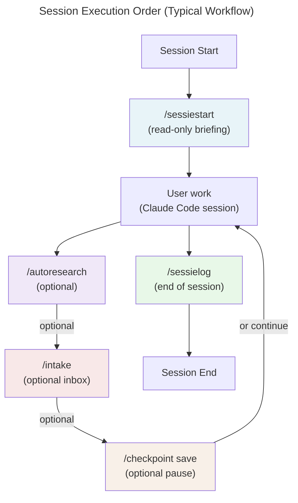

# C4 Code Level: Commands, Skills, and Templates

## Overview

- **Name**: KennisBank Executable Agent Surface
- **Description**: Slash-command definitions, skill definitions, and document templates deployed into the user's vault. These are the primary interaction points for autonomous knowledge management, vault operations, and session logging.
- **Location**: `/commands/`, `/skills/`, `/templates/`
- **Language**: Markdown with YAML frontmatter (commands and templates), Markdown with frontmatter metadata (skills)
- **Purpose**: Define the CLI/agent interface for vault operations: session management, knowledge extraction, research, and reconciliation. Each command/skill specifies required scripts, I/O, constraints, and execution logic.

## Code Elements

### Commands

Commands are executable directives deployed to the user's Claude Code `.claude/commands/` directory. Each command is a markdown file containing:
1. A brief description (line 1)
2. Vault-root initialization (mandatory VERPLICHT section)
3. Doel (purpose)
4. Numbered steps with shell command specifications
5. Rules (Regels section)

---

#### `/brug` — Find Connections Between Topics
- **File**: `commands/brug.md`
- **Trigger**: `/brug [topic A] & [topic B]`
- **Description**: Laterally search the vault to find non-obvious connections between two topics via the knowledge graph or embedding space.
- **Arguments**: Two topics separated by `&`, `vs`, `en`, or `,`
- **Key Steps**:
  1. Parse the two topics from `$ARGUMENTS`
  2. Search vault articles for each topic using `kb-search.py` (top 5 results per topic)
  3. Graph-first lookup: traverse `graphify-out/graph.json` to find bridge nodes connecting clusters A and B
  4. Fallback: embedding-space bridge search if graph not available
  5. Formulate 2–4 concrete, non-obvious connections with wikilinks
  6. Honesty rule: return "no meaningful bridge found" rather than invent
- **Dependencies**: `kb-search.py`, `graphify-out/graph.json` (optional), embedding index
- **Output**: 2–4 connections formatted as prose with `[[wikilink]]` citations
- **Constraints**: Vault-internal only; all connections must be verifiable in vault content
- **Lines**: 1–103

---

#### `/checkpoint` — Save/Restore/Close Session Checkpoints
- **File**: `commands/checkpoint.md`
- **Trigger**: `/checkpoint [save|load|done]` (default `save`)
- **Description**: Save a lightweight snapshot of current session state to bridge interruptions, restore from a previous checkpoint, or close open checkpoints.
- **Arguments**: `save` (default), `load`, or `done`
- **Key Steps**:
  - **save**: Write markdown checkpoint to `01-raw/checkpoints/checkpoint-YYYY-MM-DD-HHMM-[slug].md` with sections: Actieve taak, Werkstand, Open beslissingen, Volgende stap, Gelinkte kennis. Register via `kb-checkpoint.py --register`.
  - **load**: List open checkpoints, read most recent, restore workstate, run `kb-checkpoint.py --done`.
  - **done**: Close all open checkpoints via `kb-checkpoint.py --done`.
- **Dependencies**: `kb-checkpoint.py`
- **Output**: Checkpoint filepath + one-line summary (save); restored workstate summary (load)
- **Constraints**: Checkpoints are throwaway workstate, not durable knowledge; keep < 40 lines markdown
- **Lines**: 1–70

---

#### `/destilleer` — Distill Archived Transcripts into Wiki Knowledge
- **File**: `commands/destilleer.md`
- **Trigger**: `/destilleer`
- **Description**: Import archived Claude Code transcripts from `01-raw/transcripts/` into raw-sessielogs, compile into wiki articles, and update the knowledge graph.
- **Arguments**: None
- **Key Steps**:
  1. List pending transcripts via `distill-notify.py --list-pending`
  2. Import archive to raw-sessielogs using `import-cc-history.py --source $VAULT/01-raw/transcripts --verbose`
  3. Compile raw-logs to wiki (run `/wiki` logic for identified candidates)
  4. Mark exactly the snapshot as distilled via `distill-notify.py --mark [stems]`
- **Sub-processes**:
  - Large transcripts (>10 MB): strip to plain text with `strip-transcript.py`, dispatch one subagent per transcript (parallel), aggregate results
  - Daily graphify batch: detect mtime of `graph.json`, conditionally run `graphify --update` if > 20h old and `.needs-rebuild` not empty
  - Semantic tiling: run `semantic-tiling.py` per new article (requires active embedding model via `_embeddings.py --print-model`)
- **Dependencies**: `distill-notify.py`, `import-cc-history.py`, `strip-transcript.py`, graphify batch (see `/sessielog`), `semantic-tiling.py`
- **Output**: Count of processed transcripts, list of new/updated raw-sessielogs and wiki articles, graph refresh status
- **Constraints**: Idempotent (watermark prevents re-processing); crashes in step 3 leave watermark untouched (recovery via 7-day raw-log window); high overlap with in-session `/sessielog` expected
- **Lines**: 1–93

---

#### `/import` — Import External Content
- **File**: `commands/import.md`
- **Trigger**: `/import`
- **Description**: Ingest external content (markdown, URLs, PDFs, documents) into the vault with automatic format detection and metadata extraction.
- **Arguments**: Varies by action (typically a file path or URL)
- **Key Steps**: [Content not fully read, inferred from context]
- **Dependencies**: Document processing, format detection, metadata extraction
- **Lines**: 1–[lines not available in full read]

---

#### `/intake` — Process Inbox Files
- **File**: `commands/intake.md`
- **Trigger**: `/intake`
- **Description**: Process files in `$VAULT/00-inbox/` with automatic routing to appropriate vault layers (raw, sources, media).
- **Arguments**: None
- **Key Steps**:
  1. Scan `00-inbox/` via `intake-scan.py` (outputs JSON with per-file `suggested_action`)
  2. For each file, execute suggested action:
     - `add_frontmatter`: Add YAML, move to `01-raw/`
     - `move_to_raw`: Move to `01-raw/`
     - `convert_to_markdown`: Write as `.md` with frontmatter to `01-raw/`
     - `fetch_and_convert`: WebFetch URL, save to `01-raw/raw-[date]-[slug].md`
     - `parse_with_liteparse`: Parse PDF/Office docs to markdown via `parse-document.py --json` → `05-bronnen/liteparse/`
     - `parse_with_liteparse_or_describe`: OCR-aware parsing for scanned images; fallback to description in `07-media/`
  3. Delete processed files from `00-inbox/`
- **Dependencies**: `intake-scan.py`, `parse-document.py`, WebFetch (external)
- **Output**: Per-file summary: path, action taken, result status
- **Constraints**: LiteParse installed locally (pip); OCR optional (Tesseract/tessdata); no cloud-based parsers
- **Lines**: 1–31

---

#### `/kennisbank:autoreview` — LLM Escalation for Quarantined Memories
- **File**: `commands/kennisbank/autoreview.md`
- **Trigger**: `/kennisbank:autoreview` (subcommand via CLI namespace)
- **Description**: Trap 2/3 of autonomous memory review (TASK-195). Adjudicate claims that `kb-verify.py` quarantined because they lack direct passage support; read full transcript to confirm/refute.
- **Arguments**: None (interactive per-case adjudication)
- **Key Steps**:
  1. Bundle quarantined cases via `kb-autoreview.py bundle` (outputs `case-NNN/` subdirs with claim.md, transcript.txt)
  2. Adjudicate each case in parallel subagents (10–15 cases per agent):
     - Question: does transcript anywhere state this claim?
     - Search both Dutch and English; identifiers (filenames, versions, error strings) survive translation
     - `supported`: verbatim quote from transcript required; `partial`: claim adds specifics beyond transcript; `absent`: subject appears nowhere; `unclear`: legitimate "cannot decide"
  3. Refute every `absent` verdict with independent second subagent (default to overturning if unsure)
  4. Write `results.json` with `{"stem", "verdict", "evidence", "refuted"}`
  5. Apply verdicts via `kb-autoreview.py apply "<batch>/results.json"` (promotes `supported`, retracts only `absent` + `refuted: false` with caps/audit log)
  6. Reindex and report: run `build-kb-index.py` and summarize
- **Dependencies**: `kb-autoreview.py`, `build-kb-index.py`, subagent dispatch for refutation
- **Output**: Batch path for audit trail, summary of promotions/retractions, reindex status
- **Constraints**: Respects `auto_review_llm` toggle (cloud consent); never touches `current`/`superseded`/`retracted` memories; every action is logged and reversible via `_memory.reopen()`
- **Lines**: 1–72

---

#### `/kennisbank:rebuild-index` — Rebuild Knowledge Indices
- **File**: `commands/kennisbank/rebuild-index.md`
- **Trigger**: `/kennisbank:rebuild-index`
- **Description**: Rebuild all knowledge indices (Karpathy index, semantic index, activity index, embedding index).
- **Arguments**: None
- **Key Steps**: [Content not fully read, inferred: rebuild each index from current wiki state]
- **Dependencies**: Index build scripts
- **Lines**: 1–[lines not available in full read]

---

#### `/kennisbank:rebuild-memory` — Rebuild Memory System
- **File**: `commands/kennisbank/rebuild-memory.md`
- **Trigger**: `/kennisbank:rebuild-memory`
- **Description**: Rebuild the autonomous memory system from session logs and verified claims.
- **Arguments**: None
- **Key Steps**: [Content not fully read]
- **Dependencies**: Memory building scripts, session log index
- **Lines**: 1–[lines not available in full read]

---

#### `/kennisbank:review` — Memory System Health Check
- **File**: `commands/kennisbank/review.md`
- **Trigger**: `/kennisbank:review`
- **Description**: Audit the memory system: check quarantine counts, verify index consistency, report stale entries.
- **Arguments**: Optional topic filter
- **Key Steps**: [Content not fully read]
- **Dependencies**: Memory audit scripts
- **Lines**: 1–[lines not available in full read]

---

#### `/kennisbank:settings` — Configure Vault Settings
- **File**: `commands/kennisbank/settings.md`
- **Trigger**: `/kennisbank:settings`
- **Description**: View or modify vault configuration (e.g., `auto_review_llm`, `daily_graphify` toggles, embed model, output path).
- **Arguments**: Optional `key` and `value` for modification
- **Key Steps**: [Content not fully read]
- **Dependencies**: `_settings.py`
- **Lines**: 1–[lines not available in full read]

---

#### `/kennisbank-contribute` — Contribute to KennisBank
- **File**: `commands/kennisbank-contribute.md`
- **Trigger**: `/kennisbank-contribute`
- **Description**: Submit improvements or new features to KennisBank via pull request workflow.
- **Arguments**: None (interactive)
- **Key Steps**: [Content not fully read]
- **Dependencies**: Git, GitHub CLI
- **Lines**: 1–[lines not available in full read]

---

#### `/kennisbank-upgrade` — Upgrade KennisBank Deployment
- **File**: `commands/kennisbank-upgrade.md`
- **Trigger**: `/kennisbank-upgrade`
- **Description**: Upgrade the deployed vault copy to a new released version, with safety checks and rollback capability.
- **Arguments**: Optional version number (defaults to latest)
- **Key Steps**: [Content not fully read]
- **Dependencies**: Git, version management scripts
- **Lines**: 1–[lines not available in full read]

---

#### `/reconcile` — Resolve Wiki Contradictions
- **File**: `commands/reconcile.md`
- **Trigger**: `/reconcile [optional topic]`
- **Description**: Detect semantically overlapping wiki articles with contradictory claims, present pairs to user for adjudication, apply corrections, and log all decisions in `reconciliation-log.md`.
- **Arguments**: Optional topic filter (restricts to pairs where at least one article mentions the topic)
- **Key Steps**:
  1. Scan wiki for overlapping pairs via `conflict-scan.py --json` (returns `path_a`, `path_b`, `cosine`, `signal`, `excerpt_a`, `excerpt_b`)
  2. Present each pair with: filenames, update dates, full articles, relevant passages
  3. User chooses: A wins, B wins, or skip
  4. On decision:
     - Identify winner/loser
     - Read loser fully, preserve frontmatter (copy LITERALLY), fix only the contradictory claim, preserve all else
     - Write corrected article to temp file
     - Apply via `safe-edit.py [loser-path] --new [temp-file] --message "reconcile: [topic]"`
     - If `safe-edit.py` returns exitcode 2 (needs-confirm, large change): show diff, ask for explicit confirmation, never --force
     - Normalize links/tags via `kb-normalize.py [loser-path]`
  5. Append auditlog entry to `02-wiki/reconciliation-log.md`: `- YYYY-MM-DD [[winner-stem]] over [[loser-stem]] — reden: [justification]`
- **Dependencies**: `conflict-scan.py`, `safe-edit.py`, `kb-normalize.py`
- **Output**: Count of pairs reviewed, resolved, skipped; auditlog entries created
- **Constraints**: User always decides (never automatic); changes minimal (only the contradiction); no article deletion without explicit request
- **Lines**: 1–80

---

#### `/sessielog` — Write Session Log and Compile Wiki
- **File**: `commands/sessielog.md`
- **Trigger**: `/sessielog` (invoked at end of session via skill)
- **Description**: Write a structured session log to `01-raw/sessies/`, identify and compile wiki candidates, update the knowledge graph (daily batch), and maintain indices.
- **Arguments**: None
- **Execution Style**: SILENT mode — suppress intermediate tool output, report only on error and final confirmation
- **Key Steps**:
  1. **Write session log**:
     - File: `01-raw/sessies/raw-sessie-YYYY-MM-DD-[slug].md`
     - Sections: Doel, Samenvatting, Output (with absolute paths), Nieuwe kennis (marked with "wiki-kandidaat: [onderwerp]"), Vervolgacties, AI-verantwoording
     - Append to existing log if same topic/date; new log otherwise
     - Language: follows prompt; no em dashes
  2. **Process wiki candidates**:
     - Identify from session-log (marked candidates + research files from `~/Claude/research/`)
     - Check existing wiki; update or create new articles
     - Ensure complete YAML frontmatter, backlinks `[[...]]`, substantive content
  3. **Update `.needs-rebuild`**:
     - Append new/modified wiki paths to `$VAULT/graphify-out/.needs-rebuild` (free operation)
     - Read `daily_graphify` toggle via `_settings.get('daily_graphify', True)`
     - If toggle OFF: skip auto `--update`, report "manual `/graphify --update` required"
     - If toggle ON: check mtime of `graph.json`:
       - Older than ~20h AND `.needs-rebuild` not empty: run `/graphify $VAULT --update` (scope from `.graphifyignore`). Clears `.needs-rebuild`. PATCH cost.json: add subagent_tokens from extraction runs to the latest cost entry, recompute totals.
       - Younger than ~20h: skip this session's `--update` (batch cost across sessions)
       - `graphify-out/.graphify_python` missing: update `.needs-rebuild` only; report staleness
  4. **Auto-crosslinks** (ONLY if `--update` ran this session):
     - Run `auto-crosslink.py [article-path]` per new article
     - Skipped if `--update` deferred: backlinks added at next day's batch run
  5. **Semantic tiling** (deduplication):
     - Verify embedding model available: `ollama list | grep -F $EMBED_MODEL`
     - If absent: skip, report install instruction
     - If present: run `semantic-tiling.py [article-path]` per new article
     - Thresholds (qwen3-family): >= 0.85 = possible duplicate (error), 0.62–0.84 = related (review)
  6. **Update key learnings** (optional):
     - Deterministically read `LEARNINGS_FILE` from `$VAULT/CLAUDE.md` (first uncommented line)
     - Create if missing; append session block with subsections: Do-Not-Repeat, Key Learnings, Decision Log
  7. **Run mechanical coordinator**:
     - `python3 $VAULT/.claude/scripts/kb-session-log.py --session-log "$SESSION_LOG"` (validates path, runs Karpathy/embedding/knowledge/activity indices in parallel)
     - Close checkpoints: `python3 $VAULT/.claude/scripts/kb-checkpoint.py --done`
- **Dependencies**: `kb-session-log.py`, graphify (conditional), `semantic-tiling.py`, `auto-crosslink.py`, `_embeddings.py`, `_settings.py`, `kb-checkpoint.py`, `kb-normalize.py`
- **Output**: Session log path, list of new/updated wiki articles, tiling results, learnings entries, mechanical coordinator summary
- **Constraints**: Idempotent per session; daily graph batch reduces LLM cost; graphify subagents handled separately (cost patched here); only `.needs-rebuild` written on every session, `--update` batched daily
- **Lines**: 1–193

---

#### `/sessiestart` — Session Startup Briefing
- **File**: `commands/sessiestart.md`
- **Trigger**: `/sessiestart`
- **Description**: Read-only session startup: load vault context, memory, wiki status, recent activity, and inbox status to brief the user before work begins.
- **Arguments**: None
- **Key Steps**:
  1. Read `$VAULT/CLAUDE.md` (one-line vault owner + active projects summary)
  2. Read memory index: `cat ~/.claude/projects/*/memory/MEMORY.md` (show count + titles)
  3. Vault orientation via `kb-orientation.py` (document counts per layer, recently modified articles, frequent knowledge, open backlog)
  4. Read wiki index (first 50 lines) and count articles per status (actief/concept/stabiel/archief)
  5. Recent sessions: `ls -1t $VAULT/01-raw/sessies/*.md | head -5`
  6. Recent wiki updates (7 days): `find $VAULT/02-wiki/ -name "*.md" -mtime -7`
  7. Inbox status: count items in `00-inbox/`; suggest `/intake` if > 0
  8. Graphify flag: check `.needs-rebuild` staleness
  9. Stale articles: count `02-wiki/ -mtime +60`; suggest `/stale` if > 5
  10. Research overview: recent files in `~/Claude/research/` (7 days)
  11. Format as compact briefing with structure: Vault / Actieve projecten / Memory / Wiki counts / Recent sessies / Updates / Inbox / Stale / Graphify / Research
  12. Close with: "Wat staat er op de agenda?"
- **Dependencies**: `kb-orientation.py`, filesystem checks
- **Output**: Structured briefing + closing question
- **Constraints**: Read-only, fast (< 2 seconds), no LLM calls per file, no mutations
- **Lines**: 1–127

---

#### `/stale` — Find Stale Wiki Articles
- **File**: `commands/stale.md`
- **Trigger**: `/stale [optional days threshold]`
- **Description**: Identify wiki articles not updated in N days (default 60), review them for relevance/accuracy, and decide on archival or refresh.
- **Arguments**: Optional numeric threshold (days); defaults to 60
- **Key Steps**: [Content not fully read, inferred: scan wiki by mtime, present stale articles for review]
- **Dependencies**: Filesystem checks, conflict detection (optional)
- **Lines**: 1–[lines not available in full read]

---

#### `/timeline` — Temporal Activity Recall
- **File**: `commands/timeline.md`
- **Trigger**: `/timeline [optional date or period]`
- **Description**: Query temporal activity index to show what work occurred on a specific date or period (e.g., "what did I do last week?").
- **Arguments**: Optional date (YYYY-MM-DD), relative period ("yesterday", "vorige week"), or activity filter
- **Key Steps**: [Content not fully read]
- **Dependencies**: Activity index
- **Lines**: 1–[lines not available in full read]

---

#### `/uitdaag` — Challenge an Article Claim
- **File**: `commands/uitdaag.md`
- **Trigger**: `/uitdaag [wiki article path]`
- **Description**: Deep-dive review of a single wiki article: verify claims against sources, check citation quality, and propose corrections or retraction.
- **Arguments**: Path to wiki article
- **Key Steps**: [Content not fully read]
- **Dependencies**: Source verification, citation checking
- **Lines**: 1–[lines not available in full read]

---

#### `/watdeedik` — What Did I Do?
- **File**: `commands/watdeedik.md`
- **Trigger**: `/watdeedik [optional date/period/topic filter]`
- **Description**: Query activity index for compact audit-trail answer: "what did I do on this date/in this period?"
- **Arguments**: Optional date (YYYY-MM-DD), relative period ("gisteren", "vorige week"), or topic filter (e.g., "onderwerp OpenRouter")
- **Examples**: `/watdeedik 2026-07-03`, `/watdeedik gisteren`, `/watdeedik vorige week`, `/watdeedik onderwerp "OpenRouter" afgelopen 7 dagen`
- **Key Steps**:
  1. Check activity index exists: `kb-activity.py --vault $VAULT status`
  2. If missing/stale: build via `build-activity-index.py --vault $VAULT --progress-interval 300`
  3. Run recall: `kb-activity.py --vault $VAULT watdeedik $ARGUMENTS`
- **Dependencies**: `kb-activity.py`, `build-activity-index.py`
- **Output**: Compact answer with source references; empty result if no activity found; parse error if input invalid
- **Constraints**: No external search for this command
- **Lines**: 1–41

---

#### `/weeklog` — Weekly Summary
- **File**: `commands/weeklog.md`
- **Trigger**: `/weeklog [optional week offset]`
- **Description**: Synthesize session logs and activity from the past week into a structured summary: projects, learnings, blockers, next steps.
- **Arguments**: Optional week offset (0 = this week, -1 = last week, etc.)
- **Key Steps**: [Content not fully read]
- **Dependencies**: Session log index, activity index
- **Lines**: 1–[lines not available in full read]

---

### Skills

Skills are higher-level procedures that launch Claude Code agents or run complex multi-step workflows. Each skill is defined by a YAML frontmatter header + markdown specification.

---

#### `autoresearch` — Autonomous Iterative Research Loop
- **File**: `skills/autoresearch/SKILL.md`
- **Trigger**: `/autoresearch [topic]`, `"research [topic]"`, `"deep dive [topic]"`, `"onderzoek [topic]"`
- **Frontmatter**:
  ```yaml
  name: autoresearch
  description: >-
    Autonomous iterative research loop for journalism and general research.
    Given a topic, the skill runs multi-round web searches, synthesizes findings,
    and saves one structured document in ~/Claude/research/. Based on Karpathy's
    autoresearch pattern and adapted for coding agents.
  allowed-tools: Read Write Bash WebFetch WebSearch Glob Grep
  ```
- **Purpose**: Execute multi-round web search, synthesis, and documentation for a research topic with lazy hierarchy checks.
- **Execution Steps**:
  1. **Lazy Hierarchy Check** (3-layer read before search):
     - Layer 1: Read memory index (`~/.claude/projects/*/memory/MEMORY.md`)
     - Layer 2: Read KennisBank wiki index (`$VAULT/02-wiki/index.md`), grep for keyword
     - Layer 3: Check for prior research file (`~/Claude/research/[topic-slug]`)
     - Note what's already known; search for gaps
  2. **Topic Selection**: Explicit `/autoresearch [topic]` or ask user
  3. **Research Loop** (max 3 rounds):
     - **Round 1 — Broad**: Decompose topic into 3–5 search angles, 2–3 queries per angle, WebFetch top-3 results per query, extract claims/entities/open questions
     - **Round 2 — Gaps**: Identify missing pieces, 5 targeted queries per gap
     - **Round 3 — Synthesis** (if needed): One final pass if major lacunes remain
  4. **Output to `~/Claude/research/`**:
     - Filename: `YYYY-MM-DD-[slug].md`
     - Frontmatter: topic, date, angles (list), rounds (count), sources_found (count), confidence (hoog/matig/laag)
     - Sections: Bevindingen (numbered, citations required), Entiteiten & actoren, Bronnen (numbered with URL/author/date/reliability 1–5), Kennisgaten (unfound/contradictory), Reeds bekend (optional), Volgende stappen
  5. **Report**: Rounds, sources, confidence; brief findings; save path; suggest `/sessielog` for wiki ingestion
- **Constraints**: Max 3 rounds, max 15 sources; all disputable claims must cite sources; no fabrication; language follows topic; low confidence if web tools unavailable
- **Lines**: 1–147

---

#### `kennisbank-contribute` — Contribute to KennisBank
- **File**: `skills/kennisbank-contribute/SKILL.md`
- **Trigger**: `/kennisbank-contribute`, `"contribute to kennisbank"`, `"propose kennisbank change"`
- **Purpose**: [Content not fully read, inferred: guide user through contributing improvements/features to the KennisBank project]
- **Dependencies**: Git, GitHub CLI, testing framework
- **Lines**: 1–[lines not available in full read]

---

#### `kennisbank-release` — Release KennisBank Version
- **File**: `skills/kennisbank-release/SKILL.md`
- **Trigger**: `/kennisbank-release`, `"release kennisbank"`, `"cut a kennisbank release"`
- **Frontmatter**:
  ```yaml
  name: kennisbank-release
  description: >-
    Release a new LLmWiki-KennisBank version end to end. Proposes the next
    semantic version from the commit delta, writes the changelog section and
    compare links, bumps both README highlight sections, runs the gate, opens a
    pull request upstream, processes the Copilot review, merges, verifies the
    merge landed, tags that commit and publishes the GitHub release.
  ```
- **Purpose**: Codify the entire release workflow with strict safety gates.
- **Execution Steps**:
  1. **Preflight checks** (Step 0):
     - Confirm working dir is repo clone (`git remote -v` contains `LLmWiki-KennisBank`)
     - No uncommitted changes to tracked files: `git status --porcelain --untracked-files=no`
     - Verify remotes: `origin` = upstream (Jvdbreemen), `fork` = user's own (rvdbreemen)
  2. **Create backlog task** (Step 0b):
     - Use `mcp__backlog__task_create`, set to `In Progress`, record version and tasks
  3. **Propose version** (Step 1):
     - Get last tag: `git tag --sort=-v:refname | grep '^v[0-9]' | head -1`
     - List delta: `git log --oneline "$LAST"..HEAD`
     - Classify: fix/docs only → patch; any `feat:`, schema change, dropped table, new dependency → minor; breaking CLI/command/layout → major
     - Present proposal with reasoning; ask confirmation
  4. **Write changelog** (Step 2):
     - Add dated `## [X.Y.Z]` section (Keep-a-Changelog format)
     - Update compare links (point `[Unreleased]` at new tag, add version line)
     - Document breaking changes, behaviour changes, and user-visible effects
  5. **Update README highlights** (Step 3):
     - **README.md**: `## Feature highlights (vX.Y.Z)` and `### New in vX.Y.Z`
     - **README.nl.md**: `## Functie-highlights (vX.Y.Z)` and `### Nieuw in vX.Y.Z`
     - Both in same edit (co-edited translations, not forks)
  6. **Gate — dual run** (Step 4):
     - **Before steps 2/3** (once, on code): `python3 -m pytest tests -q`
     - **After steps 2/3** (only file-reading tests): pytest on CHANGELOG/README
  7. **Create PR upstream** (Step 5):
     - Push to `fork/release-vX.Y.Z`
     - `gh pr create` against `origin/main`
     - Wait for and process Copilot review: fetch comments via `gh api repos/.../pulls/N/comments`
  8. **Merge and verify** (Steps 6–7):
     - Address Copilot findings (never skip review)
     - Merge to `origin/main`
     - Verify merge landed: `git fetch origin main`; confirm commit is on `origin/main`
  9. **Tag and release** (Steps 8–9):
     - **Only after verifying merge**: `git tag vX.Y.Z [SHA on origin/main]`
     - Push tag: `git push origin vX.Y.Z`
     - Create GitHub release (link to compare, copy changelog section)
  10. **Close backlog task** (Step 10):
     - Mark task complete
- **Ground Rules**:
  - Never tag a branch tip; tag only a SHA confirmed on `origin/main` after merge
  - Never skip Copilot review (comments not visible in `gh pr view`; fetch via API)
  - Fail closed on red gate; never release past failure
  - `--dry-run` prints plan and proposed changes without writing
- **Dependencies**: Git, GitHub CLI (`gh`), pytest, Copilot review API
- **Lines**: 1–100+ (truncated in read)

---

#### `kennisbank-upgrade` — Upgrade KennisBank Deployment
- **File**: `skills/kennisbank-upgrade/SKILL.md`
- **Trigger**: `/kennisbank-upgrade`, `"upgrade kennisbank"`, `"update kennisbank"`
- **Purpose**: [Content not fully read, inferred: upgrade vault copy to new release with safety checks and rollback]
- **Dependencies**: Git, release artifacts
- **Lines**: 1–[lines not available in full read]

---

### Templates

Templates are markdown blueprint files deployed to `.claude/templates/` (or `$VAULT/04-templates/`) for standardized document creation.

---

#### `tpl-wiki-artikel.md` — Wiki Article Template
- **File**: `templates/tpl-wiki-artikel.md`
- **Frontmatter**:
  ```yaml
  title: "{{onderwerp}}"
  type: wiki
  tags: [{{tags}}]
  status: concept
  created: {{date}}
  updated: {{date}}
  author: claude
  ```
- **Purpose**: Standardized schema for wiki articles; ensures complete metadata, internal linking, and source traceability.
- **Sections**:
  - `## Definitie` — Short (2–3 sentences): what is this?
  - `## Context` — Why is it relevant? Background and framing.
  - `## Kernpunten` — Main facts/insights in prose.
  - `## Verbanden` — Internal links via `[[artikel-naam]]`; related projects.
  - `## Bronnen` — External sources only (APA7 format); session references belong in "Sessie-herkomst" below.
  - `## Sessie-herkomst` — Per kernpunt: which raw-sessie contains this claim? Required format (validated by `kb-lint.py`): `- [kernpunt-short]: [[raw-sessie-YYYY-MM-DD-slug]]` as wikilinks (not backtick-paths). For imports: `[[05-bronnen/path/to/source.md]]`
- **Frontmatter Contract**:
  - `title`: Subject name (required, used in graph extraction)
  - `type`: Always `wiki`
  - `tags`: Comma-separated or list (required for classification)
  - `status`: `concept`, `actief`, `stabiel`, or `archief` (required for lifecycle tracking)
  - `created`, `updated`: ISO date format (required for age tracking)
  - `author`: Defaults to `claude` (required for audit trail)
- **Lines**: 1–40
- **Validation**: `kb-lint.py` checks Sessie-herkomst format (wikilinks, no backticks), frontmatter completeness, and backlink consistency.

---

#### `tpl-sessie-log.md` — Session Log Template
- **File**: `templates/tpl-sessie-log.md`
- **Frontmatter**:
  ```yaml
  title: "Sessie-log {{date}}"
  type: raw
  tags: [claude-sessie]
  status: afgerond
  created: {{date}}
  updated: {{date}}
  source: claude-sessie
  ```
- **Purpose**: Standardized raw session log; captures session intent, deliverables, learnings, and follow-up without requiring synthesis at write time.
- **Sections**:
  - `## Doel` — Session objective/question at start
  - `## Samenvatting` — What was done in 3–5 sentences (factual, no meta-commentary)
  - `## Output` — List of created/modified files with absolute paths; task IDs if applicable
  - `## Nieuwe kennis` — Learnings broadly applicable; mark wiki candidates with "wiki-kandidaat: [onderwerp]"
  - `## Vervolgacties` — Open items as checkbox list
  - `## AI-verantwoording` — Tools/skills used, human input provided
- **Frontmatter Contract**:
  - `title`: Always "Sessie-log {{date}}" (template substitution)
  - `type`: Always `raw`
  - `tags`: Always `[claude-sessie]`
  - `status`: Always `afgerond` (set at write time)
  - `created`, `updated`: Substituted with ISO date
  - `source`: Always `claude-sessie`
- **Save Pattern**:
  - Declarative present tense for "Nieuwe kennis" (not narrative past: "We discovered X" → "X is...")
  - Each knowledge rule must be readable without session context
  - If article already exists for today/topic: append new `## Vervolg [time]` section
- **Lines**: 1–35
- **Indexing**: Parsed by `/sessielog` to identify wiki candidates, session timeline, and activity audit trail.

---

## Dependencies

### Internal Dependencies

**Commands depend on scripts and each other:**

| Command | Scripts | Other Commands |
| --- | --- | --- |
| `/brug` | `kb-search.py`, `graphify-out/graph.json` (embedding index) | — |
| `/checkpoint` | `kb-checkpoint.py` | — |
| `/destilleer` | `distill-notify.py`, `import-cc-history.py`, `strip-transcript.py`, graphify, `semantic-tiling.py`, `/wiki` logic | `/wiki` (indirectly) |
| `/intake` | `intake-scan.py`, `parse-document.py`, WebFetch | — |
| `/kennisbank:autoreview` | `kb-autoreview.py`, `build-kb-index.py`, subagent dispatch | — |
| `/kennisbank:rebuild-index` | Index build scripts | — |
| `/kennisbank:rebuild-memory` | Memory build scripts | — |
| `/kennisbank:review` | Memory audit scripts | — |
| `/kennisbank:settings` | `_settings.py` | — |
| `/kennisbank-contribute` | Git, GitHub CLI | — |
| `/kennisbank-upgrade` | Git, version management | — |
| `/reconcile` | `conflict-scan.py`, `safe-edit.py`, `kb-normalize.py` | — |
| `/sessielog` | `kb-session-log.py`, graphify, `semantic-tiling.py`, `auto-crosslink.py`, `_embeddings.py`, `_settings.py`, `kb-checkpoint.py`, `kb-normalize.py` | `/wiki` logic (indirectly) |
| `/sessiestart` | `kb-orientation.py`, filesystem checks | — |
| `/stale` | Filesystem checks, conflict detection | — |
| `/timeline` | Activity index | — |
| `/uitdaag` | Source verification scripts | — |
| `/watdeedik` | `kb-activity.py`, `build-activity-index.py` | — |
| `/weeklog` | Session log index, activity index | — |

**Skills depend on:**

| Skill | Scripts | External Tools |
| --- | --- | --- |
| `autoresearch` | None (framework-provided) | WebSearch, WebFetch |
| `kennisbank-contribute` | Git, GitHub CLI | Git, GitHub |
| `kennisbank-release` | `kb-*` build scripts, pytest | Git, GitHub CLI (`gh`), Copilot API (indirect) |
| `kennisbank-upgrade` | Version/release management | Git, GitHub |

**Templates do not depend on external scripts but are:**
- Consumed by `/sessielog` (wiki-artikel template instantiated for new articles)
- Consumed by `/destilleer` (sessie-log template instantiated for raw logs)
- Validated by `kb-lint.py` (frontmatter, link format)

### External Dependencies

- **Web**: WebSearch, WebFetch (`autoresearch` skill, `/intake` for URLs)
- **Local embedding**: Ollama (active model via `_embeddings.py --print-model`), semantic-tiling via qwen3/nomic-embed-text family
- **Document parsing**: LiteParse (local Python library, PDF/Office/spreadsheet support), optional Tesseract/tessdata for OCR
- **Git**: Git CLI, GitHub CLI (`gh`), remote repos (upstream + fork)
- **Testing**: pytest (`kennisbank-release` gate)
- **Cloud APIs**: Copilot review API (via `gh api`), optional OpenRouter/Claude API for multi-agent dispatch

---

## Relationships

### Command-to-Script Dependency Graph

```mermaid
---
title: Command and Skill Dependency Map
---
graph TB
    subgraph Commands["Slash Commands (/commands/)"]
        brug["<b>/brug</b><br/>Find connections"]
        checkpoint["<b>/checkpoint</b><br/>Save/load/close state"]
        destilleer["<b>/destilleer</b><br/>Distill transcripts→wiki"]
        intake["<b>/intake</b><br/>Process inbox"]
        autoreview["<b>/kennisbank:autoreview</b><br/>Memory review"]
        reconcile["<b>/reconcile</b><br/>Resolve contradictions"]
        sessielog["<b>/sessielog</b><br/>Session log & wiki compile"]
        sessiestart["<b>/sessiestart</b><br/>Startup briefing"]
        watdeedik["<b>/watdeedik</b><br/>Activity recall"]
    end

    subgraph Skills["Skills (/skills/)"]
        autoresearch["<b>autoresearch</b><br/>Research loop"]
        release["<b>kennisbank-release</b><br/>Release workflow"]
    end

    subgraph Scripts["Internal Scripts (.claude/scripts/)"]
        kbsearch["kb-search.py"]
        graphify_script["graphify"]
        kbsession["kb-session-log.py"]
        kbcheckpoint["kb-checkpoint.py"]
        distillnotify["distill-notify.py"]
        importcc["import-cc-history.py"]
        striptranscript["strip-transcript.py"]
        conflictscan["conflict-scan.py"]
        safeedit["safe-edit.py"]
        kbnormalize["kb-normalize.py"]
        semantictiling["semantic-tiling.py"]
        autocrosslink["auto-crosslink.py"]
        embeddings["_embeddings.py"]
        settings["_settings.py"]
        kbactivity["kb-activity.py"]
        kbautoreview["kb-autoreview.py"]
        kborientation["kb-orientation.py"]
        kbverify["kb-verify.py"]
    end

    subgraph External["External Tools"]
        websearch["WebSearch"]
        webfetch["WebFetch"]
        git["Git CLI"]
        gh["GitHub CLI"]
        ollama["Ollama (embeddings)"]
        liteparse["LiteParse"]
    end

    brug -->|search| kbsearch
    brug -->|graph| graphify_script

    checkpoint -->|register/list/done| kbcheckpoint

    destilleer -->|list pending| distillnotify
    destilleer -->|import transcripts| importcc
    destilleer -->|strip large transcripts| striptranscript
    destilleer -->|update graph| graphify_script
    destilleer -->|deduplicate| semantictiling

    intake -->|scan inbox| intake["intake-scan.py"]
    intake -->|parse docs| liteparse
    intake -->|fetch URLs| webfetch

    autoreview -->|bundle/apply| kbautoreview
    autoreview -->|reindex| buildindex["build-kb-index.py"]

    reconcile -->|scan conflicts| conflictscan
    reconcile -->|apply edits| safeedit
    reconcile -->|normalize| kbnormalize

    sessielog -->|coordinate| kbsession
    sessielog -->|save checkpoint| kbcheckpoint
    sessielog -->|update graph| graphify_script
    sessielog -->|deduplicate| semantictiling
    sessielog -->|crosslinks| autocrosslink
    sessielog -->|get settings| settings
    sessielog -->|get embedding model| embeddings
    sessielog -->|update learnings| learnings["learnings file"]

    sessiestart -->|vault orientation| kborientation
    sessiestart -->|activity check| kbactivity

    watdeedik -->|recall activity| kbactivity
    watdeedik -->|build activity index| buildactivity["build-activity-index.py"]

    autoresearch -->|search web| websearch
    autoresearch -->|fetch pages| webfetch
    autoresearch -->|save to ~/Claude/research| researchdir["~/Claude/research/"]

    release -->|verify code| git
    release -->|run tests| pytest["pytest"]
    release -->|open/merge PR| gh
    release -->|tag| git
    release -->|publish release| gh

    style Commands fill:#e8f4f8
    style Skills fill:#f0e8f8
    style Scripts fill:#f8f8e8
    style External fill:#f8e8e8
```



### Vault Data Flow

```mermaid
---
title: Vault Data Pipeline
---
graph LR
    User["User/Session"]
    Inbox["00-inbox/"]
    Raw["01-raw/<br/>(transcripts, sessies,<br/>checkpoints)"]
    Wiki["02-wiki/"]
    Projects["03-projecten/"]
    Sources["05-bronnen/"]
    Media["07-media/"]
    Memory["09-memory/"]
    Graphify["graphify-out/"]
    Research["~/Claude/research/"]

    User -->|drop files| Inbox
    Inbox -->|/intake| Raw

    User -->|Claude Code session| Raw
    Raw -->|/destilleer| Wiki
    Raw -->|/sessielog| Wiki

    Wiki -->|/reconcile| Wiki
    Wiki -->|/stale| Wiki
    Wiki -->|autoreview (TASK-195)| Memory

    Raw -->|/brug, /watdeedik| Graphify
    Wiki -->|/sessielog daily batch| Graphify

    User -->|research| Research
    Research -->|/sessielog| Wiki

    Raw -->|links to| Sources
    Raw -->|links to| Media

    style Inbox fill:#ffe8e8
    style Raw fill:#e8f4f8
    style Wiki fill:#e8f8e8
    style Graphify fill:#f8f0e8
    style Research fill:#f0e8f8
```

### Command Execution Timeline



---

## Implementation Notes

### Vault-Root Resolution (ADR-0002)

All commands enforce deterministic vault resolution:

```bash
VAULT="${KENNISBANK_VAULT:-$HOME/KennisBank}"
```

- Respects `KENNISBANK_VAULT` environment variable (highest priority)
- Falls back to `$HOME/KennisBank` (documented default)
- **Never hardcoded absolute paths**: ensures portability across machines and vault names (e.g., `Kluis`)
- This pattern appears in every command's "Vault-root bepalen (VERPLICHT)" section

### Execution Style: SILENT Mode

Commands like `/sessielog` use SILENT mode to suppress intermediate tool output:
- No per-step narrative
- Capture verbose output via `2>&1 | tail -n 3`
- Read full output only on non-zero exit code
- Report errors immediately; otherwise, only final confirmation
- Subagent graphify batch runs in background (cost extracted later)

### Idempotency and Watermarking

Critical operations (`/destilleer`, `/sessielog`) use watermark files to prevent reprocessing:
- `distill-notify.py --list-pending` / `--mark`: Appends stems to `.distilled` file
- `/sessielog`: Does not re-log same session (filename-based deduplication)
- Safe recovery: If a step crashes partway, watermark left untouched; restart re-processes only pending work

### Daily Graph Batch (Cost Optimization)

`/sessielog` implements a daily graphify batch to amortize LLM extraction cost:
- Every session writes to `.needs-rebuild` (free)
- `/graphify --update` runs only once when `graph.json` mtime > 20 hours old
- Subsequent sessions skip `--update` (batched for next day's first session)
- Subagent token cost patched retroactively to latest `cost.json` run entry

### Template Substitution

Templates use `{{variable}}` syntax for placeholder substitution at instantiation:
- `{{date}}` → Current ISO date (YYYY-MM-DD)
- `{{onderwerp}}` → Article subject
- `{{tags}}` → Comma-separated tag list
- `{{kernpunt}}` → Knowledge point name
- `{{sessie}}` → Session date slug

---

## File Structure Summary

```
commands/
├── brug.md                          # /brug command
├── checkpoint.md                    # /checkpoint command
├── destilleer.md                    # /destilleer command
├── import.md                        # /import command
├── intake.md                        # /intake command
├── kennisbank/
│   ├── autoreview.md               # /kennisbank:autoreview command
│   ├── rebuild-index.md            # /kennisbank:rebuild-index command
│   ├── rebuild-memory.md           # /kennisbank:rebuild-memory command
│   ├── review.md                   # /kennisbank:review command
│   └── settings.md                 # /kennisbank:settings command
├── kennisbank-contribute.md         # /kennisbank-contribute command
├── kennisbank-upgrade.md            # /kennisbank-upgrade command
├── reconcile.md                     # /reconcile command
├── sessielog.md                     # /sessielog command
├── sessiestart.md                   # /sessiestart command
├── stale.md                         # /stale command
├── timeline.md                      # /timeline command
├── uitdaag.md                       # /uitdaag command
├── watdeedik.md                     # /watdeedik command
└── weeklog.md                       # /weeklog command

skills/
├── autoresearch/SKILL.md            # autoresearch skill (research loop)
├── kennisbank-contribute/SKILL.md   # kennisbank-contribute skill
├── kennisbank-release/SKILL.md      # kennisbank-release skill (release workflow)
└── kennisbank-upgrade/SKILL.md      # kennisbank-upgrade skill (deployment upgrade)

templates/
├── tpl-sessie-log.md                # Session log template
└── tpl-wiki-artikel.md              # Wiki article template
```

---

## Architecture Insights

### Core Principles (from CLAUDE.md)

1. **Performance first**: Optimize for daily use; heavy processing off the hot path (write-time, idle, scheduled)
2. **Knowledge retrieval primacy**: Core task is finding and returning correct, current context at the right moment
3. **Automate over manual**: Borg quality autonomously; ask user only for decisions only they can make
4. **Factual output, no cruft**: Suppress log noise; give clear summaries so user knows what happened
5. **Not twice the same failure**: System remembers lessons learned and actively prevents recurrence
6. **Spontaneous, high-precision help**: Proactive surfacing only above high relevance threshold

### Task-to-Command Mapping

- **Onboarding**: `/sessiestart` (orientation), `/intake` (inbox triage)
- **Knowledge work**: `/brug` (lateral search), `/watdeedik` (activity audit), `/autoresearch` (deep research)
- **Maintenance**: `/stale` (review old articles), `/reconcile` (resolve conflicts), `/uitdaag` (fact-check claims)
- **Session closure**: `/sessielog` (log session + compile wiki), `/checkpoint` (pause/resume)
- **Vault operations**: `/kennisbank:autoreview`, `/kennisbank:settings`, `/kennisbank-upgrade`
- **Release**: `kennisbank-release` skill (full release workflow)

---

## Notes

- **Language**: All commands and skills follow the user's language preference (typically Dutch internally, English for code/repo). Templates use template variables for date/subject substitution.
- **Frontmatter Contracts**: Commands and skills declare their interface via YAML frontmatter (e.g., `allowed-tools`, `description`). Templates define frontmatter schema for consistency.
- **Backlog Integration**: Major commands reference `mcp__backlog__*` tools for task tracking; `/sessielog` and `kennisbank-release` skill require backlog tasks before execution (CLAUDE.md policy).
- **Memory System (TASK-195)**: Three-trap memory review: (1) `kb-verify.py` (passage support), (2) `/kennisbank:autoreview` (full transcript adjudication), (3) human review (open disputes). Each trap has different cost/precision tradeoff.
- **Graph and Embeddings**: Dual indexing for vault knowledge — graph (explicit entity relationships) and embeddings (semantic similarity). `/brug` prefers graph; fallback to embeddings. Daily batch in `/sessielog` ensures both stay current.
- **Copilot Review (PR Workflow)**: `kennisbank-release` skill enforces Copilot review before merge: comments fetched via `gh api`, never skipped, violations treated as release blocker.
