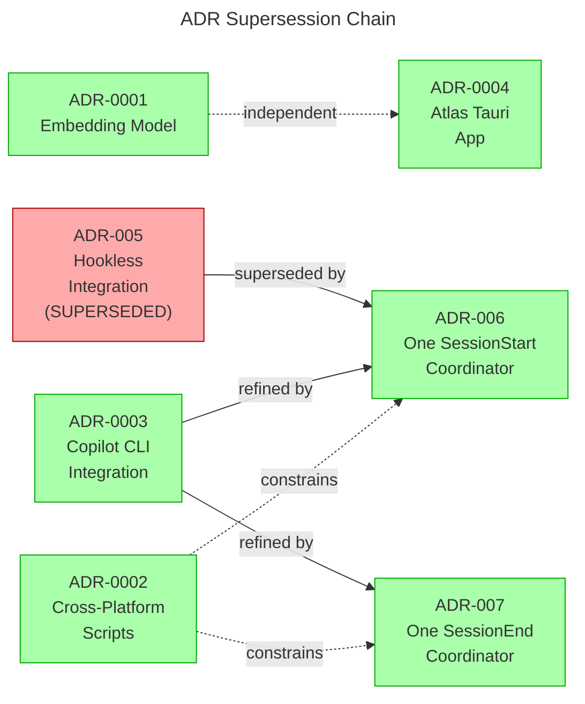

# C4 Code Level: KennisBank Design Decision Layer

## Overview

- **Name**: KennisBank Design & Architecture Documentation
- **Description**: Architecture decision records, design specifications, implementation plans, and research findings that guide KennisBank's code-level implementation
- **Location**: [`docs/adr/`](../adr/), [`docs/superpowers/specs/`](../superpowers/specs/), [`docs/superpowers/plans/`](../superpowers/plans/), [`docs/research/`](../research/)
- **Language**: English (primary), Dutch (translations available)
- **Purpose**: Comprehensive decision layer documenting architectural choices, design specifications, implementation roadmaps, and empirical research backing KennisBank's knowledge retrieval, memory management, and agent integration systems

---

## Code Elements

### Architecture Decision Records (ADRs)

KennisBank uses Architecture Decision Records (MADR format for newer decisions) to document major architectural choices and their consequences. The ADR supersession chain shows how decisions evolve.

#### ADR-0001: Default Embedding Model for Semantic Tiling
- **Status**: Accepted
- **Date**: 2026-06-20
- **Location**: [`docs/adr/0001-embedding-model-default.md`](../adr/0001-embedding-model-default.md)
- **Decision**: Make `qwen3-embedding:8b` the default embedding model for multilingual vault support, with `nomic-embed-text` as a documented fallback for English-only setups.
- **Impacts**: `scripts/semantic-tiling.py`, threshold configuration in `CONFIGURATION.md`
- **Consequences**: Better out-of-the-box behavior for multilingual content; higher resource cost mitigated by documented fallback
- **Deciders**: Jvdbreemen, Robert van den Breemen

#### ADR-0002: Cross-Platform Scripts (macOS, Linux, Windows)
- **Status**: Accepted
- **Date**: 2026-06-20
- **Location**: [`docs/adr/0002-cross-platform-scripts.md`](../adr/0002-cross-platform-scripts.md)
- **Decision**: Every script in this project must work on macOS, Linux, and Windows (Git Bash), with test suite passing on all three.
- **Rules**:
  - Never pass Windows-style paths to bash subprocesses; convert to POSIX form first
  - Resolve vault via `KENNISBANK_VAULT` environment variable
  - Shell scripts use LF line endings
  - Discover tools via environment variables and `PATH`, never hard-code absolute paths
  - CI runs on Linux only; Windows/macOS behavior verified through platform-aware test logic
- **Impacts**: All test files under `tests/`, all scripts under `scripts/`
- **Consequences**: Portable, first-class behavior across platforms; requires platform-aware test helpers
- **Deciders**: Jvdbreemen, Robert van den Breemen

#### ADR-0003: GitHub Copilot CLI as Local-First Integration
- **Status**: Accepted (partially superseded in details by ADR-005/006/007)
- **Date**: 2026-07-11
- **Location**: [`docs/adr/0003-copilot-cli-integration.md`](../adr/0003-copilot-cli-integration.md)
- **Epic**: TASK-26
- **Decision**: Add GitHub Copilot CLI (standalone `@github/copilot` terminal agent) as a fourth agent environment, local-first, without cloud-memory or Headroom runtime dependency.
- **Key decisions** (D1–D7):
  - **D1 — MCP registration**: Idempotent JSON merge into `~/.copilot/mcp-config.json`
  - **D2 — Instructions & agent profile**: AGENTS.md managed block, `~/.copilot/copilot-instructions.md`, `~/.copilot/agents/kennisbank.agent.md`
  - **D3 — Hooks** (refined by ADR-006): Native Copilot hooks, fail-open
  - **D4 — Wrapper/launcher**: Trivial exec (not a proxy), no Headroom dependency
  - **D5 — Rawlog/activity capture**: Via hooks and session import
  - **D6 — Config-mutation rule**: Key-scoped JSON edits + marker-delimited Markdown blocks
  - **D7 — Headroom interoperability**: Not built; no adapter
- **Impacts**: `scripts/install-agent-envs.py`, `scripts/_copilot.py`, `docs/agent-integrations.md`
- **Consequences**: Copilot becomes first-class local agent; hook semantics version-sensitive (v1.0.70+)
- **Deciders**: Robert van den Breemen
- **Refinements**: ADR-005 addressed hooks (superseded), ADR-006/007 coordinate hook fan-out

#### ADR-0004: KennisBank Atlas as Local-First Tauri App
- **Status**: Accepted
- **Date**: 2026-07-12
- **Location**: [`docs/adr/0004-atlas-tauri-architecture.md`](../adr/0004-atlas-tauri-architecture.md)
- **Epic**: TASK-27
- **Decision**: Build Atlas as a Tauri standalone desktop app with a local Python FastAPI sidecar, rendering 2514 graph nodes and 10868 activity events without cloud or network outbound.
- **Architecture**:
  - **Shell**: Tauri (native OS webview: WebView2 on Windows, WKWebView on macOS)
  - **Frontend**: TypeScript with canvas/WebGL force-graph renderer, six lenses
  - **Backend**: Python FastAPI sidecar on `127.0.0.1` only, reusing `_kbindex`, `_activity`, `_rank`, `_memory`, `kb-recall`
  - **Boundary**: Everything local; Ollama local; no outbound network
- **Sidecar endpoints**:
  - `GET /health` — liveness and source readiness
  - `GET /graph` — bi-temporal graph nodes and links
  - `GET /timeline` — server-side aggregated activity buckets
  - `GET /memory-health` — memory status and warmth
  - `GET /recall` — live waterfall with reranking
  - `GET /provenance` — sourcing coverage overlay
- **Frontend modules**: app-shell, data-client, graph-renderer, six lens modules, encoding/legend
- **Impacts**: Rust toolchain required for builds; two-runtime packaging (Tauri + frozen sidecar)
- **Consequences**: Sovereign, light, live dashboard; costs include Rust toolchain and packaging complexity
- **Deciders**: Robert van den Breemen

#### ADR-005: Use Hookless Integrations for Codex and Copilot
- **Status**: Superseded by ADR-006 (2026-07-19)
- **Date**: 2026-07-19
- **Location**: [`docs/adr/ADR-005-hookless-codex-copilot-integration.md`](../adr/ADR-005-hookless-codex-copilot-integration.md)
- **Decision** (rejected in favor of ADR-006): Remove KennisBank hooks and use skills plus MCP for Codex and Copilot
- **Why superseded**: Coordinated automation selected for v0.17.0 after explicit-session trade-off was reconsidered
- **Superseded by**: ADR-006
- **Reasoning**: Client-rendered lifecycle rows cannot be suppressed by hook output; hookless eliminated all KennisBank rows but made capture/freshness explicit
- **Implementation**: Tested in `tests/test_agent_envs_install.py`, `tests/test_copilot_config.py`

#### ADR-006: Coordinate SessionStart Work Behind One Client Hook
- **Status**: Accepted
- **Date**: 2026-07-19
- **Location**: [`docs/adr/ADR-006-coordinate-sessionstart-work-behind-one-client-hook.md`](../adr/ADR-006-coordinate-sessionstart-work-behind-one-client-hook.md)
- **Supersedes**: ADR-005
- **Decision**: Register one phased SessionStart coordinator per client (Claude Code, Codex, Copilot) instead of six-to-eight independent hooks, reducing client lifecycle rows while retaining automatic freshness and concurrent performance.
- **Implementation**: `kb-session-start.py` script:
  1. Runs Copilot import before maintenance (Copilot-specific)
  2. Runs embedding, knowledge, activity, sweep-launch jobs concurrently
  3. Runs memory and distillation notices concurrently after maintenance
  4. Captures Copilot SessionStart even when maintenance is freshness-gated
  5. Uses per-vault lock and five-minute completion stamp to collapse rapid events
  6. Emits at most one client-native context payload
  7. Always exits zero with per-child timeouts
- **Consequences**: 83–87.5% reduction in SessionStart rows; dependencies become explicit and testable; shared startup infrastructure increases blast radius but mitigated by exception isolation
- **Impacts**: `scripts/kb-session-start.py`, `scripts/_hooks_manifest.py`, `scripts/install-agent-envs.py`, `scripts/_copilot.py`
- **Related**: Refines ADR-0003 D3; ADR-0002 cross-platform rules still apply

#### ADR-007: Coordinate Session Logging and Exit Work Behind One Client Hook
- **Status**: Accepted
- **Date**: 2026-07-19
- **Location**: [`docs/adr/ADR-007-coordinate-session-logging-and-exit-work-behind-one-client-hook.md`](../adr/ADR-007-coordinate-session-logging-and-exit-work-behind-one-client-hook.md)
- **Decision**: One phased exit coordinator (`kb-session-end.py`) plus one mechanical sessielog helper (`kb-session-log.py`), keeping capture-before-analysis deterministic without automating editorial judgment.
- **Implementation**:
  - `kb-session-end.py` reads client payload once, always exits zero:
    1. Capture phase: `archive-transcript.py` (Claude/Codex) or `kb-copilot-capture.py --event sessionEnd` (Copilot)
    2. Usage attribution runs; Copilot imports completed staging stream
    3. Independent post-capture jobs run concurrently with per-child timeouts
    4. Routine stdout always empty; aggregate status in `<vault>/.claude/kb-session-end-state.json`
  - `kb-session-log.py --session-log <path>` validates path, runs index/sweep-launch jobs concurrently, runs notices after indexes
- **Consequences**: 50% reduction in KennisBank-owned exit rows; capture-before-analysis explicit and testable; `/sessielog` has one stable mechanical boundary agents can invoke
- **Impacts**: `scripts/kb-session-end.py`, `scripts/kb-session-log.py`, `scripts/_hooks_manifest.py`, `scripts/install-agent-envs.py`, `scripts/_copilot.py`
- **Related**: Shares phased coordination principle with ADR-006; refines ADR-0003; ADR-0002 defines cross-platform rules

### Design Specifications

Design specifications define concrete systems, interfaces, and technologies for major KennisBank subsystems. Each spec is linked to the implementation plan(s) it drives and the research that validates it.

**Specs location**: [`docs/superpowers/specs/`](../superpowers/specs/)

#### Specification Inventory

- **Upgrade & contribute skills** (`2026-06-20`): Two complementary agent skills for vault maintenance (pull latest, push changes upstream); idempotent, CRLF-agnostic
- **Vault-onderhoud layer** (`2026-06-21`): Safe-edit engine with git safety, self-rewriting wiki, conflict detection/reconciliation, and three thinking tools with progressive context budgets
- **Transcript archival & destillation** (`2026-06-24`): SessionEnd archival pipeline + piggyback destillation; three-phase (capture/notify/import+compile)
- **Settings system** (`2026-06-25`): Persistent, toggleable background-automation settings via `kennisbank-settings.json` and `/kennisbank:settings` command
- **Agent memory & knowledge layer** (`2026-06-26`): Two-layer retrieval (curated wiki + raw memory) into hybrid `kb-index.db` with separate toggles decoupled from automation
- **Setup & migration v2** (`2026-06-27`): Version-stamped setup with `_hooks_manifest.py` as single source of truth; cross-platform interpreter safety
- **Temporal activity recall** (`2026-07-08`): Local-first temporal index (`kb-activity.db`) with canonical ActivityEvent schema and shared Python API
- **Knowledge visualization (Atlas)** (`2026-07-11`): Research synthesis and north-star design for visual exploration; gap analysis and comparable systems (superseded implementation in ADR-0004)
- **Two-layer graph visualization** (`2026-07-12`): Wiki as durable base map with toggleable memory overlay; entry-point density via size/glow encoding
- **Atlas inspect drawer** (`2026-07-14`): Frontend UX for inspect drawer with browser-style history navigation and inline memory fragment expansion
- **Checkpoint primitive** (`2026-07-26`): Work-state snapshot before compaction (distinct from session logs and memory); `/checkpoint` command with auto-stub
- **L2 scene retrieval layer** (`2026-08-05`): Optional scenario/project clustering between atomic memory and wiki; measured via recall@k with toggleable levers
- **Self-correcting memory** (`2026-08-12`): Automatic promotion of unverified captures via local verification or client-LLM adjudication; addresses extraction blindness and coverage gaps
- **Trust and noise factors** (`2026-08-14`): Analysis of rerank factors; identifies provenance as strongest trust signal; noise_factor currently inert
- **Autonomous memory review** (`2026-08-16`): Three-trap promotion pipeline (grounded check → client-LLM → retraction) automating unverified review without human bottleneck

### Implementation Plans

Implementation plans break major features into phases, defining deliverables, dependencies, and acceptance criteria. Multi-phase plans are documented as one logical plan family with explicit phase boundaries.

**Plans location**: [`docs/superpowers/plans/`](../superpowers/plans/)

#### Plan Inventory

- **Upgrade & contribute skills** (`2026-06-20`): Two invocable agent skills for vault maintenance automation; refactors setup.sh with skill-driven deployment
- **Vault-onderhoud layer** (`2026-06-21`): Safe-edit with git safety net, self-rewriting wiki, contradiction detection, and three thinking tools (L0-L3 context layers)
- **Transcript archival + destillation** (`2026-06-24`): SessionEnd archival to vault + `/destilleer` command for wiki destillation pipeline; deterministic capture + semantic authoring split
- **Settings system** (`2026-06-25`): Persistent toggles (`auto_archive`, `distill_notify`, `embed_index`, `daily_graphify`) with centralized defaults and setup integration
- **Setup & migration v2** (`2026-06-27`): Version-stamped, idempotent setup with `_hooks_manifest.py` as single source; deterministic migrations, interpreter-aware, preserves user data
- **Agent memory family** (`2026-06-27`, multi-phase):
  - **Fase 1 (Fundament)**: Data model + toggles (`memory_capture`, `memory_recall`) decoupled from automation
  - **Fase 2 (Index)**: Hybrid vector+FTS search into `kb-index.db` with separate toggles
  - **Fase 3 (Recall)**: Live memory integration in UserPromptSubmit hook
  - **Fase 4a (Router seams)**: LLM router + judge/extract seams (mockable for testing)
  - **Fase 4b (Sweep orchestration)**: Autonomic capture-sweep pipeline
  - **Fase 5 (Rebuild + health)**: Full rebuild and doctor/health diagnostics
  - **FaseA (PreToolUse presearch)**: Prompt-time presearch integration
  - **MCP server**: Local stdio recall tool
  - **Wiki-hybrid**: Migrate wiki-recall to kb-index
  - **Cross-memory v2**: Supersede/re-judge/clustering maintenance; local-first LLM router with opt-in cloud; all seams mockable; fail-safe throughout
- **L2 scene retrieval** (`2026-08-05`): Project-scoped scene clustering layer (L2) between atomic memories and wiki; three interchangeable clusterers, measured via recall@k
- **MCP SDK migration** (`2026-07-28`, staged): Staged migration from MCP SDK v1 to v2; annotations first (immediate value), pin-bump last (measurement-gated)

### Research Reports

Research reports document empirical validation, benchmarking, and decision-backing for embedding models, ranking algorithms, memory judge performance, recall quality, and system behavior under realistic vault scale. Reports are dated and often tied to specific TASK numbers where findings shaped implementation.

**Research location**: [`docs/research/`](../research/)

#### Research Inventory

- **Agent memory field review** (`2026-08-15`): Distinguishes memory (reference-only) from experience (task-outcome validated); system measures usage not impact; outcome loop (TASK-173) and freshness-aware eval (TASK-161) needed
- **Cross-client hooks architecture** (`2026-07-19`): One local knowledge engine with thin client adapters; three execution temperatures (hot/warm/cold); shapes lifecycle boundaries and SessionStart performance requirements
- **Embedding model sweep** (`2026-08-03`): qwen3-embedding:4b is new default (not 8b); same/better recall, 25ms faster, 2.2GB less VRAM; VRAM contention resolved protocol fix; lexical fusion costing ~15 points (architectural issue TASK-128)
- **Freshness eval** (`2026-08-16`): Recency factor not significant; 27% historic closures NARROWED (knowledge loss); supersede links contaminated by housekeeping; drove TASK-169 narrowness fix
- **Quarantine warehouse (G0)** (`2026-08-16`): 86.7% of quarantined memories supported (zero fabrication); quarantine captures correct knowledge penalized for uncertainty, not wrong extractions; gate G3 shows +0.035–0.036 recall gain after drain
- **Honcho as mirror** (`2026-08-15`): Convergence on "reason at write, retrieve at read"; Honcho's per-observer perspective novel; one idea adopted (TASK-193), two queued (TASK-194, TASK-171)
- **Judge model (4b vs 9b)** (`2026-08-12`): qwen3.5:4b wins on every criterion; 35% supersede agreement vs 25%, lower false-positive rate; 9b latency disqualifying (extraction 5x slower); uncovered bug in qwen3.5 reasoning (`think: false`), affecting all measurements
- **L2 scene retrieval** (`2026-08-11`): Community-derived scenes (245 total) show oracle ceiling +0.055 r@5 if clustering 5x better; measured arms not cleared +0.02 gate; not adopted; binding constraint is cosine threshold (0.75) not k
  - **Outcome:** no arm met the winner rule; the layer was removed entirely in ADR-008 (2026-08-18). The report is kept as the record.
- **LLM grounded verification** (`2026-08-15`): qwen3.5:4b passes all criteria (variance, determinism, agreement); 0 fabricated evidence quotes across 210 cases; model found support humans missed; clears implementation threshold
- **Memory ranking (cosine)** (`2026-08-16`): Holdout gate failed despite dev gains; production 0.286 vs cosine 0.357 r@1; change blocked by holdout assessment; pre-registered gates enforced
- **Narrowed supersede closure** (`2026-08-16`): Tightening criteria reduces NARROWED closures from 57.8% to 37.5%; reopening 64 memories restores oldest-wins r@5 from 0.000 to 0.333; knowledge recovery validated
- **Ranking factor decomposition** (`2026-08-14`): Recency carries 50% of +0.293 loss (50 points r@1); importance 18%; trust and noise uniform/inert; decomposition complete
- **Recall after growth** (`2026-08-14`): Raising capture caps (max_chunks 6→40) dropped r@5 from 0.778 to 0.768 (−0.010); gate failed; dilution mechanism: 209 new files displace old in competition for 3 slots; metric one-sided by construction
- **Recall baseline** (`2026-08-13`): Wiki 1.000 r@5 (saturated), Memory 0.778 r@5; decisions 0.460 r@1, facts 0.288, procedures 0.277, preferences 0.161; snapshot at 1737 indexed docs
- **Rerank ceiling** (`2026-08-14`): Raw cosine beats production 0.557 vs 0.264 r@1 (p<1e-6); oracle reranking ceiling 0.844 r@1 on top-20; binding constraint MEMORY_MIN_COS 0.45 (median pool 13 candidates not 20)
- **Supersede judge validation** (`2026-08-13`): Hand-labelling 22 disagreements: judge right 19/22 (86%); vault history unreliable (circular supersessions, dropped facts); 55% corrected-for-contamination agreement meaningful; do not loosen fail-safe bias
- **Supersede window threshold** (`2026-08-13`): 0.85 sees 58% of real supersessions, 0.75 sees 95%; successor rank 98% in top-3; binding constraint is threshold not k; window not a bottleneck
- **Wiki embedding cap** (`2026-08-15`): 72 of 206 wiki articles over 4000-char cap (35%); 133K of 803K chars unreachable (16.6%); raising cap would drop articles (get_cached returns None); only workable option is chunking; 80-question tail set in flight

### Guiding Principles and Values

The foundational design compass: what KennisBank cares about (values) and the design laws those values produce (principles).

- **Location**: [`docs/guiding-principles-and-values.md`](../guiding-principles-and-values.md) (English primary; [`docs/guiding-principles-and-values.nl.md`](../guiding-principles-and-values.nl.md) is the Dutch translation)
- **North star**: "Invisible, fast, out of the way" — KennisBank must feel as if it is not there
- **Value themes**:
  - **Sovereignty & Privacy**: Your knowledge belongs to you; local by default; no cloud without consent
  - **Trust trio**: Honesty (truth over convenience), Transparency (visible behavior), Traceability (complete audit trail)
  - **Craft**: Care (understanding next maintainer) and Clarity (understandable beats clever)
  - **Partnership**: Respect for the human, Helpfulness, Integrity
  - **Spirit**: Curiosity and joy in low-level understanding
- **Principles**: Operational design laws derived from values, governing every architectural choice

### Supporting Documentation

- **`docs/AGENT-INSTALL.md`**: Agent-facing install guide, platform matrix, prerequisites per client
- **`docs/agent-integrations.md`**: Per-client integration surface (Claude Code, Codex, Copilot, OpenCode)
- **`docs/copilot-headroom-evaluation.md`**: Technical evaluation of Headroom interoperability; documents why Headroom is inspiration-only

---

## Dependencies

### Code Modules Governed by ADRs

**ADR-0001 (Embedding model default)**
- `scripts/semantic-tiling.py` — embedding model selection and threshold parsing
- Configuration: `CONFIGURATION.md` § Embedding model

**ADR-0002 (Cross-platform scripts)**
- All scripts under `scripts/*.py`
- All shell scripts: `setup.sh`, `scripts/doctor.sh`
- All tests under `tests/`
- Helpers: `_vaultpath.py` (vault path resolution), test utilities for path conversion and bash discovery

**ADR-0003, ADR-006, ADR-007 (Copilot & agent integration)**
- `scripts/install-agent-envs.py` — cross-agent installation layer
- `scripts/_copilot.py` — Copilot-specific config and launch
- `scripts/kb-session-start.py` — coordinated startup maintenance
- `scripts/kb-session-end.py` — coordinated exit handling
- `scripts/kb-session-log.py` — mechanical post-save session-log coordination
- `scripts/_hooks_manifest.py` — Claude Code hook registration
- `scripts/kb-mcp.py` — stdio MCP server (shared by all agents)

**ADR-0004 (Atlas as Tauri app)**
- Backend: Python FastAPI sidecar (to be implemented under TASK-27)
- Frontend: TypeScript tab-shell with lenses (to be implemented under TASK-27)
- Core modules reused: `_kbindex.py`, `_activity.py`, `_rank.py`, `_memory.py`, `kb-recall.py`
- Tauri scaffolding: `main.rs`, `tauri.conf.json`, sidecar lifecycle management

---

## Relationships

### ADR Supersession Chain

The supersession chain shows how architectural decisions evolve and refine each other:

**Solid edges** (explicit supersession):
- ADR-005 → ADR-006: Full supersession; ADR-006 accepted as the phased-coordinator alternative

**Dotted edges** (refinement or constraint):
- ADR-003 → ADR-006/007: ADR-006/007 refine the hook strategy in ADR-003; the core Copilot integration remains Accepted, but D3/D5 hook details are refined
- ADR-002 → ADR-006/007: Cross-platform rules in ADR-0002 apply to all new scripts including coordinators

---

## Notes

### Documentation Format Evolution

ADRs 0001–0004 use the lightweight Nygard format. ADRs 005–007 use MADR (Markdown ADR) format with explicit status history, decision drivers, considered options, confirmation criteria, and enforcement patterns. The newer format is preferred for agent-readable structure but both are maintained for backward compatibility.

### Status Summary

| ADR | Status | Relevance |
|---|---|---|
| ADR-0001 | Accepted | Active; embedding model default for all tiling operations |
| ADR-0002 | Accepted | Active; constrains every script and test in the project |
| ADR-0003 | Accepted | Active (partially refined); core Copilot integration contract |
| ADR-0004 | Accepted | Under implementation (TASK-27); sidecar API contract stable |
| ADR-005 | Superseded | Historical; shows hookless-vs-coordinated trade-off; decision rejected in v0.17.0 |
| ADR-006 | Accepted | Active; one SessionStart coordinator per client |
| ADR-007 | Accepted | Active; one SessionEnd coordinator per client |

### Script Inventory Verification

All named scripts in ADRs exist and are tracked in `scripts/`:
- Session coordinators: `kb-session-start.py`, `kb-session-end.py`, `kb-session-log.py` ✓
- Capture and activity: `archive-transcript.py`, `kb-copilot-capture.py`, `import-copilot.py` ✓
- Index builders: `build-embed-index.py`, `build-kb-index.py`, `build-activity-index.py` ✓
- Recall and ranking: `kb-recall.py`, `rank-factors.py` ✓
- Installation: `install-agent-envs.py` ✓
- Utilities and internals: `_vaultpath.py`, `_hooks_manifest.py`, `_copilot.py`, `kb-mcp.py` ✓

All ADR-referenced scripts are present and active in the codebase.

---

**Generated**: 2026-08-17  
**Scope**: KennisBank design-decision layer (ADRs, specs, plans, research)  
**Format**: C4 Code-level documentation  
**Language policy**: English (repo standard)
