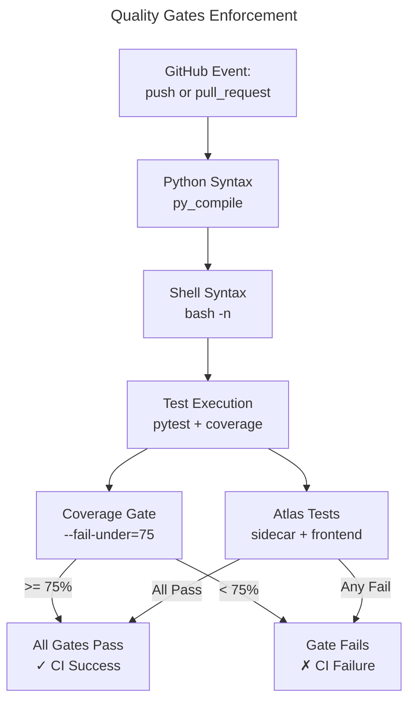
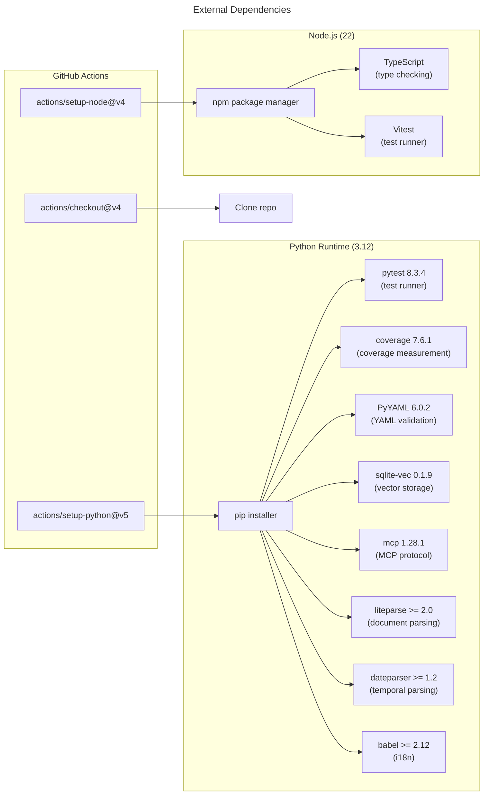

# C4 Code Level: GitHub Workflows and CI/CD Configuration

## Overview

- **Name**: LLmWiki-KennisBank CI/CD Automation
- **Description**: GitHub Actions workflows that enforce code quality gates, run automated tests, and validate deployable artifacts across the main KennisBank system and Atlas subsystem
- **Location**: [`.github/`](https://github.com/rvdbreemen/LLmWiki-KennisBank/tree/main/.github)
- **Language**: YAML (GitHub Actions workflows), Markdown (instructions)
- **Purpose**: Continuous integration pipeline that validates Python code compilation, runs comprehensive test suites with coverage gates, and validates frontend/backend components for both KennisBank core and Atlas application

## Code Elements

### Workflows

#### `ci.yml` - Main CI Pipeline
- **Location**: [`.github/workflows/ci.yml`](https://github.com/rvdbreemen/LLmWiki-KennisBank/blob/main/.github/workflows/ci.yml)
- **Trigger Events**:
  - `push` - All branches
  - `pull_request` - All branches
- **Description**: Two-job CI pipeline that validates KennisBank core tests and Atlas (Tauri app) subsystem independently

##### Job: `test`
- **Runs on**: `ubuntu-latest`
- **Timeout**: 30 minutes (hang safety net, not a performance target; measured baseline: 781 tests in ~20 min on Windows dev machine)
- **Environment**: Python 3.12
- **Steps**:
  1. **Checkout** (line 24-25)
     - Action: `actions/checkout@v4`
     - Purpose: Clone repository at current commit
  
  2. **Set up Python** (line 27-30)
     - Action: `actions/setup-python@v5`
     - Python version: `3.12`
     - Purpose: Install Python 3.12 runtime
  
  3. **Install dependencies** (line 32-33)
     - Command: `pip install -r requirements-dev.txt`
     - Purpose: Install dev dependencies including pytest, PyYAML, coverage, and base dependencies from requirements.txt
  
  4. **Compile all Python scripts** (line 35-36)
     - Command: `python3 -m py_compile scripts/*.py`
     - Purpose: Verify all scripts in `scripts/` compile without syntax errors
     - Files validated: All `.py` files in repository root `scripts/` directory
  
  5. **Shell syntax check** (line 38-39)
     - Command: `bash -n setup.sh scripts/doctor.sh`
     - Purpose: Verify shell scripts have valid bash syntax without executing them
     - Files validated: `setup.sh`, `scripts/doctor.sh`
  
  6. **Run test suite under coverage** (line 45-46)
     - Command: `python3 -m coverage run -m pytest tests -q`
     - Purpose: Execute full test suite with coverage tracking; uses pytest (not unittest discover) because unittest fails to collect bare module-level `test_*` functions (discovered during TASK-53: 21 tests across six files never ran, including doc guard in `tests/test_integration_documentation.py`)
     - Test directory: `tests/`
     - Coverage tool: coverage 7.6.1
     - Test runner: pytest 8.3.4
  
  7. **Coverage report and gate** (line 48-61)
     - Command: `python3 -m coverage report` + `python3 -m coverage report --fail-under=75`
     - **GATE**: Coverage floor is 75% (set deliberately just below locally measured baseline of 77% total to prevent noise but catch real regressions)
     - Output: Posts coverage summary to GitHub Step Summary for PR visibility
     - Runs with `if: always()` to report coverage even if tests fail

- **Coverage Baseline**: 75% minimum enforced; historically measured 77% on full suite

- **Dependencies**:
  - Internal: All test files in `tests/` directory, Python scripts in `scripts/` directory
  - External: pytest==8.3.4, coverage==7.6.1, PyYAML==6.0.2, sqlite-vec==0.1.9, mcp==1.28.1, liteparse>=2.0,<3, dateparser>=1.2,<2, babel>=2.12

##### Job: `atlas`
- **Runs on**: `ubuntu-latest`
- **Timeout**: 15 minutes
- **Purpose**: Isolated test job for Atlas (Tauri desktop app) with separate dependency domains for sidecar (Python) and frontend (TypeScript/React)
- **Context**: Atlas was previously tested outside CI (TASK-91), leading to unguarded changes; now enforced as separate job with own failure domain
- **Steps**:
  1. **Checkout** (line 70-71)
     - Action: `actions/checkout@v4`
  
  2. **Set up Python** (line 74-76)
     - Action: `actions/setup-python@v5`
     - Python version: `3.12`
  
  3. **Install sidecar dependencies** (line 78-79)
     - Command: `pip install -r atlas/sidecar/requirements.txt pytest`
     - Purpose: Install sidecar (Python backend) dependencies plus pytest
     - Requirements file: `atlas/sidecar/requirements.txt`
  
  4. **Sidecar tests** (line 81-82)
     - Command: `python3 -m pytest atlas/sidecar/tests -q`
     - Purpose: Run pytest on Atlas sidecar test suite
     - Test directory: `atlas/sidecar/tests/`
     - Test files include: test_asset.py, test_cors.py, test_decide_overview.py, test_doc.py, test_doctor.py, test_graph.py, test_graphify_html.py, test_health.py, test_memory_health.py, test_memory_links.py, test_overview_cache.py, test_overview_extras.py, test_perf.py, test_provenance.py
  
  5. **Set up Node** (line 84-89)
     - Action: `actions/setup-node@v4`
     - Node version: `22`
     - Cache: npm cache enabled
     - Cache dependency path: `atlas/frontend/package-lock.json`
  
  6. **Frontend install** (line 91-93)
     - Working directory: `atlas/frontend`
     - Command: `npm ci`
     - Purpose: Clean install of npm dependencies (reproduces exact locked versions from package-lock.json)
  
  7. **Frontend typecheck** (line 95-97)
     - Working directory: `atlas/frontend`
     - Command: `npx tsc --noEmit`
     - Purpose: TypeScript compiler validation without emitting JavaScript (checks type safety)
  
  8. **Frontend tests** (line 99-101)
     - Working directory: `atlas/frontend`
     - Command: `npx vitest run`
     - Purpose: Run test suite with Vitest (native ES modules test runner)

- **Dependencies**:
  - Internal: atlas/sidecar/tests/, atlas/sidecar/requirements.txt, atlas/frontend/src/, atlas/frontend/package-lock.json
  - External: pytest==8.3.4, Node.js 22, TypeScript, Vitest, npm packages in atlas/frontend/

### Configuration Files

#### `copilot-instructions.md` - GitHub Copilot Integration
- **Location**: [`.github/copilot-instructions.md`](https://github.com/rvdbreemen/LLmWiki-KennisBank/blob/main/.github/copilot-instructions.md)
- **Description**: Instructions for GitHub Copilot on how to interact with KennisBank
- **Content** (lines 1-2):
  - Instructs Copilot to call `recall` (MCP tool for KennisBank local knowledge base) before searching externally
  - Instructs Copilot to call `capture` (MCP tool) to save reusable facts back to KennisBank
- **Purpose**: Couples GitHub Copilot reviews and interactions with local KennisBank memory system via MCP protocol; ensures Copilot is aware of project-specific knowledge and can contribute to it

## Dependencies

### External GitHub Actions

| Action | Version | Purpose |
|--------|---------|---------|
| `actions/checkout` | v4 | Clone repository at current commit |
| `actions/setup-python` | v5 | Install Python 3.12 runtime |
| `actions/setup-node` | v4 | Install Node.js 22 runtime |

### External Python Dependencies

**Core Runtime** (`requirements.txt`):
- `sqlite-vec==0.1.9` - Vector embeddings storage (SQLite extension)
- `mcp==1.28.1` - Model Context Protocol for Copilot/agent integration
- `coverage==7.6.1` - Code coverage measurement
- `liteparse>=2.0,<3` - Document parsing (PDF/Office/images)
- `dateparser>=1.2,<2` - Multilingual temporal recall (200+ language fallback)
- `babel>=2.12` - Localization and internationalization utilities

**Development and CI** (`requirements-dev.txt`):
- Inherits all from `requirements.txt`
- `pytest==8.3.4` - Test runner (specifically chosen over unittest because unittest discover fails to collect bare module-level `test_*` functions; 21 tests across 6 files never ran before switch, including doc guard)
- `PyYAML==6.0.2` - Strict YAML frontmatter validator (tests/test_okf_export.py validates OKF-nested structures that internal `_frontmatter` parser cannot handle)

### External Node/JavaScript Dependencies

**Frontend Testing**:
- TypeScript - Type checking (via `npx tsc --noEmit`)
- Vitest - Test runner for TypeScript/React tests
- npm packages defined in `atlas/frontend/package-lock.json`

### Internal Repository Dependencies

**Python Scripts Validated**:
- All `scripts/*.py` files (compiled for syntax validation)
- Located in: `D:/Users/Robert/Documents/GitHub/RvdB/LLmWiki-KennisBank/scripts/`

**Shell Scripts Validated**:
- `setup.sh` - Main installation script (syntax checked)
- `scripts/doctor.sh` - Diagnostic validation script (syntax checked)

**Test Suites**:
- **KennisBank Core Tests**: `tests/` directory
  - 781+ tests (measured baseline from Windows dev machine, ~20 min runtime)
  - Test files include: test_activity.py, test_autoreview.py, test_backlog_integrity.py, test_build_embed_index_gate.py, test_build_kb_index.py, test_categories_json.py, test_categorize.py, test_checkpoint.py, test_command_settings_gates.py, test_command_structure.py, test_common.py, test_conflict_scan.py, test_context_budget.py, test_copilot_capture.py, test_copilot_config.py, and 50+ more
  
- **Atlas Sidecar Tests**: `atlas/sidecar/tests/`
  - Python-based tests for Tauri app backend
  - Test files: test_asset.py, test_cors.py, test_decide_overview.py, test_doc.py, test_doctor.py, test_graph.py, test_graphify_html.py, test_health.py, test_memory_health.py, test_memory_links.py, test_overview_cache.py, test_overview_extras.py, test_perf.py, test_provenance.py
  
- **Atlas Frontend Tests**: `atlas/frontend/src/*.test.ts`
  - TypeScript/React tests for Tauri app UI
  - Test files: encoding.test.ts, history.test.ts, palette.test.ts, readiness.test.ts, timefilter.test.ts

## Relationships

### CI Pipeline Flow Diagram

```mermaid
---
title: KennisBank CI/CD Pipeline
---
flowchart LR
    subgraph Trigger["Trigger Events"]
        PUSH["push (any branch)"]
        PR["pull_request (any branch)"]
    end
    
    subgraph Jobs["Parallel Jobs"]
        TEST["test job<br/>(ubuntu-latest, 30m timeout)"]
        ATLAS["atlas job<br/>(ubuntu-latest, 15m timeout)"]
    end
    
    subgraph TestSteps["test Job Steps"]
        CO["Checkout @ v4"]
        PYENV["Setup Python 3.12"]
        DEPS["pip install<br/>requirements-dev.txt"]
        COMPILE["py_compile<br/>scripts/*.py"]
        SHELL["bash -n<br/>setup.sh<br/>doctor.sh"]
        PYTEST["pytest + coverage<br/>tests/"]
        COVERAGE["coverage report<br/>--fail-under=75"]
    end
    
    subgraph TestGates["Test Gates"]
        GATE1["Coverage >= 75%<br/>(GATE)"]
    end
    
    subgraph AtlasSteps["atlas Job Steps"]
        ACO["Checkout @ v4"]
        APYENV["Setup Python 3.12"]
        SDEPS["pip install<br/>atlas/sidecar/requirements.txt"]
        SPYTEST["pytest<br/>atlas/sidecar/tests/"]
        ANODEENV["Setup Node 22"]
        FNPM["npm ci<br/>atlas/frontend"]
        TSC["tsc --noEmit<br/>(typecheck)"]
        VTEST["vitest run<br/>atlas/frontend/tests"]
    end
    
    PUSH --> Jobs
    PR --> Jobs
    
    Jobs --> TestSteps
    Goals --> AtlasSteps
    
    TestSteps --> CO --> PYENV --> DEPS --> COMPILE
    COMPILE --> SHELL --> PYTEST --> COVERAGE
    
    COVERAGE --> TestGates
    
    AtlasSteps --> ACO --> APYENV --> SDEPS --> SPYTEST
    SPYTEST --> ANODEENV --> FNPM --> TSC --> VTEST
    
    TestGates -->|PASS| SUCCESS["CI Success"]
    TestGates -->|FAIL| FAILURE["CI Failure"]
    VTEST -->|FAIL| FAILURE
    SPYTEST -->|FAIL| FAILURE
```



### Code Quality Gate Chain



### Dependency Graph: External Tools and Libraries



### Directory Structure Reference

```
.github/
├── workflows/
│   └── ci.yml                      # Main CI workflow
└── copilot-instructions.md         # Copilot integration config

Test & Source Files (referenced by CI):
scripts/
├── *.py                            # All compiled for syntax check
└── doctor.sh                       # Syntax validated

tests/                              # 781+ KennisBank core tests
├── test_activity.py
├── test_autoreview.py
├── test_backlog_integrity.py
└── ... (50+ test files)

atlas/sidecar/
├── requirements.txt                # Sidecar dependencies
└── tests/
    ├── test_asset.py
    ├── test_cors.py
    └── ... (15+ test files)

atlas/frontend/
├── package-lock.json               # Frontend dependencies
└── src/
    ├── encoding.test.ts
    ├── history.test.ts
    └── ... (5+ test files)

requirements.txt                    # Base runtime dependencies
requirements-dev.txt                # Dev + CI dependencies
setup.sh                           # Syntax validated
```

## Gates and Enforcement

### Primary Quality Gates

| Gate | Enforcer | Threshold | Consequence |
|------|----------|-----------|-------------|
| **Python Syntax** | `py_compile` on `scripts/*.py` | Must compile without errors | Job fails if syntax invalid |
| **Shell Syntax** | `bash -n` on setup.sh, doctor.sh | Must parse without errors | Job fails if bash syntax invalid |
| **Test Coverage** | `coverage report --fail-under=75` | Minimum 75% line coverage | Job fails if coverage < 75% |
| **Core Tests** | `pytest tests -q` | All 781+ tests must pass | Job fails if any test fails |
| **Sidecar Tests** | `pytest atlas/sidecar/tests -q` | All sidecar tests must pass | Atlas job fails if tests fail |
| **TypeScript** | `tsc --noEmit` | All code must type-check | Atlas job fails if type errors |
| **Frontend Tests** | `vitest run` | All frontend tests must pass | Atlas job fails if tests fail |

### Historical Context

- **Coverage Baseline**: 77% (locally measured on dev machine); gate set at 75% to prevent noise but catch real regressions
- **Timeout Basis**: 30 min for main tests = 1.5x the 20 min measured on Windows dev machine running 781 tests (deliberately wide margin for CI variance)
- **Pytest Adoption**: TASK-53 — unittest discover misses 21 bare module-level `test_*` functions across 6 files, including critical doc guard in `tests/test_integration_documentation.py`; switched to pytest
- **Atlas Isolation**: TASK-91 — Atlas previously unguarded outside CI; now separate job with own failure domain and timeout
- **Copilot Review**: PR reviews are gated via GitHub Copilot; see CLAUDE.md for review workflow

## Notes

- **Language Policy**: All documentation in repo is English (see CLAUDE.md, repo-level configuration)
- **Concurrent Jobs**: `test` and `atlas` jobs run in parallel; both must pass for CI success
- **Coverage Reporting**: Coverage summary posted to GitHub Step Summary for PR visibility via `$GITHUB_STEP_SUMMARY`
- **Documentation Sync**: See `docs/C4-Documentation/` for related documentation; TASK-123 tracks test growth analysis
- **Script Copying**: setup.sh validates installation by running `scripts/doctor.sh` as a read-only gate (never modifies vault)
- **MCP Integration**: Copilot instructions enable `recall` and `capture` MCP tools to sync PR review findings with KennisBank memory
