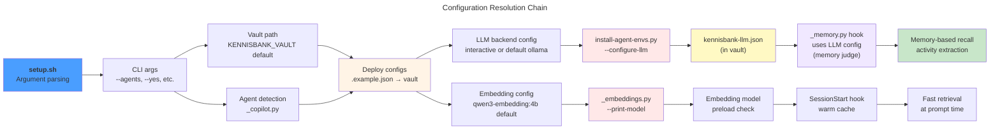

# C4 Code Level: LLmWiki-KennisBank Root

## Overview

- **Name**: KennisBank Installation and Configuration Layer
- **Description**: Root-level operational entrypoint for KennisBank deployment, vault initialization, configuration management, and agent integration. Provides setup automation, dependency resolution, configuration examples, and CLI argument parsing for both initial installation and upgrade workflows.
- **Location**: Repository root (`D:\Users\Robert\Documents\GitHub\RvdB\LLmWiki-KennisBank`)
- **Language**: Bash (setup.sh), Python (scripts/), JSON (configuration examples)
- **Purpose**: Initialize and upgrade KennisBank vaults across multiple agent platforms (Claude Code, Codex, OpenCode, GitHub Copilot CLI). Orchestrate vault directory structure creation, script deployment, configuration initialization, Python dependency installation, hook registration, and post-install validation.

## Code Elements

### Entry Points

#### `setup.sh` (21 KB, executable)

**Location**: `setup.sh:1-534`

**Purpose**: Main installation and upgrade orchestrator. Handles vault initialization, script deployment, configuration setup, dependency installation, hook registration, migrations, and post-install validation. Supports both interactive and non-interactive modes with comprehensive CLI argument parsing.

**Function**: Bash script with stages (not traditional functions, but logical phases):

1. **Argument Parsing**: `setup.sh:34-117`
   - Parses CLI flags: `--yes`, `--no-commands`, `--no-skill`, `--no-hooks`, `--agents`, `--no-codex`, `--skip-model-check`, `--skip-doctor`, `--force`, `--help`
   - Stores parsed state in shell variables: `ASSUME_YES`, `NO_COMMANDS`, `NO_SKILL`, `NO_HOOKS`, `FORCE`, `AGENTS`, `AGENTS_SET`, `SKIP_MODEL_CHECK`, `SKIP_DOCTOR`
   - Usage function at `setup.sh:45-68` prints help text

2. **Agent Detection and Selection**: `setup.sh:119-143`
   - Calls `python3 scripts/_copilot.py detect --json` to check Copilot CLI availability
   - Interactive prompt if no `--yes` and no `--agents` specified
   - Normalizes agent names to lowercase via `tr` pipeline

3. **Helper Functions**:
   - `has_agent(agent_name): Boolean` (`setup.sh:145-150`) — checks if agent is in `$AGENTS` list via pattern matching
   - `copy_file(src, dst): void` (`setup.sh:153-164`) — copies file with existence check; skips if exists unless `FORCE=1`
   - `copy_force(src, dst): void` (`setup.sh:166-171`) — forcibly overwrites (for tooling, never user data)

4. **Vault Directory Initialization**: `setup.sh:173-188`
   - Creates vault root: `${KENNISBANK_VAULT:-$HOME/KennisBank}` (defaults to `$HOME/KennisBank`, respects `KENNISBANK_VAULT` env var)
   - Creates subdirectories: `00-inbox`, `01-raw/sessies`, `01-raw/transcripts`, `02-wiki`, `03-projecten`, `04-templates`, `05-bronnen`, `06-claude`, `07-media`, `08-archive`, `09-memory`, `09-memory/archive`
   - Creates `.claude/scripts` and `graphify-out` subdirectories
   - Creates research output directory: `$HOME/Claude/research`

5. **Script Deployment**: `setup.sh:190-196`
   - Deploys all scripts from `scripts/*.py`, `scripts/*.sh`, `scripts/*.json` to `$VAULT/.claude/scripts/`
   - Uses `copy_force` (always overwrites tooling)
   - Sets executable bit on `*.py` and `*.sh` files via `chmod +x`

6. **Configuration File Setup**: `setup.sh:198-207`
   - Copies embedding backend config: `kennisbank-embed.example.json` → `$VAULT/.claude/kennisbank-embed.json`
   - Copies LLM backend config: `kennisbank-llm.example.json` → `$VAULT/.claude/kennisbank-llm.json`
   - Copies graphify scope config: `graphifyignore.example` → `$VAULT/.graphifyignore`
   - Uses `copy_file` (preserves existing user edits)

7. **LLM Backend Configuration**: `setup.sh:209-274`
   - Function `configure_llm_backend()` (`setup.sh:209-272`): Interactive or default LLM provider setup
   - Prompts for backend choice: `ollama` (default) or `openrouter` (cloud API, warns about data leaving machine)
   - Calls `python3 scripts/install-agent-envs.py` with `--configure-llm` flag to persist config
   - For OpenRouter: collects model slug, API key env var name, and optionally stores API key in `~/.config/kennisbank/secrets.json`

8. **Python Dependency Installation**: `setup.sh:276-299`
   - Determines correct Python interpreter: `py -3` (Windows) or `python3` (Unix) → `$PIP_PYTHON`
   - Function `install_python_dep(spec, import_name, purpose): void` (`setup.sh:283-292`)
     - Checks if module is importable via `python -c "import importlib.util"`
     - Installs via `$PIP_PYTHON -m pip install --quiet` if missing (non-fatal failure)
   - Installs core dependencies:
     - `sqlite-vec==0.1.9` (kb-index)
     - `liteparse>=2.0,<3` (document parsing)
     - `dateparser>=1.2,<2` (multilingual temporal recall)
     - `mcp==1.28.1` (MCP support if agent supports it, conditionally based on `has_agent`)

9. **Settings Initialization**: `setup.sh:301-330`
   - Loads/creates `kennisbank-settings.json` in vault root
   - File path: `$VAULT/kennisbank-settings.json`
   - Settings keys: `auto_archive`, `distill_notify`, `embed_index`, `daily_graphify`, `activity_llm_fallback`
   - Interactive prompt for each setting if TTY available and not `--yes`
   - Calls `python3 $VAULT/.claude/scripts/_settings.py init` for defaults or `set <key> <bool>` for individual toggles

10. **Template Deployment**: `setup.sh:332-335`
    - Copies all markdown templates from `templates/*.md` to `$VAULT/04-templates/`
    - Uses `copy_file` (preserves user edits)

11. **CLAUDE.md Initialization**: `setup.sh:337-348`
    - Copies `CLAUDE.md.template` → `$VAULT/CLAUDE.md` (only if absent unless `--force`)
    - Tracks whether CLAUDE.md pre-existed
    - Warns to edit `[YOUR NAME]` and `[YOUR PROJECTS]` placeholders

12. **Commands Deployment**: `setup.sh:351-380`
    - Conditional on `has_agent claude` and not `--no-commands`
    - Interactive confirmation unless `--yes`
    - Deploys from `commands/*.md` to `$HOME/.claude/commands/`
    - Deploys namespaced commands from `commands/*/*.md` to `$HOME/.claude/commands/<namespace>/` (e.g., `commands/kennisbank/settings.md` → `/kennisbank:settings`)
    - Uses `copy_force` (always overwrites tooling)

13. **Skills Deployment**: `setup.sh:382-402`
    - Conditional on `has_agent claude` and not `--no-skill`
    - Interactive confirmation unless `--yes`
    - Deploys from `skills/*/SKILL.md` to `$HOME/.claude/skills/<skillname>/SKILL.md`
    - Skills deployed: `autoresearch`, `kennisbank-upgrade`, `kennisbank-contribute`, etc. (subdirectories in `skills/`)
    - Uses `copy_force` (always overwrites tooling)

14. **Hook Registration**: `setup.sh:409-436`
    - Function `register_hooks()` (`setup.sh:409-418`): Registers SessionStart and UserPromptSubmit hooks
    - Calls `python3 $VAULT/.claude/scripts/register-hooks.py` with vault manifest
    - Conditional on `has_agent claude` and not `--no-hooks`
    - Hooks enable:
      - `SessionStart`: Warm wiki embedding cache via `build-embed-index.py`
      - `UserPromptSubmit`: Inject matching wiki snippets via `kb-retrieve.py`
    - Idempotent: preserves existing hooks/permissions/env vars
    - Non-fatal: setup continues if registration fails

15. **Migration and Maintenance**: `setup.sh:438-453`
    - Runs `python3 $VAULT/.claude/scripts/_migrations.py run <vault> <settings> [--skip-hooks]`
    - Applies version-gated upgrades: directories, hooks, toggles
    - Idempotent; fail-soft (does not break setup)
    - Builds activity index via `python3 $VAULT/.claude/scripts/build-activity-index.py --vault <vault> --progress-interval 300`

16. **Embedding Model Pre-Pull**: `setup.sh:461-467`
    - Conditional on not `--skip-model-check` and `ollama` available and `python3` available
    - Resolves configured embed model via `python3 scripts/_embeddings.py --print-model`
    - Runs `ollama pull <model>` if model not in `ollama list` output
    - Non-fatal: setup continues if pull fails (validate step will fail loudly)

17. **Agent Integration and Validation**: `setup.sh:469-485`
    - Calls `python3 scripts/install-agent-envs.py` with:
      - `--repo <repo_root>`, `--vault <vault>`, `--agents <agents>`
      - `--install` (install agent integrations for Codex/OpenCode)
      - `--validate` (run post-install validation)
      - `--skip-models` (if `--skip-model-check` set)
    - Captures exit code in `$AGENT_VALIDATE_RC`
    - Non-fatal on python3 missing (records RC=1)

18. **Doctor Gate (Post-Install Validation)**: `setup.sh:487-504`
    - Runs `bash $VAULT/.claude/scripts/doctor.sh` as final health check
    - Conditional on not `--skip-doctor` (default runs it)
    - Doctor performs: CLI availability checks, config validation, model smoke tests, vault structure verification
    - Captures exit code in `$DOCTOR_RC`
    - `--skip-doctor` flag used by CI/test runners that call doctor separately

19. **Post-Install Agent Status Summary**: `setup.sh:509-512`
    - Calls `python3 $VAULT/.claude/scripts/agent-status.py --agents <agents> --vault <vault>`
    - Prints compact per-agent rollup (the "dashboard" described in TASK-26.13)
    - Fail-soft: does not break setup if missing

20. **Exit and Summary**: `setup.sh:514-534`
    - Fails if either `$AGENT_VALIDATE_RC` or `$DOCTOR_RC` is non-zero
    - Prints "Klaar" (Dutch: "Done") message with next steps:
      - Vault path
      - CLAUDE.md editing instructions
      - Configured agent targets
      - LLM backend status
      - Hook registration status
    - Distinguishes between full validation and `--skip-doctor` case

**CLI Arguments**:

| Flag | Long Form | Type | Default | Purpose |
|------|-----------|------|---------|---------|
| `-y` | `--yes` | Boolean | 0 | Answer all prompts with yes (non-interactive) |
| (none) | `--no-commands` | Boolean | 0 | Skip copying Claude Code commands |
| (none) | `--no-skill` | Boolean | 0 | Skip copying Claude Code skills |
| (none) | `--no-hooks` | Boolean | 0 | Skip registering retrieval hooks in ~/.claude/settings.json |
| (none) | `--agents LIST` | String | "claude,codex" | Agent targets: claude, codex, opencode, copilot, all |
| (none) | `--no-codex` | Boolean | 0 | Alias for `--agents claude` |
| (none) | `--skip-model-check` | Boolean | 0 | Skip local Ollama model smoke tests |
| (none) | `--skip-doctor` | Boolean | 0 | Skip doctor.sh final gate (for CI/tests) |
| `-f` | `--force` | Boolean | 0 | Overwrite existing files (scripts, templates, commands, skills, CLAUDE.md) |
| `-h` | `--help` | Boolean | 0 | Print usage and exit |

**Environment Variables**:

- `KENNISBANK_VAULT`: Absolute path to vault root (overrides `$HOME/KennisBank` default)
- `PIP_PYTHON`: Resolved interpreter path (`py -3` on Windows, `python3` on Unix)
- `KENNISBANK_OPENROUTER_API_KEY_TO_STORE`: Temporary; passes API key to install script for storage in secrets.json

**Exit Codes**:

- `0`: Success (all validations passed)
- `1`: Failure (validation or agent setup failed)

**Dependencies** (in-script):

- Bash 4+ (requires `shopt -s nullglob`)
- Python 3 (for config setup, migrations, validation, agent integration, activity indexing)
- Git Bash on Windows (POSIX sh wrapper)
- `python3` or `py -3` (Windows) in `$PATH`
- `ollama` in `$PATH` (if model validation enabled)
- External scripts called (all deployed to `$VAULT/.claude/scripts/`):
  - `scripts/_copilot.py`: Detects Copilot CLI version
  - `scripts/install-agent-envs.py`: Installs and validates agent integrations
  - `scripts/_settings.py`: Manages runtime settings
  - `scripts/register-hooks.py`: Registers Claude Code hooks
  - `scripts/_migrations.py`: Applies vault migrations
  - `scripts/build-activity-index.py`: Builds activity index
  - `scripts/_embeddings.py`: Resolves embedding model
  - `scripts/doctor.sh`: Post-install diagnostics

---

### Configuration Files

#### `kennisbank-embed.example.json`

**Location**: `kennisbank-embed.example.json:1-34`

**Purpose**: Example embedding backend configuration. Copied to `<vault>/.claude/kennisbank-embed.json` by setup.sh (only if absent; use `--force` to overwrite). Read by `scripts/_embeddings.py`. Env vars override settings at runtime.

**Schema**:

```json
{
  "provider": "string",           // "ollama" | "openai" | "voyage"
  "model": "string",              // Model identifier (e.g., "qwen3-embedding:4b")
  "endpoint": "string",           // API endpoint URL (empty string for defaults)
  "api_key_env": "string",        // Name of env var holding API key (never the key itself)
  "retrieve_timeout": float,      // Seconds; timeout for KB retrieval (default 2.0)
  "prompt_hook_max_embed_timeout": float, // Max time for embedding in prompt hook (2.0)
  "retrieve_top_n": int,          // Top N results to return (default 3)
  "retrieve_threshold": float,    // Cosine similarity threshold for retrieval (0.5 for qwen3-4b)
  "memory_threshold": float,      // Cosine similarity threshold for memory (0.45 for qwen3-4b)
  "_threshold_note": "string",    // Human-readable notes on threshold tuning
  "_switching": {                 // Example provider configurations (reference only)
    "openai": {...},
    "voyage_anthropic_path": {...},
    "openai_compatible_gateway": {...}
  }
}
```

**Environment Overrides** (at runtime):

- `KB_EMBED_PROVIDER`: Provider override
- `KB_EMBED_MODEL`: Model override
- `KB_EMBED_ENDPOINT`: Endpoint override
- `KB_EMBED_API_KEY_ENV`: API key env var name
- `KB_RETRIEVE_TOP_N`: Top N override
- `KB_RETRIEVE_THRESHOLD`: Threshold override
- `KB_RETRIEVE_TIMEOUT`: Timeout override
- `KB_PROMPT_HOOK_MAX_EMBED_TIMEOUT`: Hook timeout override

**Default Values**:

- Provider: `ollama`
- Model: `qwen3-embedding:4b`
- Retrieve top N: 3
- Retrieve threshold: 0.5 (tuned for qwen3-4b; recalibrate after model switch)
- Retrieve timeout: 2.0 seconds
- Prompt hook timeout: 2.0 seconds

**Switching Models**:

- Changing model/provider **invalidates embedding cache** by design (cross-model vectors never compared)
- Next SessionStart rebuilds cache automatically
- Threshold must be recalibrated per model (example: qwen3-8b has higher true-match cosine range 0.73-0.80)

---

#### `kennisbank-llm.example.json`

**Location**: `kennisbank-llm.example.json` (read from setup.sh output or by reference)

**Purpose**: LLM backend configuration for memory judge/extraction. Configured during interactive setup. Stores provider, model, endpoint, and API key env var name (never the key itself). Used by `_memory.py` and `_judge.py` for local decision logic.

**Example Structure**:

```json
{
  "provider": "ollama" | "openrouter",
  "model": "qwen3.5:4b" | "openai/gpt-4o" | "<openrouter-slug>",
  "endpoint": "http://localhost:11434" | "https://openrouter.ai/api/v1",
  "api_key_env": "OPENROUTER_API_KEY"
}
```

**Supported Providers**:

- `ollama`: Local embedding and LLM (default, no API key needed)
- `openrouter`: Cloud API (warns that memory-sweep content leaves the machine)

**Default Model**: `qwen3.5:4b` (fits on 16 GB GPU alongside `qwen3-embedding:4b`)

---

#### `kennisbank-settings.example.json`

**Location**: `kennisbank-settings.example.json:1-14`

**Purpose**: Runtime toggles for background automation. Created by setup.sh in `$VAULT/kennisbank-settings.json`. Read by various scripts and hooks. Toggle on/off individual features.

**Schema**:

```json
{
  "auto_archive": false,          // Archive transcripts at session end
  "distill_notify": true,         // Notify at start if transcripts await processing
  "embed_index": true,            // Refresh wiki embeddings at SessionStart
  "daily_graphify": true,         // Auto-update graph 1x per day
  "memory_capture": true,         // Capture activity for memory recall
  "memory_recall": true,          // Enable memory recall in prompts
  "usage_telemetry": true,        // Track usage metrics
  "activity_llm_fallback": false, // Fall back to local LLM for date recognition
  "checkpoints": false,           // Store conversation checkpoints
  "orientation": false,           // Show orientation guide
  "graph_retrieval": true         // Enable graph-based retrieval
}
```

**Mutability**: User-editable via `/kennisbank:settings` command. Changes apply on next hook execution.

**Default State**:

- Archive: off (manual, avoids unexpected transcript moves)
- Notifications: on (distill reminders)
- Indexing: on (warm embeddings cache)
- Graphify: on (daily graph updates)
- LLM fallback: off (avoid cloud costs for dates)
- Telemetry: on (usage tracking)

---

### Python Entry Points (Deployed to Vault)

Scripts deployed from `scripts/` to `$VAULT/.claude/scripts/` by setup.sh. Core entry points (not exhaustive; see scripts/ documentation separately):

| Script | Purpose | Called By |
|--------|---------|-----------|
| `_copilot.py` | Detect GitHub Copilot CLI version | setup.sh (agent detection) |
| `_settings.py` | Manage kennisbank-settings.json | setup.sh (interactive or init) |
| `_embeddings.py` | Resolve and validate embedding models | setup.sh, kb-retrieve hook |
| `_migrations.py` | Apply version-gated vault upgrades | setup.sh (post-config) |
| `register-hooks.py` | Register SessionStart/UserPromptSubmit hooks in ~/.claude/settings.json | setup.sh |
| `build-activity-index.py` | Build temporal activity index | setup.sh, scheduled |
| `install-agent-envs.py` | Install and validate agent integrations (Codex, OpenCode, Copilot) | setup.sh |
| `doctor.sh` | Post-install health checks | setup.sh (final gate) |
| `agent-status.py` | Print per-agent installation status summary | setup.sh (post-install) |

---

## Dependencies

### External Python Packages

Listed in `requirements.txt`:

| Package | Version | Purpose | Installed By |
|---------|---------|---------|--------------|
| `sqlite-vec` | ==0.1.9 | Vector search for kb-index (semantic retrieval) | setup.sh (`install_python_dep`) |
| `mcp` | ==1.28.1 | Model Context Protocol SDK (Codex/OpenCode/Copilot support) | setup.sh (conditional on agent) |
| `coverage` | ==7.6.1 | Test coverage reporting | requirements.txt (CI/dev) |
| `liteparse` | >=2.0,<3 | Document parsing (PDF, Office, images) | setup.sh (`install_python_dep`) |
| `dateparser` | >=1.2,<2 | Multilingual temporal recall (200+ language fallback) | setup.sh (`install_python_dep`) |
| `babel` | >=2.12 | Localization support | requirements.txt |

### Development/Test Dependencies

Listed in `requirements-dev.txt` (superset of `requirements.txt`):

| Package | Version | Purpose |
|---------|---------|---------|
| `pytest` | ==8.3.4 | Test runner (function-style tests not supported by unittest discover) |
| `PyYAML` | ==6.0.2 | Strict frontmatter validation for OKF export tests |

### System Dependencies

- **Bash 4+**: Required for setup.sh (`shopt -s nullglob` feature)
- **Python 3**: For setup stage orchestration and script deployment
- **Ollama** (optional): For local embedding and LLM inference; enables `--skip-model-check` bypass if missing
- **Git Bash** (Windows): POSIX shell wrapper (prefer `C:\Program Files\Git\bin\bash.exe` over System32 `bash.exe` / WSL)

### Internal Script Dependencies

Scripts deployed by setup.sh depend on common modules:

- `_vaultpath.py`: Vault root resolver (all scripts use `from _vaultpath import vault_root()`)
- `_common.py`: Shared utilities (logging, config loading, vault utilities)
- `_embeddings.py`: Embedding model resolution (kb-retrieve, SessionStart hook)
- `_settings.py`: Runtime settings management (all background hooks)

---

## Relationships

### Installation and Validation Flow

```mermaid
---
title: KennisBank Setup and Validation Workflow
---
flowchart LR
    Start([User: bash setup.sh])
    
    Start --> ParseArgs["<b>Parse Arguments</b><br/>CLI flags → variables"]
    
    ParseArgs --> |TTY & no --agents| DetectAgent["<b>Detect & Prompt</b><br/>Copilot CLI check<br/>Interactive agent choice"]
    ParseArgs --> |--agents or --yes| SkipDetect["(skip detection)"]
    
    DetectAgent --> Normalize["Normalize agents<br/>(lowercase, dedup)"]
    SkipDetect --> Normalize
    
    Normalize --> VaultInit["<b>Vault Init</b><br/>mkdir 00-inbox..09-memory<br/>mkdir .claude/scripts<br/>mkdir graphify-out<br/>mkdir ~/Claude/research"]
    
    VaultInit --> DeployScripts["<b>Deploy Scripts</b><br/>cp scripts/*.py/sh/json<br/>→ $VAULT/.claude/scripts/<br/>chmod +x *.py *.sh"]
    
    DeployScripts --> DeployConfig["<b>Deploy Config</b><br/>cp kennisbank-embed.example.json<br/>cp kennisbank-llm.example.json<br/>cp graphifyignore.example<br/>(only if absent)"]
    
    DeployConfig --> |TTY & !--yes| ConfigLLM["<b>LLM Config</b><br/>Interactive: ollama | openrouter<br/>python3 install-agent-envs.py"]
    DeployConfig --> |--yes| DefaultLLM["(use ollama default)"]
    
    ConfigLLM --> InstallDeps
    DefaultLLM --> InstallDeps
    
    InstallDeps["<b>Install Python Deps</b><br/>sqlite-vec<br/>liteparse<br/>dateparser<br/>mcp (if codex|opencode|copilot)"]
    
    InstallDeps --> |Settings exist| SkipSettings["(preserve existing)"]
    InstallDeps --> |No settings| InitSettings["<b>Init Settings</b><br/>python3 _settings.py init<br/>or interactive toggle prompts"]
    
    SkipSettings --> DeployTemplates
    InitSettings --> DeployTemplates
    
    DeployTemplates["<b>Deploy Templates</b><br/>cp templates/*.md<br/>→ $VAULT/04-templates/"]
    
    DeployTemplates --> DeployClaudemd["<b>Deploy CLAUDE.md</b><br/>cp CLAUDE.md.template (if absent)"]
    
    DeployClaudemd --> |has_agent claude &<br/>!--no-commands| DeployCommands["<b>Deploy Commands</b><br/>cp commands/**/*.md<br/>→ ~/.claude/commands/"]
    DeployClaudemd --> |!has_agent claude| SkipCommands["(skip claude)"]
    
    SkipCommands --> DeploySkills
    DeployCommands --> |!--no-skill| DeploySkills["<b>Deploy Skills</b><br/>cp skills/*/SKILL.md<br/>→ ~/.claude/skills/"]
    DeployCommands --> |--no-skill| SkipSkills["(skip skills)"]
    SkipSkills --> RegisterHooks
    DeploySkills --> |!--no-hooks| RegisterHooks["<b>Register Hooks</b><br/>python3 register-hooks.py<br/>→ ~/.claude/settings.json<br/>SessionStart + UserPromptSubmit"]
    DeploySkills --> |--no-hooks| SkipHooks["(skip hooks)"]
    
    SkipHooks --> Migrate
    RegisterHooks --> Migrate["<b>Migrations</b><br/>python3 _migrations.py run"]
    
    Migrate --> ActivityIndex["<b>Activity Index</b><br/>python3 build-activity-index.py<br/>(temporal recall prep)"]
    
    ActivityIndex --> PullEmbedModel["<b>Embed Model Prep</b><br/>python3 _embeddings.py --print-model<br/>ollama pull if missing<br/>(unless --skip-model-check)"]
    
    PullEmbedModel --> AgentValidate["<b>Agent Integration</b><br/>python3 install-agent-envs.py<br/>--install --validate<br/>(Codex, OpenCode, Copilot)<br/>→ AGENT_VALIDATE_RC"]
    
    AgentValidate --> |!--skip-doctor| Doctor["<b>Doctor Gate</b><br/>bash doctor.sh<br/>CLI/config/model/vault checks<br/>→ DOCTOR_RC"]
    AgentValidate --> |--skip-doctor| SkipDoctor["(skip final gate)"]
    
    Doctor --> AgentStatus
    SkipDoctor --> AgentStatus["<b>Agent Status Summary</b><br/>python3 agent-status.py<br/>(dashboard)"]
    
    AgentStatus --> |RC=0 & RC=0| Success["✓ Setup Complete<br/>Print vault path<br/>CLAUDE.md edit hints<br/>Next steps"]
    AgentStatus --> |RC≠0 | Fail["✗ Validation Failed<br/>Print error summary<br/>exit 1"]
    
    Success --> End([Done])
    Fail --> End
    
    style Start fill:#4a9eff
    style End fill:#4a9eff
    style ParseArgs fill:#e8f4f8
    style DetectAgent fill:#e8f4f8
    style VaultInit fill:#fff4e6
    style DeployScripts fill:#fff4e6
    style DeployConfig fill:#fff4e6
    style InstallDeps fill:#ffe8e8
    style InitSettings fill:#ffe8e8
    style DeployTemplates fill:#fff4e6
    style DeployCommands fill:#fff4e6
    style DeploySkills fill:#fff4e6
    style RegisterHooks fill:#ffe8e8
    style Migrate fill:#ffe8e8
    style ActivityIndex fill:#ffe8e8
    style PullEmbedModel fill:#ffe8e8
    style AgentValidate fill:#f0e8ff
    style Doctor fill:#f0e8ff
    style Success fill:#c8e6c9
    style Fail fill:#ffcccc
```



### Vault Directory Structure Created

```mermaid
---
title: Vault Structure Initialized by setup.sh
---
graph TD
    Vault["<b>Vault Root</b><br/>${KENNISBANK_VAULT:-~/KennisBank}"]
    
    Vault --> Inbox["<b>00-inbox</b><br/>Inbox for new knowledge"]
    Vault --> Raw["<b>01-raw</b><br/>Raw input documents"]
    Vault --> Wiki["<b>02-wiki</b><br/>Processed wiki articles"]
    Vault --> Projects["<b>03-projecten</b><br/>Project notes"]
    Vault --> Templates["<b>04-templates</b><br/>Markdown templates"]
    Vault --> Sources["<b>05-bronnen</b><br/>External sources"]
    Vault --> Claude["<b>06-claude</b><br/>Claude-specific notes"]
    Vault --> Media["<b>07-media</b><br/>Images, videos"]
    Vault --> Archive["<b>08-archive</b><br/>Archived items"]
    Vault --> Memory["<b>09-memory</b><br/>Memory layer"]
    Vault --> Claude_config["<b>.claude/</b><br/>Agent config"]
    Vault --> Graphify["<b>graphify-out/</b><br/>Graph output"]
    Vault --> Settings["<b>kennisbank-settings.json</b><br/>Runtime toggles"]
    
    Raw --> Sessions["<b>01-raw/sessies</b><br/>Session transcripts"]
    Raw --> Transcripts["<b>01-raw/transcripts</b><br/>Processed transcripts"]
    
    Memory --> MemArchive["<b>09-memory/archive</b><br/>Memory snapshots"]
    
    Claude_config --> Scripts["<b>.claude/scripts/</b><br/>Deployed scripts"]
    Claude_config --> EmbedConfig["<b>kennisbank-embed.json</b><br/>Embedding config"]
    Claude_config --> LLMConfig["<b>kennisbank-llm.json</b><br/>LLM config"]
    
    Scripts --> EmbedScript["_embeddings.py"]
    Scripts --> KBIndex["_kbindex.py"]
    Scripts --> Memory_py["_memory.py"]
    Scripts --> Migrations["_migrations.py"]
    Scripts --> Activity["build-activity-index.py"]
    Scripts --> Doctor["doctor.sh"]
    Scripts --> Other["... (24+ scripts)"]
    
    style Vault fill:#e3f2fd
    style Claude_config fill:#fff3e0
    style Scripts fill:#fff3e0
```



### Configuration Dependency Chain



---

## Notes

### Critical Path Items

1. **Vault Path Resolution** (CLAUDE.md requirement):
   - Setup respects `KENNISBANK_VAULT` env var before defaulting to `$HOME/KennisBank`
   - Never hardcode vault paths; all scripts imported via `from _vaultpath import vault_root()`
   - Portable across machines and vault names (e.g., user might name vault "Kluis")

2. **Embedding Model Cache Invalidation**:
   - Switching embedding models/providers **invalidates cache by design** (cross-model vectors incomparable)
   - Threshold must be re-tuned per model (see `kennisbank-embed.example.json` tuning notes)
   - Next SessionStart automatically rebuilds index

3. **Python Interpreter on Windows** (CLAUDE.md requirement):
   - Setup resolves to `py -3` on Windows (Git Bash) to match Claude Code hook interpreter
   - Ensures dependencies installed in same Python environment as hooks
   - WSL `bash.exe` may write Linux paths; prefer `C:\Program Files\Git\bin\bash.exe`

4. **Hook Idempotency**:
   - `register-hooks.py` is idempotent: preserves existing hooks, permissions, env vars
   - Calling setup multiple times is safe
   - `--force` only overwrites scripts/templates/commands/skills, never user data

5. **Validation Stages**:
   - Agent integration validation happens before doctor gate (fix first, diagnose after)
   - Doctor is read-only (no repairs); setup stages do all repairs
   - `--skip-doctor` used by CI that runs doctor separately (not typical)

6. **Non-Interactive CI/CD**:
   - Use `--yes` for full automation or pipe empty input
   - Combine with `--skip-doctor` if doctor runs in separate CI step
   - Agent targets must be explicit (no interactive detection in CI)

### Testing Implications

- Pytest must be used (not unittest discover); function-style tests not collected by unittest
- Activity index build is deterministic and model-free
- Embedding model presence checked but pre-pull is non-fatal (validate step fails loudly)
- Settings initialization has two code paths (default vs. interactive); both tested via `_settings.py`

### Common Troubleshooting Points

1. **"python3 not found"**: Setup continues but skips agent config, migrations, index building. Many features will fail in vault use; user must install Python 3.
2. **"ollama not found"**: Embedding model pre-pull skipped; doctor.sh catches missing model at validation stage.
3. **"doctor.sh failed"**: Check doctor output for specific failure (CLI missing, config invalid, model download failed, vault structure wrong). Rerun setup after fixing root cause.
4. **Vault path mismatch**: User provided path via `KENNISBANK_VAULT` but setup doesn't honor it. Verify env var is set correctly before running setup.
