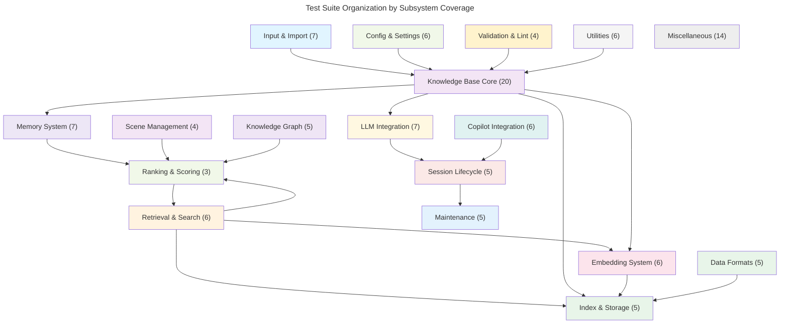

# C4 Code Level: Test Suite

## Overview

- **Name**: KennisBank Test Suite (tests/)
- **Description**: Comprehensive test coverage for KennisBank's knowledge management and AI integration system, organized into 142 test modules with ~1,600 test cases totaling ~24,000 lines of code.
- **Location**: [tests/](../../tests)
- **Language**: Python (unittest + pytest)
- **Purpose**: Guarantee hermetic, reproducible behavior of core subsystems: knowledge base retrieval, memory management, embeddings, LLM integration, copilot configuration, session lifecycle, and maintenance operations. All tests run against isolated temporary vaults to prevent pollution of production data.

## Test Suite Architecture

### Test Isolation Strategy

The entire suite is isolated via conftest.py and __init__.py:

1. **Session-scoped vault isolation** (conftest.py): All tests run against a temporary directory (`KENNISBANK_VAULT` env var), never the production vault (`~/KennisBank` or `Kluis`).
2. **Hermetic endpoint pinning** (__init__.py): Embed and LLM endpoints are pinned to a dead listening socket (127.0.0.1:0) by default, preventing any test from reaching real model servers. Integration tier (`KB_INTEGRATION=1`) can override this.
3. **Environment cleanup**: Fixtures restore prior state (KENNISBANK_VAULT, COPILOT_HOME, HOME, etc.) in tearDown.

### Test Infrastructure

| Module | Purpose | Location |
|--------|---------|----------|
| `conftest.py` | Pytest session fixture to isolate vault root | `tests/conftest.py` |
| `__init__.py` | Hermetic pinning for embed/LLM endpoints; TASK-21 (prevent cold-load hangs), TASK-141 (Windows dropped-port vs RST timing) | `tests/__init__.py` |
| `_loader.py` | Dynamic module loading helper for importing scripts | `tests/_loader.py` |

---

## Code Elements by Subsystem

### 1. Activity & Usage Tracking

**Purpose**: Guard activity index building, temporal parsing, usage reporting, and fingerprinting.

| Test Module | Test Classes | Key Methods | Responsibilities |
|---|---|---|---|
| `test_activity.py` | `ActivityFixtureMixin`, `PeriodParserTest`, `ActivityIndexTest`, `UsageSourceExtractorTest`, `FingerprintFastpathTest`, `LegacyTableMigrationTest` | `test_period_parse_*`, `test_build_activity_index_*`, `test_usage_source_*`, `test_fingerprint_*` | Validates activity index schema, period parsing (2026-06-27, "this week", etc.), usage source detection, fingerprint extraction, legacy migration path |
| `test_activity_multilang.py` | `MultilingualTemporalTest` | `test_multilang_parse_*`, `test_locale_*` | Multilingual temporal parsing (Dutch, other locales), locale-aware display names |
| `test_usage.py` | `TestEstimateTokens`, `TestFitToBudgetNoCeiling`, `TestFitToBudgetFits`, `TestFitToBudgetTrims`, `TestBudgetCLI` | Token estimation, budget fitting, CLI integration | Models token consumption, fits content into LLM context budget, validates CLI math |
| `test_usage_noise.py` | (function-level tests) | `test_noise_*` | Filters noise from usage data (build runs, scheduled jobs, temporary noise) |

**Dependencies**:
- Internal: `scripts/_activity.py`, `scripts/_common.py`, `scripts/_usage.py`
- External: `datetime`, `json`, `unittest`

---

### 2. Agent Management

**Purpose**: Tests for installation and status of external agents (Claude Code, etc.).

| Test Module | Test Classes | Key Methods | Responsibilities |
|---|---|---|---|
| `test_agent_envs_install.py` | `AgentEnvInstallTest` | `test_install_*`, `test_env_*`, `test_skip_*` | Validates agent environment installation (Claude, Copilot CLI, etc.), env var checks, skip logic for unavailable platforms |
| `test_agent_status.py` | `AgentStatusTest` | `test_status_*`, `test_detect_*` | Probes agent availability, version detection, status reporting |

**Dependencies**:
- Internal: (reads shell scripts and env setup)
- External: `subprocess`, `os`, `sys`

---

### 3. Archive & Transcript Management

**Purpose**: Test transcript archival, cleanup, and format preservation.

| Test Module | Test Classes | Key Methods | Responsibilities |
|---|---|---|---|
| `test_archive_transcript.py` | `ArchiveTest` | `test_archive_*`, `test_cleanup_*` | Validates archive-transcript script (move transcripts to archive, cleanup temp) |
| `test_strip_transcript.py` | (function-level tests) | `test_strip_*` | Removes sensitive data from transcripts (tokens, keys) |
| `test_transcript_formats.py` | `FormatTest` | `test_format_*` | Validates transcript format preservation (JSONL, MD serialization) |
| `test_discard_log.py` | `DiscardLogTest`, `ReconcileReportsTheCoveringMemoryTest`, `SweepWritesTheDiscardTest` | `test_discard_*`, `test_reconcile_*`, `test_sweep_*` | Manages discard log (records of discarded items), reconciliation with memory, sweep behavior |

**Dependencies**:
- Internal: `scripts/_transcript.py`, `scripts/_memory.py`
- External: `json`, `pathlib`, `unittest`

---

### 4. Auto-Review & Code Review

**Purpose**: Tests for automated review operations and documentation consistency.

| Test Module | Test Classes | Key Methods | Responsibilities |
|---|---|---|---|
| `test_autoreview.py` | `AutoReviewTest` | `test_autoreview_*` | Guards kb-autoreview script; verifies Copilot review capture, filtering, response parsing |
| `test_review_audit.py` | `ReviewAuditTest` | `test_audit_*` | Audits review state, coverage, and consistency |
| `test_docs_consistency.py` | `BilingualFactParityTest`, `CodeDerivedFactTest` | `test_fact_parity_*`, `test_code_facts_*` | Ensures docs/ADR/ and docs/superpowers/ facts agree, code-derived facts stay current |

**Dependencies**:
- Internal: `scripts/kb-autoreview.py`, `scripts/_memory.py`
- External: `unittest`, `pathlib`, `re`

---

### 5. Backlog Integrity

**Purpose**: Validates Backlog.md format and task structure.

| Test Module | Test Classes | Key Methods | Responsibilities |
|---|---|---|---|
| `test_backlog_integrity.py` | `BacklogIntegrityTest` | `test_structure_*`, `test_metadata_*` | Validates Backlog.md YAML, task frontmatter, milestone references, dependency chains |

**Dependencies**:
- Internal: (parses backlog/\*.md files)
- External: `yaml`, `pathlib`

---

### 6. Embedding System

**Purpose**: Guards embedding endpoint, model selection, configuration, dimensionality, prefix handling, and residency (local vs remote).

| Test Module | Test Classes | Key Methods | Responsibilities |
|---|---|---|---|
| `test_embed_config_memo.py` | `ConfigMemoTest` | `test_memo_*` | Validates embed config memoization (store/retrieve endpoint, model, dim) |
| `test_embed_model_default.py` | `EmbedModelDefaultTest` | `test_default_*` | Ensures default embed model selection respects KB_EMBED_MODEL env var |
| `test_embed_prefix.py` | `TestEmbedPrefix` | `test_prefix_*` | Guards embed prefix behavior (marker that prepends to all embeddings for source tracking) |
| `test_embed_residency.py` | `TestEmbedResidency`, `TestIsResident`, `EndpointResolutionTest` | `test_resident_*`, `test_endpoint_*` | Validates local (Ollama) vs cloud embed residency, endpoint resolution |
| `test_embed_sweep.py` | `TestEmbedSweep` | `test_sweep_*` | Guards embedding sweep operations (re-embed entire corpus with new model) |
| `test_build_embed_index_gate.py` | `EmbedIndexGateTest` | `test_gate_*` | Validates build-embed-index exit gates (checks before building) |

**Dependencies**:
- Internal: `scripts/_embeddings.py`, `scripts/build-embed-index.py`
- External: `unittest`, `os`, `tempfile`

---

### 7. Knowledge Base Index & Search

**Purpose**: Tests index schema, connection pooling, upsert operations, and full-text search.

| Test Module | Test Classes | Key Methods | Responsibilities |
|---|---|---|---|
| `test_kbindex_schema.py` | `KbIndexSchemaTest` | `test_schema_*`, `test_connect_*`, `test_meta_*` | SQLite schema creation, vec_docs table, FTS docs table, metadata storage |
| `test_kbindex_search.py` | `KbIndexSearchTest` | `test_search_*`, `test_fts_*` | Full-text search queries, ranking, result dedup, vector similarity search |
| `test_kbindex_upsert.py` | `KbIndexUpsertTest` | `test_upsert_*`, `test_collision_*` | Document upsert, hash collision handling, incremental updates |
| `test_fts_body_not_capped.py` | `FtsBodyNotCappedTest` | `test_fts_body_*` | Validates FTS index includes full body (not truncated) for query matching |
| `test_cache_file_resolution.py` | `CacheFileResolutionTest` | `test_cache_path_*` | Cache directory location resolution (`.claude/kb-*.db`, `.claude/cache/`) |

**Dependencies**:
- Internal: `scripts/_kbindex.py`, `scripts/_common.py`
- External: `sqlite3`, `sqlite-vec`, `tempfile`, `pathlib`

---

### 8. Knowledge Base Retrieval

**Purpose**: Guards retrieval pipeline: wiki block injection, memory block injection, reconciliation, presearch, ranking.

| Test Module | Test Classes | Key Methods | Responsibilities |
|---|---|---|---|
| `test_kb_retrieve_wiki.py` | `WikiBlockUntaggedTest` (function-style, no class) | `test_prompt_embed_*`, `test_wiki_block_*` | Wiki injection into kb-retrieve prompts, embedding timeout behavior, cosine ranking |
| `test_kb_retrieve_memory.py` | (function-style) | `test_memory_block_*`, `test_recall_*` | Memory block injection, recall from 09-memory/, precedence over wiki |
| `test_kb_retrieve_cold_notice.py` | `KbRetrieveColdNoticeTest` | `test_cold_notice_*` | Validates "cold start" notice when index not yet built |
| `test_kb_recall.py` | `KbRecallTest` | `test_recall_*`, `test_fallback_*` | Recall pipeline (kb-recall.py), fallback when index unavailable, prompt injection |
| `test_kb_recall_nocloud.py` | (function-style) | `test_nocloud_*` | Validates no cloud calls during recall (hermetic) |
| `test_kb_presearch.py` | (function-style) | `test_presearch_*` | Presearch step (keyword expansion before vector search) |
| `test_kb_search.py` | `KbSearchTest` | `test_search_*` | kb-search.py standalone search (no LLM), full-text + vector hybrid |
| `test_find_similar.py` | `TestBestMatchEmpty`, `TestBestMatchPicksHigher`, `TestBestMatchTwoCandidates` | `test_best_match_*` | Semantic similarity ranking, cosine distance, candidate ordering |

**Dependencies**:
- Internal: `scripts/kb-retrieve.py`, `scripts/kb-recall.py`, `scripts/kb-search.py`, `scripts/_embeddings.py`, `scripts/_rank.py`
- External: `unittest`, `mock`, `json`, `math`

---

### 9. Knowledge Base Operations & Commands

**Purpose**: Tests individual kb-* command-line tools and core KB operations.

| Test Module | Test Classes | Key Methods | Responsibilities |
|---|---|---|---|
| `test_kb_ask.py` | `KbAskTest` | `test_ask_*`, `test_prompt_*` | kb-ask.py (ask LLM with KB context), prompt engineering |
| `test_kb_calibrate.py` | `TestCalibrate` | `test_calibrate_*` | kb-calibrate.py (tune ranking thresholds) |
| `test_kb_eval.py` | `TestLoadSet`, `TestLatency`, `TestProductionParity`, `TestRank`, `TestEvaluate` | `test_eval_*` | Evaluation set loading, ranking parity tests, latency guardrails |
| `test_kb_eval_gen.py` | `EvalGenTest` | `test_gen_*` | Eval set generation (synthetic test cases) |
| `test_kb_lint.py` | `VaultCase`, `TestHardSeverity`, `TestLintVault`, `TestStrictExitCodes` | `test_lint_*` | kb-lint.py (scan 02-wiki/ and 09-memory/ for violations) |
| `test_kb_mcp.py` | `KbMcpTest`, `KbMcpSdkFailureModeTest`, `KbMcpTemporalToolTest` | `test_mcp_*` | MCP server for kb-* tools (Claude integration), failure modes |
| `test_kb_mcp_wire.py` | `WireClient`, `KbMcpWireTest` | `test_wire_*` | MCP wire protocol (serialization, dispatch) |
| `test_kb_normalize.py` | `NormalizeLinkTest`, `NormalizeTextTest` | `test_normalize_*` | Markdown link/text normalization (wikilinks, footnotes) |
| `test_kb_presearch.py` | (function-style) | `test_presearch_*` | Pre-search keyword expansion (synonym, expansion before vector query) |
| `test_kb_verify.py` | (function-style) | `test_verify_*` | kb-verify.py (check index integrity, detect corruption) |

**Dependencies**:
- Internal: `scripts/kb-*.py` commands, `scripts/_kbindex.py`, `scripts/_llm.py`
- External: `unittest`, `mock`, `json`, `pathlib`

---

### 10. Copilot Integration

**Purpose**: Tests GitHub Copilot CLI detection, config management, capture, and wrapper scripts.

| Test Module | Test Classes | Key Methods | Responsibilities |
|---|---|---|---|
| `test_copilot_config.py` | `CopilotConfigTest` | `test_detect_*`, `test_setup_*`, `test_config_*` | Copilot home detection, version checking (MIN_VERSION), config file management (dry-run, backup, rollback, idempotency) |
| `test_copilot_capture.py` | `CopilotCaptureTest` | `test_capture_*` | kb-copilot-capture.py (extract suggestions from Copilot completion logs) |
| `test_copilot_doctor.py` | `CopilotDoctorTest` | `test_doctor_*` | doctor.sh diagnostics (check install, version, config) |
| `test_copilot_e2e.py` | `CopilotE2ETest` | `test_e2e_*` | End-to-end workflow (install, detect, capture) |
| `test_copilot_import.py` | `CopilotImportTest` | `test_import_*`, `test_parse_*` | import-copilot.py (parse Copilot export JSON, write to 02-wiki/) |
| `test_copilot_wrapper.py` | `CopilotWrapperTest` | `test_wrapper_*`, `test_invoke_*` | kennisbank-copilot.py wrapper (intercept Copilot calls, inject KB context) |

**Dependencies**:
- Internal: `scripts/_copilot.py`, `scripts/kb-copilot-capture.py`, `scripts/import-copilot.py`
- External: `subprocess`, `json`, `tempfile`, `pathlib`, `shutil`

---

### 11. Memory System

**Purpose**: Tests memory file format (frontmatter + body), status tracking, and memory lifecycle operations.

| Test Module | Test Classes | Key Methods | Responsibilities |
|---|---|---|---|
| `test_memory.py` | `MemoryFormatTest` | `test_status_*`, `test_memory_path_*`, `test_render_*`, `test_write_*` | Memory status enum (unverified/current/superseded/retracted/expired), evidence basis enum, file path layout, frontmatter rendering, uniqueness |
| `test_memory_bitemporal.py` | (function-style) | `test_bitemporal_*` | Temporal tracking (created vs updated timestamps) |
| `test_memory_closures_visible.py` | (function-style) | `test_closure_*` | Memory closure chains (superseded_by, retracted_by) visible in search |
| `test_memory_doctor.py` | (function-style) | `test_doctor_*` | memory-doctor.py (scan 09-memory/ for stale/expired records) |
| `test_memory_notify.py` | (function-style) | `test_notify_*` | memory-notify.py (notify on memory lifecycle transitions) |
| `test_memory_review.py` | (function-style) | `test_review_*` | Review of memory entries (verify, supersede, retract) |
| `test_memory_sweep.py` | `SweepWritesTheDiscardTest` | `test_sweep_*` | memory-sweep.py (periodic cleanup: archive expired, notify stale) |

**Dependencies**:
- Internal: `scripts/_memory.py`, `scripts/_frontmatter.py`
- External: `pathlib`, `json`, `yaml`, `datetime`

---

### 12. Configuration & Settings

**Purpose**: Tests environment resolution, settings file loading, and command structure.

| Test Module | Test Classes | Key Methods | Responsibilities |
|---|---|---|---|
| `test_settings.py` | (function-style) | `test_settings_*`, `test_load_*`, `test_merge_*` | Settings file loading (kennisbank-settings.json), env var overrides, defaults |
| `test_env_int.py` | `TestEnvIntFailSoft` | `test_env_int_*` | Envelope integration (read nested env vars like KB_EMBED_CONFIG) |
| `test_command_structure.py` | `WikiCommandStructureTest`, `ReconcileCommandStructureTest`, `UitdaagCommandStructureTest`, ... | `test_structure_*`, `test_args_*`, `test_help_*` | Validates command structure (help text, arg parsing, subcommand layout) for skills |
| `test_command_settings_gates.py` | `CommandGateTest` | `test_gate_*` | Command exit gates (checks before command runs) |
| `test_skill_frontmatter.py` | (function-style) | `test_skill_*` | Skill YAML frontmatter parsing (description, usage, etc.) |
| `test_knob_consistency.py` | (function-style) | `test_knob_*` | Settings knob names consistent across files |

**Dependencies**:
- Internal: `scripts/_settings.py`, skill YAML files
- External: `os`, `pathlib`, `json`, `yaml`

---

### 13. Graph & Knowledge Graph

**Purpose**: Tests knowledge graph construction, traversal, link layers, and scope-based pruning.

| Test Module | Test Classes | Key Methods | Responsibilities |
|---|---|---|---|
| `test_graph_index.py` | `GraphIndexTest`, `BuilderTest` | `test_index_*`, `test_builder_*` | build-graph-index.py (construct graph from wikilinks), schema |
| `test_graph_link_layer.py` | `GraphLinkLayerTest` | `test_link_layer_*` | Link layer (raw edges vs qualified links) |
| `test_graph_provenance_ring.py` | `ProvenanceRingTest` | `test_ring_*` | Provenance ring (track source chain for derived facts) |
| `test_graph_retrieval.py` | `GraphNeighborTest`, `NeighborTelemetryTest` | `test_neighbor_*` | Neighbor retrieval (find linked docs), telemetry |
| `test_graph_scope_prune.py` | `GraphScopePruneTest`, `PromoteTest`, `VerifyPassTest`, `CandidateOrderTest` | `test_prune_*`, `test_promote_*` | Scope-based pruning (select connected component within token budget), candidate ordering |

**Dependencies**:
- Internal: `scripts/build-graph-index.py`, `scripts/graph-link-layer.py`, `scripts/graph-provenance-ring.py`, `scripts/graph-scope-prune.py`
- External: `unittest`, `tempfile`

---

### 14. LLM Integration

**Purpose**: Tests LLM endpoint selection, model defaults, context budgeting, and JSON extraction.

| Test Module | Test Classes | Key Methods | Responsibilities |
|---|---|---|---|
| `test_llm.py` | `LLMTest` | `test_llm_*`, `test_endpoint_*` | LLM endpoint resolution (KB_LLM_ENDPOINT env var), model selection |
| `test_llm_context.py` | `TestSelectLayersL0`, ..., `TestSelectLayersClamping`, ... | `test_layer_*`, `test_budget_*` | Context budget calculation (estimate tokens, fit content, trim to layer boundaries) |
| `test_llm_model_default.py` | `LLMModelDefaultTest` | `test_default_*` | Default model selection (from settings or env) |
| `test_llm_thinking.py` | (function-style) | `test_thinking_*` | Extended thinking mode (Claude API feature) |
| `test_llmjson.py` | `LLMJsonTest` | `test_json_*`, `test_extract_*` | JSON extraction from LLM output (parse structured responses, fall back to fallible extraction) |
| `test_context_budget.py` | `TestEnvIntFailSoft`, `TestEstimateTokens`, `TestFitToBudget*`, `TestBudgetCLI` | `test_budget_*`, `test_estimate_*` | Token budget estimation and fitting (see also test_usage.py) |

**Dependencies**:
- Internal: `scripts/_llm.py`, `scripts/_llmjson.py`, `scripts/_context_budget.py`
- External: `os`, `json`, `unittest`, `mock`

---

### 15. Maintenance & Cleanup

**Purpose**: Tests periodic maintenance (cache pruning, index validation, stale detection), supersede operations, and shared snapshot handling.

| Test Module | Test Classes | Key Methods | Responsibilities |
|---|---|---|---|
| `test_maintenance.py` | `AchtergrondjobTest` | `test_job_*` | Background maintenance coordinator, job scheduling, detached vs blocking |
| `test_maintenance_recheck.py` | (function-style) | `test_recheck_*` | Recheck logic (skip unchanged files, refresh stale) |
| `test_maintenance_shared_snapshot.py` | (function-style) | `test_snapshot_*` | Snapshot locking (multiple processes write index atomically) |
| `test_maintenance_supersede.py` | (function-style) | `test_supersede_*` | Supersede operation (mark docs as superseded, cleanup old versions) |
| `test_supersede_coverage.py` | `PromoteTest`, `VerifyPassTest` | `test_coverage_*` | Coverage verification after supersede |

**Dependencies**:
- Internal: `scripts/_maintenance.py`, `scripts/_reconcile.py`
- External: `threading`, `subprocess`, `pathlib`

---

### 16. Scoring & Ranking

**Purpose**: Tests ranking factors (recency, importance, trust, coupling) and reranking logic.

| Test Module | Test Classes | Key Methods | Responsibilities |
|---|---|---|---|
| `test_rank.py` | `TestRecencyFactor`, `TestImportanceFactor`, `TestTrustFactor`, `TestRerank`, `TestCouplingFactor`, `TestRerankCoupling` | `test_recency_*`, `test_importance_*`, `test_trust_*`, `test_coupling_*` | Ranking factor scoring, composite ranking |
| `test_rank_factors.py` | (function-style) | `test_factor_*` | Individual factor calculations (time decay, frequency, source authority, link coupling) |
| `test_rerank_ceiling.py` | (function-style) | `test_ceiling_*` | Reranking ceiling (max score guard to prevent runaway boosting) |

**Dependencies**:
- Internal: `scripts/_rank.py`
- External: `unittest`, `math`, `datetime`

---

### 17. Scene Management

**Purpose**: Tests scene capture, retrieval, reporting, and experimental scene features.

| Test Module | Test Classes | Key Methods | Responsibilities |
|---|---|---|---|
| `test_scenes.py` | `ScenesTest` | `test_scene_*`, `test_layout_*` | Scene object structure (metadata, blocks, relationships) |
| `test_scene_experiment.py` | (function-style) | `test_experiment_*` | Experimental scene features (A/B testing, feature flags) |
| `test_scene_recall.py` | (function-style) | `test_recall_*` | Scene recall from memory/index |
| `test_scene_report.py` | (function-style) | `test_report_*` | Scene reporting (summarize scene content) |

**Dependencies**:
- Internal: `scripts/_scenes.py`, `scripts/build-scene-index.py`
- External: `unittest`, `json`, `pathlib`

---

### 18. Session Lifecycle

**Purpose**: Tests session initialization, logging, and cleanup operations.

| Test Module | Test Classes | Key Methods | Responsibilities |
|---|---|---|---|
| `test_session_start.py` | (pytest function-style) | `test_coordinator_*`, `test_maintenance_*`, `test_freshness_*`, `test_emit_*`, `test_timeout_*`, `test_prewarm_*` | Session startup (orientation, index checks, prewarm, notifications) |
| `test_session_start_status.py` | (function-style) | `test_status_*` | Status report at session start (index freshness, memory count) |
| `test_session_end.py` | (function-style) | `test_end_*` | Session end (archive transcript, cleanup) |
| `test_session_end_recover.py` | (function-style) | `test_recover_*` | Recovery on abnormal session end (crash handling) |
| `test_session_log.py` | `SessionLogTest` | `test_log_*`, `test_entry_*` | Session log format, entry structure, timestamps |

**Dependencies**:
- Internal: `scripts/kb-session-start.py`, `scripts/kb-session-end.py`, `scripts/kb-session-log.py`
- External: `pytest`, `unittest`, `tempfile`, `pathlib`

---

### 19. Import & Export

**Purpose**: Tests data import from external sources (ChatGPT, Copilot, Claude AI) and export formats (OKF).

| Test Module | Test Classes | Key Methods | Responsibilities |
|---|---|---|---|
| `test_import_chatgpt.py` | `ChatGptParseTest`, `CollectJsonlTest`, `SourceImportTest` | `test_parse_*`, `test_import_*` | ChatGPT export parser, JSONL collection, source tracking |
| `test_import_copilot.py` | `CopilotImportTest` | `test_import_*` | Copilot CLI export import (see test_copilot_import.py) |
| `test_import_source_flag.py` | (function-style) | `test_source_*` | Source flag handling (track import origin) |
| `test_okf_export.py` | (function-style) | `test_okf_*`, `test_export_*` | OKF (Open Knowledge Format) export |

**Dependencies**:
- Internal: `scripts/import-chatgpt-export.py`, `scripts/import-copilot.py`, `scripts/kb-okf-export.py`
- External: `json`, `pathlib`, `unittest`

---

### 20. Data Validation & Parsing

**Purpose**: Tests frontmatter parsing, category definitions, slug generation, and extraction utilities.

| Test Module | Test Classes | Key Methods | Responsibilities |
|---|---|---|---|
| `test_frontmatter.py` | `TestSplitFrontmatter`, `TestParseFrontmatter` | `test_split_*`, `test_parse_*` | YAML frontmatter splitting, parsing, validation |
| `test_categories_json.py` | `TestCategoriesJsonOverride` | `test_categories_*` | Categories.json format (category name, abbreviation, color) |
| `test_categorize.py` | `TestCategorize` | `test_categorize_*` | Categorization logic (assign category based on doc content) |
| `test_common.py` | `TestSlugify`, `TestTimeHelpers`, `TestPrintSummary`, `TestImportersUseCommon`, `PidAliveTest`, `OutsideWindowTest` | `test_slugify_*`, `test_time_*`, `test_summary_*` | Common utilities (slug generation, time formatting, process checks, time windows) |
| `test_extract.py` | `ExtractTest` | `test_extract_*` | Content extraction (_extract.py: pull plain text from markdown) |

**Dependencies**:
- Internal: `scripts/_frontmatter.py`, `scripts/_common.py`, `scripts/_extract.py`
- External: `yaml`, `pathlib`, `re`, `datetime`

---

### 21. Verification & Ground Truth

**Purpose**: Tests correctness verification, conflict scanning, and lint operations.

| Test Module | Test Classes | Key Methods | Responsibilities |
|---|---|---|---|
| `test_groundcheck.py` | `VerifyPassTest`, `RefusalGateTest`, `ProducerProvenanceTest`, `SelfSourceLintTest`, `IndexDriftLintTest`, `NoNetworkDuringIngestTest` | `test_check_*`, `test_gate_*`, `test_lint_*` | Verification gates before operations, self-source validation, network hermiticity during ingest |
| `test_conflict_scan.py` | `TestCandidatePairsEmpty`, ..., `TestSelectLayersL3`, ... | `test_conflicts_*`, `test_candidate_*` | Conflict detection (contradictory facts), candidate pair scoring |
| `test_kb_verify.py` | (function-style) | `test_verify_*` | Index integrity verification (corruption detection, schema validation) |

**Dependencies**:
- Internal: `scripts/_groundcheck.py`, `scripts/conflict-scan.py`
- External: `unittest`, `json`, `re`

---

### 22. Utilities & Hardening

**Purpose**: Tests utility functions, hermetic pinning verification, and safety measures.

| Test Module | Test Classes | Key Methods | Responsibilities |
|---|---|---|---|
| `test_hermetic_pin.py` | `HermeticPinTest` | `test_pin_*`, `test_timing_*` | Validates dead endpoint pin is actually hermetic and fast (TASK-21, TASK-141) |
| `test_hardening.py` | (function-style) | `test_hardening_*` | Security hardening checks (no obvious credentials in logs, etc.) |
| `test_safe_edit.py` | (function-style) | `test_safe_edit_*` | Safe file editing (atomic writes, backup/rollback) |
| `test_slugify.py` | `TestSlugify` | `test_slug_*` | URL-safe slug generation from titles |
| `test_vaultpath.py` | (function-style) | `test_vault_*`, `test_root_*` | Vault root resolution (KENNISBANK_VAULT env var, fallback to ~/KennisBank) |
| `test_hooks_manifest.py` | `HooksManifestTest` | `test_manifest_*` | Hook installation manifest |

**Dependencies**:
- Internal: `scripts/_vaultpath.py`, `scripts/_common.py`, `scripts/_hooks_manifest.py`
- External: `os`, `tempfile`, `pathlib`

---

### 23. System Integration & Documentation

**Purpose**: Tests end-to-end workflows, documentation consistency, and integration points.

| Test Module | Test Classes | Key Methods | Responsibilities |
|---|---|---|---|
| `test_integration_documentation.py` | `BilingualFactParityTest`, `CodeDerivedFactTest` | `test_parity_*`, `test_code_*` | Bilingual doc parity, code fact alignment |
| `test_docs_consistency.py` | `BilingualFactParityTest`, `CodeDerivedFactTest` | `test_consistency_*` | Documentation fact consistency across README, AGENTS.md, ADRs |
| `test_language_policy.py` | (function-style) | `test_language_*` | Repository language policy enforcement (English default, no NL except benched variants) |
| `test_setup_deploy.py` | (function-style) | `test_setup_*`, `test_deploy_*` | Setup.sh and deploy scripts |
| `test_git_upstream_check.py` | `DriftCheckTest`, `AchtergrondjobTest` | `test_drift_*`, `test_upstream_*` | Git upstream drift detection (fork vs upstream sync) |
| `test_release_metadata.py` | (function-style) | `test_release_*`, `test_version_*` | Release version numbers, CHANGELOG consistency |

**Dependencies**:
- Internal: docs/ADR/, README.md, AGENTS.md, CHANGELOG.md, scripts/
- External: `pathlib`, `re`, `yaml`

---

### 24. Miscellaneous & Special Cases

**Purpose**: Edge cases, recovery paths, and special handling.

| Test Module | Test Classes | Key Methods | Responsibilities |
|---|---|---|---|
| `test_checkpoint.py` | `CheckpointBase`, `PreCompactStubTest`, `RegisterAndDoneTest`, `NotifyTest` | `test_checkpoint_*`, `test_compact_*` | Checkpoint format (task tracking across sessions) |
| `test_distill_notify.py` | `DistillNotifyTest` | `test_notify_*` | Distillation notification (summarize new learnings) |
| `test_liteparse_integration.py` | (function-style) | `test_parse_*` | Lightweight markdown parsing |
| `test_index_launch.py` | `IndexLaunchTest` | `test_launch_*`, `test_init_*` | Index launch (initialize empty index, check preconditions) |
| `test_index_neighbours.py` | `IndexNeighbourTest` | `test_neighbor_*` | Neighbor lookup (k-NN from vector index) |
| `test_index_prune_scope.py` | `PruneScopeTest`, `CollectAndLayersTest`, `PruneNoticeTest` | `test_prune_*` | Scope pruning (select docs within budget from neighbors) |
| `test_injection_provenance.py` | `ProvenanceTagPureTest`, `MemoryBlockProvenanceTest` | `test_provenance_*` | Provenance tagging during injection (track doc source in prompts) |
| `test_judge.py` | `JudgeTest`, `SweepParsersMatchProductionTest` | `test_judge_*` | Judge module (evaluate doc relevance) |
| `test_judge_model_sweep.py` | (function-style) | `test_sweep_*`, `test_model_*` | Model sweep for judge (compare model performance) |
| `test_lock_clock_skew.py` | (function-style) | `test_lock_*`, `test_skew_*` | Distributed lock behavior under clock skew |
| `test_migrations.py` | (function-style) | `test_migration_*` | Schema migrations (upgrade paths) |
| `test_orientation.py` | (function-style) | `test_orient_*` | Session orientation (give user quick status) |
| `test_progress.py` | (function-style) | `test_progress_*` | Progress reporting (long-running operations) |
| `test_quiet_hook.py` | (function-style) | `test_quiet_*` | Quiet hook mode (suppress verbose output) |
| `test_reconcile.py` | (function-style) | `test_reconcile_*` | Reconciliation (align state after crash or manual edit) |
| `test_register_hooks.py` | (function-style) | `test_register_*` | Hook registration (install git hooks, shell hooks) |
| `test_state_audit.py` | (function-style) | `test_audit_*` | State audit (scan for inconsistencies) |
| `test_eval_privacy.py` | `EvalPrivacyTest` | `test_privacy_*` | Eval set privacy (.gitignore, not shared in releases) |
| `test_sweep_*.py` | Multiple | `test_sweep_*` | Embedding sweep operations, state management, launch/pass/failures |
| `test_query_seam_callsites.py` | (function-style) | `test_callsite_*` | Query seam callsite detection (where queries originate) |
| `test_zip_guard.py` | `ZipGuardTest` | `test_zip_*` | ZIP archive handling (safe extraction) |

**Dependencies**: Varies by test, mostly standard library (pathlib, json, re, tempfile, unittest, pytest)

---

## External Dependencies

### Python Testing Frameworks
- `unittest` — Standard library test framework (primary across suite)
- `pytest` — Alternative test runner (newer tests, parametrization, fixtures)
- `unittest.mock.Mock`, `unittest.mock.patch` — Mocking and patching

### Standard Library
- `os`, `sys`, `pathlib` — Path and environment manipulation
- `tempfile` — Temporary file/directory isolation
- `json`, `yaml` — Data format parsing
- `subprocess`, `threading` — Process and concurrency management
- `datetime` — Time manipulation
- `shutil` — File operations (copy, remove, tree walk)
- `importlib.util` — Dynamic module loading for script testing
- `sqlite3` — SQLite database operations
- `socket` — Network socket operations (hermetic pinning)
- `re` — Regular expressions
- `stat` — File permission checks

### Third-Party Dependencies
- `sqlite-vec` — Vector search extension for SQLite (embeddings)
- `PyYAML` — YAML parsing (config, frontmatter)

### External Endpoints (Mocked/Pinned)
- Ollama (embed model server) — Pinned to dead endpoint by default
- Claude API (LLM server) — Pinned to dead endpoint by default
- Copilot CLI — Mocked or skipped when not installed

---

## Dependencies: Internal Code Modules Tested

### Core Modules
- `scripts/_activity.py` — Activity index, usage tracking, fingerprinting
- `scripts/_common.py` — Common utilities (slugify, pid checks, time helpers)
- `scripts/_copilot.py` — Copilot CLI detection, config, installation
- `scripts/_embeddings.py` — Embedding cache, endpoint resolution, model selection
- `scripts/_extract.py` — Plain text extraction from markdown
- `scripts/_frontmatter.py` — YAML frontmatter parsing and splitting
- `scripts/_groundcheck.py` — Verification gates, lint operations
- `scripts/_hooks_manifest.py` — Hook installation tracking
- `scripts/_judge.py` — Relevance judgment logic
- `scripts/_kbindex.py` — SQLite index connection, schema, upsert, search
- `scripts/_liteparse.py` — Lightweight markdown parsing
- `scripts/_llm.py` — LLM endpoint selection, model defaults
- `scripts/_llmjson.py` — JSON extraction from LLM output
- `scripts/_maintenance.py` — Maintenance coordination, background jobs
- `scripts/_memory.py` — Memory file format, status tracking, lifecycle
- `scripts/_migrations.py` — Schema migration tracking
- `scripts/_progress.py` — Progress reporting
- `scripts/_provenance.py` — Source tracking for facts
- `scripts/_querycache.py` — Query result caching
- `scripts/_rank.py` — Ranking factors and scoring
- `scripts/_reconcile.py` — State reconciliation after crashes
- `scripts/_scenes.py` — Scene capture and retrieval
- `scripts/_settings.py` — Settings file loading and defaults
- `scripts/_sweepstate.py` — Embedding sweep state management
- `scripts/_sweeputil.py` — Embedding sweep utilities
- `scripts/_transcript.py` — Transcript format handling
- `scripts/_usage.py` — Token usage estimation and tracking
- `scripts/_vaultpath.py` — Vault root resolution

### Command Scripts
- `scripts/kb-*.py` (kb-retrieve, kb-recall, kb-search, kb-ask, kb-lint, kb-verify, kb-mcp, kb-normalize, kb-calibrate, kb-eval, etc.)
- `scripts/build-*.py` (build-kb-index, build-embed-index, build-graph-index, build-scene-index, etc.)
- `scripts/import-*.py` (import-chatgpt-export, import-copilot, etc.)
- `scripts/*-scan.py` (conflict-scan, wiki-scan, intake-scan, stale-check, git-upstream-check)
- `scripts/*-sweep.py` (embed-sweep, memory-sweep, judge-model-sweep)
- `scripts/kb-session-*.py` (kb-session-start, kb-session-end, kb-session-log, kb-session-end-recover)
- `scripts/memory-*.py` (memory-doctor, memory-notify, memory-sweep)
- Various single-purpose scripts

### Skills & Documentation
- `docs/ADR/` — Architecture Decision Records (English primary)
- `docs/superpowers/` — Feature documentation
- `.claude/skills/` — Skill YAML frontmatter and descriptions

---

## Relationships

### Test Coverage Map by Subsystem



### Test Count by Subsystem

| Subsystem | Test Files | Approx Test Cases | Purpose |
|-----------|-----------|------------------|---------|
| Knowledge Base Operations | 20 | 250+ | Core KB retrieval, search, lint, verify, ask |
| Session Lifecycle | 5 | 80+ | Session start/end, logging, recovery |
| Maintenance & Cleanup | 5 | 100+ | Index refresh, supersede, memory sweep |
| LLM Integration | 7 | 120+ | Endpoint, model, context budget, JSON extraction |
| Memory System | 7 | 90+ | Memory format, lifecycle, temporal tracking |
| Copilot Integration | 6 | 100+ | Config, capture, import, wrapper |
| Configuration & Settings | 6 | 80+ | Settings loading, env resolution, command structure |
| Embedding System | 6 | 70+ | Model selection, residency, prefix, sweep |
| Ranking & Scoring | 3 | 80+ | Ranking factors, reranking, ceiling |
| Knowledge Graph | 5 | 60+ | Graph building, link layer, scope pruning |
| Index & Storage | 5 | 100+ | Schema, search, upsert, FTS, cache |
| Scene Management | 4 | 50+ | Scene capture, recall, reporting, experiment |
| Retrieval | 6 | 90+ | Wiki/memory injection, presearch, recall, search |
| Data Validation & Parsing | 5 | 70+ | Frontmatter, categories, slugs, extraction |
| Verification & Audit | 4 | 50+ | Ground truth checks, conflict scanning, lint |
| Import & Export | 4 | 60+ | ChatGPT, Copilot, source tracking, OKF |
| Utilities & Hardening | 6 | 80+ | Vaultpath, hermetic pinning, safe edit, slugs |
| Activity & Usage | 4 | 100+ | Activity index, usage tracking, temporal parsing |
| Miscellaneous | 14+ | 200+ | Checkpoints, distill, recovery, lock/skew, queries |
| **Total** | **142** | **~1,600+** | Comprehensive hermetic coverage |

---

## Notes

### Test Quality & Strategy

1. **Hermetic by Default**: All tests use temporary vaults (KENNISBANK_VAULT env var) and pinned dead endpoints. Production data is never touched.

2. **Both unittest & pytest**: Older tests use `unittest.TestCase`; newer tests use pytest with function-style. Both run under `python -m pytest tests -q`.

3. **Large Suite**: 142 files, ~1,600 test cases, ~24,000 lines — comprehensive coverage of 40+ production scripts and 30+ library modules.

4. **Integration Tier**: Most tests mock embeddings and LLM. Setting `KB_INTEGRATION=1` unpins endpoints for optional end-to-end runs (not part of CI gate).

5. **Common Patterns**:
   - setUp/tearDown fixture pattern to isolate vault/env per test
   - Mock endpoints and model servers to stay fast and reliable
   - Dynamic script loading (`importlib.util`) for testing CLI tools as libraries
   - Temp directories for file operations, cleaned up in tearDown

6. **Critical Guards**: TASK-21 (hermetic pinning prevents cold-load hangs), TASK-141 (Windows timing), eval privacy (.gitignore), language policy (English docs), vault root resolution (no hardcoding).

### Running the Test Suite

```bash
# Run all tests with pytest
python -m pytest tests -q

# Run specific subsystem
python -m pytest tests/test_kb_*.py -v

# Integration tier (includes real model calls if available)
KB_INTEGRATION=1 python -m pytest tests -q

# Collect but don't run (useful for test discovery)
python -m pytest tests --collect-only -q
```

---

## File Locations & References

- **Test Directory**: [tests/](../../tests) (142 files, 24K LOC)
- **Test Infrastructure**: `tests/conftest.py`, `tests/__init__.py`, `tests/_loader.py`
- **Production Code**: [scripts/](../../scripts) (40+ command scripts, 30+ library modules)
- **Test Coverage by Subsystem**: See "Relationships" section above for dependency graph and counts
