# C4 Component Level: Agent Integration and Deployment

## 1. Overview

| Field | Value |
|---|---|
| **Name** | Agent Integration and Deployment |
| **Description** | Installs and validates one vault, one local MCP server, and one hook/lifecycle contract into four independent agent harnesses — Claude Code, Codex CLI, OpenCode, and GitHub Copilot CLI — without touching user content, and exposes the vault's recall/capture/temporal surface over MCP. |
| **Type** | Installer + adapter layer + local server component (not a standalone deployment unit — see Dependencies) |
| **Technology** | Bash (`setup.sh`, `doctor.sh`), Python 3 stdlib (all adapter scripts), JSON/TOML/Markdown/JS as generated artifacts, `mcp` Python SDK (stdio) |

## 2. Purpose

KennisBank's actual knowledge store — the vault markdown, `kb-index.db`, `kb-activity.db` — is agent-agnostic. This component is the layer that makes that store *usable* from whichever harness the user happens to run, and it does so under one hard constraint from the repo's north-star (`CLAUDE.md`): KennisBank must be invisible and never get in the way of the user's real work. Concretely that means:

- **One install, four harnesses.** `setup.sh` is the single entry point; `install-agent-envs.py` and `_copilot.py` are the harness-specific writers underneath it.
- **Idempotent by construction.** Re-running install must never duplicate a hook, clobber a user's hand-edited config, or lose an existing timeout override.
- **Fail-open, always.** A KennisBank hook must never be the reason an agent turn is blocked, denied, or slowed past its budget — this is the direct expression of "onzichtbaar, snel, uit de weg" (invisible, fast, out of the way) at the integration boundary.
- **One MCP surface.** Whichever harness can speak MCP (Codex, OpenCode, Copilot) reaches the same six tools through the same command, built from a single helper (`_mcp_server_argv`).
- **Provable, not just plausible.** Install success is asserted by running the actual protocol handshake (`initialize()` + `list_tools()`) against the six tools, not by checking that a config file merely exists.

## 3. Software Features

- **Cross-harness installer CLI** (`setup.sh`, `install-agent-envs.py --install --validate`): one command deploys scripts, config, commands, skills, hooks, and MCP registration for a chosen agent set (`claude`, `codex`, `opencode`, `copilot`, or `all`).
- **Per-harness config adapters**: Claude Code (hooks-only, no MCP), Codex CLI (`config.toml` + `hooks.json` + `AGENTS.md` + prompts), OpenCode (`opencode.json` + a generated Bun plugin + `AGENTS.md` + commands), GitHub Copilot CLI (`mcp-config.json` + `hooks/kennisbank.json` + `copilot-instructions.md` + `agents/kennisbank.agent.md`).
- **Single hook manifest** (`_hooks_manifest.py`): one declarative list of hook events, scripts, matchers, and timeouts consumed by all three hook-writing paths (Claude, Codex, Copilot) plus `doctor.sh`.
- **Local MCP server** (`kb-mcp.py`, stdio): exposes `recall`, `capture`, `review_pending`, `review_decide`, and four temporal-recall tools (`what_did_i_do`, `timeline`, `weeklog`, `topic_timeline`) to any MCP-capable harness.
- **Fail-open hook runtime**: every generated hook command is constructed so a script error, missing dependency, or malformed payload degrades to a no-op rather than blocking or denying the agent turn.
- **Idempotent, non-destructive mutation primitives**: marker-scoped managed blocks with automatic backup for freeform files (`AGENTS.md`, `copilot-instructions.md`), key-scoped JSON/TOML merges with equivalence checks for structured config — both leave unrelated user content untouched on every re-run.
- **Runtime-proof validation**: `validate_mcp_runtime` performs a real MCP client handshake and requires all six tools to be present before an install is accepted as successful; `validate_files` checks the deployed vault script set and per-harness config; `validate_models` smoke-tests Ollama/OpenRouter.
- **Cross-agent status reporting** (`agent-status.py`): a compact, ASCII-only per-harness dashboard read from on-disk config, no new runtime surface.
- **Copilot-specific extras**: a trivial launcher (`kennisbank-copilot.py`), a redacting hook-payload capture adapter (`kb-copilot-capture.py`), and a transcript importer (`import-copilot.py`) that feeds Copilot's cloud-backed CLI activity back into the local activity index.
- **Legacy migration and pruning**: every adapter prunes superseded fan-out hook entries (pre-coordinator scripts) and enforces exactly one SessionStart coordinator and one SessionEnd coordinator per harness (ADR-006, ADR-007).
- **Opt-in, documentation-only integration registry** (`adapters/registry.json`): a two-entry declarative index of integration points deliberately *not* auto-installed (repo-local Copilot instructions, Codex MCP docs pointer) — read by no code, informational only.

## 4. Code Elements

- [c4-code-adapters.md](./c4-code-adapters.md) — `adapters/registry.json`, `scripts/install-agent-envs.py`, `scripts/_copilot.py`, `scripts/_hooks_manifest.py`, `scripts/register-hooks.py`, and the Copilot runtime adapters (`kennisbank-copilot.py`, `kb-copilot-capture.py`, `import-copilot.py`, `quiet-hook.py`, `agent-status.py`) — the primary source for this component; contains the full adapter contract (C1–C11).
- [c4-code-root.md](./c4-code-root.md) — `setup.sh` (the orchestrator that calls every adapter in sequence), `doctor.sh` (post-install read-only health gate), and the three shipped `.example.json` config files (`kennisbank-embed.example.json`, `kennisbank-llm.example.json`, `kennisbank-settings.example.json`).
- [c4-code-scripts.md](./c4-code-scripts.md) — the integration slice within `scripts/`: `kb-mcp.py` (the MCP server exposing the six tools), `kb-session-start.py` / `kb-session-end.py` (lifecycle coordinators referenced by every hook manifest entry), `kb-retrieve.py`, `kb-presearch.py`.
- [c4-code-commands-skills.md](./c4-code-commands-skills.md) — the command and skill surface (`commands/*.md`, `skills/*/SKILL.md`) that `setup.sh` deploys to `~/.claude/commands`, `~/.claude/skills`, and — via `install-agent-envs.py` — to `~/.codex/prompts`, `~/.agents/skills` (shared by Codex/OpenCode/Copilot), and `~/.config/opencode/commands`.
- [c4-code-docs.md](./c4-code-docs.md) — the decision records this component implements: ADR-0002 (cross-platform scripts: `py -3` vs `python3`, `_vaultpath.vault_root()`), ADR-0003 (Copilot CLI as local-first integration, D1–D7), ADR-005 (superseded — hookless Codex/Copilot), ADR-006 (one SessionStart coordinator per client), ADR-007 (one SessionEnd coordinator per client).

## 5. Interfaces

### 5.1 MCP tool contract (`scripts/kb-mcp.py`, stdio transport)

Reached today by Codex CLI, OpenCode, and GitHub Copilot CLI, each pointed at the same command via `_mcp_server_argv(vault)` (`<py -3 | python3> <vault>/.claude/scripts/kb-mcp.py`). Claude Code does **not** register this server — Claude gets KennisBank exclusively through the hook path (§5.2).

| Tool | Signature | Purpose |
|---|---|---|
| `recall` | `recall_tool(query: str, k: int = 5, *, compact: bool = False) -> str` (`kb-mcp.py:150`) | Search the vault (memory + wiki) and return relevant knowledge as text. Must be called before external search per the Copilot instructions block. |
| `capture` | `capture_tool(title: str, body: str, memory_type: str = "feit", importance: int = 3) -> str` (`:179`) | Write a new memory (pull-write) into the vault's memory layer. |
| `review_pending` | `review_pending_tool(k: int = 10) -> str` (`:213`) | Read-only: list the unverified-memory review queue. |
| `review_decide` | `review_decide_tool(stem: str, decision: str) -> str` (`:230`) | Apply one human review decision (`approve\|reject\|skip`) — must only be called after explicit user confirmation per item. |
| `what_did_i_do` | `what_did_i_do_tool(date_or_period: str, topic: str = "", project: str = "", max_events: int = 25) -> dict \| str` (`:278`) | Temporal activity recall for a date or period. |
| `timeline` | `timeline_tool(period: str, topic: str = "", project: str = "", max_events: int = 50) -> dict \| str` (`:286`) | Chronological activity timeline. |
| `weeklog` | `weeklog_tool(period: str = "vorige week", topic: str = "", project: str = "", max_events: int = 100) -> dict \| str` (`:294`) | Weekly rollup with source references. |
| `topic_timeline` | `topic_timeline_tool(topic: str, period: str = "afgelopen 90 dagen", project: str = "", max_events: int = 80) -> dict \| str` (`:302`) | Follow one topic/entity through time. |

The four temporal tools share a dispatcher (`_activity_call`, `:258`) that guards against the activity module being unavailable, converts exceptions to warnings rather than raising, and — when `KENNISBANK_MCP_COMPACT_OUTPUT=1` is set in the client env (Copilot only, added in `_copilot.py:46`) — renders a short human-readable summary instead of raw JSON.

**Acceptance test, not just presence.** `install-agent-envs.py:validate_mcp_runtime` (`:793`) is the only thing that counts an MCP registration as valid: it runs a real `initialize()` + `list_tools()` handshake and requires all six tools by exact name before install is accepted (contract rule C9). A config file naming the server is not sufficient on its own.

### 5.2 Hook contract (`scripts/_hooks_manifest.py`, consumed by three writers)

One declarative list (`HOOKS`, `_hooks_manifest.py:12-22`) is the single source of truth for which lifecycle events fire which script, consumed by `register-hooks.py` (Claude), `install-agent-envs.py` (Codex), and `_copilot.py` (Copilot; OpenCode uses its own plugin-driven equivalent, §5.3).

| Event | Script | Matcher | Timeout (s) |
|---|---|---|---|
| `SessionStart` | `kb-session-start.py` | — | 240 |
| `SessionStart` | `kb-session-end-recover.py` | — | 30 |
| `UserPromptSubmit` | `kb-retrieve.py` | — | 30 |
| `SessionEnd` | `kb-session-end.py` | — | 90 |
| `PreToolUse` | `kb-presearch.py` | `WebSearch\|WebFetch` | 30 |
| `PreCompact` | `kb-checkpoint.py` | — | 15 |

- **Timeout ceiling**: `TIMEOUTS` (`:35-43`) plus `DEFAULT_TIMEOUT = 30` (`:45`) is the *only* place a timeout number may be declared (contract rule C7). No adapter hardcodes its own value, and `timeout(script)` (`:48`) is the sole sanctioned accessor. `_copilot.py:_hook_timeout` lazily imports the manifest and falls back to `{240, 90, 30}` only if the manifest itself is missing — never a substitute for it.
- **User overrides win.** Registration only *fills in* a missing timeout; an existing user-set value on a hook entry is never overwritten (`register-hooks.py:154-160`).
- **`PreCompact` is Claude-only by explicit decision** (`_hooks_manifest.py:18-21`): Codex and Copilot have no equivalent lifecycle event, so their hook maps omit it deliberately — not an oversight.
- **Coordinator invariant**: exactly one SessionStart coordinator and one SessionEnd coordinator per harness (ADR-006, ADR-007). Every adapter prunes legacy fan-out entries (`LEGACY_SESSION_START_SCRIPTS`, `LEGACY_SESSION_END_SCRIPTS`, `:55-68`) before writing the coordinator, on every re-run.
- **Per-harness event-name and payload divergence**: Codex uses `Stop` where Claude/Copilot use `SessionEnd`, and has no `PreCompact`. Copilot's own event names are camelCase (`sessionStart`, `userPromptSubmitted`, `preToolUse`, `postToolUse`, `sessionEnd`) and its payload keys differ from Claude's; `kb-copilot-capture.py:_get` (`:119`) absorbs both camelCase and snake_case so the same event schema (`kb-copilot-event/1`) comes out the other side.

**The fail-open invariant (contract rule C6) — the hard requirement.** A KennisBank hook must never be the reason an agent turn is blocked, delayed past its ceiling, or denied:

- `_copilot.py:_hook_command` (`:377-406`) appends `; exit 0` to *every* generated Copilot hook command (`:406`) — the single most load-bearing line in the adapter layer, because it guarantees a KennisBank `preToolUse` hook can never return Copilot's deny exit code 2.
- `kb-copilot-capture.py` wraps its entire body in a bare `try/except` (`:232-235`) and always exits 0, even on a malformed stdin payload.
- `quiet-hook.py:main` (`:72`) always returns 0 regardless of the wrapped script's outcome.
- The OpenCode plugin wraps every generated call in `try/catch` (`install-agent-envs.py:531-533`).
- Missing Ollama, a script exception, or unparseable input degrades to "skip the side effect," never to a blocking error — verified in `tests/test_copilot_capture.py` ("must fail open (exit 0) on garbage") and `tests/test_quiet_hook.py`.

### 5.3 Per-harness surface and CLI installers

| Harness | Skills | Commands / prompts | Instructions | Hooks | MCP | Config home override |
|---|---|---|---|---|---|---|
| **Claude Code** | `~/.claude/skills/<name>/SKILL.md` | `~/.claude/commands/*.md` | `CLAUDE.md` in the vault | `~/.claude/settings.json` via `register-hooks.py`; `SessionStart`, `UserPromptSubmit`, `SessionEnd`, `PreToolUse`, `PreCompact` | not registered by this layer — Claude reaches KennisBank only through hooks | — |
| **Codex CLI** | `~/.agents/skills/<name>/SKILL.md` | `~/.codex/prompts/<name>.md`, invoked as `/prompts:<name>` | `~/.codex/AGENTS.md` managed block | `~/.codex/hooks.json`; `SessionStart`, `UserPromptSubmit`, `Stop`, `PreToolUse` (no `PreCompact`) | `~/.codex/config.toml`, `[mcp_servers.kennisbank]` | `CODEX_HOME` |
| **OpenCode** | `~/.agents/skills/` (shared) | `~/.config/opencode/commands/<name>.md` — real slash commands | `~/.config/opencode/AGENTS.md` managed block | `~/.config/opencode/plugins/kennisbank.js`, driven by `session.idle` / `session.updated` (not the shared hook manifest — its own event model) | `~/.config/opencode/opencode.json`, `mcp.kennisbank` | `OPENCODE_CONFIG_DIR` |
| **GitHub Copilot CLI** | `~/.agents/skills/` — shared, no separate install | exposed as slash commands from the shared skills | `~/.copilot/copilot-instructions.md` managed block, plus the opt-in repo-local `.github/copilot-instructions.md` | `~/.copilot/hooks/kennisbank.json`; `sessionStart`, `userPromptSubmitted`, `preToolUse`, `postToolUse`, `sessionEnd` | `~/.copilot/mcp-config.json`, `mcpServers.kennisbank` | `COPILOT_HOME` |
| **Copilot extras** | — | — | custom agent profile `~/.copilot/agents/kennisbank.agent.md` | launcher `kennisbank-copilot.py`, capture `kb-copilot-capture.py`, import `import-copilot.py` | — | `KENNISBANK_COPILOT_BIN` for the binary |

**CLI installers, as operations:**

- `setup.sh [--yes] [--agents LIST] [--no-commands] [--no-skill] [--no-hooks] [--skip-model-check] [--skip-doctor] [--force] [--help]` — the sole user-facing entry point; orchestrates every stage below in sequence and fails the overall run if agent validation or `doctor.sh` returns non-zero.
- `install-agent-envs.py --repo <path> --vault <path> [--agents claude,codex,opencode,copilot|all] [--install] [--validate] [--configure-llm --llm-provider {ollama,openrouter} [--llm-model M] [--llm-api-key-env VAR]] [--skip-models] [--json]` — `main(argv) -> int` (`:1098`); the cross-harness installer/validator called by `setup.sh`.
- `install_codex(repo: Path, vault: Path) -> dict` (`:271`), `install_opencode(repo: Path, vault: Path) -> dict` (`:488`), `install_copilot(repo: Path, vault: Path) -> dict` (`:588`) — per-harness install operations invoked by `main`.
- `validate_files(repo, vault, agents: list[str]) -> list[str]` (`:627`) — the hard gate; empty list means pass. Has a known coverage gap: the Claude branch hardcodes four script names instead of iterating `_hooks_manifest.hooks()`, so `kb-session-end-recover.py` and `kb-checkpoint.py` registration is never asserted (flagged, not yet fixed).
- `validate_mcp_runtime(vault, timeout=15) -> list[str]` (`:793`) — the protocol-level MCP acceptance test (§5.1).
- `validate_models(vault, timeout=45) -> list[str]` (`:978`) — Ollama/OpenRouter smoke tests.
- `register-hooks.py <settings.json> --manifest <vault_root>` — Claude-only hook registration; `main(argv) -> int` (`:251`), exit 1 on unparseable settings, 2 on usage error.
- `_copilot.py {detect,install,remove,probe,validate} --vault <path> [--dry-run] [--json]` — `_main(argv) -> int` (`:774`); the standalone, hermetically-testable Copilot adapter CLI. `install(vault, *, home=None, dry_run=False) -> dict` (`:593`) and `remove(vault, *, home=None, dry_run=False) -> dict` (`:612`) are exact inverses over the same four managed surfaces.
- `doctor.sh` — post-install, **read-only** diagnostic gate; performs no repairs (all repairs happen during the `setup.sh` stages), run by default unless `--skip-doctor`.
- `agent-status.py --agents <list> --vault <path> [--json]` — `main(argv) -> int` (`:120`); reads on-disk config only, prints an ASCII-only per-harness dashboard (`ok`/`!!`/`--`) because the Windows console cannot render `✓` (ADR-0002).

**Idempotency requirement (contract rule C4) — every installer must satisfy this on repeated invocation:**

- Structured config (JSON/TOML) is mutated via a key-scoped merge with an equivalence check — `merge_json_key` (`_copilot.py:247`) — so a repeat run reports `skipped`, not a duplicate entry.
- Freeform files (`AGENTS.md`, `copilot-instructions.md`) are mutated only inside a marker-delimited managed block (`KB_START`/`KB_END`), with an automatic `.kbak` backup taken first (`replace_managed_block`, `_copilot.py:226`; `_backup`, `:204`).
- A hand-edited file *without* the KennisBank marker (e.g. a user's own `agents/kennisbank.agent.md`) is left untouched and reported `skipped`, never overwritten (`_copilot.py:601-604`).
- Every writer is exactly invertible: `remove()` deletes only the four surfaces `install()` wrote, and deletes the containing file only when nothing else remains in it (`_remove_hooks`, `_copilot.py:623`).
- Verified by `tests/test_agent_envs_install.py` (Copilot install idempotent; MCP repair does not duplicate the env subtable) and `tests/test_copilot_e2e.py` (Copilot install does not regress Codex).

## 6. Dependencies

### 6.1 Components used

- **Knowledge store / retrieval core** (`kb-index.db`, `kb-activity.db`, `_vaultpath.py`, `_embeddings.py`, `_memory.py`) — this component installs the *pointers* to these scripts and databases; it does not implement retrieval, indexing, or embedding itself. `kb-mcp.py` and the hook scripts (`kb-retrieve.py`, `kb-session-start.py`, etc.) are the seam.
- **Command/Skill surface** (see [c4-code-commands-skills.md](./c4-code-commands-skills.md)) — the content this component deploys into each harness's command/skill/prompt directories; it is a consumer, not the source of that content.
- **Vault-root resolver** (`_vaultpath.vault_root()`) — every script in this component resolves the vault exclusively through this resolver (ADR-0002); no hardcoded vault path exists anywhere in the adapter layer.

### 6.2 External systems

- **Claude Code** — receives KennisBank via `~/.claude/settings.json` hooks only; no MCP registration is written by this layer.
- **Codex CLI** — receives KennisBank via `~/.codex/config.toml` (MCP) and `~/.codex/hooks.json` (hooks); config home overridable via `CODEX_HOME`.
- **OpenCode** — receives KennisBank via `~/.config/opencode/opencode.json` (MCP) and a generated Bun plugin (`kennisbank.js`) reacting to `session.idle`/`session.updated`; config home overridable via `OPENCODE_CONFIG_DIR`.
- **GitHub Copilot CLI** (`@github/copilot`, v1.0.70+ required) — the one non-local, cloud-backed harness (ADR-0003); receives KennisBank via `~/.copilot/mcp-config.json`, `~/.copilot/hooks/kennisbank.json`, `~/.copilot/copilot-instructions.md`, and `~/.copilot/agents/kennisbank.agent.md`; config home overridable via `COPILOT_HOME`, binary discovery via `KENNISBANK_COPILOT_BIN`. KennisBank's own retrieval stays local even here — only Copilot's own model traffic is cloud-bound.
- **Ollama** (`http://localhost:11434`) — local embedding/LLM smoke tests (`validate_models`) and the runtime backend most generated configs point at by default.
- **OpenRouter** (`https://openrouter.ai/api/v1/...`) — the sole non-local network call in this layer, used only when a user explicitly configures `openrouter` as an LLM provider.
- **`mcp` Python package (pinned `mcp==1.28.1`) + `anyio`** — the only external dependency, used solely inside the `validate_mcp_runtime` subprocess and by `kb-mcp.py` itself.

## 7. Component Diagram

```mermaid
C4Component
    title Component Diagram for Agent Integration and Deployment

    Container_Boundary(agentintegration, "Agent Integration and Deployment") {
        Component(setup, "setup.sh", "Bash orchestrator", "Single install/upgrade entry point; runs every stage below in sequence")
        Component(installer, "install-agent-envs.py", "Python CLI", "Cross-harness installer + validator for Codex/OpenCode/Copilot; also validates the Claude deploy")
        Component(copilotAdapter, "_copilot.py", "Python module + CLI", "Hermetic Copilot config adapter: detect/install/remove/probe/validate")
        Component(registerHooks, "register-hooks.py", "Python CLI", "Claude Code hook registration into ~/.claude/settings.json")
        Component(hooksManifest, "_hooks_manifest.py", "Python module", "Single source of truth: hook events, matchers, timeouts")
        Component(mcpServer, "kb-mcp.py", "Python / MCP stdio server", "Exposes recall, capture, review_pending, review_decide, what_did_i_do, timeline, weeklog, topic_timeline")
        Component(doctor, "doctor.sh", "Bash", "Read-only post-install health gate")
        Component(agentStatus, "agent-status.py", "Python CLI", "Per-harness status dashboard, reads on-disk config only")
        Component(copilotRuntime, "Copilot runtime adapters", "Python (kennisbank-copilot.py, kb-copilot-capture.py, import-copilot.py, quiet-hook.py)", "Launcher, fail-open capture, transcript import, output suppression")
        Component(registry, "adapters/registry.json", "Static JSON", "Opt-in, documentation-only integration index; no code reads it")
    }

    Container_Ext(vaultScripts, "Deployed vault scripts", "<vault>/.claude/scripts/*.py", "kb-retrieve.py, kb-session-start.py, kb-session-end.py, kb-presearch.py, kb-checkpoint.py")
    System_Ext(claude, "Claude Code", "Hooks only, no MCP registration")
    System_Ext(codex, "Codex CLI", "MCP + hooks.json + AGENTS.md")
    System_Ext(opencode, "OpenCode", "MCP + generated Bun plugin")
    System_Ext(copilot, "GitHub Copilot CLI", "Cloud-backed, MCP + camelCase hooks + instructions + agent profile")
    System_Ext(ollama, "Ollama", "localhost:11434 embeddings/LLM")
    System_Ext(openrouter, "OpenRouter", "Optional cloud LLM provider")

    Rel(setup, installer, "Runs --install --validate")
    Rel(setup, registerHooks, "Runs --manifest")
    Rel(setup, doctor, "Runs as final gate")
    Rel(setup, agentStatus, "Runs for dashboard")
    Rel(installer, copilotAdapter, "Delegates Copilot install/validate")
    Rel(installer, hooksManifest, "Reads HOOKS + TIMEOUTS")
    Rel(registerHooks, hooksManifest, "Reads via importlib")
    Rel(copilotAdapter, hooksManifest, "Lazy import for timeouts")
    Rel(agentStatus, copilotAdapter, "detect() for Copilot status")
    Rel(copilotRuntime, copilotAdapter, "Detection, env, probe, validate")
    Rel(registry, registry, "Documentation only - not loaded by any component")

    Rel(installer, vaultScripts, "Validates presence; points generated config at these paths")
    Rel(registerHooks, claude, "Writes ~/.claude/settings.json hooks")
    Rel(installer, codex, "Writes config.toml, hooks.json, AGENTS.md, prompts")
    Rel(installer, opencode, "Writes opencode.json, kennisbank.js plugin, AGENTS.md, commands")
    Rel(copilotAdapter, copilot, "Writes mcp-config.json, hooks/kennisbank.json, instructions, agent profile")
    Rel(copilotRuntime, copilot, "Launches CLI, captures hook payloads, imports transcripts")

    Rel(codex, mcpServer, "MCP stdio: initialize + list_tools + tool calls")
    Rel(opencode, mcpServer, "MCP stdio: initialize + list_tools + tool calls")
    Rel(copilot, mcpServer, "MCP stdio: initialize + list_tools + tool calls")
    Rel(installer, mcpServer, "validate_mcp_runtime: real handshake, 6 tools required")

    Rel(mcpServer, ollama, "Embedding + generation calls")
    Rel(installer, ollama, "validate_models smoke test")
    Rel(installer, openrouter, "Optional LLM validation")
```

## 8. Notes for the Container level

- This component spans a **local process boundary** it does not itself define: `install-agent-envs.py`/`setup.sh` run once at install time on the developer's machine, while `kb-mcp.py` runs long-lived as a stdio child process per harness session. The Container-level view should likely split "installer/CLI tooling" from "MCP runtime server" as separate deployment units even though they share this one logical component.
- Four external systems (Claude Code, Codex CLI, OpenCode, GitHub Copilot CLI) are genuinely external actors from KennisBank's own deployment perspective — they are installed and run independently of this repo — and should be modeled as `System_Ext`/`Container_Ext` at the Container level, consistent with this document's diagram.
- Copilot is the one harness with a live network dependency on a third party (the Copilot CLI itself is cloud-backed); this is a boundary worth calling out explicitly at Container/Context level since it is the sole intentional exception to KennisBank's "local, always" principle (`CLAUDE.md` §"Lokaal, altijd").
