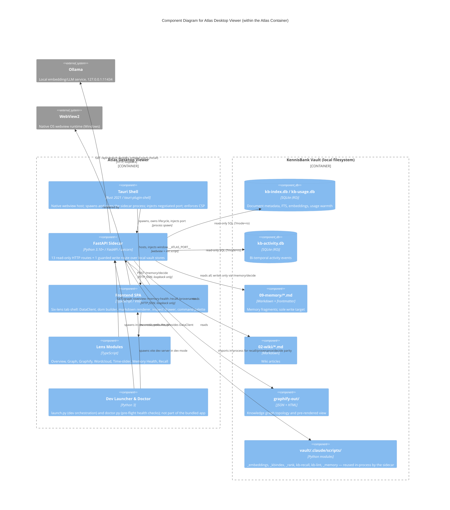

# C4 Component Level: Atlas Desktop Viewer

## Overview

- **Name**: Atlas Desktop Viewer
- **Description**: A read-only Tauri desktop application that gives a human editor a visual, exploratory window over the KennisBank vault — graph, memory lifecycle, retrieval waterfall, timeline, word cloud, and full-vault overview — without ever leaving the local machine.
- **Type**: Desktop application (native shell + local HTTP backend + web frontend), three co-deployed runtimes in one container
- **Technology**: Rust 2021 (Tauri v2 shell) + Python 3.10+/FastAPI (sidecar) + TypeScript/Vite (frontend), packaged as a single Windows MSI/NSIS installer (WebView2)

## Purpose

Atlas exists so that a KennisBank vault — its wiki, memory fragments, activity log, and knowledge graph — can be *looked at* rather than only queried through CLI tools and agent chat. It answers questions like "how healthy is the vault right now", "why did recall return this document", "what does this memory fragment supersede", and "how did the knowledge graph grow over time" — all rendered locally, in milliseconds to low seconds, with zero cloud dependency.

It is deliberately **not** a general-purpose editor. Per ADR-0004, Atlas is fail-open and read-only everywhere except one narrow, heavily guarded write path (memory fragment approval/rejection). It reuses KennisBank's own production Python modules (`kb-recall`, `_rank`, `_kbindex`, `kb-lint`, `_memory`) for every computed answer, so what Atlas shows is guaranteed to match what the CLI and agent hooks would compute — no parallel, drifting implementation of ranking or provenance logic.

The three runtimes exist for a reason each: Rust because a minimal native shell keeps the packaged app under 10 MB and avoids Electron's footprint; Python because the vault's own retrieval/health code is Python and reuse trumps reimplementation; TypeScript/Vite because a canvas-heavy, six-lens SPA is naturally a browser app, hosted in WebView2 rather than a second custom renderer.

## Software Features

Seven lenses, reached through a tab shell and a Cmd/Ctrl+K command palette (fuzzy-searches lenses and every indexed document by title):

- **Overzicht (Overview)**: Single-page vault health dashboard — wiki article counts by status, memory lifecycle counts, inbox backlog, raw session/transcript counts, a 182-day activity heatmap, freshness buckets (age of wiki articles), provenance coverage %, and a graph-staleness flag. Answers "how is the knowledge bank doing?" at a glance.
- **Graph**: Force-directed visualization of the wiki+memory knowledge graph (community detection, five color modes — community/status/kind/provenance/entry-points — node sizing by degree/importance, usage-warmth halos, lifecycle-status rings). Level-of-detail degrades gracefully above 400 nodes to hold interactive frame rates. Click any node to open it in the inspect drawer.
- **Graphify**: Embeds the self-contained interactive `graph.html` produced by the KennisBank `graphify` pipeline, served over loopback HTTP by the sidecar (no `file://` restrictions, full script execution inside the iframe).
- **Wordcloud**: Vault concepts sized by importance (`degree + warmth × 1.5`), capped at 150 terms, colored by community — a fast "what is this vault about" read.
- **Time-slider**: Bi-temporal graph filtering via a valid-as-of instant, toggling between capture-time (when the system learned a fact) and valid-time (when the fact was true); memory fragments carry `valid_from`/`valid_until`, wiki nodes are atemporal and always shown.
- **Memory Health**: Editor-in-chief cockpit for the memory layer — lifecycle counts, the unverified-fragment approval queue with inline approve/reject, an importance × recency heatmap, warm/tepid/stale usage rankings, and supersede chains with missing-target detection. The one place a human writes back into the vault.
- **Recall**: Live retrieval waterfall inspector — shows the vector-KNN, FTS, RRF-fusion, and per-hit rerank-factor stages (relevance × recency × importance × trust × usage) for a query, reusing the exact production `kb-recall` pipeline so the shown factors match real ranking behavior. Includes a "copy as JSON" export for bug reports and agent pipelines.

Supporting UX: an inspect drawer (back/forward history, wikilink navigation, lazy-loaded "memory entry points" accordion showing which memory fragments cite a wiki article) renders every document as sanitized Markdown (DOMPurify + a `textContent`-only DOM builder — no raw `innerHTML` except the one sanitized markdown render).

## Code Elements

- [c4-code-atlas.md](./c4-code-atlas.md) — Launcher (`launch.py`) and health doctor (`doctor.py`); dev-mode orchestration, build config (`package.json`, `BUILD.md`)
- [c4-code-atlas-src-tauri.md](./c4-code-atlas-src-tauri.md) — Rust Tauri shell (`main.rs`, `tauri.conf.json`, `Cargo.toml`, `build.rs`); webview host, sidecar process lifecycle, port injection, CSP/bundle config
- [c4-code-atlas-sidecar.md](./c4-code-atlas-sidecar.md) — FastAPI sidecar (`__main__.py`, `app.py`, `sources.py`); the 13 HTTP routes and their data-source readers
- [c4-code-atlas-sidecar-tests.md](./c4-code-atlas-sidecar-tests.md) — Sidecar pytest suite; CORS, read-only invariant, path-traversal guards, fail-open behavior, cache TTL/invalidation contracts
- [c4-code-atlas-frontend.md](./c4-code-atlas-frontend.md) — Frontend build/package config (Vite, TypeScript, `index.html`); dependency and CSP rationale
- [c4-code-atlas-frontend-src.md](./c4-code-atlas-frontend-src.md) — Frontend core modules: `main.ts` bootstrap, `data-client.ts` (HTTP contract + loopback guard), `dom.ts`, `markdown.ts`, `inspect.ts`, `lifecycle.ts`, `readiness.ts`, `history.ts`, `encoding.ts`, `timefilter.ts`, `palette.ts`, `colors.ts`
- [c4-code-atlas-frontend-src-lenses.md](./c4-code-atlas-frontend-src-lenses.md) — The seven lens render functions and their DataClient/encoding dependencies
- [c4-code-docs.md](./c4-code-docs.md) — ADR-0004 (architecture decision authorizing this component) and related ADRs/specs (ADR-0002 vault-path portability, ADR-007 Tauri bundling)

## Interfaces

### 1. Sidecar HTTP API (loopback, `127.0.0.1:{ephemeral-port}`)

All 13 routes return JSON (or typed binary for `/asset`); all reads are fail-open (missing stores degrade to empty-but-valid payloads, never 5xx). Path params in vault-relative POSIX form.

| Method & Path | Request | Response shape | Notes |
|---|---|---|---|
| `GET /health` | — | `{status: "ok"\|"degraded"\|"empty", version, vault, sources: {kb_index, activity, usage, memory, graph, ollama: bool}}` | Polled by frontend at boot with unbounded retry/backoff |
| `GET /graph?include_memory=false` | query: `include_memory` (bool, default false) | `{status, nodes: [{id, label, kind, layer, node_status, community, community_name, memory_type, importance, warmth, created, valid_from, valid_until, degree}], links: [{source, target, rel, weight}]}` | Collapses graphify's fragment-level graph to file-level nodes |
| `GET /timeline?bucket=day&from=&to=&dimension=event` | query: `bucket` (day\|week), `from`, `to` (ISO date), `dimension` (event\|capture) | `{status, buckets: [{start, end, event_count, capture_count, by_kind}]}` | Bi-temporal aggregation over `kb-activity.db` |
| `GET /memory-health` | — | `{status, counts: {active, quarantined, superseded, unverified}, queue: [{id, importance, created}], supersede_chains: [{head, chain, missing, valid_until}], heatmap: [{id, importance, age_days}], warmth: [{path, warmth, last_used, temperature}], quarantine: [{id, reason}]}` | |
| `GET /overview` | — | `{status, wiki: {total, by_status}, memory, memory_status, raw: {sessies, transcripts}, inbox_waiting, provenance: {sourced, total}, graph_stale, heatmap, freshness}` | TTL-cached 30s per (vault, date); invalidated by `/memory/decide` |
| `GET /titles` | — | `{status, items: [{title, path, layer}]}` | Backs the Cmd+K palette; fetched once per session |
| `GET /doc?path=` | query: `path` (must be `.md`) | `{status, path, title, content}` | Path-traversal guarded (containment check, `.md`-only) |
| `GET /asset?path=` | query: `path` | file bytes with `Content-Type` | `.png/.jpg/.jpeg/.gif/.webp/.svg` only; traversal-guarded |
| `GET /graphify-html` (+ `HEAD`) | — | `text/html` file | Serves `graphify-out/graph.html`; explicit HEAD support for the Graphify lens's pre-embed probe |
| `GET /recall?q=&k=` | query: `q` (string), `k` (int) | `{status, query, stages: {vector, fts, rrf, rerank}, final: [{path, score, snippet, neighbor?}]}` | Reuses production `kb-recall`/`_rank` for data parity; fail-open to `degraded` if Ollama/index unavailable |
| `GET /memory-links` | — | `{status, links: {stem: wiki_path}, counts: {wiki_path: n}, types: {stem: memory_type}}` | In-process cached for sidecar process lifetime; background-warmed at startup |
| `GET /provenance` | — | `{status, coverage: {sourced, unsourced, total}, unsourced: [{path, reason, types}]}` | Prefers vault's `kb-lint`; heuristic fallback |
| `POST /memory/decide` | JSON body: `{stem, decision: "approve"\|"reject"}` | `{status, stem, new_status}` | **The one write path** — see Trust Boundary below |

### 2. Port handshake (Tauri ↔ sidecar ↔ frontend)

1. Rust `main.rs::free_port()` binds a `TcpListener` to `127.0.0.1:0`, reads the OS-assigned port, drops the listener.
2. Rust spawns `atlas-sidecar --host 127.0.0.1 --port {port}` via `tauri-plugin-shell`; the sidecar's own `__main__.py::_free_port()` is bypassed in bundled mode since the port is dictated by the shell (dev-mode `launch.py` instead lets each side allocate its own port and passes the sidecar's port to the frontend via a URL query parameter).
3. Rust injects `window.__ATLAS_PORT__ = {port};` into the webview before the frontend loads (`initialization_script`).
4. Frontend's `data-client.ts::resolvePort()` reads `window.__ATLAS_PORT__` first (bundled app), falling back to the URL query param `?port=NNNN` (dev mode via `launch.py`).
5. `DataClient` constructs `base = http://127.0.0.1:{port}` and hard-guards every request against that literal prefix — a non-loopback base throws immediately, by construction.
6. `main.ts::connectSidecar()` polls `GET /health` with unbounded exponential backoff (starts 400ms, ×1.5, capped 2s, no deadline) to tolerate PyInstaller cold-boot latency, then renders the first lens.

### 3. Tauri command / process surface

Atlas's Rust shell exposes **no custom Tauri `#[command]` IPC handlers** — per ADR-0004 it carries zero business logic. Its surface is limited to:

- **Process spawn**: `app.shell().sidecar("atlas-sidecar").args([...]).spawn()` (via `tauri-plugin-shell`) — owns the sidecar's process handle for the app's lifetime; dropped (and the child killed) on window close, guaranteeing no orphan process.
- **Stderr drain**: an async task (`tauri::async_runtime::spawn`) reads `CommandEvent::Stderr` from the sidecar and forwards to the shell's own stderr, preventing the sidecar's output buffer from filling and blocking.
- **Webview construction**: `WebviewWindowBuilder` creates the single main window with the port-injection script and loads `frontendDist` (bundled) or `devUrl` (dev).
- **CSP enforcement** (declarative, `tauri.conf.json`): `default-src 'self'; connect-src http://127.0.0.1:*; img-src 'self' http://127.0.0.1:* data:; style-src 'self' 'unsafe-inline'; frame-src http://127.0.0.1:*` — blocks any fetch/XHR/WebSocket/image/frame load outside the app bundle and loopback.

All actual application logic — every "command" the user issues — flows through the HTTP API above, not through Tauri IPC.

## Dependencies

### Components Used

- None internal to KennisBank at the component level — Atlas sits *outside* the retrieval/memory/graph/activity pipeline as a **consumer only**. It does not call any other component's API; it reads their *materialized output* directly off disk:
  - **Retrieval component** (kb-index/embeddings pipeline): Atlas's sidecar loads and calls the vault's own `_embeddings.py`, `_kbindex.py`, `_rank.py`, `kb-recall.py` modules in-process (via `_load_vault_module()`, which adds `.claude/scripts/` to `sys.path`) rather than over any API — guaranteeing recall/rerank parity with the CLI, at the cost of a hard coupling to those modules' presence and shape in the deployed vault.
  - **Memory component** (memory lifecycle / `_memory.py`): read via `09-memory/*.md` frontmatter directly for health/heatmap/warmth aggregation; the one write path (`POST /memory/decide`) prefers the vault's own `_memory.decide()` for centralized guard logic and audit logging (TASK-89 shared codepath), falling back to an inline reimplementation if that module is absent (older vaults).
  - **Graph component** (graphify pipeline output): reads `graphify-out/graph.json` (topology) and `graphify-out/graph.html` (pre-rendered interactive view) as static files; does not invoke the graphify pipeline itself.
  - **Activity component** (`kb-activity.db`): read-only SQL aggregation (`?mode=ro`) for the timeline and overview heatmap; Atlas never writes activity events.
  - **kb-index / kb-usage stores** (`kb-index.db`, `kb-usage.db`): read-only SQL for document metadata, FTS/vector data, and usage warmth.

### External Systems

- **Ollama** (`http://127.0.0.1:11434`, local): the only outbound network call anywhere in Atlas — a `GET /api/version` liveness probe (used by `/health` and `doctor.py`) and live query embedding for `/recall`. Fail-open: recall degrades to empty results, all other lenses are unaffected.
- **WebView2** (Windows): the native rendering engine hosting the frontend SPA inside the Tauri shell; assumed pre-installed on Windows 11, bundleable by the installer otherwise. macOS (WKWebView) is scaffolded but not implemented.
- **Windows installer toolchain** (build-time only, not runtime): Rust/cargo, Tauri CLI, PyInstaller (freezes the sidecar to a Python-free `.exe`), Node/npm — none of these are present or required at runtime in the shipped app.

## Component Diagram

## Trust Boundary

Atlas's real security boundary is **loopback-only binding**, not authentication — there is none, and none is needed for a single-user desktop app (explicitly out of scope per ADR-0004; a multi-user scenario would need per-session tokens).

- **Loopback enforcement, both ends**: the sidecar binds `127.0.0.1` exclusively (never `0.0.0.0`); the frontend's `DataClient.guardBase()` independently hard-guards every request against a `http://127.0.0.1:` prefix and throws if violated. Two independent enforcement points for the same invariant.
- **Read-only by construction, not just by convention**: every SQLite connection opens with the `?mode=ro` URI parameter, so writes are physically rejected by SQLite regardless of what application code does — verified by `test_readonly.py` (SHA256 hash of `kb-activity.db` unchanged across a battery of endpoint calls).
- **The one write path**: `POST /memory/decide` is the sole mutation in the entire component. It is guarded on every axis: stem must contain no `/`, `\`, or `..`; the resolved target must land inside `09-memory/`; the file must exist; frontmatter must currently read `status: unverified`; only `unverified → current` (approve) or `unverified → retracted` (reject) transitions are permitted. It touches exactly one file, and only the `status:` line of that file's frontmatter — body and other metadata are preserved untouched (`test_decide_only_touches_the_status_line`). It invalidates the 30s `/overview` TTL cache so the dashboard reflects the change immediately.
- **CORS**: the sidecar allows only `GET`/`POST`, restricted by origin regex to dev localhost ports and Tauri webview origins (`tauri://localhost`, `http://tauri.localhost`); a foreign origin (e.g. `https://evil.example.com`) receives no `Access-Control-Allow-Origin` header (`test_cors.py`).
- **CSP (frontend/shell side)**: `connect-src http://127.0.0.1:*` blocks any script-initiated network call outside loopback, independent of what the sidecar itself would accept — defense in depth against a compromised or buggy frontend bundle.
- **Path traversal**: `/doc` and `/asset` resolve the requested path and verify containment within the vault root before serving; non-`.md` (for `/doc`) or unrecognized-extension (for `/asset`) requests are rejected fail-closed. Traversal attempts (`../`, mixed separators) return 400/404 without leaking file contents.
- **No `innerHTML` except one sanitized path**: the frontend's DOM builder (`dom.ts::el()`) uses only `createElement`/`textContent`; the single exception is rendered Markdown, which passes through DOMPurify with an explicit attribute whitelist before the one `innerHTML` assignment in the entire codebase (`markdown.ts::renderMarkdownInto`).
- **No outbound network beyond Ollama**: the sidecar's only external HTTP call is to `http://127.0.0.1:11434` (Ollama, itself loopback-only) for a version probe and query embedding; everything else is local file/SQLite I/O. There is no cloud dependency anywhere in this component.
