# C4 Component Level: Vault Content Pipeline

## Overview

- **Name**: Vault Content Pipeline
- **Description**: Turns raw material (inbox drops, imported transcripts, session logs) into curated wiki knowledge, and keeps that knowledge trustworthy over time through safe writes, provenance linting, normalization, and staleness detection.
- **Type**: Logical component (library modules + CLI scripts + slash-command orchestration), single container ("KennisBank Scripts Layer")
- **Technology**: Python 3.9+ (stdlib-first), Git (as the write/versioning substrate), Markdown + YAML frontmatter, SQLite (via `_kbindex.py`/`_activity.py` for downstream indexing), Claude Code slash commands (Markdown prompt files)

## Purpose

The pipeline owns the vault's content lifecycle: **00-inbox → 01-raw → 02-wiki → 08-archive**, with **09-memory** as a parallel distillation target fed from the same raw material. It answers one question for every piece of content: *how did this get here, and can I still check it against its source?*

Three concerns are bundled together because they share the same failure mode — a compiled artifact that silently loses its link to ground truth:

1. **Ingest & archive** — get material into the vault (inbox triage, external imports, transcript archival) without losing origin metadata.
2. **Distillation** — compile raw sessions/transcripts into wiki articles and memory fragments, always carrying forward a provenance link.
3. **Safe writes, lint, and normalization** — make sure every write to `02-wiki/` is atomic and revertible, every article passes a provenance check before it counts as "clean", and markdown stays in one canonical shape so downstream parsers (index builders, `_frontmatter.py`) don't have to guess.

## Software Features

- **Inbox triage**: scan `00-inbox/` for droppable files, classify each with a suggested action (import, discard, follow-up), and hand off to the right importer or fetcher.
- **Multi-source import**: normalize Claude.ai exports, ChatGPT exports, Claude Code session history, GitHub Copilot conversation history, and generic folders into a single raw-session shape under `01-raw/`.
- **Transcript archival**: capture the end-of-session transcript verbatim (`archive-transcript.py`, `kb-copilot-capture.py`) into `08-archive/` before any analysis touches it — capture-before-analysis is deterministic and never depends on editorial judgment (ADR-007).
- **Distillation**: turn archived/raw transcripts into wiki articles (`/destilleer`, `/wiki`, `/sessielog`) and memory fragments, watermark-guarded so re-runs are idempotent and a crash mid-compile just leaves the watermark untouched (safe to retry within the 7-day raw-log recovery window).
- **Semantic tiling**: chunk long documents at semantic boundaries so distillation and embedding operate on coherent slices instead of arbitrary line windows.
- **Document parsing**: turn arbitrary source documents (PDF, text, HTML-ish) into vault-shaped markdown with frontmatter via `_liteparse.py` / `parse-document.py`.
- **Safe, atomic wiki edits**: every write to a wiki article goes through `safe-edit.py`, which classifies the change size (`klein`/`groot`), gates large rewrites behind `--confirm`, and always leaves the working tree either fully applied or fully rolled back — never half-written.
- **Provenance lint**: `kb-lint.py` verifies every `02-wiki/` article carries a traceable link back to its raw session or source, catching missing, dangling, self-sourcing, and path-only (non-wikilink) provenance.
- **Normalization**: `kb-normalize.py` rewrites wiki markdown into canonical style so structural expectations (heading shape, frontmatter keys) hold across the whole vault.
- **Conflict scanning**: `conflict-scan.py` detects contradictory facts across articles as a candidate-pair scoring problem, feeding `/reconcile`.
- **Staleness detection**: `stale-check.py` (+ `/stale`) flags wiki articles that have aged out (by mtime/usage) so they get reviewed or superseded rather than silently trusted forever.

## Code Elements

This component pulls the "content" slice out of the broader scripts, tests, commands/skills, and docs code-level documentation:

- [c4-code-scripts.md](./c4-code-scripts.md) — `safe-edit.py`, `kb-lint.py`, `kb-normalize.py`, `parse-document.py`, `_liteparse.py`, `archive-transcript.py`, `import-copilot.py`, `import-claudeai-export.py`, `import-chatgpt-export.py`, `import-cc-history.py`, `import-folder.py`, `semantic-tiling.py`, `conflict-scan.py`, `stale-check.py`, `_frontmatter.py`, `_common.py` (slugify, print_summary)
- [c4-code-tests.md](./c4-code-tests.md) — `test_safe_edit.py`, `test_kb_lint.py`, `test_conflict_scan.py`, `test_copilot_import.py`, `test_import_chatgpt.py`, `test_import_copilot.py`, `test_import_source_flag.py`, `test_slugify.py`
- [c4-code-commands-skills.md](./c4-code-commands-skills.md) — `/intake`, `/destilleer`, `/wiki`, `/import`, `/reconcile`, `/stale`, `/sessielog`, `/checkpoint` command files and their templates (wiki-artikel template, sessie-log template)
- [c4-code-docs.md](./c4-code-docs.md) — ADR-007 (session logging/exit coordination, capture-before-analysis), "Transcript archival & destillation" spec (`docs/superpowers/specs/`), vault-structure conventions

## Interfaces

### Safe-Edit Engine

- **Protocol**: CLI (subprocess), stdin/argv in, JSON report on stdout
- **Description**: The only sanctioned write path into `02-wiki/`. Every caller (agent, `/wiki`, `/reconcile`, `/destilleer`) pipes proposed content through this instead of writing files directly.
- **Operations**:
  - `safe-edit.py <target> --new FILE|- [--confirm] [--force] [--message MSG]` — apply or gate a rewrite. Exit codes: `0` applied/no-op, `2` needs-confirm (large diff, re-run with `--confirm`), `3` refused (dirty tree / not a git repo, unless `--force`), `4` error (git add/commit failed, write rolled back).
  - Report shapes: `{"action":"applied","size":"klein"|"groot","commit":sha}`, `{"action":"no-op"}`, `{"action":"needs-confirm","size":"groot"}`, `{"action":"refused","reason":...}`, `{"action":"error","reason":...,"rolled_back":bool}`.
- **Write-after-commit-guard ordering** (the contract callers rely on): the write to disk necessarily happens *before* `git add`/`git commit`, because git can only see what's already on disk. Every failure path after the write (`git-add-failed`, `git-commit-failed`) therefore rolls the file back to its pre-write bytes via `_restore()` and unstages it — otherwise a single failed commit (e.g. a rejecting pre-commit hook) would leave the tree dirty and block every subsequent safe-edit call, since `--force` is forbidden by `commands/wiki.md`.

### Provenance Lint

- **Protocol**: CLI, JSON or human-readable text on stdout
- **Description**: Read-only gate that proves a wiki article can still be traced to its source. Used as the `/wiki` hard stop and in the doctor FAIL tier.
- **Operations**:
  - `kb-lint.py [--json]` — scan `02-wiki/` (skipping `index.md`, `log.md`).
  - **Exit contract**: `0` = all articles clean; `1` = error (vault or `02-wiki/` directory not found); `2` = warnings found.
  - **Finding types**: `missing` (no session/source link at all, HARD), `dangling` (wikilink target absent from `01-raw/sessies/` or `08-archive/`, HARD), `self-source` (provenance points at `02-wiki/`, `09-memory/`, `.claude/`, or `06-claude/` — the article cites its own inference as evidence, HARD), `path-only` (bare path text instead of a `[[wikilink]]`, advisory/soft).
  - `--strict` mode fails closed only on HARD types (`missing`, `dangling`, `self-source`); `path-only` stays advisory even under `--strict`.

### Normalization

- **Protocol**: CLI, in-place markdown rewrite
- **Description**: Rewrites a wiki article to canonical markdown shape (heading structure, frontmatter key order) so `_frontmatter.py` and index builders parse it deterministically.
- **Operations**:
  - `kb-normalize.py <target>` — normalize one article.

### Import Family

- **Protocol**: CLI, JSON export files in → raw-session markdown out
- **Description**: One shape per external source, converging on the same raw-session output contract consumed by `/destilleer` and `/sessielog`.
- **Operations**:
  - `import-claudeai-export.py <export.json>` — Claude.ai conversation export.
  - `import-chatgpt-export.py <export.json>` — ChatGPT conversation export.
  - `import-copilot.py` — GitHub Copilot CLI export, parses and writes into `02-wiki/`-adjacent raw storage.
  - `import-cc-history.py` — Claude Code session history.
  - `import-folder.py <dir>` — generic folder import.
  - Shared summary contract: `print_summary(summary: dict, as_json: bool)` (from `_common.py`) — every importer reports counts the same way.

### Document Parsing

- **Protocol**: Python function call (`_liteparse.py`) / CLI wrapper (`parse-document.py`)
- **Description**: Turns an arbitrary source document into vault-shaped markdown with frontmatter.
- **Operations**:
  - `is_supported_document(path: Path | str) → bool`
  - `parse_document(vault: Path, source: Path, ...) → dict`
  - `render_source_markdown(fm: dict, body: str, ...) → str`

### Conflict Scan

- **Protocol**: CLI / Python module, feeds `/reconcile`
- **Description**: Detects contradictory facts across wiki articles as a candidate-pair scoring problem.
- **Operations**:
  - `conflict-scan.py` — emit candidate contradictory pairs for `/reconcile` to adjudicate (via `safe-edit.py` + `kb-normalize.py` for the actual fix).

### Staleness Check

- **Protocol**: CLI, backs `/stale`
- **Description**: Flags articles that have aged out by mtime/usage so they surface for review instead of being trusted indefinitely.
- **Operations**:
  - `stale-check.py [days threshold]` — list stale `02-wiki/` articles.

### Slash-Command Orchestration (thin layer over the above)

- **Protocol**: Claude Code slash commands (Markdown prompt files, agent-driven)
- **Description**: Sequences the CLI operations above into the actual vault-directory contract. Not a code interface in the traditional sense, but the only place the pipeline's step order is enforced end-to-end.
- **Operations** (informal, one line each):
  - `/intake` — scan `00-inbox/` (`intake-scan.py`) → suggested action per file → `parse-document.py` / WebFetch → hands off into `01-raw/`.
  - `/import` — run the import-* family against an external source → `01-raw/`.
  - `/destilleer` — list pending archived transcripts (`distill-notify.py`) → import (`import-cc-history.py`) → strip large transcripts (`strip-transcript.py`) → run `/wiki` compile logic → update graph (graphify) → dedupe (`semantic-tiling.py`). Watermark-idempotent; a crash in the compile step leaves the watermark untouched.
  - `/wiki` — compile raw session logs into wiki articles via `safe-edit.py`, gated by `kb-lint.py`.
  - `/sessielog` — write the session log, then run the same compile logic as `/destilleer`/`/wiki` for the current session, plus a daily graphify batch.
  - `/reconcile` — run `conflict-scan.py`, resolve via `safe-edit.py` + `kb-normalize.py`, log the audit trail.
  - `/stale` — run `stale-check.py`, surface articles for review.
  - `/checkpoint` — save/restore/close a work-state snapshot to `01-raw/checkpoints/` (adjacent lifecycle tool, not itself content compilation, but shares the raw-tier storage contract).

## Dependencies

### Components Used

- **Foundation modules** (`_vaultpath.py`, `_common.py`, `_frontmatter.py`, `_settings.py`) — vault-root resolution, shared utilities (slugify, env readers), frontmatter parsing, and automation toggles (e.g. `auto_archive`, `distill_notify`) used by nearly every script in this component.
- **Memory & Extraction component** (`_extract.py`, `_judge.py`, `_llm.py`, `_llmjson.py`, `_memory.py`) — distillation into `09-memory/` calls the same extract/judge pipeline that memory-sweep uses; the pipeline hands raw transcript text to it rather than duplicating extraction logic.
- **Knowledge Index component** (`_kbindex.py`, `_embeddings.py`) — index builders consume the wiki articles this pipeline produces; `semantic-tiling.py` and embedding warm-up sit on the boundary between the two.
- **Activity component** (`_activity.py`) — session archival and distillation events get logged as activity, queried later by `/watdeedik` and friends.

### External Systems

- **Git** — the versioning substrate for every wiki write; `safe-edit.py` shells out to `git rev-parse`, `git status --porcelain`, `git add`, `git commit`, `git reset`.
- **Claude Code harness** — hosts the slash commands (`/intake`, `/destilleer`, `/wiki`, `/import`, `/reconcile`, `/stale`, `/sessielog`, `/checkpoint`) as agent-driven orchestration; also the SessionEnd hook that triggers `archive-transcript.py`.
- **GitHub Copilot CLI** — source of Copilot conversation exports (`import-copilot.py`, `kb-copilot-capture.py`), via `_copilot.py` (owned by a different component but invoked at capture time).
- **Claude.ai / ChatGPT export formats** — external JSON schemas consumed by the respective importers; no live API calls, pure file-in.
- **WebFetch** — used by `/intake` when inbox items are URLs rather than local files.
- **Filesystem (vault directories)** — `00-inbox/`, `01-raw/` (`sessies/`, `checkpoints/`), `02-wiki/`, `08-archive/`, `09-memory/`, `05-bronnen/` (source provenance) are the pipeline's actual contract surface; every operation above reads from or writes to one of these.

## Vault Directory Contract

The pipeline's real interface is a directory convention, not a function signature. Content moves strictly left to right; nothing skips a stage:

```
00-inbox/           →  unsorted drop zone. /intake triages it.
01-raw/sessies/     →  raw session logs (post-import, pre-compile).
01-raw/checkpoints/ →  work-state snapshots (/checkpoint), same tier as raw sessions.
02-wiki/             →  curated, compiled knowledge. Every write goes through safe-edit.py.
                         Every article here must lint clean (kb-lint.py) — traceable to
                         01-raw/sessies/ or 05-bronnen/ (imports), never to itself.
05-bronnen/          →  source provenance for imported (non-session) material.
08-archive/          →  verbatim, unmodified session transcript captures
                         (archive-transcript.py). Capture happens before any analysis —
                         deterministic, not gated on editorial judgment (ADR-007).
09-memory/            →  distilled memory fragments, extracted in parallel from the same
                         raw material (via _extract.py/_judge.py, not this component's
                         own logic).
```

`kb-lint.py`'s HARD self-source rule is the enforcement mechanism for the arrow direction: an article in `02-wiki/` may not cite `02-wiki/`, `09-memory/`, `.claude/`, or `06-claude/` as its provenance — only `01-raw/sessies/` or `05-bronnen/`. That is what stops the pipeline's output from being fed back in as if it were a source (the self-confirmation loop `llm_wiki #538` hit when the wiki cited its own log file).

## Component Diagram

```mermaid
C4Component
    title Component Diagram for KennisBank Scripts Layer — Vault Content Pipeline

    Container_Boundary(scripts, "KennisBank Scripts Layer") {
        Component(intake, "Inbox Triage", "CLI (intake-scan.py)", "Classify 00-inbox/ items, suggest action")
        Component(importers, "Import Family", "CLI scripts", "Claude.ai / ChatGPT / Copilot / CC-history / folder importers into 01-raw/")
        Component(docparse, "Document Parsing", "Python module (_liteparse.py)", "Arbitrary docs -> vault markdown + frontmatter")
        Component(archive, "Transcript Archival", "CLI (archive-transcript.py)", "Verbatim capture into 08-archive/, capture-before-analysis")
        Component(distill, "Distillation Orchestration", "Slash commands (/destilleer, /wiki, /sessielog)", "Compile raw sessions into wiki + memory, watermark-idempotent")
        Component(tiling, "Semantic Tiling", "Python module (semantic-tiling.py)", "Chunk documents at semantic boundaries")
        Component(safeedit, "Safe-Edit Engine", "CLI (safe-edit.py)", "Atomic, revertible writes to 02-wiki/; write precedes git add/commit, rollback on failure")
        Component(lint, "Provenance Lint", "CLI (kb-lint.py)", "Verify every wiki article traces to a raw session or source")
        Component(normalize, "Normalization", "CLI (kb-normalize.py)", "Canonical markdown shape")
        Component(conflict, "Conflict Scan", "CLI (conflict-scan.py)", "Detect contradictory facts across articles")
        Component(stale, "Staleness Check", "CLI (stale-check.py)", "Flag aged-out articles")
        Component(foundation, "Foundation Modules", "Python (_vaultpath, _common, _frontmatter, _settings)", "Vault resolution, utilities, toggles")
    }

    Component_Ext(memext, "Memory & Extraction", "Component", "_extract.py / _judge.py / _llm.py")
    Component_Ext(kbindex, "Knowledge Index", "Component", "_kbindex.py / _embeddings.py")
    System_Ext(git, "Git", "Version control substrate")
    System_Ext(harness, "Claude Code Harness", "Hosts slash commands and SessionEnd hook")
    System_Ext(copilotcli, "GitHub Copilot CLI", "Source of Copilot exports")
    System_Ext(vaultfs, "Vault Filesystem", "00-inbox / 01-raw / 02-wiki / 08-archive / 09-memory")

    Rel(intake, importers, "Hands off classified items")
    Rel(intake, docparse, "Parses local files")
    Rel(importers, docparse, "Reuses document parsing")
    Rel(distill, archive, "Consumes archived transcripts")
    Rel(distill, importers, "Imports pending transcripts")
    Rel(distill, tiling, "Dedupes / chunks content")
    Rel(distill, safeedit, "Writes compiled articles through")
    Rel(distill, memext, "Extracts memory fragments in parallel")
    Rel(safeedit, lint, "Gated by (must lint clean)")
    Rel(safeedit, normalize, "Output normalized before/after write")
    Rel(conflict, safeedit, "Fixes applied through")
    Rel(conflict, normalize, "Fixes applied through")
    Rel(stale, safeedit, "Flags feed reconciliation writes")
    Rel(intake, foundation, "Uses vault resolution, utilities")
    Rel(importers, foundation, "Uses vault resolution, utilities")
    Rel(safeedit, foundation, "Uses vault resolution")
    Rel(lint, foundation, "Uses vault resolution")

    Rel(safeedit, git, "add / commit / rollback", "subprocess")
    Rel(distill, harness, "Invoked as slash command")
    Rel(archive, harness, "Invoked via SessionEnd hook")
    Rel(importers, copilotcli, "Reads exported conversation history")
    Rel(intake, vaultfs, "Reads 00-inbox/")
    Rel(archive, vaultfs, "Writes 08-archive/")
    Rel(safeedit, vaultfs, "Writes 02-wiki/")
    Rel(lint, vaultfs, "Reads 02-wiki/, 01-raw/sessies/, 08-archive/")
    Rel(distill, kbindex, "Triggers downstream re-index")
```



## Notes

### Design Patterns

1. **Write-before-verify, verify-before-trust**: `safe-edit.py` writes then commits (atomically, with rollback); `kb-lint.py` runs after as an independent gate. The two are deliberately separate processes — a script that both writes and grades its own homework is exactly the self-source trap the HARD lint rule exists to catch.
2. **Watermarks over locks**: `/destilleer` and `/sessielog` use watermark files, not distributed locks, to make distillation idempotent. A crash leaves the watermark untouched, so recovery is just "run it again" within the 7-day raw-log window.
3. **One shape in, many sources**: every importer (`import-claudeai-export.py`, `import-chatgpt-export.py`, `import-copilot.py`, `import-cc-history.py`, `import-folder.py`) converges on the same raw-session output contract and the same `print_summary()` report shape, so `/destilleer` doesn't need to know which source produced a given raw log.
4. **Fail-closed on HARD, advisory on soft**: `kb-lint.py --strict` blocks the release/doctor gate only on `missing`/`dangling`/`self-source`; `path-only` stays a nudge, not a blocker — provenance still exists, it's just not a wikilink yet.

### Key Tradeoffs

1. **No `--force` on the sanctioned write path**: `commands/wiki.md` forbids `--force` in agent-invoked safe-edit calls, which means a failed commit (e.g. a rejecting pre-commit hook) blocks all subsequent writes to that target until the tree is clean again — deliberate, since the alternative is a silent bypass of the git guard.
2. **Capture before analysis, always**: `archive-transcript.py` runs before any distillation touches the transcript (ADR-007), even though this means archival happens whether or not the session produced anything worth distilling. Determinism was chosen over selectivity.
3. **Distillation overlaps `/sessielog`**: `/destilleer`'s backstop role over already-logged sessions is intentional redundancy, not a bug — low net-new signal is the cost of not depending on every session remembering to run `/sessielog`.

### Known Constraints

1. **Dirty-tree guard is target-relative**: `safe-edit.py`'s dirty-tree check excludes only the exact target path (not substring matches like `a.md.bak`), so any other uncommitted change in the repo blocks the write unless `--force`.
2. **Lint skips structure files**: `index.md` and `log.md` are exempt from provenance checks — they're vault scaffolding, not compiled knowledge.
3. **Self-source prefixes are hardcoded**: `SELF_SOURCE_PREFIXES = ("02-wiki/", "09-memory/", ".claude/", "06-claude/")` in `kb-lint.py` — a new synthesized-content directory added to the vault later must be added here explicitly or it silently becomes an accepted provenance source.
