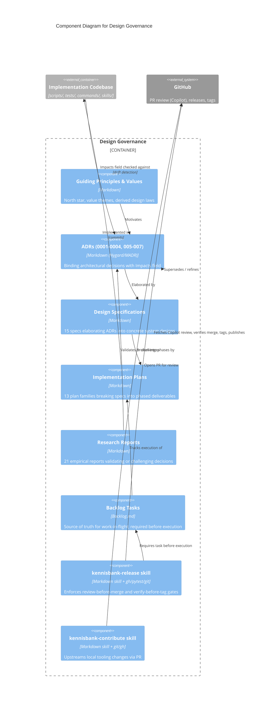
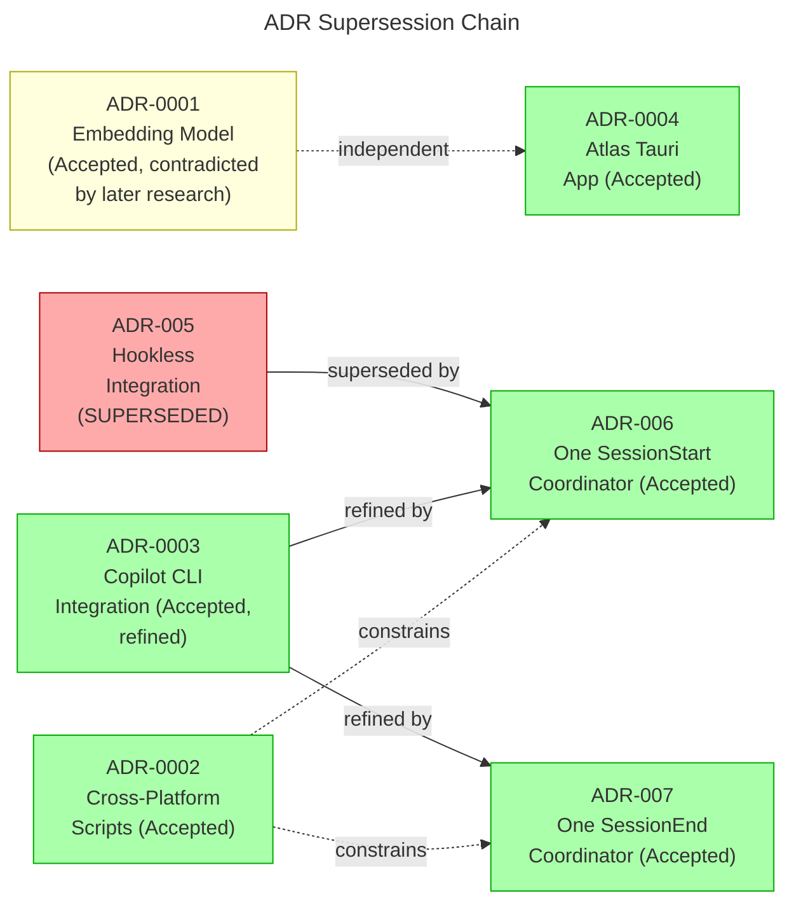

# C4 Component Level: Design Governance

## Overview

- **Name**: Design Governance
- **Description**: The decision layer that steers every other component of KennisBank — Architecture Decision Records (ADRs), design specifications, implementation plans, empirical research reports, and the backlog that tracks the work — plus the process mechanisms (release/contribute/upgrade skills) that keep code honest against those decisions.
- **Type**: Documentation and process component (Markdown decision records + enforced release/PR workflow); not a running service
- **Technology**: Markdown (MADR and Nygard ADR formats), Backlog.md (`backlog/` task store), GitHub PR review workflow (`gh` CLI + Copilot review), pytest gate, git tag verification

---

## Purpose

KennisBank's own CLAUDE.md states the north star: the system must be "invisible, fast, out of the way." Design Governance is where that intent is turned into an enforceable trail from decision to code:

1. **A decision becomes code** through a documented chain: a value in `guiding-principles-and-values.md` motivates a principle, a principle motivates an ADR (or is directly cited), an ADR is elaborated into a design spec, a spec is broken into an implementation plan, and the plan's phases land as commits referencing scripts named explicitly in the ADR's "Impacts" section (e.g. ADR-006 names `kb-session-start.py`, `_hooks_manifest.py`). Research reports close the loop the other way — they measure whether an implemented decision actually produced the claimed effect (e.g. the embedding-model sweep found `qwen3-embedding:4b`, not the ADR-0001 default `:8b`, was in fact better — a decision that has not yet been re-ratified in a superseding ADR).
2. **Honesty is kept** through three enforced mechanisms, not just documentation discipline:
   - Every accepted ADR has an explicit "Impacts" list of concrete files, so drift is checkable (`docs/C4-Documentation/c4-code-docs.md` cross-verifies this: "All ADR-referenced scripts are present and active in the codebase").
   - Every PR must clear a Copilot review before merge (see `kennisbank-release` skill, Ground Rules) — CI green is explicitly declared insufficient in the repo's own CLAUDE.md, citing PR #54 as the counter-example where a regex-anchoring bug slipped past green CI.
   - Every release tag is cut only after `git fetch origin main` proves the merge landed on `origin/main` — never on a branch tip.
3. **Backlog.md is the source of truth for work-in-flight**: the repo's CLAUDE.md mandates a Backlog task before any execution ("Geen uitvoer zonder taak"), status transitions to `In Progress` at start and `Done` at verified completion, and `kennisbank-release` explicitly creates a backlog task as Step 0b before touching any file.

---

## Software Features

- **ADR supersession chain**: decisions are never silently replaced; a new ADR formally supersedes an old one (ADR-005 → ADR-006) or refines one without invalidating it (ADR-003 refined in its hook details by ADR-006/007, core integration remains Accepted). The chain is documented with explicit `Status`, `Supersedes`, and `Related` fields per ADR.
- **MADR format adoption**: ADRs 0001–0004 use lightweight Nygard format; ADR-005–007 adopt MADR with explicit status history, decision drivers, and considered options — a governance format upgrade tracked but not retroactively enforced on older ADRs.
- **Spec → plan → research triad**: each design specification names the plan(s) that implement it and the research that validates or challenges it (e.g. the embedding-sweep research directly contradicts the still-Accepted ADR-0001 default).
- **Backlog-as-source-of-truth**: `backlog/` via `mcp__backlog__*` tools/CLI is the only place work is tracked; plans and skills reference task IDs (TASK-26, TASK-27, TASK-195, etc.) that tie design documents to concrete execution.
- **Review-before-merge gate**: `kennisbank-release` fetches Copilot review comments via `gh api repos/.../pulls/N/comments` (not visible in `gh pr view`), treats every comment as possibly correct, and blocks merge until addressed or explicitly deferred with a stated reason.
- **Verify-merge-before-tag gate**: release only tags a SHA confirmed present on `origin/main` after `git fetch`, never a branch tip, preventing tags on unmerged or reverted work.
- **Dual-run pytest gate**: `kennisbank-release` runs the full suite once on code changes, then a narrower file-reading pass after changelog/README edits, failing closed on red.
- **Evidence-gated defaults**: research reports function as the pre-registered gate for turning a knob on by default — e.g. the memory-ranking-cosine research explicitly reports "Holdout gate failed despite dev gains ... change blocked by holdout assessment; pre-registered gates enforced," and the recall-after-growth research reports a raised `max_chunks` cap that dropped r@5 and was not adopted. A design decision does not ship as a default until its measured gate passes.
- **Status-labeled research**: reports carry explicit outcome language ("not adopted," "gate failed," "clears implementation threshold," "queued") so a proposed change is never presented as settled without that label.

---

## Code Elements

This component is built from two of the seven Code-level documents in `docs/C4-Documentation/`:

- [c4-code-docs.md](./c4-code-docs.md) — primary source: 7 ADRs (0001–0004, 005–007), 15 design specifications, 13 implementation plan families, 21 research reports, plus the guiding principles/values document and supporting docs (`AGENT-INSTALL.md`, `agent-integrations.md`, `copilot-headroom-evaluation.md`)
- [c4-code-commands-skills.md](./c4-code-commands-skills.md) — the `kennisbank-release`, `kennisbank-contribute`, and `kennisbank-upgrade` skills that operationalize governance rules (review-before-merge, verify-before-tag, backlog task requirement) as executable process
- [c4-code-root.md](./c4-code-root.md) — `PRINCIPLES.md`/`VALUES.md`-equivalent content (`guiding-principles-and-values.md`) and the `setup.sh` contract that ADR-0002 and ADR-0003/006/007 govern

Not owned by this component but referenced: the scripts, commands, and containers that ADRs and specs *govern* (see Dependencies below) — those are documented in their own code/component files, not here.

---

## Interfaces

### The ADR Contract

Every ADR (both Nygard and MADR format) exposes the following fields as its interface to the rest of the system:

- `Status`: one of `Proposed`, `Accepted`, `Superseded`, `Rejected` — consumers (specs, plans, code) must check this before treating a decision as binding
- `Date`
- `Decision`: the binding statement
- `Impacts`: an explicit, checkable list of files/modules the decision governs — this is the field that lets drift be caught mechanically
- `Consequences`: trade-offs accepted
- `Deciders`
- `Supersedes` / `Superseded by` / `Related` (MADR format, ADR-005 onward): explicit links forming the supersession chain

Operation: `adr_status(adr_id) → Status` — any component consuming an ADR must resolve current status, not assume the file's title/number implies "still true."

### The Backlog Task Contract

Enforced via `mcp__backlog__*` MCP tools (task_create, task_edit, task_view, task_list, task_complete, task_archive), backed by `backlog/` markdown files.

- **Required frontmatter fields**: title, description, acceptance criteria, milestone, dependencies (per repo CLAUDE.md: "titel, beschrijving, acceptatiecriteria, milestone, dependencies")
- **Status transitions**: created → `In Progress` (at start of execution) → `Done` (only after work is reviewed and green) — no execution is permitted without a task ("Geen uitvoer zonder taak")
- **Operations**: `task_create(title, description, acceptance_criteria, milestone, dependencies) → task_id`, `task_edit(task_id, status)`, `task_complete(task_id)`

### The Release Process Contract

Exposed by the `kennisbank-release` skill as an ordered, gated pipeline (not a single API call):

1. `propose_version(commit_delta) → {version, reasoning}` — patch/minor/major classification from conventional-commit prefixes and change type
2. `write_changelog(version, changes)` — Keep-a-Changelog format, dated section, compare links
3. `run_gate() → pass/fail` — pytest, dual-run (before and after doc edits), fails closed
4. `open_pr(branch, base=origin/main) → pr_number`
5. `fetch_review_comments(pr_number) → [comments]` via `gh api repos/.../pulls/N/comments` (not `gh pr view`)
6. `merge(pr_number)` — only after every comment addressed or explicitly deferred with stated reason
7. `verify_merge(sha) → bool` via `git fetch origin main` + membership check — hard precondition for step 8
8. `tag(version, sha)` — only a SHA confirmed on `origin/main`; never a branch tip
9. `publish_release(version)` via GitHub Releases API (`gh`)

---

## Dependencies

### Code Modules Governed by Each ADR

| ADR | Governs |
|---|---|
| ADR-0001 (Embedding model default) | `scripts/semantic-tiling.py`, `CONFIGURATION.md` § Embedding model |
| ADR-0002 (Cross-platform scripts) | All of `scripts/*.py`, `setup.sh`, `scripts/doctor.sh`, all of `tests/`, `_vaultpath.py` |
| ADR-0003 (Copilot CLI integration) | `scripts/install-agent-envs.py`, `scripts/_copilot.py`, `docs/agent-integrations.md` |
| ADR-0004 (Atlas Tauri app) | Python FastAPI sidecar, TypeScript frontend, `_kbindex.py`, `_activity.py`, `_rank.py`, `_memory.py`, `kb-recall.py`, Tauri scaffolding |
| ADR-005 (Superseded) | Historical only — no active code governed |
| ADR-006 (One SessionStart coordinator) | `scripts/kb-session-start.py`, `scripts/_hooks_manifest.py`, `scripts/install-agent-envs.py`, `scripts/_copilot.py` |
| ADR-007 (One SessionEnd coordinator) | `scripts/kb-session-end.py`, `scripts/kb-session-log.py`, `scripts/_hooks_manifest.py`, `scripts/install-agent-envs.py`, `scripts/_copilot.py` |

### Downstream Components (consumers of governance output)

- **Executable Agent Surface** (commands/skills/templates) — implements the review-before-merge and verify-before-tag rules operationally via the `kennisbank-release`, `kennisbank-contribute`, `kennisbank-upgrade` skills
- **Installation and Configuration Layer** (`setup.sh`) — implements ADR-0002 cross-platform rules and ADR-0003/006/007 hook coordination contracts
- **Memory, retrieval, and Atlas subsystems** (out of scope here, documented elsewhere) — implement the decisions specs/plans describe and are the subject of the research reports' empirical validation

### External Dependencies

- GitHub CLI (`gh`) — PR creation, Copilot review comment retrieval, release publishing
- Git — merge verification (`git fetch origin main`), tagging
- pytest — release gate
- Backlog.md MCP tools / CLI — task lifecycle

---

## Component Diagram

### ADR Supersession Chain

ADR-0001 is styled distinctly (yellow) because, while its `Status` field still reads Accepted, the 2026-08-03 embedding-model-sweep research found `qwen3-embedding:4b` performs same-or-better than the ADR's `:8b` default at lower resource cost — a finding not yet folded into a superseding or amended ADR. This is reported here as a **fact about documentation state**, not a recommendation to change the default.

---

## Status Summary (factual, per source ADR/spec text)

| Decision record | Status as recorded | Note |
|---|---|---|
| ADR-0001 | Accepted | Default not yet reconciled with 2026-08-03 embedding-sweep research finding a better default |
| ADR-0002 | Accepted | Active; constrains every script/test |
| ADR-0003 | Accepted (details refined by 006/007) | Core integration remains binding |
| ADR-0004 | Accepted | Under implementation (TASK-27); sidecar API contract stable |
| ADR-005 | Superseded (by ADR-006, 2026-07-19) | Historical record only |
| ADR-006 | Accepted | Active |
| ADR-007 | Accepted | Active |

No ADR in this inventory carries `Proposed` status as of the source documents read; all decisions documented are either binding (Accepted) or explicitly retired (Superseded). Several research reports (memory-ranking-cosine, recall-after-growth, L2 scene retrieval) describe changes that did **not** pass their pre-registered gate — those remain proposals, not decisions, and are not represented as ADRs.

---

**Generated**: 2026-08-18
**Scope**: KennisBank Design Governance component (ADRs, specs, plans, research, backlog, release process)
**Format**: C4 Component-level documentation
**Language policy**: English (repo standard)
