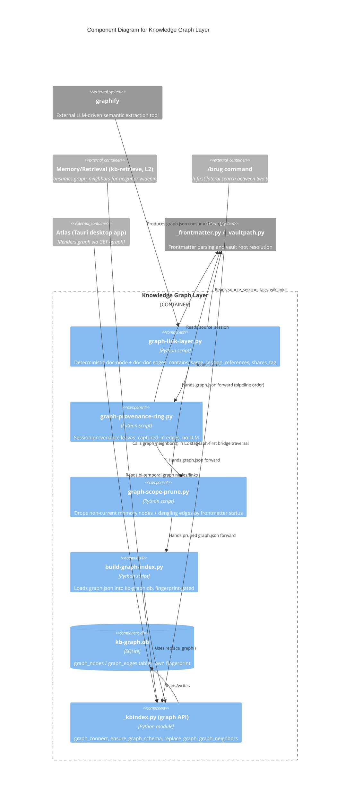

# C4 Component Level: Knowledge Graph Layer

## Overview

- **Name**: Knowledge Graph Layer
- **Description**: The deterministic link/provenance graph over the vault (`graphify-out/graph.json`), loaded into a queryable SQLite index (`kb-graph.db`) that L2 retrieval consults for weighted neighbor lookups.
- **Type**: Data/index subsystem (batch-built, hot-path-read)
- **Technology**: Python, SQLite (`kb-graph.db`, separate from the vector index `kb-index.db`), JSON (`graphify-out/graph.json` node-link format), the external `graphify` tool for semantic extraction

## Purpose

The Knowledge Graph Layer answers "what is near this document" without re-parsing the vault or calling an LLM on every prompt. It has two distinct halves that must not be confused:

1. **graphify (semantic, LLM-driven, external)** — extracts concept nodes and LLM-inferred edges from vault content in chunks. Runs off the hot path (daily batch or manual `/graphify --update`), scoped by `.graphifyignore`.
2. **The deterministic graph scripts in this component (zero-LLM)** — repair and prune what graphify produces, using structure that already exists in the vault (frontmatter, wikilinks, tags, file paths), and load the result into `kb-graph.db` for fast lookup.

The core problem this component solves: graphify's subagents only see the chunk they were given (e.g. 75 memories at a time out of ~1185). An edge between memory #3 and memory #900, or between a memory and a wiki article in a different chunk, is structurally impossible for the extractor to draw. Left alone, this produces a well-connected wiki core surrounded by hundreds of disconnected islands. `graph-link-layer.py` repairs this deterministically — no LLM call, no extraction cost — using facts already present in frontmatter and markdown (shared session, `[[wikilinks]]`, shared rare tags). `graph-provenance-ring.py` adds a further deterministic ring connecting distilled knowledge back to its raw session transcripts, without ever extracting the (redundant, near-duplicate) transcript content itself. `graph-scope-prune.py` then removes nodes whose source memory has fallen out of validity (`superseded`, `retracted`, `expired`, `unverified`), a scope criterion that lives in frontmatter `status` rather than in a path, so `.graphifyignore` cannot express it.

`build-graph-index.py` loads the resulting `graph.json` (up to ~4.2 MB) into `kb-graph.db` off the hot path, so that `kb-retrieve`'s L2 neighbor lookup (`graph_neighbors`) is an indexed SQLite query rather than a per-prompt JSON parse — keeping retrieval inside the ~2.0s hot-path budget.

## Software Features

- **Document-node bridging** (`graph-link-layer.py`): creates one `doc:<vault-relative path>` node per source file, with a `contains` edge to every concept extracted from it — guaranteeing no concept is ever fully isolated.
- **Deterministic doc-doc edges**, each tagged with its own relation so provenance stays traceable: `same_session` (shared `source_session` frontmatter), `references` (resolved `[[wikilink]]` targets), `shares_tag` (shared tag, only when the tag is rare enough — see Scope rules).
- **Star topology instead of clique**: a group of *n* related documents (same session or shared tag) gets *n-1* edges to a fixed representative, not *n(n-1)/2* pairwise edges — same connectivity, linear cost. (A 50-memory session clique would otherwise cost 1225 edges that add no signal.)
- **Provenance ring** (`graph-provenance-ring.py`): one leaf node per raw session (`sessie:<path>`, `file_type: "provenance"`) with a `captured_in` edge from every document that names it, resolved via `source_session` frontmatter or `[[raw-sessie-...]]` wikilinks. Deliberately a leaf, not a hub — sessions are never linked to each other, to avoid a second hub structure competing with the `same_session` star.
- **Status-based pruning** (`graph-scope-prune.py`): removes memory-sourced nodes whose frontmatter `status` is not `current`, and cascades removal to any edge left dangling — because a graph with edges to vanished nodes fails consumers (`/brug`, auto-crosslink, the Atlas lenses) in unclear ways.
- **Fast neighbor index** (`build-graph-index.py` + `_kbindex.py` graph tables): loads `graph.json` nodes/edges into `kb-graph.db`, fingerprinted independently of the vector index (own mtime+size fingerprint since TASK-75, so a stale graph yields no neighbor rather than a wrong one).
- **Idempotency everywhere**: all three graph scripts use deterministic IDs; a second run with unchanged input adds nothing.
- **Zero LLM cost, zero external traffic** for the entire link/provenance/prune/load pipeline — only graphify's own extraction step (outside this component) calls an LLM.

## Code Elements

This component draws on the following code-level documentation:

- [c4-code-scripts.md](./c4-code-scripts.md) — primary source. Graph & Relationships section:
  - `graph-link-layer.py` — deterministic doc-node + doc-doc edge layer (`contains`, `same_session`, `references`, `shares_tag`)
  - `graph-provenance-ring.py` — session provenance leaves (`captured_in`)
  - `graph-scope-prune.py` — status-based node/edge pruning
  - `build-graph-index.py` — loads `graph.json` into `kb-graph.db`
  - `_kbindex.py` (Graph Index section) — `graph_connect`, `ensure_graph_schema`, `replace_graph`, `graph_neighbors` — the SQLite-backed graph storage and read API consumed by L2 retrieval
- [c4-code-commands-skills.md](./c4-code-commands-skills.md) — consumers and orchestration:
  - `/brug` — graph-first lateral search (traverses `graphify-out/graph.json`, falls back to embedding-space bridge search if unavailable)
  - `/sessielog` — daily graph batch trigger: appends to `graphify-out/.needs-rebuild`, checks `daily_graphify` toggle and `graph.json` mtime (>~20h stale), conditionally runs `graphify --update` scoped by `.graphifyignore`
  - `/destilleer` — updates the graph as part of transcript-to-wiki compilation
- [c4-code-docs.md](./c4-code-docs.md) — specs and evidence:
  - Atlas `GET /graph` endpoint (bi-temporal graph nodes/links, 2514 nodes at time of writing) — a downstream consumer, not part of this component
  - Two-layer graph visualization spec (wiki base map + toggleable memory overlay)
  - Settings system spec: `daily_graphify` toggle governs whether the batch rebuild runs automatically

## Interfaces

### Graph Storage & Query API (`_kbindex.py`, in-process Python)

- **Protocol**: Direct Python function calls over a local SQLite connection (`kb-graph.db`), not a network API.
- **Description**: The read/write surface every other graph script and consumer goes through. Deliberately separate storage from the vector index (`kb-index.db`) since TASK-75, so a full vector-index rebuild/unlink never silently drops the graph.
- **Operations**:
  - `graph_connect(path: Path | None = None) → sqlite3.Connection` — open `kb-graph.db`.
  - `ensure_graph_schema(conn) → None` — create/verify graph tables and fingerprint metadata.
  - `replace_graph(conn, nodes: list, edges: list) → tuple[int, int]` — upsert the full graph; returns `(node_count, edge_count)`.
  - `graph_neighbors(conn, source_file: str, limit: int = 5, ...) → list` — weighted neighbor lookup; the sole entry point used by kb-retrieve's L2 stage.

### Graph Build Pipeline (CLI scripts, off hot path)

- **Protocol**: Argparse CLI, invoked by `/sessielog` (daily batch), `/destilleer`, or manually.
- **Description**: The ordered deterministic passes applied on top of graphify's raw extraction output.
- **Operations**:
  - `graph-link-layer.py [--graph PATH] [--dry-run] [--json]` — `read_documents(graph, vault) → dict`, `build_layer(graph, docs) → (new_nodes, new_edges, stats)`; writes a one-time backup `*.pre-linklayer.json` before mutating.
  - `graph-provenance-ring.py [--graph PATH] [--dry-run] [--json]` — adds `sessie:` leaf nodes and `captured_in` edges.
  - `graph-scope-prune.py [--graph PATH] [--dry-run] [--json]` — `prune(graph: dict, vault: Path) → (graph, stats)`; drops non-`current` memory nodes and their edges.
  - `build-graph-index.py [--graph PATH] [--db PATH] [--force] [--json]` — `load_graph(path) → (nodes, edges)`; loads into `kb-graph.db` via `replace_graph`, gated by fingerprint unless `--force`. Exit 0 = loaded or nothing to do, 1 = graph unreadable.

### Consumer-facing: `/brug` lateral search

- **Protocol**: Slash command (agent-invoked), graph traversal over the loaded `graph.json`/`kb-graph.db`.
- **Description**: Finds non-obvious bridge nodes between two topic clusters A and B.
- **Operations**: `bridge_search(topic_a, topic_b) → list[bridge_node]` (graph-first; falls back to embedding-space search if the graph is unavailable).

## Dependencies

### Components Used

- **Memory/Retrieval component (`_kbindex.py` vector side, `kb-retrieve`)**: `graph_neighbors` is called from L2 retrieval to widen a hit set with graph-adjacent documents; the graph component does not call back into retrieval.
- **Frontmatter parsing (`_frontmatter.py`)**: all three deterministic scripts read `parse_frontmatter` to get `source_session`, `tags`, `status`, `title` — this is the sole source of structure they rely on (no LLM parsing).
- **Vault path resolution (`_vaultpath.py`)**: `vault_root()` — per ADR-0002, never hardcoded.
- **Session/orchestration commands (`/sessielog`, `/destilleer`)**: own the scheduling policy (daily batch, staleness threshold, `daily_graphify` toggle) that decides *when* this component's pipeline runs; the component itself is stateless about scheduling.

### External Systems

- **`graphify`** (external tool, not part of this repo's deterministic scripts): performs the actual LLM-driven semantic extraction that produces the initial `graph.json` nodes/edges. This component only repairs, prunes, and indexes graphify's output — it never re-implements extraction.
- **`.graphifyignore`**: path-based scope file consumed by `graphify` itself to decide what enters the graph (e.g. restricting to `02-wiki-only` for public/release scope via `graph-scope-prune`'s sibling concern). Note the scope-rule split: `.graphifyignore` filters by *path* before extraction; `graph-scope-prune.py` filters by frontmatter *status* after extraction, because status is not expressible as a path pattern.
- **Atlas (Tauri desktop app)**: downstream consumer via `GET /graph`, rendering the bi-temporal graph (thousands of nodes) in the six-lens UI. Read-only consumer, not a dependency of this component.

## Component Diagram

## Scope Rules Summary (deterministic vs LLM)

| Concern | Mechanism | LLM? | Where |
|---|---|---|---|
| Which vault paths enter the graph at all | `.graphifyignore` (path patterns) | No (filter only; extraction itself is LLM) | consumed by `graphify` |
| Concept extraction from chunked content | graphify subagents | **Yes** | outside this component |
| Repairing cross-chunk isolation | `graph-link-layer.py` (session/wikilink/tag structure) | No | this component |
| Session-to-knowledge provenance | `graph-provenance-ring.py` (frontmatter/wikilink match) | No | this component |
| Removing stale/retracted knowledge from the graph | `graph-scope-prune.py` (frontmatter `status`, not expressible as a path) | No | this component |
| Fast neighbor lookup at retrieval time | `kb-graph.db` via `_kbindex.py` | No | this component |
