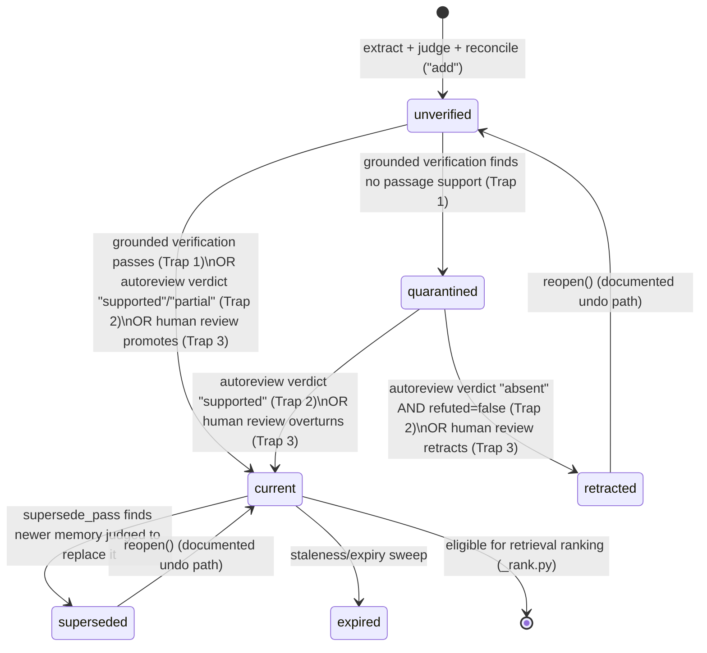

# C4 Component Level: Memory Lifecycle

## Overview

- **Name**: Memory Lifecycle
- **Description**: Captures candidate knowledge from session transcripts, judges and reconciles it against existing memory, verifies unverified claims against source material, and manages the state machine that carries a memory record from first extraction to trusted retrieval — or to quarantine, supersession, and expiry.
- **Type**: Domain component (library modules + CLI/daemon scripts + slash commands), embedded in the KennisBank Scripts container
- **Technology**: Python 3.9+, SQLite (`kb-index.db`), Markdown+YAML frontmatter files (`09-memory/`), local LLM (Ollama) for judging/verification, optional cloud LLM for escalation

## Purpose

The Memory Lifecycle component owns everything that happens to a piece of agent-captured knowledge between "an LLM said something in a transcript" and "this fact is safe to inject into a future prompt." It solves three problems:

1. **Extraction blindness** — transcripts contain useful facts, preferences, procedures, and decisions that are never written down unless something actively pulls them out.
2. **Trust before use** — an extracted claim is a guess until it is judged for importance/type/volatility and checked against reality; injecting unverified guesses into prompts would poison retrieval.
3. **Drift over time** — memories become stale, get contradicted by newer information, or turn out to be unsupported; the system must supersede, quarantine, retract, or expire them without needing a human to babysit every case.

Architecturally this component sits between the transcript/session layer (upstream) and the retrieval/ranking layer (downstream, `_kbindex.py`/`_rank.py`, documented separately). It is the write-time half of the "onzichtbaar, snel, uit de weg" north star (CLAUDE.md): all judging, verification, and cleanup happens off the interactive hot path so `kb-retrieve.py` stays sub-second.

## Software Features

- **Candidate extraction from transcripts**: pulls plausible memory candidates (facts, preferences, procedures, decisions) out of raw conversation text, filtering LLM refusals and meta-answers before they ever reach judging.
- **LLM-based judging**: classifies each candidate's importance (1–5), memory type (`feit`/`voorkeur`/`procedure`/`beslissing`), and volatility (`state` vs `event`) via a local-first LLM.
- **Reconciliation against existing memory**: before a new memory is written, checks cosine similarity against current memories and asks the judge whether it should be added, whether it supersedes an older memory, or should be skipped as a duplicate.
- **Bitemporal, status-driven memory records**: every memory carries a status (`unverified`, `current`, `superseded`, `retracted`, `expired`), an evidence basis, and closure links (`superseded_by`, `retracted_by`) that stay visible in search rather than disappearing.
- **Grounded verification (Trap 1)**: `kb-verify.py` / `_groundcheck.py` check an unverified claim against retrievable source passages; claims without direct support are quarantined rather than promoted.
- **Client-LLM escalation (Trap 2)**: `/kennisbank:autoreview` bundles quarantined cases with their full transcript and dispatches parallel subagent adjudication (does the transcript actually say this, anywhere, in any language) to promote or retract what local verification couldn't resolve.
- **Human review backstop (Trap 3)**: `/kennisbank:review` surfaces what autonomous review decided recently and offers a documented way back (reopen) for anything the automated traps got wrong.
- **Deduplication and supersession passes**: background maintenance finds exact and near-duplicate current memories and asks the judge whether a newer one should replace an older one, keeping closure chains intact.
- **Rechecking**: periodically re-evaluates unverified memories still sitting in the queue and promotes the ones that now pass.
- **Diagnostics and repair**: `kb-state-audit.py` (read-only anomaly report: duplicates, orphans, config-like bodies stuck as free text) and `memory-doctor.py` (diagnose + repair) give operators visibility without requiring manual grep-through of `09-memory/`.
- **Discard/audit logging**: every automated promotion or retraction is written to an append-only discard/audit log and is reversible via `_memory.reopen()` — automation never silently deletes a claim.

## Code Elements

From [c4-code-scripts.md](./c4-code-scripts.md) — the memory slice:

- `_memory.py` — memory schema, statuses, types, volatility, provenance tagging (the contract every other module reads/writes against)
- `_extract.py` — candidate extraction from transcript text, refusal filtering, `EXTRACT_PROMPT_VERSION`
- `_judge.py` — LLM judgment of a single candidate (importance/type/volatility)
- `_llm.py` — pluggable local-first LLM router (ollama → openrouter/claude-cli) used by judge, extract, reconcile, and verification
- `_llmjson.py` — robust JSON extraction from LLM output, used wherever an LLM response must become structured data
- `_reconcile.py` — similarity check + supersede/add/skip decision against existing memories
- `_maintenance.py` — background passes: `current_items`, `neighbour_map`, `exact_duplicate_pass`, `supersede_pass`, `recheck_pass`
- `_groundcheck.py` — fact-checking via semantic search + LLM judgment (backs `kb-verify.py` and the autoreview trap)
- `_provenance.py` — source/evidence tracking supporting provenance tags
- `memory-sweep.py` (~648 lines) — the orchestrator: extract → judge → reconcile → upsert, run off the hot path
- `memory-doctor.py` (~401 lines) — diagnostic/repair CLI
- `kb-state-audit.py` (~336 lines) — read-only anomaly report over `09-memory/`
- `kb-verify.py` — grounds a fact against the knowledge base (Trap 1 of the three-trap review pipeline)

From [c4-code-tests.md](./c4-code-tests.md) — memory, groundcheck, auto-review and maintenance tests:

- `test_memory.py`, `test_memory_bitemporal.py`, `test_memory_closures_visible.py`, `test_memory_doctor.py`, `test_memory_notify.py`, `test_memory_review.py`, `test_memory_sweep.py` — memory format, statuses, closure chains, doctor, notify, review, sweep
- `test_discard_log.py` — discard/audit log, reconciliation reporting, sweep-writes-discard behavior
- `test_autoreview.py` — Copilot-review capture, filtering, response parsing for `kb-autoreview.py`
- `test_groundcheck.py` — verification gates, self-source lint, index-drift lint, network hermiticity during ingest
- `test_kb_verify.py` — index integrity / corruption detection backing verification
- `test_maintenance_supersede.py`, `test_supersede_coverage.py` — supersede operation and post-supersede coverage
- `test_reconcile.py` — state reconciliation after crash/manual edit
- `test_injection_provenance.py` — provenance tagging on injected memory blocks (verifies the trust signal `_rank.py` consumes downstream)

From [c4-code-docs.md](./c4-code-docs.md) — design specs and research backing this component:

- Spec: **Self-correcting memory** (2026-08-12) — automatic promotion of unverified captures via local verification or client-LLM adjudication
- Spec: **Trust and noise factors** (2026-08-14) — provenance is the strongest trust signal; `noise_factor` currently inert (consumed downstream in ranking, not owned by this component)
- Spec: **Autonomous memory review** (2026-08-16) — the three-trap promotion pipeline this component implements
- Plan family: **Agent memory** (2026-06-27, multi-phase) — Fase 1 (data model + toggles) through Cross-memory v2 (supersede/re-judge/clustering, local-first router, fail-safe seams)
- Research: **Quarantine warehouse (G0)** (2026-08-16) — 86.7% of quarantined memories are supported (zero fabrication); quarantine penalizes correct-but-uncertain extractions, not wrong ones; gate G3 shows +0.035–0.036 recall gain after drain
- Research: **Judge model (4b vs 9b)** (2026-08-12) — `qwen3.5:4b` wins on every judging criterion tested
- Research: **LLM grounded verification** (2026-08-15) — `qwen3.5:4b` clears the verification threshold: zero fabricated evidence quotes across 210 cases
- Research: **Supersede judge validation** (2026-08-13) and **Supersede window threshold** (2026-08-13) — judge agrees with hand-labelled ground truth 86% of the time; do not loosen the fail-safe supersede bias
- Research: **Narrowed supersede closure** (2026-08-16) — tightening supersede criteria reduces incorrect NARROWED closures from 57.8% to 37.5%

From [c4-code-commands-skills.md](./c4-code-commands-skills.md):

- `/kennisbank:autoreview` — Trap 2 of the review pipeline: bundles quarantined cases, dispatches parallel subagent adjudication, applies verdicts via `kb-autoreview.py apply`, reindexes
- `/kennisbank:review` — memory system health check: quarantine counts, index consistency, stale entries
- `/kennisbank:rebuild-memory` — full re-extraction of memory from archived transcripts (heavy, confirmation-gated)

## Interfaces

### Extraction API
- **Protocol**: In-process Python function calls (`_extract.py`)
- **Description**: Turns raw transcript text into a bounded list of candidate memory strings, screening out refusals before any judging cost is spent.
- **Operations**:
  - `extract_candidates(transcript_text: str, max_n: int = 8) → list` — generate up to `max_n` memory candidates
  - `looks_like_refusal(text: str) → bool` — deterministic refusal-pattern check (no model call)

### Judging API
- **Protocol**: In-process Python function calls, backed by `_llm.py` (local Ollama by default)
- **Description**: Scores a single candidate for importance, type, and volatility.
- **Operations**:
  - `judge(candidate: str, context: str = "") → dict` — returns `{importance: 1-5, type, volatility, ...}`

### Reconciliation API
- **Protocol**: In-process Python function calls (`_reconcile.py`)
- **Description**: Decides whether a new candidate should be added as a fresh memory, supersede an existing one, or be skipped as redundant.
- **Operations**:
  - `similar_existing(vec, items: list, threshold: float = RECONCILE_THRESHOLD) → dict | None`
  - `judge_reconcile(new_text: str, old_text: str) → str` — `"ADD" | "SUPERSEDE" | "SKIP"`
  - `may_supersede(new_valid_from: str, old_valid_from: str) → bool`
  - `reconcile(new_body: str, new_valid_from: str, vec, items: list, ...) → str`

### Memory Schema / Contract API
- **Protocol**: In-process Python function calls + Markdown/YAML frontmatter file contract (`_memory.py`, files under `09-memory/`)
- **Description**: The canonical state machine and frontmatter shape every producer and consumer of memory records must honor.
- **Operations**:
  - `coerce_memory_type(value) → str`, `coerce_volatility(value, body) → str`, `coerce_importance(value) → int`
  - `looks_like_config(text: str) → bool`, `looks_like_config_key(key) → bool`
  - `provenance_tag(evidence_basis, status: str) → str`
  - `reopen(...)` — reverses an automated promotion/retraction (referenced by autoreview constraints; the documented undo path for the three-trap pipeline)
  - **Data contract**: `STATUSES = ("unverified", "current", "superseded", "retracted", "expired")`; `MEMORY_TYPES = ("feit", "voorkeur", "procedure", "beslissing")`; `VOLATILITIES = ("state", "event")`; `EVIDENCE_BASES = ("getypt", "cc-sessie", "audio", "import", "autoresearch", "agent")`

### Verification API (Trap 1)
- **Protocol**: In-process Python function calls (`_groundcheck.py`), CLI (`kb-verify.py`)
- **Description**: Checks whether an unverified claim is grounded in retrievable source passages; ungrounded claims are quarantined rather than promoted to `current`.
- **Operations**:
  - `check_fact(fact: str, vault: Path | None = None, ...) → dict` — retrieves relevant context and asks the judge whether the fact is grounded

### Autoreview Escalation API (Trap 2)
- **Protocol**: CLI (`kb-autoreview.py`) invoked by the `/kennisbank:autoreview` slash command; adjudication itself runs as parallel subagent dispatch, not an in-process call
- **Description**: For claims Trap 1 could not confirm, bundles the claim plus its full source transcript, has independent subagents judge `supported`/`partial`/`absent`/`unclear`, refutes every `absent` verdict with a second independent subagent (defaults to overturning on doubt), then applies verdicts.
- **Operations**:
  - `kb-autoreview.py bundle` → writes `case-NNN/{claim.md, transcript.txt}` per quarantined case
  - `kb-autoreview.py apply "<batch>/results.json"` → promotes `supported` verdicts, retracts only `absent` + `refuted: false` verdicts, subject to caps and an audit log
  - **Data contract**: `results.json` entries as `{"stem", "verdict", "evidence", "refuted"}`

### Maintenance Passes API
- **Protocol**: In-process Python function calls (`_maintenance.py`), invoked by `memory-sweep.py` and scheduled jobs
- **Description**: Keeps the `current` memory set clean over time — dedupes, supersedes, and rechecks the unverified backlog.
- **Operations**:
  - `current_items(get_cached_fn=None, statuses=("current",)) → list`
  - `neighbour_map(items: list, threshold: float) → dict`
  - `exact_duplicate_pass(dry_run: bool = False) → int`
  - `supersede_pass(threshold: float = SUPERSEDE_THRESHOLD, judge_fn=None, ...) → int`
  - `recheck_pass(judge_fn=None, limit: int = 20, items=None) → int`

### Diagnostics API
- **Protocol**: CLI, read-only by default
- **Description**: Human- and agent-facing visibility into memory-system health without mutating state.
- **Operations**:
  - `kb-state-audit.py` — reports duplicates, orphans, config-like bodies (no writes)
  - `memory-doctor.py` — diagnose and, on request, repair
  - `/kennisbank:review` — quarantine counts, index consistency, stale entries (Trap 3 surface for human review)

## Dependencies

### Components Used
- **Foundation modules** (`_vaultpath.py`, `_common.py`, `_settings.py`, `_frontmatter.py`) — vault resolution, env-var/liveness/staleness utilities, `memory_capture`/`auto_review_llm` toggles, frontmatter parsing. Every memory-lifecycle module sits on top of these.
- **Knowledge Index component** (`_kbindex.py`, `_embeddings.py`) — the lifecycle writes verified memories into `kb-index.db` via `upsert()`; `_groundcheck.py` and `_reconcile.py` read from it (via `search()`/cosine) to find similar/supporting content. Embeddings (`embed()`, `cosine()`) are the shared similarity primitive across reconciliation, supersession, and verification.
- **Ranking/Usage component** (`_rank.py`, `_usage.py`) — downstream consumer, not a dependency of this component, but it reads the `provenance_tag`, `status`, and `evidence_basis` this component writes; listed for relationship clarity (see diagram).
- **Retrieval hot path** (`kb-retrieve.py`, `kb-recall.py`) — upstream trigger boundary: this component never runs inline with these; `memory-sweep.py` runs concurrently and read-only against the index they use, by design (Critical Paths, `c4-code-scripts.md`).
- **Session/transcript layer** (`_transcript.py`, session archival) — supplies the raw transcript text that `_extract.py` and the autoreview bundler operate on.

### External Systems
- **Ollama (local LLM/embedding server)** — primary provider for judging, extraction, reconciliation, and grounded verification (`qwen3.5:4b` for judging, `qwen3-embedding:4b` for similarity). Local-first by design (CLAUDE.md: "Lokaal, altijd").
- **Cloud LLM providers (OpenRouter, Claude CLI)** — opt-in only, gated by settings (`auto_review_llm` toggle) and used loudly (logged to stderr) for the client-LLM escalation trap when local judgment is insufficient or when `/kennisbank:autoreview` dispatches subagents.
- **Backlog.md** — task tracking for lifecycle-related work items (process dependency, not a runtime one).

## Component Diagram

```mermaid
C4Component
    title Component Diagram for Memory Lifecycle (within KennisBank Scripts container)

    Container_Boundary(memlifecycle, "Memory Lifecycle") {
        Component(extract, "Extraction", "_extract.py", "Pull candidate memories from transcript text; filter refusals")
        Component(judge, "Judging", "_judge.py", "Score candidate for importance / type / volatility")
        Component(reconcile, "Reconciliation", "_reconcile.py", "Decide add / supersede / skip vs existing memories")
        Component(memschema, "Memory Schema", "_memory.py", "Status enum, frontmatter contract, provenance tagging, reopen()")
        Component(groundcheck, "Grounded Verification (Trap 1)", "_groundcheck.py + kb-verify.py", "Check unverified claim against retrievable passages")
        Component(autoreview, "Autoreview Escalation (Trap 2)", "kb-autoreview.py + /kennisbank:autoreview", "Bundle quarantined cases, subagent adjudication, apply verdicts")
        Component(maintenance, "Maintenance Passes", "_maintenance.py", "Dedup, supersede, recheck unverified backlog")
        Component(sweep, "Sweep Orchestrator", "memory-sweep.py", "Off-hot-path pipeline: extract -> judge -> reconcile -> upsert")
        Component(diagnostics, "Diagnostics", "kb-state-audit.py, memory-doctor.py, /kennisbank:review", "Read-only anomaly reports and repair")
    }

    Container_Ext(llmrouter, "LLM Router", "_llm.py", "Pluggable local-first LLM provider chain")
    Container_Ext(kbindex, "Knowledge Index", "_kbindex.py + kb-index.db", "Hybrid vector+FTS store")
    Container_Ext(embeddings, "Embeddings", "_embeddings.py", "Vector embedding + cosine similarity")
    Container_Ext(rankusage, "Ranking / Usage", "_rank.py, _usage.py", "Consumes provenance/status for retrieval ranking")
    Container_Ext(retrieval, "Retrieval Hot Path", "kb-retrieve.py, kb-recall.py", "Sub-second prompt-time injection (never blocks on this component)")
    System_Ext(ollama, "Ollama", "Local LLM / embedding server")
    System_Ext(cloudllm, "Cloud LLM", "OpenRouter / Claude CLI (opt-in escalation)")

    Rel(sweep, extract, "Runs")
    Rel(sweep, judge, "Runs")
    Rel(sweep, reconcile, "Runs")
    Rel(extract, llmrouter, "Uses")
    Rel(judge, llmrouter, "Uses")
    Rel(reconcile, embeddings, "Cosine similarity")
    Rel(reconcile, llmrouter, "judge_reconcile")
    Rel(sweep, memschema, "Writes frontmatter (status=unverified)")
    Rel(memschema, kbindex, "upsert()")
    Rel(groundcheck, kbindex, "search() for supporting passages")
    Rel(groundcheck, llmrouter, "Judge groundedness")
    Rel(groundcheck, memschema, "Promote to current / mark quarantined")
    Rel(autoreview, groundcheck, "Consumes quarantined cases")
    Rel(autoreview, cloudllm, "Subagent adjudication (opt-in)")
    Rel(autoreview, memschema, "Apply verdicts: promote / retract")
    Rel(maintenance, embeddings, "neighbour_map cosine")
    Rel(maintenance, llmrouter, "supersede judge")
    Rel(maintenance, memschema, "Supersede / recheck writes")
    Rel(diagnostics, memschema, "Read-only scan")
    Rel(memschema, rankusage, "provenance_tag, status, evidence_basis consumed downstream")
    Rel(retrieval, kbindex, "Reads only (no lifecycle writes)")
    Rel(sweep, retrieval, "Concurrent, read-only to main index")
```

## Memory State Machine

Notes on the state machine:
- `quarantined` is not one of the four persisted `STATUSES` values in `_memory.py` (`unverified`, `current`, `superseded`, `retracted`, `expired`); it is the operational label the verification/autoreview pipeline uses for unverified items that failed Trap 1's grounded check and are awaiting Trap 2/3 adjudication (per the "Quarantine warehouse (G0)" research report and the `/kennisbank:autoreview` command spec). Treat it as a sub-state of `unverified`, not a separate frontmatter status, unless a future code read confirms otherwise.
- Every transition triggered by Trap 2 (autoreview) or Trap 3 (human review) is logged to an append-only discard/audit log and reversible via `_memory.reopen()` — the pipeline is fail-safe by construction (CLAUDE.md: "Feitelijke output, geen cruft" + "Niet twee keer dezelfde fout").
- Supersession is deliberately conservative: research ("Supersede judge validation", "Narrowed supersede closure") shows the fail-safe bias against over-eager superseding is intentional and should not be loosened.

## Off-Hot-Path Execution

All memory-lifecycle work runs off the interactive retrieval path, per the "Critical Paths" section of `c4-code-scripts.md`:

| Pass | Trigger | Path |
|---|---|---|
| Extraction → judging → reconciliation → upsert | `memory-sweep.py` | Off-path, background; concurrent with retrieval (read-only to the main index) |
| Grounded verification (Trap 1) | `kb-verify.py` scheduled/manual run | Off-path |
| Autoreview escalation (Trap 2) | `/kennisbank:autoreview` slash command | Off-path, on-demand, cloud-consent-gated |
| Human review (Trap 3) | `/kennisbank:review` slash command | Off-path, on-demand |
| Dedup / supersede / recheck | `_maintenance.py` passes, scheduled | Off-path |
| Diagnostics | `kb-state-audit.py`, `memory-doctor.py` | Off-path, read-only by default |
| Full re-extraction | `/kennisbank:rebuild-memory` | Off-path, heavy, confirmation-gated |

Only `kb-retrieve.py`/`kb-recall.py` (outside this component) run inline on the hot path, and they only *read* memory records this component has already promoted to `current` — they never trigger extraction, judging, or verification synchronously.
