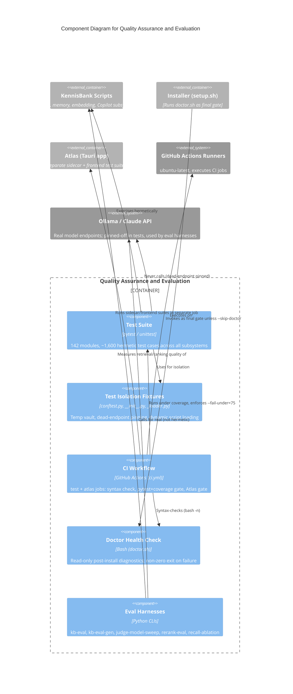

# C4 Component Level: Quality Assurance and Evaluation

## Overview

- **Name**: Quality Assurance and Evaluation
- **Description**: The component that decides whether a change is allowed to ship. It comprises the pytest test suite, the GitHub Actions CI gates, the `doctor.sh` post-install health check, and the offline measurement/eval harnesses that quantify retrieval and ranking quality.
- **Type**: Cross-cutting verification component (test code, CI configuration, shell diagnostics, and research CLIs — not a runtime service)
- **Technology**: Python (pytest 8.3.4, unittest-style test classes, coverage.py 7.6.1), Bash (`doctor.sh`, `bash -n` syntax checks), YAML (GitHub Actions), TypeScript/Vitest (Atlas frontend tier)

## Purpose

This component is KennisBank's answer to "how do we know it still works." It exists to catch regressions before they reach the production vault, and to keep empirical claims about retrieval/ranking quality honest and reproducible.

It has four cooperating parts:

1. **The test suite** (`tests/`) — 142 modules, ~1,600 test cases, ~24,000 LOC, exercising retrieval, ranking, memory, embeddings, Copilot integration, session lifecycle, and maintenance. Every test runs hermetically: against a temporary vault, with embed/LLM endpoints pinned to a dead socket, never touching the real `~/KennisBank`/`Kluis` vault or a real model server.
2. **CI gates** (`.github/workflows/ci.yml`) — the enforcement layer that runs the suite on every push/PR, fails the build on a coverage regression, and separately gates the Atlas (Tauri) subsystem.
3. **The doctor health check** (`scripts/doctor.sh`) — a read-only, non-mutating diagnostic run as the final step of `setup.sh` (and independently in CI/manual use) to confirm an install is sane (CLI present, config valid, model reachable, vault structure correct).
4. **Eval/measurement harnesses** (`scripts/kb-eval.py`, `kb-eval-gen.py`, `judge-model-sweep.py`, `rerank-eval.py`, `recall-ablation.py`) — CLIs that produce the empirical numbers (recall@k, judge agreement, rerank factor deltas) cited in `docs/research/` and design specs. These are quality measurement, not pass/fail gates — they are run manually/periodically, not in the CI gate.

## Software Features

- **Hermetic test isolation**: session-scoped temporary vault (`KENNISBANK_VAULT`) plus dead-endpoint pinning (`127.0.0.1:0`) for embed/LLM calls by default; an opt-in `KB_INTEGRATION=1` tier unpins endpoints for real model calls, explicitly excluded from the CI gate.
- **Coverage-gated CI**: `coverage run -m pytest tests -q` followed by `coverage report --fail-under=75`, deliberately set a few points below the measured ~77% baseline to absorb noise while catching real regressions.
- **Syntax pre-checks**: `py_compile` over all `scripts/*.py` and `bash -n` over `setup.sh`/`scripts/doctor.sh` run before the test step, so a broken script fails fast without burning the full test budget.
- **Independent Atlas gate**: a second CI job (`atlas`) runs the Tauri sidecar's pytest suite, `tsc --noEmit`, and `vitest run` in its own failure domain, so a KennisBank-core regression can't mask an Atlas regression or vice versa.
- **Post-install health check**: `doctor.sh` verifies CLI availability, config validity, embed model reachability, and vault structure without mutating anything; `setup.sh` runs it as the final gate unless `--skip-doctor` is passed (used when CI runs doctor as a separate step).
- **Retrieval/ranking measurement**: `kb-eval.py` scores retrieval quality against a gold-standard eval set; `kb-eval-gen.py` synthesizes new eval queries from transcripts; `judge-model-sweep.py` compares LLM-judge configurations; `rerank-eval.py` and `recall-ablation.py` isolate the contribution of individual ranking factors and recall components.
- **Eval-set privacy enforcement**: `test_eval_privacy.py` guards that personal eval sets stay out of the repo and releases (`.gitignore` + test, not just convention).
- **Documentation-consistency guards**: `test_docs_consistency.py` / `test_integration_documentation.py` verify bilingual fact parity and that code-derived facts in docs stay current — these are why the pytest-vs-unittest choice below matters.

## Code Elements

This component draws on the following code-level documentation:

- [c4-code-tests.md](./c4-code-tests.md) — the test suite itself: all 142 modules, 24 subsystem groupings, hermeticity mechanics (`conftest.py`, `tests/__init__.py`, `tests/_loader.py`).
- [c4-code-github.md](./c4-code-github.md) — CI workflow definitions: `.github/workflows/ci.yml` (`test` and `atlas` jobs), `.github/copilot-instructions.md`.
- [c4-code-root.md](./c4-code-root.md) — `setup.sh`'s invocation of `doctor.sh` as the final install gate, including the `--skip-doctor` flag used by CI/test runners.
- [c4-code-scripts.md](./c4-code-scripts.md) — the eval/analysis CLI slice: `kb-eval.py`, `kb-eval-gen.py`, `judge-model-sweep.py`, `rerank-eval.py`, `recall-ablation.py`.
- [c4-code-docs.md](./c4-code-docs.md) — `docs/research/` reports produced by these harnesses (e.g. the rerank-ceiling finding: raw cosine 0.557 vs production 0.264 r@1; oracle ceiling 0.844 r@1) and the specs they validate.

## Interfaces

### CI Gate Contract (what fails a build)

| Gate | Enforcer | Threshold | Scope |
|------|----------|-----------|-------|
| Python syntax | `python3 -m py_compile scripts/*.py` | Must compile | `test` job |
| Shell syntax | `bash -n setup.sh scripts/doctor.sh` | Must parse | `test` job |
| Test execution | `python3 -m coverage run -m pytest tests -q` | All ~1,600 cases pass | `test` job |
| Coverage floor | `coverage report --fail-under=75` | ≥ 75% line coverage | `test` job |
| Atlas sidecar tests | `pytest atlas/sidecar/tests -q` | All pass | `atlas` job |
| Atlas typecheck | `npx tsc --noEmit` | No type errors | `atlas` job |
| Atlas frontend tests | `npx vitest run` | All pass | `atlas` job |

`test` and `atlas` run in parallel as independent failure domains; both must succeed for CI to pass. Consumers (a PR, a release) read this as a single pass/fail signal from GitHub Actions — no direct API beyond exit codes and the Step Summary coverage report.

### Doctor Exit Contract

- **Entry point**: `bash scripts/doctor.sh`, invoked by `setup.sh` as its final step unless `--skip-doctor` is given.
- **Contract**: read-only — diagnoses, never mutates, the vault or config.
- **Checks**: CLI presence, config file validity, embed model reachability, vault directory structure.
- **Exit code**: non-zero on any failed check, surfaced by `setup.sh` as `DOCTOR_RC`; zero means the install is sane.
- **Callers**: `setup.sh` (interactive install), CI/test runners that call it independently via `--skip-doctor` on setup, `test_copilot_doctor.py` (guards its diagnostic output for Copilot-specific checks).

### Eval CLI Surface

| Script | Invocation shape | Output |
|--------|-------------------|--------|
| `kb-eval.py` | run against a gold-standard eval set (private, not in repo) | recall/precision metrics vs. the eval set |
| `kb-eval-gen.py` | generate synthetic eval queries from transcripts | new eval-set entries |
| `judge-model-sweep.py` | sweep across candidate judge-model configs | comparative judge agreement scores |
| `rerank-eval.py` | evaluate combinations of ranking factors | per-factor ranking deltas |
| `recall-ablation.py` | ablate recall pipeline components | recall contribution per component |

These are manual/periodic research tools, not CI gates — their output feeds `docs/research/` reports (e.g. the rerank-ceiling analysis) that in turn justify design decisions in `docs/superpowers/specs/`. There is no automated contract enforcing eval scores; the contract is procedural (run before/after a ranking change, capture the number in the same sentence as the claim).

## Dependencies

### Components Used / Under Test

- **Retrieval & Ranking** (`kb-retrieve`, `kb-recall`, `kb-search`, `_rank.py`) — the primary subject of both the test suite (largest subsystem group, 20 modules / 250+ cases for KB operations alone) and the eval harnesses.
- **Memory System** (`_memory.py`, `_frontmatter.py`) — format, lifecycle, and temporal tracking covered by 7 test modules.
- **Embedding System** (`_embeddings.py`, `build-embed-index.py`) — endpoint resolution, model selection, residency; hermetically pinned in tests, exercised for real by `KB_INTEGRATION=1` and by the eval harnesses.
- **Copilot Integration** (`_copilot.py`, `kb-copilot-capture.py`) — config, capture, wrapper; covered by 6 test modules and `doctor.sh`'s Copilot checks.
- **Session Lifecycle & Maintenance** — startup/shutdown and background job behavior, guarded against regressions like starvation and orphaned processes.
- **Installer** (`setup.sh`) — calls `doctor.sh` as its final gate; the syntax pre-check in CI validates `setup.sh` itself.
- **Atlas (Tauri sidecar + frontend)** — a separately gated subsystem with its own pytest/vitest/tsc suite, isolated from KennisBank-core failures.

### External Systems

- **GitHub Actions** (`ubuntu-latest` runners) — executes both CI jobs on every push/PR.
- **pytest 8.3.4 / coverage 7.6.1** — test runner and coverage measurement; pytest was chosen deliberately over `unittest discover`, which misses bare module-level `test_*` functions (TASK-53 found 21 such tests across six files silently never ran, including the doc-consistency guard).
- **Ollama / Claude API** — the real embed and LLM endpoints tests deliberately avoid touching (pinned to a dead socket); the eval harnesses and `KB_INTEGRATION=1` tier are the only paths that call them for real.
- **Node.js 22 / npm / Vitest / TypeScript** — Atlas frontend toolchain, gated in the separate `atlas` CI job.

## Component Diagram

## Notes

- **Coverage floor is a regression trap, not a target**: 75% is set just under the measured ~77% baseline specifically to catch drops, not to encourage padding toward the number.
- **pytest, never `unittest discover`**: `unittest discover` silently skips bare module-level `test_*` functions. TASK-53 found this had let 21 tests across six files — including the documentation-consistency guard — run zero times in CI. The gate is `python -m pytest tests -q`; running `unittest discover` locally will under-report failures.
- **Hermeticity is a guarantee, not a convention**: `tests/__init__.py` pins embed/LLM endpoints to a dead listening socket by default, so no test can reach a real model server or the production vault unless `KB_INTEGRATION=1` is explicitly set — and that tier is excluded from the CI gate.
- **Eval sets are private by policy**: gold-standard and generated eval sets never ship in the repo or a release; `.gitignore` plus `test_eval_privacy.py` enforce this as a checked invariant, not just a documented rule. Only example eval sets are public.
- **Atlas has its own failure domain**: prior to TASK-91, Atlas was tested outside CI, which let unguarded changes land. It now has an independent CI job with its own timeout, so a KennisBank-core failure can't hide an Atlas regression and vice versa.
- **Timeout margins are deliberately generous**: the `test` job's 30-minute timeout is roughly 1.5x the measured ~20-minute baseline (781 tests, Windows dev machine) — a hang safety net, not a performance target.
