# C4 Component: Retrieval and Ranking

## 1. Overview

- **Name**: Retrieval and Ranking
- **Description**: The hot-path subsystem that turns a user prompt or query into ranked, relevant context pulled from the KennisBank vault (wiki articles and memories), and hands it to the calling agent within a sub-second latency budget.
- **Type**: Logical Component (spans CLI entry points and library modules within the `scripts/` container)
- **Technology**: Python 3.9+, SQLite with the `sqlite-vec` extension (vector + FTS index), Ollama (local embedding backend), CLI scripts invoked synchronously by the Claude Code / Copilot hook system

## 2. Purpose

Retrieval and Ranking is the component that answers "what does the vault already know that's relevant to this prompt, right now?" It embeds the incoming query, searches the hybrid vector+keyword index, reranks the hits with multiple signals, fits them into a token budget, and injects them as additional context for the calling agent. It also closes the feedback loop by logging which injected items were actually used or ignored, and it powers ad-hoc search/lookup commands.

**Fail-open behaviour.** The retrieval hook is explicitly documented as fail-open: "kb-retrieve.py must never block the hot path. Any error → silent, no output, exit 0" (docs/C4-Documentation/c4-code-scripts.md, "Design Patterns" §2, and the "Critical Paths" section: "Fail-open: any error → no output"). `kb-recall.py` mirrors this via a documented fallback path when the index is unavailable (c4-code-tests.md, `test_kb_recall.py`: "fallback when index unavailable"), and `test_kb_retrieve_cold_notice.py` guards the degraded "cold start" notice shown when the index has not yet been built. This means a missing/stale Ollama backend, a corrupt or absent `kb-index.db`, or an embedding failure degrade the user experience (no context injected, or a cold-start notice) rather than blocking the interactive prompt.

**Latency budget.** c4-code-scripts.md names the retrieval hook explicitly as a "Hot Path: Retrieval Hook (2s budget)" under "Critical Paths (Performance-Sensitive)", tracing `kb-retrieve.py → embed(prompt) → _kbindex.search() → rank → inject`, and requires `_embeddings` to be "warm" and `_kbindex` to be "current" for that path to stay fast. This is consistent with this repo's CLAUDE.md north-star principle that "de interactieve weg (recall, prompts) blijft sub-seconde" — heavy work is pushed off the hot path. Concretely: index building (`build-kb-index.py`) is documented as "Hours-long, not on critical path... Offline operation"; embedding-cache warm-up (`build-embed-index.py`) and corpus re-embedding (`embed-sweep.py`) run separately from the retrieval hook; and `memory-sweep.py` (extraction/judging/reconciliation) is documented as running "Concurrent with retrieval (read-only to main index)" so it never contends with the hot path. The scripts doc also records a concurrency constraint that protects hot-path read latency: "Only sweep and index builds write to kb-index.db; retrieval reads only (prevents lock contention)" (Known Constraints §4).

## 3. Software Features

- **Semantic (vector) search** — cosine similarity over document/memory embeddings stored in `kb-index.db` (`_kbindex.search`).
- **Keyword / FTS search** — SQLite full-text search combined with vector search via Reciprocal Rank Fusion (RRF); documented as "hybrid search: cosine on vectors + FTS on text, combined via RRF" (`_kbindex.py`).
- **Hybrid multi-factor ranking** — `_rank.py` reranks hits using recency, importance, trust (evidence basis), usage history, noise, and coupling factors.
- **Pre-search / query expansion** — a presearch step described as "keyword expansion before vector search" (test_kb_presearch.py), guarding synonym/expansion behaviour ahead of the vector query.
- **Context budgeting** — `context-budget.py` (~428 lines) analyzes context-window usage/cost and fits retrieved content into a token budget (token estimation, "fit to budget" trimming — see `test_context_budget.py`, `test_usage.py`).
- **Similarity lookup** — `find-similar.py` finds semantically similar memories/candidates independent of the main hook path (cosine distance ranking, candidate ordering).
- **Index building & maintenance** — `build-kb-index.py` (full offline rebuild), `build-embed-index.py` (embedding cache warm-up), `embed-sweep.py` (re-embed out-of-date documents after a model change).
- **Retrieval-feedback usage tracking** — `_usage.py` logs which stems were injected and later marks them used/noise, feeding back into the trust/usage ranking factors.
- **Ad-hoc query interfaces** — `kb-search.py` (full-text + semantic search over memories), `kb-ask.py` (manual export/paste bridge for cloud agents), `kb-recall.py` (memory-only recall).
- **Cross-model safety** — cache/index entries are validated against the active `embed_id` before use, preventing stale-model vector comparisons (`_kbindex.is_valid_for`, `_embeddings.embed_id`).

## 4. Code Elements

### Scripts (from [c4-code-scripts.md](./c4-code-scripts.md))

| Element | Description |
|---|---|
| [c4-code-scripts.md#_vaultpath.py](./c4-code-scripts.md) | `vault_root()` — single source of truth for vault-root resolution; all retrieval scripts anchor to it (also governed by ADR-0002). |
| [c4-code-scripts.md#_kbindex.py](./c4-code-scripts.md) | Vector + FTS index over `kb-index.db` (sqlite-vec): `connect`, `ensure_schema`, `upsert`, `search` (hybrid cosine+FTS+RRF), `prune`, `count`, plus graph-index functions (`graph_connect`, `replace_graph`, `graph_neighbors`) used in L2 retrieval. |
| [c4-code-scripts.md#_embeddings.py](./c4-code-scripts.md) | Pluggable embedding backend (ollama/openai/voyage): `embed_id()`, `provider()`, `cosine()`, `cache_file()`, `load_cache()`/`save_cache()`, `embed()` (fail-soft, returns `None` on failure). |
| [c4-code-scripts.md#_usage.py](./c4-code-scripts.md) | Retrieval feedback loop: `log_injected`, `mark_used`, `mark_noise`, `stats_for`. |
| [c4-code-scripts.md#_rank.py](./c4-code-scripts.md) | Multi-factor rerank: `recency_factor`, `importance_factor`, `trust_factor`, `usage_factor`, `noise_factor`, `coupling_factor`, `rerank()`. |
| [c4-code-scripts.md#kb-retrieve.py](./c4-code-scripts.md) | Main synchronous retrieval hook (~438 lines): embed prompt → search → inject as additionalContext. Fail-open by design. |
| [c4-code-scripts.md#kb-recall.py](./c4-code-scripts.md) | Memory-only recall (~462 lines), reuses the query vector from the hook caller. |
| [c4-code-scripts.md#kb-ask.py](./c4-code-scripts.md) | Manual export bridge for cloud agents: retrieves context and prints it formatted for pasting. |
| [c4-code-scripts.md#kb-search.py](./c4-code-scripts.md) | Full-text and semantic search over memories. |
| [c4-code-scripts.md#build-kb-index.py](./c4-code-scripts.md) | Full offline rebuild of the vector index from vault markdown; prunes deleted files, re-embeds current files. |
| [c4-code-scripts.md#build-embed-index.py](./c4-code-scripts.md) | Builds/warms the embeddings cache (~3KB script). |
| [c4-code-scripts.md#embed-sweep.py](./c4-code-scripts.md) | Refreshes embeddings for out-of-date documents (~366 lines), e.g. after an embedding-model change. |
| [c4-code-scripts.md#context-budget.py](./c4-code-scripts.md) | Analyzes context-window usage/cost (~428 lines); token-budget fitting for retrieved content. |
| [c4-code-scripts.md#find-similar.py](./c4-code-scripts.md) | Finds semantically similar memories (~5.5KB). |

**Gap**: `kb-presearch` was named in the task's target list but no standalone `kb-presearch.py` (or similarly named module/script) appears in c4-code-scripts.md's Code Elements or CLI Entry Points sections. Only test files (`test_kb_presearch.py`, described below) reference "presearch" behaviour, implying pre-search/query-expansion logic is likely implemented inline within `kb-retrieve.py` or another module rather than as its own top-level script — this could not be confirmed from the source docs alone.

### Tests (from [c4-code-tests.md](./c4-code-tests.md))

| Test file | Guards |
|---|---|
| [c4-code-tests.md#test_vaultpath.py](./c4-code-tests.md) | Vault root resolution (`KENNISBANK_VAULT` env var, fallback to `~/KennisBank`). |
| [c4-code-tests.md#test_kbindex_schema.py](./c4-code-tests.md) | SQLite schema creation, `vec_docs` table, FTS `docs` table, metadata storage. |
| [c4-code-tests.md#test_kbindex_search.py](./c4-code-tests.md) | FTS queries, ranking, result dedup, vector similarity search. |
| [c4-code-tests.md#test_kbindex_upsert.py](./c4-code-tests.md) | Document upsert, hash-collision handling, incremental updates. |
| [c4-code-tests.md#test_embed_config_memo.py](./c4-code-tests.md) | Embed config memoization (endpoint, model, dim). |
| [c4-code-tests.md#test_embed_model_default.py](./c4-code-tests.md) | Default embed model selection respects `KB_EMBED_MODEL`. |
| [c4-code-tests.md#test_embed_prefix.py](./c4-code-tests.md) | Embed prefix behaviour (source-tracking marker). |
| [c4-code-tests.md#test_embed_residency.py](./c4-code-tests.md) | Local (Ollama) vs cloud embed residency, endpoint resolution. |
| [c4-code-tests.md#test_embed_sweep.py](./c4-code-tests.md) | Embedding sweep operations (re-embed corpus with new model). |
| [c4-code-tests.md#test_build_embed_index_gate.py](./c4-code-tests.md) | `build-embed-index` exit gates (pre-build checks). |
| [c4-code-tests.md#test_kb_retrieve_wiki.py](./c4-code-tests.md) | Wiki-block injection into `kb-retrieve` prompts, embedding timeout behaviour, cosine ranking. |
| [c4-code-tests.md#test_kb_retrieve_memory.py](./c4-code-tests.md) | Memory-block injection, recall from `09-memory/`, precedence over wiki. |
| [c4-code-tests.md#test_kb_retrieve_cold_notice.py](./c4-code-tests.md) | "Cold start" notice when the index has not yet been built. |
| [c4-code-tests.md#test_kb_recall.py](./c4-code-tests.md) | Recall pipeline (`kb-recall.py`), fallback when index unavailable, prompt injection. |
| [c4-code-tests.md#test_kb_recall_nocloud.py](./c4-code-tests.md) | No cloud calls during recall (hermetic guard). |
| [c4-code-tests.md#test_kb_presearch.py](./c4-code-tests.md) | Presearch step (keyword expansion before vector search). |
| [c4-code-tests.md#test_find_similar.py](./c4-code-tests.md) | Semantic similarity ranking, cosine distance, candidate ordering. |
| [c4-code-tests.md#test_kb_calibrate.py](./c4-code-tests.md) | `kb-calibrate.py` — tuning ranking thresholds. |
| [c4-code-tests.md#test_kb_eval.py](./c4-code-tests.md) | Evaluation-set loading, ranking parity, latency guardrails. |
| [c4-code-tests.md#test_rank.py](./c4-code-tests.md) | Recency/importance/trust/coupling factors, composite ranking. |
| [c4-code-tests.md#test_rank_factors.py](./c4-code-tests.md) | Individual factor calculations (time decay, frequency, source authority, link coupling). |
| [c4-code-tests.md#test_rerank_ceiling.py](./c4-code-tests.md) | Reranking ceiling (max-score guard against runaway boosting). |
| [c4-code-tests.md#test_usage.py](./c4-code-tests.md) | Token estimation, budget fitting, budget-CLI integration (context budgeting). |
| [c4-code-tests.md#test_context_budget.py](./c4-code-tests.md) | Token budget estimation and fitting (see also `test_usage.py`). |
| [c4-code-tests.md#test_llm_context.py](./c4-code-tests.md) | Context-budget calculation: layer selection, trim-to-layer-boundary, clamping. |
| [c4-code-tests.md#test_activity.py](./c4-code-tests.md) | Usage-source extraction and related activity-index guards feeding the usage/ranking loop. |

**Gap**: c4-code-tests.md documents `test_context_budget.py` as testing `scripts/_context_budget.py`, whereas c4-code-scripts.md documents the equivalent CLI as `context-budget.py`. Both refer to the same context-budgeting feature; the naming discrepancy (leading underscore vs. hyphenated CLI name) is carried over as-is from the source docs rather than resolved, since neither document reconciles it explicitly.

### Governing Documentation (from [c4-code-docs.md](./c4-code-docs.md))

| Element | Description |
|---|---|
| [c4-code-docs.md#ADR-0001](./c4-code-docs.md) | Default Embedding Model for Semantic Tiling — `qwen3-embedding:8b` default (multilingual), `nomic-embed-text` documented fallback (English-only). Directly constrains `_embeddings.py` model defaults used by this component. |
| [c4-code-docs.md#ADR-0002](./c4-code-docs.md) | Cross-Platform Scripts — every script (including retrieval/index scripts) must work on macOS/Linux/Windows; vault resolved via `KENNISBANK_VAULT`; no hard-coded paths. Directly constrains `_vaultpath.py` and every CLI script in this component. |

No retrieval-specific research report beyond the ADRs above was distinctly separable from c4-code-docs.md's general research-index listing (e.g. "Agent memory & knowledge layer", "L2 scene retrieval layer" entries appear under a broader research log, not as a discrete titled report focused solely on retrieval/ranking) — flagged here rather than asserted as governing documents, since the doc does not clearly scope them to this component alone.

## 5. Interfaces

### CLI Commands

| Command | Protocol | Description | Notes |
|---|---|---|---|
| `kb-retrieve.py` | CLI (invoked synchronously by the Claude Code/Copilot hook on `UserPromptSubmit`) | Embeds the prompt, searches the index, injects top hits as `additionalContext`. | Fail-open: any error → no output, exit 0. Cross-model safe (only uses cache entries matching active `embed_id`). |
| `kb-recall.py` | CLI (hook-invoked) | Memory-specific recall: searches over current memories only, reusing the query vector from the hook caller. | Falls back gracefully when index unavailable. |
| `kb-ask.py` | CLI (manual) | Retrieves relevant context and prints it formatted for pasting into a cloud agent. | |
| `kb-search.py` | CLI (manual) | Full-text and semantic search over memories. | |
| `build-kb-index.py` | CLI (offline/scheduled) | Full rebuild of the vector index from vault markdown; prunes deleted files, re-embeds current files. | Hours-long, not on the critical path. |
| `build-embed-index.py` | CLI (offline/scheduled) | Builds/warms the embeddings cache. | |
| `embed-sweep.py` | CLI (offline/scheduled) | Refreshes embeddings for out-of-date documents (e.g. after model change). | |
| `context-budget.py` | CLI | Analyzes context-window usage/cost. | |
| `find-similar.py` | CLI | Finds semantically similar memories. | |

### Python API (library modules)

| Module | Protocol | Key operations (signatures per source docs) |
|---|---|---|
| `_vaultpath.py` | Python API | `vault_root() → Path`; `_script_vault() → Path \| None` |
| `_kbindex.py` | Python API | `index_path() → Path`; `connect(path=None) → sqlite3.Connection`; `ensure_schema(conn, dim: int, embed_id: str) → None`; `meta_get/meta_set(conn, key, value)`; `is_valid_for(conn, embed_id: str) → bool`; `upsert(conn, path: str, layer: str, status: str, hash: str, vector, text: str) → None`; `search(conn, query_vector, query_text: str = "", limit: int = 5, status_filter: str = "current", ...) → list`; `prune(conn, keep_paths: set, layers=None) → int`; `count(conn) → int`; `graph_connect(path=None) → sqlite3.Connection`; `ensure_graph_schema(conn) → None`; `replace_graph(conn, nodes, edges) → tuple[int, int]`; `graph_neighbors(conn, source_file: str, limit: int = 5, ...) → list` |
| `_embeddings.py` | Python API | `embed_id() → str`; `provider() → str`; `cosine(a, b) → float`; `cache_file() → Path`; `load_cache() → dict`; `save_cache(data: dict) → None`; `embed(text: str, force_provider: str \| None = None) → list[float] \| None` (fail-soft) |
| `_usage.py` | Python API | `log_injected(stems, session_id: str = "", today: str \| None = None) → int`; `mark_used(stems, today: str \| None = None) → int`; `mark_noise(stems, today: str \| None = None) → int`; `stats_for(stems) → dict` |
| `_rank.py` | Python API | `recency_factor(age_days: int, memory_type: str = "feit") → float`; `importance_factor(importance) → float`; `trust_factor(evidence_basis) → float`; `usage_factor(last_used_iso: str, today: date \| None = None) → float`; `noise_factor(noise: int, injected: int) → float`; `coupling_factor(shared_with: int) → float`; `rerank(hits: list, meta_fn, today: date \| None = None, ...) → list` |
| `context-budget.py` / `_context_budget.py` | Python API / CLI | Token estimation and "fit to budget" trimming (per `test_usage.py`, `test_context_budget.py`, `test_llm_context.py`); exact function signatures not enumerated in c4-code-scripts.md beyond the module description. |
| `find-similar.py` | Python API / CLI | Best-match / candidate-ordering functions inferred from tests (`TestBestMatchEmpty`, `TestBestMatchPicksHigher`, `TestBestMatchTwoCandidates`); exact function signatures not documented in c4-code-scripts.md. |

## 6. Dependencies

### Components (cross-references)

- **Memory system** (`_memory.py`, `_reconcile.py`, `_maintenance.py`) — boundary of current analysis; `_rank.py` is documented as depending on `_memory` for reranking metadata, but the memory lifecycle itself (extraction, judging, reconciliation) is a separate logical component not detailed here.
- **Activity tracking** (`_activity.py`) — usage-source detection feeds into the usage/ranking loop (`test_activity.py` covers `UsageSourceExtractorTest`), but activity indexing itself is treated as a boundary/external component here.
- **Session coordination** (`kb-session-start.py`) — documented as using `_embeddings`, `_memory`, `_activity` for warm-up/orientation; outside the scope of this component but shares the `_embeddings` dependency.
- **Fact-checking** (`_groundcheck.py`) — uses `_embeddings`, `_kbindex`, `_llm`, i.e. builds on this component's retrieval primitives; treated as a boundary of current analysis.

### External Systems

- **Ollama** — local embedding server (default backend for `_embeddings.py`); per this repo's "Lokaal, altijd" north-star principle (CLAUDE.md) and ADR-0001's local-model default, no cloud calls occur on the retrieval hot path unless cloud embedding is explicitly opted in.
- **SQLite + sqlite-vec** — `kb-index.db` stores both the vector index (`vec_docs`, via `sqlite-vec`) and the FTS keyword index (`docs`), queried together via RRF in `_kbindex.search()`. A separate `kb-graph.db` stores the L2 graph index (`graph_neighbors`).
- **Local filesystem / vault markdown** — the vault (resolved via `_vaultpath.vault_root()`, respecting `KENNISBANK_VAULT`) is the source of truth that `build-kb-index.py` indexes; retrieval itself only reads the SQLite indexes, not the markdown directly (per "retrieval reads only" constraint in c4-code-scripts.md).
- **Claude Code / Copilot hook system** — the calling harness that invokes `kb-retrieve.py` synchronously on `UserPromptSubmit` and consumes the injected `additionalContext`.

## 7. Component Diagram

```mermaid
C4Component
    title Component Diagram — Retrieval and Ranking

    Container_Boundary(retrieval, "Retrieval and Ranking") {
        Component(hook, "kb-retrieve.py / kb-recall.py", "CLI, Python", "Hot-path hook: embed prompt, search, inject context. Fail-open.")
        Component(query, "kb-search.py / kb-ask.py", "CLI, Python", "Ad-hoc search and manual export bridge")
        Component(presearch, "Presearch (inline)", "Python", "Keyword expansion before vector search")
        Component(embed, "_embeddings.py", "Python module", "Pluggable embedding backend, cosine similarity, embed cache")
        Component(kbindex, "_kbindex.py", "Python module", "Hybrid vector+FTS search over kb-index.db, graph neighbors")
        Component(rank, "_rank.py", "Python module", "Multi-factor rerank: recency, importance, trust, usage, noise, coupling")
        Component(usage, "_usage.py", "Python module", "Logs injected/used/noise; usage stats feed ranking")
        Component(budget, "context-budget.py", "CLI, Python", "Token estimation and fit-to-budget trimming")
        Component(similar, "find-similar.py", "CLI, Python", "Standalone semantic similarity lookup")
        Component(vaultpath, "_vaultpath.py", "Python module", "Vault root resolution (KENNISBANK_VAULT)")
        Component(builders, "build-kb-index.py / build-embed-index.py / embed-sweep.py", "CLI, Python", "Off-hot-path index build and embedding warm-up/refresh")
    }

    System_Ext(ollama, "Ollama", "Local embedding model server")
    ComponentDb(sqlite, "kb-index.db / kb-graph.db", "SQLite + sqlite-vec", "Vector index, FTS index, graph index")
    System_Ext(vaultfs, "Vault filesystem", "Markdown wiki + memory files")
    System_Ext(caller, "Claude Code / Copilot hook", "Calling agent / harness")

    Rel(caller, hook, "UserPromptSubmit, prompt text")
    Rel(hook, embed, "embed(prompt)")
    Rel(hook, kbindex, "search(query_vector, query_text)")
    Rel(hook, rank, "rerank(hits)")
    Rel(hook, budget, "fit to token budget")
    Rel(hook, usage, "log_injected(stems)")
    Rel(hook, caller, "additionalContext (fail-open: silent on error)")
    Rel(query, embed, "embed(query)")
    Rel(query, kbindex, "search()")
    Rel(similar, embed, "embed(text), cosine()")
    Rel(similar, kbindex, "lookup candidates")
    Rel(presearch, kbindex, "keyword expansion before vector search")
    Rel(embed, ollama, "HTTP embedding request (local)")
    Rel(embed, vaultpath, "resolve cache path")
    Rel(kbindex, sqlite, "read (hot path), write (index builds/sweeps only)")
    Rel(rank, usage, "usage_factor(), noise_factor()")
    Rel(builders, embed, "embed all docs")
    Rel(builders, kbindex, "upsert(), prune()")
    Rel(builders, vaultfs, "read markdown, hash, chunk")
    Rel(vaultpath, vaultfs, "resolve KENNISBANK_VAULT root")
```

## Data store: kb-usage.db

Owned and schema-managed by `scripts/_usage.py` (`DB_NAME = "kb-usage.db"`, `_SCHEMA`, `_migrate()`), located at `$VAULT/.claude/kb-usage.db` — deliberately separate from `kb-index.db` so usage telemetry survives index rebuilds. Verified against source (2026-08-19, TASK-208):

| table | columns | purpose |
|---|---|---|
| `usage` | `stem` PK, `injected`, `used`, `last_injected`, `last_used` | per-knowledge-item counters feeding the usage rerank factor and Atlas warmth |
| `pending` | (`session_id`, `stem`) PK, `ts` | injections awaiting the SessionEnd transcript scan (`kb-usage-scan.py`) that decides used vs unused |
| `neighbor_log` | `day` PK, `n` | per-day count of graph-neighbor injections |

Writers: `_usage.py` via the retrieval hot path (inject) and the SessionEnd scan (resolve). Readers: `_rank.py` (usage factor) and the Atlas sidecar (read-only warmth ranking).
