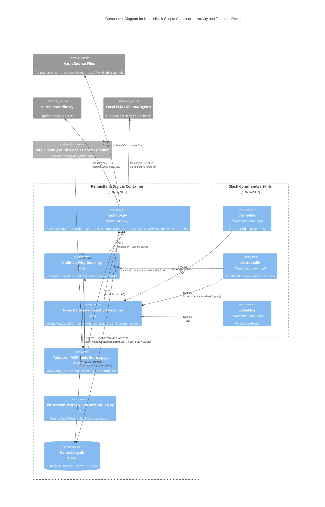

# C4 Component Level: Activity and Temporal Recall

## Overview

- **Name**: Activity and Temporal Recall
- **Description**: A bi-temporal event log over existing vault evidence (sessions, transcripts, memory, wiki, usage) with a deterministic, multi-layer date/period parser, and the commands/MCP tools that query it to answer "what happened, and when."
- **Type**: Library + CLI + local index (SQLite-backed feature slice within the KennisBank scripts container)
- **Technology**: Python 3, SQLite (`kb-activity.db`), `dateparser` (optional, layer 2), local LLM fallback (opt-in, layer 3), Markdown slash commands, local MCP (stdio)

## Purpose

KennisBank needs to answer "what did I do on/in this period?" without relying on
a hosted memory service or a mandatory graph database. This component is the
local-first answer: it derives a canonical, source-referenced `ActivityEvent`
log from files that already exist in the vault (raw sessions, transcripts,
curated memory, wiki, usage logs), indexes that log incrementally into
`<vault>/.claude/kb-activity.db`, and exposes one shared Python API that every
surface (slash commands, MCP tools, eval harness) calls identically — so the
answer to "what happened" never depends on which surface asked.

The design deliberately keeps date resolution and provenance deterministic
and auditable: no LLM is required for indexing, temporal parsing (layers 1–2),
or basic retrieval. An LLM is only an opt-in fallback for exotic phrasing, and
never authoritative over what happened when — a lesson taken from Letta/MemGPT
(the model must not be the sole authority for event time) while adopting Zep/
Graphiti's bitemporal modeling and Mem0's lifecycle-separation thinking, all
without requiring their hosted/graph infrastructure. See
[docs/superpowers/specs/2026-07-08-temporal-activity-recall-design.md](../superpowers/specs/2026-07-08-temporal-activity-recall-design.md).

## Software Features

- **Bi-temporal event model**: every event carries both `event_time` (when the
  work happened) and `captured_at` (when the source was captured/modified/
  indexed), kept intentionally separate — a late import of an old session
  keeps the old activity date while still recording the modern capture time.
- **Canonical `ActivityEvent` schema**: stable SHA-256 ID derived from source
  kind/path/span/kind/time/summary; `source_ref` (vault-relative path + span,
  e.g. `01-raw/sessies/raw-sessie-2026-07-03.md#L12`); explicit `timezone`;
  `activity_kind` taxonomy (`session`, `tool_use`, `decision`, `task_change`,
  `memory_capture`, `wiki_update`, `release`, `commit`, `fix`,
  `external_research`, `memory_use`, fallback kinds); `confidence`;
  `unknown_time` flag when `event_time` had to fall back to file/capture time.
- **Three-layer deterministic-first temporal parser** (`parse_period`):
  1. Layer 1 — deterministic date tokens across 8+ locales (`today`,
     `yesterday`, `5d ago`, `vandaag`, `gisteren`, `eergisteren`,
     `vorige week`/`last week`, absolute dates, explicit ranges).
  2. Layer 2 — `dateparser` library for generic English phrases (imported
     lazily, optional dependency).
  3. Layer 3 — LLM fallback, opt-in via the `activity_llm_fallback` setting,
     only for exotic/compositional phrasing.
  `vorige week` uses the local ISO week model (Monday 00:00 inclusive →
  next Monday 00:00 exclusive) in `Europe/Amsterdam`. Ambiguous numeric dates
  (`03/07/2026`) return a structured error with suggestions instead of
  guessing.
- **Incremental indexing with source watermarks**: `build_activity_index`
  upserts events per source and tracks `source_watermarks` so rebuilds are
  incremental by default; `--full`/`force=True` forces a full rebuild. Long
  runs emit progress at least every 300 seconds.
- **Hard range filtering + ranked topic relevance**: no event outside
  `[start, end_exclusive)` is ever returned unless a future context-before/
  after API explicitly requests and marks it. Within a period, relevance
  ranks: explicit entity match → explicit topic/tag match → alias match
  (`<vault>/.claude/activity-topic-aliases.json`) → FTS/plain-text match →
  optional future semantic enrichment (never required for baseline).
- **Fail-open, source-first outputs**: structured JSON for tests/MCP and
  compact Markdown for commands; every event carries source refs; missing or
  stale index yields a recoverable warning plus a repair command, never a
  traceback.
- **Derived, invalidation-safe rollups**: daily/weekly rollups are cache
  entries, never source of truth; the cache key includes period/topic plus a
  source signature from indexed event IDs and source watermarks — a stale
  signature invalidates the cache.
- **Evaluation harness**: `kb-activity-eval.py` measures date recall, period
  recall, topic-timeline recall/ordering, negative controls, provenance
  coverage, against pass/fail thresholds; personal eval cases stay out of the
  repo (`<vault>/06-claude/kb-activity-eval-set.json`), only a non-personal
  example set ships.

## Code Elements

This component is a slice across four code-level documents (no single file
covers it end to end):

- [c4-code-scripts.md](./c4-code-scripts.md) — primary implementation:
  - `_activity.py` — `ActivityEvent`, `TemporalRange`, activity DB
    (`activity_db_path`, `connect_activity_db`, `ensure_schema`,
    `upsert_event`, `build_activity_index`), entity/topic/artifact
    extraction, `classify_activity`, `parse_period` (3-layer parser),
    `query_events`, `what_did_i_do`.
  - `build-activity-index.py` — CLI entry point that rebuilds the activity
    log from source files (invoked by setup, doctor, and the SessionStart
    hookset).
  - `kb-activity.py` / `kb-activity-eval.py` — CLI for activity log queries
    (`status`, `watdeedik`, `timeline`, etc.) and the evaluation harness.
  - `kb-mcp.py` — hosts the MCP temporal tool wrappers
    (`what_did_i_do`, `timeline`, `weeklog`, `topic_timeline`, alongside
    `recall`/`capture`).
  - `kb-session-start.py` / `kb-session-log.py` — SessionStart/SessionEnd
    coordinators that trigger activity indexing/finalization as part of
    session lifecycle jobs.
- [c4-code-tests.md](./c4-code-tests.md) — test coverage:
  - `test_activity.py` (`ActivityFixtureMixin`, `PeriodParserTest`,
    `ActivityIndexTest`, `UsageSourceExtractorTest`,
    `FingerprintFastpathTest`, `LegacyTableMigrationTest`) — activity index
    schema, period parsing, usage source detection, fingerprinting, legacy
    migration.
  - `test_activity_multilang.py` (`MultilingualTemporalTest`) — Dutch and
    other-locale temporal parsing, locale-aware display names.
  - `test_memory_bitemporal.py` — bitemporal tracking pattern shared with the
    memory system (created vs. updated timestamps), same modeling lineage as
    `event_time`/`captured_at`.
- [c4-code-commands-skills.md](./c4-code-commands-skills.md) — user-facing
  surfaces:
  - `commands/timeline.md` (`/timeline`) — query activity for a date/period.
  - `commands/watdeedik.md` (`/watdeedik`) — compact audit-trail answer with
    source refs; checks index status, rebuilds if missing/stale, then calls
    `kb-activity.py`.
  - `commands/weeklog.md` (`/weeklog`) — synthesizes session logs + activity
    from the past week into projects/learnings/blockers/next-steps.
  - `skills/timeline`, `skills/watdeedik`, `skills/weeklog` — skill wrappers
    invoking the same commands.
- [c4-code-docs.md](./c4-code-docs.md) — design record: TASK-25 "Temporal
  activity recall" (2026-07-08) decision entry, and the full spec at
  [docs/superpowers/specs/2026-07-08-temporal-activity-recall-design.md](../superpowers/specs/2026-07-08-temporal-activity-recall-design.md).

## Interfaces

### Activity Python API
- **Protocol**: Python API (in-process function calls; the single source of
  truth every other interface delegates to)
- **Description**: Canonical read/write surface over `kb-activity.db`. Every
  command, MCP tool, and the eval harness calls the same functions — the
  answer to "what happened" cannot drift between surfaces.
- **Operations**:
  - `activity_db_path(vault: Path | None = None) -> Path`
  - `connect_activity_db(vault: Path | None = None, readonly: bool = False) -> sqlite3.Connection`
  - `ensure_schema(conn: sqlite3.Connection) -> None`
  - `upsert_event(conn: sqlite3.Connection, event: ActivityEvent) -> None`
  - `build_activity_index(vault: Path, force: bool = False, dry_run: bool = False, ...) -> dict`
  - `classify_activity(text: str, fallback: str = "activity") -> str`
  - `extract_entities(text: str, path: str = "") -> list[str]`
  - `extract_topics(text: str, path: str = "") -> list[str]`
  - `extract_artifacts(text: str) -> list[str]`
  - `parse_period(text: str, now: datetime | None = None, tz: ZoneInfo = LOCAL_TZ, default: str = "today") -> TemporalRange`
  - `query_events(vault: Path, period: TemporalRange, topic: str = "", ...) -> list[ActivityEvent]`
  - `what_did_i_do(vault: Path, period: TemporalRange, ...) -> dict`

### Activity CLI
- **Protocol**: CLI (invoked via `python3` / `py -3` per the interpreter
  convention)
- **Description**: Command-line surface used by slash commands, hooks, setup
  and doctor to build, check, and query the index without importing Python.
- **Operations**:
  - `build-activity-index.py --vault <vault> [--full] [--dry-run] [--progress-interval 300]` — rebuild/refresh from source watermarks.
  - `kb-activity.py --vault <vault> status` — index presence/staleness check.
  - `kb-activity.py --vault <vault> watdeedik <period/topic args>` — compact audit-trail query.
  - `kb-activity.py --vault <vault> timeline <period args>` — timeline query.
  - `kb-activity-eval.py` — run the recall/order/provenance eval suite against
    thresholds.

### Temporal MCP Tools
- **Protocol**: MCP (local, stdio; hosted by `kb-mcp.py`)
- **Description**: The same Python API exposed as MCP tools so any MCP-aware
  agent (Claude Code, Codex, Copilot) can query temporal activity directly.
  `install-agent-envs.py` requires these tool names to be present in
  `list-tools` for MCP-configured agents.
- **Operations**:
  - `what_did_i_do(period, topic?) -> structured JSON`
  - `timeline(period) -> structured JSON`
  - `weeklog(week_offset?) -> structured summary`
  - `topic_timeline(topic, period?) -> structured JSON`
  - (adjacent, same server) `recall`, `capture`

### Slash Commands
- **Protocol**: CLI-orchestrated Markdown commands (agent-invoked; wrap the
  Activity CLI)
- **Description**: User-facing entry points for temporal recall.
- **Operations**:
  - `/timeline [date|period|filter]` — what work occurred on a date/period.
  - `/watdeedik [date|period|topic filter]` — audit-trail answer with source
    refs; e.g. `/watdeedik gisteren`, `/watdeedik onderwerp "OpenRouter" afgelopen 7 dagen`.
  - `/weeklog [week offset]` — weekly synthesis of session logs + activity.

## Dependencies

### Components Used
- **Session & Memory Capture** (raw sessions, transcripts, curated memory,
  wiki) — upstream source files this component reads to extract
  `ActivityEvent`s; it does not write back to them.
- **Usage Tracking** (`_usage.py`, `kb-usage.db`) — one of the five activity
  source kinds (`source_kind: usage`).
- **Session Lifecycle Coordination** (`kb-session-start.py`,
  `kb-session-log.py`) — triggers activity indexing/finalization as part of
  SessionStart/SessionEnd job fan-out.
- **Local MCP Server** (`kb-mcp.py`) — hosts this component's tools alongside
  `recall`/`capture` in the same stdio process.

### External Systems
- **`dateparser` (Python library)** — optional, lazily imported, used only as
  temporal-parsing layer 2.
- **Local LLM (Ollama or the invoking agent)** — optional, opt-in via
  `activity_llm_fallback` setting, used only as temporal-parsing layer 3;
  never required for indexing or baseline retrieval.
- **Filesystem / SQLite (`kb-activity.db`)** — the only persistent store;
  local-first, no cloud dependency, deletable and rebuildable via
  `build-activity-index.py --full`.

## Component Diagram

