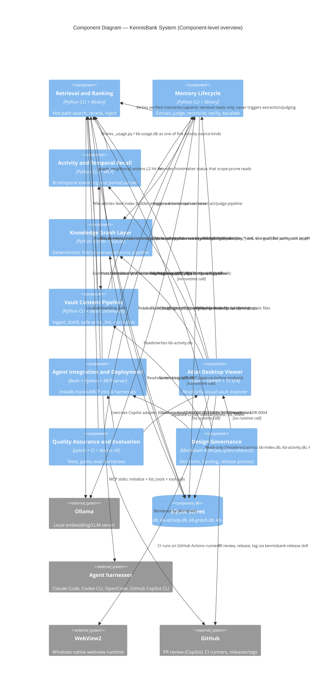

# C4 Component Level: System Overview

## Purpose

This is the master index over KennisBank's nine C4 Component-level documents. It lists every component, shows how they depend on each other and on external systems, names the shared storage every component reads or writes, and separates hot-path (interactive) components from off-path (deferred/scheduled) ones. It synthesizes only what the nine component documents themselves assert — where a component doc flagged a gap or an unverified claim, that flag is carried forward here rather than smoothed over.

---

## System Components

### Retrieval and Ranking
- **Description**: The hot-path subsystem that embeds a prompt/query, searches the hybrid vector+FTS index, reranks hits with multiple trust/recency/usage signals, fits them into a token budget, and injects them as context — fail-open, sub-2s budget.
- **Documentation**: [c4-component-retrieval.md](./c4-component-retrieval.md)

### Memory Lifecycle
- **Description**: Extracts candidate knowledge from transcripts, judges and reconciles it against existing memory, verifies unverified claims, and runs the state machine (unverified → current/quarantined → superseded/retracted/expired) via three escalating trust traps (grounded verification, subagent adjudication, human review).
- **Documentation**: [c4-component-memory-lifecycle.md](./c4-component-memory-lifecycle.md)

### Activity and Temporal Recall
- **Description**: A bi-temporal event log derived from existing vault evidence, with a deterministic three-layer date/period parser, answering "what happened, and when" through one shared Python API used identically by CLI, MCP, and eval surfaces.
- **Documentation**: [c4-component-temporal-recall.md](./c4-component-temporal-recall.md)

### Knowledge Graph Layer
- **Description**: A deterministic, zero-LLM repair/prune/index pipeline layered on top of `graphify`'s LLM-driven extraction, producing `kb-graph.db` for fast weighted-neighbor lookups consumed by L2 retrieval and `/brug`.
- **Documentation**: [c4-component-knowledge-graph.md](./c4-component-knowledge-graph.md)

### Vault Content Pipeline
- **Description**: Ingest, archival, distillation, safe atomic writes, provenance lint, normalization, conflict scanning, and staleness detection across the `00-inbox → 01-raw → 02-wiki → 08-archive` (+ `09-memory`) directory contract.
- **Documentation**: [c4-component-content-pipeline.md](./c4-component-content-pipeline.md)

### Agent Integration and Deployment
- **Description**: Installs and validates one vault, one local MCP server, and one hook/lifecycle contract into four independent agent harnesses (Claude Code, Codex CLI, OpenCode, GitHub Copilot CLI) — idempotent, fail-open, provable via a real MCP handshake.
- **Documentation**: [c4-component-agent-integration.md](./c4-component-agent-integration.md)

### Atlas Desktop Viewer
- **Description**: A read-only Tauri desktop application (Rust shell + FastAPI sidecar + TypeScript SPA) giving a human editor a visual, seven-lens window over the vault; reuses the vault's own production Python modules for parity, with exactly one guarded write path (memory approve/reject).
- **Documentation**: [c4-component-atlas.md](./c4-component-atlas.md)

### Quality Assurance and Evaluation
- **Description**: The pytest suite (142 modules, ~1,600 hermetic cases), GitHub Actions CI gates (coverage ≥75%, syntax pre-checks, an independent Atlas job), `doctor.sh`'s read-only post-install health check, and offline eval/measurement harnesses for retrieval/ranking quality.
- **Documentation**: [c4-component-quality-assurance.md](./c4-component-quality-assurance.md)

### Design Governance
- **Description**: ADRs, design specs, implementation plans, and research reports that steer every other component, plus the Backlog.md task contract and the release/contribute/upgrade process skills that enforce review-before-merge and verify-merge-before-tag.
- **Documentation**: [c4-component-design-governance.md](./c4-component-design-governance.md)

---

## Component Relationships Diagram

Only relationships explicitly stated in the component docs are drawn. Design Governance governs code across all components (via ADR "Impacts" lists and specs) rather than calling them at runtime, so it is shown with a distinct "governs" relation rather than a data-flow edge. Quality Assurance exercises/gates the others rather than being called by them at runtime, also shown distinctly.

**Note on completeness**: no component doc states a relationship from Design Governance or Quality Assurance *into* the Knowledge Graph Layer, Vault Content Pipeline, or Activity/Temporal Recall beyond the generic "governs everything via ADR Impacts" / "exercises hermetically" statements already captured above; those specific edges are intentionally omitted rather than inferred.

---

## Shared Foundations

Every component built on the scripts container depends on the same handful of cross-cutting primitives. These are not separate components — they are the substrate every component doc names as a dependency.

### Vault-root resolver (ADR-0002)
`_vaultpath.py` / `vault_root()` is the single source of truth for locating the vault, respecting `KENNISBANK_VAULT`, with no hardcoded paths permitted anywhere. Named as a direct dependency by Retrieval, Memory Lifecycle, Knowledge Graph, Vault Content Pipeline, and Agent Integration; ADR-0002 itself (governed by Design Governance) constrains "all of `scripts/*.py`, `setup.sh`, `scripts/doctor.sh`, all of `tests/`."

### Vault directory contract
The `00-inbox/ → 01-raw/(sessies/, checkpoints/) → 02-wiki/ → 08-archive/` pipeline, with `09-memory/` as a parallel distillation target and `05-bronnen/` for imported-source provenance, is documented explicitly by the Vault Content Pipeline component as "the pipeline's real interface... a directory convention, not a function signature." `kb-lint.py`'s HARD self-source rule (`02-wiki/`, `09-memory/`, `.claude/`, `06-claude/` are forbidden provenance sources) is the enforcement mechanism that keeps the arrow direction one-way.

### SQLite stores and read/write ownership

| Store | Written by | Read by |
|---|---|---|
| `kb-index.db` (vector + FTS, `vec_docs`/`docs`) | Index builders (`build-kb-index.py`, `build-embed-index.py`, `embed-sweep.py`) and Memory Lifecycle (`_memory.py` → `upsert()` for verified memories); "only sweep and index builds write to kb-index.db" | Retrieval hot path (read-only, per documented concurrency constraint), Memory Lifecycle (`_groundcheck.py`/`_reconcile.py` via `search()`/cosine), Knowledge Graph (`_scenes.py` reads current memories), Atlas (read-only SQL, `?mode=ro`), Quality Assurance (hermetic exercise) |
| `kb-graph.db` (`graph_nodes`/`graph_edges`, separate fingerprint since TASK-75) | `build-graph-index.py` via `replace_graph()` | Retrieval L2 stage (`graph_neighbors()`), `/brug`, Atlas (reads `graphify-out/graph.json`/`.html` as static files, not `kb-graph.db` directly per its own doc) |
| `kb-activity.db` (`activity_events`, `source_watermarks`) | `_activity.py` / `build-activity-index.py` (incremental, watermark-tracked) | Activity CLI, temporal MCP tools, `/timeline`/`/watdeedik`/`/weeklog`, Atlas (read-only SQL for timeline/overview heatmap) |
| `kb-usage.db` (via `_usage.py`) | Retrieval's usage-feedback loop (`log_injected`, `mark_used`, `mark_noise`) | `_rank.py` (usage_factor, noise_factor), Activity component (one of five `source_kind`s), Atlas (read-only, usage warmth) |

**Gap carried forward**: the Retrieval component doc explicitly flags that `_kbindex.py`'s graph functions (`graph_connect`, `replace_graph`, `graph_neighbors`) are documented in that file even though ownership of the graph pipeline itself sits in the Knowledge Graph component — the two docs describe the same storage layer from different angles and this index does not attempt to resolve that overlap beyond noting it.

---

## Hot Path vs Off-Path

Per the repo's north-star ("onzichtbaar, snel, uit de weg" — invisible, fast, out of the way) and the "Critical Paths (Performance-Sensitive)" section referenced across multiple component docs, only a narrow slice of the system runs inside the interactive latency budget; everything else is deliberately pushed off it.

### Hot path (interactive, sub-second/sub-2s budget)
- **Retrieval and Ranking**: `kb-retrieve.py` (UserPromptSubmit hook, ~2s budget), `kb-recall.py` — fail-open, reads `kb-index.db`/`kb-graph.db` only, never writes.
- **Knowledge Graph Layer**: only the *read* side (`graph_neighbors()` via `kb-graph.db`) is on the hot path; the build/repair pipeline (`graph-link-layer.py`, `graph-provenance-ring.py`, `graph-scope-prune.py`, `build-graph-index.py`) is explicitly off-path, daily batch or manual.
- **Agent Integration**: the hook contract itself (`_hooks_manifest.py` timeouts: `UserPromptSubmit` 30s, `PreToolUse` 30s) sits on or bounds the hot path; `SessionStart`/`SessionEnd` coordinators (240s/90s) are longer-budget lifecycle events, not the per-prompt path.

### Off-path (deferred / scheduled / on-demand)
- **Memory Lifecycle**: entirely off-path by design — `memory-sweep.py` runs "concurrent with retrieval (read-only to main index)"; grounded verification, autoreview escalation, human review, maintenance passes, and diagnostics are all off-path per that component's own "Off-Hot-Path Execution" table.
- **Activity and Temporal Recall**: index build (`build-activity-index.py`) is incremental/watermark-based but invoked by SessionStart/SessionEnd job fan-out, not the per-prompt hot path; query CLI/MCP tools are on-demand, not budget-constrained in the same way as retrieval.
- **Vault Content Pipeline**: all of it — ingest, import, archival, distillation, safe-edit, lint, normalize, conflict-scan, stale-check — is slash-command/agent-invoked or SessionEnd-hook-triggered, never inline with prompt retrieval.
- **Agent Integration (installer half)**: `setup.sh`/`install-agent-envs.py` run once at install time on the developer's machine — explicitly not a runtime path at all, per that component's own "Notes for the Container level."
- **Atlas Desktop Viewer**: a separate, user-launched desktop process; its sidecar API (millisecond-to-low-second local reads) is its own interactive budget, independent of and never blocking the CLI/agent hot path.
- **Quality Assurance and Evaluation**: CI, `doctor.sh`, and eval harnesses are all pre-merge/pre-install/periodic-research activities, never part of any runtime path.
- **Design Governance**: pure process/documentation — never executes at runtime.

**Gap carried forward**: the Retrieval component doc notes a naming discrepancy it does not resolve (`context-budget.py` CLI vs. `_context_budget.py` module in tests) and flags that no standalone `kb-presearch.py` script could be confirmed in `c4-code-scripts.md` despite being referenced by tests and by the Agent Integration component's hook table (`PreToolUse` → `kb-presearch.py`, matcher `WebSearch|WebFetch`). This index repeats rather than resolves that discrepancy.
