# C4 Container Level: KennisBank

## 1. Overview

KennisBank is a **local-first personal knowledge management system**, not a cloud/microservices system. There is no application server, no container orchestration, and no persistent network daemon other than a stdio MCP process and a loopback-only desktop sidecar. "Containers" here are C4's sense of the word — separately runnable/deployable units — realized as: an installed tree of Python CLI scripts invoked by agent-harness hooks, a long-lived stdio MCP process spawned per agent session, scheduled/idle-triggered background maintenance jobs, a desktop application (Tauri shell + bundled frontend + frozen Python sidecar), two SQLite stores, and the markdown vault itself.

This document synthesizes the nine C4 component documents under `docs/C4-Documentation/` and verifies deployment reality directly against `setup.sh`, `scripts/doctor.sh`, `scripts/install-agent-envs.py`, `atlas/src-tauri/tauri.conf.json`, `atlas/sidecar/app.py`, and `.github/workflows/ci.yml`. No Kubernetes, Docker, or cloud infrastructure exists anywhere in this repository — every container below runs on the user's own machine.

## 2. Containers

### 2.1 Hook-Invoked CLI Scripts (KennisBank Scripts Layer)

- **Description**: A tree of short-lived Python 3.9+ scripts under `<vault>/.claude/scripts/`, deployed by `setup.sh`/`install-agent-envs.py`, invoked synchronously by agent-harness lifecycle hooks (`UserPromptSubmit`, `SessionStart`, `SessionEnd`, `PreToolUse`, `PreCompact`) and by slash commands. Each invocation is a fresh `python3`/`py -3` process that exits after doing its job — there is no long-running scripts process.
- **Type**: CLI process set, per-invocation
- **Technology**: Python 3.9+ (stdlib-first), invoked as `python3` (macOS/Linux) or `py -3` (Windows) per the interpreter convention (ADR-0002)
- **Deployment**: Installed into `<vault>/.claude/scripts/` by `setup.sh` → `install-agent-envs.py`; hook wiring is a single declarative manifest (`_hooks_manifest.py`) consumed by `register-hooks.py` (Claude), `install-agent-envs.py` (Codex), and `_copilot.py` (Copilot). No process manager — the harness (Claude Code, Codex CLI, OpenCode, Copilot CLI) spawns each hook script per event.

**Purpose**: This is the hot-path half of the system — the CLAUDE.md north-star ("onzichtbaar, snel, uit de weg") applies most directly here. `kb-retrieve.py` embeds the prompt, searches the hybrid index, reranks, and injects context inside a ~2s budget, fail-open on any error. All heavier work (extraction, judging, index rebuilds) is explicitly pushed off this path.

**Components** (linked to their C4 component docs):
- Retrieval and Ranking — [c4-component-retrieval.md](./c4-component-retrieval.md) (`kb-retrieve.py`, `kb-recall.py`, `kb-search.py`, `kb-ask.py`, `_kbindex.py`, `_embeddings.py`, `_rank.py`, `_usage.py`, `context-budget.py`, `find-similar.py`)
- Memory Lifecycle (hot-path-adjacent verification/diagnostics entry points; the extraction/judging pipeline itself runs as a background worker, §2.3) — [c4-component-memory-lifecycle.md](./c4-component-memory-lifecycle.md) (`kb-verify.py`, `kb-state-audit.py`, `memory-doctor.py`)
- Activity and Temporal Recall — [c4-component-temporal-recall.md](./c4-component-temporal-recall.md) (`kb-activity.py`, `_activity.py`)
- Knowledge Graph Layer (query-time neighbor lookup only; the build pipeline is a background job, §2.3) — [c4-component-knowledge-graph.md](./c4-component-knowledge-graph.md) (`_kbindex.py` graph API)
- Vault Content Pipeline (interactive, agent-driven parts: `safe-edit.py`, `kb-lint.py`, importers, `/intake`, `/wiki`, `/destilleer`) — [c4-component-content-pipeline.md](./c4-component-content-pipeline.md)
- Agent Integration and Deployment (the hook scripts themselves as a deployed artifact; installer tooling is a one-time, developer-machine-only run, not a runtime container) — [c4-component-agent-integration.md](./c4-component-agent-integration.md)

**Interfaces**:
- Invoked by the harness with a JSON payload on stdin (Claude Code / Copilot hook contract) or CLI argv (slash commands, manual use); responds via stdout (`additionalContext` injection) or exit code. No network listener.
- Fail-open contract: `_copilot.py`'s generated Copilot hook commands append `; exit 0`; `kb-copilot-capture.py` and `quiet-hook.py` always exit 0; `kb-retrieve.py` is documented as "any error → silent, no output, exit 0."

**Dependencies**:
- **kb-index.db** (§2.5) — read-only on the hot path (`_kbindex.search()`); only background builders/sweeps write.
- **kb-activity.db**, **kb-graph.db** (§2.5) — read on the hot path.
- **The markdown vault** (§2.6) — read for context reconstruction; writes only through `safe-edit.py`'s atomic path.
- **Ollama** (external, local) — embedding calls from `_embeddings.py`; shares the GPU-VRAM budget described in §5.
- **The MCP server** (§2.2) is a sibling process, not a dependency — the scripts here are the implementation the MCP tools and hooks both call into; they do not call the MCP server.

**Infrastructure**: No server process. Started per hook event by the harness; the "resource" is one interpreter startup plus module import (`_vaultpath`, `_embeddings`, `_kbindex`) per invocation. Latency budget: ~2s for `kb-retrieve.py` per `c4-code-scripts.md`'s "Critical Paths" section; enforced only informally (no automated latency gate in CI beyond the eval harnesses, see §2.7).

---

### 2.2 Local MCP Server Process

- **Description**: `kb-mcp.py`, a single long-lived Python process per agent session, speaking the Model Context Protocol over **stdio** (not HTTP). Spawned by whichever harness supports MCP (Codex CLI, OpenCode, GitHub Copilot CLI); **Claude Code does not spawn this process** — Claude reaches KennisBank exclusively through the hook path (§2.1).
- **Type**: Long-lived local server process, one per agent session
- **Technology**: Python 3, `mcp` Python SDK (pinned `mcp==1.28.1`) + `anyio`, stdio transport
- **Deployment**: Registered per harness by `install-agent-envs.py` (Codex `config.toml`, OpenCode `opencode.json`) or `_copilot.py` (Copilot `mcp-config.json`), all pointing at the same command built by `_mcp_server_argv(vault)` = `<py -3 | python3> <vault>/.claude/scripts/kb-mcp.py`. The harness itself spawns and owns the process lifetime — KennisBank installs only the pointer.

**Purpose**: Exposes the vault's recall/capture/review/temporal-recall surface as MCP tools so any MCP-aware agent gets the same functionality Claude Code gets via hooks, without KennisBank needing per-harness bespoke code beyond the adapter layer.

**Components**: Agent Integration and Deployment — [c4-component-agent-integration.md](./c4-component-agent-integration.md) (`kb-mcp.py`); Activity and Temporal Recall — [c4-component-temporal-recall.md](./c4-component-temporal-recall.md) (the four temporal tools share the `_activity_call` dispatcher hosted here).

**Interfaces**: MCP stdio — `initialize()`, `list_tools()`, `call_tool()`. Six tools plus four temporal tools are exposed (see [`kennisbank-mcp-tools.yaml`](./apis/kennisbank-mcp-tools.yaml) for the full contract). Installation is only accepted as valid after `install-agent-envs.py:validate_mcp_runtime` performs a real handshake and confirms every tool name is present (contract rule C9) — a config file naming the server is not sufficient.

**Dependencies**:
- Imports the same library modules as the hook scripts (`_kbindex.py`, `_embeddings.py`, `_memory.py`, `_activity.py`) in-process — it is a thin protocol wrapper, not a reimplementation.
- **kb-index.db**, **kb-activity.db** (§2.5) — read/write depending on tool (`capture`, `review_decide` write; the rest read).
- **Ollama** (external) — embedding/generation calls for `recall`/`capture`, competing for the shared VRAM budget (§5).

**Infrastructure**: Started and killed by the parent harness process (child-process lifetime tied to the agent session). No port, no health check beyond the MCP handshake itself. Windows note: detached workers spawned indirectly under a console-less parent can produce a visible console popup unless `CREATE_NO_WINDOW` is set on direct child processes — a known constraint recorded for Windows deployments of this process family.

---

### 2.3 Scheduled / Background Maintenance Workers

- **Description**: Off-hot-path Python processes that do the heavy lifting the interactive containers above must never block on: full index/embedding builds, memory extraction/judging/reconciliation, graph rebuilds, staleness/conflict scans, and diagnostics. Triggered by slash commands (`/sessielog`, `/destilleer`, `/kennisbank:autoreview`), SessionStart/SessionEnd coordinators, or run manually/periodically (no OS-level cron is bundled by this repo; scheduling is left to the invoking harness's idle/session triggers and to the user, per the C4 component docs — no `crontab`/Task Scheduler entry was found in this repo's own tooling).
- **Type**: Batch/CLI processes, off-hot-path, concurrency-constrained (read-only against `kb-index.db` while retrieval is live)
- **Technology**: Python 3.9+, same interpreter/vault-resolution conventions as §2.1; local LLM (Ollama) for judging/verification/reconciliation, optional cloud LLM (OpenRouter/Claude CLI) for opt-in escalation only

**Purpose**: Keep the interactive path fast by doing everything expensive somewhere else — index building ("hours-long, not on critical path"), memory extraction/judging/reconciliation (`memory-sweep.py`, "concurrent with retrieval, read-only to main index"), graph link/prune/index passes, and quality diagnostics.

**Components**:
- Memory Lifecycle (the core of this container) — [c4-component-memory-lifecycle.md](./c4-component-memory-lifecycle.md): `memory-sweep.py`, `_extract.py`, `_judge.py`, `_reconcile.py`, `_maintenance.py`, `_groundcheck.py`, `kb-verify.py`, `kb-autoreview.py`
- Retrieval and Ranking (index-build slice) — [c4-component-retrieval.md](./c4-component-retrieval.md): `build-kb-index.py`, `build-embed-index.py`, `embed-sweep.py`
- Knowledge Graph Layer (the entire deterministic build pipeline) — [c4-component-knowledge-graph.md](./c4-component-knowledge-graph.md): `graph-link-layer.py`, `graph-provenance-ring.py`, `graph-scope-prune.py`, `build-graph-index.py`, plus the external `graphify` extraction step it wraps
- Activity and Temporal Recall (index build) — [c4-component-temporal-recall.md](./c4-component-temporal-recall.md): `build-activity-index.py`
- Vault Content Pipeline (distillation/lint/normalize/conflict/stale passes) — [c4-component-content-pipeline.md](./c4-component-content-pipeline.md): `conflict-scan.py`, `stale-check.py`, `kb-normalize.py`
- Quality Assurance and Evaluation (eval harnesses, run manually/periodically, not CI-gated) — [c4-component-quality-assurance.md](./c4-component-quality-assurance.md): `kb-eval.py`, `judge-model-sweep.py`, `rerank-eval.py`, `recall-ablation.py`

**Interfaces**: CLI (argparse), invoked by slash commands or manually; no network listener; writes to `kb-index.db`, `kb-activity.db`, `kb-graph.db`, and `09-memory/`/`02-wiki/` (only through `safe-edit.py` for wiki writes).

**Dependencies**: Reads/writes all three SQLite stores (§2.5) and the vault filesystem (§2.6); calls Ollama for judging/embedding/reconciliation and, opt-in only, cloud LLM providers for the `/kennisbank:autoreview` escalation trap.

**Infrastructure**: No daemon. "Scheduling" is: (a) daily/idle-triggered from `/sessielog` (checks `graph.json` mtime staleness, `daily_graphify` toggle), (b) on-demand slash commands, (c) manual CLI runs. **Concurrency constraint** (explicit, load-bearing): "Only sweep and index builds write to `kb-index.db`; retrieval reads only" — this is what lets §2.1 and §2.3 run concurrently without lock contention.

---

### 2.4 Atlas Desktop Application

- **Description**: A read-only (except one guarded write path) Tauri desktop application giving a human editor a visual window over the vault — three co-deployed runtimes packaged as one installer.
- **Type**: Desktop application — native shell + local HTTP backend (loopback only) + web frontend, three runtimes in one deployable unit
- **Technology**: Rust 2021 (Tauri v2, `tauri-plugin-shell`) + Python 3.10+/FastAPI/uvicorn (sidecar, frozen via PyInstaller onedir) + TypeScript/Vite (frontend SPA), WebView2 (Windows)
- **Deployment**: Packaged as a Windows MSI/NSIS installer (`atlas/src-tauri/tauri.conf.json`: `"targets": ["msi", "nsis"]`, `"externalBin": ["binaries/atlas-sidecar"]`, resources bundle `binaries/_internal`). The Rust shell spawns the frozen `atlas-sidecar` binary as a child process via `tauri-plugin-shell` at app launch and owns its lifetime (killed on window close — no orphan process by construction). macOS (WKWebView) is scaffolded, not implemented.

**Purpose**: Lets a human *look at* vault health, the knowledge graph, memory lifecycle, and the live retrieval waterfall — reusing KennisBank's own production Python modules in-process for parity, never a second drifting implementation of ranking/provenance logic.

**Components**: Atlas Desktop Viewer — [c4-component-atlas.md](./c4-component-atlas.md) (Tauri shell, FastAPI sidecar, frontend SPA, seven lens modules, launcher/doctor).

**Sub-runtimes**:
1. **Tauri shell (Rust)** — no custom `#[command]` IPC handlers (zero business logic by ADR-0004); process spawn, port injection (`window.__ATLAS_PORT__`), stderr drain, CSP enforcement.
2. **Frontend SPA (TypeScript/Vite)** — `DataClient` hard-guards every request to `http://127.0.0.1:{port}`; polls `GET /health` with unbounded backoff to tolerate PyInstaller cold-boot.
3. **FastAPI sidecar (Python, frozen)** — binds `127.0.0.1` only (never `0.0.0.0`); imports the vault's own `_embeddings.py`, `_kbindex.py`, `_rank.py`, `kb-recall.py`, `kb-lint.py`, `_memory.py` in-process via `_load_vault_module()`.

**Interfaces**: The full sidecar HTTP contract is specified in [`atlas-sidecar-api.yaml`](./apis/atlas-sidecar-api.yaml) — **13 routes verified directly against `atlas/sidecar/app.py`** (source, not just the c4-code doc): `GET /health`, `GET /graph`, `GET /timeline`, `GET /memory-health`, `GET /overview`, `GET /titles`, `POST /memory/decide`, `GET /provenance`, `GET /doc`, `GET /asset`, `GET /graphify-html` (+HEAD), `GET /recall`, `GET /memory-links`. Route count and shapes match `c4-code-atlas-sidecar.md`'s claim of 13 routes — confirmed, no drift found on this count.

**Dependencies**: Reads (never writes, except `POST /memory/decide`) all vault stores directly off disk in-process — `kb-index.db`, `kb-usage.db`, `kb-activity.db` (all `?mode=ro`), `09-memory/*.md`, `02-wiki/*.md`, `graphify-out/graph.json` + `graph.html`. Calls **Ollama** (`http://127.0.0.1:11434`) for a liveness probe and live recall-query embedding — the only outbound network call anywhere in Atlas.

**Infrastructure**: Deploy config — [`atlas/src-tauri/tauri.conf.json`](../../atlas/src-tauri/tauri.conf.json). Starts on user launch of the installed app; sidecar process starts as a child of the Tauri shell and stops when the window closes (no orphan, by process-handle ownership). CSP (`connect-src http://127.0.0.1:*`) and CORS (origin regex limited to localhost/`tauri://localhost`/`http://tauri.localhost`) are the declared trust boundary — no authentication, loopback-only binding is the real one. Resource note: the frozen sidecar shares the same local Ollama instance (and its VRAM budget, §5) as the CLI scripts and MCP server when the desktop app and an agent session run concurrently.

---

### 2.5 SQLite Stores

- **Description**: Three independent SQLite databases under `<vault>/.claude/`, each with its own schema, fingerprint, and write-ownership rule. Deliberately **not** merged into one database — a full rebuild/unlink of one index must never silently drop another (explicit design rationale for the vector/graph split, TASK-75).
- **Type**: Embedded, file-based data stores (no server process)
- **Technology**: SQLite, with the `sqlite-vec` extension for vector search in `kb-index.db`

| Store | Path | Owner writer(s) | Readers | Purpose |
|---|---|---|---|---|
| `kb-index.db` | `<vault>/.claude/kb-index.db` | `build-kb-index.py`, `build-embed-index.py`, `embed-sweep.py`, `memory-sweep.py` (memory upserts) | `kb-retrieve.py`, `kb-recall.py`, `kb-search.py`, `find-similar.py`, MCP server, Atlas sidecar (`?mode=ro`) | Hybrid vector (`vec_docs`, sqlite-vec cosine) + FTS (`docs`) index over wiki + memory, combined via RRF |
| `kb-graph.db` | `<vault>/.claude/kb-graph.db` | `build-graph-index.py` (via `replace_graph`) | `kb-retrieve.py` L2 stage (`graph_neighbors`), `/brug`, Atlas `GET /graph` | Deterministic link/provenance graph loaded from `graphify-out/graph.json`; own mtime+size fingerprint, independent of the vector index |
| `kb-activity.db` | `<vault>/.claude/kb-activity.db` | `build-activity-index.py` (incremental, watermark-tracked) | `kb-activity.py`, MCP temporal tools, `/timeline`/`/watdeedik`/`/weeklog`, Atlas sidecar (`?mode=ro`) | Bi-temporal `ActivityEvent` log (`event_time` vs `captured_at`) derived from existing vault evidence |

(A fourth store, `kb-usage.db`, is referenced by the Retrieval/Atlas component docs as backing `_usage.py`'s injected/used/noise tracking and Atlas's warmth ranking; treated here as part of the `kb-index.db`/usage-tracking family rather than a separate top-level store, since none of the nine component docs describe it as independently schema-owned.)

**Concurrency contract**: "Only sweep and index builds write to `kb-index.db`; retrieval reads only" — the single rule that lets §2.1 (hot path) and §2.3 (background workers) coexist without lock contention. All three stores are local files; none are network-accessible.

**Infrastructure**: No server process, no backup/replication beyond whatever the user's own file backup does. Rebuildable from source: `kb-index.db` from vault markdown (`build-kb-index.py --full`... conceptually), `kb-activity.db` from source files (`build-activity-index.py --full`), `kb-graph.db` from `graphify-out/graph.json` (`build-graph-index.py --force`). Deleting any of the three and rebuilding is a supported recovery path per their respective component docs.

---

### 2.6 Markdown Vault (Flat-File Store)

- **Description**: The actual knowledge — wiki articles, memory fragments, raw sessions, archived transcripts, inbox — stored as plain Markdown + YAML frontmatter under a single vault root, version-controlled with Git. This is the source of truth every SQLite store is a derived index over.
- **Type**: Flat-file store, Git-versioned
- **Technology**: Markdown + YAML frontmatter, Git

**Directory contract** (content moves strictly left to right):
```
00-inbox/    → unsorted drop zone
01-raw/      → sessies/ (raw session logs), checkpoints/ (work-state snapshots)
02-wiki/     → curated, compiled knowledge; every write via safe-edit.py, must lint clean
05-bronnen/  → source provenance for imported (non-session) material
08-archive/  → verbatim session transcript captures (capture-before-analysis, ADR-007)
09-memory/   → distilled memory fragments (parallel distillation target)
```
Resolution is **always** via `vault_root()` in `_vaultpath.py`, respecting `KENNISBANK_VAULT`; no script anywhere hardcodes a vault path (ADR-0002, enforced as a checked convention across all nine component docs).

**Components**: Vault Content Pipeline owns the write/lint/normalize contract over this store — [c4-component-content-pipeline.md](./c4-component-content-pipeline.md).

**Dependencies**: Git — every wiki write is a commit (`safe-edit.py` shells to `git add`/`git commit`/`git reset` for atomic rollback). No other external system touches this store directly; all other containers read it through their own indexes or, for writes, exclusively through `safe-edit.py`.

**Infrastructure**: No infrastructure — it is the user's own filesystem tree, backed up/versioned however the user's own Git remote is configured (out of scope for this repo, which is the tooling, not the vault content itself).

---

### 2.7 Quality Assurance and Governance (cross-cutting, not a runtime container)

Included for completeness since it gates every other container's changes, but it is explicitly **not** a runtime deployment unit: the pytest suite, CI workflow (`.github/workflows/ci.yml`, GitHub Actions `ubuntu-latest` runners), `doctor.sh` (read-only post-install health gate), and the release/governance process (ADRs, specs, Backlog.md, the `kennisbank-release` skill). See [c4-component-quality-assurance.md](./c4-component-quality-assurance.md) and [c4-component-design-governance.md](./c4-component-design-governance.md).

---

## 3. External Systems (shared across containers)

| System | Used by | Protocol | Notes |
|---|---|---|---|
| **Ollama** (`http://127.0.0.1:11434`, local) | §2.1 (embeddings), §2.2 (MCP embed/generate), §2.3 (judging/reconciliation/verification), §2.4 (liveness probe + recall embedding) | HTTP, loopback | **Shared VRAM budget** — see §5. Default backend per ADR-0001; "Lokaal, altijd" (CLAUDE.md). |
| **OpenRouter / Claude CLI** (cloud) | §2.3 only, opt-in via `auto_review_llm` setting | HTTPS | The sole cloud LLM path; used loudly (logged) for `/kennisbank:autoreview` client-LLM escalation. Not used by any hot-path container. |
| **GitHub Copilot CLI** (`@github/copilot`) | External harness reaching §2.1/§2.2 | Cloud-backed CLI, own network | The one harness with a live third-party network dependency (ADR-0003) — KennisBank's own retrieval stays local even when Copilot itself is cloud-backed. |
| **Claude Code / Codex CLI / OpenCode** (external harnesses) | Reach §2.1 via hooks (Claude) or §2.2 via MCP (Codex, OpenCode) | Hook JSON on stdin/stdout; MCP stdio | Installed and run independently of this repo. |
| **`graphify`** (external tool) | §2.3 (graph build pipeline input) | CLI, local | LLM-driven semantic extraction producing `graphify-out/graph.json`; this repo's deterministic graph scripts only repair/prune/index its output. |
| **WebView2** (Windows) | §2.4 | OS-native | Rendering engine hosting the Atlas frontend; assumed pre-installed on Windows 11. |
| **GitHub Actions** | §2.7 | CI, cloud | Not a runtime dependency of any deployed container — build/test time only. |

## 4. Container Diagram

```mermaid
C4Container
    title Container Diagram — KennisBank (local-first, no cloud infrastructure)

    Person(user, "User / Editor", "Works via an agent CLI or the Atlas desktop app")

    System_Boundary(kennisbank, "KennisBank (single machine)") {
        Container(hooks, "Hook-Invoked CLI Scripts", "Python 3.9+, per-invocation", "Hot-path retrieval, ad-hoc query, content-pipeline writes. Fail-open, ~2s budget.")
        Container(mcp, "Local MCP Server", "Python, mcp SDK, stdio", "kb-mcp.py: recall/capture/review/temporal tools. One process per agent session (Codex/OpenCode/Copilot only).")
        Container(workers, "Scheduled / Background Workers", "Python 3.9+, batch CLI", "Index builds, memory extraction/judging/reconciliation, graph pipeline, diagnostics. Off hot path.")
        Container(atlas, "Atlas Desktop Application", "Rust/Tauri + FastAPI (frozen) + TS/Vite", "Read-only visual viewer + one guarded write path. Loopback-only HTTP between shell and sidecar.")
        ContainerDb(kbindex, "kb-index.db", "SQLite + sqlite-vec", "Vector + FTS hybrid index (wiki + memory)")
        ContainerDb(kbgraph, "kb-graph.db", "SQLite", "Deterministic link/provenance graph, own fingerprint")
        ContainerDb(kbactivity, "kb-activity.db", "SQLite", "Bi-temporal ActivityEvent log")
        ContainerDb(vault, "Markdown Vault", "Markdown + YAML frontmatter, Git", "Source of truth: 00-inbox / 01-raw / 02-wiki / 05-bronnen / 08-archive / 09-memory")
    }

    System_Ext(ollama, "Ollama", "Local embedding/LLM server, localhost:11434 — shared VRAM budget")
    System_Ext(cloudllm, "OpenRouter / Claude CLI", "Opt-in cloud LLM escalation only")
    System_Ext(graphify, "graphify", "External LLM-driven semantic extraction CLI")
    System_Ext(claudecode, "Claude Code", "Hooks only, no MCP")
    System_Ext(codexcli, "Codex CLI", "MCP + hooks")
    System_Ext(opencode, "OpenCode", "MCP + plugin hooks")
    System_Ext(copilot, "GitHub Copilot CLI", "Cloud-backed harness; MCP + hooks")
    System_Ext(webview2, "WebView2", "Windows native webview runtime")

    Rel(user, claudecode, "Types prompts")
    Rel(user, codexcli, "Types prompts")
    Rel(user, opencode, "Types prompts")
    Rel(user, copilot, "Types prompts")
    Rel(user, atlas, "Explores vault visually")

    Rel(claudecode, hooks, "Hook JSON on stdin/stdout", "UserPromptSubmit, SessionStart, SessionEnd, PreToolUse, PreCompact")
    Rel(codexcli, hooks, "Hooks (own event names: Stop, no PreCompact)")
    Rel(copilot, hooks, "camelCase hook events; ; exit 0 fail-open wrapper")
    Rel(codexcli, mcp, "MCP stdio: initialize + list_tools + call_tool")
    Rel(opencode, mcp, "MCP stdio")
    Rel(copilot, mcp, "MCP stdio")

    Rel(hooks, kbindex, "Reads (hot path); writes only via background builders")
    Rel(hooks, kbgraph, "Reads (L2 neighbor lookup)")
    Rel(hooks, kbactivity, "Reads/writes (activity index touch)")
    Rel(hooks, vault, "Reads context; writes only via safe-edit.py (atomic, git-backed)")
    Rel(hooks, ollama, "Embed prompt/query", "HTTP, loopback")

    Rel(mcp, kbindex, "Reads/writes (capture, review_decide)")
    Rel(mcp, kbactivity, "Reads (temporal tools)")
    Rel(mcp, ollama, "Embed/generate", "HTTP, loopback")

    Rel(workers, kbindex, "Writes (sole non-retrieval writer)")
    Rel(workers, kbgraph, "Writes (replace_graph)")
    Rel(workers, kbactivity, "Writes (incremental, watermarked)")
    Rel(workers, vault, "Reads sources; writes 09-memory/, writes 02-wiki/ via safe-edit.py")
    Rel(workers, ollama, "Judge/embed/reconcile", "HTTP, loopback")
    Rel(workers, cloudllm, "Opt-in escalation only (autoreview)", "HTTPS")
    Rel(workers, graphify, "Invokes for semantic extraction", "CLI, local")

    Rel(atlas, kbindex, "Read-only SQL (?mode=ro)")
    Rel(atlas, kbgraph, "Reads graph.json (file) via workers' output")
    Rel(atlas, kbactivity, "Read-only SQL (?mode=ro)")
    Rel(atlas, vault, "Reads 02-wiki/, 09-memory/; writes only via POST /memory/decide (status line only)")
    Rel(atlas, ollama, "GET /api/version (health), embed query (recall)", "HTTP, loopback")
    Rel(atlas, webview2, "Rendered by")

    UpdateRelStyle(hooks, ollama, $offsetY="-10")
    UpdateRelStyle(mcp, ollama, $offsetY="10")
    UpdateRelStyle(workers, ollama, $offsetY="30")
    UpdateRelStyle(atlas, ollama, $offsetY="50")
```



## 5. Shared Infrastructure Constraint: Ollama VRAM Budget

Four independent containers can call the same local Ollama instance concurrently: hook-invoked scripts (§2.1, embedding on every prompt), the MCP server (§2.2, embedding + generation per tool call), background workers (§2.3, judging + reconciliation + verification, all LLM-heavy), and the Atlas sidecar (§2.4, health probe + recall-query embedding). All four compete for the **same GPU VRAM** on the user's machine — there is no per-container isolation, quota, or scheduling layer between them; Ollama itself serializes/queues requests against whatever model(s) are currently resident.

Concretely:
- ADR-0001 defaults to `qwen3-embedding:8b` for embeddings (with `nomic-embed-text` as an English-only fallback); the 2026-08-03 embedding-sweep research found `qwen3-embedding:4b` performs same-or-better at lower resource cost — this finding has **not yet** been folded into a superseding ADR, so the heavier default is still nominally Accepted.
- Memory-lifecycle judging (§2.3) defaults to `qwen3.5:4b` for judging and `qwen3-embedding:4b` for similarity — a deliberately smaller model than the embedding default, chosen after judge-model-sweep research.
- If a user runs an interactive prompt (§2.1 embedding a query) **while** a background sweep (§2.3) is mid-judgment **while** Atlas (§2.4) is open and polling `/recall`, all three are drawing from the same Ollama process's model residency. The system has no explicit VRAM budget enforcement; the practical mitigation is that §2.1's fail-open contract degrades to "no context injected" rather than blocking, and §2.3's work is explicitly documented as tolerant of running "concurrent with retrieval, read-only to main index" — but resource contention (slower embed/generate calls, or Ollama evicting/reloading a model) is a real, currently unmitigated constraint rather than a solved one. No component doc among the nine describes a VRAM budget, model-residency lock, or serialization policy beyond Ollama's own internal queuing.

## 6. API Specifications

Two machine-readable API surfaces are specified as separate files, verified directly against source (not just the c4-code documentation):

- **[apis/atlas-sidecar-api.yaml](./apis/atlas-sidecar-api.yaml)** — OpenAPI 3.1 for the Atlas sidecar's 13 HTTP routes (§2.4), verified against `atlas/sidecar/app.py` and `atlas/sidecar/sources.py`.
- **[apis/kennisbank-mcp-tools.yaml](./apis/kennisbank-mcp-tools.yaml)** — MCP tool contract for `kb-mcp.py` (§2.2). **This is not HTTP/REST** — MCP is a stdio JSON-RPC-based protocol — so the file documents tool name, input schema, and output shape rather than paths/methods; it is explicitly not OpenAPI.

## 7. Discrepancies Found During Verification

- **Atlas sidecar route count**: `c4-code-atlas-sidecar.md` and `c4-component-atlas.md` both claim **13 routes**. Direct inspection of `atlas/sidecar/app.py` confirms exactly 13 route decorators (`/health`, `/graph`, `/timeline`, `/memory-health`, `/overview`, `/titles`, `POST /memory/decide`, `/provenance`, `/doc`, `/asset`, `/graphify-html` GET+HEAD counted as one route, `/recall`, `/memory-links`). **No discrepancy** — the documented count matches source.
- **MCP tool count**: the component docs describe "six tools" (`recall`, `capture`, `review_pending`, `review_decide`, plus temporal tools) in some places and enumerate eight operations (`recall`, `capture`, `review_pending`, `review_decide`, `what_did_i_do`, `timeline`, `weeklog`, `topic_timeline`) elsewhere. Source (`scripts/kb-mcp.py`) confirms **eight** `@mcp.tool()`-decorated functions total; "six tools" in `c4-component-agent-integration.md`'s validation-gate language appears to undercount the four temporal tools as a group rather than individually, or predates their addition — flagged as a minor internal inconsistency between component docs, not a source-vs-doc drift.
- **`kb-usage.db`**: referenced by name in the Retrieval and Atlas component docs but never given its own schema/ownership description in any of the nine documents. This container document treats it as part of the `kb-index.db`/usage-tracking family rather than a fourth top-level SQLite store, since no source evidence was found describing it as independently schema-owned; flagged as a documentation gap rather than resolved.
- **No scheduler found**: the task brief describes background workers as "cron/Task Scheduler-driven, or idle-triggered." No crontab, systemd timer, or Windows Task Scheduler configuration exists anywhere in this repository. All background work is triggered by slash commands (`/sessielog`, `/destilleer`) checking staleness/mtime, or run manually — there is no OS-level scheduling infrastructure to document. This document states that explicitly rather than inventing one.
